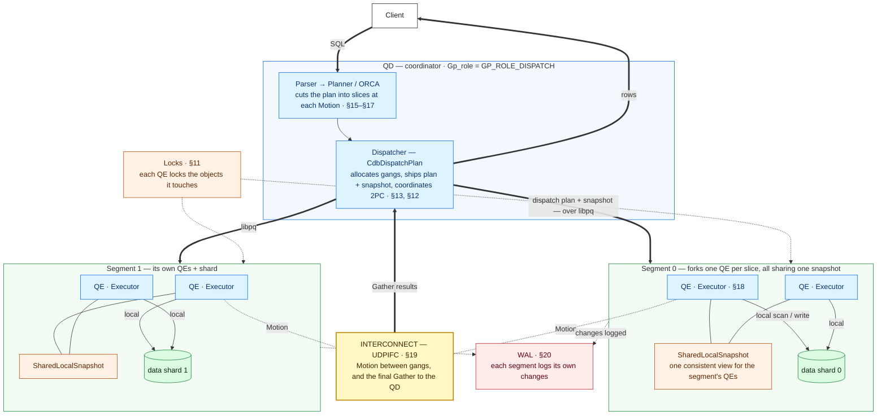
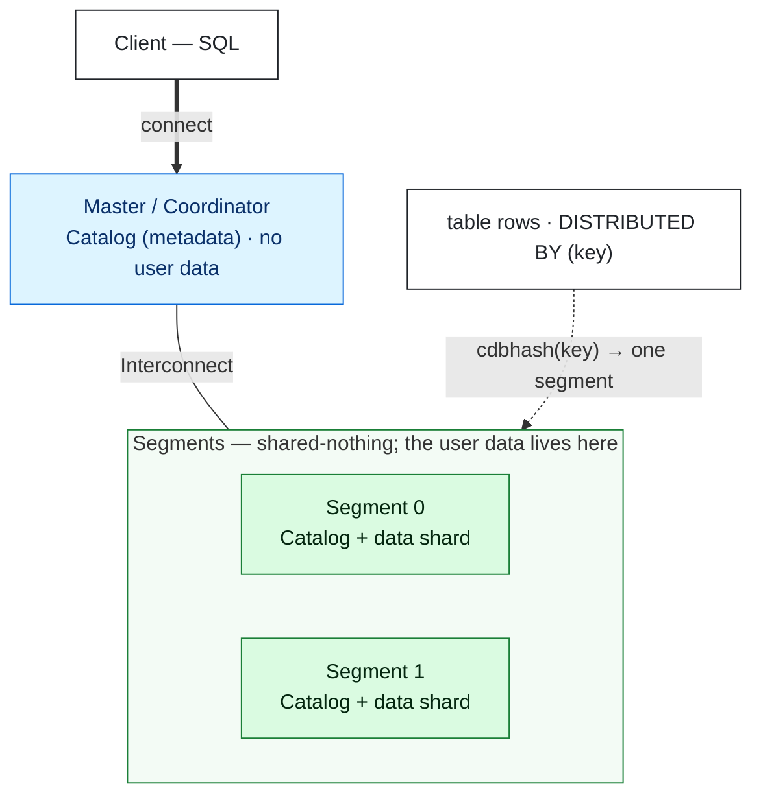
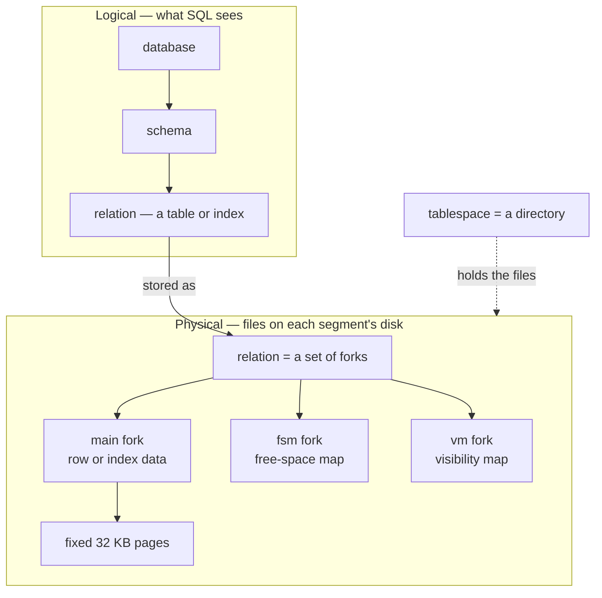
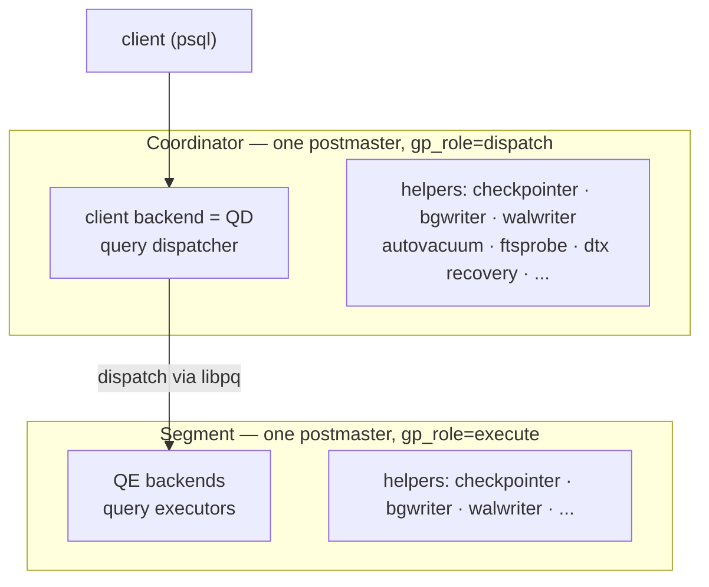
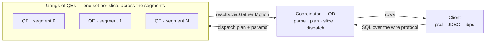
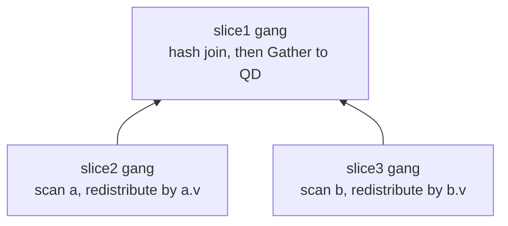

<!--
  Licensed to the Apache Software Foundation (ASF) under one
  or more contributor license agreements.  See the NOTICE file
  distributed with this work for additional information
  regarding copyright ownership.  The ASF licenses this file
  to you under the Apache License, Version 2.0 (the
  "License"); you may not use this file except in compliance
  with the License.  You may obtain a copy of the License at

    http://www.apache.org/licenses/LICENSE-2.0

  Unless required by applicable law or agreed to in writing,
  software distributed under the License is distributed on an
  "AS IS" BASIS, WITHOUT WARRANTIES OR CONDITIONS OF ANY
  KIND, either express or implied.  See the License for the
  specific language governing permissions and limitations
  under the License.
-->

import RawFigure from '../_components/RawFigure';

# 1. Introduction: The Big Picture



*How a query really runs. On the coordinator the single **QD** (`Gp_role = GP_ROLE_DISPATCH`) parses and plans the query, cutting it into **slices** at each Motion; its **Dispatcher** (`CdbDispatchPlan`) allocates **gangs** of QEs and ships the plan with the **distributed snapshot** to them over **libpq**, then coordinates the 2PC commit (§13, §12). A segment may **fork several QEs** — one per slice — which share one **SharedLocalSnapshot** so they see the same data; each **Executor** scans and writes its segment's shard *locally* (§18), takes the **locks** it needs (§11), and logs its changes to that segment's **WAL** (§20). Reaching another segment's data — and the final **Gather** to the QD — travels over the **Interconnect** (UDPIFC) as **Motion**, a path separate from the libpq dispatch (§19).*

## 1.1 The MPP Cluster: Coordinator, Segments & Distribution



*The cluster, in its simplest form. One **Master** holds the catalog (system metadata) but no user data; the **Segments** each hold the catalog *and* a shard of the user data — so the catalog is replicated everywhere, while the data is sharded. A table's rows are spread across the segments by a hash of its distribution key: `cdbhash(key)` deterministically sends each row to one segment ([§1.1](#11-the-mpp-cluster-coordinator-segments--distribution).2–[§1.1](#11-the-mpp-cluster-coordinator-segments--distribution).3). Master and Segments communicate over the Interconnect (§19).*

### 1.1.1 A shared-nothing cluster

Cloudberry is one logical database spread across many PostgreSQL processes that share *nothing* — no shared memory, no shared disk. One process is the **coordinator**: it accepts connections, parses and plans queries, dispatches work, and gathers results, but it stores **no user data**. The rest are **segments**, each a full PostgreSQL instance with its own CPU, memory, and disk, holding a slice of every distributed table and executing the plan on its slice in parallel. Scaling out means adding segments.

For availability each primary segment can have a **mirror** — a streaming-replication copy on another host ready to take over (Chapter 20). The whole cluster is described by one catalog, `gp_segment_configuration`, readable from the coordinator:

*The cluster map. `content` −1 is the coordinator; `content` 0 and up are segments. This is a demo cluster — one coordinator and three primary segments, no mirror.*

```sql
SELECT content, role, preferred_role, mode, status, port
FROM gp_segment_configuration ORDER BY content;
```

```text {3,4} title="output"
 content | role | preferred_role | mode | status | port
---------+------+----------------+------+--------+------
      -1 | p    | p              | n    | u      | 7100
       0 | p    | p              | n    | u      | 7102
       1 | p    | p              | n    | u      | 7103
       2 | p    | p              | n    | u      | 7104
(4 rows)
```

- **content** — the segment's logical id: **−1** is the coordinator, **0 … N−1** are the data segments. A primary and its mirror share one content.
- **role / preferred_role** — `p` primary or `m` mirror — current vs. the role it owns when healthy; they differ after a failover.
- **mode / status** — sync state (`s` in-sync, `n` not-replicating) and liveness (`u` up, `d` down), maintained by the fault-tolerance service (Chapter 20).

:::note

A production cluster has many segments, each with a mirror on a different host. Everything below is the same with more rows in this table — this demo has three segments, so every distributed table is sharded across `content` 0, 1, and 2.

:::

### 1.1.2 Three distribution policies

Every table carries a **distribution policy** that decides how its rows are spread across the segments. There are three, chosen at `CREATE TABLE`:

- **`DISTRIBUTED BY (cols)`** — **Hashed.** Each row's key columns are hashed to pick its segment. The default, and what you want for big tables: even spread, and joins on the key need no data movement.
- **`DISTRIBUTED REPLICATED`** — **Replicated.** A full copy of the table on *every* segment. Good for small dimension tables, so joins against them never have to redistribute.
- **`DISTRIBUTED RANDOMLY`** — **Random.** Rows go round-robin to segments with no key. Even spread, but every join on it requires a redistribution Motion (Chapter 19).

The policy is recorded per table in `gp_distribution_policy` — `policytype` is `p` (partitioned: hashed or random) or `r` (replicated); `distkey` lists the key column numbers, and is empty for random and replicated tables:

*The three policies side by side. `c1dist` hashes on column 1; the replicated copy is `r`; the random table is `p` with an empty `distkey`.*

```sql
CREATE TABLE c1dist(id int, payload text) DISTRIBUTED BY (id);
CREATE TABLE c1dist_rep(id int)            DISTRIBUTED REPLICATED;
CREATE TABLE c1dist_rand(id int)           DISTRIBUTED RANDOMLY;

SELECT localoid::regclass AS relname, policytype, distkey
FROM gp_distribution_policy
WHERE localoid IN ('c1dist'::regclass,'c1dist_rep'::regclass,'c1dist_rand'::regclass)
ORDER BY relname;
```

```text {3,4,5} title="output"
   relname   | policytype | distkey
-------------+------------+---------
 c1dist      | p          | 1
 c1dist_rep  | r          |
 c1dist_rand | p          |
(3 rows)
```

:::note

The enum behind `policytype` is `POLICYTYPE_PARTITIONED` (`p`) vs `POLICYTYPE_REPLICATED` (`r`) — `src/include/catalog/gp_distribution_policy.h:88`; the catalog row is `policytype` + `distkey` at `gp_distribution_policy.h:33`. A third value, `POLICYTYPE_ENTRY`, marks coordinator-only (entry) tables such as some catalogs.

:::

### 1.1.3 How a row finds its segment

For a hash-distributed table, the segment that owns a row is computed, not looked up. The key columns are fed through `cdbhash` to build a 32-bit hash; `cdbhashreduce` then folds that hash down to a segment number:

`row's distribution key` → `cdbhash(key) → 32-bit hash` → `cdbhashreduce → segment id` → `route to that segment`

```c title="src/backend/cdb/cdbhash.c:253"
/* cdbhashreduce: map the 32-bit hash down to one segment */
case REDUCE_LAZYMOD:
    result = (h->hash) % (h->numsegs);   /* hash mod number-of-segments */
```

Because the mapping is pure arithmetic on the key, every process — coordinator planner and all segments — agrees on where a row lives without coordination. Insert 100 000 rows and ask each segment how many it holds; on this three-segment cluster `cdbhash` spreads them roughly evenly:

*Per-segment row counts via the `gp_segment_id` system column. With three segments, `cdbhash` spreads the 100 000 rows roughly evenly across content 0, 1, and 2.*

```sql
INSERT INTO c1dist SELECT g, 'x' FROM generate_series(1,100000) g;
SELECT gp_segment_id, count(*) FROM c1dist GROUP BY gp_segment_id ORDER BY gp_segment_id;
```

```text {3} title="output"
 gp_segment_id | count
---------------+--------
             0 | 33462
             1 | 33327
             2 | 33211
(3 rows)
```

:::note

`cdbhash` lives at `src/backend/cdb/cdbhash.c:189` and `cdbhashreduce` at `:253` (with bitmask, lazy-mod, and jump-hash reducers); a keyless random table instead calls `cdbhashrandomseg` (`:291`). The hash is what lets two tables distributed on the same key be joined segment-local, with no data movement.

:::

### 1.1.4 The cluster catalogs

Three small catalogs tie the model together — the map, the per-table policy, and each process's sense of identity:

- **`gp_segment_configuration`** — the cluster map: one row per segment (and the coordinator), with role, mode, status, host, and port. A shared catalog — `src/include/catalog/gp_segment_configuration.h:44`.
- **`gp_distribution_policy`** — one row per distributed table: its `policytype` and `distkey` ([§1.1](#11-the-mpp-cluster-coordinator-segments--distribution).2) — `gp_distribution_policy.h:30`.
- **`GpIdentity` / `gp_id`** — every process knows its own `content` id. The coordinator's is `MASTER_CONTENT_ID` (−1), which is exactly how `IS_QUERY_DISPATCHER()` is defined — `src/include/cdb/cdbvars.h:765,774`. The `gp_segment_id` column we just grouped by is this identity surfaced per row.

:::note

These three answer the cluster's basic questions: **where are the segments** (gp_segment_configuration), **how is this table spread** (gp_distribution_policy), and **who am I** (GpIdentity). Everything in later chapters — planning Motions, dispatching gangs, recovering a failed segment — reads from them.

:::

## 1.2 Data Organization



*From SQL down to bytes. A database holds schemas, which hold relations; each relation is physically a set of forks (main, fsm, vm) made of fixed 32 KB pages, living in a tablespace directory. In an MPP cluster this whole physical picture exists independently on every segment ([§1.1](#11-the-mpp-cluster-coordinator-segments--distribution)).*

Before any query runs it helps to know how Cloudberry lays data out — from the database a client connects to, down to the files on a segment's disk. This section walks that path top to bottom.

### 1.2.1 Databases, schemas, and tablespaces

A running Apache Cloudberry system — a *cluster* in PostgreSQL terms — serves a set of **databases**. A client connects to exactly one; objects in other databases are not directly visible. Inside a database, **schemas** are namespaces that group tables, indexes, views, and functions (every database starts with a `public` schema and the system's `pg_catalog`). A fresh cluster carries the familiar three databases — your working `postgres` and the two `template` databases that `initdb` creates:

*The databases and tablespaces of a fresh cluster.*

```sql
SELECT datname FROM pg_database ORDER BY 1;
SELECT spcname FROM pg_tablespace ORDER BY 1;
```

```text title="output"
  datname
-----------
 postgres
 template0
 template1
(3 rows)

  spcname
------------
 pg_default
 pg_global
(2 rows)
```

Where schemas organize objects *logically*, a **tablespace** decides *where on disk* their files go: it is essentially a named directory. The two built-ins are `pg_default` (the data directory's `base/`) and `pg_global` (shared catalogs). Creating a tablespace on a faster disk and placing hot tables there is a physical-placement decision that does not change a single SQL name.

And `pg_default` or `pg_global` is the same *name* on every host, but the *directory* it resolves to is per-segment: each segment is a separate instance with its own data directory, beneath which a relation lives at the same relative path. `gp_segment_configuration` shows those roots:

*Two built-in tablespaces, and each instance's own data directory — the coordinator (content −1) and segment 0 sit under different roots, identical relative paths beneath.*

```sql
SELECT oid, spcname FROM pg_tablespace ORDER BY oid;
SELECT role, content, datadir FROM gp_segment_configuration ORDER BY content;
```

```text {9,10} title="output"
 oid  |  spcname
------+------------
 1663 | pg_default
 1664 | pg_global
(2 rows)

 role | content |                   datadir
------+---------+------------------------------------------------
 p    |      -1 | …/gpdemo/datadirs/qddir/demoDataDir-1
 p    |       0 | …/gpdemo/datadirs/dbfast1/demoDataDir0
 p    |       1 | …/gpdemo/datadirs/dbfast2/demoDataDir1
 p    |       2 | …/gpdemo/datadirs/dbfast3/demoDataDir2
(4 rows)
```

:::note

**The MPP twist.** Each of these names is cluster-wide, but the *storage* behind them is not centralized: every segment is itself a full PostgreSQL instance with its own copy of these databases, schemas, and tablespace directories, holding its own shard of the data. The coordinator coordinates; the segments store. That division is the whole of [§1.1](#11-the-mpp-cluster-coordinator-segments--distribution).

:::

### 1.2.2 Relations, files, and forks

PostgreSQL — and so Cloudberry — calls a table or index a **relation**, and a relation is *not* a single file. Each relation is identified on disk by a triple — its tablespace and database OIDs plus its own `relfilenode` (a `RelFileNumber`). That triple is the `RelFileLocator`:

```c title="src/include/storage/relfilelocator.h:57"
typedef struct RelFileLocator
{
    Oid           spcOid;     /* tablespace */
    Oid           dbOid;      /* database */
    RelFileNumber relNumber;  /* relation (the relfilenode) */
} RelFileLocator;
```

`GetRelationPath` (`src/common/relpath.c:150`) turns that triple into a path under the data directory. `pg_relation_filepath` exposes it — here, the table sits in the default tablespace (`base/`), under the database's OID, in a file named by its relfilenode:

*A relation's on-disk path: base / database-OID / relfilenode.*

```sql
SELECT pg_relation_filepath('c1org');
```

```text {3} title="output"
 pg_relation_filepath
----------------------
 base/5/16479
(1 row)
```

But that one file is only the relation's **main fork**. A relation is stored as several *forks* — separate files that share the relfilenode and differ only by suffix. Their names come from a fixed table, `forkNames[]` (`src/common/relpath.c:34`), indexed by the `ForkNumber` enum (`src/include/common/relpath.h:55`):

*The forks of a relation. The main fork has no suffix; the others append _fsm / _vm / _init.*

- `main` — the actual row or index data
- `fsm` — free-space map — which pages have room
- `vm` — visibility map — all-visible / all-frozen bits
- `init` — empty template for unlogged relations

The data lives on the segments, so to *see* the fork files we look on a segment. After loading and vacuuming `c1org`, segment 0 holds three files for it — the main fork plus the free-space and visibility maps:

*Segment 0 (utility mode): the three fork files for relfilenode 16479 — main, _fsm, _vm.*

```sql
PGOPTIONS='-c gp_role=utility' psql -p 7102 -d postgres

SELECT d AS file, pg_size_pretty((pg_stat_file('base/5/'||d)).size) AS size
FROM pg_ls_dir('base/5') d
WHERE d = '16479' OR d LIKE '16479\_%'
ORDER BY 1;
```

```text {4,5} title="output"
   file    |  size
-----------+---------
 16479     | 4608 kB
 16479_fsm | 96 kB
 16479_vm  | 32 kB
(3 rows)
```

:::note

The relfilenode is not fixed forever: operations that rewrite a table (`VACUUM FULL`, `CLUSTER`, some `ALTER TABLE`) give it a new relfilenode and hence new files, which is how those commands can roll back cleanly.

:::

### 1.2.3 Pages and TOAST

Within the main fork, data is not a byte stream but a sequence of fixed-size **pages** (also called blocks) — the unit of every disk read and buffer-cache slot (§3). PostgreSQL defaults to 8 KB; Cloudberry raises it to **32 KB** to favour the large sequential scans typical of analytics:

```c title="src/include/pg_config.h:32"
#define BLCKSZ 32768   /* 32 KB pages (PostgreSQL default is 8192) */
```

A row must fit on a single page — yet columns can hold megabytes. The escape hatch is **TOAST** (The Oversized-Attribute Storage Technique): when a row would exceed roughly a quarter of a page (`TOAST_TUPLE_THRESHOLD`, derived from `TOAST_TUPLES_PER_PAGE = 4`, `src/include/access/heaptoast.h:47`), oversized fields are compressed and, if still large, pushed out-of-line into a companion **TOAST table** (`pg_toast.pg_toast_<oid>`), leaving only a small pointer in the row. It is automatic and invisible to SQL:

*A 90 000-character value is compressed and offloaded to a TOAST table — stored in ~1 KB, not 90 KB.*

```sql
CREATE TABLE c1org_toast(id int, doc text) DISTRIBUTED BY (id);
INSERT INTO c1org_toast VALUES (1, repeat('Apache Cloudberry ', 5000));

SELECT reltoastrelid::regclass AS toast_table
  FROM pg_class WHERE relname = 'c1org_toast';

SELECT length(doc) AS logical_chars, pg_column_size(doc) AS stored_bytes
  FROM c1org_toast WHERE id = 1;
```

```text {10} title="output"
CREATE TABLE
INSERT 0 1
       toast_table
-------------------------
 pg_toast.pg_toast_17244
(1 row)

 logical_chars | stored_bytes
---------------+--------------
         90000 |         1060
(1 row)
```

:::note

The 90 000-character document occupies just **1060 bytes** in the row's storage: highly compressible text collapses, and what remains lives in the TOAST table. This is why a `text` or `jsonb` column can be effectively unbounded while pages stay a fixed 32 KB.

:::

## 1.3 Processes and Memory



*The process model. One postmaster per node forks everything below it. On the coordinator a client backend becomes the QD (query dispatcher); it dispatches over libpq to QE (query executor) backends, which the segment's own postmaster forks. Each node also runs its own set of helper processes.*

### 1.3.1 The postmaster and the process tree

Like PostgreSQL, Cloudberry is a process-per-connection system: a single **postmaster** per node listens for connections and *forks* a child for every client and every helper. It never touches data itself — it is purely a supervisor. What is new in Cloudberry is that there are **many** postmasters: one on the coordinator and one on every segment, each supervising its own tree. `ps` on this demo cluster shows the coordinator's (port 7100) tree:

*The coordinator postmaster (PID 16983) and a sample of the processes it has forked. Note ftsprobe process and dtx recovery process — these two run only on the coordinator.*

```sql
ps -eo pid,ppid,cmd | grep '[p]ostgres:.*7100'
```

```text {6,7} title="output"
16983  ... postgres -D .../qddir/demoDataDir-1 -p 7100 -c gp_role=dispatch
16990 16983 postgres:  7100, checkpointer
16991 16983 postgres:  7100, background writer
16993 16983 postgres:  7100, walwriter
16994 16983 postgres:  7100, autovacuum launcher
16996 16983 postgres:  7100, dtx recovery process
16997 16983 postgres:  7100, ftsprobe process
17006 16983 postgres:  7100, sweeper process
5014 16983 postgres:  7100, gpadmin postgres [local] con382 cmd3 INSERT
```

Every process but the last is a shared helper ([§1.3](#13-processes-and-memory).3); the last is a client backend serving a session — and on the coordinator that backend has a second job, described next.

### 1.3.2 QD and QE backends

A client connects only to the coordinator. The backend that serves it is the **query dispatcher (QD)**: it plans the query, then opens libpq connections to the segments and asks each segment's postmaster to fork a **query executor (QE)** to run its slice of the plan. A coordinated set of QEs is a *gang* ([§1.4](#14-clients-the-wire-protocol--dispatch), and in depth in Chapter 19). The QD and its QEs share one **session id** (`con<N>`), which is the thread that lets you follow a single statement across the cluster:

*The same session con382 running an INSERT: the QD on the coordinator (port 7100) and its QEs on segments 0, 1, and 2 (ports 7102/7103/7104), which each segment postmaster forked to run the dispatched work (MPPEXEC).*

```sql
ps -eo pid,ppid,cmd | grep 'con382'
```

```text {1,2,3,4} title="output"
5014 16983 postgres:  7100, gpadmin postgres [local] con382 cmd3 INSERT
5016 16931 postgres:  7102, gpadmin postgres 10.100.0.3 con382 seg0 cmd4 MPPEXEC INSERT
5017 16936 postgres:  7103, gpadmin postgres 10.100.0.3 con382 seg1 cmd4 MPPEXEC INSERT
5018 16939 postgres:  7104, gpadmin postgres 10.100.0.3 con382 seg2 cmd4 MPPEXEC INSERT
```

PID 5014 (parent 16983, the coordinator postmaster) is the QD; PIDs 5016, 5017, and 5018 (parents 16931, 16936, 16939 — the *segment* postmasters) are its QEs. The QD did not fork the QEs — it asked each segment's postmaster to, then drove them over the interconnect. This split is the whole reason a Cloudberry backend is more than a PostgreSQL backend.

:::note

In `pg_stat_activity` on the coordinator a QD shows `gp_segment_id = -1`; the QEs live in each segment's own view. Because data is sharded, a QD reads almost no table data itself — it dispatches, gathers, and returns.

:::

### 1.3.3 Background workers

The helper processes split in two. The **inherited PostgreSQL set** — `checkpointer`, `background writer` ([§3.5](../part-2-storage-data-layout/ch03.md#35-background-writer--checkpointer)), `walwriter`, the `autovacuum launcher` — runs on *every* node, coordinator and segments alike. On top of those, the postmaster starts a fixed table of **Cloudberry-specific auxiliary workers**, `PMAuxProcList`:

```c title="src/backend/postmaster/postmaster.c:410"
static BackgroundWorker PMAuxProcList[MaxPMAuxProc] =
{
#ifdef USE_INTERNAL_FTS
    {"ftsprobe process", ..., "FtsProbeMain", ..., FtsProbeStartRule},
#endif
    {"global deadlock detector process", ..., "GlobalDeadLockDetectorMain", ...},
    {"dtx recovery process", ..., "DtxRecoveryMain", ..., DtxRecoveryStartRule},
    {"sweeper process", ...},
    ...
};
```

Each entry carries a **start rule** that decides where it runs. `FtsProbeStartRule` (`src/backend/fts/fts.c:109`) and `DtxRecoveryStartRule` (`src/backend/cdb/cdbdtxrecovery.c:622`) both return true only under `GP_ROLE_DISPATCH`, which is why [§1.3](#13-processes-and-memory).1 found `ftsprobe` and `dtx recovery` on the coordinator and not on the segment. FTS is the cluster fault detector (Chapter 20); DTX recovery finishes in-doubt distributed transactions after a crash.

`pg_stat_activity` reports the backend type of everything currently attached on a node:

*Backend types on the coordinator (the segments run their own near-identical set, minus the coordinator-only workers).*

```sql
SELECT backend_type, count(*) FROM pg_stat_activity GROUP BY 1 ORDER BY 1;
```

```text {7} title="output"
         backend_type         | count
------------------------------+-------
 autovacuum launcher          |     1
 background writer            |     1
 checkpointer                 |     1
 client backend               |     1
 dtx recovery process       |     1
 logical replication launcher |     1
 login monitor                |     1
 walwriter                    |     1
```

:::note

The classic helpers each have a `*Main` entry point reached through the postmaster's `StartChildProcess` macros (`src/backend/postmaster/postmaster.c:685`): `BackgroundWriterMain` (`bgwriter.c:92`), `CheckpointerMain` (`checkpointer.c:183`), `WalWriterMain` (`walwriter.c:91`). The Cloudberry workers in `PMAuxProcList` are launched as background workers instead.

:::

### 1.3.4 Shared versus private memory

Each postmaster carves out one region of **shared memory** at startup, visible to all the backends it forks. Its largest tenant is the buffer cache (`shared_buffers`, Chapter 3); it also holds the lock tables, the WAL buffers, the process array, and the cluster-wide DTX state. On this cluster each node's share is:

*Each node sizes its own shared memory independently.*

```sql
SHOW shared_buffers;
```

```text {3} title="output"
 shared_buffers
----------------
 125MB
```

Everything else a backend needs is **private** to that process: the memory-context heaps it allocates in, and the per-operation work areas bounded by `work_mem` (sorts, hashes) and `maintenance_work_mem`. A sort spilling to disk spends *one backend's* `work_mem`, not shared memory — so on an N-segment cluster a single query can use up to N × `work_mem` across the cluster at once.

:::note

**The MPP consequence:** there is no one shared-memory region for the cluster — there are N+1 of them, one per postmaster, each sized by the same GUCs but allocated and accounted separately. That is the same per-node independence we saw for the buffer cache in [§3.1](../part-2-storage-data-layout/ch03.md#31-caching--buffer-cache-design).2, now seen one level up.

:::

## 1.4 Clients, the Wire Protocol & Dispatch



*From a client's SQL to distributed work. The client speaks the ordinary PostgreSQL wire protocol to the coordinator; the coordinator (QD) plans, slices, and dispatches the plan to gangs of query executors (QEs) on the segments, which run their slice and stream results back up through Gather Motion.*

### 1.4.1 The client and the wire protocol

A client — `psql`, a JDBC/ODBC driver, anything built on `libpq` — connects to the **coordinator** and speaks PostgreSQL's unchanged frontend/backend protocol. Cloudberry inherits this verbatim at the client edge; what is special happens only *after* the coordinator has a plan. The protocol comes in two flavours:

- **Simple Query** — One `Query` message carries the SQL text; the backend parses, plans, and executes it in a single round trip. What `psql` sends for an ordinary typed statement.
- **Extended Query** — `Parse` → `Bind` → `Execute` as separate steps, so a statement is planned once and then run many times with different bound parameters (prepared statements, most drivers). Separates planning from parameter values.

Both are covered in depth in [§13.1](../part-4-query-processing/ch13.md#131-the-simple-query-protocol)–[§13.2](../part-4-query-processing/ch13.md#132-the-extended-query-protocol); here we only need the handoff point: the coordinator ends up holding a finished plan, and now must turn it into work spread across the cluster.

### 1.4.2 The QD→QE dispatch model

The coordinator does not run the plan by itself. It becomes the **query dispatcher (QD)** and ships the plan to **query executors (QEs)** — ordinary backend processes spawned on each segment. The coordinator runs in role `GP_ROLE_DISPATCH`; each segment backend runs in `GP_ROLE_EXECUTE` (`src/include/cdb/cdbvars.h:68`):

```c title="src/include/cdb/cdbvars.h:68"
GP_ROLE_UTILITY,    /* a plain, single-node database engine */
GP_ROLE_DISPATCH,   /* the coordinator: parallel query dispatcher (QD) */
GP_ROLE_EXECUTE,    /* a segment backend: parallel query executor (QE) */
```

Dispatch is driven by `CdbDispatchPlan` (`src/backend/cdb/dispatcher/cdbdisp_query.c:184`) → `cdbdisp_dispatchX` (`cdbdisp_query.c:127`) → `cdbdisp_dispatchToGang`: the serialized plan and parameters are sent to the segments, which execute and stream tuples back. You can see the division of labour in any distributed plan — a `Gather Motion` marks the boundary where segment work funnels up to the coordinator:

`CdbDispatchPlan` → `cdbdisp_dispatchX` → `cdbdisp_dispatchToGang` → `QEs execute the slice`

*A trivial `count(*)`: the segments do the Seq Scan and a Partial Aggregate; the coordinator does the Finalize Aggregate. Gather Motion is the seam between QE work (below) and QD work (above).*

```sql
CREATE TABLE c1disp(id int, v int) DISTRIBUTED BY (id);
INSERT INTO c1disp SELECT g, g % 100 FROM generate_series(1,100000) g;

EXPLAIN (costs off) SELECT count(*) FROM c1disp;
```

```text {2} title="output"
 Finalize Aggregate
   ->  Gather Motion 3:1  (slice1; segments: 3)
         ->  Partial Aggregate
               ->  Seq Scan on c1disp
 Optimizer: GPORCA
```

:::note

This demo cluster has three segments, so the scan runs on all three at once and the Gather Motion reads **3:1**. On an N-segment cluster the same scan runs on all N segments and the Gather Motion reads **N:1**.

:::

### 1.4.3 Gangs and slices at a glance

The plan is cut into **slices** at every Motion, and the coordinator assigns a **gang** — a set of QEs, one on each segment — to run each slice (gang allocation: `AllocateGang`, `src/backend/cdb/dispatcher/cdbgang.c:107`; a slice's gang type, e.g. `GANGTYPE_PRIMARY_WRITER`, lives in `src/include/nodes/plannodes.h:237`). A query that must repartition data shows several slices — here a join on the non-distribution column `v` splits into three:

*A join on the non-distribution key: slice2 and slice3 each scan one side and redistribute it by the join key; slice1 performs the join and gathers to the coordinator. Each slice is run by its own gang.*

```sql
EXPLAIN (costs off)
SELECT count(*) FROM c1disp a JOIN c1disp b ON a.v = b.v;
```

```text {6,10} title="output"
 Finalize Aggregate
   ->  Gather Motion 3:1  (slice1; segments: 3)
         ->  Partial Aggregate
               ->  Hash Join
                     Hash Cond: (a.v = b.v)
                     ->  Redistribute Motion 3:3  (slice2; segments: 3)
                           Hash Key: a.v
                           ->  Seq Scan on c1disp a
                     ->  Hash
                           ->  Redistribute Motion 3:3  (slice3; segments: 3)
                                 Hash Key: b.v
                                 ->  Seq Scan on c1disp b
 Optimizer: GPORCA
```



*The three slices of the join above as three gangs. The two redistribute slices feed the join slice, which gathers to the coordinator.*

:::note

This is the orientation-level view. How the dispatcher serializes and ships the plan is [§13.3](../part-4-query-processing/ch13.md#133-dispatch-from-coordinator-plan-to-segment-execution); how Motion actually moves tuples between gangs (Gather, Redistribute, Broadcast) over the interconnect is Chapter 19.

:::

## 1.5 The Major Modules — a Map

<RawFigure html={"<div class=\"bricks\"> <div class=\"bk-band bk-q\"><div class=\"bk-lbl\"><b>Query processing</b><span>Part III</span></div><div class=\"bk-row\"> <a class=\"bk\" href=\"#ch13\"><span class=\"bk-t2\">Dispatcher &amp; gangs</span><span class=\"bk-ch\">§13</span></a> <a class=\"bk\" href=\"#ch14\"><span class=\"bk-t2\">Statistics</span><span class=\"bk-ch\">§14</span></a> <a class=\"bk\" href=\"#ch15\"><span class=\"bk-t2\">Postgres planner</span><span class=\"bk-ch\">§15</span></a> <a class=\"bk\" href=\"#ch16\"><span class=\"bk-t2\">Distributed planning</span><span class=\"bk-ch\">§16</span></a> <a class=\"bk\" href=\"#ch17\"><span class=\"bk-t2\">ORCA optimizer</span><span class=\"bk-ch\">§17</span></a> <a class=\"bk\" href=\"#ch18\"><span class=\"bk-t2\">Executor</span><span class=\"bk-ch\">§18</span></a> <a class=\"bk\" href=\"#ch19\"><span class=\"bk-t2\">Motion &amp; interconnect</span><span class=\"bk-ch\">§19</span></a> </div></div> <div class=\"bk-band bk-s\"><div class=\"bk-lbl\"><b>Storage &amp; data</b><span>Part I</span></div><div class=\"bk-row\"> <a class=\"bk\" href=\"#ch4\"><span class=\"bk-t2\">Heap — row store</span><span class=\"bk-ch\">§4</span></a> <a class=\"bk\" href=\"#ch5\"><span class=\"bk-t2\">AO / AOCS</span><span class=\"bk-ch\">§5</span></a> <a class=\"bk\" href=\"#ch6\"><span class=\"bk-t2\">PAX columnar</span><span class=\"bk-ch\">§6</span></a> <a class=\"bk\" href=\"#ch7\"><span class=\"bk-t2\">Indexes</span><span class=\"bk-ch\">§7</span></a> <a class=\"bk\" href=\"#ch3\"><span class=\"bk-t2\">Buffer cache</span><span class=\"bk-ch\">§3</span></a> <a class=\"bk\" href=\"#ch2\"><span class=\"bk-t2\">Storage mgr — smgr / VFD</span><span class=\"bk-ch\">§2</span></a> <a class=\"bk\" href=\"#ch8\"><span class=\"bk-t2\">Catalog</span><span class=\"bk-ch\">§8</span></a> </div></div> <div class=\"bk-band bk-t\"><div class=\"bk-lbl\"><b>Transactions</b><span>Part II</span></div><div class=\"bk-row\"> <a class=\"bk\" href=\"#ch9\"><span class=\"bk-t2\">Transactions</span><span class=\"bk-ch\">§9</span></a> <a class=\"bk\" href=\"#ch10\"><span class=\"bk-t2\">MVCC &amp; snapshots</span><span class=\"bk-ch\">§10</span></a> <a class=\"bk\" href=\"#ch11\"><span class=\"bk-t2\">Locks &amp; GDD</span><span class=\"bk-ch\">§11</span></a> <a class=\"bk\" href=\"#ch12\"><span class=\"bk-t2\">Distributed 2PC</span><span class=\"bk-ch\">§12</span></a> </div></div> <div class=\"bk-band bk-h\"><div class=\"bk-lbl\"><b>High availability</b><span>Part IV</span></div><div class=\"bk-row\"> <a class=\"bk\" href=\"#ch20\"><span class=\"bk-t2\">WAL</span><span class=\"bk-ch\">§20</span></a> <a class=\"bk\" href=\"#ch20\"><span class=\"bk-t2\">Replication</span><span class=\"bk-ch\">§20</span></a> <a class=\"bk\" href=\"#ch20\"><span class=\"bk-t2\">Recovery</span><span class=\"bk-ch\">§20</span></a> <a class=\"bk\" href=\"#ch20\"><span class=\"bk-t2\">FTS fault detector</span><span class=\"bk-ch\">§20</span></a> </div></div> <div class=\"bk-band bk-r\"><div class=\"bk-lbl\"><b>Resource mgmt</b><span>Part V</span></div><div class=\"bk-row\"> <a class=\"bk\" href=\"#ch21\"><span class=\"bk-t2\">Resource groups — CPU / mem / I/O</span><span class=\"bk-ch\">§21</span></a> </div></div> </div>"} caption={"The engine as stacked layers — read top-to-bottom: a query is processed, then served from storage; transactions, high availability, and resource groups are the foundation it all rests on. The catalog and statistics feed the optimizer throughout. Every brick links to its chapter."} />

### 1.5.1 Reading the map

From here on, the book is this one engine seen a layer at a time. A statement enters the **dispatcher** on the coordinator, is turned into a plan by the **Postgres planner** (or **ORCA**) using the **catalog** and **statistics**, and is run by the **executor** — which drives **Motion** to move tuples between segments and the **access methods** to read and write rows within a segment. The access methods sit on the **buffer cache**, which sits on the **storage manager**, which reaches each segment's local disk.

Cutting across that pipeline are three concerns the map draws as side layers. **Transactions, MVCC, and locks** (§9–§11) keep concurrent execution correct, and **distributed transactions** (§12) extend commit across the segments. **High availability** (§20) turns every buffered change into WAL that feeds replication, recovery, and the mirrors, while FTS watches for failure. And **resource groups** (§21) decide which queries are admitted and how much CPU and memory they may use. Three dependencies recur throughout: the optimizer cannot plan without the **catalog** (§8) and **statistics** (§14); the executor drives **both** Motion (§19, across segments) and the access methods (§4–§7, within a segment); and every change reaches durability only through the **buffer cache** into the **WAL** (§20).

### 1.5.2 Module-to-chapter guide

*Where each module is covered — the chapters can be read in order, or jumped to from the map above.*

| Layer | Module | Ch. |
| --- | --- | --- |
| Storage & data | Data files & the storage manager (smgr, VFD) | [2](../part-2-storage-data-layout/ch02.md) |
|  | Buffer cache | [3](../part-2-storage-data-layout/ch03.md) |
|  | Heap — the row store | [4](../part-2-storage-data-layout/ch04.md) |
|  | Append-optimized tables (AO / AOCS) | [5](../part-2-storage-data-layout/ch05.md) |
|  | PAX — native columnar | [6](../part-2-storage-data-layout/ch06.md) |
|  | Indexes (B-tree … BRIN, Bitmap) | [7](../part-2-storage-data-layout/ch07.md) |
|  | The system catalog | [8](../part-2-storage-data-layout/ch08.md) |
| Transactions | Transactions & isolation | [9](../part-3-transactions-mvcc-concurrency/ch09.md) |
|  | MVCC, snapshots & vacuum | [10](../part-3-transactions-mvcc-concurrency/ch10.md) |
|  | Locks & the global deadlock detector | [11](../part-3-transactions-mvcc-concurrency/ch11.md) |
|  | Distributed transactions & 2PC | [12](../part-3-transactions-mvcc-concurrency/ch12.md) |
| Query processing | Query processing stages | [13](../part-4-query-processing/ch13.md) |
|  | Statistics & selectivity | [14](../part-4-query-processing/ch14.md) |
|  | The Postgres planner | [15](../part-4-query-processing/ch15.md) |
|  | Distributed planning | [16](../part-4-query-processing/ch16.md) |
|  | ORCA — the Cascades optimizer | [17](../part-4-query-processing/ch17.md) |
|  | The executor | [18](../part-4-query-processing/ch18.md) |
|  | Motion & the interconnect | [19](../part-4-query-processing/ch19.md) |
| Availability | High availability & recovery (WAL, replication, FTS) | [20](../part-5-high-availability-recovery/ch20.md) |
| Resources | Resource management | [21](../part-6-resource-management/ch21.md) |

