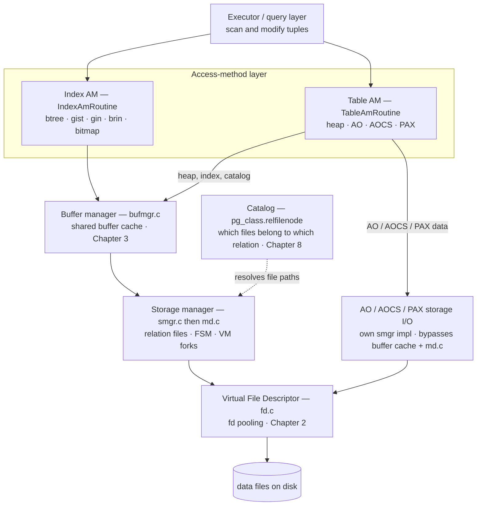
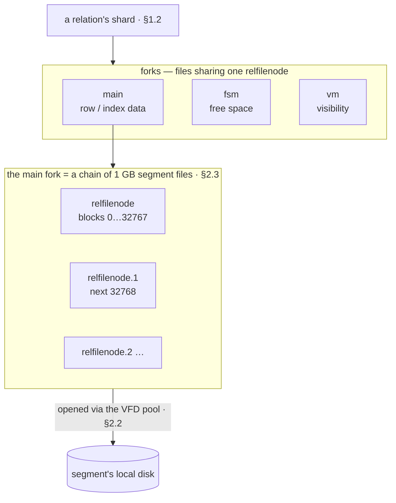
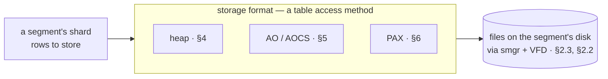
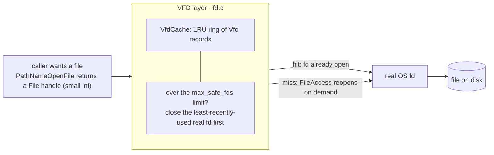
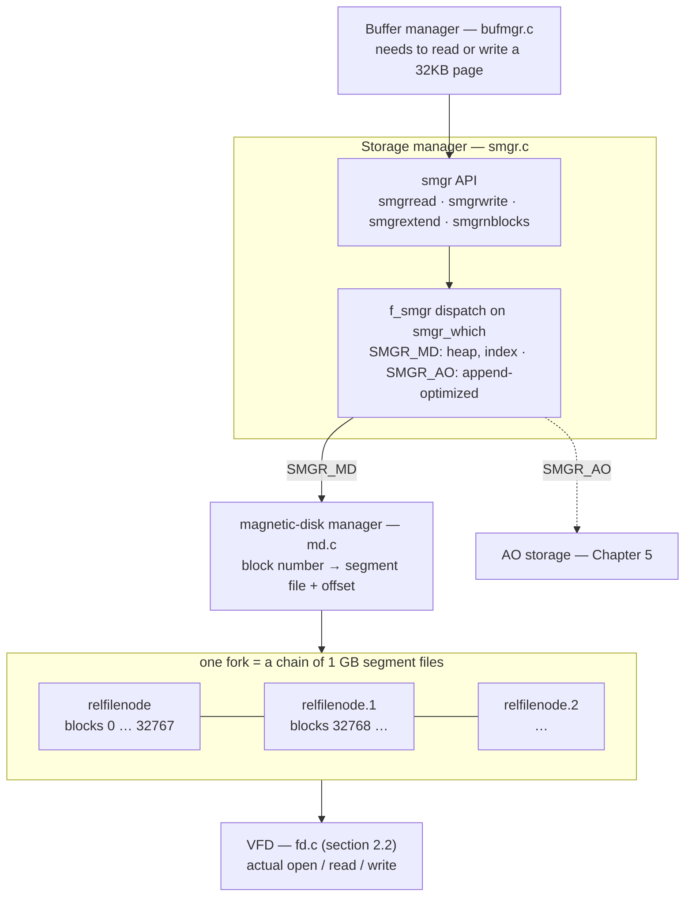

<!--
  Licensed to the Apache Software Foundation (ASF) under one
  or more contributor license agreements.  See the NOTICE file
  distributed with this work for additional information
  regarding copyright ownership.  The ASF licenses this file
  to you under the Apache License, Version 2.0 (the
  "License"); you may not use this file except in compliance
  with the License.  You may obtain a copy of the License at

    http://www.apache.org/licenses/LICENSE-2.0

  Unless required by applicable law or agreed to in writing,
  software distributed under the License is distributed on an
  "AS IS" BASIS, WITHOUT WARRANTIES OR CONDITIONS OF ANY
  KIND, either express or implied.  See the License for the
  specific language governing permissions and limitations
  under the License.
-->

# 2. Data Files & the Storage Manager

*Everything* Cloudberry stores — every heap tuple, index entry, append-optimized block, and PAX micro-partition — ends its journey as bytes in files on a segment's local disk. This part follows that journey from the top down.

The **access-method layer** (Chapters 4–7) fixes each relation's *on-disk shape* and answers the executor's tuple requests. Beneath it run two I/O paths. The **buffer manager** (Chapter 3) caches fixed-size 32 KB pages in shared memory for the *buffered* engines — heap, indexes, and the catalog tables — while the **append-optimized and PAX engines do their own block I/O**, bypassing shared buffers. Both paths funnel through the **storage manager** (`smgr`/`md.c`) and the **virtual file descriptor** layer (Chapter 2), which turn page and block requests into real file reads and writes. The **catalog** (Chapter 8) is the map that says which files belong to which relation.



*The storage layer, top to bottom. The executor reaches data through the table- and index-access-method APIs; buffered engines (heap, indexes, catalog) go via the buffer manager and storage manager, while AO/AOCS/PAX use their own storage-manager implementation, bypassing the buffer cache and md.c block-mapping — both paths still converge at the VFD layer and the files on disk.*



*Chapter 2 as the on-disk artifact. A relation is not one file: it is a set of forks (main data, plus the free-space and visibility maps), and the main fork is itself a chain of 1 GB segment files. The storage manager ([§2.3](#23-storage-manager-smgr--mdc)) maps a block to the right segment file; the VFD pool ([§2.2](#22-virtual-file-descriptor-vfd)) opens it.*

## 2.1 Data Sharding & Storage Formats



*What this section adds on top of [§1.1](../part-1-introduction/ch01.md#11-the-mpp-cluster-coordinator-segments--distribution): a segment's shard is laid out in one of several storage formats, and every format ends as files. Heap and indexes are buffered (Chapter 3); AO/AOCS and PAX do their own block I/O — but all of them reach disk through the storage manager and VFD ([§2.3](#23-storage-manager-smgr--mdc), [§2.2](#22-virtual-file-descriptor-vfd)).*

Chapter 1 introduced the cluster as a coordinator plus segments. This chapter follows a table's data the rest of the way down — into files on a segment's disk — and the machinery that puts it there: the **storage manager** ([§2.3](#23-storage-manager-smgr--mdc)) and the **virtual file descriptor** layer ([§2.2](#22-virtual-file-descriptor-vfd)). Before either, two facts shape what each segment stores: *how a table is split across segments* — covered in [§1.1](../part-1-introduction/ch01.md#11-the-mpp-cluster-coordinator-segments--distribution) — and *in which format each shard is laid out*, which is where this section begins.

### 2.1.1 From a logical table to per-segment shards

[§1.1](../part-1-introduction/ch01.md#11-the-mpp-cluster-coordinator-segments--distribution) showed how a row is routed to a segment by hashing its distribution key. Here we pick up where those bytes land: each segment holds its slice of the table — its **shard** — as an ordinary on-disk relation with its own files, while the coordinator stores only the catalog, none of the data.

So a shard is a real relation you can measure. `pg_relation_size`, fanned out to the segments with `gp_dist_random`, reports each shard's own file size — on the coordinator it is empty:

*A shard occupies real files on its segment; the coordinator stores no table data.*

```sql
CREATE TABLE c2shard(id int, v text) DISTRIBUTED BY (id);
INSERT INTO c2shard SELECT g, repeat('x',50) FROM generate_series(1,100000) g;

SELECT gp_segment_id, pg_size_pretty(pg_relation_size('c2shard')) AS shard_size
FROM gp_dist_random('gp_id');
```

```text {5} title="output"
CREATE TABLE
INSERT 0 100000
 gp_segment_id | shard_size
---------------+------------
             0 | 8256 kB
(1 row)
```

### 2.1.2 Storage formats: heap, AO, AOCS, PAX

A shard's rows still have to be laid out in a file *somehow*, and Cloudberry offers several formats for different workloads. The format is a **table access method**: chosen at `CREATE TABLE` with `USING` (or the legacy `WITH (appendonly=…, orientation=…)`), recorded in `pg_class.relam` (`src/include/catalog/pg_class.h:53`), and resolved through `pg_am`. This cluster exposes three:

*The table access methods registered in `pg_am` — each is a `TableAmRoutine` of callbacks.*

```sql
SELECT amname, amhandler FROM pg_am WHERE amtype = 't' ORDER BY amname;
```

```text {3,4,5} title="output"
  amname   |         amhandler
-----------+---------------------------
 ao_column | ao_column_tableam_handler
 ao_row    | ao_row_tableam_handler
 heap      | heap_tableam_handler
(3 rows)
```

Creating a table with each `USING` clause and reading `relam` back confirms the binding:

*`relam` records which format each table uses; the default is heap.*

```sql
CREATE TABLE c2shard    (id int);                 -- default
CREATE TABLE c2shard_ao (id int) USING ao_row;     -- append-optimized row
CREATE TABLE c2shard_co (id int) USING ao_column;  -- append-optimized column

SELECT c.relname, a.amname AS storage_format
FROM pg_class c JOIN pg_am a ON a.oid = c.relam
WHERE c.relname LIKE 'c2shard%' ORDER BY 1;
```

```text title="output"
  relname   | storage_format
------------+----------------
 c2shard    | heap
 c2shard_ao | ao_row
 c2shard_co | ao_column
(3 rows)
```

Each format suits a different access pattern, and each has its own chapter:

- **heap** — The PostgreSQL **row store** — every column of a row together on a page, updated and read in place. Best for point access and frequent updates. Handler `heapam_methods` (`src/backend/access/heap/heapam_handler.c:2635`). **Chapter 4.**
- **ao_row (AO)** — **Append-optimized row** storage — compact, bulk-appended, no per-row MVCC header; built for write-once, scan-many OLAP. Handler `ao_row_tableam_handler` (`src/backend/access/appendonly/appendonlyam_handler.c:2370`). **Chapter 5.**
- **ao_column (AOCS)** — Append-optimized **column** storage — each column in its own file, so a scan reads only the columns it needs. Handler `ao_column_tableam_handler` (`src/backend/access/aocs/aocsam_handler.c:2678`). **Chapter 5.**
- **PAX** — Cloudberry's **native columnar** engine (ORC-like micro-partitions with min/max + Bloom skip-scan). A contrib access method — not built into this demo cluster, so it is absent from `pg_am` above. **Chapter 6.**

:::note

Whichever format a shard uses, its bytes still become **files**, and reaching those files is the same for all of them: a request goes through the **storage manager** ([§2.3](#23-storage-manager-smgr--mdc)) and is satisfied by the **virtual file descriptor** pool ([§2.2](#22-virtual-file-descriptor-vfd)). Those two layers are the rest of this chapter; the buffered ones (heap, indexes) additionally pass through the buffer cache of [§3.1](./ch03.md#31-caching--buffer-cache-design).2.

:::

## 2.2 Virtual File Descriptor (VFD)



*The VFD layer hands callers a stable File handle backed by a pooled, reopenable OS file descriptor. A backend may hold thousands of open Files; only up to max_safe_fds real descriptors exist at once, the least-recently-used being closed and transparently reopened on the next access.*

### 2.2.1 The problem: more files than the OS will allow open

An operating system caps how many file descriptors a single process may hold open at once. A Cloudberry segment routinely needs far more *logical* open files than that cap: every heap and index segment file, and especially the many per-column and per-segment files of AO/AOCS and PAX tables, may be in use concurrently. If each `open()` consumed a real descriptor for its whole lifetime, a busy segment would hit `EMFILE` (too many open files) and fail.

The kernel limit is generous on this host — `ulimit -n` reports over a million — but Cloudberry deliberately does **not** trust or consume all of it. It probes how many descriptors are actually usable and keeps its own ceiling, `max_safe_fds`, leaving headroom for the rest of the backend:

*The per-process file budget. `max_files_per_process` is the configured ceiling; the OS hard limit is far higher, but Cloudberry caps itself well below it.*

```sql
SHOW max_files_per_process;
```

```text {3} title="output"
 max_files_per_process
-----------------------
 1000
(1 row)
```

At startup `set_max_safe_fds` (`src/backend/storage/file/fd.c:1093`) calls `count_usable_fds` to actually open descriptors until it cannot, then sets the working ceiling, reserving a few for emergencies:

```c title="src/backend/storage/file/fd.c:1109"
max_safe_fds = Min(usable_fds, max_files_per_process - already_open);
...
max_safe_fds -= NUM_RESERVED_FDS;      /* NUM_RESERVED_FDS = 10 */
```

:::note

So the effective limit is the smaller of what the OS will really give and the `max_files_per_process` GUC (default **1000**), minus a 10-descriptor reserve (`NUM_RESERVED_FDS`, `fd.c:133`). The job of the VFD layer is to let callers behave as if they had unlimited open files while never exceeding this number of *real* ones.

:::

### 2.2.2 The VFD pool: an LRU ring of reopenable descriptors

Instead of a raw OS descriptor, callers receive a `File` — a small integer index into `VfdCache` (`fd.c:222`), an array of *virtual file descriptor* records. Each `Vfd` remembers everything needed to reopen the file on demand, and is linked into a doubly-linked **LRU ring** by recency of use:

```c title="src/backend/storage/file/fd.c:202"
typedef struct vfd
{
    int            fd;               /* current real FD, or VFD_CLOSED if none */
    unsigned short fdstate;          /* state bitflags */
    ResourceOwner  resowner;         /* owner, for automatic cleanup */
    File           nextFree;         /* freelist link */
    File           lruMoreRecently;  /* doubly linked recency-of-use ring */
    File           lruLessRecently;
    off_t          fileSize;
    char          *fileName;         /* remembered so the file can be reopened */
    int            fileFlags;        /* open(2) flags for reopening */
    mode_t         fileMode;
} Vfd;
```

*A Vfd record: a logical File that may or may not currently hold a real OS fd.*

- `fd` — real OS descriptor, or VFD_CLOSED
- `fileName · fileFlags · fileMode` — enough to reopen() transparently
- `lruMoreRecently / lruLessRecently` — position in the LRU ring
- `fdstate` — flags (e.g. delete-on-close for temp files)

When a logical file is opened past the budget, the pool first closes someone else's real descriptor. `ReleaseLruFiles` (`fd.c:1453`) evicts from the cold end of the ring until there is room — the logical `File` stays valid, it simply loses its real `fd` until next touched:

```c title="src/backend/storage/file/fd.c:1453"
while (nfile + numAllocatedDescs + numExternalFDs >= max_safe_fds)
{
    if (!ReleaseLruFile())     /* closes VfdCache[0].lruMoreRecently, the LRU file */
        break;
}
```

:::note

`nfile` counts real descriptors the VFD ring currently holds; it is balanced against directly-allocated descriptors (`numAllocatedDescs`) and externally-counted ones (`numExternalFDs`) so the process total never crosses `max_safe_fds`. Temporary files (sorts, hashes, spills) are opened through this same pool, so a spill-heavy query cannot starve the cache of descriptors.

:::

### 2.2.3 Opening and reading through a File

`PathNameOpenFile` (`fd.c:1627`) allocates a `Vfd`, records the path and flags, and opens the real descriptor. Every later `FileRead` / `FileWrite` / `FileSeek` first calls `FileAccess` (`fd.c:1541`), which reopens the file if its real `fd` was reclaimed in the meantime and moves it to the hot end of the ring:

`FileRead / FileWrite` → `FileAccess` → `FileIsNotOpen? → LruInsert (reopen)` → `else move to LRU head`

```c title="src/backend/storage/file/fd.c:1553"
if (FileIsNotOpen(file))
{
    returnValue = LruInsert(file);   /* ReleaseLruFiles(), then reopen, ++nfile */
    if (returnValue != 0)
        return returnValue;          /* could not get a descriptor */
}
```

The reopen is invisible to the caller: the `File` handle never changes, only whether it currently owns a kernel descriptor. This indirection is also where Cloudberry layers in features the raw OS API lacks — automatic close on transaction or resource-owner cleanup, temp-file deletion, and accounting — which is why nearly all engine I/O, from `md.c` ([§2.3](#23-storage-manager-smgr--mdc)) to AO storage and temp spills, opens its files through the VFD layer rather than calling `open()` directly.

:::note

**Why it matters in MPP:** a single analytic query can touch thousands of column and segment files per segment at once. Without the VFD pool that would blow past the OS descriptor limit; with it, the segment runs against a bounded `max_safe_fds` and pays only an occasional reopen for the coldest files.

:::

## 2.3 Storage Manager (smgr / md.c)



*The storage manager sits between the buffer manager and the filesystem. A small block-oriented API in smgr.c dispatches through an f_smgr method table — SMGR_MD (heap and indexes) routes to md.c, which maps each block to a 1 GB segment file opened via the VFD layer; append-optimized relations take the separate SMGR_AO path.*

### 2.3.1 The smgr API and its dispatch

The buffer manager never opens a file itself. When it must read a missing page or write a dirty one ([§3.3](./ch03.md#33-cache-misses-eviction--clock-sweep), [§3.5](./ch03.md#35-background-writer--checkpointer)), it calls the **storage manager** — a thin layer in `smgr.c` that hides *how and where* a relation's blocks are stored behind a small, strictly block-oriented API. Every call names a relation, a fork, and a block number:

`smgropen(rlocator)` → `smgrread / smgrwrite / smgrextend` → `smgrnblocks` → `smgrcreate / smgrunlink`

`smgropen` (`src/backend/storage/smgr/smgr.c:280`) returns an `SMgrRelation` that carries the relation's *physical* identity — a `RelFileLocator` of tablespace, database, and `relfilenode` — plus a pointer to a method table of function pointers, `f_smgr` (`src/include/storage/smgr.h:129`):

```c title="src/include/storage/smgr.h:129"
typedef struct f_smgr
{
    const char *smgr_name;
    void        (*smgr_open)   (SMgrRelation reln);
    void        (*smgr_create) (SMgrRelation reln, ForkNumber forknum, bool isRedo);
    void        (*smgr_extend) (SMgrRelation reln, ForkNumber forknum,
                                BlockNumber blocknum, const void *buffer, bool skipFsync);
    void        (*smgr_read)   (SMgrRelation reln, ForkNumber forknum,
                                BlockNumber blocknum, void *buffer);
    void        (*smgr_write)  (SMgrRelation reln, ForkNumber forknum,
                                BlockNumber blocknum, const void *buffer, bool skipFsync);
    BlockNumber (*smgr_nblocks)(SMgrRelation reln, ForkNumber forknum);
    /* ... create/unlink/truncate/prefetch/writeback/immedsync ... */
} f_smgr;
```

Which method table a relation uses is chosen by `smgr_get_impl`, and the default is the **magnetic-disk manager**, `SMGR_MD`. Cloudberry adds one more implementation that stock PostgreSQL does not have — `SMGR_AO` for append-optimized storage:

```c title="src/include/storage/smgr.h:49"
typedef enum SMgrImplementation
{
    SMGR_MD = 0,    /* magnetic disk — heap, indexes, catalog (this section) */
    SMGR_AO = 1,    /* append-optimized / column storage (Chapter 5)         */
} SMgrImpl;
```

:::note

The dispatch table `smgrsw[]` (`smgr.c:61`) is indexed by this enum; `smgr_get_impl` (`smgr.c:206`) returns `SMGR_MD` unless an extension or an AO/AOCS relation selects otherwise. So everything in this chapter — heap tables, indexes, the catalog — funnels into **md.c**; append-optimized data is a separate story (Chapter 5).

:::

### 2.3.2 md.c: turning a block number into a file

`md.c` answers one question: *where on disk is block N of this fork?* It starts from the relation's physical path, built from the `RelFileLocator` by `GetRelationPath` (the `relpathbackend` macro, `src/include/common/relpath.h:97`; implementation `src/common/relpath.c:150`): `base/<database-oid>/<relfilenode>`. We can ask the server for it directly:

*A relation's on-disk path is `base/<dbOid>/<relfilenode>`. The path is relative to each node's own `data_directory`, so the coordinator and every segment use the same relative path under different roots.*

```sql
CREATE TABLE c2smgr(id int, v text) DISTRIBUTED BY (id);
INSERT INTO c2smgr SELECT g, repeat('x',900) FROM generate_series(1,4000000) g;
SELECT pg_relation_filepath('c2smgr');
```

```text {5} title="output"
CREATE TABLE
INSERT 0 4000000
 pg_relation_filepath
----------------------
 base/5/16558
```

Within a fork, `md.c` keeps an array of open segment files and finds the right one by dividing the block number by the segment size — `_mdfd_getseg` (`src/backend/storage/smgr/md.c:1517`) computes `targetseg = blkno / RELSEG_SIZE`. `mdnblocks` (`md.c:986`) reports a fork's length by summing its segments, `mdextend` (`md.c:510`) grows the last one and rolls over to a new file at the boundary, and `mdread`/`mdwrite` (`md.c:791`/`:860`) seek within the located segment.

*Anatomy of a heap/index file path (relative to data_directory).*

- `base` — the default tablespace directory
- `5` — database OID
- `16558` — relfilenode — the relation's file number
- `.1 / .2` — segment number (omitted for segment 0)

### 2.3.3 Segment files: the 1 GB rule

A fork is never one enormous file. `md.c` caps each segment at **`RELSEG_SIZE` blocks**, which on this build is `32768` (`src/include/pg_config.h:806`) — and since a block is 32 KB ([§3.1](./ch03.md#31-caching--buffer-cache-design)), that is exactly **1 GB** per file. Blocks 0–32767 live in `relfilenode`, blocks 32768 onward in `relfilenode.1`, and so on. The cap keeps individual files small enough for any filesystem and for ordinary tools.

`c2smgr` above grew past a gigabyte on its segment, so the split is visible on disk. The segment stores 39 170 blocks of it:

*On segment 0 (utility mode): the relation occupies 39 170 blocks — more than one 32768-block segment can hold.*

```sql
PGOPTIONS='-c gp_role=utility' psql -p 7102 -d postgres

SELECT pg_relation_size('c2smgr') / 32768 AS blocks;
```

```text {3} title="output"
 blocks
--------
  39170
```

Listing the files on that segment shows md.c's handiwork — one full 1 GB file, an overflow segment, and the free-space-map fork:

*The 39 170 blocks span two segment files: `16550` is exactly 1 GB (RELSEG_SIZE), `16550.1` holds the remaining 6 402 blocks, and `16550_fsm` is the free-space map fork. (On the segment the relfilenode is `16550`, not the coordinator's `16558` — each node assigns its own.)*

```text {2,3} title="output"
$ ls -l  $SEG/base/5/16550*
-rw------- 1 gpadmin gpadmin 1073741824 16550
-rw------- 1 gpadmin gpadmin  209780736 16550.1
-rw------- 1 gpadmin gpadmin     163840 16550_fsm
```

The arithmetic is exact: `16550` holds the first 32 768 blocks (32768 × 32 KB = 1 073 741 824 bytes = 1 GB), `16550.1` holds the remaining 6 402 (6402 × 32 KB = 209 780 736 bytes), and `16550_fsm` is a separate *fork* tracking free space within the relation (forks are covered with the heap in Chapter 4).

:::note

**Append-optimized relations bypass all of this.** They use the `SMGR_AO` implementation (the `f_smgr_ao` table, `mdcreate_ao` at `md.c:261`) with their own segment-file numbering and concurrency rules — no shared buffers, no md.c block math. That engine is Chapter 5; the buffered path described here serves heap, indexes, and the catalog.

:::

