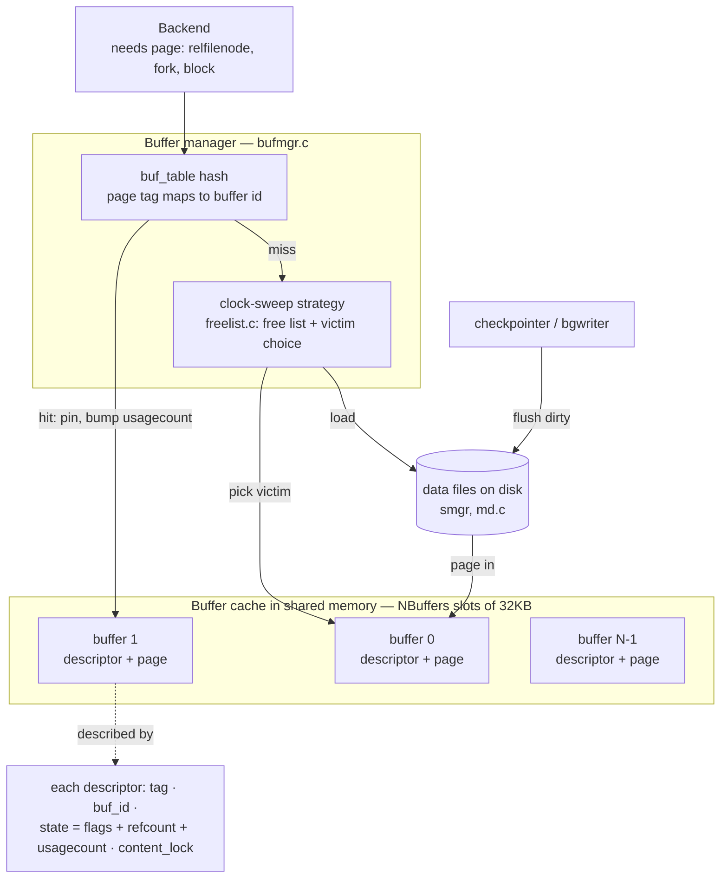
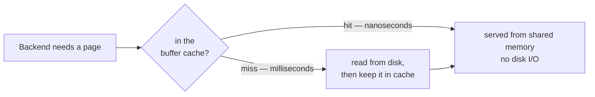
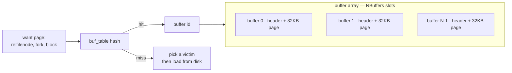
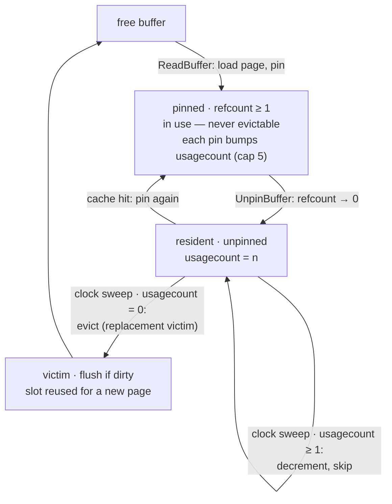
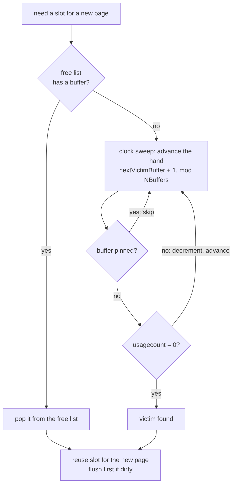
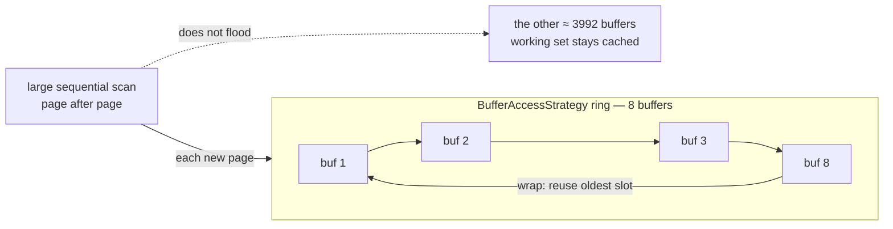
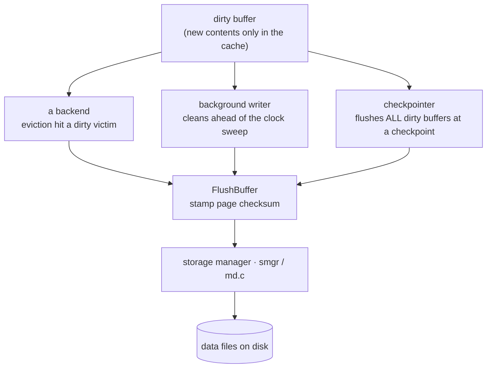
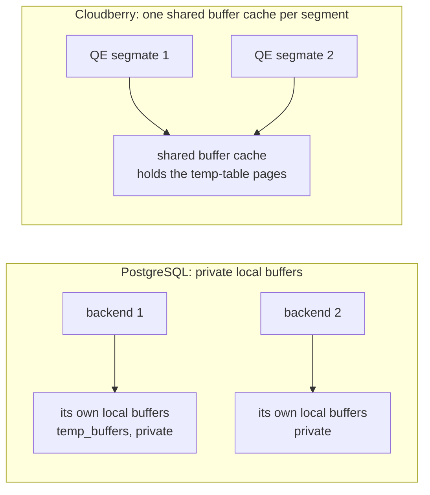

<!--
  Licensed to the Apache Software Foundation (ASF) under one
  or more contributor license agreements.  See the NOTICE file
  distributed with this work for additional information
  regarding copyright ownership.  The ASF licenses this file
  to you under the Apache License, Version 2.0 (the
  "License"); you may not use this file except in compliance
  with the License.  You may obtain a copy of the License at

    http://www.apache.org/licenses/LICENSE-2.0

  Unless required by applicable law or agreed to in writing,
  software distributed under the License is distributed on an
  "AS IS" BASIS, WITHOUT WARRANTIES OR CONDITIONS OF ANY
  KIND, either express or implied.  See the License for the
  specific language governing permissions and limitations
  under the License.
-->

# 3. Buffer Cache



*Anatomy of one buffer cache. A backend asks for a page by tag; the buf_table hash maps it to a slot in the NBuffers-slot shared-memory array. A hit pins the slot and bumps its usagecount; a miss has the clock-sweep strategy choose a victim and load the page from disk via smgr. The checkpointer and background writer flush dirty pages back. Each segment and the coordinator runs this independently — that is the N+1 caches of [§3.1](#31-caching--buffer-cache-design).2.*

## 3.1 Caching & Buffer Cache Design

### 3.1.1 Why a database keeps a cache

A segment's table and index data live in files on disk, but disk access is measured in milliseconds while memory access takes nanoseconds. If every query touched the disk for every page, throughput would collapse. So Cloudberry — like PostgreSQL — keeps recently-used pages in a region of shared memory called the **buffer cache** and serves repeat accesses from RAM. The operating system caches the same files too; Cloudberry reads and writes through ordinary buffered file operations, accepting that double-caching in exchange for portability.



*Why the cache exists: a hit is served from shared memory in nanoseconds; only a miss pays the millisecond disk cost — and the fetched page is then kept, so the next access to it is a hit.*

The unit of caching is the **page**. In this build a page is **32 KB** — Cloudberry raises PostgreSQL's 8 KB default to favour the large sequential scans typical of analytics:

```c title="src/include/pg_config.h:32"
#define BLCKSZ 32768   /* 32 KB pages (PostgreSQL default is 8192) */
```

### 3.1.2 Not one cache, but N+1

Here is the first place MPP departs from the textbook. A Cloudberry cluster is a coordinator plus a set of segments, each its own PostgreSQL process with its **own** shared memory — so there is an independent buffer cache *per segment*, plus one on the coordinator. The coordinator's cache holds catalog pages and the occasional coordinator-only or replicated table; **user-table data is cached on the segments that store it**, never on the coordinator. We will see this directly in [§3.2](#32-cache-hits-pinning--usage-count).

`shared_buffers` sizes each cache independently. On this demo cluster the coordinator's is 125 MB — and because pages are 32 KB, that is exactly 4000 buffers:

*`shared_buffers` in pages: 125 MB ÷ 32 KB = 4000 buffers.*

```sql
SELECT current_setting('block_size') AS block_size,
       pg_size_pretty(pg_size_bytes(current_setting('shared_buffers'))) AS shared_buffers,
       pg_size_bytes(current_setting('shared_buffers'))
       / pg_size_bytes(current_setting('block_size')) AS nbuffers;
```

```text {3} title="output"
 block_size | shared_buffers | nbuffers
------------+----------------+----------
 32768      | 125 MB         |     4000
```

### 3.1.3 The structure: an array of buffers

Each cache is, at heart, an array of `NBuffers` **buffers**; buffer *i* is a fixed 32 KB slot holding one page, paired with a **buffer descriptor** (header) recording what the slot contains and how it is being used. The descriptor is kept deliberately small so the array of headers stays cache-line friendly:

```c title="src/include/storage/buf_internals.h:246"
typedef struct BufferDesc
{
    BufferTag        tag;            /* which page: relfilenode, fork, block */
    int              buf_id;         /* buffer index, from 0 */
    pg_atomic_uint32 state;          /* flags + refcount + usagecount, packed */
    int              wait_backend_pgprocno;
    int              freeNext;       /* link in the free list */
    LWLock           content_lock;   /* guards the page contents */
} BufferDesc;
```

*What a buffer descriptor tracks.*

- `tag` — page identity: relfilenode · fork · block
- `buf_id` — slot index in the array
- `state` — dirty/valid flags + pin refcount + usagecount
- `content_lock` — shared/exclusive page lock

To learn whether a page is cached, the manager cannot scan 4000 descriptors. Instead a hash table — **buf_table** — maps a page's identity (its `BufferTag`) to the buffer id that holds it:



*Locating a page: the buf_table hash maps (relfilenode, fork, block) to a buffer id in the array.*

:::note

The hash lives in `src/backend/storage/buffer/buf_table.c` (`BufTableLookup`, `buf_table.c:91`); the descriptor array and the cache are set up in `buf_init.c`. The same shape — an array plus a hash — recurs across the engine, for instance in the SLRU caches behind clog and the distributed log ([§10.5](../part-3-transactions-mvcc-concurrency/ch10.md#105-distributed-snapshots--the-distributed-log)).

:::

### 3.1.4 Inspecting the cache with pg_buffercache

The `pg_buffercache` extension exposes one row per buffer, so we can watch the cache as a table. We will reuse a small helper that shows only the buffers holding a given relation, decoding the fork number into a name:

*A reusable view of one relation's buffers, after the book's `buffercache` helper.*

```sql
CREATE EXTENSION IF NOT EXISTS pg_buffercache;

CREATE FUNCTION buffercache(rel regclass) RETURNS TABLE(
  bufferid int, relfork text, relblk bigint,
  isdirty bool, usagecount smallint, pins int) AS $$
  SELECT bufferid,
    CASE relforknumber WHEN 0 THEN 'main' WHEN 1 THEN 'fsm' WHEN 2 THEN 'vm' END,
    relblocknumber, isdirty, usagecount, pinning_backends
  FROM pg_buffercache
  WHERE relfilenode = pg_relation_filenode(rel)
  ORDER BY relforknumber, relblocknumber;
$$ LANGUAGE sql;
```

```text title="output"
CREATE EXTENSION
CREATE FUNCTION
```

[§3.2](#32-cache-hits-pinning--usage-count) puts it to work — and immediately runs into the N+1-cache reality.

## 3.2 Cache Hits, Pinning & Usage Count



*The life of a cached buffer — the throughline of [§3.2](#32-cache-hits-pinning--usage-count). A page is loaded and pinned for use; unpinning leaves it resident with its usagecount intact; when the clock sweep later finds it unpinned with usagecount 0, that buffer becomes the replacement victim (detailed in [§3.3](#33-cache-misses-eviction--clock-sweep)).*

### 3.2.1 A page enters the cache

Let's create a one-row table and look for its page. Following the book, we disable autovacuum so nothing touches the table behind our back:

*Create a distributed table and insert a single row.*

```sql
CREATE TABLE cacheme(id integer)
  WITH (autovacuum_enabled = off) DISTRIBUTED BY (id);
INSERT INTO cacheme VALUES (2);
```

```text title="output"
CREATE TABLE
INSERT 0 1
```

On single-node PostgreSQL the new page would now sit in the buffer cache, and `buffercache('cacheme')` would show it. On Cloudberry the coordinator shows **nothing**:

*The coordinator's cache holds no data page for a distributed table.*

```sql
SELECT * FROM buffercache('cacheme');
```

```text title="output"
 bufferid | relfork | relblk | isdirty | usagecount | pins
----------+---------+--------+---------+------------+------
(0 rows)
```

The row hashed to a segment, so the page was created and cached **there**. Connecting straight to segment 0 — in utility mode, on its own port — finds it:

*The same lookup on segment 0 (port 7102, utility mode): block 0 of the main fork, dirty, usagecount 1.*

```sql
PGOPTIONS='-c gp_role=utility' psql -p 7102 -d postgres

SELECT bufferid, relblocknumber AS relblk, isdirty, usagecount,
       pinning_backends AS pins
FROM pg_buffercache
WHERE relfilenode = (SELECT relfilenode FROM pg_class WHERE relname='cacheme');
```

```text title="output"
 bufferid | relblk | isdirty | usagecount | pins
----------+--------+---------+------------+------
      292 |      0 | t       |          1 |    0
```

:::note

**The takeaway:** there is no single cluster-wide buffer cache to reason about. Each segment caches the data it stores; the coordinator caches catalog and coordinator-resident data. Cache-hit ratios, warming, and eviction are **per-segment** properties — a query is only as fast as the coldest segment it waits on.

:::

The page is **dirty** (`isdirty = t`): the insert modified it in memory and it has not yet been written back — that is the job of the checkpointer and background writer ([§3.5](#35-background-writer--checkpointer)). Its **usagecount** is 1, and no backend currently holds it **pinned**.

### 3.2.2 Pinning and the usage count

Two counters inside the descriptor's `state` govern a buffer's fate. A **pin** (the reference count, `pins` above) marks a buffer as in use: while a backend reads or writes the page it pins the buffer, and a pinned buffer can never be evicted. The **usagecount** is a popularity score — it rises each time the buffer is pinned and falls as the eviction clock sweeps past it ([§3.3](#33-cache-misses-eviction--clock-sweep)). Re-reading the page bumps the count, up to a small ceiling, `BM_MAX_USAGE_COUNT = 5`:

*Two more scans of `cacheme` on segment 0; usagecount climbs from 1 to 3.*

```sql
SELECT count(*) FROM cacheme;   -- once
SELECT count(*) FROM cacheme;   -- twice
SELECT usagecount, isdirty, pinning_backends AS pins FROM pg_buffercache
WHERE relfilenode = (SELECT relfilenode FROM pg_class WHERE relname='cacheme');
```

```text {3} title="output"
 usagecount | isdirty | pins
------------+---------+------
          3 | t       |    0
```

The pin count is back to 0 because no scan is in flight, but the usagecount now stands at 3. This is the raw material the clock-sweep algorithm uses to choose a victim when the cache fills up ([§3.3](#33-cache-misses-eviction--clock-sweep)).

`ReadBuffer` → `ReadBuffer_common` → `BufTableLookup (hash)` → `PinBuffer + bump usagecount`

:::note

Read path: `ReadBuffer` → `ReadBuffer_common` (`src/backend/storage/buffer/bufmgr.c:465`) → `BufTableLookup`; on a hit the buffer is pinned and its usagecount incremented, capped at `BM_MAX_USAGE_COUNT` (`buf_internals.h:80`; the bump is at `bufmgr.c:2368`).

:::

### 3.2.3 Counting page accesses with EXPLAIN

You rarely query `pg_buffercache` per segment in practice. The everyday tool is `EXPLAIN (analyze, buffers)`, which reports how many pages a query found already cached (**hit**) versus had to read from disk (**read**):

*`EXPLAIN (analyze, buffers)` over a 50 000-row distributed table.*

```sql
EXPLAIN (analyze, buffers, costs off, timing off, summary off)
SELECT count(*) FROM demo_t;
```

```text title="output"
 Aggregate (actual rows=1 loops=1)
   ->  Gather Motion 3:1  (slice1; segments: 3) (actual rows=50000 loops=1)
         ->  Seq Scan on demo_t (actual rows=16718 loops=1)
 Planning:
   Buffers: shared hit=2427
 Optimizer: GPORCA
```

The plan is distributed — a `Gather Motion` pulls rows from the three segments up to the coordinator (Motion is the subject of §19). The `Buffers: shared hit=2427` line here is the **coordinator's** planning-time catalog access; the segments' scan buffers are accounted on the segments. As with the cache itself, buffer accounting in an MPP plan is per-node.

:::note

**Reading the numbers.** `shared hit` = pages served from the buffer cache; `shared read` = pages fetched from the OS (which may still be an OS-cache hit). A warm steady-state workload is mostly hits; a cold cache or an oversized scan shows reads. Because each segment has its own cache ([§3.1](#31-caching--buffer-cache-design).2), the same query can be hit-heavy on a warm segment and read-heavy on a freshly-restarted one.

:::

## 3.3 Cache Misses, Eviction & Clock-Sweep



*Finding a slot for an incoming page. The free list is consulted first; only when it is empty does the clock sweep run, advancing a single hand around the buffer array — skipping pinned buffers, decaying the usagecount of unpinned ones, and seizing the first it finds at usagecount 0.*

### 3.3.1 The miss path: free list, then eviction

In [§3.2](#32-cache-hits-pinning--usage-count) the page a backend wanted was already resident. When the `buf_table` lookup instead *misses*, the manager must free up a slot to hold the page it is about to read in. `BufferAlloc` (`src/backend/storage/buffer/bufmgr.c:1325`) delegates that choice to `StrategyGetBuffer` (`src/backend/storage/buffer/freelist.c:196`), which draws from two sources, in order:

`BufferAlloc` → `GetVictimBuffer` → `StrategyGetBuffer` → `free list  ·else·  clock sweep`

**The free list comes first.** At startup every buffer is free; `VACUUM` and dropped or truncated relations return buffers to the list as well. A lock-free `have_free_buffer` peek (`freelist.c:175`) and the `firstFreeBuffer` head (`freelist.c:268`) hand back a slot with no scanning at all. The clock sweep runs only once the free list is empty — that is, once memory is fully populated.

On this segment, 3711 of the 4000 buffers are still free, so allocations are currently satisfied straight from the free list — the clock sweep has not yet had to run:

*Segment 0: how many buffers are occupied versus still on the free list.*

```sql
PGOPTIONS='-c gp_role=utility' psql -p 7102 -d postgres

SELECT count(*) FILTER (WHERE relfilenode IS NOT NULL) AS used,
       count(*) FILTER (WHERE relfilenode IS NULL)     AS free
FROM pg_buffercache;
```

```text title="output"
 used | free
------+------
  289 | 3711
(1 row)
```

:::note

The free list is the fast path — no page is evicted while a free buffer exists. Eviction is the fallback that keeps a **fully populated** cache useful: it is how a hot page makes room by displacing a cold one.

:::

### 3.3.2 The clock-sweep algorithm

True LRU would have to reorder a list on *every* page touch — far too expensive on the hot path. Cloudberry instead approximates it with a **clock sweep**. Picture the `NBuffers` slots arranged in a circle with one hand, `nextVictimBuffer`; `ClockSweepTick` (`freelist.c:108`) advances the hand one slot per call, atomically, wrapping modulo `NBuffers` and bumping a `completePasses` counter on each full revolution.

```c title="src/backend/storage/buffer/freelist.c:314"
/* Nothing on the freelist, so run the "clock sweep" algorithm */
for (;;)
{
    buf = GetBufferDescriptor(ClockSweepTick());        /* advance the hand */
    local_buf_state = LockBufHdr(buf);

    if (BUF_STATE_GET_REFCOUNT(local_buf_state) == 0)   /* not pinned?      */
    {
        if (BUF_STATE_GET_USAGECOUNT(local_buf_state) != 0)
            local_buf_state -= BUF_USAGECOUNT_ONE;      /* decay, keep going */
        else
            return buf;                                 /* victim found      */
    }
    UnlockBufHdr(buf, local_buf_state);
}
```

At each slot the hand applies one rule. A **pinned** buffer (refcount nonzero) is in use and is skipped untouched. An unpinned buffer whose **usagecount is above 0** has its usagecount decremented and is skipped — popularity decays by one each time the hand passes. The first unpinned buffer found already at **usagecount 0** becomes the victim. A `trycounter` reset to `NBuffers` (`freelist.c:315`) guards the pathological all-pinned case, raising an error rather than spinning forever.

That usagecount column is precisely the decay state the sweep reads. A live snapshot shows a hot working set pinned at the ceiling of 5 (`BM_MAX_USAGE_COUNT`, `src/include/storage/buf_internals.h:80`) — the survivors the hand has to decrement five times — alongside a long free list the sweep has not yet had to touch:

*Segment 0: the distribution of usagecount across the cache (NULL = a free, unused buffer).*

```sql
SELECT usagecount, count(*)
FROM pg_buffercache
GROUP BY usagecount
ORDER BY usagecount;
```

```text {7,8} title="output"
 usagecount | count
------------+-------
          1 |    10
          2 |    35
          3 |     9
          4 |     8
          5 |   227
            |  3711
(6 rows)
```

:::note

Read this as the clock sweep's input. The 227 buffers pegged at 5 are the hot working set — the hand decrements them five times before they are eligible, so they almost always survive a pass. The 3711 NULLs are still on the free list, which is why no sweeping is happening yet — with free buffers available no page has been decayed to usagecount 0 to reclaim.

:::

### 3.3.3 Evicting the victim: flush-if-dirty, then re-tag

A chosen victim may still hold a **dirty** page — modified in memory but not yet written. `GetVictimBuffer` (`src/backend/storage/buffer/bufmgr.c:1688`) checks `BM_DIRTY` and, if set, writes the page out with `FlushBuffer` *before* the slot may be reused. By the write-ahead rule (Chapter 20) the page's WAL is already durable, so this is just the lazy data write finally happening:

```c title="src/backend/storage/buffer/bufmgr.c:1729"
if (buf_state & BM_DIRTY)
{
    /* take a share lock, recheck, then write the page out */
    FlushBuffer(buf_hdr, NULL, IOOBJECT_RELATION, io_context);
    ...
}
```

With the page clean (or clean to begin with), the buffer is removed from `buf_table` under its old tag and reinserted under the new page's tag; the slot now holds the incoming page and the requesting backend pins it — re-entering the lifecycle of [§3.2](#32-cache-hits-pinning--usage-count). A clean victim is free to evict; a dirty one costs a write, which is exactly why the background writer and checkpointer ([§3.5](#35-background-writer--checkpointer)) work to keep dirty pages flushed *ahead* of the hand.

:::note

**A hazard this raises:** a single large sequential scan could march the hand around the whole cache, evicting the entire working set to cache pages it will read only once. Cloudberry prevents that with **ring buffers** — the subject of [§3.4](#34-ring-buffers--bulk-eviction).

:::

## 3.4 Ring Buffers & Bulk Eviction



*A bulk read confines itself to a tiny BufferAccessStrategy ring and recycles its own slots, so a one-time scan of a huge table cannot evict the hot working set held in the rest of the cache.*

### 3.4.1 Why bulk reads need a ring

The clock sweep of [§3.3](#33-cache-misses-eviction--clock-sweep) assumes the pages it caches are worth keeping. A large one-shot scan breaks that assumption. Imagine a report that sequentially reads a 72 MB table — 2299 pages on this segment. Read through the ordinary path, those 2299 pages would stream into the 4000-buffer cache and evict most of the *hot* working set that concurrent OLTP queries depend on — all to cache pages this scan will read exactly once and never revisit. The cache would be **trashed** by a single bulk reader.

Cloudberry avoids this the same way PostgreSQL does: a bulk operation is given a small, fixed **buffer access strategy** — a *ring* of just a handful of buffers that it cycles through and reuses, instead of borrowing from the whole cache. The hot working set in the other buffers is left untouched.

:::note

This matters more in an MPP analytic database than in single-node PostgreSQL: large sequential scans are the *common* case here, not the exception, so confining them is what keeps a busy segment's cache useful for everyone else.

:::

### 3.4.2 The BufferAccessStrategy ring

A caller that knows it will touch many pages once asks for a strategy with `GetAccessStrategy(btype)` and passes it down to `ReadBufferExtended`. There are four strategy types; three of them build a ring, sized in `freelist.c`:

```c title="src/include/storage/bufmgr.h:34"
typedef enum BufferAccessStrategyType
{
    BAS_NORMAL,     /* normal random access — no ring, uses the whole cache */
    BAS_BULKREAD,   /* large read-only scan */
    BAS_BULKWRITE,  /* large multi-block write, e.g. COPY IN */
    BAS_VACUUM      /* VACUUM */
} BufferAccessStrategyType;
```

`GetAccessStrategy` picks a ring *size in kilobytes*; `GetAccessStrategyWithSize` then converts that to a buffer count by dividing by the page size and caps it at one eighth of the cache. Because this build uses 32 KB pages, the rings are smaller (in buffers) than on stock PostgreSQL's 8 KB pages:

*Buffer access strategies and their ring sizes on this cluster (32 KB pages, shared_buffers = 4000 buffers).*

| Strategy | Used for | Ring size | Buffers at 32 KB |
| --- | --- | --- | --- |
| `BAS_BULKREAD` | large read-only seq scans | 256 KB | 8 |
| `BAS_BULKWRITE` | `COPY IN`, `CREATE TABLE AS` | 16 MB | 512 → 500 (cap = NBuffers/8) |
| `BAS_VACUUM` | `VACUUM` | 256 KB | 8 |
| `BAS_NORMAL` | random access | — none — | uses the full 4000-buffer cache |

`GetAccessStrategy(BAS_BULKREAD)` → `ReadBufferExtended(rel, blk, RBM_NORMAL, strategy)` → `StrategyGetBuffer reuses a ring slot`

Reuse alone is not quite enough. If the ring slot the scan wants to recycle holds a **dirty** page, writing it out might force a WAL flush first — an expensive surprise to inflict on a read. `StrategyRejectBuffer` handles this: in bulkread mode it drops that dirty buffer from the ring and asks for a fresh victim instead, so a read never stalls on WAL.

:::note

Source — strategy types `src/include/storage/bufmgr.h:34`; ring sizes and the 1/8-cache cap `src/backend/storage/buffer/freelist.c:547` (`GetAccessStrategy`) and `freelist.c:598,605`; dirty-buffer rejection `freelist.c:762` (`StrategyRejectBuffer`). `COPY` requests the bulk-write ring at `src/backend/access/heap/heapam.c:1853`.

:::

### 3.4.3 When a sequential scan switches to the ring

A seq scan does not always use a ring — for a small table, caching every page is exactly what you want. The switch is decided per scan in `initscan`: a heap scan adopts the bulkread ring only when the relation is larger than a quarter of the cache.

```c title="src/backend/access/heap/heapam.c:289"
if (!RelationUsesLocalBuffers(scan->rs_base.rs_rd) &&
    scan->rs_nblocks > NBuffers / 4)
{
    allow_strat = ...;           /* large enough — use a strategy */
}
...
scan->rs_strategy = GetAccessStrategy(BAS_BULKREAD);   /* heapam.c:301 */
```

On this cluster the cache is 4000 buffers, so the threshold is **1000 blocks** (about 31 MB). We can see which side of the line two tables fall on — querying segment 0 directly, since the threshold is applied to each segment's *own* shard:

*On segment 0: bc_small (231 blocks) scans through the normal cache; bc_ring (2299 blocks) crosses the 1000-block threshold and uses the bulkread ring.*

```sql
-- on segment 0 (PGOPTIONS='-c gp_role=utility' … -p 7102)
SELECT relname,
       pg_relation_size(oid)/32768 AS blocks,           -- 32 KB pages
       4000/4 AS ring_threshold_blocks,                 -- NBuffers/4
       CASE WHEN pg_relation_size(oid)/32768 > 4000/4
            THEN 'BAS_BULKREAD ring' ELSE 'normal strategy' END AS seqscan_uses
FROM pg_class WHERE relname IN ('bc_ring','bc_small') ORDER BY blocks;
```

```text {4} title="output"
 relname  | blocks | ring_threshold_blocks |   seqscan_uses
----------+--------+-----------------------+-------------------
 bc_small |    231 |                  1000 | normal strategy
 bc_ring  |   2299 |                  1000 | BAS_BULKREAD ring
(2 rows)
```

Reading `bc_ring` with `EXPLAIN (analyze, buffers)` — again on the segment, where the scan actually runs — confirms the scan visits all 2299 pages:

*The seq scan touches every one of bc_ring's 2299 pages (all hits here, warm cache). Without a ring those 2299 pages would each claim a buffer, evicting more than half of the 4000-buffer cache for a single one-time read; the ring confines the scan to 8 buffers instead.*

```sql
-- on segment 0 (utility mode)
EXPLAIN (analyze, buffers, costs off, timing off, summary off)
SELECT count(*) FROM bc_ring;
```

```text title="output"
 Aggregate (actual rows=1 loops=1)
   Buffers: shared hit=2299
   ->  Seq Scan on bc_ring (actual rows=399919 loops=1)
         Buffers: shared hit=2299
 Planning:
   Buffers: shared hit=153
 Optimizer: Postgres query optimizer
(7 rows)
```

:::note

The all-`hit` count here reflects a warm cache (the rows were just loaded). The point is the count: **2299 pages** for one scan. The ring is what stops those 2299 pages from displacing the working set — it bounds a bulk reader to 8 buffers no matter how large the table. And because each segment evaluates `rs_nblocks > NBuffers/4` against its own shard, the same table can use the ring on a segment that stores a lot of it and the normal cache on one that stores little.

:::

## 3.5 Background Writer & Checkpointer



*Three actors write a dirty page back to disk. A backend writes one synchronously when eviction lands on a dirty victim; the background writer cleans buffers just ahead of the clock sweep; the checkpointer flushes every dirty buffer at a checkpoint. All three pass through FlushBuffer, which stamps the page checksum, then smgr.*

### 3.5.1 Three writers of dirty pages

A page modified in the cache is **dirty**: its new contents live only in shared memory. A commit does *not* write that page back — it flushes only the WAL (the NO-FORCE policy, [§20.1](../part-5-high-availability-recovery/ch20.md#201-overview--recovery-foundations)). Dirty pages therefore pile up, and something must eventually move them to disk. Three actors can, and they are not equal:

- **A backend, on eviction** — When a backend needs a free slot and the clock sweep lands on a *dirty* victim, the backend must write that page itself before reusing the slot — a synchronous disk write right on the query's critical path. This is the slow case the other two exist to prevent.
- **The background writer** — A dedicated process that proactively cleans dirty buffers *just ahead* of the clock sweep, so backends usually find a clean victim and rarely block on a write.
- **The checkpointer** — At a checkpoint it flushes *every* dirty buffer at once, so that all changes up to that point are durably on disk — which is what lets crash recovery begin at the checkpoint instead of the start of the log.

:::note

All three funnel through one `FlushBuffer` (`src/backend/storage/buffer/bufmgr.c:3491`), which stamps the page's **checksum** with `PageSetChecksumCopy` (`bufmgr.c:3586`) before handing it to the storage manager. The background writer and checkpointer share the helper `SyncOneBuffer` (`bufmgr.c:3202`).

:::

### 3.5.2 The background writer loop

The background writer runs `BackgroundWriterMain` (`src/backend/postmaster/bgwriter.c:92`): it wakes periodically and calls `BgBufferSync` (`src/backend/storage/buffer/bufmgr.c:2878`). Instead of scanning the whole pool, it looks at where the clock sweep is about to allocate next and cleans a bounded number of dirty buffers *in that path*, so the next backend to need a slot finds it already clean. When the sweep has lapped the writer and allocations have gone quiet, it drops into hibernation.

`BackgroundWriterMain` → `BgBufferSync` → `SyncOneBuffer` → `FlushBuffer` → `smgr write`

`bgwriter_flush_after` (here **64 pages = 2 MB**) caps how much the writer dirties into the OS before asking the kernel to flush, which smooths the write rate it hands down.

### 3.5.3 The checkpointer

The checkpointer (`CheckpointerMain`, `src/backend/postmaster/checkpointer.c:183`) starts a checkpoint when `checkpoint_timeout` elapses, when WAL volume crosses the `max_wal_size` threshold, or on an explicit `CHECKPOINT`. Its buffer-cache half is `BufferSync` (`src/backend/storage/buffer/bufmgr.c:2595`), which walks the entire pool and flushes **every** dirty buffer. To avoid a write storm it spreads that work across `checkpoint_completion_target` of the interval.

*The knobs that pace checkpoints and background writing on this cluster.*

```sql
SELECT name, setting, unit FROM pg_settings
WHERE name IN ('checkpoint_timeout','checkpoint_completion_target',
               'max_wal_size','bgwriter_flush_after')
ORDER BY name;
```

```text title="output"
             name             | setting | unit
------------------------------+---------+------
 bgwriter_flush_after         | 64      | 32kB
 checkpoint_completion_target | 0.9     |
 checkpoint_timeout           | 300     | s
 max_wal_size                 | 1024    | MB
(4 rows)
```

:::note

Why flush everything at once? A checkpoint is the point recovery can safely start from: every change before it is already on disk, so only WAL written *after* it must be replayed. That side of the story — the checkpoint record, the redo point, and recovery — is [§20.2](../part-5-high-availability-recovery/ch20.md#202-write-ahead-logging-wal).6.

:::

### 3.5.4 Monitoring with pg_stat_bgwriter

`pg_stat_bgwriter` keeps a running tally of who wrote what. Because table data lives on the segments, watch it *there* — the coordinator's writers stay nearly idle. Here is one segment before and after we insert 200,000 rows into `bc_bgw` and force a checkpoint:

*Segment 0 (utility mode) before and after the insert + CHECKPOINT. The checkpointer and the backends both move; the background writer stays idle here because the free list never empties.*

```sql
-- on segment 0: snapshot, then INSERT 200000 rows + CHECKPOINT on the coordinator, then snapshot again
SELECT checkpoints_req, buffers_checkpoint, buffers_clean, buffers_backend
FROM pg_stat_bgwriter;
```

```text title="output"
 checkpoints_req | buffers_checkpoint | buffers_clean | buffers_backend
-----------------+--------------------+---------------+-----------------
               2 |               1673 |          8176 |           34006     -- before
               3 |               4324 |          8176 |           35841     -- after
```

The checkpoint wrote **2 651** buffers (`buffers_checkpoint` 1673 → 4324); the background writer cleaned **nothing** ahead of the sweep (`buffers_clean` unchanged — with free buffers still available the clock sweep never ran, so there was nothing for it to clean ahead of); and backends wrote **1 835** pages themselves during eviction while the insert ran (`buffers_backend` +1835).

:::note

**Health check:** you want `buffers_backend` small next to `buffers_checkpoint + buffers_clean`. A large backend share means queries are stalling to write their own dirty victims — the cure is a more aggressive background writer or more frequent checkpoints. And this is **per segment**: each runs its own background writer and checkpointer, so one lagging segment can slow a query by itself.

:::

## 3.6 Local Cache & Temp Tables



*Temporary tables: where their pages live. PostgreSQL gives each backend its own private local buffer cache for temp tables; Cloudberry has no usable local cache — temp-table pages sit in the segment's one shared buffer cache, so the gang's QE segmates all see the same data.*

### 3.6.1 PostgreSQL's private local buffers

A temporary table is visible only to the session that created it, so PostgreSQL never routes its pages through the shared buffer cache. Instead each backend keeps a **local buffer cache** of its own — a private array sized by `temp_buffers` (here 1024 pages, 32 MB) and managed in `localbuf.c`. Because the pages are backend-private, local buffers skip everything the shared cache needs for safety: no buffer-mapping partition locks, no atomic pin counts, no cross-process coordination.

:::note

In PostgreSQL the routing is clean: `RelationUsesLocalBuffers()` is **true** for a temp relation, so the buffer manager sends its reads to `LocalBufferAlloc` rather than the shared cache.

:::

### 3.6.2 Why Cloudberry uses shared buffers instead

Cloudberry breaks the assumption that a temp table belongs to a single process. A statement on a segment is run by a *gang* of query-executor (QE) processes, and several of them — **segmates** — run side by side on the same segment, all needing to see the same temporary data. Backend-private local buffers cannot give them a shared view. So Cloudberry caches temp-table pages in the segment's **shared** buffer cache, exactly as it does ordinary tables.

The choice is hardwired: `RelationUsesLocalBuffers()` is a constant `false` for *every* relation, temp or not.

```c title="src/include/utils/rel.h:765"
/*
 * In GPDB, we do not use local buffers for temp tables because segmates need
 * to share temp table contents.  Currently, there is no other reason to use
 * local buffers.
 */
#define RelationUsesLocalBuffers(relation) false
```

With that constant false, nothing is ever routed to the local cache. PostgreSQL's `localbuf.c` survives only as inherited machinery — its entry points open with `Assert(false)`, a standing guarantee that they must never be reached:

```c title="src/backend/storage/buffer/localbuf.c:128"
/*
 * Local buffers are used for temp tables in PostgreSQL.  As temp tables
 * use shared buffers in Cloudberry, we shouldn't be useing local buffers
 * for anything.
 */
Assert(false);
```

:::note

**`temp_buffers` is effectively vestigial in Cloudberry.** The GUC still exists, but the local pool it sizes is never populated; temp-table memory lands in the shared buffer cache instead.

:::

### 3.6.3 Seeing temp pages in the shared cache

`pg_buffercache` reports the contents of the **shared** buffer cache. If temp-table pages truly live there, they must be visible through it. A distributed temp table's data sits on the segments, so we dispatch `pg_buffercache` out to them with `gp_dist_random()` — in the *same* session, so the segments' own QEs (the ones holding our temp table) answer:

*A temp table's pages live in the shared buffer cache: dispatched to the segments, `pg_buffercache` finds 22 buffers holding `bc_temp`; the coordinator holds none.*

```sql
CREATE TEMP TABLE bc_temp(id int) DISTRIBUTED BY (id);
INSERT INTO bc_temp SELECT generate_series(1, 20000);

-- pg_buffercache reports SHARED buffers; dispatch it to the segments:
SELECT count(*) AS shared_buffers_on_segments
FROM gp_dist_random('pg_buffercache')
WHERE relfilenode = (SELECT relfilenode FROM pg_class WHERE relname = 'bc_temp');

-- and on the coordinator alone:
SELECT count(*) AS buffers_on_coordinator
FROM pg_buffercache
WHERE relfilenode = (SELECT relfilenode FROM pg_class WHERE relname = 'bc_temp');
```

```text {5,10} title="output"
CREATE TABLE
INSERT 0 20000
 shared_buffers_on_segments
----------------------------
                         22
(1 row)

 buffers_on_coordinator
------------------------
                      0
(1 row)
```

Twenty-two shared buffers across the segments hold the temp table — direct proof that its data is in the shared cache. The coordinator shows none, for the ordinary reason that a distributed table's data lives on the segments, not the coordinator ([§3.1](#31-caching--buffer-cache-design).2).

:::note

**Tuning consequence.** A session that builds large temporary tables competes for the *same* shared buffers as every other query on that segment — there is no separate `temp_buffers` pool to absorb it, as there would be in PostgreSQL. Sizing `shared_buffers`, not `temp_buffers`, is what matters for temp-heavy workloads.

:::

