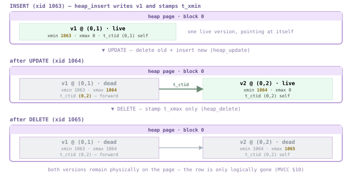
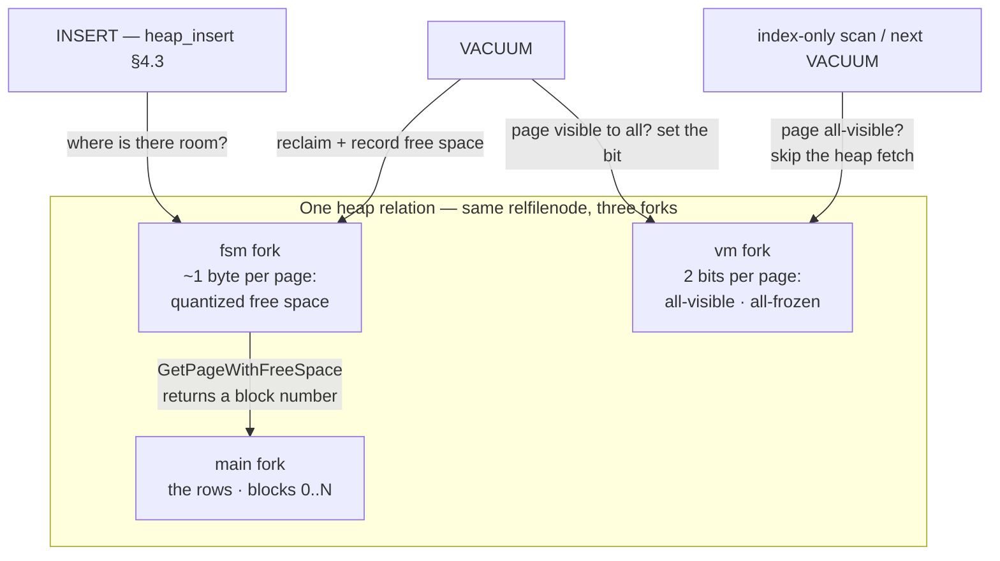
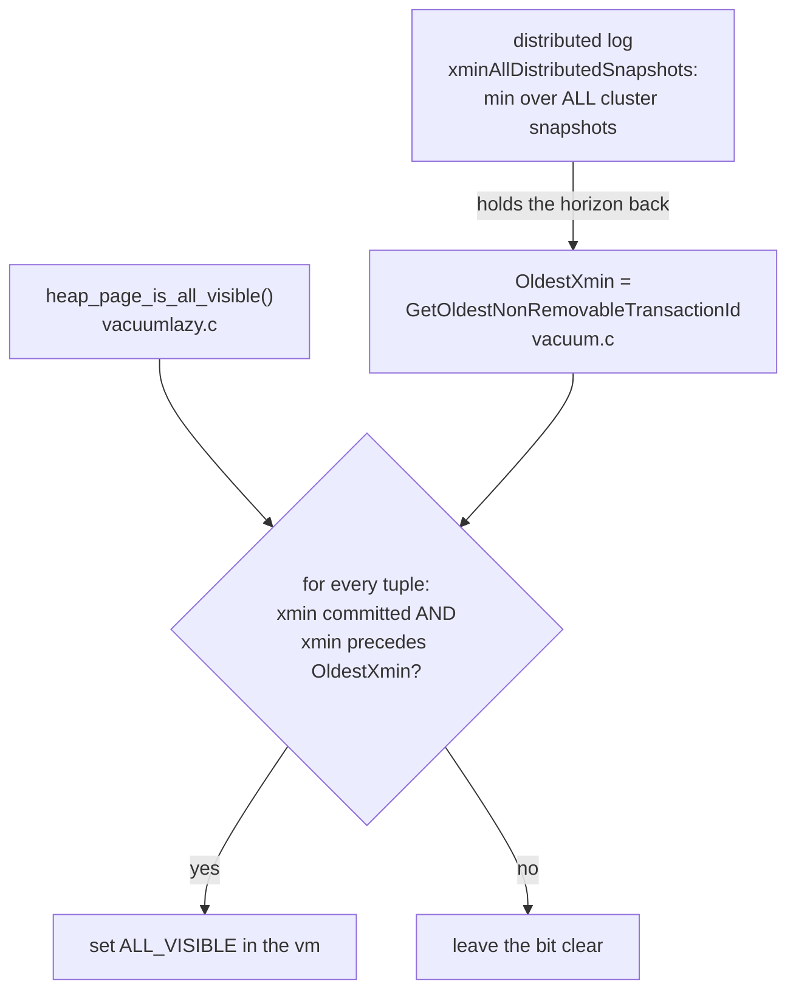
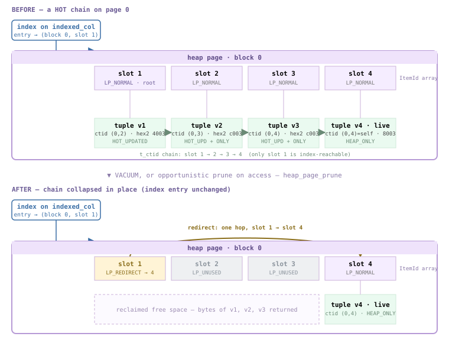
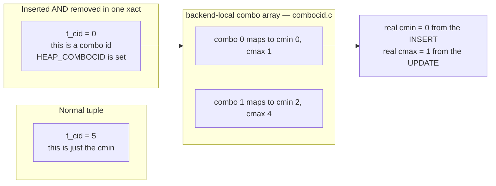

<!--
  Licensed to the Apache Software Foundation (ASF) under one
  or more contributor license agreements.  See the NOTICE file
  distributed with this work for additional information
  regarding copyright ownership.  The ASF licenses this file
  to you under the Apache License, Version 2.0 (the
  "License"); you may not use this file except in compliance
  with the License.  You may obtain a copy of the License at

    http://www.apache.org/licenses/LICENSE-2.0

  Unless required by applicable law or agreed to in writing,
  software distributed under the License is distributed on an
  "AS IS" BASIS, WITHOUT WARRANTIES OR CONDITIONS OF ANY
  KIND, either express or implied.  See the License for the
  specific language governing permissions and limitations
  under the License.
-->

import RawFigure from '../_components/RawFigure';

# 4. Heap: The Row Store

<RawFigure html={"<div style=\"max-width:680px;margin:2px auto;font:11.5px/1.45 ui-monospace,SFMono-Regular,Menlo,monospace;color:#1f2328\"> <div style=\"border:1px solid #9cc3e6;background:#eaf3fb;border-radius:6px;padding:7px;text-align:center;font-weight:600;color:#1f4e79\">Heap access method — heapam.c<div style=\"font-weight:400;color:#3a6a96;font-size:10px\">insert · delete · update · scan (§4.3)</div></div> <div style=\"text-align:center;color:#8a939c;font-size:10px;padding:2px\">↓&nbsp; reads / writes pages via the buffer manager (§3)</div> <div style=\"display:flex;gap:6px\"> <div style=\"flex:1;border:1px solid #9cc3e6;background:#eaf3fb;border-radius:6px;padding:6px;text-align:center\">main fork<div style=\"color:#3a6a96;font-size:10px\">rows · §4.1 §4.2</div></div> <div style=\"flex:1;border:1px solid #b7d5b0;background:#eef7ea;border-radius:6px;padding:6px;text-align:center\">fsm fork<div style=\"color:#4a7a4a;font-size:10px\">free space · §4.4</div></div> <div style=\"flex:1;border:1px solid #b7d5b0;background:#eef7ea;border-radius:6px;padding:6px;text-align:center\">vm fork<div style=\"color:#4a7a4a;font-size:10px\">all-visible · §4.4</div></div></div> <div style=\"text-align:center;color:#8a939c;font-size:10px;padding:2px\">↓&nbsp; the main fork is a sequence of 32 KB pages</div> <div style=\"border:2px solid #cdb4db;border-radius:6px;overflow:hidden\"> <div style=\"background:#f3e8ff;color:#6b5b95;font-weight:600;text-align:center;padding:3px;border-bottom:1px solid #cdb4db\">one 32 KB heap page — §4.1</div> <div style=\"background:#f5edff;text-align:center;padding:6px;border-bottom:1px solid #e3d5f5\">page header — 24 B&nbsp;·&nbsp;pd_lower · pd_upper · pd_prune_xid</div> <div style=\"background:#faf6ff;text-align:center;padding:6px;border-bottom:1px solid #e3d5f5\">line pointers — pd_linp[]&nbsp;·&nbsp;each is a tuple's address</div> <div style=\"background:#fcfaff;text-align:center;padding:11px;color:#8a7aa8;border-top:1px dashed #cdb4db;border-bottom:1px dashed #cdb4db\">free space</div> <div style=\"display:flex;background:#eafaf0\"> <div style=\"flex:1;text-align:center;padding:7px;border-right:1px solid #cfead9\">tuple #3</div> <div style=\"flex:1;text-align:center;padding:7px;border-right:1px solid #cfead9\">tuple #2</div> <div style=\"flex:1;text-align:center;padding:7px\">tuple #1</div></div> <div style=\"background:#eef0f2;text-align:center;padding:4px;color:#8a939c;border-top:1px solid #cdb4db\">special&nbsp;·&nbsp;empty for heap&nbsp;&nbsp;(tuples grow up from the page end ↑)</div></div> <div style=\"text-align:center;color:#8a939c;font-size:10px;padding:2px\">↓&nbsp; each line pointer's lp_off points at one tuple</div> <div style=\"display:flex;gap:6px\"> <div style=\"flex:1;border:1px solid #d9c08f;background:#fdf6e3;border-radius:6px;padding:6px;text-align:center\">each tuple = HeapTupleHeaderData<div style=\"color:#7a6a3a;font-size:10px\">t_xmin · t_xmax · t_ctid · t_infomask (§4.2)</div></div> <div style=\"flex:1;border:1px solid #e0a9a9;background:#fdeeee;border-radius:6px;padding:6px;text-align:center\">versions chain via t_ctid<div style=\"color:#9a5a5a;font-size:10px\">HOT + pruning (§4.5) · ComboCID (§4.6)</div></div></div> </div>"} caption={"Anatomy of a heap relation. The heap access method (heapam.c) reads and writes pages through the buffer manager of §3 — it never touches files directly. A relation is three forks of 32 KB pages: the main fork holds the rows, the fsm fork tracks free space, the vm fork marks all-visible pages. Inside one page, line pointers grow down from the header while tuples grow up from the end, leaving free space in the middle. Each tuple carries a HeapTupleHeaderData whose t_xmin/t_xmax/t_ctid drive MVCC, version chains, HOT and page pruning — the subjects of this chapter."} />

## 4.1 Page Organization & Item Pointers

A heap relation is a file divided into fixed-size **pages** ([§2.3](./ch02.md#23-storage-manager-smgr--mdc)) — 32 KB — Cloudberry's default (vs PostgreSQL's 8 KB) ([§3.1](./ch03.md#31-caching--buffer-cache-design)). The page is the unit the buffer manager caches and the unit the WAL protects, so every heap page, whatever rows it holds, shares one rigid skeleton: a fixed header at the very front, an array of **line pointers** growing downward from it, the row data growing upward from the page's end, and free space in the middle. The next sections take the bytes apart; this one establishes the frame they all live in.

<RawFigure html={"<div style=\"max-width:660px;margin:2px auto;font:11.5px/1.45 ui-monospace,SFMono-Regular,Menlo,monospace;color:#1f2328\"> <div style=\"border:2px solid #b79ad6;border-radius:7px;overflow:hidden\"> <div style=\"background:#efe3fb;color:#5e4b86;font-weight:600;text-align:center;padding:5px;border-bottom:1px solid #cdb4db\">one 32 KB heap page — 32768 bytes</div> <div style=\"display:flex;color:#9a8ab0;font-size:10px;background:#faf6ff;border-bottom:1px solid #e3d5f5\"> <div style=\"flex:1;padding:2px;text-align:center;border-right:1px solid #efe6f8\">byte 0</div><div style=\"flex:1;padding:2px;text-align:center;border-right:1px solid #efe6f8\">byte 1</div><div style=\"flex:1;padding:2px;text-align:center;border-right:1px solid #efe6f8\">byte 2</div><div style=\"flex:1;padding:2px;text-align:center\">byte 3</div></div> <div style=\"background:#f5edff\"> <div style=\"display:flex;border-bottom:1px solid #e3d5f5\"><div style=\"flex:1;padding:4px;text-align:center\">pd_lsn — xlogid</div></div> <div style=\"display:flex;border-bottom:1px solid #e3d5f5\"><div style=\"flex:1;padding:4px;text-align:center\">pd_lsn — xrecoff</div></div> <div style=\"display:flex;border-bottom:1px solid #e3d5f5\"><div style=\"flex:1;padding:4px;text-align:center;border-right:1px solid #e3d5f5\">pd_checksum</div><div style=\"flex:1;padding:4px;text-align:center\">pd_flags</div></div> <div style=\"display:flex;border-bottom:1px solid #e3d5f5\"><div style=\"flex:1;padding:4px;text-align:center;border-right:1px solid #e3d5f5\">pd_lower</div><div style=\"flex:1;padding:4px;text-align:center\">pd_upper</div></div> <div style=\"display:flex;border-bottom:1px solid #e3d5f5\"><div style=\"flex:1;padding:4px;text-align:center;border-right:1px solid #e3d5f5\">pd_special</div><div style=\"flex:1;padding:4px;text-align:center\">pd_pagesize_version</div></div> <div style=\"display:flex\"><div style=\"flex:1;padding:4px;text-align:center\">pd_prune_xid</div></div></div> <div style=\"text-align:right;color:#8a7aa8;font-size:10px;padding:1px 5px;background:#f5edff;border-bottom:2px solid #cdb4db\">↑ page header · 24 bytes</div> <div style=\"background:#fbf7ff\"> <div style=\"display:flex;border-bottom:1px solid #e3d5f5\"><div style=\"flex:0 0 48%;padding:4px;text-align:center;border-right:1px solid #e3d5f5\">lp_off (15b)</div><div style=\"flex:0 0 14%;padding:4px;text-align:center;border-right:1px solid #e3d5f5\">flags</div><div style=\"flex:1;padding:4px;text-align:center\">lp_len (15b) · 1</div></div> <div style=\"display:flex;border-bottom:1px solid #e3d5f5\"><div style=\"flex:0 0 48%;padding:4px;text-align:center;border-right:1px solid #e3d5f5\">lp_off (15b)</div><div style=\"flex:0 0 14%;padding:4px;text-align:center;border-right:1px solid #e3d5f5\">flags</div><div style=\"flex:1;padding:4px;text-align:center\">lp_len (15b) · 2</div></div> <div style=\"display:flex\"><div style=\"flex:0 0 48%;padding:4px;text-align:center;border-right:1px solid #e3d5f5\">lp_off (15b)</div><div style=\"flex:0 0 14%;padding:4px;text-align:center;border-right:1px solid #e3d5f5\">flags</div><div style=\"flex:1;padding:4px;text-align:center\">lp_len (15b) · 3</div></div></div> <div style=\"text-align:right;color:#8a7aa8;font-size:10px;padding:1px 5px;background:#fbf7ff;border-bottom:2px solid #cdb4db\">↑ pd_linp[] — line pointers · end at pd_lower</div> <div style=\"background:#fcfaff;text-align:center;padding:18px;color:#9a8ab0;border-bottom:2px solid #cdb4db\">free space &nbsp;(pd_lower … pd_upper)</div> <div style=\"display:flex;background:#eafaf0\"> <div style=\"flex:1;padding:7px;text-align:center;border-right:1px solid #cfead9\">tuple #3</div><div style=\"flex:1;padding:7px;text-align:center;border-right:1px solid #cfead9\">tuple #2</div><div style=\"flex:1;padding:7px;text-align:center\">tuple #1</div></div> <div style=\"color:#6b8a76;font-size:10px;padding:1px 5px;background:#eafaf0;border-bottom:1px solid #cdb4db\">↑ tuples · written from the page end (pd_upper), growing up</div> <div style=\"background:#eef0f2;text-align:center;padding:3px;color:#8a939c\">special · empty for heap (length 0)</div> </div></div>"} caption={"One 32 KB heap page, drawn as the book draws it: the whole page is a single rectangle, and at its front sit small rectangles for the fixed header and the pd_linp line-pointer array, followed by free space, then the tuples (written from the page end, growing up), then the empty special region. Each 32-bit word reads left to right; pd_lower is the boundary after the last line pointer, pd_upper the boundary before the last-written tuple — the page is full when they meet. Heap pages leave the special region empty; only indexes (§7) use it."} />

On disk this is `PageHeaderData` followed by the variable parts. The struct is the common prefix of *every* page kind in the system — heap, index, FSM, visibility map — which is why the buffer manager can checksum and WAL-protect a page without knowing what it stores:

```c title="src/include/storage/bufpage.h:157"
typedef struct PageHeaderData
      {
          PageXLogRecPtr pd_lsn;          /* LSN of last change — WAL ordering (§20) */
          uint16      pd_checksum;        /* page checksum, if enabled */
          uint16      pd_flags;           /* flag bits */
          LocationIndex pd_lower;         /* offset to start of free space */
          LocationIndex pd_upper;         /* offset to end of free space */
          LocationIndex pd_special;       /* offset to start of special space */
          uint16      pd_pagesize_version;/* page size + layout version */
          TransactionId pd_prune_xid;     /* oldest prunable XID, or 0 (§4.5) */
          ItemIdData  pd_linp[FLEXIBLE_ARRAY_MEMBER]; /* line pointer array */
      } PageHeaderData;
```

### 4.1.1 The header, on a live page

The header is exactly **24 bytes** — `SizeOfPageHeaderData` (`src/include/storage/bufpage.h:224`) is `offsetof(PageHeaderData, pd_linp)`, the start of the line-pointer array. Let's create a small distributed table and read its first page's header. As in [§3.2](./ch03.md#32-cache-hits-pinning--usage-count) the data lives on the segment, so we inspect it through utility mode (port 7102) with autovacuum off. The table is distributed by `id` across three segments, so the five rows scatter; segment 0 receives three of them on its first page:

*Three rows on segment 0's first page; its header read with `pageinspect`.*

```sql
-- coordinator, port 7100
      CREATE TABLE heappage(id int, name text)
        WITH (autovacuum_enabled=off) DISTRIBUTED BY (id);
      INSERT INTO heappage SELECT g, 'row-'||g FROM generate_series(1,5) g;

      -- segment 0, port 7102, utility mode
      SELECT lower, upper, special, pagesize, version, prune_xid
      FROM page_header(get_raw_page('heappage',0));
```

```text {3} title="output"
 lower | upper | special | pagesize | version | prune_xid
      -------+-------+---------+----------+---------+-----------
          36 | 32648 |   32768 |    32768 |      14 |         0
```

Read the offsets against the diagram. `pagesize` is the 32 KB we expect. `lower = 36` is where the line pointers end: 24 bytes of header plus the **three** 4-byte line pointers segment 0 holds, `24 + 3×4 = 36`, exactly. `upper = 32648` is where the lowest tuple begins; everything between 36 and 32648 is free space. `special = 32768` is the page end, so the special area has *zero* length, as heap pages always do. `prune_xid = 0` says no tuple here is a pruning candidate yet ([§4.5](#45-page-pruning--hot-updates)).

*The header fields that govern page layout.*

- `pd_lower` — offset where line pointers end / free space starts
- `pd_upper` — offset where tuples begin / free space ends
- `pd_special` — start of special space (= page end for heap)
- `pd_lsn` — WAL position of the last change (write-ahead ordering)
- `pd_prune_xid` — oldest prunable XID, a hint for [§4.5](#45-page-pruning--hot-updates)

### 4.1.2 Line pointers: a layer of indirection

A tuple is never addressed directly. Instead each is reached through a 4-byte **line pointer** (`ItemIdData`), and the pair *(block number, line-pointer index)* is the tuple's permanent address — its **TID**, the `t_ctid` of [§4.2](#42-row-version-layout) and the target every index entry stores. The line pointer packs three bit-fields into 32 bits:

```c title="src/include/storage/itemid.h:25"
typedef struct ItemIdData
      {
          unsigned    lp_off:15,   /* offset to tuple, from start of page */
                      lp_flags:2,  /* state of the line pointer */
                      lp_len:15;   /* byte length of the tuple */
      } ItemIdData;
```

`lp_flags` records the slot's state — `LP_UNUSED` (0, free), `LP_NORMAL` (1, points to a real tuple), `LP_REDIRECT` (2, a HOT redirect, [§4.5](#45-page-pruning--hot-updates)), `LP_DEAD` (3, dead, reclaimable) — all defined at `src/include/storage/itemid.h:38`. Reading the same page's line pointers shows the upward-growing tuples directly:

*Three `LP_NORMAL` line pointers; tuple offsets descend from the page tail.*

```sql
-- segment 0, utility mode
      SELECT lp, lp_off, lp_len, lp_flags
      FROM heap_page_items(get_raw_page('heappage',0));
```

```text {3} title="output"
 lp | lp_off | lp_len | lp_flags
      ----+--------+--------+----------
        1 |  32728 |     34 |        1
        2 |  32688 |     34 |        1
        3 |  32648 |     34 |        1
```

Line pointer 1 was written first yet sits at the **highest** offset (`32728`); each later tuple is placed below the last, so `lp_off` descends to `32648 = pd_upper`. The line-pointer array, by contrast, fills front-to-back, so its tail is `pd_lower = 36`. The two arrays grow toward each other and the page is full when they meet.

This indirection is what makes the heap's later tricks possible. Because index entries point at the *line pointer*, not the tuple bytes, page pruning can slide a live tuple to a new offset, or replace a dead chain's head with an `LP_REDIRECT`, **without invalidating a single index entry** — it only rewrites the 4-byte pointer ([§4.5](#45-page-pruning--hot-updates)). The same property lets a tuple's stable TID survive while its physical bytes move.

:::note

`lp_len = 0` by convention marks a line pointer with no storage — `LP_UNUSED`, `LP_REDIRECT`, or a `LP_DEAD` whose bytes were already reclaimed (`src/include/storage/itemid.h:22`). A `heap_page_items` row with `lp_len > 0` therefore means a tuple physically present, live or not.

:::

## 4.2 Row Version Layout

Inside the page, each row version is a **heap tuple**: a fixed 23-byte header, an optional NULL bitmap, alignment padding, and then the user data. The header is mostly bookkeeping for MVCC — who created this version, who deleted it, where the next version lives — which is why so much of Chapters 4 and 10 comes back to these few bytes. We will read them straight off a live page.

<RawFigure html={"<div style=\"max-width:780px;margin:2px auto;font:11px/1.4 ui-monospace,SFMono-Regular,Menlo,monospace;color:#1f2328;overflow-x:auto\"> <div style=\"min-width:720px\"> <div style=\"display:flex;font-size:10px;color:#6b5b95;font-weight:600;margin:0 0 1px\"> <div style=\"flex:12;text-align:center\">t_choice — 12 bytes (union: MVCC fields on disk)</div><div style=\"flex:11;text-align:center\">… completes the 23-byte fixed header → t_hoff</div></div> <div style=\"display:flex;border:1px solid #cdb4db;background:#f5edff;text-align:center\"> <div style=\"flex:4;border-right:1px solid #e3d5f5;padding:6px 2px\">t_xmin<div style=\"font-size:9px;color:#777\">4 B · inserting xid</div></div> <div style=\"flex:4;border-right:1px solid #e3d5f5;padding:6px 2px\">t_xmax<div style=\"font-size:9px;color:#777\">4 B · deleting xid</div></div> <div style=\"flex:4;border-right:2px solid #b79ad6;padding:6px 2px\">t_field3<div style=\"font-size:9px;color:#777\">4 B · t_cid / t_xvac</div></div> <div style=\"flex:6;border-right:1px solid #e3d5f5;padding:6px 2px\">t_ctid<div style=\"font-size:9px;color:#777\">6 B · this/next TID</div></div> <div style=\"flex:2;border-right:1px solid #e3d5f5;padding:6px 1px\">t_infomask2<div style=\"font-size:9px;color:#777\">2 B</div></div> <div style=\"flex:2;border-right:1px solid #e3d5f5;padding:6px 1px\">t_infomask<div style=\"font-size:9px;color:#777\">2 B</div></div> <div style=\"flex:1;padding:6px 1px\">t_hoff<div style=\"font-size:9px;color:#777\">1 B</div></div></div> <div style=\"text-align:center;color:#8a7aa8;font-size:10px;padding:1px 2px\">↑ HeapTupleHeaderData — 23 bytes, padded to t_hoff (= 24 when a 1-byte NULL bitmap is absorbed by the padding)</div> <div style=\"display:flex;text-align:center\"> <div style=\"flex:5;border:1px solid #cdb4db;border-top:none;background:#faf6ff;padding:6px 2px\">NULL bitmap (t_bits)<div style=\"font-size:9px;color:#777\">optional · ⌈natts/8⌉ B · present only if HEAP_HASNULL</div></div> <div style=\"flex:3;border:1px solid #cdb4db;border-top:none;border-left:none;background:#eef0f2;padding:6px 2px;color:#8a939c\">pad → 8-byte align</div></div> <div style=\"color:#8a7aa8;font-size:10px;text-align:center;padding:1px 2px\">↓ user data begins at offset t_hoff</div> <div style=\"display:flex;border:1px solid #cdb4db;border-top:none;background:#eafaf0;text-align:center\"> <div style=\"flex:1;border-right:1px solid #cfead9;padding:7px 2px\">attr 1</div> <div style=\"flex:1;border-right:1px solid #cfead9;padding:7px 2px\">attr 2</div> <div style=\"flex:0 0 44px;border-right:1px solid #cfead9;padding:7px 2px;color:#8a939c\">pad</div> <div style=\"flex:1;border-right:1px solid #cfead9;padding:7px 2px\">attr 3</div> <div style=\"flex:1;padding:7px 2px\">attr 4</div></div> <div style=\"text-align:center;color:#6b8a76;font-size:10px;padding:1px 2px\">↑ user data — attributes per pg_attribute, each with its own type-alignment padding</div> </div></div>"} caption={"The byte layout of one heap tuple, after the book's tuple figure. The first 12 bytes are the t_choice union (the on-disk MVCC fields t_xmin / t_xmax / t_field3); then t_ctid, the two flag words, and t_hoff complete the 23-byte fixed header, padded to an 8-byte boundary. An optional NULL bitmap and alignment padding follow, and the user data — attributes laid out per pg_attribute with their own type alignment — begins at offset t_hoff."} />

The struct unions the on-disk MVCC fields with the in-memory Datum fields, so the same 12 bytes mean different things in a stored tuple versus one being shuffled between executor nodes:

```c title="src/include/access/htup_details.h:154"
struct HeapTupleHeaderData
      {
          union {
              HeapTupleFields  t_heap;    /* t_xmin, t_xmax, t_cid  — on disk */
              DatumTupleFields t_datum;   /* used when passed as a Datum */
          } t_choice;
          ItemPointerData t_ctid;         /* this or a newer tuple's TID (§4.3) */
          uint16  t_infomask2;            /* number of attributes + flags */
          uint16  t_infomask;             /* status hint bits */
          uint8   t_hoff;                 /* header size incl. bitmap + padding */
          /* ^ - 23 bytes - ^ */
          bits8   t_bits[FLEXIBLE_ARRAY_MEMBER];  /* NULL bitmap */
      };
```

<RawFigure html={"<div style=\"max-width:760px;margin:2px auto;font:11px/1.35 ui-monospace,SFMono-Regular,Menlo,monospace;color:#1f2328;overflow-x:auto\"> <div style=\"min-width:700px\"> <div style=\"color:#6b5b95;font-weight:600;margin:0 0 2px\">t_infomask2 — 16 bits (number of attributes + HOT state)</div> <div style=\"display:flex;border:1px solid #cdb4db;text-align:center\"> <div style=\"flex:0 0 40%;border-right:1px solid #e3d5f5;background:#f5edff;padding:4px 2px\"><div style=\"color:#6b5b95\">bits 0–10 · 0x07FF</div><div style=\"font-size:9.5px;color:#444\">HEAP_NATTS_MASK — natts</div></div> <div style=\"flex:1;border-right:1px solid #e3d5f5;background:#fff4d6;padding:4px 1px\"><div style=\"color:#6b5b95\">0x0800</div><div style=\"font-size:9px;color:#444\">XMIN_DSI</div></div> <div style=\"flex:1;border-right:1px solid #e3d5f5;background:#fff4d6;padding:4px 1px\"><div style=\"color:#6b5b95\">0x1000</div><div style=\"font-size:9px;color:#444\">XMAX_DSI</div></div> <div style=\"flex:1;border-right:1px solid #e3d5f5;background:#faf6ff;padding:4px 1px\"><div style=\"color:#6b5b95\">0x2000</div><div style=\"font-size:9px;color:#444\">KEYS_UPD</div></div> <div style=\"flex:1;border-right:1px solid #e3d5f5;background:#faf6ff;padding:4px 1px\"><div style=\"color:#6b5b95\">0x4000</div><div style=\"font-size:9px;color:#444\">HOT_UPD</div></div> <div style=\"flex:1;background:#faf6ff;padding:4px 1px\"><div style=\"color:#6b5b95\">0x8000</div><div style=\"font-size:9px;color:#444\">ONLY_TUP</div></div></div> <div style=\"color:#6b5b95;font-weight:600;margin:8px 0 2px\">t_infomask — 16 bits (visibility + tuple shape)</div> <div style=\"display:flex;border:1px solid #cdb4db;text-align:center\"> <div style=\"flex:1;border-right:1px solid #e3d5f5;background:#eafaf0;padding:4px 1px\"><div style=\"color:#6b5b95\">0x0001</div><div style=\"font-size:9px;color:#444\">HASNULL</div></div> <div style=\"flex:1;border-right:1px solid #e3d5f5;background:#eafaf0;padding:4px 1px\"><div style=\"color:#6b5b95\">0x0002</div><div style=\"font-size:9px;color:#444\">HASVARW</div></div> <div style=\"flex:1;border-right:1px solid #e3d5f5;background:#eafaf0;padding:4px 1px\"><div style=\"color:#6b5b95\">0x0004</div><div style=\"font-size:9px;color:#444\">HASEXT</div></div> <div style=\"flex:1;border-right:1px solid #e3d5f5;background:#f4f5f6;padding:4px 1px\"><div style=\"color:#9aa3ac\">0x0008</div><div style=\"font-size:9px;color:#9aa3ac\">HASOID_OLD</div></div> <div style=\"flex:1;border-right:1px solid #e3d5f5;background:#fff;padding:4px 1px\"><div style=\"color:#6b5b95\">0x0010</div><div style=\"font-size:9px;color:#444\">KEYSHR_LK</div></div> <div style=\"flex:1;border-right:1px solid #e3d5f5;background:#fde8ef;padding:4px 1px\"><div style=\"color:#6b5b95\">0x0020</div><div style=\"font-size:9px;color:#444\">COMBOCID</div></div> <div style=\"flex:1;border-right:1px solid #e3d5f5;background:#fff;padding:4px 1px\"><div style=\"color:#6b5b95\">0x0040</div><div style=\"font-size:9px;color:#444\">EXCL_LK</div></div> <div style=\"flex:1;border-right:1px solid #e3d5f5;background:#fff;padding:4px 1px\"><div style=\"color:#6b5b95\">0x0080</div><div style=\"font-size:9px;color:#444\">LOCK_ONLY</div></div> <div style=\"flex:1;border-right:1px solid #e3d5f5;background:#fff;padding:4px 1px\"><div style=\"color:#6b5b95\">0x0100</div><div style=\"font-size:9px;color:#444\">XMIN_CMT</div></div> <div style=\"flex:1;border-right:1px solid #e3d5f5;background:#fff;padding:4px 1px\"><div style=\"color:#6b5b95\">0x0200</div><div style=\"font-size:9px;color:#444\">XMIN_INV</div></div> <div style=\"flex:1;border-right:1px solid #e3d5f5;background:#fff;padding:4px 1px\"><div style=\"color:#6b5b95\">0x0400</div><div style=\"font-size:9px;color:#444\">XMAX_CMT</div></div> <div style=\"flex:1;border-right:1px solid #e3d5f5;background:#fff;padding:4px 1px\"><div style=\"color:#6b5b95\">0x0800</div><div style=\"font-size:9px;color:#444\">XMAX_INV</div></div> <div style=\"flex:1;border-right:1px solid #e3d5f5;background:#fff;padding:4px 1px\"><div style=\"color:#6b5b95\">0x1000</div><div style=\"font-size:9px;color:#444\">IS_MULTI</div></div> <div style=\"flex:1;border-right:1px solid #e3d5f5;background:#fff;padding:4px 1px\"><div style=\"color:#6b5b95\">0x2000</div><div style=\"font-size:9px;color:#444\">UPDATED</div></div> <div style=\"flex:1;border-right:1px solid #e3d5f5;background:#f4f5f6;padding:4px 1px\"><div style=\"color:#9aa3ac\">0x4000</div><div style=\"font-size:9px;color:#9aa3ac\">MOVED_OFF</div></div> <div style=\"flex:1;background:#f4f5f6;padding:4px 1px\"><div style=\"color:#9aa3ac\">0x8000</div><div style=\"font-size:9px;color:#9aa3ac\">MOVED_IN</div></div></div> <div style=\"font-size:10px;color:#8a7aa8;margin:4px 0 0\">Amber = Cloudberry-only distributed-snapshot bits · grey = legacy/unused in this build (no OID system column; HEAP_MOVED_* is pre-9.0 VACUUM FULL) · pink = HEAP_COMBOCID (§4.6).</div> </div></div>"} caption={"The two 16-bit flag words, bit by bit — after the book's tuple-header figure, redrawn from the current source (`src/include/access/htup_details.h:191` and `:276`). `t_infomask2` spends its low 11 bits on the attribute count and its high bits on HOT and key-update state; `t_infomask` carries visibility and tuple-shape flags. The two amber bits are **Cloudberry-specific**: `HEAP_XMIN/XMAX_DISTRIBUTED_SNAPSHOT_IGNORE` (`htup_details.h:279`, `:285`) let a segment skip the distributed-snapshot test for a locally-resolved transaction — they have no equivalent in single-node PostgreSQL."} />

### 4.2.1 The header on a live page

Two rows, one with a NULL column. Following [§4.1](#41-page-organization--item-pointers) we read the raw tuples on segment 0:

*Two tuples; `pageinspect` exposes their headers directly.*

```sql
-- coordinator, port 7100
      CREATE TABLE heaptup(id int, a int, b text)
        WITH (autovacuum_enabled=off) DISTRIBUTED BY (id);
      INSERT INTO heaptup VALUES (1, NULL, 'hello');   -- a is NULL
      INSERT INTO heaptup VALUES (2, 99,   'world');   -- no NULLs

      -- segment 0, port 7102, utility mode
      SELECT lp, t_xmin, t_xmax, t_ctid, t_infomask2,
             to_hex(t_infomask) AS infomask, t_hoff, t_bits
      FROM heap_page_items(get_raw_page('heaptup',0));
```

```text {3,4} title="output"
 lp | t_xmin | t_xmax | t_ctid | t_infomask2 | infomask | t_hoff |  t_bits
      ----+--------+--------+--------+-------------+----------+--------+----------
        1 |   1046 |      0 | (0,1)  |           3 |    903 |     24 | 10100000
        2 |   1047 |      0 | (0,2)  |           3 |    902 |     24 |
```

`t_xmin` is the inserting xid; `t_xmax = 0` means neither version has been deleted; `t_ctid` points at each tuple itself (no newer version yet, [§4.3](#43-operations-on-tuples)). `t_infomask2 = 3` is the attribute count — three columns — in its low bits. The two interesting differences are the **infomask** (`0x903` vs `0x902`) and the **NULL bitmap** (`t_bits`), which the next two subsections unpack.

### 4.2.2 infomask: cached commit hints

`t_infomask` is a bag of status bits (`src/include/access/htup_details.h:191`). Decoding the two values bit by bit:

*Decoding the demo's infomask values against the flag definitions.*

| bit | flag | meaning | in 0x903 (row 1) | in 0x902 (row 2) |
| --- | --- | --- | --- | --- |
| 0x0001 | HEAP_HASNULL | tuple has a NULL attribute | set | — |
| 0x0002 | HEAP_HASVARWIDTH | has a variable-width column (`text`) | set | set |
| 0x0100 | HEAP_XMIN_COMMITTED | inserter is known committed | set | set |
| 0x0800 | HEAP_XMAX_INVALID | t_xmax is not a real deleter | set | set |

The two rows differ only by `HEAP_HASNULL` — `0x903 − 0x902 = 0x001` — exactly the row that has a NULL. The other bits are **hint bits**: the first transaction to test a version's visibility resolves `t_xmin`/`t_xmax` against the commit log and then records the verdict here (`HEAP_XMIN_COMMITTED`, `HEAP_XMAX_INVALID`), so every later visibility check is a single masked comparison with no clog lookup. This is the optimization [§4.3](#43-operations-on-tuples).4 and Chapter 10 lean on.

### 4.2.3 The NULL bitmap and t_hoff

A column's NULL-ness is not stored in the column — it is a bit in the tuple's **NULL bitmap** (`t_bits`), present only when `HEAP_HASNULL` is set. Row 1's bitmap reads `10100000`: one bit per column, low bit first, `1` meaning *present*. Columns are `id, a, b` → `1` (id present), `0` (a is NULL), `1` (b present); the trailing zeros are padding to a byte. Row 2 has no NULLs, so `HEAP_HASNULL` is clear and `t_bits` is empty.

Notice `t_hoff = 24` for **both** rows. The fixed header is 23 bytes, rounded up to `MAXALIGN` = 24, and row 1's one-byte NULL bitmap is absorbed into that same alignment padding — so a single null column costs no extra header space here. `t_hoff` only grows once the bitmap plus padding crosses the next 8-byte boundary.

*What t_hoff accounts for, in order.*

- `23 bytes` — fixed HeapTupleHeaderData
- `t_bits` — NULL bitmap, ⌈natts/8⌉ bytes, only if HASNULL
- `padding` — up to the next MAXALIGN boundary
- `→ t_hoff` — offset where user data begins

### 4.2.4 TOAST: when a value will not fit

A tuple must fit on a page, so a single oversized attribute cannot be stored inline. When a row exceeds `TOAST_TUPLE_THRESHOLD` (`src/include/access/heaptoast.h:49`, ≈ a quarter page) the storage manager compresses its variable-length attributes and, if still too big, moves them **out of line** into a companion *TOAST table*, leaving an 18-byte pointer in the main tuple. Every table with a toastable column gets one automatically:

*A 100 000-character value compresses and moves out of line.*

```sql
CREATE TABLE heaptoast(id int, big text)
        WITH (autovacuum_enabled=off) DISTRIBUTED BY (id);
      INSERT INTO heaptoast VALUES (1, repeat('x',100000));

      SELECT reltoastrelid::regclass AS toast_table
      FROM pg_class WHERE relname='heaptoast';
      SELECT length(big) AS logical_chars, pg_column_size(big) AS stored_bytes
      FROM heaptoast WHERE id=1;
```

```text {7} title="output"
      toast_table
      -----------------------
       pg_toast.pg_toast_17308

       logical_chars | stored_bytes
      ---------------+--------------
              100000 |        1156
```

The value the user sees is 100 000 characters, but it occupies just **1156 bytes** of storage after compression — and those bytes live in `pg_toast.pg_toast_17308`, not in the main heap tuple, which keeps only the pointer. This is the same machinery [§1.1](../part-1-introduction/ch01.md#11-the-mpp-cluster-coordinator-segments--distribution) measured from the column side; here we see where the bytes actually go. TOAST is transparent: a `SELECT` reassembles the value on read.

:::note

`HEAP_HASEXTERNAL` (`0x0004`) in t_infomask marks a tuple that has an out-of-line attribute, and `HEAP_HASVARWIDTH` (`0x0002`, set on both demo rows above) marks any variable-width column — the planner and tuple deformer consult these to know whether a NULL bitmap or a detoast step is needed.

:::

## 4.3 Operations on Tuples

With the page ([§4.1](#41-page-organization--item-pointers)) and the row version ([§4.2](#42-row-version-layout)) understood, we can watch the four heap operations at work. The defining idea is that Cloudberry, like PostgreSQL, is a **multi-version** store: `INSERT` adds a version, `UPDATE` and `DELETE` never overwrite or erase in place — they *stamp* the existing version's `t_xmax` and let it linger so that transactions with older snapshots still see it. Reclaiming the space is a separate, later job ([§4.5](#45-page-pruning--hot-updates), Ch 10). In a cluster each of these runs on the **segment** that owns the row's shard ([§1.3](../part-1-introduction/ch01.md#13-processes-and-memory)); the version chain we are about to trace lives entirely inside one segment's heap page.



*The life of one row across INSERT → UPDATE → DELETE, with the real xids from the demo below. Nothing is overwritten in place: UPDATE stamps v1's t_xmax and points its t_ctid forward to v2 (the green chain arrow), then writes v2; DELETE only stamps t_xmax on the live version. Both versions stay physically on the page — the row is merely logically gone. The amber value is the field each command stamps.*

We will mutate a single row and read the raw line pointers after each step. The table is distributed, so its page lives on segment 0; we inspect it through utility mode ([§3.2](./ch03.md#32-cache-hits-pinning--usage-count)), with autovacuum off so nothing rewrites the page behind us:

*One distributed table, one row; inspected on segment 0 via `pageinspect`.*

```sql
-- coordinator, port 7100
      CREATE TABLE heapops (id int, v text)
        WITH (autovacuum_enabled=off) DISTRIBUTED BY (id);
      INSERT INTO heapops VALUES (1,'first');
      SELECT gp_segment_id, id, v FROM heapops;
```

```text {3} title="output"
 gp_segment_id | id |   v
      ---------------+----+-------
                   0 |  1 | first
```

### 4.3.1 INSERT — stamping a new version

`heap_insert` (`src/backend/access/heap/heapam.c:1915`) asks `RelationGetBufferForTuple` (`src/backend/access/heap/hio.c:503`) for a page with enough free space — consulting the free space map ([§4.4](#44-fsm--visibility-map)) — then writes the tuple at the page's high end, adds a line pointer at the low end, stamps `t_xmin` with the current transaction id, leaves `t_xmax` zero, and logs the change to WAL. Bulk loads (`COPY`, multi-row `INSERT`) take the batched path `heap_multi_insert` (`heapam.c:2199`), which fills and WAL-logs many tuples per page in one shot.

`heap_insert` → `RelationGetBufferForTuple` → `RelationPutHeapTuple` → `XLogInsert (WAL)`

*After INSERT: one live version, pointing at itself.*

```sql
-- segment 0, port 7102, utility mode
      SELECT lp, lp_flags, t_xmin, t_xmax, t_ctid
      FROM heap_page_items(get_raw_page('heapops',0)) WHERE lp_len>0;
```

```text {3} title="output"
 lp | lp_flags | t_xmin | t_xmax | t_ctid
      ----+----------+--------+--------+--------
        1 |        1 |   1063 |      0 | (0,1)
```

`lp_flags = 1` is `LP_NORMAL` (a line pointer to a real tuple). `t_xmax = 0` means the version is live, and `t_ctid = (0,1)` points at *itself* — the row is the head and tail of its own (so far trivial) version chain.

### 4.3.2 UPDATE — a new version, chained

`heap_update` (`heapam.c:3137`) is, at heart, a delete-of-old plus insert-of-new. It stamps the old version's `t_xmax` with the updating xid, writes the new version onto a page (the same one if it fits), and — crucially — sets the old version's `t_ctid` to the **TID of the new version**. That forward pointer is the *version chain*: an index entry or an in-flight scan that lands on the old tuple can follow `t_ctid` forward to find the current row.

`heap_update` → `RelationGetBufferForTuple (new version)` → `mark old: t_xmax + t_ctid forward` → `log_heap_update (WAL)`

*After UPDATE: two versions on the page. The old one is dead and its t_ctid points forward to the new one.*

```sql
UPDATE heapops SET v='second' WHERE id=1;
      -- segment 0, utility mode
      SELECT lp, lp_flags, t_xmin, t_xmax, t_ctid
      FROM heap_page_items(get_raw_page('heapops',0)) WHERE lp_len>0;
```

```text {3} title="output"
 lp | lp_flags | t_xmin | t_xmax | t_ctid
      ----+----------+--------+--------+--------
        1 |        1 |   1063 |   1064 | (0,2)
        2 |        1 |   1064 |      0 | (0,2)
```

Read the two rows together. Line pointer 1 is the original version: its `t_xmax` is now `1064` (dead, killed by the updating transaction) and its `t_ctid` no longer points at itself but **forward to `(0,2)`** — the chain. Line pointer 2 is the new version, with `t_xmin = 1064` (the *same* xid that killed the old one) and a live `t_xmax = 0`. One `UPDATE` produced two physical tuples; the old one survives on the page for any snapshot still entitled to see it.

:::note

Because the indexed column did not change here, this could have been a HOT update — a new version with *no* new index entry. That optimization, and how page pruning later reclaims the dead version, is the subject of [§4.5](#45-page-pruning--hot-updates).

:::

### 4.3.3 DELETE — marking, not removing

`heap_delete` (`heapam.c:2643`) is the simplest operation: it does not free the line pointer or shrink the page. It only stamps the live version's `t_xmax` with the deleting xid and sets the matching infomask bits ([§4.2](#42-row-version-layout)). The tuple stays exactly where it was — visible to older snapshots, invisible to newer ones — until prune or vacuum eventually removes it.

*After DELETE: the live version is stamped dead, but both tuples are still physically on the page.*

```sql
DELETE FROM heapops WHERE id=1;
      -- segment 0, utility mode
      SELECT lp, lp_flags, t_xmin, t_xmax, t_ctid
      FROM heap_page_items(get_raw_page('heapops',0)) WHERE lp_len>0;
```

```text {4} title="output"
 lp | lp_flags | t_xmin | t_xmax | t_ctid
      ----+----------+--------+--------+--------
        1 |        1 |   1063 |   1064 | (0,2)
        2 |        1 |   1064 |   1065 | (0,2)
```

The current version `(0,2)` now carries `t_xmax = 1065` — the `DELETE`'s transaction id — yet `lp_flags` is still `LP_NORMAL` and the bytes remain. Nothing was erased; the row was simply marked as no longer live as of xid 1065. Two `heap_page_items` rows persist for what is, logically, an empty table.

### 4.3.4 Scanning and visibility

A sequential scan reaches tuples through `heap_getnext` (`heapam.c:1165`), which drives `heapgettup` / `heapgettup_pagemode` (`heapam.c:797` / `:915`) page by page. For each tuple the executor asks `HeapTupleSatisfiesVisibility` (`src/include/access/heapam.h:321`) whether *this* version is visible to the current snapshot — comparing `t_xmin` / `t_xmax` against the snapshot's xid horizon. The first visibility test on a version is the expensive one (it may consult the commit log); its verdict is cached back into the tuple as **hint bits** in `t_infomask` (the `XMIN_COMMITTED` / `XMAX_COMMITTED` bits of [§4.2](#42-row-version-layout)), so later scans decide in a single masked comparison.

This is why our deleted row still occupies the page yet returns no rows to a query: the physical tuple exists, but `HeapTupleSatisfiesVisibility` rejects it for every snapshot newer than xid 1065. Storage and visibility are deliberately separate concerns — the heap keeps versions; the snapshot machinery (Ch 10) decides which one a transaction may see.

*Logically empty, physically not — until pruning runs ([§4.5](#45-page-pruning--hot-updates)).*

```sql
SELECT count(*) FROM heapops;   -- coordinator
```

```text title="output"
 count
      -------
           0
```

## 4.4 FSM & Visibility Map

### 4.4.1 Two more forks beside the data

A heap relation is not a single file. As [§2.3](./ch02.md#23-storage-manager-smgr--mdc) showed, the rows live in the **main fork** — blocks `0..N` of 32 KB pages — but the same `relfilenode` carries two small companion forks that exist only to make the main fork fast to write and cheap to read: the **free space map** (`fsm`) and the **visibility map** (`vm`). Both are ordinary block-structured files that travel through the buffer manager of §3, just like the data.



*The three forks of one heap relation, and who consults them. INSERT asks the FSM where there is room; VACUUM records free space and, when a page qualifies, sets the visibility bit; index-only scans and later vacuums read the VM to skip the heap entirely.*

The fork is identified by a `ForkNumber`; the three values are fixed by the on-disk naming convention (`<relfilenode>` for main, `<relfilenode>_fsm`, `<relfilenode>_vm`):

```c title="src/include/common/relpath.h:55"
typedef enum ForkNumber
      {
          MAIN_FORKNUM = 0,     /* the table data itself */
          FSM_FORKNUM,          /* free space map  -> <relfilenode>_fsm */
          VISIBILITYMAP_FORKNUM,/* visibility map  -> <relfilenode>_vm  */
          ...
      } ForkNumber;
```

The companion forks are created lazily. Right after a bulk load, on the segment, segment 0's main fork holds 10 blocks and the FSM already exists — but the `vm` fork is still empty, because nothing has vacuumed the table yet:

*Segment 0 (utility mode, port 7102): the three forks of `heapfsm`. The `vm` fork is 0 bytes — not created until the first VACUUM.*

```sql
-- coordinator (port 7100) built the table and dispatched the rows:
      --   CREATE TABLE heapfsm(id int, v text)
      --     WITH (autovacuum_enabled=off) DISTRIBUTED BY (id);
      --   INSERT INTO heapfsm SELECT g, repeat('x',200)
      --     FROM generate_series(1,4000) g;
      SELECT pg_relation_size('heapfsm','main')/32768 AS main_blks,
             pg_relation_size('heapfsm','fsm')         AS fsm_bytes,
             pg_relation_size('heapfsm','vm')          AS vm_bytes;
```

```text {3} title="output"
 main_blks | fsm_bytes | vm_bytes
      -----------+-----------+----------
              10 |     98304 |        0
      (1 row)
```

:::note

All page inspection below runs **on the segment** — heap data lives on the segments, never the coordinator ([§3.2](./ch03.md#32-cache-hits-pinning--usage-count)). We reach segment 0 in utility mode: `PGOPTIONS='-c gp_role=utility' psql -p 7102`, with the `pageinspect`, `pg_freespacemap` and `pg_visibility` extensions installed there.

:::

### 4.4.2 The Free Space Map

When `heap_insert` ([§4.3](#43-operations-on-tuples)) needs somewhere to put a new tuple, it must not scan the whole table looking for a page with room. The FSM answers that question in one lookup. It is a tiny tree of pages — separate from the heap — that records, for every heap block, *approximately* how much free space it has.

"Approximately" because the FSM stores just **one byte per page**: the free space is quantized into `FSM_CATEGORIES` = 256 levels, so a byte is enough to compare pages and pick one. Inexact is fine — the inserter rechecks the real free space once it has the page.

```c title="src/backend/storage/freespace/freespace.c:66"
#define FSM_CATEGORIES  256   /* free space quantized to one byte per page */
```

The insert path calls `GetPageWithFreeSpace` (`freespace.c:139`) to find a candidate block, and `RecordAndGetPageWithFreeSpace` (`freespace.c:156`) to update a page's entry and ask for the next candidate in one step. The map is maintained lazily — refreshed by VACUUM and corrected whenever a page that the FSM thought had room turns out to be full.

*`pg_freespace` decodes the FSM on the segment: every block reports 128 bytes still free — the quantized leftover after 200-byte rows packed the page.*

```sql
SELECT * FROM pg_freespace('heapfsm') ORDER BY blkno LIMIT 4;
```

```text {3} title="output"
 blkno | avail
      -------+-------
           0 |   128
           1 |   128
           2 |   128
           3 |   128
      (4 rows)
```

### 4.4.3 The Visibility Map

The visibility map answers a different question: *is every tuple on this page visible to every transaction?* It keeps **two bits per heap page** — `ALL_VISIBLE` and `ALL_FROZEN` — so the whole map for a large table fits in a handful of pages.

```c title="src/include/access/visibilitymapdefs.h:17"
#define BITS_PER_HEAPBLOCK      2

      #define VISIBILITYMAP_ALL_VISIBLE   0x01  /* every tuple visible to all txns */
      #define VISIBILITYMAP_ALL_FROZEN    0x02  /* every tuple frozen */
```

- **ALL_VISIBLE** — No tuple on the page needs visibility-checking against a snapshot. An **index-only scan** can return values straight from the index without fetching the heap page, and a non-aggressive VACUUM can skip the page entirely.
- **ALL_FROZEN** — Every tuple is frozen, so even an anti-wraparound (aggressive) VACUUM can skip the page.

Only VACUUM ever *sets* a bit (`visibilitymap_set`, called from `vacuumlazy.c:1138`); any INSERT/UPDATE/DELETE that touches the page *clears* it again (`visibilitymap_clear`, `visibilitymap.c:140`). The bit is therefore a conservative hint: never set when it shouldn't be, sometimes clear when it could be set.

Before the first vacuum, no page is marked — `pg_visibility` reports zero all-visible blocks:

*Segment 0, before VACUUM: nothing is marked all-visible.*

```sql
SELECT count(*) FILTER (WHERE all_visible) AS all_visible_blks,
             count(*)                          AS total_blks
        FROM pg_visibility('heapfsm');
```

```text title="output"
 all_visible_blks | total_blks
      ------------------+------------
                      0 |         10
      (1 row)
```

Now VACUUM the table from the coordinator (port 7100), which dispatches it to the segment, and look again. With nothing else running, all 10 blocks become both all-visible **and** all-frozen — and the `vm` fork is now materialised:

*After `VACUUM FREEZE heapfsm` (dispatched from the coordinator): every block flips to all-visible and all-frozen.*

```sql
-- on the coordinator:  VACUUM FREEZE heapfsm;
      -- back on segment 0:
      SELECT count(*) FILTER (WHERE all_visible) AS all_visible_blks,
             count(*) FILTER (WHERE all_frozen)  AS all_frozen_blks,
             count(*)                            AS total_blks
        FROM pg_visibility('heapfsm');
```

```text {3} title="output"
 all_visible_blks | all_frozen_blks | total_blks
      ------------------+-----------------+------------
                    10 |            10 |         10
      (1 row)
```

### 4.4.4 All-visible is a distributed horizon

That clean flip hides the one place where the visibility map stops being a single-node story. The bit-setting code is byte-for-byte PostgreSQL, but the *question it asks* — "is this page visible to everyone?" — has a different meaning in an MPP cluster, because "everyone" includes transactions coordinated on other nodes.

VACUUM marks a page all-visible only if `heap_page_is_all_visible` (`vacuumlazy.c:3267`) finds that, for every tuple, the inserter committed **and** its `xmin` is old enough that no one could still need to test it:

```c title="src/backend/access/heap/vacuumlazy.c:3326"
/* The inserter must have committed... */
      if (!HeapTupleHeaderXminCommitted(tuple.t_data))
          { all_visible = false; *all_frozen = false; break; }

      /* ...and be old enough that everyone sees it as committed. */
      xmin = HeapTupleHeaderGetXmin(tuple.t_data);
      if (!TransactionIdPrecedes(xmin, vacrel->cutoffs.OldestXmin))
          { all_visible = false; *all_frozen = false; break; }
```

On the segment, the tuples easily clear the first test — they carry the `HEAP_XMIN_COMMITTED` hint bit ([§4.2](#42-row-version-layout)):

*The rows are hinted committed (`t_infomask & 0x0100`); so whether the page is all-visible turns entirely on the second test — `xmin < OldestXmin`.*

```sql
SELECT lp, t_xmin, (t_infomask & 256) > 0 AS xmin_committed
        FROM heap_page_items(get_raw_page('heapfsm',0))
       WHERE lp_len > 0 LIMIT 2;
```

```text {3} title="output"
 lp | t_xmin | xmin_committed
      ----+--------+----------------
        1 |   1073 | t
        2 |   1073 | t
      (2 rows)
```

So the deciding quantity is `OldestXmin`. In single-node PostgreSQL that is simply the oldest snapshot held by a local backend. In Cloudberry it is computed by `GetOldestNonRemovableTransactionId` (`vacuum.c:1460`), which folds in the **distributed log**: a segment may not consider a transaction gone until it precedes `xminAllDistributedSnapshots` — the minimum xmin over *all distributed snapshots anywhere in the cluster* (`DistributedLog_AdvanceOldestXmin`, `distributedlog.c:189`).



*Why a segment cannot decide all-visible on its own. The local test is PostgreSQL's, but OldestXmin is held back by the cluster-wide distributed snapshot horizon — so a long-running transaction on any node keeps every segment's pages out of the visibility map.*

The consequence is visible in practice: the demo above flipped all 10 blocks only because nothing else was running. Open a long transaction on the coordinator first, and the same `VACUUM FREEZE` leaves the bits **clear** — not because the rows are unvisited, but because the cluster's oldest distributed snapshot still predates them. "Visible to everyone" is a global question, and a segment answers it conservatively. This is also why index-only scans (§7) pay off less eagerly in an MPP cluster than on a single node — their heap-skip depends on a bit that the distributed horizon is reluctant to grant.

## 4.5 Page Pruning & HOT Updates

Every UPDATE in [§4.3](#43-operations-on-tuples) left the old row version behind and added a new one — and [§4.3](#43-operations-on-tuples) hinted at the cost: a table that is updated all day keeps growing, and *every index* on it must gain an entry for each new version. Two mechanisms keep that cost down. **HOT** (Heap-Only Tuples) lets an update that touches no indexed column place the new version on the same page **without** a new index entry, chained off the old one. **Page pruning** then collapses those chains in place, reclaiming the dead versions without ever touching an index. HOT builds the chain; pruning tears it down.



*One page, before and after pruning — drawn as the book draws it (image15 + image31). The index lives outside the page and its one entry points at slot 1, never at a tuple. BEFORE: slots 1–4 are a HOT chain, each tuple's t_ctid forwarding to the next (green arrows); t_infomask2 carries HEAP_HOT_UPDATED (0x4000) and HEAP_ONLY_TUPLE (0x8000), and only slot 1 is index-reachable. AFTER heap_page_prune: slot 1 becomes LP_REDIRECT (lp_off=4, lp_len=0) and bounces in one hop to the live tuple in slot 4 (amber arc); slots 2 and 3 become LP_UNUSED and their bytes are reclaimed. The index arrow into slot 1 is identical in both halves — pruning preserved the only TID the index knew.*

### 4.5.1 HOT: an update that skips the index

Recall from [§4.3](#43-operations-on-tuples) that UPDATE is delete-plus-insert, and the old version's `t_ctid` points forward to the new one. When the updated columns are **not** part of any index, Cloudberry can take a shortcut: write the new version on the **same page** if it fits, set `HEAP_HOT_UPDATED` on the old tuple and `HEAP_ONLY_TUPLE` on the new, and create **no** index entry. Index scans land on the original (root) line pointer as before and follow the `t_ctid` chain through the heap to reach the live version. The two flags live not in `t_infomask` but in **`t_infomask2`** (which also packs the column count):

```c title="src/include/access/htup_details.h:289"
#define HEAP_HOT_UPDATED   0x4000  /* tuple was HOT-updated */
      #define HEAP_ONLY_TUPLE    0x8000  /* this is a heap-only tuple */
```

Let's build a chain. The table has an index on `indexed_col` only; we repeatedly update `payload`, which is *not* indexed, so each update should be HOT and stay on page 0. (As always the rows live on the segment — we inspect via `pageinspect` in utility mode on port 7102.)

*Four versions of one row, all on page 0. Decoding `t_infomask2`: bit `0x4000` = HEAP_HOT_UPDATED, `0x8000` = HEAP_ONLY_TUPLE.*

```sql
CREATE TABLE heaphot(id int, indexed_col int, payload text)
        WITH (autovacuum_enabled=off, fillfactor=90) DISTRIBUTED BY (id);
      CREATE INDEX heaphot_ix ON heaphot(indexed_col);
      INSERT INTO heaphot VALUES (1, 100, 'version 1');
      UPDATE heaphot SET payload='version 2' WHERE id=1;   -- payload is not indexed
      UPDATE heaphot SET payload='version 3' WHERE id=1;
      UPDATE heaphot SET payload='version 4' WHERE id=1;

      -- on the segment (PGOPTIONS='-c gp_role=utility' psql -p 7102):
      SELECT lp, t_ctid, to_hex(t_infomask2) AS hex2,
             (t_infomask2 & 16384) <> 0 AS hot_updated,
             (t_infomask2 & 32768) <> 0 AS heap_only
      FROM heap_page_items(get_raw_page('heaphot',0)) ORDER BY lp;
```

```text {3,6} title="output"
 lp | t_ctid | hex2 | hot_updated | heap_only
      ----+--------+------+-------------+-----------
        1 | (0,2)  | 4003 | t           | f          -- root: index points here
        2 | (0,3)  | c003 | t           | t          -- heap-only, superseded
        3 | (0,4)  | c003 | t           | t          -- heap-only, superseded
        4 | (0,4)  | 8003 | f           | t          -- heap-only, live (t_ctid = self)
```

Read the chain by `t_ctid`: lp 1 → lp 2 → lp 3 → lp 4, all on block 0. Only **lp 1** is referenced by the index; the other three are heap-only (`0x8003`/`0xc003` all carry `0x8000`). The low bits `0x003` are the attribute count (three columns), not flags. The chain cost one heap slot per update and **zero** index growth.

:::note

Why trust the flags rather than statistics? On a freshly-updated table the cumulative counter `n_tup_hot_upd` in `pg_stat_all_tables` may still read 0 until the stats collector catches up. The `HEAP_ONLY_TUPLE` bit on the physical tuple is the ground truth — it is set by `heap_update` at write time.

:::

### 4.5.2 Page pruning: collapsing the chain in place

A HOT chain is cheap to make but it still occupies slots. **Pruning** reclaims them. It is triggered two ways: lazily by VACUUM, or **opportunistically** by an ordinary scan — `heap_page_prune_opt` runs when a page is read, but only if there is something to gain. The page header's `pd_prune_xid` records the oldest XID that *might* be prunable; if it is unset, or the page is not under space pressure, pruning is skipped:

```c title="src/backend/access/heap/pruneheap.c:193"
/* heap_page_prune_opt: bail out unless the page is worth pruning */
      prune_xid = ((PageHeader) page)->pd_prune_xid;
      if (!TransactionIdIsValid(prune_xid))
          return;                       /* nothing marked prunable */
      ...
      if (PageIsFull(page) || PageGetHeapFreeSpace(page) < minfree)
          /* ... take the cleanup lock and prune ... */
```

When it does run, `heap_page_prune` (`src/backend/access/heap/pruneheap.c:270`) walks each HOT chain. Dead intermediate versions become `LP_UNUSED` and their storage is reclaimed; the **root** line pointer — the one the index still references — is rewritten to `LP_REDIRECT` pointing at the surviving live tuple, via `ItemIdSetRedirect` (`src/include/storage/itemid.h:152`). The index is never consulted. Vacuuming our table shows exactly this:

*After pruning: the root (lp 1) is now a redirect to lp 4; the dead middle versions are reclaimed. lp_flags 0=UNUSED, 1=NORMAL, 2=REDIRECT, 3=DEAD.*

```sql
VACUUM heaphot;   -- dispatched from the coordinator (port 7100)

      -- on the segment again:
      SELECT lp, lp_flags,
        CASE lp_flags WHEN 0 THEN 'UNUSED' WHEN 1 THEN 'NORMAL'
                      WHEN 2 THEN 'REDIRECT' WHEN 3 THEN 'DEAD' END AS flag,
        lp_off, lp_len, t_ctid
      FROM heap_page_items(get_raw_page('heaphot',0)) ORDER BY lp;
```

```text {3} title="output"
 lp | lp_flags |   flag   | lp_off | lp_len | t_ctid
      ----+----------+----------+--------+--------+--------
        1 |        2 | REDIRECT |      4 |      0 |          -- root → line pointer 4
        2 |        0 | UNUSED   |      0 |      0 |          -- reclaimed
        3 |        0 | UNUSED   |      0 |      0 |          -- reclaimed
        4 |        1 | NORMAL   |  32720 |     42 | (0,4)    -- the live version
```

The redirect carries no tuple of its own — `lp_len = 0`, and `lp_off = 4` is not a byte offset but the **line-pointer number** it forwards to. An index scan arriving at lp 1 is bounced to lp 4 in one hop; the dead versions are gone and the space between them is free for new tuples. Crucially, the index entry pointing at `(block 0, lp 1)` is still valid — pruning preserved the only TID the index knew.

- **LP_NORMAL (1)** — a live line pointer with a real tuple (lp_off, lp_len)
- **LP_REDIRECT (2)** — HOT-chain root forwarding to another line pointer on the same page; lp_off is the target lp number, lp_len = 0
- **LP_DEAD (3)** — known-dead; index entries may still point here until vacuum removes them
- **LP_UNUSED (0)** — empty slot, free for reuse

### 4.5.3 Pruning is not VACUUM — and both wait for the horizon

Pruning is a **single-page, index-free** operation: it collapses chains and frees in-page space, but it leaves `LP_DEAD` stubs and never visits indexes. Full **VACUUM** (Ch10) is the heavier cousin — it scans the whole relation, removes the matching index entries, turns `LP_DEAD` into `LP_UNUSED`, and updates the free-space and visibility maps of [§4.4](#44-fsm--visibility-map). Pruning buys time cheaply between vacuums.

Both share one hard limit: a version can only be removed once it is invisible to **every** live snapshot. `heap_page_prune_opt` checks each candidate against the global visibility horizon before touching it:

```c title="src/backend/access/heap/pruneheap.c:163"
if (!GlobalVisTestIsRemovableXid(vistest, prune_xid))
          return;   /* some snapshot might still need these versions */
```

:::note

In an MPP cluster this horizon is **cluster-wide**: the oldest snapshot on the coordinator or on *any* segment holds it back for everyone. A single long-running or abandoned transaction — even a read-only one left open — pins the horizon and silently prevents pruning and vacuuming across the whole system, so dead versions accumulate. Watching `pg_stat_activity` for old `xact_start` times is the first thing to check when a table refuses to shrink. The distributed dimension of this horizon is the subject of §10 and [§12.2](../part-3-transactions-mvcc-concurrency/ch12.md#122-cloudberrys-2pc-cdbtm-dtxstate--dtxcontext).

:::

With HOT chains collapsed and dead space reclaimed, a heap page returns to the clean shape of [§4.1](#41-page-organization--item-pointers) — a header, a handful of line pointers, and free space ready for the next insert.

## 4.6 ComboCID

### 4.6.1 One field, two command ids

A heap tuple records *when* it was born and *when* it died in transaction terms — `t_xmin` and `t_xmax` ([§4.2](#42-row-version-layout)). Within that, MVCC also needs the **command id**: which statement *inside* a transaction created or removed the row. PostgreSQL's rule is that a command must not see rows that a *later* command in its own transaction has produced, and must still see rows an earlier command deleted only until the deleting command runs. To enforce it, visibility checks compare a tuple's *cmin* (creating command) and *cmax* (deleting command) against the active command counter.

The problem: the tuple header has exactly **one** slot for this. `t_field3` is a union of `t_cid` and `t_xvac`, so a single `CommandId` is all the room there is:

```c title="src/include/access/htup_details.h:123"
typedef struct HeapTupleFields
      {
          TransactionId t_xmin;        /* inserting xact ID */
          TransactionId t_xmax;        /* deleting or locking xact ID */
          union
          {
              CommandId   t_cid;       /* inserting or deleting command ID, or both */
              TransactionId t_xvac;    /* old-style VACUUM FULL xact ID */
          }           t_field3;
      } HeapTupleFields;
```

For most tuples one slot is enough: a row inserted and never touched again in the same transaction only needs its *cmin*. But a row that is **inserted and then updated or deleted by a later command of the same transaction** needs both a cmin *and* a cmax at once — and they will not both fit.



*One `t_cid` slot, two situations. A normal tuple stores its cmin directly. A tuple created and removed in the same transaction instead stores a *combo id* and sets HEAP_COMBOCID; the combo id is an index into a backend-local array that recovers the real cmin and cmax.*

### 4.6.2 The combo array

The solution is an indirection. When a command tries to set a *cmax* on a tuple that already carries a *cmin* from the same transaction, the system does not overwrite the field — it allocates a **combo command id**: a small integer that stands for the pair `(cmin, cmax)`. That combo id is written into `t_cid`, and the `HEAP_COMBOCID` hint bit is raised so readers know the value is a combo id, not a literal command id:

```c title="src/include/access/htup_details.h:196"
#define HEAP_COMBOCID    0x0020    /* t_cid is a combo CID */
```

The pairs live in a backend-local table built on demand by `GetComboCommandId` (`src/backend/utils/time/combocid.c:230`): a hash for lookup plus a `comboCids` array indexed by combo id. When a visibility check needs the true creating or deleting command, `HeapTupleHeaderGetCmin` (`combocid.c:130`) and `HeapTupleHeaderGetCmax` (`combocid.c:144`) test `HEAP_COMBOCID` and, if set, translate the combo id back through the array; `HeapTupleHeaderAdjustCmax` (`combocid.c:179`) is what mints a combo id when a second command stamps the tuple.

- **t_cid normally** — the literal cmin of the inserting command.
- **t_cid with HEAP_COMBOCID** — an index into the backend's combo array, which maps it to a real (cmin, cmax) pair.
- **lifetime** — the array is private to the backend and thrown away at transaction end — combo ids are meaningful only to the backend that created them, within that transaction. They never need to mean anything on disk.

:::note

This keeps every tuple header the same fixed size: the common case pays nothing, and only the rare tuple that is born and dies in one transaction pays an array slot. It is standard PostgreSQL machinery, inherited unchanged by Cloudberry's heap — with one MPP twist covered in [§4.6](#46-combocid).4.

:::

### 4.6.3 Seeing it on the page

We can force a combo id by inserting a row and updating it **inside a single transaction**, then reading the raw page on the segment ([§4.1](#41-page-organization--item-pointers)). Recall the heap lives on the segment, not the coordinator:

*Insert then update the same row in one transaction — two commands touch the original tuple.*

```sql
CREATE TABLE heapcombo(id int, v text)
           WITH (autovacuum_enabled=off) DISTRIBUTED BY (id);
      BEGIN;
      INSERT INTO heapcombo VALUES (1,'a');   -- command 0
      UPDATE heapcombo SET v='b' WHERE id=1;  -- command 1
      COMMIT;
```

```text title="output"
CREATE TABLE
      BEGIN
      INSERT 0 1
      UPDATE 1
      COMMIT
```

Now inspect the page on segment 0 in utility mode. The original tuple (line pointer 1) was inserted by command 0 *and* superseded by command 1 of the same transaction, so it carries a combo id and the `HEAP_COMBOCID` bit; the new version (line pointer 2) only needs a plain cmin:

*`heap_page_items` on the segment: line pointer 1 has the combo CID bit set; `t_xmin` and `t_xmax` are the *same* xid (1086) — one transaction did both. `t_cid` of 0 is the combo id, not a literal command id.*

```sql
-- on the segment: PGOPTIONS='-c gp_role=utility' psql -p 7102
      SELECT lp, t_xmin, t_xmax, t_field3 AS t_cid,
                t_infomask,
                (t_infomask & 32) <> 0 AS combocid_set
         FROM heap_page_items(get_raw_page('heapcombo',0));
```

```text {3} title="output"
 lp | t_xmin | t_xmax | t_cid | t_infomask | combocid_set
      ----+--------+--------+-------+------------+--------------
        1 |   1086 |   1086 |   0 |       1314 | t
        2 |   1086 |      0 |     1 |      10498 | f
      (2 rows)
```

Line pointer 1 is the deleted original: `t_xmax = t_xmin` proves a single transaction both created and removed it, and `combocid_set = t` means its `t_cid` of 0 is a combo id mapping to *(cmin = 0, cmax = 1)*. Line pointer 2 is the surviving version — `t_xmax = 0`, no combo bit, its `t_cid` of 1 is simply the command that inserted it.

### 4.6.4 Cloudberry: sharing combo ids across segmates

In single-node PostgreSQL the combo array is purely backend-private — and that is enough, because the one backend that writes a tuple is also the one that reads it back. Cloudberry breaks that assumption. On a segment, a slice of a query runs as a **gang** of processes — one *writer* QE and possibly several *reader* QEs — that share a snapshot and must agree on visibility (the segmate model of [§1.3](../part-1-introduction/ch01.md#13-processes-and-memory)). A reader QE can encounter a tuple whose combo id was minted by the writer QE, and its own local combo array would know nothing about it.

Cloudberry's `combocid.c` therefore keeps a copy of the combo array in a **DSM segment** that the writer publishes and the readers load, so all segmates resolve the same combo id to the same `(cmin, cmax)`:

```c title="src/backend/utils/time/combocid.c:101"
/*
       * To share the combocids array from QE writer to QE readers, we keep a
       * copy of the 'comboCids' array in a DSM segment. ...
       * dumpSharedComboCommandIds() updates the shared copy with any new
       * entries; loadSharedComboCommandIds() loads the local array from it.
       */
      static dsm_segment *shared_comboCids = NULL;
```

This rides on the same serialization format PostgreSQL already uses to hand combo state to parallel workers — `SerializeComboCIDState` / `RestoreComboCIDState` (`combocid.c:451`, `:477`). It is a small but characteristic example of the chapter's theme: a single-node storage mechanism, faithfully preserved, then quietly extended so that the *several processes Cloudberry runs per segment* still see one consistent version of the truth.

:::note

With ComboCID we close the heap: [§4.1](#41-page-organization--item-pointers)–[§4.2](#42-row-version-layout) laid out the page and the row, [§4.3](#43-operations-on-tuples) mutated them under MVCC, [§4.4](#44-fsm--visibility-map) tracked free space and visibility, [§4.5](#45-page-pruning--hot-updates) reclaimed and chained versions in place — and command-level visibility, the finest grain of all, rests on this one indirection. Append-optimized tables (Ch5) take a different path entirely, bypassing the buffer manager; but for every heap table, and for the catalog itself, this is the row store.

:::

