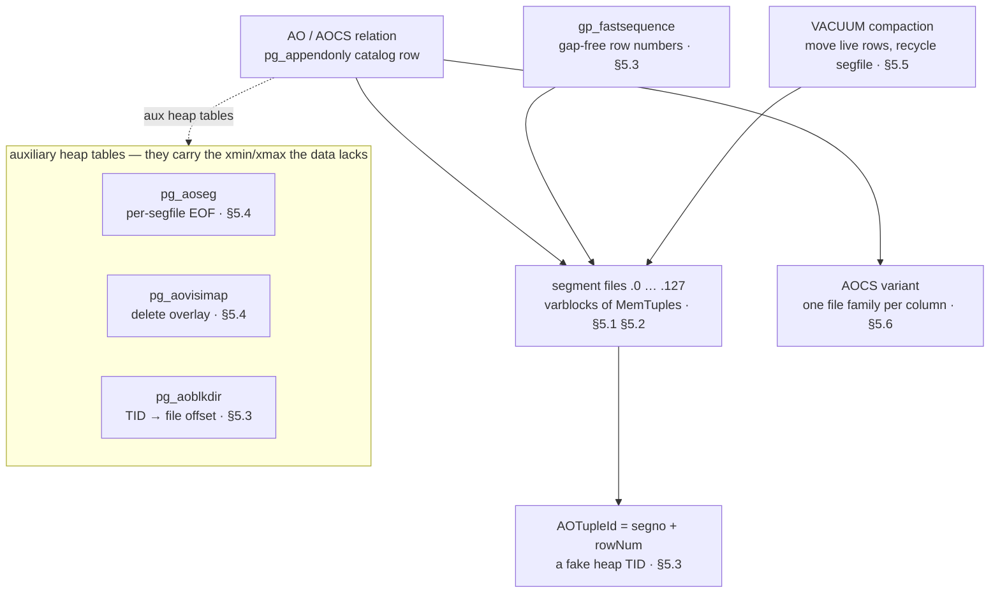
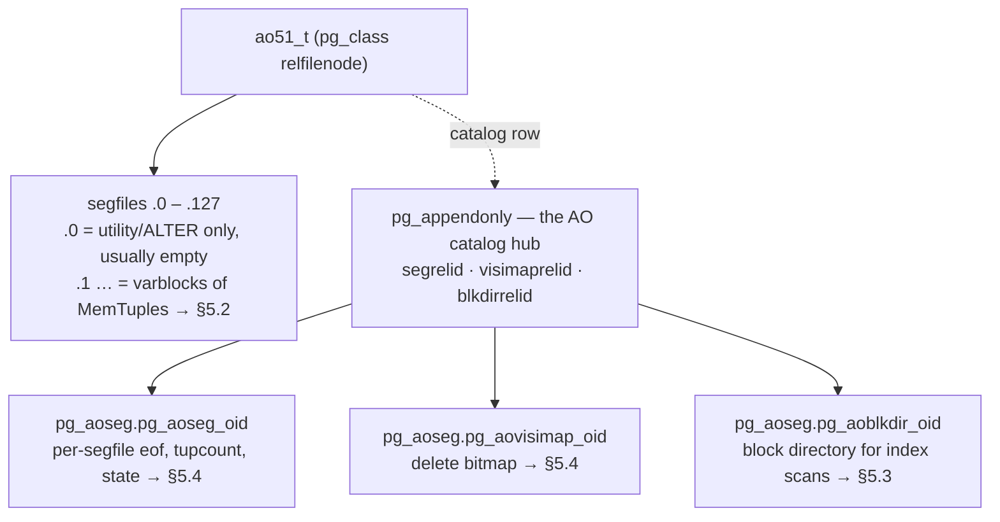
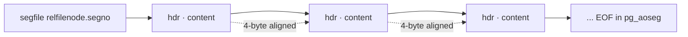
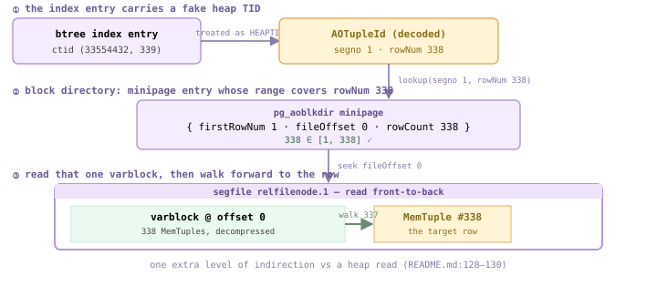
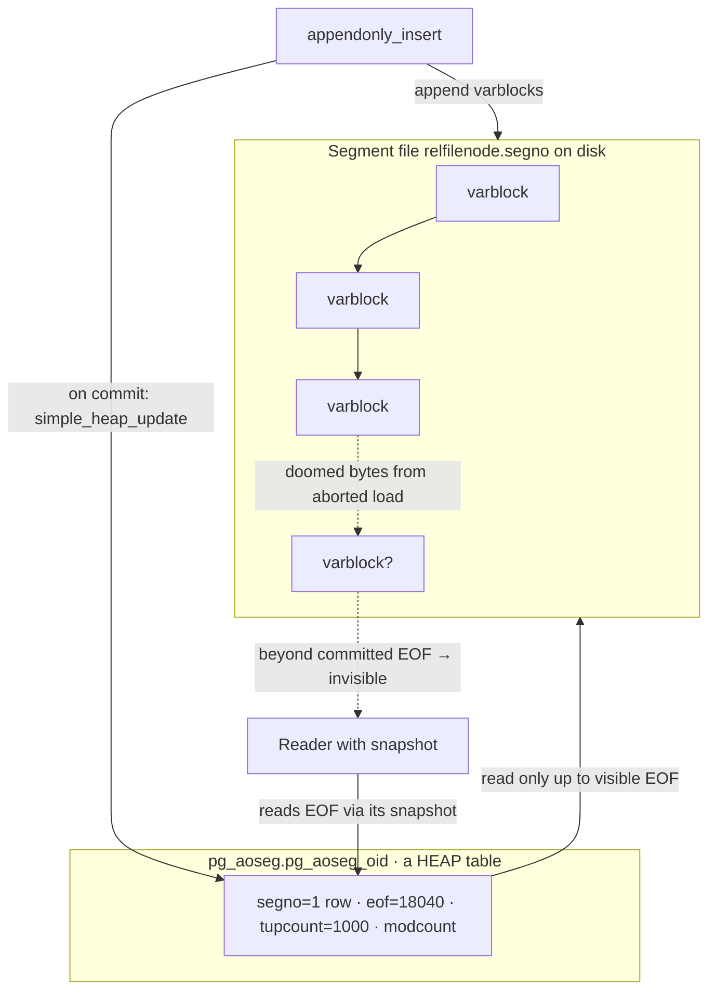
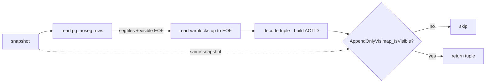
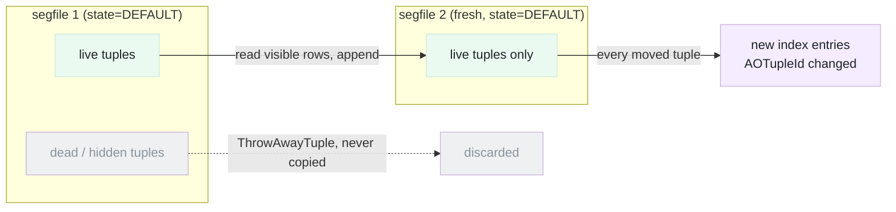
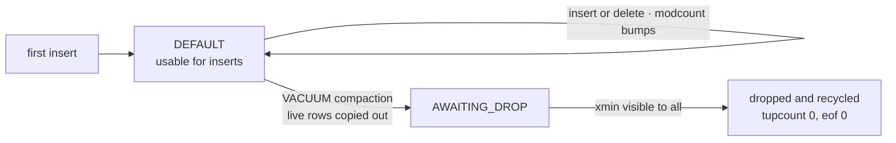
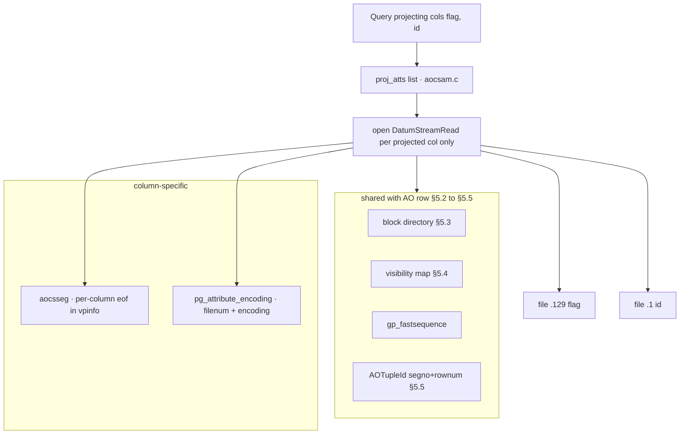

<!--
  Licensed to the Apache Software Foundation (ASF) under one
  or more contributor license agreements.  See the NOTICE file
  distributed with this work for additional information
  regarding copyright ownership.  The ASF licenses this file
  to you under the Apache License, Version 2.0 (the
  "License"); you may not use this file except in compliance
  with the License.  You may obtain a copy of the License at

    http://www.apache.org/licenses/LICENSE-2.0

  Unless required by applicable law or agreed to in writing,
  software distributed under the License is distributed on an
  "AS IS" BASIS, WITHOUT WARRANTIES OR CONDITIONS OF ANY
  KIND, either express or implied.  See the License for the
  specific language governing permissions and limitations
  under the License.
-->

import RawFigure from '../_components/RawFigure';

# 5. Append-Optimized Tables (AO & AOCS)



*How an append-optimized table is put together. The data is a stream of immutable segment files; everything that makes it transactional, deletable, and indexable lives in ordinary heap side-tables that carry the MVCC the AO tuples themselves omit. AOCS reuses every piece and only fans the data into one file family per column.*

## 5.1 MemTuple & the AO File Format

Chapter 4 showed the heap: every row carries a 23-byte header (xmin, xmax, t_ctid, infomask...), lives inside a buffered 32 KB page, and is read through the buffer manager (§2, §3). **Append-optimized (AO) tables throw most of that out.** Rows are serialized into a leaner on-disk form called a **MemTuple**, packed back-to-back into *varblocks*, written to plain **segment files** that the AO code reads and writes with its *own* block I/O — bypassing the shared buffer pool entirely. Per-row visibility (xmin/xmax) is gone from the tuple; it lives in a separate visibility-map table instead ([§5.4](#54-dml-scan--multi-version-control)). The result is a tuple that is smaller and faster to bulk-load, at the cost of needing a small constellation of auxiliary catalog/heap tables to make it updatable and indexable.

Despite the historical name, AO tables are *not* truly append-only at the SQL level — you can `UPDATE` and `DELETE` them. The name describes the *storage*: a segment file is only ever appended to; existing bytes are never rewritten in place (`src/backend/access/appendonly/README.md`).

### 5.1.1 An AO relation is N segment files plus a halo of metadata

Like a heap, an AO table's data lives in files named `<relfilenode>.<segno>` in the database directory. *Unlike* a heap, the segments are not uniform 1 GB BLCKSZ-paged chunks: each AO segfile is an independent stream of variable-sized blocks, segments can differ in size, can be missing, and can exceed 1 GB. A table has at most **128** segment files (`src/include/access/appendonlywriter.h:26`).

```c title="src/include/access/appendonlywriter.h:26"
#define MAX_AOREL_CONCURRENCY 128
```

**Segno 0 is special.** It is normally empty: ordinary inserts go into segments 1..127 (one per concurrent writer). Segment 0 is used only for rows inserted in *utility mode*, or pushed there when `ALTER TABLE` adds a column. We will see this on disk below — segno 0 is a 0-byte file.



*A zoom on [§5.1](#51-memtuple--the-ao-file-format)'s concern: the pg_appendonly catalog hub and the three concrete aux heap tables it names (up to 128 data segfiles; segno 0 reserved). The whole-chapter machinery is in the chapter-opening figure above.*

*Coordinator (port 7100): a fresh AO table's pg_appendonly row. checksum on, columnstore=f (this is ao_row, not ao_column), blkdirrelid still 0 — the block directory is created lazily on first CREATE INDEX.*

```sql
CREATE TABLE ao51_t (id int, name text, amount numeric)
        USING ao_row DISTRIBUTED BY (id);
      INSERT INTO ao51_t SELECT g,'row_'||g,g*1.5 FROM generate_series(1,1000) g;
      SELECT blocksize, compresstype, checksum, columnstore,
             segrelid, blkdirrelid, visimaprelid, version
      FROM pg_appendonly WHERE relid='ao51_t'::regclass;
```

```text {3} title="output"
 blocksize | compresstype | checksum | columnstore | segrelid | blkdirrelid | visimaprelid | version
      -----------+--------------+----------+-------------+----------+-------------+--------------+---------
           32768 |              | t        | f          |    17325 |           0 |        17326 |       2
      (1 row)
```

The aux tables are reached by joining the OID columns back through `pg_class`. They live in the `pg_aoseg` schema and are named with the AO relation's OID suffix (the suffix is *not* the segrelid value — find them via `::regclass`):

*Coordinator: the three auxiliary heap tables. blkdirrelid materialized only after CREATE INDEX.*

```sql
SELECT segrelid::regclass     AS aoseg_table,
             visimaprelid::regclass AS visimap_table
      FROM pg_appendonly WHERE relid='ao51_t'::regclass;
      CREATE INDEX ao51_idx ON ao51_t(id);
      SELECT blkdirrelid::regclass AS blkdir_table
      FROM pg_appendonly WHERE relid='ao51_t'::regclass;
```

```text {9} title="output"
       aoseg_table       |        visimap_table
      -------------------------+-----------------------------
       pg_aoseg.pg_aoseg_17322 | pg_aoseg.pg_aovisimap_17322
      (1 row)

      CREATE INDEX
              blkdir_table
      ----------------------------
       pg_aoseg.pg_aoblkdir_17322
      (1 row)
```

The data files live **on the segments**, not the coordinator. Connecting in utility mode to one primary segment, segno 0 is the empty 0-byte file and the 1000-row insert landed in segfile `.1`:

*Segment (port 7102, utility mode): on-disk segfiles. 16532 = segno 0 is empty; 16532.1 holds the data.*

```sql
SELECT pg_relation_filepath('ao51_t');   -- run on the segment
      -- then in a shell, ls the data dir:
      --   16532      0 bytes   (segno 0)
      --   16532.1  11384 bytes (segno 1)
```

```text title="output"
   filepath
      --------------
       base/5/16532
      (1 row)
```

:::note

Every AO data inspection in this chapter runs **on a segment in utility mode** (`PGOPTIONS='-c gp_role=utility' psql -p 7102`). The coordinator holds only the catalog (pg_appendonly + the aux table definitions); the segfiles and their tuples exist only on the segments.

:::

### 5.1.2 The MemTuple: a header-light on-disk tuple

Inside a varblock, a row is a `MemTupleData`. Its in-memory declaration is almost nothing — a 32-bit length/flags word, followed by a variable payload (`src/include/access/memtup.h:58`):

```c title="src/include/access/memtup.h:58"
typedef struct MemTupleData
      {
          uint32        PRIVATE_mt_len;
          unsigned char PRIVATE_mt_bits[1]; /* varlen */
      } MemTupleData;
```

Compare that to a heap tuple's fixed 23-byte `HeapTupleHeaderData`. The MemTuple has **no per-tuple transaction info** — no `t_xmin`, `t_xmax`, `t_ctid`, `t_infomask`. Visibility for AO rows is decided externally, via the aovisimap table and the MVCC state of the pg_aoseg row ([§5.3](#53-block-directory--fastsequence), [§5.4](#54-dml-scan--multi-version-control)). That alone saves ~20 bytes per row, which is the whole point for bulk-loaded fact tables.

The first word is overloaded. The **top bit** (`MEMTUP_LEAD_BIT`) is always set on a real tuple — it lets reader code distinguish a length word from a varblock length when streaming. The **length** occupies the middle bits via `MEMTUP_LEN_MASK = 0x3FFFFFF8` (note the low 3 bits are zeroed: tuples are 8-byte aligned, so the length is always a multiple of 8). The freed-up **low 3 bits hold the flags** (`src/include/access/memtup.h:66`):

```c title="src/include/access/memtup.h:66"
#define MEMTUP_LEAD_BIT    0x80000000
      #define MEMTUP_LEN_MASK    0x3FFFFFF8
      #define MEMTUP_HASNULL       1   /* a null bitmap is present  */
      #define MEMTUP_LARGETUP      2   /* len > 0xFFF0: 4-byte offsets */
      #define MEMTUP_HASEXTERNAL   4   /* has a TOAST pointer       */
```

<RawFigure html={"<div style=\"max-width:760px;margin:2px auto;font:11px/1.4 ui-monospace,SFMono-Regular,Menlo,monospace;color:#1f2328;overflow-x:auto\"> <div style=\"min-width:680px\"> <div style=\"color:#6b5b95;font-weight:600;margin:0 0 2px\">PRIVATE_mt_len — one uint32, 4 bytes (bit-packed length + flags)</div> <div style=\"display:flex;border:1px solid #cdb4db;text-align:center\"> <div style=\"flex:0 0 90px;border-right:1px solid #e3d5f5;background:#f5edff;padding:5px 2px\"><div style=\"color:#6b5b95\">bit 31</div><div style=\"font-size:9px;color:#444\">LEAD · 0x80000000</div></div> <div style=\"flex:1;border-right:1px solid #e3d5f5;background:#f5edff;padding:5px 2px\"><div style=\"color:#6b5b95\">bits 30–3</div><div style=\"font-size:9px;color:#444\">length, 8-byte aligned · MEMTUP_LEN_MASK <span class=\"hl\">0x3FFFFFF8</span></div></div> <div style=\"flex:0 0 120px;background:#fff4d6;padding:5px 2px\"><div style=\"color:#6b5b95\">bits 2–0</div><div style=\"font-size:9px;color:#444\">flags · EXT·LARGE·NULL</div></div></div> <div style=\"text-align:center;color:#8a7aa8;font-size:10px;padding:1px 2px\">↑ PRIVATE_mt_len — 4 bytes ↑</div> <div style=\"display:flex;text-align:center;margin-top:2px\"> <div style=\"flex:0 0 220px;border:1px solid #cdb4db;background:#fff4d6;padding:6px 2px\">null bitmap (PRIVATE_mt_bits[])<div style=\"font-size:9px;color:#777\">optional · only if HASNULL; first ~4 bytes overlap the len-word slack, extra via null_bitmap_extra_size</div></div> <div style=\"flex:1;border:1px solid #cdb4db;border-left:none;background:#eafaf0;padding:6px 2px\">attribute data — fixed-len then varlen, reordered &amp; 8-byte aligned<div style=\"font-size:9px;color:#777\">offsets come from the MemTupleBinding, not stored in the tuple</div></div></div> <div style=\"text-align:center;color:#6b8a76;font-size:10px;padding:1px 2px\">↑ no 23-byte transaction header — heap's t_xmin / t_xmax / t_ctid are simply absent ↑</div> </div></div>"} caption={"MemTupleData byte layout. Lavender = the 4-byte length/flags word (bit-packed); amber = the optional inline null bitmap; green = the packed, 8-byte-aligned attribute data. Heap's 23-byte transaction header is simply absent."} />

Crucially, a MemTuple stores *only the values* — there is no per-attribute offset array inside the tuple. Offsets, alignment padding, and null-bit positions are computed once per relation and cached in a **`MemTupleBinding`** (`src/include/access/memtup.h:48`), built from the `TupleDesc`. The binding even keeps two layouts: a compact 2-byte-offset `bind` for tuples ≤ `0xFFF0` bytes and a 4-byte-offset `large_bind` for bigger ones — which is exactly what the `MEMTUP_LARGETUP` flag selects.

```c title="src/include/access/memtup.h:48"
typedef struct MemTupleBinding
      {
          TupleDesc tupdesc;
          int       column_align;          /* 4 or 8 */
          int       null_bitmap_extra_size;
          MemTupleBindingCols bind;        /* 2-byte offsets */
          MemTupleBindingCols large_bind;  /* 4-byte offsets (large tup) */
      } MemTupleBinding;
```

Forming a row is `memtuple_form_to()` (`src/backend/access/common/memtuple.c:639`): it sets the length word with the lead bit, picks `bind` vs `large_bind` by size, writes the null bitmap *first* (because where each value lands depends on which preceding attributes are null), then copies the values into their bound offsets. The null bitmap is cheap: `compute_null_bitmap_extra_size()` (`src/backend/access/common/memtuple.c:59`) returns **0 extra bytes** when the bitmap fits in the 4 bytes of slack already available after the length word — so a table with few columns pays nothing for nullability.

### 5.1.3 Where the format plugs into the system

A table declared `USING ao_row` is wired to the AO access method through its table-AM handler. The handler returns a `TableAmRoutine` of function pointers; `ao_row_tableam_handler` is the entry point (`src/backend/access/appendonly/appendonlyam_handler.c:2369`):

```c title="src/backend/access/appendonly/appendonlyam_handler.c:2369"
Datum
      ao_row_tableam_handler(PG_FUNCTION_ARGS)
      {
          PG_RETURN_POINTER(&ao_row_methods);
      }
```

- **pg_appendonly** — Per-AO-table catalog row — "an extension of pg_class". Holds blocksize, compresstype/level, checksum, and the OIDs (segrelid / visimaprelid / blkdirrelid) that locate the aux tables. Defined at `src/include/catalog/pg_appendonly.h:27`.
- **aoseg table** — pg_aoseg.pg_aoseg_`&lt;oid>` — one row per segfile: its eof (committed length), tupcount, modcount, state. The eof is what makes AO crash-safe and MVCC-correct ([§5.3](#53-block-directory--fastsequence)).
- **aovisimap table** — pg_aovisimap_`&lt;oid>` — overlay bitmap marking deleted rows; makes DELETE/UPDATE work without touching the immutable segfiles ([§5.4](#54-dml-scan--multi-version-control)).
- **aoblkdir table** — pg_aoblkdir_`&lt;oid>` — maps a row's TID to a (segfile, offset); built lazily on first CREATE INDEX to allow random/index access ([§5.5](#55-vacuum--compaction)).

*Segment (utility mode): the aoseg row confirms the on-disk picture — only segno 1 has data; its eof 11384 exactly matches the 16532.1 file size, holding this segment's 338 of the 1000 distributed rows.*

```sql
SELECT segno, eof, tupcount, modcount, state
      FROM pg_aoseg.pg_aoseg_17322 ORDER BY segno;
```

```text {3} title="output"
 segno |  eof  | tupcount | modcount | state
      -------+-------+----------+----------+-------
           1 | 11384 |      338 |        1 |     1
      (1 row)
```

:::note

What's still missing from this picture: the *internal* structure of a segfile — the varblock headers, checksums, and compression that wrap these MemTuples. That is [§5.2](#52-variable-length-block-format).

:::

## 5.2 Variable-Length Block Format

A heap relation is a procession of identical 32 KB pages ([§4.1](./ch04.md#41-page-organization--item-pointers)) — every page the same size, every page self-describing. An append-optimized segment file is built on the opposite premise. As established in [§5.1](#51-memtuple--the-ao-file-format), it is a stream of **variable-sized blocks** — *varblocks* — laid back-to-back, each just big enough to hold whatever the writer handed it. The format is documented in `src/backend/access/appendonly/README.md:36`: *"An append-only segfile consists of a number of variable-sized blocks ... one after another. The varblocks are aligned to 4 bytes. Each block starts with a header."*

There is no page directory, no free-space slot array, no per-page line pointers. A reader that wants the *n*-th block cannot jump to `n * BLCKSZ`; it must walk from the front, reading each header to learn how far to the next one. That is the price of packing — and the reason every block carries its own length in its header.

<RawFigure html={"<div style=\"max-width:780px;margin:2px auto;font:11px/1.4 ui-monospace,SFMono-Regular,Menlo,monospace;color:#1f2328;overflow-x:auto\"> <div style=\"min-width:720px\"> <div style=\"color:#6b5b95;font-weight:600;margin:0 0 2px\">basic header — 8 bytes (two uint32, bit-packed) → 1 + 3 + 1 + 3 + 14 + 21 + 21 = <span class=\"hl\">64</span> bits</div> <div style=\"display:flex;border:1px solid #cdb4db;text-align:center\"> <div style=\"flex:0 0 48px;border-right:1px solid #e3d5f5;background:#f4f5f6;padding:5px 1px\"><div style=\"color:#9aa3ac\">1 b</div><div style=\"font-size:9px;color:#9aa3ac\">reserved</div></div> <div style=\"flex:0 0 92px;border-right:1px solid #e3d5f5;background:#f5edff;padding:5px 1px\"><div style=\"color:#6b5b95\">3 b</div><div style=\"font-size:9px;color:#444\">kind · SmallContent</div></div> <div style=\"flex:0 0 84px;border-right:1px solid #e3d5f5;background:#fff4d6;padding:5px 1px\"><div style=\"color:#6b5b95\">1 b</div><div style=\"font-size:9px;color:#444\">hasFirstRowNum</div></div> <div style=\"flex:0 0 92px;border-right:1px solid #e3d5f5;background:#f5edff;padding:5px 1px\"><div style=\"color:#6b5b95\">3 b</div><div style=\"font-size:9px;color:#444\">executorKind · AO row</div></div> <div style=\"flex:1;border-right:1px solid #e3d5f5;background:#f5edff;padding:5px 1px\"><div style=\"color:#6b5b95\">14 b</div><div style=\"font-size:9px;color:#444\">rowCount</div></div> <div style=\"flex:1;border-right:1px solid #e3d5f5;background:#f5edff;padding:5px 1px\"><div style=\"color:#6b5b95\">21 b</div><div style=\"font-size:9px;color:#444\">dataLength · uncompressed</div></div> <div style=\"flex:1;background:#f5edff;padding:5px 1px\"><div style=\"color:#6b5b95\">21 b</div><div style=\"font-size:9px;color:#444\">compressedLength · 0 if none</div></div></div> <div style=\"text-align:center;color:#8a7aa8;font-size:10px;padding:1px 2px\">↑ basic header = 8 bytes ↑</div> <div style=\"display:flex;text-align:center;margin-top:2px\"> <div style=\"flex:0 0 210px;border:1px solid #cdb4db;background:#fff4d6;padding:6px 2px\">firstRowNumber<div style=\"font-size:9px;color:#777\">int64 · 8 B · only if hasFirstRowNum</div></div> <div style=\"flex:1;border:1px solid #cdb4db;border-left:none;background:#fff4d6;padding:6px 2px\">header checksum<div style=\"font-size:9px;color:#777\">pg_crc32 · 4 B · optional</div></div> <div style=\"flex:1;border:1px solid #cdb4db;border-left:none;background:#fff4d6;padding:6px 2px\">block checksum<div style=\"font-size:9px;color:#777\">pg_crc32 · 4 B · optional</div></div></div> <div style=\"border:1px solid #cdb4db;border-top:none;background:#eafaf0;padding:9px 8px;text-align:center;margin-top:2px\">content = packed MemTuples (§5.1), compressed or raw · length = compressedLength or dataLength · padded to 4-byte boundary</div> <div style=\"text-align:center;color:#8a7aa8;font-size:10px;padding:2px\">a row larger than one block → a LargeContent header (no data) followed by SmallContent fragments</div> </div></div>"} caption={"One small-content varblock (table created WITH checksums). Lavender = the 8-byte basic header, seven bit-fields summing to 64 (note the leading reserved bit and the hasFirstRowNum flag) · amber = the optional firstRowNumber and the two checksums · green = the packed, possibly-compressed MemTuples (§5.1). Everything is rounded up to a 4-byte boundary."} />

That layout is not one fixed C struct — it is a small **family** of headers, and the read engine first decodes which kind it is looking at before trusting any other field. The rest of this section walks the family, the two checksums, and what compression actually does to the green region above.

### 5.2.1 A segfile is a chain of 4-byte-aligned varblocks

Contrast the two physical layouts directly. A heap segment grows in `BLCKSZ` (32768-byte) steps and is addressed by arithmetic. An AO segment grows by *appending* one varblock after the next, each padded up to the next 4-byte multiple, with no global slot table. To find block *k* you replay the headers from the start — exactly how `cdbappendonlystorageread.c` scans.



*An AO segment file is a forward-only chain. Each header carries its own length, so the reader hops header → content → next header. There is no jump table.*

The basic header is **8 bytes** — two `uint32` words, bit-packed because the fields don't fall on byte boundaries (`src/include/cdb/cdbappendonlystorage.h:69`). Optional extras follow: a *first row number* (`int64`) for blocks that need it, and the two checksums when the table was created `WITH (checksum=true)`. The total is computed by `AoHeader_Size` from three booleans:

```c title="src/include/cdb/cdbappendonlystorage.h:69"
#define AoHeader_RegularSize 8
      #define AoHeader_LongSize   16
      /* AoHeader_Size: base (regular|long) + 2*sizeof(pg_crc32) if checksums
       *                                    + sizeof(int64)      if hasFirstRowNum */
```

### 5.2.2 The header family: basic, small-content, large-content

Every header begins with the same first nibble: 1 reserved bit and a 3-bit **header kind**. That common prefix is the `AOHeader` base "class" (`src/include/cdb/cdbappendonlystorage_int.h:37`); the kind tells the reader which of the specialized layouts the remaining 60 bits follow.

```c title="src/include/cdb/cdbappendonlystorage.h:58"
typedef enum AoHeaderKind {
          AoHeaderKind_None = 0,
          AoHeaderKind_SmallContent = 1,
          AoHeaderKind_LargeContent = 2,
          AoHeaderKind_NonBulkDenseContent = 3,
          AoHeaderKind_BulkDenseContent = 4,
      } AoHeaderKind;
```

The workhorse is **SmallContent** — `AOSmallContentHeader` (`src/include/cdb/cdbappendonlystorage_int.h:64`). Its 60 specific bits pack `hasFirstRowNum` (1), `executorBlockKind` (3), `rowCount` (14), `dataLength` (21) and `compressedLength` (21). Note the budget: `rowCount` is only 14 bits and `dataLength`/`compressedLength` only 21 bits — so one small-content block holds at most a blocksize worth of bytes and a bounded number of rows.

What about a single row bigger than a whole block? It becomes **large content**. The writer emits one `AOLargeContentHeader` (`src/include/cdb/cdbappendonlystorage_int.h:172`) carrying nothing but the total `largeContentLength` (30 bits → up to ~1 GB) and a 25-bit `largeRowCount`, *then* writes as many SmallContent blocks as needed to carry the bytes. The comment at `:81` spells it out: the large header says how long the content is, and the SmallContent fragments that follow store it. (Two further kinds, `NonBulkDenseContent` and `BulkDenseContent`, exist for column-oriented AOCS — the latter is the only *long* 16-byte header; see `AoHeader_IsLong` at `src/include/cdb/cdbappendonlystorage.h:75`.)

- **SmallContent** — Everything that fits in one block; also the fragments of a spanned large row. Header at :64.
- **LargeContent** — A data-less marker: total length + row count of an oversized row, followed by SmallContent fragments. Header at :172.
- **NonBulk/BulkDense** — AOCS column blocks that need many more rows per block; Bulk uses the 16-byte long header.

The public API mirrors the family. Writers call `AppendOnlyStorageFormat_MakeSmallContentHeader` (`src/include/cdb/cdbappendonlystorageformat.h:20`) and `MakeLargeContentHeader` (`:31`); readers call `GetHeaderInfo` (`:43`) to learn the kind and header length, then `GetSmallContentHeaderInfo` (`:49`) or `GetLargeContentHeaderInfo` (`:68`) to unpack the rest. The write path is in `src/backend/cdb/cdbappendonlystoragewrite.c:1104` and `:1527`; the read path in `cdbappendonlystorageread.c`.

### 5.2.3 Two checksums per block — header and content

When a table is created `WITH (checksum=true)`, each block carries **two** CRC-32s, and they protect different things. The README at `src/backend/access/appendonly/README.md:42` notes only that *"The header also contains two checksums"* — the why is in the format header: the **header checksum** is verified *first*, and only if it passes are the header fields (lengths, kind, rowCount) trusted; the **block checksum** then covers the whole block including its content.

```c title="src/include/cdb/cdbappendonlystorage_int.h:24"
/* 64 bit header + [ block checksum + header checksum ].
       * ... The header checksum protects the header and the block
       * checksum. If it is valid, the header fields can be used. */
```

The two verifiers are `AppendOnlyStorageFormat_VerifyHeaderChecksum` (`src/include/cdb/cdbappendonlystorageformat.h:78`) and `VerifyBlockChecksum` (`:83`); the read engine calls the header one before decoding anything (`src/backend/cdb/cdbappendonlystoragewrite.c:769` on the write/verify path). Both checksums are **absent** when checksums are off — the block then begins straight with content after the 8-byte header, and `AoHeader_Size` adds nothing for them.

*Coordinator: both ao52_* tables were created with the default checksum=t — so every block here carries both CRCs.*

```sql
SELECT c.relname, a.blocksize, a.compresstype,
             a.compresslevel, a.checksum
      FROM pg_appendonly a JOIN pg_class c ON c.oid = a.relid
      WHERE c.relname IN ('ao52_plain','ao52_zstd')
      ORDER BY c.relname;
```

```text {3,4} title="output"
  relname   | blocksize | compresstype | compresslevel | checksum 
      ------------+-----------+--------------+---------------+----------
       ao52_plain |     32768 |              |             0 | t
       ao52_zstd  |     32768 | zstd         |             5 | t
      (2 rows)
```

### 5.2.4 Compression — the green region shrinks

`blocksize` and `compresstype`/`compresslevel` come straight from `pg_appendonly` (the columns above). The block size — `32768` by default — caps the *uncompressed* content per block. Compression then acts only on the green content region: `none`, `zlib`, `zstd`, or `rle_type` per `compresstype`, at `compresslevel`. The header records both numbers — `dataLength` is the uncompressed size, `compressedLength` the on-disk size — so a reader knows how many bytes to read and how many to expect after inflation.

If compression fails to actually shrink the buffer, the writer stores it raw and sets `compressedLength = 0` (`src/backend/cdb/cdbappendonlystoragewrite.c:1090`); that zero is the on-disk signal for *"this block is uncompressed."* The reader pulls the on-disk length back out with `AppendOnlyStorageFormat_GetCompressedLen` (`src/include/cdb/cdbappendonlystorageformat.h:65`), which is a one-line bit extraction:

```c title="src/backend/cdb/cdbappendonlystorageformat.c:1416"
AppendOnlyStorageFormat_GetCompressedLen(uint8 *headerPtr) {
          AOSmallContentHeader *blockHeader = (AOSmallContentHeader *) headerPtr;
          return AOSmallContentHeaderGet_compressedLength(blockHeader);
      }
```

The effect is dramatic on compressible data. We inserted the **same 50,000 rows** into `ao52_plain` and `ao52_zstd` (identical except the latter's `compresstype=zstd, compresslevel=5`), each row a 800-byte repeated string — then measured the segfile on a single segment:

*Segment (port 7102, utility mode): same rows, but zstd shrank the segfile from 13 MB to 127 kB — ~105× here because the repeated payload is highly compressible.*

```sql
SELECT 'ao52_plain' AS tbl,
             pg_size_pretty(pg_relation_size('ao52_plain')) AS segfile,
             pg_relation_size('ao52_plain') AS bytes
      UNION ALL
      SELECT 'ao52_zstd',
             pg_size_pretty(pg_relation_size('ao52_zstd')),
             pg_relation_size('ao52_zstd');
```

```text {4} title="output"
    tbl     | segfile |  bytes   
      ------------+---------+----------
       ao52_plain | 13 MB   | 13672344
       ao52_zstd  | 127 kB |   130288
      (2 rows)
```

:::note

Same logical rows, same blocksize, same checksums — only the content of each varblock changed. The block format is the constant; compression is a per-block transform on the green payload, recorded in two header fields and reversible without scanning the rest of the file.

:::

## 5.3 Block Directory & fastsequence

### 5.3.1 The problem: a heap reads anywhere, an AO segfile reads front-to-back

[§5.1](#51-memtuple--the-ao-file-format) showed AO data living in **varblocks**, packed nose-to-tail inside a segment file with no slot array, no per-block addressing — you read them by streaming the file from byte 0 forward. That is perfect for a sequential scan and hostile to everything else. An index entry says *“the row you want is over there”* and expects to **jump straight to it**. A heap can: a heap TID is `(block#, offset)`, and a block number is just a multiply by `BLCKSZ` into the file. An AO row has no such address — it only knows it is *the Nth row of segment file K*.

Cloudberry bridges the gap with two pieces of machinery. First, a row needs an **identity** the rest of the system can store and pass around — `AOTupleId`, a fake heap TID. Second, that identity needs to be **resolvable** to a physical file offset — the **block directory**, an extra level of indirection built on demand. As **README.md:128-130** puts it: *“there is one extra level of indirection with index scans on an AO table, compared to a heap table.”* This section follows the path index → AOTupleId → block directory → varblock → tuple.



*The extra level of indirection: an AO index probe resolves a fake heap TID through the block directory to a file offset, then reads and walks exactly one varblock. Real values from the ao53_t demo: id=1000 → ctid (33554432, 339) → segno 1, rowNum 338.*

### 5.3.2 AOTupleId — a row's identity is (segfile#, row#), wearing a heap TID costume

Indexes, the executor, trigger code, EXPLAIN — *“much of the rest of the system, expect every tuple to have a unique physical identifier”* (**README.md:138-139**). That identifier is a 6-byte `ItemPointer` (block 4 bytes + offset 2 bytes). AO has no heap blocks, so it manufactures a 48-bit value that *looks* like a legal `ItemPointer` but really encodes `(segfile#, rowNum)`. The struct in **appendonlytid.h:53** is three `uint16`s — deliberately the same size and alignment as an `ItemPointer`:

```c title="src/include/access/appendonlytid.h:53"
typedef struct AOTupleId
      {
          uint16  bytes_0_1;
          uint16  bytes_2_3;
          uint16  bytes_4_5;
      } AOTupleId;
```

:::note

WARNING in the header (appendonlytid.h:24): *“Outside the appendonly AM code, AOTIDs are treated as HEAPTIDs!”* The struct must never produce a value that looks like an *invalid* ItemPointer — which is why the offset field is biased by +1 so it is never zero.

:::

The 48 bits split three ways. The **top 7 bits** are the segment file number (`AOTupleIdGet_segmentFileNum`, **appendonlytid.h:76** — `(bytes_0_1 & 0xFE00) >> 9`), giving the **128**-segfile limit ([§5.1](#51-memtuple--the-ao-file-format)). The remaining **40 bits** are the row number (`AOTupleIdGet_rowNum`, **appendonlytid.h:102**), capped at `AOTupleId_MaxRowNum = 1099511627775` (**appendonlytid.h:141**) — about 1.1 trillion rows per segfile. The clever part is how those 40 bits straddle the word boundary so the *whole thing* still reads as a sane `(block#, offset)`:

<RawFigure html={"<div style=\"max-width:760px;margin:2px auto;font:11px/1.4 ui-monospace,SFMono-Regular,Menlo,monospace;color:#1f2328;overflow-x:auto\"> <div style=\"min-width:680px\"> <div style=\"display:flex;text-align:center;color:#6b5b95;font-size:10px;font-weight:600;margin-bottom:2px\"> <div style=\"flex:16;border-right:2px solid #fff\">bytes_0_1 (16 b)</div><div style=\"flex:16;border-right:2px solid #fff\">bytes_2_3 (16 b)</div><div style=\"flex:16\">bytes_4_5 (16 b)</div></div> <div style=\"color:#6b5b95;font-weight:600;font-size:10px;margin:0 0 1px\">heap view — what generic ItemPointer code sees</div> <div style=\"display:flex;border:1px solid #cdb4db;text-align:center\"> <div style=\"flex:32;border-right:1px solid #e3d5f5;background:#f5edff;padding:5px 2px\">BlockNumber (32 bits)</div> <div style=\"flex:16;background:#eafaf0;padding:5px 2px\">ip_posid (16 bits)</div></div> <div style=\"color:#6b5b95;font-weight:600;font-size:10px;margin:6px 0 1px\">AO view — the real (segfile#, rowNum) encoding</div> <div style=\"display:flex;border:1px solid #cdb4db;text-align:center\"> <div style=\"flex:7;border-right:1px solid #e3d5f5;background:#fff4d6;padding:5px 1px\"><div style=\"color:#8a6d1a;font-weight:700\">segno</div><div style=\"font-size:9px;color:#444\">7 b</div></div> <div style=\"flex:9;border-right:1px solid #e3d5f5;background:#faf6ff;padding:5px 1px\"><div style=\"color:#6b5b95\">rowNum hi</div><div style=\"font-size:9px;color:#444\">9 b · &amp; 0x01FF</div></div> <div style=\"flex:16;border-right:1px solid #e3d5f5;background:#faf6ff;padding:5px 1px\"><div style=\"color:#6b5b95\">rowNum mid</div><div style=\"font-size:9px;color:#444\">16 b · bytes_2_3</div></div> <div style=\"flex:16;background:#faf6ff;padding:5px 1px\"><div style=\"color:#6b5b95\">rowNum lo</div><div style=\"font-size:9px;color:#444\">15 b <span class=\"hl\">+ 1 bias</span> · bytes_4_5</div></div></div> <div style=\"text-align:center;color:#8a7aa8;font-size:10px;padding:2px\">↑ 7-bit segfile# + 40-bit rowNum (9 │ 16 │ 15) — never produces a zero offset ↑</div> </div></div>"} caption={"48-bit AOTupleId laid over a heap ItemPointer. The 7-bit segfile# and the 40-bit rowNum (split 9 │ 16 │ 15 across the three uint16 words) together still read as a legal (block#, offset): the low 15 rowNum bits land in the offset word that heap code treats as ip_posid, and the +1 bias keeps that offset non-zero."} />

```c title="src/include/access/appendonlytid.h:76"
segno  = (bytes_0_1 & 0xFE00) >> 9;                  /* top 7 bits          */
rowNum = ((int64)(bytes_0_1 & 0x01FF) << 31)         /* high  9 bits        */
       | ((int64) bytes_2_3 << 15)                   /* middle 16 bits      */
       | (bytes_4_5 - 1);                            /* low 15, +1 bias off */
```

So a *fake CTID* of `(33554432, 2)` is not random: `33554432 = 1 << 25`, i.e. segno **1** with a zero high-row-part, and offset `2 = rowNum 0 + 1`. The same demo table proves it — note both the `1 << 25` block number and the `+1` offset bias:

*The ctid column of an AO table is a synthesized AOTupleId. id=1 sits at rowNum 1 (offset 2), id=1000 at rowNum 338 (offset 339) on its segment.*

```sql
SELECT gp_segment_id, ctid, id FROM ao53_t WHERE id IN (1, 1000) ORDER BY id;
```

```text {3} title="output"
 gp_segment_id |      ctid      |  id
      ---------------+----------------+------
                   1 | (33554432,2)   |    1
                   0 | (33554432,339) | 1000
      (2 rows)
```

`33554432 >> 25 = 1` → both rows are in **segment file 1**; the offsets `2` and `339` decode to rowNums `1` and `338`. No row ever gets offset 0, satisfying the heap-world invariant that a valid TID has a non-zero offset (**appendonlytid.h:39-43**).

### 5.3.3 gp_fastsequence — gap-free row numbers, without a heavyweight sequence

Where do those rowNums come from? They must be **dense and monotonic per segfile** (the block directory stores *ranges* of them), allocated under the relation-extension lock during INSERT, on every segment, millions of times. A real `SEQUENCE` object — with its own relfilenode, WAL, and buffer traffic — would be far too heavy. Cloudberry uses a stripped-down counter: **`gp_fastsequence`** (catalog OID 7023, **gp_fastsequence.h:25**), three columns wide:

*FormData_gp_fastsequence — gp_fastsequence.h:26-30*

| Field | Type | Meaning |
| --- | --- | --- |
| objid | Oid | the aoseg relation's OID (pg_appendonly.segrelid), i.e. which AO table |
| objmod | int8 | the segment file number (segno) — so there is exactly one counter row per segfile |
| last_sequence | int8 | highest rowNum handed out so far for this (segrelid, segno) |

Allocation goes through **`GetFastSequences`** (**gp_fastsequence.c:199**): it scans for the `(objid, objmod)` row under `RowExclusiveLock`, bumps `last_sequence` by the requested count, and returns the first number of the new run. AO inserts call it with the segfile they are writing, in chunks of **`NUM_FAST_SEQUENCES` = 100** (**gp_fastsequence.h:44**):

```c title="src/backend/access/appendonly/appendonlyam.c:3048"
firstSequence = GetFastSequences(aoInsertDesc->segrelid, segno,
                                       ...,
                                       NUM_FAST_SEQUENCES);
```

The update is an **in-place** heap update (`heap_inplace_update`, **gp_fastsequence.c:177**), not an MVCC insert — there is no version churn, the counter just advances. Newly created AO tables get a frozen placeholder row for the reserved segno 0 via `InsertInitialFastSequenceEntries` (**gp_fastsequence.c:61**, `RESERVED_SEGNO = 0`). Reading the catalog on a **segment** (the counters live where the data lives) shows one row per segfile:

*One counter row per segfile. Segno 0 is the reserved placeholder; segno 1 has handed out up to row 400 on this segment — rounded up from the 338 live rows by the 100-at-a-time chunking.*

```sql
-- segment, utility mode (PGPORT=7102)
      SELECT objid::regclass AS aoseg, objmod AS segno, last_sequence
      FROM gp_fastsequence
      WHERE objid = (SELECT segrelid FROM pg_appendonly
                     WHERE relid = 'ao53_t'::regclass)
      ORDER BY objmod;
```

```text {4} title="output"
          aoseg          | segno | last_sequence
      -------------------------+-------+---------------
       pg_aoseg.pg_aoseg_17377 |     0 |             0
       pg_aoseg.pg_aoseg_17377 |     1 |           400
      (2 rows)
```

:::note

The chunk-rounding is *why* row numbers can have gaps between block-directory entries — see the comment in **cdbappendonlyblockdirectory.h:38-41**: fastsequence *“allocates blocks of row numbers of a pre-determined size (that may be larger than the number of blocks being inserted).”* The block directory tolerates these holes by storing explicit ranges.

:::

### 5.3.4 The block directory — (segno, rowNum range) → file offset, built on first CREATE INDEX

AOTupleId gives a row a *name*; the block directory turns that name into a *location*. It is itself an ordinary heap table, `pg_aoseg.pg_aoblkdir_<oid>`, pointed to by **`pg_appendonly.blkdirrelid`**, with its own btree index on `(segno, columngroup, firstRowNum)`. Crucially it is **lazy**: a freshly loaded AO table that is never indexed has no block directory at all. **README.md:132-133**: *“The block directory is only created if it's needed, by the first CREATE INDEX command.”* Watch `blkdirrelid` flip from 0 to a real relation:

*Before any index, blkdirrelid is 0 — there is no random-access machinery, because nothing needs it yet.*

```sql {2}
SELECT relid::regclass AS aotable, segrelid,
             blkdirrelid, visimaprelid
      FROM pg_appendonly WHERE relid = 'ao53_t'::regclass;
```

```text {3} title="output"
 aotable | segrelid | blkdirrelid | visimaprelid
      ---------+----------+-------------+--------------
       ao53_t  |    17380 |           0 |        17381
      (1 row)
```

*CREATE INDEX builds the directory on demand; blkdirrelid now names a real pg_aoblkdir heap table.*

```sql
CREATE INDEX ao53_t_id_idx ON ao53_t (id);

      SELECT blkdirrelid, blkdirrelid::regclass AS blkdir_table
      FROM pg_appendonly WHERE relid = 'ao53_t'::regclass;
```

```text {3} title="output"
 blkdirrelid |        blkdir_table
      -------------+----------------------------
             17385 | pg_aoseg.pg_aoblkdir_17377
      (1 row)
```

Each block-directory row carries a packed **minipage** — an array of `MinipageEntry`, each `{firstRowNum, fileOffset, rowCount}` (**cdbappendonlyblockdirectory.h:56-61**) describing one varblock-sized run. Entries are appended as data is written (`AppendOnlyBlockDirectory_InsertEntry`, **appendonlyblockdirectory.c:962**). A lookup runs **`AppendOnlyBlockDirectory_GetEntry`** (**appendonlyblockdirectory.c:557**), which splits the AOTupleId and finds the entry whose range covers `rowNum`:

```c title="src/backend/access/appendonly/appendonlyblockdirectory.c:564"
int   segmentFileNum = AOTupleIdGet_segmentFileNum(aoTupleId);
      int64 rowNum         = AOTupleIdGet_rowNum(aoTupleId);
      /* ... search the minipage for the entry covering rowNum,
         then return range.fileOffset / range.firstRowNum */
```

The covering check is exactly `rowNum >= firstRowNum && rowNum <= lastRowNum` (**appendonlyblockdirectory.c:90**). Once the entry is found, the scan `seeks` to `fileOffset` in the segfile, reads that one varblock, decompresses it, and walks forward `(rowNum - firstRowNum)` tuples — the only sequential step left, now bounded to a single block. The `gp_aoblkdir()` UDF (**appendonly_blkdir_udf.c:41**) flattens these minipages into one row per entry; on a segment for our 338-row segfile there is a single entry covering the whole block:

*One varblock, one minipage entry: rows 1..338 of segfile 1 live at file_offset 0. An index probe for any of them resolves here, then reads exactly that block.*

```sql
-- segment, utility mode (PGPORT=7102)
      SELECT tupleid, segno, columngroup_no AS colgrp, entry_no,
             first_row_no, file_offset, row_count
      FROM gp_toolkit.__gp_aoblkdir('ao53_t')
      ORDER BY segno, first_row_no;
```

```text {3} title="output"
 tupleid | segno | colgrp | entry_no | first_row_no | file_offset | row_count
      ---------+-------+--------+----------+--------------+-------------+-----------
       (0,1)   |     1 |      0 |        0 |            1 |           0 |       338
      (1 row)
```

Two follow-ons worth noting. For **AOCO** tables there is one minipage per *column group*, since columns live in different segfiles — `GetEntry` takes a `columnGroupNo` (**appendonlyblockdirectory.c:561**) and AOCO fetch re-scans the directory per column. And for **unique indexes**, the directory does double duty: because AO tuples carry no xmin/xmax, visibility for uniqueness checks is borrowed from the block-directory heap rows themselves, with placeholder entries inserted up-front to cover not-yet-written rows (**README.md:189-224**). The same indirection that enables index scans is what makes unique constraints on AO tables possible at all.

## 5.4 DML, Scan & Multi-Version Control

### 5.4.1 The trick: append the bytes, but commit the metadata

An AO segfile is **append-only on disk** — bytes are never updated or overwritten in place (`src/backend/access/appendonly/README.md`, opening note). Yet the table supports `INSERT`, `DELETE` and `UPDATE` with full transactional visibility. The whole design rests on one idea: the durable, in-place, MVCC-governed object is *not* the segfile — it is a row in an ordinary **heap** side-table. A loader streams varblocks to the end of a segfile, but those bytes mean nothing until the loader **updates a heap tuple** that records the segfile's new logical end (its **EOF**). That heap update is the commit. Everything below — inserts, deletes, visibility, crash-safety — is a consequence of letting the aoseg / aovisimap heap tuples carry the xmin/xmax that the AO tuples themselves do not have.



*INSERT appends raw bytes to a segfile, then 'commits' by updating the EOF row in pg_aoseg. A reader trusts only the EOF its snapshot can see — so an aborted load that never advanced EOF is silently ignored.*

Three heap side-tables back every AO table (README §'Aosegments table'): **pg_aoseg** (one row per segfile: EOF, tupcount, modcount, state), **pg_aovisimap** (the delete overlay), and the block directory (for index access, [§5.5](#55-vacuum--compaction)). Find them through `pg_appendonly.segrelid` / `visimaprelid`. Because they are plain heaps, *their* tuples carry real xmin/xmax — and that borrowed MVCC is what makes AO transactional.

:::note

AO tuples have no per-tuple xmin/xmax. Visibility is decided entirely by (1) the committed **EOF** of the segfile (for inserts) and (2) the **visimap** overlay (for deletes) — both stored as MVCC heap tuples. This section is about those two mechanisms.

:::

### 5.4.2 INSERT: every writer gets its own segfile

Before appending, a writer must pick a target segfile. `ChooseSegnoForWrite` `src/backend/access/appendonly/appendonlywriter.c:256` → `choose_segno_internal` **:381** scans pg_aoseg for a segment that is in `AOSEG_STATE_DEFAULT`, not full (`tupcount <= segfileMaxRowThreshold`), and not already locked by another transaction. The chosen segfile's pg_aoseg row is then **row-locked** with `heap_lock_tuple(... LockTupleExclusive, LockWaitSkip ...)` **:230** so no other backend can claim it concurrently. The scan itself is serialized by a short-lived relation-level lock — `LockDatabaseObject(... ExclusiveLock)` **:414** — released the moment the tuple lock is taken (README §'Locking and snapshots').

The consequence is the headline property: **two concurrent inserters never block each other**, because each one locks a *different* pg_aoseg row and appends to a *different* physical segfile. A segfile is owned by at most one writing transaction at a time.

```c title="src/backend/access/appendonly/appendonlywriter.c:230"
/* lock the chosen segfile's pg_aoseg row; skip if busy */
      result = heap_lock_tuple(pg_aoseg_rel, &locktup,
                   GetCurrentCommandId(true),
                   LockTupleExclusive, LockWaitSkip,
                   false, &buf, &hufd);
      if (result != TM_Ok)
          elog(ERROR, "could not lock segfile %d", segno);
```

Tuples are then streamed by `appendonly_insert` `src/backend/access/appendonly/appendonlyam.c:3084`, which packs rows into varblocks and assigns each a TID built from `(cur_segno, lastSequence)` via `AOTupleIdInit` **:3269** (row numbers come from `gp_fastsequence`, a crash-safe counter). Nothing in pg_aoseg moves yet. Only at end-of-insert does `CloseWritableFileSeg` **:438** flush the file and call `UpdateFileSegInfo` **:450** — which does a `simple_heap_update` (`aosegfiles.c:929`) on the segfile's pg_aoseg row, writing the new EOF, tupcount, and bumping modcount. **That heap update is the commit point of the data.**

*Two concurrent transactions each INSERT into ao54_t. They run without blocking — and each lands in its own segfile: segno 1 (1000 rows) and segno 2 (2000 rows), per segment. (Table is DISTRIBUTED REPLICATED, so segment_id 0/1/2 each hold a full copy.)*

```sql
-- session A: BEGIN; INSERT 1000 'A-' rows; (sleep) COMMIT;
      -- session B (concurrent): BEGIN; INSERT 2000 'B-' rows; COMMIT;
      SELECT segment_id, segno, eof, tupcount, modcount, state
      FROM   gp_toolkit.__gp_aoseg('ao54_t')
      ORDER  BY segment_id, segno;
```

```text title="output"
 segment_id | segno |  eof  | tupcount | modcount | state
      ------------+-------+-------+----------+----------+-------
                0 |     1 | 18040 |     1000 |        1 |     1
                0 |     2 | 44080 |     2000 |        1 |     1
                1 |     1 | 18040 |     1000 |        1 |     1
                1 |     2 | 44080 |     2000 |        1 |     1
                2 |     1 | 18040 |     1000 |        1 |     1
                2 |     2 | 44080 |     2000 |        1 |     1
      (6 rows)
```

### 5.4.3 EOF-snapshot MVCC: the abort that left bytes behind

Because the EOF lives in an MVCC heap tuple, insert visibility is *free*. A reader takes its snapshot, reads the pg_aoseg row **through that snapshot**, and then reads the segfile **only up to the EOF it saw** (README §'Aosegments table' and §'Locking and snapshots'). A transaction whose snapshot predates the inserter's commit sees the *old* EOF, and therefore ignores the newly-appended bytes — even though they are physically on disk. Symmetrically, an **aborted or crashed** load never runs `UpdateFileSegInfo`, so EOF stays put and its appended bytes are orphaned forever.

This is observable. After a `ROLLBACK`ed bulk insert, the segfile is physically larger than the EOF that pg_aoseg records — proving the bytes were written but never 'committed':

*A 5000-row load is rolled back. tupcount and live count are unchanged — EOF was never advanced, so the appended bytes are invisible.*

```sql
BEGIN;
      INSERT INTO ao54_t SELECT g, 'DOOMED-'||g FROM generate_series(1,5000) g;
      ROLLBACK;

      SELECT segno, eof, tupcount FROM gp_toolkit.__gp_aoseg('ao54_t')
        WHERE segment_id = 0 ORDER BY segno;
      SELECT count(*) FROM ao54_t;
```

```text title="output"
 segno |  eof  | tupcount
      -------+-------+----------
           1 | 18040 |     1000
           2 | 44080 |     2000
      (2 rows)

       count
      -------
        2500   -- unchanged (3000 inserted minus 500 deleted in 5.4.4)
```

*The smoking gun on disk (segment 0, relfilenode 16556). Segfile .1 physically holds 148176 bytes but pg_aoseg says its EOF is only 18040 — the ~130 KB gap is the rolled-back load, present yet logically beyond EOF. Segfile .2 matches its EOF exactly.*

```sql
-- logical EOF recorded in pg_aoseg:
      --   segno 1 -> 18040    segno 2 -> 44080
      $ ls -l base/5/16556.1 base/5/16556.2   # physical bytes
```

```text title="output"
148176  base/5/16556.1     <- 18040 live + ~130KB doomed/aborted
       44080  base/5/16556.2     <- == EOF, fully committed
```

:::note

This is also AO's crash-safety story: recovery needs no AO-specific redo of the segfile contents. Whatever lies beyond the last committed EOF is simply never read. The EOF heap-row update is WAL-logged like any heap change, so it is atomic with the transaction.

:::

### 5.4.4 DELETE & UPDATE: an overlay, not a rewrite

Segfiles are immutable, so a `DELETE` cannot erase the row. Instead it records the row as dead in the visibility map, `pg_aovisimap_<oid>` — a *separate heap table* (README §'Visibility map table'). The data block is untouched. Each visimap heap tuple covers a run of row numbers within one segfile and holds a bitmap; deleting a row flips its bit (`AppendOnlyVisimapEntry_HideTuple`, reached from `appendonly_visimap.c:727`).

The elegance is the same as for inserts: marking a row dead is implemented as a **heap update of the visimap tuple** (`simple_heap_update`), which sets the old tuple's xmax and writes a new version. So the *delete* itself follows MVCC. A reader on an older snapshot still sees the **old** visimap tuple — with the bit clear — and therefore still sees the AO row as live. No xmin/xmax on the data tuple is needed; the visimap heap tuple carries it.

<RawFigure html={"<div style=\"max-width:680px;margin:2px auto;font:11px/1.45 ui-monospace,SFMono-Regular,Menlo,monospace;color:#1f2328;overflow-x:auto\"> <div style=\"min-width:560px\"> <div style=\"border:1px solid #b79ad6;border-radius:6px;padding:8px;background:#faf6ff\"> <div style=\"color:#6b5b95;font-weight:700\">Segment file (immutable) — bytes never change</div> <div style=\"display:flex;gap:4px;margin-top:6px\"> <div style=\"border:1px solid #cfead9;background:#eafaf0;padding:4px 10px\">row 0</div> <div style=\"border:1px solid #cfead9;background:#eafaf0;padding:4px 10px\">…</div> <div style=\"border:1px solid #e0b365;background:#fff4d6;padding:4px 10px;color:#8a6d1a;font-weight:700\">row N</div> <div style=\"border:1px solid #cfead9;background:#eafaf0;padding:4px 10px\">…</div> </div> </div> <div style=\"text-align:center;color:#8a7aa8;font-size:10px;padding:3px\">↑ \"is row N visible?\" — ask the visimap, not the block ↑</div> <div style=\"border:1px solid #b79ad6;border-radius:6px;padding:8px;background:#f5edff\"> <div style=\"color:#6b5b95;font-weight:700\">pg_aovisimap (heap, MVCC)</div> <div style=\"margin-top:6px\">old tuple: segno=1, firstrow=0, bitmap=<span class=\"hl\">00000000</span> <span style=\"color:#777\">— xmax set on DELETE</span></div> <div>new tuple: segno=1, firstrow=0, bitmap=0000<b style=\"color:#8a6d1a\">1</b>000 <span style=\"color:#777\">— bit N = dead</span></div> <div style=\"margin-top:6px;color:#6b8a76\">old snapshot → reads OLD tuple → row N still visible</div> <div style=\"color:#6b8a76\">new snapshot → reads NEW tuple → row N hidden</div> </div> </div></div>"} caption={"The visimap overlay. The data varblock is never modified; row N's death is recorded in a separate visimap heap tuple, which itself versions under MVCC so old snapshots still see the row."} />

*DELETE 500 rows from segfile 1. eof is unchanged (18040) — no rewrite; modcount bumps 1→2; the visimap reports 500 hidden of 1000. The bytes stay; only the overlay changes.*

```sql
DELETE FROM ao54_t WHERE id <= 500 AND payload LIKE 'A-%';

      SELECT segno, eof, tupcount, modcount FROM gp_toolkit.__gp_aoseg('ao54_t')
        WHERE segment_id = 0 ORDER BY segno;
      SELECT segno, hidden_tupcount, total_tupcount
        FROM gp_toolkit.__gp_aovisimap_hidden_info('ao54_t') LIMIT 2;
```

```text title="output"
 segno |  eof  | tupcount | modcount
      -------+-------+----------+----------
           1 | 18040 |     1000 |        2     <- eof same, modcount 1->2
           2 | 44080 |     2000 |        1
      (2 rows)

       segno | hidden_tupcount | total_tupcount
      -------+-----------------+----------------
           1 |             500 |           1000
           2 |               0 |           2000
```

`UPDATE` is just `DELETE`+`INSERT`: the old row is hidden in the visimap and a new row is appended to a segfile. This carries a sharp caveat the README calls out (§'Visibility map table'): AO tuples store **no ctid update chain**, so in `READ COMMITTED` an update of a row that was *just* updated by a concurrent committed transaction behaves as if the row had been **deleted** — there is no forward pointer to follow to the new version, unlike heap.

- **modcount** — A monotonically-bumped counter per segfile (in the pg_aoseg row). Incremented on each DML that touches the segfile — `UpdateFileSegInfo` passes `+1` on insert, and DELETE/UPDATE bump it too. Used by incremental backup / change-detection (`AORelIncrementModCount` file:src/backend/access/appendonly/appendonlywriter.c:778).
- **state** — Segfile lifecycle: AOSEG_STATE_DEFAULT (1, usable), or AWAITING_DROP (set by VACUUM compaction, [§5.6](#56-aocs-the-column-store-variant)). A writer refuses a segfile not in DEFAULT state.
- **eof** — Logical end-of-file: the byte offset up to which committed data exists. The single most important MVCC value for inserts.

### 5.4.5 SCAN: live bytes, gated by EOF, filtered by the visimap

A sequential scan ties both mechanisms together. Using its snapshot, the scan reads pg_aoseg to learn which segfiles exist and each one's visible EOF (README §'Locking and snapshots'), then reads varblocks from segfile start up to that EOF. For every tuple decoded, `appendonly_getnext` consults the visimap before returning it — `AppendOnlyVisimap_IsVisible` `src/backend/access/appendonly/appendonlyam.c:1486`. A hidden tuple is skipped; a visible one is emitted.

```c title="src/backend/access/appendonly/appendonlyam.c:1486"
/* decoded a tuple from the varblock; is it deleted? */
      if (!isSnapshotAny &&
          !AppendOnlyVisimap_IsVisible(&scan->visibilityMap, aoTupleId))
      {
          /* invisible: skip it */
      }
      else
          return true;          /* visible: hand it up */
```



*The read path: snapshot → pg_aoseg (which segfiles, up to which EOF) → decode varblocks → visimap filter → live tuple.*

Two snapshot consultations, one read: the **EOF** check (via the pg_aoseg heap tuple) decides which *inserts* are visible; the **visimap** check (via the pg_aovisimap heap tuple) decides which *deletes* are visible. Both reuse the scan's ordinary MVCC snapshot, so AO inherits the database's isolation semantics without ever stamping a single AO data tuple. That is the entire multi-version control story for append-optimized storage — and it falls out of the README's one sentence: *'append the bytes, but the commit is the metadata-row update.'* See [§5.5](#55-vacuum--compaction) for how the block directory adds random/index access on top of this sequential model, and [§5.6](#56-aocs-the-column-store-variant) for how VACUUM reclaims the dead bytes the visimap merely hides.

## 5.5 Vacuum & Compaction

### 5.5.1 A delete that frees nothing

[§5.4](#54-dml-scan--multi-version-control) showed that deleting an AO row never touches the row itself — the segfile is **append-only**, so the byte stays put and the visimap just flips a bit to *hidden*. That keeps DELETE cheap, but it leaves a debt: over a table's life the segfile fills with tuples nobody can see. They cost disk, and every sequential scan still reads past them. The README puts it bluntly — `src/backend/access/appendonly/README.md` (section *Vacuum*): "Append-only segment files are read-only after they're written, so Vacuum cannot modify them either."

So how is the space ever reclaimed? Not by editing the file. **VACUUM reads the live tuples out of the old segfile and appends them to a *different* segfile, then drops the original** — exactly like `VACUUM FULL` on a heap. This is **compaction**, and because every surviving tuple physically moves to a new location, its AOTupleId ([§5.3](#53-block-directory--fastsequence)) changes, so fresh index entries must be made for each moved row.



*The physical move: compaction reads the visible rows into a fresh segfile and lets the dead evaporate — the source is never edited in place, and every moved row needs new index entries because its AOTupleId changes. The source segfile's own DEFAULT → AWAITING_DROP → recycled lifecycle is the state machine in [§5.5](#55-vacuum--compaction).3.*

### 5.5.2 The compaction loop

The mover lives in `src/backend/access/appendonly/appendonly_compaction.c`. `AppendOnlyCompact()` opens a range scan over the source segno with **`SnapshotAny`** (it must see *every* physical tuple, live or not), opens the table's indexes, and walks each tuple. The decision per tuple is one branch:

```c title="appendonly_compaction.c:474"
while (appendonly_getnextslot(..., slot)) {
        aoTupleId = (AOTupleId *) &slot->tts_tid;
        if (AppendOnlyVisimap_IsVisible(&scanDesc->visibilityMap, aoTupleId))
            AppendOnlyMoveTuple(slot, mt_bind, insertDesc, resultRelInfo, estate);
        else
            AppendOnlyThrowAwayTuple(aorel, slot, mt_bind);   /* not copied */
      }
```

`AppendOnlyMoveTuple()` (`appendonly_compaction.c:288`) re-forms the tuple, calls `appendonly_insert()` into the *target* segfile — which hands back a **new** `AOTupleId` — overwrites `slot->tts_tid` with it, and then runs `ExecInsertIndexTuples()`. That last call is why the README warns "new index entries are created for every moved tuple": the row's identity changed, so every index must learn the new TID. Dead tuples hit `AppendOnlyThrowAwayTuple()` (`appendonly_compaction.c:332`) which only frees any TOAST'd values and otherwise lets the row evaporate.

:::note

Uniqueness checks are deliberately switched off during the move (`estate->gp_bypass_unique_check = true`, `appendonly_compaction.c:469`): the moved tuple and the not-yet-dropped original would otherwise look like a duplicate.

:::

### 5.5.3 Segfile states: DEFAULT → AWAITING_DROP → recycled

A segfile can't be deleted the instant its survivors are copied — an older transaction may still hold a snapshot that needs the original rows. So compaction is a two-phase affair tracked by the `state` column in the aoseg metadata. The enum is in `src/include/access/aosegfiles.h:55`:

- **AOSEG_STATE_DEFAULT (1)** — Normal. Open for inserts and as a compaction target. Contents visible subject to visimap + eof.
- **AOSEG_STATE_AWAITING_DROP (2)** — Compacted away. No longer accepts inserts. Kept only until no running transaction can still see it.
- **AOSEG_STATE_USECURRENT (0)** — Pseudo-state — "don't change the state" sentinel for update helpers; never written to disk.

At the end of the move loop, `AppendOnlyCompact()` calls `MarkFileSegInfoAwaitingDrop()` (`aosegfiles.c:561`) to flip the source from DEFAULT to AWAITING_DROP. A later **drop phase** — `AppendOptimizedDropDeadSegments()` / `AppendOnlyCompaction_DropSegmentFile()` (`appendonly_compaction.c:687`) — checks the xmin of each AWAITING_DROP segment; once it is visible to everyone, the file is dropped and the aoseg row reset (`ClearFileSegInfo`), recycling the segno for future inserts. Each state change and DML batch also bumps **modcount** in the aoseg row, the running tally of operations the README describes in section *Aosegments table*.



*A single segfile's lifecycle across DML and VACUUM.*

### 5.5.4 The threshold: when VACUUM bothers

Copying every live tuple and rebuilding index entries is not free, so a plain (lazy) `VACUUM` won't compact a segfile that is only lightly dirty. `AppendOnlyCompaction_ShouldCompact()` (`appendonly_compaction.c:133`) computes the **hide ratio** = hidden ÷ total × 100, and skips the segfile unless it clears the GUC:

```c title="appendonly_compaction.c:181"
hideRatio = AppendOnlyCompaction_GetHideRatio(hiddenTupcount, segmentTotalTupcount);
      if (hideRatio <= gp_appendonly_compaction_threshold || gp_appendonly_compaction_threshold == 0)
          result = false;   /* "Ratio of obsolete tuples below threshold" */
```

`gp_appendonly_compaction_threshold` is a `PGC_USERSET` int, **default 10** (percent), range 0–100 — defined at `guc_gp.c:3549`. A segfile below ~10% dead is left alone. **`VACUUM FULL`** ignores the ratio: `isFull && hiddenTupcount > 0` forces compaction on any segfile with even one dead tuple (`appendonly_compaction.c:171`). Setting the threshold to `0` disables compaction entirely. (A sibling GUC, `gp_appendonly_compaction = false`, kill-switches it globally — `guc_gp.c:973`.)

### 5.5.5 Watch a segfile compact

A replicated `ao_row` table puts the whole dataset on each segment, so we can watch one segfile from utility mode. First the GUC and a freshly loaded table — one segfile, `state=1` (DEFAULT):

*Default threshold, and a 10k-row segfile after load. on the coordinator, port 7100*

```sql
SHOW gp_appendonly_compaction_threshold;
      CREATE TABLE ao55_t (id int, payload text) USING ao_row DISTRIBUTED REPLICATED;
      INSERT INTO ao55_t SELECT g, repeat('x',200) FROM generate_series(1,10000) g;
```

```text title="output"
 gp_appendonly_compaction_threshold
      ------------------------------------
       10
      (1 row)
      CREATE TABLE
      INSERT 0 10000
```

*Inspect the raw segfile metadata on a segment. segno 1, 10000 tuples, eof≈2.18 MB, state DEFAULT. PGOPTIONS='-c gp_role=utility' psql -p 7102*

```sql
SELECT segno, tupcount, eof, modcount, state
        FROM gp_toolkit.__gp_aoseg('ao55_t');
```

```text title="output"
 segno | tupcount |   eof   | modcount | state
      -------+----------+---------+----------+-------
           1 |    10000 | 2182408 |        1 |     1
      (1 row)
```

Now delete 60% of the rows. The DELETE only touches the visimap ([§5.4](#54-dml-scan--multi-version-control)): **tupcount and eof do not move** — the dead bytes are still on disk — only modcount ticks up, and the visimap reports 6000 hidden of 10000:

*After deleting 6000 rows: physical segfile unchanged, but 60% is now dead weight.*

```sql
DELETE FROM ao55_t WHERE id <= 6000;
      -- segment view:
      SELECT segno, tupcount, eof, modcount, state FROM gp_toolkit.__gp_aoseg('ao55_t');
      SELECT segno, hidden_tupcount, total_tupcount
        FROM gp_toolkit.__gp_aovisimap_hidden_info('ao55_t'::regclass);
```

```text title="output"
DELETE 6000
       segno | tupcount |   eof   | modcount | state
      -------+----------+---------+----------+-------
           1 |    10000 | 2182408 |        2 |     1
      (1 row)

       segno | hidden_tupcount | total_tupcount
      -------+-----------------+----------------
           1 |            6000 |          10000
      (1 row)
```

60% ≫ the 10% threshold, so `VACUUM` compacts. The live 4000 tuples are moved to a brand-new **segno 2** (eof ≈873 KB, ~40% of the original), the source **segno 1 is emptied and recycled** (tupcount 0, eof 0 — it passed through AWAITING_DROP and was dropped within the same VACUUM since no other snapshot needed it), and the visimap is clean:

*VACUUM compacted: survivors live in a new segfile, the husk was recycled, dead space gone.*

```sql
VACUUM ao55_t;
      SELECT segno, tupcount, eof, modcount, state FROM gp_toolkit.__gp_aoseg('ao55_t');
      SELECT count(*) FROM ao55_t;
```

```text title="output"
VACUUM
       segno | tupcount |  eof   | modcount | state
      -------+----------+--------+----------+-------
           1 |        0 |      0 |        2 |     1
           2 |     4000 | 872968 |        0 |     1
      (2 rows)

       count
      -------
        4000
      (1 row)
```

And the threshold in action the other way. Delete only 200 of the 4000 rows (5%, **below 10%**) and VACUUM does nothing to the segfile — eof and tupcount are untouched and the 200 stay hidden, exactly as `AppendOnlyCompaction_ShouldCompact()` decided:

*Below-threshold dirt is left in place: lazy VACUUM skips the segfile.*

```sql
DELETE FROM ao55_t WHERE id > 6000 AND id <= 6200;   -- 200 / 4000 = 5%
      VACUUM ao55_t;
      SELECT segno, tupcount, eof, state FROM gp_toolkit.__gp_aoseg('ao55_t') WHERE tupcount>0;
      SELECT segno, hidden_tupcount, total_tupcount
        FROM gp_toolkit.__gp_aovisimap_hidden_info('ao55_t'::regclass) WHERE total_tupcount>0;
```

```text title="output"
DELETE 200
      VACUUM
       segno | tupcount |  eof   | state
      -------+----------+--------+-------
           2 |     4000 | 872968 |     1
      (1 row)

       segno | hidden_tupcount | total_tupcount
      -------+-----------------+----------------
           2 |             200 |           4000
      (1 row)
```

:::note

To force the 5% case to compact anyway, use `VACUUM FULL ao55_t` (ignores the threshold) or lower `SET gp_appendonly_compaction_threshold = 0` is the *disable* sentinel — set it to e.g. `1` instead to compact at >1% dead.

:::

## 5.6 AOCS: The Column Store Variant

### 5.6.1 Same metadata, a different shape on disk

Everything in [§5.1](#51-memtuple--the-ao-file-format)–[§5.5](#55-vacuum--compaction) — the **append-only** segfiles, the aoseg metadata table, the block directory ([§5.3](#53-block-directory--fastsequence)), the visibility map ([§5.4](#54-dml-scan--multi-version-control)), `gp_fastsequence`, and the `AOTupleId` that disguises (segno, rownum) as a heap TID — describes a table whose rows are stored **whole**, one tuple after another in a single segfile family. AOCS (Append-Optimized **Column** Store) keeps **all** of that machinery and changes exactly one thing: instead of writing whole rows, it slices each row into its columns and writes **each column into its own segment file**. The README says it plainly: AOCS *"follow a similar layout, but there is some extra metadata to track which segment file corresponds to which column"*, and the code *"was originally copy-pasted from append-only code"* — `src/backend/access/appendonly/README.md:10`.

Why bother? A wide analytics table might have 80 columns, but a query like `SELECT count(flag) WHERE flag` touches **one**. In a row store every byte of all 80 columns streams off disk just to discard 79 of them. In a column store the scanner opens only the files for the projected columns. That is the whole pitch — and it is the bridge to PAX (§6), Cloudberry's native columnar engine.

<RawFigure html={"<div style=\"max-width:720px;margin:2px auto;font:11px/1.4 ui-monospace,SFMono-Regular,Menlo,monospace;color:#1f2328;overflow-x:auto\"> <div style=\"min-width:600px\"> <div style=\"display:flex;gap:6px;align-items:center;background:#f5edff;border:1px solid #cdb4db;border-radius:6px;padding:7px 10px\"> <b style=\"color:#6b5b95\">one row →</b> <span style=\"background:#fff;border:1px solid #cdb4db;border-radius:4px;padding:2px 8px\">id=42</span> <span style=\"background:#fff4d6;border:1px solid #e0b365;border-radius:4px;padding:2px 8px;color:#8a6d1a;font-weight:700\">flag=t</span> <span style=\"background:#fff;border:1px solid #cdb4db;border-radius:4px;padding:2px 8px\">descr='row 42'</span> <span style=\"background:#fff;border:1px solid #cdb4db;border-radius:4px;padding:2px 8px\">amount=63.0</span> </div> <div style=\"display:grid;grid-template-columns:repeat(4,1fr);gap:10px;text-align:center;font-size:12px;color:#8a7aa8;margin:1px 0\"><div>▼</div><div style=\"color:#8a6d1a;font-weight:700\">▼</div><div>▼</div><div>▼</div></div> <div style=\"display:grid;grid-template-columns:repeat(4,1fr);gap:10px\"> <div style=\"border:1px solid #cdb4db;border-radius:6px;padding:8px;text-align:center;background:#faf6ff;opacity:.6\"> <div style=\"font-weight:600;color:#6b5b95\">col id · attnum 1</div> <div style=\"color:#777;font-size:9.5px\">filenum 1 · zstd-3</div> <div style=\"margin-top:6px;background:#eef0f2;border-radius:4px;padding:6px\">16562<b>.1</b></div> </div> <div style=\"border:2px solid #e0b365;border-radius:6px;padding:8px;text-align:center;background:#fff4d6\"> <div style=\"font-weight:600;color:#8a6d1a\">col flag · attnum 2</div> <div style=\"color:#8a6d1a;font-size:9.5px\">filenum 2 · RLE</div> <div style=\"margin-top:6px;background:#fdebbf;border-radius:4px;padding:6px\">16562<b>.129</b></div> <div style=\"color:#8a6d1a;font-size:9.5px;margin-top:4px\">◄ scan opens only this</div> </div> <div style=\"border:1px solid #cdb4db;border-radius:6px;padding:8px;text-align:center;background:#faf6ff;opacity:.6\"> <div style=\"font-weight:600;color:#6b5b95\">col descr · attnum 3</div> <div style=\"color:#777;font-size:9.5px\">filenum 3 · zstd</div> <div style=\"margin-top:6px;background:#eef0f2;border-radius:4px;padding:6px\">16562<b>.257</b></div> </div> <div style=\"border:1px solid #cdb4db;border-radius:6px;padding:8px;text-align:center;background:#faf6ff;opacity:.6\"> <div style=\"font-weight:600;color:#6b5b95\">col amount · attnum 4</div> <div style=\"color:#777;font-size:9.5px\">filenum 4 · none</div> <div style=\"margin-top:6px;background:#eef0f2;border-radius:4px;padding:6px\">16562<b>.385</b></div> </div> </div> </div></div>"} caption={"One logical row of ao56_t fans out into four independent per-column file families. A projection scan (count(flag)) opens only the file for column `flag` (.129) — the other three stay closed on disk."} />

AOCS is created with `USING ao_column` (or the long form `WITH (appendoptimized=true, orientation=column)`). Its table-AM handler is **`ao_column_tableam_handler`** at `src/backend/access/aocs/aocsam_handler.c:2678`; the scan/insert engine lives in `src/backend/access/aocs/aocsam.c`, the per-column metadata code in `src/backend/access/aocs/aocssegfiles.c`.

*Create a 4-column AOCS table, each column with its own ENCODING clause. flag gets RLE (great for a boolean), text gets zstd*

```sql
CREATE TABLE ao56_t (
          id     int     ENCODING (compresstype=zstd, compresslevel=3),
          flag   boolean ENCODING (compresstype=rle_type),
          descr  text    ENCODING (compresstype=zstd),
          amount numeric
      ) USING ao_column DISTRIBUTED BY (id);
      INSERT INTO ao56_t
        SELECT g, (g%3=0), 'row number '||(g%50), (g*1.5)::numeric
        FROM generate_series(1,200000) g;
```

```text title="output"
CREATE TABLE
      INSERT 0 200000
```

### 5.6.2 Finding a column's files: attnum → filenum → segno range

A row-store AO table has one segfile family numbered `<relfilenode>.1 … .127` (segment 0 is the special utility-mode segment). AOCS has to fit **every column** into that same 0–127 segno space — so it partitions the physical segment-file number by column. The key is the **filenum** stored per column in `pg_attribute_encoding` (`src/include/catalog/pg_attribute_encoding.h:45`). The README states the rule directly (`README.md:30`):

:::note

*"AOCS tables can similarly have at most 128 segment files for each column. The range of segno is dependent on the filenum value in pg_attribute_encoding. `segno 0,1-127 (filenum=1), segno 128,129-255 (filenum=2), …`"*

:::

The arithmetic is one line in **`FormatAOSegmentFileName`** (`src/backend/access/appendonly/aomd.c:84`): the physical segfile number is `pseudoSegNo = (filenum − 1) * AOTupleId_MultiplierSegmentFileNum + segno`, where the multiplier is **128** (`src/include/access/appendonlytid.h:144`). So to locate a column's files you: (1) get its **attnum**, (2) look up its **filenum** via `GetFilenumForAttribute(relid, attnum)` (`src/backend/catalog/pg_attribute_encoding.c:345`), (3) the column's files are `<relfilenode>.<(filenum−1)·128 + segno>` across the logical segments.

```c title="src/backend/access/appendonly/aomd.c:84"
/* Column oriented Append-only. */
      pseudoSegNo = ((filenum - 1)
         * AOTupleId_MultiplierSegmentFileNum)  /* = 128 */
         + segno;
      sprintf(filepathname, "%s.%u", basepath, pseudoSegNo);
```

*Physical segfile number = (filenum−1)·128 + logical segno. Each column owns one 128-wide band.*

| column (attnum) | filenum | logical segno | physical file suffix |
| --- | --- | --- | --- |
| id (1) | 1 | 1 | 16562.1 |
| flag (2) | 2 | 1 | 16562.129 |
| descr (3) | 3 | 1 | 16562.257 |
| amount (4) | 4 | 1 | 16562.385 |

*The catalog confirms one filenum per column, plus its own encoding options. filenum is dense 1,2,3,4 — matching the bands above*

```sql
SELECT a.attnum, a.attname, e.filenum, e.attoptions
      FROM pg_attribute a
      JOIN pg_attribute_encoding e
        ON e.attrelid=a.attrelid AND e.attnum=a.attnum
      WHERE a.attrelid='ao56_t'::regclass AND a.attnum>0
      ORDER BY a.attnum;
```

```text title="output"
 attnum | attname | filenum |                  attoptions
      --------+---------+---------+-----------------------------------------------------
            1 | id      |       1 | {compresstype=zstd,compresslevel=3,blocksize=32768}
            2 | flag    |       2 | {compresstype=rle_type,compresslevel=1,blocksize=32768}
            3 | descr   |       3 | {compresstype=zstd,compresslevel=1,blocksize=32768}
            4 | amount  |       4 | {compresstype=none,compresslevel=0,blocksize=32768}
      (4 rows)
```

*On the segment, the on-disk files match the table exactly: suffixes .1 / .129 / .257 / .385 — and the RLE-compressed boolean (.129, 53 KB) is far smaller than the zstd text (.257) or the uncompressed numeric (.385). run with PGOPTIONS='-c gp_role=utility' psql -p 7102*

```sql
-- relfilenode 16562; ls base/5/16562*
      $ ls -l base/5/16562*
             0  16562        -- segment 0 (utility-mode), empty
        174704  16562.1      -- col id   (filenum 1)
         53832  16562.129    -- col flag (filenum 2, RLE)
         85080  16562.257    -- col descr(filenum 3, zstd)
        529272  16562.385    -- col amount (filenum 4, none)
```

```text title="output"
(per-column files, one band of 128 apart each)
```

### 5.6.3 The shared machinery: an aocsseg with per-column EOFs

AO row's aoseg table stores one EOF + tupcount per segfile ([§5.2](#52-variable-length-block-format)). AOCS needs that **per column**, because each column's file ends at a different byte. Its metadata table — the **aocsseg** — therefore stores, for each logical segment, a packed `vpinfo` array with one `AOCSVPInfoEntry { eof, eof_uncompressed }` **per column** (`src/include/access/aocssegfiles.h:33`). `gp_toolkit.__gp_aocsseg()` unpacks it for us:

*Per-column EOF/tupcount in the aocsseg. column_num is 0-based; physical_segno 1/129/257/385 = the four bands; note eof_uncompressed for descr (col 2) ≈ 920 KB compressing to 85 KB eof — zstd at work*

```sql
SELECT physical_segno, column_num, tupcount, eof, eof_uncompressed
      FROM gp_toolkit.__gp_aocsseg('ao56_t'::regclass)
      ORDER BY column_num, physical_segno LIMIT 12;
```

```text title="output"
 physical_segno | column_num | tupcount |  eof   | eof_uncompressed
      ----------------+------------+----------+--------+------------------
                    1 |          0 |    66653 | 174704 |           267008
                    1 |          0 |    66636 | 174648 |           266936
                    1 |          0 |    66711 | 174984 |           267240
                  129 |          1 |    66711 |  54096 |            66815
                  129 |          1 |    66653 |  53832 |            66744
                  129 |          1 |    66636 |  53968 |            66732
                  257 |          2 |    66636 |  85440 |           920840
                  257 |          2 |    66711 |  85208 |           921856
                  257 |          2 |    66653 |  85080 |           921096
                  385 |          3 |    66653 | 529272 |           529272
                  385 |          3 |    66711 | 529944 |           529944
                  385 |          3 |    66636 | 529648 |           529648
      (12 rows)
```

Beyond the aocsseg, **nothing else is new**. The block directory ([§5.3](#53-block-directory--fastsequence)) maps a TID's rownum to a per-column file offset so index scans work; the visibility map ([§5.4](#54-dml-scan--multi-version-control)) marks deleted rows as an overlay; `gp_fastsequence` hands out rownums; and the `AOTupleId` packs (segno, rownum) into a heap-shaped TID — all exactly as for AO row. The scanner walks only the projected columns: `aocsam.c` keeps a `proj_atts[]` / `num_proj_atts` projection list (`src/backend/access/aocs/aocsam.c:113`) and opens a `DatumStreamRead` **only** for those attributes (`aocsam.c:88` resolves each projected column's filenum to its file).



*AOCS reuses [§5.1](#51-memtuple--the-ao-file-format)–[§5.5](#55-vacuum--compaction) wholesale; only the boxed parts are column-specific.*

### 5.6.4 Where AOCS shines: per-column compression and projection

Because each column lives apart, each can carry its **own** `compresstype`/`compresslevel` and encoding — stored as `attoptions` in `pg_attribute_encoding`. A low-cardinality boolean compresses beautifully with **RLE** (`flag`: 67 K uncompressed → 54 KB eof); repetitive text with **zstd** (`descr`: ~920 KB → 85 KB); a high-entropy column may stay uncompressed. A row store cannot do this — it must pick one codec for the interleaved bytes of every column at once.

The second payoff is **projection**: a scan that needs one column opens one file family and ignores the rest. The plan below counts the `flag` column over 200 000 rows; the executor opens only `.129` (54 KB) — it never reads `.1`, `.257`, or the 517 KB `.385`:

*A single-column aggregate. The Seq Scan touches only the projected `flag` column's files — not the table's full 2.4 MB. on a wide 80-column table the I/O savings scale with the columns avoided*

```sql
EXPLAIN (ANALYZE, COSTS off, TIMING off, SUMMARY off)
        SELECT count(flag) FROM ao56_t WHERE flag;
```

```text title="output"
                          QUERY PLAN
      ----------------------------------------------------------------
       Aggregate (actual rows=1 loops=1)
         ->  Gather Motion 3:1  (slice1; segments: 3) (actual rows=66666 loops=1)
               ->  Seq Scan on ao56_t (actual rows=22259 loops=1)
                     Filter: flag
       Optimizer: GPORCA
      (5 rows)
```

:::note

**Chapter close.** [§5.1](#51-memtuple--the-ao-file-format)–[§5.5](#55-vacuum--compaction) built the append-optimized row store: segfiles + varblocks, the aoseg/visimap/blkdir auxiliary tables, fastsequence, and the AOTupleId. [§5.6](#56-aocs-the-column-store-variant) showed AOCS reuses every piece and simply fans the storage out into one file family per column — buying per-column codecs and projection scans. That idea is taken further by **PAX (§6)**, Cloudberry's native columnar storage engine, which keeps columns together in self-describing files with built-in statistics rather than the 128-band segfile scheme inherited here.

:::

