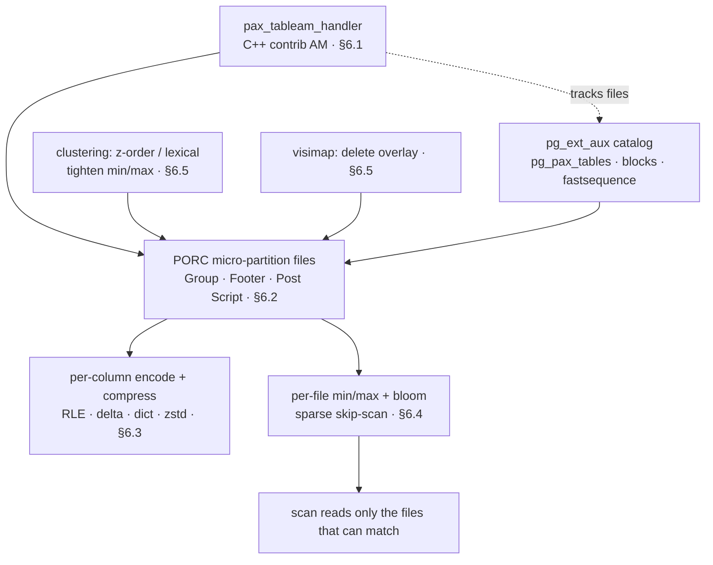
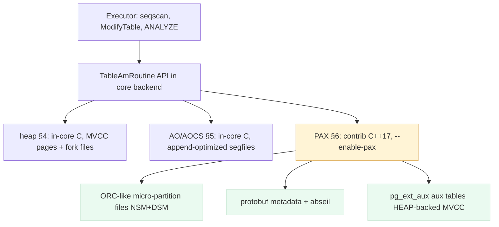
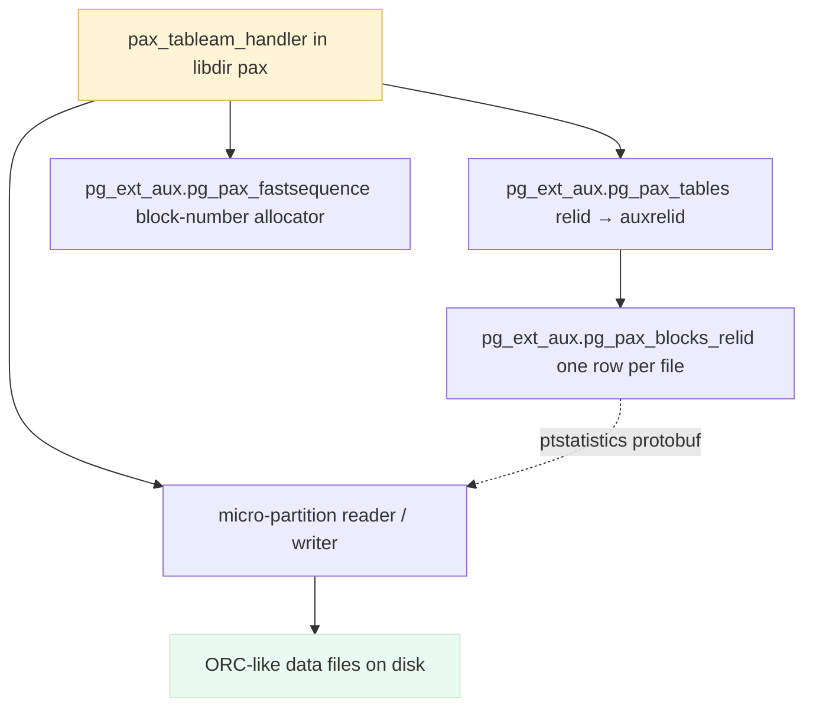
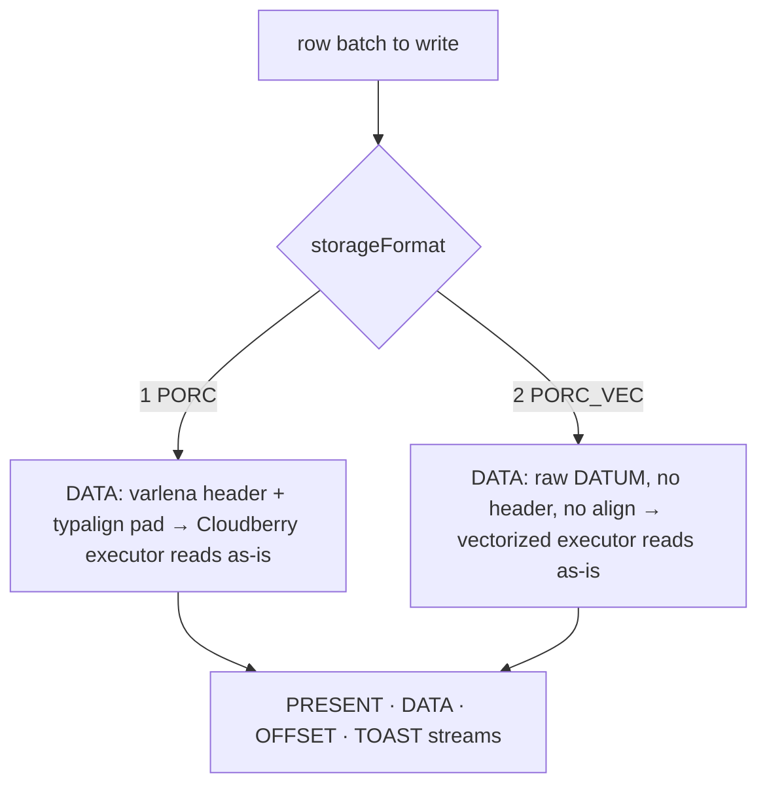
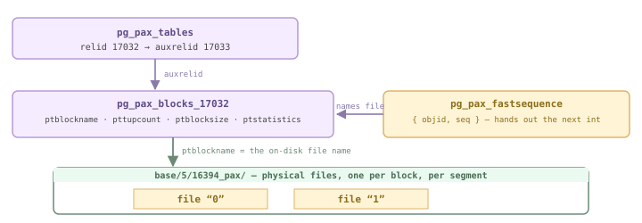
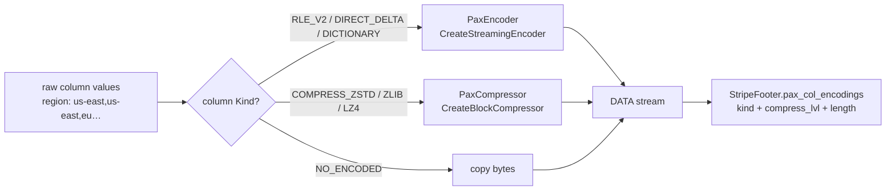
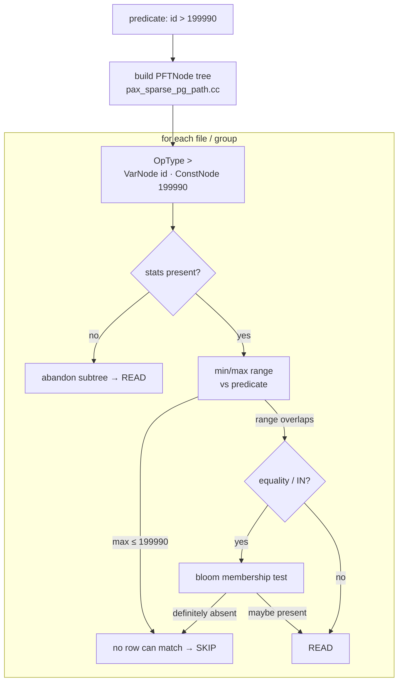
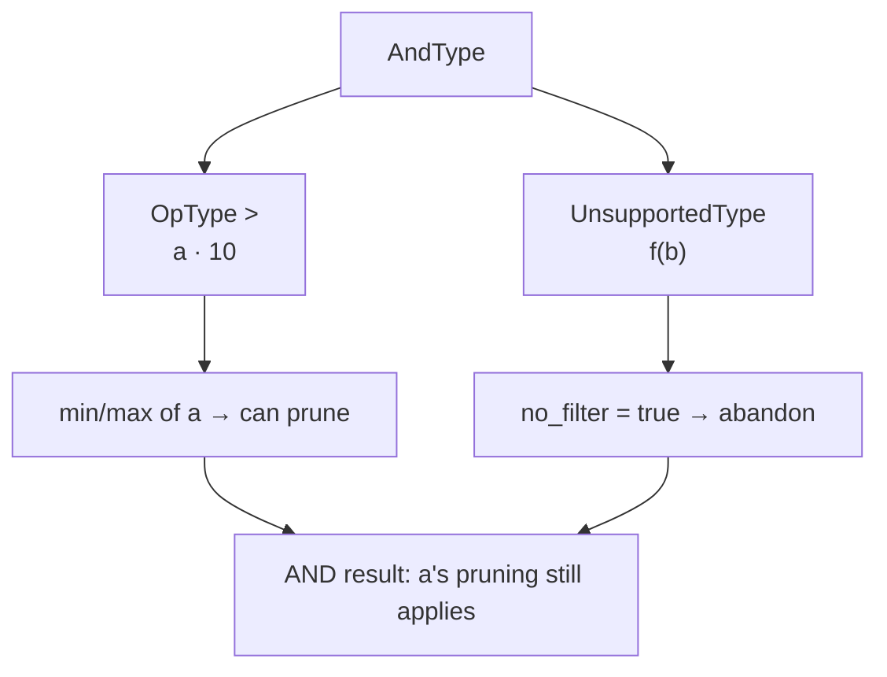
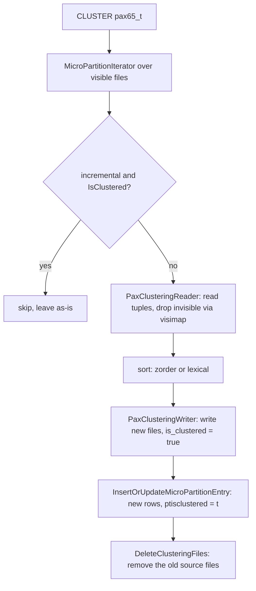

<!--
  Licensed to the Apache Software Foundation (ASF) under one
  or more contributor license agreements.  See the NOTICE file
  distributed with this work for additional information
  regarding copyright ownership.  The ASF licenses this file
  to you under the Apache License, Version 2.0 (the
  "License"); you may not use this file except in compliance
  with the License.  You may obtain a copy of the License at

    http://www.apache.org/licenses/LICENSE-2.0

  Unless required by applicable law or agreed to in writing,
  software distributed under the License is distributed on an
  "AS IS" BASIS, WITHOUT WARRANTIES OR CONDITIONS OF ANY
  KIND, either express or implied.  See the License for the
  specific language governing permissions and limitations
  under the License.
-->

import RawFigure from '../_components/RawFigure';

# 6. PAX: The Native Columnar Engine



*PAX end to end. A C++ contrib access method ([§6.1](#61-the-c-contrib-access-method)) writes rows into ORC-derived micro-partition files ([§6.2](#62-micro-partition-file-format--manifest-catalog)) whose columns are encoded and compressed ([§6.3](#63-column-encoding--compression)); per-file min/max and bloom statistics let scans skip whole files ([§6.4](#64-sparse-filters-minmax--bloom-skip-scan)); clustering reorders data so skipping bites, and a per-file visibility map handles deletes ([§6.5](#65-clustering-z-order--lexical-visimap)). The pg_ext_aux heap catalog ties every file back to the table.*

## 6.1 The C++ Contrib Access Method

Chapters 4 and 5 walked two storage engines that live **inside** the backend, written in C: the **heap** (§4) and the append-optimized **AO/AOCS** family (§5). PAX is the third member of that family — but it is a different kind of citizen. **PAX = Partition Attributes Across**: a hybrid layout that keeps the *batch-write* speed of a row store (NSM) and the *column-read* speed of a column store (DSM), wrapped in an ORC-derived on-disk format with rich per-block statistics. And it ships not as core backend code but as a **C++17 contrib extension** under `contrib/pax_storage/`, compiled in only when you configure Cloudberry with `--enable-pax`.

This first section sets the scene: *what* PAX is, *how* a several-thousand-line C++ tree manages to register itself as a first-class table access method, and *where* its moving parts live. The on-disk file format (the ORC-like micro-partition) is the subject of [§6.2](#62-micro-partition-file-format--manifest-catalog); here we stay at the plumbing level.



*PAX is a third table AM under the same executor → TableAmRoutine API as heap and AO/AOCS — but it is out-of-tree C++ with its own file format and catalog.*

:::note

Where §5's AO/AOCS is C compiled into `postgres`, PAX is a `.so` (`$libdir/pax`) loaded on demand. The contrast is the theme of this whole section.

:::

Internally that C++ tree is organized as **five layers**, each with one job. The executor enters at the top through the Access Handler, and every read or write descends layer by layer down to the file on disk — statistics and filtering live in the MicroPartition layer ([§6.4](#64-sparse-filters-minmax--bloom-skip-scan)), encoding and compression in the Column layer ([§6.3](#63-column-encoding--compression)):

<RawFigure html={"<div style=\"max-width:720px;margin:2px auto;font:11px/1.4 ui-monospace,SFMono-Regular,Menlo,monospace;color:#1f2328;overflow-x:auto\"> <div style=\"min-width:560px\"> <div style=\"display:flex;justify-content:center;gap:8px;margin-bottom:5px\"> <div style=\"background:#eef0f2;border:1px solid #cdb4db;border-radius:5px;padding:4px 16px;font-weight:700;color:#5e4b86\">executor · Table-AM contract</div> <div style=\"background:#fff4d6;border:1px solid #e0b365;border-radius:5px;padding:4px 10px;color:#8a6d1a\">META · pg_ext_aux aux tables · manifests</div> </div> <div style=\"border:1px solid #b79ad6;border-radius:6px;overflow:hidden\"> <div style=\"display:flex;align-items:center;background:#f5edff;padding:6px 8px\"><div style=\"flex:0 0 156px;font-weight:700;color:#5e4b86\">Access Handler</div><div style=\"flex:1;color:#555\">AM interface · transaction context · exception translation · resource lifecycle</div></div> <div style=\"display:flex;align-items:center;background:#faf6ff;border-top:1px solid #cdb4db;padding:6px 8px\"><div style=\"flex:0 0 156px;font-weight:700;color:#5e4b86\">Table layer</div><div style=\"flex:1;color:#555\">TableWriter / Reader / Deleter · Index Accessor · TablePartitionWriter · Cluster (§6.5)</div></div> <div style=\"display:flex;align-items:center;background:#f5edff;border-top:1px solid #cdb4db;padding:6px 8px\"><div style=\"flex:0 0 156px;font-weight:700;color:#5e4b86\">MicroPartition layer</div><div style=\"flex:1;color:#555\">manage files &amp; per-group <b style=\"color:#8a6d1a\">Statistics</b> (min/max · bloom) · <b style=\"color:#8a6d1a\">Filter</b> (§6.4) · PORC / PORC_VEC Writer·Reader · visible map · Toast</div></div> <div style=\"display:flex;align-items:center;background:#faf6ff;border-top:1px solid #cdb4db;padding:6px 8px\"><div style=\"flex:0 0 156px;font-weight:700;color:#5e4b86\">Column layer</div><div style=\"flex:1;color:#555\">in-memory column data · <b style=\"color:#8a6d1a\">encode / decode · compress / decompress</b> (§6.3) — fixed, non-fixed &amp; PAX columns</div></div> <div style=\"display:flex;align-items:center;background:#eafaf0;border-top:1px solid #cdb4db;padding:6px 8px\"><div style=\"flex:0 0 156px;font-weight:700;color:#4a6b55\">File layer</div><div style=\"flex:1;color:#555\">filesystem interface — data files · metadata · visibility map (Visimap) persistence</div></div> </div> <div style=\"text-align:center;color:#8a7aa8;font-size:10px;padding:3px\">each layer calls the one below — executor → Access Handler → Table → MicroPartition → Column → File</div> </div></div>"} caption={"PAX's five-layer engine (`contrib/pax_storage/src/cpp/`). The executor enters through the Access Handler; each layer calls the one below, down to the file. META — the pg_ext_aux aux tables + manifests (§6.1.3) — sits beside the handler and records which files exist."} />

### 6.1.1 A C++ access method that returns a TableAmRoutine

Cloudberry's table-AM contract is the same one core PostgreSQL defines: a function tagged `amhandler` returns a pointer to a `TableAmRoutine` full of callbacks, and `pg_am` records the mapping. PAX satisfies that contract from C++. The handler is `pax_tableam_handler`, declared with the usual `PG_FUNCTION_INFO_V1` macro — note the `// NOLINT`, a tell that this is a C ABI boundary inside a C++ file (`contrib/pax_storage/src/cpp/access/pax_access_handle.cc:801`).

```c title="contrib/pax_storage/src/cpp/access/pax_access_handle.cc:800"
PG_MODULE_MAGIC;
      PG_FUNCTION_INFO_V1(pax_tableam_handler);
      Datum pax_tableam_handler(PG_FUNCTION_ARGS) {  // NOLINT
        PG_RETURN_POINTER(&kPaxColumnMethods);
      }
```

`kPaxColumnMethods` is a statically-initialized `TableAmRoutine`. Its slots are filled from **two C++ namespaces** — `paxc::PaxAccessMethod` (the thin C-shaped glue that talks to the backend) and `pax::CCPaxAccessMethod` (the C++ scan/DML engine). A glance at the tail of the struct shows the split: bitmap and sample scans, plus `dml_init`/`dml_fini`, route into `pax::CCPaxAccessMethod`, while option handling stays in `paxc::` (`contrib/pax_storage/src/cpp/access/pax_access_handle.cc:785`).

```c title="contrib/pax_storage/src/cpp/access/pax_access_handle.cc:785"
.scan_bitmap_next_block = pax::CCPaxAccessMethod::ScanBitmapNextBlock,
      .scan_sample_next_block = pax::CCPaxAccessMethod::ScanSampleNextBlock,
      .dml_init = pax::CCPaxAccessMethod::ExtDmlInit,
      .dml_fini = pax::CCPaxAccessMethod::ExtDmlFini,
      .amoptions = paxc::PaxAccessMethod::AmOptions,
```

So `USING pax` flows through the *identical* executor path as heap or AOCS; the executor never learns it crossed a C/C++ boundary. The handler is reachable because a row in `pg_am` points `amhandler` at it, with `amtype = 't'` (table):

*Coordinator: the `pax` AM is a real `pg_am` row, handler `pax_tableam_handler`, type t (table)*

```sql
SELECT oid, amname, amhandler, amtype FROM pg_am WHERE amname='pax';
```

```text {3} title="output"
  oid  | amname |      amhandler      | amtype 
      ------+--------+---------------------+--------
       7047 | pax    | pax_tableam_handler | t
      (1 row)
```

Once that row exists, creating a PAX table is ordinary DDL — `USING pax`. Below, a 1000-row table is built on the coordinator, inserted, and queried; the planner and executor treat it like any other relation:

*Coordinator: a PAX table behaves like any relation — create, insert, aggregate, filter*

```sql
CREATE TABLE pax61_t(id int, region text, amount numeric)
        USING pax DISTRIBUTED BY (id);
      INSERT INTO pax61_t
        SELECT g, (ARRAY['NA','EU','APAC'])[1+g%3], (g*1.5)::numeric
        FROM generate_series(1,1000) g;
      SELECT count(*), sum(amount) FROM pax61_t;
      SELECT relname, amname FROM pg_class c
        JOIN pg_am a ON c.relam=a.oid WHERE relname='pax61_t';
```

```text {8} title="output"
CREATE TABLE
      INSERT 0 1000
       count |   sum    
      -------+----------
        1000 | 750750.0
       relname | amname 
      ---------+--------
       pax61_t | pax
      (1 row)
```

### 6.1.2 Bootstrapped into every segment at initdb

PAX is **not** installed with `CREATE EXTENSION`. There is no SQL script a user runs. Instead, the `pg_am` row, the `pax_tableam_handler` proc entry, and a whole auxiliary namespace are written during **initdb**, into every coordinator and segment, by a generated cdbinit script: `contrib/pax_storage/cdb_init.d/pax-cdbinit--1.0.sql`. That SQL is itself emitted by a C program, `contrib/pax_storage/tools/gen_sql.c`, so the hard-coded catalog OIDs (e.g. AM oid 7047, handler proc 7600) stay in one source of truth.

The generated script does three things: it inserts the handler proc and the `pg_am` row, it creates the `pg_ext_aux` namespace with its global aux tables, and it hammers the new objects to **fixed OIDs**. The proc/AM inserts are verbatim from the generated file (`contrib/pax_storage/cdb_init.d/pax-cdbinit--1.0.sql:27`):

```c title="contrib/pax_storage/cdb_init.d/pax-cdbinit--1.0.sql:27"
INSERT INTO pg_proc VALUES(7600,'pax_tableam_handler',11,10,13,1,...,
        'pax_tableam_handler','$libdir/pax',...);
      INSERT INTO pg_am   VALUES(7047,'pax',7600,'t');
      COMMENT ON FUNCTION pax_tableam_handler IS
        'column-optimized PAX table access method handler';
```

`gen_sql.c` builds the `pg_proc`/`pg_am` tuples from compile-time constants — `PAX_TABLE_AM_OID`, `PAX_AMNAME`, `PAX_AM_HANDLER_OID` — and stamps `amtype = 't'` (`contrib/pax_storage/tools/gen_sql.c:150`).

```c title="contrib/pax_storage/tools/gen_sql.c:150"
printf("INSERT INTO pg_am   VALUES(%u,'%s',%u,'%c');\n",
             PAX_TABLE_AM_OID,   /* pg_am.oid */
             PAX_AMNAME,         /* pg_am.amname */
             PAX_AM_HANDLER_OID, /* pg_am.amhandler */
             't' /* pg_am.amtype: TABLE */);
```

Because this runs at initdb, **PAX is present in a fresh cluster before any user connects** — there is nothing to load, enable, or version. The same script also creates two cluster-wide aux tables described next.

### 6.1.3 The pg_ext_aux catalog: where a PAX table's metadata lives

A PAX relation's *data* lives in ORC-like files on disk ([§6.2](#62-micro-partition-file-format--manifest-catalog)). Its *metadata* — which files exist, how many rows each holds, their per-column statistics, visibility — lives in ordinary HEAP-backed catalog tables under the `pg_ext_aux` namespace. This is the **auxiliary-table catalog mode**, and it is the default: the build flips `USE_PAX_CATALOG` ON (`contrib/pax_storage/CMakeLists.txt:39`). There is an alternative **manifest** mode (a JSON catalog under `src/cpp/manifest/`) gated by `USE_MANIFEST_API`, but it is off by default and this chapter uses aux-table mode throughout.

- **pg_ext_aux.pg_pax_tables** — Cluster-wide map `relid → auxrelid`. One row per PAX table; `auxrelid` points at that table's private blocks catalog. Created at initdb (`pax-cdbinit--1.0.sql:3`).
- **pg_ext_aux.pg_pax_fastsequence** — Cluster-wide `(objid, seq)` allocator — hands out monotonic block numbers per PAX relation without contending on a normal sequence (`pax-cdbinit--1.0.sql:34`).
- **pg_ext_aux.pg_pax_blocks_`&lt;relid>`** — One **per-table** blocks catalog, created when the PAX table is created (`pax_aux_table.cc:92`). Each row describes one micro-partition file: block name, tuple count, size, statistics, visimap, toast/cluster flags.

The per-table blocks catalog is built dynamically. `pax_aux_table.cc` names it `pg_pax_blocks_<pax_relid>` and gives it columns for block name, tuple count, block size, the protobuf-encoded `ptstatistics`, and a visimap name (`contrib/pax_storage/src/cpp/catalog/pax_aux_table.cc:92`).

```c title="contrib/pax_storage/src/cpp/catalog/pax_aux_table.cc:92"
snprintf(aux_relname, sizeof(aux_relname), "pg_pax_blocks_%u", pax_relid);
      // columns: ptblockname, pttupcount, ptblocksize,
      //          ptstatistics, ptvisimapname, ptexistexttoast, ptisclustered
```



*PAX's moving parts: the loaded AM handler drives file readers/writers and consults the pg_ext_aux catalog.*

Following the chain live: the coordinator's `pg_pax_tables` maps our table to its aux relation, but the *data* and its block rows live on the **segments** (this is a distributed table, so query a segment in utility mode to see them):

*Coordinator → segment: relid maps to the per-table blocks catalog `pg_pax_blocks_<relid>`*

```sql
SELECT relid, auxrelid FROM pg_ext_aux.pg_pax_tables
        WHERE relid='pax61_t'::regclass;
```

```text title="output"
 relid | auxrelid 
      -------+----------
       17025 |    17026
      (1 row)
```

*Segment (PGOPTIONS gp_role=utility, port 7102): the aux relation is pg_pax_blocks_17025, one row per micro-partition file*

```sql
SELECT relid::regclass AS rel, auxrelid::regclass AS aux
        FROM pg_ext_aux.pg_pax_tables WHERE relid='pax61_t'::regclass;
      SELECT ptblockname, pttupcount, ptblocksize
        FROM pg_ext_aux.pg_pax_blocks_17025 ORDER BY ptblockname;
```

```text {3} title="output"
   rel   |              aux               
      ---------+--------------------------------
       pax61_t | pg_ext_aux.pg_pax_blocks_17025
       ptblockname | pttupcount | ptblocksize 
      -------------+------------+-------------
                 0 |        338 |        2706
      (1 row)
```

:::note

On this segment the 1000 rows landed as ~338 across three segments, packed into a single block (number `0`) of 2706 bytes. As you load more, additional blocks appear here — each a separate ORC-like file with its own statistics.

:::

### 6.1.4 The source tree at a glance

All of PAX lives under `contrib/pax_storage/src/cpp/`. The directories map cleanly onto the layers above: glue, catalog, the file format, and the analytics features.

*PAX C++ source layout (contrib/pax_storage/src/cpp/)*

| Directory | Role |
| --- | --- |
| access/ | The table-AM glue: `pax_access_handle.cc` (the handler + `TableAmRoutine`), plus inserter/scanner/deleter/updater and DML state. |
| catalog/ | The `pg_ext_aux` aux tables — `pg_pax_tables.cc`, `pax_aux_table.cc`, `pax_fastsequence.cc` — and the catalog/manifest abstraction (`pax_catalog.h`). |
| storage/ | The ORC-like engine ([§6.2](#62-micro-partition-file-format--manifest-catalog)): micro-partition reader/writer, per-type column codecs, the sparse/row filters, toast, WAL, and the `proto/` directory of protobuf schemas. |
| storage/proto/ | `pax.proto`, `orc_proto.proto`, `micro_partition_stats.proto` — the on-disk metadata is protobuf, compiled at build time. |
| clustering/ | Z-order and lexical data clustering ([§6.5](#65-clustering-z-order--lexical-visimap)). |
| manifest/ | The alternative JSON manifest catalog (off by default). |
| comm/, exceptions/ | C++ utilities and the exception→`elog(ERROR)` bridge across the C boundary. |

The dependency footprint reflects the ORC heritage: PAX links **protobuf** for its on-disk metadata and **abseil** for C++ container/string utilities, and (in debug builds) googletest for its `test_main` suite. The handler `.so` is `$libdir/pax`, the same path baked into the `pg_proc` row above. With the AM, the catalog, and the layout in hand, [§6.2](#62-micro-partition-file-format--manifest-catalog) opens the micro-partition files themselves — the ORC-derived format where NSM and DSM finally meet on disk.

## 6.2 Micro-Partition File Format & Manifest Catalog

### 6.2.1 A micro-partition is a self-describing file, read from the tail

A PAX table stores its rows in **micro-partition** files. The on-disk format is **PORC** — derived from Apache ORC but trimmed to just the protobuf framing that suits the Cloudberry executor (`contrib/pax_storage/doc/README.format.md`). Every file is composed bottom-up: one or more **Group**s of column data, then a **File Footer** describing them, then a fixed-tail **Post Script**. A reader opens the *end* of the file first: the Post Script gives the footer length, the Footer gives the groups, statistics and schema, and only then are the needed Groups read.

The framing is three protobuf messages in `contrib/pax_storage/src/cpp/storage/proto/orc_proto.proto`: `message PostScript` (orc_proto.proto:166), `message Footer` (orc_proto.proto:134) and per-group `message StripeFooter` (orc_proto.proto:73). A comment block at orc_proto.proto:154 spells out the exact tail order and notes the meta is sized so **one 32 KB I/O** can usually slurp footer + post-script together.

<RawFigure html={"<div style=\"max-width:720px;margin:2px auto;font:11px/1.45 ui-monospace,SFMono-Regular,Menlo,monospace;color:#1f2328;overflow-x:auto\"> <div style=\"min-width:560px\"> <div style=\"border:2px solid #b79ad6;border-radius:6px;overflow:hidden\"> <div style=\"background:#efe3fb;color:#5e4b86;font-weight:700;text-align:center;padding:4px\">one PORC micro-partition file — written top→bottom, READ bottom→top</div> <div style=\"background:#eafaf0;border-top:1px solid #cfead9;padding:5px 8px\">Stripe 1 (row group) &nbsp;=&nbsp; Row Data + Stripe Footer</div> <div style=\"background:#eafaf0;border-top:1px solid #cfead9;padding:5px 8px\">Stripe 2 (row group) &nbsp;=&nbsp; Row Data + Stripe Footer</div> <div style=\"text-align:center;color:#8a7aa8;font-size:10px;padding:1px\">⋮ more stripes ⋮</div> <div style=\"background:#eafaf0;border-top:1px solid #cfead9;padding:5px 8px\">Stripe n (row group) &nbsp;=&nbsp; Row Data + Stripe Footer</div> <div style=\"display:flex;align-items:center;background:#f5edff;border-top:1px solid #cdb4db;padding:5px 8px\"><div style=\"flex:1\">FILE FOOTER — one <b>stripe info</b> per stripe: per-column stats (null · count · min/max/sum · bloom) · stripe offset · length · storageFormat</div><div style=\"color:#8a7aa8;font-weight:700\">↑3</div></div> <div style=\"display:flex;align-items:center;background:#f5edff;border-top:1px solid #cdb4db;padding:5px 8px\"><div style=\"flex:1\">POST SCRIPT — version · footerLength · magic</div><div style=\"color:#8a7aa8;font-weight:700\">↑2</div></div> <div style=\"display:flex;align-items:center;background:#fff4d6;border-top:1px solid #e0b365;padding:5px 8px;color:#8a6d1a;font-weight:700\"><div style=\"flex:1\">psLen (1 byte) + magic <span class=\"hl\">PORC</span> ← reader starts HERE</div><div>↑1</div></div> </div> <div style=\"text-align:center;color:#8a7aa8;font-size:10px;padding:6px 0 3px\">↓ zoom into one Stripe's Row Data — stored column by column (DSM) ↓</div> <div style=\"border:1px solid #cfead9;border-radius:6px;overflow:hidden\"> <div style=\"background:#eafaf0;padding:4px 8px;color:#4a6b55;font-weight:700\">Row Data</div> <div style=\"display:flex;gap:3px;padding:3px 8px\"> <div style=\"flex:1;background:#faf6ff;border:1px solid #cdb4db;text-align:center;padding:4px 2px\">Column 1</div> <div style=\"flex:1;background:#faf6ff;border:1px solid #cdb4db;text-align:center;padding:4px 2px\">Column 2</div> <div style=\"flex:0 0 40px;background:#faf6ff;border:1px solid #cdb4db;text-align:center;padding:4px 2px;color:#8a939c\">…</div> <div style=\"flex:1;background:#faf6ff;border:1px solid #cdb4db;text-align:center;padding:4px 2px\">Column m</div> </div> <div style=\"padding:3px 8px 2px;color:#6b5b95\">one column = a set of streams:</div> <div style=\"display:flex;gap:3px;padding:0 8px 8px\"> <div style=\"flex:1;background:#faf6ff;border:1px solid #cdb4db;text-align:center;padding:4px 2px\">PRESENT<div style=\"font-size:9px;color:#777\">null bitmap</div></div> <div style=\"flex:1;background:#eafaf0;border:1px solid #cfead9;text-align:center;padding:4px 2px\">OFFSET<div style=\"font-size:9px;color:#777\">varlen row offsets</div></div> <div style=\"flex:1;background:#fff4d6;border:1px solid #e0b365;text-align:center;padding:4px 2px;color:#8a6d1a\">DATA<div style=\"font-size:9px;color:#8a6d1a\">values · always last</div></div> <div style=\"flex:1;background:#faf6ff;border:1px solid #cdb4db;text-align:center;padding:4px 2px\">TOAST<div style=\"font-size:9px;color:#777\">ext indexes</div></div> </div> </div> </div></div>"} caption={"A PORC micro-partition. TOP: the file is a stack of Stripes (row groups) + a File Footer + a Post Script, READ bottom→top (↑1 psLen → ↑2 Post Script → ↑3 File Footer → the Stripes). BOTTOM: zooming into one Stripe, its Row Data is stored COLUMN BY COLUMN (DSM), and each column is a set of streams."} />

Bottom band is what we saw on disk: the last bytes of a real file are `… 50 4f 52 43` = ASCII **PORC** (see [§6.2](#62-micro-partition-file-format--manifest-catalog).3). The Post Script above it carries `footerLength` so the reader can seek straight to the Footer (orc_proto.proto:175); the Footer's `stripes` (orc_proto.proto:139) point at each Group's offset and length.

### 6.2.2 Streams, and the two formats PORC / PORC_VEC

Inside a Group, a column is **not** one blob — it is a set of **streams**, each tagged by `Stream.Kind` (`enum Kind`, orc_proto.proto:50). The rule (orc_proto.proto:46): a column may have several streams but its *last* stream is always **DATA**.

- **PRESENT (0)** — Null bitmap — one bit per row. Omitted entirely when the column has no nulls, so non-nullable data costs zero bitmap bytes.
- **DATA (1)** — The raw value buffer. Fixed-width types store packed values with no gaps for nulls.
- **OFFSET (2)** — Per-row offsets for a variable-length column, so row i can be located in DATA. (The format README calls this the 'length/offset' stream; the live enum names it `OFFSET`.)
- **TOAST (3)** — Toast index stream — present only when oversized values were pushed to an external toast file (mirrors `ptexistexttoast` in the catalog).

```c title="storage/proto/orc_proto.proto:50"
enum Kind { PRESENT = 0; DATA = 1; OFFSET = 2; TOAST = 3; }
```

`message Footer` ends with `required uint32 storageFormat` (orc_proto.proto:151): **1 = origin (PORC)**, **2 = vec (PORC_VEC)**. Both formats share the *same* file composition and the *same* stream kinds — only the bytes inside the DATA stream differ. PORC stores values the Cloudberry executor consumes directly (varlena headers kept, `typalign` padding); PORC_VEC stores header-less, unaligned raw DATUMs ready for the vectorized executor, trading a conversion on write for zero conversion on vectorized read (README.format.md §Format).



*Same skeleton, two payloads. storageFormat in the Footer tells the reader which executor the DATA streams were written for.*

### 6.2.3 The catalog half: pg_ext_aux tracks every file

PAX runs in **auxiliary-table mode**: the metadata lives in ordinary HEAP catalog tables under the **`pg_ext_aux`** namespace, so it inherits HEAP MVCC for free (README.catalog.md §MVCC). Two tables exist per cluster — `pg_pax_tables` and `pg_pax_fastsequence` — plus one **per-table** blocks table created on demand.

- **pg_pax_tables (relid, auxrelid)** — One row per PAX table mapping the table OID to the OID of its blocks table. Read by `GetPaxTablesEntryAttributes`, `contrib/pax_storage/src/cpp/catalog/pg_pax_tables.cc:58`; written by `InsertPaxTablesEntry`, pg_pax_tables.cc:34.
- **pg_pax_blocks_`&lt;relid>`** — One row per micro-partition *file* — columns ptblockname/pttupcount/ptblocksize/ptstatistics/ptvisimapname/ptexistexttoast/ptisclustered. Column names are the `PAX_AUX_PT*` macros in `catalog/pax_catalog_columns.h:30`; 7 attrs (NATTS_PG_PAX_BLOCK_TABLES, :46).
- **pg_pax_fastsequence (objid, seq)** — A counter per table; `seq` is the next integer used to *name* a new file. Lock path in `catalog/pax_fastsequence.cc:37` (CPaxOpenFastSequenceTable, scankey on objid).



*Catalog → files, as a resolution chain: pg_pax_tables maps the relation to its blocks table; pg_pax_fastsequence hands out an integer that becomes both the ptblockname and the physical file name under `&lt;relfilenode>`_pax/. Real values from the pax62_t demo below.*

:::note

Each segment keeps its OWN pg_pax_blocks_`&lt;relid>` rows — only the files that segment produced. To inspect them from the coordinator, wrap the table in gp_dist_random().

:::

*Create a PAX table, then find its blocks-table OID. 17033 is the auxrelid.*

```sql
CREATE TABLE pax62_t (id int, name text, amount numeric) USING pax;
      INSERT INTO pax62_t SELECT g,'name_'||g,g*1.5 FROM generate_series(1,1000) g;
      SELECT relid, auxrelid, auxrelid::regclass
      FROM pg_ext_aux.pg_pax_tables WHERE relid='pax62_t'::regclass;
```

```text {3} title="output"
 relid | auxrelid |            auxrelid
      -------+----------+--------------------------------
       17032 |    17033 | pg_ext_aux.pg_pax_blocks_17032
      (1 row)
```

*One row per data file, per segment. After 1000 rows each segment wrote a single file 0.*

```sql
SELECT gp_segment_id, ptblockname, pttupcount, ptblocksize, ptexistexttoast
      FROM gp_dist_random('pg_ext_aux.pg_pax_blocks_17032')
      ORDER BY gp_segment_id, ptblockname;
```

```text {3,4,5} title="output"
 gp_segment_id | ptblockname | pttupcount | ptblocksize | ptexistexttoast
      ---------------+-------------+------------+-------------+-----------------
                   0 |           0 |        338 |        3067 | f
                   1 |           0 |        322 |        2925 | f
                   2 |           0 |        340 |        3072 | f
      (3 rows)
```

*A second insert. fastsequence advances 1 → 2 on every segment; each segment gains a new file named 1.*

```sql
INSERT INTO pax62_t SELECT g,'name_'||g,g*1.5 FROM generate_series(1001,2000) g;
      SELECT gp_segment_id, objid, seq FROM gp_dist_random('pg_ext_aux.pg_pax_fastsequence')
      WHERE objid='pax62_t'::regclass ORDER BY gp_segment_id;
```

```text {3,4,5} title="output"
 gp_segment_id | objid | seq
      ---------------+-------+-----
                   0 | 17032 |   2
                   1 | 17032 |   2
                   2 | 17032 |   2
      (3 rows)
```

*Now two rows per segment — file 0 and the new file 1 — one catalog row each.*

```sql
SELECT gp_segment_id, ptblockname, pttupcount, ptblocksize
      FROM gp_dist_random('pg_ext_aux.pg_pax_blocks_17032')
      ORDER BY gp_segment_id, ptblockname;
```

```text {3,4} title="output"
 gp_segment_id | ptblockname | pttupcount | ptblocksize
      ---------------+-------------+------------+-------------
                   0 |           0 |        338 |        3067
                   0 |           1 |        335 |        3106
                   1 |           0 |        322 |        2925
                   1 |           1 |        334 |        3119
                   2 |           0 |        340 |        3072
                   2 |           1 |        331 |        3096
      (6 rows)
```

The integer `ptblockname` is literally the file name on disk. On segment 2 (utility-mode), the files sit under `base/<dboid>/<relfilenode>_pax/`, named `0` and `1`, and the on-disk size of file `0` is **3072 bytes** — exactly matching `ptblocksize` for that block. A hexdump of its tail ends in the magic, confirming the bottom-up layout of [§6.2](#62-micro-partition-file-format--manifest-catalog).1:

*Segment-local view: catalog block 0 (ptblocksize 3072) ↔ a 3072-byte file ending in PORC.*

```sql
-- on segment (PGOPTIONS='-c gp_role=utility' psql -p 7102):
      SELECT ptblockname, ptblocksize FROM pg_ext_aux.pg_pax_blocks_17032 WHERE ptblockname=0;
      -- shell: ls -l base/5/16394_pax/0 ; xxd base/5/16394_pax/0 | tail -1
```

```text {3,5} title="output"
 ptblockname | ptblocksize
      -------------+-------------
                 0 |        3072
      -rw------- 1 gpadmin gpadmin 3072  base/5/16394_pax/0
      00000bf0: 82f4 0304 504f 5243 1000 0000 0000 0000   ....504f 5243........  (= "PORC")
```

So the loop closes: `pg_pax_fastsequence` hands out an integer → that integer names a PORC file written under `<relfilenode>_pax/` → a row in `pg_pax_blocks_<relid>` records its tuple count, size and statistics → `pg_pax_tables` ties that blocks table back to the user relation. The Footer's per-stripe `colStats` (orc_proto.proto:122) and the row's `ptstatistics` are what later let PAX **skip** whole micro-partitions during scans ([§6.3](#63-column-encoding--compression)).

## 6.3 Column Encoding & Compression

### 6.3.1 Two layers, one column at a time

PAX shrinks a table the way a columnar engine should — **per column, never per row**. Each column's values flow through *two independent layers*. First a **lightweight encoding** that exploits the *shape* of the values (long runs → RLE, monotone integers → delta, few distinct values → a dictionary). Then a **general-purpose compression** pass (zstd / zlib / lz4) over the encoded bytes. The two layers are mutually exclusive *per column* in PAX's current design: the column-level option names one `Kind`, and that `Kind` is dispatched to **either** an encoder **or** a block compressor — never both — see `pax_encoding_column.cc:84` (encoder) falling through to `pax_encoding_column.cc:92` (compressor).

Everything is driven by one tiny protobuf record, `pax.ColumnEncoding`, stored per column in the StripeFooter. Its `kind` says *which* layer/algorithm ran; `compress_lvl` carries the level; `length` remembers the **pre-encode size** so the reader can size its output buffer before decoding (`storage/proto/pax.proto:29`).

```c title="storage/proto/pax.proto:29"
message ColumnEncoding {
        enum Kind {
          NO_ENCODED = 0;     RLE_V2 = 1;      DIRECT_DELTA = 2;
          COMPRESS_ZSTD = 3;  COMPRESS_ZLIB = 4;
          DICTIONARY = 5;     COMPRESS_LZ4 = 6;
        }
        optional Kind   kind = 1;
        optional uint64 length = 2;       // origin (pre-encode) size
        optional uint64 compress_lvl = 3; // level, for the compressors
        // ... offset_stream_kind/length/compress_lvl for varlen LENGTH stream
      }
```



*A column's write pipeline: raw values → ONE encode/compress Kind → DATA stream on disk; the Kind is recorded in StripeFooter.pax_col_encodings.*

:::note

The dispatch is literally a `switch` on one enum. `PaxEncoder::CreateStreamingEncoder` (`storage/columns/pax_encoding.cc:43`) returns a `PaxOrcEncoder` for RLE_V2, a `PaxDeltaEncoder` for DIRECT_DELTA, a `PaxDictEncoder` for DICTIONARY — else nullptr. When it returns nullptr, `InitEncoder` asks `PaxCompressor::CreateBlockCompressor` (`pax_compress.cc:41`) for a zstd/zlib/lz4 block compressor instead.

:::

### 6.3.2 The encoders: shape-aware, cheap

The three encoders each target a value *shape*. None of them is a default — `PaxEncodingColumn<T>::GetDefaultColumnType()` returns `NO_ENCODED` (`pax_encoding_column.cc:238`), so a column is left raw unless you ask for an encoding or a compressor. Note the **fixed-vs-variable** split: only the dictionary encoder is whitelisted for non-fixed (varlen) columns; RLE and delta operate on fixed-width integer streams (`pax_encoding.cc:40`, the `non_fixed_column_white_list`).

- **RLE_V2 (`rle`)** — Run-length, ORC's RLE-v2 sub-encodings. A run of N identical (or short-fixed-delta) values becomes a header byte + the value(s). Implemented by `PaxOrcEncoder` over `pax_rlev2_encoding.cc`. Ideal for the `status` column where one value repeats for thousands of rows.
- **DIRECT_DELTA (`delta`)** — Stores first value, then successive differences. Monotone or slowly-changing integers (timestamps, sequence ids) collapse to small deltas that bit-pack tightly. `PaxDeltaEncoder<uint32_t>` (`pax_delta_encoding.cc`).
- **DICTIONARY (`dict`)** — Builds a table of distinct values; the DATA stream becomes narrow integer codes into that table. The *only* encoding allowed on varlen/text columns. `PaxDictEncoder` (`pax_dict_encoding.cc`). Perfect for low-cardinality text like `region` (4 distinct values).

<RawFigure html={"<div style=\"max-width:640px;margin:2px auto;font:11px/1.45 ui-monospace,SFMono-Regular,Menlo,monospace;color:#1f2328;overflow-x:auto\"> <div style=\"min-width:420px\"> <div style=\"color:#6b5b95;font-weight:600;margin:0 0 3px\">raw codes (status, value 0 = ACTIVE)</div> <div style=\"display:flex;gap:3px;flex-wrap:wrap;align-items:center;margin-bottom:8px\"> <div style=\"border:1px solid #cdb4db;background:#f4f5f6;padding:4px 8px\">0</div><div style=\"border:1px solid #cdb4db;background:#f4f5f6;padding:4px 8px\">0</div><div style=\"border:1px solid #cdb4db;background:#f4f5f6;padding:4px 8px\">0</div><div style=\"border:1px solid #cdb4db;background:#f4f5f6;padding:4px 8px\">0</div><div style=\"border:1px solid #cdb4db;background:#f4f5f6;padding:4px 8px\">0</div><div style=\"border:1px solid #cdb4db;background:#f4f5f6;padding:4px 8px\">0</div><div style=\"border:1px solid #cdb4db;background:#f4f5f6;padding:4px 8px\">0</div><div style=\"border:1px solid #cdb4db;background:#f4f5f6;padding:4px 8px\">0</div> <div style=\"padding:4px 6px;color:#8a939c\">= 32 bytes</div> </div> <div style=\"color:#6b5b95;font-weight:600;margin:0 0 3px\">RLE_V2 run in DATA stream</div> <div style=\"display:flex;gap:3px;align-items:center\"> <div style=\"border:1px solid #e0b365;background:#fff4d6;color:#8a6d1a;padding:4px 10px\"><span class=\"hl\">count = 8</span></div> <div style=\"border:1px solid #e0b365;background:#fff4d6;color:#8a6d1a;padding:4px 10px\"><span class=\"hl\">value = 0</span></div> <div style=\"padding:4px 6px;color:#6b8a76\">→ a few bytes, decode rebuilds all 8</div> </div> </div></div>"} caption={"RLE on the repetitive `status` column: 8 raw int codes (32 B) → one run = {count, value} (a few bytes) in the DATA stream."} />

### 6.3.3 The compressors: a block pass over the bytes

When the column option names a *compression* `Kind`, PAX skips the encoders and runs a **block compressor** over the whole stream buffer. `PaxCompressor::CreateBlockCompressor` returns a `PaxZSTDCompressor`, `PaxZlibCompressor`, or (when built `USE_LZ4`) `PaxLZ4Compressor` (`pax_compress.cc:41`). The zstd path is a one-shot `ZSTD_compress(dst, cap, src, len, lvl)` where `lvl` comes straight from `compresslevel` (`pax_compress.cc:82`). zstd is the workhorse: high ratio, fast decode, and it happily eats already-narrow data the encoders leave behind.

Crucially the compressor runs on the column's **DATA stream** described in [§6.2](#62-micro-partition-file-format--manifest-catalog) — and for variable-length columns the **LENGTH/offset stream** gets its *own* `offset_stream_kind` / `offset_stream_compress_lvl` in the same `ColumnEncoding` record (`pax.proto:47`). A varlen column is two streams (raw bytes + per-row offsets), each compressed independently; a fixed-length column is one DATA stream plus a null bitmap (see `doc/README.format.md`, PORC streaming).

*What lands in a column's DATA stream, by Kind. The encoders are mutually exclusive with the compressors per column.*

| option | Kind | layer | best for |
| --- | --- | --- | --- |
| none | NO_ENCODED | copy raw bytes | incompressible / already small |
| rle | RLE_V2 | encoder (fixed int) | long runs (status flags) |
| delta | DIRECT_DELTA | encoder (fixed int) | monotone ids / timestamps |
| dict | DICTIONARY | encoder (varlen ok) | low-cardinality text |
| zstd | COMPRESS_ZSTD | block compressor + level | general default, high ratio |
| zlib | COMPRESS_ZLIB | block compressor + level | portability |

### 6.3.4 Configuring it — table-wide and per-column

Two knobs, parsed in `paxc_rel_options.cc`. **Table-wide**: `WITH (compresstype=…, compresslevel=…)` applies one Kind to every column (`add_string_reloption` for `compresstype`, `add_int_reloption` for `compresslevel`, lines 349/353). The validator at `paxc_rel_options.cc:136` enforces a rule worth knowing: **`compresslevel` is only meaningful for the compressors** — set a level on `rle`/`delta`/`dict`/`none` and you get an error, because the *encoders* take no level. **Per-column**: a column's `ENCODING (compresstype=…)` clause overrides the table default for that column only (`pg_attribute_encoding`).

*Per-column ENCODING — id gets delta, low-cardinality region gets a dictionary, status text gets zstd-3. stored in pg_attribute_encoding*

```sql
CREATE TABLE pax63_enc (
        id     int  ENCODING (compresstype=delta),
        region text ENCODING (compresstype=dict),
        status text ENCODING (compresstype=zstd, compresslevel=3))
        USING pax;
      SELECT attnum, attoptions FROM pg_attribute_encoding
       WHERE attrelid='pax63_enc'::regclass ORDER BY attnum;
```

```text title="output"
 attnum |             attoptions
      --------+-------------------------------------
            1 | {compresstype=delta}
            2 | {compresstype=dict}
            3 | {compresstype=zstd,compresslevel=3}
      (3 rows)
```

### 6.3.5 Demonstration — the shrink, measured

Two PAX tables, identical schema and identical 200 000 rows. `pax63_none` stores everything raw; `pax63_zstd` is `WITH (compresstype=zstd, compresslevel=5)`. The data is deliberately repetitive — 4 regions, a status that is ACTIVE 75% of the time, amounts cycling 0–99 — exactly what compression loves.

*Same schema, same rows — one raw, one zstd-5. INSERT … SELECT clones the data*

```sql
CREATE TABLE pax63_none (id int, region text, status text, amount numeric)
        USING pax WITH (compresstype=none);
      CREATE TABLE pax63_zstd (id int, region text, status text, amount numeric)
        USING pax WITH (compresstype=zstd, compresslevel=5);
      INSERT INTO pax63_none SELECT g,
         (ARRAY['us-east','us-west','eu-central','ap-south'])[1+(g%4)],
         (ARRAY['ACTIVE','ACTIVE','ACTIVE','CLOSED'])[1+(g%4)],
         (g%100)::numeric FROM generate_series(1,200000) g;
      INSERT INTO pax63_zstd SELECT * FROM pax63_none;
```

```text title="output"
INSERT 0 200000
      INSERT 0 200000
```

*On-disk size: zstd-5 is ~7.2x smaller — 7338 kB → 1024 kB.*

```sql
SELECT relname, reloptions, pg_size_pretty(pg_relation_size(oid)) AS size
      FROM pg_class WHERE relname LIKE 'pax63_%' ORDER BY relname;
```

```text title="output"
  relname   |             reloptions              |  size
      ------------+-------------------------------------+---------
       pax63_none | {compresstype=none}                 | 7338 kB
       pax63_zstd | {compresstype=zstd,compresslevel=5} | 1024 kB
      (2 rows)
```

The same shrink is visible at the **micro-partition** layer. Each PAX table has an aux block catalog `pg_ext_aux.pg_pax_blocks_<oid>`; its `ptblocksize` column is the on-disk byte size of each block. Reading it across segments via `gp_dist_random` sums the physical bytes that actually landed — same 7338 kB vs 1024 kB, same 3 blocks, same 200 000 tuples. The bytes shrank; the row count did not.

*Block-level aux catalog confirms it — ptblocksize summed across segments. oids 17046=none, 17053=zstd*

```sql
SELECT 'none' tbl, count(*) blocks, sum(pttupcount) tuples,
             pg_size_pretty(sum(ptblocksize)) physical
      FROM gp_dist_random('pg_ext_aux.pg_pax_blocks_17046')
      UNION ALL
      SELECT 'zstd', count(*), sum(pttupcount), pg_size_pretty(sum(ptblocksize))
      FROM gp_dist_random('pg_ext_aux.pg_pax_blocks_17053');
```

```text title="output"
 tbl  | blocks | tuples | physical
      ------+--------+--------+---------
       none |      3 | 200000 | 7338 kB
       zstd |      3 | 200000 | 1024 kB
      (2 rows)
```

:::note

What `kind` actually got chosen per column lives in each stripe's `StripeFooter.pax_col_encodings` (one `ColumnEncoding` per column, `doc/README.format.md`). When you pick `dict` on `region` and `rle` on `status`, the encoders do the structural work first and a following zstd pass — if also requested table-wide — would only ever see the already-narrow result; in PAX they are alternatives per column, so choose the layer that matches the column's *shape*, and reach for zstd as the high-ratio general default.

:::

## 6.4 Sparse Filters: min/max + Bloom Skip-Scan

### 6.4.1 Reading less by reading the statistics first

PAX's headline read optimization is **not** reading faster — it is *not reading at all*. Before a scan touches a single byte of column data, it consults small per-file/per-group statistics and asks: *could any row in here possibly match the predicate?* If the answer is provably no, the whole file or group is skipped. `contrib/pax_storage/doc/README.filter.md` calls this **sparse filtering**, one of three filter kinds PAX applies:

- **Column projection** — Read only the columns the query needs by skipping the protobuf streams of the others (ties back to the per-column streams of [§6.2](#62-micro-partition-file-format--manifest-catalog)). Statistics play no part here — it is purely *which* streams get decoded. See `ReadStripe()`.
- **Sparse filtering** — Skip entire files / row-groups using per-file and per-group statistics (min/max, bloom). The subject of this section.
- **Row filtering** — A row-at-a-time fallback inside Cloudberry's row executor — read the few filtered columns, decide which rows to materialize for a wide target-list. Off by default (`pax.enable_row_filter`).



*The skip decision: an executor predicate becomes a PFTNode tree, evaluated bottom-up against each file/group's stats. Provably-empty ⟹ skip; otherwise read.*

### 6.4.2 Three kinds of statistics, two granularities

Statistics are produced *on write* (so asking for more of them slows ingest), defined in `storage/proto/micro_partition_stats.proto` and computed in `storage/micro_partition_stats.cc`. Each column can carry three independent kinds, and each kind exists at **two granularities**: per row-group, and per file. Group stats are computed first, then **merged up** into the file-level stat — so a file-level miss can still fall through to a finer group-level hit (`micro_partition_stats.cc:202` merges min/max; `:248` merges allnull).

*The three statistic kinds — proto messages in micro_partition_stats.proto*

| Kind | Proto | Powers | Opt-in |
| --- | --- | --- | --- |
| basic | ColumnStats.allnull / hasnull / nonNullRows | IS NULL / IS NOT NULL pruning | always |
| min/max | ColumnDataStats.minimal · maximum (raw Datum bytes) | &lt; · &lt;= · = · >= · > | minmax_columns |
| bloom | BloomFilterBasicInfo (bf_hash_funcs · bf_seed · bf_m) + columnBFStats | = · IN membership | bloomfilter_columns |

min/max stores the two boundary values as **Datum bytes** (`minimal`, `maximum`). README's worked example: a file whose `id` range is **[0,9]** under predicate `a > 10` has `max = 9 ≤ 10`, so no row can satisfy it — skip the file untouched. The bloom filter (a bit array `bf_m` bits wide, `bf_hash_funcs` hashes, salted by `bf_seed`) answers *membership*: for `= v` or `v IN (…)`, if every hashed bit isn't set, `v` is **definitely absent** and the file is skipped; a maybe-hit falls through to a real read. The basic info must be persisted because only bloom filters built identically can be compared.

### 6.4.3 Asking for the statistics: reloptions

You choose which columns get min/max and which get bloom at `CREATE TABLE` time. The option names are parsed in `contrib/pax_storage/src/cpp/access/paxc_rel_options.cc:108` (`minmax_columns_offset`) and `:110` (`bloomfilter_columns_offset`); the literal strings are defined in `access/paxc_rel_options.h:65-66`.

*A PAX table that keeps min/max **and** a bloom filter on id note the echoed Options line*

```sql
CREATE TABLE pax64_r (id int, payload text)
        USING pax
        WITH (minmax_columns='id', bloomfilter_columns='id')
        DISTRIBUTED REPLICATED;
      INSERT INTO pax64_r SELECT g, repeat('x',16)
        FROM generate_series(1,200000) g;
      \d+ pax64_r
```

```text title="output"
CREATE TABLE
      INSERT 0 200000
                    Table "public.pax64_r"
       Column  |  Type   | Storage  | ...
      ---------+---------+----------+----
       id      | integer | plain    |
       payload | text    | extended |
      Access method: pax
      Options: minmax_columns=id, bloomfilter_columns=id
```

:::note

REPLICATED + ordered generate_series is a deliberate demo choice: each segment holds the *same* sequentially-ordered rows, so consecutive row-groups get **disjoint** id ranges — exactly the layout sparse filtering exploits. Under hash distribution the same ids scatter across a segment and every group's [min,max] widens to ≈[1,200000], pruning nothing.

:::

The per-file stats are inspectable. `pax_max_tuples_per_group` (`131072`) splits this 200k-row file into ~2 groups; the C UDF `pax_get_catalog_rows` decodes the stored `paxauxstats`, where the `(min,max)` tuple is `(1,200000)` for the whole file:

*Per-file decoded stats — the (1,200000) tuple is ColumnDataStats min/max for id; the second column has no min/max None because only id opted in*

```sql
SELECT ptblockname, pttupcount, ptstatistics
      FROM pax_get_catalog_rows('pax64_r')
      WHERE segment_id = 0;
```

```text title="output"
 ptblockname | pttupcount |                 ptstatistics
      -------------+------------+-----------------------------------------------
                 0 |     200000 | [(false,false),(200000),(1,200000),...],
                                  [(false,false),(200000),None,None]
      (1 row)
```

### 6.4.4 The sparse-filter tree (PFTNode)

Different executors speak different expression dialects, so PAX normalizes both into one intermediate tree of **PFTNode** before evaluating. Cloudberry's `Expr*` / `ScanKey` are walked in `storage/filter/pax_sparse_pg_path.cc` (`ProcessOpExpr` at `:189`, `ProcessVarExpr` `:147`, `ProcessConstExpr` `:173`, casts via `RelabelType` `:134`); the vectorized engine's `arrow::compute::Expression` goes through `pax_sparse_vec_path.cc`. Node types live in `storage/filter/pax_sparse_filter_tree.h:37` (`OpType`, `AndType`/`OrType`/`NotType`, `NullTestType`, `CastType`, `ArithmeticOpType`, `InType`, plus leaf `VarType`/`ConstType`).

*What the tree can express (README.filter.md §Sparse filtering)*

| Class | Operators | Example |
| --- | --- | --- |
| Comparison (OpExpr) | &lt; · &lt;= · = · >= · > | a &lt; 1 · a + 1 &lt; 10 · a = b |
| Arithmetic (OpExpr) | + · - · * (no division) | a + 1 · 1 - a · a * b |
| Boolean (BoolExpr) | AND · OR · NOT | a &lt; 10 AND b > 10 |
| Null test (NullTest) | IS NULL · IS NOT NULL | a IS NULL |
| Cast (FuncExpr) | basic-type casts only | a::float8 &lt; 1.1 |
| Membership (ScalarArrayOpExpr) | IN · NOT IN | a IN (1,2,3) |

Evaluation is **bottom-up** in `PaxSparseFilter::ExecFilterTree` (`pax_sparse_filter.cc:1303`): a switch dispatches each node (`ExecOpNode`, `ExecAndNode`, `ExecNullTests`, `ExecInNode`…). The return value is `no_filter` — `true` means *cannot prove emptiness, keep the file*; `false` means *the predicate is provably unsatisfiable here, skip it*. The crucial robustness rule is the **abandon** path: an unsupported expression or a column with missing stats hits `UnsupportedType` / `default` and returns `no_filter = true` (`:1364`, `:1371`) — that subtree is dropped, but **sibling subtrees still prune**. So `a > 10 AND unsupported(b)` still uses `a`'s min/max.



*a > 10 AND f(b) — the supported branch prunes; the unsupported branch is abandoned, never the whole predicate*

### 6.4.5 Watching files get skipped

The whole mechanism is gated by `pax.enable_sparse_filter`. Toggling it around the *same* selective query is the cleanest proof: with min/max active, only the row-group whose [min,max] overlaps the predicate is read; the others vanish before any decode. `EXPLAIN ANALYZE`'s **Rows Removed by Filter** is the visible proxy — it counts rows the row executor *saw and rejected*, so a smaller number means fewer rows ever left storage.

<RawFigure html={"<div style=\"max-width:640px;margin:2px auto;font:11px/1.45 ui-monospace,SFMono-Regular,Menlo,monospace;color:#1f2328;overflow-x:auto\"> <div style=\"min-width:460px\"> <div style=\"color:#6b5b95;font-weight:600;margin:0 0 3px\">predicate: id &gt; 199990 · pax_max_tuples_per_group = 131072 → 2 groups</div> <div style=\"display:flex;gap:8px\"> <div style=\"flex:1;border:1px solid #cdb4db;background:#f4f5f6;border-radius:4px;text-align:center;padding:6px;color:#8a939c\"> <div style=\"font-weight:700\">group 0</div><div style=\"font-size:10px\">min 1 · max <span class=\"hl\">131072</span></div><div style=\"font-size:10px;margin-top:3px\">max &lt; 199990 → <b>SKIP</b></div><div style=\"font-size:9px\">never decoded</div></div> <div style=\"flex:1;border:1px solid #cfead9;background:#eafaf0;border-radius:4px;text-align:center;padding:6px\"> <div style=\"font-weight:700;color:#4a6b55\">group 1</div><div style=\"font-size:10px\">min 131073 · max <span class=\"hl\">200000</span></div><div style=\"font-size:10px;margin-top:3px;color:#4a6b55\">max ≥ 199990 → <b>READ</b></div><div style=\"font-size:9px;color:#4a6b55\">68918 rows scanned</div></div> </div> <div style=\"text-align:center;color:#8a7aa8;font-size:10px;padding:3px\">↑ sparse filter compares the predicate to each group's stored [min,max] before any decode ↑</div> </div></div>"} caption={"Why the count drops: the file's ~2 row-groups carry disjoint id ranges, so id > 199990 skips group 0 entirely (its max 131072 cannot match) and reads only group 1 — ~68918 rows leave storage instead of 199990."} />

*Sparse filter ON — id > 199990 reads only the last group; the rest are skipped 68918 rows examined*

```sql
SET pax.enable_sparse_filter = on;
      EXPLAIN (ANALYZE, COSTS OFF, TIMING OFF)
        SELECT * FROM pax64_r WHERE id > 199990;
```

```text title="output"
 Gather Motion 1:1  (slice1; segments: 1) (actual rows=10 loops=1)
         ->  Seq Scan on pax64_r (actual rows=10 loops=1)
               Filter: (id > 199990)
               Rows Removed by Filter: 68918
       Execution Time: 83.382 ms
```

*Same query, sparse filter OFF — every row is now read and rejected one-by-one 199990 vs 68918; ~3x slower*

```sql
SET pax.enable_sparse_filter = off;
      EXPLAIN (ANALYZE, COSTS OFF, TIMING OFF)
        SELECT * FROM pax64_r WHERE id > 199990;
```

```text title="output"
 Gather Motion 1:1  (slice1; segments: 1) (actual rows=10 loops=1)
         ->  Seq Scan on pax64_r (actual rows=10 loops=1)
               Filter: (id > 199990)
               Rows Removed by Filter: 199990
       Execution Time: 267.400 ms
```

With min/max on, `199990 → 68918` rows examined: the group whose range is `[1,~131072]` has `max < 199990`, so it is skipped entirely; only the group covering `[~131073,200000]` is decoded. Equality leans additionally on the **bloom filter** — `id = 150000` examines just the one group whose range covers it, and within multi-group files the bloom bits can reject a group even when its min/max range nominally overlaps:

*Bloom + min/max for equality and IN — only the groups that could contain the constants are touched*

```sql
SET pax.enable_sparse_filter = on;
      EXPLAIN (ANALYZE, COSTS OFF, TIMING OFF)
        SELECT * FROM pax64_r WHERE id = 150000;
      EXPLAIN (ANALYZE, COSTS OFF, TIMING OFF)
        SELECT * FROM pax64_r WHERE id IN (10, 199999);
```

```text title="output"
 -- id = 150000
         ->  Seq Scan on pax64_r (actual rows=1 loops=1)
               Filter: (id = 150000)
               Rows Removed by Filter: 68927
       -- id IN (10, 199999)  (both endpoints live in different groups)
         ->  Seq Scan on pax64_r (actual rows=2 loops=1)
               Filter: (id = ANY ('{10,199999}'::integer[]))
               Rows Removed by Filter: 199998
```

:::note

Sparse filtering prunes whole files/groups; the executor's per-row `Filter` still discards the survivors that don't match (hence the non-zero Rows Removed even after skipping). The win is everything that was *never* fetched — invisible in the plan except as the shrunken Rows-Removed count and the wall-clock gap.

:::

## 6.5 Clustering (Z-order / lexical), Visimap

### 6.5.1 Why cluster — make sparse filtering bite

[§6.4](#64-sparse-filters-minmax--bloom-skip-scan) showed PAX skips a micro-partition when its per-column **min/max** can't match the predicate. That only helps if rows that share a value also share a *file*. After scattered INSERTs they don't: every batch lands wherever the writer split it, so a value like `c1=7` is smeared across **every** file and no file can be skipped. **Clustering** fixes the layout — it physically reorders rows so neighbours in key-space become neighbours on disk, tightening each file's min/max and turning [§6.4](#64-sparse-filters-minmax--bloom-skip-scan)'s skip-scan from theory into pruning.

You declare the intent at `CREATE TABLE` with two reloptions, then run `CLUSTER` to act on it. Cite `contrib/pax_storage/src/cpp/access/paxc_rel_options.cc:88` (the `cluster_type` strings) and the driver `contrib/pax_storage/src/cpp/access/pax_table_cluster.cc:137`.

```c title="DDL — declare a clustering for the table"
CREATE TABLE pax65_t (c1 int, c2 int, payload text)
        USING pax
        WITH (cluster_columns='c1,c2', cluster_type='zorder');
```



*CLUSTER pax65_t: read unclustered files → drop invisible tuples → sort → write fresh clustered files + stats → flip ptisclustered, drop old files*

The filter at `pax_table_cluster.cc:147` is the key economy: when `is_incremental_cluster` is set, a file whose `IsClustered()` is already true is skipped — **each CLUSTER only processes the unclustered files**, so re-running after a few INSERTs is cheap. New files are stamped `is_clustered = true` by the writer callback — `contrib/pax_storage/src/cpp/clustering/pax_clustering_writer.cc:38`.

### 6.5.2 The staged transaction

Per `contrib/pax_storage/doc/README.clustering.md`, `CLUSTER` runs as four stages under one transaction. It takes only an **AccessShareLock** (reads and writes elsewhere are not blocked); it reads the selected blocks, drops invisible tuples, sorts the survivors, writes a *new* set of files with fresh statistics, points the catalog at them, and commits — then the old files are removed.

- **t0** — Table has N files; the blocks aux-table records each file's location + stats.
- **t1** — Select the files to cluster (the unclustered ones); take AccessShareLock.
- **t2-1** — `PaxClusteringReader` reads tuples, filters out invisible ones (visimap), feeds the sorter; spills to disk past `work_mem`; emits a new file list + stats.
- **t2-2** — Update the catalog from that new list — insert clustered block rows, mark old files for deletion.
- **t3** — Commit, release the lock.

### 6.5.3 Lexical vs Z-Order — two sorters

`DataClustering::CreateDataClustering` (`contrib/pax_storage/src/cpp/clustering/clustering.cc:38`) hands back one of two strategies. Both end in Cloudberry's `tuplesort` — they differ only in *what key* they sort on.

- **Lexical** — Pure `ORDER BY c1, c2, …`. The reader's tuples go straight into `TupleSorter` on the real column attrs — `lexical_clustering.cc:50`. Great when queries filter on a **prefix** of the key (c1, then c1+c2).
- **Z-Order** — A space-filling curve giving **multi-dimensional** locality — rows close in *all* of (c1,c2) stay close on disk, so a filter on c2 alone still prunes. Built by `MakeZOrderTupleSlot` (`zorder_clustering.cc:143`): each key is reduced to 8 bytes, the bytes are bit-interleaved into a single `bytea` z-value, and the sorter orders by that one synthetic column (`zorder_clustering.cc:75`).

Z-Order accepts a fixed type set (`support_zorder_type`, `contrib/pax_storage/src/cpp/clustering/zorder_utils.cc:38`): bool, char, int2/4/8, float4/8, date, varchar/bpchar/text/bytea. Fixed-length values are expanded to an **8-byte** big-endian key (`int8_to_bytes` flips the sign bit so signed order is preserved); varlen takes the **first 8 bytes**, zero-padded (`datum_to_bytes`, line 103). The interleave itself is `interleave_bits` (line 166) — bit *b* of every column is laid down before bit *b+1* of any column.

<RawFigure html={"<div style=\"max-width:720px;margin:2px auto;font:11px/1.45 ui-monospace,SFMono-Regular,Menlo,monospace;color:#1f2328;overflow-x:auto\"> <div style=\"min-width:600px\"> <div style=\"color:#6b5b95;font-weight:600;margin:0 0 3px\">each key → a fixed 8-byte big-endian value → bit stream (c1: a<sub>0</sub>…a<sub>63</sub> · c2: b<sub>0</sub>…b<sub>63</sub>)</div> <div style=\"display:flex;gap:16px;margin-bottom:2px\"> <div style=\"flex:1\"><div style=\"font-size:9.5px;color:#6b5b95;margin-bottom:1px\">c1 — 8 bytes</div> <div style=\"display:flex;border:1px solid #cdb4db;text-align:center\"> <div style=\"flex:1;background:#f5edff;padding:4px 0\">a0</div><div style=\"flex:1;background:#f5edff;border-left:1px solid #e3d5f5;padding:4px 0\">a1</div><div style=\"flex:1;background:#f5edff;border-left:1px solid #e3d5f5;padding:4px 0\">a2</div><div style=\"flex:1;background:#f5edff;border-left:1px solid #e3d5f5;padding:4px 0\">a3</div><div style=\"flex:1;background:#faf6ff;border-left:1px solid #e3d5f5;padding:4px 0;color:#8a939c\">…</div></div></div> <div style=\"flex:1\"><div style=\"font-size:9.5px;color:#8a6d1a;margin-bottom:1px\">c2 — 8 bytes</div> <div style=\"display:flex;border:1px solid #e0b365;text-align:center\"> <div style=\"flex:1;background:#fff4d6;padding:4px 0\">b0</div><div style=\"flex:1;background:#fff4d6;border-left:1px solid #eacf95;padding:4px 0\">b1</div><div style=\"flex:1;background:#fff4d6;border-left:1px solid #eacf95;padding:4px 0\">b2</div><div style=\"flex:1;background:#fff4d6;border-left:1px solid #eacf95;padding:4px 0\">b3</div><div style=\"flex:1;background:#fdf3d8;border-left:1px solid #eacf95;padding:4px 0;color:#8a939c\">…</div></div></div> </div> <div style=\"color:#6b5b95;font-weight:600;margin:7px 0 1px\">LEXICAL — concatenate whole keys (sorts by c1; c2 only breaks ties)</div> <div style=\"display:flex;border:1px solid #cdb4db;text-align:center\"> <div style=\"flex:1;background:#f5edff;padding:5px 0\">c1 (8 bytes)</div> <div style=\"flex:1;background:#fff4d6;border-left:1px solid #e3d5f5;padding:5px 0\">c2 (8 bytes)</div></div> <div style=\"color:#6b5b95;font-weight:600;margin:7px 0 1px\">Z-ORDER — interleave bit-by-bit: bitPosOut = bit·ncolumns + i (interleave_bits)</div> <div style=\"display:flex;border:1px solid #cdb4db;text-align:center\"> <div style=\"flex:1;background:#f5edff;padding:5px 0\">a0</div> <div style=\"flex:1;background:#fff4d6;border-left:1px solid #e3d5f5;padding:5px 0\">b0</div> <div style=\"flex:1;background:#f5edff;border-left:1px solid #e3d5f5;padding:5px 0\">a1</div> <div style=\"flex:1;background:#fff4d6;border-left:1px solid #e3d5f5;padding:5px 0\">b1</div> <div style=\"flex:1;background:#f5edff;border-left:1px solid #e3d5f5;padding:5px 0\">a2</div> <div style=\"flex:1;background:#fff4d6;border-left:1px solid #e3d5f5;padding:5px 0\">b2</div> <div style=\"flex:1;background:#f5edff;border-left:1px solid #e3d5f5;padding:5px 0\">a3</div> <div style=\"flex:1;background:#fff4d6;border-left:1px solid #e3d5f5;padding:5px 0\">b3</div> <div style=\"flex:1;background:#eafaf0;border-left:1px solid #e3d5f5;padding:5px 0;color:#6b8a76\">…</div></div> <div style=\"text-align:center;color:#8a7aa8;font-size:10px;padding:3px\">↑ both dimensions advance together → a step in c1 <b>or</b> c2 is a small step on the curve (2-D locality) ↑</div> </div></div>"} caption={"Both keys are first expanded to fixed 8-byte big-endian values (int8_to_bytes flips the sign bit; varlen takes the first 8 bytes, zero-padded). LEXICAL concatenates them; Z-ORDER interleaves them bit by bit — a0 b0 a1 b1 … — so a step in either dimension is a small step on the curve."} />

:::note

Z-Order keeps the *original* tuple beside the synthetic z-value (`zorder_clustering.cc:163` copies all real attrs); the z-value is a sort key only and is dropped on write — only true columns hit disk.

:::

### 6.5.4 Demo — scatter, then CLUSTER

Two scattered INSERTs into `pax65_t` produce several files per segment, all unclustered. The blocks aux-table lives on the segments, so read it through `gp_dist_random`; find its name via `pg_ext_aux.pg_pax_tables`. here `auxrelid` resolved to `pg_pax_blocks_17075`

*Before CLUSTER — six files, ptisclustered = f, no visimap*

```sql
SELECT ptblockname, pttupcount, ptvisimapname, ptisclustered
      FROM gp_dist_random('pg_ext_aux.pg_pax_blocks_17075')
      ORDER BY ptblockname;
```

```text title="output"
 ptblockname | pttupcount | ptvisimapname | ptisclustered
      -------------+------------+---------------+---------------
                 0 |        152 |               | f
                 0 |        152 |               | f
                 0 |         96 |               | f
                 1 |         96 |               | f
                 1 |        152 |               | f
                 1 |        152 |               | f
      (6 rows)
```

*CLUSTER rewrites each segment's files into one sorted file — ptisclustered = t, and ptblockname jumped to 2 (fresh file numbers from fast-sequence)*

```sql
CLUSTER pax65_t;
      SELECT ptblockname, pttupcount, ptvisimapname, ptisclustered
      FROM gp_dist_random('pg_ext_aux.pg_pax_blocks_17075')
      ORDER BY ptblockname;
```

```text title="output"
 ptblockname | pttupcount | ptvisimapname | ptisclustered
      -------------+------------+---------------+---------------
                 2 |        304 |               | t
                 2 |        192 |               | t
                 2 |        304 |               | t
      (3 rows)
```

The old files (numbers 0,1) are gone; the survivors are number **2**. Those new numbers came from **fast-sequence** ([§6.2](#62-micro-partition-file-format--manifest-catalog)) — the per-table file-number allocator `pg_ext_aux.pg_pax_fastsequence`. Clustering, like any writer, draws its next file name from there, which is why CLUSTER never reuses a live number.

### 6.5.5 Visibility map — delete without rewriting

PAX micro-partitions are write-once: a `DELETE` or `UPDATE` cannot edit a file in place. As in AO's overlay model ([§5.4](./ch05.md#54-dml-scan--multi-version-control)), PAX records dead rows in a side structure — but at **file granularity**: a per-file bitmap, one bit per row, where a set bit means *invisible*. `CPaxDeleter::MarkDelete` (`contrib/pax_storage/src/cpp/access/pax_deleter.cc:64`) flips bits; the scanner consults `TestVisimap` (`contrib/pax_storage/src/cpp/access/pax_visimap.cc:138`, returns `!is_set`) to skip dead rows at read time. A small LRU caches loaded bitmaps (line 101).

The bitmap is its own file. Its name encodes provenance — per `README.catalog.md` and `contrib/pax_storage/src/cpp/storage/pax.cc:584`, the pattern is **`<blocknum>_<generation>_<tag>.visimap`**: `blocknum` is the data file, `generation` bumps by one on every delete to that file (`pax.cc:655` writes `generate + 1`), and `tag` is the deleting **xid** (hex), giving uniqueness so a cancelled delete never collides with the next attempt. The blocks aux-table's **`ptvisimapname`** column points the live file at its current bitmap; `UpdateVisimap` (`pax.cc:256`) writes that pointer. The visimap follows the aux-table's heap MVCC — visible-block-row ⇒ visible bitmap (§6.x MVCC).

*DELETE populates ptvisimapname — note the name 2_1_3c2: block 2, generation 1, xid 0x3c2*

```sql
DELETE FROM pax65_t WHERE c1 < 20;
      SELECT ptblockname, pttupcount, ptvisimapname, ptisclustered
      FROM gp_dist_random('pg_ext_aux.pg_pax_blocks_17075')
      WHERE ptvisimapname <> ''
      ORDER BY ptblockname;
```

```text title="output"
DELETE 160
       ptblockname | pttupcount |  ptvisimapname  | ptisclustered
      -------------+------------+-----------------+---------------
                 2 |        304 | 2_1_3c2.visimap | t
                 2 |        192 | 2_1_3c2.visimap | t
                 2 |        304 | 2_1_3c2.visimap | t
      (3 rows)
```

`pttupcount` still reads 304/192/304 — the file is untouched; only the bitmap marks the 160 deleted rows dead. A later `CLUSTER` (or VACUUM) is what physically reclaims them: at stage t2-1 the reader **drops invisible tuples** before sorting, so the next rewrite simply omits them and the visimap is reset. That closes the loop — clustering both tightens min/max for skip-scan and compacts away the deletes the visimap had been hiding.

:::note

File-level, not page-level: PAX's bitmap covers a whole micro-partition, distinct from heap's per-page visibility-map fork ([§4.4](./ch04.md#44-fsm--visibility-map)). The bit array can be shorter than the row count — trailing all-visible rows need no bits (`pax_visimap.cc:111`).

:::

