<!--
  Licensed to the Apache Software Foundation (ASF) under one
  or more contributor license agreements.  See the NOTICE file
  distributed with this work for additional information
  regarding copyright ownership.  The ASF licenses this file
  to you under the Apache License, Version 2.0 (the
  "License"); you may not use this file except in compliance
  with the License.  You may obtain a copy of the License at

    http://www.apache.org/licenses/LICENSE-2.0

  Unless required by applicable law or agreed to in writing,
  software distributed under the License is distributed on an
  "AS IS" BASIS, WITHOUT WARRANTIES OR CONDITIONS OF ANY
  KIND, either express or implied.  See the License for the
  specific language governing permissions and limitations
  under the License.
-->

import RawFigure from '../_components/RawFigure';

# 7. Indexes

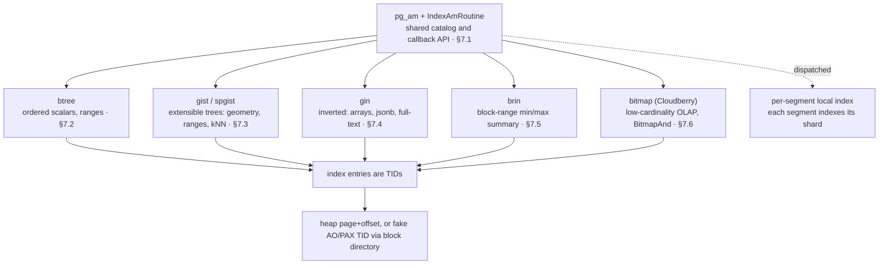

*The index landscape. One catalog (pg_am + opclass family) and one callback table (IndexAmRoutine) back seven access methods; each returns TIDs that locate rows — real heap page+offset, or the fake AO/PAX TID resolved via the block directory ([§5.3](./ch05.md#53-block-directory--fastsequence), [§6.2](./ch06.md#62-micro-partition-file-format--manifest-catalog)). And every index is per-segment and local: CREATE INDEX is dispatched, each segment indexes only its own shard.*

## 7.1 Index Fundamentals

### 7.1.1 What every index has in common

An index is a *separate relation* — its own row in `pg_class` (relkind `i`) — that maps key values to row locations so a lookup beats a full scan. Cloudberry inherits PostgreSQL's pluggable index machinery: seven built-in **access methods** (AMs), each declared in the `pg_am` catalog and reached through a single C function pointer table, the `IndexAmRoutine`. But Cloudberry adds one decisive twist that PostgreSQL does not have — an index is **per-segment and local**. There is no single, cluster-wide index; CREATE INDEX fans out to every segment, and each segment builds an index over *only the shard it stores*. This section establishes the shared catalog + API first, then the MPP twist that colors every index type in this chapter.

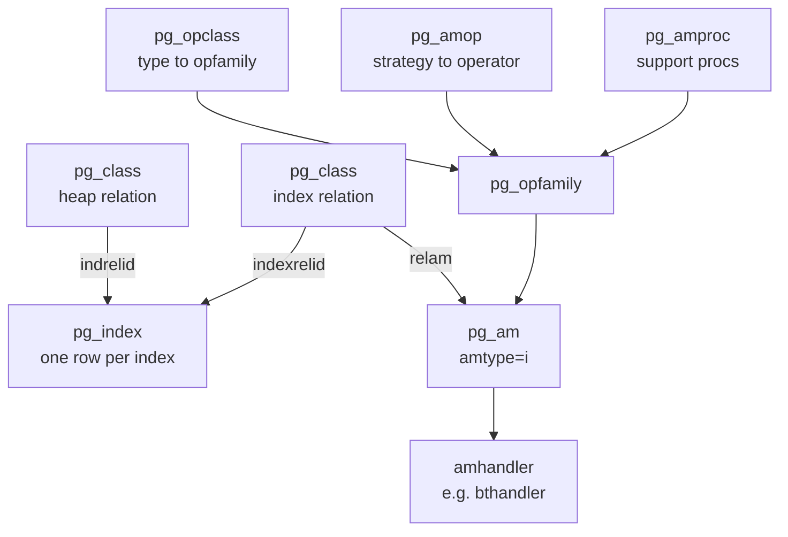

*The index-AM catalog graph: pg_index ties a heap to its index relation and an AM; the opclass/opfamily layer says which operators that AM understands.*

*Coordinator (port 7100): the 7 index AMs. amtype='i' filters out the table AMs (heap, ao_row, ao_column).*

```sql
SELECT amname, amhandler::regproc
      FROM pg_am WHERE amtype='i' ORDER BY amname;
```

```text {3,5} title="output"
 amname |  amhandler  
      --------+-------------
       bitmap | bmhandler
       brin   | brinhandler
       btree  | bthandler
       gin    | ginhandler
       gist   | gisthandler
       hash   | hashhandler
       spgist | spghandler
      (7 rows)
```

- **pg_am** — One row per access method. `amtype='i'` = index AM, `'t'` = table AM. Its `amhandler` column names the C function that returns the routine table.
- **pg_opclass / pg_opfamily** — Which data types + operators an AM can index. An *opclass* (e.g. `int4_ops`) binds a type to an *opfamily*; the opfamily groups cross-type operators that behave compatibly.
- **pg_amop** — Maps a **strategy number** (1=`<`, 3=`=`, 5=`>` for btree) to the actual operator, per opfamily — this is how the planner knows an index can satisfy `region = 'r1'`.
- **pg_amproc** — Maps a **support-procedure number** to a function the AM calls internally (btree's proc 1 is the comparison function).
- **pg_index** — The index's *own* catalog row: `indrelid` (the table), `indexrelid` (the index relation), `indkey` (which columns), `indisunique`, `indisvalid`, and more.

### 7.1.2 The API: IndexAmRoutine

Every AM exposes itself through one struct of callbacks. The handler function (named in `pg_am.amhandler`) `palloc`s an `IndexAmRoutine`, fills in its capability flags and function pointers, and returns it; the rest of the system calls `GetIndexAmRoutine` (`src/include/access/amapi.h:295`) to load it. The struct opens with **capability flags** the planner reads — `amcanorder`, `amcanunique`, `amcanmulticol`, `amcanparallel` — then a block of **interface functions**.

```c title="src/include/access/amapi.h:227"
bool  amcanorder;     /* support ORDER BY on indexed column? */
      bool  amcanunique;    /* support UNIQUE indexes? */
      bool  amcanmulticol;  /* support multi-column indexes? */
      ...
      ambuild_function   ambuild;     /* build a new index */
      aminsert_function  aminsert;    /* insert one tuple */
      amgettuple_function amgettuple; /* fetch next match (ordered scan) */
      amgetbitmap_function amgetbitmap;
```

btree's handler is the canonical example: it sets the flags `true` and wires each callback to a `bt*` function. `bthandler` lives at `src/backend/access/nbtree/nbtree.c:99`.

```c title="src/backend/access/nbtree/nbtree.c:99"
Datum
      bthandler(PG_FUNCTION_ARGS)
      {
          IndexAmRoutine *amroutine = makeNode(IndexAmRoutine);
          amroutine->amcanorder  = true;
          amroutine->amcanunique = true;
          amroutine->ambuild   = btbuild;
          amroutine->aminsert  = btinsert;
          amroutine->amgettuple = btgettuple;
          ...
          PG_RETURN_POINTER(amroutine);
      }
```

:::note

This indirection is the whole point of pluggability: the executor never names btree. It calls `amroutine->ambuild(...)`, and the same code path drives gist, gin, or a contrib AM.

:::

### 7.1.3 The MPP twist: indexes are per-segment and local

In a single-node PostgreSQL there is one index covering all the table's rows. In Cloudberry a table is sharded across segments by its distribution key, so an index covering *all* rows would have to span segments — there is no such object. Instead, **CREATE INDEX is dispatched to every segment**, and each segment independently builds a btree (or bitmap, gist...) over only the rows it physically stores. N segments ⇒ N local indexes.

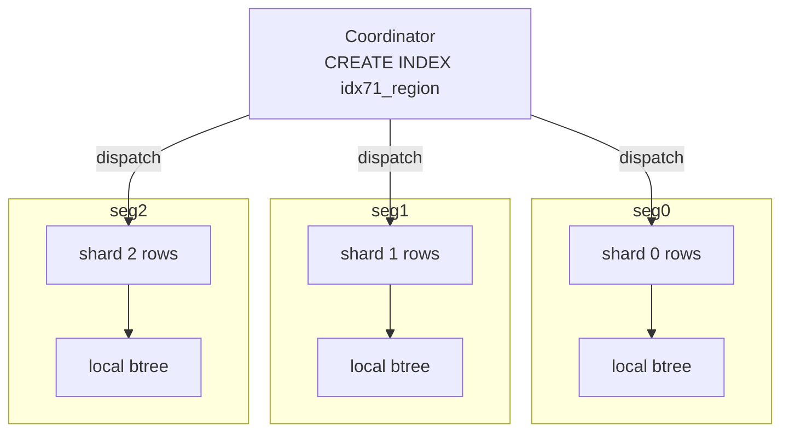

*CREATE INDEX fans out: the coordinator dispatches; each segment builds a local index over its own shard. No global index exists.*

Build a sharded table and an index on it, then prove the index relation exists *on every segment* with its own size. `gp_dist_random` runs the query on each segment and unions the results — three rows, three independent btrees.

*Coordinator: same index built independently on all 3 segments, each 65536 bytes over its shard.*

```sql
CREATE TABLE idx71_t (id int, region text, payload text)
        DISTRIBUTED BY (id);
      INSERT INTO idx71_t
        SELECT g, 'r'||(g%4), repeat('x',10) FROM generate_series(1,10000) g;
      CREATE INDEX idx71_region ON idx71_t (region);
      SELECT gp_segment_id, pg_relation_size('idx71_region') AS idx_bytes
      FROM gp_dist_random('gp_id') ORDER BY 1;
```

```text {3,4,5} title="output"
 gp_segment_id | idx_bytes 
      ---------------+-----------
                   0 |     65536
                   1 |     65536
                   2 |     65536
      (3 rows)
```

The index is a real, locally-visible relation on each segment. Connect *directly* to segment 7102 in utility mode (where the data physically lives) and the index relation is right there in that segment's `pg_class`.

*Segment 7102 (utility mode): the index relation is local to the segment.*

```sql
SELECT c.relname, c.relkind, am.amname
      FROM pg_class c JOIN pg_am am ON am.oid = c.relam
      WHERE c.relname = 'idx71_region';
```

```text {3} title="output"
   relname    | relkind | amname 
      --------------+---------+--------
       idx71_region | i       | btree
      (1 row)
```

### 7.1.4 A UNIQUE index must contain the distribution key

Because each index is local to one shard, a segment can only enforce uniqueness over *the rows it holds*. If the unique key is not a superset of the distribution key, two equal keys could land on *different* segments — and no segment would ever see both to reject the duplicate. Enforcing it would require a cross-segment check on every insert. Cloudberry forbids it outright; the check is raised in `src/backend/cdb/cdbcat.c:1009`.

*Coordinator: UNIQUE on `region` (not the distkey) is rejected; UNIQUE on `id` (the distkey) is allowed.*

```sql
CREATE UNIQUE INDEX idx71_uq ON idx71_t (region);
      CREATE UNIQUE INDEX idx71_uq ON idx71_t (id);
```

```text {1} title="output"
ERROR:  UNIQUE index must contain all columns in the table's distribution key
      DETAIL:  Distribution key column "id" is not included in the constraint.
      -- second statement:
      CREATE INDEX
```

```c title="src/backend/cdb/cdbcat.c:1009"
errmsg("UNIQUE index must contain all columns in the table's distribution key")
```

### 7.1.5 What an index entry points at: the TID

An index does not store rows — it stores **TIDs** (`ItemPointer`: a 6-byte block-number + offset) that locate the row in the table relation. For a **heap** table that TID is a literal page+slot you can fetch directly (§4). But Cloudberry's append-optimized engines have no heap-style page+offset, so they synthesize a **fake TID**: for AO/AOCS the (segno, rownumber) is encoded into a TID and resolved through the **block directory** at scan time ([§5.3](./ch05.md#53-block-directory--fastsequence)), and PAX resolves its own logical address the same way ([§6.2](./ch06.md#62-micro-partition-file-format--manifest-catalog)). The index API is identical — `aminsert` takes a TID, `amgettuple` returns a TID — but what the TID *means* depends on the table AM beneath it.

*Coordinator: the index's own `pg_index` row. `indkey` 2 = it indexes the 2nd column (`region`); not unique, valid.*

```sql
SELECT indexrelid::regclass, indrelid::regclass,
             indnatts, indisunique, indisvalid, indkey
      FROM pg_index WHERE indexrelid = 'idx71_region'::regclass;
```

```text {7} title="output"
-[ RECORD 1 ]-------------
      indexrelid  | idx71_region
      indrelid    | idx71_t
      indnatts    | 1
      indisunique | f
      indisvalid  | t
      indkey      | 2
```

:::note

Takeaway: one catalog (pg_am + opclass family), one callback table (IndexAmRoutine), seven AMs — then the MPP rule that an index is N local indexes, which forces UNIQUE ⊇ distkey and makes the meaning of a stored TID a property of the underlying table AM.

:::

## 7.2 B-Tree

### 7.2.1 A Lehman-Yao B-link tree

The default access method — what you get from a bare **CREATE INDEX** — is `btree`. Its handler `bthandler` advertises the ordered-scan capabilities the planner relies on (`amcanorder`, `amcanbackward`, `amgettuple`, `amgetbitmap`): see `src/backend/access/nbtree/nbtree.c:99`. Structurally it is not a textbook B+tree but a **Lehman-Yao B-link tree**: every page carries a **high key** (an upper bound on the keys it may hold) and a **right-link** `btpo_next` to its right sibling on the same level. Those two fields let a reader descend and scan **without lock-coupling** — if a page split moved your key rightward after you read the parent, you simply follow the right-link until the high key tells you you have arrived.

Block 0 is always the **meta page** (`BTREE_METAPAGE`, `src/include/access/nbtree.h:148`); it points at the current root. Above the leaves sit internal pages whose tuples are *downlinks* (separator key + child block number). Leaf tuples hold the indexed key + a heap **TID** (`ctid`). Levels number upward from `btpo_level = 0` at the leaves.

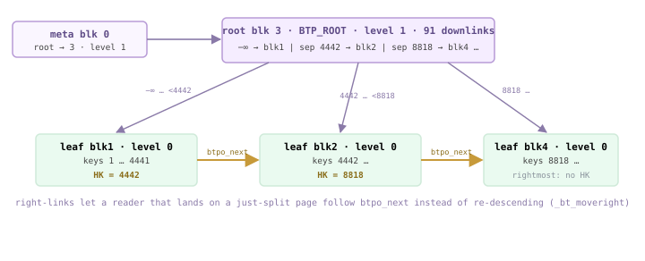

*B-link tree for idx72_idx on segment 7102 — meta → root (blk 3, level 1) → leaves (level 0). Vertical arrows are downlinks; the amber horizontal arrows are btpo_next right-links. Each non-rightmost leaf carries a high key (HK) bounding its contents.*

:::note

The demo cluster's segments use a 32 KB block size, so one leaf packs ~1473 entries; a single root level already indexes 133k rows. With the default 8 KB block this same data would grow a third (internal) level.

:::

### 7.2.2 Page anatomy — opaque, flags, links

Each btree page ends with a `BTPageOpaqueData` special area (`src/include/access/nbtree.h:64`). It is what makes the B-link structure navigable:

- **btpo_prev / btpo_next** — Left and right sibling block numbers on this level; `P_NONE` at the ends. `btpo_next` is the right-link a reader follows after a concurrent split.
- **btpo_level** — Tree level; `0` for leaves, increasing toward the root.
- **btpo_flags** — Bit set: `BTP_LEAF` (1), `BTP_ROOT` (2), `BTP_DELETED` (4), `BTP_HALF_DEAD` (16), plus `BTP_INCOMPLETE_SPLIT`, `BTP_HAS_GARBAGE` (`nbtree.h:76`+).

By convention item slot 1 on a non-rightmost page is the **high key** (`P_HIKEY`, `nbtree.h:367`); real data starts at `P_FIRSTKEY` (slot 2). On the *rightmost* page of a level there is no high key (the bound is +∞), so `P_FIRSTDATAKEY` returns slot 1 instead (`nbtree.h:369`).

*bt_page_stats for two pages of idx72_idx (segment 7102). The leaf (blk 1) right-links to blk 2; the root (blk 3) is flag 2 = BTP_ROOT at level 1.*

| blkno | type | live_items | avg_item_size | free_size | btpo_prev | btpo_next | btpo_level | btpo_flags |
| --- | --- | --- | --- | --- | --- | --- | --- | --- |
| 1 | l (leaf) | 1473 | 16 | 3264 | 0 | 2 | 0 | 1 = BTP_LEAF |
| 3 | r (root) | 91 | 15 | 30912 | 0 | 0 | 1 | 2 = BTP_ROOT |

### 7.2.3 Inside a leaf page — the high key and the TIDs

`bt_page_items` decodes each `IndexTuple`. Below, slot 1 is the **high key** for leaf block 1: ctid `(1,1)` is a placeholder, and its data bytes `5a 11` little-endian = `0x115a` = **4442**. Slots 2.. are the real entries, each a heap **TID** (`ctid`) plus the key. The page therefore holds keys `1 … 4441`, all strictly below the high key 4442 — exactly the invariant `_bt_moveright` checks.

*First entries of leaf block 1. Slot 1 = high key (4442). Slot 2 onward = key → heap TID. data shown little-endian*

```sql
SELECT itemoffset, ctid, itemlen, left(data,23) AS data
        FROM bt_page_items(get_raw_page('idx72_idx', 1))
        ORDER BY itemoffset LIMIT 6;
```

```text title="output"
 itemoffset | ctid  | itemlen |          data
      ------------+-------+---------+-------------------------
                1 | (1,1) |      16 | 5a 11 00 00 00 00 00 00   <- HIGH KEY = 0x115a = 4442
                2 | (0,1) |      16 | 02 00 00 00 00 00 00 00
                3 | (0,2) |      16 | 03 00 00 00 00 00 00 00
                4 | (0,3) |      16 | 04 00 00 00 00 00 00 00
                5 | (0,4) |      16 | 07 00 00 00 00 00 00 00
                6 | (0,5) |      16 | 08 00 00 00 00 00 00 00
      (6 rows)
```

*Last live entries of the same leaf — the largest key is 0x1159 = 4441, one below the high key 4442. The next key (4442) lives on block 2, reachable by the right-link.*

```sql
SELECT itemoffset, ctid, left(data,11) AS data
        FROM bt_page_items(get_raw_page('idx72_idx', 1))
        ORDER BY itemoffset DESC LIMIT 2;
```

```text title="output"
 itemoffset |  ctid   |    data
      ------------+---------+-------------
             1473 | (1,721) | 59 11 00 00   <- 0x1159 = 4441  (max key < high key)
             1472 | (1,720) | 58 11 00 00
      (2 rows)
```

<RawFigure html={"<div style=\"max-width:720px;margin:2px auto;font:11px/1.4 ui-monospace,SFMono-Regular,Menlo,monospace;color:#1f2328;overflow-x:auto\"> <div style=\"min-width:540px;border:2px solid #b79ad6;border-radius:6px;overflow:hidden\"> <div style=\"background:#efe3fb;color:#5e4b86;font-weight:700;text-align:center;padding:4px\">one btree leaf page — block 1 of idx72_idx (32 KB)</div> <div style=\"background:#f5edff;border-top:1px solid #cdb4db;padding:5px 8px\">PageHeaderData <span style=\"color:#777\">· 24 bytes</span></div> <div style=\"background:#faf6ff;border-top:1px solid #cdb4db;padding:5px 8px\"> <div style=\"color:#6b5b95\">line pointers — ItemId[] grow down ↓</div> <div style=\"display:flex;gap:3px;margin-top:3px;text-align:center\"> <div style=\"flex:0 0 150px;background:#fff4d6;border:1px solid #e0b365;padding:3px;color:#8a6d1a\">ItemId[1] → <span class=\"hl\">HIGH KEY</span><div style=\"font-size:9px\">P_HIKEY · slot 1</div></div> <div style=\"flex:1;background:#f5edff;border:1px solid #cdb4db;padding:3px\">ItemId[2] → first data<div style=\"font-size:9px;color:#777\">P_FIRSTKEY · slot 2</div></div> <div style=\"flex:1;background:#f5edff;border:1px solid #cdb4db;padding:3px\">ItemId[3] → …</div> </div></div> <div style=\"background:#eef0f2;border-top:1px solid #cdb4db;text-align:center;color:#8a939c;padding:6px 8px\">↕ free space ↕</div> <div style=\"background:#eafaf0;border-top:1px solid #cdb4db;padding:5px 8px\"> <div style=\"color:#6b8a76\">index tuples — fill upward from the end ↑</div> <div style=\"display:flex;gap:3px;margin-top:3px;text-align:center\"> <div style=\"flex:1;background:#eafaf0;border:1px solid #cfead9;padding:3px\">key 2 · TID (0,1)</div> <div style=\"flex:1;background:#eafaf0;border:1px solid #cfead9;padding:3px\">… · …</div> <div style=\"flex:1;background:#eafaf0;border:1px solid #cfead9;padding:3px\">key <span class=\"hl\">4441</span> · TID (1,720)</div> <div style=\"flex:0 0 150px;background:#fff4d6;border:1px solid #e0b365;padding:3px;color:#8a6d1a\">HIGH KEY <span class=\"hl\">4442</span><div style=\"font-size:9px\">bound · no heap TID</div></div> </div></div> <div style=\"background:#f5edff;border-top:1px solid #cdb4db;padding:5px 8px\">special = BTPageOpaqueData: btpo_prev=0 · btpo_next=<span class=\"hl\">2</span> · level=0 · flags=BTP_LEAF</div> </div></div>"} caption={"Slot layout of a leaf page. Line pointers grow down from the header; tuples fill up from the end. Slot 1 is reserved for the high key on any non-rightmost page."} />

### 7.2.4 The meta page and the root

`bt_metap` reads block 0. `root` is the current root block, `level` its level, and `fastroot`/`fastlevel` a cached shortcut to the true root used to skip levels that have collapsed to a single child. `allequalimage = t` records that the opclass supports deduplication.

*Meta page of idx72_idx — root is block 3 at level 1, so this is a two-level tree (root + leaves).*

```sql
SELECT root, level, fastroot, fastlevel, allequalimage
        FROM bt_metap('idx72_idx');
```

```text title="output"
 root | level | fastroot | fastlevel | allequalimage
      ------+-------+----------+-----------+---------------
          3 |     1 |        3 |         1 | t
      (1 row)
```

The root's own tuples are **downlinks**. Slot 1 is the leftmost child and carries *no key* (minus-infinity); each later slot stores a separator key plus the child block in its `ctid`. Note slot 2's separator is `0x115a` = 4442 — the very high key we saw on leaf block 1, copied upward when block 1 split off block 2.

*Root (block 3) downlinks. Slot 1 = leftmost child blk1, no key (−∞). Slot 2 = separator 4442 → child blk2.*

```sql
SELECT itemoffset, ctid AS child_blk, itemlen, left(data,23) AS sep_key
        FROM bt_page_items(get_raw_page('idx72_idx', 3))
        ORDER BY itemoffset LIMIT 5;
```

```text title="output"
 itemoffset | child_blk | itemlen |         sep_key
      ------------+-----------+---------+-------------------------
                1 | (1,0)     |       8 |                          <- leftmost, key = −infinity
                2 | (2,1)     |      16 | 5a 11 00 00 00 00 00 00   <- sep 4442 -> child blk 2
                3 | (4,1)     |      16 | 72 22 00 00 00 00 00 00   <- sep 8818 -> child blk 4
                4 | (5,1)     |      16 | ac 33 00 00 00 00 00 00
                5 | (6,1)     |      16 | 37 45 00 00 00 00 00 00
      (5 rows)
```

### 7.2.5 Build — sort, then load bottom-up

`btbuild` (`src/backend/access/nbtree/nbtsort.c:301`) does **not** insert tuples one by one. It feeds all heap tuples through a tuplesort in index order, then streams the sorted run into pages bottom-up: `_bt_buildadd` (`nbtsort.c:841`) appends each tuple to the current leaf, and when a page fills it is finished and its high key (a *truncated* copy of the first key of the next page) is propagated up to the parent level — recursively creating internal levels. Because pages are written packed and in order, a freshly built index is denser than one grown by random inserts.

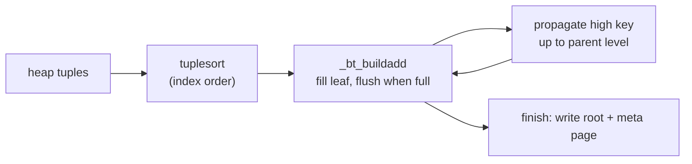

*btbuild pipeline — heap scan feeds a sort, _bt_buildadd packs sorted tuples into full leaves and propagates separators upward.*

### 7.2.6 Insert, split, and incomplete-split repair

A live insert goes through `_bt_doinsert` (`src/backend/access/nbtree/nbtinsert.c:106`). It builds a scankey, descends with `_bt_search` to the correct leaf, and for a **unique** index re-checks for a visible duplicate before inserting (`_bt_findinsertloc`, `nbtinsert.c:819`). If the target leaf has room the tuple is placed directly; if not, `_bt_split` (`nbtinsert.c:1471`) divides the page, moving the upper half to a new right sibling and rewiring the right-links.

A split is two logical steps — split the leaf, then insert the new downlink into the parent. Between them the left page is flagged `BTP_INCOMPLETE_SPLIT`. If a crash or interruption lands in that gap, the next descent through the page detects the flag and calls `_bt_finish_split` (`nbtinsert.c:2232`) to insert the missing parent downlink before proceeding — the B-link right-link guarantees the right half is still reachable in the meantime, so the tree is never inconsistent for readers.

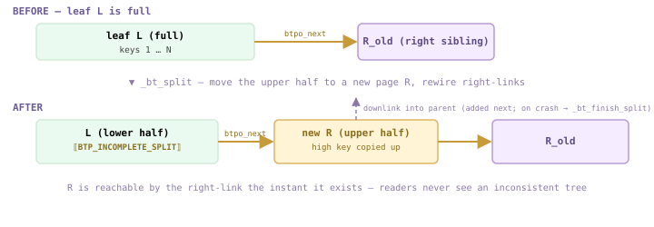

*A page split, before → after. _bt_split moves the upper half of full leaf L into a new right sibling R and rewires the right-link L→R immediately; L is flagged BTP_INCOMPLETE_SPLIT until the parent downlink is added. A crash in that gap is repaired on the next descent by _bt_finish_split — the right-link keeps R reachable meanwhile.*

### 7.2.7 Lookup — one TID at a time, or a whole bitmap

Two entry points serve two plan shapes (`bthandler` wires both, `nbtree.c:139`):

- **btgettuple** — `nbtree.c:297` — returns one heap TID per call, in index order. Drives an **Index Scan** / Index-Only Scan; supports ordered and backward scans, so it can satisfy ORDER BY for free.
- **btgetbitmap** — `nbtree.c:375` — walks the matching leaf range and hands every TID to a bitmap, feeding a **Bitmap Heap Scan**. Loses ordering but lets the executor visit the heap in physical order and combine multiple indexes.

Both start at `_bt_search` (`src/backend/access/nbtree/nbtsearch.c:100`), which descends from the root choosing the child whose separator brackets the key. At each page `_bt_moveright` (`nbtsearch.c:244`) compares the search key against the page's **high key**: if the key exceeds it, a concurrent split has moved the data right, so it follows `btpo_next` instead of re-descending. That is the whole point of the B-link design — descent needs no coupled locks.

### 7.2.8 Delete & vacuum — half-dead, then deleted

VACUUM scans the index and calls `btvacuumpage` (`src/backend/access/nbtree/nbtree.c:1151`) per leaf to remove index tuples pointing at dead heap rows. When a leaf becomes entirely empty it can be unlinked from the tree by `_bt_pagedel`, but deletion is two-phase to stay safe for concurrent readers:

- **BTP_HALF_DEAD** — Transitional: the page is logically empty and its parent downlink has been removed, but it is still chained by sibling links so an in-flight scan can pass through it (`P_ISHALFDEAD`, `nbtree.h:224`).
- **BTP_DELETED** — Final: the page is fully unlinked. It records a full XID so the block is not recycled into the free space map until no snapshot could still be following a stale right-link to it (`nbtree.h:248`).

:::note

`P_IGNORE` (`nbtree.h:225`) treats both half-dead and deleted pages as skippable during a scan, so a reader that lands on one simply follows the right-link onward — deletion never strands a concurrent descent.

:::

## 7.3 GiST & SP-GiST

### 7.3.1 One tree skeleton, pluggable semantics

B-tree ([§7.2](#72-b-tree)) bakes one idea into the access method: a **total order** over scalar keys. GiST and SP-GiST invert that. The access method supplies only the *page mechanics* — a balanced (GiST) or space-partitioned (SP-GiST) tree of pages, WAL, vacuum — and an **opclass** supplies the *meaning* through a fixed set of support functions. Swap the opclass and the same `USING gist` index serves geometry, ranges, full-text, or `pg_trgm` trigrams. The handler advertises how many support slots it expects: GiST asks for `GISTNProcs` = **11** (`gist.h:41`), SP-GiST for `SPGISTNProc` = **7** with **5** required (`spgist.h:30`).

The defining GiST idea: every **internal** entry is a *predicate* — typically a bounding box — that **covers** everything in its subtree. A search descends into *every* child whose predicate is `consistent` with the query, so unlike a B-tree it may follow several branches at once. Both AMs set `amcanorder=false` but `amcanorderbyop=true` (`gist.c:67`, `spgutils.c:50`), which is what unlocks **kNN** `ORDER BY p <-> point` scans through the `distance` support function.

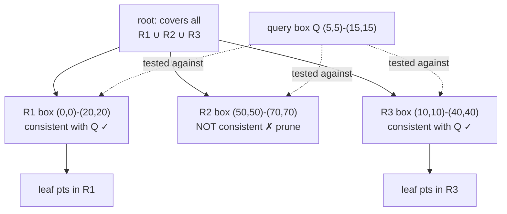

*GiST search for query box Q: descend EVERY child whose covering predicate is consistent with Q. Here R1 and R3 overlap Q, R2 does not — so two branches are visited, R2 is pruned.*

`gisthandler` (`gist.c:60`) wires `consistent` into `gistgettuple`; the predicate-covering invariant is maintained on insert by `union` (grow a parent box to cover a new child), `penalty` (pick the child cheapest to enlarge) and `picksplit` (divide an overflowing page into two boxes).

### 7.3.2 The two support-function contracts

GiST's support slots are numbered in `gist.h` (`GIST_CONSISTENT_PROC`=1 … `GIST_SORTSUPPORT_PROC`=11, `gist.h:30`). SP-GiST's live in `spgist.h:23`. They encode two different geometries: GiST predicates may **overlap** (a point can satisfy many boxes, so search forks); SP-GiST partitions are **disjoint** (a quadtree quadrant, a radix-trie character), so a search follows few paths but the tree is **unbalanced**.

*Opclass support functions — GiST (gist.h) vs SP-GiST (spgist.h). The AM is generic; these define the type's semantics.*

| Framework | Function (slot) | Role |
| --- | --- | --- |
| GiST | consistent (1) | Does this entry's predicate match the query? (the only fn a scan strictly needs) |
| GiST | union (2) | Combine N entries into one covering predicate for the parent |
| GiST | compress / decompress (3/4) | Map indexed value ↔ on-page key representation (lossy allowed) |
| GiST | penalty (5) | Cost of inserting an entry under a given child — drives child choice |
| GiST | picksplit (6) | Split an overflowing page into two balanced groups |
| GiST | same / distance (7/8) | Equality of keys · distance for kNN ORDER BY (amcanorderbyop) |
| SP-GiST | config (1) | Declare node/prefix/leaf types and the partitioning style |
| SP-GiST | choose (2) | Decide which child partition a new value descends into |
| SP-GiST | picksplit (3) | Create child partitions when a leaf page overflows |
| SP-GiST | inner_consistent (4) | Which inner partitions can match the query (prune the rest) |
| SP-GiST | leaf_consistent (5) | Does a leaf datum actually match the query? |

:::note

GiST has no `config`: its tree is always balanced, so structure is fixed. SP-GiST has no `union`/`penalty`: partitions are disjoint, so there is nothing to merge or grow. That asymmetry is the whole distinction.

:::

### 7.3.3 Both are real index access methods here

*pg_am knows both — amtype 'i' (index). Cloudberry 3.0.0-devel, port 7100*

```sql
SELECT amname, amtype FROM pg_am WHERE amname IN ('gist','spgist');
```

```text title="output"
 amname | amtype
      --------+--------
       gist   | i
       spgist | i
      (2 rows)
```

*The point type ships opclasses for both AMs — note SP-GiST offers TWO partitioning strategies for the same type (quadtree vs k-d tree). opcmethod join*

```sql
SELECT am.amname, oc.opcname
      FROM pg_opclass oc JOIN pg_am am ON am.oid = oc.opcmethod
      WHERE am.amname IN ('gist','spgist') AND oc.opcname LIKE '%point%'
      ORDER BY 1,2;
```

```text title="output"
 amname |    opcname
      --------+----------------
       gist   | point_ops
       spgist | kd_point_ops
       spgist | quad_point_ops
      (3 rows)
```

### 7.3.4 A GiST index: containment and kNN

A demo table of 5000 points, indexed `USING gist(p)` (the `point_ops` opclass). Because GiST sets `amcanorderbyop=true`, the planner can answer a nearest-neighbour `ORDER BY p <-> point` straight from the index — the `distance` support function (slot 8) lets the scan pop leaf entries in increasing distance order without a sort.

```c title="setup (idx73_g)"
CREATE TABLE idx73_g(id int, p point);
      INSERT INTO idx73_g
        SELECT g, point(g%100,(g*7)%100) FROM generate_series(1,5000) g;
      CREATE INDEX idx73_g_gist ON idx73_g USING gist(p);
```

*kNN: no Sort node — the gist Index Scan emits rows already ordered by distance. (run with gp_role=utility on segment 7102 to see the per-segment plan) Order By in the scan*

```sql
SET enable_seqscan=off;
      EXPLAIN (COSTS OFF)
      SELECT id FROM idx73_g ORDER BY p <-> point '(0,0)' LIMIT 5;
```

```text title="output"
                   QUERY PLAN
      ------------------------------------------------
       Limit
         ->  Index Scan using idx73_g_gist on idx73_g
               Order By: (p <-> '(0,0)'::point)
       Optimizer: Postgres query optimizer
      (4 rows)
```

*Containment &lt;@ resolves to an Index Only Scan — consistent() prunes every box that cannot overlap the query box. Index Cond*

```sql
SET enable_seqscan=off;
      EXPLAIN (COSTS OFF)
      SELECT count(*) FROM idx73_g WHERE p <@ box '(0,0),(10,10)';
```

```text title="output"
                     QUERY PLAN
      -----------------------------------------------------
       Aggregate
         ->  Index Only Scan using idx73_g_gist on idx73_g
               Index Cond: (p <@ '(10,10),(0,0)'::box)
       Optimizer: Postgres query optimizer
      (4 rows)
```

### 7.3.5 The same query, an SP-GiST quadtree

Re-indexing the identical column `USING spgist(p)` builds a **quadtree** instead (default `quad_point_ops`): each inner node splits the plane into four disjoint quadrants. The query text is unchanged — only the partitioning discipline differs. `spghandler` (`spgutils.c:43`) routes the scan through `inner_consistent` (prune quadrants) then `leaf_consistent` (confirm points).

*Same &lt;@ predicate, now served by the SP-GiST index — disjoint quadrant pruning instead of overlapping boxes. Index Only Scan using ..._spg*

```sql
CREATE INDEX idx73_g_spg ON idx73_g USING spgist(p);
      SET enable_seqscan=off;
      EXPLAIN (COSTS OFF)
      SELECT count(*) FROM idx73_g WHERE p <@ box '(0,0),(10,10)';
```

```text title="output"
                     QUERY PLAN
      ----------------------------------------------------
       Aggregate
         ->  Index Only Scan using idx73_g_spg on idx73_g
               Index Cond: (p <@ '(10,10),(0,0)'::box)
       Optimizer: Postgres query optimizer
      (4 rows)
```

### 7.3.6 Three trees, three contracts

- **B-tree** — Total order on scalars. One semantics (comparison), no opclass functions beyond compare/sortsupport. Balanced, single descent path. Best for ranges over orderable keys.
- **GiST** — Overlapping covering predicates, balanced tree. Opclass supplies consistent/union/penalty/picksplit (+distance for kNN). A search may fork into several children. Geometry, ranges, tsvector, pg_trgm; lossy + ordered scans.
- **SP-GiST** — Disjoint space partitions, UN-balanced tree. Opclass supplies config/choose/picksplit/inner_consistent/leaf_consistent. Quadtrees, k-d trees, radix tries — point data and text-prefix search where partitions never overlap.

:::note

Practical rule of thumb: data whose keys naturally overlap (boxes, ranges, sets) → GiST; data that cleanly subdivides space into non-overlapping cells (points, prefixes) → SP-GiST. Both ride the same extensible-opclass machinery that B-tree's fixed comparison contract does not expose.

:::

## 7.4 GIN — the index for composite values

### 7.4.1 One row, many keys: the inverted structure

A B-tree ([§7.2](#72-b-tree)) indexes one **scalar** per row. GIN indexes a **composite** value — an array, a `jsonb`, a `tsvector`, a `pg_trgm` text — by exploding it into its constituent **keys** and indexing each key separately. The README puts it plainly: an item *contains zero or more keys*, and *the index actually stores and searches for the key values, not the items per se* `src/backend/access/gin/README:85`. So `{"color":"blue","tags":["gin"]}` is not stored as a unit — it is shredded into keys, and each key points back at every row that contains it. That inverted map (key → rows) is the whole idea.

Physically a GIN index is two nested B-trees. The **entry tree** is a B-tree keyed on the extracted keys. Each entry's payload is the set of TIDs (heap row pointers) that contain that key — its **posting list**. If that set is small it lives **inline** in the entry tuple as a compressed `GinPostingList` `src/include/access/ginblock.h:336`; once it outgrows `GinMaxItemSize` the entry instead points at a separate **posting tree** — a second B-tree, this one keyed on TID `src/backend/access/gin/README:95`. The handler `ginhandler` wires this up: no `amgettuple`, only `amgetbitmap` → `gingetbitmap`, because a GIN scan always produces a bitmap of many TIDs, never an ordered stream `src/backend/access/gin/ginutil.c:79`.

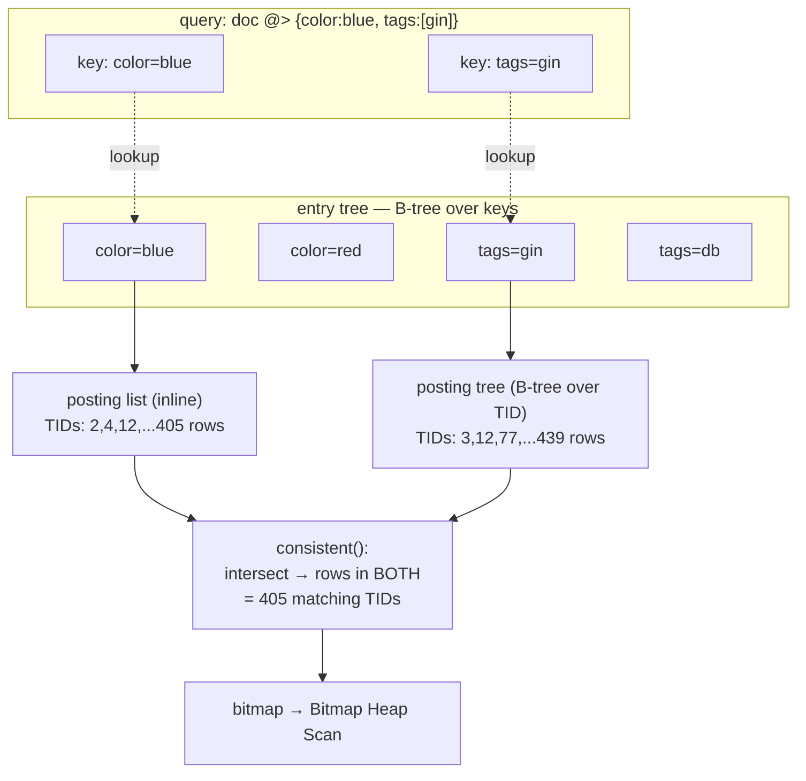

*Inverted layout. A query splits into keys; each key is found in the entry tree; their TID sets are intersected by consistent().*

GIN is *optimized for cases where items contain many keys and the same key values appear in many different items* `src/backend/access/gin/README:91` — exactly the shape of document/tag/full-text data, where a handful of keys recur across thousands of rows.

### 7.4.2 A live GIN index over jsonb

Build a 10 000-row table whose `doc` column is a small JSON document with a `tags` array, a `color`, and a `level`, then index it with the default `jsonb_ops` GIN opclass.

*Populate and index. distribution NOTICE elided*

```sql
CREATE TABLE idx74_t (id int, doc jsonb);
      INSERT INTO idx74_t
      SELECT g, jsonb_build_object(
        'tags', to_jsonb(ARRAY[(ARRAY['db','index','gin','btree','jsonb','vacuum','tid','heap'])[1+(g%8)],
                               (ARRAY['fast','slow','warm','cold'])[1+(g%4)]]),
        'color',(ARRAY['red','green','blue','amber'])[1+(g%4)],
        'level', g%100)
      FROM generate_series(1,10000) g;
      CREATE INDEX idx74_gin ON idx74_t USING gin (doc);
```

```text title="output"
INSERT 0 10000
      CREATE INDEX
```

Now a containment query. On the distributed cluster ORCA may prefer a parallel Seq Scan for a low-selectivity predicate, so we read the GIN plan on one **segment** in utility mode with the Postgres planner — that is where the per-segment index actually lives. The plan is the GIN signature: a **Bitmap Index Scan** feeding a **Bitmap Heap Scan** with a **Recheck**.

*Bitmap Index Scan on the GIN index. segment :7102, gp_role=utility*

```sql
SET optimizer = off;          -- Postgres planner
      SET enable_seqscan = off;
      EXPLAIN (ANALYZE, COSTS off, TIMING off, SUMMARY off)
      SELECT count(*) FROM idx74_t WHERE doc @> '{"color":"blue","tags":["gin"]}';
```

```text title="output"
 Aggregate (actual rows=1 loops=1)
         ->  Bitmap Heap Scan on idx74_t (actual rows=405 loops=1)
               Recheck Cond: (doc @> '{"tags": ["gin"], "color": "blue"}'::jsonb)
               Heap Blocks: exact=12
               ->  Bitmap Index Scan on idx74_gin (actual rows=405 loops=1)
                     Index Cond: (doc @> '{"tags": ["gin"], "color": "blue"}'::jsonb)
       Optimizer: Postgres query optimizer
      (7 rows)
```

:::note

Why a **Recheck**? The GIN scan only proves a row contains the queried *keys*; it cannot prove their *structure* (e.g. that `gin` sits under `tags` rather than elsewhere). The Bitmap Heap Scan re-evaluates `@>` on each candidate row to confirm. This is intrinsic to GIN's lossy, key-level matching — `gingetbitmap` returns TIDs, never the original datum `src/backend/access/gin/ginget.c:1922`.

:::

*The inverted index is far smaller than the heap it covers.*

```sql
SELECT pg_size_pretty(pg_relation_size('idx74_gin')) AS gin_size,
             pg_size_pretty(pg_relation_size('idx74_t'))  AS heap_size;
```

```text title="output"
 gin_size | heap_size 
      ----------+-----------
       256 kB   | 1184 kB
      (1 row)
```

### 7.4.3 The opclass contract: three functions do all the work

GIN itself knows nothing about arrays, JSON, or text. Everything type-specific is delegated to opclass **support functions** — `amsupport = GINNProcs` (7) `src/backend/access/gin/ginutil.c:43`, of which three carry the semantics. `extractValue` runs at **insert** time to shred an item into keys; `extractQuery` runs at **scan** time to shred the *query* into keys plus a **search mode**; `consistent` decides, given which of those keys a row actually matched, whether the row truly satisfies the operator.

*The core GIN support functions (numbers from src/include/access/gin.h:22).*

| # | Macro | Role | jsonb_ops impl (live) |
| --- | --- | --- | --- |
| 1 | GIN_COMPARE_PROC | order two keys within the entry tree | gin_compare_jsonb |
| 2 | GIN_EXTRACTVALUE_PROC | item → array of keys (at INSERT) | gin_extract_jsonb |
| 3 | GIN_EXTRACTQUERY_PROC | query → keys + searchMode (at SCAN) | gin_extract_jsonb_query |
| 4 | GIN_CONSISTENT_PROC | which keys matched → row matches? | gin_consistent_jsonb |
| 6 | GIN_TRICONSISTENT_PROC | ternary variant (true/false/maybe) | gin_triconsistent_jsonb |

*The jsonb_ops opclass, read straight from the catalog. (amprocnum 5, compare_partial, is unused here.)*

```sql
SELECT ap.amprocnum, ap.amproc::regproc
      FROM pg_opclass oc
      JOIN pg_amproc ap ON ap.amprocfamily = oc.opcfamily
                       AND ap.amproclefttype = oc.opcintype
      WHERE oc.opcname = 'jsonb_ops'
        AND oc.opcmethod = (SELECT oid FROM pg_am WHERE amname='gin')
      ORDER BY ap.amprocnum;
```

```text title="output"
 amprocnum |         amproc          
      -----------+-------------------------
               1 | gin_compare_jsonb
               2 | gin_extract_jsonb
               3 | gin_extract_jsonb_query
               4 | gin_consistent_jsonb
               6 | gin_triconsistent_jsonb
      (5 rows)
```

`extractQuery` also returns a **searchMode** telling GIN how aggressively to scan: `GIN_SEARCH_MODE_DEFAULT` (intersect the keys), `GIN_SEARCH_MODE_ALL`, `GIN_SEARCH_MODE_INCLUDE_EMPTY`, or the internal `GIN_SEARCH_MODE_EVERYTHING` `src/include/access/gin.h:33`. The array opclass shows the pattern compactly — for `&&` (overlap) one matching element suffices, for `@>` (contains) **all** query keys must be present `src/backend/access/gin/ginarrayproc.c:142`.

:::note

This is why GIN supports `@>`, `?`, `@@`, `&&`-style **containment / match** operators but **not** `<`, `>`, `BETWEEN` or `ORDER BY`. The entry tree is ordered on keys only to find them fast; a query result is a set of TIDs with no meaningful order — hence `amcanorder = false` and bitmap-only output `src/backend/access/gin/ginutil.c:45`.

:::

### 7.4.4 fastupdate: buffering expensive inserts in a pending list

GIN inserts are costly: one item with *N* keys means *N* descents into the entry tree and *N* posting-list updates (`ginEntryInsert` per key `src/backend/access/gin/gininsert.c:179`). To amortize this, GIN defaults to **fastupdate=on**: new entries are appended, **unsorted**, to a **pending list** of plain heap-style tuples, and merged into the main trees in bulk later — by `ginInsertCleanup`, triggered at VACUUM or when the list crosses `gin_pending_list_limit` `src/backend/access/gin/ginfast.c:470`. The README's words: *bulk insertion of a few thousand entries can be much faster than retail insertion … the win comes mainly from not having to do multiple searches/insertions when the same key appears in multiple new heap tuples* `src/backend/access/gin/README:101`.

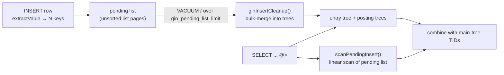

*fastupdate=on: writes land in the pending list; reads and VACUUM pay to scan/flush it.*

- **The tradeoff** — Faster writes, but every reader must **linearly scan** the pending list and union it with the main result — `gingetbitmap` calls `scanPendingInsert` before touching the trees `src/backend/access/gin/ginget.c:1970`. A long pending list slows queries and bloats one VACUUM. With `fastupdate=off`, inserts pay full price immediately but reads stay clean.
- **When to turn it off** — Read-heavy or latency-sensitive workloads, or indexes that rarely VACUUM. It is a per-index reloption.

*fastupdate is a settable index reloption; the flush threshold is a GUC.*

```sql
ALTER INDEX idx74_gin SET (fastupdate = off);
      SELECT relname, reloptions FROM pg_class WHERE relname = 'idx74_gin';
      SHOW gin_pending_list_limit;
```

```text title="output"
ALTER INDEX
        relname  |    reloptions    
      -----------+------------------
       idx74_gin | {fastupdate=off}
      (1 row)

       gin_pending_list_limit 
      ------------------------
       4MB
      (1 row)
```

### 7.4.5 GIN is what makes jsonb fast

Tying back to the JSON chapter: `jsonb @> '{…}'` containment and `jsonb ? 'key'` existence are exactly the `@>`/`?` operators GIN's `jsonb_ops` opclass implements — without a GIN index they degrade to a full scan with a per-row `@>` test (the `Seq Scan + Filter` plan ORCA chose on the distributed table above). A second opclass, **`jsonb_path_ops`**, indexes hashes of whole root-to-leaf *paths* rather than individual keys: it supports only `@>` (not `?`), but produces fewer, more selective keys — usually a smaller index and faster containment on deep documents.

*Both opclasses build; on this shallow 10k dataset they tie, but jsonb_path_ops typically wins on deep/large docs.*

```sql
CREATE INDEX idx74_gin_po ON idx74_t USING gin (doc jsonb_path_ops);
      SELECT pg_size_pretty(pg_relation_size('idx74_gin'))    AS jsonb_ops,
             pg_size_pretty(pg_relation_size('idx74_gin_po')) AS jsonb_path_ops;
```

```text title="output"
 jsonb_ops | jsonb_path_ops 
      -----------+----------------
       256 kB    | 256 kB
      (1 row)
```

The same machinery serves full-text search (`tsvector @@ tsquery`), array overlap/containment (`&& @>`), and trigram similarity (`pg_trgm`) — different opclasses, identical entry-tree-plus-posting-list skeleton. GIN is the one inverted index Cloudberry reuses for every *contains-one-of-many* problem.

## 7.5 BRIN

### 7.5.1 One summary per block range, not one entry per row

A B-tree ([§7.2](#72-b-tree)) stores one index entry **per row** — exact, but big. **BRIN** (Block Range INdex) goes the opposite way: it stores one tiny **summary per range of heap blocks**. The default range is `pages_per_range=128` consecutive heap pages (`src/include/access/brin.h:38`, `BRIN_DEFAULT_PAGES_PER_RANGE 128`). For the `minmax` opclass the summary of a range is just `[min, max]` of the indexed column over those 128 pages. A scan walks the summaries, and for each range asks *could any row here match the predicate?* — if the `[min,max]` can't overlap, the **entire range is skipped** without touching the heap. This makes BRIN orders of magnitude smaller than a B-tree, at the cost of being **lossy**: it returns *candidate* ranges, and the heap is rechecked row-by-row afterwards. BRIN only pays off on columns that are **naturally ordered** on disk (timestamps appended over time, monotonic ids) so each range's `[min,max]` stays tight.

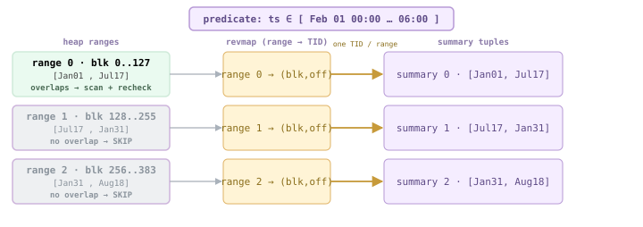

*Heap blocks grouped into ranges (128 pages each), each summarized by a [min,max]. The revmap holds one TID per range → its summary tuple, so a heap block finds its summary in O(1). The predicate is tested against each summary: non-overlapping ranges are skipped whole; only overlapping ranges are scanned and rechecked.*

The access-method handler `brinhandler` wires this up (`src/backend/access/brin/brin.c:106`): build via `brinbuild` (`:952`), insert via `brininsert` (`:171`), and the scan via `bringetbitmap` (`:399`) which — note the GPDB comment at `brin.c:391` — returns a **lossy TIDBitmap**, so BRIN always feeds a Bitmap Heap Scan, never a plain Index Scan.

### 7.5.2 Structure: meta page + revmap + summary tuples

On disk a BRIN index is three things (`brin_revmap.c:5` and the README at `src/backend/access/brin/README:103`): a **meta page** (block 0) holding `pagesPerRange` and the version; a **revmap** (range map) occupying the next few blocks — it stores one TID per range pointing at that range's summary tuple, so given a heap block the scan can find its summary in O(1); and ordinary **data pages** of summary tuples. Layout is fixed: `{meta page, [revmap pages], [data pages]}` (README `:204`).

- **meta page** — `pages_per_range` reloption, BRIN version (`BRIN_CURRENT_VERSION 1`, `brin_page.h:110`), and `lastrevmappage`.
- **revmap** — Dense array: range index → TID of its summary tuple. Grown as the heap grows (`revmap_physical_extend`, `brin_revmap.c:63`).
- **summary tuples** — The actual `[min,max]` (or richer payload for other opclasses), packed onto data pages.
- **unsummarized tail** — New heap pages past the last summarized range have **no** summary yet, so they are always scanned in full until `brin_summarize_new_values()` or autovacuum summarizes them (README `:132`).

:::note

**CBDB twist.** Cloudberry teaches BRIN to index **append-optimized** tables, whose block numbers are sparse (segment files start at huge offsets like 33554432). A dense revmap over that space would need thousands of empty pages (README `:212`). So CBDB adds a separate AO revmap path — `revmap_extend_and_get_blkno_ao` vs `..._heap` (`brin_revmap.c:59-60`) — and `bringetbitmap` iterates over `BlockSequence`s rather than one flat range (`brin.c:425`).

:::

### 7.5.3 Demo: a naturally-ordered table

Two million rows, `ts` filled in strict order via `generate_series`, then both a BRIN and a B-tree index on `ts` — so we can weigh them against each other (coordinator, port 7100).

*Build the table and both indexes. 2M ordered timestamps*

```sql
CREATE TABLE idx75_t (id bigint, ts timestamp) DISTRIBUTED BY (id);
      INSERT INTO idx75_t
        SELECT g, '2020-01-01'::timestamp + (g||' minutes')::interval
        FROM generate_series(1, 2000000) g;
      CREATE INDEX idx75_brin ON idx75_t USING brin(ts);
      CREATE INDEX idx75_bt   ON idx75_t USING btree(ts);
      ANALYZE idx75_t;
```

```text title="output"
CREATE TABLE
      INSERT 0 2000000
      CREATE INDEX
      CREATE INDEX
      ANALYZE
```

*The whole point: BRIN is ~100× smaller than the B-tree on the same column.*

```sql
SELECT pg_size_pretty(pg_relation_size('idx75_brin')) AS brin_size,
             pg_size_pretty(pg_relation_size('idx75_bt'))   AS btree_size,
             pg_size_pretty(pg_relation_size('idx75_t'))    AS heap_size;
```

```text title="output"
 brin_size | btree_size | heap_size
      -----------+------------+-----------
       384 kB    | 43 MB      | 84 MB
      (1 row)
```

384 kB versus 43 MB. The B-tree is half the size of the table it indexes; the BRIN is a rounding error. That trade only works because `ts` is laid out in order — random data would make every range's `[min,max]` span the whole domain and skip nothing.

### 7.5.4 The scan: skip ranges, then recheck the heap

Force the Postgres planner (ORCA prefers the exact B-tree here) and drop the B-tree so BRIN is chosen. The plan shows the lossy two-step: a **Bitmap Index Scan** on the BRIN emits candidate heap blocks, then the **Bitmap Heap Scan** rechecks every row in them.

*BRIN bitmap scan over a 6-hour window. note the recheck count*

```sql
SET optimizer = off;
      SET enable_seqscan = off;
      DROP INDEX idx75_bt;
      EXPLAIN (ANALYZE, COSTS off, TIMING off, SUMMARY off)
      SELECT count(*) FROM idx75_t
      WHERE ts BETWEEN '2020-02-01 00:00:00' AND '2020-02-01 06:00:00';
```

```text title="output"
 Finalize Aggregate (actual rows=1 loops=1)
         ->  Gather Motion 3:1  (slice1; segments: 3) (actual rows=3 loops=1)
               ->  Partial Aggregate (actual rows=1 loops=1)
                     ->  Bitmap Heap Scan on idx75_t (actual rows=132 loops=1)
                           Recheck Cond: ((ts >= '2020-02-01 00:00:00') AND (ts <= '2020-02-01 06:00:00'))
                           Rows Removed by Index Recheck: 95100
                           ->  Bitmap Index Scan on idx75_brin (actual rows=1280 loops=1)
                                 Index Cond: ((ts >= '2020-02-01 00:00:00') AND (ts <= '2020-02-01 06:00:00'))
       Optimizer: Postgres query optimizer
      (9 rows)
```

Read it bottom-up. The **Bitmap Index Scan** flagged candidate blocks (the `1280` reflects flagged heap pages, not matching rows — BRIN can only point at *ranges*). The **Bitmap Heap Scan** then read those blocks and threw away **95 100** rows that the lossy index couldn't exclude, keeping the **132** true matches. That `Rows Removed by Index Recheck` line *is* BRIN's lossiness made visible: the index narrowed 2M rows down to a handful of ranges, and the heap finished the job.

### 7.5.5 Looking inside: per-range [min,max]

The summaries live on the segments (the heap data is distributed), so inspect with `pageinspect` in utility mode against a segment (port 7102). The meta page confirms the range size; data page 2 holds the summary tuples.

*Segment utility connection — confirm the range size from the meta page.*

```sql
CREATE EXTENSION IF NOT EXISTS pageinspect;
      SELECT pagesperrange, lastrevmappage
      FROM brin_metapage_info(get_raw_page('idx75_brin', 0));
```

```text title="output"
 pagesperrange | lastrevmappage
      ---------------+----------------
                 128 |              1
      (1 row)
```

*The summary tuples: one [min,max] per 128-page range. `blknum` is the first heap block of the range.*

```sql
SELECT itemoffset, blknum, value
      FROM brin_page_items(get_raw_page('idx75_brin', 2), 'idx75_brin')
      ORDER BY blknum LIMIT 6;
```

```text title="output"
 itemoffset | blknum |                    value
      ------------+--------+----------------------------------------------
                1 |      0 | {2020-01-01 00:02:00 .. 2020-07-17 18:24:00}
                2 |    128 | {2020-07-17 18:28:00 .. 2021-01-31 12:38:00}
                3 |    256 | {2021-01-31 12:41:00 .. 2021-08-18 15:28:00}
                4 |    384 | {2021-08-18 15:31:00 .. 2022-03-04 21:17:00}
                5 |    512 | {2022-03-04 21:22:00 .. 2022-09-18 17:39:00}
                6 |    640 | {2022-09-18 17:40:00 .. 2023-04-05 16:33:00}
      (6 rows)
```

Each row is a literal `{min .. max}` for one range. Here the ranges span ~6 months apiece — wide, because the 2M rows are striped across 3 segments, so each segment sees one row in three and a range of 128 pages covers half a year. The `consistent` function (`brin_minmax_consistent`, `brin_minmax.c:139`) is exactly the cheap interval test: *does `[Feb01 00:00, Feb01 06:00]` overlap this range's `{min..max}`?* For the February query only the range containing that day overlaps; the other ranges shown here are rejected by inspecting **one tuple each** — that is the skip.

*Why the predicate `ts ∈ [Feb01 00:00, Feb01 06:00]` skips most ranges — overlap test against each summary.*

| range (first blk) | summary [min .. max] | overlaps predicate? | action |
| --- | --- | --- | --- |
| 0 | 2020-01-01 .. 2020-07-17 | yes (Feb01 is inside) | scan + recheck |
| 128 | 2020-07-17 .. 2021-01-31 | no | SKIP |
| 256 | 2021-01-31 .. 2021-08-18 | no | SKIP |
| 384 | 2021-08-18 .. 2022-03-04 | no | SKIP |
| … | … | no | SKIP |

### 7.5.6 Opclasses, and the connection to PAX

- **minmax** — One `[min,max]` per range (`brin_minmax.c`). The classic; ideal for monotonic columns.
- **minmax_multi** — Several disjoint `[min,max]` intervals per range (`brin_minmax_multi.c`), tolerant of a few outliers that would otherwise blow one range's bounds wide open.
- **inclusion** — A bounding value that *includes* all range members (`brin_inclusion.c`) — used for geometric / range / network types.
- **bloom** — A Bloom filter per range (`brin_bloom.c`) for **equality** on columns with no useful ordering — the summary answers *might this range contain value v?*

:::note

**The big-picture link to [§6.4](./ch06.md#64-sparse-filters-minmax--bloom-skip-scan).** BRIN's `minmax` summary — *skip a block range whose `[min,max]` can't match the predicate* — is **conceptually the same mechanism as PAX's sparse filters** ([§6.4](./ch06.md#64-sparse-filters-minmax--bloom-skip-scan)). The difference is *where it lives*. BRIN **bolts** range-skipping onto an existing heap as a separate, lossy index you build and summarize; PAX **bakes** per-group min/max statistics into the storage format itself, so the skip happens during the scan with no separate index to maintain. AO tables, by contrast, have neither — a range query there reads everything (or relies on partitioning). Same idea — *don't read blocks that can't match* — at three points on the build-it-in vs. bolt-it-on spectrum. See [§6.4](./ch06.md#64-sparse-filters-minmax--bloom-skip-scan) for how PAX makes the summary part of the file.

:::

## 7.6 Bitmap Index (Cloudberry-specific)

### 7.6.1 An index PostgreSQL doesn't have

Core PostgreSQL builds bitmaps **on the fly** in memory during a `BitmapHeapScan`, then throws them away. Cloudberry adds something core does not: a **persistent, on-disk bitmap index access method**, inherited from Greenplum, registered in the catalog as `bitmap`. `src/backend/access/bitmap/README:6` opens with the one-line definition — *"an on-disk bitmap index consists of bitmap vectors, one for each distinct key value"*. Each vector is a (compressed) map of the heap locations where that value occurs.

*The AM is a real catalog row — handler `bmhandler`, type `i` (index). `=>` finds it.*

```sql
SELECT amname, amhandler, amtype FROM pg_am WHERE amname='bitmap';
```

```text title="output"
 amname | amhandler | amtype 
--------+-----------+--------
 bitmap | bmhandler | i
(1 row)
```

`bmhandler` is the entry point — `src/backend/access/bitmap/bitmap.c:74`. It fills an `IndexAmRoutine` whose strategy/support numbers are borrowed from B-tree (`amstrategies = BTMaxStrategyNumber`, `bitmap.c:79`) but whose build/insert/scan callbacks (`bmbuild`, `bminsert`, `bmgettuple`) are bitmap-specific.

**Why it exists:** for a **low-cardinality** column in a big OLAP table — gender, status, region, order-state, a few up to tens of thousands of distinct values — a B-tree wastes space storing one indexed entry (key + 6-byte TID) per row. A bitmap index instead stores, **per distinct value**, a single compressed bit-vector: bit *i* is 1 iff heap row *i* has that value. ANDing/ORing these vectors answers multi-predicate analytic filters almost for free. The README caps the sweet spot at *"less than 50,000 distinct values"* (`README:14`).

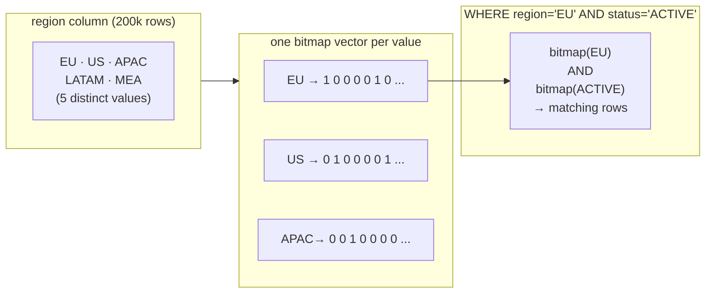

*The shape of the idea: each distinct value owns one bit-vector; a multi-predicate filter is a bitwise AND of the matching vectors.*

### 7.6.2 On-disk structure: meta → LOV → bitmap vectors

Three kinds of page live inside one bitmap-index relation, plus a hidden auxiliary heap+btree. Block 0 is the **meta page**, `BMMetaPageData` (`src/include/access/bitmap.h:44`). It carries a magic/version (`BITMAP_MAGIC 0x4249544D`, `BITMAP_VERSION 2` — `bitmap.h:36`) and, crucially, the OIDs of the auxiliary objects:

```c title="src/include/access/bitmap.h:44"
typedef struct BMMetaPageData {
          Oid         bm_magic;
          Oid         bm_version;
          Oid         bm_lov_heapId;   /* aux heap: value -> (block,offset) */
          Oid         bm_lov_indexId;  /* btree on that heap */
          BlockNumber bm_lov_lastpage;
      } BMMetaPageData;
```

**LOV — List Of Values.** The distinct values are stored as `BMLOVItemData` records on *LOV pages* (`bitmap.h:121`). Each LOV item is the **head of one bitmap vector**: it holds `bm_lov_head`/`bm_lov_tail` (first/last bitmap page of that value's vector) plus the in-progress tail words `bm_last_compword` and `bm_last_word` and bookkeeping (`bm_last_tid_location`, `bm_last_setbit`). To find *which* LOV item a value maps to without a linear scan, the build creates an internal **heap + B-tree** (`README:56-64`): the heap rows are `(indexed columns…, block#, offset#)`, the btree keys on the columns. So a probe is: btree search on the value → (block, offset) → LOV item → vector head. NULL keys get a reserved slot — the first item of the first LOV page (`bitmap.h:108`).

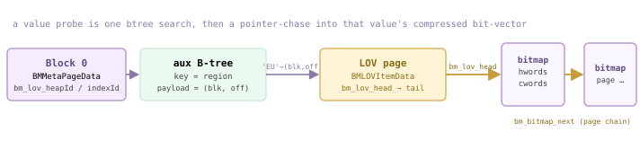

*Probe path for a value: the meta page names the aux btree; the btree maps the value to a LOV item; the LOV item's bm_lov_head points at the head of that value's bitmap-page chain, linked by bm_bitmap_next.*

**Bitmap pages** hold the compressed vector itself. A `BMBitmapData` page (`bitmap.h:254`) is two arrays of 64-bit words (`BM_HRL_WORD`, `bitmap.h:32`): `hwords[]` (header bits) and `cwords[]` (content). The page's `BMBitmapOpaqueData` (`bitmap.h:216`) keeps `bm_hrl_words_used`, the `bm_bitmap_next` block (vectors are page chains), and `bm_last_tid_location` so a search can skip a whole page without decompressing it. About 4078 content words fit per 8 KB page (`bitmap.h:229`).

**HRL compression.** The encoding is Hybrid Run-Length (`README:17`). Each content word is either a *literal* (its header bit 0 — 64 raw bits) or a *fill* (header bit 1 — its top bit says fill-of-0s or fill-of-1s, the rest is the run length in units of 64 bits; macros `FILL_LENGTH`/`GET_FILL_BIT`, `bitmap.h:281-286`). Long stretches of identical bits — exactly what low-cardinality columns produce — collapse to one word.

*README's worked example (word size 8 for legibility; real words are 64-bit).*

| bitmap | HRL header | HRL content | meaning |
| --- | --- | --- | --- |
| 00000000 00000000 01000000 11111111 11111111 11111111 | 101 | 00000010 / 01000000 / 10000011 | fill-of-0 ×16  ·  literal  ·  fill-of-1 ×24 |

**No TIDs are stored** (`README:68`). A 6-byte heap TID would dwarf the bit it represents, so the bit's *position* in the vector encodes the location: `position = block# * BM_MAX_TUPLES_PER_PAGE + offset#` (`bitmap.h:149`). `BM_MAX_TUPLES_PER_PAGE` is rounded to a multiple of the word size so bits from different heap pages never share a word (`bitmap.h:85`).

### 7.6.3 Bitmaps are small — and they AND

Build the same low-cardinality table three ways and weigh the indexes. Two bitmap indexes (`region`, `status`) and one B-tree on `region`:

*200k rows; 5 regions, 3 statuses. `=>` the bitmap index is less than half the B-tree's size for the same column.*

```sql
CREATE TABLE idx76_t(id int, region text, status text) DISTRIBUTED BY (id);
      INSERT INTO idx76_t SELECT g,
        (ARRAY['EU','US','APAC','LATAM','MEA'])[1+(g%5)],
        (ARRAY['ACTIVE','INACTIVE','PENDING'])[1+(g%3)]
      FROM generate_series(1,200000) g;
      CREATE INDEX idx76_bm_region ON idx76_t USING bitmap(region);
      CREATE INDEX idx76_bm_status ON idx76_t USING bitmap(status);
      CREATE INDEX idx76_bt_region ON idx76_t USING btree(region);
      SELECT 'bitmap(region)' idx, pg_size_pretty(pg_relation_size('idx76_bm_region')) sz
      UNION ALL SELECT 'bitmap(status)', pg_size_pretty(pg_relation_size('idx76_bm_status'))
      UNION ALL SELECT 'btree(region)',  pg_size_pretty(pg_relation_size('idx76_bt_region'));
```

```text title="output"
      idx       |  sz   
      ----------------+-------
       bitmap(region) | 736 kB
       bitmap(status) | 544 kB
       btree(region)  | 1568 kB
      (1 row)
```

:::note

736 kB vs 1568 kB on the identical column — and the B-tree gap widens as rows grow but distinct values stay fixed: each new row adds a full B-tree entry, but only flips one bit (often extending an existing fill word) in the bitmap.

:::

Now a two-predicate analytic filter. The planner scans **both** bitmap indexes and combines them with a `BitmapAnd` before touching the heap — this is the payoff the structure is built for:

*`BitmapAnd` over two `Bitmap Index Scan`s on the bitmap indexes, then one `Bitmap Heap Scan`. `=>` no heap row is read until the bitmaps have been intersected.*

```sql
SET enable_seqscan=off;
      EXPLAIN (ANALYZE, COSTS off, TIMING off, SUMMARY off)
      SELECT count(*) FROM idx76_t WHERE region='EU' AND status='ACTIVE';
```

```text title="output"
 Finalize Aggregate (actual rows=1 loops=1)
         ->  Gather Motion 3:1 (slice1; segments: 3) (actual rows=3 loops=1)
               ->  Partial Aggregate (actual rows=1 loops=1)
                     ->  Bitmap Heap Scan on idx76_t (actual rows=4456 loops=1)
                           Recheck Cond: ((region = 'EU') AND (status = 'ACTIVE'))
                           ->  BitmapAnd (actual rows=1 loops=1)
                                 ->  Bitmap Index Scan on idx76_bm_region (actual rows=1 loops=1)
                                       Index Cond: (region = 'EU')
                                 ->  Bitmap Index Scan on idx76_bm_status (actual rows=1 loops=1)
                                       Index Cond: (status = 'ACTIVE')
      (11 rows)
```

Each `Bitmap Index Scan` reports `actual rows=1`: it returns **one** decompressed bit-vector, not a row stream. `BitmapAnd` intersects them word-by-word, and the `Bitmap Heap Scan` visits only the surviving positions (≈4456 rows per segment, 13333 total). Below is the AND, made visible on a few rows:

<RawFigure html={"<div style=\"max-width:720px;margin:2px auto;font:11px/1.5 ui-monospace,SFMono-Regular,Menlo,monospace;color:#1f2328;overflow-x:auto\"> <div style=\"min-width:520px\"> <div style=\"display:flex;gap:2px;text-align:center;color:#8a939c;font-size:9.5px;margin-bottom:1px\"><div style=\"flex:0 0 104px;text-align:left\">row #</div><div style=\"flex:1\">1</div><div style=\"flex:1\">2</div><div style=\"flex:1\">3</div><div style=\"flex:1\">4</div><div style=\"flex:1\">5</div><div style=\"flex:1\">6</div><div style=\"flex:1\">7</div><div style=\"flex:1\">8</div><div style=\"flex:1\">9</div><div style=\"flex:1\">10</div><div style=\"flex:1\">11</div><div style=\"flex:1\">12</div><div style=\"flex:1\">13</div><div style=\"flex:1\">14</div><div style=\"flex:1\">15</div></div> <div style=\"display:flex;gap:2px;text-align:center;align-items:stretch\"> <div style=\"flex:0 0 104px;text-align:left;color:#6b5b95;font-weight:600\">region=EU</div> <div style=\"flex:1;color:#c8c8c8\">0</div><div style=\"flex:1;color:#c8c8c8\">0</div><div style=\"flex:1;color:#c8c8c8\">0</div><div style=\"flex:1;color:#c8c8c8\">0</div><div style=\"flex:1;background:#f5edff;border:1px solid #cdb4db\">1</div><div style=\"flex:1;color:#c8c8c8\">0</div><div style=\"flex:1;color:#c8c8c8\">0</div><div style=\"flex:1;color:#c8c8c8\">0</div><div style=\"flex:1;color:#c8c8c8\">0</div><div style=\"flex:1;background:#f5edff;border:1px solid #cdb4db\">1</div><div style=\"flex:1;color:#c8c8c8\">0</div><div style=\"flex:1;color:#c8c8c8\">0</div><div style=\"flex:1;color:#c8c8c8\">0</div><div style=\"flex:1;color:#c8c8c8\">0</div><div style=\"flex:1;background:#f5edff;border:1px solid #cdb4db\">1</div></div> <div style=\"display:flex;gap:2px;text-align:center;margin-top:2px\"> <div style=\"flex:0 0 104px;text-align:left;color:#6b8a76;font-weight:600\">status=ACTIVE</div> <div style=\"flex:1;color:#c8c8c8\">0</div><div style=\"flex:1;color:#c8c8c8\">0</div><div style=\"flex:1;background:#eafaf0;border:1px solid #cfead9\">1</div><div style=\"flex:1;color:#c8c8c8\">0</div><div style=\"flex:1;color:#c8c8c8\">0</div><div style=\"flex:1;background:#eafaf0;border:1px solid #cfead9\">1</div><div style=\"flex:1;color:#c8c8c8\">0</div><div style=\"flex:1;color:#c8c8c8\">0</div><div style=\"flex:1;background:#eafaf0;border:1px solid #cfead9\">1</div><div style=\"flex:1;color:#c8c8c8\">0</div><div style=\"flex:1;color:#c8c8c8\">0</div><div style=\"flex:1;background:#eafaf0;border:1px solid #cfead9\">1</div><div style=\"flex:1;color:#c8c8c8\">0</div><div style=\"flex:1;color:#c8c8c8\">0</div><div style=\"flex:1;background:#eafaf0;border:1px solid #cfead9\">1</div></div> <div style=\"display:flex;gap:2px;text-align:center;margin-top:3px;border-top:1px solid #cdb4db;padding-top:4px\"> <div style=\"flex:0 0 104px;text-align:left;color:#8a6d1a;font-weight:700\">AND result</div> <div style=\"flex:1;color:#c8c8c8\">0</div><div style=\"flex:1;color:#c8c8c8\">0</div><div style=\"flex:1;color:#c8c8c8\">0</div><div style=\"flex:1;color:#c8c8c8\">0</div><div style=\"flex:1;color:#c8c8c8\">0</div><div style=\"flex:1;color:#c8c8c8\">0</div><div style=\"flex:1;color:#c8c8c8\">0</div><div style=\"flex:1;color:#c8c8c8\">0</div><div style=\"flex:1;color:#c8c8c8\">0</div><div style=\"flex:1;color:#c8c8c8\">0</div><div style=\"flex:1;color:#c8c8c8\">0</div><div style=\"flex:1;color:#c8c8c8\">0</div><div style=\"flex:1;color:#c8c8c8\">0</div><div style=\"flex:1;color:#c8c8c8\">0</div><div style=\"flex:1;background:#fff4d6;border:1px solid #e0b365;color:#8a6d1a;font-weight:700\">1</div></div> <div style=\"color:#8a7aa8;font-size:10px;margin-top:5px\">↑ a row survives only when it is BOTH EU and ACTIVE — first at row <span class=\"hl\">15</span>, then every 15th ↑</div> </div></div>"} caption={"region='EU' sets every 5th row; status='ACTIVE' sets every 3rd; the AND is set only where both are — first at row 15 (LCM of 5 and 3)."} />

### 7.6.4 When bitmap, when B-tree

Bitmap wins on **low cardinality + read-mostly** (classic OLAP fact/dimension columns) where its vectors are tiny and AND/OR across predicates is cheap. B-tree wins on **high cardinality, range queries, ordering, uniqueness, and OLTP-style point lookups with frequent updates**.

- **Use bitmap when** — Few distinct values (region, status, gender, flags), large append-mostly table, multi-predicate analytic filters answered by AND/OR.
- **Prefer B-tree when** — High cardinality or unique keys, range scans (`>`,`BETWEEN`), `ORDER BY` that wants index order, or heavy single-row updates.
- **Avoid bitmap on** — Frequently-updated tables — an insert in the middle of the heap forces an in-place bit update that can split a compressed word into 2-3 words and fragment the vector (`README:115-129`).

:::note

VACUUM FULL does not re-insert reorganized tuples into a bitmap index — it REINDEXes instead (`README:137`). That, plus the in-place-update fragmentation above, is why bitmap indexes are positioned for analytic, read-mostly workloads, not OLTP. This closes Chapter 7 — from B-tree ([§7.1](#71-index-fundamentals)) through the index machinery to Cloudberry's analytic-tuned bitmap AM.

:::

