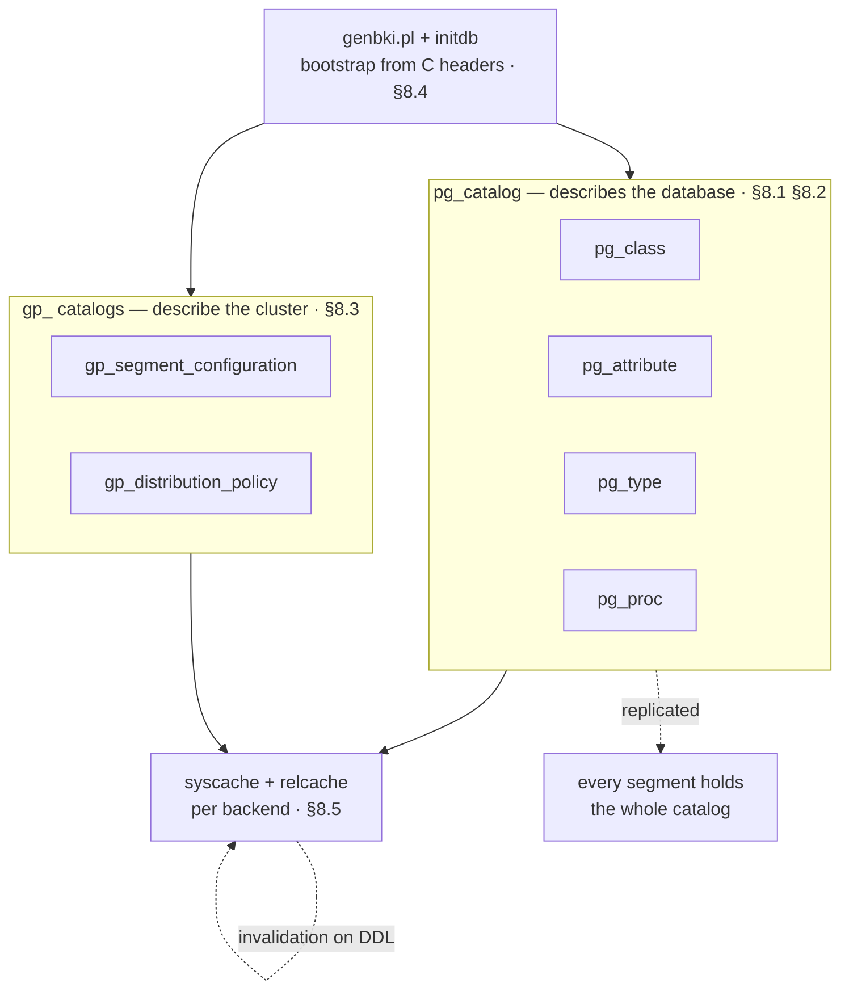
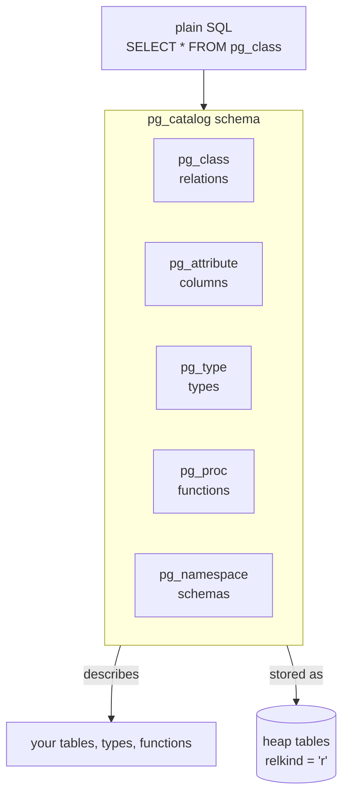
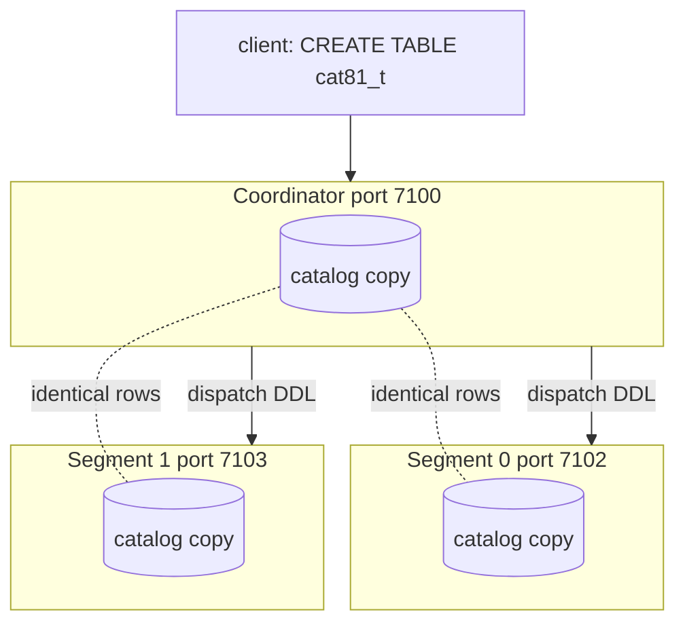
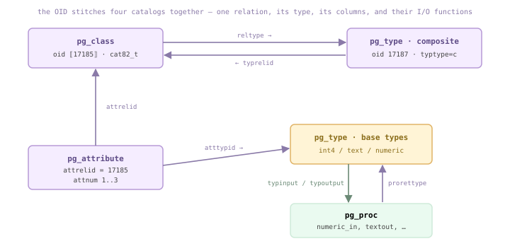
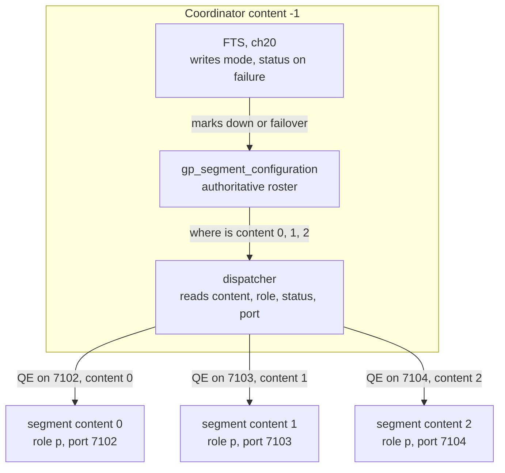
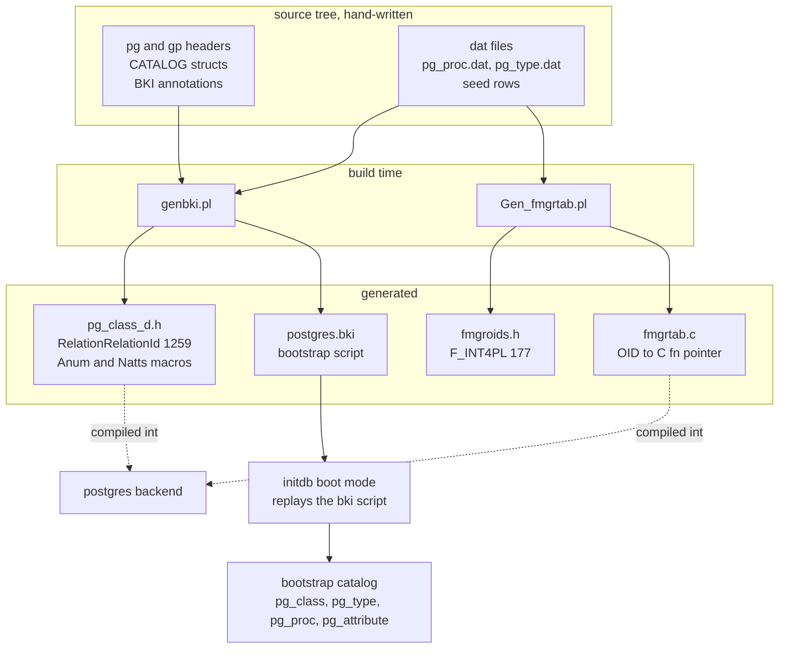
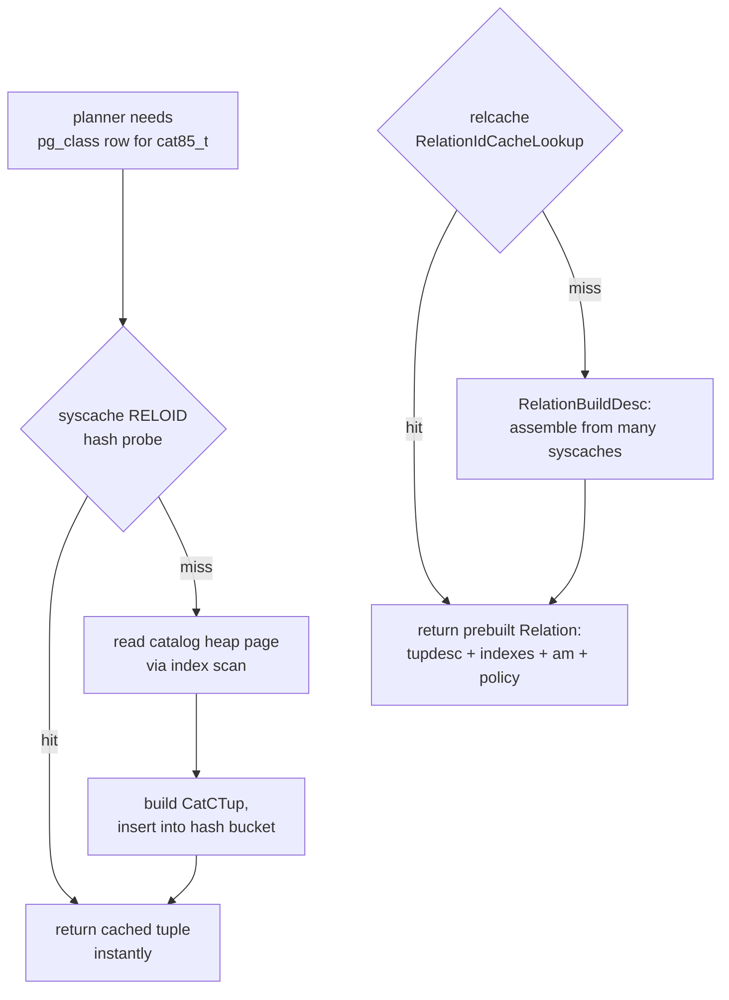
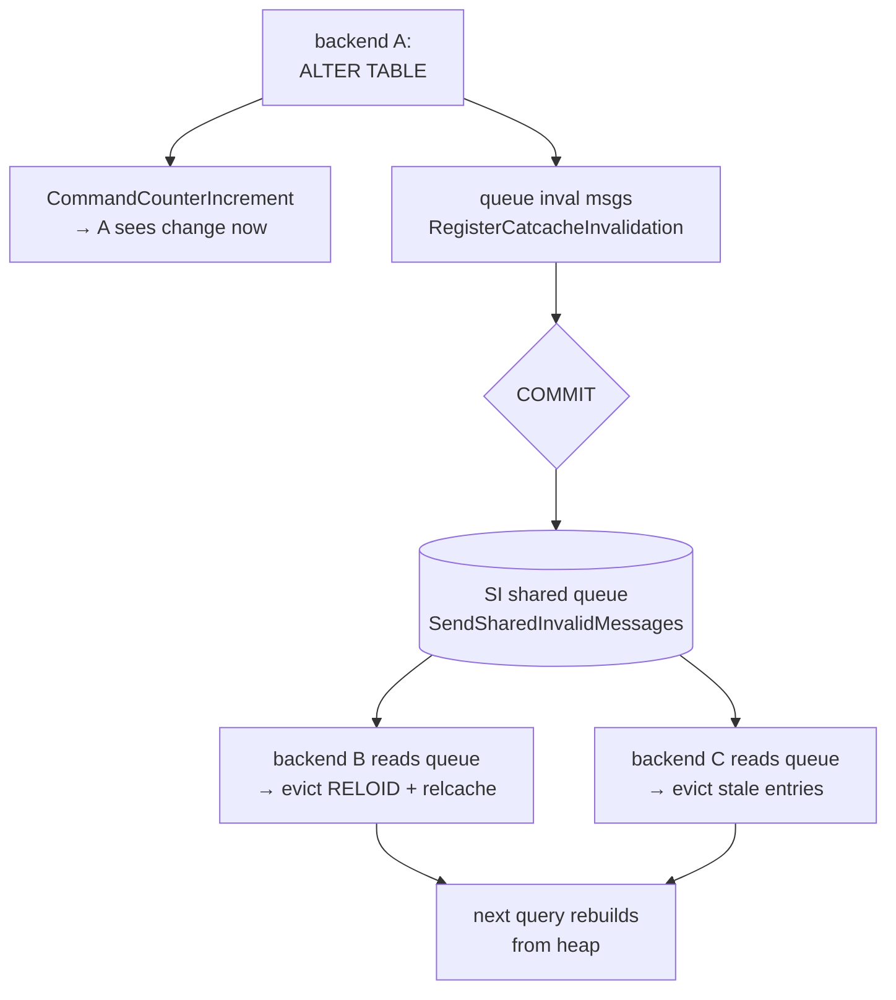
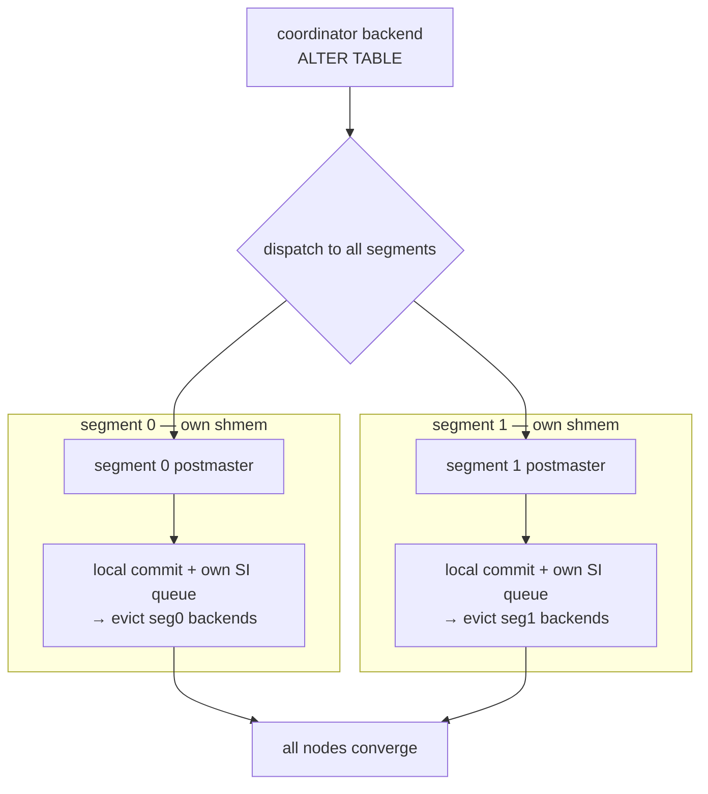

<!--
  Licensed to the Apache Software Foundation (ASF) under one
  or more contributor license agreements.  See the NOTICE file
  distributed with this work for additional information
  regarding copyright ownership.  The ASF licenses this file
  to you under the Apache License, Version 2.0 (the
  "License"); you may not use this file except in compliance
  with the License.  You may obtain a copy of the License at

    http://www.apache.org/licenses/LICENSE-2.0

  Unless required by applicable law or agreed to in writing,
  software distributed under the License is distributed on an
  "AS IS" BASIS, WITHOUT WARRANTIES OR CONDITIONS OF ANY
  KIND, either express or implied.  See the License for the
  specific language governing permissions and limitations
  under the License.
-->

# 8. The System Catalog



*The catalog ecosystem. A set of heap tables in pg_catalog ([§8.1](#81-catalog-overview)) — pg_class/pg_attribute/pg_type/pg_proc, threaded by OID ([§8.2](#82-key-catalog-tables)) — describes the database; Cloudberry's gp_ catalogs ([§8.3](#83-cloudberry-distributed-catalogs)) describe the cluster. None of it is created by SQL: genbki.pl + initdb bootstrap it from C headers ([§8.4](#84-bootstrap--generation)). Every backend caches the catalog in syscache/relcache and keeps the copies honest via invalidation ([§8.5](#85-runtime-caching--invalidation)) — and every segment holds the whole catalog, replicated.*

## 8.1 Catalog Overview

### 8.1.1 The database describing itself

Everything the database knows — every relation, column, type, function, namespace, constraint — is recorded in a set of ordinary tables. Those tables live in the `pg_catalog` schema, and the remarkable thing is that they are **stored exactly like your own tables**: as heap relations with `relkind = 'r'`. The catalog describes the database, and it does so *using* the database. You can `SELECT * FROM pg_class` the same way you would query any table you created.

This self-reference is why a fresh database already contains roughly a hundred relations before you have made a single table. `pg_class` is one row per relation — including a row **for `pg_class` itself**. The `pg_catalog` schema is implicitly always on the `search_path`, so unqualified catalog names resolve without you ever naming the schema.



*The catalog is the hub: SQL queries it, it describes the objects, and it is itself stored as heap tables*

*Coordinator: how many catalog heap relations exist*

```sql
SELECT count(*) FROM pg_class
      WHERE relnamespace = 'pg_catalog'::regnamespace
        AND relkind = 'r';
```

```text {3} title="output"
 count 
      -------
          98
      (1 row)
```

The field that marks a relation's kind is `relkind`, declared right beside `relnamespace` in the catalog definition `src/include/catalog/pg_class.h:84` (`relkind BKI_DEFAULT(r)`). `pg_class` is a catalog table whose schema is itself written as a C struct — the `BKI_` macros are read by the bootstrap stage `initdb` to lay down the very first catalog rows.

```c title="src/include/catalog/pg_class.h:78"
Oid     relnamespace BKI_DEFAULT(pg_catalog) BKI_LOOKUP(pg_namespace);
      bool    relisshared BKI_DEFAULT(f);   /* shared across all databases? */
      char    relkind     BKI_DEFAULT(r);   /* 'r' = ordinary heap table */
```

### 8.1.2 Per-database vs shared catalogs

Most catalogs are **per-database**: every database has its own private copy of `pg_class`, `pg_attribute`, `pg_type`, and so on, because the objects they describe are local to that database. But a handful of catalogs describe things that span the whole cluster — roles, databases themselves, tablespaces — and those are **shared**. The flag is `relisshared` (`src/include/catalog/pg_class.h:78`).

Shared catalogs do not live under a database's directory. They live in `global/` and are addressed with **database OID 0** and the global tablespace. The backend hard-codes this set: `IsSharedRelation` at `src/backend/catalog/catalog.c:465` answers whether a given OID is one of the shared catalogs, and relation-file placement routes the global tablespace specially (`src/backend/catalog/catalog.c:957`, `spcOid == GLOBALTABLESPACE_OID`).

*Coordinator: the shared catalogs (relisshared = true)*

```sql
SELECT relname FROM pg_class
      WHERE relisshared AND relkind = 'r'
      ORDER BY relname;
```

```text {3,4,10} title="output"
         relname          
      --------------------------
       pg_authid
       pg_database
       pg_db_role_setting
       pg_replication_origin
       pg_shdepend
       pg_shdescription
       pg_subscription
       pg_tablespace
       ... plus gp_segment_configuration, pg_resgroup, ...
      (31 rows)
```

- **per-database** — One physical copy per database (e.g. pg_class, pg_type). Lives under base/`&lt;dboid>`/. Describes objects local to that database.
- **shared** — One physical copy for the whole cluster (pg_database, pg_authid, pg_tablespace, pg_shdepend). Lives in global/ with database OID 0. relisshared = true.

:::note

Cloudberry adds its own shared catalogs to the set — gp_segment_configuration (the cluster topology), gp_warehouse, the resource-group catalogs — because they too describe cluster-wide state, not one database.

:::

### 8.1.3 The MPP spine: one full catalog per segment

Here is the organizing idea for the whole chapter. Cloudberry is many PostgreSQL instances acting as one. **Every segment is a complete PostgreSQL instance with its own complete copy of the catalog.** The coordinator holds a catalog; each primary segment holds a catalog; and — this is the load-bearing invariant — they hold the **same rows**.

Why must they be identical? Because the coordinator plans a query against *its* catalog and ships that plan to every segment. A plan refers to relations and columns by **OID**. If segment 7102 disagreed about what OID `17180` is, the plan would mean something different there. So OIDs are kept consistent cluster-wide, and DDL is **dispatched** to every segment so the catalogs stay in lock-step.



*DDL flows from coordinator to all segments; each holds an identical catalog so a plan means the same thing everywhere*

Let us prove it. We create a demo table on the coordinator and read its `pg_class` row — note the assigned `oid` and `relkind`.

*Coordinator (7100): create the table and read its catalog row*

```sql
CREATE TABLE cat81_t (id int, name text);
      SELECT oid, relname, relkind, relnamespace
      FROM pg_class WHERE relname = 'cat81_t';
```

```text {3} title="output"
  oid  | relname | relkind | relnamespace 
      -------+---------+---------+--------------
       17180 | cat81_t |    r    |         2200
      (1 row)
```

Now connect directly to a segment in **utility mode** (bypassing the coordinator) and look for the same relation. We never created anything on the segment — yet the row is there, with the **identical OID 17180**, because the `CREATE TABLE` was dispatched and applied to the segment's own catalog.

*Segment (7102, utility mode): the SAME row is present — identical OID*

```sql
-- PGOPTIONS='-c gp_role=utility' psql -p 7102
      SELECT oid, relname, relkind, relnamespace
      FROM pg_class WHERE relname = 'cat81_t';
```

```text {3} title="output"
  oid  | relname | relkind | relnamespace 
      -------+---------+---------+--------------
       17180 | cat81_t |    r    |         2200
      (1 row)
```

Same `oid`, same `relname`, same `relkind`, same `relnamespace` (`2200` = `pg_catalog`'s sibling, the `public` schema). The catalog is replicated, not sharded — every segment carries the whole thing.

:::note

Because catalog changes must land on every segment atomically, DDL is two-phase-commit coordinated (see §12). A catalog that has drifted between coordinator and segments — divergent rows or OIDs — is a serious fault; the tool gpcheckcat exists precisely to detect and repair such divergence.

:::

*Why catalog consistency is non-negotiable*

| Property | Consequence |
| --- | --- |
| Plans reference objects by OID | An OID must mean the same relation on every segment |
| Coordinator plans, segments execute | Segment catalogs must match what the planner saw |
| DDL is dispatched to all segments | Catalog stays in sync; changes are 2PC-coordinated (§12) |
| Divergence is a fault | gpcheckcat detects mismatched catalog rows across the cluster |

## 8.2 Key Catalog Tables

### 8.2.1 The OID, and the four pillars it threads

Almost every catalog row carries a 4-byte unsigned identity: the **OID**. `typedef unsigned int Oid;` `postgres_ext.h:31`, with `InvalidOid == 0` `postgres_ext.h:36`. A global counter hands them out; user objects begin at `FirstNormalObjectId` = **16384** `src/include/access/transam.h:197`. Anything below that is a bootstrap or pinned object baked in at `initdb`. Since PG12, `oid` is an *ordinary hidden column* present only on catalogs that declare `BKI_ROWTYPE_OID` — pg_class itself does so: `CATALOG(pg_class,1259,RelationRelationId) … BKI_ROWTYPE_OID(83,…)` `src/include/catalog/pg_class.h:32`. Plain user tables have no system oid column.

Four tables describe every relation in the system, and the OID stitches them together: a table's row in **pg_class** points (via `reltype`) at its composite type in **pg_type**; each of its columns lives in **pg_attribute** keyed by `attrelid` → pg_class and `atttypid` → pg_type; and functions in **pg_proc** name their result type via `prorettype` → pg_type.



*One OID, four catalogs. Every arrow is a FOREIGN_KEY declaration in the headers. Note the pg_class ↔ pg_type loop: a table (pg_class) names its composite type via reltype, and that composite type points back at the table via typrelid. Real values from the cat82_t demo.*

*The four pillars (file:line cites the header struct).*

| catalog | one row per | key columns | header |
| --- | --- | --- | --- |
| pg_class | relation (table, index, view, sequence, toast, composite) | relname, relnamespace, reltype, relam, relfilenode, relkind, relnatts, reltuples, relpages, relisshared | pg_class.h:32 |
| pg_attribute | column of any relation | attrelid, attname, atttypid, attnum, attlen, attalign, attnotnull, atthasdef | pg_attribute.h:41 |
| pg_type | data type | typname, typlen, typalign, typstorage, typtype, typinput, typoutput, typrelid | pg_type.h:41 |
| pg_proc | function | proname, pronamespace, prorettype, proargtypes, prosrc, prolang | pg_proc.h:37 |

### 8.2.2 pg_class — the relation itself

We create a table and read its one pg_class row. `relkind` `pg_class.h:84` is `r` (ordinary relation); `relnatts` `pg_class.h:87` counts the user columns (genbki.pl fills this for catalogs); `relam` `pg_class.h:53` is the access-method OID (2 = heap). The returned `oid` 17185 is above 16384, confirming a user object.

*the relation's identity row. oid 17185 ≥ FirstNormalObjectId 16384*

```sql
CREATE TABLE cat82_t(id int, name text, amount numeric);
      SELECT oid, relname, relkind, relnatts, relam FROM pg_class WHERE relname='cat82_t';
```

```text title="output"
  oid  | relname | relkind | relnatts | relam
      -------+---------+---------+----------+-------
       17185 | cat82_t | r       |        3 |     2
      (1 row)
```

### 8.2.3 pg_attribute — one row per column

`attnum` `pg_attribute.h:76` is 1-based for user columns; `attlen` and `attalign` `pg_attribute.h:61,111` are copies of the type's `typlen`/`typalign`, cached here so the tuple deformer never needs pg_type at runtime (the header explains this redundancy at `pg_attribute.h:46-61`).

*the three user columns, each `atttypid` resolving (via ::regtype) to its pg_type entry.*

```sql
SELECT attname, atttypid::regtype, attnum, attlen, attalign
        FROM pg_attribute WHERE attrelid='cat82_t'::regclass AND attnum>0 ORDER BY attnum;
```

```text title="output"
 attname | atttypid | attnum | attlen | attalign
      ---------+----------+--------+--------+----------
       id      | integer  |      1 |      4 | i
       name    | text     |      2 |     -1 | i
       amount  | numeric  |      3 |     -1 | i
      (3 rows)
```

### 8.2.4 pg_type — what those atttypids point at

Each `atttypid` above lands in pg_type. `typlen` `pg_type.h:56` is the byte width — positive for fixed types, `-1` for varlena. `typstorage` `pg_type.h:192` is the TOAST strategy: `p` plain (int4), `x` extended/compressible (text), `m` main (numeric). Notice `attlen`/`attalign` in pg_attribute exactly mirror the values here.

*the type definitions. int4 typlen 4 = id's attlen 4; text/numeric typlen -1 = varlena*

```sql
SELECT typname, typlen, typalign, typstorage
        FROM pg_type WHERE typname IN ('int4','text','numeric') ORDER BY typname;
```

```text title="output"
 typname | typlen | typalign | typstorage
      ---------+--------+----------+------------
       int4    |      4 | i        | p
       numeric |     -1 | i        | m
       text    |     -1 | i        | x
      (3 rows)
```

- **reltype → typrelid loop** — pg_class.reltype `pg_class.h:44` names the relation's composite type in pg_type; that type's `typrelid` `pg_type.h:101` points right back at the pg_class row. For cat82_t: reltype 17187, whose pg_type row has typtype='c' and typrelid 17185 — the original table. FOREIGN_KEYs `pg_class.h:155` and `pg_type.h:259` declare both directions.
- **pg_proc and pg_type** — A type's I/O is just functions: typinput/typoutput `pg_type.h:133-134` are regproc OIDs into pg_proc. A function's `prorettype` `pg_proc.h:89` and `proargtypes` `pg_proc.h:97` are pg_type OIDs. `prosrc` `pg_proc.h:117` holds the C symbol name or SQL body; `prolang` `pg_proc.h:46` the language. This is the bridge into the fmgr table ([§8.4](#84-bootstrap--generation)).

### 8.2.5 System columns: the negative attnums

Every heap row also exposes hidden columns — `ctid, tableoid, xmin, xmax, cmin, cmax` (§4) — stored in pg_attribute with *negative* attnums so they never collide with user columns. Cloudberry adds two of its own: `gp_segment_id` and `gp_foreign_server`.

*the system columns for cat82_t. ctid=-1, …, plus Cloudberry's gp_segment_id=-7, gp_foreign_server=-8*

```sql
SELECT attname, atttypid::regtype, attnum
        FROM pg_attribute WHERE attrelid='cat82_t'::regclass AND attnum<0 ORDER BY attnum;
```

```text title="output"
      attname      | atttypid | attnum
      -------------------+----------+--------
       gp_foreign_server | oid      |     -8
       gp_segment_id     | integer  |     -7
       tableoid          | oid      |     -6
       cmax              | cid      |     -5
       xmax              | xid      |     -4
       cmin              | cid      |     -3
       xmin              | xid      |     -2
       ctid              | tid      |     -1
      (8 rows)
```

:::note

attnum&lt;0 rows are why `SELECT *` never returns ctid/xmin: the planner expands `*` to attnum 1..relnatts only. The system columns must be named explicitly.

:::

## 8.3 Cloudberry Distributed Catalogs

### 8.3.1 Three catalogs that make a cluster a cluster

[§8.1](#81-catalog-overview) established the rule: the catalog is **replicated identically** on every node — coordinator and all segments hold byte-for-byte the same `pg_class`, `pg_attribute`, `pg_proc`. Cloudberry adds a small family of `gp_`-prefixed catalogs that have **no PostgreSQL equivalent**: they exist only because there is a cluster to describe. Three of them carry the weight. `gp_segment_configuration` is the **cluster map** — who the nodes are. `gp_distribution_policy` is **per-table sharding** — how each table is spread across those nodes. `gp_id` is **per-node identity** — and it is the deliberate exception to the replicate-everything rule ([§8.3](#83-cloudberry-distributed-catalogs).4).

*The three GP catalogs — table → scope → key columns. Files under `src/include/catalog/`.*

| Catalog | Lives where | Scope | Key columns |
| --- | --- | --- | --- |
| gp_segment_configuration | coordinator only | one row per segment instance (the global map) | dbid, content, role, preferred_role, mode, status, port, hostname, datadir |
| gp_distribution_policy | replicated everywhere | one row per distributed table | localoid, policytype, numsegments, distkey, distclass |
| gp_id | one row on every node | node identity (contents now vestigial — see [§8.3](#83-cloudberry-distributed-catalogs).4) | gpname, numsegments, dbid, content |

- **gp_segment_configuration** — `src/include/catalog/gp_segment_configuration.h:44` — `BKI_SHARED_RELATION`, OID 7026. The authoritative roster the **dispatcher** reads to route work and **FTS** (§20) writes when it detects failures.
- **gp_distribution_policy** — `src/include/catalog/gp_distribution_policy.h:30` — OID 7142, `FOREIGN_KEY(localoid REFERENCES pg_class(oid))`. Answers 'for this table, which segment owns which row?'
- **gp_id** — `src/include/catalog/gp_id.h:41` — OID 5101, `BKI_SHARED_RELATION`. Historically told each segment who it was; the header now records that role as obsolete.

### 8.3.2 gp_segment_configuration — the cluster map

One row per segment instance. The decisive column is **content**: `−1` marks the coordinator, `0..N` mark the primary segments. **role** is the live job (`'p'` primary, `'m'` mirror); **preferred_role** is the role this instance was born to hold — when they disagree, FTS has failed over and the cluster is unbalanced. **mode** is `'s'` in-sync / `'n'` not-in-sync / `'c'` change-tracking; **status** is `'u'` up / `'d'` down. `dbid` is the cluster-wide unique id; `port`, `hostname`, `address`, `datadir` are the coordinates the dispatcher dials.

```c title="src/include/catalog/gp_segment_configuration.h"
CATALOG(gp_segment_configuration,7026,...) BKI_SHARED_RELATION
      {
        int16 dbid;            /* cluster-wide unique */
        int16 content;         /* -1 = coordinator, 0..N = segment */
        char  role;            /* 'p' primary / 'm' mirror */
        char  preferred_role;
        char  mode;            /* 's' insync 'n' not 'c' changetracking */
        char  status;          /* 'u' up / 'd' down */
        int32 port;
      #ifdef CATALOG_VARLEN
        text  hostname; text address; text datadir;
      #endif
      }
```



*The map and its reader. The coordinator holds gp_segment_configuration; the dispatcher reads content/role/status/port to decide where each slice of a plan runs.*

*The live roster on this 3.0.0-devel demo (3 primaries, no mirrors). content −1 is the coordinator; role=preferred_role and status='u' everywhere healthy, balanced.*

```sql
SELECT content, role, preferred_role, mode, status, port
        FROM gp_segment_configuration ORDER BY content, role;
```

```text title="output"
 content | role | preferred_role | mode | status | port
      ---------+------+----------------+------+--------+------
            -1 | p    | p              | n    | u      | 7100
             0 | p    | p              | n    | u      | 7102
             1 | p    | p              | n    | u      | 7103
             2 | p    | p              | n    | u      | 7104
      (4 rows)
```

### 8.3.3 gp_distribution_policy — per-table sharding

Every distributed table gets one row, keyed by **localoid** (the table's `pg_class.oid`). **policytype** is `'p'` partitioned (the catalog's word for hash-distributed) or `'r'` replicated; the symbols live at `gp_distribution_policy.h:55` — `SYM_POLICYTYPE_PARTITIONED 'p'`, `SYM_POLICYTYPE_REPLICATED 'r'`. **distkey** is the `int2vector` of distribution-key attnums, **distclass** the matching hash opclasses. A `DISTRIBUTED RANDOMLY` table is still `'p'` but with an **empty distkey** — same family, no hashing column. This is the catalog backing the sharding picture from [§1.1](../part-1-introduction/ch01.md#11-the-mpp-cluster-coordinator-segments--distribution)/[§2.1](./ch02.md#21-data-sharding--storage-formats).

```c title="src/include/catalog/gp_distribution_policy.h"
CATALOG(gp_distribution_policy,7142,...)
      {
        Oid   localoid;        /* the table (pg_class.oid) */
        char  policytype;      /* 'p' partitioned/hash, 'r' replicated */
        int32 numsegments;
      #ifdef CATALOG_VARLEN
        int2vector distkey;    /* distribution-key attnums */
        oidvector  distclass;  /* hash opclasses */
      #endif
      }
      #define SYM_POLICYTYPE_PARTITIONED 'p'
      #define SYM_POLICYTYPE_REPLICATED  'r'
```

*Same two columns, two distribution choices. cat83_hash: policytype 'p', distkey '1' hash on attnum 1 = id, distclass 10020 int4_ops. cat83_repl: policytype 'r', empty distkey a full copy lives on every segment.*

```sql
CREATE TABLE cat83_hash (id int, v text) DISTRIBUTED BY (id);
      CREATE TABLE cat83_repl (id int, v text) DISTRIBUTED REPLICATED;

      SELECT c.relname, p.policytype, p.numsegments, p.distkey, p.distclass
        FROM gp_distribution_policy p JOIN pg_class c ON c.oid = p.localoid
       WHERE c.relname LIKE 'cat83%' ORDER BY c.relname;
```

```text title="output"
  relname   | policytype | numsegments | distkey | distclass
      ------------+------------+-------------+---------+-----------
       cat83_hash | p          |           3 | 1       | 10020
       cat83_repl | r          |           3 |         |
      (2 rows)
```

:::note

distclass 10020 resolves to `int4_ops` — Cloudberry's jump-consistent hash opclass for int, not the B-tree comparison opclass. The hashing family is what guarantees the same `id` lands on the same segment every time.

:::

### 8.3.4 gp_id — the deliberate exception, and where identity really lives

[§8.1](#81-catalog-overview)'s rule is that all nodes hold identical catalog contents. A node knowing its **own** identity seems to break that — and `gp_id` is exactly where Greenplum once stored it. But the header at `src/include/catalog/gp_id.h` records the twist: once mirroring required primary and mirror to be byte-identical, the table could no longer differ per node, so **its contents were made irrelevant**. Identity moved out of the catalog and into a per-node file.

Proof: query `gp_id` on the coordinator and on segment 0 (utility mode, port 7102) — the rows are **identical**, both showing content −1, the frozen `BKI` value.

*gp_id reads the SAME on every node — its contents no longer carry identity (`gp_id.h:25` 'contents are now irrelevant'). The −1 is just the frozen catalog seed.*

```sql
-- coordinator (content -1)
      SELECT * FROM gp_id;
      -- segment 0, utility mode on :7102
      --   PGOPTIONS='-c gp_role=utility' psql -p 7102
      SELECT * FROM gp_id;
```

```text title="output"
=== coordinator ===
         gpname   | numsegments | dbid | content
      ------------+-------------+------+---------
       Cloudberry |          -1 |   -1 |      -1
      === segment 7102 utility ===
         gpname   | numsegments | dbid | content
      ------------+-------------+------+---------
       Cloudberry |          -1 |   -1 |      -1
```

So where does a segment actually learn it is content 0? In the **`internal.auto.conf`** file in its own data directory — the one file that differs per node — which sets the `gp_dbid` GUC; at startup the node looks itself up in `gp_segment_configuration` (passed down from the coordinator) to derive its content. The SQL-visible `gp_segment_id` system column and `current_setting('gp_contentid')` come from there, NOT from the `gp_id` table.

*The REAL per-node identity. Same query, different answers: the GUCs differ because each data dir's `internal.auto.conf` differs. Coordinator dbid 1 / content −1; segment 0 dbid 2 / content 0.*

```sql
-- coordinator
      SELECT current_setting('gp_dbid') AS dbid,
             current_setting('gp_contentid') AS content;
      -- segment 0 (utility, :7102)
      SELECT current_setting('gp_dbid') AS dbid,
             current_setting('gp_contentid') AS content;
```

```text title="output"
=== coordinator ===
       dbid | content
      ------+---------
       1    | -1
      === segment 7102 utility ===
       dbid | content
      ------+---------
       2    | 0

      -- and on disk, the only per-node file:
      $ grep gp_dbid .../qddir/demoDataDir-1/internal.auto.conf
      gp_dbid=1
      $ grep gp_dbid .../dbfast1/demoDataDir0/internal.auto.conf
      gp_dbid=2
```

- **The shared map** — `gp_segment_configuration` — every node sees the same roster; it describes the whole cluster.
- **The per-table plan** — `gp_distribution_policy` — replicated identically, one row per table, telling all nodes how each table is sharded.
- **The local identity** — Not `gp_id` (vestigial) but `internal.auto.conf` → `gp_dbid` GUC → content via the shared map. The single deliberate per-node difference, kept in a file precisely so the replicated catalog can stay byte-identical.

## 8.4 Bootstrap & Generation

### 8.4.1 The chicken-and-egg of the catalog

Every table in Cloudberry is described by rows in the catalog — but the catalog tables (`pg_class`, `pg_type`, `pg_proc`, `pg_attribute`) are themselves tables that need rows in `pg_class` to describe them. There is no SQL `CREATE TABLE pg_class`, because running it would require a `pg_class` to already exist. Cloudberry breaks the cycle in three layers, all *before* a database exists: the catalog is **declared in C headers**, a build-time Perl script **generates** the wiring, and `initdb` runs `postgres --boot` to **replay** a script that hand-builds the first tables.



*The full bootstrap pipeline — headers + seed data are compiled by genbki.pl/Gen_fmgrtab.pl at build time into the OID headers the backend uses and the .bki script initdb replays.*

Layer 1 — **declaration**. Each catalog table is a `CATALOG(name,oid,oidmacro) {...}` C struct in `src/include/catalog/`. The macro arguments fix the table's OID *forever*; `pg_class` is OID 1259 by fiat, written into the header at `src/include/catalog/pg_class.h:32`. The `BKI_*` words are annotations the compiler ignores but the generator reads.

```c title="src/include/catalog/pg_class.h:32"
CATALOG(pg_class,1259,RelationRelationId)
        BKI_BOOTSTRAP BKI_ROWTYPE_OID(83,RelationRelation_Rowtype_Id)
        BKI_SCHEMA_MACRO
      {
        Oid oid;
        NameData relname;
        Oid relnamespace BKI_DEFAULT(pg_catalog) BKI_LOOKUP(pg_namespace);
        ...
      }
```

*The BKI annotations seen on pg_class — instructions to genbki.pl, not C.*

| Annotation | Meaning |
| --- | --- |
| BKI_BOOTSTRAP | This catalog is built *first*, by hand, in bootstrap mode (no other catalog exists yet). Only pg_class, pg_type, pg_proc, pg_attribute carry it. |
| BKI_ROWTYPE_OID(83,…) | Pins the OID of the composite (row) type for this table — so `pg_class`'s rowtype is type 83. |
| BKI_SHARED_RELATION | Table lives in the cluster-wide directory and is shared by all databases (e.g. pg_authid, pg_database). Not on pg_class. |
| BKI_DEFAULT(x) | Default column value used to fill seed rows that omit it. |
| BKI_LOOKUP(rel) | Column is an OID that should be resolved by name against `rel` when generating .bki. |

The *contents* of the bootstrap catalogs (and many later rows) live in matching **`.dat` files** as Perl hashes. Built-in function `int4pl` is just a data row pinned to OID 177 in `pg_proc.dat:518`:

```c title="src/include/catalog/pg_proc.dat:518"
{ oid => '177',
        proname => 'int4pl', prorettype => 'int4',
        proargtypes => 'int4 int4', prosrc => 'int4pl' },
```

### 8.4.2 genbki.pl — generating the OID headers and the .bki script

At build time `src/backend/catalog/genbki.pl` parses every `pg_*.h` + `.dat` pair and emits two kinds of output (`genbki.pl:439`, `:467`): one **`postgres.bki`** bootstrap script, and one **`pg_<name>_d.h`** per catalog. The `_d.h` files are where the symbolic names the backend C code uses — `RelationRelationId`, `Anum_pg_class_relname`, `Natts_pg_class` — actually get their numeric values. They are generated, never edited:

*The generated pg_class_d.h literally shouts not to edit it, then hardcodes the OID and attribute-number macros note `DO NOT EDIT` + `GENERATED by ... genbki.pl`.*

```sql
head -16 src/include/catalog/pg_class_d.h
      grep -n "RelationRelationId\|Anum_pg_class_relname\|Natts_pg_class" \
           src/include/catalog/pg_class_d.h
```

```text title="output"
 *  ******************************
       *  *** DO NOT EDIT THIS FILE! ***
       *  ******************************
       *
       *  It has been GENERATED by src/backend/catalog/genbki.pl
      => 21:#define RelationRelationId 1259
         28:#define Anum_pg_class_relname 2
         64:#define Natts_pg_class 36
```

:::note

So `RelationRelationId` in the running backend and the `1259` in the `CATALOG(pg_class,1259,…)` macro are the *same number by construction* — genbki.pl copies the macro's OID argument straight into the `#define`. Change the header, rebuild, both move together.

:::

The other output, `postgres.bki`, is a tiny imperative language. For each `BKI_BOOTSTRAP` catalog it emits a `create … bootstrap` command; everything else becomes `insert` rows. The `create` for `pg_class` carries exactly the OID and rowtype_oid from the macro above:

*The generated bootstrap script — `create` commands for the four BKI_BOOTSTRAP catalogs, with their pinned OIDs/rowtype OIDs.*

```sql
grep -n "^create pg_proc\|^create pg_type\|^create pg_attribute\|^create pg_class" \
           src/backend/catalog/postgres.bki
```

```text title="output"
=> 2:create pg_proc 1255 bootstrap rowtype_oid 81
         3584:create pg_type 1247 bootstrap rowtype_oid 71
         3819:create pg_attribute 1249 bootstrap rowtype_oid 75
         4007:create pg_class 1259 bootstrap rowtype_oid 83
```

### 8.4.3 Gen_fmgrtab.pl — wiring OIDs to C function pointers

A second generator, `src/backend/utils/Gen_fmgrtab.pl`, reads *only* `pg_proc.dat` and emits three files (`Gen_fmgrtab.pl:105`): **`fmgroids.h`** (a `#define F_<name> <oid>` per built-in), **`fmgrprotos.h`** (C prototypes), and **`fmgrtab.c`** (the static `fmgr_builtins[]` table mapping each pg_proc OID to its actual C function pointer). This is how the executor, holding only an OID from `pg_proc`, jumps to the right native routine. The `int4pl` row above (OID 177) becomes:

*fmgroids.h is generated from pg_proc.dat — F_INT4PL is the same 177 the .dat row pinned.*

```sql
grep -n "F_INT4PL\|F_TEXTCAT\|F_NUMERIC_ADD" src/include/utils/fmgroids.h
```

```text title="output"
=> 148:#define F_INT4PL 177
         748:#define F_TEXTCAT 1258
        1094:#define F_NUMERIC_ADD 1724
```

- **fmgroids.h** — Symbolic OID names — C code writes `F_INT4PL` instead of magic 177.
- **fmgrprotos.h** — `extern Datum int4pl(PG_FUNCTION_ARGS);` for every builtin.
- **fmgrtab.c** — `fmgr_builtins[]` — &#123; 177, "int4pl", 2, true, false, int4pl, "int4pl" &#125; — the OID→pointer dispatch table linked into the backend.

### 8.4.4 initdb / bootstrap mode — and Cloudberry's cdb_init.d hook

`initdb` is the consumer. It launches the backend in a special mode — `postgres --boot` — that does *not* expect a catalog to exist; instead it reads `postgres.bki` and executes the `create`/`insert` commands directly against fresh heap files. `bootstrap_template1()` reads the script and builds the `--boot` command line at `src/bin/initdb/initdb.c:1586` / `:1640`; `bki_file` is located at `:3033`. After the four bootstrap tables exist, initdb runs ordinary SQL files to add `information_schema`, the system views, and the rest of the catalog.

**Cloudberry adds a hook here.** Beyond stock PostgreSQL, initdb scans a `cdb_init.d/` directory and runs every `*.sql` it finds (`initdb.c:2055`, dir set at `:3049`). This is the extension point by which storage AMs and other components register themselves at cluster creation — PAX ([§6.1](./ch06.md#61-the-c-contrib-access-method)) installs through exactly this path:

```c title="src/bin/initdb/initdb.c:2055"
/*
       * These are contained in directory "cdb_init.d". We load all .sql files
       * ... allows extensions to put their install scripts under cdb_init.d, and
       * have them run at initdb time.
       */
```

:::note

Cloudberry is an MPP cluster: the coordinator and *every segment* are each initdb'd independently. So every node replays the same `postgres.bki` and the same `cdb_init.d` scripts — the catalog skeleton is identical on all of them, which is why a catalog OID like 1259 means `pg_class` everywhere.

:::

### 8.4.5 Cross-check: the generated numbers are the live numbers

The whole pipeline is only credible if the OIDs baked into the headers at build time are the OIDs the running server reports. They are. Asking the live coordinator for the OIDs of `pg_class`, `pg_proc`, and the `int4pl` function returns exactly the values we saw hardcoded in `pg_class_d.h` (1259), `postgres.bki` (1255), and `fmgroids.h` (177):

*Live coordinator on port 7100 — every OID matches its generated #define: 1259=RelationRelationId, 1255=pg_proc, 177=F_INT4PL.*

```sql
SELECT 'pg_class'::regclass::oid          AS pg_class_oid,
             'pg_proc'::regclass::oid           AS pg_proc_oid,
             'int4pl(int,int)'::regprocedure::oid AS int4pl_oid;
```

```text title="output"
 pg_class_oid | pg_proc_oid | int4pl_oid 
      --------------+-------------+------------
               1259 |        1255 |        177
      (1 row)
```

There is no runtime allocation in any of this. `pg_class` is 1259 because a human typed `CATALOG(pg_class,1259,…)`; genbki.pl copied 1259 into a `#define` and into a `create … 1259` line of `postgres.bki`; initdb replayed that line to build the table; and the backend you just queried was compiled with that same 1259. The catalog exists before any database because it is, in the end, a build artifact.

## 8.5 Runtime Caching & Invalidation

### 8.5.1 Every query reads the catalog — so every backend caches it

Parsing and planning the simplest statement interrogate the catalog relentlessly: *does this table exist? what are its columns and their types? which operator implements `=` for `int4`?* Each answer is a row in `pg_class`, `pg_attribute`, `pg_type`, `pg_operator`. Reading those heap pages from scratch on every statement would drown the planner. So each backend keeps two layers of in-memory cache: the **syscache** (individual catalog *tuples*) and the **relcache** (fully-built `Relation` descriptors). A cache **hit** returns instantly; a **miss** reads the catalog heap once and fills the cache.



*Hot path of a single catalog lookup. The heap read happens once per backend per key; thereafter every lookup is a hash probe.*

The relcache sits *above* the syscache: building one `Relation` descriptor (`RelationBuildDesc`) pulls many syscache tuples together — the `pg_class` row, every `pg_attribute` row, index lists, the access-method routine, and in Cloudberry the **distribution policy**. That assembly is the single most expensive catalog operation, which is exactly why it is cached so aggressively.

### 8.5.2 syscache — a hash cache per catalog, keyed by lookup key

The syscache is a fixed *set* of per-backend hash tables, one per **cache id**. The ids are an enum in `src/include/utils/syscache.h:32` — `RELOID` (pg_class by oid), `ATTNAME`, `TYPEOID`, and so on. Every entry holds one catalog tuple; you fetch it with `SearchSysCache1..4` (`src/backend/utils/cache/syscache.c:973`), passing the cache id plus up to four key columns.

*How many distinct catalog caches a backend maintains — count the enum members in `src/include/utils/syscache.h`. the enum runs AGGFNOID … EXTENSIONOID*

```sql
$ awk '/enum SysCacheIdentifier/{f=1} f&&/^\t[A-Z]/{print} /^};/{if(f)exit}' \
           src/include/utils/syscache.h | wc -l
```

```text title="output"
103
```

So a single backend keeps **103** hash caches alive, each lazily populated on first miss. A cached tuple is a `CatCTup` (`src/include/utils/catcache.h:91`); the cache itself is a `CatCache` (`src/include/utils/catcache.h:44`, closed at `:88`). The key insight: syscache caches *tuples by key*, not query results — it is the lowest, most reusable layer.

- **SearchSysCache1** — one key column, e.g. `RELOID` by table oid — `syscache.c:973`
- **CatCTup** — a refcounted cached tuple in a hash bucket — `catcache.h:91`
- **CatCache** — one hash table, one catalog, one set of keys — `catcache.h:44`

### 8.5.3 relcache — the prebuilt Relation, and pg_internal.init

`RelationIdGetRelation` (`src/backend/utils/cache/relcache.c:2156`) is the relcache front door: it calls the `RelationIdCacheLookup` macro (`relcache.c:249`) and, on a hit, hands back a ready `RelationData` (`src/include/utils/rel.h:62`). That struct carries everything a query needs without touching the heap again — the `pg_class` form (`rd_rel`, `rel.h:118`), the tuple descriptor (`rd_att`, `:119`), the index list (`rd_indexlist`, `:161`), and Cloudberry's distribution policy (`rd_cdbpolicy`, `rel.h:125`).

*A few load-bearing fields of `RelationData` (`src/include/utils/rel.h`).*

| field | line | what it caches |
| --- | --- | --- |
| rd_rel | 118 | the pg_class tuple (relkind, relnatts, …) |
| rd_att | 119 | the full tuple descriptor |
| rd_indexlist | 161 | OIDs of this relation's indexes |
| rd_cdbpolicy | 125 | MPP distribution policy — Cloudberry-only |

Reassembling all of that at every backend startup would be slow, so the relcache for the bootstrap/shared catalogs is **persisted to disk** as a relcache init file, `pg_internal.init` (`relcache.c:6253`). A fresh backend loads it instead of rebuilding from heap. It lives once per database directory and once in `global/`:

*The init file really exists on a *segment* (utility-connected datadir). `base/<dboid>/` per-database + `global/` for shared catalogs*

```sql
$ ls -l .../dbfast1/demoDataDir0/base/1/pg_internal.init \
              .../dbfast1/demoDataDir0/global/pg_internal.init
```

```text title="output"
-rw------- 1 gpadmin gpadmin 25840 ... base/1/pg_internal.init
      -rw------- 1 gpadmin gpadmin 27188 ... global/pg_internal.init
```

### 8.5.4 Invalidation — a backend cannot reach into another's memory

Caches make DDL hard. When backend A runs `ALTER TABLE`, it changes a catalog row — but backends B and C are holding *stale copies* in their own private syscache/relcache, and A has no pointer into their address space. The mechanism: A queues **invalidation messages** during the transaction (`CacheInvalidateHeapTuple`, `RegisterCatcacheInvalidation` at `inval.c:545`) and, at commit, broadcasts them onto the shared-invalidation (**SI**) queue via `SendSharedInvalidMessages` (`inval.c:1050`). Every other backend drains that queue and evicts the matching entries (`RelationCacheInvalidate`, `inval.c:683`).

Within A's *own* transaction there is no SI round-trip: `CommandCounterIncrement` makes the just-written catalog rows visible to the next command, so A sees its own DDL immediately — as the demo below shows in one session, then across sessions after commit.



*DDL on backend A; SI broadcast at commit; B and C evict. This entire dance happens independently inside ONE postmaster.*

*Same session sees the new column mid-transaction (CCI); a fresh backend sees it after COMMIT (SI invalidation). two psql sessions to port 7100*

```sql
-- session 1
      BEGIN;
      ALTER TABLE cat85_t ADD COLUMN created date;
      \d cat85_t              -- visible already, before COMMIT
      COMMIT;
      -- session 2 (different backend)
      \d cat85_t
```

```text title="output"
-- session 1, inside the open txn:
       Column  |  Type   | ...
       id      | integer |
       name    | text    |
       created | date    |          <= already here
      -- session 2, fresh backend after COMMIT:
       created | date    |          <= invalidation propagated
```

### 8.5.5 The MPP twist — every segment caches and invalidates on its own

The crucial difference from single-node Postgres: there is **no cluster-wide shared cache**. Each segment is its own postmaster with its own syscache, its own relcache, and its own SI queue in its own shared memory. A DDL is **dispatched** by the coordinator to every segment; each segment commits the catalog change locally and runs its *own* [§8.5](#85-runtime-caching--invalidation).4 invalidation against its *own* backends. Coherence across the cluster is not a shared structure — it is per-node invalidation, multiplied by reliable dispatch.



*One logical DDL fans out; each node runs the full local invalidation cycle independently. No node reads another node's cache.*

:::note

Because each segment runs the identical local mechanism, the same `pg_internal.init` file and the same SI queue exist once *per segment* — which is why the init-file demo in [§8.5](#85-runtime-caching--invalidation).3 was taken from a segment datadir, not the coordinator.

:::

This closes Chapter 8 and Part I: the catalog is the database's self-description, the syscache and relcache make reading it cheap, invalidation keeps those caches honest under DDL, and dispatch-plus-per-node-invalidation extends that honesty across a cluster of independent processes — with no shared cache to keep coherent.

