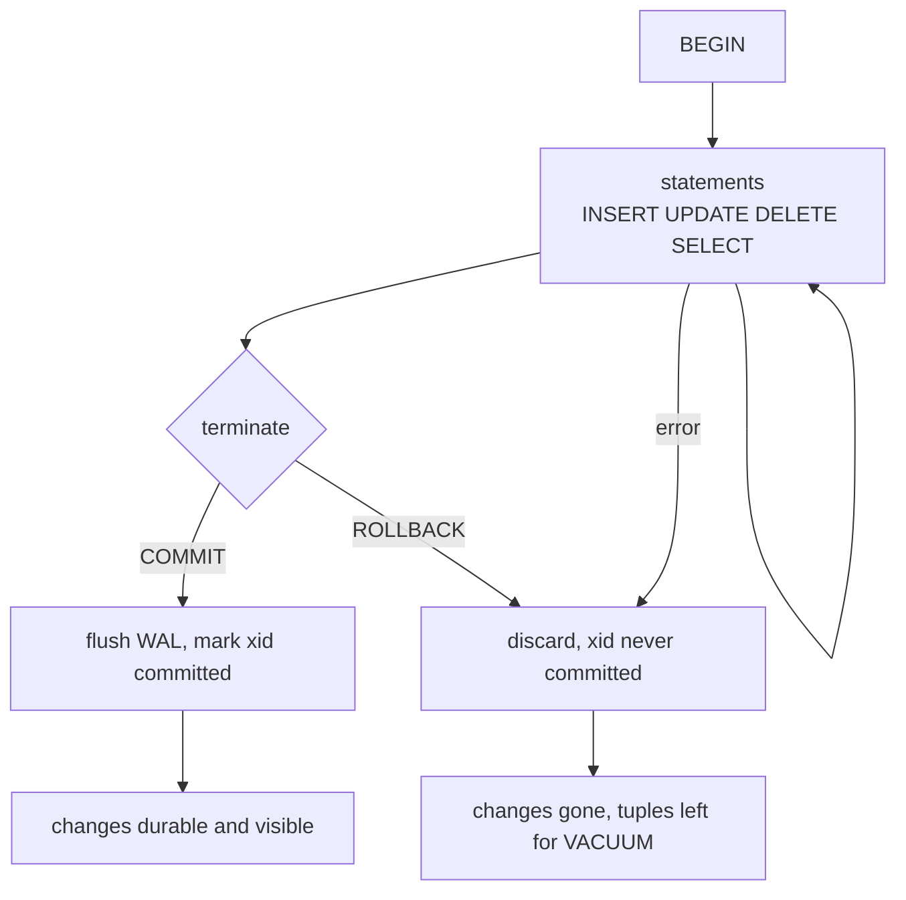
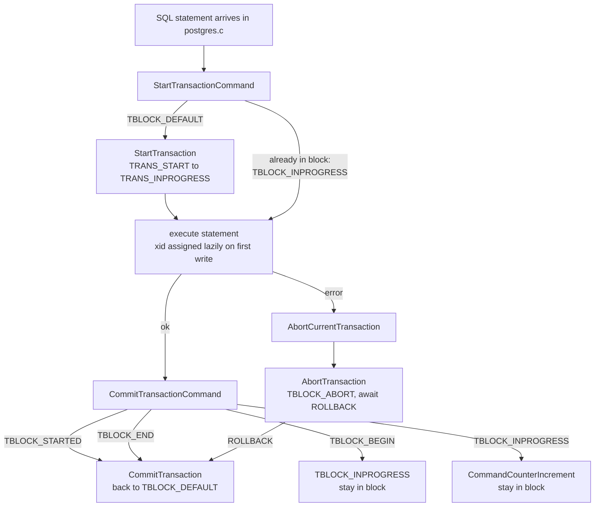
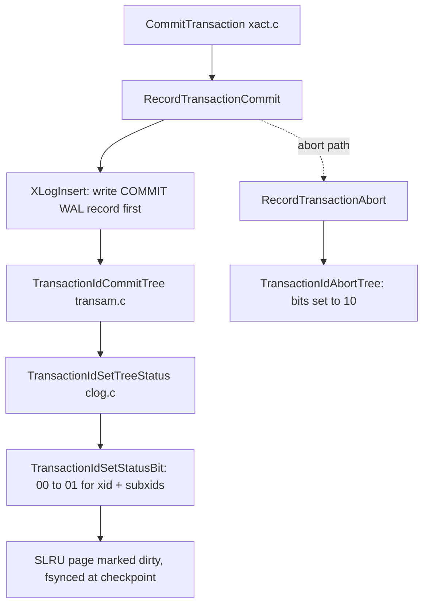
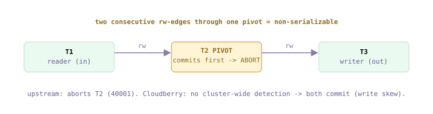
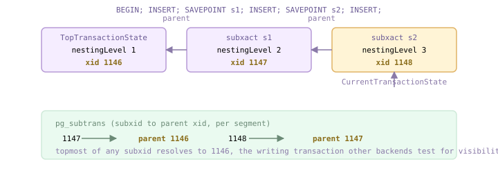

<!--
  Licensed to the Apache Software Foundation (ASF) under one
  or more contributor license agreements.  See the NOTICE file
  distributed with this work for additional information
  regarding copyright ownership.  The ASF licenses this file
  to you under the Apache License, Version 2.0 (the
  "License"); you may not use this file except in compliance
  with the License.  You may obtain a copy of the License at

    http://www.apache.org/licenses/LICENSE-2.0

  Unless required by applicable law or agreed to in writing,
  software distributed under the License is distributed on an
  "AS IS" BASIS, WITHOUT WARRANTIES OR CONDITIONS OF ANY
  KIND, either express or implied.  See the License for the
  specific language governing permissions and limitations
  under the License.
-->

import RawFigure from '../_components/RawFigure';

# 9. Transactions & Isolation

## 9.1 Transaction Concepts & Models

A **transaction** is a set of operations that together form a single logical unit of work — a bank transfer, an order, a batch load. The rule is all-or-nothing: either every operation takes effect, or none does. The user delimits it with `BEGIN` … `COMMIT` (or `ROLLBACK`); everything between them is one indivisible step as far as the database is concerned. This section establishes the vocabulary — the four ACID properties and the classical transaction *models* — and, in the empirical spirit of this book, points at exactly **which Cloudberry subsystem enforces each property and where in this book it is dissected**. The one twist that pervades everything after this: in an MPP system a single user transaction is never really *one* transaction — it is distributed by nature.

### 9.1.1 The four ACID properties

ACID names four *necessary* properties of a correct transaction — **A**tomicity, **C**onsistency, **I**solation, **D**urability. They are requirements, not mechanisms; each is delivered by a concrete piece of machinery. Reading ACID as "which subsystem, and where" turns the acronym into a table of contents for the rest of this book.

- **Atomicity** — After the transaction ends, its operations are either all applied or all discarded — no partial effect survives a crash or a `ROLLBACK`. Transfer $100 from A to B: you never see A debited without B credited.
- **Consistency** — A transaction moves the database from one valid state to another. "Valid" means all integrity constraints hold — primary keys, foreign keys (referential integrity), CHECKs — plus whatever business rules the application enforces with triggers.
- **Isolation** — Concurrent transactions do not perceive one another. A transaction that has modified but not yet committed a row must not have those changes seen by others; each transaction behaves as if it ran alone.
- **Durability** — Once a transaction commits, its changes are permanent. If the server crashes immediately afterward, recovery must reproduce them.

*ACID → the mechanism that enforces it → where it lives in this book*

| Property | Enforced in Cloudberry/Postgres by | Book |
| --- | --- | --- |
| Atomicity | WAL + "undo by not committing": changes are staged; on abort nothing is marked committed, and the transaction's xid is simply never flagged as committed in the commit log, so its tuples stay invisible. No physical undo of individual rows is needed. | §10, §20 |
| Consistency | Constraints (PK/FK/CHECK) + triggers, checked as statements run. The DB guarantees the transformation is atomic and isolated; keeping each state *meaningful* is a shared duty of the engine and the schema/business rules. | this ch. + schema |
| Isolation | MVCC snapshots (each transaction reads a consistent version of the data) backed by locks for write/write conflicts. Higher levels add predicate checks. | [§9.4](#94-isolation-levels--anomalies), §10, §11 |
| Durability | WAL flushed (`fsync`) to disk *before* `COMMIT` returns; the data pages can be written lazily afterward. | §20 |

:::note

Atomicity and Durability are two faces of the same log: WAL is *replayed* at recovery to make committed work durable, and its records are *never* made authoritative for a transaction that did not commit, which is what makes an abort atomic. This is why Postgres and Cloudberry need no separate undo log for MVCC tables — an aborted transaction leaves dead tuples that VACUUM (§10) later reclaims.

:::

### 9.1.2 Atomicity, demonstrated

The most direct proof of atomicity: insert a row, then `ROLLBACK`, and the row is gone as if the statement never ran; do the same with `COMMIT`, and it persists. All output below is live from the coordinator on port 7100.

*ROLLBACK discards; COMMIT persists — nothing partial in between*

```sql
CREATE TABLE t9_1 (id int, v text) DISTRIBUTED BY (id);

      BEGIN;
      INSERT INTO t9_1 VALUES (1, 'rolled-back');
      SELECT count(*) FROM t9_1;      -- visible inside my own txn
      ROLLBACK;
      SELECT count(*) AS after_rollback FROM t9_1;

      BEGIN;
      INSERT INTO t9_1 VALUES (2, 'committed');
      COMMIT;
      SELECT count(*) AS after_commit FROM t9_1;
```

```text {11,18} title="output"
CREATE TABLE
      BEGIN
      INSERT 0 1
       count
      -------
           1                          -- I see my own uncommitted row
      (1 row)
      ROLLBACK
       after_rollback
      ----------------
                    0               -- gone: the insert never happened
      (1 row)
      BEGIN
      INSERT 0 1
      COMMIT
       after_commit
      --------------
                    1               -- persists across the commit
      (1 row)
```

### 9.1.3 The transaction lifecycle

Internally the backend runs a state machine over the transaction *block*: `BEGIN` moves it from `TBLOCK_STARTED` to `TBLOCK_BEGIN` and then `TBLOCK_INPROGRESS`; `COMMIT` requests `TBLOCK_END`; `ROLLBACK` requests `TBLOCK_ABORT_PENDING`. The commands themselves only flip this flag — the real work happens when `CommitTransactionCommand()` next runs and sees the requested state. The two terminal paths diverge completely: one flushes WAL and marks the xid committed; the other discards and marks nothing.

```c title="src/backend/access/transam/xact.c:4845"
/* BEGIN: allow a block to start */
      BeginTransactionBlock(void)
      {
          TransactionState s = CurrentTransactionState;
          switch (s->blockState)
          {
              case TBLOCK_STARTED:
                  s->blockState = TBLOCK_BEGIN;   /* -> block begins */
                  break;
              ...
      /* COMMIT: tell CommitTransactionCommand to COMMIT */
      EndTransactionBlock(bool chain)          /* :4965 */
          case TBLOCK_INPROGRESS:
              s->blockState = TBLOCK_END;
      /* ROLLBACK: tell it to abort */
      UserAbortTransactionBlock(bool chain)    /* :5125 */
          case TBLOCK_INPROGRESS:
              s->blockState = TBLOCK_ABORT_PENDING;
```



*Transaction lifecycle — one path persists, the other discards*

:::note

The full state machine (subtransactions, prepared, parallel, abort recovery) has more than twenty `TBLOCK_*` states, defined at `xact.c:201`. [§9.5](#95-subtransactions--savepoints) covers the subtransaction states used by savepoints.

:::

### 9.1.4 Transaction models

A transaction *model* describes the structure and logical relationship among a transaction's protected operations. Several models exist in the literature; Cloudberry (like Postgres) supports the **flat transaction with savepoints**, and — because it is an MPP database — the **distributed transaction**.

- **Flat transaction** — The basic model: `BEGIN`, then one or more operations, then `COMMIT` or `ROLLBACK`. Simple, but a single failure late in a long transaction forces the *entire* thing to roll back and re-run — expensive for large batch work.
- **Flat with savepoints** — `SAVEPOINT` records an intermediate state mid-transaction; on error you can `ROLLBACK TO` that savepoint instead of losing the whole transaction, and `RELEASE` a savepoint you no longer need. Implemented as subtransactions — the mechanism is **[§9.5](#95-subtransactions--savepoints)**.
- **Nested / chained (mention)** — Nested transactions form a true tree of child transactions with independent commit/abort; chained transactions auto-open a new transaction as one commits (`COMMIT AND CHAIN`, the `chain` argument seen above). Postgres offers savepoints and `AND CHAIN` rather than fully general nesting.
- **Distributed** — A transaction whose operations span multiple nodes, which must still be ACID as a whole. In practice the two-phase commit protocol provides its atomicity — the topic of **§12**.

### 9.1.5 A Cloudberry transaction is distributed by nature

On a single-node Postgres a transaction gets one **transaction id** (xid); `txid_current()` shows it, and two statements in the same transaction share it — proof they are one unit of work:

*One xid for the whole transaction — the coordinator (QD) backend's local xid*

```sql
BEGIN;
      SELECT txid_current();
      SELECT txid_current();   -- same statement, later in the txn
      COMMIT;
```

```text {4,9} title="output"
BEGIN
       txid_current
      --------------
               1089
      (1 row)

       txid_current
      --------------
               1089          -- identical: still the same transaction
      (1 row)
      COMMIT
```

But in Cloudberry that number is only the *coordinator's* view. When you type `BEGIN`, the coordinator starts a **QD** (query dispatcher) backend with its own local transaction; when a statement runs, the QD dispatches it to **QE** (query executor) backends on the segments, each of which runs its own local transaction against its own local data, WAL and commit log. The whole fan-out is held together by a single **distributed transaction id** the coordinator assigns — carried in `TransactionState.distribXid` and generated by the distributed transaction manager (`getDistributedTransactionId()`, backed by `cdbtm.c`). The mechanism — 2PC across the segments, distributed snapshots — is §12; the point *here* is only that even a trivial `SELECT` becomes several cooperating local transactions.

```c title="src/backend/access/transam/xact.c:509"
/* every transaction carries a distributed id alongside its local xid */
          *distribXid = getDistributedTransactionId();   /* from cdbtm.c */
      /* stored per-transaction in TransactionState (xact.h:444): */
          DistributedTransactionId  distribXid;
```

*One statement, one transaction — but the work executes on every segment*

```sql
INSERT INTO t9_seg SELECT generate_series(1,12);
      BEGIN;
        SELECT gp_segment_id, count(*) FROM t9_seg GROUP BY 1 ORDER BY 1;
      COMMIT;
```

```text {5,6,7} title="output"
INSERT 0 12
      BEGIN
       gp_segment_id | count
      ---------------+-------
                   0 |     5      -- QE on segment :7102
                   1 |     2      -- QE on segment :7103
                   2 |     5      -- QE on segment :7104
      (3 rows)
      COMMIT
```

:::note

The rows are split across three segments, so this one `SELECT` ran as three QE local transactions plus the QD — all under one distributed transaction. Every segment keeps its *own* commit log, so atomicity now means "all segments commit or none do," which is exactly why 2PC (§12) exists. From here on, "the transaction" means the coordinator-side view unless we say otherwise; the local machinery below (xids, snapshots, CLOG, locks) is what runs inside *each* backend.

:::

## 9.2 The Transaction Manager

Every transaction needs an identity and a life cycle. The **transaction manager** is the subsystem that supplies both: it hands out transaction ids, drives a transaction through its states from start to commit or abort, and exposes the `BEGIN`/`COMMIT`/`SAVEPOINT`/`ROLLBACK` surface to the user. It does not, by itself, guarantee the ACID properties — it leans on WAL for atomicity and durability ([§9.3](#93-local-transaction-implementation)), on MVCC and snapshots for isolation (§10), and on the lock manager for serialization (§11). This section covers just the two things the manager owns outright: **transaction identity** (the xid) and the **state machine** that a backend walks for each command.

### 9.2.1 Transaction ids

A transaction id (`TransactionId`, or **xid**) is an unsigned 32-bit integer. Four values are reserved and never handed to an ordinary transaction; everything from 3 upward is a “normal” xid, allocated sequentially and monotonically increasing:

```c title="src/include/access/transam.h:31"
#define InvalidTransactionId     ((TransactionId) 0)
      #define BootstrapTransactionId   ((TransactionId) 1)
      #define FrozenTransactionId      ((TransactionId) 2)
      #define FirstNormalTransactionId ((TransactionId) 3)
      #define MaxTransactionId         ((TransactionId) 0xFFFFFFFF)
      /* ... */
      #define TransactionIdIsNormal(xid)  ((xid) >= FirstNormalTransactionId)
```

- **InvalidTransactionId (0)** — the null xid — “no transaction”. A tuple whose xmin is never set, an unassigned slot.
- **BootstrapTransactionId (1)** — the pseudo-xid used while `initdb` populates the catalog; the rows it writes are visible to everyone forever.
- **FrozenTransactionId (2)** — the “infinitely old” xid. VACUUM rewrites an ancient tuple’s xmin to 2 so it stays visible across wraparound (detail in §10).
- **FirstNormalTransactionId (3)** — the first id a real transaction can receive. Anything ≥ 3 is a normal xid.

<RawFigure html={"<div style=\"max-width:720px;margin:2px auto;font:11px/1.4 ui-monospace,SFMono-Regular,Menlo,monospace;color:#1f2328;overflow-x:auto\"><div style=\"min-width:560px\"> <div style=\"display:flex;gap:2px\"> <div style=\"width:70px;border:1px solid #cdb4db;background:#f4f5f6;text-align:center;padding:5px 2px;color:#8a939c\">0<br><span style=\"font-size:9px\">Invalid</span></div> <div style=\"width:70px;border:1px solid #cdb4db;background:#eafaf0;text-align:center;padding:5px 2px\">1<br><span style=\"font-size:9px\">Bootstrap</span></div> <div style=\"width:70px;border:1px solid #cdb4db;background:#eafaf0;text-align:center;padding:5px 2px\">2<br><span style=\"font-size:9px\">Frozen</span></div> <div style=\"flex:1;border:1px solid #e0b365;background:#fff4d6;text-align:center;padding:5px 2px;color:#8a6d1a;font-weight:700\">3 &#8230; 0xFFFFFFFF<br><span style=\"font-size:9px;font-weight:400\">normal xids &#8212; allocated in order, then wrap</span></div> </div> <div style=\"text-align:center;color:#8a7aa8;font-size:10px;padding:1px\">&#8593; reserved sentinels &#8593;&nbsp;&nbsp;&nbsp;&nbsp;&nbsp;&#8593; ~4.2 billion ids, treated as a circle (§10) &#8593;</div> </div></div>"} caption={"The 32-bit TransactionId space: three reserved sentinels, then the normal range that wraps around"} />

Normal xids come from `GetNewTransactionId`: it takes `XidGenLock`, reads the shared counter `ShmemVariableCache-&gt;nextXid`, and advances it. The same routine also enforces the wraparound safety limits — past `xidVacLimit` it nudges autovacuum, past `xidStopLimit` it refuses to hand out any more xids — because the id space is finite and treated as a circle (freezing and wraparound belong to §10):

```c title="src/backend/access/transam/varsup.c:88"
LWLockAcquire(XidGenLock, LW_EXCLUSIVE);
      full_xid = ShmemVariableCache->nextXid;
      xid = XidFromFullTransactionId(full_xid);
      /* ... wraparound-limit checks: xidVacLimit / xidStopLimit ... */
      FullTransactionIdAdvance(&ShmemVariableCache->nextXid);
```

To lift the 4-billion ceiling internally, the counter is actually a 64-bit `FullTransactionId` — a 32-bit *epoch* stacked on the 32-bit xid. The epoch counts how many times the low word has wrapped, so full-xid comparison never wraps. The narrow 32-bit xid is still what gets stored in tuple headers ([§4.2](../part-2-storage-data-layout/ch04.md#42-row-version-layout)) to keep them small; the full id is used where an unambiguous ordering is needed.

```c title="src/include/access/transam.h:65"
typedef struct FullTransactionId
      {
          uint64  value;          /* (epoch << 32) | xid */
      } FullTransactionId;
      #define EpochFromFullTransactionId(x)  ((uint32) ((x).value >> 32))
      #define XidFromFullTransactionId(x)    ((uint32) (x).value)
```

### 9.2.2 Lazy assignment: virtual xids

Xids are scarce, so a transaction gets a real one **only when it first writes**. A read-only transaction never consumes an xid at all. Until then a backend runs under a **virtual transaction id (VXID)** — a pair `backendId/localXid` that is cheap, backend-local, and needs no global lock. The real xid is minted on demand by `AssignTransactionId`, which is called the first time `GetCurrentTransactionId` is asked for one (e.g. by an `INSERT`):

```c title="src/backend/access/transam/xact.c:555"
TransactionId
      GetCurrentTransactionId(void)
      {
          TransactionState s = CurrentTransactionState;
          if (!FullTransactionIdIsValid(s->fullTransactionId))
              AssignTransactionId(s);         /* first write -> real xid */
          return XidFromFullTransactionId(s->fullTransactionId);
      }
```

Inside `AssignTransactionId` the new id from `GetNewTransactionId` is recorded in the backend’s `PGPROC` and in `pg_subtrans`, and (for a top-level xact) cached in `XactTopFullTransactionId`:

```c title="src/backend/access/transam/xact.c:818"
s->fullTransactionId = GetNewTransactionId(isSubXact);
      if (!isSubXact)
          XactTopFullTransactionId = s->fullTransactionId;
```

We can watch the switch flip. `txid_current_if_assigned()` reports the xid only if one exists (it returns nothing otherwise); `txid_current()` *forces* assignment. In one transaction, ask the passive question first, then force one:

*Lazy assignment: no xid until forced, then it sticks*

```sql
BEGIN;
      SELECT txid_current_if_assigned() AS if_assigned_before;
      SELECT txid_current()            AS forced;
      SELECT txid_current_if_assigned() AS if_assigned_after;
      COMMIT;
```

```text {4,9,14} title="output"
BEGIN
       if_assigned_before
      --------------------
                            ← no xid yet (read-only so far)
      (1 row)

       forced
      --------
         1096             ← txid_current() forced assignment
      (1 row)

       if_assigned_after
      -------------------
                    1096  ← now it exists, and it is the same id
      (1 row)
      COMMIT
```

And the id is stable for the life of the transaction — two statements in the same transaction see the same xid:

*One xid per transaction, stable across statements*

```sql
BEGIN;
      SELECT txid_current() AS first;
      SELECT txid_current() AS second;
      COMMIT;
```

```text {4,7} title="output"
BEGIN
       first
      -------
        1097
       second
      --------
         1097    ← same transaction, same xid
      COMMIT
```

The VXID is visible directly in `pg_locks`. Every live backend holds a lock on its own virtual xid; a real xid lock appears only once one is assigned. Watch a read-only transaction hold just a `virtualxid`, then acquire a `transactionid` lock the moment it gets an xid:

*pg_locks: the VXID is always held; the real xid lock appears on assignment*

```sql
BEGIN;
      SELECT locktype, virtualtransaction, transactionid
        FROM pg_locks
       WHERE pid = pg_backend_pid()
         AND locktype IN ('virtualxid','transactionid');
      SELECT txid_current();                 -- force a real xid
      SELECT locktype, virtualtransaction, transactionid
        FROM pg_locks
       WHERE pid = pg_backend_pid()
         AND locktype IN ('virtualxid','transactionid');
      COMMIT;
```

```text {3,8,12,13} title="output"
  locktype  | virtualtransaction | transactionid
      ------------+--------------------+---------------
       virtualxid | 8/4              |                ← only the VXID
      (1 row)

       txid_current
      --------------
               1098

         locktype    | virtualtransaction | transactionid
      ---------------+--------------------+---------------
       transactionid | 8/4                |          1098  ← real xid now held
       virtualxid    | 8/4              |
      (2 rows)
      COMMIT
```

:::note

The VXID **8/4** is `backendId 8`, `localXid 4`. The backend id half comes from the backend’s `PGPROC` slot; the counter half lives in `PGPROC.lxid` (“local id of the top-level transaction currently being executed”, `src/include/storage/proc.h:202`). Because a VXID costs nothing global, a workload of pure readers never touches `XidGenLock` and never advances `nextXid`.

:::

### 9.2.3 The transaction state machine

A backend tracks the current transaction in a `TransactionStateData` struct. It is a **stack**: subtransactions ([§9.5](#95-subtransactions--savepoints)) push new nodes, so `CurrentTransactionState` points at the innermost one and `parent` links back up. Each node carries two independent state variables: `state` (a low-level `TransState`, the engine’s view) and `blockState` (a high-level `TBlockState`, the user’s view), plus the lazily-filled `fullTransactionId` and the `nestingLevel`:

```c title="src/backend/access/transam/xact.c:233"
typedef struct TransactionStateData
      {
          FullTransactionId fullTransactionId; /* my xid (0 until first write) */
          SubTransactionId  subTransactionId;
          char       *name;                    /* savepoint name, if any */
          TransState  state;                   /* low-level state  */
          TBlockState blockState;              /* high-level state */
          int         nestingLevel;           /* transaction nesting depth */
          TransactionId *childXids;           /* subcommitted child xids */
          struct TransactionStateData *parent; /* back link (subxacts) */
      } TransactionStateData;

      static TransactionStateData TopTransactionStateData = {
          .state = TRANS_DEFAULT, .blockState = TBLOCK_DEFAULT,
      };
      static TransactionState CurrentTransactionState = &TopTransactionStateData;
```

The low-level `TransState` is what the machinery is doing right now; the high-level `TBlockState` is where the client’s transaction block stands (idle, mid-BEGIN, live, ending, aborting). They are separate on purpose — a single client command may take the engine through several low-level states while the block state changes once:

*The two state enums (xact.c:185 / xact.c:201)*

| Low-level TransState | High-level TBlockState (top-level) |
| --- | --- |
| TRANS_DEFAULT — idle | TBLOCK_DEFAULT — no transaction |
| TRANS_START — starting | TBLOCK_STARTED — implicit single-query xact |
| TRANS_INPROGRESS — running | TBLOCK_BEGIN / TBLOCK_INPROGRESS — explicit block |
| TRANS_COMMIT — committing | TBLOCK_END — COMMIT received |
| TRANS_ABORT — aborting | TBLOCK_ABORT / _END / _PENDING — failed, awaiting ROLLBACK |
| TRANS_PREPARE — 2PC phase 1 | TBLOCK_PREPARE — PREPARE received |

The block state is driven from `postgres.c`: **every** SQL statement is bracketed by `StartTransactionCommand()` before execution and `CommitTransactionCommand()` (or `AbortCurrentTransaction()` on error) after. These functions are one big `switch (s-&gt;blockState)`. With no explicit `BEGIN`, the first call takes `TBLOCK_DEFAULT` → `StartTransaction()` → `TBLOCK_STARTED`, and the closing call commits and returns to `TBLOCK_DEFAULT` — that is autocommit:

```c title="src/backend/access/transam/xact.c:3874"
/* StartTransactionCommand() */
      case TBLOCK_DEFAULT:
          StartTransaction();
          s->blockState = TBLOCK_STARTED;   /* implicit single-query xact */
          break;

      /* CommitTransactionCommand() */
      case TBLOCK_STARTED:
          CommitTransaction();
          s->blockState = TBLOCK_DEFAULT;   /* back to idle: autocommit */
          break;
```

An explicit `BEGIN` instead lands in `TBLOCK_BEGIN`, which `CommitTransactionCommand` promotes to `TBLOCK_INPROGRESS` without touching the database (`xact.c:4052`); subsequent statements stay `TBLOCK_INPROGRESS` and each ends with only a `CommandCounterIncrement()` ([§9.4](#94-isolation-levels--anomalies)); the closing `COMMIT` arrives as `TBLOCK_END` and runs the real `CommitTransaction()`. The whole command loop:



*The per-command transaction loop and top-level block states*

### 9.2.4 In an MPP cluster

The picture above is *local* — it is exactly what a single PostgreSQL backend does, and it runs unchanged inside every Cloudberry process. A user statement, though, becomes many backends: the coordinator (QD) plus one query executor (QE) per segment. Each of those backends runs its **own** local state machine and, if it writes, allocates its **own** local xid from **its own** `nextXid` counter. There is no shared xid space across the cluster.

What ties them together is a **distributed transaction id (gxid)** that the QD assigns and dispatches alongside the plan; each segment binds its local xid to that gxid. We can see that the counters are genuinely independent by asking two segments directly (utility mode) for a local xid — they are unrelated numbers:

*Each segment has its own local xid counter (utility-mode, ports 7102/7103)*

```sql
-- segment 0
      SELECT gp_segment_id FROM gp_id;
      BEGIN; SELECT txid_current() AS seg0_local_xid; COMMIT;
      -- segment 1
      BEGIN; SELECT txid_current() AS seg1_local_xid; COMMIT;
```

```text {7,11} title="output"
 gp_segment_id
      ---------------
                   0

       seg0_local_xid
      ----------------
                1118        ← segment 0 counter

       seg1_local_xid
      ----------------
                1112        ← segment 1 counter (independent)
```

:::note

The gxid, its dispatch, and how the QD keeps the per-segment local transactions atomic (two-phase commit) is the subject of **§12**; here we only establish the split of responsibility: *QD assigns the global id, every QE keeps a local xid*. On the QE side you can even see the coordinator’s distributed context recorded in `PGPROC.localDistribXactData` (`src/include/storage/proc.h:214`).

:::

## 9.3 Local Transaction Implementation

Everything so far has been about the *running* transaction — the xid it owns ([§9.2](#92-the-transaction-manager)) and the block state it moves through. But a transaction's most important fact is decided at the very end: did it **commit** or **abort**? That single bit of truth must survive a crash, and every other backend must be able to read it for any xid, forever. Two SLRU-backed on-disk maps carry it: **CLOG** (`pg_xact`) records each transaction's final outcome, and **SUBTRANS** (`pg_subtrans`) records which parent a subtransaction belongs to. This section is about how those two maps are laid out, addressed, and written on the commit path.

### 9.3.1 CLOG — two bits of truth per transaction

The commit log stores a *status* for every xid ever assigned, using **2 bits each**. Two bits give exactly four states, and CLOG uses all four (`src/include/access/clog.h`):

*The four CLOG status codes (clog.h)*

| Bits | Constant | Meaning |
| --- | --- | --- |
| `00` | `TRANSACTION_STATUS_IN_PROGRESS` (0x00) | not yet resolved — the all-zeroes initial state |
| `01` | `TRANSACTION_STATUS_COMMITTED` (0x01) | committed; its effects are permanent |
| `10` | `TRANSACTION_STATUS_ABORTED` (0x02) | aborted; its effects must be ignored |
| `11` | `TRANSACTION_STATUS_SUB_COMMITTED` (0x03) | a subtransaction that committed but whose top parent is not yet resolved |

Because the default is `00`, a freshly-extended CLOG page starts life reading *in-progress* for every xid it covers — no explicit initialization of individual slots is needed. A transaction is marked exactly once, transitioning `00` → `01`/`10` (or through `11` for a subcommitted child). `TransactionIdGetStatus` reads two bits and returns the status; the readable predicates `TransactionIdDidCommit` / `TransactionIdDidAbort` in `transam.c` wrap it (and, for a `SUB_COMMITTED` child, recurse up through SUBTRANS to the top parent → [§9.5](#95-subtransactions--savepoints)).

```c title="src/include/access/clog.h:60"
#define CLOG_BITS_PER_XACT   2
#define CLOG_XACTS_PER_BYTE  4
#define CLOG_XACTS_PER_PAGE  (BLCKSZ * CLOG_XACTS_PER_BYTE)
#define CLOG_XACT_BITMASK    ((1 << CLOG_BITS_PER_XACT) - 1)
```

Four xids share every byte; a page is one `BLCKSZ` block. This cluster is built with `BLCKSZ = 32768`, so **CLOG_XACTS_PER_PAGE = 32768 × 4 = 131072** — one page holds the fate of 131 072 consecutive transactions. That density is why CLOG is tiny: a segment file (`SLRU_PAGES_PER_SEGMENT` pages) covers tens of millions of xids in a few hundred KB.

<RawFigure html={"<div style=\"max-width:720px;margin:2px auto;font:11px/1.4 ui-monospace,SFMono-Regular,Menlo,monospace;color:#1f2328;overflow-x:auto\"><div style=\"min-width:560px\"><div style=\"text-align:center;color:#8a7aa8;font-size:10px;padding:2px\">one 32 KB page = 32768 bytes = 131072 xids &nbsp;(4 xids / byte)</div><div style=\"display:flex;gap:0;margin-bottom:1px\"><div style=\"flex:2;border:1px solid #cdb4db;background:#efe3fb;text-align:center;padding:5px 2px;color:#6b5b95\">byte 0 &mdash; xids 0..3</div><div style=\"flex:2;border:1px solid #cdb4db;background:#efe3fb;text-align:center;padding:5px 2px;color:#6b5b95\">byte 1 &mdash; xids 4..7</div><div style=\"flex:3;border:1px dashed #cdb4db;background:#f4f5f6;text-align:center;padding:5px 2px;color:#8a939c\">&hellip;</div><div style=\"flex:2;border:1px solid #e0b365;background:#fff4d6;text-align:center;padding:5px 2px;color:#8a6d1a;font-weight:700\">byte 265 &mdash; xids 1060..1063</div></div><div style=\"display:flex;gap:0\"><div style=\"flex:1;border:1px solid #cdb4db;background:#f5edff;text-align:center;padding:5px 2px\">01</div><div style=\"flex:1;border:1px solid #cdb4db;background:#f5edff;text-align:center;padding:5px 2px\">01</div><div style=\"flex:1;border:1px solid #cdb4db;background:#f5edff;text-align:center;padding:5px 2px\">10</div><div style=\"flex:1;border:1px solid #cdb4db;background:#f5edff;text-align:center;padding:5px 2px\">01</div><div style=\"flex:3;border:1px dashed #cdb4db;background:#f4f5f6;text-align:center;padding:5px 2px;color:#8a939c\">&hellip; 131064 more slots &hellip;</div><div style=\"flex:1;border:1px solid #cdb4db;background:#f5edff;text-align:center;padding:5px 2px;color:#8a939c\">00</div><div style=\"flex:1;border:1px solid #cdb4db;background:#f5edff;text-align:center;padding:5px 2px;color:#8a939c\">00</div><div style=\"flex:1;border:1px solid #cdb4db;background:#f5edff;text-align:center;padding:5px 2px;color:#8a939c\">00</div><div style=\"flex:1;border:2px solid #e0b365;background:#fff4d6;text-align:center;padding:4px 2px;color:#8a6d1a;font-weight:700\">01</div></div><div style=\"display:flex;gap:0;color:#8a7aa8;font-size:10px\"><div style=\"flex:4;text-align:left;padding:1px 3px\">xid 0 &rarr;</div><div style=\"flex:3\"></div><div style=\"flex:4;text-align:right;padding:1px 3px\">&larr; bit-shift 6, xid 1063 = 01 = COMMITTED</div></div><div style=\"text-align:center;color:#8a7aa8;font-size:10px;padding:3px\">00 in-progress &nbsp;|&nbsp; 01 committed &nbsp;|&nbsp; 10 aborted &nbsp;|&nbsp; 11 sub-committed</div></div></div>"} caption={"A pg_xact page as a strip of 2-bit slots — 4 xids per byte, 131072 xids per 32KB page"} />

### 9.3.2 Resolving an xid to (page, byte, bit)

Since the slots are packed 4-per-byte, reading a status is pure integer arithmetic — no lookup table. Given an xid, four macros in `clog.h` peel it apart: which page, which byte in that page, and how far to shift within the byte.

```c title="src/include/access/clog.h:65"
#define TransactionIdToPage(xid)    ((xid) / CLOG_XACTS_PER_PAGE)
#define TransactionIdToPgIndex(xid) ((xid) % CLOG_XACTS_PER_PAGE)
#define TransactionIdToByte(xid)    (TransactionIdToPgIndex(xid) / CLOG_XACTS_PER_BYTE)
#define TransactionIdToBIndex(xid)  ((xid) % CLOG_XACTS_PER_BYTE)
```

`TransactionIdSetStatusBit` and `TransactionIdGetStatus` (`clog.c`) both compute `byteno` and a `bshift = TransactionIdToBIndex(xid) * 2`, then mask/shift with `CLOG_XACT_BITMASK`. The figure below walks xid 1063 end-to-end for this build's 131072-per-page geometry.


*xid 1063 → CLOG address: page → byte → 2-bit slot → status (clog.c:571,640)*

### 9.3.3 The commit path — how the bits get set

CLOG is written at exactly one moment: when a transaction finalizes. `CommitTransaction` calls `RecordTransactionCommit` (`xact.c`), which emits the commit WAL record and then calls `TransactionIdCommitTree` — a thin wrapper in `transam.c` over the real workhorse `TransactionIdSetTreeStatus`, which flips the top xid **and all its committed subxids** to `COMMITTED` in one shot. Abort mirrors this through `RecordTransactionAbort` → `TransactionIdAbortTree`.

```c title="src/backend/access/transam/transam.c:295"
void
TransactionIdCommitTree(TransactionId xid, int nxids, TransactionId *xids)
{
    TransactionIdSetTreeStatus(xid, nxids, xids,
                               TRANSACTION_STATUS_COMMITTED,
                               InvalidXLogRecPtr);
}
```

```c title="src/backend/access/transam/xact.c:1794"
if (markXidCommitted)
{
    /* mark distributed txn committed *before* clog (see cdbtm / §12) */
    if (isDtxPrepared || isOnePhaseQE)
        DistributedLog_SetCommittedTree(xid, nchildren, children, ...);

    TransactionIdCommitTree(xid, nchildren, children);
}
```



*The commit path: from CommitTransaction down to two flipped bits*

:::note

**WAL first, always.** The commit record is flushed to WAL *before* the CLOG bit is durable. If the server crashes after the WAL flush but before CLOG reaches disk, recovery replays the commit record and re-runs `TransactionIdSetTreeStatus` (via `xact_redo`, xact.c:7385) to reconstruct the bit. CLOG durability is therefore parasitic on WAL durability — see §20 for the ordering rule that makes this safe.

:::

### 9.3.4 SUBTRANS — mapping a subtransaction to its parent

CLOG can mark a child `SUB_COMMITTED` (`11`), but that only means "committed *if my ancestor did*". To resolve it, the system must walk from the subxid up to the top-level xid — and that parent link lives in **SUBTRANS** (`pg_subtrans`, `subtrans.c`). Where upstream PostgreSQL stores a bare parent xid per slot, Cloudberry stores a small struct so the topmost ancestor can be cached and reached without walking the whole chain each time:

```c title="src/include/access/subtrans.h:17"
typedef struct SubTransData
{
    TransactionId parent;         /* immediate parent xid */
    TransactionId topMostParent;  /* cached top-level xid of the tree */
} SubTransData;
```

Because each entry is a struct, not two bits, the page geometry differs from CLOG: `SUBTRANS_XACTS_PER_PAGE = BLCKSZ / sizeof(SubTransData)` (`subtrans.c:52`), and the address macros index whole entries (`TransactionIdToEntry`) instead of packing bits. `SubTransSetParent` records the link when a subtransaction first assigns an xid; `SubTransGetParent` / `SubTransGetTopmostTransaction` read it back during visibility checks. The full subtransaction *lifecycle* (savepoints, `TBLOCK_SUBBEGIN`, child-xid arrays) is [§9.5](#95-subtransactions--savepoints); here it is just the storage map that lets `TransactionIdDidCommit` recurse a `11` up to a real answer.


*SUBTRANS resolves a subcommitted child up to a durable outcome (subtrans.c + clog.c)*

### 9.3.5 Watching it live

The status a transaction leaves in CLOG is queryable directly. `txid_status(xid)` reads the exact two bits we have been decoding. Commit a transaction, ask for its status, and get committed; roll one back, and the same slot reads aborted.

*txid_status reads the CLOG bits back: committed vs aborted (port 7100)*

```sql
-- a transaction that commits
SELECT txid_current() AS my_xid \gset
COMMIT;
SELECT txid_status(:my_xid) AS status_of_committed;

-- a transaction that rolls back
BEGIN;
  INSERT INTO t9 VALUES (1);
  SELECT txid_current() AS ax \gset
ROLLBACK;
SELECT txid_status(:ax) AS status_of_rolledback;
```

```text {4,10} title="output"
COMMIT
 status_of_committed 
---------------------
 committed
(1 row)

ROLLBACK
 status_of_rolledback 
----------------------
 aborted
(1 row)
```

On disk, CLOG is just those SLRU segment files under `pg_xact/`. Each segment has its own directory because each has its own CLOG (see below):

*The pg_xact SLRU segment files on segment 0's data directory*

```sql
$ ls -l $PGDATA/pg_xact/    # segment 0 data dir
```

```text {2} title="output"
total 32
-rw------- 1 gpadmin gpadmin 32768 Jul  2 22:03 0000
```

The `0000` file is CLOG page/segment zero — 32768 bytes, exactly one `BLCKSZ`, covering xids 0..131071. SLRU keeps a few of these pages cached in shared memory; `pg_stat_slru` exposes the cache activity for both maps by name:

*SLRU cache counters for the Xact and Subtrans logs (port 7100)*

```sql
SELECT name, blks_hit, blks_read, blks_written
FROM pg_stat_slru
WHERE name IN ('Xact','Subtrans');
```

```text {3} title="output"
   name   | blks_hit | blks_read | blks_written 
----------+----------+-----------+--------------
 Xact    |     5748 |         6 |           21
 Subtrans |        0 |         0 |            7
(1 row)
```

### 9.3.6 MPP: every node keeps its own commit log

In a Cloudberry cluster the coordinator (QD) and each segment (QE) is essentially a full PostgreSQL instance, so each keeps its **own** `pg_xact` and `pg_subtrans`, its **own** SLRU caches, and its **own** local xid counter. A user statement becomes a QD backend plus one QE backend per segment, and each of those assigns a *local* xid and records its *local* outcome in *its own* CLOG. The counters are independent — the same statement lands on different local xids on different nodes:

*Independent local xid counters: coordinator vs segment 0*

```sql
-- on the coordinator (QD)
psql -p 7100 -c "SELECT txid_current();"

-- on segment 0, utility mode (QE, its own counter)
PGOPTIONS='-c gp_role=utility' psql -p 7102 \
  -c "SELECT txid_current(), gp_segment_id FROM gp_id;"
```

```text {1,2} title="output"
QD  coordinator local xid: 1102
seg0 local xid, gp_segment_id: 1121 | 0
```

:::note

What ties these independent local outcomes into a single all-or-nothing result is the **distributed transaction** and its own distributed commit log (`DistributedLog_SetCommittedTree`, called just before the local CLOG in xact.c:1794). That machinery — the distributed xid, two-phase commit, and how a global snapshot reads across per-node CLOGs — is the subject of **§12**. Locally, though, the story ends here: two bits, written once, WAL-protected, read by everyone.

:::

## 9.4 Isolation Levels & Anomalies

### 9.4.1 The four levels and the classic anomalies

The SQL standard grades isolation by which read anomalies it lets slip through. Three classic anomalies matter: a **dirty read** (T reads a row another transaction wrote but has not committed), a **non-repeatable read** (T reads a row, another transaction commits an UPDATE to it, T reads it again and the value changed), and a **phantom** (T runs a range query, another transaction commits an INSERT that falls in the range, T re-runs the query and a new row appears). The standard then defines four levels — Read Uncommitted, Read Committed, Repeatable Read, Serializable — each forbidding strictly more anomalies at the cost of concurrency.

Postgres, and therefore Cloudberry, does **not** implement these on top of read locks the way the standard imagines. It builds them on MVCC snapshots (§10), which makes its behavior *stricter* than the standard permits at two levels — and it changes the anomaly that actually bites you. The macros that drive everything are trivial:

```c title="src/include/access/xact.h:41"
#define XACT_READ_UNCOMMITTED  0
      #define XACT_READ_COMMITTED    1
      #define XACT_REPEATABLE_READ   2
      #define XACT_SERIALIZABLE      3

      /* one snapshot for the whole xact? */
      #define IsolationUsesXactSnapshot() (XactIsoLevel >= XACT_REPEATABLE_READ)
      #define IsolationIsSerializable()   (XactIsoLevel == XACT_SERIALIZABLE)
```

So there are really only two snapshot regimes. Below Repeatable Read, every statement takes a **fresh** snapshot (`GetTransactionSnapshot` re-reads it each command); at Repeatable Read and above, the transaction takes **one** snapshot on its first query and keeps it to the end. `IsolationIsSerializable()` adds SSI conflict tracking on top of that single snapshot — but see [§9.4](#94-isolation-levels--anomalies).3 for what Cloudberry actually does with it.

*Isolation × anomaly — actual Postgres/Cloudberry behavior. stricter = Postgres forbids what the SQL standard would allow.*

| Level | Dirty read | Non-repeatable read | Phantom | Write skew / serialization anomaly |
| --- | --- | --- | --- | --- |
| Read Uncommitted | never (= Read Committed) | possible | possible | possible |
| Read Committed | never | possible | possible | possible |
| Repeatable Read | never | never | never (stricter) | POSSIBLE — write skew |
| Serializable (upstream PG) | never | never | never | never (SSI aborts one txn) |
| Serializable (Cloudberry) | never | never | never | POSSIBLE — falls back to RR ([§9.4](#94-isolation-levels--anomalies).3) |

:::note

Two Postgres-specific facts to burn in: **Read Uncommitted behaves exactly like Read Committed** — a snapshot never shows uncommitted data, so *dirty reads simply cannot occur*, at any level. And **Repeatable Read already blocks phantoms**, because its frozen snapshot hides rows committed by others after it began — the SQL standard only requires Serializable to do that. The one anomaly Repeatable Read still permits is **write skew**, and that is the whole reason Serializable exists.

:::

### 9.4.2 Read Committed vs Repeatable Read, live

The difference is entirely about *when* the snapshot is taken. We drive two overlapping sessions on the coordinator (:7100): session B reads a row, sleeps, and reads it again; meanwhile another session UPDATEs and COMMITs the row in between. First under Read Committed:

*Read Committed: each statement re-snapshots, so B's second read sees the committed change*

```sql
-- session B                          -- concurrent writer (fires during the sleep)
      BEGIN ISOLATION LEVEL READ COMMITTED;
      SELECT bal FROM iso_demo WHERE id=1;    UPDATE iso_demo SET bal=200 WHERE id=1;
      SELECT pg_sleep(3);
      SELECT bal FROM iso_demo WHERE id=1;
      COMMIT;
```

```text {3,7} title="output"
 read1
      -------
         100
      UPDATE 1
       read2
      -------
         200      <- non-repeatable read: value changed mid-transaction
```

Now the identical interleaving under Repeatable Read. B's first query freezes a snapshot for the whole transaction, so the committed UPDATE is invisible until B ends:

*Repeatable Read: one snapshot for the transaction — B keeps reading the old value; the change is only visible after COMMIT*

```sql
-- session B                          -- concurrent writer (fires during the sleep)
      BEGIN ISOLATION LEVEL REPEATABLE READ;
      SELECT bal FROM iso_demo WHERE id=1;    UPDATE iso_demo SET bal=200 WHERE id=1;
      SELECT pg_sleep(3);
      SELECT bal FROM iso_demo WHERE id=1;
      COMMIT;
      SELECT bal FROM iso_demo WHERE id=1;    -- outside the txn now
```

```text {3,7,11} title="output"
 read1
      -------
         100
      UPDATE 1
       read2
      -------
         100      <- SAME value: repeatable read holds
      COMMIT
       after_commit
      --------------
                200  <- fresh snapshot after COMMIT finally sees it
```

That one snapshot is exactly `FirstXactSnapshot` in `snapmgr.c`: taken on the first query when `IsolationUsesXactSnapshot()` is true, copied, registered, and pinned until end-of-transaction.

```c title="src/backend/utils/time/snapmgr.c:309"
if (IsolationUsesXactSnapshot())
      {
          if (IsolationIsSerializable())
              CurrentSnapshot = GetSerializableTransactionSnapshot(&CurrentSnapshotData);
          else
              CurrentSnapshot = GetSnapshotData(&CurrentSnapshotData, DistributedTransactionContext);
          CurrentSnapshot   = CopySnapshot(CurrentSnapshot);   /* survives whole xact */
          FirstXactSnapshot = CurrentSnapshot;
      }
```

### 9.4.3 Serializable in Cloudberry: it falls back to Repeatable Read

Here is the fact that upstream intuition gets wrong. In single-node Postgres, Serializable is **SSI** (Serializable Snapshot Isolation): it runs on the Repeatable-Read snapshot but additionally tracks read/write dependencies between transactions and aborts one if a non-serializable cycle forms. Cloudberry cannot do that across a distributed cluster — SSI's predicate locks are per-node shared memory, and a user statement fans out into a QD plus one QE backend per segment (§12), so no single node sees the whole dependency graph. Rather than offer a broken guarantee, Cloudberry **silently downgrades Serializable to Repeatable Read** in the GUC check hook:

```c title="src/backend/commands/variable.c:626"
/* GPDB_91_MERGE_FIXME: ... Cloudberry lacks the support to detect
       * serialization conflicts using predicate locks at cluster level.
       * Until that support is implemented, let's keep old behavior by
       * falling back to repeatable read. */
      if (newXactIsoLevel == XACT_SERIALIZABLE)
      {
          elog(LOG, "serializable isolation requested, falling back to "
                    "repeatable read until serializable is supported in Cloudberry");
          *newval = XACT_REPEATABLE_READ;
      }
```

The twin hook `check_DefaultXactIsoLevel` (variable.c:637) does the same to `default_transaction_isolation`, so there is no way to reach real SERIALIZABLE, whether per-transaction or as a default. This is observable directly — ask for serializable, get repeatable read, and the LOG line names the downgrade:

*CBDB downgrades SERIALIZABLE to REPEATABLE READ, and says so in the log*

```sql
SET client_min_messages='log';
      SET default_transaction_isolation='serializable';
      SHOW default_transaction_isolation;
      BEGIN ISOLATION LEVEL SERIALIZABLE;
      SHOW transaction_isolation;
      COMMIT;
```

```text {6,12} title="output"
SET
      LOG:  default serializable isolation requested, falling back to
            repeatable read until serializable is supported in Cloudberry
       default_transaction_isolation
      -------------------------------
       repeatable read
      BEGIN
      LOG:  serializable isolation requested, falling back to
            repeatable read until serializable is supported in Cloudberry
       transaction_isolation
      -----------------------
       repeatable read
```

The practical consequence: **write skew is not prevented in Cloudberry, even when you ask for SERIALIZABLE.** The canonical example is on-call scheduling with the invariant "at least one doctor on call." Two transactions each read the count, see two doctors on call, and each takes a *different* doctor off. Neither writes what the other read, so there is no write-write conflict — Repeatable Read (and thus CBDB's "serializable") lets both commit, and the invariant breaks:

*Write skew: both txns request SERIALIZABLE, both COMMIT with no 40001 — invariant violated (0 on call)*

```sql
-- session A                              -- session B (starts ~1s later)
      BEGIN ISOLATION LEVEL SERIALIZABLE;        BEGIN ISOLATION LEVEL SERIALIZABLE;
      SELECT count(*) FROM doctors               SELECT count(*) FROM doctors
         WHERE on_call;   -- 2                       WHERE on_call;   -- 2
      UPDATE doctors SET on_call=false           UPDATE doctors SET on_call=false
         WHERE name='Alice';                         WHERE name='Bob';
      COMMIT;                                     COMMIT;
```

```text {3,9,10} title="output"
 oncall            oncall
      --------          --------
         2               2
      UPDATE 1          UPDATE 1
      COMMIT            COMMIT     <- neither aborts (no serialization_failure)

       name  | on_call
      -------+---------
       Alice | f
       Bob   | f       <- BOTH off call: invariant broken
```

:::note

On **upstream single-node PostgreSQL** this same interleaving under true SERIALIZABLE would abort one transaction with `ERROR: could not serialize access due to read/write dependencies among transactions` (SQLSTATE **40001**). Under Cloudberry you get two clean commits and corrupted data. If you need this guarantee today, enforce it with explicit locking or a constraint, not with the isolation level.

:::

### 9.4.4 How real Serializable works (SSI, for reference)

The machinery Cloudberry does not yet run cluster-wide lives, fully implemented for the local case, in `predicate.c`. It is worth understanding because it defines what "serializable" should mean. SSI keeps the fast Repeatable-Read snapshot but layers **SIREAD (predicate) locks** on top: instead of blocking, a SIREAD lock is a *record that a transaction read something*, used to detect **rw-antidependencies** — a read that would have seen a write, had the writer committed first.

- **SIREAD lock** — A non-blocking 'this txn read this page/tuple/relation' marker. Kept until all overlapping transactions finish so late-arriving writes can still detect the read. Predicate.c:27.
- **rw-antidependency** — T1 →rw T2: T1 read a version, T2 wrote a newer version of the same datum, and T1 did not see it. The edge points from reader to writer.
- **dangerous structure** — A transaction (the 'pivot') with BOTH an incoming and an outgoing rw-edge among concurrent transactions. Every non-serializable execution contains one; SSI aborts to break it.
- **safe-snapshot optimization** — A READ ONLY DEFERRABLE txn that provably cannot be a pivot releases its predicate locks and runs lock-free (GetSafeSnapshot, predicate.c).

The theorem SSI rests on (Cahill/Fekete): any serialization anomaly requires two consecutive rw-edges forming a cycle, with the middle transaction — the pivot — committing first. SSI does not compute full cycles; it watches for that local three-transaction pattern and aborts the pivot on detection (`OnConflict_CheckForSerializationFailure`, predicate.c).



*The 'dangerous structure': two rw-antidependencies through a pivot (T2). SSI aborts T2 with SQLSTATE 40001 to keep the schedule serializable.*

:::note

In Cloudberry the SSI code compiles and runs, but because `XactIsoLevel` can never reach `XACT_SERIALIZABLE` ([§9.4](#94-isolation-levels--anomalies).3), `IsolationIsSerializable()` is always false, `GetSerializableTransactionSnapshot` is never taken, and no SIREAD locks are ever created. The dangerous structure above is detected by **upstream PostgreSQL only**; distributed serializability remains open in CBDB (see the GPDB_91_MERGE_FIXME in variable.c).

:::

## 9.5 Subtransactions & Savepoints

### 9.5.1 A transaction that can back out part of itself

So far a transaction has been all-or-nothing: it either commits everything or aborts everything ([§9.1](#91-transaction-concepts--models)). A **savepoint** relaxes that. Inside an open transaction you name a point with `SAVEPOINT s1`, and later `ROLLBACK TO SAVEPOINT s1` discards everything done *after* that point while keeping everything before it — and, crucially, keeping the transaction itself alive. `RELEASE SAVEPOINT s1` forgets the marker (its work folds into the enclosing transaction). This is the SQL-standard mechanism for partial rollback, and PL/pgSQL exception handlers are built on the very same machinery ([§9.5](#95-subtransactions--savepoints).5).

*Partial rollback: the pre-savepoint row survives, the post-savepoint one does not*

```sql
CREATE TABLE sp_demo (id int, note text) DISTRIBUTED BY (id);
      BEGIN;
      INSERT INTO sp_demo VALUES (1, 'before savepoint');
      SAVEPOINT s1;
      INSERT INTO sp_demo VALUES (2, 'after savepoint');
      SELECT * FROM sp_demo ORDER BY id;
      ROLLBACK TO SAVEPOINT s1;
      SELECT * FROM sp_demo ORDER BY id;
      COMMIT;
```

```text {14} title="output"
BEGIN
      INSERT 0 1
      SAVEPOINT
      INSERT 0 1
       id |       note
      ----+------------------
        1 | before savepoint
        2 | after savepoint      -- both visible inside the txn
      (2 rows)

      ROLLBACK                   -- ROLLBACK TO SAVEPOINT s1
       id |       note
      ----+------------------
        1 | before savepoint    -- row 2 is gone, row 1 remains
      (1 row)

      COMMIT
```

The transaction did not die at the error-free `ROLLBACK TO`; it continued and committed row 1. A savepoint is therefore a **nested unit of atomicity**: everything since the savepoint is atomic *relative to* the outer transaction.

### 9.5.2 Backed by subtransactions: the TransactionState stack

A savepoint is not stored data — it is a **subtransaction**. Each backend keeps a single top-level `TopTransactionStateData` and a pointer `CurrentTransactionState` to the transaction it is currently running. `SAVEPOINT` pushes a fresh `TransactionStateData` node whose `parent` points at the previous current node and whose `nestingLevel` is one deeper; `CurrentTransactionState` moves onto the new node. Committing or rolling back the subtransaction pops back to the parent. The nodes form a stack (a degenerate tree — one child active at a time), all allocated in `TopTransactionContext`.

```c title="src/backend/access/transam/xact.c:6476"
/* PushTransaction: create and enter a subtransaction node */
      TransactionState p = CurrentTransactionState;
      TransactionState s = MemoryContextAllocZero(TopTransactionContext,
                                                  sizeof(TransactionStateData));
      currentSubTransactionId += 1;
      s->subTransactionId = currentSubTransactionId;
      s->parent           = p;                       /* link to enclosing xact */
      s->nestingLevel     = p->nestingLevel + 1;     /* one level deeper       */
      s->state            = TRANS_DEFAULT;
      s->blockState       = TBLOCK_SUBBEGIN;
      CurrentTransactionState = s;                    /* we now run inside s     */
```

`DefineSavepoint` is thin: for an in-progress (sub)transaction it just calls `PushTransaction()` and copies the savepoint name into the new node. `ReleaseSavepoint` and `RollbackToSavepoint` likewise mostly flip the block-state machine ([§9.2](#92-the-transaction-manager)) so that the top-level command loop knows to pop and either sub-commit or sub-abort the target node when the current statement finishes.

```c title="src/backend/access/transam/xact.c:5333"
void DefineSavepoint(const char *name)   /* SAVEPOINT s1 */
      {
          TransactionState s = CurrentTransactionState;
          switch (s->blockState) {
            case TBLOCK_INPROGRESS:       /* first savepoint      */
            case TBLOCK_SUBINPROGRESS:    /* savepoint on savepoint */
              PushTransaction();
              s = CurrentTransactionState;              /* changed by push */
              if (name)
                s->name = MemoryContextStrdup(TopTransactionContext, name);
              break;
            ...
          }
      }
```



*The TransactionState stack after two nested savepoints, with per-node xids assigned lazily*

### 9.5.3 Subtransaction xids are assigned lazily

A subtransaction node starts with `fullTransactionId = InvalidFullTransactionId` — no xid at all. An xid costs a slot in the shared xid ring and a CLOG entry, so it is spent only when the subtransaction *first writes*. `AssignTransactionId` handles this, and it is careful about a subtlety: a child xid must be numerically **greater** than its parent's, so if the parent has no xid yet it walks up the stack assigning parents first.

```c title="src/backend/access/transam/xact.c:772"
/* AssignTransactionId: ensure parents have xids first (child > parent) */
      if (isSubXact && !FullTransactionIdIsValid(s->parent->fullTransactionId)) {
          ...
          while (p != NULL && !FullTransactionIdIsValid(p->fullTransactionId)) {
              parents[parentOffset++] = p;    p = p->parent;
          }
          while (parentOffset != 0)
              AssignTransactionId(parents[--parentOffset]);   /* parents first */
      }
      s->fullTransactionId = GetNewTransactionId(isSubXact);
      if (isSubXact)
          SubTransSetParent(XidFromFullTransactionId(s->fullTransactionId),
                            XidFromFullTransactionId(s->parent->fullTransactionId));
```

The last line records subxid→parent in `pg_subtrans` ([§9.3](#93-local-transaction-implementation)). That mapping is what lets the visibility machinery resolve a subxid it meets in a tuple's `xmin`/`xmax` back to its top-level transaction — a subtransaction's fate is not independent: it only truly commits when its top-level transaction commits. So each writing subtransaction leaves its own xid on the rows it inserted:

*Two rows on the same segment carry two different xids — one per subtransaction*

```sql
CREATE TABLE xmin_demo (id int, tag text) DISTRIBUTED BY (id);
      BEGIN;
      SELECT txid_current() AS top_level_xid;
      INSERT INTO xmin_demo VALUES (2,'sub s1');   -- parent's write
      SAVEPOINT s1;
      INSERT INTO xmin_demo VALUES (3,'sub s2');   -- subxact's write
      SELECT tag, xmin, gp_segment_id FROM xmin_demo ORDER BY tag;
      COMMIT;
```

```text {12,13} title="output"
BEGIN
       top_level_xid
      ---------------
                1114
      (1 row)

      INSERT 0 1
      SAVEPOINT
      INSERT 0 1
        tag   | xmin | gp_segment_id
      --------+------+---------------
       sub s1 | 1146 |             0    -- parent's segment-local xid
       sub s2 | 1147 |             0    -- subxact got its own, one higher
      (2 rows)

      COMMIT
```

:::note

Both rows hash to segment 0, so their `xmin` values are comparable: **1146** then **1147** — the child xid is one greater, exactly as `AssignTransactionId` guarantees. `txid_current()` reports the top-level transaction id and does not move across the savepoint; the distinct per-subxact xids are the segment-local backend xids stamped into the heap. (The QD/QE distributed-vs-local xid split is §12.)

:::

When the top-level transaction commits, CLOG is updated in one shot: subxids that are not on the parent's CLOG page are first marked `TRANSACTION_STATUS_SUB_COMMITTED` (`0x03`), then the parent flips to `TRANSACTION_STATUS_COMMITTED`, which retroactively makes the sub-committed children count as committed (`src/backend/access/transam/clog.c:206`, `transam.c:153`). A subtransaction that was rolled back is simply marked aborted like any other xid.

### 9.5.4 Errors abort only the current (sub)transaction

The reason a savepoint keeps the outer transaction alive is that **any error aborts only the innermost transaction on the stack**. If there is a live subtransaction, the outer one survives in an abortable state and can proceed after a `ROLLBACK TO`. Internally this is exposed as three C entry points that bracket a `PG_TRY`/`PG_CATCH`:

- **BeginInternalSubTransaction** — Start a subtransaction from C code (like SAVEPOINT). In CBDB the QD also dispatches a subtransaction-begin to every QE so the segment stacks stay in lock-step (xact.c:5691).
- **ReleaseCurrentSubTransaction** — Success path: sub-commit and pop, folding the work into the parent (like RELEASE SAVEPOINT) (xact.c:5773).
- **RollbackAndReleaseCurrentSubTransaction** — Error path: sub-abort and pop, discarding the subtransaction's changes while the parent lives on (like ROLLBACK TO + RELEASE) (xact.c:5818).

### 9.5.5 PL/pgSQL EXCEPTION blocks are subtransactions

A PL/pgSQL `BEGIN … EXCEPTION WHEN … END` block is implemented as exactly this pattern. Entering the block opens an internal subtransaction; if the body runs clean it is released, and if any statement raises, the subtransaction is rolled back and the matching handler runs — the surrounding transaction never notices.

```c title="src/pl/plpgsql/src/pl_exec.c:1777"
BeginInternalSubTransaction(NULL);
      PG_TRY();
      {
          rc = exec_stmts(estate, block->body);
          ReleaseCurrentSubTransaction();          /* no error: sub-commit */
      }
      PG_CATCH();
      {
          RollbackAndReleaseCurrentSubTransaction();  /* error: sub-abort  */
          /* ... then find and run a matching WHEN handler ... */
      }
```

*A caught division_by_zero rolls back its subtransaction; the transaction keeps going*

```sql
CREATE FUNCTION safe_div(n int, d int) RETURNS text AS $$
      BEGIN
        UPDATE acct SET bal = bal + (n / d) WHERE id = 1;   -- may divide by zero
        RETURN 'ok: applied ' || (n/d);
      EXCEPTION WHEN division_by_zero THEN
        RETURN 'caught division_by_zero; balance unchanged';
      END; $$ LANGUAGE plpgsql;

      BEGIN;
      SELECT safe_div(50, 5) AS call1;   -- +10
      SELECT safe_div(50, 0) AS call2;   -- error caught, UPDATE undone
      SELECT safe_div(20, 2) AS call3;   -- txn still alive, +10
      SELECT * FROM acct;
      COMMIT;
```

```text {7,13} title="output"
BEGIN
           call1
      ----------------
       ok: applied 10
                         call2
      --------------------------------------------
       caught division_by_zero; balance unchanged
           call3
      ----------------
       ok: applied 10
       id | bal
      ----+-----
        1 | 120      -- 100 + 10 (call1) + 0 (caught) + 10 (call3)
      (1 row)

      COMMIT
```

The failed `UPDATE` in `call2` left no trace — its subtransaction was rolled back — yet the enclosing transaction committed the other two. This is the everyday face of subtransactions: most SQL users never type `SAVEPOINT`, but every exception handler they write spins one up.

### 9.5.6 The savepoint verbs, and where they run

*Savepoint commands and their internal effect*

| Command | Stack effect | Internal routine |
| --- | --- | --- |
| SAVEPOINT s1 | push a child node; CurrentTransactionState descends | DefineSavepoint → PushTransaction |
| RELEASE SAVEPOINT s1 | sub-commit s1 (and any nested), pop to parent | ReleaseSavepoint |
| ROLLBACK TO SAVEPOINT s1 | sub-abort back to s1, discard its changes, txn stays alive | RollbackToSavepoint |
| COMMIT / ROLLBACK | finalize the whole stack top-down | CommitTransaction / AbortTransaction |

:::note

**MPP note.** Savepoints are not a coordinator-only bookkeeping trick. Because a statement's writes happen on the QE backends, the QD dispatches each savepoint command (and each internal `BeginInternalSubTransaction`) to the segments, so every QE maintains a *matching* TransactionState stack with the same nesting. A `ROLLBACK TO` therefore unwinds the subtransaction consistently on all segments. The coordination protocol that ties the per-segment stacks to one distributed transaction is the subject of §12.

:::

