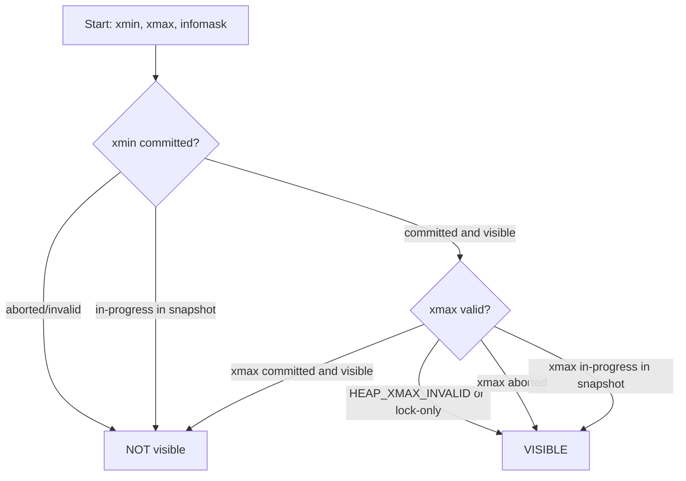
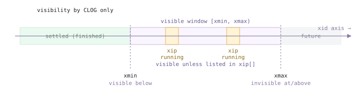
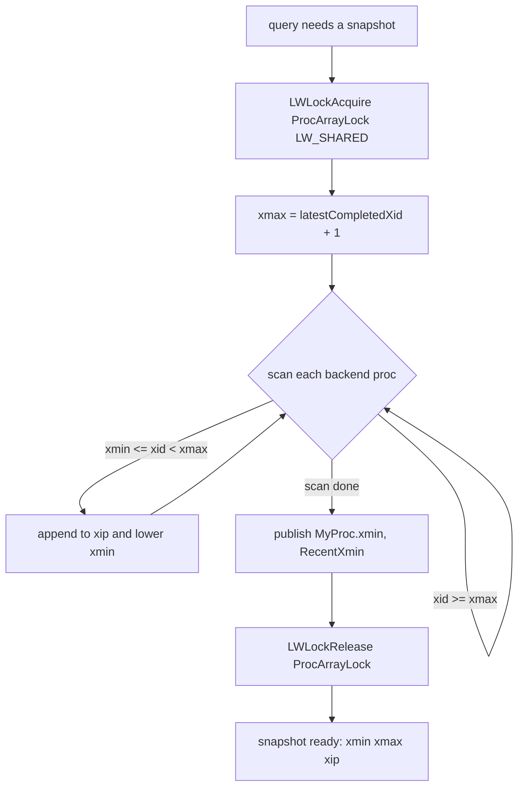
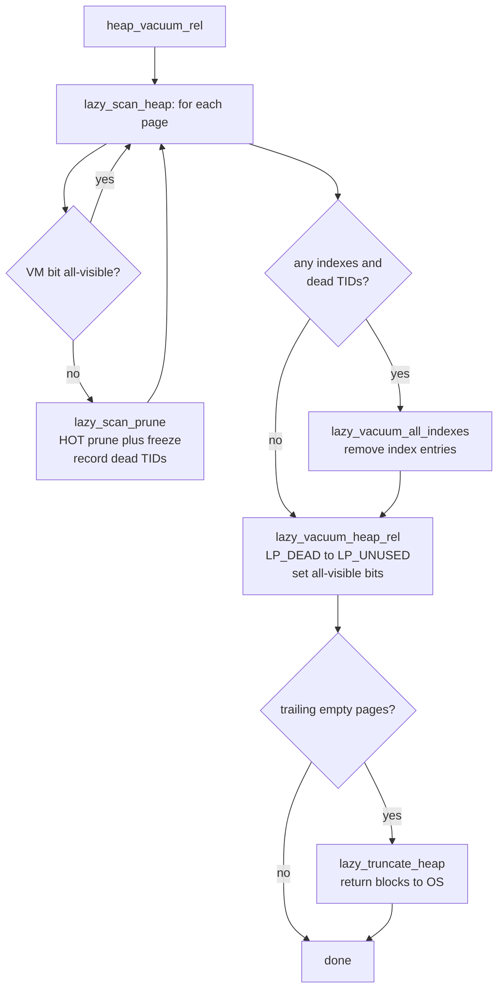
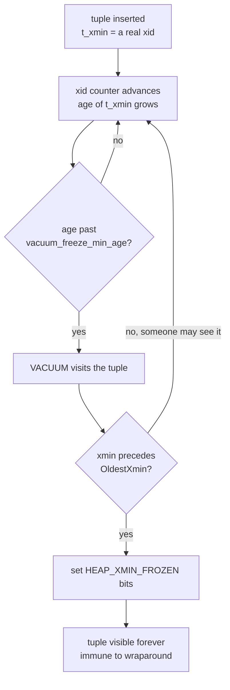
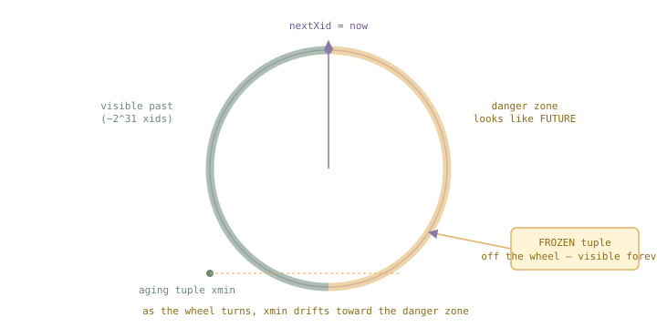
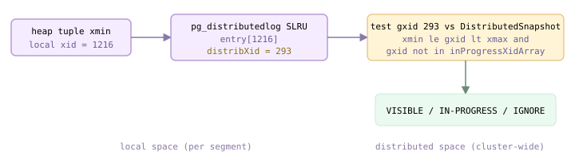
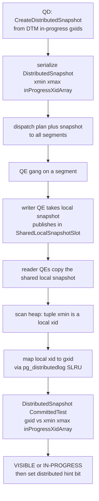

<!--
  Licensed to the Apache Software Foundation (ASF) under one
  or more contributor license agreements.  See the NOTICE file
  distributed with this work for additional information
  regarding copyright ownership.  The ASF licenses this file
  to you under the Apache License, Version 2.0 (the
  "License"); you may not use this file except in compliance
  with the License.  You may obtain a copy of the License at

    http://www.apache.org/licenses/LICENSE-2.0

  Unless required by applicable law or agreed to in writing,
  software distributed under the License is distributed on an
  "AS IS" BASIS, WITHOUT WARRANTIES OR CONDITIONS OF ANY
  KIND, either express or implied.  See the License for the
  specific language governing permissions and limitations
  under the License.
-->

import RawFigure from '../_components/RawFigure';

# 10. MVCC, Snapshots & Vacuum

## 10.1 Snapshots & Row-Version Visibility

MVCC is the reason a reader never blocks a writer and a writer never blocks a reader. The design decision behind it is the one the internal architecture chapter drew out: PostgreSQL and Greenplum use a **Steal / No-Force** buffer policy but keep **no undo log** — an `UPDATE` or `DELETE` never overwrites the old value in place. Instead a new *version* of the row is appended, the old one is left as a *dead* tuple, and the question "which version does this query see?" is answered per-tuple by a visibility test rather than by rolling anything back. This section is that test. Everything downstream in this chapter — snapshot construction ([§10.2](#102-snapshot-structure--transaction-horizon)), the removal of the dead versions (VACUUM, [§10.3](#103-vacuum--autovacuum)), and the distributed twist ([§10.5](#105-distributed-snapshots--the-distributed-log)) — hangs off it.

### 10.1.1 What a version carries, and what a snapshot is

Recall from [§4.2](../part-2-storage-data-layout/ch04.md#42-row-version-layout)/[§4.3](../part-2-storage-data-layout/ch04.md#43-operations-on-tuples) that every heap tuple header stores two transaction ids and a bag of hint bits: `t_xmin`, the xid that **created** this version; `t_xmax`, the xid that **deleted or locked** it (zero while the version is live); and `t_infomask`, whose bits cache what we later learn about those two xids. UPDATE and DELETE never touch the bytes of a committed version — they stamp `t_xmax` on the old version and (for UPDATE) write a fresh version with a new `t_xmin`. So a table on disk is a pile of versions, some live, some dead, and visibility is purely a function of `(xmin, xmax, infomask)` versus the querying transaction's view of the world.

That "view of the world" is a **snapshot**: a record of exactly which transactions had committed at the instant the snapshot was taken. Its core fields (`snapshot.h`) are `xmin` (every xid below it is definitely settled), `xmax` (every xid at or above it is definitely *not* yet visible), and `xip[]` (the xids that were still in-progress in between). A version is visible iff its creator falls on the visible side of the snapshot **and** its deleter does not.

```c title="src/include/utils/snapshot.h:159"
TransactionId xmin;   /* all XID < xmin are visible to me */
      TransactionId xmax;   /* all XID >= xmax are invisible to me */
      TransactionId *xip;   /* in-progress XIDs when snapshot taken */
      uint32        xcnt;   /* # of xact ids in xip[] */
      CommandId     curcid; /* in my xact, CID < curcid are visible */
```

### 10.1.2 The rule: HeapTupleSatisfiesMVCC

The whole test lives in `HeapTupleSatisfiesMVCC` (`heapam_visibility.c`). Read at altitude it is two questions asked in order: **is the inserting transaction visible to me?** and if so, **is the deleting transaction visible to me?** A version is shown only when the first answer is *yes* and the second is *no*.

The xmin branch. If the tuple already carries `HEAP_XMIN_COMMITTED`, the create is settled and we fall straight through. Otherwise the code decides: `HEAP_XMIN_INVALID` set means the creator aborted — the version never existed, return false. If the creator is *our own* running transaction, we defer to command ids (10.1.4). Otherwise it asks the snapshot via `XidInMVCCSnapshot`: if the creator is *in* the snapshot (still in-progress as of our view) the version is not yet visible; if it committed, we cache `HEAP_XMIN_COMMITTED` and continue; if it aborted, we cache `HEAP_XMIN_INVALID` and reject.

```c title="src/backend/access/heap/heapam_visibility.c:1055"
if (!HeapTupleHeaderXminCommitted(tuple))
      {
          if (HeapTupleHeaderXminInvalid(tuple))
              return false;                 /* creator aborted */
          ...
          else /* not ours */
          {
              snapshotCheckResult = XidInMVCCSnapshot(
                  HeapTupleHeaderGetRawXmin(tuple), snapshot, ... );
              if (snapshotCheckResult == XID_IN_SNAPSHOT)
                  return false;             /* creator not yet visible */
              else if (... TransactionIdDidCommit(...))
                  SetHintBits(tuple, buffer, relation,
                              HEAP_XMIN_COMMITTED, ...);
              else { SetHintBits(... HEAP_XMIN_INVALID ...); return false; }
          }
      }
      /* by here, the inserting transaction has committed */
```

The xmax branch. Now the creator is visible, so the version *would* be shown — unless a visible delete cancels it. If `HEAP_XMAX_INVALID` is set (or the row is only locked, not deleted) there is no delete: return true. Otherwise run the *same* snapshot test on `t_xmax`. If the deleter is still in-progress as of our snapshot, the delete has not happened for us — the version is **visible**. If the deleter committed within our view, the delete is real — the version is **invisible**. If the deleter aborted, the delete evaporates — **visible**, and we cache `HEAP_XMAX_INVALID` so nobody re-checks.

```c title="src/backend/access/heap/heapam_visibility.c:1195"
if (tuple->t_infomask & HEAP_XMAX_INVALID)  /* no valid delete */
          return true;
      if (HEAP_XMAX_IS_LOCKED_ONLY(tuple->t_infomask))
          return true;                              /* locked, not deleted */
      ...
      snapshotCheckResult = XidInMVCCSnapshot(
          HeapTupleHeaderGetRawXmax(tuple), snapshot, ... );
      if (snapshotCheckResult == XID_IN_SNAPSHOT)
          return true;                              /* deleter not visible yet */
      if (!(... TransactionIdDidCommit(...))) {
          SetHintBits(... HEAP_XMAX_INVALID ...);
          return true;                              /* deleter aborted */
      }
      return false;                                 /* delete is visible: hide row */
```

The snapshot membership test itself, `XidInMVCCSnapshot_Local` (`snapmgr.c`), is a cheap range check before any array scan: `xid < snapshot->xmin` is settled-and-visible (false = not in-progress), `xid >= snapshot->xmax` is surely-not-visible (true = in-progress), and only the gap between them is resolved against `xip[]`. This is why the two boundary fields carry so much weight — most xids are decided by a single comparison.

```c title="src/backend/utils/time/snapmgr.c:2774"
/* Any xid < xmin is not in-progress */
      if (TransactionIdPrecedes(xid, snapshot->xmin))
          return false;
      /* Any xid >= xmax is in-progress */
      if (TransactionIdFollowsOrEquals(xid, snapshot->xmax))
          return true;
      /* ...otherwise search xip[]/subxip[] */
```



*HeapTupleSatisfiesMVCC — the visibility decision for one version*

### 10.1.3 Hint bits: pay the CLOG lookup once

Resolving "did xid 1221 commit?" means consulting CLOG ([§9.3](./ch09.md#93-local-transaction-implementation)) — a shared, potentially disk-backed lookup. Doing that on every tuple of every scan would be ruinous, so the first visitor that reaches a verdict writes it back into the tuple's `t_infomask` through `SetHintBits`. Thereafter `HeapTupleHeaderXminCommitted(tuple)` is a single bit-test and the CLOG probe is skipped. Hint bits are a pure cache: never authoritative on their own (a set bit is only written *after* CLOG confirmed the outcome), and safe to lose — if the page is evicted before the hint is flushed, the next reader simply re-derives and re-sets it.

- **HEAP_XMIN_COMMITTED (0x0100)** — creator committed — trust `t_xmin` as visible-if-in-snapshot without touching CLOG
- **HEAP_XMIN_INVALID (0x0200)** — creator aborted — the version is dead on arrival
- **HEAP_XMAX_COMMITTED (0x0400)** — deleter committed — the delete is real once it's in the reader's snapshot
- **HEAP_XMAX_INVALID (0x0800)** — no valid deleter (never deleted, or deleter aborted) — xmax field is meaningless

:::note

Cloudberry adds two **distributed** hint bits in `t_infomask2` (not `t_infomask`): `HEAP_XMIN_DISTRIBUTED_SNAPSHOT_IGNORE` (0x0800) and `HEAP_XMAX_DISTRIBUTED_SNAPSHOT_IGNORE` (0x1000). On a segment, once an xid has been resolved against the *distributed* snapshot as globally settled, the bit is set so future visibility checks on that tuple skip the distributed test and fall straight to the local one — the same pay-once idea, one level up. The distributed side of the test is [§10.5](#105-distributed-snapshots--the-distributed-log).

:::

*A live row vs a deleted row on segment 0 — the delete shows up as a stamped t_xmax*

```sql
-- coordinator (:7100): two rows land on seg 0, delete one
      DELETE FROM vis WHERE id = 3;

      -- segment 0 in utility mode (:7102):
      PGOPTIONS='-c gp_role=utility' psql -p 7102 -d postgres
      SELECT lp, t_xmin, t_xmax, to_hex(t_infomask) AS infomask
      FROM heap_page_items(get_raw_page('vis',0))
      WHERE t_xmin IS NOT NULL ORDER BY lp;
```

```text {3,4} title="output"
 lp | t_xmin | t_xmax | infomask
      ----+--------+--------+----------
        1 |   1221 |      0 | 902
        2 |   1221 |   1222 | 102
        3 |   1221 |      0 | 802
        ...
        8 |   1221 |      0 | 802
      (8 rows)
```

Every version was created by xid 1221. The live rows (`lp` 1,3–8) have `t_xmax = 0` and `HEAP_XMAX_INVALID` set — `0x802` is `HEAP_XMAX_INVALID(0x800) | HEAP_HASVARWIDTH(0x02)`, and `0x902` adds `HEAP_XMIN_COMMITTED(0x100)` because a prior read already hinted that row. The deleted row `lp 2` is the exception: its `t_xmax` is stamped with the deleter 1222 and its infomask `102` has `HEAP_XMAX_INVALID` *cleared* — that is precisely the state `HeapTupleSatisfiesMVCC` reads to hide the row from any snapshot in which xid 1222 has committed.

### 10.1.4 A tale of two overlapping snapshots

The rule is easiest to feel with two sessions. Session A opens a `REPEATABLE READ` transaction and takes its snapshot; session B then inserts a new row and commits. B's insert has a `t_xmin` that is `>= A.snapshot->xmax` — it falls on the invisible side of A's frozen snapshot — so A cannot see it, no matter how many times A looks. Only a *new* snapshot, taken after B committed, includes B's xid below its `xmax` and reveals the row.

*Repeatable Read holds its snapshot; a concurrent commit is invisible until a fresh snapshot is taken*

```sql
-- Session A                       -- Session B
      BEGIN ISOLATION LEVEL
        REPEATABLE READ;
      SELECT * FROM t;
                                         INSERT INTO t VALUES (2,'bob');
      SELECT * FROM t;   -- same snapshot
      COMMIT;
      SELECT * FROM t;   -- fresh snapshot
```

```text {8,13} title="output"
-- A, first SELECT (snapshot taken):
       id |  val
      ----+-------
        1 | alice
      -- A, second SELECT (B has committed bob, but A's snapshot is unchanged):
       id |  val
      ----+-------
        1 | alice          <- bob still invisible
      -- A, after COMMIT, fresh snapshot:
       id |  val
      ----+-------
        2 | bob
        1 | alice          <- now visible
```

Same-transaction visibility is the other half, and it is *not* a snapshot question — it is a command-id question. Within one transaction a later command must see the effects of earlier ones, so when `HeapTupleSatisfiesMVCC` finds that `t_xmin` is our own current xid, it compares the tuple's `cmin` against `snapshot->curcid` instead of scanning `xip[]`. The counter advances via `CommandCounterIncrement` between statements (the combo-cid machinery that packs cmin/cmax for rows created *and* deleted in one transaction is [§4.6](../part-2-storage-data-layout/ch04.md#46-combocid)). The effect: inside a transaction, an INSERT is immediately visible to the next SELECT.

```c title="src/backend/access/heap/heapam_visibility.c:1107"
else if (TransactionIdIsCurrentTransactionId(
                   HeapTupleHeaderGetRawXmin(tuple)))
      {
          if (HeapTupleHeaderGetCmin(tuple) >= snapshot->curcid)
              return false;   /* inserted by a later command in my xact */
          ...
          return true;        /* inserted by an earlier command: visible */
      }
```

*Within one transaction, an earlier command's INSERT is visible to a later SELECT (curcid advanced by CommandCounterIncrement)*

```sql
BEGIN;
      INSERT INTO cci VALUES (100);
      SELECT * FROM cci;
      COMMIT;
```

```text {5} title="output"
BEGIN
      INSERT 0 1
       id
      -----
       100          <- own uncommitted insert, seen via cmin < curcid
      (1 row)
      COMMIT
```

So the complete answer to "which version does a query see" is: resolve `t_xmin` and `t_xmax` against the snapshot's `xmin`/`xmax`/`xip[]` (or, for our own transaction, against `curcid`), cache the CLOG verdicts in the infomask hint bits, and show the version only when its creation is visible and its deletion is not. The next section, [§10.2](#102-snapshot-structure--transaction-horizon), turns to *where the snapshot comes from* — how `GetSnapshotData` scans the procarray to compute those `xmin`/`xmax`/`xip` fields in the first place.

## 10.2 Snapshot Structure & Transaction Horizon

A tuple carries its own `xmin`/`xmax` ([§4.2](../part-2-storage-data-layout/ch04.md#42-row-version-layout)) and the commit fate of those xids lives in the CLOG (§9). But that is not enough to decide visibility: *is xmin committed as of the moment my query began?* A **snapshot** answers exactly that. It freezes the set of transactions that were still in flight at a chosen instant, so that no matter how the world changes underneath, one query — or one whole `REPEATABLE READ` transaction — keeps seeing a single, self-consistent version of the database.

Under `READ COMMITTED`, Cloudberry takes a fresh snapshot at the start of *every* SQL statement; under `REPEATABLE READ`/`SERIALIZABLE` it takes one at the first statement and reuses it for the life of the transaction (§9). This section is about what that snapshot physically *is*, how it is built by scanning every backend, and the **horizon** it holds back — the oldest xid any live snapshot still cares about, which is precisely what VACUUM ([§10.3](#103-vacuum--autovacuum)) must respect before it recycles a dead tuple.

### 10.2.1 The three-zone model: xmin, xmax, xip[]

A snapshot draws two lines on the xid axis and lists the exceptions in between. Everything reduces to three fields of `SnapshotData`:

- **`xmin`** — The lowest xid still running when the snapshot was taken. Every xid **below** `xmin` has already finished (committed or aborted) — its fate is *settled*, so visibility is decided by CLOG alone with no further searching.
- **`xmax`** — One past the highest xid that had completed — i.e. `latestCompletedXid + 1`. Every xid **at or above** `xmax` started after the snapshot and is, by definition, invisible: the future does not exist for this snapshot.
- **`xip[]` + `xcnt`** — The in-progress xids captured in the window `[xmin, xmax)` — the *holes*. An xid in this range is visible **unless** it appears in `xip[]`, in which case it was still running and its effects are hidden.

```c title="src/include/utils/snapshot.h:159"
TransactionId xmin;   /* all XID < xmin are visible to me */
      TransactionId xmax;   /* all XID >= xmax are invisible to me */
      TransactionId *xip;   /* in-progress xids, xmin <= xip[i] < xmax */
      uint32        xcnt;   /* # of xact ids in xip[] */
```

So visibility of an xid `x` is a three-way branch: `x < xmin` → *settled* (ask CLOG); `x >= xmax` → *future* (invisible); otherwise scan `xip[]` — a hit means still-running/invisible, a miss means it had committed by snapshot time. `xmin` and `xmax` exist purely as a fast path so the common case never touches the `xip[]` array. Subtransaction xids ride along in a parallel `subxip[]` (§9), and `snapshot_type` (`SNAPSHOT_MVCC` for a normal query, plus special modes like `SNAPSHOT_DIRTY` and `SNAPSHOT_NON_VACUUMABLE`) selects which visibility rules apply.



*The signature snapshot figure — the xid axis split into settled / visible-window / future, with xip[] holes*

The green zone below `xmin` needs no `xip[]` lookup; the grey zone at/above `xmax` is uniformly invisible; only the amber holes in the middle require consulting the array. This is why `pg_current_snapshot()` prints the compact triple `xmin:xmax:xip1,xip2,…` — it is the whole model on one line.

*The snapshot triple with no concurrency — an empty window, xmin == xmax*

```sql
SELECT pg_current_snapshot();
```

```text {3} title="output"
 pg_current_snapshot 
      ---------------------
       1143:1143:
      (1 row)
```

With nothing else running, `xmin == xmax` and `xip[]` is empty: every xid below the line is settled, everything at or above is future, and there is no middle. To create a hole we need a transaction that is *still running* but whose xid sits **strictly below** `xmax` — which means another transaction has to commit after it started, dragging `latestCompletedXid` (hence `xmax`) past it. Below, session A opens a transaction (xid 1213) and sleeps; session C commits (xid 1214), advancing the horizon; then session B takes a snapshot:

*A becomes a hole — B's snapshot lists xid 1213 as in-progress inside the window (segment 0, utility mode)*

```sql
-- session A:  BEGIN; INSERT ...; txid_current() -> 1213; pg_sleep(5)
      -- session C:  INSERT ...; txid_current() -> 1214;  (commits)
      -- session B:
      SELECT pg_current_snapshot();
```

```text {3} title="output"
 pg_current_snapshot 
      ---------------------
       1213:1216:1213
      (1 row)
```

B's snapshot is `xmin=1213`, `xmax=1216`, `xip=[1213]`. Transaction A (1213) is inside `[1213,1216)` but listed in `xip[]`, so its uncommitted rows are invisible to B; C (1214) is *not* in the list, so C's committed rows *are* visible. Any xid ≥ 1216 has not been seen at all. Note this ran in *utility mode* against a segment (§9): there the local procarray behaves like vanilla PostgreSQL. On the coordinator the picture is layered with a **distributed** snapshot — the subject of [§10.5](#105-distributed-snapshots--the-distributed-log).

:::note

The `pg_current_snapshot()` / `txid_current_snapshot()` textual form is the same three-zone model, but its numbers are 64-bit *full* xids (epoch·xid) so they never appear to wrap — see §9 on `FullTransactionId` versus the 32-bit `TransactionId` stored in `SnapshotData.xmin`.

:::

### 10.2.2 GetSnapshotData: scanning the ProcArray

A snapshot is not stored anywhere; it is *computed* on demand by `GetSnapshotData`, which walks the **ProcArray** — the shared-memory table where every live backend advertises its current xid. Under a shared `ProcArrayLock` (shared is enough — the array is only *read*), it fixes `xmax` from the global `latestCompletedXid`, then sweeps all backends collecting the xids that are still running into `xip[]`, tracking the minimum as `xmin`.

```c title="src/backend/storage/ipc/procarray.c:3025"
LWLockAcquire(ProcArrayLock, LW_SHARED);
      ...
      /* xmax is always latestCompletedXid + 1 */
      xmax = XidFromFullTransactionId(latest_completed);
      TransactionIdAdvance(xmax);
```

```c title="src/backend/storage/ipc/procarray.c:3188"
if (!NormalTransactionIdPrecedes(xid, xmax))
          continue;                    /* >= xmax: treated as running anyway */
      if (NormalTransactionIdPrecedes(xid, xmin))
          xmin = xid;                  /* track the oldest running xid */
      xip[count++] = xid;              /* record it as a hole */
```

Holding the lock for the scan is what makes a snapshot *stable*: the set of running xids cannot shift while it is being copied, so the query's view is internally consistent. Two backend-globals fall out of the same computation — `RecentXmin`, the `xmin` of the most recent snapshot, and `TransactionXmin`, the oldest `xmin` still in use by the current transaction, which `GetSnapshotData` also publishes into `MyProc->xmin` so the rest of the cluster can see how far back this backend still needs to look.



*GetSnapshotData — building a snapshot from the ProcArray*

### 10.2.3 The transaction horizon

Every backend running a query advertises the `xmin` of the oldest snapshot it still holds. The **oldest** such `xmin` across the whole ProcArray is the *transaction horizon*: no live transaction can see any row that died before it, so any tuple deleted by a transaction that committed below the horizon is dead **to everyone** and safe to remove. This is the contract VACUUM ([§10.3](#103-vacuum--autovacuum)) lives by. The horizon is computed by `ComputeXidHorizons`, which folds every backend's `xmin` into a set of `*_oldest_nonremovable` bounds:

```c title="src/backend/storage/ipc/procarray.c:1958"
h->shared_oldest_nonremovable =
          TransactionIdOlder(h->shared_oldest_nonremovable, xmin);
      ...
      h->data_oldest_nonremovable =
          TransactionIdOlder(h->data_oldest_nonremovable, xmin);
```

There are several horizons because scope differs: shared catalogs must consider backends in *all* databases, while ordinary (`data`) tables only need backends in the current one. A single old snapshot — a forgotten `BEGIN` that has taken a snapshot and gone idle — holds the horizon back for the entire cluster and blocks tuple removal, which is the classic cause of table bloat. You can watch the horizon directly: `pg_stat_activity.backend_xmin` is each backend's advertised `xmin`.

*The held-back horizon — an idle REPEATABLE READ transaction pins backend_xmin (coordinator :7100)*

```sql
-- session A:  BEGIN ISOLATION LEVEL REPEATABLE READ;
      --             SELECT count(*) FROM pg_class;   -- pins a snapshot
      --             pg_sleep(...)
      SELECT pid, state, backend_xmin, now()-xact_start AS held_for
        FROM pg_stat_activity
       WHERE backend_xmin IS NOT NULL
       ORDER BY xact_start;
```

```text {3} title="output"
 pid  | state  | backend_xmin |   held_for    
      ------+--------+--------------+---------------
       4325 | active |     1149   | 00:00:01.50
       4333 | active |      1149    | 00:00:00
      (1 row shown)
```

Backend 4325 has held `backend_xmin = 1149` for over a second: while it stays open, VACUUM cannot reclaim any tuple that became dead at or after xid 1149, no matter how long ago it died. The horizon is only ever as old as the oldest live snapshot.

### 10.2.4 Catalog snapshots: why DDL is seen immediately

There is a deliberate exception to snapshot isolation. If catalog scans used your query's MVCC snapshot, then under `REPEATABLE READ` a table altered by a *committed* concurrent transaction would still be read through its old catalog rows — you could plan against a column that no longer exists. Instead, catalog lookups use a separate, always-current **catalog snapshot** taken by `GetCatalogSnapshot`, cached in `CatalogSnapshot` and thrown away the moment a relevant catalog change fires an invalidation.

```c title="src/backend/utils/time/snapmgr.c:481"
if (CatalogSnapshot == NULL)
      {
          /* Get new snapshot. */
          CatalogSnapshot = GetSnapshotData(&CatalogSnapshotData,
                                            distributedTransactionContext);
          ...
      }
      return CatalogSnapshot;
```

Because it is invalidated (via `InvalidateCatalogSnapshot`) on every catalog change and rebuilt lazily, the catalog snapshot always reflects the *latest* committed DDL — even inside a long-running `REPEATABLE READ` transaction whose data view is frozen. That is why a newly added column or a fresh index becomes usable at once, while your table *data* still obeys the transaction's original snapshot.

### 10.2.5 Exporting a snapshot

Two independent backends normally each compute their own snapshot at slightly different instants, so they never share exactly one view. For consistent parallel work — the canonical case is parallel `pg_dump`, where several worker connections must dump *the same* database state — a snapshot can be *exported*. `pg_export_snapshot()` (backed by `ExportSnapshot`) writes the current snapshot to a file and returns a token; another transaction then adopts it with `SET TRANSACTION SNAPSHOT '<token>'`.

```c title="src/backend/utils/time/snapmgr.c:1250"
char *
      ExportSnapshot(Snapshot snapshot)
      {
          ...
          /* The basename of the file is what we return from pg_export_snapshot(). */
      }
```

*Exporting a snapshot returns a shareable token*

```sql
BEGIN ISOLATION LEVEL REPEATABLE READ;
      SELECT pg_export_snapshot();
      COMMIT;
```

```text {3} title="output"
 pg_export_snapshot  
      ---------------------
       00000008-0000002A-1
      (1 row)
```

The token encodes the source transaction and a sequence number; another session running `SET TRANSACTION SNAPSHOT '00000008-0000002A-1'` imports the exact `xmin`/`xmax`/`xip[]` triple and therefore sees an identical database state. The exporting transaction must stay open long enough for importers to attach — while it lives, its snapshot also pins the horizon, so exported snapshots, like any other, hold VACUUM back for their lifetime.

:::note

In an MPP cluster this same idea scales up: the coordinator must give *every* segment one agreed-upon view of the distributed transaction state, which it does by building a distributed snapshot and dispatching it — the coordinator-to-segment analogue of snapshot export. That mechanism is [§10.5](#105-distributed-snapshots--the-distributed-log).

:::

## 10.3 Vacuum & Autovacuum

MVCC never overwrites a row in place. Every `UPDATE` leaves the old version behind and inserts a new one; every `DELETE` merely stamps `xmax`; even an aborted `INSERT` leaves a tuple whose `xmin` will never commit ([§4.3](../part-2-storage-data-layout/ch04.md#43-operations-on-tuples)). Once no live snapshot can still see such a tuple it is **dead** — pure waste that inflates the heap and its indexes. **Vacuum** is the garbage collector that reclaims that space *for reuse inside the relation*. It is important to be precise here: lazy `VACUUM` returns free space to the table's own free-space map, not to the operating system — shrinking a file back to the OS is `VACUUM FULL`/`CLUSTER`, covered in [§10.6](#106-rebuilding-tables--indexes).

The visibility rule is `HeapTupleSatisfiesVacuum`: a tuple may be removed only when its `xmax` committed *and* precedes the **removable cutoff** (the oldest xmin any running transaction could need, from `ComputeXidHorizons`, [§10.4](#104-freezing--xid-wraparound)). Anything younger is *recently dead* — dead, but not yet removable.

### 10.3.1 The lazy-vacuum phases

`VACUUM t` funnels through `vacuum_rel` → the table AM's `relation_vacuum` callback, which for heap is `heap_vacuum_rel`. That sets up an `LVRelState` and calls `lazy_scan_heap`, the heart of the process. The work proceeds in up to four phases.

```c title="src/backend/access/heap/vacuumlazy.c:327"
void
      heap_vacuum_rel(Relation rel, VacuumParams *params,
                      BufferAccessStrategy bstrategy)
      {
          LVRelState *vacrel;
          ...
          lazy_scan_heap(vacrel);          /* phases 1-3 */
          if (should_attempt_truncation(vacrel))
              lazy_truncate_heap(vacrel);  /* phase 4 */
```

**Phase 1 — heap scan.** `lazy_scan_heap` walks the relation block by block. For each page it takes a cleanup lock and calls `lazy_scan_prune`, which does opportunistic **HOT pruning** ([§4.5](../part-2-storage-data-layout/ch04.md#45-page-pruning--hot-updates)) — collapsing HOT chains and turning fully-dead tuples into `LP_DEAD` line pointers — then freezes old tuples and records the dead item TIDs into a `dead_items` array. The crucial optimization: pages the **visibility map** marks `all-visible` are skipped entirely, because a page with no dead tuples has nothing to clean.

**Phase 2 — index vacuum.** Dead heap TIDs are still pointed at by index entries, so before those line pointers can be freed every index must be swept. `lazy_vacuum_all_indexes` calls each index AM's bulk-delete to remove entries referencing the dead TIDs. This phase is skipped when there are no indexes, or when pruning already left nothing to remove.

```c title="src/backend/access/heap/vacuumlazy.c:2340"
static bool
      lazy_vacuum_all_indexes(LVRelState *vacrel)
      {
          ...
          pgstat_progress_update_param(PROGRESS_VACUUM_PHASE,
                                       PROGRESS_VACUUM_PHASE_VACUUM_INDEX);
```

**Phase 3 — heap vacuum.** Only now, with no index still pointing at them, `lazy_vacuum_heap_rel` revisits the recorded pages and turns each `LP_DEAD` line pointer into `LP_UNUSED`, physically reclaiming the slot and updating the free-space and visibility maps. Pages that become entirely clean get their `all-visible` VM bit set.

**Phase 4 — truncation.** If the scan found a run of empty pages at the *end* of the relation, `lazy_truncate_heap` takes a brief access-exclusive lock and lops them off, returning those trailing blocks to the OS. This is the one part of lazy vacuum that shrinks the file, and it only ever affects the tail.



*Lazy-vacuum control flow — the VM-skip branch short-circuits clean pages*

### 10.3.2 The visibility map

The visibility map is a tiny fork alongside each heap, holding **two bits per heap page** (`BITS_PER_HEAPBLOCK`). It is maintained by `visibilitymap.c` and read via `visibilitymap_get_status`. The two bits carry the entire optimization budget of vacuum.

- **ALL_VISIBLE (`0x01`)** — Every tuple on the page is visible to all current and future transactions. Vacuum skips the page; index-only scans may answer from the index without a heap fetch.
- **ALL_FROZEN (`0x02`)** — Every tuple is frozen ([§10.2](#102-snapshot-structure--transaction-horizon)) as well. Even an anti-wraparound vacuum can skip the page, since nothing on it will ever need freezing again.

<RawFigure html={"<div style=\"max-width:720px;margin:2px auto;font:11px/1.4 ui-monospace,SFMono-Regular,Menlo,monospace;color:#1f2328;overflow-x:auto\"><div style=\"min-width:560px\"><div style=\"text-align:center;color:#8a7aa8;font-size:10px;padding:1px\">↑ one VM byte = 4 heap pages ↑</div><div style=\"display:flex;gap:2px\"><div style=\"flex:1;border:1px solid #cdb4db;background:#f5edff;text-align:center;padding:5px 2px\">page 0<br>FRZ VIS</div><div style=\"flex:1;border:1px solid #cdb4db;background:#f5edff;text-align:center;padding:5px 2px\">page 1<br>FRZ VIS</div><div style=\"flex:1;border:1px solid #cdb4db;background:#f5edff;text-align:center;padding:5px 2px\">page 2<br>FRZ VIS</div><div style=\"flex:1;border:1px solid #cdb4db;background:#f5edff;text-align:center;padding:5px 2px\">page 3<br>FRZ VIS</div></div><div style=\"display:flex;gap:2px;margin-top:2px\"><div style=\"flex:1;border:1px solid #e0b365;background:#fff4d6;text-align:center;padding:5px 2px;color:#8a6d1a\">0&nbsp;&nbsp;1</div><div style=\"flex:1;border:1px solid #e0b365;background:#fff4d6;text-align:center;padding:5px 2px;color:#8a6d1a\">1&nbsp;&nbsp;1</div><div style=\"flex:1;border:1px solid #cdb4db;background:#f4f5f6;text-align:center;padding:5px 2px;color:#8a939c\">0&nbsp;&nbsp;0</div><div style=\"flex:1;border:1px solid #e0b365;background:#fff4d6;text-align:center;padding:5px 2px;color:#8a6d1a\">0&nbsp;&nbsp;1</div></div><div style=\"text-align:center;color:#8a7aa8;font-size:10px;padding:2px\">bit layout per page: VISIBLE=0x01, FROZEN=0x02 — grey page = dirty, vacuum must visit it</div></div></div>"} caption={"Visibility map — 2 bits per heap page, packed 4 pages to a byte"} />

### 10.3.3 Vacuum in action

Build a heap table, delete half of it, and ask each segment's `pg_stat_user_tables` how many dead tuples resulted. (Statistics live per-segment; sum across `gp_dist_random`.)

*After deleting half the rows, half are dead*

```sql
CREATE TABLE vac_demo2 (id int, pad text) DISTRIBUTED BY (id);
      INSERT INTO vac_demo2 SELECT g, repeat('x',100) FROM generate_series(1,100000) g;
      DELETE FROM vac_demo2 WHERE id % 2 = 0;
      SELECT sum(n_live_tup) AS n_live_tup, sum(n_dead_tup) AS n_dead_tup
      FROM gp_dist_random('pg_stat_user_tables') WHERE relname='vac_demo2';
```

```text {5} title="output"
INSERT 0 100000
      DELETE 50000
       n_live_tup | n_dead_tup
      ------------+------------
            50000 |      50000
```

Now vacuum. To read a single, undiluted `VERBOSE` report we run it on one segment in utility mode (§9); the coordinator would fan the same work out to every segment. Note the VM check before and after — the deleted pages go from *none* all-visible to *all*.

*VACUUM VERBOSE reclaims the dead line pointers and sets every all-visible bit (segment 0, utility mode, port 7102)*

```sql
SELECT count(*) FILTER (WHERE all_visible) AS all_visible_pages,
             count(*) AS total_pages FROM pg_visibility_map('vac_demo2');
      VACUUM (VERBOSE) vac_demo2;
      SELECT count(*) FILTER (WHERE all_visible) AS all_visible_pages,
             count(*) AS total_pages FROM pg_visibility_map('vac_demo2');
```

```text {3,8,16} title="output"
 all_visible_pages | total_pages
      -------------------+-------------
                       0 |         144

      INFO:  vacuuming "postgres.public.vac_demo2"
      INFO:  finished vacuuming "postgres.public.vac_demo2": index scans: 0
      pages: 0 removed, 144 remain, 144 scanned (100.00% of total)
      tuples: 16725 removed, 16737 remain, 0 are dead but not yet removable
      removable cutoff: 1163, which was 3 XIDs old when operation ended
      index scan not needed: 144 pages ... had 16725 dead item identifiers removed
      ...
      VACUUM

       all_visible_pages | total_pages
      -------------------+-------------
                     144 |         144
```

:::note

`index scans: 0` / `index scan not needed` appears because **vac_demo2** has no indexes, so phase 2 is skipped and the LP_DEAD items go straight to LP_UNUSED. Add an index and the report gains an `index scan needed` line and non-zero `index scans`. The 16725 figure is this one segment's share of the 50000 deleted rows.

:::

### 10.3.4 Autovacuum — and how Cloudberry restricts it

`VACUUM` need not be run by hand. The **autovacuum** subsystem (`autovacuum.c`) runs a *launcher* that periodically wakes and forks per-database *workers*; a worker scans `pg_class`/`pg_stat`, and `relation_needs_vacanalyze` decides each table's fate. A table qualifies for vacuum once its dead-tuple count exceeds `autovacuum_vacuum_threshold + autovacuum_vacuum_scale_factor × reltuples` — with defaults `50` and `0.2`, roughly 20% churn.

:::note

**CBDB caveat — verified against source, not upstream.** Cloudberry inherits Greenplum's stance: there is **no distributed autovacuum**. Workers run on each segment independently and locally. Critically, in `relation_needs_vacanalyze` autovacuum **VACUUM is only enabled for catalog (system) tables** — user heaps are left for the DBA or anti-wraparound: `if (!IsSystemClass(relid, classForm) &amp;&amp; !force_vacuum) *dovacuum = false;`. The reasoning is in the file header: bloat is even across segments for catalogs but not for OLTP user tables, so a global-vs-local vacuum decision would fire needless per-segment vacuums.

:::

```c title="src/backend/postmaster/autovacuum.c:3376"
/*
       * GPDB: Autovacuum VACUUM is only enabled for catalog tables. (But ignore
       * if at risk of wrap around and proceed to vacuum)
       */
      if (!IsSystemClass(relid, classForm) && !force_vacuum)
          *dovacuum = false;
```

Two further Cloudberry facts fall out of the same file: **anti-wraparound** vacuum still fires on any table whose `relfrozenxid` crosses `autovacuum_freeze_max_age` (`force_vacuum` overrides the catalog-only rule), and **AO/AOCO tables are exempt** from wraparound vacuum entirely — they carry no per-tuple xids, so their `relfrozenxid` is `InvalidTransactionId`; AO reclaims space through *compaction* instead ([§5.5](../part-2-storage-data-layout/ch05.md#55-vacuum--compaction)). Auto-**ANALYZE**, by contrast, is driven from the coordinator (`Gp_role == GP_ROLE_DISPATCH`).

*What autovacuum does — and doesn't — touch on Cloudberry*

| Relation | Auto VACUUM | Anti-wraparound | Auto ANALYZE |
| --- | --- | --- | --- |
| Catalog / system tables | yes (threshold) | yes | n/a |
| User heap tables | **no** (DBA/manual) | yes | yes (from QD) |
| AO / AOCO tables | no (compaction, [§5.5](../part-2-storage-data-layout/ch05.md#55-vacuum--compaction)) | exempt (no xids) | yes (from QD) |

### 10.3.5 Throttling and monitoring

Vacuum can throttle itself so it does not starve foreground work: it accumulates a cost per buffer touched and, when the budget is spent, sleeps for `vacuum_cost_delay` (autovacuum uses `autovacuum_vacuum_cost_delay`). The demo build ships with `vacuum_cost_delay = 0`, i.e. cost-based delay off for manual vacuum.

Two views make vacuum observable. `pg_stat_user_tables` reports the standing state — `n_dead_tup`, `n_live_tup`, `last_vacuum`, `last_autovacuum` — and drives the autovacuum threshold. `pg_stat_progress_vacuum` reports a *running* vacuum live: its current phase (matching the phases above), heap blocks total vs. scanned, and dead tuples collected.

*The GUCs that govern vacuum on this build (coordinator, port 7100)*

```sql
SELECT name, setting FROM pg_settings
      WHERE name IN ('autovacuum','autovacuum_vacuum_threshold',
        'autovacuum_vacuum_scale_factor','vacuum_cost_delay','autovacuum_freeze_max_age');
```

```text {3,7} title="output"
              name              |  setting
      --------------------------------+-----------
       autovacuum                     | on
       autovacuum_freeze_max_age      | 200000000
       autovacuum_vacuum_scale_factor | 0.2
       autovacuum_vacuum_threshold    | 50
       vacuum_cost_delay              | 0
```

So on a stock Cloudberry cluster `autovacuum` is *on*, but for your own tables it is effectively an anti-wraparound and auto-analyze service — routine dead-tuple reclamation of user heaps remains a scheduled `VACUUM`. What lazy vacuum can *never* do — hand free space back to the OS — is the subject of [§10.6](#106-rebuilding-tables--indexes).

## 10.4 Freezing & XID Wraparound

### 10.4.1 The 32-bit clock that runs out

A `TransactionId` is a 32-bit counter ([§9.2](./ch09.md#92-the-transaction-manager)). Visibility never asks *what number* an xid is — it asks *is A before B?* — and that comparison is made on a **circle** of 2^32 values, not a line. `TransactionIdPrecedes(a,b)` treats the newest ~2^31 xids behind `nextXid` as **past** and the other half as **future** (`transam.h` defines `MaxTransactionId 0xFFFFFFFF`, and the comparison ultimately uses the signed difference of the two ids).

That works only as long as every live tuple's `xmin` stays within the visible-past half of the circle. Let the counter advance by more than ~2^31 xids past a tuple's `xmin` and the wheel turns: the tuple's committed, forever-visible `xmin` now falls in the *future* half. To every backend it looks like a transaction that has not happened yet — the row silently **vanishes**. This is XID **wraparound**, and it is a correctness catastrophe, not a performance one.

```c title="src/include/access/transam.h:33"
#define FrozenTransactionId       ((TransactionId) 2)
      #define FirstNormalTransactionId  ((TransactionId) 3)
      #define MaxTransactionId          ((TransactionId) 0xFFFFFFFF)
      /* the circular comparison the whole system relies on */
      extern bool TransactionIdPrecedes(TransactionId id1, TransactionId id2);
```

:::note

PostgreSQL/CBDB now tracks the counter internally as a 64-bit **FullTransactionId** ([§9.2](./ch09.md#92-the-transaction-manager)) so an in-memory xid can never be ambiguous. But the on-disk tuple header still stores a bare 32-bit `t_xmin`/`t_xmax` — there is no room for 64 bits in every row. So the wheel is still a wheel on disk, and freezing is still mandatory.

:::

### 10.4.2 The fix: freezing

The escape is to take a tuple that *everyone* can already see — its `xmin` precedes the oldest snapshot anyone could hold — and stamp it as **permanently visible**, removing it from the aging window entirely. Historically VACUUM rewrote such a tuple's `xmin` to the sentinel **`FrozenTransactionId` (2)**, which `TransactionIdPrecedes` treats as older than every normal xid. Modern PostgreSQL/CBDB leaves the original xid in place and instead sets the **`HEAP_XMIN_FROZEN`** infomask bits — the combination `HEAP_XMIN_COMMITTED | HEAP_XMIN_INVALID`, a pattern that is otherwise nonsensical and so is safe to overload as *frozen*.

```c title="src/include/access/htup_details.h:205"
#define HEAP_XMIN_COMMITTED  0x0100  /* t_xmin committed */
      #define HEAP_XMIN_INVALID    0x0200  /* t_xmin invalid/aborted */
      #define HEAP_XMIN_FROZEN     (HEAP_XMIN_COMMITTED|HEAP_XMIN_INVALID)
      /* HeapTupleHeaderXminFrozen(tup): both bits set -> visible to all */
```

The decision is made per tuple in `heap_prepare_freeze_tuple`. A tuple's `xmin` is frozen exactly when it precedes the vacuum's `OldestXmin` horizon ([§10.2](#102-snapshot-structure--transaction-horizon)) — i.e. when no snapshot alive anywhere could still need to test that xid. If it qualifies, VACUUM emits a freeze plan that sets the frozen bits; the raw xid stays for forensics but is no longer consulted for visibility.

```c title="src/backend/access/heap/heapam.c:6983"
xid = HeapTupleHeaderGetXmin(tuple);
      if (!TransactionIdIsNormal(xid))
          xmin_already_frozen = true;               /* xid 2, already frozen */
      else {
          /* freeze iff nobody can still be looking at this xid */
          freeze_xmin = TransactionIdPrecedes(xid, cutoffs->OldestXmin);
          if (freeze_xmin)
              frz->checkflags |= HEAP_FREEZE_CHECK_XMIN_COMMITTED;
      }
```



*How one live tuple survives the wheel: from a normal xid to frozen.*

### 10.4.3 Bookkeeping: relfrozenxid, datfrozenxid and age

The database does not scan every row to know how close it is to the edge. Each table records `pg_class.relfrozenxid` — the oldest un-frozen `xmin` that could still be in it — and each database rolls those up into `pg_database.datfrozenxid`. The distance from `nextXid` back to one of those values is its **`age`**: `age(relfrozenxid)` is how many xids have been consumed since the table's oldest un-frozen row. When any table's age approaches 2^31, the whole database is in danger.

Vacuum computes its cutoffs in `vacuum_get_cutoffs`. `FreezeLimit = nextXID - freeze_min_age` (`vacuum_freeze_min_age`, default 50M) marks tuples *old enough to bother freezing*; it is clamped so it can never exceed `OldestXmin`. `VACUUM FREEZE` simply forces `freeze_min_age = 0`, so every tuple that precedes `OldestXmin` is frozen.

```c title="src/backend/commands/vacuum.c:1526"
if (freeze_min_age < 0)
          freeze_min_age = vacuum_freeze_min_age;                 /* default 50M */
      freeze_min_age = Min(freeze_min_age, autovacuum_freeze_max_age / 2);
      cutoffs->FreezeLimit = nextXID - freeze_min_age;
      /* FreezeLimit must always be <= OldestXmin */
      if (TransactionIdPrecedes(cutoffs->OldestXmin, cutoffs->FreezeLimit))
          cutoffs->FreezeLimit = cutoffs->OldestXmin;
```

- **`vacuum_freeze_min_age`** — Freeze a tuple only once its `xmin` is this many xids old (default 50,000,000). Below this, VACUUM leaves it alone to avoid re-freezing churn.
- **`autovacuum_freeze_max_age`** — When a table's `age(relfrozenxid)` crosses this (default 200,000,000), an **anti-wraparound autovacuum** is *forced* on it — it runs even if autovacuum is otherwise disabled, and even against a superuser trying to turn it off. This is the safety net.
- **Aggressive vacuum** — A normal vacuum skips pages the visibility map marks all-visible. An **aggressive** vacuum (triggered by `freeze_table_age`, or by the anti-wraparound path) scans even those pages so it can freeze the tuples on them and actually advance `relfrozenxid`.
- **`vacuum_failsafe_age`** — The last line of defence (default 1.6B). Once a table is this old, VACUUM enters **failsafe** mode: it skips index vacuuming and cost delays and races to freeze the heap, because getting under the wraparound line now matters more than reclaiming index space.

```c title="src/backend/commands/vacuum.c:1626"
/* failsafe: skip index vacuum to freeze faster when dangerously old */
      skip_index_vacuum = Max(vacuum_failsafe_age, autovacuum_freeze_max_age * 1.05);
      xid_skip_limit = ReadNextTransactionId() - skip_index_vacuum;
      if (TransactionIdPrecedes(relfrozenxid, xid_skip_limit))
          return true;   /* the table's relfrozenxid is too old */
```



*The xid-space circle: nextXid is 'now'; the green arc is the visible past; a tuple that ages past the danger zone would reappear in the 'future' — freezing pins it outside the wheel entirely.*

### 10.4.4 Watching it happen (segment 0, :7102)

`age(relfrozenxid)` is the number every DBA should chart. A freshly written table is age 0; databases accumulate age between vacuums:

*How old is the oldest un-frozen xid, per table and per database.*

```sql
SELECT relname, age(relfrozenxid) FROM pg_class WHERE relname='t';
      SELECT datname, age(datfrozenxid) AS age FROM pg_database ORDER BY 2 DESC;
```

```text {3,8,9,10} title="output"
  relname | age
       ---------+-----
        t       |   1
       (1 row)

         datname  | age
       -----------+------
        postgres  | 247
        template0 | 247
        template1 | 190
       (3 rows)
```

Now watch a freeze on the heap itself. On segment 0 (utility mode, [§10.1](#101-snapshots--row-version-visibility)) we insert three rows, advance the counter in a few separate transactions so the rows age past `OldestXmin`, then `VACUUM FREEZE`. `heap_page_items` shows the change directly in the tuple header:

*Before freeze: t_xmin is a real xid (1196); infomask has only HEAP_XMAX_INVALID (0x800).*

```sql
PGOPTIONS='-c gp_role=utility' psql -p 7102 -d postgres
      -- table created + 3 rows inserted, then a few xids consumed in other txns
      SELECT lp, t_xmin, t_infomask FROM heap_page_items(get_raw_page('t',0))
       WHERE lp_off > 0;
```

```text {3,4,5} title="output"
 lp | t_xmin | t_infomask
       ----+--------+------------
        1 |  1196 |      2048
        2 |  1196 |      2048
        3 |  1196 |      2048
       (3 rows)
```

*After VACUUM FREEZE: xid is unchanged, but infomask now carries HEAP_XMIN_FROZEN (0xB00 = 0x300 | 0x800).*

```sql
VACUUM FREEZE t;
      SELECT lp, t_xmin, t_infomask,
             heap_tuple_infomask_flags(t_infomask, t_infomask2)
      FROM heap_page_items(get_raw_page('t',0)) WHERE lp_off > 0;
```

```text {3} title="output"
 lp | t_xmin | t_infomask |            heap_tuple_infomask_flags
       ----+--------+------------+--------------------------------------------------
        1 |  1196 |      2816 | ("{HEAP_XMIN_COMMITTED,HEAP_XMIN_INVALID,HEAP_XMAX_INVALID}",{HEAP_XMIN_FROZEN})
        2 |  1196 |      2816 | ("{HEAP_XMIN_COMMITTED,HEAP_XMIN_INVALID,HEAP_XMAX_INVALID}",{HEAP_XMIN_FROZEN})
        3 |  1196 |      2816 | ("{HEAP_XMIN_COMMITTED,HEAP_XMIN_INVALID,HEAP_XMAX_INVALID}",{HEAP_XMIN_FROZEN})
       (3 rows)
```

Two things to notice. The `t_xmin` value is **still 1196** — modern freezing does not overwrite the xid, it flips the infomask, so `HEAP_XMIN_COMMITTED` and `HEAP_XMIN_INVALID` are *both* set (the `HEAP_XMIN_FROZEN` pattern the decoder helpfully names). From now on visibility sees these rows as unconditionally live, regardless of how far the wheel turns. The default forced-vacuum threshold on this build:

*The anti-wraparound trigger, confirmed on this cluster.*

```sql
SHOW autovacuum_freeze_max_age;
```

```text {3} title="output"
 autovacuum_freeze_max_age
       ---------------------------
        200000000
       (1 row)
```

:::note

During the demo, running `VACUUM FREEZE` in the *same* session that inserted the rows did nothing — the rows did not freeze. That is not a bug: `OldestXmin` was held back by the session's own transaction horizon, so `TransactionIdPrecedes(xid, OldestXmin)` was false. Freezing needs the row to be older than what *anyone* could still see; a long-running transaction (or idle-in-transaction backend) that pins `OldestXmin` will stall freezing across the whole cluster — one of the most common causes of creeping wraparound risk.

:::

### 10.4.5 Wraparound is per-segment in an MPP cluster

Every segment runs its own procarray, assigns its own local xids, and keeps its own `pg_class.relfrozenxid` / `pg_database.datfrozenxid` (the coordinator has its own too). The counters advance at *different rates* — a segment that owns the hot end of a hash-distributed table burns xids far faster than its peers. So wraparound risk is a **per-segment** property: the cluster is only as safe as its oldest segment.

That means age must be monitored on **all** segments, not just the coordinator. A coordinator-only `age(datfrozenxid)` check can read comfortably low while one segment is quietly approaching `autovacuum_freeze_max_age`. Query each segment (utility mode, or via `gp_dist_random('pg_class')`) and alert on the maximum age across the fleet, not the average.

:::note

Anti-wraparound autovacuum fires independently on each segment as its own tables cross the threshold, so the system usually self-heals per segment. The failure mode to guard against is a cluster-wide blocker — a stuck prepared 2PC transaction (§12) or a stale replication slot — that pins `OldestXmin` everywhere at once and prevents any segment from advancing its `relfrozenxid`.

:::

## 10.5 Distributed Snapshots & the Distributed Log

Everything so far in this chapter — `xmin`/`xmax`/`xip[]`, the visibility map, pruning — has been described from the vantage point of a **single PostgreSQL instance**. In Cloudberry that instance is one *segment*, and each segment runs its own procarray, mints its own local xids, and takes its own local snapshots ([§9.2](./ch09.md#92-the-transaction-manager), [§9.3](./ch09.md#93-local-transaction-implementation)). The counters are **unrelated across segments**: local xid `1216` on segment 0 has nothing to do with local xid `1216` on segment 1. A statement that touches rows on several segments is *one* distributed transaction spread over several **independent** local transactions.

That independence is the whole problem. If each segment answered visibility questions with nothing but its own local snapshot, the cluster could show a **torn** view: a distributed transaction that has committed its local part on segment 0 but not yet on segment 2 would look committed to a reader on segment 0 and in-progress to a reader on segment 2 — the same distributed transaction, half visible. To make the cluster behave like one MVCC database, Cloudberry adds a second layer of snapshotting keyed on the **distributed transaction id** (`gxid`), built once by the coordinator and dispatched to every segment.

### 10.5.1 The distributed snapshot

A distributed snapshot is the exact analogue of a local snapshot ([§9.3](./ch09.md#93-local-transaction-implementation)), but over `gxid`s instead of local `xid`s. It is built on the coordinator (QD) by `CreateDistributedSnapshot()` from the distributed transaction manager's in-progress set, then serialized and shipped to the segments alongside the plan.

```c title="src/include/cdb/cdbdistributedsnapshot.h:22"
typedef struct DistributedSnapshot
      {
          DistributedTransactionId xminAllDistributedSnapshots;
          DistributedSnapshotId    distribSnapshotId;
          DistributedTransactionId xmin;  /* gxid < xmin are visible to me */
          DistributedTransactionId xmax;  /* gxid >= xmax are invisible to me */
          int32                    count; /* # of gxids in inProgressXidArray */
          DistributedTransactionId *inProgressXidArray;
      } DistributedSnapshot;
```

Read it against the local `SnapshotData` from [§9.3](./ch09.md#93-local-transaction-implementation) and the mapping is one-to-one: `xmin`/`xmax` bound the range, `inProgressXidArray` is the distributed `xip[]`, and `count` its length. `xmax` is set to `latestCompletedGxid + 1` — anything at or above it started after this snapshot and is invisible; anything below `xmin` had already completed and is settled.

```c title="src/backend/storage/ipc/procarray.c:2647"
xmin = xmax = ShmemVariableCache->latestCompletedGxid + 1;
      /* ... scan allTmGxact[] for in-progress gxids, filling
         inProgressXidArray[] and lowering xmin ... */
```

`xminAllDistributedSnapshots` is the cluster-wide horizon — the oldest `gxid` any live distributed snapshot still cares about. It is the distributed cousin of the global xmin from [§10.2](#102-snapshot-structure--transaction-horizon), and it is what lets segments eventually *forget* old distributed-commit records ([§10.5](#105-distributed-snapshots--the-distributed-log).4).

### 10.5.2 pg_distributedlog: local xid → distributed xid

A segment doing a visibility test starts with a **local** xid — it read it out of a heap tuple's `xmin`/`xmax` ([§4.2](../part-2-storage-data-layout/ch04.md#42-row-version-layout)). To judge that tuple against the *distributed* snapshot it must first answer: *which `gxid` does this local xid belong to, and did that `gxid` commit?* That reverse lookup is what `pg_distributedlog` provides. It is an SLRU, one per segment, mapping every local xid to the `gxid` it was part of (and thus its distributed-commit status).

The map is populated at commit time. When a distributed transaction commits on a segment, `DistributedLog_SetCommittedTree()` stamps the committing local xid — and all its subtransaction xids — with the `gxid`, mirroring the way `TransactionIdSetTreeStatus()` writes CLOG ([§9.4](./ch09.md#94-isolation-levels--anomalies)):

```c title="src/backend/access/transam/distributedlog.c:452"
void
      DistributedLog_SetCommittedTree(TransactionId xid, int nxids,
              TransactionId *xids, DistributedTransactionId distribXid,
              bool isRedo)
      {
          if (!IS_QUERY_DISPATCHER())
          {
              DistributedLog_SetCommittedWithinAPage(1, &xid, distribXid, isRedo);
              DistributedLog_SetCommittedByPages(nxids, xids, distribXid, isRedo);
          }
      }
```



*Resolving a local xid to its distributed verdict through pg_distributedlog*

### 10.5.3 The committed test, and where visibility calls it

On a segment, `HeapTupleSatisfiesMVCC` still runs the ordinary local checks from [§10.1](#101-snapshots--row-version-visibility), but for a committed xid it also asks whether that xid is visible in the **distributed** snapshot. `snapmgr.c` performs a cheap short-circuit first — if the local snapshot already sees the xid as running (`xid >= snapshot->xmax`), the distributed snapshot must too, so there is no need to consult the SLRU:

```c title="src/backend/utils/time/snapmgr.c:2706"
if (TransactionIdFollowsOrEquals(xid, snapshot->xmax))
          return XID_IN_SNAPSHOT;

      distributedSnapshotCommitted =
          DistributedSnapshotWithLocalMapping_CommittedTest(
              &snapshot->distribSnapshotWithLocalMapping, xid, false);
```

`DistributedSnapshotWithLocalMapping_CommittedTest()` does the resolution in the figure above. It maps the local xid to a `gxid` (first via a small per-backend cache and the `LocalDistribXactCache`, then falling back to `DistributedLog_CommittedCheck` in the SLRU), and applies the classic snapshot arithmetic to the `gxid`:

```c title="src/backend/cdb/cdbdistributedsnapshot.c:130"
if (distribXid < ds->xminAllDistributedSnapshots)
          return DISTRIBUTEDSNAPSHOT_COMMITTED_IGNORE;
      ...
      if (distribXid < ds->xmin)
          return DISTRIBUTEDSNAPSHOT_COMMITTED_VISIBLE;
      if (distribXid >= ds->xmax)
          return DISTRIBUTEDSNAPSHOT_COMMITTED_INPROGRESS;
      /* else: linear search of inProgressXidArray[] */
```

- **COMMITTED_VISIBLE** — The `gxid` committed before this snapshot — the tuple is visible clusterwide. Visibility returns `XID_SURELY_COMMITTED`.
- **COMMITTED_INPROGRESS** — The `gxid` is at/above `xmax`, or is listed in `inProgressXidArray` — not yet visible to this snapshot on any segment.
- **COMMITTED_IGNORE** — The `gxid` is below `xminAllDistributedSnapshots` — older than every live distributed snapshot; the caller may cache this verdict and never re-check (feeds the hint bit below).
- **COMMITTED_UNKNOWN** — The distributed log has no entry — the xid is either local-only or still in progress. Fall through to the plain local check in `snapmgr.c`.

:::note

This is where the **distributed** hint bits from [§4.2](../part-2-storage-data-layout/ch04.md#42-row-version-layout)/[§10.1](#101-snapshots--row-version-visibility) pay off. When the verdict is settled the executor sets `HEAP_XMIN_DISTRIBUTED_SNAPSHOT_IGNORE` / `HEAP_XMAX_DISTRIBUTED_SNAPSHOT_IGNORE` in the tuple's infomask, caching "this xid is older than any distributed snapshot — skip the SLRU next time." Like the local `HEAP_XMIN_COMMITTED` hint, it turns a repeat SLRU probe into a bit test.

:::

:::note

The coordinator itself skips all of this: the guard `!IS_QUERY_DISPATCHER()` appears throughout `distributedlog.c` and `cdbdistributedsnapshot.c`. On the QD a distributed transaction becomes visible at the same instant as its local counterpart, so the local snapshot already suffices — the distributed layer only exists on the QEs.

:::

### 10.5.4 The shared local snapshot: writers and readers within a segment

There is a second consistency hazard *inside* a single segment. A distributed transaction executes there as a **gang** of processes (QEs): one **writer** QE and, for parallel plan slices, several **reader** QEs. All belong to the same distributed transaction and must see the *same* local snapshot — otherwise two slices of one query would disagree about which local rows are visible. But only the writer holds the local transaction and can safely call `GetSnapshotData()` against the segment's procarray.

So the writer takes the local snapshot and publishes it in shared memory; the readers copy it instead of taking their own. The rendezvous point is a `SharedSnapshotSlot`, reached through the global `SharedLocalSnapshotSlot`:

```c title="src/include/utils/sharedsnapshot.h:32"
typedef struct SharedSnapshotSlot
      {
          int32    slotindex;
          int32    slotid;
          PGPROC   *writer_proc;         /* the writer QE that owns this slot */
          volatile DistributedTransactionId distributedXid;
          volatile bool     ready;       /* writer has published the snapshot */
          volatile dsm_handle snapshot_handle;
          ...
      } SharedSnapshotSlot;

      extern volatile SharedSnapshotSlot *SharedLocalSnapshotSlot;
```

- **Writer QE** — Owns the local transaction, runs `GetSnapshotData()` against the segment procarray, and stores the resulting local snapshot into the slot (`ready = true`).
- **Reader QE** — Blocks until `ready`, then reads the writer's snapshot out of the slot instead of computing its own — guaranteeing all gang members on this segment share one local view, on top of the one distributed snapshot they all received from the QD.

Two coordinated layers, then: **one distributed snapshot** shared by every segment (cross-segment consistency), and within each segment **one shared local snapshot** per distributed transaction (intra-segment gang consistency).

### 10.5.5 Dispatch, end to end



*How a distributed snapshot reaches a tuple visibility test on a segment*

### 10.5.6 Seeing it work

First, the distributed layer is real and inspectable. With a distributed transaction held open, `gp_distributed_xacts` on the coordinator shows its `gxid` and the distributed xmin it is pinning:

*An in-progress distributed transaction, viewed on the QD*

```sql
-- session A (held open):
      BEGIN; INSERT INTO ds_demo
        SELECT g, 'r'||g FROM generate_series(30,35) g;
      -- session B, concurrently:
      SELECT distributed_xid, state, gp_session_id,
             xmin_distributed_snapshot
      FROM gp_distributed_xacts WHERE distributed_xid::text::int <> 0;
```

```text {3} title="output"
distributed_xid | state | gp_session_id | xmin_distributed_snapshot
      -----------------+-------+---------------+---------------------------
                  293 | None  |           175 |                       293
      (1 row)
```

Now the point of the whole design: **atomic cross-segment visibility**. `ds_demo` is distributed by hash, so ids 1–6 land on three different segments (1 on seg 1; 2,3,4 on seg 0; 5,6 on seg 2). A transaction inserts all six; a concurrent reader must see either **all** of them or **none** — never a partial set stitched from whichever segments happened to commit first.

*Six rows spanning three segments — visible atomically or not at all*

```sql
SELECT gp_segment_id, array_agg(id ORDER BY id)
      FROM ds_demo WHERE id BETWEEN 1 AND 6 GROUP BY 1 ORDER BY 1;

      -- session A: BEGIN; INSERT 6 rows; pg_sleep(4); COMMIT;
      -- session B while A is mid-transaction:
      SELECT count(*) AS visible_rows FROM ds_demo;
      -- session B again, after A commits:
      SELECT count(*) AS visible_rows FROM ds_demo;
```

```text {10,15} title="output"
 gp_segment_id | array_agg
      ---------------+-----------
                   0 | {2,3,4}
                   1 | {1}
                   2 | {5,6}

      -- B during A's transaction:
       visible_rows
      --------------
                 0      <- never 1..5; all-or-nothing

      -- B after A commits:
       visible_rows
      --------------
                 6
```

The reader saw `0` while the distributed transaction was uncommitted and `6` afterward, never anything in between — even though the rows commit on three separate segments with three unrelated local xids. That is the distributed snapshot in action: each segment mapped the inserter's local xid back to `gxid` 293 and found it in the reader's `inProgressXidArray`, hiding it uniformly.

Finally, the map itself is on disk. Each segment keeps its `pg_distributedlog` SLRU under its own data directory:

*The per-segment distributed-log SLRU (segment 0, dbid 2, :7102)*

```sql
$ ls -l .../datadirs/dbfast1/demoDataDir0/pg_distributedlog/
```

```text {1} title="output"
-rw------- 1 gpadmin gpadmin 32768 Jul  2 22:08 0000
```

:::note

This section covered the SLRU's **visibility** role only. It also has a **recovery** role — the SLRU is WAL-logged, rebuilt at replay, and `latestCompletedGxid` is advanced during redo (via `DistributedLog_SetCommittedTree(..., isRedo=true)`) so a crashed segment reconstructs the same local→distributed map. That belongs to crash recovery and is covered in [§20.4](../part-5-high-availability-recovery/ch20.md#204-system-recovery).6.

:::

Cross-references: `gxid`s, 2PC and the distributed transaction manager that produces the in-progress set are §12; local xids, CLOG and `FullTransactionId` are §9; the local snapshot arithmetic this layer mirrors is [§10.1](#101-snapshots--row-version-visibility)–[§10.2](#102-snapshot-structure--transaction-horizon); the distributed hint bits are [§4.2](../part-2-storage-data-layout/ch04.md#42-row-version-layout).

## 10.6 Rebuilding Tables & Indexes

Lazy `VACUUM` ([§10.3](#103-vacuum--autovacuum)) frees dead space *for reuse* — it marks tuples removable and updates the free-space and visibility maps, but it does **not** hand disk back to the operating system. A table that grew to 67 MB and then lost 99% of its rows keeps its 67 MB file; only the trailing empty pages (if any) are truncated. When bloat must actually be *reclaimed*, or an index has degraded, you rewrite the physical structure. This closing section covers the three rewrite commands — `VACUUM FULL`, `CLUSTER`, and `REINDEX` — and how CBDB dispatches them across segments.

### 10.6.1 VACUUM FULL — rewrite the whole heap

`VACUUM FULL` does not clean pages in place. It creates a **brand-new empty file**, copies every live tuple into it in physical order, builds fresh indexes over the new file, then atomically swaps the two `relfilenode`s and drops the old file. Space is returned to the OS, but the price is steep: the command holds an **`AccessExclusiveLock`** for its entire duration (all readers and writers block), and during the copy both the old and the new file exist on disk — you need roughly **2× the table size** in free space.

For a heap, `VACUUM FULL` is not a separate code path — it is `CLUSTER` **without an ordering index**. `vacuum_rel` detects `VACOPT_FULL` and calls straight into the cluster machinery with `InvalidOid` for the index:

```c title="src/backend/commands/vacuum.c:2902"
if (!is_appendoptimized && (params->options & VACOPT_FULL))
      {
          ...
          /* VACUUM FULL is now a variant of CLUSTER; see cluster.c */
          cluster_rel(relid, InvalidOid, &cluster_params);
      }
```

The lock mode is chosen a few hundred lines earlier: `AccessExclusiveLock` for a FULL vacuum, `ShareUpdateExclusiveLock` for a lazy one — this is the single line that separates a blocking rewrite from an online cleanup.

```c title="src/backend/commands/vacuum.c:2587"
lmode = (params->options & VACOPT_FULL) ?
          AccessExclusiveLock : ShareUpdateExclusiveLock;
```

*Plain VACUUM does not shrink the file; VACUUM FULL does (heap; QD port 7100)*

```sql
CREATE TABLE t_rebuild (id int, pad text) DISTRIBUTED BY (id);
      INSERT INTO t_rebuild SELECT g, repeat('x',100) FROM generate_series(1,500000) g;
      DELETE FROM t_rebuild WHERE id % 100 <> 0;          -- delete 99% of rows
      SELECT pg_size_pretty(pg_relation_size('t_rebuild'));
      VACUUM t_rebuild;
      SELECT pg_size_pretty(pg_relation_size('t_rebuild'));
      VACUUM FULL t_rebuild;
      SELECT pg_size_pretty(pg_relation_size('t_rebuild'));
```

```text {4,9,14} title="output"
DELETE 495000
       pg_size_pretty
      ----------------
       67 MB            -- bloated: file still full of dead space

      VACUUM
       pg_size_pretty
      ----------------
       67 MB            -- lazy VACUUM freed space for reuse, but kept the file

      VACUUM
       pg_size_pretty
      ----------------
       768 kB           -- VACUUM FULL rewrote the heap and returned space to the OS
```

### 10.6.2 CLUSTER — rewrite in index order

`CLUSTER t USING t_idx` performs the *same* rewrite as `VACUUM FULL`, with one difference: tuples are copied in the order of the given index rather than heap order. The result is better locality — a subsequent range scan on the clustered column reads sequential pages instead of jumping around. Like `VACUUM FULL`, it takes an `AccessExclusiveLock` and needs ~2× disk. Both commands funnel through `cluster_rel`, which opens the table exclusively and hands off to `rebuild_relation`:

```c title="src/backend/commands/cluster.c:377"
cluster_rel(Oid tableOid, Oid indexOid, ClusterParams *params)
      {
          Relation OldHeap;
          ...
          OldHeap = try_relation_open(tableOid, AccessExclusiveLock, false);
          ...
          /* rebuild_relation does all the dirty work */
          rebuild_relation(OldHeap, indexOid, verbose);
      }
```

`rebuild_relation` is the heart of every heap rewrite. When an index is supplied it first records the *clustered* marker on that index (`pg_index.indisclustered`), then builds a new empty heap, copies the data, and swaps the files:

```c title="src/backend/commands/cluster.c:699"
rebuild_relation(Relation OldHeap, Oid indexOid, bool verbose)
      {
          if (OidIsValid(indexOid))
              mark_index_clustered(OldHeap, indexOid, true);      /* indisclustered = t */
          ...
          OIDNewHeap = make_new_heap(tableOid, tableSpace, ...);   /* fresh relfilenode */
          copy_table_data(OIDNewHeap, tableOid, indexOid, ...);    /* live tuples, ordered */
          finish_heap_swap(tableOid, OIDNewHeap, ...);             /* atomic relfilenode swap */
      }
```

Because the file is swapped, the surest proof that a rewrite happened is that the table's `relfilenode` changed. Note that the marker is a *snapshot*, not a promise: CBDB does not keep the table clustered as new rows arrive — you must re-run `CLUSTER` periodically.

*CLUSTER rewrites the heap (relfilenode changes) and sets indisclustered (QD)*

```sql
CREATE INDEX t_rebuild_idx ON t_rebuild (id);
      SELECT relfilenode FROM pg_class WHERE relname='t_rebuild';
      CLUSTER t_rebuild USING t_rebuild_idx;
      SELECT relfilenode FROM pg_class WHERE relname='t_rebuild';
      SELECT indisclustered FROM pg_index WHERE indexrelid='t_rebuild_idx'::regclass;
```

```text {3,8,12} title="output"
 relfilenode
      -------------
             16599         -- before

      CLUSTER
       relfilenode
      -------------
             16603         -- after: file was rewritten

       indisclustered
      ----------------
       t
```

### 10.6.3 REINDEX — rebuild a bloated or corrupt index

Indexes bloat too: page splits, deletions, and non-HOT updates leave B-tree pages half-empty over time, and a crash or a collation change can leave an index logically corrupt. `REINDEX` rebuilds an index from the current heap contents into a fresh file. The command parses down to `ReindexIndex`, which (for the non-concurrent case) drives `reindex_relation` / `reindex_index` in `catalog/index.c`:

```c title="src/backend/catalog/index.c:4132"
reindex_relation(Oid relid, int flags, ReindexParams *params)
      {
          ...
          foreach(indexId, indexIds)
              reindex_index(indexOid, ...);   /* rebuild each index into a new relfilenode */
          ...
      }
```

A plain `REINDEX` takes an `AccessExclusiveLock` on the index (writes to the table are blocked). `REINDEX ... CONCURRENTLY` — routed through `ReindexRelationConcurrently` — instead builds a shadow index alongside the live one and swaps it in under a brief lock, so normal DML keeps running; it is slower and can fail partway, leaving an `INVALID` index to clean up, but it is the tool of choice for reducing downtime on a busy table.

```c title="src/backend/commands/indexcmds.c:3313"
ReindexIndex(ReindexStmt *stmt, ReindexParams *params, bool isTopLevel)
      {
          ...
          if (concurrent)
              ReindexRelationConcurrently(stmt, indOid, params);   /* online, brief lock */
          else
              reindex_relation(...);                               /* AccessExclusiveLock */
      }
```

*REINDEX rebuilds the index into a new relfilenode; CONCURRENTLY also works (QD)*

```sql
SELECT relfilenode FROM pg_class WHERE relname='t_rebuild_idx';
      REINDEX INDEX t_rebuild_idx;
      SELECT relfilenode FROM pg_class WHERE relname='t_rebuild_idx';
      REINDEX INDEX CONCURRENTLY t_rebuild_idx;
```

```text {3,8} title="output"
 relfilenode
      -------------
             16606         -- before

      REINDEX
       relfilenode
      -------------
             16607         -- after: index file rebuilt

      REINDEX                 -- CONCURRENTLY: rebuilt under a brief lock
```

### 10.6.4 What each command actually does

The four space-management commands form a ladder from cheapest/most-online to most-thorough/most-disruptive. The essential trade-off is *returns space to the OS?* versus *lock level*:

*Lazy VACUUM vs VACUUM FULL vs CLUSTER vs REINDEX*

| Command | Rewrites | Lock | Returns space to OS? | Maintains order? |
| --- | --- | --- | --- | --- |
| `VACUUM` (lazy) | nothing — cleans pages in place | `ShareUpdateExclusiveLock` (online) | No — frees space for reuse only | No |
| `VACUUM FULL` | whole heap + all its indexes | `AccessExclusiveLock` | Yes (needs ~2× disk) | No (heap order) |
| `CLUSTER` | whole heap + all its indexes | `AccessExclusiveLock` | Yes (needs ~2× disk) | Yes — index order, sets `indisclustered` (not auto-kept) |
| `REINDEX` | one index (or all of a table's) | `AccessExclusiveLock`; `CONCURRENTLY` = brief lock | Yes, for the index | Rebuilds index structure |

<RawFigure html={"<div style=\"max-width:720px;margin:2px auto;font:11px/1.4 ui-monospace,SFMono-Regular,Menlo,monospace;color:#1f2328;overflow-x:auto\"><div style=\"min-width:560px\"><div style=\"display:flex;gap:8px;align-items:center\"><div style=\"flex:2\"><div style=\"text-align:center;color:#6b5b95;padding:2px\">OLD file  relfilenode 16599</div><div style=\"display:flex\"><div style=\"flex:1;border:1px solid #cdb4db;background:#eafaf0;text-align:center;padding:5px 2px\">live</div><div style=\"flex:1;border:1px solid #cdb4db;background:#f4f5f6;text-align:center;padding:5px 2px;color:#8a939c\">dead</div><div style=\"flex:1;border:1px solid #cdb4db;background:#f4f5f6;text-align:center;padding:5px 2px;color:#8a939c\">dead</div><div style=\"flex:1;border:1px solid #cdb4db;background:#eafaf0;text-align:center;padding:5px 2px\">live</div><div style=\"flex:1;border:1px solid #cdb4db;background:#f4f5f6;text-align:center;padding:5px 2px;color:#8a939c\">dead</div></div><div style=\"text-align:center;color:#8a7aa8;font-size:10px;padding:1px\">67 MB — bloated</div></div><div style=\"flex:0 0 40px;text-align:center;color:#8a6d1a;font-weight:bold\">copy&nbsp;live&nbsp;→</div><div style=\"flex:1\"><div style=\"text-align:center;color:#6b5b95;padding:2px\">NEW file  16603</div><div style=\"display:flex\"><div style=\"flex:1;border:1px solid #cfead9;background:#eafaf0;text-align:center;padding:5px 2px\">live</div><div style=\"flex:1;border:1px solid #cfead9;background:#eafaf0;text-align:center;padding:5px 2px\">live</div></div><div style=\"text-align:center;color:#8a7aa8;font-size:10px;padding:1px\">768 kB</div></div></div><div style=\"text-align:center;color:#8a6d1a;padding:6px 2px;font-weight:bold\">finish_heap_swap: pg_class.relfilenode 16599 → 16603, drop old file</div></div></div>"} caption={"VACUUM FULL / CLUSTER: copy live tuples into a fresh file, then swap relfilenodes"} />

### 10.6.5 The CBDB angle

Two things change in an MPP cluster. First, **these commands are dispatched to every segment**: the coordinator plans `VACUUM FULL` / `CLUSTER` / `REINDEX`, and each segment rewrites its own local slice of the table, with its own `relfilenode`s. The coordinator's catalog `relfilenode` (16603 above) is unrelated to any segment's — each primary carries an independent copy of the data and its own physical files.

*Each segment has its own relfilenode for the same logical relation (seg0, utility mode)*

```sql
PGOPTIONS='-c gp_role=utility' psql -p 7102 -d postgres \
        -c "SELECT relname, relfilenode FROM pg_class
            WHERE relname IN ('t_rebuild','t_rebuild_idx');"
```

```text {3,4} title="output"
    relname    | relfilenode
      ---------------+-------------
       t_rebuild     |       16596
       t_rebuild_idx |       16600
```

Second, **the classic commands apply only to heap tables**. The rewrite path in `rebuild_relation` explicitly checks `RelationIsAppendOptimized` and takes a different route for **AO/AOCO** tables: their space is reclaimed by *compaction*, driven by ordinary `VACUUM`, which rewrites only the segment files that are heavily deleted ([§5.5](../part-2-storage-data-layout/ch05.md#55-vacuum--compaction)). For **PAX** tables, space reclamation and reordering ride on a `CLUSTER`-style rewrite ([§6.5](../part-2-storage-data-layout/ch06.md#65-clustering-z-order--lexical-visimap)). So on CBDB the choice of reclamation mechanism follows the table's access method, not just the SQL you type.

:::note

Rule of thumb for heap: reach for plain **VACUUM** (and autovacuum) for routine dead-tuple cleanup — it is online. Reserve **VACUUM FULL**/**CLUSTER** for genuine bloat you must return to the OS, and schedule them in a maintenance window because of the **AccessExclusiveLock**. For index-only degradation on a live table, **REINDEX … CONCURRENTLY**; PostgreSQL-family online-rewrite extensions (pg_repack-style, which rebuild in the background and swap under a brief lock) exist for the same downtime-avoidance goal but are outside core.

:::

