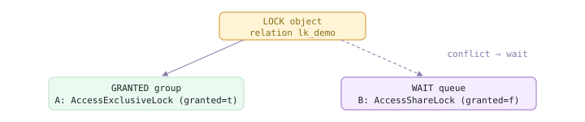
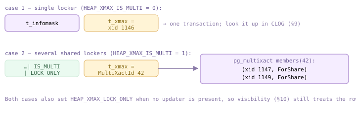
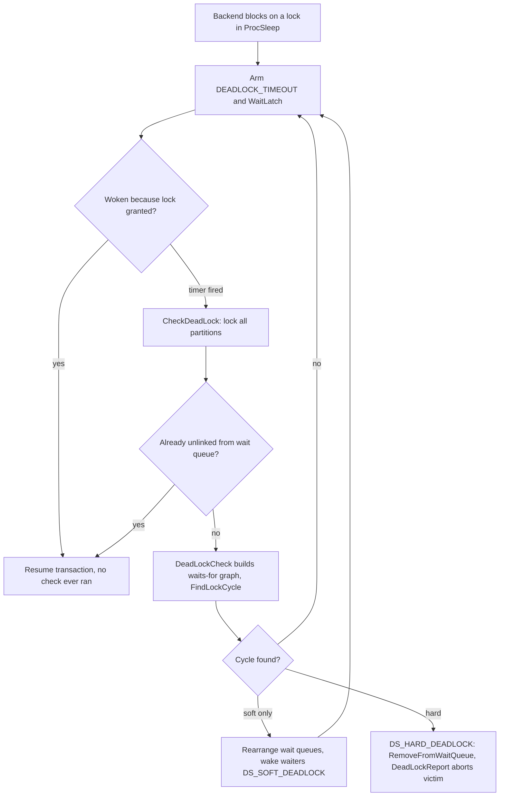
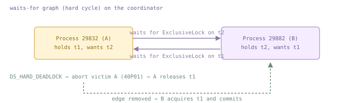
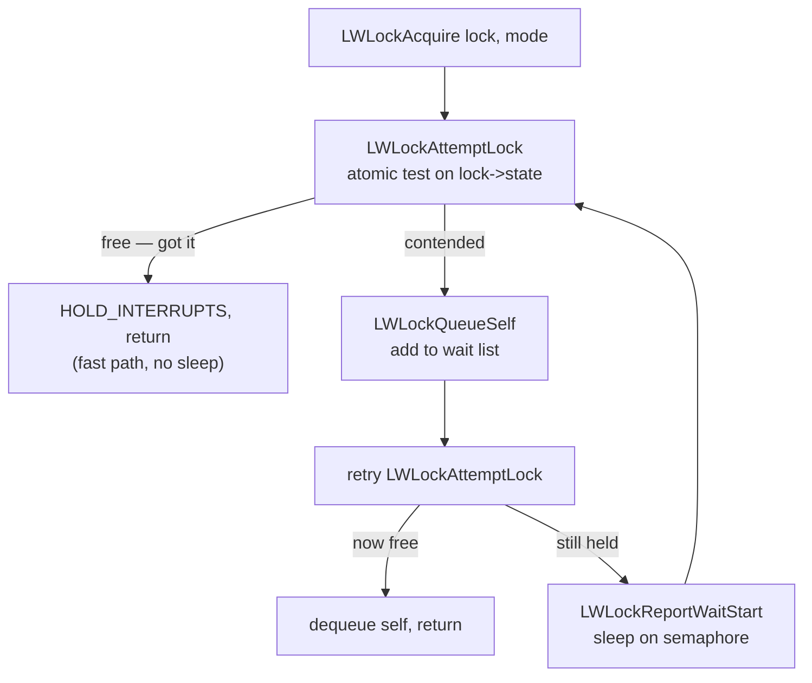
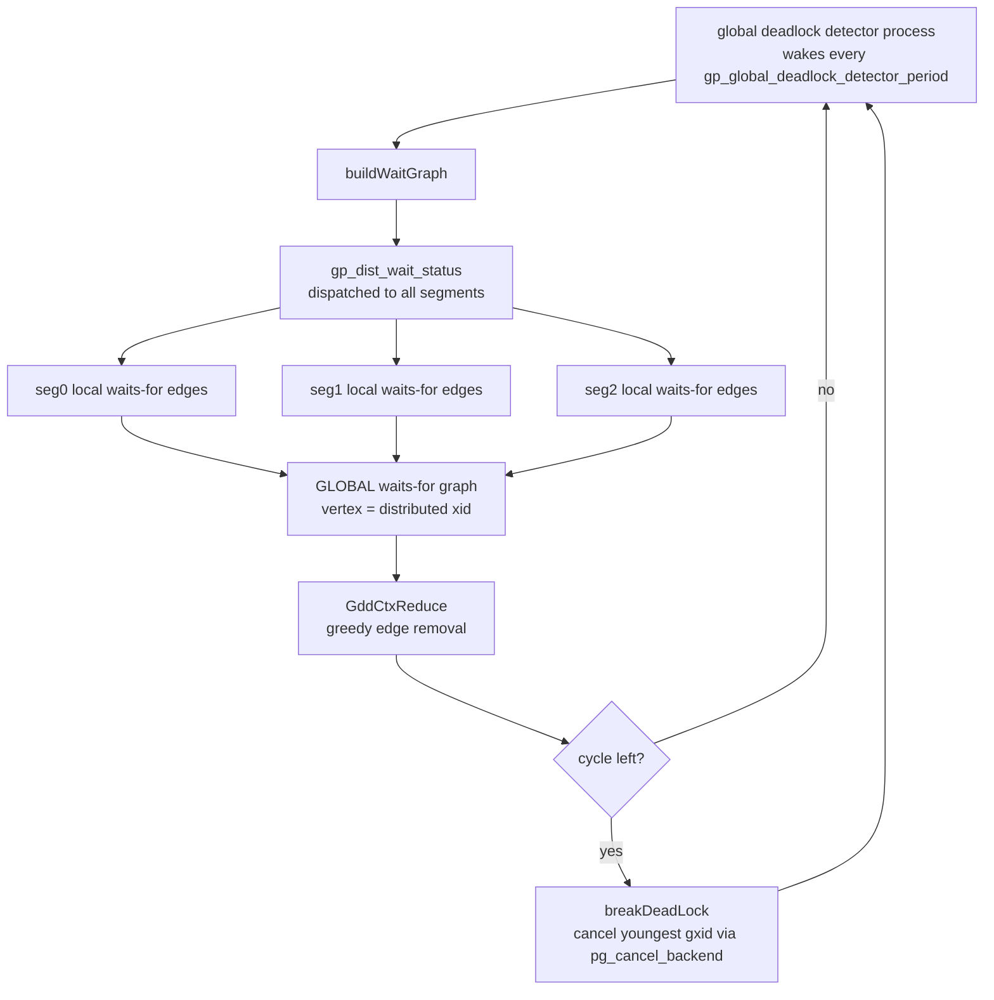
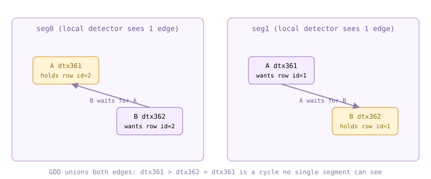

<!--
  Licensed to the Apache Software Foundation (ASF) under one
  or more contributor license agreements.  See the NOTICE file
  distributed with this work for additional information
  regarding copyright ownership.  The ASF licenses this file
  to you under the Apache License, Version 2.0 (the
  "License"); you may not use this file except in compliance
  with the License.  You may obtain a copy of the License at

    http://www.apache.org/licenses/LICENSE-2.0

  Unless required by applicable law or agreed to in writing,
  software distributed under the License is distributed on an
  "AS IS" BASIS, WITHOUT WARRANTIES OR CONDITIONS OF ANY
  KIND, either express or implied.  See the License for the
  specific language governing permissions and limitations
  under the License.
-->

import RawFigure from '../_components/RawFigure';

# 11. Locks & the Global Deadlock Detector

## 11.1 Heavyweight (Relation-Level) Locks

Cloudberry inherits PostgreSQL's four-tier locking system. **Spinlocks** (`s_lock.c`) are a few-instruction TAS busy-wait, the substrate for everything else. **Lightweight locks** (LWLocks, [§11.4](#114-locks-on-memory-structures)) guard shared-memory data structures with a plain read/write pair and no deadlock detection. **Heavyweight locks** — also called *regular* locks — are the two-phase-locking locks of database theory: they protect logical objects (tables, tuples, transactions), support eight modes and deadlock detection, and are held to end-of-transaction. Finally *predicate locks* (`SIReadLock`) back serializable snapshot isolation. This section covers the heavyweight lock manager; row locks are [§11.2](#112-row-level-locks--multixacts), the local deadlock detector [§11.3](#113-deadlock-detection), LWLocks [§11.4](#114-locks-on-memory-structures), and the Global Deadlock Detector — the Cloudberry-distinctive piece — [§11.5](#115-the-global-deadlock-detector-gdd).

### 11.1.1 What a heavyweight lock is: the LOCKTAG

A heavyweight lock does not lock memory; it locks a *named object*. The name is a `LOCKTAG`: a lock-method id, a type tag, and up to four id fields. A whole relation is `(dbOid, relOid)` tagged `LOCKTAG_RELATION`; a transaction is its xid tagged `LOCKTAG_TRANSACTION`; a virtual transaction is `(backendId, localXid)` tagged `LOCKTAG_VIRTUALTRANSACTION`. Locks live in shared-memory hash tables, are tracked per backend, and are released automatically at commit or abort (or by the lock manager during error recovery) — you never `UNLOCK` a table.

```c title="src/include/storage/lock.h:184"
typedef struct LOCKTAG {
          uint32  locktag_field1;   /* a 32-bit ID field */
          uint32  locktag_field2;   /* a 32-bit ID field */
          uint32  locktag_field3;
          uint16  locktag_field4;
          uint8   locktag_type;     /* see enum LockTagType: RELATION,
                                       TRANSACTION, VIRTUALTRANSACTION, ... */
          uint8   locktag_lockmethodid;
      } LOCKTAG;
```

`LockRelation()` in `lmgr.c` is the canonical entry point: it fills a `LOCKTAG` for the relation and calls into the lock manager. `ConditionalLockRelation()` is the same but returns immediately instead of waiting if the lock is unavailable, and `XactLockTableWait()` waits on another transaction's xid lock (see 11.1.4).

```c title="src/backend/storage/lmgr/lmgr.c:253"
void
      LockRelation(Relation relation, LOCKMODE lockmode)
      {
          LOCKTAG  tag;
          SET_LOCKTAG_RELATION(tag,
              relation->rd_lockInfo.lockRelId.dbId,
              relation->rd_lockInfo.lockRelId.relId);
          res = LockAcquireExtended(&tag, lockmode, false, false, true, &locallock);
          ...
      }
```

### 11.1.2 The eight table-level lock modes

A relation lock is requested in one of eight modes, numbered 1–8 in `lockdefs.h` from weakest to strongest. The comment beside each `#define` names the SQL that acquires it. Two requests on the *same* object may be held at once only if their modes do not conflict; the stronger the pair, the more likely they collide.

```c title="src/include/storage/lockdefs.h:36"
#define AccessShareLock          1  /* SELECT */
      #define RowShareLock             2  /* SELECT FOR UPDATE/FOR SHARE */
      #define RowExclusiveLock         3  /* INSERT, UPDATE, DELETE */
      #define ShareUpdateExclusiveLock 4  /* VACUUM (non-FULL), ANALYZE,
                                             CREATE INDEX CONCURRENTLY */
      #define ShareLock                5  /* CREATE INDEX */
      #define ShareRowExclusiveLock    6  /* like EXCLUSIVE, but allows ROW SHARE */
      #define ExclusiveLock            7  /* blocks ROW SHARE / SELECT...FOR UPDATE */
      #define AccessExclusiveLock      8  /* ALTER/DROP TABLE, VACUUM FULL,
                                             unqualified LOCK TABLE */
```

*What a statement takes on its target table*

| Statement | Mode |
| --- | --- |
| `SELECT` | `AccessShareLock` (1) |
| `SELECT ... FOR UPDATE/SHARE` | `RowShareLock` (2) |
| `INSERT` | `RowExclusiveLock` (3) |
| `UPDATE` / `DELETE` | `RowExclusiveLock` (3) — but see 11.1.5 |
| `VACUUM` (non-FULL), `ANALYZE`, `CREATE INDEX CONCURRENTLY` | `ShareUpdateExclusiveLock` (4) |
| `CREATE INDEX` | `ShareLock` (5) |
| `ALTER TABLE`, `DROP TABLE`, `VACUUM FULL`, `TRUNCATE` | `AccessExclusiveLock` (8) |

### 11.1.3 The conflict matrix

The rule of who-blocks-whom lives in one static array, `LockConflicts[]`. Each entry is a bitmask of the modes that conflict with that row's mode. The pattern is the familiar staircase: `AccessShareLock` (a plain read) conflicts with nothing except `AccessExclusiveLock`, so reads never block reads or writes; `AccessExclusiveLock` conflicts with *everything*, so `ALTER`/`DROP` blocks and is blocked by every other user of the table.

```c title="src/backend/storage/lmgr/lock.c:87"
static const LOCKMASK LockConflicts[] = {
          0,
          /* AccessShareLock */
          LOCKBIT_ON(AccessExclusiveLock),
          /* RowShareLock */
          LOCKBIT_ON(ExclusiveLock) | LOCKBIT_ON(AccessExclusiveLock),
          /* RowExclusiveLock */
          LOCKBIT_ON(ShareLock) | LOCKBIT_ON(ShareRowExclusiveLock) |
          LOCKBIT_ON(ExclusiveLock) | LOCKBIT_ON(AccessExclusiveLock),
          ...
          /* AccessExclusiveLock: conflicts with all eight */ };
```

<RawFigure html={"<div style=\"max-width:720px;margin:2px auto;font:11px/1.4 ui-monospace,SFMono-Regular,Menlo,monospace;color:#1f2328;overflow-x:auto\"><div style=\"min-width:600px\"> <div style=\"display:flex\"><div style=\"flex:2.6;padding:4px 3px;color:#6b5b95\">held \\ requested</div><div style=\"flex:1;border:1px solid #cdb4db;background:#efe3fb;text-align:center;padding:4px 1px\">1 AS</div><div style=\"flex:1;border:1px solid #cdb4db;background:#efe3fb;text-align:center;padding:4px 1px\">2 RS</div><div style=\"flex:1;border:1px solid #cdb4db;background:#efe3fb;text-align:center;padding:4px 1px\">3 RX</div><div style=\"flex:1;border:1px solid #cdb4db;background:#efe3fb;text-align:center;padding:4px 1px\">4 SUX</div><div style=\"flex:1;border:1px solid #cdb4db;background:#efe3fb;text-align:center;padding:4px 1px\">5 S</div><div style=\"flex:1;border:1px solid #cdb4db;background:#efe3fb;text-align:center;padding:4px 1px\">6 SRX</div><div style=\"flex:1;border:1px solid #cdb4db;background:#efe3fb;text-align:center;padding:4px 1px\">7 X</div><div style=\"flex:1;border:1px solid #cdb4db;background:#efe3fb;text-align:center;padding:4px 1px\">8 AX</div></div> <div style=\"display:flex\"><div style=\"flex:2.6;padding:4px 3px;color:#6b5b95\">1 AccessShare</div><div style=\"flex:1;border:1px solid #cfead9;background:#eafaf0;text-align:center;padding:4px 1px\">·</div><div style=\"flex:1;border:1px solid #cfead9;background:#eafaf0;text-align:center;padding:4px 1px\">·</div><div style=\"flex:1;border:1px solid #cfead9;background:#eafaf0;text-align:center;padding:4px 1px\">·</div><div style=\"flex:1;border:1px solid #cfead9;background:#eafaf0;text-align:center;padding:4px 1px\">·</div><div style=\"flex:1;border:1px solid #cfead9;background:#eafaf0;text-align:center;padding:4px 1px\">·</div><div style=\"flex:1;border:1px solid #cfead9;background:#eafaf0;text-align:center;padding:4px 1px\">·</div><div style=\"flex:1;border:1px solid #cfead9;background:#eafaf0;text-align:center;padding:4px 1px\">·</div><div style=\"flex:1;border:1px solid #e0b365;background:#fff4d6;text-align:center;padding:4px 1px;color:#8a6d1a\">✗</div></div> <div style=\"display:flex\"><div style=\"flex:2.6;padding:4px 3px;color:#6b5b95\">2 RowShare</div><div style=\"flex:1;border:1px solid #cfead9;background:#eafaf0;text-align:center;padding:4px 1px\">·</div><div style=\"flex:1;border:1px solid #cfead9;background:#eafaf0;text-align:center;padding:4px 1px\">·</div><div style=\"flex:1;border:1px solid #cfead9;background:#eafaf0;text-align:center;padding:4px 1px\">·</div><div style=\"flex:1;border:1px solid #cfead9;background:#eafaf0;text-align:center;padding:4px 1px\">·</div><div style=\"flex:1;border:1px solid #cfead9;background:#eafaf0;text-align:center;padding:4px 1px\">·</div><div style=\"flex:1;border:1px solid #cfead9;background:#eafaf0;text-align:center;padding:4px 1px\">·</div><div style=\"flex:1;border:1px solid #e0b365;background:#fff4d6;text-align:center;padding:4px 1px;color:#8a6d1a\">✗</div><div style=\"flex:1;border:1px solid #e0b365;background:#fff4d6;text-align:center;padding:4px 1px;color:#8a6d1a\">✗</div></div> <div style=\"display:flex\"><div style=\"flex:2.6;padding:4px 3px;color:#6b5b95\">3 RowExclusive</div><div style=\"flex:1;border:1px solid #cfead9;background:#eafaf0;text-align:center;padding:4px 1px\">·</div><div style=\"flex:1;border:1px solid #cfead9;background:#eafaf0;text-align:center;padding:4px 1px\">·</div><div style=\"flex:1;border:1px solid #cfead9;background:#eafaf0;text-align:center;padding:4px 1px\">·</div><div style=\"flex:1;border:1px solid #cfead9;background:#eafaf0;text-align:center;padding:4px 1px\">·</div><div style=\"flex:1;border:1px solid #e0b365;background:#fff4d6;text-align:center;padding:4px 1px;color:#8a6d1a\">✗</div><div style=\"flex:1;border:1px solid #e0b365;background:#fff4d6;text-align:center;padding:4px 1px;color:#8a6d1a\">✗</div><div style=\"flex:1;border:1px solid #e0b365;background:#fff4d6;text-align:center;padding:4px 1px;color:#8a6d1a\">✗</div><div style=\"flex:1;border:1px solid #e0b365;background:#fff4d6;text-align:center;padding:4px 1px;color:#8a6d1a\">✗</div></div> <div style=\"display:flex\"><div style=\"flex:2.6;padding:4px 3px;color:#6b5b95\">4 ShareUpdExcl</div><div style=\"flex:1;border:1px solid #cfead9;background:#eafaf0;text-align:center;padding:4px 1px\">·</div><div style=\"flex:1;border:1px solid #cfead9;background:#eafaf0;text-align:center;padding:4px 1px\">·</div><div style=\"flex:1;border:1px solid #cfead9;background:#eafaf0;text-align:center;padding:4px 1px\">·</div><div style=\"flex:1;border:1px solid #e0b365;background:#fff4d6;text-align:center;padding:4px 1px;color:#8a6d1a\">✗</div><div style=\"flex:1;border:1px solid #e0b365;background:#fff4d6;text-align:center;padding:4px 1px;color:#8a6d1a\">✗</div><div style=\"flex:1;border:1px solid #e0b365;background:#fff4d6;text-align:center;padding:4px 1px;color:#8a6d1a\">✗</div><div style=\"flex:1;border:1px solid #e0b365;background:#fff4d6;text-align:center;padding:4px 1px;color:#8a6d1a\">✗</div><div style=\"flex:1;border:1px solid #e0b365;background:#fff4d6;text-align:center;padding:4px 1px;color:#8a6d1a\">✗</div></div> <div style=\"display:flex\"><div style=\"flex:2.6;padding:4px 3px;color:#6b5b95\">5 Share</div><div style=\"flex:1;border:1px solid #cfead9;background:#eafaf0;text-align:center;padding:4px 1px\">·</div><div style=\"flex:1;border:1px solid #cfead9;background:#eafaf0;text-align:center;padding:4px 1px\">·</div><div style=\"flex:1;border:1px solid #e0b365;background:#fff4d6;text-align:center;padding:4px 1px;color:#8a6d1a\">✗</div><div style=\"flex:1;border:1px solid #e0b365;background:#fff4d6;text-align:center;padding:4px 1px;color:#8a6d1a\">✗</div><div style=\"flex:1;border:1px solid #cfead9;background:#eafaf0;text-align:center;padding:4px 1px\">·</div><div style=\"flex:1;border:1px solid #e0b365;background:#fff4d6;text-align:center;padding:4px 1px;color:#8a6d1a\">✗</div><div style=\"flex:1;border:1px solid #e0b365;background:#fff4d6;text-align:center;padding:4px 1px;color:#8a6d1a\">✗</div><div style=\"flex:1;border:1px solid #e0b365;background:#fff4d6;text-align:center;padding:4px 1px;color:#8a6d1a\">✗</div></div> <div style=\"display:flex\"><div style=\"flex:2.6;padding:4px 3px;color:#6b5b95\">6 ShareRowExcl</div><div style=\"flex:1;border:1px solid #cfead9;background:#eafaf0;text-align:center;padding:4px 1px\">·</div><div style=\"flex:1;border:1px solid #cfead9;background:#eafaf0;text-align:center;padding:4px 1px\">·</div><div style=\"flex:1;border:1px solid #e0b365;background:#fff4d6;text-align:center;padding:4px 1px;color:#8a6d1a\">✗</div><div style=\"flex:1;border:1px solid #e0b365;background:#fff4d6;text-align:center;padding:4px 1px;color:#8a6d1a\">✗</div><div style=\"flex:1;border:1px solid #e0b365;background:#fff4d6;text-align:center;padding:4px 1px;color:#8a6d1a\">✗</div><div style=\"flex:1;border:1px solid #e0b365;background:#fff4d6;text-align:center;padding:4px 1px;color:#8a6d1a\">✗</div><div style=\"flex:1;border:1px solid #e0b365;background:#fff4d6;text-align:center;padding:4px 1px;color:#8a6d1a\">✗</div><div style=\"flex:1;border:1px solid #e0b365;background:#fff4d6;text-align:center;padding:4px 1px;color:#8a6d1a\">✗</div></div> <div style=\"display:flex\"><div style=\"flex:2.6;padding:4px 3px;color:#6b5b95\">7 Exclusive</div><div style=\"flex:1;border:1px solid #cfead9;background:#eafaf0;text-align:center;padding:4px 1px\">·</div><div style=\"flex:1;border:1px solid #e0b365;background:#fff4d6;text-align:center;padding:4px 1px;color:#8a6d1a\">✗</div><div style=\"flex:1;border:1px solid #e0b365;background:#fff4d6;text-align:center;padding:4px 1px;color:#8a6d1a\">✗</div><div style=\"flex:1;border:1px solid #e0b365;background:#fff4d6;text-align:center;padding:4px 1px;color:#8a6d1a\">✗</div><div style=\"flex:1;border:1px solid #e0b365;background:#fff4d6;text-align:center;padding:4px 1px;color:#8a6d1a\">✗</div><div style=\"flex:1;border:1px solid #e0b365;background:#fff4d6;text-align:center;padding:4px 1px;color:#8a6d1a\">✗</div><div style=\"flex:1;border:1px solid #e0b365;background:#fff4d6;text-align:center;padding:4px 1px;color:#8a6d1a\">✗</div><div style=\"flex:1;border:1px solid #e0b365;background:#fff4d6;text-align:center;padding:4px 1px;color:#8a6d1a\">✗</div></div> <div style=\"display:flex\"><div style=\"flex:2.6;padding:4px 3px;color:#6b5b95\">8 AccessExcl</div><div style=\"flex:1;border:1px solid #e0b365;background:#fff4d6;text-align:center;padding:4px 1px;color:#8a6d1a\">✗</div><div style=\"flex:1;border:1px solid #e0b365;background:#fff4d6;text-align:center;padding:4px 1px;color:#8a6d1a\">✗</div><div style=\"flex:1;border:1px solid #e0b365;background:#fff4d6;text-align:center;padding:4px 1px;color:#8a6d1a\">✗</div><div style=\"flex:1;border:1px solid #e0b365;background:#fff4d6;text-align:center;padding:4px 1px;color:#8a6d1a\">✗</div><div style=\"flex:1;border:1px solid #e0b365;background:#fff4d6;text-align:center;padding:4px 1px;color:#8a6d1a\">✗</div><div style=\"flex:1;border:1px solid #e0b365;background:#fff4d6;text-align:center;padding:4px 1px;color:#8a6d1a\">✗</div><div style=\"flex:1;border:1px solid #e0b365;background:#fff4d6;text-align:center;padding:4px 1px;color:#8a6d1a\">✗</div><div style=\"flex:1;border:1px solid #e0b365;background:#fff4d6;text-align:center;padding:4px 1px;color:#8a6d1a\">✗</div></div> <div style=\"text-align:center;color:#8a7aa8;font-size:10px;padding:3px\">matrix is symmetric · AS AccessShare · RS RowShare · RX RowExclusive · SUX ShareUpdExcl · S Share · SRX ShareRowExcl · X Exclusive · AX AccessExcl</div> </div></div>"} caption={"Lock-mode conflict matrix — ✗ = the two modes cannot be held on the same object at once (from LockConflicts[]). Note ExclusiveLock (7) ✗ RowExclusiveLock (3): why concurrent UPDATEs serialize with GDD off (11.1.5)."} />

To see it live: open a transaction, run a `SELECT`, and read `pg_locks`. The read takes `AccessShareLock` on the table, and — as every transaction does — an exclusive lock on its own virtual transaction id (11.1.4). Restricting to `gp_segment_id = -1` shows only the coordinator's lock table.

*A SELECT holds AccessShareLock on its target and an exclusive lock on its own VXID*

```sql
BEGIN;
      SELECT count(*) FROM lk_demo;
      SELECT locktype, relation::regclass AS rel, mode, granted
      FROM pg_locks
      WHERE pid = pg_backend_pid() AND gp_segment_id = -1
        AND (relation IS NULL OR relation::regclass::text = 'lk_demo')
      ORDER BY locktype;
```

```text {3} title="output"
 locktype   |   rel   |      mode       | granted
      ------------+---------+-----------------+---------
       relation   | lk_demo | AccessShareLock | t
       virtualxid |         | ExclusiveLock   | t
```

### 11.1.4 The wait queue and lock_timeout

When a request conflicts with a granted lock, the backend does not fail — it *waits*. The lock's queue splits into a granted group and a wait group, and the waiter's row in `pg_locks` shows `granted = false`. It sleeps on its process semaphore until the holder releases (at transaction end) and the lock manager wakes it. Two sessions make this visible: A takes `ACCESS EXCLUSIVE` and holds it; B's plain `SELECT` — needing only `AccessShareLock`, which per the matrix conflicts with mode 8 — blocks.

*Session A grabs the table exclusively and sits on it*

```sql
-- session A
      BEGIN;
      LOCK TABLE lk_demo IN ACCESS EXCLUSIVE MODE;
      SELECT pg_sleep(6);
      COMMIT;
```

```text title="output"
BEGIN
      LOCK TABLE
       pg_sleep
      ----------

      COMMIT      -- released after ~6s
```

*Session B's SELECT blocks; an observer sees the granted holder and the waiter; B unblocks only when A commits (5.1s)*

```sql
-- session B (started ~1s after A)
      \timing on
      SELECT count(*) FROM lk_demo;

      -- observer session, while B waits:
      SELECT pid, mode, granted FROM pg_locks
      WHERE relation::regclass::text='lk_demo' AND gp_segment_id=-1
      ORDER BY granted DESC;
```

```text {3,4,10} title="output"
  pid  |        mode         | granted
      -------+---------------------+---------
       28949 | AccessExclusiveLock | t   <- A, holder
       28959 | AccessShareLock     | f   <- B, waiting

      -- back in session B, once A commits:
       count
      -------
           2
      Time: 5113.806 ms (00:05.114)
```



*One lock object, two groups: A holds it (granted), B queued behind (waiting) until A releases at commit*

A waiter need not block forever. Setting `lock_timeout` bounds the wait: if the lock cannot be taken in time, the statement is cancelled rather than parked. (`deadlock_timeout`, a related but distinct knob, controls how long the backend waits before *running the deadlock check* — that is 11.3.)

*lock_timeout turns an unbounded wait into a clean error*

```sql
-- session A still holds ACCESS EXCLUSIVE
      SET lock_timeout = '1s';
      SELECT count(*) FROM lk_demo;
```

```text {2} title="output"
SET
      ERROR:  canceling statement due to lock timeout
      LINE 1: SELECT count(*) FROM lk_demo;
```

### 11.1.5 Locks on transaction ids

Transactions themselves are lockable objects, and this is how one backend waits for another to *finish*. At start every transaction takes an exclusive lock on its own virtual xid (VXID), and once it writes and is assigned a real xid, an exclusive lock on that xid too ([§9.2](./ch09.md#92-the-transaction-manager)). No one else ever shares these — they are pure signalling locks. When transaction T2 needs T1 to end (T2 wants to update a row whose `xmax` is T1's still-running xid, §10; or a unique-index check finds an in-flight duplicate), T2 calls `XactLockTableWait()`, which requests a *shared* lock on T1's xid. Because T1 holds it exclusively, T2 blocks; when T1 commits or aborts it drops the lock and T2 wakes — a transaction-completion barrier built from the ordinary lock manager.

```c title="src/backend/storage/lmgr/lmgr.c:698"
void
      XactLockTableWait(TransactionId xid, Relation rel, ItemPointer ctid,
                        XLTW_Oper oper)
      {
          LOCKTAG  tag;
          /* wait (share mode) on the holder's own exclusive lock on 'xid';
             returns when that transaction commits or aborts */
      }
```

:::note

In MPP the real xid is assigned per **segment**, so the `transactionid` lock lives in the segment's lock table, not the coordinator's — inspect it from a utility-mode session on a segment. The coordinator side mainly shows the `virtualxid` lock. The distributed cousin, `LOCKTAG_DISTRIB_TRANSACTION`, belongs to §12.

:::

*On a segment (utility mode, :7102): a writing transaction holds exclusive locks on both its xid and its VXID*

```sql
-- PGOPTIONS='-c gp_role=utility' psql -p 7102
      BEGIN;
      SELECT txid_current();
      SELECT locktype, mode, granted FROM pg_locks
      WHERE pid = pg_backend_pid()
        AND locktype IN ('transactionid','virtualxid')
      ORDER BY locktype;
```

```text {3,7} title="output"
 txid_current
      --------------
               1236

         locktype    |     mode      | granted
      ---------------+---------------+---------
       transactionid | ExclusiveLock | t
       virtualxid    | ExclusiveLock | t
```

Finally, a Cloudberry-specific twist on `UPDATE`/`DELETE`. In PostgreSQL these take `RowExclusiveLock` (mode 3) on the target table, so two updates to the same table proceed in parallel and rely on *row* locks to serialize conflicting rows. In an MPP cluster that opens the door to *global* deadlocks no single segment can see. By default the Global Deadlock Detector is **off**, and to forestall those deadlocks Cloudberry upgrades the target-table lock of `UPDATE`/`DELETE` on the coordinator to `ExclusiveLock` (mode 7) — which, per the matrix, conflicts with `RowExclusiveLock`, so two concurrent updates to the same table *serialize*. Turning GDD on ([§11.5](#115-the-global-deadlock-detector-gdd)) relaxes heap tables back to `RowExclusiveLock` and lets the detector break any cross-segment cycle that results.

```c title="src/backend/access/table/table.c:174"
/* CdbTryOpenTable: UPDATE/DELETE on a normal table, on the QD */
      if (reqmode == RowExclusiveLock &&
          (Gp_role == GP_ROLE_DISPATCH || IS_SINGLENODE()) &&
          relid >= FirstNormalObjectId)
      {
          if (!gp_enable_global_deadlock_detector && !IS_SINGLENODE())
          {
              /* Without GDD, to avoid global deadlock, always
                 upgrade locklevel to ExclusiveLock */
              lockmode = ExclusiveLock;
              rel = try_table_open(relid, lockmode, false);
          }
          else
              lockmode = RowExclusiveLock;   /* like Postgres */
          ...
      }
```

*With GDD off (the default), UPDATE takes ExclusiveLock — not RowExclusiveLock — on its target table*

```sql
SHOW gp_enable_global_deadlock_detector;
      BEGIN;
      UPDATE lk_demo SET v = 'x' WHERE id = 1;
      SELECT locktype, relation::regclass AS rel, mode, granted
      FROM pg_locks
      WHERE pid = pg_backend_pid() AND gp_segment_id = -1
        AND relation::regclass::text = 'lk_demo';
```

```text {3,7} title="output"
 gp_enable_global_deadlock_detector
      ------------------------------------
       off

       locktype |   rel   |     mode      | granted
      ----------+---------+---------------+---------
       relation | lk_demo | ExclusiveLock | t
```

## 11.2 Row-Level Locks & Multixacts

Table locks ([§11.1](#111-heavyweight-relation-level-locks)) protect whole relations, but a transaction that only touches one row should not have to lock out everybody else. That job belongs to **row-level locks** — and their most important property is *where they live*. A row lock is not an entry in the lock manager's shared hash table. It is stamped **into the tuple itself**: the locker writes its xid into `t_xmax` and sets infomask bits (the same header fields introduced in [§4.2](../part-2-storage-data-layout/ch04.md#42-row-version-layout)). A billion locked rows therefore cost zero shared memory — the lock travels with the data on the heap page.

### 11.2.1 Four row-lock modes

PostgreSQL (and the heap AM CBDB inherits) defines exactly four row-lock strengths, ordered weakest to strongest. Each has an SQL surface in the `SELECT … FOR` locking clause:

```c title="src/include/nodes/lockoptions.h:49"
typedef enum LockTupleMode
      {
          LockTupleKeyShare,        /* SELECT FOR KEY SHARE */
          LockTupleShare,           /* SELECT FOR SHARE */
          LockTupleNoKeyExclusive,  /* SELECT FOR NO KEY UPDATE, and
                                     * UPDATEs that don't touch key cols */
          LockTupleExclusive        /* SELECT FOR UPDATE, key-col UPDATEs, DELETE */
      } LockTupleMode;
```

A plain `UPDATE` takes `NoKeyExclusive` when it leaves every key column unchanged, and escalates to `Exclusive` only when it rewrites a column that some index/foreign-key depends on. That split is the whole point of the *key* modes: a foreign-key check needs only to pin the referenced key (`FOR KEY SHARE`), so it must **not** block an unrelated non-key `UPDATE` of the same row. The conflict matrix below shows which modes may coexist on one tuple — the weaker two are compatible with each other; only the exclusive pair truly serialises.

*Row-lock conflict matrix — ✓ = may be held simultaneously by different transactions, ✗ = conflicts (waiter blocks)*

| holder ↓ / requester → | KeyShare | Share | NoKeyExcl | Exclusive |
| --- | --- | --- | --- | --- |
| **KeyShare** | ✓ | ✓ | ✓ | ✗ |
| **Share** | ✓ | ✓ | ✗ | ✗ |
| **NoKeyExclusive** | ✓ | ✗ | ✗ | ✗ |
| **Exclusive** | ✗ | ✗ | ✗ | ✗ |

:::note

The matrix is symmetric. Note the top-left ✓: two transactions can each hold **KeyShare** on the same row, and KeyShare even coexists with a NoKeyExclusive updater — a running `UPDATE` of a non-key column does not stall a concurrent FK check. That is precisely the situation that needs a multixact ([§11.2](#112-row-level-locks--multixacts).4), because one `t_xmax` must then name more than one locker.

:::

### 11.2.2 heap_lock_tuple — taking the lock, waiting on the holder

`heap_lock_tuple()` is the executor's entry point for `FOR …` clauses. It pins and exclusive-locks the buffer, re-reads the tuple, and asks `HeapTupleSatisfiesUpdate` who currently owns `t_xmax`. If the row is held in a conflicting mode it must wait — and it waits not on a row-lock object but on the **holder's transaction** via `XactLockTableWait` ([§11.1](#111-heavyweight-relation-level-locks)'s transaction-id lock trick): every xid holds an exclusive lock on its own id, so sleeping until that lock is free means sleeping until the locker commits or aborts.

```c title="src/backend/access/heap/heapam.c:4915"
/* wait for regular transaction to end, or die trying */
      switch (wait_policy)
      {
          case LockWaitBlock:
              XactLockTableWait(xwait, relation, &tuple->t_self, XLTW_Lock);
              break;
          case LockWaitSkip:
              if (!ConditionalXactLockTableWait(xwait))
                  { result = TM_WouldBlock; goto failed; }   /* SKIP LOCKED */
              break;
          case LockWaitError:
              if (!ConditionalXactLockTableWait(xwait))
                  ereport(ERROR, (errcode(ERRCODE_LOCK_NOT_AVAILABLE),
                    errmsg("could not obtain lock on row ...")));  /* NOWAIT */
              break;
      }
```

The `LockWaitPolicy` is the SQL modifier: default `LockWaitBlock` sleeps, `NOWAIT` (`LockWaitError`) probes with `ConditionalXactLockTableWait` and raises immediately if the row is busy, and `SKIP LOCKED` (`LockWaitSkip`) quietly returns `TM_WouldBlock` so the scan drops that row from the result. Which lock strength `heap_lock_tuple` actually stamps is looked up from a small table that maps each `LockTupleMode` to a heavyweight `LOCKMODE` and to the two `MultiXactStatus` codes used when the lock has to become a multixact member:

```c title="src/backend/access/heap/heapam.c:154"
tupleLockExtraInfo[MaxLockTupleMode + 1] =
      { /* LockTupleMode        hwlock            lockstatus / updstatus */
        { AccessShareLock,    MultiXactStatusForKeyShare,    -1 },
        { RowShareLock,       MultiXactStatusForShare,       -1 },
        { ExclusiveLock,      MultiXactStatusForNoKeyUpdate, MultiXactStatusNoKeyUpdate },
        { AccessExclusiveLock,MultiXactStatusForUpdate,      MultiXactStatusUpdate }
      };
```

### 11.2.3 Live: FOR UPDATE serialises, plain SELECT does not

Two sessions on the coordinator (`:7100`). Session A locks id=1 and sleeps; session B first runs a *plain* `SELECT` (pure MVCC read — it should not notice the lock), then a `FOR UPDATE` on the same row (which must wait for A to commit).

*A holds FOR UPDATE on id=1 for ~4 s; B's plain read is instant, B's FOR UPDATE blocks*

```sql
-- session A
      BEGIN;
      SELECT id,val FROM rl_demo WHERE id=1 FOR UPDATE;
      SELECT pg_sleep(4);  COMMIT;

      -- session B (starts ~1 s later)
      	iming on
      SELECT id,val FROM rl_demo WHERE id=1;             -- plain MVCC read
      SELECT id,val FROM rl_demo WHERE id=1 FOR UPDATE;  -- must wait for A
```

```text {5,10} title="output"
-- session B
       id | val
      ----+-----
        1 | a
      Time: 57.082 ms        -- plain SELECT: unaffected by A's lock

       id | val
      ----+-----
        1 | a
      Time: 3050.061 ms      -- FOR UPDATE: blocked until A COMMITs (~3 s)
```

The plain read returned in 57 ms while A still held the lock — an MVCC reader never blocks a writer or locker (§10). The second statement waited three seconds, exactly the remainder of A's `pg_sleep`, then proceeded the instant A committed.

### 11.2.4 Multixacts — one t_xmax, many lockers

The conflict matrix allows *several* transactions to hold a shared row lock at the same time (KeyShare+KeyShare, or Share+Share). But `t_xmax` is a single 32-bit field — it cannot list two xids. The heap solves this with a **MultiXactId**: instead of a plain xid, `t_xmax` holds an id into a separate log of `(xid, mode)` members, and the `HEAP_XMAX_IS_MULTI` infomask bit flags the reinterpretation.

```c title="src/include/access/htup_details.h:195"
#define HEAP_XMAX_KEYSHR_LOCK  0x0010  /* xmax is a key-shared locker */
      #define HEAP_XMAX_EXCL_LOCK    0x0040  /* xmax is exclusive locker */
      #define HEAP_XMAX_LOCK_ONLY    0x0080  /* xmax, if valid, is only a locker */
      #define HEAP_XMAX_IS_MULTI     0x1000  /* t_xmax is a MultiXactId */
```

The members live in `pg_multixact`, managed by `multixact.c` as *two* SLRU areas — an **offsets** log (where does multixact N's member array start) and a **members** log (the packed `(xid, status)` entries). This offsets-plus-members layout is what lets a single MultiXactId expand to a variable-length list:

```c title="src/backend/access/transam/multixact.c:6"
* The pg_multixact manager is a pg_xact-like manager that stores an array of
      * MultiXactMember for each MultiXactId ... a fundamental part of the
      * shared-row-lock implementation.  Each MultiXactMember is comprised of a
      * TransactionId and a set of flag bits.
      * We use two SLRU areas, one for storing the offsets at which the data
      * starts for each MultiXactId in the other one.
```



*t_xmax is overloaded: a plain xid (top) or, when HEAP_XMAX_IS_MULTI is set, a MultiXactId indexing the pg_multixact member list (bottom)*

Multixacts have their own wraparound problem: a MultiXactId is only 32 bits, so like xids it must be **frozen** during vacuum (`MultiXactCutoff` / `relminmxid`, cross-ref [§10.4](./ch10.md#104-freezing--xid-wraparound)). `pg_get_multixact_members(mxid)` decodes a live one, and `pg_control_checkpoint()` exposes the cluster-wide counters — here a fresh demo cluster that has minted none yet:

*multixact machinery is present and tracked in pg_control (segment 0, utility mode :7102)*

```sql
SELECT next_multixact_id, next_multi_offset
      FROM pg_control_checkpoint();
```

```text {3} title="output"
 next_multixact_id | next_multi_offset
      -------------------+-------------------
       1               | 0
```

### 11.2.5 CBDB reality: FOR UPDATE escalates to a table lock

Everything above is the heap AM CBDB compiles in, and it is exactly what runs on each **segment**. But in a distributed plan the coordinator cannot reliably hold a segment's tuple locks — the tuples flow up through Motion nodes and the QD never sees stable TIDs. So Cloudberry rewrites the locking clause at parse time: unless the Global Deadlock Detector is on **and** the statement hits a single, motion-free table, `SELECT … FOR …` is upgraded to a whole-table `ExclusiveLock`, and any `NOWAIT`/`SKIP LOCKED` wait policy is discarded.

```c title="src/backend/parser/parse_relation.c:1564"
lockmode = pstate->p_canOptSelectLockingClause ? RowShareLock : ExclusiveLock;
      if (lockmode == ExclusiveLock && locking->waitPolicy != LockWaitBlock)
          ereport(WARNING,
              (errmsg("Upgrade the lockmode to ExclusiveLock on table(%s) "
                      "and ignore the wait policy.",
                      RelationGetRelationName(rel))));
```

You can watch the escalation directly. With GDD off (the default on this cluster), a `FOR UPDATE` holder shows a *relation* `ExclusiveLock`, not a tuple lock — which is why the [§11.2](#112-row-level-locks--multixacts).3 demo blocked at all, and why the tuple's `t_xmax` on the segment stays 0:

*pg_locks while a FOR UPDATE is held — relation-level ExclusiveLock, no row lock (GDD off)*

```sql
SELECT locktype, mode, granted
      FROM pg_locks
      WHERE relation = 'rl_demo'::regclass AND gp_segment_id = -1
      ORDER BY mode;
```

```text {3,4} title="output"
 locktype |      mode       | granted
      ----------+-----------------+---------
       relation | AccessShareLock | t
       relation | ExclusiveLock   | t
```

And because the wait policy is dropped, `NOWAIT` does not error and `SKIP LOCKED` does not skip — both emit the warning and then behave like a plain blocking wait:

*NOWAIT / SKIP LOCKED against a locked row (GDD off): wait policy ignored, NOWAIT still blocks 3 s*

```sql
-- another session holds id=1 FOR UPDATE for ~4 s
      SELECT id FROM rl_demo WHERE id=1 FOR UPDATE NOWAIT;
      SELECT id FROM rl_demo WHERE id=1 FOR UPDATE SKIP LOCKED;
```

```text {1,5} title="output"
WARNING:  Upgrade the lockmode to ExclusiveLock on table(rl_demo) and ignore the wait policy.
       id
      ----
        1
      Time: 3131.585 ms   -- NOWAIT did NOT error; it blocked like a normal wait

      WARNING:  Upgrade the lockmode to ExclusiveLock on table(rl_demo) and ignore the wait policy.
       id
      ----
        1
      Time: 56.222 ms       -- (holder had committed by now)
```

:::note

So per-tuple row locks and multixacts on the heap are **real and active per segment**, but you only get true tuple-granularity from a distributed `SELECT … FOR …` when `gp_enable_global_deadlock_detector` is on and the plan touches one motion-free table (then `lockmode` stays `RowShareLock` and a genuine `LockRows` node stamps `t_xmax`). Enabling GDD is what turns UPDATE/DELETE from table-level `ExclusiveLock` into row-friendly `RowExclusiveLock` — and thereby makes cross-segment deadlocks possible, which is the whole subject of [§11.5](#115-the-global-deadlock-detector-gdd).

:::

In short: row locks are stamped into the tuple, four modes ordered by strength, multiple shared holders folded into a MultiXactId in `pg_multixact`. That is the mechanism. Cloudberry's twist is that the coordinator, by default, trades this fine granularity for a coarse table `ExclusiveLock` — regaining tuple-level locking only under the Global Deadlock Detector.

## 11.3 Deadlock Detection

Two-phase locking guarantees serializability but not progress. Nothing stops transaction T1 from holding a lock T2 wants while T2 holds a lock T1 wants — a **deadlock**, a cycle in the *waits-for graph* where each vertex is a transaction and each edge points from a waiter to the transaction blocking it. On a single node PostgreSQL and Cloudberry make no attempt to *prevent* deadlocks (that would mean pre-declaring locks or aborting on the first conflict, both too costly). Instead they let the cycle form and then **detect** it, break it by cancelling one participant, and let the rest proceed. This section covers the *local* detector — the one every backend runs over its own node's lock waits. A cycle whose edges span different segments is invisible to it; that is the Global Deadlock Detector's job ([§11.5](#115-the-global-deadlock-detector-gdd)).

### 11.3.1 Detect, don't prevent — and don't detect eagerly

Building and searching a waits-for graph means grabbing every lock-partition LWLock and walking every wait queue — far too expensive to run each time a backend blocks. The overwhelming majority of lock waits are *not* deadlocks; the blocker commits or aborts within milliseconds and the waiter wakes normally. So Cloudberry defers the check: when `ProcSleep` puts a backend to sleep on a lock it arms a timer for `deadlock_timeout` (default **1 s**) and only *then*, if still waiting, runs detection.

```c title="src/backend/utils/misc/guc_tables.c:2218"
{"deadlock_timeout", PGC_SUSET, LOCK_MANAGEMENT,
          gettext_noop("Sets the time to wait on a lock before checking for deadlock."),
          NULL, GUC_UNIT_MS },
      &DeadlockTimeout,
      1000, 1, INT_MAX,   /* default 1000 ms, min 1 ms */
```

```c title="src/backend/storage/lmgr/proc.c:1445"
/* Set timer so we can wake up after awhile and check for a deadlock. */
      enable_timeout_after(DEADLOCK_TIMEOUT, DeadlockTimeout);
      ...
      (void) WaitLatch(MyLatch, WL_LATCH_SET | WL_EXIT_ON_PM_DEATH, 0,
                       PG_WAIT_LOCK | locallock->tag.lock.locktag_type);
      /* check for deadlocks first, as that's probably log-worthy */
      if (got_deadlock_timeout)
          CheckDeadLock();
```

:::note

So a deadlock is never reported instantly — there is always a **deadlock_timeout**-long pause before the victim gets its error. If you see roughly a one-second stall before `ERROR: deadlock detected`, that pause *is* the timer, not the detection. Lowering the GUC makes detection snappier but wastes CPU on false alarms; raising it hides real deadlocks for longer.

:::

### 11.3.2 CheckDeadLock and the waits-for graph

When the timer fires, `CheckDeadLock` (called from the signal-driven wait loop) takes an exclusive lock on **all** lock partitions — a consistent snapshot of the whole node's lock state — then re-checks whether it was already woken (a lock granted in the interim means no cycle) and, if still stuck, calls `DeadLockCheck`.

```c title="src/backend/storage/lmgr/proc.c:1961"
for (i = 0; i < NUM_LOCK_PARTITIONS; i++)
          LWLockAcquire(LockHashPartitionLockByIndex(i), LW_EXCLUSIVE);
      ...
      /* Run the deadlock check, and set deadlock_state for use by ProcSleep */
      deadlock_state = DeadLockCheck(MyProc);
      if (deadlock_state == DS_HARD_DEADLOCK)
      { ...RemoveFromWaitQueue... }
```

`DeadLockCheck` walks the graph. Every waiting backend's `PGPROC` records the `LOCK` it waits on; every `LOCK` records who holds it and who is queued behind it. `FindLockCycle` does a depth-first search from the current backend following outgoing waits-for edges; returning to the start vertex means a cycle. The recursion classifies each edge as **hard** or **soft**:

- **hard edge** — The blocker *already holds* a lock mode that conflicts with what the waiter wants. This edge cannot be removed by reordering — the waiter genuinely cannot proceed until the holder releases.
- **soft edge** — The blocker is merely *ahead of* the waiter in the same lock's wait queue and its pending request conflicts. This edge is negotiable: the queue can be re-ordered so the waiter goes first, dissolving the cycle without aborting anyone.

```c title="src/backend/storage/lmgr/deadlock.c:565"
/* Scan for procs that already hold conflicting locks.
       * These are "hard" edges in the waits-for graph. */
      ...
      /* Scan for procs that are ahead of this one in the lock's wait
       * queue.  Those that have conflicting requests soft-block this one.
       * This must be done after the hard-block search, since if another
       * proc both hard- and soft-blocks this one, we want a hard edge. */
```

`DeadLockCheckRecurse` treats soft edges as a constraint-satisfaction search: it tries each possible wait-queue reordering (`TestConfiguration` → `ExpandConstraints`) looking for an arrangement with *no* cycle. If it finds one, the outcome is `DS_SOFT_DEADLOCK` — the queues are rearranged, blocked waiters are woken, and **nobody is aborted**. Only when every soft edge is a genuine hard cycle does it return `DS_HARD_DEADLOCK`, the one case that must be broken by killing a transaction.

```c title="src/include/storage/lock.h:579"
/* Deadlock states identified by DeadLockCheck() */
      typedef enum {
          DS_NOT_YET_CHECKED,     /* no deadlock check has run yet */
          DS_NO_DEADLOCK,         /* no deadlock detected */
          DS_SOFT_DEADLOCK,       /* deadlock avoided by queue rearrangement */
          DS_HARD_DEADLOCK,       /* deadlock, no way out but ERROR */
          DS_BLOCKED_BY_AUTOVACUUM /* queue blocked by autovacuum worker */
      } DeadLockState;
```

:::note

The whole soft/hard machinery exists so the detector **rearranges before it aborts**. A cycle made only of queue-ordering conflicts is not a real deadlock — the detector just lets the waiter jump ahead. Aborting a transaction is the last resort, reserved for `DS_HARD_DEADLOCK`.

:::



*CheckDeadLock flow: sleep first, detect only if still waiting after deadlock_timeout*

### 11.3.3 Reporting the victim

On `DS_HARD_DEADLOCK` the backend that ran the check removes itself from the wait queue and becomes the **victim**: it raises the error rather than picking some other transaction. `DeadLockReport` reconstructs the cycle from `deadlockDetails[]` and prints one *waits for … blocked by* line per edge, closing the loop back to the first process — then aborts with SQLSTATE **40P01**.

```c title="src/backend/storage/lmgr/deadlock.c:1135"
ereport(ERROR,
              (errcode(ERRCODE_T_R_DEADLOCK_DETECTED),   /* 40P01 */
               errmsg("deadlock detected"),
               errdetail_internal("%s", clientbuf.data),  /* the waits-for lines */
               errdetail_log("%s", logbuf.data),          /* + each proc's query */
               errhint("See server log for query details.")));
```

:::note

A cheaper path exists for the trivial two-way case: while inserting itself into the wait queue, `ProcSleep` can already see that it would block a waiter that in turn blocks it, and calls `RememberSimpleDeadLock` to fail immediately without waiting out **deadlock_timeout** or running the full graph search (proc.c:1338).

:::

### 11.3.4 A same-node deadlock, live

Two sessions on the coordinator, each updating two tables in the opposite order. `UPDATE` with the Global Deadlock Detector *off* takes table-level `ExclusiveLock` ([§11.5](#115-the-global-deadlock-detector-gdd) explains why, and how GDD relaxes it), so this AB-BA pattern produces a real cycle the coordinator's local detector resolves. Session A updates `t1` then, after a pause, `t2`; session B updates `t2` then `t1`:

*Session A — updates t1, then blocks trying to update t2 (held by B)*

```sql
BEGIN;
      UPDATE t1 SET bal=bal-1 WHERE id=1;   -- takes ExclusiveLock on t1
      SELECT pg_sleep(3);                    -- meanwhile B grabs t2 and waits for t1
      UPDATE t2 SET bal=bal-1 WHERE id=1;   -- wants t2 (held by B)  => cycle
```

```text {6,8,9,11} title="output"
BEGIN
      UPDATE 1
       pg_sleep
      ----------

      ERROR:  deadlock detected
      LINE 1: UPDATE t2 SET bal=bal-1 WHERE id=1;
      DETAIL:  Process 29832 waits for ExclusiveLock on relation 17561 of database 5; blocked by process 29882.
               Process 29882 waits for ExclusiveLock on relation 17558 of database 5; blocked by process 29832.
      HINT:  See server log for query details.
      ROLLBACK
```

*Session B — the other transaction survives and commits*

```sql
BEGIN;
      UPDATE t2 SET bal=bal-1 WHERE id=1;   -- takes ExclusiveLock on t2
      UPDATE t1 SET bal=bal-1 WHERE id=1;   -- waits for t1 (held by A) then proceeds
      COMMIT;
```

```text {4} title="output"
BEGIN
      UPDATE 1
      UPDATE 1
      COMMIT
```

Relation 17558 is `t1`, 17561 is `t2`; the two `Process … waits for … blocked by …` lines are exactly the two edges of the cycle. The detector chose A (the backend whose timer fired first) as the victim: A gets 40P01 and rolls back, releasing its lock on `t1`, which lets B acquire it and commit. Note the ~3 s wall-clock gap before A's error — that is `pg_sleep(3)` plus the `deadlock_timeout` wait, not the graph search, which is microseconds.

The server log carries the fuller `errdetail_log`, including each backend's current query text so a DBA can see *which statements* collided:

*Coordinator log (seg-1) — SQLSTATE and per-process query text*

```sql
grep -A3 'deadlock detected' $COORDINATOR_DATA_DIRECTORY/log/*.csv
```

```text {1} title="output"
... seg-1 ... "ERROR","40P01","deadlock detected",
      "Process 29832 waits for ExclusiveLock on relation 17561 of database 5; blocked by process 29882.
       Process 29882 waits for ExclusiveLock on relation 17558 of database 5; blocked by process 29832.
       Process 29832: UPDATE t2 SET bal=bal-1 WHERE id=1;
       Process 29882: UPDATE t1 SET bal=bal-1 WHERE id=1;"
```



*The waits-for cycle the local detector found, and how breaking one edge frees the other*

### 11.3.5 Where the local detector is blind

Every clause above operates on a single node's lock tables: `CheckDeadLock` locks *this* node's partitions, `FindLockCycle` walks *this* node's `PGPROC`/`LOCK` structures. In an MPP cluster each segment runs its own independent detector over its own waits. A deadlock whose edges live on *different* segments — A's backend on seg0 waiting for B, while B's backend on seg1 waits for A — presents each local detector with only *half* the cycle, so no local detector ever sees a loop and every waiter hangs forever. Cross-segment cycles become possible precisely because, with the Global Deadlock Detector enabled, Cloudberry relaxes `UPDATE`/`DELETE` from `ExclusiveLock` down to `RowExclusiveLock` so concurrent updates no longer serialize at the table. Collecting each segment's local waits-for edges into one global graph and breaking cycles no single node can see is the subject of [§11.5](#115-the-global-deadlock-detector-gdd).

## 11.4 Locks on Memory Structures

The heavyweight lock manager of [§11.1](#111-heavyweight-relation-level-locks) is expensive: a `LOCKTAG`, a hash-table probe, a wait queue, and the deadlock detector all stand behind every `LockAcquire`. That machinery is right for locks a transaction may hold for seconds — a table, a row, a transaction id. It is far too heavy for the locks a backend takes thousands of times a second to touch a shared counter or a buffer header. For those, Cloudberry (inheriting PostgreSQL's design) uses two lighter tiers below the heavyweight manager: **spinlocks** and **lightweight locks (LWLocks)**. The three tiers form a cost/duration hierarchy — the cheaper the lock, the shorter it may be held and the less it does for you.

*The three-tier lock hierarchy — cheaper locks do less for you*

| Tier | Held for | Modes | Wait queue? | Deadlock detection? | Where it surfaces |
| --- | --- | --- | --- | --- | --- |
| **Spinlock** | a few instructions | exclusive only | no — busy-wait | no | nowhere (invisible) |
| **LWLock** | one short shared-memory operation | shared / exclusive | yes | **no** — order-disciplined | `wait_event_type = LWLock` |
| **Heavyweight** ([§11.1](#111-heavyweight-relation-level-locks)) | seconds — up to end of txn | 8 modes (`AccessShare`..`AccessExclusive`) | yes | yes ([§11.3](#113-deadlock-detection) / GDD [§11.5](#115-the-global-deadlock-detector-gdd)) | `pg_locks`, `wait_event_type = Lock` |

:::note

The book names four lock kinds in PostgreSQL: **spinlocks**, **lightweight locks** (LWLocks, also called a *Latch*), **heavyweight locks**, and **predicate locks** for serializable snapshot isolation. This section covers the first two — the locks on memory structures. The heavyweight tier is [§11.1](#111-heavyweight-relation-level-locks)–[§11.3](#113-deadlock-detection); predicate locks belong to the SSI machinery and are out of scope here.

:::

### 11.4.1 Spinlocks — a few instructions over a shared word

A spinlock protects a handful of instructions over a single shared variable — for example incrementing a counter or flipping a flag in shared memory. It is the shortest lock there is. `SpinLockAcquire` is a macro over an atomic **test-and-set** (`TAS`): the acquirer keeps trying to set the lock word until it wins, spinning in a tight CPU loop rather than sleeping. There is exactly one mode (exclusive), no wait queue, and no bookkeeping.

```c title="src/include/storage/spin.h:60"
#define SpinLockInit(lock)    S_INIT_LOCK(lock)
      #define SpinLockAcquire(lock) S_LOCK(lock)     /* atomic test-and-set, spin */
      #define SpinLockRelease(lock) S_UNLOCK(lock)
```

When the lock is contended, `S_LOCK` falls through to `s_lock()`, the platform-independent wait loop. It spins for a while (100-ish iterations is the initial guess), and only if that fails does it start sleeping with randomly increasing `pg_usleep()` delays (1 ms growing toward ~1 s). If it still cannot get in after `NUM_DELAYS` tries — roughly two minutes — it declares the spinlock *stuck* and PANICs, because a spinlock held that long can only mean a bug:

```c title="src/backend/storage/lmgr/s_lock.c:92"
int
      s_lock(volatile slock_t *lock, const char *file, int line, const char *func)
      {
          SpinDelayStatus delayStatus;
          init_spin_delay(&delayStatus, file, line, func);
          while (TAS_SPIN(lock))                 /* keep testing-and-setting */
              perform_spin_delay(&delayStatus); /* spin, then back off */
          finish_spin_delay(&delayStatus);
          return delayStatus.delays;
      }
```

Because a spinlock has no queue, no deadlock detection, and no automatic release, the rules for using one are strict: hold it across only a few instructions over the shared variable, and **never** across anything that can block, allocate, take another lock, or `elog`. If a backend errored out while holding a spinlock, nothing would release it — hence the PANIC on a stuck lock. Spinlocks are the raw material from which the next tier is built: the LWLock manager itself uses a spinlock (a wait-list lock) internally to serialize edits to each LWLock's own wait queue.

### 11.4.2 Lightweight locks (LWLocks) — protecting shared-memory structures

An LWLock protects a shared-memory data structure for the duration of one operation on it — reading or updating the procarray, allocating an xid, inserting a WAL record, looking up a buffer. Unlike a spinlock it has two **modes**, shared (`LW_SHARED`) for readers and exclusive (`LW_EXCLUSIVE`) for writers, and it has a real wait list so a blocked backend sleeps on a semaphore instead of burning the CPU. What it does **not** have is a deadlock detector. The book puts it plainly: an LWLock has no deadlock-detection mechanism, but the LWLock manager *does* release all held LWLocks automatically during `elog` error recovery. Safety against deadlock is therefore the programmer's job — the code is written to always acquire LWLocks in a fixed global order.

```c title="src/backend/storage/lmgr/lwlock.c:1197"
bool
      LWLockAcquire(LWLock *lock, LWLockMode mode)  /* mode = LW_SHARED | LW_EXCLUSIVE */
      {
          ...
          HOLD_INTERRUPTS();            /* can't be cancelled while holding it */
          for (;;)
          {
              mustwait = LWLockAttemptLock(lock, mode);   /* fast path: atomic try */
              if (!mustwait)
                  break;                                  /* got it, no waiting */
              LWLockQueueSelf(lock, mode);                /* add to wait list ... */
              mustwait = LWLockAttemptLock(lock, mode);   /* ... and retry once */
              if (!mustwait) { LWLockDequeueSelf(lock); break; }
              LWLockReportWaitStart(lock);                /* -> pg_stat_activity */
              for (;;) { PGSemaphoreLock(proc->sem); ...} /* sleep until woken */
          }
```



*LWLockAcquire — fast path vs wait list*

The common case is the **fast path**: `LWLockAttemptLock` does one atomic compare on the lock's `state` word and, if the lock is free (or already shared and we want shared), the backend has it without ever touching the wait list. Only under real contention does a backend queue itself, report the wait, and sleep. There is also `LWLockConditionalAcquire` — take the lock if free, else return `false` immediately without waiting — used where a backend has useful work to do rather than block.

Most of the well-known shared structures are guarded by *named* LWLocks that live at fixed slots in `MainLWLockArray`. Their names are generated from `lwlocknames.txt`; the rest are grouped into *tranches* (e.g. `WALInsert`, `BufferMapping`, `BufferContent`) named in `BuiltinTrancheNames[]`:

- **`ProcArrayLock`** — serializes changes to the procarray and is read (shared) by every `GetSnapshotData` — [§10.2](./ch10.md#102-snapshot-structure--transaction-horizon)
- **`XidGenLock`** — protects assignment of the next transaction id — [§9.2](./ch09.md#92-the-transaction-manager)
- **`WALInsertLock`** — (a tranche) serializes reservation of space in the WAL insert buffers — §20
- **`BufferMapping` / `BufferContent`** — the buffer-mapping partition locks and per-buffer content locks of the buffer manager — §3
- **`OidGenLock`, `MultiXactGenLock`, `SInvalReadLock`** — OID generation, multixact id assignment ([§11.2](#112-row-level-locks--multixacts)), shared-invalidation queue — one lock per structure

On a segment these are per-process-group shared memory, so each segment has its own copy of every named LWLock — the coordinator's `ProcArrayLock` and segment 0's `ProcArrayLock` are unrelated locks over unrelated procarrays. This is the same MPP shape as snapshots in §10: each segment maintains its own low-level concurrency state, and it is the *distributed* transaction/snapshot layer ([§10.5](./ch10.md#105-distributed-snapshots--the-distributed-log), §12) that ties them together — not any shared low-level lock.

### 11.4.3 Watching low-level locks — wait events, not pg_locks

Here is the practical catch: **neither spinlocks nor LWLocks appear in `pg_locks`**. That view is the heavyweight lock manager's table only ([§11.2](#112-row-level-locks--multixacts)). A spinlock is completely invisible — it has no name and is gone in microseconds. An LWLock has no row in any catalog either; the only trace it leaves is a **wait event** on the backend that is *currently blocked* on it. So the tool for the lower tiers is `pg_stat_activity`, columns `wait_event_type` and `wait_event`.

Every wait a backend can sit in is tagged with a class. The class codes are the `PG_WAIT_*` constants, and `pgstat_get_wait_event_type()` maps them to the strings you see in the view:

*wait_event_type classes (from PG_WAIT_* in wait_event.h / wait_event.c)*

| wait_event_type | PG_WAIT_* code | means the backend is waiting on… |
| --- | --- | --- |
| `LWLock` | `PG_WAIT_LWLOCK` `0x01000000` | a lightweight lock; `wait_event` names the lock/tranche (e.g. `ProcArrayLock`, `WALInsert`, `lock_manager`) |
| `Lock` | `PG_WAIT_LOCK` `0x03000000` | a **heavyweight** lock; `wait_event` is the LOCKTAG type (`relation`, `transactionid`, `tuple`, …) |
| `BufferPin` | `PG_WAIT_BUFFER_PIN` | a buffer pin to be released |
| `IPC` | `PG_WAIT_IPC` `0x08000000` | another process (message queue, sync rep, DTX recovery, …) |
| `Timeout` | `PG_WAIT_TIMEOUT` `0x09000000` | a timer — e.g. `PgSleep` |
| `Activity` / `Client` / `IO` | … | idle waiting for work, for the client, or for storage — not lock contention |

:::note

Note the trap: `wait_event_type = **Lock**` (singular class) is a **heavyweight** wait, while `wait_event_type = **LWLock**` is the lightweight tier. A NULL `wait_event_type` means the backend is not waiting at all — it is running (or between statements).

:::

On the live 3.0.0-devel cluster (coordinator :7100), the idle-cluster wait picture is dominated by background workers parked in `Activity` and `IPC` — no lock contention, exactly what you want to see:

*the live wait picture — group pg_stat_activity by wait class*

```sql
SELECT wait_event_type, wait_event, count(*)
      FROM pg_stat_activity GROUP BY 1,2 ORDER BY 3 DESC;
```

```text {3,7} title="output"
wait_event_type |        wait_event        | count
      -----------------+--------------------------+-------
                       |                          |     1   -- running / not waiting
       Activity        | BgWriterHibernate        |     1
       Activity        | WalWriterMain            |     1
       Activity        | LogicalLauncherMain      |     1
       IPC             | DtxRecovery            |     1   -- distributed-txn recovery worker
       Activity        | CheckpointerMain         |     1
       Activity        | AutoVacuumMain           |     1
       Activity        | LoginMonitorLauncherMain |     1
      (8 rows)
```

To see a real wait, force contention. In one session take an `ACCESS EXCLUSIVE` lock on a table and hold it (via `pg_sleep`); in another, read the table — the reader blocks. Sampling `pg_stat_activity` from a third session shows the blocked reader parked on a **heavyweight** `Lock` (`wait_event = relation`), while the holder is merely sleeping on a `Timeout`:

*a backend blocked on a lock, sampled from pg_stat_activity*

```sql
-- session A:  BEGIN; LOCK TABLE ll_demo IN ACCESS EXCLUSIVE MODE; SELECT pg_sleep(8);
      -- session B:  SELECT * FROM ll_demo;        -- blocks
      -- session C (observer):
      SELECT pid, wait_event_type, wait_event, state, left(query,32) AS query
      FROM pg_stat_activity
      WHERE state <> 'idle' AND wait_event_type IS NOT NULL
      ORDER BY wait_event_type;
```

```text {3} title="output"
  pid  | wait_event_type | wait_event | state  |              query
      -------+-----------------+------------+--------+----------------------------------
       28482 | Lock          | relation | active | SELECT * FROM ll_demo;          -- B is blocked
       28472 | Timeout         | PgSleep    | active | BEGIN; LOCK TABLE ll_demo IN ACC -- A just sleeps
      (2 rows)
```

The same query is how you catch LWLock contention in the wild: under heavy write load you would see backends with `wait_event_type = LWLock` and `wait_event = WALInsert` or `ProcArrayLock`, telling you *which* shared structure is the bottleneck — information `pg_locks` can never give you because these locks never enter it. Between the two tiers, `pg_stat_activity` is the single lens: spinlocks stay invisible (too brief to sample), LWLocks show up by name only while blocked, and heavyweight locks show up both here (as class `Lock`) and, in full, in `pg_locks`. The heavyweight tier — its wait graph and the local, then global (GDD), deadlock detectors that break cycles in it — is the subject of the following sections.

## 11.5 The Global Deadlock Detector (GDD)

[§11.3](#113-deadlock-detection) ended on a blind spot. PostgreSQL's local deadlock detector walks the waits-for graph that lives in **one** backend's shared memory — one segment's `LOCK`/`PROC` structures. But a Cloudberry table is spread across segments, and a single `UPDATE` fans out into a QE backend on *every* segment. A cycle can therefore form whose two edges live on **different** segments: transaction A's backend on seg0 waits for B, while B's backend on seg1 waits for A. Each segment's local detector sees only half of the cycle — a lone waiting edge, not a loop — so it never fires. With no cluster-wide detector, both transactions hang forever. Closing that gap is what the **Global Deadlock Detector** exists for, and it is the most Cloudberry-distinctive piece of the locking system.

### 11.5.1 Why it needs to exist: the lock-mode trade-off

Recall the choice from [§11.1](#111-heavyweight-relation-level-locks)–[§11.2](#112-row-level-locks--multixacts). Plain PostgreSQL holds only `RowExclusiveLock` on a table during `UPDATE`/`DELETE`, so concurrent writers to *different* rows never block on the table lock — they contend only at the row level. Greenplum 5 and earlier had **no** global detector, so to make cross-segment deadlock structurally impossible it took a blunt approach: at plan time on the QD it **upgraded** the table lock for `UPDATE`/`DELETE` to a full table-level `ExclusiveLock`. That serialized every writer to a table — one at a time, cluster-wide — which kills concurrent-update throughput but guarantees two writers can never interleave across segments to form a cycle.

This upgrade is still in the tree, gated on the GDD GUC. `CdbTryOpenTable` is the fork in the road: when the requested mode is `RowExclusiveLock` (a DML) and GDD is **off**, it silently opens the relation at `ExclusiveLock` instead.

```c title="src/backend/access/table/table.c:174"
if (reqmode == RowExclusiveLock &&
          (Gp_role == GP_ROLE_DISPATCH || IS_SINGLENODE()) &&
          relid >= FirstNormalObjectId)
      {
          if (!gp_enable_global_deadlock_detector && !IS_SINGLENODE())
          {
              /* Without GDD, to avoid global deadlock, always
               * upgrade locklevel to ExclusiveLock */
              lockmode = ExclusiveLock;
              rel = try_table_open(relid, lockmode, false);
          }
          else
          {
              lockmode = RowExclusiveLock;   /* GDD on: keep PG behavior */
```

Turning GDD **on** flips this: heap `UPDATE`/`DELETE` keep the relaxed `RowExclusiveLock`, and (see [§11.2](#112-row-level-locks--multixacts)) `SELECT ... FOR UPDATE` keeps `RowShareLock` in `parse_relation.c` rather than being upgraded. So the cause-and-effect is exact and worth stating plainly: **relaxing the lock is what makes cross-segment deadlocks possible again, and that is precisely why a cluster-wide detector becomes necessary.** The upgrade and the detector are two answers to the same problem; GDD trades the guarantee for concurrency and pays for it with a background detector. (AO/AOCO tables are the exception — they can't do concurrent segment-level `UPDATE`, so `CdbTryOpenTable` still upgrades them even with GDD on.)

:::note

On this cluster GDD is **on** right now, so the relaxed mode is live. The next demo confirms an in-flight `UPDATE` holds `RowExclusiveLock`, not the `ExclusiveLock` the GDD-off path of [§11.1](#111-heavyweight-relation-level-locks) would have taken.

:::

*With GDD on, an UPDATE holds the relaxed table lock (contrast [§11.1](#111-heavyweight-relation-level-locks)'s ExclusiveLock)*

```sql
-- session 1: begin an UPDATE and hold it open
      BEGIN;
      UPDATE gdd_demo SET v=v+1 WHERE id=2;

      -- session 2: inspect the coordinator's table lock
      SELECT locktype, mode, granted FROM pg_locks
       WHERE relation='gdd_demo'::regclass AND gp_segment_id=-1;
```

```text {3} title="output"
 locktype |       mode       | granted
      ----------+------------------+---------
       relation | RowExclusiveLock | t
      (1 row)
```

### 11.5.2 The mechanism: one worker, many local graphs, one global graph

The detector is a dedicated background worker — the `global deadlock detector process` — registered in the postmaster's static bgworker table. There is exactly one, on the coordinator, started once the cluster reaches a consistent state and restarted immediately if it exits.

```c title="src/backend/postmaster/postmaster.c:421"
{"global deadlock detector process", "global deadlock detector process",
       BGWORKER_SHMEM_ACCESS | BGWORKER_BACKEND_DATABASE_CONNECTION,
       BgWorkerStart_RecoveryFinished,
       0, /* restart immediately if gdd exits with non-zero code */
       "postgres", "GlobalDeadLockDetectorMain", 0, {0}, 0,
       GlobalDeadLockDetectorStartRule},
```

Its entry point loops forever: run one check, then sleep on its latch for `gp_global_deadlock_detector_period` seconds (default 2 minutes; this cluster is set to 5s so cycles clear quickly). Unlike PostgreSQL's local detector — which is triggered lazily by a `SIGALRM` only after a backend has already waited `deadlock_timeout` — GDD is a **periodic poll**, not signal-driven. That is the fundamental difference in trigger model.

```c title="src/backend/utils/gdd/gddbackend.c:173"
StartTransactionCommand();
      status = doDeadLockCheck();
      if (status == STATUS_OK)
          CommitTransactionCommand();
      ...
      timeout = got_SIGHUP ? 0 : gp_global_deadlock_detector_period;
      rc = WaitLatch(&MyProc->procLatch,
                     WL_LATCH_SET | WL_TIMEOUT | WL_POSTMASTER_DEATH,
                     timeout * 1000L,
                     WAIT_EVENT_GLOBAL_DEADLOCK_DETECTOR_MAIN);
```

Each round is four steps in `doDeadLockCheck`: create a fresh context, **build** the global waits-for graph by collecting every segment's local edges, **reduce** it, and if anything survives, **break** it.

```c title="src/backend/utils/gdd/gddbackend.c:209"
ctx = GddCtxNew();
      buildWaitGraph(ctx);
      GddCtxReduce(ctx);
      if (!GddCtxEmpty(ctx))
      {
          ...
          dumpGddCtx(ctx, &wait_graph_str);
          elog(LOG, "global deadlock detected! Final graph is :%s", ...);
          breakDeadLock(ctx);
      }
```

`buildWaitGraph` gathers the raw material through one set-returning function, `gp_dist_wait_status()`. Called on the coordinator, that function dispatches itself to every segment with `CdbDispatchCommand`, each segment reports its **local** waits-for edges, and the results come back unioned into one relation — one row per waiting edge, tagged with its `segid`.

```c title="src/backend/utils/gdd/gddfuncs.c:142"
CdbDispatchCommand("SELECT * FROM pg_catalog.gp_dist_wait_status()",
                         DF_WITH_SNAPSHOT, &cdb_pgresults);
```

Every returned row becomes an edge `waiter_dxid → holder_dxid` in the global graph, keyed by **distributed** transaction id so the same transaction on different segments is the same vertex. The `holdTillEndXact` column becomes the edge's `solid` flag — a solid edge means the lock is held until the holder's transaction ends, so the waiter genuinely cannot proceed until the holder finishes; a dotted (non-solid) edge is one the waiter might get sooner.



*One GDD round: poll, collect per-segment edges, union, reduce, break the cycle*

### 11.5.3 The greedy reduction algorithm

A cycle in a waits-for graph is only a **real** deadlock if none of its transactions can make progress on its own. GDD separates true cycles from apparent ones with a two-level greedy reduction, `GddCtxReduce`, which repeats until nothing more can be removed. The assumption is optimistic: a transaction that isn't itself waiting for anyone will finish and release its locks. So `gddVertReduce` removes, on each pass, any vertex whose **global** in- or out-degree is zero — a source or a sink can proceed or has nothing waiting on it, so it can't be part of a live deadlock — and unlinks all its edges.

```c title="src/backend/utils/gdd/gdddetector.c:481"
/* Remove global end verts (verts with global 0 in/out degrees) */
      if (global->indeg == 0 || global->outdeg == 0)
      {
          /* Remove all local in/out edges */
          if (gddVertUnlinkAll(vert))
              dirty = true;
          return dirty;
      }
      /* Remove a vert's dotted in edges if vert's local out degree is 0 */
      if (gddVertGetOutDegree(vert) == 0) { ... /* keep solid edges */ }
```

Removing one vertex can drop a neighbor's degree to zero, so the loop runs again (`dirty`). Solid edges are never dropped by the local rule — a lock held till end-of-transaction is a hard dependency. When the dust settles, whatever edges remain form genuine cycles that no local detector could have seen. `GddCtxBreakDeadLock` then picks a victim: the only policy today is to cancel the **youngest** transaction — the one with the largest distributed xid — reduce again, and repeat until the graph is empty.

```c title="src/backend/utils/gdd/gdddetector.c:151"
while (!GddCtxEmpty(ctx))
      {
          /* cancel the youngest vert, who has the max vid */
          *maxvid = gddCtxGetMaxVid(ctx);
          vids = lappend(vids, maxvid);
          gddCtxRemoveVid(ctx, *maxvid);
          GddCtxReduce(ctx);
      }
```

`breakDeadLock` maps each doomed distributed xid back to a coordinator backend pid and cancels it — a plain `pg_cancel_backend`, i.e. a `SIGINT` to one QD, which is why the victim sees a cancellation rather than a bespoke error class.

```c title="src/backend/utils/gdd/gddbackend.c:410"
pid = GetPidByGxid(xid);
      DirectFunctionCall2(pg_cancel_backend_msg,
                          Int32GetDatum(pid),
                          CStringGetTextDatum("cancelled by global deadlock detector"));
```

### 11.5.4 A cross-segment deadlock, live

Now the payoff. `gdd_demo` is hashed on `id`; `id=2` lands on seg0 and `id=1` on seg1 — two rows on two different segments. Two sessions each grab one segment's row, then reach for the other's, forming a cycle whose edges are split across seg0 and seg1. Because GDD is on, these are **row** locks — the local detectors on seg0 and seg1 each see only one waiting edge and stay silent. The sessions hang until the GDD worker's next poll.

*Session A: hold the seg0 row, then wait for the seg1 row*

```sql
BEGIN;
      UPDATE gdd_demo SET v=v+1 WHERE id=2;   -- holds row on seg0
      SELECT pg_sleep(2);
      UPDATE gdd_demo SET v=v+1 WHERE id=1;   -- wants row on seg1 (held by B)
      COMMIT;
```

```text {7} title="output"
BEGIN
      UPDATE 1
       pg_sleep
      ----------

      UPDATE gdd_demo SET v=v+1 WHERE id=1;
      ERROR:  canceling statement due to user request: "cancelled by global deadlock detector"
      COMMIT;
      ROLLBACK
```

*Session B: hold the seg1 row, then wait for the seg0 row — B wins and commits*

```sql
BEGIN;
      UPDATE gdd_demo SET v=v+1 WHERE id=1;   -- holds row on seg1
      SELECT pg_sleep(2);
      UPDATE gdd_demo SET v=v+1 WHERE id=2;   -- wants row on seg0 (held by A)
      COMMIT;
```

```text {7} title="output"
BEGIN
      UPDATE 1
       pg_sleep
      ----------

      UPDATE 1
      COMMIT
```

After one poll interval the worker cancelled exactly one backend; the victim's blocked statement returned `ERROR: canceling statement due to user request: "cancelled by global deadlock detector"` and its transaction rolled back, while the survivor immediately acquired the freed row lock and committed. The coordinator log records the round in the worker's own words — the reduced graph it could not empty, and the gxid it chose to cancel (the youngest, `362`).

*Coordinator log (gddbackend.c): the detected global cycle and the victim*

```sql
$ grep 'global deadlock detected\|will be cancelled' \
          $COORDINATOR_DATA_DIRECTORY/log/*.csv
```

```text {1,4} title="output"
LOG: global deadlock detected! Final graph is :{
        "seg0": ["p4999 of dtx361 ... waits for a transactionid lock on ShareLock mode, blocked by p5002 of dtx362"],
        "seg1": ["p5003 of dtx362 ... waits for a transactionid lock on ShareLock mode, blocked by p5000 of dtx361"]}
      LOG: these gxids will be cancelled to break global deadlock: 362(Master Pid: 4996)
```

And here is the raw material the worker consumed — `gp_dist_wait_status()`, captured *while the deadlock was live*. Two rows, one per segment, and together they are the cycle: on seg0, distributed xid 361 waits for 362; on seg1, xid 362 waits for 361. Neither segment holds both edges, so neither local detector can see a loop — only the union does.

*gp_dist_wait_status() during the live deadlock — the global graph's raw edges*

```sql
SELECT * FROM gp_dist_wait_status();
```

```text {2,3,4,9,10,11} title="output"
-[ RECORD 1 ]----+--------------
      segid            | 0
      waiter_dxid      | 361
      holder_dxid      | 362
      holdTillEndXact  | t
      waiter_lockmode  | ShareLock
      waiter_locktype  | transactionid
      -[ RECORD 2 ]----+--------------
      segid            | 1
      waiter_dxid      | 362
      holder_dxid      | 361
      holdTillEndXact  | t
      waiter_lockmode  | ShareLock
      waiter_locktype  | transactionid
```

:::note

The wait shows up as a `ShareLock` on a `transactionid`, not a table or tuple lock: an updater that hits an in-progress row waits on the **other transaction's** xid via `XactLockTableWait` ([§11.4](#114-locks-on-memory-structures)). The `holdTillEndXact = t` in each row is what makes both edges *solid* — hard dependencies that survive GDD's greedy reduction, leaving the true cycle.

:::



*The cross-segment cycle: two solid edges on two segments, invisible to either local detector*

Contrast this with [§11.3](#113-deadlock-detection)'s single-node cycle, which sat entirely inside one backend's lock table and fired within `deadlock_timeout`. Here the loop is physically distributed: neither half is a cycle, and the resolution comes not from a local `SIGALRM` but from a coordinator worker that periodically stitches the halves together. That stitching — collect local, union global, reduce, cancel the youngest — is the Global Deadlock Detector, and it is the price Cloudberry pays for keeping PostgreSQL's concurrent-update lock levels in an MPP cluster.

- **gp_enable_global_deadlock_detector** — Master switch. Off (default): DML upgrades to table `ExclusiveLock` to prevent global deadlock (`CdbTryOpenTable`). On: DML keeps `RowExclusiveLock`, `FOR UPDATE` keeps `RowShareLock`, and the GDD worker runs to catch the cross-segment cycles this now permits. A `postmaster`-level GUC.
- **gp_global_deadlock_detector_period** — Poll interval of the worker (default 2min; 5s on this cluster). A cross-segment deadlock therefore hangs for up to one period before it is broken — the cost of a periodic rather than signal-driven detector.
- **gp_dist_wait_status()** — Coordinator SRF that dispatches to all segments and returns every local waits-for edge (`segid`, `waiter_dxid`, `holder_dxid`, `holdTillEndXact`, lock mode/type). The GDD worker's sole data source; also the operator's window into a live hang.

