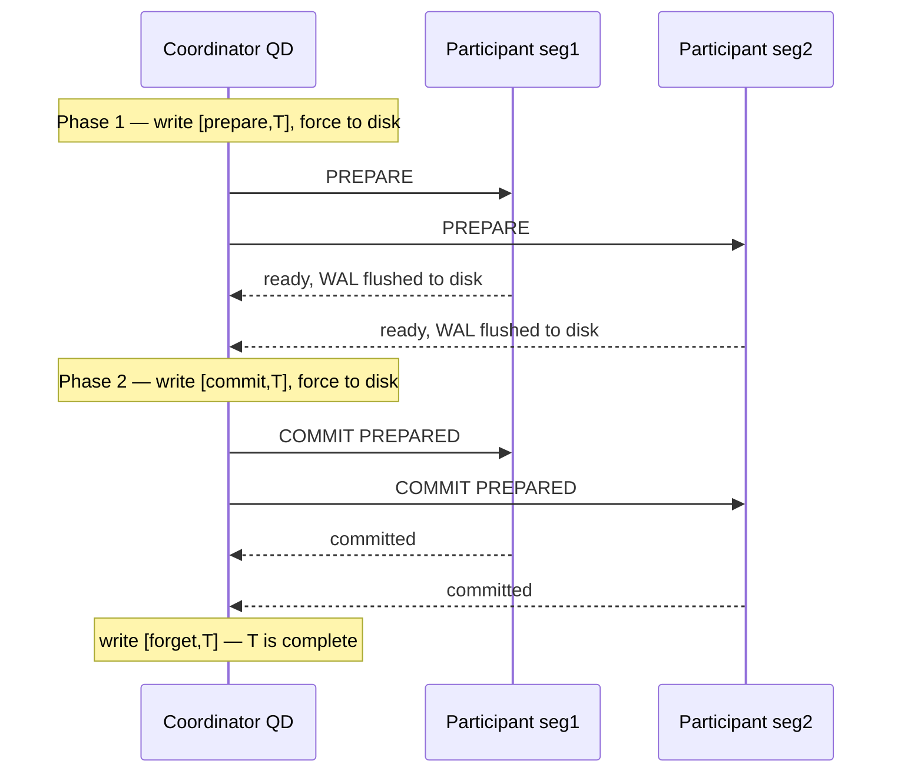
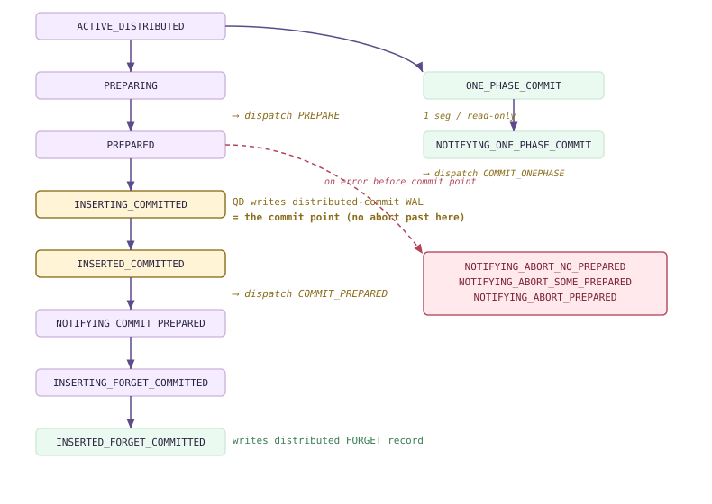
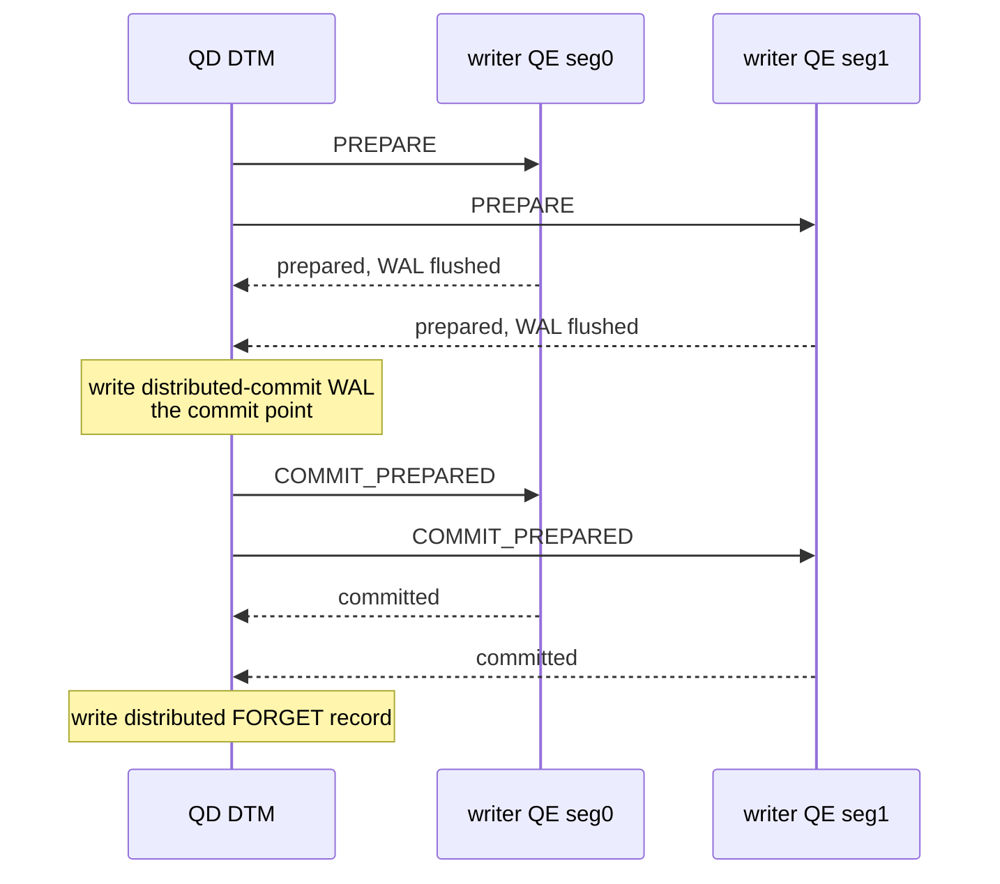
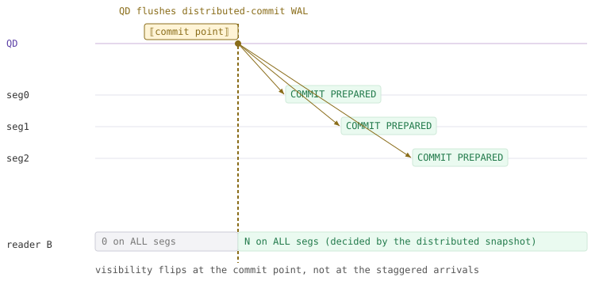
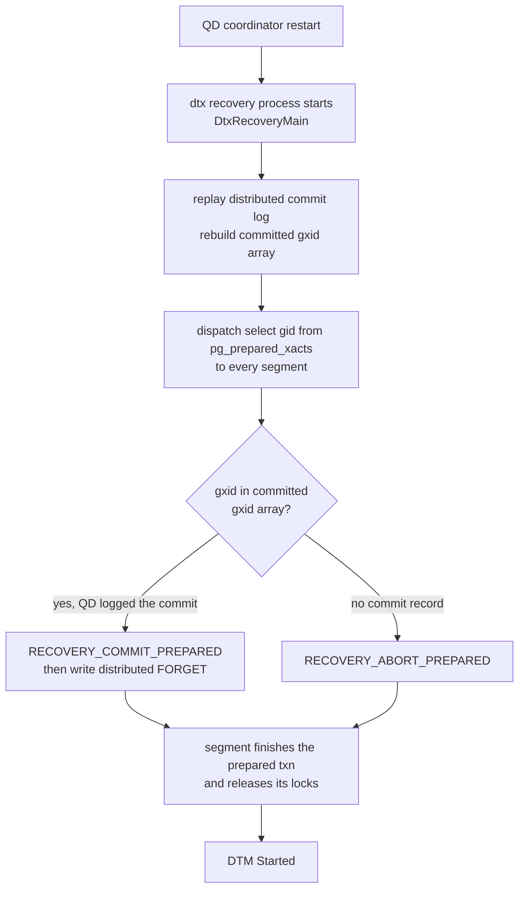
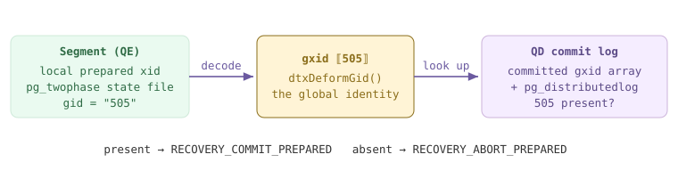

<!--
  Licensed to the Apache Software Foundation (ASF) under one
  or more contributor license agreements.  See the NOTICE file
  distributed with this work for additional information
  regarding copyright ownership.  The ASF licenses this file
  to you under the Apache License, Version 2.0 (the
  "License"); you may not use this file except in compliance
  with the License.  You may obtain a copy of the License at

    http://www.apache.org/licenses/LICENSE-2.0

  Unless required by applicable law or agreed to in writing,
  software distributed under the License is distributed on an
  "AS IS" BASIS, WITHOUT WARRANTIES OR CONDITIONS OF ANY
  KIND, either express or implied.  See the License for the
  specific language governing permissions and limitations
  under the License.
-->

# 12. Distributed Transactions & 2PC

## 12.1 Two-Phase Commit Fundamentals

A Cloudberry transaction rarely lives on one machine. A single `INSERT ... SELECT` may write rows on segment 1, segment 2, and segment 3 at once, so *committing* it is not a local act — it is an agreement between several independent PostgreSQL instances that each run their own WAL, their own clog, and their own crash recovery. The transaction must be **all-or-nothing across all of them**: either every segment durably commits its slice, or none do. The protocol that buys this guarantee is **two-phase commit (2PC)**, and the whole of Chapter 12 is really the story of how Cloudberry drives it.

To see why one round of messaging is not enough, borrow the book's three-node example. A user submits a transaction *T* through node **A**; *T* updates *X* on node **B** and *Y* on node **C**. Suppose A simply broadcasts *commit now*. B flushes *X* and commits — but C updates *Y*, then crashes before its change reaches stable storage. On restart C's recovery rolls *T* back; the update to *Y* is lost. Now B shows *T* as committed and C shows it as aborted: the cluster is permanently inconsistent, and atomicity is broken. The flaw is the **window** between B committing and C committing, during which a crash can split the outcome.



*The 2PC message exchange: PREPARE gathers durable 'ready' votes, then COMMIT PREPARED finalizes. No participant commits until every participant has promised it can.*

2PC closes that window by inserting a *point of no return* that every participant reaches **before anyone commits**. It splits the commit into a voting phase and a finalizing phase, with a durable promise separating them.

### 12.1.1 Why a distributed transaction needs an atomic commit protocol

A distributed transaction is a nested transaction: one logical *T* is composed of a local sub-transaction on each participating node, and atomicity demands they share a single fate. On a *centralized* server this is free — all resource managers write to one shared WAL, so a single `<commit>` record flushed once decides everything at a stroke. Across a cluster there is no shared WAL: each segment fsyncs independently, and the network can reorder, delay, or drop the coordinator's messages. Without a protocol, the coordinator can never know whether a silent participant committed, aborted, or simply hasn't answered yet.

2PC was proposed (Gray et al.) precisely for this setting: a **coordinator** orchestrates a set of **participants**, and the protocol's rules make it impossible for two participants to disagree about *T*'s outcome, even across crashes. In the A/B/C example, A is the coordinator and B and C are participants; when *T* has finished executing, B and C tell A they are done, and A begins the two-phase commit.

:::note

2PC is a **commit** protocol, not a locking or isolation protocol. Distributed *visibility* — deciding which committed transactions a query may see across segments — is a separate mechanism (distributed snapshots over global xids), already covered in **[§10.5](./ch10.md#105-distributed-snapshots--the-distributed-log)**. This section is only about reaching an atomic *decision*.

:::

### 12.1.2 The two phases

**Phase 1 — PREPARE (the vote).** The coordinator writes a `<prepare,T>` record and forces its own log to durable storage, then sends a `PREPARE` message to every participant. Each participant decides whether it *can* commit its slice of *T*. If anything is wrong it writes `<not prepared,T>` and replies **abort**. If it can commit, it flushes *all* of *T*'s WAL plus a `<ready,T>` record to disk, and only then replies **ready**. The disk flush before the reply is the crux — we return to it below.

**Phase 2 — COMMIT (the decision).** Once the coordinator has collected a reply from every participant, the outcome is determined: **all** replied ready ⇒ commit; **any** aborted or timed out ⇒ abort. To commit, the coordinator writes `<commit,T>`, forces it to disk (this record *is* the decision), and sends `COMMIT PREPARED` to every participant; each finalizes its prepared transaction — updating clog, releasing locks — and acknowledges. When all acknowledge, the coordinator writes a final `<forget,T>` (a.k.a. `<complete,T>`) record and may release its own resources.

- **Phase 1: PREPARE** — Coordinator forces `<prepare,T>`; each participant flushes its transaction WAL + a durable `<ready,T>` and votes **ready** or **abort**. This is the point of no return for the participant.
- **Phase 2: COMMIT** — Coordinator forces the decision record (`<commit,T>` or `<abort,T>`) — this single durable write commits the whole distributed transaction — then broadcasts `COMMIT PREPARED` / `ABORT PREPARED` and collects acknowledgements.
- **The invariant** — A participant that has replied **ready** must be able to honor *either* COMMIT *or* ABORT after an arbitrary crash. It has given up the right to decide unilaterally.

That invariant is the whole reason a participant flushes to disk *before* answering ready. Having voted ready, it no longer controls the outcome — the coordinator does. So if it crashes the instant after replying, recovery must be able to restore *T* to its prepared state and then obey whatever the coordinator eventually says. A participant that only buffered its changes in memory could not keep that promise; the flush is what makes 'ready' a binding, crash-proof commitment.

:::note

Recovery reads its own log after a crash: a participant that finds `&lt;commit,T&gt;` redoes T, one that finds `&lt;abort,T&gt;` undoes it, and one that finds only `&lt;ready,T&gt;` must **ask the coordinator** what happened — it is an *in-doubt* transaction.

:::

### 12.1.3 The blocking problem

2PC's famous weakness lives in exactly that in-doubt state. Suppose every participant has voted ready and is holding *T*'s locks, waiting for phase 2 — and now the **coordinator** crashes (or the network partitions) before the decision arrives. A participant cannot commit on its own: some peer might have aborted. It cannot abort on its own: the coordinator might have already decided commit and told others. It can only **block** — holding *T*'s locks and resources — until the coordinator recovers and republishes the decision. Other transactions that conflict with those locks wait too.

This is why 2PC is a *blocking* protocol, and why the coordinator's log is sacred: it is the single source of truth that unblocks everyone. (Three-phase commit reduces blocking at the cost of more states and messages; almost no production database ships it.) Cloudberry's answer is a robust recovery path — a background process that re-drives phase 2 for in-doubt transactions after a coordinator restart — covered in **[§12.4](#124-dtx-recovery--localdistributed-mapping)** together with the WAL reconciliation in **[§20.4](../part-5-high-availability-recovery/ch20.md#204-system-recovery).4**.

### 12.1.4 PostgreSQL's participant-only 2PC — the machinery Cloudberry builds on

PostgreSQL is a centralized database and ships **no distributed transaction manager**. What it *does* provide is the **participant half** of 2PC, exposed as three SQL commands. There is no built-in coordinator — an external transaction manager (or, here, Cloudberry) plays that role and drives each PostgreSQL instance through these verbs:

- **PREPARE TRANSACTION 'gid'** — Phase 1 on this node: flush the transaction's WAL and a prepared record to disk, hand its locks to a dummy PGPROC, and leave *T* in-doubt under the global id `gid`. The session's transaction block is now over, but *T* is neither committed nor aborted.
- **COMMIT PREPARED 'gid'** — Phase 2 finalize: look up the prepared transaction by `gid` and commit it durably. Issued by the coordinator after every participant voted ready.
- **ROLLBACK PREPARED 'gid'** — Phase 2 abort: discard the prepared transaction identified by `gid` and release its resources.

This machinery is gated by the GUC `max_prepared_transactions`: it must be greater than zero (it sizes the shared array of prepared-transaction slots) or `PREPARE TRANSACTION` errors out. On our cluster it is comfortably positive on both the coordinator and the segments — 2PC is armed everywhere:

*max_prepared_transactions > 0 on both tiers — the participant machinery is enabled cluster-wide.*

```sql
-- coordinator (QD), port 7100
SHOW max_prepared_transactions;

-- a segment (QE) in utility mode, port 7102
PGOPTIONS='-c gp_role=utility' psql -p 7102 \
    -d postgres -c 'SHOW max_prepared_transactions;'
```

```text {3} title="output"
 max_prepared_transactions 
---------------------------
 250

 max_prepared_transactions 
---------------------------
 250
```

A prepared transaction is *durable state that outlives the session that made it*: PostgreSQL writes an `XLOG_XACT_PREPARE` WAL record and, at checkpoint or crash, materializes a per-transaction state file under the `pg_twophase/` directory (`src/backend/access/transam/twophase.c:124`). The `EndPrepare` routine is where 'ready' becomes durable — it inserts the prepare record into WAL and then forces it to disk before returning to the caller:

```c title="src/backend/access/transam/twophase.c:1248"
gxact->prepare_end_lsn =
    XLogInsert(RM_XACT_ID, XLOG_XACT_PREPARE);
...
XLogFlush(gxact->prepare_end_lsn);
/* If we crash now, we have prepared: WAL replay will fix things */
```

That `XLogFlush` is the 2PC invariant realized in one line: control does not return — and the segment does not report *ready* to its coordinator — until the prepare record is on disk. The comment says it plainly: after this point a crash is survivable, because replay reconstructs the prepared transaction. Any node currently in this state is visible through the `pg_prepared_xacts` view. On a quiet cluster it is empty, but its columns show exactly what a coordinator needs to reconcile an in-doubt transaction — the global id and when it was prepared:

*pg_prepared_xacts — the in-doubt registry. Empty here (no transaction is mid-2PC), but note the gid column.*

```sql
SELECT * FROM pg_prepared_xacts;

\d pg_prepared_xacts
```

```text {8} title="output"
 transaction | gid | prepared | owner | database 
-------------+-----+----------+-------+----------
(0 rows)

   Column    |           Type           
-------------+--------------------------
 transaction | xid
 gid       | text
 prepared    | timestamp with time zone
 owner       | name
 database    | name
```

One twist: although each segment *implements* the participant commands, Cloudberry forbids a user from calling them directly. Try `PREPARE TRANSACTION` on a segment in utility mode and it is rejected outright — the primitive is reserved for the distributed transaction manager, which alone is allowed to choose global ids and coordinate the vote:

*Cloudberry blocks direct user PREPARE — the participant half is driven only by the DTM, never by hand.*

```sql
-- on a segment, utility mode (port 7102)
BEGIN;
INSERT INTO dtx121_t VALUES (1),(2);
PREPARE TRANSACTION 'dtx121_demo';
```

```text {3} title="output"
BEGIN
INSERT 0 2
ERROR:  PREPARE TRANSACTION is not supported in utility mode
```

```c title="src/backend/tcop/postgres.c:1853"
/* GPDB: in utility mode, disallow PREPARE TRANSACTION */
if (Gp_role == GP_ROLE_UTILITY && IsA(parsetree->stmt, TransactionStmt) &&
    ((TransactionStmt *) parsetree->stmt)->kind == TRANS_STMT_PREPARE)
    ereport(ERROR,
            (errcode(ERRCODE_FEATURE_NOT_SUPPORTED),
             errmsg("PREPARE TRANSACTION is not supported in utility mode")));
```

So the division of labor is clean, and it defines the rest of this chapter. PostgreSQL supplies the *participant*: durable PREPARE, a `pg_twophase` state file, the ability to honor COMMIT PREPARED or ROLLBACK PREPARED after a crash. Cloudberry supplies the *coordinator* on top of it: the QD assigns a global transaction id, tracks which segments joined the write, drives them through PREPARE → COMMIT PREPARED as a state machine, and logs the distributed decision durably. **[§12.2](#122-cloudberrys-2pc-cdbtm-dtxstate--dtxcontext)** builds exactly that coordinator — the `DtxState` machine and the QD→QE protocol commands — directly on the participant machinery shown here.

:::note

Cross-refs: **[§10.5](./ch10.md#105-distributed-snapshots--the-distributed-log)** distributed snapshots &amp; global xids; **[§12.2](#122-cloudberrys-2pc-cdbtm-dtxstate--dtxcontext)** Cloudberry's coordinator (DtxState, DtxProtocolCommand) atop this participant layer; **[§12.4](#124-dtx-recovery--localdistributed-mapping)** the blocking problem's cure — dtx recovery of in-doubt transactions; **[§20.4](../part-5-high-availability-recovery/ch20.md#204-system-recovery).4–20.4.5** the WAL-level crash reconciliation.

:::

## 12.2 Cloudberry's 2PC: cdbtm, DtxState & DtxContext

:::info

↔ This section owns the **runtime 2PC protocol** — the QD `DtxState` / QE `DtxContext` state machines that drive commit across segments. The *durable* side is in Chapter 20: WAL encoding of distributed commit/forget in [§20.2](../part-5-high-availability-recovery/ch20.md#202-write-ahead-logging-wal).7–20.2.9, crash-time reconciliation of in-doubt 2PC in [§20.4](../part-5-high-availability-recovery/ch20.md#204-system-recovery).4, and how a segment’s prepared state survives a crash in [§20.4](../part-5-high-availability-recovery/ch20.md#204-system-recovery).5.

:::

Cloudberry's two-phase commit is not a bolted-on extension — it is a state machine driven by a **distributed transaction manager (DTM)** that lives entirely on the QD. The DTM's home is `src/backend/cdb/cdbtm.c`. When a statement first needs distributed work, the QD assigns a **distributed transaction id (gxid)**, records it in the shared `MyTmGxact` slot, and steps its own DTX into `DTX_STATE_ACTIVE_DISTRIBUTED`. From there, committing means walking a fixed sequence of states, dispatching one wire verb per phase to the writer QEs. This section owns that *runtime* protocol; the durable WAL side — how the distributed-commit and forget records are encoded and replayed — lives in Ch20 ([§20.2](../part-5-high-availability-recovery/ch20.md#202-write-ahead-logging-wal).7–20.2.9, [§20.4](../part-5-high-availability-recovery/ch20.md#204-system-recovery).4).

Keep one distinction from Ch9 in mind: a *distributed* transaction has ONE gxid, but it maps to one ordinary **local xid per participating segment** ([§9.2](./ch09.md#92-the-transaction-manager)). The gxid is what ties those local xids together into an atomic unit, and it is the key of the distributed snapshot machinery you met in [§10.5](./ch10.md#105-distributed-snapshots--the-distributed-log). The QD-side state machine below is the centerpiece of the whole chapter — read it first, then we walk it.



*The DtxState commit machine on the QD (all names are DTX_STATE_*). Green spine = happy-path 2PC; amber = the commit point; right column = the one-phase shortcut; rose = the pre-commit abort branch.*

Two things to read off the figure. First, the **spine is strictly ordered**: `ACTIVE_DISTRIBUTED → PREPARING → PREPARED → INSERTING_COMMITTED → INSERTED_COMMITTED → NOTIFYING_COMMIT_PREPARED → INSERTING/INSERTED_FORGET_COMMITTED`. Second, the amber row is the **commit point** — once the QD has written its own distributed-commit WAL record, the transaction is *decided*; any later failure can only roll **forward** (`RETRY_COMMIT_PREPARED`), never back. Everything to the right of the spine is an off-ramp: the one-phase shortcut (top) and the pre-commit abort branch (bottom).

### 12.2.1 The distributed transaction manager lives on the QD

The gxid is minted lazily. Only when the executor decides a statement writes does the QD call `currentDtxActivate()` (`src/backend/cdb/cdbtm.c:263`), which grabs the next value from the shared gxid counter, stores it in `MyTmGxact->gxid`, records the session id, and flips the DTX into its first real state.

```c title="src/backend/cdb/cdbtm.c:313"
SpinLockAcquire(shmGxidGenLock);
if (ShmemVariableCache->GxidCount > 0)
{
    pg_atomic_write_u64(&MyTmGxact->atomic_gxid,
                        ShmemVariableCache->nextGxid++);
    MyTmGxact->gxid = MyTmGxact->atomic_gxid.value;
    ShmemVariableCache->GxidCount--;
    ...
}
MyTmGxact->sessionId = gp_session_id;
setCurrentDtxState(DTX_STATE_ACTIVE_DISTRIBUTED);   /* :342 */
```

`MyTmGxact` is the distributed sibling of the local `PGPROC`/xact state from Ch9 — a per-backend slot in a shared array on both the QD and every QE. The gxid it holds is *the* handle for the whole distributed transaction; contrast it with the segment-local xid ([§9.2](./ch09.md#92-the-transaction-manager)) and recall that a distributed snapshot ([§10.5](./ch10.md#105-distributed-snapshots--the-distributed-log)) is a set of these gxids, not local xids.

You can watch a live gxid. In one session open a distributed write and leave it uncommitted; `gp_distributed_xacts` then shows the QD's in-flight DTX (here queried from inside the same open transaction):

*A distributed write in flight — one gxid, three participating segments.*

```sql
BEGIN;
INSERT INTO dtx122_multi SELECT generate_series(1,1000);
SELECT distributed_xid, state, gp_session_id
  FROM gp_distributed_xacts;
SELECT gp_segment_id, count(*)
  FROM dtx122_multi GROUP BY 1 ORDER BY 1;
```

```text {3} title="output"
 distributed_xid | state | gp_session_id
-----------------+-------+---------------
             499 | None  |          3001
               0 | None  |             0     -- (unused proc slots)
               ...
(7 rows)

 gp_segment_id | count
---------------+-------
             0 |   338
             1 |   322
             2 |   340    <- rows on ALL 3 segments
```

gxid `499` belongs to session 3001. The row-count query proves the write touched all three primaries — so at commit the QD *must* run the full two-phase spine. (The zero rows are simply idle slots in the shared `TMGXACT` array.)

### 12.2.2 Walking the commit spine

Phase one is `doPrepareTransaction()` (`cdbtm.c:483`). It asserts the DTX is `ACTIVE_DISTRIBUTED`, moves it to `PREPARING`, dispatches `DTX_PROTOCOL_COMMAND_PREPARE` to every writer QE, and on success advances to `PREPARED`. The dispatch is synchronous — the QD blocks until all segments have flushed their prepare records and answered.

```c title="src/backend/cdb/cdbtm.c:498"
Assert(MyTmGxactLocal->state == DTX_STATE_ACTIVE_DISTRIBUTED);
setCurrentDtxState(DTX_STATE_PREPARING);
...
succeeded = currentDtxDispatchProtocolCommand(
                DTX_PROTOCOL_COMMAND_PREPARE, true);
...
Assert(MyTmGxactLocal->state == DTX_STATE_PREPARING);
setCurrentDtxState(DTX_STATE_PREPARED);
```

Between `PREPARED` and phase two comes the commit point. The QD moves through `INSERTING_COMMITTED` → `INSERTED_COMMITTED` (`insertingDistributedCommitted()`, `cdbtm.c:1527`) as it writes its own **distributed-commit** WAL record — the durable decision. Only *after* that record is flushed does `doNotifyingCommitPrepared()` (`cdbtm.c:575`) run phase two.

```c title="src/backend/cdb/cdbtm.c:587"
Assert(MyTmGxactLocal->state == DTX_STATE_INSERTED_COMMITTED);
setCurrentDtxState(DTX_STATE_NOTIFYING_COMMIT_PREPARED);
...
succeeded = currentDtxDispatchProtocolCommand(
                DTX_PROTOCOL_COMMAND_COMMIT_PREPARED, true);
```



*Full 2PC message exchange QD ↔ writer QEs. The QD's own commit-point WAL sits between the two dispatch rounds.*

After both QEs acknowledge, the QD writes the **forget** record (`INSERTING_FORGET_COMMITTED` → `INSERTED_FORGET_COMMITTED`, `doInsertForgetCommitted()` at `cdbtm.c:533`), which says "this distributed txn is fully resolved — stop tracking it for recovery." The abort branch mirrors this: if PREPARE fails, the QD takes `NOTIFYING_ABORT_NO_PREPARED` / `_SOME_PREPARED` / `_PREPARED` depending on how far prepare got. The byte layout of these WAL records and their crash-replay is [§20.2](../part-5-high-availability-recovery/ch20.md#202-write-ahead-logging-wal).7–20.2.9 / [§20.4](../part-5-high-availability-recovery/ch20.md#204-system-recovery).4; recovery of in-doubt txns is [§12.4](#124-dtx-recovery--localdistributed-mapping).

:::note

Want to see the spine tick over live? The developer GUC `Debug_print_full_dtm` (default **off**) gates the `DTM_DEBUG5` elogs inside each transition (`doPrepareTransaction moved to state = ...`). It is a per-session `SET`, but the messages only surface at `DEBUG5`, so it is a code-reading aid more than a demo tool.

:::

### 12.2.3 The one-phase-commit optimization

If a write reached only ONE segment, the whole PREPARE round is pointless: a single participant means there is no cross-node atomicity gap to protect against. That segment committing *is* the transaction committing. `prepareDtxTransaction()` detects this and skips straight to the shortcut.

```c title="src/backend/cdb/cdbtm.c:910"
if (!TopXactExecutorDidWriteXLog() ||
    (!markXidCommitted && list_length(MyTmGxactLocal->dtxSegments) < 2))
{
    setCurrentDtxState(DTX_STATE_ONE_PHASE_COMMIT);
    doNotifyingOnePhaseCommit();
    return;
}
...
doPrepareTransaction();   /* else: full 2PC */
```

The two triggers: the transaction wrote no xlog at all (read-only), or it wrote but touched fewer than two segments. In that case `doNotifyingOnePhaseCommit()` (`cdbtm.c:551`) moves to `NOTIFYING_ONE_PHASE_COMMIT` and dispatches a single `DTX_PROTOCOL_COMMAND_COMMIT_ONEPHASE` — no distributed-commit WAL record, no forget, no second round. This is the book's *one-phase commit* ([§8.4](../part-2-storage-data-layout/ch08.md#84-bootstrap--generation).3): the coordinator hands the commit decision to the lone participant. The multi-segment INSERT of [§12.2](#122-cloudberrys-2pc-cdbtm-dtxstate--dtxcontext).1 hit all three segments, so it did NOT qualify; a write that hashes to a single segment would.

### 12.2.4 The QE side: DtxContext roles

Every backend carries a global `DistributedTransactionContext` (declared `src/include/cdb/cdbtm.h:287`, enum `DtxContext` at `cdbtm.h:128–194`) naming its role. The QD is `QD_DISTRIBUTED_CAPABLE`; a QE is filled in by `setupQEDtxContext()` (`cdbtm.c:1731`) from the `QEDtxContextInfo` the QD serializes and ships alongside *every* dispatched command — the same gang/dispatch channel of [§1.4](../part-1-introduction/ch01.md#14-clients-the-wire-protocol--dispatch) that carries the plan. That is how the QD's gxid, distributed snapshot, and 2PC intent reach the segments (the book's Figure 8-8).

| DtxContext value | Which process, and when |
| --- | --- |
| LOCAL_ONLY | Any backend with no distributed work — utility mode, coordinator-only query. Initial and between-txn state. |
| QD_DISTRIBUTED_CAPABLE | The QD while it drives a distributed transaction (the DTM role). |
| QD_RETRY_PHASE_2 | The QD replaying phase two (commit/abort prepared) after a dispatch failure. |
| QE_ENTRY_DB_SINGLETON | Entry-DB singleton QE on the coordinator segment. |
| QE_AUTO_COMMIT_IMPLICIT | Root QE of a non-writing autocommit query — no 2PC needed. |
| QE_TWO_PHASE_EXPLICIT_WRITER | Writer QE where the txn was opened by an explicit BEGIN. |
| QE_TWO_PHASE_IMPLICIT_WRITER | Writer QE where an autocommit writing query opened the txn. |
| QE_READER | Non-root QE — shares the writer's snapshot ([§10.5](./ch10.md#105-distributed-snapshots--the-distributed-log)), never prepares. |
| QE_PREPARED | Writer QE after phase one (PREPARE) completed. |
| QE_FINISH_PREPARED | Writer QE after phase two (commit/abort prepared) completed. |

The split matters for correctness: only the two `_WRITER` contexts actually run PREPARE and hold the prepared-transaction resources; a `QE_READER` merely borrows the writer's distributed snapshot and is never asked to commit anything. So on a 3-segment cluster a single distributed transaction may have three writer QEs prepared while any number of reader QEs simply come and go.

### 12.2.5 DtxProtocolCommand: the wire verbs

The commands the QD dispatches are the `DTX_PROTOCOL_COMMAND_*` family (`cdbtm.h:97–117`): `PREPARE`, `COMMIT_ONEPHASE`, `COMMIT_PREPARED`, the three `ABORT_*` variants, `RETRY_{COMMIT,ABORT}_PREPARED`, and the `RECOVERY_*` pair used by the recovery process ([§12.4](#124-dtx-recovery--localdistributed-mapping)) — plus the subtransaction verbs. On the QE, `performDtxProtocolCommand()` (`cdbtm.c:2220`) is the single entry point that decodes the verb against the local `DistributedTransactionContext` and calls the matching worker.

```c title="src/backend/cdb/cdbtm.c:2244"
case DTX_PROTOCOL_COMMAND_PREPARE:
case DTX_PROTOCOL_COMMAND_COMMIT_ONEPHASE:
    switch (DistributedTransactionContext)
    {
    case DTX_CONTEXT_QE_TWO_PHASE_EXPLICIT_WRITER:
    case DTX_CONTEXT_QE_TWO_PHASE_IMPLICIT_WRITER:
        if (dtxProtocolCommand == DTX_PROTOCOL_COMMAND_COMMIT_ONEPHASE)
            performDtxProtocolCommitOnePhase(gid);
        else
            performDtxProtocolPrepare(gid);
        break;
    ...
```

`COMMIT_PREPARED` and `ABORT_PREPARED` land in `performDtxProtocolCommitPrepared()` (`cdbtm.c:2143`) / `performDtxProtocolAbortPrepared()`, which drive the underlying PostgreSQL two-phase machinery (`twophase.c`) that the segments inherit — Cloudberry's participants ARE PostgreSQL prepared transactions, coordinated by the QD's DTM. The `RECOVERY_*` verbs are the same commit/abort, re-issued by a dedicated background process; you can see it running per cluster:

*The dtx recovery process is always present; with no crash, no in-doubt txns exist.*

```sql
$ ps -ef | grep 'dtx recovery process'
$ psql -p 7100 -c 'SELECT * FROM pg_prepared_xacts;'
```

```text {1} title="output"
gpadmin 6021 ... postgres: 7100, dtx recovery process

 transaction | gid | prepared | owner | database
-------------+-----+----------+-------+----------
(0 rows)
```

When a segment did crash mid-2PC, its prepared txns survive in `pg_prepared_xacts` (and on disk under `pg_twophase`, [§20.4](../part-5-high-availability-recovery/ch20.md#204-system-recovery).5); the `dtx recovery process` reconciles them against the QD's committed/forget records and re-issues `RECOVERY_COMMIT_PREPARED` or `RECOVERY_ABORT_PREPARED`. That reconciliation is the subject of [§12.4](#124-dtx-recovery--localdistributed-mapping), and how commit ordering makes the result *visible* is [§12.3](#123-distributed-commit-ordering).

## 12.3 Distributed Commit Ordering

[§12.2](#122-cloudberrys-2pc-cdbtm-dtxstate--dtxcontext) made a distributed transaction *all-or-nothing*: every participating segment either COMMITs PREPARED or ABORTs. But atomicity in the durable sense is not the same question as *visibility*. The `COMMIT PREPARED` messages leave the QD and land on seg0, seg1, seg2 at slightly different instants; for a brief window one segment's local xid is committed in its CLOG while another's is not. So we must answer an orthogonal question: **when — and how atomically — does a distributed transaction become visible to a reader**, such that no reader ever sees its rows on some segments but not others?

The answer has two halves. First, there is a single instant that decides commit-versus-abort for the *whole* distributed transaction — the **commit point**. Second, a reader never decides visibility from a segment's local CLOG alone; it decides by a **distributed snapshot** ([§10.5](./ch10.md#105-distributed-snapshots--the-distributed-log)) that flips from *in-progress* to *committed* as one logical event tied to that commit point. Together they make the per-segment `COMMIT PREPARED` stagger invisible.



*The commit point serializes the whole distributed txn; visibility flips there, not at the staggered COMMIT PREPARED arrivals.*

### 12.3.1 The commit point

Recall the QD's state machine from [§12.2](#122-cloudberrys-2pc-cdbtm-dtxstate--dtxcontext). After every writer QE has answered PREPARE, the QD enters `DTX_STATE_INSERTING_COMMITTED` and writes its **own** local commit record. Because this transaction was two-phase-prepared, that record is not a plain `XLOG_XACT_COMMIT` — it is a distributed-commit record. `RecordTransactionCommit()` chooses the record type by `isDtxPrepared` in `src/backend/access/transam/xact.c:6997`.

```c title="src/backend/access/transam/xact.c:6997"
/* decide between a plain and 2pc commit */
if (isDtxPrepared)
    info = XLOG_XACT_DISTRIBUTED_COMMIT;
else if (!TransactionIdIsValid(twophase_xid))
    info = XLOG_XACT_COMMIT;
else
    info = XLOG_XACT_COMMIT_PREPARED;
```

The two DtxState transitions from [§12.2](#122-cloudberrys-2pc-cdbtm-dtxstate--dtxcontext) bracket the actual `XLogInsert` of that record: `insertingDistributedCommitted()` right before, `insertedDistributedCommitted()` right after (`src/backend/access/transam/xact.c:7160`). The record is now *in the WAL buffer*, but not yet durable.

```c title="src/backend/access/transam/xact.c:7160"
if (isDtxPrepared)
    insertingDistributedCommitted();

recptr = XLogInsert(RM_XACT_ID, info);

if (isDtxPrepared)
    insertedDistributedCommitted();
```

Durability — and therefore the commit decision — is sealed a few lines later, when `RecordTransactionCommit()` **flushes** the WAL up to this record. In Cloudberry every user transaction commits synchronously precisely because the cluster relies on two-phase commit, so this flush is not optional.

```c title="src/backend/access/transam/xact.c:1759"
if ((wrote_xlog && markXidCommitted &&
     synchronous_commit > SYNCHRONOUS_COMMIT_OFF) ||
    forceSyncCommit || nrels > 0)
{
    XLogFlush(XactLastRecEnd);   /* <-- the distributed commit point */
```

**This flush is the single serialization point for the entire distributed transaction.** Before it returns, a crash on the QD aborts everything: no distributed-commit record survives, so recovery treats the txn as never committed and the prepared txns on the segments are rolled back. After it returns, the txn is committed forever: even if the QD crashes before a single `COMMIT PREPARED` reaches a segment, crash recovery finds the distributed-commit record, replays it, and re-drives phase 2 to roll the txn **forward** on every segment ([§12.4](#124-dtx-recovery--localdistributed-mapping); WAL encoding in [§20.2](../part-5-high-availability-recovery/ch20.md#202-write-ahead-logging-wal).7–20.2.9, in-doubt reconciliation in [§20.4](../part-5-high-availability-recovery/ch20.md#204-system-recovery).4).

Only *after* the commit point does phase 2 begin. `CommitTransaction()` calls `notifyCommittedDtxTransaction()` (`src/backend/access/transam/xact.c:3026`), which reads the QD's DtxState and — because it is now `DTX_STATE_INSERTED_COMMITTED` — dispatches `COMMIT PREPARED` to the segments.

```c title="src/backend/cdb/cdbtm.c:390"
switch(MyTmGxactLocal->state)
{
    case DTX_STATE_INSERTED_COMMITTED:
        doNotifyingCommitPrepared();
        break;
    case DTX_STATE_NOTIFYING_ONE_PHASE_COMMIT:
    case DTX_STATE_ONE_PHASE_COMMIT:
        break;   /* one-phase: nothing more to notify */
    ...
```

:::note

So **the commit record comes first, the segment COMMIT PREPARED messages second**. This ordering is what lets recovery be deterministic: the durable QD record is the source of truth, and phase 2 is merely its replay — during normal running or after a crash alike.

:::

### 12.3.2 Why per-segment timing is not a visibility anomaly

`doNotifyingCommitPrepared()` moves the QD to `DTX_STATE_NOTIFYING_COMMIT_PREPARED` and broadcasts the protocol command to all participating segments (`src/backend/cdb/cdbtm.c:588`). The dispatch is parallel but the acknowledgements arrive at different times, so the segments flip their *local* CLOG entries at slightly staggered instants.

```c title="src/backend/cdb/cdbtm.c:588"
setCurrentDtxState(DTX_STATE_NOTIFYING_COMMIT_PREPARED);
...
succeeded = currentDtxDispatchProtocolCommand(
                DTX_PROTOCOL_COMMAND_COMMIT_PREPARED, true);
```

A *naive* reader that consulted only each segment's local CLOG would be exposed to this stagger: for a few milliseconds seg0's local xid is committed while seg1's is not, so a distributed `count(*)` could add seg0's rows but miss seg1's — a torn read that violates atomic visibility.

Cloudberry closes this window with the **distributed snapshot** (the mechanism is fully derived in [§10.5](./ch10.md#105-distributed-snapshots--the-distributed-log) — we only use it here). A reader's snapshot is taken on the QD as a set of *in-progress* gxids plus a distributed `xmax`, and is shipped to every QE with the plan. Visibility of a tuple is judged by the **gxid** of its creating transaction against that one shared snapshot, not by any local CLOG in isolation. A gxid that is *not* in the in-progress set and lies at or below the distributed complete horizon is visible on **all** segments at once; a gxid still in the in-progress set is invisible on **all** segments at once. Because the snapshot is a single QD-side object, the flip from in-progress to committed is one logical event, aligned to the commit point of [§12.3](#123-distributed-commit-ordering).1 — regardless of the physical per-segment `COMMIT PREPARED` timing.

### 12.3.3 Demonstration: 0-everywhere to N-everywhere

The payoff is observable on the live cluster. We create `dtx123_t` distributed across all three segments, then in session A open a transaction, insert a batch that lands on every segment, and hold it open.

*Session A — a distributed write across all segments, held open (uncommitted)*

```sql
BEGIN;
INSERT INTO dtx123_t
  SELECT g, 'new' FROM generate_series(1,12) g;   -- lands on all 3 segments
SELECT count(*) FROM dtx123_t;                    -- A sees its own writes
```

```text {5} title="output"
BEGIN
INSERT 0 12
 count
-------
    12
(1 row)
-- (transaction left open)
```

Session B, running concurrently, sees the *old* state — and, crucially, a **consistent** old state on every segment. Never a partial count.

*Session B while A is open — a consistent PRE-commit view on every segment*

```sql
SELECT count(*) FROM dtx123_t;
SELECT gp_segment_id, count(*) FROM dtx123_t GROUP BY 1 ORDER BY 1;
```

```text {3} title="output"
 count
-------
    0
(1 row)

 gp_segment_id | count
---------------+-------
(0 rows)
```

A's transaction is live and carries a distributed xid — the same **gxid** concept from [§12.2](#122-cloudberrys-2pc-cdbtm-dtxstate--dtxcontext). `gp_distributed_xacts` exposes it cluster-wide; here A's gxid is `509`, and the distributed-snapshot `xmin` sits at the same value.

*The open distributed txn's gxid (the gxid of [§12.2](#122-cloudberrys-2pc-cdbtm-dtxstate--dtxcontext))*

```sql
SELECT distributed_xid, state, gp_session_id, xmin_distributed_snapshot
  FROM gp_distributed_xacts WHERE gp_session_id > 0;
```

```text {3} title="output"
 distributed_xid | state | gp_session_id | xmin_distributed_snapshot
-----------------+-------+---------------+---------------------------
             509 | None  |          3031 |                       509
(1 row)
```

:::note

The **state** column reads `None` because the QD-side DtxState (`DTX_STATE_ACTIVE_DISTRIBUTED`, [§12.2](#122-cloudberrys-2pc-cdbtm-dtxstate--dtxcontext)) lives in the QD's backend-local `MyTmGxactLocal`; the cluster-wide view exposes the shared gxid slot. The load-bearing fact is that gxid **509** is present in the in-progress set, so its rows are invisible everywhere at once.

:::

Now A commits. On its next statement, session B sees the **full** count — and it appears on every segment simultaneously. The reader went straight from *0 everywhere* to *N everywhere* with no intermediate torn state.

*Session B after A commits — the FULL count appears on every segment at once*

```sql
-- A has now issued COMMIT
SELECT count(*) FROM dtx123_t;
SELECT gp_segment_id, count(*) FROM dtx123_t GROUP BY 1 ORDER BY 1;
```

```text {3} title="output"
 count
-------
    12
(1 row)

 gp_segment_id | count
---------------+-------
             0 |     5
             1 |     2
             2 |     5
(3 rows)
```

The 12 rows were never partially visible. B's earlier snapshot listed gxid `509` as in-progress, hiding all 12; B's later snapshot no longer does, revealing all 12. The uneven per-segment split (5/2/5) and the physical `COMMIT PREPARED` stagger are irrelevant to the reader — the distributed snapshot decides, and it decides atomically.

### 12.3.4 Ordering within a gang: the Shared Local Snapshot

One subtlety keeps the guarantee airtight *within a single query on a single segment*. A query slice on a segment runs as a gang: one writer QE and possibly several reader QEs of the **same** session on that segment. If each picked its own moment to read local state, slices of one query could disagree. Cloudberry prevents this with the **Shared Local Snapshot** ([§10.5](./ch10.md#105-distributed-snapshots--the-distributed-log)): the writer QE publishes its snapshot into shared memory and the reader QEs of the gang copy it, so every slice of one query on one segment sees exactly the same set of committed transactions. [§10.5](./ch10.md#105-distributed-snapshots--the-distributed-log) owns the detail; here it is enough to know that the atomic cross-segment guarantee rests on this per-segment agreement plus the shared distributed snapshot above.

### 12.3.5 The distributed log: local xid → gxid → committed

How does a segment, holding only *local* xids in its heap tuples, evaluate a *distributed* snapshot that speaks in gxids? Through the `pg_distributedlog` SLRU ([§10.5](./ch10.md#105-distributed-snapshots--the-distributed-log)), which maps each local xid to its gxid and committed status. That is why, at the commit point, the distributed log is updated **before** the CLOG — the ordering is deliberate, as the source comment states:

```c title="src/backend/access/transam/xact.c:1783"
/*
 * Mark the distributed transaction committed. Note that this
 * is done *before* updating the clog. As soon as an XID is
 * marked as comitted in the clog, other backends might try
 * to look it up in the DistributedLog.
 */
if (isDtxPrepared || isOnePhaseQE)
    DistributedLog_SetCommittedTree(xid, nchildren, children,
                                    getDistributedTransactionId(), false);
TransactionIdCommitTree(xid, nchildren, children);
```

So the moment a reader can learn from the CLOG that a local xid committed, the distributed log already knows the gxid behind it — the reader can immediately answer *is the distributed transaction that created this tuple committed, relative to my distributed snapshot?* without a torn intermediate. The verdict, once computed, is cached in the tuple's `HEAP_XMIN_DISTRIBUTED_SNAPSHOT_IGNORE` / `HEAP_XMAX_DISTRIBUTED_SNAPSHOT_IGNORE` hint bits (`src/include/access/htup_details.h:279`), so later scans skip the distributed-log lookup entirely ([§10.5](./ch10.md#105-distributed-snapshots--the-distributed-log)).

Once every segment has acknowledged `COMMIT PREPARED`, the QD writes one final `XLOG_XACT_DISTRIBUTED_FORGET` record (`RecordDistributedForgetCommitted()`, `src/backend/cdb/cdbtm.c:542`), retiring the gxid from the recovery set. That record is the subject of [§12.4](#124-dtx-recovery--localdistributed-mapping), where the commit point earned here becomes the pivot for crash recovery.

## 12.4 DTX Recovery & Local↔Distributed Mapping

[§12.3](#123-distributed-commit-ordering) pinned down the *commit point*: the instant the QD flushes its distributed `COMMIT` record, the transaction is decided. But between the QD dispatching `PREPARE` and every segment finishing `COMMIT PREPARED` there is a window — and if the QD **crashes inside that window**, the segments that already answered *prepared* are stranded. Each such segment holds a durable prepared state (PostgreSQL's `pg_twophase/` state file, [§12.1](#121-two-phase-commit-fundamentals)) and every lock the transaction took, but it does **not** know the global verdict. This is precisely the blocking problem [§12.1](#121-two-phase-commit-fundamentals) warned about, now made concrete.

On its own an in-doubt segment can neither commit nor abort: committing risks violating atomicity if the QD actually aborted, aborting risks losing a committed transaction. It **must wait for the coordinator**. Left unresolved these prepared transactions pin locks and hold back `VACUUM` and xid advancement. Cloudberry resolves them with a dedicated background process and one simple rule — *the coordinator's durable commit log decides*.



*The DTX recovery loop: on coordinator restart the dtx recovery process reconciles every segment's in-doubt prepared transaction against the QD's distributed commit log.*

The rule mirrors book [§8.4](../part-2-storage-data-layout/ch08.md#84-bootstrap--generation).1's coordinator-failure handling exactly: a participant with a `ready` (prepared) record but no verdict asks the coordinator; if the coordinator's log holds the commit, redo it, otherwise undo it. Everything below is how Cloudberry implements that, plus the mapping that lets it translate a segment's local prepared xid back into a global decision.

### 12.4.1 In-doubt prepared transactions after a crash

A prepared segment transaction is an ordinary PostgreSQL 2PC participant. As [§12.1](#121-two-phase-commit-fundamentals) described, `PREPARE` moves the transaction's locks onto a *dummy* PGPROC and writes an `XLOG_XACT_PREPARE` record; after a crash that record is replayed into a `pg_twophase/` state file so the prepared transaction — and its locks — **survive the crash** (the durable substrate is Ch20's story, [§20.4](../part-5-high-availability-recovery/ch20.md#204-system-recovery).5). What it lacks is the verdict.

Note that users cannot create these prepared transactions directly on a segment — Cloudberry reserves 2PC for the distributed transaction manager. A segment only enters the prepared state when the QD dispatches `DTX_PROTOCOL_COMMAND_PREPARE` to it ([§12.2](#122-cloudberrys-2pc-cdbtm-dtxstate--dtxcontext)), which sets the QE's context to `DTX_CONTEXT_QE_PREPARED`. Attempting a bare `PREPARE TRANSACTION` in utility mode is rejected:

*On a segment in utility mode, PREPARE TRANSACTION is refused — the prepared/in-doubt state can only arise from a QD-dispatched DTX PREPARE, never a user command.*

```sql
-- PGOPTIONS='-c gp_role=utility' psql -p 7102 -d postgres
BEGIN;
CREATE TABLE dtx124_t(a int);
INSERT INTO dtx124_t VALUES(1);
PREPARE TRANSACTION 'dtx124_gid';
```

```text {4} title="output"
BEGIN
CREATE TABLE
INSERT 0 1
ERROR:  PREPARE TRANSACTION is not supported in utility mode
```

:::note

So the only way a segment holds an in-doubt prepared transaction is a real distributed transaction whose QD died mid-commit. The DTM-forced version of this scenario is what the `debug_dtm_action` fault-injection family (12.4.5) exists for in the test suite. The gid string a real recovery sees is set by the QD, not by the user — see 12.4.4.

:::

### 12.4.2 The dtx recovery process

Recovery is driven by a per-cluster background worker registered only on the dispatcher (`DtxRecoveryStartRule` returns true when `Gp_role == GP_ROLE_DISPATCH`, `cdbdtxrecovery.c:621`). It shows up in the process table as `dtx recovery process` and stays resident for the life of the coordinator:

*The resident dtx recovery process on the :7100 coordinator, plus the GUCs that pace it. It runs from coordinator startup onward, not just during a crash.*

```sql
$ ps -ef | grep 'dtx recovery' | grep -v grep

postgres=# SHOW gp_dtx_recovery_interval;
postgres=# SHOW gp_dtx_recovery_prepared_period;
postgres=# SHOW max_prepared_transactions;
```

```text {1} title="output"
gpadmin  6021  6006  0 Jul06 ?  00:00:06 postgres: 7100, dtx recovery process

 gp_dtx_recovery_interval        | 1min
 gp_dtx_recovery_prepared_period | 2min
 max_prepared_transactions       | 250
```

Its entry point `DtxRecoveryMain` (`cdbdtxrecovery.c:718`) connects as a normal backend, then — only if the DTM has not already started (`*shmDtmStarted`) — runs the one-shot startup recovery under a transaction, and afterward loops forever, waking on `gp_dtx_recovery_interval` (or every 5s in a post-panic burst) to bump gxids and sweep orphaned prepared transactions:

```c title="src/backend/cdb/cdbdtxrecovery.c:742"
if (!*shmDtmStarted)
{
    set_ps_display("recovering");
    StartTransactionCommand();
    recoverTM();                       /* the startup recovery pass */
    CommitTransactionCommand();
    DisconnectAndDestroyAllGangs(true);
    set_ps_display("");
}
...
rc = WaitLatch(&MyProc->procLatch, ...,
               frequent_check_times > 0 ? 5 * 1000L
                                        : gp_dtx_recovery_interval * 1000L, ...);
```

### 12.4.3 The recovery algorithm — the commit log decides

`recoverTM` → `recoverInDoubtTransactions` (`cdbdtxrecovery.c:181`) is the whole algorithm. It runs in two passes over two sources of truth. **Pass 1** walks the QD's rebuilt *distributed commit log* — the `shmCommittedGxidArray`, which WAL redo populated with every gxid that had a distributed `COMMIT` record but no `FORGET` (Ch20 owns that rebuild, [§20.4](../part-5-high-availability-recovery/ch20.md#204-system-recovery).4). Each of those is a transaction the coordinator *decided to commit*, so recovery drives it home:

```c title="src/backend/cdb/cdbdtxrecovery.c:203"
for (i = 0; i < *shmNumCommittedGxacts; i++)
{
    DistributedTransactionId gxid = shmCommittedGxidArray[i];
    char gid[TMGIDSIZE];
    dtxFormGid(gid, gxid);
    doNotifyCommittedInDoubt(gid);      /* -> RECOVERY_COMMIT_PREPARED */
    RecordDistributedForgetCommitted(gxid);
}
/* Pass 2: gather every gid still prepared on any segment ... */
htab = gatherRMInDoubtTransactions(0, true);
abortRMInDoubtTransactions(htab);       /* ... and abort them all */
```

**Pass 2** dispatches `select gid from pg_prepared_xacts` to every segment and collects the gids still sitting there. By construction any gid *not* covered by Pass 1 is a transaction whose distributed commit the QD never logged — meaning the QD died before the commit point — so the verdict is **abort**. This is the two-way rule of the lead figure: commit-log hit → commit, miss → abort.

```c title="src/backend/cdb/cdbdtxrecovery.c:86"
/* verdict = COMMIT: QD's log had the distributed commit for this gid */
doDispatchDtxProtocolCommand(DTX_PROTOCOL_COMMAND_RECOVERY_COMMIT_PREPARED,
                             gid, /* raiseError */ false, ...);
...
/* verdict = ABORT: QD's log has no commit record for this gid */
doDispatchDtxProtocolCommand(DTX_PROTOCOL_COMMAND_RECOVERY_ABORT_PREPARED,
                             gid, /* raiseError */ false, ...);
```

```c title="src/backend/cdb/cdbdtxrecovery.c:309"
snprintf(cmdbuf, sizeof(cmdbuf),
         "select gid from pg_prepared_xacts where "
         "prepared < now() - interval'%d seconds'", prepared_seconds);
CdbDispatchCommand(cmdbuf, DF_NONE, &cdb_pgresults);
```

These are exactly the two `RECOVERY_*` protocol commands [§12.2](#122-cloudberrys-2pc-cdbtm-dtxstate--dtxcontext) introduced. On the segment, the QE's `performDtxProtocolCommand` (`cdbtm.c:2341`) handles them from a clean `LOCAL_ONLY` context — the crash wiped the QE's in-memory DTX state, so recovery re-finds the prepared transaction purely by its `gid` and does not require the QE to still be in `QE_PREPARED`:

```c title="src/backend/cdb/cdbtm.c:2341"
case DTX_PROTOCOL_COMMAND_RECOVERY_COMMIT_PREPARED:
    requireDistributedTransactionContext(DTX_CONTEXT_LOCAL_ONLY);
    performDtxProtocolCommitPrepared(gid, /* raiseErrorIfNotFound */ false);
    break;
case DTX_PROTOCOL_COMMAND_RECOVERY_ABORT_PREPARED:
    requireDistributedTransactionContext(DTX_CONTEXT_LOCAL_ONLY);
    performDtxProtocolAbortPrepared(gid, /* raiseErrorIfNotFound */ false);
    break;
```

### 12.4.4 Local ↔ distributed mapping

Every step above hinges on being able to translate a segment's in-doubt prepared transaction into a *global* identity the QD can rule on. Two mappings make that work. The first is the prepared-transaction `gid` itself: PostgreSQL's `gid` is an opaque string, but Cloudberry sets it to carry the distributed xid — `dtxFormGid` simply prints the gxid as a decimal string, and `dtxDeformGid` reads it back with `sscanf`:

```c title="src/backend/cdb/cdbtmutils.c:56"
void
dtxFormGid(char *gid, DistributedTransactionId gxid)
{
    sprintf(gid, UINT64_FORMAT, gxid);   /* the gid string IS the gxid */
    Assert(strlen(gid) < TMGIDSIZE);
}
```

So the `gid` a segment reports from `pg_prepared_xacts` *is* the gxid in text form — no side table needed to go from a segment's prepared transaction to its global id. To see the number a real recovery would match, watch a live distributed write's gxid on the QD; the segment's prepared `gid` would be that same value as a string:

*An in-progress distributed write's global xid on the coordinator. Had the QD crashed here after PREPARE, each segment would hold a prepared transaction with gid = "505" — the gxid recovery looks up in the commit log.*

```sql
postgres=# BEGIN;
postgres=# INSERT INTO dtx124_t SELECT generate_series(1,100);
postgres=# SELECT distributed_xid, state, gp_session_id
             FROM gp_distributed_xacts;
```

```text {3} title="output"
 distributed_xid | state | gp_session_id
-----------------+-------+---------------
             505 | None  |          3014
(1 in-progress distributed transaction)
```



*The recovery mapping: a segment's durable prepared state carries a gid, the gid decodes to a gxid, and the gxid is the key into the QD's distributed commit log that yields the verdict.*

The second mapping is the `pg_distributedlog` SLRU that [§10.5](./ch10.md#105-distributed-snapshots--the-distributed-log) already dissected — the durable *local xid → gxid + status* table each segment keeps. Where the `gid` lets recovery ask the *right* question (which gxid?), `pg_distributedlog` is what the segment consults during ordinary visibility checks to know a gxid's committed status. Together they are the bidirectional bridge between a segment's private local xids and the cluster-wide gxid space that makes a global verdict meaningful on a single segment.

### 12.4.5 The periodic orphan sweep

Startup recovery is not the only trigger. The resident loop also runs `AbortOrphanedPreparedTransactions` (`cdbdtxrecovery.c:635`), which reuses `gatherRMInDoubtTransactions` but with a `gp_dtx_recovery_prepared_period` age filter (2 min here) — it only considers prepared transactions old enough that no live coordinator could still be finishing them, then aborts the ones whose gxid is no longer in progress (`IsDtxInProgress`). This catches stragglers left by transient failures without waiting for a restart.

:::note

The developer tool that manufactures a real in-doubt transaction in tests is the `debug_dtm_action` fault-injection family (`debug_dtm_action`, `_target`, `_protocol`, `_segment`) — it can make the QD 'fail' at a chosen DTX protocol step, stranding a prepared transaction for recovery to resolve. It is **not** exercised here: on a shared cluster a mis-set action can wedge the system. Describe it, don't fire it.

:::

### 12.4.6 What Ch20 owns, and the close of Part II

[§12.4](#124-dtx-recovery--localdistributed-mapping) owns the DTM-level recovery *algorithm* — who runs, what it gathers, and the commit-log rule that assigns each gxid a verdict. It deliberately does not re-derive the on-disk records it depends on: the distributed commit / forget WAL encoding is in [§20.2](../part-5-high-availability-recovery/ch20.md#202-write-ahead-logging-wal).7–20.2.9; the crash-time rebuild of the `shmCommittedGxidArray` from those records is [§20.4](../part-5-high-availability-recovery/ch20.md#204-system-recovery).4; and how a segment's prepared state (its `pg_twophase/` file and re-acquired locks) survives a crash so a `RECOVERY_COMMIT_PREPARED` can even land is [§20.4](../part-5-high-availability-recovery/ch20.md#204-system-recovery).5. Read together, Ch20 is the durable substrate and [§12.4](#124-dtx-recovery--localdistributed-mapping) is the reconciliation logic layered on top.

That closes Part II. Ch9 assigned local xids and CLOG; Ch10 lifted visibility to distributed snapshots over gxids and the `pg_distributedlog` mapping; Ch11 handled locking and global deadlock detection; and Ch12 tied it together — how a write fans out to segments ([§12.2](#122-cloudberrys-2pc-cdbtm-dtxstate--dtxcontext)), commits atomically at a single durable point ([§12.3](#123-distributed-commit-ordering)), and is made whole again after a coordinator crash ([§12.4](#124-dtx-recovery--localdistributed-mapping)). The transaction is atomic across the cluster because one log, on one coordinator, has the final word — and the dtx recovery process makes sure every segment eventually hears it.

