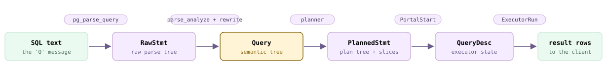
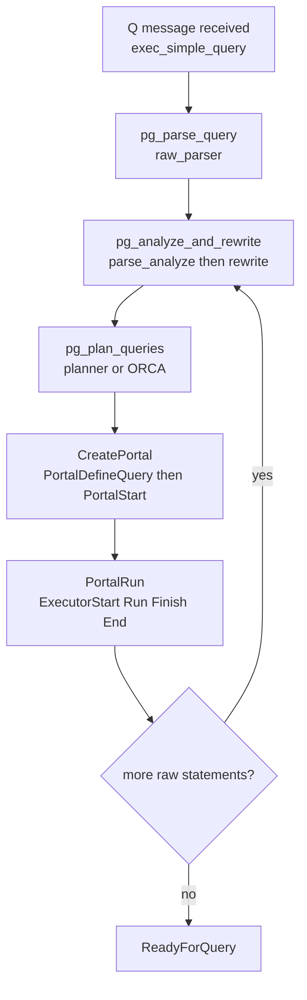
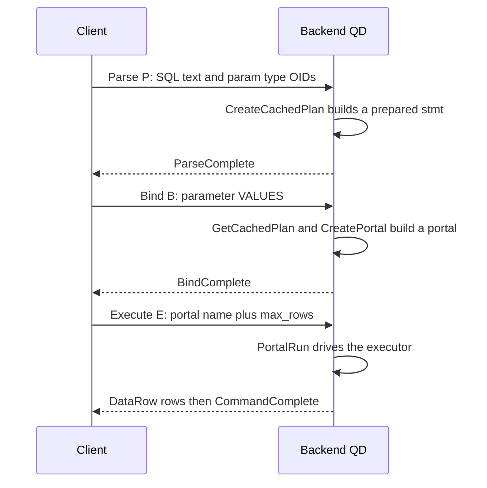
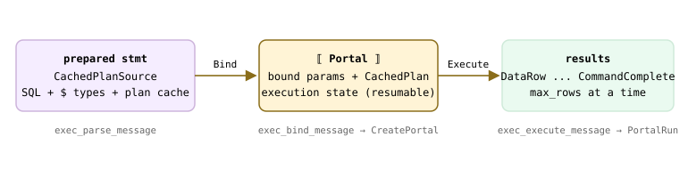
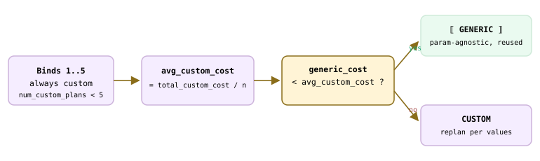
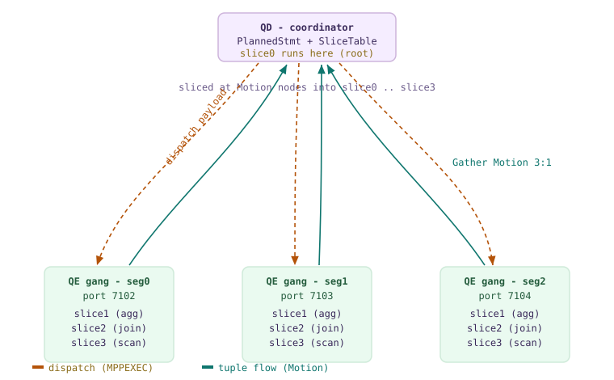
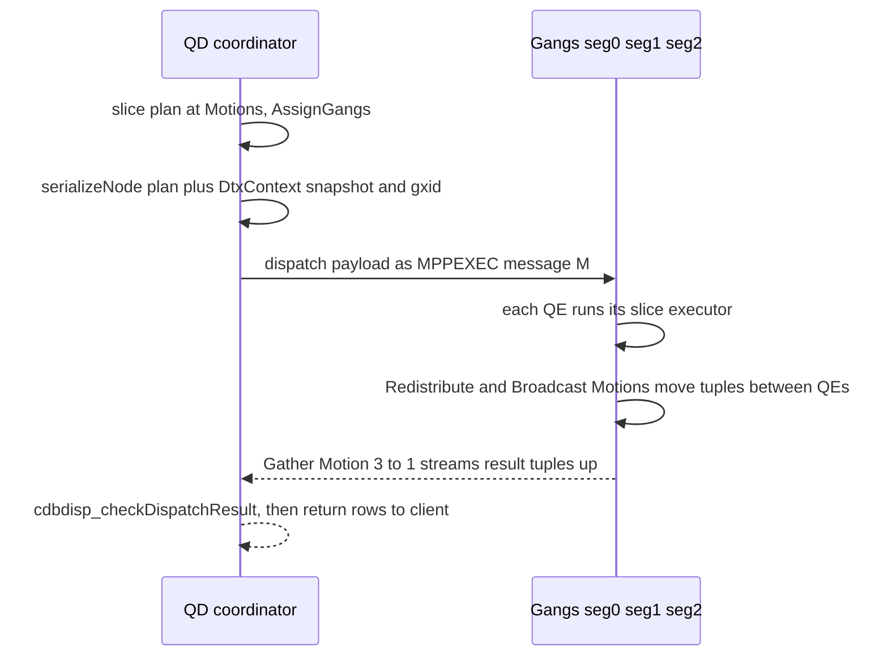

<!--
  Licensed to the Apache Software Foundation (ASF) under one
  or more contributor license agreements.  See the NOTICE file
  distributed with this work for additional information
  regarding copyright ownership.  The ASF licenses this file
  to you under the Apache License, Version 2.0 (the
  "License"); you may not use this file except in compliance
  with the License.  You may obtain a copy of the License at

    http://www.apache.org/licenses/LICENSE-2.0

  Unless required by applicable law or agreed to in writing,
  software distributed under the License is distributed on an
  "AS IS" BASIS, WITHOUT WARRANTIES OR CONDITIONS OF ANY
  KIND, either express or implied.  See the License for the
  specific language governing permissions and limitations
  under the License.
-->

# 13. Query Processing Stages

## 13.1 The Simple Query Protocol

When a client hands the backend a whole SQL string in one shot — the wire-protocol *simple query*, message type `'Q'` — that string sets out on a fixed journey. It is **parsed** into a raw tree, **analyzed and rewritten** into a semantic tree, **planned** into an executable tree, and finally **executed** into result rows. Each stage consumes the previous stage's data object and produces the next. On Cloudberry the coordinator (the QD, [§1.3](../part-1-introduction/ch01.md#13-processes-and-memory)) runs this whole front pipeline itself; only at execution does it fan the plan out to the segments — but that dispatch is [§13.3](#133-dispatch-from-coordinator-plan-to-segment-execution)'s story, so here we follow the pipeline to the point where the plan is ready to run.

The spine of the section is that chain of **data objects**. It helps to keep it in view before we look at any code: the SQL text becomes a `RawStmt`, which becomes a `Query`, which becomes a `PlannedStmt`, which is loaded into a `QueryDesc` that the executor walks to emit rows.



*The transformation chain: what a one-shot query becomes at each stage (QD-side). Chips name the function that performs each transition.*



*Control flow of exec_simple_query() — one pass per raw statement in the string.*

### 13.1.1 The 'Q' message arrives

The backend's main loop reads one protocol message and switches on its first byte. A `'Q'` is a simple query: the loop pulls the query string off the wire and calls one function to do everything. The single-quote-`Q` case lives in the `PostgresMain` message switch (`src/backend/tcop/postgres.c:5905`).

```c title="src/backend/tcop/postgres.c:5905"
case 'Q':               /* simple query */
{
    const char *query_string;
    SetCurrentStatementStartTimestamp();
    query_string = pq_getmsgstring(&input_message);
    pq_getmsgend(&input_message);
    ...
    exec_simple_query(query_string);   /* the whole pipeline */
    send_ready_for_query = true;
}
```

`exec_simple_query()` (`src/backend/tcop/postgres.c:1724`) is the pipeline in miniature. Stripped of bookkeeping, its shape is: parse the string into a list of raw statements, then loop over each one running analyze → rewrite → plan, wrap the resulting plan in a portal, and run the portal to completion.

```c title="src/backend/tcop/postgres.c:1782"
parsetree_list = pg_parse_query(query_string);      /* -> List of RawStmt */
foreach(parsetree_item, parsetree_list)
{
    querytree_list = pg_analyze_and_rewrite_fixedparams(
                         parsetree, query_string, NULL, 0, NULL);  /* -> List of Query */
    plantree_list  = pg_plan_queries(querytree_list, query_string,
                                     CURSOR_OPT_PARALLEL_OK, NULL); /* -> List of PlannedStmt */
    portal = CreatePortal("", true, true);
    PortalDefineQuery(portal, NULL, query_string, ..., plantree_list, NULL);
    PortalStart(portal, NULL, 0, InvalidSnapshot, NULL);
    (void) PortalRun(portal, FETCH_ALL, true, true, receiver, receiver, &qc);
}
```

:::note

A single `'Q'` string may hold several statements separated by semicolons — hence the list and the loop. If there is more than one, they run inside one implicit transaction block. Our examples send exactly one statement, so the loop turns once.

:::

### 13.1.2 Stage 1 — Parse

Parsing is purely syntactic: it knows the grammar but nothing about your tables. `pg_parse_query()` (`src/backend/tcop/postgres.c:766`) calls `raw_parser()` (`src/backend/parser/parser.c:43`), which runs the flex scanner (`scan.l`) and the bison grammar (`gram.y`) to turn the text into a **list of `RawStmt` nodes** (`src/include/nodes/parsenodes.h:1978`). No catalog is touched, so this step is safe even inside an aborted transaction.

```c title="src/backend/tcop/postgres.c:775"
raw_parsetree_list = raw_parser(query_string, RAW_PARSE_DEFAULT);
```

:::note

A `RawStmt` is a faithful transcription of what you typed: a table is just a name, a column just an identifier. Nothing has been checked to exist yet. That checking is the next stage's job.

:::

### 13.1.3 Stage 2 — Analyze and rewrite

Now meaning enters. `pg_analyze_and_rewrite_fixedparams()` (`src/backend/tcop/postgres.c:826`) runs two sub-steps. First **parse analysis** — `parse_analyze_fixedparams()` (`src/backend/parser/analyze.c:156`) — resolves every name against the catalog, assigns types, and checks that the query is semantically legal, producing a `Query` node (`src/include/nodes/parsenodes.h:153`). Second **rewriting** — `pg_rewrite_query()` → `QueryRewrite()` (`src/backend/rewrite/rewriteHandler.c:4314`) — applies rules, most importantly expanding views into their underlying queries. The output is a *list* of `Query` nodes, because one input query may rewrite into several.

```c title="src/backend/tcop/postgres.c:843"
/* (1) parse analysis: RawStmt -> Query */
query = parse_analyze_fixedparams(parsetree, query_string,
                                  paramTypes, numParams, queryEnv);
/* (2) rule rewriting */
querytree_list = pg_rewrite_query(query);
```

All that name and type resolution is a storm of catalog reads — `pg_class`, `pg_attribute`, `pg_type`, and so on. These do not hit disk on the hot path; they are served by the per-backend **syscache and relcache** described in [§8.5](../part-2-storage-data-layout/ch08.md#85-runtime-caching--invalidation). This is why analysis of a warm query is measured in microseconds, as the stage timings below will show.

:::note

The **Query** is the semantic center of the whole pipeline: it is what the planner consumes, what the rule system rewrites, and what a prepared statement caches. The next section ([§13.2](#132-the-extended-query-protocol)) picks the story up exactly here, because the extended protocol lets a client stop after analysis and reuse the **Query** across many executions.

:::

### 13.1.4 Stage 3 — Plan

Planning turns the *what* of a `Query` into a *how* — a `PlannedStmt` (`src/include/nodes/plannodes.h:78`) carrying an executable plan tree. `pg_plan_queries()` (`src/backend/tcop/postgres.c:1127`) calls `pg_plan_query()` → `planner()` (`src/backend/optimizer/plan/planner.c:317`) for each non-utility query. Cloudberry ships two planners: PostgreSQL's cost-based `standard_planner()` and the ORCA optimizer, which installs itself through `planner_hook`. This chapter only places the stage — the depth is **Chapter 15** (the PostgreSQL planner), **Chapter 16** (distributed planning), and **Chapter 17** (ORCA); planner statistics are **Chapter 14**.

```c title="src/backend/optimizer/plan/planner.c:347"
if (planner_hook)          /* ORCA installs this hook */
    result = (*planner_hook)(parse, query_string, cursorOptions,
                             boundParams, optimizer_options);
else
    result = standard_planner(parse, query_string, cursorOptions,
                              boundParams, optimizer_options);
```

The cleanest way to *see* the `PlannedStmt` a query becomes is `EXPLAIN` — it prints the plan tree without running it. On a table distributed across the three segments, notice how the plan is a Cloudberry plan: a **Gather Motion** at the top collects rows from three parallel `Seq Scan` slices below it, and the footer names the optimizer that built it.

*The PlannedStmt a distributed SELECT becomes — Gather Motion over three segment scans.*

```sql
CREATE TABLE q131_t (id int, city text) DISTRIBUTED BY (id);
INSERT INTO q131_t VALUES (1,'sf'),(2,'la'),(3,'ny'),(4,'sd'),(5,'sac'),(6,'boston');

EXPLAIN (VERBOSE, COSTS OFF)
  SELECT id, city FROM q131_t WHERE id > 2 ORDER BY id;
```

```text {3} title="output"
                QUERY PLAN
------------------------------------------
 Gather Motion 3:1  (slice1; segments: 3)
   Output: id, city
   Merge Key: id
   ->  Sort
         Output: id, city
         Sort Key: q131_t.id
         ->  Seq Scan on public.q131_t
               Output: id, city
               Filter: (q131_t.id > 2)
 Optimizer: GPORCA
(10 rows)
```

That `slice1` / `segments: 3` annotation is the seam where the single-backend pipeline becomes distributed — the plan is cut into *slices* and dispatched to a *gang* of QEs. We follow that seam in [§13.3](#133-dispatch-from-coordinator-plan-to-segment-execution); here it is enough to note that the plan is fully built on the QD before any of it leaves the coordinator.

### 13.1.5 Stage 4 — Execute

A finished plan does not run on its own; it runs inside a **portal**. `exec_simple_query()` creates an unnamed portal, hands it the plan list with `PortalDefineQuery()` (`src/backend/utils/mmgr/portalmem.c:304`), primes it with `PortalStart()` (`src/backend/tcop/pquery.c:557`), and then drives it with `PortalRun()` (`src/backend/tcop/pquery.c:900`). The portal is the stateful container that remembers where a query has got to — which matters most for cursors, but is used uniformly here.

Underneath the portal sits the executor, driven through four entry points in `src/backend/executor/execMain.c`. It runs the plan tree **pull-style**: the top node repeatedly asks its children for one tuple at a time. The executor's internals — nodes, tuple slots, per-node state — are **Chapter 18**; motion nodes and the interconnect that feeds them are **Chapter 19**.

- **ExecutorStart** — `execMain.c:231` — build the executor state tree (the `PlanState` mirror of the plan) and open relations.
- **ExecutorRun** — `execMain.c:830` — the pull loop; produce tuples and hand them to the DestReceiver until the count is met.
- **ExecutorFinish** — `execMain.c:1152` — run any deferred after-triggers and finish modifying statements.
- **ExecutorEnd** — `execMain.c:1240` — shut nodes down, close relations, free the state.

`EXPLAIN (ANALYZE)` actually runs the plan and folds the per-node counters back into the printout, so you can watch the execution stage happen. Note the two clocks in the footer — **Planning Time** is the QD's stage 3, **Execution Time** is stage 4 — and that the leaf scan reports `actual rows` per segment while the Gather Motion reports the assembled total.

*EXPLAIN (ANALYZE): the executor's per-node counters, plus the planning/execution split.*

```sql
EXPLAIN (ANALYZE, TIMING OFF, COSTS OFF)
  SELECT id, city FROM q131_t WHERE id > 2 ORDER BY id;
```

```text {11} title="output"
                       QUERY PLAN
---------------------------------------------------------
 Gather Motion 3:1  (slice1; segments: 3) (actual rows=4 loops=1)
   Merge Key: id
   ->  Sort (actual rows=2 loops=1)
         Sort Key: id
         Sort Method:  quicksort  Memory: 75kB
         ->  Seq Scan on q131_t (actual rows=2 loops=1)
               Filter: (id > 2)
               Rows Removed by Filter: 1
 Planning Time: 44.889 ms
 Optimizer: GPORCA
 Execution Time: 11.426 ms
(14 rows)
```

On the coordinator this whole run is one backend: the QD. Between `ExecutorStart` and the first tuple, it serializes the plan with the transaction's distributed snapshot ([§10.5](../part-3-transactions-mvcc-concurrency/ch10.md#105-distributed-snapshots--the-distributed-log)) and the distributed transaction id ([§12.2](../part-3-transactions-mvcc-concurrency/ch12.md#122-cloudberrys-2pc-cdbtm-dtxstate--dtxcontext)) and dispatches it to a gang of QE backends — the mechanism [§13.3](#133-dispatch-from-coordinator-plan-to-segment-execution) covers. From `exec_simple_query()`'s point of view, `PortalRun()` simply returns when the rows are all sent, the portal is dropped, and the loop moves on.

### 13.1.6 Watching the stages tick by

The pipeline is not just a mental model — you can make each stage announce its own cost. Setting `log_parser_stats` and `log_planner_stats` makes `pg_parse_query`, parse analysis, rewriting, and the planner each emit a timing line (the GUC checks are right inside the stage functions, e.g. `postgres.c:772` and `postgres.c:840`). Read top-to-bottom, the QD-side output is the transformation chain in wall-clock form.

*Per-stage QD timings for the SELECT (trimmed to the four stage headers).*

```sql
SET client_min_messages=log;
SET log_parser_stats=on;
SET log_planner_stats=on;
SELECT id, city FROM q131_t WHERE id > 2 ORDER BY id;
```

```text {7} title="output"
LOG:  PARSER STATISTICS
!  0.000112 s user, 0.000000 s system, 0.000112 s elapsed
LOG:  PARSE ANALYSIS STATISTICS
!  0.002841 s user, 0.001728 s system, 0.004570 s elapsed
LOG:  REWRITER STATISTICS
!  0.000035 s user, 0.000035 s system, 0.000070 s elapsed
LOG:  PLANNER STATISTICS
!  0.025188 s user, 0.018101 s system, 0.043292 s elapsed
```

The shape is typical: parsing is trivially cheap, analysis and rewriting are a few microseconds of warm catalog lookups, and **planning dominates** — here the ORCA optimizer takes an order of magnitude more than the other three stages combined. That is why the pipeline caches its output aggressively at the `Query` and plan level ([§13.2](#132-the-extended-query-protocol)) and why planning gets its own chapters. The table below sums up the whole journey and where each object is defined.

| Stage | Function | In → Out object | Chapter / ref |
| --- | --- | --- | --- |
| Parse | `pg_parse_query` → `raw_parser` | SQL text → `RawStmt` list | this section |
| Analyze | `parse_analyze_fixedparams` | `RawStmt` → `Query` (catalog: [§8.5](../part-2-storage-data-layout/ch08.md#85-runtime-caching--invalidation)) | this section |
| Rewrite | `pg_rewrite_query` → `QueryRewrite` | `Query` → `Query` list | this section |
| Plan | `pg_plan_queries` → `planner` / ORCA | `Query` → `PlannedStmt` | Ch 14–17 |
| Execute | `PortalRun` → `ExecutorStart/Run/End` | `PlannedStmt` → `QueryDesc` → rows | Ch 18 |
| Dispatch | `CdbDispatchPlan` (QD → QE gang) | serialized plan + snapshot + gxid | [§13.3](#133-dispatch-from-coordinator-plan-to-segment-execution), Ch 16/19 |

:::note

The extended query protocol ([§13.2](#132-the-extended-query-protocol)) breaks this same chain into separately callable messages — Parse, Bind, Execute — so a client can analyze once and execute many times. Everything you have seen here is what that protocol is caching between messages.

:::

## 13.2 The Extended Query Protocol

[§13.1](#131-the-simple-query-protocol) followed the *simple* query: one `'Q'` message carrying a whole SQL string, executed in one shot. But look at how a real driver — JDBC, psycopg, libpq's `PQexecParams` — actually talks to the backend, and you will almost never see a `'Q'`. Instead the conversation is split into three smaller messages: **Parse**, **Bind**, and **Execute**. This is the *extended query protocol*, and it is the road down which prepared statements, bind parameters, portals, and the plan cache all travel.

Why split one message into three? Two payoffs. First, **parse once, execute many**: the client sends the SQL text and its parameter *types* a single time (Parse), then re-runs it with fresh parameter *values* as often as it likes (Bind + Execute), skipping re-parsing and — as we will see — often re-planning. Second, **safe parameter passing**: values arrive in their own message, never spliced into SQL text, so there is no SQL-injection surface. The backend dispatches these message types in the main loop switch in `` `src/backend/tcop/postgres.c:6185` `` (`'P'`), `` `:6217` `` (`'B'`), and `` `:6232` `` (`'E'`).



*The extended protocol: three round-trips, and the objects each message creates on the backend.*

### 13.2.1 The three protocol messages

Each `case` in the dispatch switch does almost nothing itself — it peels the fields off the wire and hands them to a dedicated `exec_*_message` function. The **Parse** case reads the statement name, the SQL text, and an array of parameter type OIDs:

```c title="src/backend/tcop/postgres.c:6197"
stmt_name    = pq_getmsgstring(&input_message);
query_string = pq_getmsgstring(&input_message);
numParams    = pq_getmsgint(&input_message, 2);
for (int i = 0; i < numParams; i++)
    paramTypes[i] = pq_getmsgint(&input_message, 4);
exec_parse_message(query_string, stmt_name, paramTypes, numParams);
```

`exec_parse_message()` (`` `src/backend/tcop/postgres.c:2136` ``) parses the SQL to a raw parse tree, then builds a **`CachedPlanSource`** — the in-memory prepared statement. An empty statement name means the *unnamed* statement (there is exactly one, cached in a file-static slot); a non-empty name is a *named* prepared statement stored in a hash table.

```c title="src/backend/tcop/postgres.c:2190"
is_named = (stmt_name[0] != '\0');
...
psrc = CreateCachedPlan(raw_parse_tree, query_string, ...);
...
if (is_named)
    StorePreparedStatement(stmt_name, psrc, false);
else
    unnamed_stmt_psrc = psrc;   /* the single unnamed slot */
```

**Bind** is the interesting one — it is where parameter *values* meet a plan. `exec_bind_message()` (`` `:2416` ``) looks the prepared statement back up, decodes the parameter values, asks the plan cache for a plan, creates a **portal**, and arms it for execution:

```c title="src/backend/tcop/postgres.c:2837"
cplan = GetCachedPlan(psrc, params, NULL, NULL, NULL);   /* generic or custom */
...
PortalDefineQuery(portal, saved_stmt_name, query_string,
                  psrc->sourceTag, psrc->commandTag,
                  cplan->stmt_list, cplan);
...
PortalStart(portal, params, 0, InvalidSnapshot, NULL);
```

**Execute** (`exec_execute_message()`, `` `:2916` ``) runs the portal. Crucially the client passes a **`max_rows`** limit: the protocol can fetch results in *batches*, pausing a portal after N rows and resuming it on the next Execute. A zero means “all rows” (`FETCH_ALL`).

```c title="src/backend/tcop/postgres.c:3090"
if (max_rows <= 0)
    max_rows = FETCH_ALL;
...
completed = PortalRun(portal,
                      max_rows,       /* stop after this many rows */
                      true, ...);
```

:::note

The unnamed statement and unnamed portal are optimized for the parse-bind-execute-once idiom: a client that does not reuse them lets the backend recycle their memory immediately. Between Bind and Execute the client may also send **Describe** to learn the result row shape, and **Close** to drop a portal or statement early.

:::

### 13.2.2 Prepared statements and pg_prepared_statements

A prepared statement can be created two ways, and both land on the same `CachedPlanSource`. The extended protocol builds one via a Parse message; SQL builds one via the `PREPARE` command (`` `src/backend/commands/prepare.c:59` `` `PrepareQuery`, run by `EXECUTE`). Either way, `EXPLAIN EXECUTE` shows you the plan that Bind would choose for a given argument. Notice the plan below is pinned to a **single segment** — because we gave it the literal `42`, the planner knows exactly which segment holds that hash bucket:

*A named prepared statement, and the plan chosen for one concrete argument.*

```sql
CREATE TABLE q132_t (k int, name text) DISTRIBUTED BY (k);
INSERT INTO q132_t SELECT g, 'name_'||g FROM generate_series(1,1000) g;
ANALYZE q132_t;
PREPARE p AS SELECT k, name FROM q132_t WHERE k = $1;
EXPLAIN EXECUTE p(42);
```

```text {3} title="output"
                                  QUERY PLAN
-------------------------------------------------------------------------------
 Gather Motion 1:1  (slice1; segments: 1)  (cost=0.00..431.02 rows=1 ...)
   ->  Seq Scan on q132_t  (cost=0.00..431.02 rows=1 width=12)
         Filter: (k = 42)
 Optimizer: GPORCA
```

That `Gather Motion 1:1 (segments: 1)` is a **directly-dispatched custom plan** — planned with the real value in hand. The `pg_prepared_statements` view exposes the accounting the plan cache keeps per statement, including how many times it produced a generic vs. a custom plan:

*Executing the statement seven times — and the plan-cache counters.*

```sql
EXECUTE p(1); EXECUTE p(2); EXECUTE p(3); EXECUTE p(4);
EXECUTE p(5); EXECUTE p(6); EXECUTE p(7);
SELECT name, statement, parameter_types, generic_plans, custom_plans
  FROM pg_prepared_statements;
```

```text {3} title="output"
 name |                     statement                        | parameter_types | generic_plans | custom_plans
------+------------------------------------------------------+-----------------+---------------+--------------
 p    | PREPARE p AS SELECT ... WHERE k = $1;                | {integer}       |             0 |          7
```

:::note

Those last two columns come straight from the plan cache: `generic_plans` and `custom_plans` are `plansource->num_generic_plans` / `num_custom_plans` (`src/backend/commands/prepare.c:780`). Seven customs, zero generics — [§13.2](#132-the-extended-query-protocol).4 explains why, on a distributed table, the count often stays that way.

:::

### 13.2.3 Portals — an executing statement

A prepared statement is a recipe; a **portal** is one instance of that recipe *being cooked*. Bind creates it (`CreatePortal`, `` `src/backend/utils/mmgr/portalmem.c:183` ``), binds the concrete parameters and a chosen `CachedPlan` into it (`PortalDefineQuery`, `` `:304` ``), and `PortalStart`/`PortalRun` (`` `src/backend/tcop/pquery.c:557` ``, `` `:900` ``) drive it through the executor. Because a portal *holds execution state*, it can be run in pieces — which is exactly what the `max_rows` batching of [§13.2](#132-the-extended-query-protocol).1 relies on, and exactly what a SQL cursor (`DECLARE ... CURSOR` + `FETCH`) is underneath.



*Statement → portal → results: what Bind and Execute build.*

- **unnamed portal** — Empty name (`""`). Created with `CreatePortal(name, true, true)` — silently replaces any existing unnamed portal. The default for one-shot Bind/Execute; recycled aggressively.
- **named portal** — Non-empty name; must be unique. This is what a SQL cursor becomes, kept alive across many `FETCH`/Execute round-trips until closed.
- **row-at-a-time** — A portal remembers where it left off, so Execute with `max_rows` and cursor `FETCH n` both just resume `PortalRun` for another batch.

### 13.2.4 Generic versus custom plans

Here is the real payoff of preparing. When Bind calls `GetCachedPlan()`, the plan cache decides between a **custom plan** (re-planned with *this* Bind's actual parameter values) and a **generic plan** (planned once with the parameters left as placeholders, then reused forever). The policy lives entirely in `choose_custom_plan()` (`` `src/backend/utils/cache/plancache.c:1066` ``):

```c title="src/backend/utils/cache/plancache.c:1097"
/* Generate custom plans until we have done at least 5 (arbitrary) */
if (plansource->num_custom_plans < 5)
    return true;

avg_custom_cost = plansource->total_custom_cost / plansource->num_custom_plans;

/* Prefer generic plan if it's less expensive than the average custom plan. */
if (plansource->generic_cost < avg_custom_cost)
    return false;
return true;
```

So the first **five** Binds always build a custom plan (a warm-up during which it measures the average custom cost). From the sixth on, it builds the generic plan *once*, then compares: a generic plan costs *only* execution — it dodges the per-Bind planning cost baked into the custom average — so it wins unless a custom plan is genuinely much cheaper to *run*.



*The GetCachedPlan decision: warm up on custom, then compare costs.*

PostgreSQL 16 lets you see the generic plan directly, without any Bind, via `EXPLAIN (GENERIC_PLAN)` — the placeholder `$1` is rendered right in the plan. This is the cleanest possible window onto the extended-protocol idea: a plan built with no values at all.

*EXPLAIN (GENERIC_PLAN) — a PG16 feature — plans the query with $1 unresolved.*

```sql
EXPLAIN (GENERIC_PLAN)
  SELECT k, name FROM q132_t WHERE k = $1;
```

```text {5} title="output"
                                   QUERY PLAN
--------------------------------------------------------------------------------
 Gather Motion 3:1  (slice1; segments: 3)  (cost=0.00..431.04 rows=400 ...)
   ->  Seq Scan on q132_t  (cost=0.00..431.02 rows=134 width=12)
         Filter: (k = $1)
 Optimizer: GPORCA
```

Compare this with the custom plan of [§13.2](#132-the-extended-query-protocol).2: the custom plan direct-dispatched to **one** segment (`1:1`) because it knew `k = 42`; the generic plan must fan out to **all three** (`3:1`), because with `$1` unresolved it cannot know which segment holds the value. This is why our counter stuck at *7 custom, 0 generic*: on a distributed table CBDB adds a **direct-dispatch penalty** to the generic cost so that a cheap single-segment custom plan keeps winning.

```c title="src/backend/utils/cache/plancache.c:1220"
/* A generic plan can't direct-dispatch, so it fans out to more segments.
 * Nudge the decision toward custom (direct-dispatch) plans: */
result += 10.0 * seq_page_cost * (maxsegments - 1);
```

The machinery is real, though — it just needs the generic plan to actually be competitive, or a forcing GUC. Setting `plan_cache_mode = force_generic_plan` overrides `choose_custom_plan` (`` `plancache.c:1086` ``) and the counter flips immediately:

*Forcing the generic path proves the counter mechanism.*

```sql
SET plan_cache_mode = force_generic_plan;
PREPARE p AS SELECT k, name FROM q132_t WHERE k = $1;
EXECUTE p(1); EXECUTE p(2);
SELECT name, generic_plans, custom_plans FROM pg_prepared_statements;
```

```text {3} title="output"
 name | generic_plans | custom_plans
------+---------------+--------------
 p    |           2 |            0
```

Finally, you do not need a Java driver to drive the Parse/Bind/Execute path — psql 16's `\bind` metacommand does it from the client. It sends the SQL as a Parse, the following words as bound parameter values, and `\g` as Execute:

*psql \bind drives the extended protocol end-to-end; $1=3, $2=4.*

```sql
SELECT $1::int + $2::int \bind 3 4 \g
```

```text {3} title="output"
 ?column?
----------
      7
```

:::note

The `plan_cache_mode` GUC (`auto`/`force_generic_plan`/`force_custom_plan`) is your override for this policy. What plan actually gets built — the ORCA or PostgreSQL optimizer's work, and how it becomes a distributed plan with Motions — is **Chapter 15** (planner), **Chapter 16** (distributed planning), and **Chapter 17** (ORCA); how it is dispatched to the segment gangs is [§13.3](#133-dispatch-from-coordinator-plan-to-segment-execution). (Demo table `q132_t` dropped after capture.)

:::

## 13.3 Dispatch: From Coordinator Plan to Segment Execution

[§13.1](#131-the-simple-query-protocol) and [§13.2](#132-the-extended-query-protocol) left the coordinator (the **QD**, query dispatcher) holding a finished `PlannedStmt`. On a single-node PostgreSQL that plan would simply be handed to the executor and run in this one backend. Cloudberry has a step in between that PostgreSQL does not: the plan describes work spread across every segment, so before anything executes it must be *cut apart*, shipped to a set of worker backends on each segment (the **QEs**, query executors), and its results gathered back. That step is **dispatch**, and it is the defining stage of the distributed engine.

Dispatch is three moves in sequence. First **slicing**: the `Motion` nodes the planner inserted ([§1.4](../part-1-introduction/ch01.md#14-clients-the-wire-protocol--dispatch)) chop the plan tree into *slices*, one plan fragment per parallel stage. Second **gangs**: each slice needs a *gang* — a set of QE processes, one per segment — allocated and connected. Third the **dispatch proper**: the QD serializes the plan, the parameters, and the transaction context (the distributed snapshot of [§10.5](../part-3-transactions-mvcc-concurrency/ch10.md#105-distributed-snapshots--the-distributed-log) and the `gxid` of [§12.2](../part-3-transactions-mvcc-concurrency/ch12.md#122-cloudberrys-2pc-cdbtm-dtxstate--dtxcontext)) into one payload and fires it at every gang over libpq. The QEs then run their slice and stream tuples back up through the Motions to the QD, which returns them to the client. The deep internals of each are later chapters; here we place the stage and watch it happen live.



*Dispatch fan-out: the QD slices the plan, allocates a gang of QEs per segment, dispatches the payload (amber), and gathers tuples back up through Motion (teal).*

We will follow one query all the way down: a two-table join with a group-by, chosen precisely because the join key differs from the distribution key and so *forces* a Redistribute Motion — which means multiple slices to look at.

### 13.3.1 Slicing: cutting the plan at Motions

A `Motion` node is the plan's way of saying *"tuples must move between processes here."* Every Motion is a seam, and cutting the plan tree along those seams yields **slices** — each slice is the contiguous fragment of plan between two Motions, runnable entirely within one process without further data movement. The bottom of a slice is a sending Motion; the top of the slice above it is the matching receiver. This is what makes the plan parallelizable: each slice runs concurrently on its own gang.

The planner does the cutting. `cdbllize_build_slice_table()` in `src/backend/cdb/cdbllize.c:1114` walks the finished plan, assigns a slice id to every Motion, and records a `PlanSlice` array on the `PlannedStmt`. At execution time `InitSliceTable()` (`src/backend/executor/execUtils.c:1748`) turns that into the executor's `SliceTable` — an array of `ExecSlice` structs, one per slice, each carrying its `gangType` and child-slice list.

```c title="src/backend/cdb/cdbllize.c:31"
/* cdbllize_decorate_subplans_with_motions() adds Motions ...
 * cdbllize_build_slice_table() assigns slice IDs to Motion
 * nodes, and builds the PlanSlice array (one entry per slice). */
```

The runtime shape lives in `src/include/executor/execdesc.h:164`: a `SliceTable` is `{ int numSlices; ExecSlice *slices; bool hasMotions; ... }`, and each `ExecSlice` (`:89`) holds `sliceIndex`, `parentIndex`, its `children`, the `GangType gangType` it needs, and the `segments` it will run on. `EXPLAIN` renders exactly this tree — every `Motion` line prints its slice, and everything between two Motions belongs to one slice:

*EXPLAIN (ANALYZE, VERBOSE) of the forced-redistribute join. Each Motion introduces a new slice; the fragment between two Motions is one slice. Postgres planner (optimizer=off).*

```sql
CREATE TABLE q133_t (id int, region_id int, amount numeric)
  DISTRIBUTED BY (id);            -- fact, distributed on id
CREATE TABLE q133_d (region_id int, region_name text)
  DISTRIBUTED BY (region_id);     -- dim, distributed on region_id
-- join is on region_id (not q133_t's key) => Motions required
EXPLAIN (ANALYZE, VERBOSE, COSTS OFF, TIMING OFF)
SELECT d.region_name, sum(t.amount)
FROM q133_t t JOIN q133_d d ON t.region_id = d.region_id
GROUP BY d.region_name;
```

```text {4} title="output"
Gather Motion 3:1  (slice1; segments: 3) (actual rows=3 loops=1)
  ->  HashAggregate (actual rows=1 loops=1)
        Group Key: d.region_name
        ->  Redistribute Motion 3:3  (slice2; segments: 3) (actual rows=4)
              Hash Key: d.region_name
              ->  Hash Join (actual rows=5 loops=1)
                    Hash Cond: (t.region_id = d.region_id)
                    ->  Seq Scan on public.q133_t t (actual rows=5)
                    ->  Hash (actual rows=3 loops=1)
                          ->  Broadcast Motion 3:3  (slice3; segments: 3)
                                ->  Seq Scan on public.q133_d d (actual rows=2)
   (slice0)  Executor memory: 123K bytes.
 * (slice1)  Executor memory: 123K bytes avg x 3 workers ...
   (slice2)  Executor memory: 2104K bytes avg x 3 workers ...
   (slice3)  Executor memory: 113K bytes avg x 3 workers ...
```

Read it bottom-up and the four slices fall out. **slice3** scans `q133_d` and *broadcasts* every row to all segments. **slice2** scans `q133_t`, hash-joins it against the broadcast dimension, then *redistributes* the result on `region_name` so each group lands on one segment. **slice1** aggregates each group locally, then *gathers* to the coordinator. **slice0** is the root that runs on the QD itself — it only receives. The `actual rows` are the tuples one representative segment processed (e.g. `Seq Scan ... rows=5`), confirming the slice really ran in parallel across the three segments.

- **slice3 → Broadcast Motion** — Scan `q133_d`; send a full copy of the small dimension to every segment. A leaf slice: a sender at its root, no receiver below.
- **slice2 → Redistribute Motion** — Scan `q133_t`, hash-join to the broadcast rows, then re-hash the join output on `region_name` so equal keys co-locate for the aggregate.
- **slice1 → Gather Motion 3:1** — Aggregate each group on its segment, then funnel all result rows up to the single QD receiver — the `3:1` is *3 senders, 1 receiver*.
- **slice0 (root)** — Runs only on the QD. `GANGTYPE_UNALLOCATED` — it is not dispatched (see `cdbdisp_query.c:1165`); it simply consumes what the Gather delivers.

:::note

The Motion *implementation* — how tuples actually cross the wire, TCP vs UDPIFC interconnect, flow control and reordering — is **Chapter 19 (Motion &amp; Interconnect)**. Here a Motion is just the seam that defines a slice.

:::

### 13.3.2 Gangs: a set of QEs per slice

A slice is a *plan fragment*; a **gang** is the *set of processes* that runs it — one QE backend on each participating segment. Dispatch a 4-slice plan onto a 3-segment cluster and (root aside) you get gangs of three QEs apiece: the QEs are ordinary `postgres` backends, forked by the segment postmasters, that you can see in `ps`. Gangs are typed by what the slice needs, from the enum in `src/include/nodes/plannodes.h:231`:

```c title="src/include/nodes/plannodes.h:231"
typedef enum GangType
{
    GANGTYPE_UNALLOCATED,     /* root slice run by the QD */
    GANGTYPE_ENTRYDB_READER,  /* 1-gang, reads the entry (QD) db */
    GANGTYPE_SINGLETON_READER,/* 1-gang, reads one segment db */
    GANGTYPE_PRIMARY_READER,  /* 1- or N-gang, reads segment dbs */
    GANGTYPE_PRIMARY_WRITER   /* the N-gang that can update segments */
} GangType;
```

Allocation runs on the QD. `AssignGangs()` (`src/backend/executor/execUtils.c:1909`) inventories the slice tree and asks for the gangs it needs; `AllocateGang()` (`src/backend/cdb/dispatcher/cdbgang.c:107`) hands back a gang, creating the QE connections via `cdbgang_createGang()` (`:94`). Exactly one gang per query is the **primary writer** (`GANGTYPE_PRIMARY_WRITER`) — it owns the write transaction on each segment; the rest are readers. Reusable idle gangs are pooled between statements so a session doesn't pay fork+connect on every query.

| Gang type | Size | Role in our query |
| --- | --- | --- |
| PRIMARY_WRITER | N (all segs) | One per session; holds the segment-local write xact. Reused by read slices too. |
| PRIMARY_READER | N (all segs) | Runs the parallel slices (join, redistribute, aggregate) — slice2, slice1. |
| SINGLETON_READER | 1-gang | A slice that runs on a single segment (e.g. gp_single_row / replicated reads). |
| ENTRYDB_READER | 1-gang | Reads catalog/entry data on the coordinator db itself. |
| UNALLOCATED | 0 (QD only) | The root slice0 — not dispatched; executes in the QD backend. |

To *see* the gang, hold a distributed query open (a cross-join gated on `pg_sleep`) and snapshot the process table. The QD backend is on the coordinator port `7100`; each QE is on a segment port `7102/7103/7104`, tagged with its `conNNN` session, its `segN`, its `sliceN`, and `MPPEXEC`:

*ps -ef during a live distributed query (columns trimmed). One QD backend fans out to a gang of 3 QEs per slice — note seg0/seg1/seg2 and the MPPEXEC tag.*

```sql
-- session A: a query that keeps the gangs busy
SELECT count(*) FROM q133_t t1, q133_t t2, q133_t t3
WHERE pg_sleep(6) IS NULL;
-- session B, meanwhile:
$ ps -ef | grep -E 'con[0-9]+' | grep -v grep
```

```text {3} title="output"
  PID  PPID  postgres backend
14950  6006  7100 ... [local] con26464 cmd1 SELECT              <- QD
14952  5967  7102 ... 10.100.0.3 con26464 seg0 cmd2 slice1 MPPEXEC SELECT
14953  5969  7103 ... 10.100.0.3 con26464 seg1 cmd2 slice1 MPPEXEC SELECT
14954  5970  7104 ... 10.100.0.3 con26464 seg2 cmd2 slice1 MPPEXEC SELECT
14964  5967  7102 ... 10.100.0.3 con26464 seg0 cmd2 slice3 MPPEXEC SELECT
14965  5969  7103 ... 10.100.0.3 con26464 seg1 cmd2 slice3 MPPEXEC SELECT
14966  5970  7104 ... 10.100.0.3 con26464 seg2 cmd2 slice3 MPPEXEC SELECT
```

One QD (`7100`, `con26464`, `cmd1`), and beneath it two reader gangs of three QEs each — `slice1` across seg0/seg1/seg2 and `slice3` across seg0/seg1/seg2 — all stamped with the *same* `con26464` so they are recognizably one distributed command. The `PPID` of each QE is its segment's postmaster (`5967`/`5969`/`5970`), not the QD: the QD does not fork the QEs, it *connects* to backends the segment postmasters fork. This is the QD/QE process model of [§1.3](../part-1-introduction/ch01.md#13-processes-and-memory) made concrete.

Each QE knows its own identity. Two built-ins report it — `gp_execution_segment()` (the content id, `-1` on the QD, `0..N` on segments) and `gp_execution_dbid()` (the physical segment dbid). Evaluated on every segment they give a clean per-segment map:

*Per-segment identity: content id (seg) vs physical dbid. Confirms the query fanned out to all three primaries.*

```sql
SELECT gp_execution_segment() AS seg,
       gp_execution_dbid()   AS dbid
FROM gp_dist_random('gp_id')
ORDER BY 1;
```

```text {3} title="output"
 seg | dbid
-----+------
   0 |    2
   1 |    3
   2 |    4
(3 rows)
```

:::note

The reader gang can be a full **N-gang** (a QE on every segment) or a **1-gang** when direct dispatch proves only one segment holds the needed rows — a real optimization for point lookups on the distribution key. Gang creation, pooling, and recovery are covered in the dispatcher deep-dive; here they are just "the processes a slice runs on."

:::

### 13.3.3 Dispatch: serialize the plan, snapshot and gxid

With slices cut and gangs allocated, the QD must ship the work. It cannot send SQL text — the segments must not re-plan — so it sends the *plan itself*. `CdbDispatchPlan()` (`src/backend/cdb/dispatcher/cdbdisp_query.c:184`) prepares the payload and hands off to `cdbdisp_dispatchX()` (`:1072`), the workhorse that allocates gangs, builds the query string, and dispatches slice by slice.

The payload is assembled by serializing plan nodes into a flat byte string with `serializeNode()`, then bundling in the transaction context. The plan tree, the `QueryDispatchDesc` (which carries the `SliceTable` and serialized parameters), and the distributed transaction context are packed together:

```c title="src/backend/cdb/dispatcher/cdbdisp_query.c:656"
splan = serializeNode((Node *) queryDesc->plannedstmt, &splan_len, ...);
...
sddesc = serializeNode((Node *) queryDesc->ddesc, &sddesc_len, NULL);
...
pQueryParms->serializedDtxContextInfo =
    qdSerializeDtxContextInfo(&len, true /* wantSnapshot */,
                              queryDesc->extended_query,
                              mppTxnOptions(planRequiresTxn),
                              "cdbdisp_buildPlanQueryParms");
```

That last call is the linchpin of distributed consistency. `qdSerializeDtxContextInfo()` packs the **distributed snapshot** ([§10.5](../part-3-transactions-mvcc-concurrency/ch10.md#105-distributed-snapshots--the-distributed-log)) and the **`gxid`** the QD minted for this transaction ([§12.2](../part-3-transactions-mvcc-concurrency/ch12.md#122-cloudberrys-2pc-cdbtm-dtxstate--dtxcontext)) into the dispatch. Every QE therefore executes against the *same* snapshot the QD chose and inside the *same* distributed transaction — that is why a query sees a single, cluster-wide consistent view instead of three independent segment views. `QueryDispatchDesc` (`src/include/executor/execdesc.h:202`) is the struct that carries everything but the plan tree:

- **serializedPlantree** — The `PlannedStmt` flattened by `serializeNode` — the actual work, identical on every segment.
- **QueryDispatchDesc.sliceTable** — The `SliceTable` so each QE knows which slice it is and where its Motions send/receive.
- **QueryDispatchDesc.paramInfo** — `SerializedParams` — bound `$n` values and evaluated stable/exec params, so results match the QD.
- **serializedDtxContextInfo** — Distributed snapshot ([§10.5](../part-3-transactions-mvcc-concurrency/ch10.md#105-distributed-snapshots--the-distributed-log)) + `gxid` ([§12.2](../part-3-transactions-mvcc-concurrency/ch12.md#122-cloudberrys-2pc-cdbtm-dtxstate--dtxcontext)) — consistency across all QEs.
- **strCommand / gp_command_count** — The original SQL text (for `EXPLAIN`/logging) and the per-command counter that tags the dispatch.

`cdbdisp_dispatchX()` then loops the ordered slice vector and pushes each slice's payload to its gang via `cdbdisp_dispatchToGang()` (`cdbdisp.c:74`). The root slice is skipped — it stays on the QD:

```c title="src/backend/cdb/dispatcher/cdbdisp_query.c:1165"
if (slice && slice->gangType == GANGTYPE_UNALLOCATED)
    continue;                 /* root slice: run on QD, don't dispatch */
primaryGang = slice->primaryGang;
...
cdbdisp_dispatchToGang(ds, primaryGang, si);   /* send this slice */
if (planRequiresTxn || isDtxExplicitBegin())
    addToGxactDtxSegments(primaryGang);        /* enlist QEs in the gxact */
```



*The dispatch sequence: the QD slices and serializes, fires the payload at the gangs over libpq, the QEs run their slices, and tuples funnel back up through Gather Motion.*

Dispatch is asynchronous — the default dispatcher (`cdbdisp_async.c`) sends to all gangs without blocking, because a synchronous send would deadlock: a Gather at the top waits for tuples while the segments below wait for their plan. After execution the QD reconciles every gang's status with `cdbdisp_checkDispatchResult()` (`src/backend/cdb/dispatcher/cdbdisp.c:129`) and collects per-QE results via `cdbdisp_getDispatchResults()` (`:161`); any segment error is re-raised here so the whole command fails atomically.

:::note

`gp_command_count` (defined at `cdbvars.c:64`, bumped at `:652`) increments on the QD for each command and rides along in the dispatch string — that is the `cmd1`/`cmd2` you saw in `ps`. Together with the session id (`conNNN`) it uniquely identifies one dispatch across the QD and all its QEs, which is how you correlate a coordinator statement with its segment backends.

:::

### 13.3.4 Segment execution and the result flowing back

On the segment side the payload arrives as the Cloudberry-specific protocol message `'M'` (versus the ordinary `'Q'` of [§13.1](#131-the-simple-query-protocol)). `PostgresMain`'s message loop routes it to `exec_mpp_query()` (`src/backend/tcop/postgres.c:1174`), which deserializes the plan and the `QueryDispatchDesc`, installs the `SliceTable`, and starts a *local* executor for just this QE's slice:

```c title="src/backend/tcop/postgres.c:527"
case 'M':   /* Apache Cloudberry dispatched statement from QD */
    ...
    exec_mpp_query(query_string, serializedQuerytree, ...,
                   serializedPlantree, serializedQueryDispatchDesc, ...);
    /* -> rebuilds PlannedStmt + SliceTable, runs this slice's executor */
```

From here each QE runs the ordinary executor (`ExecutorStart/Run/End`, Chapter 18) on its slice — but its scan nodes read only that segment's local partition of the data, and its Motion nodes are the endpoints that ship tuples to the slice above. A Broadcast Motion sends every row to all peers; a Redistribute re-hashes and routes; a Gather funnels to the QD. Tuples flow *up* the slice tree, QE to QE, until the top Gather Motion delivers them to the QD's root slice0.

And that closes the loop back to [§13.1](#131-the-simple-query-protocol): the QD's portal is still running `PortalRun` over the coordinator executor, but slice0's Gather Motion is simply *its* source of tuples. `ExecutorRun` on the QD pulls a row from the Gather, which pulls from the segment gangs, and the portal hands it to the `DestReceiver` that writes it to the client — the same machinery a single-node query uses, with the segment fan-out hidden behind one Motion node at the root.

:::note

So the full journey: bytes → parse/analyze/rewrite ([§13.1](#131-the-simple-query-protocol)) → plan → **slice → gang → dispatch (this section)** → per-segment execution (**Chapter 18**) → tuples back through Motion (**Chapter 19**) → the client. Distributed planning that decides *where* the Motions go is **Chapter 16**; the ORCA alternative is **Chapter 17**.

:::

