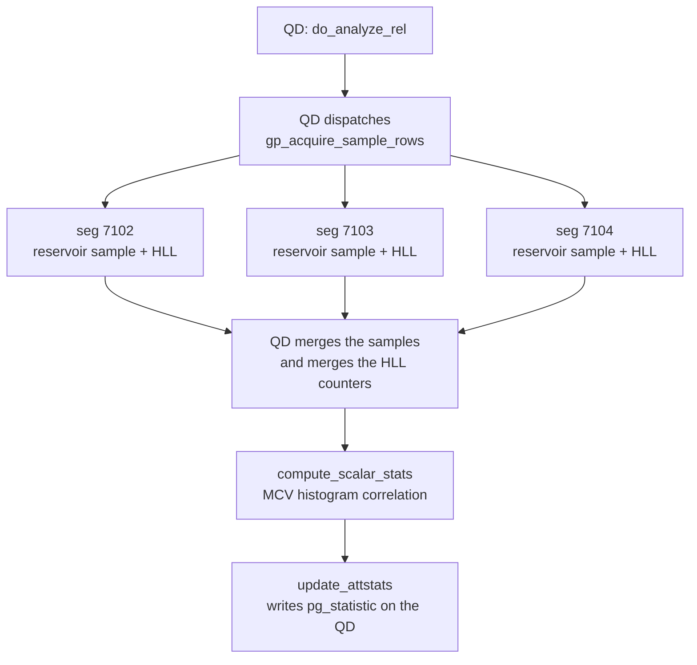
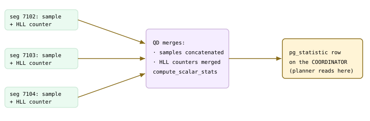
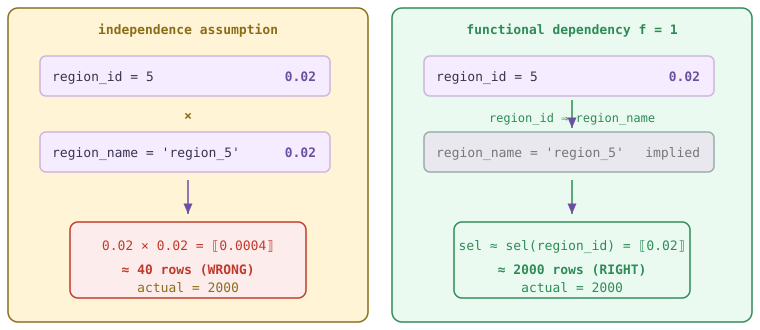
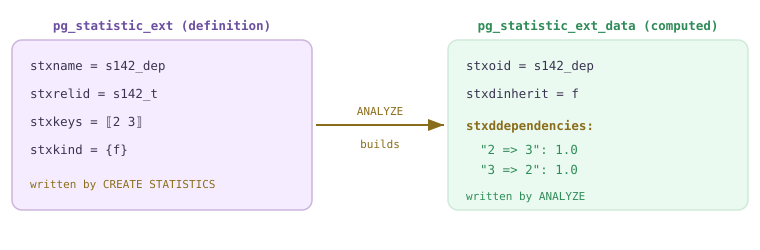
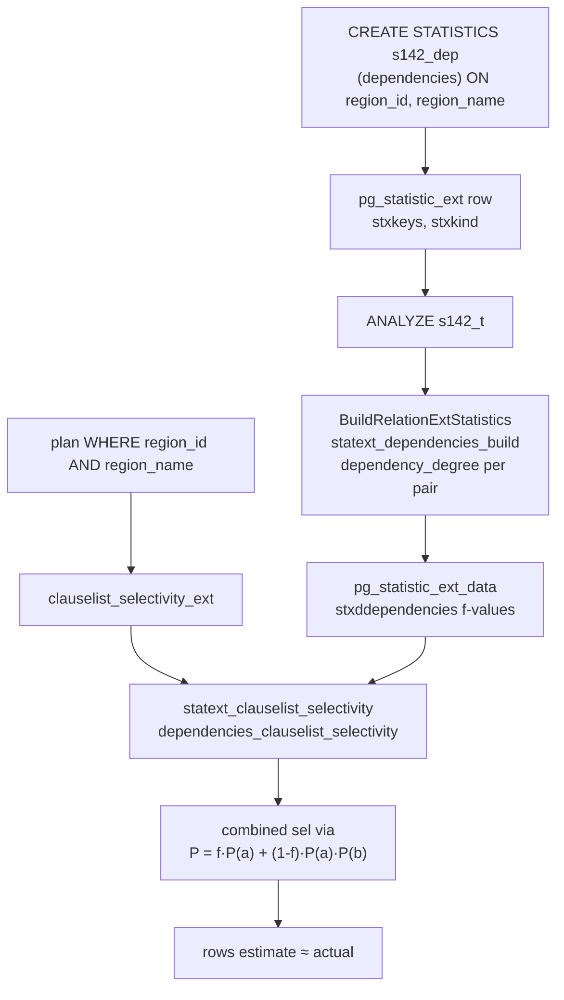
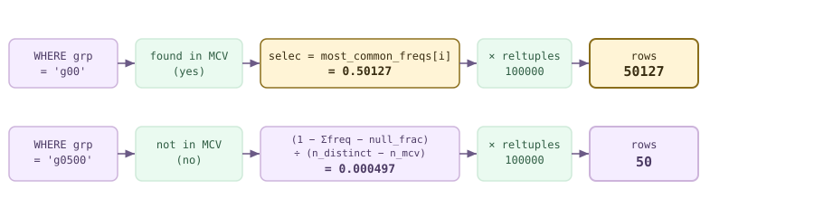
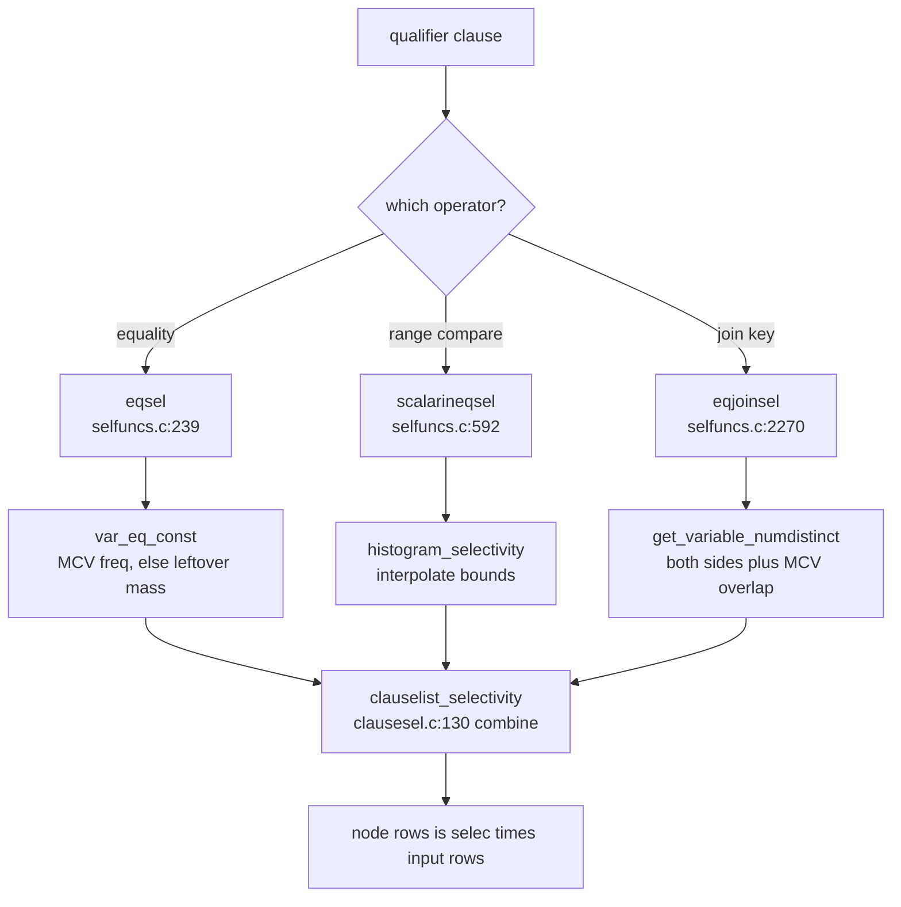

<!--
  Licensed to the Apache Software Foundation (ASF) under one
  or more contributor license agreements.  See the NOTICE file
  distributed with this work for additional information
  regarding copyright ownership.  The ASF licenses this file
  to you under the Apache License, Version 2.0 (the
  "License"); you may not use this file except in compliance
  with the License.  You may obtain a copy of the License at

    http://www.apache.org/licenses/LICENSE-2.0

  Unless required by applicable law or agreed to in writing,
  software distributed under the License is distributed on an
  "AS IS" BASIS, WITHOUT WARRANTIES OR CONDITIONS OF ANY
  KIND, either express or implied.  See the License for the
  specific language governing permissions and limitations
  under the License.
-->

import RawFigure from '../_components/RawFigure';

# 14. Statistics & Selectivity

## 14.1 Basic Statistics

The planner in [§13.1](./ch13.md#131-the-simple-query-protocol) turned a query into a `PlannedStmt` by *costing* alternative plans; but a cost is only as good as the row-count estimate behind it, and those estimates come from **per-column statistics**. Before it ever weighs a sequential scan against an index, the planner asks: how many rows does `region = 'EAST'` match? What is the average width of this column, so I can size a hash table? Is this column already sorted on disk, so an index scan will be cheap? All of these are answered from a small, pre-computed summary of each column's *distribution*.

That summary lives in one system catalog row per column: **`pg_statistic`** (`src/include/catalog/pg_statistic.h:31`). It is a replicated system catalog ([§8.2](../part-2-storage-data-layout/ch08.md#82-key-catalog-tables)), so it is present on every node — but the row the planner reads is the one on the **coordinator**, because in Cloudberry the planner runs on the QD ([§13.3](./ch13.md#133-dispatch-from-coordinator-plan-to-segment-execution)). This section dissects that row, names the four or five statistics the planner actually consumes, walks through how `ANALYZE` builds them, and then follows the MPP twist: the sample is gathered *across the segments* but the merged result is stored on the coordinator.

<RawFigure html={"<div style=\"overflow-x:auto;font-family:ui-monospace,Menlo,monospace;font-size:12.5px;line-height:1.35\"> <div style=\"display:flex;gap:6px;min-width:680px;margin-bottom:8px\"> <div style=\"flex:1;background:#f5edff;border:1px solid #cdb4db;border-radius:6px;padding:6px 8px\"><b>starelid</b><br/>rel oid</div> <div style=\"flex:1;background:#f5edff;border:1px solid #cdb4db;border-radius:6px;padding:6px 8px\"><b>staattnum</b><br/>column #</div> <div style=\"flex:1;background:#eafaf0;border:1px solid #cfead9;border-radius:6px;padding:6px 8px\"><b>stanullfrac</b><br/>NULL fraction</div> <div style=\"flex:1;background:#eafaf0;border:1px solid #cfead9;border-radius:6px;padding:6px 8px\"><b>stawidth</b><br/>avg bytes</div> <div style=\"flex:1;background:#fff4d6;border:1px solid #8a6d1a;border-radius:6px;padding:6px 8px\"><b>stadistinct</b><br/>#distinct (&lt;0 = ratio)</div> </div> <div style=\"display:flex;gap:6px;min-width:680px\"> <div style=\"flex:1;background:#f5edff;border:1px solid #cdb4db;border-radius:6px;padding:6px 8px\"><b>slot 1</b><br/>stakind1 <span style=\"color:#8a6d1a\">= 1 MCV</span><br/>staop1 / stacoll1<br/>stanumbers1 = <i>freqs</i><br/>stavalues1 = <i>values</i></div> <div style=\"flex:1;background:#f5edff;border:1px solid #cdb4db;border-radius:6px;padding:6px 8px\"><b>slot 2</b><br/>stakind2 <span style=\"color:#8a6d1a\">= 3 CORR</span><br/>staop2 / stacoll2<br/>stanumbers2 = <i>[corr]</i><br/>stavalues2 = —</div> <div style=\"flex:1;background:#f5edff;border:1px solid #cdb4db;border-radius:6px;padding:6px 8px\"><b>slot 3</b><br/>stakind3 <span style=\"color:#8a6d1a\">= 8 NDV/seg</span><br/>staop3 / stacoll3<br/>stanumbers3<br/>stavalues3</div> <div style=\"flex:1;background:#f5edff;border:1px solid #cdb4db;border-radius:6px;padding:6px 8px;opacity:.6\"><b>slot 4</b><br/>stakind4 = 0<br/>(unused)</div> <div style=\"flex:1;background:#f5edff;border:1px solid #cdb4db;border-radius:6px;padding:6px 8px;opacity:.6\"><b>slot 5</b><br/>stakind5 = 0<br/>(unused)</div> </div> <div style=\"margin-top:6px;color:#6b6b6b\">↑ five identical slots — the meaning of each is decided by its stakindN code, not its position ↑</div> </div>"} caption={"A pg_statistic row: fixed scalar header + five generic slots. Each slot is a (kind, op, coll, numbers, values) tuple; the same physical layout stores an MCV list, a histogram, or a correlation depending on stakindN."} />

### 14.1.1 The pg_statistic row and the pg_stats view

Three fixed scalar fields open every row. **`stanullfrac`** (`src/include/catalog/pg_statistic.h:40`) is the fraction of entries that are NULL; **`stawidth`** (`:52`) is the average width in bytes of a non-null entry (used to size in-memory hash tables); **`stadistinct`** (`:71`) is the number of distinct non-null values — with a clever encoding.

- **`stanullfrac`** — Fraction of the column that is NULL, in [0,1]. The planner scales every estimate by `(1 - null_frac)`.
- **`stawidth`** — Average stored width of a non-null value, post-TOAST. Feeds memory/width estimates, not row counts.
- **`stadistinct`** — **Positive** = an absolute count of distinct values. **Negative** = a *ratio of `reltuples`*: `-1` means every value is unique, `-0.5` means each value appears about twice. The negative form lets the estimate stay correct even as the table grows and `pg_class.reltuples` is updated more often than `pg_statistic`.

Everything else is stored in **five generic slots**. Each slot is a `(kind, op, coll, numbers, values)` quintuple, and the *kind* code decides what the slot means — the same physical columns hold an MCV list in one row and a histogram in another:

```c title="src/include/catalog/pg_statistic.h:90"
int16    stakind1;      /* kind of statistic (see constants) */
Oid      staop1;        /* operator used to derive it */
Oid      stacoll1;      /* collation used to derive it */
#ifdef CATALOG_VARLEN
float4   stanumbers1[1];/* numeric statistics (e.g. frequencies) */
anyarray stavalues1;    /* representative data values */
#endif
/* ... slots 2..5 are declared identically ... */
```

There are five slots (`STATISTIC_NUM_SLOTS`, `:129`) so several kinds can coexist for one column. The kind codes the standard planner cares about:

| Constant | Value | numbers array | values array |
| --- | --- | --- | --- |
| `STATISTIC_KIND_MCV` | 1 | frequency of each MCV | the most common values |
| `STATISTIC_KIND_HISTOGRAM` | 2 | — | equi-depth bucket bounds |
| `STATISTIC_KIND_CORRELATION` | 3 | one number: correlation | — |
| `STATISTIC_KIND_NDV_BY_SEGMENTS` | 8 | per-segment ndistinct (Cloudberry) | — |
| `STATISTIC_KIND_HLL` / `_FULLHLL` | 99 / 98 | — | serialized HLL counter (transient, Cloudberry) |

:::note

Kinds 1/2/3 are stock PostgreSQL (`pg_statistic.h:194/214/226`). Kind **8** (`:299`) and kinds **98/99** (`:306/314`) are Cloudberry additions: 8 records the distinct-value count *per segment* so the optimizer can size a partial-aggregate node, and 98/99 carry the HyperLogLog counters used to merge `n_distinct` across segments (see [§14.1](#141-basic-statistics).4).

:::

You rarely read `pg_statistic` directly — the array columns hold internal `anyarray` blobs. The readable view is **`pg_stats`**, which joins in the table and column names, expands the arrays into typed values, and hides rows for columns you lack privilege on. Here is the whole story of a table in one query — `s141_t` has a heavily-skewed text column `region` and a strictly-ascending `ordered_col`:

*pg_stats after ANALYZE. region is skewed (4 values, one at ~50%) so its MCV is full; ordered_col has no MCV but a 100-bucket histogram and correlation ≈ 1.*

```sql
ANALYZE s141_t;
SELECT attname, null_frac, n_distinct,
       most_common_vals, most_common_freqs,
       histogram_bounds, correlation
FROM pg_stats WHERE tablename='s141_t';
```

```text {5} title="output"
attname           | region
null_frac         | 0
n_distinct        | 4
most_common_vals  | {EAST,WEST,NORTH,SOUTH}
most_common_freqs | {0.5000333,0.249,0.12596667,0.125}
histogram_bounds  |
correlation       | 0.34476006
-------------------+--------------------------------------
attname           | ordered_col
null_frac         | 0
n_distinct        | -1
most_common_vals  |
most_common_freqs |
histogram_bounds  | {1,1054,2068,3124, ... ,98999,99999}
correlation       | 1
```

Read it off the two rows: `region` has just **4** distinct values so `n_distinct` is the exact count and every value fits in the MCV list; `ordered_col` is unique so `n_distinct = -1` (the negative ratio: 1 × `reltuples`), it has no MCV, and its **correlation is 1** — its physical order matches its logical order, which makes an index scan on it very cheap.

### 14.1.2 The four workhorse statistics

From those slots the planner draws (up to) four working statistics per column. Each answers a specific estimation question, consumed by the selectivity functions of [§14.3](#143-selectivity-estimation) and the cost model of Chapter 15:

- **`null_frac`** — How often the column is NULL — used for `IS NULL` / `IS NOT NULL` and to discount other estimates.
- **`n_distinct`** — How many distinct values — the denominator for a generic equality estimate: a non-MCV value matches roughly `reltuples / n_distinct` rows.
- **`most_common_vals` + `most_common_freqs` (MCV)** — The values frequent enough to track individually, with the exact fraction of the table each occupies. Equality against an MCV value is estimated **directly** from its frequency — no guessing.
- **`histogram_bounds`** — Equi-depth bucket boundaries over the *non-MCV* values. Each of the (up to 100) buckets holds an equal share of rows, so range predicates (`<`, `>`, `BETWEEN`) can be estimated by counting buckets.
- **`correlation`** — How closely physical row order tracks sorted value order, in [-1, 1]. Near ±1 an index scan reads pages nearly sequentially (cheap); near 0 it random-seeks (expensive).

<RawFigure html={"<div style=\"overflow-x:auto;font-family:ui-monospace,Menlo,monospace;font-size:12.5px\"> <div style=\"min-width:420px\"> <div style=\"display:flex;align-items:center;gap:8px;margin:3px 0\"><span style=\"width:64px\">EAST</span><div style=\"height:16px;width:250px;background:#8a6d1a;border-radius:3px\"></div><span><span class=\"hl\">0.5000</span></span></div> <div style=\"display:flex;align-items:center;gap:8px;margin:3px 0\"><span style=\"width:64px\">WEST</span><div style=\"height:16px;width:124px;background:#cdb4db;border-radius:3px\"></div><span>0.2490</span></div> <div style=\"display:flex;align-items:center;gap:8px;margin:3px 0\"><span style=\"width:64px\">NORTH</span><div style=\"height:16px;width:63px;background:#cfead9;border-radius:3px\"></div><span>0.1260</span></div> <div style=\"display:flex;align-items:center;gap:8px;margin:3px 0\"><span style=\"width:64px\">SOUTH</span><div style=\"height:16px;width:62px;background:#cfead9;border-radius:3px\"></div><span>0.1250</span></div> </div> <div style=\"margin-top:6px;color:#6b6b6b\">stavalues1 = <span class=\"hl\">{EAST,WEST,NORTH,SOUTH}</span> &nbsp;·&nbsp; stanumbers1 = the four freqs above</div> </div>"} caption={"region's MCV list — the exact fraction of the table each value occupies. Equality on any of these is estimated straight from its frequency; there are no non-MCV values here because n_distinct (4) fits entirely in the list."} />

The planner never scans data at plan time — it reads exactly these arrays. [§14.3](#143-selectivity-estimation) shows the selectivity functions (`eqsel`, `scalarltsel`) that turn them into a fraction, and [§14.1](#141-basic-statistics).4 ties one MCV frequency to a concrete `EXPLAIN` estimate.

### 14.1.3 How ANALYZE builds them

`ANALYZE` (and autovacuum's analyze) builds these rows. The entry point is **`do_analyze_rel()`** (`src/backend/commands/analyze.c:474`). It calls **`acquire_sample_rows()`** (`:184`) to draw a *bounded random sample* via reservoir (Vitter) sampling, then per column runs a compute function — **`compute_scalar_stats()`** (`:3900`) for ordered types — which fills the MCV list (`:4254`), the histogram (`:4370`), and the correlation (`:4397`). Finally **`update_attstats()`** (`:3129`) writes the finished `pg_statistic` rows.

```c title="src/backend/commands/analyze.c:3400"
/* Set the sample size (minrows) for this column's stats. */
stats->minrows = 300 * attr->attstattarget;
```

The sample is *bounded*, not proportional: its size is `300 × attstattarget`, and `attstattarget` defaults to `default_statistics_target = 100` (`:163`, and `:3372` substitutes the default when unset). So a plain `ANALYZE` samples about **30,000 rows** whether the table has 100k rows or 100M — that same target also caps the MCV list and histogram at 100 entries. You raise resolution per column with `ALTER TABLE t ALTER COLUMN c SET STATISTICS n`, which raises both the sample size and the array lengths for that column.



*ANALYZE in an MPP cluster: the QD orchestrates, the segments sample their own data, the QD merges, then writes one pg_statistic row per column.*

:::note

**default_statistics_target** is a GUC (100). Bumping a single column's target with `ALTER TABLE ... ALTER COLUMN ... SET STATISTICS n` is the standard fix for a skewed or high-cardinality column whose estimates are poor — more sample rows, longer MCV list and histogram, at the cost of a slower ANALYZE and a larger catalog row.

:::

### 14.1.4 The MPP twist: sample on the segments, store on the coordinator

In a single-node PostgreSQL, `acquire_sample_rows()` reads pages off local disk. Cloudberry cannot — the table's rows are scattered across the segments, and the segments keep no statistics of their own. So when `ANALYZE` runs on the QD it *dispatches* the sampling: for each column it asks every segment to sample its own slice and ship the rows back. The dispatched statement is built literally in `acquire_sample_rows_dispatcher()`:

```c title="src/backend/commands/analyze.c:3048"
appendStringInfo(&str,
    "select pg_catalog.gp_acquire_sample_rows(%u, %d, '%s');",
    RelationGetRelid(onerel),
    perseg_targrows,
    inh ? "t" : "f");
```

Each segment runs its own `acquire_sample_rows()` and returns a per-segment sample; the QD concatenates them into one cluster-wide sample and runs `compute_scalar_stats()` on it. But `n_distinct` cannot simply be summed — the same value may appear on several segments. So each segment also builds a **HyperLogLog** counter over its column (`src/backend/utils/hyperloglog/gp_hyperloglog.c`: `gp_hyperloglog_add_item` `:761`, `gp_hyperloglog_estimate` `:811`), and the QD merges those counters with `gp_hyperloglog_merge_counters()` (`:828`) to estimate distinct values across the whole cluster to within a small error margin:

```c title="src/backend/commands/analyze.c:150"
/* If HLL's distinct-value estimate is within 0.3% of the
 * row count, we treat every value as distinct. */
#define GP_HLL_ERROR_MARGIN  0.003
```



*The cross-segment flow: each segment ships a local reservoir sample plus an HLL sketch; the QD merges the samples into one and merges the sketches into a cluster-wide n_distinct, then writes the single pg_statistic row on the coordinator.*

The merged row lands in the **coordinator's** `pg_statistic`, and that is deliberate: the planner runs on the QD ([§13.3](./ch13.md#133-dispatch-from-coordinator-plan-to-segment-execution)), so it must find its statistics there. The proof is that the estimates tie out exactly to the merged numbers. Take `region = 'EAST'`, an MCV value with frequency `0.5000333`:

*An MCV equality estimate is read straight from most_common_freqs, not guessed. rows at the Gather ≈ freq × reltuples.*

```sql
EXPLAIN SELECT * FROM s141_t WHERE region = 'EAST';
```

```text {2} title="output"
Gather Motion 3:1 (slice1; segments: 3)
   (cost=0.00..435.78 rows=50004 width=13)
   ->  Seq Scan on s141_t
         (cost=0.00..433.36 rows=16668 width=13)
         Filter: (region = 'EAST'::text)
 Optimizer: GPORCA
```

Do the arithmetic: `reltuples` for `s141_t` is 100,000, and EAST's MCV frequency is `0.5000333`, so `0.5000333 × 100000 = 50003`, matching the planned `rows=50004` (the last row rounds up; per segment that is 16,668 × 3). The estimate is not sampled at plan time — it is *read* from `most_common_freqs`. A value **not** in the MCV list would instead be estimated as `reltuples / n_distinct`. ORCA (Chapter 17) has its own cardinality engine but reads this very same `pg_statistic` row; the classic PostgreSQL planner is Chapter 15, distributed planning Chapter 16. Extended (multi-column) statistics — for when independent per-column estimates go wrong — are [§14.2](#142-extended--multivariate-statistics).

## 14.2 Extended & Multivariate Statistics

The per-column statistics of [§14.1](#141-basic-statistics) carry a hidden assumption: that columns vary *independently*. When a `WHERE` clause tests several columns, the planner estimates each test on its own and **multiplies** the fractions together — `clauselist_selectivity()` in `src/backend/optimizer/path/clausesel.c:130`. That is only correct when the columns are uncorrelated. Real tables are full of correlations: a `region_name` is fully determined by its `region_id`; a `city` implies its `country`; a computed `b = a*2` moves in lockstep with `a`. Multiply two selectivities that are really the *same* condition and the estimate collapses to a tiny number, while the actual row count stays large.

Extended statistics let you *declare* which column groups are correlated, so the planner can stop pretending they are independent. This section shows the under-estimate first, then fixes it with a one-line `CREATE STATISTICS`.



*Two ways to combine sel(region_id=5) and sel(region_name='region_5'). Left: independence multiplies them into near-zero. Right: a functional dependency says the second clause is implied by the first, so the combined selectivity is essentially sel(region_id).*

### 14.2.1 The independence trap

Consider a 100k-row distributed table where `region_name` is a pure function of `region_id` — 50 regions, each name appearing exactly once per id. Both columns have 50 distinct values, so `default_statistics_target=100` captures every value as an MCV and each equality clause is estimated at ≈ 1/50 = 0.02. The planner, seeing two independent-looking clauses, multiplies: 0.02 × 0.02 ≈ 0.0004, giving a handful of rows. But every one of the 2000 rows with `region_id=5` *also* has `region_name='region_5'`, so the true count is 2000.

```c title="src/backend/optimizer/path/clausesel.c:98"
* The remaining clauses are then estimated by taking the product of their
* selectivities, but that's only right if they have independent
* probabilities, and in reality they are often NOT independent even if they
* only refer to a single column.  So, we want to be smarter where we can.
```

Here is the under-estimate live, with GPORCA (the default optimizer). The `rows=` estimate is dwarfed by the actual count `EXPLAIN ANALYZE` measures:

*BEFORE — GPORCA multiplies the two clauses: estimate 74 vs actual 2000 (≈ 27× low).*

```sql
EXPLAIN ANALYZE
SELECT * FROM s142_t
WHERE region_id = 5 AND region_name = 'region_5';
```

```text {1,2} title="output"
Gather Motion 3:1  (cost=0.00..434.13 rows=74 width=17)
                    (actual time=3.028..6.440 rows=2000 loops=1)
  ->  Seq Scan on s142_t  (cost=0.00..434.13 rows=25 width=17)
              (actual time=0.094..4.056 rows=713 loops=1)
        Filter: ((region_id = 5) AND (region_name = 'region_5'::text))
        Rows Removed by Filter: 32614
 Optimizer: GPORCA
```

The built-in PostgreSQL planner makes the same mistake — extended statistics are not an ORCA-only or planner-only feature; both cardinality engines read the same catalog. Switching to it (`SET optimizer=off`) shows the same shape:

*BEFORE — Postgres planner: estimate 290 vs actual 2000. Same independence error, different rounding.*

```sql
SET optimizer = off;
EXPLAIN ANALYZE
SELECT * FROM s142_t
WHERE region_id = 5 AND region_name = 'region_5';
```

```text {1,2} title="output"
Gather Motion 3:1  (cost=0.00..557.87 rows=290 width=17)
                    (actual time=2.946..12.387 rows=2000 loops=1)
  ->  Seq Scan on s142_t  (cost=0.00..554.00 rows=97 width=17)
              (actual time=0.082..4.017 rows=713 loops=1)
        Filter: ((region_id = 5) AND (region_name = 'region_5'::text))
 Optimizer: Postgres query optimizer
```

:::note

A 7–27× under-estimate on a two-clause filter is exactly the kind of error that snowballs: a low row estimate pushes the planner toward nested loops, under-sized hash tables, and — in an MPP plan — the wrong join/redistribution strategy across segments. The planner detail is **Chapter 15**; ORCA's cardinality engine is **Chapter 17**.

:::

### 14.2.2 CREATE STATISTICS: the three kinds

`CREATE STATISTICS` defines a statistics *object* on a group of columns (or expressions) of one table. You choose which kinds to build; each targets a different combining mistake. The syntax is `CREATE STATISTICS name (kind[, ...]) ON c1, c2 FROM t;`.

- **`dependencies`** — **Functional dependencies** — for each column pair it records a *degree* `f ∈ [0,1]` measuring how strongly one column determines another (`c1 ⇒ c2`). Built and consumed in `src/backend/statistics/dependencies.c`. This is the fix for our `region_id ⇒ region_name` case.
- **`ndistinct`** — **Multivariate n-distinct** — the number of distinct *combinations* of a column group, e.g. distinct `(a,b)` pairs. Fixes GROUP BY and DISTINCT estimates that would otherwise multiply per-column distinct counts. `src/backend/statistics/mvdistinct.c`.
- **`mcv`** — **Multivariate MCV** — a list of the most common *combinations* of values with their frequencies; the most detailed and the only kind that also helps range and inequality clauses. `src/backend/statistics/mcv.c`.
- **expression stats** — Statistics on an *expression* such as `lower(col)` or `(a+b)`, so `WHERE lower(col)='x'` is no longer a blind guess. Kind `STATS_EXT_EXPRESSIONS` ('e'); created either implicitly when an expression appears in the `ON` list, or as a single-expression object.

```c title="src/backend/statistics/extended_stats.c:209"
if (t == STATS_EXT_NDISTINCT)
    ndistinct = statext_ndistinct_build(totalrows, data);
else if (t == STATS_EXT_DEPENDENCIES)
    dependencies = statext_dependencies_build(data);
else if (t == STATS_EXT_MCV)
    mcv = statext_mcv_build(data, totalrows, stattarget);
```

The kind constants are the single-char codes in `src/include/catalog/pg_statistic_ext.h:81` — `'d'` ndistinct, `'f'` functional dependencies, `'m'` MCV, `'e'` expressions. For our correlated pair, functional dependencies are enough:

*Declare the dependency, then ANALYZE to actually compute it (CREATE STATISTICS alone stores no data).*

```sql
CREATE STATISTICS s142_dep (dependencies)
    ON region_id, region_name FROM s142_t;
ANALYZE s142_t;
```

```text title="output"
CREATE STATISTICS
ANALYZE
```

### 14.2.3 Where they live: two catalogs

An extended-statistics object is split across **two** catalogs, mirroring the definition/data split of ordinary column stats ([§14.1](#141-basic-statistics)). `pg_statistic_ext` holds the *definition* — which table, which columns (`stxkeys`), which kinds were requested (`stxkind`). It exists the moment you run `CREATE STATISTICS`. `pg_statistic_ext_data` holds the *computed* payload — the dependency degrees, the n-distinct map, the serialized MCV list — and is filled in (or refreshed) only by `ANALYZE`.



*CREATE STATISTICS writes the left row; ANALYZE reads the sample and writes the right row. The definition names the columns by attnum; the data speaks in those attnums too ('2 => 3' = region_id ⇒ region_name).*

The definition and the computed row, straight from the catalogs, plus the human-readable `pg_stats_ext` view that decodes attnums into names:

*pg_statistic_ext = shape; pg_statistic_ext_data = numbers; pg_stats_ext = the readable join.*

```sql
SELECT stxname, stxkeys, stxkind
  FROM pg_statistic_ext WHERE stxname = 's142_dep';

SELECT stxddependencies
  FROM pg_statistic_ext_data d JOIN pg_statistic_ext e ON e.oid = d.stxoid
 WHERE stxname = 's142_dep';

SELECT attnames, kinds, dependencies
  FROM pg_stats_ext WHERE statistics_name = 's142_dep';
```

```text {7} title="output"
  stxname  | stxkeys | stxkind
-----------+---------+---------
 s142_dep  | 2 3     | {f}

          stxddependencies
------------------------------------------
 {"2 => 3": 1.000000, "3 => 2": 1.000000}

       attnames          | kinds |            dependencies
-------------------------+-------+------------------------------------
 {region_id,region_name} | {f}   | {"2 => 3": 1.000000, "3 => 2": 1.000000}
```

Degree `1.0` in both directions confirms a perfect bijection: `region_id` determines `region_name` and vice-versa. Extended stats are gathered by the same `ANALYZE` machinery as column stats — `BuildRelationExtStatistics()` walks the table's statistics objects after the per-column pass:

```c title="src/backend/statistics/extended_stats.c:116"
void
BuildRelationExtStatistics(Relation onerel, bool inh, double totalrows,
                           int numrows, HeapTuple *rows,
                           int natts, VacAttrStats **vacattrstats)
```

:::note

Like `pg_statistic`, these catalogs are stored on the coordinator (the planner runs there — [§13.3](./ch13.md#133-dispatch-from-coordinator-plan-to-segment-execution)) and are replicated as ordinary system catalogs ([§8.2](../part-2-storage-data-layout/ch08.md#82-key-catalog-tables)). ANALYZE still samples across all three segments; the extended-stats build runs on the merged coordinator-side sample.

:::

### 14.2.4 How the planner uses them

Before multiplying clauses, `clauselist_selectivity_ext()` calls `statext_clauselist_selectivity()` (`src/backend/statistics/extended_stats.c:2030`) to estimate as many clauses as possible from extended stats; whatever it consumes is removed from the independent-product step. For functional dependencies the work happens in `dependencies_clauselist_selectivity()` (`src/backend/statistics/dependencies.c:1380`), which finds the strongest dependency among the clause columns and blends the two estimates by the degree `f`:

```c title="src/backend/statistics/dependencies.c:1366"
* Assuming (a=>b) is the selected
* dependency, we then combine the per-clause selectivities using the formula
*
*     P(a,b) = f * P(a) + (1-f) * P(a) * P(b)
```

Read the formula at the extremes. With `f = 0` (no dependency) it degenerates to the old independent product `P(a)·P(b)`. With `f = 1` (perfect dependency, our case) it becomes exactly `P(a)` — the second clause adds nothing, because it is implied. Our `f = 1.0` therefore turns 0.02 × 0.02 back into ≈ 0.02. The degree itself is measured by `dependency_degree()` (`src/backend/statistics/dependencies.c:223`), which counts how many sampled rows are consistent with `c1 ⇒ c2`.



*Lifecycle: the definition is declared once, the data is (re)built by every ANALYZE, and each planning of a matching query consults it.*

With the dependency in place, both optimizers now land on the same, correct estimate — 1940 against an actual 2000:

*AFTER — Postgres planner 290→1940, GPORCA 74→1940 (both vs actual 2000). The dependency degree pulled the combined selectivity onto sel(region_id).*

```sql
-- Postgres planner
SET optimizer = off;
EXPLAIN ANALYZE SELECT * FROM s142_t
  WHERE region_id = 5 AND region_name = 'region_5';

-- GPORCA
SET optimizer = on;
EXPLAIN ANALYZE SELECT * FROM s142_t
  WHERE region_id = 5 AND region_name = 'region_5';
```

```text {2,7} title="output"
-- Postgres planner
Gather Motion 3:1 (cost=0.00..579.87 rows=1940 ...) (actual ... rows=2000 ...)
  ->  Seq Scan on s142_t (cost=0.00..554.00 rows=647 ...) (actual ... rows=713 ...)
 Optimizer: Postgres query optimizer

-- GPORCA
Gather Motion 3:1 (cost=0.00..434.27 rows=1940 ...) (actual ... rows=2000 ...)
  ->  Seq Scan on s142_t (cost=0.00..434.15 rows=647 ...) (actual ... rows=713 ...)
 Optimizer: GPORCA
```

That both engines converge on 1940 is the point worth keeping: extended statistics live in the catalog, not in a particular planner, so declaring a correlation once benefits every query and every optimizer path. The mechanics of *how* the corrected selectivity flows into join order and cost — and how ORCA's own cardinality model reads these same rows — are §15 and §17. Cleanup for this demo drops the table, which cascades to its statistics object.

*Tear-down — dropping the table removes its dependent pg_statistic_ext object automatically.*

```sql
DROP TABLE s142_t;
SELECT count(*) FROM pg_statistic_ext WHERE stxname = 's142_dep';
```

```text title="output"
 count
-------
     0
```

## 14.3 Selectivity Estimation

[§14.1](#141-basic-statistics) and [§14.2](#142-extended--multivariate-statistics) filled the catalog with raw statistics — null fractions, most-common-value lists, histograms, distinct counts. None of that is a plan yet. The planner still has to answer one concrete question for every qualifier in a query: *of the rows flowing into this node, what fraction survive?* That fraction is the **selectivity**, a number in `[0,1]`, and the whole point of the statistics is to let the planner guess it well.

From a selectivity the estimated cardinality falls out immediately: **estimated rows = selectivity × input rows**. That row count is the planner's single most important guess — it decides join order, whether an index is worth using, whether to hash or sort, how much memory to reserve. Get it wrong and every downstream cost is wrong. The per-operator estimators live in `src/backend/utils/adt/selfuncs.c`; the logic that combines several qualifiers into one number lives in `src/backend/optimizer/path/clausesel.c`. The resulting `rows` is then *priced* by the cost model — the PostgreSQL planner in **Chapter 15**, ORCA in **Chapter 17** (which has its own cardinality engine but reads the very same `pg_statistic`). This section is the bridge: statistics in, a row count out.



*eqsel derivation chain — a constant becomes an estimated row count. Real numbers from the demo table s143_t (reltuples = 100000). Top lane: the constant is an MCV, so its measured frequency IS the selectivity. Bottom lane: a non-MCV constant gets the leftover mass spread over the remaining distinct values.*



*Dispatch: each qualifier is routed by operator class to an estimator in selfuncs.c, and clauselist_selectivity combines the per-clause results into the node's row estimate.*

### 14.3.1 Equality: eqsel and var_eq_const

The most common qualifier is `col = const`. `eqsel` (`selfuncs.c:239`) hands off to `eqsel_internal` (`selfuncs.c:248`), which looks the variable up and — when the right-hand side is a plain constant — calls `var_eq_const` (`selfuncs.c:307`). That routine does exactly two things depending on whether the constant is one of the column's most common values.

```c title="src/backend/utils/adt/selfuncs.c:409"
if (match)
    /* Constant IS a most common value: we know its frequency exactly */
    selec = sslot.numbers[i];
else
{
    double  sumcommon = 0.0;
    for (i = 0; i < sslot.nnumbers; i++)
        sumcommon += sslot.numbers[i];
    selec = 1.0 - sumcommon - nullfrac;          /* leftover mass  */
    otherdistinct = get_variable_numdistinct(vardata, &isdefault)
                    - sslot.nnumbers;
    if (otherdistinct > 1)
        selec /= otherdistinct;                  /* spread it evenly */
}
```

- **Constant is an MCV** — `selec = most_common_freqs[i]` — the frequency ANALYZE actually measured for that exact value (`selfuncs.c:415`). No modelling, no assumption: this is the *best* case for the estimator.
- **Constant is not an MCV** — `selec = (1 − Σ most_common_freqs − null_frac) / (n_distinct − n_mcv)` — the probability mass left over after the MCVs and NULLs, divided evenly among the remaining distinct values (`selfuncs.c:429`). `n_distinct` here comes from `get_variable_numdistinct` (`selfuncs.c:5882`).

Let us prove it. The demo table `s143_t` has 100000 rows; column `grp` is deliberately skewed — the value `g00` fills half the table, and the rest is a long thin tail. ANALYZE therefore keeps only a handful of MCVs and leaves most distinct values off the list — perfect for exercising both branches.

*pg_stats for the skewed column. g00's measured frequency is the number the equality estimator will use verbatim.*

```sql
SELECT null_frac, n_distinct,
       array_length(most_common_vals,1) AS n_mcv,
       most_common_vals, most_common_freqs
FROM pg_stats WHERE tablename='s143_t' AND attname='grp';
```

```text {5} title="output"
null_frac         | 0
n_distinct        | 1000
n_mcv             | 7
most_common_vals  | {g00,g0813,g0250,g0313,g0436,g0200,g0388}
most_common_freqs | {0.50126666,0.0009666667,0.00086666667,
                     0.00086666667,0.00086666667,0.0008,0.0008}
```

*Equality on an MCV value. 0.50126666 × 100000 = 50126.7, and EXPLAIN reports exactly rows=50127 (the whole-table estimate on the Gather Motion). ORCA is switched off so we exercise the selfuncs.c path.*

```sql
SET optimizer = off;
EXPLAIN SELECT * FROM s143_t WHERE grp = 'g00';
```

```text {1} title="output"
Gather Motion 3:1  (slice1; segments: 3)  (cost=0.00..1130.02 rows=50127 width=12)
  ->  Seq Scan on s143_t  (cost=0.00..461.67 rows=16709 width=12)
        Filter: (grp = 'g00'::text)
Optimizer: Postgres query optimizer
```

An exact hit: the MCV frequency *is* the selectivity, so the estimate matches to the last row. Now a value that is real but not common enough to be an MCV, `g0500`. Sum the seven MCV freqs: `Σ = 0.50643`. Then `selec = (1 − 0.50643 − 0) / (1000 − 7) = 0.49357 / 993 = 0.000497`, and `0.000497 × 100000 ≈ 49.7`.

*Equality on a non-MCV value. The leftover-mass formula predicts ~49.7 rows; EXPLAIN reports rows=50.*

```sql
EXPLAIN SELECT * FROM s143_t WHERE grp = 'g0500';
```

```text {1} title="output"
Gather Motion 3:1  (slice1; segments: 3)  (cost=0.00..462.33 rows=50 width=12)
  ->  Seq Scan on s143_t  (cost=0.00..461.67 rows=17 width=12)
        Filter: (grp = 'g0500'::text)
Optimizer: Postgres query optimizer
```

:::note

Note the two-level row counts: the **Seq Scan** reports the *per-segment* estimate (~16709), and the **Gather Motion** multiplies back up to the whole-table figure (~50127) after the three segments' streams merge. As [§13.3](./ch13.md#133-dispatch-from-coordinator-plan-to-segment-execution) explained, the planner runs on the coordinator and reads the merged `pg_statistic`; the estimate is a table-wide quantity that the motion node re-aggregates. A negative `n_distinct` (e.g. `-1`) means "distinct = |value| × reltuples", i.e. a ratio that scales as the table grows, rather than a fixed count.

:::

### 14.3.2 Ranges: scalarineqsel and the histogram

Inequalities — `<`, `<=`, `>`, `>=` — are estimated by `scalarltsel` / `scalargtsel` (`selfuncs.c:1483`, `:1501`), thin wrappers over `scalarineqsel` (`selfuncs.c:592`). Equality could lean entirely on the MCV list; a range cannot, because it spans values that were never common. So `scalarineqsel` combines two contributions: the MCV entries that satisfy the comparison (`mcv_selectivity`, `selfuncs.c:744`) plus an interpolation through the `histogram_bounds` for everything not in the MCV list (`ineq_histogram_selectivity`, `selfuncs.c:1053`).

```c title="src/backend/utils/adt/selfuncs.c:693"
mcv_selec = mcv_selectivity(vardata, &opproc, collation, constval, true,
                            &sumcommon);
hist_selec = ineq_histogram_selectivity(root, vardata, operator, &opproc,
                                        isgt, iseq, collation,
                                        constval, consttype);
/* histogram covers the non-null, non-MCV mass */
selec = 1.0 - stats->stanullfrac - sumcommon;
selec *= hist_selec;          /* fraction of that mass below/above const */
selec += mcv_selec;           /* plus the matching MCV entries */
```

The histogram stores `histogram_target + 1` boundaries chosen so each bucket holds the same number of rows — for `s143_t.amt` (values 1..100000, strictly ordered) that is 101 bounds and a correlation of 1.0. `ineq_histogram_selectivity` finds the bucket the constant lands in and interpolates linearly within it, so the selectivity is essentially *the fraction of the boundary range the predicate covers*.

*The amt histogram — 101 equi-depth boundaries spanning 1..100000, correlation 1.0. Interpolating between them is how a range estimate is built.*

```sql
SELECT n_distinct, correlation,
       array_length(histogram_bounds,1) AS n_bounds,
       (histogram_bounds::text::int[])[1:5]   AS first5,
       (histogram_bounds::text::int[])[97:101] AS last5
FROM pg_stats WHERE tablename='s143_t' AND attname='amt';
```

```text {3} title="output"
n_distinct  | -1
correlation | 1
n_bounds    | 101
first5      | {4,930,1930,2879,3945}
last5       | {96016,97062,98023,99061,100000}
```

*A range covering roughly the middle half of the value span. 25001..75000 is ~50% of the 1..100000 range, and the interpolated estimate is rows=49994 — half the table.*

```sql
EXPLAIN SELECT * FROM s143_t WHERE amt BETWEEN 25001 AND 75000;
```

```text {1} title="output"
Gather Motion 3:1  (slice1; segments: 3)  (cost=0.00..1211.59 rows=49994 width=12)
  ->  Seq Scan on s143_t  (cost=0.00..545.00 rows=16665 width=12)
        Filter: ((amt >= 25001) AND (amt <= 75000))
Optimizer: Postgres query optimizer
```

The estimate tracks the covered fraction directly: half the histogram range → `0.49994 × 100000 = 49994` rows. `BETWEEN` is not two independent tests — `clauselist_selectivity` recognises the `>=` and `<=` as a matched pair on one variable and folds them into a single range selectivity rather than multiplying them (that is the `RangeQueryClause` bookkeeping in `clausesel.c`).

### 14.3.3 Combining clauses: clauselist_selectivity

A `WHERE` list has many clauses, and `clauselist_selectivity` (`clausesel.c:130`) reduces them to one number. The textbook rules are simple. For **AND**, assume the clauses are *independent* and multiply their selectivities. For **OR**, use inclusion–exclusion. If [§14.2](#142-extended--multivariate-statistics) extended statistics exist for the referenced columns, they are consulted first (`statext_clauselist_selectivity`) and the covered clauses are removed from the per-column multiply — that is precisely *why* extended statistics exist: to repair the independence assumption when columns are correlated.

Cloudberry adds one MPP-flavoured twist. Multiplying many selectivities on one relation compounds sampling error and tends to *under*-estimate badly, which is expensive when a wrong estimate is dispatched across segments. So the planner applies **selectivity damping** (`gp_selectivity_damping_for_scans`, on by default): the factors are sorted, and each successive one is softened by taking a higher root before the product.

```c title="src/backend/optimizer/path/clausesel.c:396"
for (i = 1; i < pos; i++)
    /* dampen selectivity as n-th root of the original value */
    rgsel[i] = pow(rgsel[i], 1.0/Max(0.1, ((i + 1) * gp_selectivity_damping_factor)));

for (i = 0; i < pos; i++)
    s1 *= rgsel[i];
```

*Two independent clauses AND-ed. Pure independence predicts ~25140 rows; the real estimate is 35499 — damping deliberately keeps the combined selectivity larger.*

```sql
EXPLAIN SELECT * FROM s143_t
WHERE grp = 'g00' AND amt <= 50000;
```

```text {1} title="output"
Gather Motion 3:1  (slice1; segments: 3)  (cost=0.00..1018.32 rows=35499 width=12)
  ->  Seq Scan on s143_t  (cost=0.00..545.00 rows=11833 width=12)
        Filter: ((amt <= 50000) AND (grp = 'g00'::text))
Optimizer: Postgres query optimizer
```

- **Textbook independence** — `sel(grp='g00') × sel(amt<=50000)` = `0.50127 × 0.50152` ≈ `0.2514` → **25140 rows**. This is what stock PostgreSQL would print.
- **Cloudberry damping (observed)** — factors sorted ascending, the k-th raised to the power `1/(k+1)`: `0.50127 × 0.50152^(1/2)` ≈ `0.35499` → **35499 rows**, matching EXPLAIN to the row. The smallest factor keeps its full weight; each additional one bites less.

:::note

Two GUCs control this: `gp_selectivity_damping_for_scans` (enable for single-table scans, default **on**) and `gp_selectivity_damping_factor` (default **1**). Set `gp_selectivity_damping_for_scans=off` in a session and the AND above collapses back to the plain independence product. It is a Cloudberry-specific deviation from upstream: the same `clauselist_selectivity`, one extra loop before the multiply.

:::

### 14.3.4 Joins, and from rows to cost

Join qualifiers (`t1.a = t2.b`) use `eqjoinsel` (`selfuncs.c:2270`). It reads `n_distinct` from *both* sides via `get_variable_numdistinct` (`selfuncs.c:2303`), cross-matches the two MCV lists to count guaranteed matches, and for the remainder falls back to the classic rule that each row of the smaller side finds about `1/max(nd1, nd2)` of the larger — so join selectivity is governed by the more diverse column. That single number sizes every hash table and redistribution the distributed planner (§16) will consider.

Whatever the estimator, the output is the same currency: a selectivity that becomes the node's `rows`. That row count is *all* the cost model consumes — it does not re-derive selectivity, it prices the cardinality. The pricing itself (sequential vs index scan, hash vs merge join, motion cost) is **Chapter 15** for the PostgreSQL planner and **Chapter 17** for ORCA. ORCA computes its own cardinalities through a separate engine, but from the identical `pg_statistic` rows — so the statistics of [§14.1](#141-basic-statistics)/[§14.2](#142-extended--multivariate-statistics) feed both planners equally.

*Estimate vs reality. On the perfectly-skewed g00 the MCV-based estimate (50127) is within 0.25% of the actual 50000 — the payoff of storing the exact frequency of a common value.*

```sql
EXPLAIN ANALYZE SELECT * FROM s143_t WHERE grp = 'g00';
```

```text {1} title="output"
Gather Motion 3:1 ... (cost=0.00..1130.02 rows=50127 width=12)
                     (actual time=1.888..14.224 rows=50000 loops=1)
  ->  Seq Scan on s143_t (cost=0.00..461.67 rows=16709 width=12)
                     (actual ... rows=16718 loops=1)
        Filter: (grp = 'g00'::text)
        Rows Removed by Filter: 16609
Optimizer: Postgres query optimizer
```

That is the whole arc of statistics-driven planning: ANALYZE measures the data, `pg_statistic` stores it, the `selfuncs.c` estimators turn a qualifier into a selectivity, `clauselist_selectivity` combines them (with a damping nod to MPP), and the resulting `rows` hands off to the cost model. Everything the planner decides after this rests on that one estimated fraction being close to the truth.

