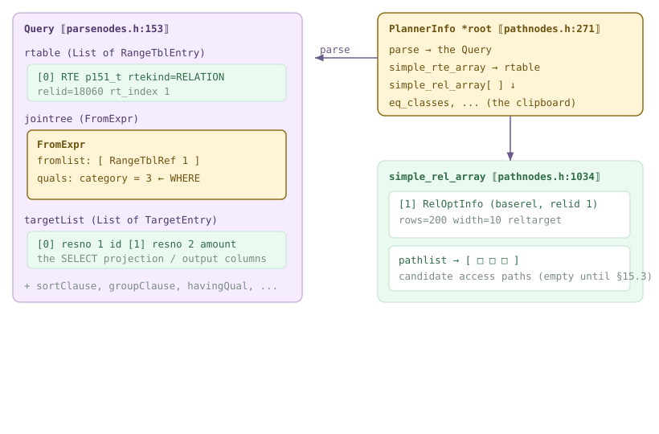
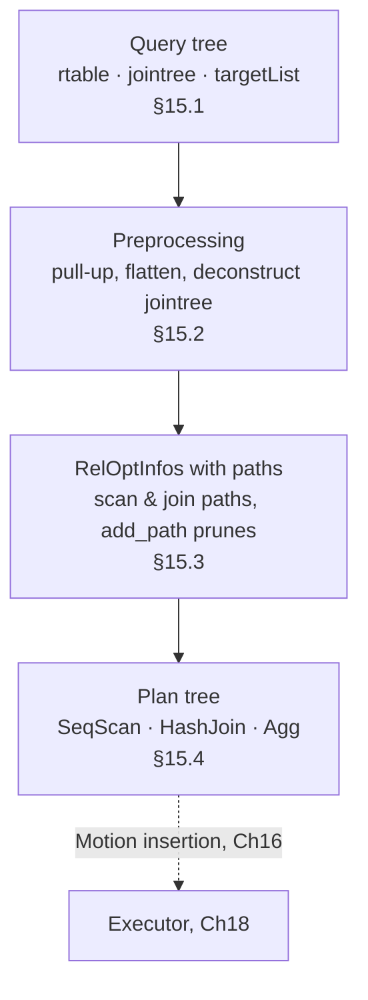
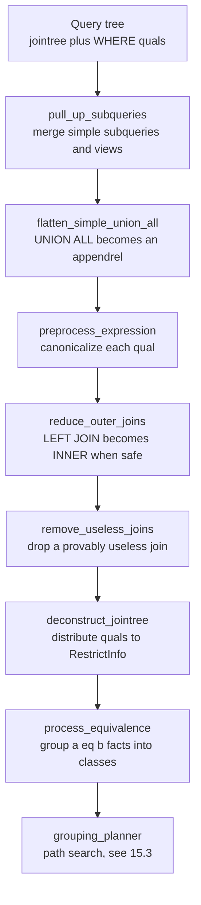
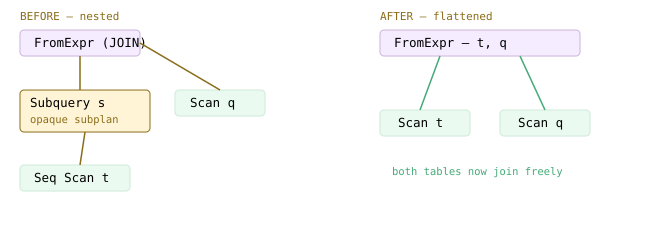
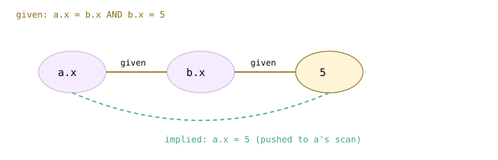
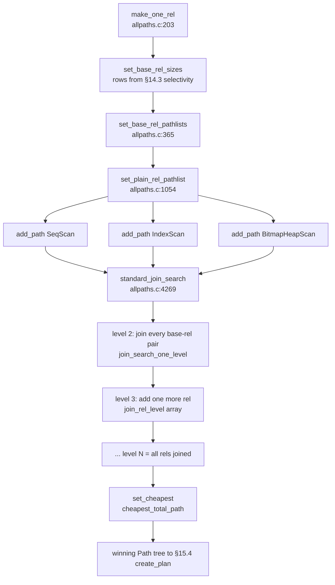
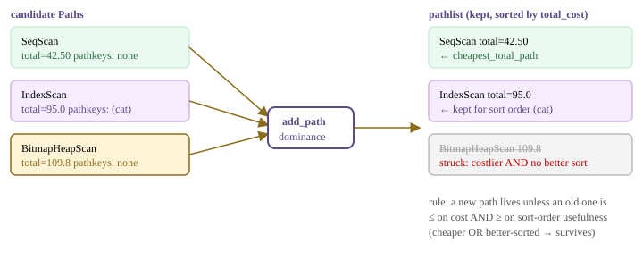
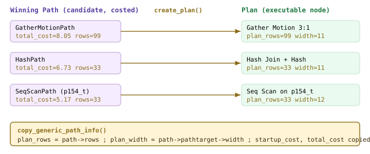
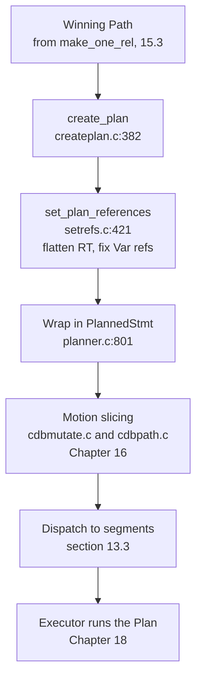

<!--
  Licensed to the Apache Software Foundation (ASF) under one
  or more contributor license agreements.  See the NOTICE file
  distributed with this work for additional information
  regarding copyright ownership.  The ASF licenses this file
  to you under the Apache License, Version 2.0 (the
  "License"); you may not use this file except in compliance
  with the License.  You may obtain a copy of the License at

    http://www.apache.org/licenses/LICENSE-2.0

  Unless required by applicable law or agreed to in writing,
  software distributed under the License is distributed on an
  "AS IS" BASIS, WITHOUT WARRANTIES OR CONDITIONS OF ANY
  KIND, either express or implied.  See the License for the
  specific language governing permissions and limitations
  under the License.
-->

# 15. The Postgres Planner

## 15.1 Query-Tree Structure

[§13.1](./ch13.md#131-the-simple-query-protocol) followed a statement through parse → rewrite → plan and handed us, at the door of the planner, a single node: a **`Query`**. This is where the cost-based planner begins its work. Everything the planner will ever decide — which relation to scan, in which order to join, whether to sort or hash — is a transformation of this one tree into another, a **`Plan`**. This section opens the `Query` up, then introduces the two working structures the planner writes on as it thinks: **`PlannerInfo`** (universally called `root`) and, hanging off it, one **`RelOptInfo`** per relation.

Cloudberry's default optimizer is ORCA (Chapter 17), so to exercise the PostgreSQL planner described here you must first `SET optimizer=off` — every demo in this chapter does. With that GUC set, `planner()` skips the ORCA hook and calls `standard_planner()` (`src/backend/optimizer/plan/planner.c:368`), which delegates the real work to `subquery_planner()` (`planner.c:904`) and `grouping_planner()` (`planner.c:1668`).



*Anatomy of a Query, and the working state the planner builds from it. The Query (left) carries three principal lists; the planner allocates a PlannerInfo (root) and, indexed by range-table position, one RelOptInfo per relation — each with an initially empty pathlist that [§15.3](#153-path-cost--add_path) will fill.*



*The arc of this chapter. Each box is a section; the Query enters, a Plan leaves. Cloudberry then inserts Motion nodes on that Plan (Chapter 16) before the executor runs it (Chapter 18).*

### 15.1.1 The Query node

A `Query` (`src/include/nodes/parsenodes.h:153`) is a fat struct, but for the planner three lists carry almost all the meaning. They are worth reading as a sentence: *from these relations, keeping these rows, produce these columns.*

```c title="src/include/nodes/parsenodes.h:209"
List      *rtable;     /* list of range table entries    */
FromExpr  *jointree;   /* table join tree (FROM and WHERE) */
List      *targetList; /* target list (of TargetEntry)   */
/* ... */
List      *groupClause; /* a list of SortGroupClause's   */
List      *sortClause;  /* a list of SortGroupClause's   */
```

- **`rtable`** — The **range table**: a `List` of `RangeTblEntry` (`parsenodes.h:1150`), one per relation, subquery, function, or CTE the query can name. Everything else refers to a relation by its **1-based position in this list** (a *range-table index*), never by name — so `rtable` is the query's private symbol table.
- **`jointree`** — A `FromExpr` (`src/include/nodes/primnodes.h:2173`) that captures the shape of `FROM` and the residual `WHERE`. Its `fromlist` holds the items being joined; its `quals` holds the filter/join conditions.
- **`targetList`** — A `List` of `TargetEntry` (`primnodes.h:2054`) — the output columns. Each entry pairs an expression with a `resno` (output position) and an optional `resname` (`primnodes.h:2060`). This *is* what `EXPLAIN VERBOSE` prints as **Output**.
- **`groupClause` / `sortClause` / `havingQual`** — The upper-plan shaping: grouping, ordering, HAVING. `grouping_planner()` consults these after the scan/join paths are chosen.

The `jointree` is the piece most people underestimate. A `FromExpr` is deliberately tiny:

```c title="src/include/nodes/primnodes.h:2173"
typedef struct FromExpr
{
    NodeTag  type;
    List    *fromlist;  /* List of join subtrees */
    Node    *quals;     /* qualifiers on join, if any */
} FromExpr;
```

For a plain single-table query the `fromlist` is one `RangeTblRef` pointing back into `rtable`, and `quals` is the `WHERE` expression. Preprocessing ([§15.2](#152-preprocessing)) later *deconstructs* this tree, pushing each qual down to the narrowest relation it can restrict.

*EXPLAIN VERBOSE on a projection with a filter — with optimizer=off so the Postgres planner produces the plan. Read the plan back onto the Query: the Output list is the targetList, the scanned relation is the rtable entry, the Filter is jointree.quals.*

```sql
SET optimizer=off;
EXPLAIN (VERBOSE, COSTS ON)
  SELECT id, amount FROM p151_t WHERE category = 3;
```

```text {4} title="output"
                            QUERY PLAN
------------------------------------------------------------------------
 Gather Motion 3:1  (slice1; segments: 3)  (cost=0.00..7.83 rows=200 ...)
   Output: id, amount
   ->  Seq Scan on public.p151_t  (cost=0.00..5.17 rows=67 width=10)
         Output: id, amount
         Filter: (p151_t.category = 3)
 Settings: optimizer = 'off'
 Optimizer: Postgres query optimizer
```

Three lines of that plan map one-to-one onto the `Query`. **Output** is the `targetList`. **Seq Scan on p151_t** is the single `rtable` entry. **Filter: (category = 3)** is the `jointree.quals`. The `Gather Motion` on top is Cloudberry gathering the three segments' results — the planner added it during motion insertion (Chapter 16); the core planner produced everything beneath it.

:::note

The footer **Optimizer: Postgres query optimizer** is your proof that `optimizer=off` took effect and you are looking at the planner this chapter describes. Without it you would see **Pivotal Optimizer (GPORCA)** and a differently-built plan.

:::

### 15.1.2 Peeking at the raw tree

`EXPLAIN` shows the *finished* plan. To see the `Query` the planner actually receives, ask the backend to print its node tree. `debug_print_parse` dumps the parse/analysis tree; `debug_pretty_print` indents it; raising `client_min_messages` lets the DEBUG line through. The output is enormous, so here is a hard-trimmed excerpt showing exactly the three lists above.

*A trimmed excerpt of the internal &#123;QUERY ...&#125; node tree for SELECT id, amount FROM p151_t WHERE category = 3. Note the shape: rtable is a list of one RTE, jointree is a FROMEXPR whose quals is an OPEXPR (the '=' operator), and targetList is two TARGETENTRY nodes.*

```sql
SET debug_print_parse=on;
SET debug_pretty_print=on;
SET client_min_messages=debug1;
SELECT id, amount FROM p151_t WHERE category = 3;
```

```text title="output"
:rtable (
   {RTE :eref {ALIAS :aliasname p151_t ...}
    :rtekind 0 :relid 18060 :relkind r }
)
:jointree
   {FROMEXPR
    :fromlist ( {RANGETBLREF :rtindex 1} )
    :quals
       {OPEXPR :opno 96          -- int4eq  ("=")
        :args ( {VAR :varno 1 :varattno 2 ...}   -- category
                {CONST :consttype 23 :constvalue 3 } ) } }
:targetList (
   {TARGETENTRY :resno 1 :resname id     :expr {VAR :varattno 1}}
   {TARGETENTRY :resno 2 :resname amount :expr {VAR :varattno 3}}
)
```

The `RANGETBLREF :rtindex 1` and the `VAR :varno 1` are the range-table index in action: both say *relation #1 in the rtable*, which is `p151_t`. `:varattno 2` inside the qual is column 2 (`category`); the `OPEXPR` is the `=` operator (`:opno 96`, `int4eq`). This is precisely the structure the previous figure drew.

:::note

Reset those GUCs when you are done — `SET debug_print_parse=off; SET debug_pretty_print=off; RESET client_min_messages;` — or every subsequent statement in the session floods your terminal with node dumps.

:::

### 15.1.3 PlannerInfo — the clipboard the planner writes on

The planner never mutates the `Query` in place. Instead it allocates a **`PlannerInfo`**, conventionally the variable `root`, and hangs every intermediate decision off it. Think of `root` as the clipboard the whole planner writes on: a single object threaded through every function, from preprocessing to path search to plan creation.

```c title="src/include/nodes/pathnodes.h:271"
struct PlannerInfo
{
    NodeTag        type;
    Query         *parse;              /* the Query being planned */
    PlannerGlobal *glob;
    /* indexed by rangetable index (entry 0 wasted): */
    struct RelOptInfo **simple_rel_array;
    RangeTblEntry     **simple_rte_array;
    /* ... */
    List          *eq_classes;         /* active EquivalenceClasses */
};
```

`parse` (`pathnodes.h:278`) points back to the `Query`. The two parallel arrays are the workhorses: `simple_rte_array` (`pathnodes.h:316`) is just `rtable` flattened for fast indexed access, and `simple_rel_array` (`pathnodes.h:306`) will hold one `RelOptInfo` per relation. Both are **indexed by range-table index**, and entry `[0]` is deliberately wasted so that index 1 is the first relation — matching the `:rtindex 1` and `:varno 1` we just saw. `eq_classes` (`pathnodes.h:397`) accumulates equivalence classes for implied equalities and join ordering ([§15.2](#152-preprocessing)).

### 15.1.4 RelOptInfo — one per relation

For each relation the query touches, the planner builds a **`RelOptInfo`** (`src/include/nodes/pathnodes.h:1034`). There is one for every base relation, and later one for every intermediate join result. This is where estimates and candidate plans accumulate.

```c title="src/include/nodes/pathnodes.h:1034"
typedef struct RelOptInfo
{
    NodeTag      type;
    RelOptKind   reloptkind;
    Relids       relids;      /* rangetable indexes in this rel */
    Cardinality  rows;        /* estimated result tuples */
    struct PathTarget *reltarget;   /* columns + width */
    List        *pathlist;    /* Path structures  <-- the candidates */
    struct Path *cheapest_total_path;
    Index        relid;       /* base-rel rangetable index */
    /* ... */
} RelOptInfo;
```

`rows` (`pathnodes.h:1052`) is the estimated cardinality — computed from the statistics of [§14.1](./ch14.md#141-basic-statistics)–14.3 — and the row width lives on `reltarget->width` (`pathnodes.h:1809`). The field that makes this the *center of gravity* of the planner is **`pathlist`** (`pathnodes.h:1073`): the list of candidate access `Path`s for this relation. [§15.3](#153-path-cost--add_path) fills it (a seq scan, an index scan, …), prunes it with `add_path()` so only non-dominated paths survive, and records the winner in `cheapest_total_path`. For a base rel, `relid` (`pathnodes.h:1093`) is its range-table index — so `root->simple_rel_array[relid]` and `root->simple_rte_array[relid]` are the same relation seen two ways.

*A two-table join under optimizer=off. Two rtable entries → two base-rel RelOptInfos; the planner also builds a join RelOptInfo whose cheapest path is the Hash Join. Each node prints the rows/width its RelOptInfo estimated. (The Broadcast Motion is Cloudberry redistributing the small table — Chapter 16.)*

```sql
SET optimizer=off;
EXPLAIN (VERBOSE, COSTS ON)
  SELECT t.id, d.cname FROM p151_t t
  JOIN p151_d d ON t.category = d.category
  WHERE t.amount > 1000;
```

```text {3} title="output"
 Gather Motion 3:1 (slice1; segments: 3)  (cost=1.15..12.19 rows=333 ...)
   Output: t.id, d.cname
   ->  Hash Join  (cost=1.15..7.75 rows=111 width=9)
         Hash Cond: (t.category = d.category)
         ->  Seq Scan on p151_t t  (cost=0.00..5.17 rows=111 width=8)
               Filter: (t.amount > '1000'::numeric)
         ->  Hash  (cost=1.08..1.08 rows=5 width=9)
               ->  Broadcast Motion 3:3 (slice2; ...)
                     ->  Seq Scan on p151_d d  (rows=2 width=9)
```

Here `rtable` has two entries (`t`, `d`), so `simple_rel_array` gets two base `RelOptInfo`s. The planner then constructs a *join* `RelOptInfo` covering `relids = {1,2}`, fills its `pathlist` with nestloop/hash/merge candidates, and `add_path()` keeps the **Hash Join** as cheapest. That join-relation machinery is the subject of [§15.3](#153-path-cost--add_path).

### 15.1.5 The shape of the chapter

With the vocabulary in place, the rest of the chapter is one long transformation. The `Query`'s three lists are reworked by **preprocessing** ([§15.2](#152-preprocessing)) — subqueries pulled up, the `jointree` deconstructed, quals distributed to relations, equivalence classes formed. Then **path generation and costing** ([§15.3](#153-path-cost--add_path)) fills each `RelOptInfo.pathlist` and searches join orders, letting `add_path()` prune relentlessly. Finally **plan creation** ([§15.4](#154-plan-generation)) walks the winning `Path` tree into a `Plan` tree wrapped in a `PlannedStmt`.

:::note

In Cloudberry that `PlannedStmt` is not the end: motion nodes are inserted to move tuples between segments (the **Gather** and **Broadcast** you saw above) — that is **Chapter 16** — before it is dispatched ([§13.3](./ch13.md#133-dispatch-from-coordinator-plan-to-segment-execution)) and run by the executor (**Chapter 18**). This chapter stays inside the single-node core planner that Cloudberry inherits from PostgreSQL.

:::

## 15.2 Preprocessing

[§13.1](./ch13.md#131-the-simple-query-protocol) showed the plan stage as a single box: `planner()` → `standard_planner()`. This section opens that box's *first half*. Before the planner can search for cheap paths, it must get the query tree into a shape the search can reason about. That rewriting is **preprocessing**, and it lives at the top of `subquery_planner()` in `src/backend/optimizer/plan/planner.c:904` — the per-(sub)query workhorse that runs the transforms below, then hands a flattened tree to `grouping_planner` for the path search ([§15.3](#153-path-cost--add_path)).

The goal is a *canonical, flattened* tree: opaque subqueries merged into their parent so their tables can join freely; UNION ALL turned into a flat append; outer joins weakened to inner joins where that is provably equivalent; and every `WHERE`/`ON` clause split apart and pushed to the lowest relation that can evaluate it. Each transform exists to *widen the search space* the path search will later explore — a table trapped inside a subquery can only be scanned as a unit, but a table pulled up into the parent jointree can be joined in any order.



*The preprocessing pipeline. subquery_planner() rewrites the tree top-down; the qual-distribution and equivalence-class steps run just after, when query_planner() calls deconstruct_jointree().*



*Pull-up in the jointree. Before: q must join an opaque Subquery node whose scan of t is sealed inside. After: t and q sit side by side under one FromExpr, free to join in either order.*

:::note

Every plan in this chapter runs the **PostgreSQL** cost planner, which Cloudberry uses only when `optimizer=off` (the default is ORCA — Chapter 17). All demos below issue `SET optimizer=off` first; the plan footer confirms `Optimizer: Postgres query optimizer`.

:::

### 15.2.1 Subquery pull-up

A `FROM (SELECT ...) s` subquery — or a simple view, which is the same thing after rewrite — starts life as its own `RTE_SUBQUERY` range-table entry. Left alone it would become a self-contained subplan, and the outer query could only treat its output as a black box. `pull_up_subqueries()` (`src/backend/optimizer/prep/prepjointree.c:958`, called from `planner.c:1038`) walks the jointree and, for each subquery *simple enough*, splices its tables and quals directly into the parent.

```c title="src/backend/optimizer/prep/prepjointree.c:1024"
if (rte->rtekind == RTE_SUBQUERY &&
    !rte->forceDistRandom &&
    is_simple_subquery(root, rte->subquery, rte, lowest_outer_join) &&
    (containing_appendrel == NULL ||
     is_safe_append_member(rte->subquery)))
    return pull_up_simple_subquery(root, jtnode, rte,
                                   lowest_outer_join,
                                   containing_appendrel);
```

When the subquery is pulled up, its base tables land in the parent's jointree and its `WHERE` merges into the parent's quals. The path search then sees one flat join problem. In the plan below the derived table `s` has vanished entirely — `p152_t` and `q` are joined directly, with no SubPlan or Subquery Scan node between them.

*A pullable subquery: after pull-up the tables join directly (no SubPlan).*

```sql
SET optimizer=off;
EXPLAIN (COSTS OFF)
SELECT * FROM (SELECT id, x FROM p152_t WHERE x > 5) s
  JOIN p152_q q ON s.id = q.id;
```

```text {3} title="output"
 Gather Motion 3:1  (slice1; segments: 3)
   ->  Hash Join
         Hash Cond: (q.id = p152_t.id)
         ->  Seq Scan on p152_q q
         ->  Hash
               ->  Seq Scan on p152_t
                     Filter: (x > 5)
 Optimizer: Postgres query optimizer
```

Not every subquery is safe to merge. `is_simple_subquery()` (`prepjointree.c:1716`) refuses anything whose semantics can't survive being inlined — grouping, aggregation, `DISTINCT`, window functions, sorting, `LIMIT`, or set operations. Merging a `LIMIT 100` upward, for instance, would change *which* 100 rows survive, so pull-up is blocked.

```c title="src/backend/optimizer/prep/prepjointree.c:1744"
if (subquery->hasAggs ||
    subquery->hasWindowFuncs ||
    subquery->hasTargetSRFs ||
    subquery->groupClause ||
    subquery->distinctClause ||
    subquery->limitOffset ||
    subquery->limitCount || ...)
    return false;
```

*The same query with LIMIT cannot be pulled up: the subquery stays an isolated, opaque subtree in its own slice.*

```sql
SET optimizer=off;
EXPLAIN (COSTS OFF)
SELECT * FROM (SELECT id, x FROM p152_t WHERE x > 5 LIMIT 100) s
  JOIN p152_q q ON s.id = q.id;
```

```text {7} title="output"
 Gather Motion 3:1  (slice1; segments: 3)
   ->  Hash Join
         Hash Cond: (q.id = p152_t.id)
         ->  Seq Scan on p152_q q
         ->  Hash
               ->  Redistribute Motion 1:3  (slice2; segments: 1)
                     ->  Limit
                           ->  Gather Motion 3:1  (slice3; segments: 3)
                                 ->  Limit
                                       ->  Seq Scan on p152_t
                                             Filter: (x > 5)
 Optimizer: Postgres query optimizer
```

### 15.2.2 UNION ALL flattening and outer-join reduction

Two more rewrites weaken structure the search would otherwise have to respect. `flatten_simple_union_all()` (called from `planner.c:1047`) turns a plain `UNION ALL` into an **append relation** — via `pull_up_simple_union_all()` at `prepjointree.c:1522` — so the branches become children of one appendrel rather than an opaque set-operation subplan, letting the planner cost and parallelize each arm independently.

`reduce_outer_joins()` (`prepjointree.c:3031`, called from `planner.c:1413`) is the higher-value transform. An outer join constrains join order and forces null-extended rows; an inner join is cheaper and freer to reorder. The key insight: if a **strict** qual above the join requires a column from the join's *nullable* side to be non-null, then the null-extended rows the outer join would manufacture could never pass that qual — so the outer join can be demoted to an inner join.

```c title="src/backend/optimizer/prep/prepjointree.c:2996"
/* SELECT ... FROM a LEFT JOIN b ON (...) WHERE b.y = 42;
 * we can reduce the LEFT JOIN to a plain JOIN if the "=" operator
 * in WHERE is strict.  The strict operator will always return NULL,
 * causing the outer WHERE to fail, on any row where the LEFT JOIN
 * filled in NULLs for b's columns. */
```

*A LEFT JOIN with a strict WHERE on the nullable side reduces to a plain inner join — the plan shows Hash Join, not a Left Join.*

```sql
SET optimizer=off;
EXPLAIN (COSTS OFF)
SELECT t.id FROM p152_t t
  LEFT JOIN p152_q q ON t.id = q.id
  WHERE q.x = 3;
```

```text {2} title="output"
 Gather Motion 3:1  (slice1; segments: 3)
   ->  Hash Join
         Hash Cond: (t.id = q.id)
         ->  Seq Scan on p152_t t
         ->  Hash
               ->  Seq Scan on p152_q q
                     Filter: (q.x = 3)
 Optimizer: Postgres query optimizer
```

A related step goes further and removes the join entirely. `remove_useless_joins()` (`src/backend/optimizer/plan/analyzejoins.c:66`) drops a LEFT JOIN when the inner side is *unreferenced* above the join and a *unique key* guarantees it multiplies no rows (checked by `join_is_removable()` at `analyzejoins.c:162`). Here `p152_u.id` is a primary key and nothing selects from `u`, so the join collapses to a bare scan of `t`.

*Right side unreferenced plus a unique key on the join column: the LEFT JOIN is removed outright.*

```sql
SET optimizer=off;
EXPLAIN (COSTS OFF)
SELECT t.id, t.val FROM p152_t t
  LEFT JOIN p152_u u ON t.id = u.id;
```

```text {2} title="output"
 Gather Motion 3:1  (slice1; segments: 3)
   ->  Seq Scan on p152_t t
 Optimizer: Postgres query optimizer
```

### 15.2.3 deconstruct_jointree — distributing the quals

After the tree is flattened, `deconstruct_jointree()` (`src/backend/optimizer/plan/initsplan.c:1024`, invoked by `query_planner` at `planmain.c:217`) walks the jointree and hands each qual to the *lowest* place it can legally be evaluated. Every clause is wrapped in a `RestrictInfo` and filed onto a relation: a clause mentioning one relation becomes that rel's scan filter; a clause spanning two becomes a join clause on both. This split is precisely what lets a `WHERE` predicate be pushed down to a scan.

```c title="src/backend/optimizer/plan/initsplan.c:1007"
* deconstruct_jointree
*    Recursively scan the query's join tree for WHERE and JOIN/ON qual
*    clauses, and add these to the appropriate restrictinfo and joininfo
*    lists belonging to base RelOptInfos.
```

- **single-rel qual** — references one relation → filed as a `RestrictInfo` on that rel's `baserestrictinfo`, applied during its scan (a Filter line).
- **join qual** — references two or more rels → filed on their `joininfo`, applied only when those rels are joined (a Hash/Join Cond line).

*deconstruct_jointree at work: the join predicate becomes Hash Cond, while each single-table predicate is pushed down as a scan Filter on its own relation.*

```sql
SET optimizer=off;
EXPLAIN (COSTS OFF)
SELECT * FROM p152_t t JOIN p152_q q ON t.id = q.id
  WHERE t.val LIKE 'v1%' AND q.note LIKE 'n2%';
```

```text {5} title="output"
 Gather Motion 3:1  (slice1; segments: 3)
   ->  Hash Join
         Hash Cond: (t.id = q.id)
         ->  Seq Scan on p152_t t
               Filter: (val ~~ 'v1%'::text)
         ->  Hash
               ->  Seq Scan on p152_q q
                     Filter: (note ~~ 'n2%'::text)
 Optimizer: Postgres query optimizer
```

The actual filing is done by `distribute_qual_to_rels()` (`initsplan.c:2489`), which also decides whether a qual is a *mergejoinable equality* worth feeding into the equivalence machinery — the subject of the next subsection.

### 15.2.4 Equivalence classes and implied equalities

When `distribute_qual_to_rels()` meets a mergejoinable `a = b` clause, it hands it to `process_equivalence()` (`src/backend/optimizer/path/equivclass.c:117`). Rather than store `a = b` as one opaque predicate, the planner records that `a` and `b` belong to the same **EquivalenceClass** — a set of expressions all known to be equal. Chaining `a = b` and `b = c` into one class lets the planner derive the *implied* equalities `a = c`, and — crucially — to push a constant known for any member onto *every* member.



*Equivalence-class fan. The two explicit equalities collapse into one class; every dashed edge is an implied equality the planner can now use as an extra join or filter clause.*

```c title="src/backend/optimizer/path/equivclass.c:80"
* qualification, so its two sides can be considered equal
* anywhere they are both computable; moreover that equality can be
* extended transitively.  Record this knowledge in the
* EquivalenceClass data structure, if applicable.
```

*Equivalence class in action: a.x = b.x plus b.x = 5 yields the implied a.x = 5, pushed down as a Filter on a's own scan — a filter the query never wrote.*

```sql
SET optimizer=off;
EXPLAIN (COSTS OFF)
SELECT * FROM p152_t a JOIN p152_q b ON a.x = b.x
  WHERE b.x = 5;
```

```text {4} title="output"
 Gather Motion 3:1  (slice1; segments: 3)
   ->  Nested Loop
         ->  Seq Scan on p152_t a
               Filter: (x = 5)
         ->  Materialize
               ->  Broadcast Motion 3:3  (slice2; segments: 3)
                     ->  Seq Scan on p152_q b
                           Filter: (x = 5)
 Optimizer: Postgres query optimizer
```

Both scans now carry `Filter: (x = 5)`, even though only `b.x = 5` was written — `generate_base_implied_equalities()` (`equivclass.c:1029`) emitted the rest from the class. This is a direct win for the path search: cutting `a` down to `x = 5` before the join shrinks its estimated rows ([§14.3](./ch14.md#143-selectivity-estimation)), and because the constant reaches *any* member, an index on either column can now be used. The finished, flattened tree with its distributed `RestrictInfo`s and equivalence classes is what the path search in [§15.3](#153-path-cost--add_path) consumes.

## 15.3 Path, Cost & add_path

Preprocessing ([§15.2](#152-preprocessing)) leaves the planner with a clean `Query` and a `RelOptInfo` for every base relation. Now comes the part that gives the *cost-based* optimizer its name: for each relation the planner enumerates the concrete ways to read its rows — a sequential scan, an index scan, a bitmap scan — prices each one, and throws away the losers. Then it does the same for joins, gluing surviving scans together with nested-loop, hash and merge joins in every viable order. Each candidate is a **`Path`**; the price is a **cost**; the referee that decides who lives is **`add_path()`**. This is the heart of the Postgres planner that Cloudberry runs whenever `optimizer=off`.

The driver is `make_one_rel()` (`src/backend/optimizer/path/allpaths.c:203`): size the base rels, build their scan paths, then search join orders bottom-up. The output is one final `RelOptInfo` whose `cheapest_total_path` is the winning plan-in-embryo, handed to [§15.4](#154-plan-generation) for materialization.



*The path-search pipeline: make_one_rel drives scan-path building per base rel, then a bottom-up dynamic-programming join search; set_cheapest crowns the survivor.*

Every arrow into a `RelOptInfo` above passes through `add_path()`. Picture one relation collecting its scan candidates: a cheap unsorted **SeqScan**, a pricier **IndexScan** whose output arrives *sorted*, and a **BitmapHeapScan** in between. `add_path` keeps a path if nothing already in the list *dominates* it — is at least as cheap **and** at least as well-sorted. So the cheapest path always survives; and a costlier path survives too if it offers a sort order nobody else has. Anything beaten on both counts is struck out and freed.



*add_path competition for one RelOptInfo: three candidate scan Paths enter; the dominated one is struck out; two survivors coexist in the pathlist — one cheapest, one usefully sorted.*

That is why a relation typically keeps *several* paths, not one. The rest of this section grounds each piece: what a `Path` holds, how `cost_seqscan()` prices it, the exact dominance test inside `add_path()`, and the dynamic-programming join search that stitches paths into whole-query plans. Every demo below runs with `SET optimizer=off` so we exercise this Postgres code and not ORCA (§17).

### 15.3.1 Paths — candidate ways to produce a rel's rows

A `Path` (`src/include/nodes/pathnodes.h:1892`) is a lightweight node: it names a scan/join method (`pathtype`), points at its `parent` `RelOptInfo`, and carries the three numbers the search runs on — `rows`, `startup_cost`, `total_cost` — plus `pathkeys`, the sort order its output arrives in. It is *not* a plan yet; it is a costed proposal. Keeping paths cheap to create is what lets the planner enumerate thousands of them.

```c title="src/include/nodes/pathnodes.h:1932"
/* estimated size/costs for path (see costsize.c for more info) */
Cardinality rows;        /* estimated number of result tuples */
Cost        startup_cost;/* cost expended before fetching any tuples */
Cost        total_cost;  /* total cost (assuming all tuples fetched) */
...
List       *pathkeys;    /* sort ordering of path's output */
```

Scan paths for a plain table are built in `set_plain_rel_pathlist()` (`src/backend/optimizer/path/allpaths.c:1054`): it always offers a sequential scan, then lets `create_index_paths()` add index and bitmap scans when an index applies. Each is handed straight to `add_path`.

```c title="src/backend/optimizer/path/allpaths.c:1065"
/* Consider sequential scan */
add_path(rel, create_seqscan_path(root, rel, required_outer, 0), root);
...
/* Consider index and bitmap scans */
create_index_paths(root, rel);
create_tidscan_paths(root, rel);
```

- **Scan paths** — `SeqScan` (read every page), `IndexScan` (walk an index, output sorted by the index key), `BitmapHeapScan` (index → bitmap of pages → one pass over the heap). Built per base rel in `allpaths.c`.
- **Join paths** — `NestLoop`, `HashJoin`, `MergeJoin` — added by `add_paths_to_joinrel()` (`joinpath.c:456`) for each pair of sub-relations.
- **pathkeys** — The sort order a path delivers for free. A path with useful `pathkeys` can survive even when a cheaper unsorted path exists, because a later `MergeJoin` or `ORDER BY` may want that order.

### 15.3.2 The cost model

Costs are abstract units, not seconds. The unit is *one sequential page read* (`seq_page_cost = 1.0`). Everything else is priced relative to it: a random page read costs `4.0`, and processing one tuple through the executor costs `cpu_tuple_cost = 0.01`. These defaults live in `src/backend/optimizer/path/cost.h:26`.

*The three cost constants that price every path (session defaults; optimizer=off exercises the Postgres planner).*

```sql
SHOW seq_page_cost;
SHOW cpu_tuple_cost;
SHOW random_page_cost;
```

```text title="output"
 seq_page_cost
---------------
 1
 cpu_tuple_cost
----------------
 0.01
 random_page_cost
------------------
 4
```

`cost_seqscan()` (`src/backend/optimizer/path/costsize.c:350`) is the model at its simplest: read every page of the relation once (a disk cost), and push every tuple through the CPU (a CPU cost). No startup work is needed before the first row, so `startup_cost` stays near zero — the scan can stream immediately.

```c title="src/backend/optimizer/path/costsize.c:382"
disk_run_cost = spc_seq_page_cost * baserel->pages;
...
cpu_per_tuple = cpu_tuple_cost + qpqual_cost.per_tuple;
cpu_run_cost  = cpu_per_tuple * baserel->tuples;
...
path->startup_cost = startup_cost;                       /* ~0 */
path->total_cost   = startup_cost + cpu_run_cost + disk_run_cost;
```

The `rows` and `pages` fed in are exactly the size estimates from [§14.1](./ch14.md#141-basic-statistics)–[§14.3](./ch14.md#143-selectivity-estimation): `baserel->tuples`/`baserel->pages` come from `pg_class`, scaled to *per-segment* figures in Cloudberry. We can therefore predict the cost by hand and check it against `EXPLAIN`.

*Hand-deriving a Seq Scan cost. pg_class holds the whole-table figures; the planner scales them to one segment (3 primaries), so the per-segment Seq Scan node reads 5 pages and 3000 rows.*

```sql
SET optimizer=off;
SELECT relpages, reltuples FROM pg_class WHERE relname='p153_t';
EXPLAIN SELECT * FROM p153_t;
```

```text {6} title="output"
 relpages | reltuples
----------+-----------
       14 |      9000

 Gather Motion 3:1 (slice1; segments: 3) (cost=0.00..155.00 rows=9000 width=15)
   ->  Seq Scan on p153_t  (cost=0.00..35.00 rows=3000 width=15)
```

Whole table: 14 pages, 9000 rows. Spread over 3 segments that is ≈ 5 pages and 3000 rows *each* — and each segment scans in parallel, so the `Seq Scan` node shows the **per-segment** figure. Plug into `cost_seqscan`: `disk = 5 × 1.0 = 5`, `cpu = 3000 × 0.01 = 30`, total `= 35.00`. It matches the node exactly. (The `Gather Motion` above it adds the cost of shipping rows to the coordinator — that redistribution costing is §16.)

:::note

**startup vs total.** The Seq Scan's `startup_cost=0.00` means the first row is essentially free; `total_cost=35.00` assumes you drain the whole scan. The distinction is decisive under `LIMIT` (fetch a few rows → the planner minimizes *startup*) and on the inner side of a nested loop (re-scanned per outer row). A Sort or Hash, by contrast, must consume all input before emitting a row, so its startup cost is high — `add_path` tracks both numbers precisely for this reason.

:::

### 15.3.3 add_path() — the pruning heart

`add_path()` (`src/backend/optimizer/util/pathnode.c:458`) is called once per candidate and decides, in one pass over the existing `pathlist`, whether the newcomer lives and which incumbents it kills. The list is kept sorted by `total_cost`, so cheap comparisons come first and inferior paths are rejected fast.

The comparison is *fuzzy* — costs within a `STD_FUZZ_FACTOR` of 1.01 (`pathnode.c:71`, i.e. 1%) count as equal, to avoid platform-specific plan flips from rounding. A new path is dominated (and dropped) only when an existing path ties-or-beats it on **every** axis at once: total cost, startup cost, `pathkeys` (sort order), required-outer rels, `rows`, and parallel-safety. Beat it on none of those and it stays.

```c title="src/backend/optimizer/util/pathnode.c:502"
costcmp = compare_path_costs_fuzzily(new_path, old_path, STD_FUZZ_FACTOR);
/* If startup and total costs compare differently, keep BOTH */
if (costcmp != COSTS_DIFFERENT)
{
    keyscmp = compare_pathkeys(new_path_pathkeys, old_path_pathkeys);
    if (keyscmp != PATHKEYS_DIFFERENT) { /* one may dominate the other */ }
    /* different pathkeys => both survive (one may sort for free) */
}
```

The two escape hatches — `COSTS_DIFFERENT` and `PATHKEYS_DIFFERENT` — are exactly why a rel keeps a *family* of paths: a path with a unique cost trade-off (cheap startup vs cheap total) survives, and so does a path offering a sort order no cheaper path provides. We can watch this by forcing the runner-up to win. `enable_seqscan=off` doesn't remove the SeqScan path — it adds a `disable_cost` of `1.0e10` (`costsize.c:139`) to it, so whatever `add_path` kept as the *second*-best now wins.

*add_path competition made visible. By default SeqScan dominates for a broad predicate; disabling it lets the surviving BitmapHeapScan path win — proving both were in the pathlist and that SeqScan really was cheaper (42.50 &lt; 109.76).*

```sql
SET optimizer=off;
EXPLAIN SELECT * FROM p153_t WHERE cat < 40;   -- default

SET enable_seqscan=off;
EXPLAIN SELECT * FROM p153_t WHERE cat < 40;   -- runner-up wins
```

```text {2,6} title="output"
-- default:
 ->  Seq Scan on p153_t  (cost=0.00..42.50 rows=2400 width=15)
       Filter: (cat < 40)

-- enable_seqscan=off:
 ->  Bitmap Heap Scan on p153_t  (cost=74.76..109.76 rows=2400 width=15)
       Recheck Cond: (cat < 40)
       ->  Bitmap Index Scan on p153_t_cat_idx (cost=0.00..74.16 rows=2400 ...)
```

:::note

The `enable_*` GUCs are not hard switches: they inflate a path's startup cost by `disable_cost = 1e10` so it loses `add_path`'s cost race rather than being deleted. That is why you sometimes still see a "disabled" node when it is the *only* way to answer the query — its astronomically inflated cost (you'll spot the `10000000...` prefix) is the tell.

:::

### 15.3.4 Join paths & method competition

Once base-rel scans exist, `add_paths_to_joinrel()` (`src/backend/optimizer/path/joinpath.c:456`) prices the three ways to combine two relations: **NestLoop** (for each outer row, scan the inner — cheap startup, good with a tiny outer or an inner index), **HashJoin** (build a hash table on the smaller side, probe with the larger — great for big equi-joins, high startup), and **MergeJoin** (sort both inputs on the join key, then merge — wins when inputs are already sorted). Each costed variant goes through `add_path` on the join `RelOptInfo`, so the join keeps multiple methods for the same reason scans do.

The same `disable_cost` trick exposes the competition. Default: hash join wins the two-table equi-join. Disable it and the merge join — the path `add_path` had been keeping as runner-up — surfaces, dragging in two Sort nodes and the tell-tale `1e10` cost.

*Join-method competition on a 2-table equi-join. HashJoin wins by cost; disabling it exposes the MergeJoin path (note the added sorts and the disable_cost 1e10 prefix).*

```sql
SET optimizer=off;
EXPLAIN SELECT * FROM p153_t t JOIN p153_u u ON t.id = u.id;

SET enable_hashjoin=off;
EXPLAIN SELECT * FROM p153_t t JOIN p153_u u ON t.id = u.id;
```

```text {2,8} title="output"
-- default:
 ->  Hash Join  (cost=49.00..115.25 rows=2000 width=31)
       Hash Cond: (t.id = u.id)
       ->  Seq Scan on p153_t t   (cost=0.00..35.00 rows=3000 ...)
       ->  Hash  ( ->  Seq Scan on p153_u u  cost=0.00..24.00 ... )

-- enable_hashjoin=off:
 ->  Merge Join  (cost=10000000341.92..10000000368.59 rows=2000 ...)
       Merge Cond: (t.id = u.id)
       ->  Sort (Sort Key: t.id) -> Seq Scan on p153_t t
       ->  Sort (Sort Key: u.id) -> Seq Scan on p153_u u
```

### 15.3.5 Join-order search — dynamic programming

`add_paths_to_joinrel` prices *one* pair. Choosing *which* pairs to form, and in what order to accumulate them, is `standard_join_search()` (`src/backend/optimizer/path/allpaths.c:4269`). It is textbook bottom-up dynamic programming: `join_rel_level[1]` holds the single base rels; level 2 builds every 2-way join; level 3 combines a 2-way join with a remaining base rel; and so on until one rel at the top level joins everything.

```c title="src/backend/optimizer/path/allpaths.c:4294"
root->join_rel_level[1] = initial_rels;
for (lev = 2; lev <= levels_needed; lev++)
{
    /* build every join pair at this level, cost them, add_path each */
    join_search_one_level(root, lev);
    foreach(lc, root->join_rel_level[lev])
        set_cheapest((RelOptInfo *) lfirst(lc));   /* crown survivors */
}
```

`join_search_one_level()` (`src/backend/optimizer/path/joinrels.c:78`) calls `add_paths_to_joinrel` for each legal pairing, and `set_cheapest()` (`pathnode.c:274`) records each joinrel's `cheapest_total_path` from whatever `add_path` kept. Watch the DP pick an order on three tables: the planner joins the two *smallest* inputs first (fewest rows to hash and probe), then joins the third — minimizing the intermediate result at each step.

*3-way join order chosen by standard_join_search. The DP joins p153_v (smallest, 1000/seg) with p153_t first, then joins p153_u — smallest intermediate result first.*

```sql
SET optimizer=off;
EXPLAIN SELECT * FROM p153_t t, p153_u u, p153_v v
        WHERE t.id = u.id AND u.id = v.id;
```

```text {1} title="output"
 ->  Hash Join  (cost=90.75..128.92 rows=667 width=45)
       Hash Cond: (u.id = t.id)
       ->  Seq Scan on p153_u u  (cost=0.00..24.00 rows=2000 ...)
       ->  Hash
             ->  Hash Join  (cost=24.50..78.25 rows=1000 width=29)
                   Hash Cond: (t.id = v.id)
                   ->  Seq Scan on p153_t t  (cost=0.00..35.00 rows=3000 ...)
                   ->  Hash -> Seq Scan on p153_v v (cost=0.00..12.00 ...)
```

Dynamic programming is exact but its search space explodes: the number of join orders grows factorially, so for large queries the DP tables become unaffordable. Postgres switches to the **Genetic Query Optimizer** (`geqo`) once the number of relations to join reaches `geqo_threshold` (default 12), trading a guaranteed-optimal order for a good-enough one found by a randomized search.

:::note

In Cloudberry the finished Path tree is *not* the whole story: because rows are distributed across segments, the planner must still insert **Motion** nodes (redistribute / broadcast / gather) and cost the network traffic — that is what turned the joins above into a `Gather Motion` at the top. Motion insertion and its costing are **§16 (Distributed Planning)**. Here the hand-off is: `make_one_rel` returns the top `RelOptInfo`, its `cheapest_total_path` goes to `create_plan()` ([§15.4](#154-plan-generation)).

:::

## 15.4 Plan Generation

The join search of [§15.3](#153-path-cost--add_path) ends with one survivor: `get_cheapest_fractional_path()` pulls the cheapest total `Path` off the top rel's pathlist. But a Path is only a *costed candidate* — a light node recording `pathtype`, `startup_cost`, `total_cost`, `rows` and its child paths. It is not something the executor (Ch18) can run. Plan generation is the last planner step: `create_plan()` walks that winning Path tree and materializes a concrete, executable **`Plan`** tree, `set_plan_references()` finalizes it, and it is wrapped in a `PlannedStmt`. In Cloudberry the plan then crosses into distributed territory — Motion insertion and slicing — which is Chapter 16.



*Path → Plan: create_plan() turns each winning Path node into a concrete Plan node, copying the baked-in cost/rows/width estimate.*

The correspondence is one-to-one on structure but not on node count: a `SeqScanPath` becomes one `SeqScan`, but a `HashPath` fans out into a `HashJoin` node *plus* a `Hash` node over its inner input. The costs you saw the search compute are not recomputed — they are copied straight onto the plan node.

### 15.4.1 From Path to Plan: create_plan()

`create_plan()` in `src/backend/optimizer/plan/createplan.c:382` is the entry point. It seeds a little module state on `root`, then calls the recursive workhorse `create_plan_recurse()`, demanding an exact target list (`CP_EXACT_TLIST`) so the top node exposes the query's real output columns.



*The plan-generation pipeline: winning Path → create_plan → set_plan_references → PlannedStmt → Cloudberry Motion slicing (Ch16) → dispatch → executor.*

```c title="src/backend/optimizer/plan/createplan.c:396"
/* Recursively process the path tree, demanding the correct tlist result */
plan = create_plan_recurse(root, best_path, CP_EXACT_TLIST);
...
SS_attach_initplans(root, plan);   /* hook up any init-plans */
return plan;
```

`create_plan_recurse()` (`createplan.c:451`) is a big `switch` on `best_path->pathtype`. Scan paths route to `create_scan_plan()`, join paths to `create_join_plan()`, and so on. Every recursive step first builds the children, then the current node — so the Plan tree is assembled bottom-up, mirroring the Path tree exactly.

```c title="src/backend/optimizer/plan/createplan.c:460"
switch (best_path->pathtype)
{
    case T_SeqScan: ... case T_IndexScan: ... case T_ForeignScan:
        plan = create_scan_plan(root, best_path, flags);
        break;
    case T_HashJoin: case T_MergeJoin: case T_NestLoop:
        plan = create_join_plan(root, (JoinPath *) best_path);
        break;
    ...
```

Look at the simplest leaf, `create_seqscan_plan()` (`createplan.c:3882`). It sorts the restriction clauses into execution order, strips them down to bare expressions, calls `make_seqscan()` to build the node — and then, crucially, copies the costed estimate onto it.

```c title="src/backend/optimizer/plan/createplan.c:3905"
scan_plan = make_seqscan(tlist, scan_clauses, scan_relid);
copy_generic_path_info(&scan_plan->scan.plan, best_path);
return scan_plan;
```

`copy_generic_path_info()` (`createplan.c:6847`) is the seam where estimate becomes plan attribute. The `rows`, `width`, `startup_cost` and `total_cost` the search chose in [§15.3](#153-path-cost--add_path) are stamped verbatim onto `plan_rows`, `plan_width`, and the cost fields — the very numbers `EXPLAIN` prints. The plan does not re-estimate anything.

```c title="src/backend/optimizer/plan/createplan.c:6847"
copy_generic_path_info(Plan *dest, Path *src)
{
    dest->startup_cost = src->startup_cost;
    dest->total_cost   = src->total_cost;
    dest->plan_rows    = src->rows;
    dest->plan_width   = src->pathtarget->width;
    ...
```

The hash-join case shows the fan-out. `create_hashjoin_plan()` (`createplan.c:6062`) recurses to build the outer and inner subplans, then wraps the inner subplan in a dedicated `Hash` node via `make_hash()` (called at `createplan.c:6211`) before assembling the `HashJoin`. One `HashPath` → two plan nodes.

- **Path** — A lightweight *candidate*: `pathtype`, cost pair, `rows`, `pathkeys`, child paths. Dozens compete per rel; `add_path()` keeps only the non-dominated ones ([§15.3](#153-path-cost--add_path)). No target lists, no executable quals.
- **Plan** — The *executable* node: concrete target list, qual expression trees, `plan_rows`/`plan_width`, and — after `set_plan_references()` — executor-ready Var references. Exactly one survives per Path-tree position.

### 15.4.2 Finalizing: set_plan_references() and PlannedStmt

The tree `create_plan()` returns is still in *planner format*: Vars in tlists and quals still carry the parser's per-relation `(varno, varattno)` numbering. The executor instead wants slot-relative indexes (INNER/OUTER for join inputs, a flat range-table index for scans). `set_plan_references()` (`src/backend/optimizer/plan/setrefs.c:421`) is the pass that fixes this, walking the plan in place.

```c title="src/backend/optimizer/plan/setrefs.c:421"
set_plan_references(PlannerInfo *root, Plan *plan)
{
    PlannerGlobal *glob = root->glob;
    int rtoffset = list_length(glob->finalrtable);
    /* Add all the query's RTEs to the flattened rangetable */
    add_rtes_to_flat_rtable(root, false);
    ...
```

It also *flattens the range table*: every subquery's RTEs are hoisted into one global `glob->finalrtable`, with each scan node's `scanrelid` offset to point into it. `planner.c:768` calls this on the top plan, and then the finished pieces are gathered into a `PlannedStmt` — the object [§13.1](./ch13.md#131-the-simple-query-protocol) handed to the portal for execution.

```c title="src/backend/optimizer/plan/planner.c:801"
result = makeNode(PlannedStmt);
result->commandType   = parse->commandType;
result->planTree      = top_plan;          /* the finalized Plan */
result->rtable        = glob->finalrtable; /* flattened range table */
result->subplans      = glob->subplans;
result->numSlices     = glob->numSlices;   /* CBDB: dispatch slices */
```

:::note

Note the CBDB-only fields on the same struct: `numSlices`/`slices`. In upstream PostgreSQL the PlannedStmt is done here; in Cloudberry it also carries the slice table that tells the dispatcher how to cut the plan across segments — the subject of the next step.

:::

### 15.4.3 The Cloudberry hand-off: Motion and dispatch

Run the join under **the planner of this chapter** (`SET optimizer=off` — the cluster default is ORCA, Ch17) and every visible node traces back to a Path the search chose. The footer confirms which optimizer built it.

*EXPLAIN VERBOSE: each plan node ↔ a winning Path; plan_rows/width are the baked-in estimates.*

```sql
SET optimizer=off;
EXPLAIN (VERBOSE, COSTS ON)
SELECT t.id, t.val, d.name
FROM p154_t t JOIN p154_d d ON t.dept = d.dept
WHERE t.id < 100;
```

```text {8} title="output"
 Gather Motion 3:1  (slice1; segments: 3)  (cost=1.15..8.05 rows=99 width=11)
   Output: t.id, t.val, d.name
   ->  Hash Join  (cost=1.15..6.73 rows=33 width=11)
         Hash Cond: (t.dept = d.dept)
         ->  Seq Scan on public.p154_t t  (cost=0.00..5.17 rows=33 width=12)
               Filter: (t.id < 100)
         ->  Hash  (cost=1.08..1.08 rows=5 width=7)
               ->  Broadcast Motion 3:3  (slice2; segments: 3)  (cost=0.00..1.08 rows=5 width=7)
                     ->  Seq Scan on public.p154_d d  (cost=0.00..1.02 rows=2 width=7)
 Settings: optimizer = 'off'
 Optimizer: Postgres query optimizer
(16 rows)
```

Map it back: `Seq Scan on p154_t` ← a `SeqScanPath`, `Hash Join` + `Hash` ← one `HashPath`, `Gather Motion` ← the top `MotionPath`. The `rows=33 width=12` on the Seq Scan is exactly the estimate [§15.3](#153-path-cost--add_path) costed, copied by `copy_generic_path_info()`. And `Optimizer: Postgres query optimizer` confirms this is the cost-based planner of this chapter, not ORCA.

The two **Motion** nodes are the Cloudberry hand-off. Because the tables are distributed on different keys, the join cannot happen locally: the small `p154_d` is *broadcast* to every segment so each can join its `p154_t` slice, and the results are *gathered* to the coordinator. In Cloudberry this is decided during path generation — `cdbpath_create_motion_path()` (`src/backend/cdb/cdbpath.c:195`) inserts `MotionPath` nodes into the search, so the winning Path already contains them, and `create_plan()` turns each into a `Motion` plan node (built by helpers like `make_union_motion()`, `cdbmutate.c:66`). The slicing, redistribution/broadcast cost model, and interconnect are **Chapter 16 (Distributed Planning)** — here it is just the seam where the single-node plan of this chapter becomes a distributed one.

```c title="src/backend/optimizer/plan/planner.c:630"
if (Gp_role == GP_ROLE_DISPATCH)
    best_path = cdbllize_adjust_top_path(root, best_path, top_slice); /* top Gather */
top_plan = create_plan(root, best_path, top_slice);
...
cdbllize_build_slice_table(root, top_plan, top_slice);   /* cut into slices */
```

Turning on the internal dump exposes the finalized node fields directly. Below (`debug_print_plan`, trimmed) is the `{PLANNEDSTMT}` for a single-table scan: note `plan_rows` and `plan_width` are the copied estimates, and `scanrelid` is the flattened range-table index that `set_plan_references()` produced.

*debug_print_plan: the finalized PlannedStmt — plan_rows/width are the baked estimate, scanrelid is the flattened RT index.*

```sql
SET optimizer=off;
SET debug_print_plan=on; SET debug_pretty_print=on;
SET client_min_messages=debug1;
EXPLAIN SELECT t.id FROM p154_t t WHERE t.id < 100;
RESET debug_print_plan; RESET client_min_messages;
```

```text {11} title="output"
DEBUG:  plan:
DETAIL:  {PLANNEDSTMT
   :commandType 1
   :planTree
      {MOTION
      :motionType 0
      :total_cost 6.4866
      :plan_rows 99  :plan_width 4
         {SEQSCAN
         :startup_cost 0  :total_cost 5.1666
         :plan_rows 33  :plan_width 4
         :scanrelid 1
         ...
```

That closes the planner arc of Part III: `Query → preprocess ([§15.2](#152-preprocessing)) → paths + cost ([§15.3](#153-path-cost--add_path)) → create_plan → set_plan_references → PlannedStmt → (Motion slicing, Ch16) → dispatch ([§13.3](./ch13.md#133-dispatch-from-coordinator-plan-to-segment-execution)) → executor (Ch18)`. The chapter you have read is the PostgreSQL cost-based planner; the alternative path — ORCA — builds an equivalent PlannedStmt by a very different route, and is Chapter 17.

:::note

Demo tables `p154_t`/`p154_d` were dropped after capture. All output is real, taken from the port-7100 cluster with **optimizer = off**; the cluster default (ORCA) was left untouched.

:::

