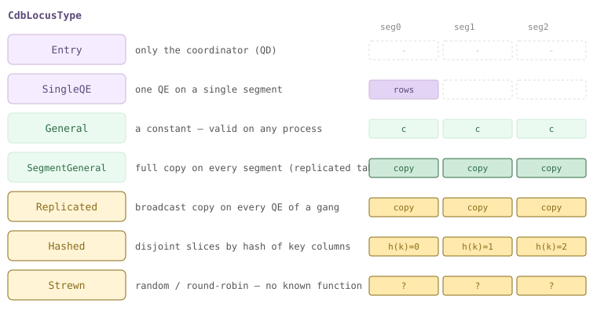
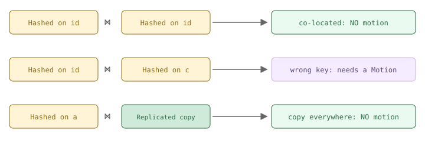
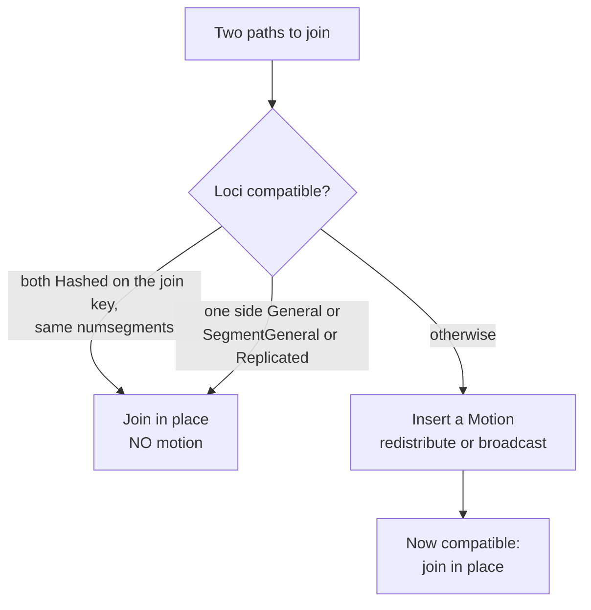
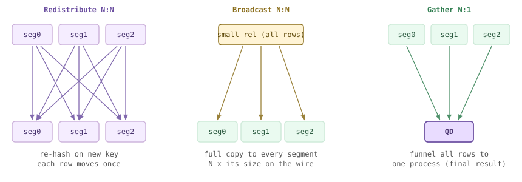
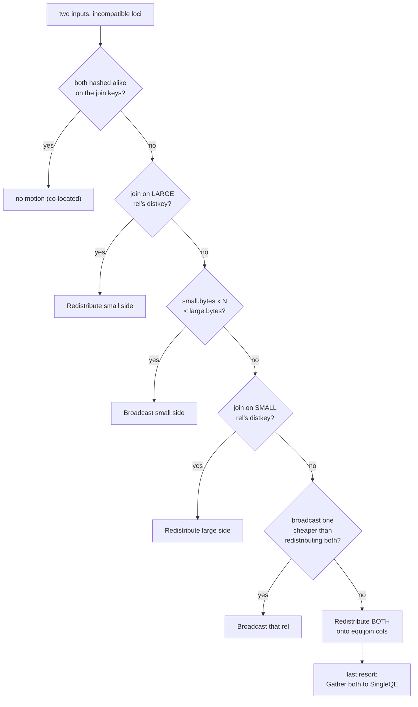
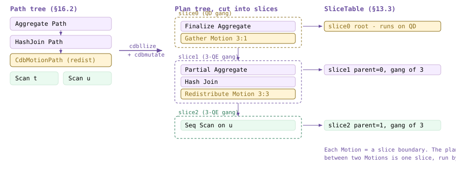
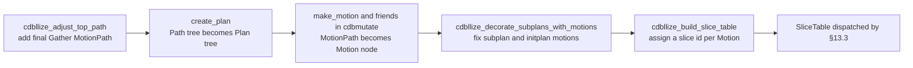
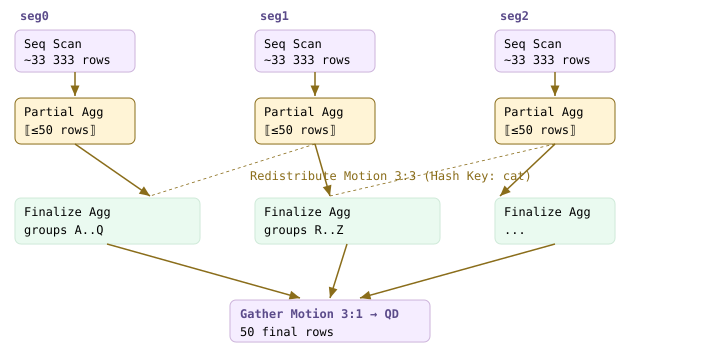
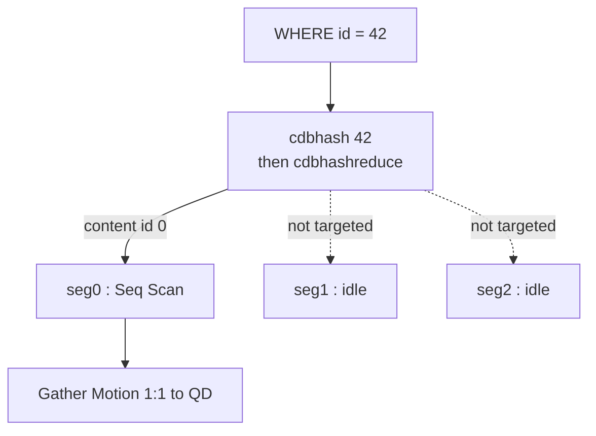

<!--
  Licensed to the Apache Software Foundation (ASF) under one
  or more contributor license agreements.  See the NOTICE file
  distributed with this work for additional information
  regarding copyright ownership.  The ASF licenses this file
  to you under the Apache License, Version 2.0 (the
  "License"); you may not use this file except in compliance
  with the License.  You may obtain a copy of the License at

    http://www.apache.org/licenses/LICENSE-2.0

  Unless required by applicable law or agreed to in writing,
  software distributed under the License is distributed on an
  "AS IS" BASIS, WITHOUT WARRANTIES OR CONDITIONS OF ANY
  KIND, either express or implied.  See the License for the
  specific language governing permissions and limitations
  under the License.
-->

# 16. Distributed Planning

## 16.1 The Locus Model (cdbpathlocus)

Chapter 15 built paths and plans as if the data sat in one place. It does not. In Cloudberry a table's rows are scattered across the segments, and the planner's central new job is to keep track of **where** each intermediate result lives — because two results can only be joined, grouped, or unioned *in place* if the pieces that must meet are already on the same segment. When they are not, the planner must ship tuples between segments with a **Motion** ([§16.2](#162-cdbmotionpath-generation)).

The bookkeeping device for "where do these rows live" is the **locus**. Every `Path` carries a `CdbPathLocus`, and the whole of distributed planning is a small algebra over loci: read a base table's locus from its distribution policy, ask whether two loci are *compatible*, and if not, wrap a side in a Motion to change its locus. This section introduces the type system; the rest of the chapter uses it. Because loci belong to the **PostgreSQL planner** path, every demo below runs with `SET optimizer=off` (ORCA does its own distributed planning — Chapter 17).



*The locus lattice — where a path's rows live. Top two run on a single process; General/SegmentGeneral are available everywhere; the bottom three spread across the N segments (disjoint for Hashed/Strewn, a full copy for Replicated).*

### 16.1.1 What a locus is

A `CdbPathLocus` is a tiny struct that answers one question: *if I hold this path's rows, which segment holds which row?* It has three parts that matter — a `locustype` tag, a `distkey` (the list of distribution-key columns, when the type is a hashed one), and `numsegments` (how many segments the rows span). A fourth field, `parallel_workers`, records intra-segment parallelism.

```c title="src/include/cdb/cdbpathlocus.h:154"
typedef struct CdbPathLocus
{
    CdbLocusType locustype;
    List       *distkey;       /* List of DistributionKeys */
    int         numsegments;
    int         parallel_workers;
} CdbPathLocus;
```

The `distkey` is not a list of column numbers but a list of `DistributionKey`s, each wrapping an `EquivalenceClass`. That indirection is the whole trick: a `WHERE a=b` clause puts `a` and `b` in one equivalence class, so a locus hashed on `a` is *automatically* recognized as hashed on `b` too. Distribution keys and equivalence classes are what let the planner see that a join key already matches a table's distribution — the header spells this out at `src/include/cdb/cdbpathlocus.h:84`.

### 16.1.2 The locus types

`CdbLocusType` (`src/include/cdb/cdbpathlocus.h:39`) enumerates the possible "shapes" of a distribution. Reading them top to bottom is reading the lattice above: a single process, then something available everywhere, then something spread across the segment gang.

| Locus type | Where the rows live | Cost to join it |
| --- | --- | --- |
| **Entry** | Only on the coordinator (QD) | gather to/from the QD |
| **SingleQE** | One QE backend on a single segment | gather |
| **General** | Self-contained (a constant / immutable) — valid on any process | never — combines with anything |
| **SegmentGeneral** | A full copy on every segment (a `DISTRIBUTED REPLICATED` table) | free on the replicated side |
| **Replicated** | A broadcast copy on every QE of a gang | free — already everywhere |
| **Hashed** | Hash-distributed on known key columns | free if the other side is Hashed on the join key |
| **HashedOJ** | Hashed, but NULLs may sit on any segment (from an outer join) | like Hashed for joins |
| **Strewn** | Random / round-robin — no known hash function | always needs a Motion to align |

```c title="src/include/cdb/cdbpathlocus.h:42"
CdbLocusType_Entry,          /* a backend on the entry db (usually the qDisp) */
CdbLocusType_SingleQE,       /* a single backend on any db */
CdbLocusType_General,        /* compatible with any locus (self-contained) */
CdbLocusType_SegmentGeneral, /* available in any qExec, not in qDisp */
CdbLocusType_Replicated,     /* replicated over all qExecs of an N-gang */
CdbLocusType_Hashed,         /* hash partitioned over all qExecs */
CdbLocusType_HashedOJ,       /* hashed outer join, NULLs can be anywhere */
CdbLocusType_Strewn,         /* partitioned on no known function */
```

:::note

The enum also carries parallel `*Workers` variants — `HashedWorkers`, `SegmentGeneralWorkers`, `ReplicatedWorkers` — used when a slice runs with more than one worker per segment. They obey the same rules with an extra `parallel_workers` dimension; `cdbpathlocus_join()` even asserts they never reach it (parallel joins go through `cdbpathlocus_parallel_join()`). We ignore them here.

:::

### 16.1.3 Where a base rel's locus comes from

For a base table the locus is read straight from its distribution policy. `cdbpathlocus_from_baserel()` just forwards the rel's `cdbpolicy` to `cdbpathlocus_from_policy()`, which maps the three `DISTRIBUTED …` forms ([§8.3](../part-2-storage-data-layout/ch08.md#83-cloudberry-distributed-catalogs)) onto three locus types: `DISTRIBUTED BY (c)` → **Hashed** on `c`; `DISTRIBUTED RANDOMLY` → **Strewn**; `DISTRIBUTED REPLICATED` → **SegmentGeneral**.

```c title="src/backend/cdb/cdbpathlocus.c:336"
if (GpPolicyIsPartitioned(policy))
{
    if (policy->nattrs > 0)
    {
        List *distkeys = cdb_build_distribution_keys(root, rti, policy);
        CdbPathLocus_MakeHashed(&result, distkeys, policy->numsegments, 0);
    }
    else                                  /* DISTRIBUTED RANDOMLY */
        CdbPathLocus_MakeStrewn(&result, policy->numsegments, 0);
}
else if (GpPolicyIsReplicated(policy))    /* DISTRIBUTED REPLICATED */
    CdbPathLocus_MakeSegmentGeneral(&result, policy->numsegments);
```

We can read those policies back from the catalog. `gp_distribution_policy` stores the `policytype` (`p` partitioned / `r` replicated), the `numsegments`, and the `distkey` attribute numbers — exactly the three fields the locus captures:

*The catalog rows that seed each base rel's locus.*

```sql
SELECT c.relname,
       CASE p.policytype WHEN 'p' THEN 'partitioned'
                         WHEN 'r' THEN 'replicated' END AS policytype,
       p.numsegments, p.distkey
FROM gp_distribution_policy p
JOIN pg_class c ON c.oid = p.localoid
WHERE c.relname LIKE 'm161%' ORDER BY 1;
```

```text {3} title="output"
relname | policytype  | numsegments | distkey
--------+-------------+-------------+---------
 m161_r | replicated |           3 |          -- -> SegmentGeneral
 m161_t | partitioned |           3 | 1        -- -> Hashed on col 1 (id)
 m161_u | partitioned |           3 | 1        -- -> Hashed on col 1 (id)
 m161_w | partitioned |           3 | 1        -- -> Hashed on col 1 (wid)
```

### 16.1.4 Distribution compatibility

Here is the crux. Two paths can be joined **locally, with no Motion**, only when their loci are *compatible*. The three compatible cases are: (1) both **Hashed** on the join key with the same `numsegments` — matching rows are guaranteed co-located; (2) either side is **General** — a constant is valid everywhere; or (3) either side is **SegmentGeneral / Replicated** — a full copy already sits on every segment the other side uses. Anything else — Hashed on the *wrong* key, or Strewn — means the rows that must meet are on different segments, so a Motion is required ([§16.2](#162-cdbmotionpath-generation)).



*Join compatibility: Hashed-on-k with Hashed-on-k is co-located (no motion); Hashed-on-k with Hashed-on-j is not (a Motion aligns them); any side that is a full copy (Replicated / SegmentGeneral) joins for free.*

`cdbpathlocus_join()` encodes exactly these rules and returns the *result* locus of a join (assuming any needed Motion is already in place). The General and SegmentGeneral / Replicated cases return early — the result simply inherits the other side's locus. Only if both sides survive to the bottom must they both be Hashed, on distribution keys of equal length, over the same `numsegments`; otherwise it is a planner error to be joining them directly:

```c title="src/backend/cdb/cdbpathlocus.c:777"
if (CdbPathLocus_IsGeneral(a))
    return b;                       /* a constant: keep b's locus */
if (CdbPathLocus_IsSegmentGeneral(a)) {
    b.numsegments = CdbPathLocus_CommonSegments(a, b);
    return b;                       /* full copy on every seg: keep b */
}
/* ... else both must be Hashed on compatible keys ... */
if (a.distkey == NIL ||
    list_length(a.distkey) != list_length(b.distkey))
    elog(ERROR, "... incompatible distribution keys");
if (CdbPathLocus_NumSegments(a) != CdbPathLocus_NumSegments(b))
    elog(ERROR, "... different number of segments");
```

The "are these two Hashed loci the same?" test lives in `cdbpathlocus_equal()` (`src/backend/cdb/cdbpathlocus.c:87`), which compares `numsegments`, then delegates to `cdbpath_distkey_equal()` (`:41`) to check the distribution keys share the same equivalence classes. A related predicate, `cdbpathlocus_is_hashed_on_exprs()` (`:904`), answers "can I group/dedup on *these* exprs without a Motion?" — true only if every distkey column's equivalence class contains one of the exprs. Both are the machinery behind the picture above.

Now watch it live. `m161_t` and `m161_u` are both `DISTRIBUTED BY (id)`; joining them **on `id`** puts two Hashed-on-id loci together — compatible, co-located. The plan has **no Redistribute**: each segment's `Hash Join` reads its own local slices and the only Motion is the final `Gather` to the coordinator.

*Co-located join — compatible Hashed loci, no redistribution. (SET optimizer=off: this is the Postgres planner.)*

```sql
SET optimizer=off;
EXPLAIN (COSTS OFF)
SELECT * FROM m161_t JOIN m161_u USING (id);
```

```text {4} title="output"
                 QUERY PLAN
--------------------------------------------
 Gather Motion 3:1  (slice1; segments: 3)
   ->  Hash Join                       -- directly over the scans
         Hash Cond: (m161_t.id = m161_u.id)
         ->  Seq Scan on m161_t
         ->  Hash
               ->  Seq Scan on m161_u
 Optimizer: Postgres query optimizer
```

Change only the join key. Joining `m161_t.id` to a **non-distribution column** of `m161_w` (its `c`, not its distkey `wid`) makes the loci incompatible — `m161_w`'s rows are hashed on `wid`, so matching `c` values are strewn across segments. The planner inserts a **Redistribute Motion** on `m161_w.c` to rebuild a locus that is Hashed-on-`c`, and only then can it join:

*Non-co-located join — incompatible loci, a Motion appears (mechanics in [§16.2](#162-cdbmotionpath-generation)).*

```sql
SET optimizer=off;
EXPLAIN (COSTS OFF)
SELECT * FROM m161_t JOIN m161_w ON m161_t.id = m161_w.c;
```

```text {6} title="output"
                         QUERY PLAN
------------------------------------------------------------
 Gather Motion 3:1  (slice1; segments: 3)
   ->  Hash Join
         Hash Cond: (m161_w.c = m161_t.id)
         ->  Redistribute Motion 3:3  (slice2; segments: 3)
               Hash Key: m161_w.c
               ->  Seq Scan on m161_w
         ->  Hash
               ->  Seq Scan on m161_t
 Optimizer: Postgres query optimizer
```

Finally the free case: `m161_r` is `DISTRIBUTED REPLICATED`, so its locus is **SegmentGeneral** — a full copy sits on every segment. Joining it to the Hashed `m161_t` needs no Motion at all on either side; `cdbpathlocus_join()` takes the SegmentGeneral early-return and keeps `m161_t`'s Hashed locus for the result.

*Replicated (SegmentGeneral) side — a copy is everywhere, so no motion.*

```sql
SET optimizer=off;
EXPLAIN (COSTS OFF)
SELECT * FROM m161_t JOIN m161_r ON m161_t.a = m161_r.r;
```

```text {8} title="output"
                QUERY PLAN
------------------------------------------
 Gather Motion 3:1  (slice1; segments: 3)
   ->  Hash Join
         Hash Cond: (m161_t.a = m161_r.r)
         ->  Seq Scan on m161_t
         ->  Hash
               ->  Seq Scan on m161_r   -- no motion over the replicated rel
 Optimizer: Postgres query optimizer
```



*The locus decision every join faces: are the two loci compatible? If yes, join in place; if not, a Motion re-loci's a side first.*

That is the entire premise of distributed planning: paths carry loci, `cdbpathlocus_join()` (and its grouping cousins) decide when loci already line up, and every mismatch becomes a Motion. [§16.2](#162-cdbmotionpath-generation) opens up how those Motions are chosen and priced — Redistribute vs. Broadcast vs. Gather — via `cdbpath_create_motion_path()` (`src/backend/cdb/cdbpath.c:195`) and `cdbpath_motion_for_join()` (`:1365`).

## 16.2 CdbMotionPath Generation

[§16.1](#161-the-locus-model-cdbpathlocus) established the rule: when two paths carry *incompatible* loci, the rows cannot be joined where they lie — some of them have to move. This section is about **how** the planner expresses that movement. It does not bolt motion on after planning; it inserts a **`CdbMotionPath`** *into the path search itself*, as one more `Path` with a cost, so that "move the data this way" competes against "move it that way" (and against every non-motion alternative) inside `add_path` ([§15.3](./ch15.md#153-path-cost--add_path)). The output is still just the cheapest path — it simply may now have a Motion in it.

There are only **three shapes** a motion can take — Redistribute, Broadcast, and Gather — and the whole of distributed join planning is the planner choosing which shape (on which side) is cheapest. We build the picture first, then read the code that draws it, then watch the planner pick each shape live on port 7100 (`SET optimizer=off` throughout — ORCA plans motion its own way, Chapter 17).



*The three motion shapes on a 3-segment cluster. Redistribute re-hashes rows across all segments; Broadcast copies one (small) rel to every segment; Gather funnels everything to one process (the QD).*

### 16.2.1 cdbpath_create_motion_path — a Path that changes locus

Every motion the planner considers is born in one function: **`cdbpath_create_motion_path()`** (`src/backend/cdb/cdbpath.c:195`). You hand it a subpath and a *target locus*; it hands back a `Path` whose rows arrive at that target. If the subpath is already there, it is returned untouched — motion is never added gratuitously:

```c title="src/backend/cdb/cdbpath.c:216"
	/*
	 * Motion is to change path's locus, if target locus is the
	 * same as the subpath's, there is no need to add motion.
	 */
	if (cdbpathlocus_equal(subpath->locus, locus))
		return subpath;
```

When motion *is* needed, it inspects the target: a *bottleneck* locus (Entry / SingleQE) becomes a **Gather**; a *Replicated* target becomes a **Broadcast**; a *Hashed* (partitioned) target becomes a **Redistribute**. Whichever it is, the node is built by the shared constructor **`make_motion_path()`** (`src/backend/cdb/cdbpath.c:754`), which stamps out a `CdbMotionPath` and — crucially — costs it before returning:

```c title="src/backend/cdb/cdbpath.c:762"
	pathnode = makeNode(CdbMotionPath);
	pathnode->path.pathtype = T_Motion;
	pathnode->path.parent   = subpath->parent;
	pathnode->path.locus    = locus;      /* the requested target locus */
	pathnode->subpath       = subpath;
	...
	cdbpath_cost_motion(root, pathnode);  /* fill in the cost */
```

The struct itself is tiny — a `CdbMotionPath` is just a `Path` wrapping the subpath, plus a flag and a policy (`src/include/nodes/pathnodes.h:2184`). Because it *is* a `Path` with `total_cost` set, it slots straight into `add_path`'s cost tournament ([§15.3](./ch15.md#153-path-cost--add_path)) — a motion is not a special after-the-fact rewrite, it is one more contender in the search.

- **`path` / `subpath`** — The Motion is a `Path` node wrapping the input path; `subpath->locus` is where rows are, `path.locus` is where they will be.
- **`is_explicit_motion`** — Set for the explicit-redistribute a writable command may force (e.g. UPDATE of the distribution key), independent of cost.
- **`policy`** — The `GpPolicy` describing the target hash distribution, when the motion redistributes to a specific key set.

### 16.2.2 cdbpath_cost_motion — why shape is a cost question

The reason there is no fixed "always redistribute" or "always broadcast" rule is that each shape moves a different *number of rows*, and `cdbpath_cost_motion()` (`src/backend/cdb/cdbpath.c:86`) prices exactly that. It counts sending segments and receiving segments off the two loci, estimates the total rows crossing the interconnect, and charges per row:

```c title="src/backend/cdb/cdbpath.c:157"
	sendrows  = subpath->rows;
	recvrows  = motionpath->path.rows;
	motioncost = cost_per_row * 0.5 * (sendrows + recvrows);
	...
	motionpath->path.total_cost = motioncost + subpath->total_cost;
```

The lever is `recvrows`. For a **Redistribute**, `total_rows` is the rel's rows spread back over the receiving segments — each row is moved *once*. For a **Broadcast** the target is Replicated, so every receiving segment gets *the whole rel*: `recvrows` balloons by the number of segments. That is the fundamental trade-off — broadcasting a rel of `B` bytes to `N` segments puts `N × B` on the wire, while redistributing moves `B` once. Broadcast wins only when the rel is small enough that `N × B` is still cheaper than reshuffling the *other* (large) side.

:::note

`cost_per_row` is `gp_motion_cost_per_row` when set, otherwise `2.0 * cpu_tuple_cost` (`cdbpath.c:153`). The `0.5 * (sendrows + recvrows)` form charges half the send and half the receive — a simple linear model, but enough to order the three shapes correctly.

:::

### 16.2.3 cdbpath_motion_for_join — picking a shape for a join

For a join whose two inputs have incompatible loci, the arbiter is **`cdbpath_motion_for_join()`** (`src/backend/cdb/cdbpath.c:1365`). Given the two subpaths and the equijoin clauses, it decides which side(s) to move and to where, then calls `cdbpath_create_motion_path()` on the chosen side(s) and returns the resulting join locus. If it can make the loci compatible with *no* motion — both rels already hashed alike on the join keys — it returns immediately:

```c title="src/backend/cdb/cdbpath.c:2124"
	/* No motion if partitioned alike and joining on the partitioning keys. */
	else if (cdbpath_match_preds_to_both_distkeys(root, redistribution_clauses,
												  outer.locus, inner.locus, false))
		return cdbpathlocus_join(jointype, outer.locus, inner.locus);
```

Otherwise it enters the *both-partitioned* branch (`src/backend/cdb/cdbpath.c:2131`), labels the sides `large_rel` / `small_rel` by byte size, and walks a cascade of `else if`s in **cheapest-first** order. The most important rungs:

| Preference (in order) | Condition | Motion chosen |
| --- | --- | --- |
| Redistribute the small side | join is on the *large* rel's distribution key | move only the small rel onto that key |
| Broadcast the small side | `small.bytes * N < large.bytes` | replicate the small rel to all N segments |
| Redistribute the large side | join is on the *small* rel's distribution key | move only the large rel |
| Broadcast (vs. moving both) | broadcasting one is cheaper than redistributing both | replicate that rel |
| Redistribute BOTH | none of the above | re-hash both rels onto the equijoin cols |
| Gather both to a SingleQE | no usable equijoin preds | last resort: one process |

The broadcast-vs-redistribute rung is the trade-off from [§16.2](#162-cdbmotionpath-generation).2 written directly as an inequality — replicate the small rel only if copying it to every segment beats moving the large one:

```c title="src/backend/cdb/cdbpath.c:2163"
	/* Replicate smaller rel if cheaper than redistributing larger rel. */
	else if (!small_rel->require_existing_order &&
			 small_rel->ok_to_replicate &&
			 (small_rel->bytes * CdbPathLocus_NumSegments(large_rel->locus) <
			  large_rel->bytes))
		CdbPathLocus_MakeReplicated(&small_rel->move_to, ...);
```

Once the `move_to` loci are decided, the actual MotionPaths are created at the tail of the function — this is the exact point where the choice becomes a `CdbMotionPath` in the plan:

```c title="src/backend/cdb/cdbpath.c:2267"
	if (!CdbPathLocus_IsNull(outer.move_to))
		outer.path = cdbpath_create_motion_path(root, outer.path,
									outer_pathkeys, outer.require_existing_order,
									outer.move_to);
	...
	if (!CdbPathLocus_IsNull(inner.move_to))
		inner.path = cdbpath_create_motion_path(root, inner.path, ...);
```



*cdbpath_motion_for_join: the cheapest-first cascade. Each rung is a cost or key-match test; the first that fires decides the shape.*

### 16.2.4 Redistribute, live

Time to watch the cascade fire. `m162_t` is big and `DISTRIBUTED BY (id)`; `m162_u` is also big (600k rows) and `DISTRIBUTED BY (uid)`. Join them on `uid` — which is `m162_u`'s distribution key but **not** `m162_t`'s. That matches the rung *"join on the small/other rel's distkey → redistribute the other side"*: only `m162_t` must move, re-hashed on `uid` to meet `m162_u`. Because `m162_u` is large, broadcasting it would be far costlier, so Redistribute wins:

*Join on m162_u's distkey but not m162_t's → the planner redistributes only m162_t. Note the Hash Key on the moved side.*

```sql
SET optimizer=off;
EXPLAIN (COSTS off)
SELECT count(*) FROM m162_t t JOIN m162_u u ON t.uid = u.uid;
```

```text {8} title="output"
Finalize Aggregate
  ->  Gather Motion 3:1  (slice1; segments: 3)
        ->  Partial Aggregate
              ->  Hash Join
                    Hash Cond: (u.uid = t.uid)
                    ->  Seq Scan on m162_u u
                    ->  Hash
                          ->  Redistribute Motion 3:3  (slice2; segments: 3)
                                Hash Key: t.uid
                                ->  Seq Scan on m162_t t
```

`Redistribute Motion 3:3` is exactly the criss-cross panel of the figure: 3 sending segments, 3 receiving segments, each row re-hashed on `t.uid` and delivered to the segment that owns that key — so `u.uid` and `t.uid` now co-locate and the Hash Join runs locally on every segment.

### 16.2.5 Broadcast, live

Now keep `m162_t` big but join it to `m162_d`, a tiny 50-row dimension `DISTRIBUTED BY (did)`, on `t.uid = d.did` — `uid` is not `m162_t`'s distkey, so the loci are incompatible. Here the inequality at `cdbpath.c:2163` flips the other way: `m162_d` is so small that copying all 50 rows to all 3 segments is trivially cheaper than reshuffling the 500k-row `m162_t`. The planner Broadcasts the small side:

*Big fact joined to a tiny dimension on a non-distkey → broadcast the small rel to every segment. COSTS ON shows why: the broadcast reads ~50 rows, moving the fact would read ~500k.*

```sql
SET optimizer=off;
EXPLAIN
SELECT count(*) FROM m162_t t JOIN m162_d d ON t.uid = d.did;
```

```text {4} title="output"
->  Gather Motion 3:1 (slice1; segments: 3)  (cost=2353.69..2353.74 rows=3)
      ->  Hash Join  (cost=2.46..2349.52 rows=1665)
            ->  Seq Scan on m162_t t  (cost=0.00..1911.67 rows=166667)
            ->  Broadcast Motion 3:3 (slice2; segments: 3) (cost=0.00..1.83 rows=50)
                  ->  Seq Scan on m162_d d  (cost=0.00..1.17 rows=17)
```

Same two-table join, opposite shape — and nothing decided it but cost. The Broadcast Motion sits under the `Hash` (the small rel becomes the hash table, now complete on every segment), while `m162_t` streams past unmoved. This is the middle panel of the figure: one rel copied whole to all three segments.

:::note

The proof that it is purely a cost decision: this *same* join (`t.uid = d.did`) with a large `m162_d` would tip `small.bytes * N &lt; large.bytes` false and switch to Redistribute — just as the earlier large `m162_u` did. The predicate at `cdbpath.c:2163` is the whole switch.

:::

### 16.2.6 Gather — and where all this happens

The third shape appears at the top of *every* one of these plans: **`Gather Motion 3:1`**. After the join runs distributed across the segments, the final rows must reach the single process that returns them to the client. `cdbpath_create_motion_path()` produces this when the target is a *bottleneck* locus (Entry, the QD) — the right panel of the figure, three segments funnelling into one. A Gather is `N:1`; Redistribute and Broadcast are `N:N`.

Finally, the placement. `cdbpath_motion_for_join()` is not called from a distributed post-pass — it is invoked from the join-path constructors in `src/backend/optimizer/util/pathnode.c` (e.g. `create_nestloop_path` at `:3936`, and the hash/merge variants), which are called from **`add_paths_to_joinrel()`** (`src/backend/optimizer/path/joinpath.c:456`, [§15.3](./ch15.md#153-path-cost--add_path)). So each candidate join path is costed *with its motion included*, and the Redistribute-vs-Broadcast choice is settled by the same `add_path` tournament that ranks every other path. Motion is planned, not patched.

[§16.1](#161-the-locus-model-cdbpathlocus) gave us loci and compatibility; this section turned incompatibility into concrete, costed `CdbMotionPath` nodes. Next, [§16.3](#163-parallelization-cdbllize--cdbmutate) takes the winning path — motions and all — and turns it into a parallel `Plan` with a **slice table** (`cdbllize`/`cdbmutate`), the structure that [§13.3](./ch13.md#133-dispatch-from-coordinator-plan-to-segment-execution) dispatches to gangs. How those Motion nodes actually ship tuples over the interconnect is Chapter 19.

## 16.3 Parallelization (cdbllize / cdbmutate)

[§16.2](#162-cdbmotionpath-generation) handed us a **Path** tree that already contains `CdbMotionPath` nodes — the planner *decided* where data must move. But a Path is not runnable. This section is the concrete step that turns that annotated Path into a **parallel `Plan`**: it materializes each MotionPath into a real `Motion` plan node, then cuts the plan into **slices** — the fragments that each run on their own gang of processes. The output is the very `SliceTable` that [§13.3](./ch13.md#133-dispatch-from-coordinator-plan-to-segment-execution) dispatches. Think of it as *making the single-node plan MPP-aware*: `create_plan()` builds an ordinary Plan tree, and the `cdb*` passes stitch the motions and slice boundaries into it.



*From a Path tree with MotionPaths to a sliced Plan tree, one gang per slice (ties to [§13.3](./ch13.md#133-dispatch-from-coordinator-plan-to-segment-execution)'s dispatch figure).*



*The parallelization pipeline inside standard_planner(), from best Path to dispatchable SliceTable.*

### 16.3.1 cdbllize — parallelizing the plan

`cdbllize.c` is the driver. Its header spells out the pipeline that `standard_planner()` follows, and the two entry points do the two big jobs. `cdbllize_adjust_top_path()` runs **before** `create_plan()`: it appends a final MotionPath on top of the best Path so the query result lands where it is needed — usually a Gather to the QD so the coordinator can return rows to the client (for a DML or CTAS it may instead be a redistribute onto the target table's segments).

```c title="src/backend/optimizer/plan/planner.c:630"
/* add the final Gather MotionPath, then build the Plan */
best_path = cdbllize_adjust_top_path(root, best_path, top_slice);
top_plan  = create_plan(root, best_path, top_slice);
top_plan->flow = cdbpathtoplan_create_flow(root, best_path->locus);
...
top_plan = cdbllize_decorate_subplans_with_motions(root, top_plan);
...
cdbllize_build_slice_table(root, top_plan, top_slice);
```

After `create_plan()` has produced a Plan tree (with the main-query Motions already in place — see [§16.3](#163-parallelization-cdbllize--cdbmutate).2), `cdbllize_decorate_subplans_with_motions()` (`src/backend/cdb/cdbllize.c:731`) walks it to fix up **subplans and initplans**. A SubPlan's result must be materialized at the right place: if the referencing slice runs on a single node it gets a Gather on top; if the parent runs on all segments it may get a Broadcast. It also resolves `MOTIONTYPE_OUTER_QUERY` placeholder motions — motions the path search could not yet classify as Gather vs. Broadcast — into concrete ones now that the enclosing slice's Flow is known.

```c title="src/backend/cdb/cdbllize.c:758"
context.currentPlanFlow = plan->flow;
result = (Plan *) fix_outer_query_motions_mutator((Node *) plan, &context);
```

:::note

There is also **cdbllize_adjust_init_plan_path()** for Init Plans (run once before the main query), and a **motion_sanity_check()** (`cdbllize.c:1607`, gated by `gp_enable_motion_deadlock_sanity`) that verifies the motion topology cannot deadlock — e.g. two slices each waiting to send to the other.

:::

### 16.3.2 cdbmutate — building Motion nodes

Where does the actual `Motion` node come from? During `create_plan()`, whenever the walker meets a `CdbMotionPath` it calls `create_motion_plan()` → `cdbpathtoplan_create_motion_plan()` (`src/backend/optimizer/plan/createplan.c:359`), which dispatches on the target locus to one of the constructors in `src/backend/cdb/cdbmutate.c`. Each is a thin wrapper over the base `make_motion()` builder (`src/backend/optimizer/plan/createplan.c:8031`) that stamps a `motionType` and the routing fields:

- **`make_hashed_motion()` — `cdbmutate.c:99`** — **Redistribute.** Sets `MOTIONTYPE_HASH`, a `hashExprs` list (the redistribution key), the matching `hashFuncs`, and `numHashSegments`. Each tuple is hashed on the key to pick its destination segment.
- **`make_broadcast_motion()` — `cdbmutate.c:136`** — **Broadcast.** `MOTIONTYPE_BROADCAST`, no hash key — every tuple is sent to every segment (used to co-locate a small side of a join).
- **`make_union_motion()` / `make_sorted_union_motion()` — `cdbmutate.c:67` / `:82`** — **Gather.** `MOTIONTYPE_GATHER` — N senders, one receiver. The *sorted* variant carries sort columns so the receiver does an order-preserving merge.
- **`make_explicit_motion()` — `cdbmutate.c:149`** — **Explicit.** `MOTIONTYPE_EXPLICIT` — route each tuple to the segment named in an explicit `segid` column (used by DML on the target's own segments).

```c title="src/backend/cdb/cdbmutate.c:99"
Motion *
make_hashed_motion(Plan *lefttree, List *hashExprs,
                   List *hashOpfamilies, int numHashSegments)
{
    ... /* look up cdb_hashproc for each key expr */
    motion = make_motion(NULL, lefttree, 0, ...);
    motion->motionType     = MOTIONTYPE_HASH;
    motion->hashExprs      = hashExprs;      /* the redistribution key */
    motion->hashFuncs      = hashFuncs;
    motion->numHashSegments = numHashSegments;
    return motion;
}
```

The `Motion` plan node (`src/include/nodes/plannodes.h:1893`) is a normal `Plan` with these extra fields — `motionType`, `hashExprs`/`hashFuncs`/`numHashSegments` for hash routing, `segidColIdx` for explicit routing, the sort columns for a merge Gather, and a `senderSliceInfo` pointer that [§16.3](#163-parallelization-cdbllize--cdbmutate).3 fills in. The base `make_motion()` copies the child's costs and targetlist and asserts a Motion is never stacked directly on another Motion.

| Target locus | Constructor | motionType | EXPLAIN line |
| --- | --- | --- | --- |
| Hashed (on a key) | make_hashed_motion | MOTIONTYPE_HASH | Redistribute Motion N:N |
| Replicated | make_broadcast_motion | MOTIONTYPE_BROADCAST | Broadcast Motion N:N |
| Entry / SingleQE | make_union_motion | MOTIONTYPE_GATHER | Gather Motion N:1 |
| target segments | make_explicit_motion | MOTIONTYPE_EXPLICIT | Explicit Redistribute Motion |

### 16.3.3 Slice assignment — the SliceTable is born

Now the plan is a complete tree of Plan nodes with Motions embedded, but nothing yet says *which processes run what*. `cdbllize_build_slice_table()` (`src/backend/cdb/cdbllize.c:1114`) supplies that. It walks the plan (and reachable subplans) and, at **every Motion**, opens a new slice: the Motion's sender side becomes a fresh `PlanSlice`, gets the next slice index, and records its parent slice. `motion->motionID` is set to that slice id, and the slice is appended to the table.

```c title="src/backend/cdb/cdbllize.c:1337"
/* at each Motion: start a new (sender) slice */
sendSlice->sliceIndex  = list_length(context->slices);
sendSlice->parentIndex = context->currentSliceIndex;
motion->motionID       = sendSlice->sliceIndex;
context->slices        = lappend(context->slices, sendSlice);
```

A **slice** is exactly the plan fragment between two Motions: everything above the child Motion and below the parent Motion. The **root slice (slice0)** is the fragment above the topmost Gather — it runs on the **QD**. Every other slice runs on a gang of QEs. The finished `SliceTable` (slice id → parent → gang type → segments) is stored on the plan and is precisely the structure [§13.3](./ch13.md#133-dispatch-from-coordinator-plan-to-segment-execution) walks to spin up gangs and wire the interconnect. This call sits right after `create_plan()` in the [§15.4](./ch15.md#154-plan-generation) hand-off — parallelization is the last thing the Postgres planner does before dispatch.

:::note

In **utility**/**execute** mode `cdbllize_build_slice_table()` returns early — there is no dispatch, so at most a single dummy slice is built (`cdbllize.c:1149`). Slicing only matters on the **dispatcher** (QD).

:::

### 16.3.4 The multi-slice plan, live

Time to see it. On the demo cluster (`SET optimizer=off` — this is the Postgres planner path; ORCA does its own distributed planning, Chapter 17) we join two tables distributed on **different** keys, so the join key is a distribution key for neither side and one side must be redistributed. `EXPLAIN (ANALYZE, VERBOSE)` then prints the slice each Motion belongs to and the per-slice memory footer.

*A join across mismatched distribution keys → 3 slices. Each Motion prints its slice and segment count; the footer lists memory per slice.*

```sql
SET optimizer=off;   -- Postgres planner (ORCA is Ch.17)
-- m163_t DISTRIBUTED BY (id), m163_u DISTRIBUTED BY (val)
EXPLAIN (ANALYZE, VERBOSE, COSTS OFF, TIMING OFF)
SELECT count(*) FROM m163_t t JOIN m163_u u ON t.id = u.id;
```

```text {8} title="output"
 Finalize Aggregate (actual rows=1 loops=1)
   Output: count(*)
   ->  Gather Motion 3:1  (slice1; segments: 3) (actual rows=3 loops=1)
         Output: (PARTIAL count(*))
         ->  Partial Aggregate (actual rows=1 loops=1)
               ->  Hash Join (actual rows=16718 loops=1)
                     Hash Cond: (u.id = t.id)
                     ->  Redistribute Motion 3:3  (slice2; segments: 3) (actual rows=16718)
                           Output: u.id
                           Hash Key: u.id
                           ->  Seq Scan on public.m163_u u (actual rows=19000 loops=1)
                     ->  Hash (actual rows=16718 loops=1)
                           ->  Seq Scan on public.m163_t t (actual rows=16718 loops=1)
 Settings: optimizer = 'off'
   (slice0)    Executor memory: 121K bytes.
   (slice1)    Executor memory: 4819K bytes avg x 3 workers, 4819K bytes max (seg0).
   (slice2)    Executor memory: 112K bytes avg x 3 workers, 112K bytes max (seg0).
 Optimizer: Postgres query optimizer
```

Three slices, matching the SliceTable the planner just built:

| Slice | Plan fragment (between which Motions) | Gang | Born at |
| --- | --- | --- | --- |
| **slice0** (root) | Finalize Aggregate — above the Gather | QD (1 process) | top_slice, index 0 |
| **slice1** | Partial Aggregate + Hash Join + Hash — sender under the Gather | 3 QEs | the Gather Motion |
| **slice2** | Seq Scan on u — sender under the Redistribute | 3 QEs | the Redistribute Motion |

Read the plan bottom-up: **slice2** scans `m163_u` on its home segments and its Redistribute Motion re-hashes each row on `u.id` — the `Hash Key: u.id` line is exactly the `hashExprs` that `make_hashed_motion()` stashed, and `segments: 3` is its `numHashSegments`. Rows land on the segment where the matching `m163_t` row lives, so **slice1** can do a local Hash Join and a Partial Aggregate. The Gather Motion (slice1's top) ships the three partial counts up to **slice0** on the QD, which does the Finalize Aggregate. Each `(sliceN)` footer line is per-slice `Executor memory` — concrete evidence that the executor treats each slice as its own unit.

:::note

Only `m163_u` is redistributed; `m163_t` is already hashed on the join key, so it stays put (its side is a plain `Hash`, no Motion). Had we joined on the **same** distribution key, the loci would be compatible and there would be **no** redistribute — a single-slice-per-scan, co-located join. Direct-dispatch and Broadcast variants ([§16.1](#161-the-locus-model-cdbpathlocus)) change only which Motion type is chosen; the slicing machinery is identical.

:::

### 16.3.5 Flow — what the executor reads back

One more annotation ties the whole thing together. Every plan node carries a `Flow` (`src/include/nodes/plannodes.h:211`) describing how *its* output tuples are laid out across the cluster. `cdbpathtoplan_create_flow()` (`src/backend/cdb/cdbpathtoplan.c:27`) derives it from the node's locus right after `create_plan()`. The three `FlowType`s mirror the locus families from [§16.1](#161-the-locus-model-cdbpathlocus):

- **`FLOW_PARTITIONED`** — Tuples are spread across segments (a hash- or randomly-distributed relation, or the output of a Redistribute).
- **`FLOW_REPLICATED`** — A full copy on every segment (output of a Broadcast, or a replicated table).
- **`FLOW_SINGLETON`** — A single stream on one node — `segindex = -1` means the QD (the output above a Gather).

```c title="src/include/nodes/plannodes.h:211"
typedef struct Flow {
    NodeTag       type;          /* T_Flow */
    FlowType      flotype;       /* SINGLETON / REPLICATED / PARTITIONED */
    CdbLocusType  locustype;     /* optimizer flow characterization */
    int           segindex;      /* -1 = entry (QD) for a singleton flow */
    int           numsegments;
} Flow;
```

So the Flow is the executor-facing summary of a slice's distribution: a Redistribute's output node is `FLOW_PARTITIONED`, a Broadcast's is `FLOW_REPLICATED`, and the plan root above the final Gather is `FLOW_SINGLETON` on the QD. With the Motions built, slices assigned, and Flows attached, the plan is fully MPP-aware — and the `SliceTable` produced here is handed straight to the dispatch machinery of [§13.3](./ch13.md#133-dispatch-from-coordinator-plan-to-segment-execution), which turns each slice into a running gang wired together by the interconnect (Chapter 19).

## 16.4 Distributed Grouping & Direct Dispatch

The two Motions of [§16.2](#162-cdbmotionpath-generation) — Redistribute and Broadcast — move *whole rows*. If the planner used them naively, a `GROUP BY` on a non-distribution column would ship every row across the interconnect before counting anything, and a point lookup on the distribution key would still wake all three segments. This closing section covers the two optimizations that make the distributed planner *smarter than "move everything"*: **two-stage aggregation**, which collapses rows to partial groups *before* the network hop, and **direct dispatch**, which sends the plan to only the segment(s) that can possibly hold matching rows. Both run on the Postgres planner path, so — as everywhere in this chapter — the demos begin with `SET optimizer=off` (ORCA does its own distributed grouping; Chapter 17).

The payoff is easiest to *see* first. A `GROUP BY cat` over 100k rows spread across 3 segments has only 50 distinct groups. If each segment pre-aggregates its ~33k rows down to ≤50 partial counts, the Redistribute Motion carries **150 rows instead of 100 000** — a thousand-fold cut in network traffic, and the whole reason the planner splits one aggregate into two.



*Two-stage aggregation on 3 segments: rows collapse to partial groups BEFORE the network hop, then Redistribute lands each group on one segment for the Finalize merge.*

Contrast that with grouping on the **distribution key** itself: every row of a given `id` already lives wholly on one segment, so each group is complete locally — the planner emits a *single* aggregate and just Gathers the result. And a point qual on the distribution key (`WHERE id = 42`) proves that only one segment can hold the row at all, so the plan is dispatched to that one segment — **direct dispatch**. We cover all three below.

### 16.4.1 Two-stage aggregation: Partial → Redistribute → Finalize

When the `GROUP BY` columns are *not* the distribution key, the rows of a single group are strewn across all segments, so no segment can compute a final count alone. The distributed planner's answer is the classic MPP two-stage split, whose shape is spelled out at the top of the file that builds it:

```c title="src/backend/cdb/cdbgroupingpaths.c:13"
Finalize Aggregate [3]
   Motion             [2]
      Partial Aggregate  [1]

* [2] With GROUP BY, [partial results] can be redistributed
*     according to the GROUP BY columns.
```

`cdb_create_multistage_grouping_paths()` (`src/backend/cdb/cdbgroupingpaths.c:251`) is the CBDB extension the planner calls; it drives `create_two_stage_paths()` (`src/backend/cdb/cdbgroupingpaths.c:692`). The first stage builds a Partial aggregate over each segment's local scan. The trick is the aggregate *split*: the partial stage runs each aggregate in **`AGGSPLIT_INITIAL_SERIAL`** mode (`:793`) — run the transition function and *serialize* the running state — while the finalize stage runs **`AGGSPLIT_FINAL_DESERIAL`** (`:1193`) — deserialize the partial states, *combine* them, and finalize. For `count(*)`, the partial state is a per-group subtotal and the combine function simply adds subtotals; that additivity is exactly what lets the two halves live on different segments.

Between the halves sits the Motion. `choose_grouping_locus()` (`src/backend/cdb/cdbgroupingpaths.c:2083`) decides its target: if the partial result is not already hashed on the group keys, it builds a new Hashed locus from the `GROUP BY` columns, and `create_two_stage_paths` wraps the partial path in a Redistribute via `cdbpath_create_motion_path()` (`:1178`) toward that locus. After redistribution every row of a given `cat` is guaranteed to land on the same segment, so the Finalize aggregate is correct *and* runs in parallel across all three segments.

```c title="src/backend/cdb/cdbgroupingpaths.c:1174"
/* Alternative 1: Redistribute -> Sort -> Agg */
if (CdbPathLocus_IsHashed(group_locus))
{
    path = initial_agg_path;
    path = cdbpath_create_motion_path(root, path, NIL,
                                      false, group_locus);
    ...
    path = (Path *) create_agg_path(root, output_rel, path, ctx->target,
                    ..., AGGSPLIT_FINAL_DESERIAL ...);
```

*GROUP BY on the non-distribution column cat: Streaming Partial HashAggregate collapses each segment's rows, THEN a 3:3 Redistribute on cat, THEN Finalize. Note the estimate: 50 rows cross the network, not 100 000.*

```sql
SET optimizer=off;
EXPLAIN SELECT cat, count(*) FROM m164_t GROUP BY cat;
```

```text {6} title="output"
                              QUERY PLAN
--------------------------------------------------------------------------
 Gather Motion 3:1  (slice1; segments: 3)
   ->  Finalize HashAggregate
         Group Key: cat
         ->  Redistribute Motion 3:3  (slice2; segments: 3)
               Hash Key: cat
               ->  Streaming Partial HashAggregate
                     Group Key: cat
                     ->  Seq Scan on m164_t  (rows=33333 width=4)
 Optimizer: Postgres query optimizer
```

Read it bottom-up: the `Seq Scan` feeds `Streaming Partial HashAggregate` (stage [1], `slice2`), which redistributes on `cat`, then `Finalize HashAggregate` (stage [3], `slice1`) merges the partial counts, and finally `Gather Motion 3:1` collects the 50 groups to the coordinator. The Redistribute row estimate is `rows=50` — the partial stage did its job before the hop.

:::note

Aggregates with **DISTINCT** arguments (DQAs — e.g. `count(DISTINCT x)`) are the harder variant: a plain partial count is wrong if the same value appears on several segments. When there is a single DQA collocated with its DISTINCT argument the two-stage shape still works; otherwise the planner falls back to a three-stage plan (and sometimes a TupleSplit). See `add_single_dqa_hash_agg_path` / `add_multi_dqas_hash_agg_path` in the same file; hashing is disabled entirely when `distinctAggrefs` is non-empty (cdbgroupingpaths.c:759).

:::

### 16.4.2 Single-stage: grouping on the distribution key

When the `GROUP BY` columns *are* (a superset of) the distribution key, every row of a group already sits on exactly one segment — the groups are pre-partitioned by construction. `choose_grouping_locus()` detects this and reports `need_redistribute = false`, so no Motion is inserted:

```c title="src/backend/cdb/cdbgroupingpaths.c:2107"
/* If the input is already suitably distributed, no need to redistribute */
else if (!CdbPathLocus_IsHashedOJ(path->locus) &&
         cdbpathlocus_is_hashed_on_tlist(path->locus, group_tles, true))
{
    need_redistribute = false;
    CdbPathLocus_MakeNull(&locus);
}
```

In fact `create_two_stage_paths` skips the two-stage shape for this case outright — the guard `if (cdbpathlocus_collocates_tlist(...)) continue;` (`src/backend/cdb/cdbgroupingpaths.c:722`, `:767`) bails, because the ordinary single-stage plan built back in `planner.c`'s `create_grouping_paths()` (`src/backend/optimizer/plan/planner.c:4543`) is already optimal. The result is one aggregate per segment and a plain Gather:

*GROUP BY on the distribution key id: a single HashAggregate per segment, NO Redistribute Motion — each id is wholly local, so the groups are already correct.*

```sql
SET optimizer=off;
EXPLAIN SELECT id, count(*) FROM m164_t GROUP BY id;
```

```text {4} title="output"
                       QUERY PLAN
--------------------------------------------------------
 Gather Motion 3:1  (slice1; segments: 3)
   ->  HashAggregate
         Group Key: id
         ->  Seq Scan on m164_t  (rows=33333 width=4)
 Optimizer: Postgres query optimizer
```

One `HashAggregate` (not Partial/Finalize), no `Redistribute Motion`, one slice below the Gather. Co-location on the distribution key turned a two-Motion, two-aggregate plan into a one-Motion, one-aggregate plan — the same payoff [§16.2](#162-cdbmotionpath-generation) showed for co-located joins, applied to grouping. Choosing the distribution key well pays off for *every* grouping query that keys off it.

### 16.4.3 Direct dispatch: targeting a single segment

The last optimization touches dispatch itself ([§13.3](./ch13.md#133-dispatch-from-coordinator-plan-to-segment-execution)). A query like `WHERE id = 42` on a table `DISTRIBUTED BY (id)` can only match rows on the *one* segment that `id = 42` hashes to. There is no point starting a scan gang on the other segments. When it can prove this, the planner marks the slice for **direct dispatch** — a gang targeted at a subset of segments rather than the whole cluster. The flag lives on every Plan node's slice:

```c title="src/include/nodes/plannodes.h:29"
typedef struct DirectDispatchInfo
{
    /* if true then this Slice requires an n-gang but the gang can be
     * targeted to fewer segments than the entire cluster. */
    bool        isDirectDispatch;
    List       *contentIds;      /* segments to dispatch to */
    ...
} DirectDispatchInfo;
```

The proof is done in `cdbtargeteddispatch.c`. For a scan over one relation, `GetContentIdsFromPlanForSingleRelation()` (`src/backend/cdb/cdbtargeteddispatch.c:94`) pulls the equality constants out of the qual for the distribution-key columns, then does exactly what the *storage* layer did on INSERT — it runs the same `cdbhash` over those constants and reduces to a segment id:

```c title="src/backend/cdb/cdbtargeteddispatch.c:293"
h = makeCdbHashForRelation(relation);
result.isDirectDispatch = true;
...
    cdbhashinit(h);
    for (i = 0; i < policy->nattrs; i++) {
        ... cdbhash(h, i + 1, c->constvalue, c->constisnull); ...
    }
    hashCode = cdbhashreduce(h);
    result.contentIds = list_append_unique_int(result.contentIds, hashCode);
```

This is the identical hash-then-reduce that decides a row's home segment in [§1.2](../part-1-introduction/ch01.md#12-data-organization) — reused at plan time on the constant `42` to pick the target. The computed `contentIds` are threaded up through `createplan.c` (the guard `root->config->gp_enable_direct_dispatch && best_path->direct_dispatch_contentIds` at `src/backend/optimizer/plan/createplan.c:2355`, merged via `MergeDirectDispatchCalculationInfo`), so the final slice carries a single content id. If any distribution-key column lacks an equality constant — or the qual would touch too many segments — `isDirectDispatch` is cleared and the plan falls back to a full gang.

*WHERE id = 42 (distribution key): the qual is direct-dispatched to ONE segment — the Gather is 1:1 and the slice runs on 1 segment, not 3.*

```sql
SET optimizer=off;
EXPLAIN SELECT * FROM m164_t WHERE id = 42;
```

```text {3} title="output"
                       QUERY PLAN
------------------------------------------------------------
 Gather Motion 1:1  (slice1; segments: 1)
   ->  Seq Scan on m164_t
         Filter: (id = 42)
 Optimizer: Postgres query optimizer
```

`Gather Motion 1:1 (slice1; segments: 1)` — the sender gang is a single segment. Compare the *same* equality on the non-distribution column `cat`: `cat = 42` proves nothing about location, so all three segments must scan:

*WHERE cat = 42 (non-distribution column): no single segment can be proven, so the gang spans all 3 segments (3:1 Gather).*

```sql
SET optimizer=off;
EXPLAIN SELECT * FROM m164_t WHERE cat = 42;
```

```text {3} title="output"
                       QUERY PLAN
------------------------------------------------------------
 Gather Motion 3:1  (slice1; segments: 3)
   ->  Seq Scan on m164_t
         Filter: (cat = 42)
 Optimizer: Postgres query optimizer
```



*Direct dispatch: cdbhash(42) reduces to seg0, so only seg0 gets the scan slice; the other segments stay idle.*

We can confirm which segment the planner picked: `id = 42` genuinely lives on segment 0, exactly the content id `cdbhashreduce` would compute — direct dispatch is not a guess, it is the storage hash re-run at planning time:

*Verifying the target: id=42 physically resides on gp_segment_id 0 — the same segment direct dispatch targeted.*

```sql
SELECT gp_segment_id, id FROM m164_t WHERE id = 42;
```

```text {3} title="output"
 gp_segment_id | id
---------------+----
       0     | 42
(1 row)
```

Direct dispatch and two-stage aggregation are the two edges of the same idea that runs through this whole chapter: the distributed planner does not blindly move or touch everything. It uses the *distribution* ([§1.2](../part-1-introduction/ch01.md#12-data-organization)) to skip work — pre-aggregating before a hop, or waking only the segment that can matter — and encodes the result in the slice/gang machinery [§13.3](./ch13.md#133-dispatch-from-coordinator-plan-to-segment-execution) dispatches and Chapter 19's interconnect carries. How those slices actually execute — motion senders, receivers, and flow control — is Chapter 18–19.

- **Two-stage (partial) aggregation** — Partial aggregate per segment → Redistribute Motion on the group key → Finalize aggregate. Cuts network traffic by pre-collapsing rows to partial groups. Built by `cdb_create_multistage_grouping_paths` / `create_two_stage_paths`; uses aggregate splits `AGGSPLIT_INITIAL_SERIAL` (partial) and `AGGSPLIT_FINAL_DESERIAL` (finalize + combine).
- **Single-stage aggregation** — When `GROUP BY` covers the distribution key, groups are already local: one aggregate, one Gather, no Redistribute. `choose_grouping_locus` returns `need_redistribute = false`.
- **Direct / targeted dispatch** — An equality on the distribution key lets the planner `cdbhash` the constant and dispatch the slice to just that segment (`Gather Motion 1:1 (segments: 1)`), skipping the rest of the cluster. Computed in `cdbtargeteddispatch.c`, gated by `gp_enable_direct_dispatch`.

