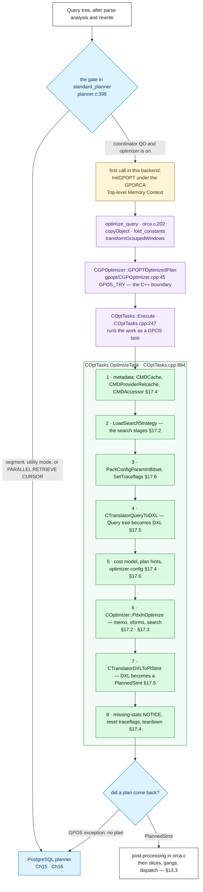
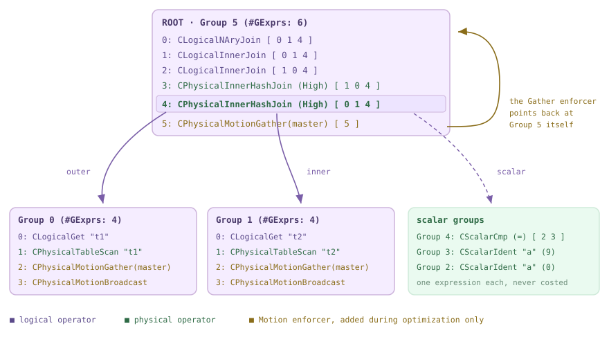
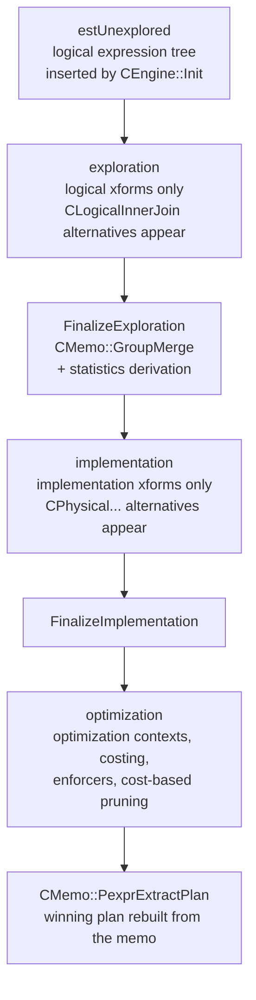
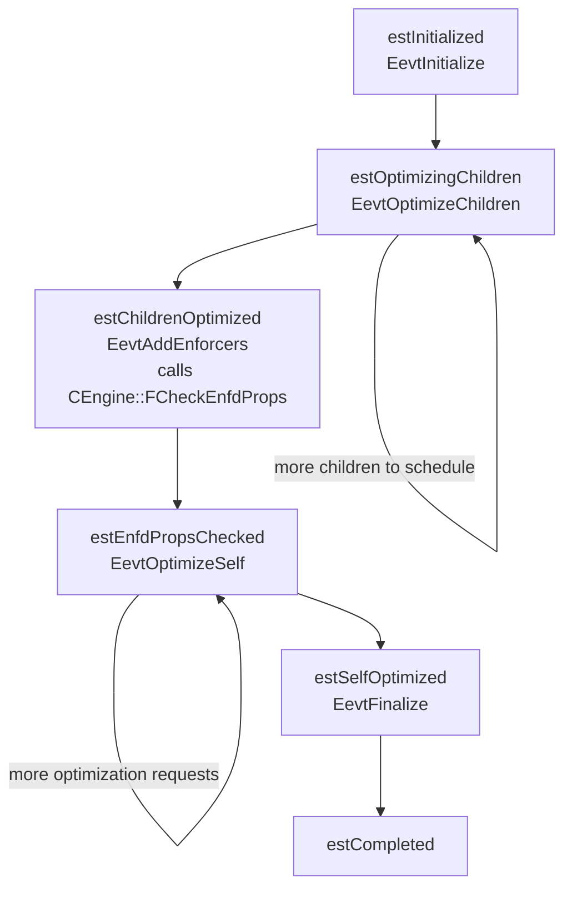
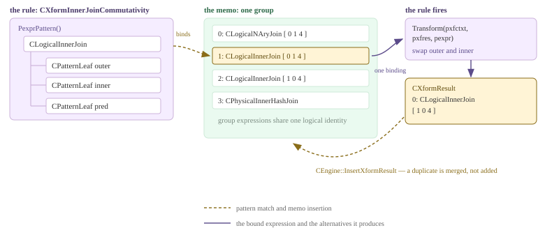
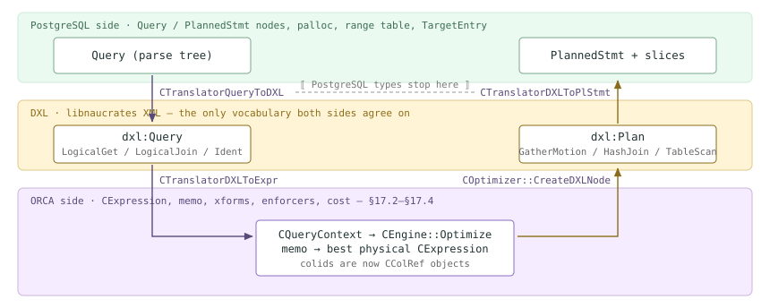
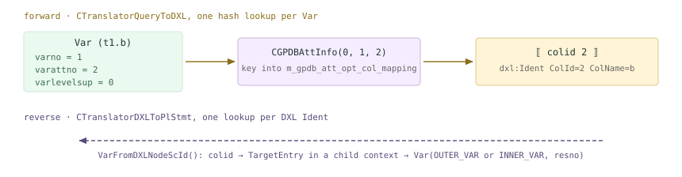
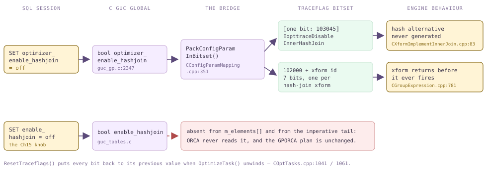
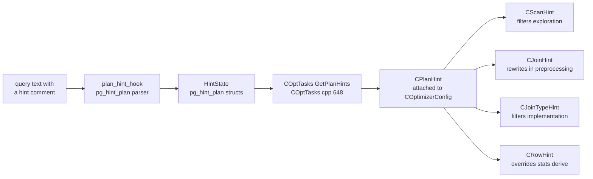

<!--
  Licensed to the Apache Software Foundation (ASF) under one
  or more contributor license agreements.  See the NOTICE file
  distributed with this work for additional information
  regarding copyright ownership.  The ASF licenses this file
  to you under the Apache License, Version 2.0 (the
  "License"); you may not use this file except in compliance
  with the License.  You may obtain a copy of the License at

    http://www.apache.org/licenses/LICENSE-2.0

  Unless required by applicable law or agreed to in writing,
  software distributed under the License is distributed on an
  "AS IS" BASIS, WITHOUT WARRANTIES OR CONDITIONS OF ANY
  KIND, either express or implied.  See the License for the
  specific language governing permissions and limitations
  under the License.
-->

import RawFigure from '../_components/RawFigure';

# 17. ORCA: The Cascades Optimizer

## 17.1 Entry & Dispatch

Chapter 15 followed a `Query` tree into PostgreSQL's planner, and Chapter 16 watched the distributed layer that is bolted onto it. Cloudberry ships a **second, entirely separate optimizer** — GPORCA — and on this cluster it is the one that runs: `show optimizer` reads `on`, and the tell is the last line of every EXPLAIN, `Optimizer: GPORCA`. The Ch15–16 demos all had to `SET optimizer=off` to see `Optimizer: Postgres query optimizer` instead; from here on the demos run at the default. ORCA is a C++ Cascades-style engine living in `src/backend/gporca/`, reached through the glue in `src/backend/gpopt/`. It does not extend the planner — it replaces it. This section is the doorway: which queries are handed over, what the handover costs, how a C `Query *` becomes work inside a C++ task, and, most useful of all in practice, what happens on the way back out when ORCA declines.



*The whole itinerary, and a map of the chapter. A `Query` tree arrives at `standard_planner()`; one `if` decides whether ORCA is even offered the query. If it is, `optimize_query()` does the pre-processing ORCA needs, `CGPOptimizer` crosses into C++, and `COptTasks::Execute` runs the real body — `OptimizeTask` — as a GPOS task with its own memory pool. Stops **1–8** are that body, in source order; the § chip on each stop names the section of this chapter that opens it up. Either exit converges on the same place: a `PlannedStmt` to dispatch ([§13.3](./ch13.md#133-dispatch-from-coordinator-plan-to-segment-execution)), or `NULL` and the PostgreSQL planner. This section owns only the outer ring — the gate, the shell, and the two exits.*

### 17.1.1 The fork in standard_planner()

There is exactly one fork in the road, and it is a plain `if` near the top of `standard_planner()`. Five conditions must all hold before ORCA is offered the query: the `optimizer` GUC is on; this backend is dispatching (`GP_ROLE_DISPATCH`); it is the query dispatcher on the coordinator (`IS_QUERY_DISPATCHER()`); the caller did not ask to skip foreign partitions (a cursor option `COPY TO` sets, `copyto.c:1249`); and this is not a PARALLEL RETRIEVE CURSOR, which ORCA does not support:

```c title="src/backend/optimizer/plan/planner.c:398"
	if (optimizer &&
		GP_ROLE_DISPATCH == Gp_role &&
		IS_QUERY_DISPATCHER() &&
		(cursorOptions & CURSOR_OPT_SKIP_FOREIGN_PARTITIONS) == 0 &&
		(cursorOptions & CURSOR_OPT_PARALLEL_RETRIEVE) == 0)
	{
		...                                     /* one-time InitGPOPT() */
		result = optimize_query(parse, cursorOptions, boundParams,
							   optimizer_options);
		...                                     /* Optimizer Time: ... ms */
		if (result)
			return result;
	}
```

The long comment above that `if` is worth reading rather than skipping, because the two role conditions are not arbitrary caution. ORCA is aimed at complex queries, and complex queries touch distributed tables — which a segment slice could not plan usefully anyway, because running such a plan from a segment would mean dispatching a query from inside a query, and Cloudberry forbids that (`querytree_safe_for_qe()`, `src/backend/executor/functions.c:254`). The same restriction applies to coordinator slices that are not the QD, which is what `IS_QUERY_DISPATCHER()` filters. And the planning that *does* happen on segments is mostly the bodies of pl/language functions, which ORCA does not handle. So the rule is simply: ORCA runs on the coordinator QD, or not at all. Note what is **not** in the gate — nothing about the query's shape. Whether ORCA can actually handle this query is discovered much later, by failing ([§17.1](#171-entry--dispatch).5).

*The gate seen from the other side. Connecting straight to a segment in utility mode, `optimizer` still reads `on` — it is a normal GUC and its value is inherited — yet the plan is unmistakably the PostgreSQL planner's. The footer is the giveaway.*

```sql
-- PGOPTIONS='-c gp_role=utility' psql -p 7102 -d postgres
SELECT current_setting('optimizer');
EXPLAIN SELECT count(*) FROM m171_t;
```

```text {10} title="output"
 current_setting 
-----------------
 on
(1 row)

                           QUERY PLAN                           
----------------------------------------------------------------
 Aggregate  (cost=77.58..77.59 rows=1 width=8)
   ->  Seq Scan on m171_t  (cost=0.00..63.66 rows=5566 width=0)
 Optimizer: Postgres query optimizer
(3 rows)
```

Two consequences are worth stating plainly. First, since only the QD ever plans, the segments only ever *receive* a finished plan and its slice table ([§13.3](./ch13.md#133-dispatch-from-coordinator-plan-to-segment-execution)) — ORCA's planning time, its memory, and its bugs are a coordinator-side phenomenon, no matter how many segments the plan runs on. Second, that EXPLAIN footer is not a GUC readback: it is `plannedstmt->planGen` (`src/backend/commands/explain.c:858`), a field the DXL-to-plan translator stamps as `PLANGEN_OPTIMIZER` (`CTranslatorDXLToPlStmt.cpp:246`). It therefore tells you which optimizer actually produced the plan in front of you — which, as we will see, is not always the one you asked for.

### 17.1.2 One-time init per backend, and what it costs

ORCA is a C++ library with its own memory-pool manager, exception machinery and worker registry, so it must be initialized before first use. That happens lazily, inside the gate, once per backend: a dedicated `GPORCA Top-level Memory Context` is created under `TopMemoryContext`, `InitGPOPT()` runs (`gpopt/CGPOptimizer.cpp:163` — it installs `CMemoryPoolPallocManager`, then `gpos_init`, `gpdxl_init`, `gpopt_init`), and the static `optimizer_init` flag latches. Because `optimizer_use_gpdb_allocators` is on, every ORCA memory pool is a plain PostgreSQL `AllocSet` child of that context (`gpopt/gpdbwrappers.cpp:2529`) — so ORCA's memory is visible to, and accounted by, the same machinery as everything else. At backend exit `TerminateGPOPT()` runs and the whole context is deleted (`utils/init/postinit.c:1797`).

*The one-time init, made visible. A backend started with `optimizer=off` has never entered the gate, so there is no ORCA memory at all. One ORCA-planned statement later, `pg_backend_memory_contexts` shows the top-level context plus a pool per ORCA arena — 29 contexts and 3.3 MB that will now live as long as the session does. This is per-backend, not per-query: it is the price of the first ORCA plan in a connection.*

```sql
-- PGOPTIONS='-c optimizer=off' psql -p 7100 -d postgres
SELECT count(*) AS gporca_contexts, coalesce(sum(total_bytes),0) AS bytes
  FROM pg_backend_memory_contexts WHERE name LIKE 'GPORCA%';
SET optimizer=on;
EXPLAIN SELECT count(*) FROM m171_t;      -- first ORCA plan in this backend
SELECT count(*) AS gporca_contexts, sum(total_bytes) AS bytes
  FROM pg_backend_memory_contexts WHERE name LIKE 'GPORCA%';
```

```text {18} title="output"
 gporca_contexts | bytes 
-----------------+-------
               0 |     0
(1 row)

SET
                                     QUERY PLAN                                     
------------------------------------------------------------------------------------
 Finalize Aggregate  (cost=0.00..431.47 rows=1 width=8)
   ->  Gather Motion 3:1  (slice1; segments: 3)  (cost=0.00..431.47 rows=1 width=8)
         ->  Partial Aggregate  (cost=0.00..431.47 rows=1 width=8)
               ->  Seq Scan on m171_t  (cost=0.00..431.44 rows=16667 width=1)
 Optimizer: GPORCA
(5 rows)

 gporca_contexts |  bytes  
-----------------+---------
             29 | 3352488
(1 row)
```

The gate also brackets the call with a timer. `gp_log_optimization_time` is the single most useful ORCA knob that costs nothing: when it is on, the ORCA branch logs `Optimizer Time` (`planner.c:434`) and the PostgreSQL branch logs `Planner Time` (`planner.c:867`). Both lines are `elog(LOG, ...)`, so a session needs `SET client_min_messages=log` to see them. Run the same query both ways and the chapter's central trade-off appears immediately — [§13.1](./ch13.md#131-the-simple-query-protocol) measured planning as a small slice of a statement's life under the PostgreSQL planner; under ORCA it is not small:

*Same query, both optimizers, one session. ORCA spends 61 ms where the PostgreSQL planner spends 1 ms — a ratio of roughly 60x on a query far too simple to repay it. (The `Planner Hook(s)` line comes from the outer `planner()` wrapper at `planner.c:347`; `pg_stat_statements` is preloaded here and hooks it.) Note also the cost columns: ORCA's `0.00..434.30` is on ORCA's own scale, not PostgreSQL's, so the two numbers must never be compared.*

```sql
SET client_min_messages=log;
SET gp_log_optimization_time=on;
EXPLAIN SELECT a, count(*) FROM m171_t WHERE b < 50 GROUP BY a;
SET optimizer=off;                        -- same query, other optimizer
EXPLAIN SELECT a, count(*) FROM m171_t WHERE b < 50 GROUP BY a;
```

```text {1,13} title="output"
LOG:  Optimizer Time: 61.179 ms
LOG:  Planner Hook(s): 63.363 ms
                                    QUERY PLAN                                     
-----------------------------------------------------------------------------------
 Gather Motion 3:1  (slice1; segments: 3)  (cost=0.00..434.30 rows=24995 width=12)
   ->  HashAggregate  (cost=0.00..433.18 rows=8332 width=12)
         Group Key: a
         ->  Seq Scan on m171_t  (cost=0.00..432.11 rows=8332 width=4)
               Filter: (b < 50)
 Optimizer: GPORCA
(6 rows)

LOG:  Planner Time: 0.987 ms
                                     QUERY PLAN                                      
-------------------------------------------------------------------------------------
 Gather Motion 3:1  (slice1; segments: 3)  (cost=272.99..689.58 rows=24995 width=12)
   ->  HashAggregate  (cost=272.99..356.31 rows=8332 width=12)
   ...
 Optimizer: Postgres query optimizer
(6 rows)
```

*That 61 ms is not the steady state. Repeat one query three times in the same session and the cost falls by 6x: the first call pays for `InitGPOPT` and for filling the metadata cache from the relcache, the later ones reuse both. The warm number is the honest one to quote — and the cold number is the honest one to remember for short-lived connections. (This build is `--enable-cassert`, so treat all of these as ratios on one machine, not as benchmarks. What the metadata cache holds and when it is invalidated is [§17.4](#174-metadata-layer--cost-model).)*

```sql
SET client_min_messages=log;
SET gp_log_optimization_time=on;
EXPLAIN SELECT count(*) FROM m171_t;
EXPLAIN SELECT count(*) FROM m171_t;
EXPLAIN SELECT count(*) FROM m171_t;
```

```text {5} title="output"
LOG:  Optimizer Time: 42.743 ms
...
LOG:  Optimizer Time: 21.739 ms
...
LOG:  Optimizer Time: 7.029 ms
...
```

### 17.1.3 optimize_query(): the shell around a foreign optimizer

`optimize_query()` (`src/backend/optimizer/plan/orca.c:202`) is the last pure-C stop. It is not an optimizer; it is a shell that prepares a `Query` tree ORCA can digest and then repatriates what ORCA hands back. Four things happen on the way in. An updatable cursor bails out immediately. ORCA gets its **own copy** of the query, because it mutates what it is given and the caller may need the original for the fallback path. A guard added for extension safety rejects the rare query whose range table is empty but which contains support functions. Then constant folding runs (with a 100 KB cap on any folded result, `GPOPT_MAX_FOLDED_CONSTANT_SIZE` in `optimizer/clauses.h:25`) and `transformGroupedWindows()` rewrites any query that mixes window functions with aggregates into a subquery, because ORCA expects them separated:

```c title="src/backend/optimizer/plan/orca.c:218"
	if ((cursorOptions & CURSOR_OPT_UPDATABLE) != 0)
		return NULL;                       /* never even calls ORCA */
	...
	pqueryCopy = (Query *) copyObject(parse);
	if (pqueryCopy->rtable == NULL && query_contains_support_functions(pqueryCopy))
		return NULL;
	pqueryCopy = fold_constants(root, pqueryCopy, boundParams,
								GPOPT_MAX_FOLDED_CONSTANT_SIZE);
	pqueryCopy = (Query *) transformGroupedWindows((Node *) pqueryCopy, NULL);
	result = GPOPTOptimizedPlan(pqueryCopy, &fUnexpectedFailure, options);
	log_optimizer(result, fUnexpectedFailure);
	if (!result)
		return NULL;                       /* caller falls through to Postgres */
```


*What crosses the boundary, and what comes back. The `PlannerInfo`/`PlannerGlobal` pair at the bottom left is the striking part: `optimize_query` builds one (`orca.c:225`, `orca.c:240`) and the comment in the source calls it what it is — a dummy. ORCA never sees it. `root` exists so that `fold_constants()` has somewhere to record function and relation dependencies, and `glob` exists so the post-processing steps have somewhere to read the finished plan's range table, subplans and slice table from (`orca.c:305`). Compare [§15.1](./ch15.md#151-query-tree-structure), where `PlannerInfo` and its `RelOptInfo` pathlists *are* the planner: here the entire structure is scaffolding around an opaque call.*

On the way out, the plan is already complete: ORCA filled in the final range table, the subplans and the slice table inside the `PlannedStmt` itself. The post-processing steps copy those five fields into `glob`, fake a `subroot` per subplan so the shared walkers do not choke, and then run the same finishing passes the PostgreSQL planner uses. That is the whole reason the dummy struct exists — not to plan, but to let plan-shaped code that expects a `PlannerGlobal` keep working.

### 17.1.4 Crossing into C++

`GPOPTOptimizedPlan` is declared `extern` in `orca.c:50` and defined in C++ at `src/backend/gpopt/CGPOptimizer.cpp:45`. Its whole job is to be a **firewall between two error models**: PostgreSQL's `ereport`/longjmp on one side, GPOS exceptions on the other. Inside `GPOS_TRY` it calls into `COptTasks`; inside `GPOS_CATCH_EX` it makes one decision — is this a real error the user must see, or merely ORCA declining? A genuine GPDB error that surfaced through ORCA (`ExmaGPDB` / `ExmiGPDBError`, typically raised by the `gpdb::` wrappers) is re-thrown as a PostgreSQL error and the statement fails. Everything else means no plan, and the caller falls back:

```c title="src/backend/gpopt/CGPOptimizer.cpp:63"
	GPOS_CATCH_EX(ex)
	{
		CHAR *serialized_error_msg =
			gpopt_context.CloneErrorMsg(MessageContext, &clone_failed);
		if (clone_failed || GPOS_MATCH_EX(ex, gpdxl::ExmaGPDB, gpdxl::ExmiGPDBError))
			PG_RE_THROW();                     /* a real error: the user sees it */
		...
		if (optimizer_trace_fallback)          /* CGPOptimizer.cpp:100 */
		{
			errmsg("GPORCA failed to produce a plan, falling back to Postgres-based planner");
			errdetail("%s", serialized_error_msg);
		}
		*had_unexpected_failure = gpopt_context.m_is_unexpected_failure;
	}
	GPOS_CATCH_END;
```

Note the `CloneErrorMsg` on the first line: the message is copied into `MessageContext` *before* the ORCA context is torn down, which is why a fallback can still name its cause after all of ORCA's memory is gone. One level deeper, `COptTasks::Execute` (`COptTasks.cpp:247`) is what actually runs the work: it initializes DXL, takes a `CAutoMemoryPool`, fills a `gpos_exec_params` with the function to run, a stack base, an abort flag wired to `IsAbortRequested`, and a fixed-size error buffer, then calls `gpos_exec` (`:272`) — ORCA runs as a **GPOS task**, not as a plain function call, which is what gives it its own memory pool, its own worker registration and its own error context. Whatever the task wrote into that error buffer is flushed to the server log on the way out (`LogExceptionMessageAndDelete`, `:280`), which is why ORCA's own trace lines appear in the log even when nobody enabled any ORCA logging:

*ORCA's internal trace, arriving through the error buffer of the GPOS task. Nothing is enabled here except a lowered message level; the `THD000` prefix and the wide-character timestamp are GPOS's own log format, not PostgreSQL's — a clear sign that this text was produced inside the C++ task and copied out afterwards.*

```sql
SET client_min_messages=log;   -- everything else at cluster defaults
EXPLAIN WITH RECURSIVE r(n) AS (
          SELECT 1 UNION ALL SELECT n+1 FROM r WHERE n<5) SELECT * FROM r;
```

```text {1} title="output"
LOG:  2026-08-14 00:30:30:686542 CST,THD000,NOTICE,"Falling back to Postgres-based planner because GPORCA does not support the following feature: WITH RECURSIVE",
                         QUERY PLAN                          
-------------------------------------------------------------
 Recursive Union  (cost=0.00..2.69 rows=34 width=4)
   ->  Result  (cost=0.00..0.01 rows=1 width=4)
   ->  WorkTable Scan on r  (cost=0.00..0.23 rows=3 width=4)
         Filter: (n < 5)
 Optimizer: Postgres query optimizer
(5 rows)
```

### 17.1.5 Fallback: the exit that matters most

ORCA's gate says nothing about what ORCA can handle, so *fallback is the normal mechanism* by which an unsupported query reaches the PostgreSQL planner. Failures are sorted into two classes. Two arrays in `libgpos/src/_api.cpp` list the exception ids that mean “we know about this one”: unsupported operators and predicates, no plan found, unsatisfied required properties, and — the big one for SQL features — `ExmiQuery2DXLUnsupportedFeature`, raised while translating the `Query` tree into DXL. Anything not on those lists is an **unexpected** failure, i.e. a probable ORCA bug:

```c title="src/backend/gporca/libgpos/src/_api.cpp:51"
const ULONG expected_dxl_fallback[] = {
	gpdxl::ExmiMDObjUnsupported,             // unsupported metadata object
	gpdxl::ExmiQuery2DXLUnsupportedFeature,  // unsupported feature, algebrization
	gpdxl::ExmiDXL2PlStmtConversion,         // unsupported in PlannedStmt xlation
	...};

gpos::BOOL
IsLoggableFailure(gpos::CException &exc)
{
	...
	return (!is_opt_failure_expected && !is_dxl_failure_expected);
}
```

That verdict travels back as `fUnexpectedFailure` and reaches `log_optimizer()` (`orca.c:61`), which is where the two logging knobs bite. `optimizer_log` defaults to **on**, but `optimizer_log_failure` defaults to **unexpected** — so by default the server log says nothing about routine fallbacks, and says `GPORCA failed to produce plan (unexpected)` only for suspected bugs. The user-facing switch is a different one: `optimizer_trace_fallback` turns the same event into an `INFO` line with the reason attached, which is the first thing to reach for when a plan looks wrong:

*The clean case. `optimizer_trace_fallback` names the unsupported feature in the `DETAIL` line, and the footer confirms which optimizer produced the plan you are reading. This is the single most useful diagnostic in the chapter, and it is session-level.*

```sql
SET optimizer_trace_fallback=on;
EXPLAIN WITH RECURSIVE r(n) AS (
          SELECT 1 UNION ALL SELECT n+1 FROM r WHERE n<5) SELECT * FROM r;
```

```text {3} title="output"
INFO:  GPORCA failed to produce a plan, falling back to Postgres-based planner
DETAIL:  Falling back to Postgres-based planner because GPORCA does not support
         the following feature: WITH RECURSIVE
                         QUERY PLAN                          
-------------------------------------------------------------
 Recursive Union  (cost=0.00..2.69 rows=34 width=4)
   ->  Result  (cost=0.00..0.01 rows=1 width=4)
   ->  WorkTable Scan on r  (cost=0.00..0.23 rows=3 width=4)
         Filter: (n < 5)
 Optimizer: Postgres query optimizer
(5 rows)
```

*The scruffy case, and an instructive one. This falls back through exactly the same exception id as `WITH RECURSIVE` — it is just as *expected* — but nobody wrote a friendly name for it, so the `DETAIL` is the raw parse node the translator choked on. Classification and readability are independent: a node dump does not mean a bug, it means an unhandled node type. Read the `:op` and the node tag, not the noise.*

```sql
SET optimizer_trace_fallback=on;
EXPLAIN SELECT xmlelement(name foo, a) FROM m171_t;
```

```text {3} title="output"
INFO:  GPORCA failed to produce a plan, falling back to Postgres-based planner
DETAIL:  Falling back to Postgres-based planner because GPORCA does not support the
 following feature: {XMLEXPR :op 1 :name foo :named_args <> :arg_names <> :args
 ({VAR :varno 1 :varattno 1 :vartype 23 :vartypmod -1 :varcollid 0
 :varnullingrels (b) :varlevelsup 0 :varnosyn 1 :varattnosyn 1 :location 36})
 :xmloption 0 :type 142 :typmod -1 :location 15}
                                    QUERY PLAN                                     
-----------------------------------------------------------------------------------
 Gather Motion 3:1  (slice1; segments: 3)  (cost=0.00..898.00 rows=50000 width=32)
   ->  Seq Scan on m171_t  (cost=0.00..231.33 rows=16667 width=32)
 Optimizer: Postgres query optimizer
(3 rows)
```

*The classification, proved. With `optimizer_log_failure=all` the log carries `GPORCA failed to produce plan` — with no `(unexpected)` suffix. Switch to the cluster default, `unexpected`, and the very same statement logs nothing at all: ORCA knew about this one. That is the trap worth internalizing — a silent log is not evidence that no fallback happened.*

```sql
SET client_min_messages=log;
SET optimizer_log_failure='all';
EXPLAIN WITH RECURSIVE r(n) AS (SELECT 1 UNION ALL SELECT n+1 FROM r WHERE n<5)
        SELECT * FROM r;
SET optimizer_log_failure='unexpected';   -- the default
EXPLAIN WITH RECURSIVE r(n) AS (SELECT 1 UNION ALL SELECT n+1 FROM r WHERE n<5)
        SELECT * FROM r;
```

```text {3} title="output"
LOG:  2026-08-14 00:30:17:782036 CST,THD000,NOTICE,"Falling back to Postgres-based
      planner because GPORCA does not support the following feature: WITH RECURSIVE",
LOG:  GPORCA failed to produce plan
...
 Optimizer: Postgres query optimizer
(5 rows)

LOG:  2026-08-14 00:30:17:803390 CST,THD000,NOTICE,"Falling back to Postgres-based
      planner because GPORCA does not support the following feature: WITH RECURSIVE",
...
 Optimizer: Postgres query optimizer
(5 rows)
```

*Three fallbacks, three timing signatures. The recursive query pays for ORCA in full and then throws it away: 22 ms of ORCA followed by 0.5 ms of PostgreSQL planner for the plan that is actually used. The PARALLEL RETRIEVE CURSOR never opens the gate, so there is no `Optimizer Time` line at all. The updatable cursor opens the gate but is rejected on the first line of `optimize_query` — and the tell is unmistakable: 0.001 ms. Learning to read these three shapes tells you *where* a fallback was decided without reading any source.*

```sql
SET client_min_messages=log;
SET gp_log_optimization_time=on;
EXPLAIN WITH RECURSIVE r(n) AS (SELECT 1 UNION ALL SELECT n+1 FROM r WHERE n<5)
        SELECT * FROM r;
BEGIN;
DECLARE c1 PARALLEL RETRIEVE CURSOR FOR SELECT * FROM m171_t;
DECLARE c2 CURSOR FOR SELECT * FROM m171_t FOR UPDATE;
ROLLBACK;
```

```text {10} title="output"
-- WITH RECURSIVE: ORCA ran, threw, and the work was wasted
LOG:  Optimizer Time: 22.426 ms
LOG:  Planner Time: 0.460 ms

-- PARALLEL RETRIEVE CURSOR: gated at planner.c:398, ORCA never entered
LOG:  Planner Time: 1.311 ms
DECLARE PARALLEL RETRIEVE CURSOR

-- updatable cursor: gate opened, rejected at orca.c:218
LOG:  Optimizer Time: 0.001 ms
LOG:  Planner Time: 0.222 ms
DECLARE CURSOR
```

| What you run | Where the decision happens | How you find out |
| --- | --- | --- |
| `WITH RECURSIVE …` | ORCA exception during Query→DXL; *expected* | `INFO` + `DETAIL: … does not support the following feature: WITH RECURSIVE` |
| `SELECT xmlelement(name foo, a) …` | same exception id; still *expected* | `DETAIL` is a raw node dump, `{XMLEXPR :op 1 …}` |
| `INSERT … ON CONFLICT DO UPDATE` | Query→DXL; *expected* | `DETAIL: … the following feature: ON CONFLICT clause` |
| `SELECT … TABLESAMPLE SYSTEM (1)` | Query→DXL; *expected* | `DETAIL: … TABLESAMPLE in the FROM clause` |
| any distributed query with `optimizer_enable_motions=off` | after the search: nothing satisfies the required properties | `DETAIL: … no plan has been computed for required properties`; ORCA's own trace line arrives at `ERROR`, not `NOTICE` |
| `DECLARE c CURSOR FOR … FOR UPDATE` | `orca.c:218`, before ORCA is called | no `INFO` at all; `Optimizer Time: 0.001 ms` |
| `DECLARE c PARALLEL RETRIEVE CURSOR FOR …` | the `planner.c:398` gate — ORCA never entered | no `INFO`, and **no** `Optimizer Time` line, only `Planner Time` |
| anything on a segment, or in utility mode | the same gate (`Gp_role`, `IS_QUERY_DISPATCHER()`) | footer `Optimizer: Postgres query optimizer` while `optimizer` still reads `on` |

So the diagnostic order is: read the **footer** first (which optimizer produced this plan), then `SET optimizer_trace_fallback=on` and re-EXPLAIN (why did ORCA decline), then `SET gp_log_optimization_time=on` (where the decision was made, and what it cost). Two calibrations from the experiments above. First, do not guess what falls back: on this cluster `GROUPING SETS`, `percentile_cont(...) WITHIN GROUP`, `to_tsvector`, and a plain `SELECT … FOR UPDATE` with a subquery all stayed on GPORCA — the list of unsupported features is shorter and stranger than folklore suggests. Second, every fallback provoked here was classified *expected*, which is precisely why the shipped defaults are quiet; the unexpected ones are the interesting ones, and for those ORCA can write a self-contained, replayable dump of the query, its metadata and its configuration — the machinery in `libgpopt/src/minidump/`, controlled by `optimizer_minidump` (default `onerror`). With the doorway mapped, the rest of the chapter goes through it: [§17.2](#172-the-cascades-engine) opens the memo and the search, [§17.3](#173-transformation-framework) the transformations, [§17.4](#174-metadata-layer--cost-model) metadata and cost, [§17.5](#175-translation-query--dxl--plstmt) the DXL translators at both ends, and [§17.6](#176-steering--introspection) how a `SET` in your session reaches a C++ optimizer that has never heard of a GUC.

## 17.2 The Cascades Engine

PostgreSQL's planner searches **bottom-up over paths**: for every `RelOptInfo` it builds concrete `Path` nodes and lets `add_path` throw away the dominated ones ([§15.1](./ch15.md#151-query-tree-structure), [§15.3](./ch15.md#153-path-cost--add_path)). ORCA searches **top-down over a memo**. A memo is a set of numbered **groups**; each group is an equivalence class of expressions that all compute the same logical result, and each member of a group is a **group expression** — an operator plus a list of *child group ids* rather than child expressions. Because children are groups, one group expression stands for an entire family of subplans, and a memo of a few dozen entries can encode thousands of plans. Nothing is ever assembled into a plan tree during the search; the winner is *reconstructed* from the memo at the very end.

The search is driven by **required properties** flowing down (output columns, sort order, distribution, rewindability, partition propagation) and **derived properties** flowing back up. When a physical operator cannot deliver what was required, the engine does not reject it — it stacks an **enforcer** on top: a `CPhysicalMotion…` for distribution, a `CPhysicalSort` for order. That single sentence is the deepest difference from Chapters 15–16: where `cdbpath_create_motion_path` ([§16.2](./ch16.md#162-cdbmotionpath-generation)) is *called* by the distributed planner when it notices a locus mismatch, ORCA's Motion simply *appears in the group* as one more costed alternative. The whole engine lives in `src/backend/gporca/libgpopt/src/engine/CEngine.cpp` (2407 lines) plus `libgpopt/src/search/`; `CMemo`'s own class comment calls it what it is — a `Dynamic programming table` (`libgpopt/include/gpopt/search/CMemo.h:41`).

| Prefix / suffix | What it means, with real examples |
| --- | --- |
| `P…` | Returns or holds a **pointer**. `Pexpr` = `CExpression *`, `Pgexpr` = `CGroupExpression *`, `Pgroup` = `CGroup *`, `Poc` = `COptimizationContext *`, `Pcc` = `CCostContext *`, `Prpp` = `CReqdPropPlan *`, `Pdp` = `CDrvdProp *`, `Pop` = `COperator *`, `Pss` = `CSearchStage *`, `Pdxln` = `CDXLNode *` ([§17.5](#175-translation-query--dxl--plstmt)). |
| `F…` | Returns a **BOOL**: `FSafeToPrune`, `FSearchTerminated`, `FScalar`, `FExplored`, `FCheckEnfdProps`. |
| `Ul…` / `Ull…` | A **ULONG / ULLONG** count: `UlpGroups`, `UlGrpExprs`, `UllCount`, `ulJobs`, `ulSearchStages`. |
| `Os…` | Prints to an **ostream**: `OsPrint`, `OsPrintMemoryConsumption`. Every memo dump in this section is an `OsPrint`. |
| `Pdrgp…` | A **dynamic array of pointers**: `pdrgpexpr` (expressions), `pdrgpoc` (child optimization contexts), `pdrgpgroup` (child groups). |
| `Exf…` / `Eop…` / `Eol…` / `Est…` / `Epet…` | Enum members: xform id (`ExfExpandNAryJoinDPv2`, `ExfInvalid`), operator id, optimization level (`EolHigh`), state (`estExplored`), property-enforcing type (`EpetRequired`). |
| `m_…` | A member field: `m_pmemo`, `m_pqc`, `m_search_stage_array`, `m_eol`, `m_estate`. |



*The memo for a two-table self-join, drawn from the dump ORCA actually printed below. A group expression names its children by group id, so one entry stands for a whole family of subplans.*

### 17.2.1 Reading a real memo

*The whole memo for a two-table self-join, printed by the optimizer itself. This build is `--enable-cassert`, so `GPOS_DEBUG` is defined (`pg_config.h`) and ORCA's developer print traceflags actually emit — they are this chapter's main instrument.*

```sql
CREATE TABLE m172_t(a int);   -- distributed by a
INSERT INTO m172_t SELECT g FROM generate_series(1,1000) g;
ANALYZE m172_t;

SET client_min_messages=log;
SET optimizer_print_memo_after_optimization=on;
EXPLAIN SELECT * FROM m172_t t1 JOIN m172_t t2 ON t1.a=t2.a;
```

```text {11} title="output"
LOG:  2026-08-14 00:28:26:507616 CST,THD000,TRACE,"MEMO after optimization (stage 0):
",
2026-08-14 00:28:26:507954 CST,THD000,TRACE,"
ROOT
Group 5 (#GExprs: 6):
  0: CLogicalNAryJoin [ 0 1 4 ]
  1: CLogicalInnerJoin [ 0 1 4 ]
  2: CLogicalInnerJoin [ 1 0 4 ]
  3: CPhysicalInnerHashJoin (High) [ 1 0 4 ]
  4: CPhysicalInnerHashJoin (High) [ 0 1 4 ]
  5: CPhysicalMotionGather(master) [ 5 ]

Group 4 ():
  0: CScalarCmp (=) [ 2 3 ]
Group 3 ():
  0: CScalarIdent "a" (9,Used) [ ]
Group 2 ():
  0: CScalarIdent "a" (0,Used) [ ]

Group 1 (#GExprs: 4):
  0: CLogicalGet "t2" ("t2"), Columns: ["a" (9,Used), … ] Key sets: {[1,7]} [ ]
  1: CPhysicalTableScan "t2" ("t2"), Columns: [ … ] [ ]
  2: CPhysicalMotionGather(master) [ 1 ]
  3: CPhysicalMotionBroadcast  [ 1 ]

Group 0 (#GExprs: 4):
  0: CLogicalGet "t1" ("t1"), Columns: ["a" (0,Used), … ] Key sets: {[1,7]} [ ]
  1: CPhysicalTableScan "t1" ("t1"), Columns: [ … ] [ ]
  2: CPhysicalMotionGather(master) [ 0 ]
  3: CPhysicalMotionBroadcast  [ 0 ]
",
                                   QUERY PLAN
 Gather Motion 3:1  (slice1; segments: 3)  (cost=0.00..862.18 rows=1000 width=8)
   ->  Hash Join  (cost=0.00..862.15 rows=334 width=8)
         Hash Cond: (t1.a = t2.a)
         ->  Seq Scan on m172_t t1  (cost=0.00..431.01 rows=334 width=4)
         ->  Hash  (cost=431.01..431.01 rows=334 width=4)
               ->  Seq Scan on m172_t t2  (cost=0.00..431.01 rows=334 width=4)
 Optimizer: GPORCA
```

Read it from the `ROOT` label down. `Group 5 (#GExprs: 6)` is the root equivalence class and it holds six group expressions, numbered within the group. The bracketed list after each operator is **child group ids**, in operator order: `CPhysicalInnerHashJoin (High) [ 0 1 4 ]` means *outer = Group 0, inner = Group 1, scalar predicate = Group 4*. Groups 2, 3 and 4 print with an empty `()` instead of a `#GExprs` count — they are **scalar groups**, hold exactly one expression, are never costed, and their child links are what wire `CScalarIdent "a" (0)` back to the `CLogicalGet` that produced column 0 (compare `README.memo.md`, which walks the same shape by hand). `(High)` is the `EOptimizationLevel` from `libgpopt/include/gpopt/search/CGroup.h:57`: `CGroupExpression::SetOptimizationLevel` (`libgpopt/src/search/CGroupExpression.cpp:177`) promotes hash joins and hash aggregates to `EolHigh` so they are optimized *before* their rivals and establish a cheap cost bound early.

Now look at what shares Group 5. `CLogicalNAryJoin`, two `CLogicalInnerJoin`s with swapped children, two `CPhysicalInnerHashJoin`s and a `CPhysicalMotionGather(master)` all sit in **one** group, because they are all logically the same relation. There is no separate "path list" and no separate "plan tree": logical alternatives, physical implementations and enforcers are interleaved in the same container, distinguished only by their operator class. And in Groups 0 and 1 — the two scans — the physical alternatives are `CPhysicalTableScan`, `CPhysicalMotionGather(master)` and `CPhysicalMotionBroadcast`. **A Motion is a memo entry.** In [§16.2](./ch16.md#162-cdbmotionpath-generation) the distributed planner *inserted* a `MotionPath` when it saw a locus mismatch; here ORCA merely records that a broadcast of Group 0 is another way to be Group 0, prices it, and lets the search decide. Entry 5 of Group 5 makes the trick explicit: the Gather's only child is `[ 5 ]` — Group 5 itself.

:::note

The one-line tell that you are looking at ORCA at all is the EXPLAIN footer: `Optimizer: GPORCA`. Chapters 15 and 16 ran every demo under `SET optimizer=off` and got `Optimizer: Postgres query optimizer`; this chapter runs at the cluster default, which is `on`. [§17.1](#171-entry--dispatch) covers how control reaches ORCA and how it falls back.

:::

### 17.2.2 Memo mechanics: groups, group expressions, hashing

Three classes carry the structure. `CGroup` (`libgpopt/src/search/CGroup.cpp`, 2163 lines) is the "group of equivalent expressions in the Memo structure": an id, a state, derived relational properties, statistics, its list of group expressions, and its map of optimization contexts. `CGroupExpression` (1232 lines) is a `COperator *m_pop` plus `CGroupArray *m_pdrgpgroup`, and it also remembers **which xform made it** (`m_exfidOrigin`) and a partial-plan cost map used for pruning (`libgpopt/include/gpopt/search/CGroupExpression.h:95`–`:125`). `CGroupProxy` is a scoped accessor — its class comment is simply "Exclusive access to a given group" (`CGroupProxy.h:33`) — and every mutation of a group in the engine happens inside a `{ CGroupProxy gp(pgroup); … }` block, which is why the code reads as a sequence of tiny braced scopes.

```c title="src/backend/gporca/libgpopt/src/search/CMemo.cpp:168"
	ShtAcc shta(m_sht, *pgexpr);

	// we do a lookup since group expression may have been already inserted
	CGroupExpression *pgexprFound = shta.Find();
	if (nullptr == pgexprFound)
	{
		shta.Insert(pgexpr);
		// group proxy scope: gp.Insert(pgexpr), then Add() if this is a new group
		…
		return pgexpr->Pgroup();
	}

	return pgexprFound->Pgroup();
```

That is the heart of the memo: **one hash table of all group expressions**, `m_sht`. Insertion is a lookup; if the expression is already there, insertion "fails" and the caller is handed back the group that already contains it. `CEngine::PgroupInsert` (`CEngine.cpp:293`) inserts children first and then the parent, so an xform result that rediscovers a known subtree costs nothing but hashes. And the hash is cheap precisely because children are groups:

```c title="src/backend/gporca/libgpopt/src/search/CGroupExpression.cpp:948"
	ULONG ulHash = pop->HashValue();

	ULONG arity = pdrgpgroup->Size();
	for (ULONG i = 0; i < arity; i++)
	{
		ulHash = CombineHashes(ulHash, (*pdrgpgroup)[i]->HashValue());
	}
```

Hashing an operator plus its child *group ids* is O(arity), not O(subtree). "Logically equivalent" therefore becomes a hash-table hit rather than a tree comparison — the property that makes Cascades affordable. Two groups can still turn out to be duplicates after the fact: `CEngine::InsertXformResult` (`CEngine.cpp:355`) notices when an xform result lands in a group other than the origin group, checks `FPossibleDuplicateGroups` (`:405`, which today compares output columns only), and calls `CMemo::MarkDuplicates` (`CMemo.cpp:445`). The bookkeeping is settled once, at the end of exploration, by `CMemo::GroupMerge` (`:567`), which keeps merging and re-hashing (`FRehash`, `:478`) until no new duplicates appear — and re-points the root if the root itself was merged away.

*`optimizer_print_optimization_stats` reports the memo the engine actually built, plus which transformations fired. Six groups, seventeen group expressions — that is the entire search space for this join.*

```sql
SET client_min_messages=log;
SET optimizer_print_optimization_stats=on;
EXPLAIN SELECT * FROM m172_t t1 JOIN m172_t t2 ON t1.a=t2.a;
```

```text {7} title="output"
LOG:  2026-08-14 00:29:19:430966 CST,THD000,TRACE,"timer:
[OPT]: Group Merge Time: 0ms",
2026-08-14 00:29:19:434291 CST,THD000,TRACE,"timer:
[OPT]: Statistics Derivation Time (stage 0) : 3ms",
…
2026-08-14 00:29:19:437005 CST,THD000,TRACE,"
[OPT]: Memo (stage 0): [6 groups, 0 duplicate groups, 17 group expressions, 4 activated xforms]
[OPT]: stage 0 completed in 12ms,  plan with cost 862.180385 was found
[OPT]: <Begin Xforms - stage 0>
CXformGet2TableScan: 2 calls, 2 total bindings, 2 alternatives generated, 0ms
CXformInnerJoinCommutativity: 1 calls, 1 total bindings, 1 alternatives generated, 0ms
CXformExpandNAryJoinDPv2: 1 calls, 1 total bindings, 3 alternatives generated, 5ms
CXformImplementInnerJoin: 2 calls, 2 total bindings, 2 alternatives generated, 0ms
[OPT]: <End Xforms - stage 0>
",
2026-08-14 00:29:19:437027 CST,THD000,TRACE,"[OPT]: Search terminated at stage 1/1",
```

### 17.2.3 Three phases: exploration, implementation, optimization

Every group walks the same state ladder — `estUnexplored`, `estExploring`, `estExplored`, `estImplementing`, `estImplemented`, `estOptimizing`, `estOptimized` (`CGroup.h:82`). **Exploration** applies only logical xforms and grows the logical alternatives; **implementation** applies only implementation xforms and turns logical operators into physical ones; **optimization** costs the physical alternatives under required properties and adds enforcers. The phase is selected by intersecting three xform sets — the phase's set, the operator's candidate set, and the current search stage's set (`CEngine.cpp:785`–`:798`): `PxfsExploration()` or `PxfsImplementation()`, then `CLogical::PxfsCandidates`, then `PxfsCurrentStage()`. Between phases, `FinalizeExploration` (`:1444`) runs `GroupMerge` and derives statistics for every group, and `FinalizeImplementation` (`:1493`) exists mainly to print. Which transformations live in which set is [§17.3](#173-transformation-framework)'s subject.



*The phase pipeline. Exploration and implementation grow the memo; optimization is the only phase that costs anything and the only phase that adds enforcers.*

*The same query with one print traceflag each, in three sessions. Group 5 grows 3 → 5 → 6 entries and Group 0 grows 1 → 2 → 4; the Motions show up only in the last dump.*

```sql
-- three separate sessions, one traceflag each, same query
SET optimizer_print_memo_after_exploration=on;    -- (1)
SET optimizer_print_memo_after_implementation=on; -- (2)
SET optimizer_print_memo_after_optimization=on;   -- (3)
EXPLAIN SELECT * FROM m172_t t1 JOIN m172_t t2 ON t1.a=t2.a;
```

```text {29} title="output"
(1) MEMO after exploration (stage 0)
ROOT
Group 5 (#GExprs: 3):
  0: CLogicalNAryJoin [ 0 1 4 ]
  1: CLogicalInnerJoin [ 0 1 4 ]
  2: CLogicalInnerJoin [ 1 0 4 ]
…
Group 0 (#GExprs: 1):
  0: CLogicalGet "t1" ("t1"), … [ ]

(2) MEMO after implementation (stage 0)
Group 5 (#GExprs: 5):
  …
  3: CPhysicalInnerHashJoin (High) [ 1 0 4 ]
  4: CPhysicalInnerHashJoin (High) [ 0 1 4 ]
…
Group 0 (#GExprs: 2):
  0: CLogicalGet "t1" ("t1"), … [ ]
  1: CPhysicalTableScan "t1" ("t1"), … [ ]

(3) MEMO after optimization (stage 0):
Group 5 (#GExprs: 6):
  …
  5: CPhysicalMotionGather(master) [ 5 ]
…
Group 0 (#GExprs: 4):
  0: CLogicalGet "t1" ("t1"), … [ ]
  1: CPhysicalTableScan "t1" ("t1"), … [ ]
  2: CPhysicalMotionGather(master) [ 0 ]
  3: CPhysicalMotionBroadcast  [ 0 ]
```

This is the cleanest possible proof that **Motion is not an implementation rule**. After implementation, Group 0 knows only how to scan `t1`; the Gather and the Broadcast appear during optimization, and `CEngine::AddEnforcers` (`CEngine.cpp:217`) inserts them with `CXform::ExfInvalid` as their origin xform — they were produced by no transformation at all, but by a required property that the scan could not satisfy. The engine also keeps a debuggable non-scheduler path for exactly this walk: `CEngine::Explore` (`:1242`), `Implement` (`:1264`) and `RecursiveOptimize` (`:1286`) run the three phases as plain recursion over `TransitionGroup`/`TransitionGroupExpression` (`:814`/`:753`). The whole block `CEngine.cpp:704`–`:1378` is compiled only under `GPOS_DEBUG`, so it exists on this assert-enabled build and not in a release one.

### 17.2.4 Jobs and the scheduler

In production ORCA does not recurse. `CEngine::Optimize` sizes a job pool from the memo, then runs a queue:

```c title="src/backend/gporca/libgpopt/src/engine/CEngine.cpp:1682"
	const ULONG ulJobs =
		std::min((ULONG) GPOPT_JOBS_CAP,
				 (ULONG)(m_pmemo->UlpGroups() * GPOPT_JOBS_PER_GROUP));
	CJobFactory jf(m_mp, ulJobs);
	CScheduler sched(m_mp, ulJobs);

	CSchedulerContext sc;
	sc.Init(m_mp, &jf, &sched, this);

	const ULONG ulSearchStages = m_search_stage_array->Size();
	for (ULONG ul = 0; !FSearchTerminated() && ul < ulSearchStages; ul++)
	{
		… ScheduleMainJob(&sc, poc); CScheduler::Run(&sc); …
```

`GPOPT_JOBS_CAP` is 5000 and `GPOPT_JOBS_PER_GROUP` is 20 (`CEngine.cpp:59`–`:61`), so the pre-allocation is `min(5000, groups × 20)` — a pure memory-pool sizing hint, not a limit on work done. `CJobFactory` hands out jobs from per-type object pools (`CJobFactory.cpp:82`) and `CScheduler::ExecuteJobs` (`CScheduler.cpp:108`) is a flat loop: retrieve a job, execute it, and classify the result as `EjrCompleted`, `EjrRunnable` or `EjrSuspended`. **The suspension is where the recursion went.** A job that needs its children optimized first schedules child jobs and suspends (`CScheduler::Add`, `:181`; `Suspend`, `:433`); when the last child completes, `ResumeParent` (`:526`) puts it back on the queue. Job dependencies *are* the call stack, made explicit — and this decomposition into one job per group, per group expression and per transformation is exactly Cascades' "tasks" design.

| Job class | What one instance does |
| --- | --- |
| `CJobGroupExploration` / `…Implementation` / `…Optimization` | Drive one **group** to `estExplored` / `estImplemented` / optimized-under-a-context. The exploration and implementation jobs are what call `FinalizeExploration` / `FinalizeImplementation` on the root group (`CJobGroupExploration.cpp:229`, `CJobGroupImplementation.cpp:251`). |
| `CJobGroupExpressionExploration` / `…Implementation` | Drive one **group expression**: first transition its child groups, then schedule a transformation job per applicable xform. |
| `CJobGroupExpressionOptimization` | The big one (807 lines). Per group expression *and* optimization context: compute child requirements, optimize children, add enforcers, cost itself. |
| `CJobTransformation` | Apply exactly one xform to exactly one group expression and insert the results (`CEngine::InsertXformResult`). |
| `CJobQueue` | Lets several jobs wait on one shared piece of work instead of duplicating it — the same group is never explored twice concurrently. |



*The state machine of `CJobGroupExpressionOptimization`, transcribed from the ASCII diagram in its own source header (`CJobGroupExpressionOptimization.cpp:31`). Note where enforcers enter: after the children are optimized, before the operator costs itself.*

### 17.2.5 Required properties, enforcers and optimization contexts

An **optimization context** is a (group, required-plan-properties) pair, and it is the unit the search actually optimizes. `CEngine::Optimize` builds the root one directly from the query context's `Prpp()` — the properties the query as a whole must deliver, which on a coordinator means `SINGLETON (master)`. Each `CJobGroupExpressionOptimization` then derives child requirements and recursively asks the child groups for a plan under *those*. A group therefore accumulates several contexts, and remembers the best group expression for each one. Turn on `optimizer_print_optimization_context` and the memo dump grows a `Grp OptCtxts` section that spells this out:

*Group 0 — the scan of `t1` — was asked for seven different property requirements. Two of them can only be met by stacking a Motion on top of the scan.*

```sql
SET client_min_messages=log;
SET optimizer_print_memo_after_optimization=on;
SET optimizer_print_optimization_context=on;
EXPLAIN SELECT * FROM m172_t t1 JOIN m172_t t2 ON t1.a=t2.a;
```

```text {19} title="output"
Group 0 (#GExprs: 4):
  0: CLogicalGet "t1" ("t1"), … [ ]
  1: CPhysicalTableScan "t1" ("t1"), … [ ]
    Cost Ctxts:
      main ctxt (stage 0)3.0, child ctxts:[], rows:1000.000000 (group), cost: 431.006967
      …
  2: CPhysicalMotionGather(master) [ 0 ]
    Cost Ctxts:
      main ctxt (stage 0)0.0, child ctxts:[1], rows:1000.000000 (group), cost: 431.024353
  3: CPhysicalMotionBroadcast  [ 0 ]
    Cost Ctxts:
      main ctxt (stage 0)5.0, child ctxts:[1], rows:1000.000000 (group), cost: 431.081047
  Grp OptCtxts:
    0 (stage 0): (… req order: [<empty> match: satisfy ], req dist: [SINGLETON (master) match: exact], …) => Best Expr:2
    1 (stage 0): (… req dist: [ANY  EOperatorId: 133  match: satisfy], …) => Best Expr:1
    2 (stage 0): (… req dist: [NON-SINGLETON  match: satisfy], …) => Best Expr:1
    3 (stage 0): (… req dist: [HASHED: [ CScalarIdent "a" (0,Used), nulls colocated ], opfamilies: (0.1977.1.0), match: exact], …) => Best Expr:1
    4 (stage 0): (… req dist: [SINGLETON (master) match: satisfy], …) => Best Expr:2
    5 (stage 0): (… req dist: [REPLICATED match: satisfy], …) => Best Expr:3
    6 (stage 0): (… req dist: [HASHED: … match: satisfy], …) => Best Expr:1
```


*Four of Group 0's seven optimization contexts, and the group expression each of them elected. `HASHED` on the distribution key and `ANY` are free — the scan already delivers them. `SINGLETON (master)` and `REPLICATED` are not, so an enforcer wins instead.*

The decision is made by `CEngine::FCheckEnfdProps` (`CEngine.cpp:2048`), called from the optimization job's `EevtAddEnforcers` state (`CJobGroupExpressionOptimization.cpp:568`). For each enforceable property — order, distribution, rewindability, partition propagation — it asks the physical operator to classify the requirement as `EpetRequired` (the operator cannot deliver it: stack an enforcer), `EpetOptional` (pass the requirement to the children and preserve it), `EpetUnnecessary` (already delivered) or `EpetProhibited` (`libgpopt/include/gpopt/base/CEnfdProp.h:67`, whose comment documents all four with examples). One `EpetProhibited` vetoes *all* enforcers for that expression and context. Then `AppendEnforcers` builds the enforcer expressions and `AddEnforcers` drops them into the group. Note what the header comment stresses: once inserted, the enforcer has no tie to the operator that motivated it — during costing the Gather may well pick a *different* group expression as its child, because everything in a group is equivalent. This is ORCA's answer to [§16.1](./ch16.md#161-the-locus-model-cdbpathlocus)'s `CdbPathLocus`: the same idea — a relation's distribution is a property that must be requested, delivered or repaired — implemented as a required/derived property pair in a search engine rather than as a field on a `Path`.

### 17.2.6 Search stages, termination and cost-based pruning

The `for` loop in `CEngine::Optimize` iterates over a `CSearchStageArray`. A stage is a triple: a set of xforms, a time threshold and a cost threshold (`CSearchStage.cpp:29`). The default strategy — `CSearchStage::PdrgpssDefault` (`:120`) — is a single stage containing every exploration xform, with no thresholds, which is why the stats above read `Search terminated at stage 1/1`. A non-default strategy is loaded from a DXL file named by `optimizer_search_strategy_path` (`COptTasks::LoadSearchStrategy`, `src/backend/gpopt/utils/COptTasks.cpp:341`, called at `:924`); the repository ships examples under `src/backend/gporca/data/dxl/search/`. Between stages the state is reset (`FinalizeSearchStage`, `CEngine.cpp:1526`) but the memo is kept, and the loop condition `!FSearchTerminated()` (`CEngine.h:161`) means only one thing: *stop as soon as some completed stage found a plan at or below its cost threshold* (`CSearchStage::FAchievedReqdCost`, `CSearchStage.h:102`). A stage that runs out of time simply stops applying xforms (`FTimedOut`, `:85`) and lets the next one try.

*A two-stage strategy whose first stage has a generous cost threshold. Stage 0 finds a plan below it, so stage 1 is never entered — and the stage's restricted xform set left only 14 group expressions in the memo instead of 17.*

```sql
-- /tmp/cbdb-two-stage.xml declares two dxl:SearchStage elements,
-- the first with TimeThreshold=1000 CostThreshold=10E6
SET client_min_messages=log;
SET optimizer_print_optimization_stats=on;
SET optimizer_search_strategy_path='/tmp/cbdb-two-stage.xml';
EXPLAIN SELECT * FROM m172_t t1 JOIN m172_t t2 ON t1.a=t2.a;
```

```text {6} title="output"
LOG:  … TRACE,"
[OPT]: Memo (stage 0): [6 groups, 0 duplicate groups, 14 group expressions, 3 activated xforms]
[OPT]: stage 0 completed in 5ms,  plan with cost 862.180385 was found
…
",
2026-08-14 00:35:48:950477 CST,THD000,TRACE,"[OPT]: Search terminated at stage 1/2",
 Optimizer: GPORCA
```

```c title="src/backend/gporca/libgpopt/src/engine/CEngine.cpp:646"
	// check if container group has a plan for given properties
	CGroup *pgroup = pgexpr->Pgroup();
	COptimizationContext *pocGroup =
		pgroup->PocLookupBest(m_mp, UlSearchStages(), prpp);
	if (nullptr != pocGroup && nullptr != pocGroup->PccBest())
	{
		CCost costLowerBound =
			pgexpr->CostLowerBound(m_mp, prpp, pccChild, child_index);
		*pcostLowerBound = costLowerBound;
		if (costLowerBound > pocGroup->PccBest()->Cost())
		{
			// group expression cannot deliver a better plan … can be safely pruned
			return true;
```

*Branch-and-bound in the memo. Two index nested-loop joins are abandoned on a *lower bound* of 65.0, because the group already holds a hash join costed at 12.0 — their subtrees are never optimized at all.*

```sql
CREATE INDEX m172_t_a_idx ON m172_t(a);
SET optimizer_print_memo_after_optimization=on;
SET optimizer_print_optimization_context=on;
EXPLAIN SELECT * FROM m172_t t1, m172_t t2 WHERE t1.a=t2.a AND t1.a < 10;
```

```text {6} title="output"
ROOT
Group 10 (#GExprs: 14):
  …
  7: CPhysicalInnerIndexNLJoin [ 8 18 14 ]
    Cost Ctxts:
      main ctxt (stage 0)0.3, cost lower bound: 65.002316   PRUNED
      main ctxt (stage 0)1.3, cost lower bound: 65.002130   PRUNED
  8: CPhysicalInnerIndexNLJoin [ 8 17 14 ]
    Cost Ctxts:
      main ctxt (stage 0)0.3, cost lower bound: 65.002315   PRUNED
      main ctxt (stage 0)1.3, cost lower bound: 65.002129   PRUNED
  9: CPhysicalInnerHashJoin (High) [ 8 4 9 ]
    Cost Ctxts:
      main ctxt (stage 0)0.3, child ctxts:[4, 4], rows:10.000000 (group), cost: 12.006325
      main ctxt (stage 0)1.0, child ctxts:[6, 6], rows:10.000000 (group), cost: 12.003394
  …
  13: CPhysicalMotionGather(master) [ 10 ]
  Grp OptCtxts:
    0 (stage 0): (… req dist: [SINGLETON (master) match: satisfy], …) => Best Expr:13
```

`FSafeToPrune` is the Cascades counterpart of `add_path`'s dominance test ([§15.3](./ch15.md#153-path-cost--add_path)) — but it is strictly stronger in one respect and weaker in another. `add_path` compares two **fully built** paths on cost and pathkeys and discards the loser; the work of building the loser is already spent. `FSafeToPrune` compares a **lower bound on a plan that was never built** against the group's current best for the same required properties, and when the bound loses, the entire subtree below that group expression is never optimized. That is why the `(High)` optimization level matters: getting a hash join costed first gives the bound something to beat. Pruning can be switched off (`optimizer_enable_space_pruning`, mapped to the `EopttraceEnableSpacePruning` traceflag — the GUC-to-traceflag bridge is [§17.6](#176-steering--introspection)), and it is deliberately disabled for partitioned plans whose statistics depend on dynamic partition elimination (`FSafeToPruneWithDPEStats`, `CEngine.cpp:573`), since a cost bound there would not be trustworthy.

### 17.2.7 Extraction, and the size of the plan space

Nothing in the memo is a plan. At the end of each stage `CMemo::PexprExtractPlan` walks the memo once and *builds* one:

```c title="src/backend/gporca/libgpopt/src/search/CMemo.cpp:322"
	poc = pgroupRoot->PocLookupBest(mp, ulSearchStages, prppInput);
	pgexprBest = pgroupRoot->PgexprBest(poc);
	…
	ULONG arity = pgexprBest->Arity();
	for (ULONG i = 0; i < arity; i++)
	{
		CGroup *pgroupChild = (*pgexprBest)[i];
		COptimizationContext *pocChild = (*poc->PccBest()->Pdrgpoc())[i];
		CExpression *pexprChild = PexprExtractPlan(
			mp, pgroupChild, pocChild->Prpp(), ulSearchStages);
		pdrgpexpr->Append(pexprChild);
	}
```

For the root group, look up the best context for the required properties, take its winning group expression, then recurse into each child *group* under the child *context* that this cost context recorded. Extraction is therefore a join between the group table and the context table — precisely the traversal `README.memo.md` teaches by hand, and precisely why the memo print includes `child ctxts:[3, 3]` next to each cost. If the reconstructed expression turns out not to satisfy its requirements, `CMemo.cpp` raises `ExmiUnsatisfiedRequiredProperties` and the query falls back to the PostgreSQL planner. From here the winner leaves ORCA's world: it is serialized to DXL and translated into a `PlannedStmt` with a slice table by `CTranslatorDXLToPlStmt` ([§17.5](#175-translation-query--dxl--plstmt)), which is ORCA's `create_plan` ([§15.4](./ch15.md#154-plan-generation)).

*The plan space, counted and then indexed. `optimizer_plan_id=3` extracts the third-ranked plan instead of the cheapest — the same hash join with its inputs swapped.*

```sql
SET client_min_messages=log;
SET optimizer_enumerate_plans=on;
EXPLAIN SELECT * FROM m172_t t1 JOIN m172_t t2 ON t1.a=t2.a;
SET optimizer_plan_id=3;
EXPLAIN SELECT * FROM m172_t t1 JOIN m172_t t2 ON t1.a=t2.a;
```

```text {1} title="output"
LOG:  2026-08-14 00:29:05:168647 CST,THD000,TRACE,"[OPT]: Number of plan alternatives: 8
",
 Gather Motion 3:1  (slice1; segments: 3)  (cost=0.00..862.18 rows=1000 width=8)
   ->  Hash Join  (cost=0.00..862.15 rows=334 width=8)
         Hash Cond: (t1.a = t2.a)
         ->  Seq Scan on m172_t t1  (cost=0.00..431.01 rows=334 width=4)
         ->  Hash  (cost=431.01..431.01 rows=334 width=4)
               ->  Seq Scan on m172_t t2  (cost=0.00..431.01 rows=334 width=4)
 Optimizer: GPORCA

LOG:  statement: SET optimizer_plan_id=3;
2026-08-14 00:29:05:216635 CST,THD000,TRACE,"[OPT]: Number of plan alternatives: 8
",
2026-08-14 00:29:05:216739 CST,THD000,TRACE,"[OPT]: Successfully generated plan: 3
",
 Gather Motion 3:1  (slice1; segments: 3)  (cost=0.00..862.18 rows=1000 width=8)
   ->  Hash Join  (cost=0.00..862.15 rows=334 width=8)
         Hash Cond: (t2.a = t1.a)
         ->  Seq Scan on m172_t t2  (cost=0.00..431.01 rows=334 width=4)
         ->  Hash  (cost=431.01..431.01 rows=334 width=4)
               ->  Seq Scan on m172_t t1  (cost=0.00..431.01 rows=334 width=4)
 Optimizer: GPORCA
```

That count is not a metaphor. `CEngine::Pmemotmap` (`:676`) builds a `MemoTreeMap` — a `CTreeMap` over cost contexts (`CMemo.h:31`) — in which every valid combination of winning children is assigned an ordinal, so `UllCount()` is the exact size of the plan space and `PexprUnrank(plan_id)` materializes the *n*-th plan (`CEngine.cpp:1749`, `:1785`). The space grows the way you would fear:

| Query on `m172_t` (self-joins) | Groups | Group expressions | Plan alternatives |
| --- | --- | --- | --- |
| 2-way: `t1 JOIN t2 ON t1.a=t2.a` | 6 | 17 | 8 |
| 3-way: `t1.a=t2.a AND t2.a=t3.a` | 14 | 57 | 156 |
| 4-way: adds `t3.a=t4.a` | 25 | 128 | 2016 |

Twenty-five groups and 128 group expressions stand in for 2016 plans — the compression that makes the memo worth having, and the reason branch-and-bound is not optional. For very large spaces ORCA can also *sample* it: `optimizer_sample_plans` makes `CEngine::SamplePlans` (`:1928`) draw `optimizer_samples_number` plans uniformly at random around the best cost, which is how cost-model calibration data is collected. Finally, a warning about these knobs: they are developer instruments, not tuning. Asking for `optimizer_plan_id=5` in the space above printed an `INVALID EXPRESSION` trace — a plan whose derived rewindability did not match the requirement — followed by `Falling back to Postgres-based planner because plan does not satisfy required properties`, which is a fine illustration of the property checks but not something to leave set in a session. Each entry in that trace carries an `origin: [Grp:5, GrpExpr:5]` annotation, the clearest possible reminder that a plan, here, is a projection of the memo. What actually *fills* those groups — the 130-odd xform classes and the join-order enumerators behind `CXformExpandNAryJoinDPv2` — is [§17.3](#173-transformation-framework); where the cardinalities and costs come from is [§17.4](#174-metadata-layer--cost-model).

:::note

Housekeeping for the demos in this section: `DROP TABLE m172_t;` (the index goes with it). All the print GUCs used here are session-level and hidden from `pg_settings`; they emit at LOG level, hence `SET client_min_messages=log;` in every recipe.

:::

## 17.3 Transformation Framework

[§17.2](#172-the-cascades-engine) described the *search*: a memo of groups, a scheduler, jobs that push each group through exploration, implementation and optimization. What it deliberately left out is what the search actually *applies*. ORCA has no hard-coded plan shapes at all — no `create_hashjoin_path()`, no `make_agg()` decision tree. Every expression that ever enters the memo, logical or physical, arrives through a **transformation rule**: a `CXform`. The optimizer is therefore a small engine plus a large rule library, and almost everything you can steer about an ORCA plan is really a statement about which rules are live. This section is the rule library: the anatomy of one rule, the shape of the catalogue, how a rule finds work to do, how to see which rules fired, and the two families that dominate real plans — join-order enumeration and subquery decorrelation.



*Figure 17.3.1 — the anatomy of a rule. A pattern is matched against a *group* (not a tree); each match is one binding; Transform() writes alternatives into a CXformResult; the engine merges them back into the memo.*

### 17.3.1 The anatomy of one rule

`CXform` (`libgpopt/include/gpopt/xforms/CXform.h:48`) is a tiny abstract class. A concrete rule must supply four things: an **id** (`Exfid()`, one of the `CXform::Exf*` enum constants), a **name** (`SzId()`, the string `disable_xform` and the trace output use), a **promise** (`Exfp()`, returning `ExfpNone` / `ExfpLow` / `ExfpMedium` / `ExfpHigh` — a cheap veto so the engine can skip a rule that cannot possibly apply), and **`Transform()`**, the only place a new expression is ever built. It also carries one piece of data: `m_pexpr`, the **pattern**, handed to the base constructor and returned by `PexprPattern()`. Two virtual predicates classify it: `FExploration()` means logical→logical, `FImplementation()` means logical→physical; the subclasses `CXformExploration` and `CXformImplementation` just answer those. Nothing else — no apply order, no priority list, no cost hook. A rule is a pattern plus a function. Take the smallest interesting exploration rule, inner-join commutativity: its whole *applicability* is that pattern, built in the constructor as a `CLogicalInnerJoin` whose three children are `CPatternLeaf` wildcards (outer, inner, predicate).

```c title="src/backend/gporca/libgpopt/src/xforms/CXformInnerJoinCommutativity.cpp:33"
CXformInnerJoinCommutativity::CXformInnerJoinCommutativity(CMemoryPool *mp)
	: CXformExploration(
		  // pattern
		  GPOS_NEW(mp) CExpression(
			  mp, GPOS_NEW(mp) CLogicalInnerJoin(mp),
			  GPOS_NEW(mp)
				  CExpression(mp, GPOS_NEW(mp) CPatternLeaf(mp)),  // left child
			  GPOS_NEW(mp) CExpression(
				  mp, GPOS_NEW(mp) CPatternLeaf(mp)),  // right child
			  GPOS_NEW(mp)
				  CExpression(mp, GPOS_NEW(mp) CPatternLeaf(mp)))  // predicate
	  )
{
}
```

`Transform()` then does the obvious thing — pull the three children out of the matched expression, rebuild the join with them swapped, and hand the result to the `CXformResult` accumulator. Note that it *adds*; it never mutates, never chooses, never costs. A rule that produces two alternatives simply calls `pxfres->Add()` twice, and a rule that decides it has nothing to offer adds nothing and returns. The implementation kind is structurally identical and differs only in what it emits: `CXformImplementInnerJoin` (`libgpopt/src/xforms/CXformImplementInnerJoin.cpp:34`) binds the same `CLogicalInnerJoin` pattern — with a `CPatternTree` in the predicate position, because it needs to look inside the predicate — and produces a `CPhysicalInnerHashJoin`, falling back to `CPhysicalInnerNLJoin` when the hash join yields nothing (`:83`). One logical operator, two possible physical operators, one rule. That is the whole of "choose a join method" in ORCA; which of the two survives is settled later, by cost ([§17.4](#174-metadata-layer--cost-model)), just as `add_path` settles between equivalent `Path` nodes in [§15.3](./ch15.md#153-path-cost--add_path) — except that here the alternatives had to be *generated* by a rule first.

```c title="src/backend/gporca/libgpopt/src/xforms/CXformInnerJoinCommutativity.cpp:95"
CExpression *pexprLeft = (*pexpr)[0];
CExpression *pexprRight = (*pexpr)[1];
CExpression *pexprScalar = (*pexpr)[2];
...
// assemble transformed expression
CExpression *pexprAlt = CUtils::PexprLogicalJoin<CLogicalInnerJoin>(
	mp, pexprRight, pexprLeft, pexprScalar);
...
// add alternative to transformation result
pxfres->Add(pexprAlt);
```

*Both kinds firing, live — commutativity rewriting the join, then `CXformImplementInnerJoin` turning one of the results into a physical operator. This build is `--enable-cassert`, so ORCA's developer print flags emit; `optimizer_print_xform` needs `optimizer_print_xform_results` set as well (`CGroupExpression.cpp:1028`). Output trimmed: long `Columns: [...]` lists elided, one full TRACE header kept.*

```sql
SET client_min_messages=log;
SET optimizer_print_xform=on;
SET optimizer_print_xform_results=on;
EXPLAIN SELECT * FROM m173_a x JOIN m173_b y ON x.id=y.id;
```

```text {7} title="output"
LOG:  2026-08-14 00:30:29:910742 CST,THD000,TRACE,"Xform: CXformExpandNAryJoinDPv2
Input:
+--CLogicalNAryJoin   rows:20000   width:84  rebinds:1   origin: [Grp:5, GrpExpr:0]
   ...
2026-08-14 00:30:29:911471 CST,THD000,TRACE,"Xform: CXformInnerJoinCommutativity
Input:
+--CLogicalInnerJoin   origin: [Grp:5, GrpExpr:1]
   |--CLogicalGet "x" ("x"), Columns: [ ... ]   origin: [Grp:0, GrpExpr:0]
   |--CLogicalGet "y" ("y"), Columns: [ ... ]   origin: [Grp:1, GrpExpr:0]
   +--CScalarCmp (=)   origin: [Grp:4, GrpExpr:0]
Output:
Alternatives:
0:
+--CLogicalInnerJoin
   |--CLogicalGet "y" ("y"), Columns: [ ... ]   origin: [Grp:1, GrpExpr:0]
   |--CLogicalGet "x" ("x"), Columns: [ ... ]   origin: [Grp:0, GrpExpr:0]
   +--CScalarCmp (=)   origin: [Grp:4, GrpExpr:0]
",
...
2026-08-14 00:30:29:913767 CST,THD000,TRACE,"Xform: CXformImplementInnerJoin
Input:
+--CLogicalInnerJoin   rows:20000   width:84  rebinds:1   origin: [Grp:5, GrpExpr:2]
   ...
Output:
Alternatives:
0:
+--CPhysicalInnerHashJoin   cost:-0.500000
   |--CLogicalGet "y" ("y"), Columns: [ ... ]   origin: [Grp:1, GrpExpr:0]
   |--CLogicalGet "x" ("x"), Columns: [ ... ]   origin: [Grp:0, GrpExpr:0]
   +--CScalarCmp (=)   origin: [Grp:4, GrpExpr:0]
",
```

### 17.3.2 The catalogue, and why it is a bitset

`libgpopt/src/xforms/` holds 133 `.cpp` files (269 directory entries once objects are counted) and `CXform.h` enumerates **177** `Exf*` ids, from `ExfProject2ComputeScalar = 0` (`:67`) to `ExfSplitWindowFunc` (`:243`), closed by `ExfInvalid` and `ExfSentinel = ExfInvalid` (`:245`). Twenty-four of those ids are retired placeholders spelled `____removed` — the header explains why they cannot simply be deleted (`:59`): ids are referenced *positionally* by the traceflags that disable them, so shifting them would silently disable the wrong rule. `CXformFactory::Instantiate()` (`CXformFactory.cpp:139`) therefore makes exactly 152 `Add()` calls and steps over the 25 dead slots with `SkipUnused()`, asserting on every one that the id it is adding equals the next expected position. `Add()` is also where the three indexes over the rule set get built: an array by id, a hash map by name (the one `disable_xform('CXform...')` looks in), and — the important one — two `CXformSet` bitsets partitioning the catalogue into exploration and implementation rules. `CXformSet` is `CEnumSet<CXform::EXformId, CXform::ExfSentinel>` (`CXform.h:378`): **the enabled rule set is literally a bitset over rule ids**, which is why every knob in this chapter, from `optimizer_join_order` to `disable_xform`, ultimately just flips bits.

```c title="src/backend/gporca/libgpopt/src/xforms/CXformFactory.cpp:102"
m_rgpxf[exfid] = pxform;

// create name -> xform mapping
ULONG length = clib::Strlen(pxform->SzId());
CHAR *szXformName = GPOS_NEW_ARRAY(m_mp, CHAR, length + 1);
clib::Strncpy(szXformName, pxform->SzId(), length + 1);
... m_phmszxform->Insert(szXformName, pxform);

CXformSet *xform_set = m_pxfsExploration;
if (pxform->FImplementation())
{
	xform_set = m_pxfsImplementation;
}
... xform_set->ExchangeSet(exfid);
```

| family | what it rewrites | representative rules |
| --- | --- | --- |
| join enumeration (exploration) | expands the n-ary join staging operator into binary trees, and reorders existing binary joins | `CXformExpandNAryJoin`, `CXformExpandNAryJoinDPv2`, `CXformInnerJoinCommutativity`, `CXformJoinAssociativity` |
| join implementation | logical join → physical join operator | `CXformImplementInnerJoin`, `CXformLeftOuterJoin2HashJoin`, `CXformLeftAntiSemiJoin2NLJoin`, `CXformImplementFullOuterMergeJoin` |
| join-type rewriting | turns one join flavour into another when semantics allow it | `CXformLeftSemiJoin2InnerJoin`, `CXformLeftJoin2RightJoin`, `CXformExpandFullOuterJoin`, `CXformLeftAntiSemiJoin2CrossProduct` |
| subquery unnesting | subquery → Apply → join ([§17.3](#173-transformation-framework).6) | `CXformSimplifySelectWithSubquery`, `CXformSelect2Apply`, `CXformLeftSemiApply2LeftSemiJoin`, `CXformInnerApply2InnerJoin` |
| aggregate splitting and pushdown | two-stage aggregation, DQA rewriting, pushing a GbAgg below a join or union | `CXformSplitGbAgg`, `CXformSplitDQA`, `CXformPushGbBelowJoin`, `CXformEagerAgg`, `CXformGbAgg2HashAgg` |
| scan, index and bitmap selection | choosing an access path for a base relation | `CXformGet2TableScan`, `CXformSelect2IndexGet`, `CXformSelect2IndexOnlyGet`, `CXformSelect2BitmapBoolOp`, `CXformJoin2IndexGetApply`, `CXformMinMax2IndexGet` |
| partitioned tables and DPE | dynamic scans and partition selectors, i.e. runtime partition elimination | `CXformDynamicGet2DynamicTableScan`, `CXformDynamicIndexGet2DynamicIndexScan`, `ExfImplementPartitionSelector`, `CXformExpandDynamicGetWithForeignPartitions` |
| set operations | rewriting UNION/INTERSECT/EXCEPT into joins and union-alls | `CXformUnion2UnionAll`, `CXformIntersect2Join`, `CXformDifference2LeftAntiSemiJoin`, `CXformPushJoinBelowUnionAll` |
| CTE | inline a consumer, or materialize the producer as a Sequence | `CXformCTEAnchor2Sequence`, `CXformInlineCTEConsumer`, `CXformImplementCTEProducer`, `CXformImplementCTEConsumer` |
| DML and windowing | the remaining top-level shapes | `CXformInsert2DML`, `CXformImplementDML`, `CXformImplementSplit`, `CXformSplitWindowFunc`, `CXformImplementSequenceProject`, `CXformSplitLimit` |
| *(none)* — Motion | **there is no Motion xform.** No `Exf*` id and no file in `src/xforms/` mentions Motion | Motion is added by `CEngine::AddEnforcers` (`CEngine.cpp:217`) as an *enforcer* of a required distribution property — the ORCA counterpart of `cdbpath_create_motion_path` in [§16.2](./ch16.md#162-cdbmotionpath-generation), and the reason Motion shows up as a physical alternative *inside* a group in the memo dumps of [§17.2](#172-the-cascades-engine) |

### 17.3.3 Binding: a pattern matches a group, not a tree

A rule is applied not to an expression but to a **group expression**, and its pattern is matched against the memo. That distinction is the whole reason a Cascades optimizer scales. When the commutativity pattern's `CPatternLeaf` sits over a child *group*, it stands for every logical expression that group contains, now and later. `CBinding` (`libgpopt/src/search/CBinding.cpp`) walks the memo and enumerates those matches one at a time: `PexprExtract(mp, pgexpr, pattern, pexprLast)` returns the next concrete expression matching the pattern, threading a cursor through the child groups (`FInitChildCursors` / `FAdvanceChildCursors`). Each returned expression is one **binding**, and a single (group expression, rule) pair can produce many. Three guards keep the loop below from exploding: `IsApplyOnce()` lets a rule declare that one binding is enough; `FCompatible(m_exfidOrigin)` — checked before binding even starts, at `CGroupExpression.cpp:781` — lets a rule refuse to run on expressions it or a sibling produced, and commutativity declares itself incompatible with `ExfInnerJoinCommutativity` (`CXformInnerJoinCommutativity.cpp:58`), which is what stops it swapping a join back and forth forever; and `optimizer_xform_bind_threshold` (`0` = unlimited, the default here) caps bindings per call. That counter is reset for every call in `CEngine::ApplyTransformations` (`CEngine.cpp:730`), so it is a per-rule-per-group-expression budget, not a global one; the same counters are what `CEngine::GetNumberOfBindings` (`:2343`) exposes and what the `total bindings` column below reports.

```c title="src/backend/gporca/libgpopt/src/search/CGroupExpression.cpp:814"
CExpression *pexprPattern = pxform->PexprPattern();
CExpression *pexpr = binding.PexprExtract(mp, this, pexprPattern, nullptr);
while (nullptr != pexpr)
{
	++(*pulNumberOfBindings);
	ULONG ulNumResults = pxfres->Pdrgpexpr()->Size();
	pxform->Transform(pxfctxt, pxfres, pexpr);
	...
	if ((bindThreshold != 0 && (*pulNumberOfBindings) > bindThreshold) ||
		pxform->IsApplyOnce() || ...)
	{
		// do not apply xform to other possible patterns
		pexpr->Release(); break;
	}
	pexpr = binding.PexprExtract(mp, this, pexprPattern, pexpr);
}
```

<RawFigure html={"<div style=\"font-family:ui-monospace,SFMono-Regular,Menlo,monospace;font-size:11.5px;display:flex;gap:12px;flex-wrap:wrap;align-items:stretch\"> <div style=\"flex:1 1 230px;border:1px solid #cdb4db;background:#f5edff;border-radius:6px;padding:10px\"> <div style=\"font-weight:600;color:#4a3a6a;margin-bottom:6px\">pattern (2-level, e.g. associativity)</div> <div>CLogicalInnerJoin</div> <div style=\"padding-left:12px\">|-- CLogicalInnerJoin</div> <div style=\"padding-left:26px\">|-- CPatternLeaf</div> <div style=\"padding-left:26px\">|-- CPatternLeaf</div> <div style=\"padding-left:26px\">+-- CPatternTree</div> <div style=\"padding-left:12px\">|-- CPatternLeaf</div> <div style=\"padding-left:12px\">+-- CPatternTree</div> </div> <div style=\"flex:0 0 26px;display:flex;align-items:center;justify-content:center;color:#8a6d1a;font-size:20px\">&#8594;</div> <div style=\"flex:1 1 250px;border:1px solid #cfead9;background:#eafaf0;border-radius:6px;padding:10px\"> <div style=\"font-weight:600;color:#2f6b4a;margin-bottom:6px\">group being explored</div> <div>0: CLogicalInnerJoin [ G&#8321; G&#8322; G&#8323; ]</div> <div style=\"margin:8px 0 4px 0;color:#2f6b4a\">its child group G&#8321; already holds:</div> <div style=\"background:#fff4d6;border:1px solid #8a6d1a;border-radius:4px;padding:6px;color:#5c4708\"> 0: CLogicalInnerJoin [ a b p ]<br/>1: CLogicalInnerJoin [ b a p ]<br/>2: CLogicalNAryJoin&nbsp; [ a b p ] </div> </div> <div style=\"flex:0 0 26px;display:flex;align-items:center;justify-content:center;color:#8a6d1a;font-size:20px\">&#8594;</div> <div style=\"flex:1 1 200px;border:1px solid #cdb4db;background:#f5edff;border-radius:6px;padding:10px\"> <div style=\"font-weight:600;color:#4a3a6a;margin-bottom:6px\">one Transform call</div> <div><span class=\"hl\">2 bindings</span> &#8212; the two inner joins;<br/>the NAryJoin does not match the<br/>pattern's inner CLogicalInnerJoin</div> <div style=\"margin-top:8px;color:#5b4b8a\">each binding may add 0..n<br/>alternatives to one CXformResult</div> </div> </div>"} caption={"Figure 17.3.2 — one call, several bindings. Because the pattern's child is a wildcard over a group, expanding it across that group's logical expressions yields several concrete matches from a single Transform call — and each new expression the group acquires later re-arms the same rule."} />

### 17.3.4 Which rules actually fired

*`optimizer_print_optimization_stats=on` reaches `CEngine::PrintActivatedXforms` (`CEngine.cpp:1548`), which prints, per search stage, every rule that was activated with its call count, binding count, alternatives produced and time. Output trimmed; the timer TRACE lines and the memory lines are elided.*

```sql
SET client_min_messages=log;
SET optimizer_print_optimization_stats=on;
EXPLAIN SELECT count(*) FROM m173_t t1 JOIN m173_t t2 ON t1.a=t2.a WHERE t1.b=5;
```

```text {4} title="output"
LOG:  2026-08-14 00:30:15:020892 CST,THD000,TRACE,"timer:
[OPT]: Query To DXL Translation Time: 3ms",
...
[OPT]: Memo (stage 0): [24 groups, 0 duplicate groups, 42 group expressions, 7 activated xforms]
[OPT]: stage 0 completed in 9ms,  plan with cost 863.809816 was found
[OPT]: <Begin Xforms - stage 0>
CXformGet2TableScan: 2 calls, 2 total bindings, 2 alternatives generated, 0ms
CXformSelect2Filter: 1 calls, 1 total bindings, 1 alternatives generated, 0ms
CXformGbAgg2ScalarAgg: 3 calls, 3 total bindings, 3 alternatives generated, 0ms
CXformInnerJoinCommutativity: 1 calls, 1 total bindings, 1 alternatives generated, 0ms
CXformSplitGbAgg: 1 calls, 1 total bindings, 1 alternatives generated, 0ms
CXformExpandNAryJoinDPv2: 1 calls, 1 total bindings, 3 alternatives generated, 2ms
CXformImplementInnerJoin: 2 calls, 2 total bindings, 2 alternatives generated, 0ms
[OPT]: <End Xforms - stage 0>
...
[OPT]: Total Optimization Time: 20ms",
 Finalize Aggregate  (cost=0.00..863.81 rows=1 width=8)
   ->  Gather Motion 3:1  (slice1; segments: 3)  (cost=0.00..863.81 rows=1 width=8)
         ->  Partial Aggregate  (cost=0.00..863.81 rows=1 width=8)
               ->  Hash Join  (cost=0.00..863.81 rows=67 width=1)
                     Hash Cond: (t2.a = t1.a)
 Optimizer: GPORCA
```

Seven rules, eleven calls, thirteen alternatives — and that is the entire derivation of this plan. Read top to bottom it is a complete account: `Get2TableScan` gave each base relation a physical scan, `Select2Filter` turned the `b = 5` predicate into a Filter, `ExpandNAryJoinDPv2` expanded the n-ary join staging operator into three binary alternatives, `InnerJoinCommutativity` added the mirrored order, `ImplementInnerJoin` turned two of the surviving logical joins into hash joins, and `SplitGbAgg` + `GbAgg2ScalarAgg` produced the Partial/Finalize pair you can see in the plan (ORCA's own two-stage aggregation, the counterpart of [§16.4](./ch16.md#164-distributed-grouping--direct-dispatch)). Nothing in the plan came from anywhere else. When an ORCA plan surprises you, this list is the first thing to look at — and note the `7 activated xforms` against 152 available. Nothing like the whole catalogue is ever tried: each logical operator publishes its own candidate set (`CLogicalInnerJoin::PxfsCandidates`, `libgpopt/src/operators/CLogicalInnerJoin.cpp:67`, names eleven rules and no others), and that set is intersected with the factory's exploration-or-implementation bitset and again with the current search stage's bitset before anything is scheduled (`CJobGroupExpressionExploration.cpp:176`). Three bitset intersections; only what survives them is even asked for a promise.

### 17.3.5 Join order: the same query, four rule sets

Join enumeration deserves its own treatment because it is the one family whose *size* is user-visible. Preprocessing collapses a contiguous run of inner joins into a single n-ary staging operator: `CExpressionPreprocessor::PexprCollapseJoins` (`libgpopt/src/operators/CExpressionPreprocessor.cpp:852`) builds a `CLogicalNAryJoin` whose last child is the conjunction of all the join predicates (`:953`). Nothing can execute a `CLogicalNAryJoin` — it exists purely so that one rule can see the whole join at once and propose an order for it. Five rules do that, and `optimizer_join_order` chooses between them. Not by naming one, but by *disabling the others*: `CConfigParamMapping.cpp:522` switches on the GUC and unions in one of four precomputed bitsets, `CXform::PbsJoinOrderInQueryXforms` and friends (`libgpopt/src/xforms/CXform.cpp:222`–`:287`), each of which is a list of rules to switch off.

| optimizer_join_order | enumerator rules left live | commutativity / associativity | group exprs | stage 0 | plan cost |
| --- | --- | --- | --- | --- | --- |
| `query` | `CXformExpandNAryJoin` only — keeps the order written in the SQL | both switched off by the mode | 74 | 27 ms | 2162.03 |
| `greedy` | `+ ...MinCard`, `+ ...Greedy` | both switched off by the mode | 109 | 63 ms | 2160.42 |
| `exhaustive` | `+ ...DP` (bounded by `optimizer_join_order_threshold`) | left live; associativity then gated by `optimizer_enable_associativity` | 221 | 340 ms | 2160.29 |
| `exhaustive2` (default) | `CXformExpandNAryJoinDPv2` only; also switches off `ExfPushDownLeftOuterJoin` and sets `EopttraceEnableLOJInNAryJoin` so outer joins join the enumeration | same | 236 | 179 ms | 2160.29 |

*The same 5-way chain join under the extreme settings. Real output, trimmed to the enumerator rules, the memo summary and the join skeleton of the plan.*

```sql
-- five tables of 50k / 20k / 5k / 1k / 200 rows, joined a-b-c-d-e in that order
SET optimizer_join_order='query';   -- then 'exhaustive2'
SET optimizer_print_optimization_stats=on;
EXPLAIN SELECT count(*) FROM m173_a a, m173_b b, m173_c c, m173_d d, m173_e e
 WHERE a.id=b.id AND b.id=c.id AND c.id=d.id AND d.id=e.id;
```

```text {12,36} title="output"
--------------------------- optimizer_join_order = query
[OPT]: Memo (stage 0): [39 groups, 0 duplicate groups, 74 group expressions, 5 activated xforms]
[OPT]: stage 0 completed in 27ms,  plan with cost 2162.032356 was found
CXformExpandNAryJoin: 1 calls, 1 total bindings, 1 alternatives generated, 0ms
CXformImplementInnerJoin: 4 calls, 4 total bindings, 4 alternatives generated, 0ms
               ->  Hash Join  (cost=0.00..2162.03 rows=72 width=1)
                     Hash Cond: (d.id = e.id)
                     ->  Hash Join  (cost=0.00..1730.96 rows=342 width=4)
                           Hash Cond: (c.id = d.id)
                           ->  Hash Join  (cost=0.00..1299.58 rows=1680 width=4)
                                 Hash Cond: (b.id = c.id)
                                 ->  Hash Join  (cost=0.00..867.02 rows=6667 width=4)
                                       Hash Cond: (a.id = b.id)
                                       ->  Seq Scan on m173_a a  (cost=0.00..431.38 rows=16667 width=4)
                                       ->  Hash  (cost=431.15..431.15 rows=6667 width=4)
                                             ->  Seq Scan on m173_b b  (cost=0.00..431.15 rows=6667 width=4)

--------------------------- optimizer_join_order = exhaustive2
[OPT]: Memo (stage 0): [53 groups, 0 duplicate groups, 236 group expressions, 6 activated xforms]
[OPT]: stage 0 completed in 179ms,  plan with cost 2160.294322 was found
CXformInnerJoinCommutativity: 26 calls, 26 total bindings, 26 alternatives generated, 0ms
CXformExpandNAryJoinDPv2: 1 calls, 1 total bindings, 10 alternatives generated, 34ms
CXformImplementInnerJoin: 52 calls, 52 total bindings, 52 alternatives generated, 0ms
               ->  Hash Join  (cost=0.00..2160.29 rows=72 width=1)
                     Hash Cond: (d.id = c.id)
                     ->  Seq Scan on m173_d d  (cost=0.00..431.01 rows=334 width=4)
                     ->  Hash  (cost=1729.21..1729.21 rows=67 width=4)
                           ->  Hash Join  (cost=0.00..1729.21 rows=67 width=4)
                                 Hash Cond: (c.id = b.id)
                                 ->  Seq Scan on m173_c c  (cost=0.00..431.04 rows=1667 width=4)
                                 ->  Hash  (cost=1297.85..1297.85 rows=67 width=4)
                                       ->  Hash Join  (cost=0.00..1297.85 rows=67 width=4)
                                             Hash Cond: (b.id = a.id)
                                             ->  Seq Scan on m173_b b  (cost=0.00..431.15 rows=6667 width=4)
                                             ->  Hash  (cost=865.46..865.46 rows=67 width=4)
                                                   ->  Hash Join  (cost=0.00..865.46 rows=67 width=4)
                                                         Hash Cond: (a.id = e.id)
                                                         ->  Seq Scan on m173_a a  (cost=0.00..431.38 rows=16667 width=4)
                                                         ->  Hash  (cost=431.00..431.00 rows=67 width=4)
                                                               ->  Seq Scan on m173_e e  (cost=0.00..431.00 rows=67 width=4)
```

*`optimizer_enable_associativity` is **off** by default on this cluster. Switching it on for the same 5-way join under `exhaustive` shows what it costs — and that `CXformJoinAssociativity` is one of the few rules where bindings exceed calls ([§17.3](#173-transformation-framework).3). Single runs; stage timings jitter by some tens of milliseconds between runs.*

```sql
SET optimizer_join_order='exhaustive';
SET optimizer_enable_associativity=off;  -- default; then on
EXPLAIN SELECT count(*) FROM m173_a a, m173_b b, m173_c c, m173_d d, m173_e e
 WHERE a.id=b.id AND b.id=c.id AND c.id=d.id AND d.id=e.id;
```

```text {8} title="output"
--------------------------- optimizer_enable_associativity = off (default)
[OPT]: Memo (stage 0): [66 groups, 3 duplicate groups, 221 group expressions, 9 activated xforms]
[OPT]: stage 0 completed in 384ms,  plan with cost 2160.294305 was found
CXformInnerJoinCommutativity: 30 calls, 30 total bindings, 30 alternatives generated, 0ms
CXformImplementInnerJoin: 44 calls, 44 total bindings, 44 alternatives generated, 0ms

--------------------------- optimizer_enable_associativity = on
[OPT]: Memo (stage 0): [106 groups, 5 duplicate groups, 501 group expressions, 10 activated xforms]
[OPT]: stage 0 completed in 1107ms,  plan with cost 2160.294305 was found
CXformInnerJoinCommutativity: 77 calls, 77 total bindings, 77 alternatives generated, 0ms
CXformJoinAssociativity: 59 calls, 69 total bindings, 59 alternatives generated, 0ms
CXformImplementInnerJoin: 136 calls, 136 total bindings, 136 alternatives generated, 0ms
```

Together those two runs are the section's real lesson, and it is not in the cost column. In `query` mode one rule fires once, the join is built exactly as written, and the very first join already carries an estimated 6667 rows per segment; in `exhaustive2`, `DPv2` proposes ten orders, commutativity mirrors twenty-six of the resulting joins, `ImplementInnerJoin` is called fifty-two times instead of four — and the plan now starts from the 200-row table, so the first join carries 67 rows. That cost 3.2× the group expressions and 6.6× the stage time to buy a 0.08% cost improvement, because on a five-table chain over uniform toy data ORCA's estimate is dominated by the five scans. Associativity is the same story taken one step further: one extra rule turns 221 group expressions into 501 and 384 ms into 1107 ms, and the winning plan is bit-for-bit the same cost, because `CXformJoinAssociativity` mostly re-derives orders `DP` and `DPv2` already reach by construction and the memo's duplicate detection ([§17.2](#172-the-cascades-engine)) absorbs the surplus. That is why it ships off. In a Cascades optimizer "add a rule" is never free — the rule set *is* the search space — which is also why two hard limits bound the damage on wide joins: `optimizer_join_order_threshold` (10) is the point past which `DPv2` stops doing full DP per level and keeps a single group per level (`CJoinOrderDPv2.cpp:1539`), and `optimizer_join_arity_for_associativity_commutativity` (18) makes preprocessing switch commutativity *and* associativity off outright for joins wider than that (`CExpressionPreprocessor.cpp:965`).

### 17.3.6 Subquery decorrelation, done with rules

The other headline family is decorrelation, and here the rule-driven design shows its leverage most clearly. [§15.2](./ch15.md#152-preprocessing) described the PostgreSQL planner's approach: two hand-written recursive passes, `pull_up_sublinks` and `pull_up_subqueries`, that rewrite the parse tree in place before planning proper begins, and that give up on anything they do not have a case for. ORCA reaches the same goal through the ordinary rule machinery, in three stages, each stage its own family of rules. First a **simplify** rule tries to hoist the subquery out of the scalar expression (`CXformSimplifySelectWithSubquery`, `CXformSimplifyProjectWithSubquery`). Then an **Apply** rule replaces the subquery with a `CLogicalApply` variant — ORCA's explicit correlated-join operator — by calling the shared helper `CSubqueryHandler` (`libgpopt/include/gpopt/xforms/CSubqueryHandler.h:32`, "helper class for transforming subquery expressions to Apply expressions") from `CXformSubqueryUnnest::PexprSubqueryUnnest` (`libgpopt/src/xforms/CXformSubqueryUnnest.cpp:84`); `CXformSelect2Apply`, `CXformProject2Apply`, `CXformGbAgg2Apply` and `CXformSubqJoin2Apply` are all thin subclasses of it. Finally a **de-Apply** rule turns the Apply into a real join once the correlation has been analysed: `CXformLeftSemiApply2LeftSemiJoin`, `CXformInnerApply2InnerJoin`, `CXformLeftOuterApply2LeftOuterJoin`, and the `...NoCorrelations` variants for the easy cases. Only if none of those apply does an `ExfImplement...CorrelatedApply` rule keep the correlated form and let the executor re-run the inner side per outer row.

*A correlated `EXISTS` decorrelated into a Hash Semi Join. The three-stage chain is visible in the fired-rules list; 21 rules were activated for a two-table query.*

```sql
SET client_min_messages=log;
SET optimizer_print_optimization_stats=on;
EXPLAIN SELECT count(*) FROM m173_a a
 WHERE EXISTS (SELECT 1 FROM m173_b b WHERE b.id = a.id AND b.y = 3);
```

```text {15} title="output"
[OPT]: Memo (stage 0): [96 groups, 0 duplicate groups, 196 group expressions, 21 activated xforms]
[OPT]: <Begin Xforms - stage 0>
...
CXformSimplifySelectWithSubquery: 1 calls, 1 total bindings, 3 alternatives generated, 0ms
CXformSelect2Apply: 3 calls, 3 total bindings, 6 alternatives generated, 0ms
CXformLeftOuterApply2LeftOuterJoin: 2 calls, 2 total bindings, 2 alternatives generated, 0ms
CXformImplementLeftOuterCorrelatedApply: 2 calls, 2 total bindings, 2 alternatives generated, 0ms
CXformLeftSemiApply2LeftSemiJoin: 1 calls, 1 total bindings, 1 alternatives generated, 0ms
CXformLeftSemiJoin2NLJoin: 1 calls, 1 total bindings, 1 alternatives generated, 0ms
CXformLeftSemiJoin2HashJoin: 1 calls, 1 total bindings, 1 alternatives generated, 0ms
CXformLeftSemiJoin2InnerJoin: 1 calls, 1 total bindings, 1 alternatives generated, 0ms
...
[OPT]: <End Xforms - stage 0>

               ->  Hash Semi Join  (cost=0.00..866.50 rows=606 width=1)
                     Hash Cond: (a.id = b.id)
                     ->  Seq Scan on m173_a a  (cost=0.00..432.06 rows=16667 width=4)
                           Filter: (NOT (id IS NULL))
                     ->  Hash  (cost=431.38..431.38 rows=606 width=4)
                           ->  Seq Scan on m173_b b  (cost=0.00..431.38 rows=606 width=4)
                                 Filter: (y = 3)
 Optimizer: GPORCA
```

*The harder case: a **correlated scalar subquery in the target list**. ORCA decorrelates it into a Hash Left Join over a pre-aggregated inner side; the PostgreSQL planner leaves a SubPlan that is re-executed per outer row over a broadcast copy of the inner table. The two cost numbers are on different scales and are not comparable — the plan *shapes* are.*

```sql
EXPLAIN SELECT a.id, (SELECT max(b.y) FROM m173_b b WHERE b.id = a.id)
   FROM m173_a a WHERE a.x = 3;              -- default: optimizer=on
SET optimizer=off;                            -- same query, PostgreSQL planner
```

```text {8,22} title="output"
--------------------------- Optimizer: GPORCA
CXformSimplifyProjectWithSubquery: 1 calls, 1 total bindings, 3 alternatives generated, 0ms
CXformProject2Apply: 1 calls, 1 total bindings, 2 alternatives generated, 0ms
CXformLeftOuterApply2LeftOuterJoin: 1 calls, 1 total bindings, 1 alternatives generated, 0ms
CXformLeftOuterJoin2HashJoin: 1 calls, 1 total bindings, 1 alternatives generated, 0ms

 Gather Motion 3:1  (slice1; segments: 3)  (cost=0.00..866.70 rows=7135 width=8)
   ->  Hash Left Join  (cost=0.00..866.47 rows=4001 width=8)
         Hash Cond: (a.id = b.id)
         ->  Seq Scan on m173_a a  (cost=0.00..431.97 rows=2379 width=4)
               Filter: (x = 3)
         ->  Hash  (cost=432.09..432.09 rows=6667 width=8)
               ->  HashAggregate  (cost=0.00..432.09 rows=6667 width=8)
                     Group Key: b.id
                     ->  Seq Scan on m173_b b  (cost=0.00..431.15 rows=6667 width=8)
 Optimizer: GPORCA

--------------------------- Optimizer: Postgres query optimizer
 Gather Motion 3:1  (slice1; segments: 3)  (cost=0.00..1644567.38 rows=7135 width=8)
   ->  Seq Scan on m173_a a  (cost=0.00..1644472.25 rows=2378 width=8)
         Filter: (x = 3)
         SubPlan 1
           ->  Aggregate  (cost=691.33..691.34 rows=1 width=4)
                 ->  Result  (cost=0.00..641.33 rows=20000 width=4)
                       Filter: (b.id = a.id)
                       ->  Materialize  (cost=0.00..441.33 rows=20000 width=8)
                             ->  Broadcast Motion 3:3  (slice2; segments: 3)  (cost=0.00..341.33 rows=20000 width=8)
                                   ->  Seq Scan on m173_b b  (cost=0.00..74.67 rows=6667 width=8)
 Optimizer: Postgres query optimizer
```

:::note

Ordering matters between the two headline families: decorrelation must finish before join enumeration can start. `CXformUtils::ExfpExpandJoinOrder` (`libgpopt/src/xforms/CXformUtils.cpp:143`) returns `ExfpNone` — "subqueries must be unnested before applying xform" — if any child of the n-ary join still derives a subquery. There is no decorrelation phase in the engine to express that ordering; it is stated by the rules themselves, in their promise functions. That is the Cascades bargain: no pass order to maintain, but every rule must know when to stand down.

:::

### 17.3.7 Turning a single rule off

Because the enabled rule set is a bitset over rule ids, the most precise debugging tool in ORCA is switching off exactly one rule. Two SQL functions do it: `disable_xform(text)` and `enable_xform(text)` (`src/include/catalog/pg_proc.dat:12625`/`:12628`, C implementations `DisableXform`/`EnableXform` at `src/backend/gpopt/utils/funcs.cpp:44`/`:76`). Both look the name up in the factory's name map and set a flag in the backend-global `optimizer_xforms[]` array — `COptTasks::SetXform` (`src/backend/gpopt/utils/COptTasks.cpp:1204`) is four lines long. On the next optimization the GUC-to-traceflag bridge walks that array and sets one disable bit per flagged rule, at `EopttraceDisableXformBase + id` (the macro is `CXform.h:28`; [§17.6](#176-steering--introspection) covers the bridge as a whole). `CGroupExpression::Transform` then checks `GPOPT_FDISABLED_XFORM` before it does anything else — before the promise, before binding — and returns immediately (`CGroupExpression.cpp:781`). One array entry, one bit, one early return: that is the entire mechanism.

*Switching off one rule that we watched fire in [§17.3](#173-transformation-framework).6. The functions return a text confirmation and take effect for the rest of the session (the array is per backend, not a GUC — a new connection starts clean, and `RESET ALL` will not undo it).*

```sql
SELECT disable_xform('CXformLeftSemiJoin2HashJoin');
EXPLAIN SELECT count(*) FROM m173_a a
 WHERE EXISTS (SELECT 1 FROM m173_b b WHERE b.id = a.id AND b.y = 3);
SELECT disable_xform('CXformNoSuchRule');
SELECT enable_xform('CXformLeftSemiJoin2HashJoin');
```

```text {5,10} title="output"
              disable_xform
-----------------------------------------
 CXformLeftSemiJoin2HashJoin is disabled

               ->  Hash Join  (cost=0.00..866.57 rows=606 width=1)
                     Hash Cond: (a.id = b.id)
                     ->  Seq Scan on m173_a a  (cost=0.00..432.06 rows=16667 width=4)
                           Filter: (NOT (id IS NULL))
                     ->  Hash  (cost=431.46..431.46 rows=606 width=4)
                           ->  HashAggregate  (cost=0.00..431.46 rows=606 width=4)
                                 Group Key: b.id
                                 ->  Seq Scan on m173_b b  (cost=0.00..431.38 rows=606 width=4)
                                       Filter: (y = 3)
 Optimizer: GPORCA

           disable_xform
------------------------------------
 CXformNoSuchRule is not recognized

              enable_xform
----------------------------------------
 CXformLeftSemiJoin2HashJoin is enabled
```

The result is more interesting than a simple loss of a plan. Deprived of the semi-join-to-hash-join rule, ORCA does not fall back to a nested loop and it does not fail: it reaches a plan by a *different route through the rule set*, using `CXformLeftSemiJoin2InnerJoin` — which fired in [§17.3](#173-transformation-framework).6's list too, and produced an alternative that lost on cost — to rewrite the semi join into a de-duplicating `HashAggregate` on `b.id` followed by an ordinary hash join, at a cost of 866.57 against the semi join's 866.50. The rule set is a lattice, not a pipeline; that redundancy is what makes an unfamiliar plan diagnosable one rule at a time. Note also the shape of the experiment: `disable_xform` is a *diagnostic*, not a plan hint. It says "show me the best plan reachable without this rewrite", and the honest use of it is to find out which rewrite is responsible for a plan you did not expect — then fix the statistics, the distribution or the query, rather than shipping the switch.

## 17.4 Metadata Layer & Cost Model

ORCA is not a part of PostgreSQL. It is a separate C++ library that happens to be linked into the backend, and — as [§17.5](#175-translation-query--dxl--plstmt) will show with minidumps — it can be driven entirely outside a running server. That single architectural fact dictates everything in this section. An optimizer that cannot call `RelationGetDescr()` must have the database *described to it*; an optimizer that does not share PostgreSQL's `Path` structures must *score* plans with its own arithmetic. So ORCA grows two organs the PostgreSQL planner never needed: a **metadata layer** that ships catalog facts across the boundary as self-contained objects, and a **cost model** that lives in its own library, `libgpdbcost`, with its own units. Both are visible from SQL, and both are where most surprises about ORCA actually come from.


*Figure 17-6. The metadata path. A request travels right to left by *mdid*; the answer travels left to right as a DXL metadata object. `CTranslatorRelcacheToDXL` is the only code in the picture that is allowed to touch a relcache entry.*

### 17.4.1 The provider seam

The seam is an abstract interface, `IMDProvider`, with exactly one interesting method: given a metadata id, hand back a metadata object. Everything ORCA knows about your database arrives through it. In a normal query the implementation is `CMDProviderRelcache` (`src/backend/gpopt/relcache/CMDProviderRelcache.cpp`), and it is almost comically thin — it is a forwarding stub. The offline implementation, `CMDProviderMemory`, reads the same objects out of a minidump file instead; that is the whole trick behind replaying an optimization without a server, and [§17.5](#175-translation-query--dxl--plstmt) takes it apart. `COptTasks::OptimizeTask` instantiates the relcache provider at `src/backend/gpopt/utils/COptTasks.cpp:943` and hands it to the accessor at `:948`.

```c title="src/backend/gpopt/relcache/CMDProviderRelcache.cpp:39"
// return the requested metadata object
IMDCacheObject *
CMDProviderRelcache::GetMDObj(CMemoryPool *mp, CMDAccessor *md_accessor,
                              IMDId *mdid, IMDCacheObject::Emdtype mdtype) const
{
    IMDCacheObject *md_obj =
        CTranslatorRelcacheToDXL::RetrieveObject(mp, md_accessor, mdid, mdtype);
    GPOS_ASSERT(nullptr != md_obj);
    return md_obj;
}
```

The real work is one file down, in `src/backend/gpopt/translate/CTranslatorRelcacheToDXL.cpp` (3208 lines). `RetrieveObject` (`:93`) switches on the *kind* of the metadata id and dispatches: `EmdidRel` → `RetrieveRel` (`:479`), `EmdidColStats` → `RetrieveColStats` (`:1878`), `EmdidRelStats` → `RetrieveRelStats` (`:1822`), `EmdidInd` → `RetrieveIndex`, `EmdidExtStats` → `RetrieveExtStats` (`:331`), and a plain `EmdidGeneral` id is resolved further by requested type into `RetrieveType` / `RetrieveScOp` / `RetrieveAgg` / `RetrieveFunc` (`:172`). The id itself is a string, serialized as `MdidType.Oid.Major.Minor` (`libnaucrates/src/md/CMDIdGPDB.cpp:192`), with the type codes enumerated in `libnaucrates/include/naucrates/md/IMDId.h:69` — `0` general, `1` column stats, `2` relation stats, `6` relation, `7` index, `10` extended-stats info. So `6.34537.1.0` means *the relation with OID 34537*, and `1.34537.1.0.2` means *the statistics of its third column*. That string is also the MD cache key (`CMDKey`).

It is worth seeing what one of these objects actually looks like, because it is not an abstraction — it is a concrete, serializable record. The easiest window is a minidump ([§17.5](#175-translation-query--dxl--plstmt)): with `optimizer_minidump = always` the coordinator writes every optimization, metadata included, to `<datadir>/minidumps/`. Here is the `IMDRelation` for a two-column-indexed-free demo fact table, reflowed for the page but otherwise verbatim.

*An IMDRelation as it is actually serialized. Nothing in it is a pointer into PostgreSQL.*

```sql
CREATE TABLE m174_fact (id int, dim_id int, region text, amt numeric)
  DISTRIBUTED BY (id);
INSERT INTO m174_fact SELECT g, g % 500, 'r' || (g % 8), g * 1.5
  FROM generate_series(1,200000) g;
ANALYZE m174_fact;

SET optimizer_minidump = always;
EXPLAIN SELECT count(*) FROM m174_fact f JOIN m174_dim d ON f.dim_id = d.dim_id
  WHERE f.region = 'r3';
-- then read <datadir>/minidumps/Minidump_20260814_003615_6175_2.mdp
```

```text {14} title="output"
<dxl:Relation Mdid="6.34537.1.0" Name="m174_fact" IsTemporary="false"
              Rows="200000.000000" StorageType="Heap"
              DistributionPolicy="Hash" DistributionColumns="0" Keys="10,4">
  <dxl:Columns>
    <dxl:Column Name="id"     Attno="1" Mdid="0.23.1.0"   Nullable="true" ColWidth="4"/>
    <dxl:Column Name="dim_id" Attno="2" Mdid="0.23.1.0"   Nullable="true" ColWidth="4"/>
    <dxl:Column Name="region" Attno="3" Mdid="0.25.1.0"   Nullable="true" ColWidth="3"/>
    <dxl:Column Name="amt"    Attno="4" Mdid="0.1700.1.0" Nullable="true" ColWidth="7"/>
    <dxl:Column Name="ctid"   Attno="-1" Mdid="0.27.1.0" Nullable="false" ColWidth="6"/>
    …
  </dxl:Columns>
  <dxl:IndexInfoList/>
  <dxl:CheckConstraints/>
  <dxl:DistrOpfamilies><dxl:DistrOpfamily Mdid="0.1977.1.0"/></dxl:DistrOpfamilies>
</dxl:Relation>
```

Look at the last line. **The distribution policy travels through the metadata layer too.** `RetrieveRel` reads `GpPolicy` off the relcache entry (`:535`), maps `POLICYTYPE_PARTITIONED`+`nattrs>0` to `EreldistrHash`, `nattrs==0` to `EreldistrRandom`, `POLICYTYPE_REPLICATED` to `EreldistrReplicated` and `POLICYTYPE_ENTRY` to `EreldistrMasterOnly` (`GetRelDistribution`, `:737`), records the distribution column positions, and — crucially — resolves each distribution opclass to its **opfamily** (`RetrieveRelDistributionOpFamilies`, `:854`). That is how `gp_distribution_policy.distclass = 10020` (`int4_ops`) becomes `Mdid="0.1977.1.0"` (`integer_ops`) above. ORCA's engine has no concept of a segment or a hash function; what it has is an opfamily identity it can compare, which is exactly enough to decide that two tables are co-located and no Motion is needed. This is the ORCA-side counterpart of `CdbPathLocus` from [§16.1](./ch16.md#161-the-locus-model-cdbpathlocus) — same information, arriving by a completely different route.

*The same join, twice. The only thing that changed is which column the fact table is distributed on — and that fact reached ORCA as an opfamily mdid.*

```sql
SELECT localoid::regclass AS tbl, policytype, distkey, distclass
  FROM gp_distribution_policy WHERE localoid::regclass::text LIKE 'm174%';

-- m174_byd is the same 200k rows, DISTRIBUTED BY (dim_id)
EXPLAIN (COSTS OFF) SELECT count(*) FROM m174_byd  b JOIN m174_dim d ON b.dim_id = d.dim_id;
EXPLAIN (COSTS OFF) SELECT count(*) FROM m174_fact f JOIN m174_dim d ON f.dim_id = d.dim_id;
```

```text {14,23} title="output"
    tbl     | policytype | distkey | distclass
------------+------------+---------+-----------
 m174_fact  | p          | 1       | 10020
 m174_dim   | p          | 1       | 10020
 m174_byd   | p          | 2       | 10020

 Finalize Aggregate                              -- m174_byd: co-located
   ->  Gather Motion 3:1  (slice1; segments: 3)
         ->  Partial Aggregate
               ->  Hash Join
                     Hash Cond: (b.dim_id = d.dim_id)
                     ->  Seq Scan on m174_byd b
                     ->  Hash
                           ->  Seq Scan on m174_dim d      -- no Motion at all

 Finalize Aggregate                              -- m174_fact: not co-located
   ->  Gather Motion 3:1  (slice1; segments: 3)
         ->  Partial Aggregate
               ->  Hash Join
                     Hash Cond: (f.dim_id = d.dim_id)
                     ->  Seq Scan on m174_fact f
                     ->  Hash
                           ->  Broadcast Motion 3:3  (slice2; segments: 3)
                                 ->  Seq Scan on m174_dim d
```

### 17.4.2 CMDAccessor and the MD cache

`CMDAccessor` (`libgpopt/src/mdcache/CMDAccessor.cpp`, 1331 lines) is the gate every metadata request passes through, and `GetImdObj` (`:477`) is the whole story: a **three-level** lookup. First the accessor's own hashtable, private to this one optimization. On a miss, the process-wide `CMDCache`. On a miss there, the provider — which is the only path that ever reaches a `Relation`. Whatever comes back is inserted into the MD cache, pinned, and then also parked in the local hashtable with a deletion lock, so that for the rest of the optimization every `RetrieveRel(mdid)` is a hashtable probe returning a stable `const` pointer. That stability matters: the engine of [§17.2](#172-the-cascades-engine) asks for the same relation thousands of times while enumerating alternatives.

```c title="src/backend/gporca/libgpopt/src/mdcache/CMDAccessor.cpp:499"
if (nullptr == pimdobj)
{
    // object not in local hashtable, try lookup in the MD cache
    IMDProvider *pmdp = Pmdp(mdid->Sysid());
    CMDKey mdkey(mdid);
    a_pmdcacc = GPOS_NEW(m_mp) CacheAccessorMD(m_pcache);
    a_pmdcacc->Lookup(&mdkey);
    IMDCacheObject *pmdobjNew = a_pmdcacc->Val();
    if (nullptr == pmdobjNew)
    {
        // object not found in MD cache: retrieve it from MD provider
        pmdobjNew = pmdp->GetMDObj(mp, this, mdidCopy, mdtype);
        …
        IMDCacheObject *pmdobjInserted = a_pmdcacc->Insert(a_pmdkeyCache.Value(), pmdobjNew);
```

The MD cache is **per backend and persists across queries** — that is the point of it. `optimizer_metadata_caching` (on here) decides whether it survives at all; if you turn it off, `OptimizeTask` calls `CMDCache::Shutdown()` on the way out (`COptTasks.cpp:1065`). `optimizer_mdcache_size` (16384 kB here) is its quota, re-applied on every optimization. You can watch the cache work directly, because `CMDAccessor`'s destructor prints its accumulated fetch and lookup timers when `optimizer_print_optimization_stats` is on (`CMDAccessor.cpp:381`) — this build is `--enable-cassert`, which is why ORCA's developer print GUCs emit at all.

*Same query, twice, same session. The second optimization fetches *nothing* from the catalog.*

```sql
SET client_min_messages = log;
SET optimizer_print_optimization_stats = on;
EXPLAIN (COSTS OFF) SELECT count(*) FROM m174_fact f JOIN m174_dim d
  ON f.dim_id = d.dim_id WHERE f.region = 'r3';
-- ... and again, verbatim
```

```text {7,12} title="output"
LOG:  2026-08-14 00:31:41:333326 CST,THD000,TRACE,"timer:
[OPT]: Query To DXL Translation Time: 7ms",
…
2026-08-14 00:31:41:364755 CST,THD000,TRACE,"
Memory consumption after exploration Engine: [3.003151] MB, MD Cache: [0.335472] MB, Total: [13.877274] MB",
…
2026-08-14 00:31:41:370394 CST,THD000,TRACE,"[OPT]: Total metadata fetch time: 16.494000ms
[OPT]: Total metadata lookup time (including fetch time): 20.890000ms
",

-- second run
2026-08-14 00:31:41:411058 CST,THD000,TRACE,"[OPT]: Total metadata fetch time: 0.000000ms
[OPT]: Total metadata lookup time (including fetch time): 2.794000ms
",
```

So how does a stale entry ever get thrown out? Not by object. ORCA has no fine-grained metadata invalidation at all. Instead `src/backend/gpopt/gpdbwrappers.cpp` registers syscache callbacks for the nine catalogs whose contents can end up in a metadata object — `pg_aggregate`, `pg_amop`, `pg_cast`, `pg_constraint`, `pg_operator`, `pg_opfamily`, `pg_statistic`, `pg_type`, `pg_proc` — plus one blanket relcache callback (`:2333`), and each of them does nothing but `mdcache_invalidation_counter++` (`:2319`). `gpdb::MDCacheNeedsReset()` (`:2399`) compares that counter against the value it last saw, and `OptimizeTask` reacts by nuking the entire cache. It is deliberately coarse: `CMDCache::Reset()` is literally `Shutdown(); Init();` (`libgpopt/src/mdcache/CMDCache.cpp:121`).

```c title="src/backend/gpopt/utils/COptTasks.cpp:902"
bool reset_mdcache = gpdb::MDCacheNeedsReset();

// initialize metadata cache, or purge if needed, or change size if requested
if (!CMDCache::FInitialized())
{
    CMDCache::Init();
    CMDCache::SetCacheQuota(optimizer_mdcache_size * 1024L);
}
else if (reset_mdcache)
{
    CMDCache::Reset();
    CMDCache::SetCacheQuota(optimizer_mdcache_size * 1024L);
}
```

*One unrelated DDL statement, and the whole MD cache is gone: the next optimization pays for the catalog again.*

```sql
SET client_min_messages = log;
SET optimizer_print_optimization_stats = on;
EXPLAIN (COSTS OFF) SELECT count(*) FROM m174_fact f JOIN m174_dim d ON f.dim_id = d.dim_id WHERE f.region = 'r3';
EXPLAIN (COSTS OFF) SELECT count(*) FROM m174_fact f JOIN m174_dim d ON f.dim_id = d.dim_id WHERE f.region = 'r3';
CREATE TEMP TABLE m174_ddl(x int);     -- touches nothing in the query above
EXPLAIN (COSTS OFF) SELECT count(*) FROM m174_fact f JOIN m174_dim d ON f.dim_id = d.dim_id WHERE f.region = 'r3';
EXPLAIN (COSTS OFF) SELECT count(*) FROM m174_fact f JOIN m174_dim d ON f.dim_id = d.dim_id WHERE f.region = 'r3';
```

```text {4} title="output"
[OPT]: Total metadata fetch time: 15.175000ms      -- cold
[OPT]: Total metadata fetch time: 0.000000ms       -- warm
LOG:  statement: CREATE TEMP TABLE m174_ddl(x int);
[OPT]: Total metadata fetch time: 2.668000ms      -- cache was Reset()
[OPT]: Total metadata fetch time: 0.000000ms       -- warm again
```

:::note

This is the same invalidation event that drives PostgreSQL's own relcache and catcache flushes (**[§8.5](../part-2-storage-data-layout/ch08.md#85-runtime-caching--invalidation)**) — ORCA simply subscribes to it and reacts with the bluntest possible policy. The consequence is practical: on a workload that does DDL between queries, ORCA's metadata cache buys you nothing, and the 15 ms of catalog work is paid per query. Note also that `CMDCache` is per *backend*, so a fresh connection always starts cold.

:::

### 17.4.3 Statistics: the same catalog, different arithmetic

ORCA reads exactly the statistics Chapter 14 described, and nothing more. `RetrieveColStats` (`CTranslatorRelcacheToDXL.cpp:1878`) opens the `pg_statistic` tuple and pulls out `stanullfrac`, `stawidth`, `stadistinct` (converting the negative *fraction* form to an absolute NDV at `:1956`), the MCV slot (`:1973`) and the histogram slot (`:2024`), converting both into a single uniform array of DXL buckets — an MCV becomes a singleton bucket with `DistinctValues="1"`. It also reads Cloudberry's own `STATISTIC_KIND_NDV_BY_SEGMENTS` slot (`:2095`), the cross-segment NDV of [§14.1](./ch14.md#141-basic-statistics), and the extended statistics of [§14.2](./ch14.md#142-extended--multivariate-statistics): `RetrieveExtStats` (`:331`) converts `pg_statistic_ext_data`'s functional dependencies into `CMDDependency` objects and its n-distinct items into `CMDNDistinct`. Same inputs as the planner, then, down to the extension. What differs is everything after.

*An IMDColStats. Eight singleton buckets — the MCVs of a uniformly-distributed text column — plus the Cloudberry per-segment NDV.*

```sql
-- from the same minidump as above
grep -o '<dxl:ColumnStatistics [^>]*>' Minidump_20260814_003615_6175_2.mdp
```

```text {3} title="output"
<dxl:ColumnStatistics Mdid="1.34537.1.0.2" Name="region" Width="3.000000"
   NullFreq="0.000000" NdvRemain="0.000000" FreqRemain="0.000000"
   ColStatsMissing="false" NdvBySeg="24.000000">
  <dxl:StatsBucket Frequency="0.12756666541099548" DistinctValues="1.00000000000000000">
    <dxl:LowerBound Closed="true" TypeMdid="0.25.1.0" Value="GAAAAHI3" LintValue="1029747886"/>
    <dxl:UpperBound Closed="true" TypeMdid="0.25.1.0" Value="GAAAAHI3" LintValue="1029747886"/>
  </dxl:StatsBucket>
  <dxl:StatsBucket Frequency="0.12590000033378601" DistinctValues="1.00000000000000000">
  …  (8 buckets, one per distinct value of region)
</dxl:ColumnStatistics>
```

Cardinality derivation happens entirely inside ORCA, in `libnaucrates/src/statistics/` — `CStatistics`, `CHistogram`, `CFilterStatsProcessor`, `CJoinStatsProcessor`, one processor class per logical operator. And it has its own damping. For a conjunction of filters, `CScaleFactorUtils::CalcScaleFactorCumulativeConj` (`:497`) sorts the per-column scale factors in descending order and then discounts the *k*-th one by `optimizer_damping_factor_filter` raised to the *k*-th power — the first predicate is undamped, the second is multiplied by 0.75², the third by 0.75³, and so on. Because a scale factor is a divisor, damping it *down* pushes the estimate *up*: it is a deliberate hedge against correlated columns. [§14.3](./ch14.md#143-selectivity-estimation) covered the planner's version of the same instinct; this is a separate implementation with a separate GUC.

```c title="src/backend/gporca/libnaucrates/src/statistics/CScaleFactorUtils.cpp:511"
for (ULONG ul = 0; ul < num_cols; ul++)
{
    // apply damping factor
    CDouble local_scale_factor = *(*scale_factors)[ul];
    scale_factor =
        scale_factor * std::max(CStatistics::MinRows.Get(),
                                (local_scale_factor *
                                 CScaleFactorUtils::DampedFilterScaleFactor(
                                     stats_config, ul + 1))
                                    .Get());
}
```

*Three genuinely independent predicates, one catalog, three answers. The true row count is 6200.*

```sql
-- region = 'r3' is 1 in 8; dim_id < 250 is 1 in 2; id < 100000 is 1 in 2
EXPLAIN SELECT * FROM m174_fact WHERE region='r3' AND dim_id<250 AND id<100000;
SET optimizer = off;                              -- PostgreSQL planner
EXPLAIN SELECT * FROM m174_fact WHERE region='r3' AND dim_id<250 AND id<100000;
RESET optimizer;
SET optimizer_damping_factor_filter = 1.0;        -- ORCA, damping disabled
EXPLAIN SELECT * FROM m174_fact WHERE region='r3' AND dim_id<250 AND id<100000;
SELECT count(*) FROM m174_fact WHERE region='r3' AND dim_id<250 AND id<100000;
```

```text {2,7,12,17} title="output"
ORCA, default damping 0.75
 Gather Motion 3:1  (slice1; segments: 3)  (cost=0.00..441.23 rows=22338 width=18)
   ->  Seq Scan on m174_fact  (cost=0.00..439.74 rows=7446 width=18)
 Optimizer: GPORCA

PostgreSQL planner
 Gather Motion 3:1  (slice1; segments: 3)  (cost=0.00..1460.97 rows=14123 width=18)
   ->  Seq Scan on m174_fact  (cost=0.00..1272.67 rows=4708 width=18)
 Optimizer: Postgres query optimizer

ORCA, optimizer_damping_factor_filter = 1.0
 Gather Motion 3:1  (slice1; segments: 3)  (cost=0.00..439.98 rows=6315 width=18)
   ->  Seq Scan on m174_fact  (cost=0.00..439.56 rows=2105 width=18)

 count
-------
  6200
```

:::note

Two details in that output. First, note the per-segment convention: `7446 × 3 = 22338` — below a Gather, ORCA's `rows=` is what *one* segment produces, exactly as in [§15.3](./ch15.md#153-path-cost--add_path). Second, ORCA's undamped estimate (6315) is nearly perfect here and its damped one is 3.6× high, because these three columns really are independent — damping is insurance you pay for whether or not you need it. It is **not** a bug, and the fix is not to turn it off globally. [§14.2](./ch14.md#142-extended--multivariate-statistics) showed the mirror-image case, where ORCA's hedging made it the more accurate of the two. Related trap: `optimizer_damping_factor_join = 0` does *not* mean "no join damping" — a zero there selects an entirely different algorithm (a square-root scheme over predicates on the same table pair), while any value above zero re-enables the legacy exponential one whose default of 0.01 the source itself describes as severely overestimating non-correlated columns (`CScaleFactorUtils.cpp:247`).

:::

### 17.4.4 Missing statistics

When a column has no usable `pg_statistic` row, `RetrieveColStats` returns a *dummy* `CDXLColStats` (`:1938`) whose histogram reports `IsColStatsMissing()`. `CMDAccessor::RecordColumnStats` notices that (`CMDAccessor.cpp:1034`) and, if the `optimizer_print_missing_stats` GUC is on — it maps to the traceflag `EopttracePrintColsWithMissingStats` in `CConfigParamMapping.cpp:160` — registers the column with `CStatisticsConfig::AddMissingStatsColumn`. At the end of optimization `COptTasks::OptimizeTask` drains that set (`:1025`) and `PrintMissingStatsWarning` (`:1083`) emits one `LOG` line per column and one `NOTICE` per table with an actionable `HINT`. That NOTICE is one of the most-seen messages in Cloudberry, and now you know it is produced *after* the plan was chosen, by a set collected during statistics derivation.

*The NOTICE users see — and, first, the case where it stays silent.*

```sql
-- (a) nobody has ever ANALYZEd this table: pg_class.reltuples is still -1
CREATE TABLE m174_nostats (a int, b text) DISTRIBUTED BY (a);
INSERT INTO m174_nostats SELECT g, 'x'||g FROM generate_series(1,50000) g;
EXPLAIN SELECT * FROM m174_nostats WHERE a < 100 AND b = 'x5';

-- (b) now reltuples is real, but column c has no pg_statistic row of its own
ANALYZE m174_nostats (a);
ALTER TABLE m174_nostats ADD COLUMN c int;
UPDATE m174_nostats SET c = a % 100;
SET client_min_messages = log;
EXPLAIN SELECT * FROM m174_nostats WHERE c = 7;
```

```text {2,9} title="output"
-- (a) 50000 rows in the table, no complaint whatsoever
 Gather Motion 3:1  (slice1; segments: 3)  (cost=0.00..431.00 rows=1 width=12)
   ->  Seq Scan on m174_nostats  (cost=0.00..431.00 rows=1 width=12)
         Filter: ((a < 100) AND (b = 'x5'::text))
 Optimizer: GPORCA

-- (b)
LOG:  Missing statistics for column: m174_nostats.c
NOTICE:  One or more columns in the following table(s) do not have statistics: m174_nostats
HINT:  For non-partitioned tables, run analyze <table_name>(<column_list>). For
partitioned tables, run analyze rootpartition <table_name>(<column_list>). See log
for columns missing statistics.
 Gather Motion 3:1  (slice1; segments: 3)  (cost=0.00..433.21 rows=20000 width=14)
   ->  Seq Scan on m174_nostats  (cost=0.00..432.16 rows=6667 width=14)
         Filter: (c = 7)
```

:::note

Case (a) is a real, documented hole, and there is a `CBDB_MERGE_FIXME` sitting on it at `COptTasks.cpp:1023`: *"empty table after analyze still have no stats cause CBDB can't tell empty or no stats"*. The mechanism is precise. `RetrieveRelStats` sets `relation_empty = true` when `reltuples` is either `0` **or** `-1` (`CTranslatorRelcacheToDXL.cpp:1855`), and `RecordColumnStats` begins with `!isEmptyTable` — so for a genuinely empty table the silence is correct, but a never-analyzed table (PostgreSQL 16 leaves `reltuples = -1` until the first ANALYZE or VACUUM) is misclassified as empty, and you get both a nonsense `rows=1` *and* no warning that anything is wrong. The one estimate you most want to be told about is the one that is suppressed. Case (b), where `reltuples` is real, behaves as designed: `rows=20000` out of 50000 is ORCA's fixed default equality selectivity, and the NOTICE fires.

:::

### 17.4.5 The cost model as a separate library

ORCA's costing lives in its own library, `libgpdbcost` — `CCostModelGPDB.cpp` is 2760 lines and `CCostModelParamsGPDB.cpp` holds **56 named parameters**, each with a calibrated value and a lower/upper bound (`CCostModelParamsGPDB.h:111` sizes the array by `EcpSentinel`). `CCostModelGPDB::Cost` (`:2585`) is a switch over physical operator ids dispatching to `CostScan`, `CostFilter`, `CostHashJoin`, `CostNLJoin`, `CostMotion`, `CostHashAgg`, `CostSort` and so on. `optimizer_cost_model` picks which parameter family is in force — `guc_gp.c:524` accepts exactly `legacy`, `calibrated` (the default, and what this cluster runs) and `experimental`, and the choice reaches ORCA as the traceflags `EopttraceLegacyCostModel` / `EopttraceExperimentalCostModel` (`CConfigParamMapping.cpp:553`). A handful of GUCs then override individual parameters in `COptTasks::SetCostModelParams` (`:440`), called from `GetCostModel` (`:492`), which constructs the model with the segment count.

The best function to read is `CostMotion`, because it is the piece with no PostgreSQL analogue at all — ORCA prices data movement as a first-class operator rather than as a wrapper decision. Note `UlHosts()`, which is simply the segment count the model was built with (`CCostModelGPDB.h:247`).

```c title="src/backend/gporca/libgpdbcost/src/CCostModelGPDB.cpp:1486"
if (COperator::EopPhysicalMotionBroadcast == op_id)
{
    // broadcast cost is amplified by the number of segments
    dSendCostUnit = …PcpLookup(EcpBroadcastSendCostUnit)->Get();
    dRecvCostUnit = …PcpLookup(EcpBroadcastRecvCostUnit)->Get();
    recvCost = num_rows_outer * dWidthOuter * pcmgpdb->UlHosts() * dRecvCostUnit;
}
else if (COperator::EopPhysicalMotionHashDistribute == op_id || …)
{
    dSendCostUnit = …PcpLookup(EcpRedistributeSendCostUnit)->Get();
    dRecvCostUnit = …PcpLookup(EcpRedistributeRecvCostUnit)->Get();
    recvCost = pci->Rows() * pci->Width() * dRecvCostUnit;   // no UlHosts()
}
costLocal = CCost(pci->NumRebinds() *
                  (num_rows_outer * dWidthOuter * dSendCostUnit + recvCost));
```

Three terms, then: rows × width × a send unit, plus a receive cost, all multiplied by the rebind count (how many times this subtree is re-executed under a nested loop). The asymmetry between the branches *is* the distributed cost model. A redistribute pays for its own rows once; a broadcast pays `UlHosts()` times, because every segment receives every row — and on top of that the per-byte constants are themselves lopsided: `EcpBroadcastSendCostUnit` is 4.965e-05 against `EcpRedistributeSendCostUnit`'s 2.33e-06, a factor of 21 (`CCostModelParamsGPDB.cpp:72`, `:78`). Above `optimizer_penalize_broadcast_threshold` rows the model stops modelling and simply asserts a verdict: `costLocal = CCost(100000000000000.0)` (`:1571`). Compare [§16.2](./ch16.md#162-cdbmotionpath-generation)'s `cdbpath_cost_motion`, which reaches broadly the same conclusions from the planner side with a fraction of the machinery — and which, unlike this, is not a pluggable library.

| Knob (live value here) | What it actually biases |
| --- | --- |
| `optimizer_cost_model` = `calibrated` | Which of the three parameter families is loaded: `legacy` / `calibrated` / `experimental`. Delivered as a traceflag, not a parameter. |
| `optimizer_segments` = `0` | The segment count the *cost model* assumes. `0` means use `gpdb::GetGPSegmentCount()`. Does not change the plan's actual gang size. |
| `optimizer_nestloop_factor` = `1024` | Multiplies the **final** nested-loop cost (`CostNLJoin`, `CCostModelGPDB.cpp:1444`). The library's own default is 1.0 — this GUC is a 1000× thumb on the scale against NL joins. |
| `optimizer_sort_factor` = `1` | Scales `EcpSortTupWidthCostUnit` and its bounds. Only applied when != 1.0. |
| `optimizer_skew_factor` = `0` | Hash-join skew penalty. `0` caps the skew multiplier at `EcpPenalizeHJSkewUpperLimit` (10.0); a value *f* > 0 feeds `pow(1.0307, f-1)`, topping out near 20 at *f* = 100 (`:1129`). |
| `optimizer_penalize_broadcast_threshold` = `100000` | Rows above which a Broadcast Motion is priced at 1e14 instead of being costed. `0` disables the penalty entirely. |
| `optimizer_damping_factor_filter` = `0.75` | Base of the exponential discount applied to the *k*-th conjunctive filter predicate. |
| `optimizer_damping_factor_groupby` = `0.75` | Same, for grouping columns — with exponent `k+1` (`CScaleFactorUtils.cpp:361`). |
| `optimizer_damping_factor_join` = `0` | `0` selects the square-root algorithm; any value > 0 selects the legacy exponential one. |
| `optimizer_cost_threshold` = `0` | **Not** a cost-model parameter: it bounds *plan sampling* relative to the best plan's cost, `0.0` meaning unbounded (`guc_gp.c:4810`). Belongs to [§17.2](#172-the-cascades-engine)'s enumerator. |
| `optimizer_metadata_caching` = `on`, `optimizer_mdcache_size` = `16384 kB` | MD cache lifetime and quota, from [§17.4](#174-metadata-layer--cost-model).2. |

*The nested-loop factor, demonstrated. Identical plan, cost scaled by almost exactly 1024.*

```sql
-- a non-equi join, so a Nested Loop is the only option and the shape cannot change
EXPLAIN SELECT count(*) FROM m174_dim a, m174_dim b WHERE a.dim_id < b.dim_id;
SET optimizer_nestloop_factor = 1;
EXPLAIN SELECT count(*) FROM m174_dim a, m174_dim b WHERE a.dim_id < b.dim_id;
```

```text {5,12} title="output"
optimizer_nestloop_factor = 1024 (default)
 Finalize Aggregate  (cost=0.00..1330225.06 rows=1 width=8)
   ->  Gather Motion 3:1  (slice1; segments: 3)  (cost=0.00..1330225.06 rows=1 width=8)
         ->  Partial Aggregate  (cost=0.00..1330225.06 rows=1 width=8)
               ->  Nested Loop  (cost=0.00..1330225.06 rows=27778 width=1)
                     Join Filter: (a.dim_id < b.dim_id)
                     ->  Seq Scan on m174_dim a  (cost=0.00..431.00 rows=167 width=4)
                     ->  Materialize  (cost=0.00..431.04 rows=500 width=4)
                           ->  Broadcast Motion 3:3  (slice2; segments: 3)  (cost=0.00..431.04 rows=500 width=4)

optimizer_nestloop_factor = 1
               ->  Nested Loop  (cost=0.00..1299.05 rows=27778 width=1)
                     Join Filter: (a.dim_id < b.dim_id)
                     ->  Seq Scan on m174_dim a  (cost=0.00..431.00 rows=167 width=4)
                     ->  Materialize  (cost=0.00..431.04 rows=500 width=4)
```

*Lying to the cost model about the segment count changes the plan — but not the gang. Both Motions still say 3:3.*

```sql
EXPLAIN SELECT count(*) FROM m174_fact f JOIN m174_dim d ON f.dim_id = d.dim_id;
SET optimizer_segments = 100;
EXPLAIN SELECT count(*) FROM m174_fact f JOIN m174_dim d ON f.dim_id = d.dim_id;
```

```text {6,12} title="output"
optimizer_segments = 0  (model uses the real count, 3)
               ->  Hash Join  (cost=0.00..876.52 rows=66667 width=1)
                     Hash Cond: (f.dim_id = d.dim_id)
                     ->  Seq Scan on m174_fact f  (cost=0.00..432.91 rows=66667 width=4)
                     ->  Hash  (cost=431.04..431.04 rows=500 width=4)
                           ->  Broadcast Motion 3:3  (slice2; segments: 3)  (cost=0.00..431.04 rows=500 width=4)
                                 ->  Seq Scan on m174_dim d  (cost=0.00..431.00 rows=167 width=4)

optimizer_segments = 100
               ->  Hash Join  (cost=0.00..862.46 rows=66667 width=1)
                     Hash Cond: (f.dim_id = d.dim_id)
                     ->  Redistribute Motion 3:3  (slice2; segments: 3)  (cost=0.00..431.10 rows=66667 width=4)
                           Hash Key: f.dim_id
                           ->  Seq Scan on m174_fact f  (cost=0.00..431.06 rows=66667 width=4)
                     ->  Hash  (cost=431.00..431.00 rows=167 width=4)
                           ->  Seq Scan on m174_dim d  (cost=0.00..431.00 rows=167 width=4)
```

That last demo is the cleanest illustration of where the segment count enters. `OptimizeTask` reads the real count once (`COptTasks.cpp:951`) and passes it to `COptimizer::PdxlnOptimize`, while a *separate* `num_segments_for_costing` — `optimizer_segments` if non-zero, otherwise the real count (`:952`) — is what `GetCostModel` builds the model with. Told there are 100 segments, `CostMotion`'s `UlHosts()` amplification makes broadcasting 500 dimension rows look 33× worse than it is, and ORCA switches to redistributing the 200 000-row fact table instead. The plan it emits still runs on the three segments that exist. The knob is a cost-model microscope, not a topology setting.

### 17.4.6 The costs are not on the same scale

Which brings us to the single most common misreading of an ORCA plan. Because both optimizers print `cost=` in the same EXPLAIN column, people compare the numbers. They are not comparable — not by ratio, not by offset, not at all.

*Same query, same statistics, same plan shape, same cluster. Read the costs, then read the times.*

```sql
EXPLAIN ANALYZE SELECT count(*) FROM m174_fact f JOIN m174_dim d ON f.dim_id = d.dim_id;
SET optimizer = off;
EXPLAIN ANALYZE SELECT count(*) FROM m174_fact f JOIN m174_dim d ON f.dim_id = d.dim_id;
```

```text {9,21} title="output"
GPORCA
 Finalize Aggregate  (cost=0.00..876.52 rows=1 width=8) (actual time=47.199..47.207 rows=1 loops=1)
   ->  Gather Motion 3:1  (slice1; segments: 3)  (cost=0.00..876.52 …)
         ->  Partial Aggregate  (cost=0.00..876.52 …)
               ->  Hash Join  (cost=0.00..876.52 rows=66667 …) (actual time=6.059..39.638 rows=66711 loops=1)
                     ->  Seq Scan on m174_fact f  (cost=0.00..432.91 rows=66667 …)
                     ->  Hash  (cost=431.04..431.04 rows=500 …)
                           ->  Broadcast Motion 3:3  (cost=0.00..431.04 rows=500 …)
                                 ->  Seq Scan on m174_dim d  (cost=0.00..431.00 rows=167 …)
 Optimizer: GPORCA
 Execution Time: 68.492 ms

Postgres query optimizer
 Finalize Aggregate  (cost=1871.64..1871.65 rows=1 width=8) (actual time=35.595..35.598 rows=1 loops=1)
   ->  Gather Motion 3:1  (slice1; segments: 3)  (cost=1871.58..1871.63 rows=3 …)
         ->  Partial Aggregate  (cost=1871.58..1871.59 …)
               ->  Hash Join  (cost=15.58..1704.92 rows=66667 …) (actual time=3.933..31.640 rows=66711 loops=1)
                     ->  Seq Scan on m174_fact f  (cost=0.00..772.67 rows=66667 …)
                     ->  Hash  (cost=9.33..9.33 rows=500 …)
                           ->  Broadcast Motion 3:3  (cost=0.00..9.33 rows=500 …)
                                 ->  Seq Scan on m174_dim d  (cost=0.00..2.67 rows=167 …)
 Optimizer: Postgres query optimizer
 Execution Time: 36.390 ms
```

Identical plan shape; total cost 876.52 against 1871.65; and the same 167-row segment-local scan of `m174_dim` priced at **431.00** by ORCA and **2.67** by the planner — a factor of 161. The 431 is not an estimate of anything: it is `DInitScanFacorVal = 431.0`, a flat calibrated constant every table scan starts from (`CCostModelParamsGPDB.cpp:34`), which is why an ORCA scan of a tiny table looks expensive and an ORCA cost below 431 essentially does not exist. Notice too that every ORCA node reports startup cost `0.00`: ORCA's `CCost` is a single scalar, so the `startup..total` pair PostgreSQL uses to reason about `LIMIT` and about which side of a nested loop to put where ([§15.3](./ch15.md#153-path-cost--add_path)) simply has no second component to fill in. Across three repeats the measured times here were 50–63 ms with ORCA and 37–50 ms with the planner — overlapping, and bearing no relation whatsoever to the 2.1× cost gap. So: compare ORCA costs to *other ORCA costs* to understand why it chose one alternative over another, as [§17.2](#172-the-cascades-engine)'s memo dumps do; compare optimizers only by `EXPLAIN ANALYZE`. And when you file an ORCA bug, do not send the cost — send the minidump, which is where [§17.5](#175-translation-query--dxl--plstmt) goes next.

## 17.5 Translation: Query → DXL → PlStmt

ORCA does not speak PostgreSQL. It has never seen a `Query` node, it cannot follow a `varno` into a range table, and it will not hand you a `PlannedStmt`. What it speaks is **DXL** — Data eXchange Language, an XML dialect that carries query trees, plan trees *and* metadata. So between `standard_planner()` ([§17.1](#171-entry--dispatch)) and the memo ([§17.2](#172-the-cascades-engine)) there is a membrane, and it has two faces: `CTranslatorQueryToDXL` going in, `CTranslatorDXLToPlStmt` coming out. Everything in between is a different type system. That is the cost of the design; the reward is that a query plus its metadata can be written to a single file and re-optimized on a laptop, which is what the last part of this section demonstrates.



*The three-layer sandwich: the query descends through DXL into ORCA and climbs back out the same way. PostgreSQL node types exist only in the top band.*

### 17.5.1 Three libraries, three jobs

The tree under `src/backend/gporca/` is not one library but four, and the split is worth internalising because it explains the naming you will meet everywhere. `libgpos` is an operating-system abstraction: pools, exceptions, tasks. `libnaucrates` is serialization and metadata interchange — DXL lives here. `libgpopt` is the optimizer proper. `libgpdbcost` is the cost model ([§17.4](#174-metadata-layer--cost-model)).

| Library | Holds | Scale (.cpp / .h) | Why you keep seeing it |
| --- | --- | --- | --- |
| `libgpos` | `src/{memory,error,task,io,string,common}` | 98 / 145 | memory pools (`CMemoryPool`, `CAutoMemoryPool`), the exception machinery, `CTask` — the environment `libgpopt` runs inside instead of PostgreSQL's |
| `libnaucrates` | `src/{operators,parser,md,statistics,xml}` | 414 / 454 | **DXL**: 41 `CDXLPhysical*`, 19 `CDXLLogical*`, 60 `CDXLScalar*` operator classes, 42 metadata classes, and **185** `CParseHandler*` SAX handlers that read DXL back in |
| `libgpopt` | `src/{base,engine,search,xforms,operators,mdcache,minidump,hints}` | 440 / 520 | the optimizer: memo and search ([§17.2](#172-the-cascades-engine)), transformations ([§17.3](#173-transformation-framework)), metadata accessor ([§17.4](#174-metadata-layer--cost-model)), minidump (below) |
| `libgpdbcost` | `CCostModelGPDB.cpp` + params | 3 / 2 | the cost model, kept deliberately pluggable — [§17.4](#174-metadata-layer--cost-model) |

:::note

The `GPOS_*` macros are `libgpos`'s replacements for language features PostgreSQL's C world does differently. `GPOS_NEW(mp)` is placement-new into a memory pool (`libgpos/include/gpos/memory/CMemoryPool.h:311`) and must be freed with `GPOS_DELETE`; `GPOS_RAISE(...)` is `CException::Raise(__FILE__, __LINE__, ...)` (`libgpos/include/gpos/error/CException.h:22`), which is why an ORCA error message ends in a source location like *(init.cpp:58)*; `GPOS_TRY` / `GPOS_CATCH_EX(ex)` / `GPOS_CATCH_END` (`:35`, `:49`) wrap C++ `try/catch` so an error handler can be attached to the enclosing task. [§17.1](#171-entry--dispatch) showed the outermost of those `GPOS_TRY` blocks — the one that turns any escaping exception into *fall back to the PostgreSQL planner*.

:::

### 17.5.2 Query → DXL: losing the range table on purpose

`COptTasks::OptimizeTask` builds the translator with a factory function, `CTranslatorQueryToDXL::QueryToDXLInstance` (`src/backend/gpopt/translate/CTranslatorQueryToDXL.cpp:243`), which allocates a `CContextQueryToDXL` — the per-query state shared by every nested translation level — and then calls `TranslateQueryToDXL()` (`:813`). That driver is a four-way switch on `commandType`, dispatching to `TranslateSelectQueryToDXL`, `TranslateInsertQueryToDXL`, `TranslateDeleteQueryToDXL` or `TranslateUpdateQueryToDXL`; a `SELECT` whose `parentStmtType` is not `PARENTSTMTTYPE_NONE` goes to `TranslateCTASToDXL` instead. Scalar expressions are handed to a companion, `CTranslatorScalarToDXL.cpp`, and a few constructs are rewritten before translation by `CQueryMutators.cpp`. Alongside the DXL tree the translator hands back four things the caller needs: `GetQueryOutputCols()` (`:590`), `GetCTEs()` (`:604`), and the two distribution facts `HasDistributedTables()` / `GetDistributionHashOpsKind()` (`src/include/gpopt/translate/CTranslatorQueryToDXL.h:439` and `:446`).

The single most consequential thing this translator does is destroy the range table. A PostgreSQL `Var` is a *coordinate* — `(varlevelsup, varno, varattno)` — meaningless without the `rtable` it indexes into. DXL has no range table; it has flat integer **colids**. `CMappingVarColId` performs the collapse, keying a hash map on a `CGPDBAttInfo` built from the absolute query level and the `Var`'s coordinates:

```c title="src/backend/gpopt/translate/CMappingVarColId.cpp:67"
	// absolute query level of var
	ULONG abs_query_level = current_query_level - var->varlevelsup;

	// extract varno
	ULONG var_no = var->varno;
	…
	CGPDBAttInfo *gpdb_att_info =
		GPOS_NEW(m_mp) CGPDBAttInfo(abs_query_level, var_no, var->varattno);
	CGPDBAttOptCol *gpdb_att_opt_col_info =
		m_gpdb_att_opt_col_mapping->Find(gpdb_att_info);
```

`GetColId()` (`:125`) is the thin public face of that lookup. Once it has run, every column in the query is a bare integer, and ORCA can reason about equivalence classes, functional dependencies and required output columns without ever resolving a relation — which is exactly what makes the optimizer independent of PostgreSQL's parse representation. The reverse trip ([§17.5](#175-translation-query--dxl--plstmt).5) has to rebuild the coordinates from scratch.



*One column, three representations. Forward: a Var's coordinate triple becomes a hash key and then a flat colid. Reverse: the colid is resolved through the child translation contexts back into a Var.*

*The flattened column space, seen from inside ORCA. This build is --enable-cassert, which is why the developer print GUCs emit at all.*

```sql
SET client_min_messages=log;
SET optimizer_print_query=on;
EXPLAIN SELECT t1.b, t2.c FROM m175_t t1 JOIN m175_t t2
        ON t1.a=t2.a WHERE t1.b=3;
```

```text {5} title="output"
LOG:  2026-08-14 00:31:57:075798 CST,THD000,TRACE,"
Algebrized query: 
+--CLogicalSelect
   |--CLogicalNAryJoin
   |  |--CLogicalGet "t1" ("t1"), Columns: ["a" (0,Used), "b" (1,Used), "c" (2,Unused), … "gp_foreign_server" (10,Unknown)] Key sets: {[3,9]}
   |  |--CLogicalGet "t2" ("t2"), Columns: ["a" (11,Used), "b" (12,Unused), "c" (13,Used), … "gp_foreign_server" (21,Unknown)] Key sets: {[3,9]}
   |  +--CScalarCmp (=)
   |     |--CScalarIdent "a" (0,Used)
   |     +--CScalarIdent "a" (11,Used)
   +--CScalarCmp (=)
      |--CScalarIdent "b" (1,Used)
      +--CScalarConst (3)
",
```

Two tables, twenty-two columns, one flat namespace `0…21` — including the system columns, which ORCA carries because a DML plan may need `ctid` and `gp_segment_id`. Note also what `optimizer_print_query` actually prints: not the DXL, but the `CExpression` tree that ORCA built *after* reading the DXL back in. There are therefore two colid spaces, and they differ by one here: the translator numbers from `GPDXL_COL_ID_START` = 1 (`src/include/gpopt/translate/CContextQueryToDXL.h:24`, used by the `CIdGenerator` in `CContextQueryToDXL.cpp:25`), while `CTranslatorDXLToExpr` mints fresh `CColRef`s from 0 as it parses. `t1.b` is colid 2 in the query DXL and colid 1 in everything the optimizer prints. Both are flat integers; neither is a coordinate.

### 17.5.3 Where “GPORCA does not support …” actually comes from

[§17.1](#171-entry--dispatch) showed the user-visible fallback. Its source is here. The query translator raises `ExmiQuery2DXLUnsupportedFeature` in **52** places; `CTranslatorScalarToDXL.cpp` adds 20 more and `CTranslatorUtils.cpp` four. The shortest example is a static table of node tags checked before translation even starts:

```c title="src/backend/gpopt/translate/CTranslatorQueryToDXL.cpp:292"
	static const SUnsupportedFeature unsupported_features[] = {
		{T_RowExpr, GPOS_WSZ_LIT("ROW EXPRESSION")},
		{T_RowCompareExpr, GPOS_WSZ_LIT("ROW COMPARE")},
		{T_FieldStore, GPOS_WSZ_LIT("FIELDSTORE")},
		{T_CoerceToDomainValue, GPOS_WSZ_LIT("COERCETODOMAINVALUE")},
		{T_GroupId, GPOS_WSZ_LIT("GROUPID")},
		{T_CurrentOfExpr, GPOS_WSZ_LIT("CURRENT OF")},
	};
```

*Two rows of that table, made visible. The DETAIL text is the string literal from the array.*

```sql
SET optimizer_trace_fallback=on;
EXPLAIN SELECT ROW(a,b) FROM m175_t;
EXPLAIN SELECT * FROM m175_t WHERE (a,b) < (5,5);
```

```text {2} title="output"
INFO:  GPORCA failed to produce a plan, falling back to Postgres-based planner
DETAIL:  Falling back to Postgres-based planner because GPORCA does not support the following feature: ROW EXPRESSION
…
 Optimizer: Postgres query optimizer

INFO:  GPORCA failed to produce a plan, falling back to Postgres-based planner
DETAIL:  Falling back to Postgres-based planner because GPORCA does not support the following feature: ROW COMPARE
```

The sentence itself is not in the translator; it is the message template attached to the exception minor code in `libnaucrates/src/exception.cpp:115`, declared at severity `ExsevNotice` with one `%ls` parameter — the feature name. That is the whole mechanism: raise a typed exception carrying a wide string, let the boundary in `CGPOptimizer.cpp` decide whether it is an expected fallback or a real error ([§17.1](#171-entry--dispatch)). The same table also drives the second escape hatch — `GetDistributionHashOpsKind()` and `HasDistributedTables()` are consulted right after translation and converted into trace flags that reshape the search space before it exists:

```c title="src/backend/gpopt/utils/COptTasks.cpp:978"
			BOOL is_master_only =
				!optimizer_enable_motions ||
				(!optimizer_enable_motions_masteronly_queries &&
				 !query_to_dxl_translator->HasDistributedTables());
			// See NoteDistributionPolicyOpclasses() in .../CTranslatorQueryToDXL.cpp
			BOOL use_legacy_opfamilies =
				(query_to_dxl_translator->GetDistributionHashOpsKind() ==
				 DistrUseLegacyHashOps);
			CAutoTraceFlag atf1(EopttraceDisableMotions, is_master_only);
			CAutoTraceFlag atf2(EopttraceUseLegacyOpfamilies,
								use_legacy_opfamilies);
```

A query touching only coordinator-local tables therefore runs with Motion enforcement switched off entirely, and a table created under the legacy hash opfamilies (`NoteDistributionPolicyOpclasses`, `CTranslatorQueryToDXL.cpp:3452`) makes ORCA hash the same way the old code did, so that a redistribution actually lands rows where the storage expects them. [§17.6](#176-steering--introspection) covers the trace-flag mechanism in general; these two are set by the translator, not by a GUC.

### 17.5.4 Seeing the DXL

DXL is not a debug format — it is the interface — so you can ask for it directly. `EXPLAIN` has an undocumented `DXL` option (`src/backend/commands/explain.c:268`) whose handler `ExplainDXL` (`:427`) redoes the pre-processing of [§17.1](#171-entry--dispatch) and then calls `SerializeDXLPlan` (`:490`), which lands in `COptTasks::Optimize` and prints the serialized physical plan instead of a plan tree.

*The physical plan, in the form ORCA actually emits it. Trimmed; the Properties/ProjList blocks repeat at every level.*

```sql
EXPLAIN (DXL on) SELECT t1.b, t2.c FROM m175_t t1 JOIN m175_t t2
                 ON t1.a=t2.a WHERE t1.b=3;
```

```text {4} title="output"
<?xml version="1.0" encoding="UTF-8"?>
<dxl:DXLMessage xmlns:dxl="http://greenplum.com/dxl/2010/12/">
  <dxl:Plan Id="0" SpaceSize="8">
    <dxl:GatherMotion InputSegments="0,1,2" OutputSegments="-1">
      <dxl:Properties>
        <dxl:Cost StartupCost="0" TotalCost="862.227940" Rows="285.997152" Width="9"/>
      </dxl:Properties>
      <dxl:ProjList>
        <dxl:ProjElem ColId="1" Alias="b">
          <dxl:Ident ColId="1" ColName="b" TypeMdid="0.23.1.0"/>
        </dxl:ProjElem>
        …
      </dxl:ProjList>
      <dxl:Filter/>
      <dxl:SortingColumnList/>
      <dxl:HashJoin JoinType="Inner">
        …
        <dxl:HashCondList>
          <dxl:Comparison ComparisonOperator="=" OperatorMdid="0.96.1.0">
            <dxl:Ident ColId="11" ColName="a" TypeMdid="0.23.1.0"/>
            <dxl:Ident ColId="0" ColName="a" TypeMdid="0.23.1.0"/>
          </dxl:Comparison>
        </dxl:HashCondList>
        <dxl:TableScan>
          …
          <dxl:TableDescriptor Mdid="6.34547.1.0" TableName="t2" LockMode="1" AclMode="2">
            <dxl:Columns>
              <dxl:Column ColId="11" Attno="1" ColName="a" TypeMdid="0.23.1.0" ColWidth="4"/>
              …
            </dxl:Columns>
          </dxl:TableDescriptor>
        </dxl:TableScan>
        …
      </dxl:HashJoin>
    </dxl:GatherMotion>
  </dxl:Plan>
</dxl:DXLMessage>
```

Everything in the memo dump of [§17.2](#172-the-cascades-engine) is recognisable here, spelled differently: `CPhysicalMotionGather(master)` is `dxl:GatherMotion` with `OutputSegments="-1"` (segment −1 being the coordinator); `CPhysicalInnerHashJoin` is `dxl:HashJoin` with its `HashCondList`; `CPhysicalTableScan` is `dxl:TableScan` plus a `TableDescriptor`. The costs are ORCA's own numbers, unchanged — `862.227940` is the `cost=0.00..862.23` the EXPLAIN footer will show. And the `Attno` attribute inside `dxl:Column` is the *only* place a PostgreSQL attribute number survives in the plan: it is the crumb the reverse translator uses to rebuild `Var`s for base relations.

:::note

The `Mdid` attributes are ORCA's metadata identifiers and they decode cleanly (`libnaucrates/include/naucrates/md/IMDId.h:71`): the first field is the mdid *kind* &#8212; 0 `EmdidGeneral`, 1 `EmdidColStats`, 2 `EmdidRelStats`, 6 `EmdidRel` &#8212; then the object OID, then a version pair. So `6.34547.1.0` is relation 34547 (`m175_t`), `0.23.1.0` is type 23 (`integer`), `0.96.1.0` is operator 96 (`=`), and `1.34547.1.0.1` is the column statistics of attribute 1. Every one of those is a request the MD accessor of [§17.4](#174-metadata-layer--cost-model) satisfied from the relcache.

:::

*Redistribute Motion, and the hash expression list that decides where each row goes. Note the slice numbers.*

```sql
EXPLAIN SELECT count(*) FROM m175_t t1 JOIN m175_t t2 ON t1.b=t2.b;
EXPLAIN (DXL on) SELECT count(*) FROM m175_t t1 JOIN m175_t t2 ON t1.b=t2.b;
```

```text {18} title="output"
Finalize Aggregate  (cost=0.00..862.97 rows=1 width=8)
  ->  Gather Motion 3:1  (slice1; segments: 3)  (cost=0.00..862.97 rows=1 width=8)
        ->  Partial Aggregate  (cost=0.00..862.97 rows=1 width=8)
              ->  Hash Join  (cost=0.00..862.97 rows=190477 width=1)
                    Hash Cond: (t1.b = t2.b)
                    ->  Redistribute Motion 3:3  (slice2; segments: 3)  ...
                          Hash Key: t1.b
                          ->  Seq Scan on m175_t t1  ...
                    ->  Hash  (cost=431.03..431.03 rows=667 width=4)
                          ->  Redistribute Motion 3:3  (slice3; segments: 3)  ...
                                Hash Key: t2.b
                                ->  Seq Scan on m175_t t2  ...
Optimizer: GPORCA

            <dxl:RedistributeMotion InputSegments="0,1,2" OutputSegments="0,1,2">
              …
              <dxl:HashExprList>
                <dxl:HashExpr Opfamily="0.1977.1.0">
                  <dxl:Ident ColId="1" ColName="b" TypeMdid="0.23.1.0"/>
                </dxl:HashExpr>
              </dxl:HashExprList>
```

`Opfamily="0.1977.1.0"` is `integer_ops` — the redistribution names the opfamily whose hash function must be used, which is the DXL-level echo of the legacy-opfamily flag above and the reason ORCA can be trusted to co-locate rows with a hash-distributed table. `Hash Key: t1.b` in the EXPLAIN is this element, one translation later.

<RawFigure html={"<div style=\"font-family:ui-monospace,SFMono-Regular,Menlo,monospace;font-size:12.5px;line-height:1.5;margin:.4rem 0\"> <div style=\"display:grid;grid-template-columns:1fr auto;gap:3px 14px;align-items:center\"> <div style=\"padding-left:0em;color:#555\">dxl:Plan Id=0 SpaceSize=32</div><div></div> <div style=\"padding-left:1em;background:#eafaf0;border-left:3px solid #7aa98c;padding-top:2px;padding-bottom:2px\">dxl:Aggregate AggregationStrategy=Plain</div><div style=\"background:#eafaf0;padding:1px 8px;border-radius:3px;font-size:11px;color:#3d6b52\">slice 0 &#183; coordinator</div> <div style=\"padding-left:2em;background:#f5edff;border-left:3px solid #8a6dbf;padding-top:2px;padding-bottom:2px\">dxl:GatherMotion InputSegments=0,1,2 OutputSegments=-1</div><div style=\"background:#f5edff;padding:1px 8px;border-radius:3px;font-size:11px;color:#5a4a7a\">&#10214; slice 1 &#10215;</div> <div style=\"padding-left:3em;background:#f5edff;border-left:3px solid #8a6dbf\">dxl:Aggregate AggregationStrategy=Plain</div><div></div> <div style=\"padding-left:4em;background:#f5edff;border-left:3px solid #8a6dbf\">dxl:HashJoin JoinType=Inner</div><div></div> <div style=\"padding-left:5em;background:#fff4d6;border-left:3px solid #8a6d1a;padding-top:2px;padding-bottom:2px\">dxl:RedistributeMotion &#183; HashExprList ColId=1</div><div style=\"background:#fff4d6;padding:1px 8px;border-radius:3px;font-size:11px;color:#8a6d1a\">slice 2</div> <div style=\"padding-left:6em;background:#fff4d6;border-left:3px solid #8a6d1a\">dxl:TableScan t1</div><div></div> <div style=\"padding-left:5em;background:#fff9e8;border-left:3px solid #c9a94a;padding-top:2px;padding-bottom:2px\">dxl:RedistributeMotion &#183; HashExprList ColId=12</div><div style=\"background:#fff9e8;padding:1px 8px;border-radius:3px;font-size:11px;color:#8a6d1a\">slice 3</div> <div style=\"padding-left:6em;background:#fff9e8;border-left:3px solid #c9a94a\">dxl:TableScan t2</div><div></div> </div></div>"} caption={"DXL nesting of the redistribute plan, annotated with the slice each subtree ends up in. Slice numbers are assigned in exactly this depth-first order."} />

### 17.5.5 DXL → PlannedStmt: rebuilding PostgreSQL

The way back is `COptTasks::ConvertToPlanStmtFromDXL` (`src/backend/gpopt/utils/COptTasks.cpp:305`), which creates three `CIdGenerator`s — plan ids from 0, motion ids from 1, param ids from 0 — wraps them in a `CContextDXLToPlStmt` and calls `CTranslatorDXLToPlStmt::GetPlannedStmtFromDXL` (`src/backend/gpopt/translate/CTranslatorDXLToPlStmt.cpp:168`). This is ORCA's `create_plan` **and** its `set_plan_references` ([§15.4](./ch15.md#154-plan-generation)) in one recursive pass, and its hardest job is the inverse of [§17.5](#175-translation-query--dxl--plstmt).2: turning colids back into coordinates. `CMappingColIdVarPlStmt::VarFromDXLNodeScId` (`CMappingColIdVarPlStmt.cpp:127`) tries the base-table context first, and failing that searches the child translation contexts — found in the first child means `OUTER_VAR`, in the second means `INNER_VAR` — then builds the node:

```c title="src/backend/gpopt/translate/CMappingColIdVarPlStmt.cpp:223"
	Var *var = gpdb::MakeVar(varno, attno,
							 CMDIdGPDB::CastMdid(dxlop->MdidType())->Oid(),
							 dxlop->TypeModifier(),
							 0	// varlevelsup
	);

	// set varnoold and varoattno since makeVar does not set them properly
	var->varnosyn = varno_old;
	var->varattnosyn = attno_old;
```

`OUTER_VAR` / `INNER_VAR` and the `varnosyn`/`varattnosyn` bookkeeping should look familiar — this is the same representation `set_plan_references` leaves behind in a PostgreSQL plan, which is why EXPLAIN can print `t2.a = t1.a` for an ORCA plan at all. The range table is *built* rather than consumed: each base-table translation appends an `RangeTblEntry` through `CContextDXLToPlStmt::AddRTE` (`CContextDXLToPlStmt.cpp:201`), and the assembly at the end of `GetPlannedStmtFromDXL` walks that list to collect `relationOids`, then fills `rtable`, `permInfos`, `subplans`, `paramExecTypes`, `resultRelations` and `planGen = PLANGEN_OPTIMIZER` into a fresh `PlannedStmt` (`:244`–`:266`).

The CBDB-critical part is that the same pass builds the slice table. `GetPlannedStmtFromDXL` starts by allocating slice 0 — `sliceIndex = 0`, `parentIndex = -1`, `gangType = GANGTYPE_UNALLOCATED` — and making it current (`:176`–`:191`). Then every DXL Motion encountered during the recursion opens a new slice for its *sending* side before descending into its child:

```c title="src/backend/gpopt/translate/CTranslatorDXLToPlStmt.cpp:2502"
	PlanSlice *sendslice = (PlanSlice *) gpdb::GPDBAlloc(sizeof(PlanSlice));
	memset(sendslice, 0, sizeof(PlanSlice));

	sendslice->sliceIndex = m_dxl_to_plstmt_context->AddSlice(sendslice);
	sendslice->parentIndex = recvslice->sliceIndex;
	m_dxl_to_plstmt_context->SetCurrentSlice(sendslice);
```

`AddSlice` simply assigns `list_length(m_slices_list)` and appends (`CContextDXLToPlStmt.cpp:323`), so slice numbers are the depth-first discovery order of the Motions — which is precisely the `slice1`/`slice2`/`slice3` numbering in the session above, and why the Gather is always slice 1. The gang type is decided from the Motion's `InputSegments`: one input segment means a singleton or entry-DB reader, several means `GANGTYPE_PRIMARY_READER` across `m_num_of_segments` (`:2510`–`:2545`); `motion->motionID = sendslice->sliceIndex` (`:2569`) ties the executor's Motion node to its slice. At the end, `planned_stmt->slices = m_dxl_to_plstmt_context->GetSlices(&planned_stmt->numSlices)` (`:262`) materialises the flat array, and direct dispatch is stamped onto it from the DXL's `DirectDispatchInfo`. The result is the same `PlannedStmt` shape [§16.3](./ch16.md#163-parallelization-cdbllize--cdbmutate) produced and the same slice table [§13.3](./ch13.md#133-dispatch-from-coordinator-plan-to-segment-execution)'s dispatcher consumes.

:::note

It really is the *same shape* but a completely separate route. ORCA plans never see `set_plan_references()` or `cdbllize_build_slice_table()`: `standard_planner()` returns immediately after a successful ORCA call (`src/backend/optimizer/plan/planner.c:437`, `if (result) return result;`) and those two functions are only reached further down, at `:767` and `:788`, on the PostgreSQL-planner path. Two independent implementations of slice construction, one output format &#8212; a duplication worth remembering when a slice-related bug reproduces under only one optimizer.

:::

### 17.5.6 Minidump: the whole optimization in one file

Because the input, the metadata and the output all have a serialized form, an entire optimization can be written to one file and replayed. That file is a **minidump**, and it is assembled inside `COptimizer::PdxlnOptimize` (`libgpopt/src/optimizer/COptimizer.cpp:230`) by declaring four RAII “serializable” objects on the stack — `CSerializableStackTrace`, `CSerializableOptimizerConfig`, `CSerializableMDAccessor`, `CSerializableQuery` (`:273`–`:277`) — plus `CSerializablePlan` once a plan exists (`:341`). Each one registers with a `CMiniDumperDXL`; `CMinidumperUtils::Finalize` then walks them and writes the document. Crucially `CSerializableMDAccessor` dumps *what the optimizer actually asked for*, so the file carries exactly the metadata the search consumed — the same MD-provider seam as [§17.4](#174-metadata-layer--cost-model), only readable from a file instead of the relcache.

*Producing one. The name comes from CMinidumperUtils::GenerateMinidumpFileName (CMinidumperUtils.cpp:143) and the template in CUtils::GenerateFileName (CUtils.cpp:3522): minidumps/Minidump_%04d%02d%02d_%02d%02d%02d_sessionid_cmdid.mdp, relative to the backend's cwd — the coordinator data directory.*

```sql
-- session-level only; the default is optimizer_minidump = onerror
SET optimizer_minidump=always;
EXPLAIN SELECT t1.b, t2.c FROM m175_t t1 JOIN m175_t t2
        ON t1.a=t2.a WHERE t1.b=3;

$ ls -la $COORDINATOR_DATA_DIRECTORY/minidumps/
```

```text {9} title="output"
 Gather Motion 3:1  (slice1; segments: 3)  (cost=0.00..862.23 rows=286 width=9)
   ->  Hash Join  (cost=0.00..862.22 rows=96 width=9)
   …
 Optimizer: GPORCA

total 44
drwx------  2 gpadmin gpadmin    49 Aug 14 00:34 .
drwx------ 23 gpadmin gpadmin  4096 Aug 14 00:34 ..
-rw-------  1 gpadmin gpadmin 40929 Aug 14 00:34 Minidump_20260814_003424_6153_1.mdp
```

Forty kilobytes for a two-table join, and no newlines — it is one long line of XML. Unpacked, the order of sections is the order the serializable objects were declared, and it is a complete recipe:

*The anatomy of a .mdp, extracted from the real file. Long attribute lists trimmed.*

```sql
$ head -c 260 Minidump_20260814_003424_6153_1.mdp
$ python3 -c "..."   # locate each section in the single-line document
```

```text {4} title="output"
<?xml version="1.0" encoding="UTF-8"?><dxl:DXLMessage xmlns:dxl="http://greenplum.com/dxl/2010/12/"><dxl:Thread Id="0"><dxl:OptimizerConfig><dxl:EnumeratorConfig Id="0" PlanSamples="0" CostThreshold="0"/><dxl:StatisticsConfig DampingFactorFilter="0.750000" …

   119  <dxl:OptimizerConfig>  … CostModelConfig CostModelType="1" SegmentsForCosting="3", Hint, WindowOids
   930  <dxl:TraceFlags Value="102001,102002,…,103001,103014,…,106000"/>
  1145  <dxl:Metadata SystemIds="0.GPDB">
  1178    <dxl:Type Mdid="0.16.1.0" Name="bool" IsRedistributable="true" IsHashable="true" …/>
  6455    <dxl:ColumnStatistics Mdid="1.34547.1.0.1" Name="b" Width="4.000000" NdvBySeg="21.000000">
           <dxl:StatsBucket Frequency="0.14249856770038605" DistinctValues="1.0"> …   (107 buckets)
 31729    <dxl:RelationStatistics Mdid="2.34547.1.0" Name="m175_t" Rows="2000.000000" RelPages="3"/>
 31859    <dxl:Relation Mdid="6.34547.1.0" Name="m175_t" StorageType="Heap"
                        DistributionPolicy="Hash" DistributionColumns="0" Keys="9,3">
 33268    <dxl:GPDBScalarOp Mdid="0.96.1.0" Name="=" ComparisonType="Eq" …/>
 33955  <dxl:Query><dxl:OutputColumns>…</dxl:OutputColumns><dxl:CTEList/>
           <dxl:LogicalSelect><dxl:Comparison ComparisonOperator="="…>
             <dxl:LogicalJoin JoinType="Inner">
               <dxl:LogicalGet HasSecurityQuals="false"><dxl:TableDescriptor …TableName="t1">
               <dxl:LogicalGet HasSecurityQuals="false"><dxl:TableDescriptor …TableName="t2">
 36820  <dxl:Plan Id="0" SpaceSize="0"><dxl:GatherMotion InputSegments="0,1,2" …
```

There is the logical side of the membrane at last: `dxl:LogicalSelect` over `dxl:LogicalJoin` over two `dxl:LogicalGet`s — the input to [§17.2](#172-the-cascades-engine)'s memo, in which Group 0 and Group 1 were exactly those two Gets. And there is the reason the file is a *complete* bug report. `dxl:OptimizerConfig` pins the cost model and the damping factors; `dxl:TraceFlags` records the 24 flags that were live, including `103001` (`EopttraceMinidump` itself) and the `102xxx` band, which is `EopttraceDisableXformBase + xformID` — the exact set of transformations that had been switched off (`libnaucrates/include/naucrates/traceflags/traceflags.h:92`); the metadata section carries every type, operator, relation and histogram the optimizer touched; and `dxl:Plan` records what it decided. Replaying it cannot drift, because nothing is read from a live catalog.

That replay is not hypothetical. `src/backend/gporca/server/` is the offline harness — a standalone binary, its own `CMakeLists.txt`, a DXL XML schema in `server/dxl.xsd` (1747 lines), and 25 minidump test classes whose engine is `CMinidumperUtils::PdxlnExecuteMinidump` (`CICGTest.cpp:208`). Its corpus is `src/backend/gporca/data/dxl/minidump/`: **1187** checked-in `.mdp` files, each one a query, its metadata and its expected plan. ORCA's regression suite is therefore a pile of minidumps optimized without a database — which is the practical payoff of paying for the membrane, and something no part of the PostgreSQL planner can do.

:::note

Two caveats the source makes plain. First, `optimizer_minidump` is an enum GUC read through a `bool *` (`src/backend/gpopt/config/CConfigParamMapping.cpp:92` &#8212; the comment there admits it is &#8220;a bit dirty&#8221;), so `onerror` = 0 leaves `EopttraceMinidump` clear and `always` = 1 sets it (`src/backend/utils/misc/guc_gp.c:518`, `:5211`). Second, the dumper is created *inside* `PdxlnOptimize`, so a failure raised earlier &#8212; anything in `CTranslatorQueryToDXL`, which is most fallbacks &#8212; cannot be captured. Empirically: a `WITH RECURSIVE` fallback under the default setting created no `minidumps/` directory at all. If you are chasing an ORCA bug, set `optimizer_minidump=always` and expect a file per statement.

:::

### 17.5.7 What the membrane costs

The bill comes due when the *output* translator refuses. `CTranslatorDXLToPlStmt` has its own unsupported-feature raises, and they fire after the search has already finished:

*A fallback discovered on the way out. The optimizer had a finished plan; the reverse translator would not build it.*

```sql
CREATE FUNCTION m175_trg() RETURNS trigger AS
  $$ BEGIN RETURN NEW; END $$ LANGUAGE plpgsql;
CREATE TRIGGER m175_upd BEFORE UPDATE ON m175_t
  FOR EACH ROW EXECUTE FUNCTION m175_trg();
SET optimizer_trace_fallback=on;
SET gp_log_optimization_time=on;
EXPLAIN UPDATE m175_t SET c = 'x' WHERE b = 3;
```

```text {5} title="output"
LOG:  ...,THD000,NOTICE,"Falling back to Postgres-based planner because GPORCA does not
      support the following feature: UPDATE on a table with UPDATE triggers",
INFO:  GPORCA failed to produce a plan, falling back to Postgres-based planner
DETAIL:  ... GPORCA does not support the following feature: UPDATE on a table with UPDATE triggers
LOG:  Optimizer Time: 45.605 ms
LOG:  Planner Time: 0.884 ms
 Update on m175_t  (cost=0.00..9.33 rows=0 width=0)
   ->  Seq Scan on m175_t  (cost=0.00..9.33 rows=95 width=42)
         Filter: (b = 3)
 Optimizer: Postgres query optimizer
```

Forty-five milliseconds of memo, transformations and costing, thrown away by a one-line guard at `CTranslatorDXLToPlStmt.cpp:5312` — while the PostgreSQL planner needed 0.9 ms to do the whole job. That is the honest shape of the trade. The membrane costs an extra serialization boundary, a second type vocabulary (mdids, colids, DXL operators) that must be kept in step with PostgreSQL's, and a class of failures that are only discovered on the way out. What it buys is an optimizer that owes nothing to the surrounding server: it can be handed a file instead of a database, its search space can be pinned by a trace-flag list, and its bugs travel as forty-kilobyte attachments. Chapter 18 runs the `PlannedStmt` that came out the top of the sandwich; [§17.6](#176-steering--introspection) turns to the last question — how a `SET` in your session reaches a C++ optimizer that has never heard of a GUC.

## 17.6 Steering & Introspection

Everything in this chapter so far has been machinery you watch. This section is the machinery you *touch* — and it opens with a genuinely awkward question. ORCA is a standalone C++ library. It links against `libgpos`, not against PostgreSQL's GUC subsystem; it has no idea what a `config_generic` is, no `SET` command, no `pg_settings`. So when you type `SET optimizer_enable_hashjoin = off`, how does that reach a transformation rule buried three layers deep in `libgpopt`?

The answer is a single translation table, `src/backend/gpopt/config/CConfigParamMapping.cpp`, run once per query. It reads the C globals that back the GUCs and packs them into ORCA's own currency: a `CBitSet` of **traceflags** — small integers in the 101000–104999 range that the engine tests with `GPOS_FTRACE()`. Some GUCs become one traceflag; others become a whole family of *xform-disable bits*. `SetTraceflags` installs the bitset for the duration of the optimization and `ResetTraceflags` puts the old values back. That is the entire bridge, and once you can see it, every ORCA knob in the manual stops being folklore.



*From SET to engine behaviour: one GUC crosses the C/C++ boundary as a traceflag bit, a set of xform-disable bits, or both. The plain PostgreSQL enable_* family never crosses at all.*

### 17.6.1 One table, two mechanisms

`CConfigParamMapping.cpp` has two halves. The first is a static array, `m_elements[]` (`:30`), of `{traceflag, &guc_variable, negate, description}` quadruples — 60-odd rows, purely declarative. The `negate` column exists because ORCA's flags are phrased as *disablers* (`EopttraceDisableSort`) while the GUCs are phrased as *enablers* (`optimizer_enable_sort`), so most rows flip the boolean on the way across. The second half is the imperative tail of `PackConfigParamInBitset()` (`:351`), a run of `if (!some_guc)` statements that set **xform-disable bits** instead: bit `EopttraceDisableXformBase + xform_id`, where the base is 102000 (`traceflags.h:92`) and the arithmetic is the `GPOPT_DISABLE_XFORM_TF()` macro (`CXform.h:28`).

```c title="src/backend/gpopt/config/CConfigParamMapping.cpp:99"
// declarative half: one GUC pointer -> one traceflag  (m_elements[], :30)
	{EopttraceDisableMotions, &optimizer_enable_motions,
	 true,	// m_negate_param
	 GPOS_WSZ_LIT("Disable motion nodes in optimizer.")},
	...
	{EopttraceDisableInnerHashJoin, &optimizer_enable_hashjoin,
	 true,	// m_negate_param
	 GPOS_WSZ_LIT("Explore hash join alternatives")},

// imperative half: one GUC -> a whole set of xform-disable bits  (:437)
	if (!optimizer_enable_hashjoin)
	{
		CBitSet *hash_join_bitste = CXform::PbsHashJoinXforms(mp);
		traceflag_bitset->Union(hash_join_bitste);
```

`optimizer_enable_hashjoin` happens to use *both* mechanisms, and the reason is instructive. Outer, semi and anti joins each have their own dedicated hash-join xform, so `PbsHashJoinXforms()` (`CXform.cpp:199`) simply lists seven ids — including `ExfLeftJoin2RightJoin`, because right joins are only ever implemented as hash joins — and disables them wholesale. But *inner* join implementation is a single xform that emits both the hash and the nested-loop alternative, so it cannot be switched off as a unit. Instead it reads the traceflag itself:

```c title="src/backend/gporca/libgpopt/src/xforms/CXformImplementInnerJoin.cpp:83"
	if (!GPOS_FTRACE(EopttraceDisableInnerHashJoin))
	{
		CXformUtils::ImplementHashJoin<CPhysicalInnerHashJoin>(pxfctxt, pxfres,
															   pexpr);
	}

	if ((GPOS_FTRACE(EopttraceForceComprehensiveJoinImplementation) ||
		 pxfres->Size() == 0) &&
		!GPOS_FTRACE(EopttraceDisableInnerNLJ))
	{
		CXformUtils::ImplementNLJoin<CPhysicalInnerNLJoin>(pxfctxt, pxfres,
														   pexpr);
	}
```

Notice the `pxfres->Size() == 0` guard on the second block: by default ORCA does not even *look* at a nested loop when a hash join was produced. It is the *absence* of the hash alternative that lets the nested loop appear at all. Which brings out the sharpest contrast with Chapter 15. There, `enable_hashjoin = off` adds `disable_cost` to a path that still gets built and still competes ([§15.3](./ch15.md#153-path-cost--add_path)); the plan space is unchanged and a hash join can still win if nothing else exists. Here the alternative is never constructed. An `optimizer_enable_*` GUC removes a *rule*, and the plan space physically shrinks — which you can watch, because `optimizer_enumerate_plans` prints its size.

*The two families are disjoint. enable_hashjoin is inert under ORCA; optimizer_enable_hashjoin removes rules, and the plan space shrinks from 4 alternatives to 3.*

```sql
SET client_min_messages = log;
SET optimizer_enumerate_plans = on;

SET enable_hashjoin = off;             -- the Ch15 planner's knob
EXPLAIN (COSTS OFF) SELECT b.c, s.d
  FROM m176_big b JOIN m176_small s ON b.a = s.a;

SET optimizer_enable_hashjoin = off;   -- ORCA's knob
EXPLAIN (COSTS OFF) SELECT b.c, s.d
  FROM m176_big b JOIN m176_small s ON b.a = s.a;
```

```text {2,13} title="output"
-- with enable_hashjoin = off  (ORCA does not care)
LOG:  2026-08-14 00:40:11:749503 CST,THD000,TRACE,"[OPT]: Number of plan alternatives: 4
",
 Gather Motion 3:1  (slice1; segments: 3)
   ->  Hash Join
         Hash Cond: (b.a = s.a)
         ->  Seq Scan on m176_big b
         ->  Hash
               ->  Seq Scan on m176_small s
 Optimizer: GPORCA

-- with optimizer_enable_hashjoin = off
LOG:  … TRACE,"[OPT]: Number of plan alternatives: 3
",
 Gather Motion 3:1  (slice1; segments: 3)
   ->  Nested Loop
         Join Filter: true
         ->  Seq Scan on m176_small s
         ->  Index Scan using m176_big_a_idx on m176_big b
               Index Cond: (a = s.a)
 Optimizer: GPORCA
```

*Taken to its conclusion: with Motion removed, a distributed query has no plan at all. Compare [§16.2](./ch16.md#162-cdbmotionpath-generation) — Motion is an enforcer of a required distribution property, not an optional decoration.*

```sql
SET optimizer_trace_fallback = on;
SET optimizer_enable_motions = off;
EXPLAIN (COSTS OFF) SELECT b.c, s.d
  FROM m176_big b JOIN m176_small s ON b.a = s.a;
```

```text {2,3} title="output"
INFO:  GPORCA failed to produce a plan, falling back to Postgres-based planner
DETAIL:  Falling back to Postgres-based planner because no plan has been computed
         for required properties in GPORCA
 Gather Motion 3:1  (slice1; segments: 3)
   ->  Hash Join
         Hash Cond: (b.a = s.a)
         ->  Seq Scan on m176_big b
         ->  Hash
               ->  Seq Scan on m176_small s
 Optimizer: Postgres query optimizer
```

### 17.6.2 The optimizer_enable_* family, and where it hides

There are three tiers in this family, and telling them apart saves a lot of confusion. Tier one becomes a **traceflag** and is read at some decision point inside the engine. Tier two becomes **xform-disable bits** and is read once, early, in `CGroupExpression::Transform` (`CGroupExpression.cpp:781`), which returns before the rule ever runs. Tier three never reaches ORCA's bitset at all: it is read directly in the Query→DXL translator, where a `false` raises an *unsupported feature* exception and hands the query to the PostgreSQL planner via [§17.1](#171-entry--dispatch)'s fallback path.

| GUC (default on this cluster) | Reaches ORCA as | Effect |
| --- | --- | --- |
| `optimizer_enable_hashjoin` — on, hidden | traceflag `EopttraceDisableInnerHashJoin` (103045) **and** the `PbsHashJoinXforms()` bits | removes the hash-join alternative for inner joins and for every outer/semi/anti variant |
| `optimizer_enable_nljoin`, `optimizer_enable_indexjoin` — on, hidden | `PbsNLJoinXforms()` / `PbsIndexJoinXforms()` bits, plus traceflag `EopttraceDisableInnerNLJ` | removes nested-loop and index-nested-loop implementations |
| `optimizer_enable_tablescan` — on, hidden | bits on `ExfGet2TableScan`, `ExfGet2ParallelTableScan` | forces an index path, or no plan at all |
| `optimizer_enable_indexscan`, `optimizer_enable_indexonlyscan`, `optimizer_enable_bitmapscan` — on, hidden | bits on `ExfIndexGet2IndexScan`, `ExfIndexOnlyGet2IndexOnlyScan`, `PbsBitmapIndexXforms()` | the scan-method family; the `dynamic*` variants do the same for partitioned tables |
| `optimizer_enable_hashagg`, `optimizer_enable_groupagg` — on, hidden | bits on `ExfGbAgg2HashAgg` (+`Dedup`) / `ExfGbAgg2StreamAgg` (+`Dedup`) | aggregate strategy — compare the two-stage story in [§16.4](./ch16.md#164-distributed-grouping--direct-dispatch) |
| `optimizer_enable_mergejoin` — on, hidden | a single bit on `ExfImplementFullOuterMergeJoin` | a much smaller knob than the name suggests: ORCA only merge-joins FULL OUTER JOIN |
| `optimizer_enable_associativity` — **off**, visible | bit on `ExfJoinAssociativity` | off by default for a reason; see below |
| `optimizer_enable_right_outer_join` — on, visible | bits on `ExfLeftJoin2RightJoin`, `ExfRightOuterJoin2HashJoin` | removes right-outer plan shapes |
| `optimizer_enable_motions` and the `_motion_broadcast` / `_motion_gather` / `_motion_redistribute` trio — on, hidden | traceflags `EopttraceDisableMotions`, `…MotionBroadcast`, `…MotionGather`, `…MotionHashDistribute` / `…MotionRandom` / `…MotionRountedDistribute` | removes Motion **enforcers** ([§16.2](./ch16.md#162-cdbmotionpath-generation)); on a distributed query this usually empties the plan space entirely |
| `optimizer_enable_sort`, `optimizer_enable_materialize` — on, hidden | traceflags `EopttraceDisableSort` / `EopttraceDisableSpool` | removes the Sort and Spool enforcers |
| `optimizer_enable_replicated_table`, `optimizer_enable_foreign_table`, `optimizer_enable_query_parameter` — on, visible | **nothing** — read in the translator (`CTranslatorQueryToDXL.cpp:3488`, `CTranslatorRelcacheToDXL.cpp:2628`, `CTranslatorScalarToDXL.cpp:325`) | vetoes the query outright: ORCA raises *unsupported feature* and [§17.1](#171-entry--dispatch)'s fallback runs |

*Most of the interesting knobs carry GUC_NO_SHOW_ALL, so pg_settings and SHOW ALL skip them (guc_funcs.c:555, :1015) — but SHOW, SET and pg_settings_get_flags() all work normally.*

```sql
SELECT count(*) AS in_pg_settings
  FROM pg_settings WHERE name LIKE 'optimizer_print%';

SELECT g, current_setting(g) AS value, pg_settings_get_flags(g) AS flags
  FROM (VALUES ('optimizer'), ('optimizer_minidump'),
               ('optimizer_enable_hashjoin'),
               ('optimizer_print_memo_after_optimization'),
               ('optimizer_segments')) v(g);
```

```text {9} title="output"
 in_pg_settings
----------------
              0

                    g                    |  value  |            flags
-----------------------------------------+---------+-----------------------------
 optimizer                               | on      | {}
 optimizer_minidump                      | onerror | {}
 optimizer_enable_hashjoin               | on      | {NO_SHOW_ALL,NOT_IN_SAMPLE}
 optimizer_print_memo_after_optimization | off     | {NO_SHOW_ALL,NOT_IN_SAMPLE}
 optimizer_segments                      | 0       | {NO_SHOW_ALL,NOT_IN_SAMPLE}
```

`select name, setting from pg_settings where name like 'optimizer%'` returns 44 rows on this cluster, and that is *not* the whole family — the flag is `GUC_NO_SHOW_ALL` (`guc_gp.c:2350` for `optimizer_enable_hashjoin`, and the same on every `optimizer_print_*` entry), which `show_all_settings()` honours by skipping the row. The rationale is that these are developer options; the consequence is that grepping `pg_settings` will convince you a knob does not exist. It does. Also worth stating plainly, because it comes up often: there is **no** crossover between the two GUC families. The planner's `enable_hashjoin`, `enable_nestloop`, `enable_seqscan` and friends appear nowhere in `CConfigParamMapping.cpp`, and nowhere in `src/backend/gpopt/` or `libgpopt` at all. Under `optimizer=on` they are dead weight, as the previous demo showed.

*Two of the three tiers, side by side. Enabling join associativity more than doubles the plan space (86 → 183) and finds exactly the same plan; a tier-three GUC removes ORCA from the picture and names itself in the DETAIL.*

```sql
SET client_min_messages = log;
SET optimizer_enumerate_plans = on;
SET optimizer_trace_fallback = on;

-- three-way join, associativity off (the default)
EXPLAIN (COSTS OFF) SELECT count(*) FROM m176_big b
  JOIN m176_small s ON b.a = s.a JOIN m176_other o ON b.b = o.k;
SET optimizer_enable_associativity = on;
EXPLAIN (COSTS OFF) SELECT count(*) FROM m176_big b
  JOIN m176_small s ON b.a = s.a JOIN m176_other o ON b.b = o.k;

-- tier three: a translator-level veto
RESET optimizer_enable_associativity;
SET plan_cache_mode = force_generic_plan;
SET optimizer_enable_query_parameter = off;
PREPARE p(int) AS SELECT count(*) FROM m176_big WHERE b = $1;
EXPLAIN (COSTS OFF) EXECUTE p(3);
```

```text {2,5} title="output"
-- associativity off
LOG:  … TRACE,"[OPT]: Number of plan alternatives: 86
",
-- associativity on: same winning plan, twice the search
LOG:  … TRACE,"[OPT]: Number of plan alternatives: 183
",
 Finalize Aggregate
   ->  Gather Motion 3:1  (slice1; segments: 3)
         ->  Partial Aggregate
               ->  Hash Join
                     Hash Cond: (o.k = b.b)
                     ->  Seq Scan on m176_other o
                     ->  Hash
                           ->  Redistribute Motion 3:3  (slice2; segments: 3)
                                 Hash Key: b.b
                                 ->  Hash Join
                                       Hash Cond: (b.a = s.a)
                                       …
 Optimizer: GPORCA

-- tier three
INFO:  GPORCA failed to produce a plan, falling back to Postgres-based planner
DETAIL:  Falling back to Postgres-based planner because GPORCA does not support
         the following feature: Use optimizer_enable_query_parameter to enable
         Orca with query parameters
 Optimizer: Postgres query optimizer
```

### 17.6.3 Whole-optimizer switches

Three knobs act on the optimizer as a whole rather than on its plan space. `optimizer` is the gate itself, tested at `planner.c:399`; it is `PGC_USERSET`, so `SET optimizer = off` per query, `ALTER ROLE … SET optimizer = off` per role and `ALTER DATABASE … SET optimizer = off` per database are all legitimate — role- and database-level defaults are the normal way to keep one problem workload on the Chapter 15 planner without touching anyone else. `optimizer_control` is the meta-switch: it is `PGC_SUSET` (`guc_gp.c:2316`) and its only job is to make `optimizer` immutable, via the check hook at `guc_gp.c:5519`, which rejects any assignment whose `GucSource` is at or above `PGC_S_INTERACTIVE`. That covers `SET` and also the `PGC_S_TEST` validation pass that `ALTER ROLE`/`ALTER DATABASE … SET` run (`guc.c:6865`) — so with `optimizer_control = off` a user cannot escape the administrator's choice in either direction, while a value already installed from `postgresql.conf` still applies. `optimizer_segments` (`guc_gp.c:4455`) is different again: it does not change what ORCA may build, only what it *believes*. `COptTasks::OptimizeTask` reads the real count from `gpdb::GetGPSegmentCount()` and then, if `optimizer_segments` is non-zero, hands that number to the cost model instead (`COptTasks.cpp:951–956`). [§17.4](#174-metadata-layer--cost-model) owns what the cost model does with it; here it is enough to see that the execution shape is untouched and only the numbers move.

*optimizer_control locks the gate; optimizer_segments lies to the cost model. Note that the plan and its 3:1 Gather are identical — only the cost changes.*

```sql
SET optimizer_control = off;
SET optimizer = off;                 -- refused
SET optimizer_control = on;

SET optimizer_segments = 100;        -- pretend we have 100 segments
EXPLAIN SELECT count(*) FROM m176_big WHERE b < 50;
RESET optimizer_segments;            -- back to the real 3
EXPLAIN SELECT count(*) FROM m176_big WHERE b < 50;
```

```text {4,12} title="output"
ERROR:  cannot change the value of "optimizer"

-- optimizer_segments = 100
 Finalize Aggregate  (cost=0.00..431.13 rows=1 width=8)
   ->  Gather Motion 3:1  (slice1; segments: 3)  (cost=0.00..431.13 rows=1 width=8)
         ->  Partial Aggregate  (cost=0.00..431.13 rows=1 width=8)
               ->  Seq Scan on m176_big  (cost=0.00..431.13 rows=33285 width=1)
                     Filter: (b < 50)
 Optimizer: GPORCA

-- optimizer_segments = 0 (use the real count)
 Finalize Aggregate  (cost=0.00..435.24 rows=1 width=8)
   ->  Gather Motion 3:1  (slice1; segments: 3)  (cost=0.00..435.24 rows=1 width=8)
         ->  Partial Aggregate  (cost=0.00..435.24 rows=1 width=8)
               ->  Seq Scan on m176_big  (cost=0.00..435.24 rows=33285 width=1)
                     Filter: (b < 50)
 Optimizer: GPORCA
```

### 17.6.4 Plan hints

A GUC is a blunt instrument: it applies to every table and every join in the query. Hints are the surgical version, and ORCA's implementation of them is a nice piece of pragmatism. The `README` in `libgpopt/src/hints/` puts it bluntly — *writing a parser is hard*, so ORCA does not write one. Instead, when the `pg_hint_plan` extension is loaded it installs its parser into the `plan_hint_hook` function pointer (declared at `COptTasks.cpp:91`); `COptTasks::GetPlanHints` (`:648`) calls that hook, gets back a `HintState` full of pg_hint_plan structures, and translates them into ORCA's own `CPlanHint` (`:667`), which rides along on the `COptimizerConfig` and is serialized into DXL with everything else. The hint text is parsed by PostgreSQL code and enforced by C++ code that never sees a comment.



*The hint pipeline: a PostgreSQL extension's parser feeding a C++ optimizer through a function pointer. CPlanHint holds four lists, each consumed at a different point in the search.*

| Hint | ORCA structure | Where it bites |
| --- | --- | --- |
| `SeqScan(t)`, `NoSeqScan`, `IndexScan`, `NoIndexScan`, `IndexOnlyScan`, `NoIndexOnlyScan`, `BitmapScan`, `NoBitmapScan` | `CScanHint` | exploration — `CHintUtils::SatisfiesPlanHints()` (`CHintUtils.cpp:41`) rejects any `CLogicalGet` / `CLogicalIndexGet` / `CLogicalDynamicGet` alternative that violates the hint |
| `HashJoin(a b)`, `NoHashJoin`, `NestLoop`, `NoNestLoop`, `MergeJoin`, `NoMergeJoin` | `CJoinTypeHint` | implementation — physical join alternatives that do not match are not kept (`COptTasks.cpp:811`) |
| `Leading((a (b c)))`, and the direction-less `Leading(a b c)` | `CJoinHint` | preprocessing — the n-ary join is rewritten into the requested inner-join tree *before* search begins (`COptTasks.cpp:782`) |
| `Rows(a b #1)`, and the relative forms | `CRowHint` | statistics derivation — the join's row estimate is overridden in `CLogicalJoin` derive (`COptTasks.cpp:760`); §14 owns estimation itself |
| `TidScan`, `NoTidScan`, `Parallel` | — | parsed by pg_hint_plan but **not** translated: ORCA ignores them, and the README lists them as unsupported |
| Motion hints | — | the README section is literally `TODO`, and `GetPlanHints` has no motion loop — there is no way to hint a Motion today |

*Hints work in a plain session on this cluster — LOAD is enough, no shared_preload_libraries needed. With pg_hint_plan.debug_print on, ORCA echoes its translated CPlanHint (the EopttracePrintPgHintPlanLog path, COptTasks.cpp:658), which tells you which hints it actually understood.*

```sql
LOAD 'pg_hint_plan';
SET client_min_messages = log;
SET pg_hint_plan.debug_print = on;

EXPLAIN (COSTS OFF) /*+ NoHashJoin(b s) SeqScan(b) */
  SELECT b.c, s.d FROM m176_big b JOIN m176_small s ON b.a = s.a;

EXPLAIN /*+ Rows(b s #1) */
  SELECT b.c, s.d FROM m176_big b JOIN m176_small s ON b.a = s.a;
```

```text {3,4} title="output"
LOG:  2026-08-14 00:40:26:832625 CST,THD000,TRACE,"PlanHint: [
used hint:
ScanHint: b[indexes: types:SeqScan]
JoinTypeHint: aliases:b,s type:NoHashJoin
not used hint:
]",
 Gather Motion 3:1  (slice1; segments: 3)
   ->  Nested Loop
         Join Filter: (b.a = s.a)
         ->  Seq Scan on m176_big b
         ->  Seq Scan on m176_small s
 Optimizer: GPORCA

LOG:  … TRACE,"PlanHint: [
used hint:
RowHint: b,s #1.000000
not used hint:
]",
 Gather Motion 3:1  (slice1; segments: 3)  (cost=0.00..877.25 rows=1 width=11)
   ->  Hash Join  (cost=0.00..877.25 rows=1 width=11)
         Hash Cond: (b.a = s.a)
         ->  Seq Scan on m176_big b  (cost=0.00..432.80 rows=66667 width=11)
         ->  Hash  (cost=431.00..431.00 rows=167 width=8)
               ->  Seq Scan on m176_small s  (cost=0.00..431.00 rows=167 width=8)
 Optimizer: GPORCA
```

:::note

Two limits worth internalising. First, the README's own wording: a hint *may only be used to coerce plans that exist in ORCA's plan space*. A hint cannot invent an alternative the xform catalogue never generates — it only changes which of the existing alternatives survives. Second, the `not used hint:` section of that debug output is where typos and misspelled aliases go to die; if a hint appears there (or not at all), ORCA never applied it. Note also that `Rows` is the one hint that is not a filter — it lies to the statistics, so it can steer a plan that no `Scan`/`Join` hint could reach, which is exactly why it is the most dangerous of the four.

:::

### 17.6.5 The introspection cheat-sheet

This is the table to come back to. Every entry below is a session-settable GUC on this cluster, every one of them writes to the server log at `LOG` level — so you will see nothing in psql until you `SET client_min_messages = log` — and almost every one is hidden from `pg_settings`. The right-hand column says which section explains the output rather than repeating it here.

| GUC | What lands in the log | Explained in |
| --- | --- | --- |
| `optimizer_print_query` | the DXL of the input query expression tree | [§17.5](#175-translation-query--dxl--plstmt) |
| `optimizer_print_plan` | the DXL of the winning plan expression tree | [§17.5](#175-translation-query--dxl--plstmt) |
| `optimizer_print_memo_after_exploration` | the memo once the stage's exploration phase completes — logical alternatives only | [§17.2](#172-the-cascades-engine) |
| `optimizer_print_memo_after_implementation` | the memo once physical alternatives have been added | [§17.2](#172-the-cascades-engine) |
| `optimizer_print_memo_after_optimization` | `MEMO after optimization (stage N)` plus the whole memo with costed physical expressions. The single most useful print GUC (`CEngine.cpp:1616`, `ProcessTraceFlags`) | [§17.2](#172-the-cascades-engine) |
| `optimizer_print_optimization_context` | per-group optimization contexts and, on each physical group expression, its cost contexts (`CGroupExpression.cpp:1061`) | [§17.2](#172-the-cascades-engine), [§17.4](#174-metadata-layer--cost-model) |
| `optimizer_print_optimization_stats` | `[OPT]: Memo (stage N): [G groups, D duplicate groups, E group expressions, X activated xforms]`, per-stage elapsed time, best cost, the activated-xform histogram and memory consumption | [§17.2](#172-the-cascades-engine), [§17.3](#173-transformation-framework) |
| `optimizer_print_xform` | annotates every group expression in a memo dump with the xform that produced it (`Origin: …`) | [§17.3](#173-transformation-framework) |
| `optimizer_print_xform_results` | the input and output expression trees of each firing. **Requires `optimizer_print_xform` as well** — `PrintXform` tests both flags (`CGroupExpression.cpp:1028`) | [§17.3](#173-transformation-framework) |
| `optimizer_print_expression_properties` | derived and required relational/physical properties on each expression print (`CExpression.cpp:1112`) | [§17.4](#174-metadata-layer--cost-model) |
| `optimizer_print_group_properties` | the same for groups (`CGroup.cpp:1776`) | [§17.2](#172-the-cascades-engine) |
| `optimizer_print_job_scheduler` | the scheduler's queues on every job completion. **Assert-build only** — the call site is inside `#ifdef GPOS_DEBUG` (`CScheduler.cpp:137`) | [§17.2](#172-the-cascades-engine) |
| `optimizer_print_preprocess_result` | the expression tree after each preprocessing step. **Assert-build only** — the `TRCAE_PREPROCESS_*` macros are empty otherwise (`CExpressionPreprocessor.cpp:3297`) | [§17.1](#171-entry--dispatch) |
| `optimizer_print_missing_stats` | the familiar `WARNING: missing statistics for column …` (`COptTasks::PrintMissingStatsWarning`, `:1083`) | [§14.1](./ch14.md#141-basic-statistics), [§17.4](#174-metadata-layer--cost-model) |
| `optimizer_enumerate_plans` | `[OPT]: Number of plan alternatives: N` — the size of the enumerated plan space | [§17.2](#172-the-cascades-engine) |
| `optimizer_plan_id` (int, default 0) | forces extraction of the N-th alternative instead of the cheapest; logs `[OPT]: Successfully generated plan: N` | [§17.2](#172-the-cascades-engine) |
| `optimizer_sample_plans`, `optimizer_samples_number` (1000), `optimizer_cost_threshold` (0) | random sampling of the plan space within a cost bound, instead of full enumeration | [§17.2](#172-the-cascades-engine), [§17.4](#174-metadata-layer--cost-model) |
| `optimizer_trace_fallback` | an `INFO` plus a `DETAIL` naming the unsupported feature, every time ORCA gives up (`CGPOptimizer.cpp:100`) | [§17.1](#171-entry--dispatch) |
| `optimizer_log` (**on** by default), `optimizer_log_failure` (`unexpected` / `expected` / `all`) | `GPORCA produced plan` at `DEBUG1`, or `GPORCA failed to produce plan (unexpected)` at `LOG` (`orca.c:61`) | [§17.1](#171-entry--dispatch) |
| `gp_log_optimization_time` | `LOG: Optimizer Time: N ms` around the whole ORCA call (`planner.c:434`) | [§17.1](#171-entry--dispatch) |
| `optimizer_minidump` (`onerror` default, or `always`) | writes a self-contained replayable `.mdp` to `minidumps/Minidump_YYYYMMDD_HHMMSS_<sessionid>_<cmdcount>.mdp`, relative to the coordinator's data directory (`CMinidumperUtils.cpp:170`, `CUtils.cpp:3530`) | [§17.5](#175-translation-query--dxl--plstmt) |

:::note

About assert builds. This cluster is configured with `--enable-cassert` (`show debug_assertions` → `on`), and `configure.ac:895` turns that into `#define GPOS_DEBUG 1` — ORCA's own debug switch. It is worth being precise about what that buys, because it is less than folklore suggests: the memo dumps, the xform prints, the optimization statistics, plan enumeration and `optimizer_plan_id` are all compiled in unconditionally (`CEngine::ProcessTraceFlags` has no `#ifdef` around it), so they work in a release build too. Only two of the print GUCs are genuinely assert-only: `optimizer_print_job_scheduler` and `optimizer_print_preprocess_result` (together with `optimizer_debug_cte`) — and the mapping table says so itself, in the description strings at `CConfigParamMapping.cpp:86` and `:90`. What an assert build really costs you is the assertions, and what it costs you in speed; be careful about drawing timing conclusions from it.

:::

### 17.6.6 A playbook

Put together, the chapter suggests a fixed order of questions. Work down the list and stop as soon as one of them answers you; each step is cheap, and each one eliminates a whole class of explanation.

- **1 — Is ORCA even planning this?** — Read the `EXPLAIN` footer: `Optimizer: GPORCA` or `Optimizer: Postgres query optimizer`. If it is the latter, `SET optimizer_trace_fallback = on` and look for the `INFO`/`DETAIL` that names the unsupported feature. No `INFO` at all means the query was diverted *before* ORCA was called (`INSERT … ON CONFLICT`, `CURSOR_OPT_UPDATABLE`, a non-coordinator plan) — [§17.1](#171-entry--dispatch) has the gate conditions.
- **2 — How long did it take?** — `SET gp_log_optimization_time = on` gives `Optimizer Time: N ms`. ORCA is a search engine; on wide joins it can dominate planning. If the number is large, `optimizer_join_order` and `optimizer_join_order_threshold` are the first things to try ([§17.2](#172-the-cascades-engine)), and `optimizer_xform_bind_threshold` caps runaway bindings.
- **3 — Are the estimates sane?** — A bad plan from a good optimizer is usually a statistics problem, not a search problem. Compare `EXPLAIN ANALYZE`'s actual rows against the estimate, check `optimizer_print_missing_stats`, and re-read §14. ORCA reads the same `pg_statistic` rows the Chapter 15 planner does but re-derives cardinalities its own way ([§17.4](#174-metadata-layer--cost-model)) — so an estimate that is wrong under ORCA may look fine under `optimizer=off`, and that difference is a finding, not a bug.
- **4 — What did the search actually consider?** — `SET client_min_messages = log; SET optimizer_print_memo_after_optimization = on;` and read the memo ([§17.2](#172-the-cascades-engine)). `optimizer_enumerate_plans` tells you how big the space was; `optimizer_plan_id` lets you extract and run the alternative you *wanted*, which turns "ORCA can't do X" into "ORCA priced X at N".
- **5 — Which rules fired?** — `optimizer_print_optimization_stats` gives the activated-xform histogram; `optimizer_print_xform` plus `optimizer_print_xform_results` gives the before/after trees. [§17.3](#173-transformation-framework) reads that output.
- **6 — Isolate it.** — Narrow with the smallest knob that reproduces the change: `disable_xform('CXform…')` for a single rule ([§17.3](#173-transformation-framework)), then the `optimizer_enable_*` family above for a whole operator class. Remember the shrinking plan space — if a knob makes ORCA fall back entirely, you have removed an *enforcer*, not an option.
- **7 — Capture it.** — `SET optimizer_minidump = always;` and run the query once. The `.mdp` under the coordinator's `minidumps/` directory is a complete, replayable reproduction — query DXL, all metadata, the config and the plan — and is what an ORCA bug report should contain. [§17.5](#175-translation-query--dxl--plstmt) explains what is inside it and how to replay it.

*Steps 1 and 2 in one session. Note that the fallback path is timed too: 17 ms spent in ORCA before it gave up, then 0.4 ms in the PostgreSQL planner to produce the plan that actually ran.*

```sql
SET client_min_messages = log;
SET gp_log_optimization_time = on;
SET optimizer_trace_fallback = on;

EXPLAIN (COSTS OFF) SELECT b.c, count(*) FROM m176_big b
  JOIN m176_small s ON b.a = s.a GROUP BY 1;

EXPLAIN (COSTS OFF)
  WITH RECURSIVE r(n) AS (SELECT 1 UNION ALL SELECT n+1 FROM r WHERE n<5)
  SELECT * FROM r;
```

```text {14} title="output"
LOG:  Optimizer Time: 51.822 ms
LOG:  Planner Hook(s): 53.671 ms
 Gather Motion 3:1  (slice1; segments: 3)
   ->  HashAggregate
         Group Key: b.c
         ->  Redistribute Motion 3:3  (slice2; segments: 3)
               Hash Key: b.c
               ->  Hash Join
                     …
 Optimizer: GPORCA

INFO:  GPORCA failed to produce a plan, falling back to Postgres-based planner
DETAIL:  … GPORCA does not support the following feature: WITH RECURSIVE
LOG:  Optimizer Time: 17.185 ms
LOG:  Planner Time: 0.367 ms
 Recursive Union
   ->  Result
   ->  WorkTable Scan on r
         Filter: (n < 5)
 Optimizer: Postgres query optimizer
```

And one honest closing note, because the most effective ORCA knob is often the one that turns it off. `SET optimizer = off` is not an admission of defeat; it is a legitimate per-query, per-role or per-database choice. ORCA earns its keep on wide star-schema joins, partitioned tables and queries where getting the join order and the Motion placement right is worth tens of milliseconds of search. It earns nothing on short OLTP-shaped statements, where its planning time is pure overhead, and it earns nothing on the features it does not support, where you pay for a failed search before falling back anyway. Chapters 15 and 16 described a perfectly good optimizer; keeping one workload on it while the rest of the system uses ORCA is ordinary operational judgement, not a workaround. Either way, what leaves this chapter is the same artefact: a `PlannedStmt` with a slice table and Motion nodes in it. **Chapter 18** picks it up and executes it; **Chapter 19** takes those Motions and turns them into traffic on the interconnect.

