<!--
  Licensed to the Apache Software Foundation (ASF) under one
  or more contributor license agreements.  See the NOTICE file
  distributed with this work for additional information
  regarding copyright ownership.  The ASF licenses this file
  to you under the Apache License, Version 2.0 (the
  "License"); you may not use this file except in compliance
  with the License.  You may obtain a copy of the License at

    http://www.apache.org/licenses/LICENSE-2.0

  Unless required by applicable law or agreed to in writing,
  software distributed under the License is distributed on an
  "AS IS" BASIS, WITHOUT WARRANTIES OR CONDITIONS OF ANY
  KIND, either express or implied.  See the License for the
  specific language governing permissions and limitations
  under the License.
-->

import RawFigure from '../_components/RawFigure';

# 18. The Executor

## 18.1 Executor Framework & Lifecycle

Chapters 15–17 produced a `PlannedStmt`: a tree of instructions, and a pile of predictions about how many rows each step would emit. This chapter runs it. `src/backend/executor/` is 90 908 lines of C, and almost all of it is one shape repeated eighty-odd times — a node that knows how to produce its next tuple. This section describes the frame those nodes hang in: how the state tree is built and torn down, who calls whom for each tuple, where the memory and the snapshot live, how a tuple is handed from one operator to the next without either knowing the other's storage format, and — the part everyone actually needs and almost nobody is told — what the numbers in `EXPLAIN ANALYZE` mean when there are three segments doing the work.

### 18.1.1 The demand-pull model and the two trees

A `Plan` node is inert. It has no cursor, no hash table, no open file — it is a description, which is why it can be serialized and shipped to a segment ([§15.4](./ch15.md#154-plan-generation), [§17.5](./ch17.md#175-translation-query--dxl--plstmt), [§13.3](./ch13.md#133-dispatch-from-coordinator-plan-to-segment-execution)). Execution therefore needs a second tree: for every `Plan` node, one `PlanState` node holding the mutable state that operator needs while it runs. The two trees have the same shape and are built together by `ExecInitNode` (`src/backend/executor/execProcnode.c:192`), a recursive `switch` on the plan's node tag — `case T_SeqScan: result = (PlanState *) ExecInitSeqScan(...)` at `:283`, and so on for every node type in the book. Each state node keeps a back-pointer to its plan (`ps->plan`) and a pointer to the one shared `EState` (`ps->state`).


*The two trees for `SELECT count(*) FROM t`: same shape, three different kinds of edge.*

Tuples move by demand, not by push. A parent asks its child for one tuple by calling `ExecProcNode` — an inline function in `src/include/executor/executor.h:299` that tests `chgParam` and then makes one indirect call through the child's own function pointer. The child returns a `TupleTableSlot` holding exactly one tuple, or a NULL/empty slot meaning *end of stream*. That is the whole contract. It is the classic **volcano**, or **iterator**, model, and the vocabulary is worth fixing: a node is *pulled*, never pushed; `NULL` means finished, not empty; and nothing between two nodes is batched or materialised unless some node deliberately chooses to buffer (Material, Sort, Hash — [§18.3](#183-sort--aggregate-nodes), [§18.4](#184-join-nodes), [§18.6](#186-subqueries--other-nodes)).

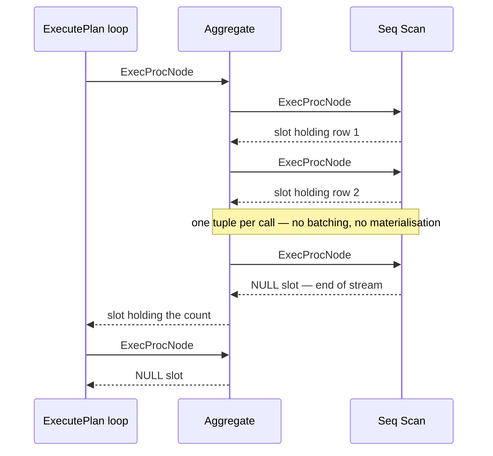

*One tuple per call. The loop at the top pulls until the root returns NULL.*

Two consequences carry the rest of the chapter. First, memory is bounded by what the *blocking* operators choose to hold, not by the size of the intermediate results — which is why `work_mem` is an operator property and spilling is an operator decision ([§18.3](#183-sort--aggregate-nodes)). Second, if the consumer stops asking, the producer stops working: `LIMIT` is cheap for free. In a single-process PostgreSQL that second property is merely an optimisation. In Cloudberry, where the producer may be a different process on a different host with a full send queue, it becomes a correctness problem — and the answer is `ExecSquelchNode`, in [§18.1](#181-executor-framework--lifecycle).7.

### 18.1.2 Start, Run, Finish, End

Every execution passes through four functions in `src/backend/executor/execMain.c`, each a thin wrapper that calls an extension hook if one is installed and otherwise the `standard_` implementation — `ExecutorStart` (`:231`, hook tested at `:243`, `standard_ExecutorStart` at `:250`), `ExecutorRun` (`:830`/`:858`), `ExecutorFinish` (`:1152`/`:1161`) and `ExecutorEnd` (`:1240`/`:1249`). This is the seam `pg_stat_statements` and friends hang off. `ExecutorStart` calls `CreateExecutorState` (`:351`), registers the snapshot (`:435`), builds the slice table on the coordinator (`InitSliceTable`, `:455`) and then calls `InitPlan` (`:1788`), which opens the result relations, initialises the init-plans (`:1995`) and finally calls `ExecInitNode` on the plan tree (`:2018`).

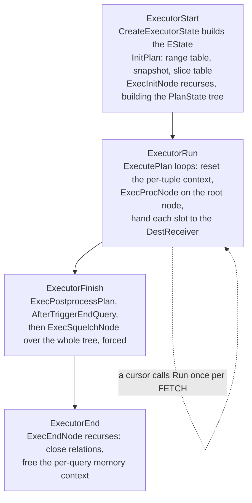

*The four phases. A cursor re-enters phase 2 once per FETCH.*

```c title="src/backend/executor/execMain.c:2892"
	for (;;)
	{
		ResetPerTupleExprContext(estate);        /* :2895 */
		slot = ExecProcNode(planstate);          /* :2900 */
		if (TupIsNull(slot))
		{
			estate->es_got_eos = true;
			(void) ExecShutdownNode(planstate);  /* :2916 */
			break;
		}
		if (!dest->receiveSlot(slot, dest))      /* :2947, junk filter elided */
			break;
```

That loop, in `ExecutePlan` (`:2830`), *is* `ExecutorRun`: reset the per-tuple memory, pull one tuple from the root, ship it to the `DestReceiver` — which on the coordinator writes the client protocol ([§13.1](./ch13.md#131-the-simple-query-protocol)) and on a segment feeds the sending side of a Motion. `ExecutorFinish` then runs after-triggers and, at `:1196`, calls `ExecSquelchNode(planstate, true)` over the whole tree: the executor's last act before teardown is to tell everybody nobody is reading any more. `ExecutorEnd` calls `ExecEndNode` (`execProcnode.c:797`), the mirror image of `ExecInitNode`, which recurses down closing relations and freeing state.

### 18.1.3 One statement, N+1 executors

On the coordinator this lifecycle is driven by the portal ([§13.1](./ch13.md#131-the-simple-query-protocol)): `pquery.c:246` calls `ExecutorStart`, `:251` `ExecutorRun`, `:258` `ExecutorFinish`, `:260` `ExecutorEnd`. On a segment the *same four functions* are reached from a completely different door: the `'M'` message (`tcop/postgres.c:527`, `:5942`) carries a serialized plan and slice table to `exec_mpp_query` (`:1174`), which builds a `QueryDesc` and runs exactly this lifecycle. So for one user statement there are **N+1 executors**, one per segment plus the coordinator's, each with its own `EState`, its own `PlanState` tree, its own instrumentation — all running at the same time, all convinced they are executing *the* query.

*Four processes, one `sess_id`, one statement. Segment −1 is the QD.*

```sql
-- session A, kept busy for 9 s; the subquery runs once per segment
SELECT count(*) FROM (SELECT pg_sleep(9) FROM gp_dist_random('gp_id')) x;

-- session B, while A is still running: who is executing it?
SELECT gp_execution_segment() AS seg, pid, sess_id, state
  FROM gp_dist_random('pg_stat_activity') WHERE query LIKE 'SELECT count(%'
UNION ALL
SELECT -1, pid, sess_id, state
  FROM pg_stat_activity WHERE query LIKE 'SELECT count(%'
ORDER BY 1;
```

```text {3} title="output"
 seg |  pid  | sess_id | state
-----+-------+---------+--------
  -1 | 20203 |    6338 | active
   0 | 20205 |    6338 | active
   1 | 20206 |    6338 | active
   2 | 20207 |    6338 | active
(4 rows)
```

Each of those executors is handed the *whole* plan but is responsible for one slice of it. `standard_ExecutorStart` asks `getGpExecIdentity` (`execMain.c:715`) which of three roles it plays — `GP_ROOT_SLICE` (it drives the top of the plan), `GP_NON_ROOT_ON_QE` (it drives a slice whose root is a sending Motion, `:731`) or `GP_IGNORE` (it has nothing to do, `:723`) — and `EState.eliminateAliens` lets it skip initialising the *alien* nodes that belong to other slices altogether. Which slices exist, and which segments each runs on, was decided in [§16.3](./ch16.md#163-parallelization-cdbllize--cdbmutate); how the tuples actually cross between them is Chapter 19.

### 18.1.4 EState and ExprContext

`EState` (`src/include/nodes/execnodes.h:635`) is the per-query container every node reaches through `ps->state`. It is a long struct and reading it front to back is not illuminating; what matters is that it holds the four things a node cannot invent for itself — *what is visible*, *what relations exist*, *where memory comes from*, and *which executor am I*.

| `EState` field | What it is for |
| --- | --- |
| `es_snapshot`, `es_crosscheck_snapshot` | The visibility this query sees — on a QE it derives from the distributed snapshot that arrived with the dispatch ([§10.1](../part-3-transactions-mvcc-concurrency/ch10.md#101-snapshots--row-version-visibility), [§10.5](../part-3-transactions-mvcc-concurrency/ch10.md#105-distributed-snapshots--the-distributed-log)). |
| `es_range_table`, `es_relations` | The RTE list, and the array of `Relation`s opened during `InitPlan`; a scan node finds its table by indexing this with `scanrelid`. |
| `es_result_relations`, `es_output_cid` | Targets of an INSERT/UPDATE/DELETE, and the command id their tuples are stamped with ([§9.2](../part-3-transactions-mvcc-concurrency/ch09.md#92-the-transaction-manager)). |
| `es_query_cxt`, `es_per_tuple_exprcontext` | The two memory lifetimes — everything a node allocates lives in one or the other. |
| `es_instrument` | The `INSTRUMENT_*` bitmask. This is the single flag `EXPLAIN ANALYZE` sets, and everything in [§18.1](#181-executor-framework--lifecycle).8 follows from it. |
| `es_sliceTable`, `currentSliceId` — Cloudberry | The slice table from [§16.3](./ch16.md#163-parallelization-cdbllize--cdbmutate), and which slice *this* executor is currently running. |
| `eliminateAliens`, `locallyExecutableSubplans` — Cloudberry | Permission to skip initialising the parts of the plan that belong to other slices. |
| `showstatctx`, `dispatcherState` — Cloudberry | Where `EXPLAIN ANALYZE` statistics arriving from the QEs are accumulated, and the handle on the dispatched gangs ([§13.3](./ch13.md#133-dispatch-from-coordinator-plan-to-segment-execution)). |
| `es_got_eos` — Cloudberry | Whether end-of-stream was reached, so a cursor's `ExecutorEnd` tears down correctly. |

Sitting one level down is `ExprContext` (`execnodes.h:258`), the per-tuple container. Its `ecxt_scantuple`, `ecxt_innertuple` and `ecxt_outertuple` are the slots an expression reads its `Var`s from; `ecxt_per_query_memory` and `ecxt_per_tuple_memory` are the two lifetimes again. The second one is the reason the executor does not leak: expression results are palloc'd in the short-lived context, and the whole context is reset once per tuple — that is the `ResetPerTupleExprContext` at the top of the loop above, and the same discipline is repeated inside nodes that iterate. [§18.5](#185-expression-evaluation) lives in this struct. One Cloudberry addition is worth flagging: with `explain_memory_verbosity = detail`, `ExecInitNode` gives every node its own `MemoryContext` (`execProcnode.c:222`, stored in `PlanState.node_context`) purely so that memory can be attributed per node — at the cost of losing all cross-node reuse.

### 18.1.5 The ExecProcNode trampoline

`PlanState` carries *two* function pointers: `ExecProcNode`, which callers use, and `ExecProcNodeReal`, the node's actual method. The indirection buys a one-time trick. Every node registers its method through `ExecSetExecProcNode`, which does not install it — it installs a stub.

```c title="src/backend/executor/execProcnode.c:586"
void ExecSetExecProcNode(PlanState *node, ExecProcNodeMtd function)
{
	node->ExecProcNodeReal = function;
	node->ExecProcNode = ExecProcNodeFirst;        /* :595 */
}

static TupleTableSlot *ExecProcNodeFirst(PlanState *node)   /* :604 */
{
	check_stack_depth();
	node->ExecProcNode = ExecProcNodeGPDB;         /* :631 — retarget */
	return node->ExecProcNode(node);
}
```

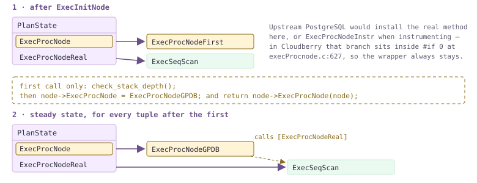

*The pointer rewrites itself on the first call. Every later tuple pays one indirect call and no test.*

This is where Cloudberry parts company with upstream, and it is worth knowing because the folklore is the other way round. In PostgreSQL, `ExecProcNodeFirst` retargets the pointer to `ExecProcNodeReal` when instrumentation is off and to `ExecProcNodeInstr` when it is on — so `EXPLAIN ANALYZE` literally changes the call path and an un-instrumented query pays nothing per tuple. In this tree that optimisation is **disabled**: the retarget at `:627` and the whole of `ExecProcNodeInstr` (`:696`) are bracketed by `#if 0`, and `:631` unconditionally installs `ExecProcNodeGPDB` instead, because Cloudberry has per-tuple work that must happen on every node regardless.

```c title="src/backend/executor/execProcnode.c:637"
	if (QueryFinishPending && !IsA(node, MotionState))
		return NULL;
	if (node->squelched)
		elog(ERROR, "cannot execute squelched plan node of type: %d",
			 (int) nodeTag(node));
	if (node->instrument)
		InstrStartNode(node->instrument);
	result = node->ExecProcNodeReal(node);
	if (node->instrument)
		InstrStopNode(node->instrument, TupIsNull(result) ? 0.0 : 1.0);
```

### 18.1.6 TupleTableSlot: one tuple, four physical forms

A `Seq Scan` over a heap table hands a tuple to a `Sort`, which hands it to a `Hash Join`, which hands it to a Motion. None of those operators wants to know that the first one came out of a shared-buffer page while the second spooled it to a temp file. `TupleTableSlot` (`src/include/executor/tuptable.h:118`) is the abstraction that makes this possible: a fixed header — `tts_flags`, `tts_nvalid`, `tts_tupleDescriptor`, the `tts_values`/`tts_isnull` arrays — plus a `const TupleTableSlotOps *tts_ops` vtable, and a subtype-specific tail holding whatever physical tuple the slot actually wraps. `execTuples.c` defines exactly four such vtables.

| `tts_ops` | Physical form behind the slot | Where you meet it |
| --- | --- | --- |
| **TTSOpsVirtual** (`execTuples.c:1043`) | No physical tuple at all — only the `tts_values`/`tts_isnull` arrays, whose Datums may point into somebody else's memory. `.get_heap_tuple` and `.get_minimal_tuple` are deliberately NULL. | Result slots of every projecting node — and, notably, the slot type `table_slot_callbacks` hands back for **AO** (`appendonlyam_handler.c:508`), **AOCO** (`aocsam_handler.c:550`) and **PAX** (`pax_access_handle.cc:437`). |
| **TTSOpsHeapTuple** (`:1063`) | A palloc'd `HeapTuple` that the slot may own and free (`TTS_FLAG_SHOULDFREE`). | Tuples fetched by TID, trigger tuples, anything freshly built by `heap_form_tuple` ([§4.2](../part-2-storage-data-layout/ch04.md#42-row-version-layout)). |
| **TTSOpsMinimalTuple** (`:1080`) | A `MinimalTuple` — the same data layout without the 23-byte header, because nothing about visibility survives the trip anyway. | Tuplestores, tuplesort runs, hash-join batch files: everything that spools tuples ([§18.3](#183-sort--aggregate-nodes), [§18.4](#184-join-nodes)). |
| **TTSOpsBufferHeapTuple** (`:1097`) | A `HeapTuple` pointing *directly into a shared buffer page*, with a pin held on that buffer for as long as the slot holds the tuple. | `heapam_slot_callbacks` (`heapam_handler.c:71`) — so every heap scan ([§3.4](../part-2-storage-data-layout/ch03.md#34-ring-buffers--bulk-eviction), [§18.2](#182-scan-nodes)). |

Two things follow. First, that the AO/AOCO/PAX handlers all answer `TTSOpsVirtual` is the whole story of how a columnar table joins a heap table without a single node knowing: the AM decodes its own MemTuple or column stripes ([§5.1](../part-2-storage-data-layout/ch05.md#51-memtuple--the-ao-file-format), [§6.2](../part-2-storage-data-layout/ch06.md#62-micro-partition-file-format--manifest-catalog)) straight into `tts_values`, and from there up the tree the tuple is indistinguishable. Second, deforming is **lazy**: `slot_getattr` (`tuptable.h:352`) only calls `slot_getsomeattrs` when `tts_nvalid < attnum`, so a slot deforms attributes 1..*n* and stops. Because a heap tuple's attributes can only be located by walking past the ones before them, the cost of reading a column grows with its ordinal position — which is directly measurable.

*`m181_w`: 30 `int` columns, 2 000 000 rows, heap. Same row count, same predicate, different column.*

```sql
\timing on
SELECT count(c01) FROM m181_w;
SELECT count(c30) FROM m181_w;
SELECT count(c01) FROM m181_w;
SELECT count(c30) FROM m181_w;
```

```text {20} title="output"
  count
---------
 2000000
(1 row)
Time: 254.458 ms
  count
---------
 2000000
(1 row)
Time: 375.425 ms
  count
---------
 2000000
(1 row)
Time: 257.727 ms
  count
---------
 2000000
(1 row)
Time: 303.286 ms
```

### 18.1.7 Rescan, and the Cloudberry-only idea of squelch

Some subtrees run more than once. `ExecReScan` (`src/backend/executor/execAmi.c:95`) resets a node so it can be read again: it ends the current instrumentation cycle (`InstrEndLoop`), clears `node->squelched`, propagates `chgParam` to children, and dispatches to the node's own `ExecReScanXxx`. That is what the inner side of a nested loop gets once per outer row ([§18.4](#184-join-nodes)), and it is the *only* source of `loops` greater than one in `EXPLAIN ANALYZE`.

*Nested loop, PostgreSQL planner, hash and merge joins disabled. The inner `Materialize` is rescanned once per outer row.*

```sql
SET optimizer=off;
SET enable_hashjoin=off; SET enable_mergejoin=off;
EXPLAIN (ANALYZE, TIMING OFF, COSTS OFF)
  SELECT count(*) FROM m181_d d, m181_skew s WHERE s.grp = d.grp;
```

```text {8} title="output"
 Finalize Aggregate (actual rows=1 loops=1)
   ->  Gather Motion 3:1  (slice1; segments: 3) (actual rows=3 loops=1)
         ->  Partial Aggregate (actual rows=1 loops=1)
               ->  Nested Loop (actual rows=90000 loops=1)
                     Join Filter: (d.grp = s.grp)
                     Rows Removed by Join Filter: 180000
                     ->  Seq Scan on m181_skew s (actual rows=90000 loops=1)
                     ->  Materialize (actual rows=3 loops=90000)
                           ->  Seq Scan on m181_d d (actual rows=3 loops=1)
 ...
 Optimizer: Postgres query optimizer
```

The opposite operation has no upstream equivalent at all. `ExecSquelchNode` (`execAmi.c:756`, with a long explanatory comment at `:720`) tells a subtree *that has not yet returned end-of-data* that nobody will ever read from it again. The comment states the real motive plainly: **"This is necessary, to avoid deadlock with Motion nodes."** A receiving Motion in that subtree has senders on other segments; if a sender's send queue is full it will block forever waiting for a reader that has quietly walked away, and sibling QEs waiting on that same sender starve with it. Squelching pushes the news down the tree — `node->squelched = true` and recursion into both children at `:812`–`:814`, with node-specific handlers for the cases that need them (`ExecSquelchMotion`, `ExecSquelchAppend`, `ExecSquelchSequence`, …). The secondary benefit is memory: most handlers call an `ExecEagerFree*` so a finished operator's `work_mem` goes back to operators still running. A squelched node is not dead, merely closed for business — `ExecReScan` un-squelches it, while calling `ExecProcNode` on it raises `cannot execute squelched plan node`. `LIMIT` over a Motion is the classic trigger.

*`LIMIT 3` above a Hash Join whose inner input is a `Broadcast Motion`. The sender in slice2 scanned 4 501 of its 90 000 rows and then stopped.*

```sql
SET optimizer=off;
EXPLAIN (ANALYZE, TIMING OFF, COSTS OFF)
  SELECT a.id, b.grp FROM m181_t a JOIN m181_skew b ON a.grp = b.grp LIMIT 3;
```

```text {7} title="output"
 Limit (actual rows=3 loops=1)
   ->  Gather Motion 3:1  (slice1; segments: 3) (actual rows=3 loops=1)
         ->  Limit (actual rows=3 loops=1)
               ->  Hash Join (actual rows=3 loops=1)
                     Hash Cond: (b.grp = a.grp)
                     ->  Broadcast Motion 3:3  (slice2; segments: 3) (actual rows=1 loops=1)
                           ->  Seq Scan on m181_skew b (actual rows=4501 loops=1)
                     ->  Hash (actual rows=100172 loops=1)
                           Buckets: 524288  Batches: 1  Memory Usage: 8009kB
                           ->  Seq Scan on m181_t a (actual rows=100172 loops=1)
 ...
 Optimizer: Postgres query optimizer
```

### 18.1.8 Instrumentation: where EXPLAIN ANALYZE's numbers come from

`EXPLAIN ANALYZE` sets `EState.es_instrument`, which makes `ExecInitNode` attach an `Instrumentation` struct (`src/include/executor/instrument.h:75`) to every node. `ExecProcNodeGPDB` then brackets each call with `InstrStartNode` (`instrument.c:94`) and `InstrStopNode` (`:168`): the first takes a timestamp, the second accumulates the elapsed time into `counter` and bumps `tuplecount` by one if a tuple came back. `InstrEndLoop` (`:186`) closes a *cycle* — it folds `counter` into `total`, `tuplecount` into `ntuples`, and increments `nloops`. It is called from `ExecReScan` and at shutdown. This matters for reading the output, because `explain.c:2316` computes `rows = instrument->ntuples / nloops`: **`actual rows` is an average per loop, not a total.** The `Materialize` above really produced 270 000 tuples; it reports 3.

*Ground truth first, then the plan. `m181_skew` is deliberately skewed: 90 000 rows on seg0, 10 000 on seg1, none at all on seg2.*

```sql
SELECT gp_segment_id, count(*) FROM m181_skew GROUP BY 1 ORDER BY 1;

SET optimizer=off;
SET gp_enable_explain_allstat=on;
EXPLAIN (ANALYZE, COSTS OFF) SELECT count(*) FROM m181_skew;
```

```text {11} title="output"
 gp_segment_id | count
---------------+-------
             0 | 90000
             1 | 10000
(2 rows)

 Finalize Aggregate (actual time=15.545..15.551 rows=1 loops=1)
   ->  Gather Motion 3:1  (slice1; segments: 3) (actual time=1.620..15.518 rows=3 loops=1)
         ->  Partial Aggregate (actual time=13.947..13.952 rows=1 loops=1)
               allstat: seg_firststart_total_ntuples/seg0_2.296 ms_14 ms_1/seg1_2.260 ms_1.559 ms_1/seg2_2.362 ms_0.030 ms_1//end
               ->  Seq Scan on m181_skew (actual time=0.070..9.088 rows=90000 loops=1)
                     allstat: seg_firststart_total_ntuples/seg0_2.298 ms_9.088 ms_90000/seg1_2.262 ms_1.057 ms_10000/seg2_2.364 ms_0.018 ms_0//end
 ...
 Optimizer: Postgres query optimizer
 Execution Time: 16.813 ms
```

There is the rule, established rather than assumed. The table holds 100 000 rows; the `Seq Scan` reports 90 000. It is **not a sum and not an average — it is one segment's own count, the count of the segment that produced the most tuples at that node**. `gp_enable_explain_allstat` prints the raw per-segment triples underneath and proves it (90 000 / 10 000 / 0). The mechanism is in `explain_gp.c`: each QE ships its `Instrumentation` to the QD, `cdbexplain_depStatAcc_upd` (`:972`) tracks which segment held the maximum, and the QD then copies that one segment's entire instrumentation record into the `PlanState` that `EXPLAIN` will print.

```c title="src/backend/commands/explain_gp.c:1179"
	if (ntuples.agg.vcnt > 0)
		nodeAcc = &ntuples;
	else if (nloops.agg.vcnt > 0)
		nodeAcc = &nloops;
	if (nodeAcc)
	{
		instr->counter    = nodeAcc->nsimax->counter;
		instr->ntuples    = nodeAcc->nsimax->ntuples;
		instr->nloops     = nodeAcc->nsimax->nloops;
		instr->nfiltered1 = nodeAcc->nsimax->nfiltered1;
		instr->workmemused = nodeAcc->nsimax->workmemused;
		/* ... every other counter, from the same winner ... */
```

Read that carefully, because it has a consequence nobody expects: the winner is chosen **per node**, independently. Two adjacent lines of one plan can be reporting two different segments — and the timings, the filter counts and the `Extra Text` on a line all come from *that line's* winner, not from a globally chosen "worst" segment. When a node produced no tuples anywhere, the tie is broken by `nloops` and effectively by arrival order.

| What you are reading | Whose number it actually is |
| --- | --- |
| `actual rows`, `loops` on a segment slice | One segment's own figure — the segment with the most tuples **at that node**. Never a sum. And `actual rows` is itself `ntuples / nloops`, a per-loop average (`explain.c:2316`). |
| `actual time`, `Rows Removed by Filter`, `Sort Method`, `Extra Text: (segN)` | Copied from the *same* winner as that node's row count (`explain_gp.c:1183`–`:1201`). Different lines may be different segments; `Extra Text` names its segment, which is how you can tell. |
| Anything in `slice0` — the top of the plan, `Gather Motion` | A true count, because slice0 has exactly one worker: the coordinator. |
| per-node `Executor Memory: X  Segments: N  Max: Y (segment S)` (`explain_memory_verbosity = detail`) | Here the convention flips: `X` is the **sum** over the `N` reporting workers, `Y` is the per-segment maximum and `S` names it. |
| `(sliceN) Executor memory: A avg x Nx(M) workers, B max (segS)` | Peak executor memory in that slice: `A` averaged over the `N` segments reporting, `B` the maximum, `segS` where it happened. `M` is the count of PostgreSQL parallel workers launched — `0` unless `enable_parallel` is on ([§18.2](#182-scan-nodes)). |
| `Work_mem: X max, Y wanted` | Maximum over all nodes and all workers of the slice (`explain_gp.c:2206`). `Y wanted` appears only when some operator would have avoided spilling given more memory. |
| The leading `*` on a slice line | Set by the same branch that prints `wanted`: `es->str->data[flag] = '*'` (`explain_gp.c:2214`) reaches back and overwrites a placeholder character at the start of the line. It means exactly "this slice spilled". |
| `Memory used:` / `Memory wanted:` | Statement level, not slice level: what the resource manager granted this statement as `query_mem` (`:1913`), and what it would have taken to avoid every spill (`:1934`). Chapter 21 owns the granting side. |

*Squeeze the statement and the whole footer wakes up. Note that `Rows Removed by Filter` and the `Seq Scan` row count come from *different* segments — `m181_t` holds 99 877 / 99 951 / 100 172 rows on seg0/1/2.*

```sql
SET optimizer=off;
SET statement_mem='2MB';
EXPLAIN (ANALYZE, TIMING OFF, COSTS OFF)
  SELECT grp, count(*) FROM m181_t GROUP BY grp, id HAVING count(*) > 1;
```

```text {5} title="output"
 Gather Motion 3:1  (slice1; segments: 3) (actual rows=0 loops=1)
   ->  HashAggregate (actual rows=0 loops=1)
         Group Key: grp, id
         Filter: (count(*) > 1)
         Rows Removed by Filter: 99877
         Extra Text: (seg0)   hash table(s): 1; 99877 groups total in 5 batches, 294688 spill partitions; disk usage: 2816KB; chain length 2.2 avg, 7 max; using 99877 of 327680 buckets; total 0 expansions.
         ->  Seq Scan on m181_t (actual rows=100172 loops=1)
 Planning Time: 1.558 ms
   (slice0)    Executor memory: 1565K bytes.
 * (slice1)    Executor memory: 2951K bytes avg x 3x(0) workers, 2951K bytes max (seg0).  Work_mem: 5777K bytes max, 13841K bytes wanted.
 Memory used:  2048kB
 Memory wanted:  14040kB
 Optimizer: Postgres query optimizer
 Execution Time: 149.575 ms
```

*`explain_memory_verbosity = detail` adds a per-node line — and demonstrates the sum-versus-max convention: 330 kB total over 3 segments, 110 kB each.*

```sql
SET optimizer=off;
SET explain_memory_verbosity='detail';
EXPLAIN (ANALYZE, TIMING OFF, COSTS OFF) SELECT count(*) FROM m181_skew;
```

```text {8} title="output"
 Finalize Aggregate (actual rows=1 loops=1)
   Executor Memory: 125kB  Segments: 1  Max: 125kB (segment -1)
   ->  Gather Motion 3:1  (slice1; segments: 3) (actual rows=3 loops=1)
         Executor Memory: 118kB  Segments: 1  Max: 118kB (segment -1)
         ->  Partial Aggregate (actual rows=1 loops=1)
               Executor Memory: 672kB  Segments: 3  Max: 224kB (segment 0)
               ->  Seq Scan on m181_skew (actual rows=90000 loops=1)
                     Executor Memory: 330kB  Segments: 3  Max: 110kB (segment 0)
 ...
 Optimizer: Postgres query optimizer
```

*`TIMING OFF` versus the default, 6 runs each: 9 M rows, ~3 M per segment, only `Execution Time` shown. Ratios on one machine, assert-enabled build — not a benchmark.*

```sql
-- x6:
EXPLAIN (ANALYZE, TIMING OFF, COSTS OFF) SELECT count(*) FROM m181_big WHERE id > 0;
-- x6:
EXPLAIN (ANALYZE,            COSTS OFF) SELECT count(*) FROM m181_big WHERE id > 0;
```

```text {13} title="output"
-- TIMING OFF
 Execution Time: 1002.310 ms
 Execution Time: 984.674 ms
 Execution Time: 991.330 ms
 Execution Time: 971.711 ms
 Execution Time: 963.955 ms
 Execution Time: 969.497 ms
-- TIMING ON (the default)
 Execution Time: 1109.578 ms
 Execution Time: 997.255 ms
 Execution Time: 991.228 ms
 Execution Time: 1079.157 ms
 Execution Time: 916.240 ms
 Execution Time: 960.514 ms
```

`TIMING OFF` exists because `InstrStartNode`/`InstrStopNode` take a timestamp *per tuple per node*, and on some platforms that is genuinely expensive. On this box it is not measurable: six runs each over three million tuples per segment overlap completely, and the fastest run of all is a `TIMING ON` one. Two reasons. `INSTR_TIME_SET_CURRENT` here is `clock_gettime` through the vDSO — tens of nanoseconds, no syscall — and, per [§18.1](#181-executor-framework--lifecycle).5, Cloudberry pays the `ExecProcNodeGPDB` wrapper on every tuple whether or not instrumentation is on, so the marginal cost of the timestamps is a small share of an overhead that is already there. Treat `TIMING OFF` as insurance, not as a habit; `actual rows` survives it, and that is the number this chapter cares about.

:::note

Everything above is optimizer-independent: the same plan run under **GPORCA** produces byte-for-byte the same instrumentation vocabulary (only the `Optimizer:` footer changes), because [§17.5](./ch17.md#175-translation-query--dxl--plstmt) hands the executor the same `PlannedStmt` the PostgreSQL planner does. Two knobs are worth remembering from this section: `gp_enable_explain_allstat`, which turns the max-across-segments guesswork into printed per-segment truth, and `explain_memory_verbosity` (`suppress` / `summary` / `detail`), where `summary` adds `Vmem reserved` per slice and `detail` costs you a memory context per node. From here the chapter descends into the nodes themselves: scans in [§18.2](#182-scan-nodes), sort and aggregation in [§18.3](#183-sort--aggregate-nodes), joins in [§18.4](#184-join-nodes), expressions in [§18.5](#185-expression-evaluation), subqueries and the long tail in [§18.6](#186-subqueries--other-nodes), the Cloudberry-only operators in [§18.7](#187-cloudberry-specific-nodes) — and Motion, the one node that turns this single-process machine into an MPP one, in Chapter 19.

:::

## 18.2 Scan Nodes

Scan nodes are the leaves of every plan tree, and they are where the executor stops being a tree-walker and starts being a reader of bytes. That makes this section the place where Part III meets Part I: a `Seq Scan` in an `EXPLAIN` output is a promise that *something* will hand tuples upward, and the whole of Chapters 4, 5 and 6 is the answer to what. Cloudberry takes that indirection further than PostgreSQL does — the same plan node, the same 474 lines of `nodeSeqscan.c`, reads a heap page, an append-optimized row segment, a column-store segment file, or a PAX block, and the plan text does not change at all. We start there, then work outward: the shared scan loop in `execScan.c`, the buffer strategy a big scan uses, index and bitmap scans, Cloudberry's run-time-partitioned `Dynamic*` family, and finally the one genuinely new scan feature in Cloudberry 3.0 — parallelism *inside* a segment.

### 18.2.1 One node, four storage engines

`nodeSeqscan.c` does not know what a heap is. Its workhorse `SeqNext` (`nodeSeqscan.c:57`) opens a scan and pulls slots through the **table access method** — and Cloudberry's entry point is not upstream's `table_beginscan` but `table_beginscan_es` (`src/include/access/tableam.h:1055`), which additionally hands the AM the node's own `PlanState`. Everything after that is a function-pointer call into whatever `TableAmRoutine` the relation's `relam` names.

```c title="src/backend/executor/nodeSeqscan.c:95"
	scandesc = table_beginscan_es(node->ss.ss_currentRelation,
								  estate->es_snapshot,
								  nkeys, keys,
								  NULL,
								  &node->ss.ps);
	node->ss.ss_currentScanDesc = scandesc;
	...
	if (table_scan_getnextslot(scandesc, direction, slot))
		return slot;
```

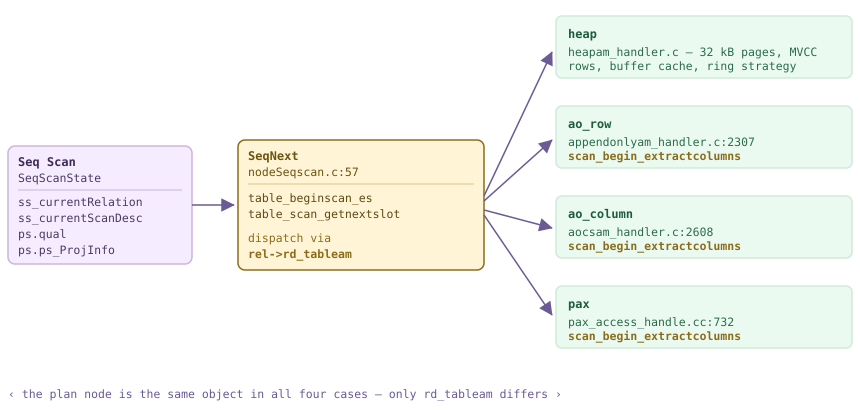

*One PlanState, four TableAmRoutines. The scan node calls through rd_tableam; the AM decides what a “next tuple” costs. The three AMs tagged in amber also implement scan_begin_extractcolumns, which is why table_beginscan_es passes the PlanState down.*

*Four access methods, one plan node. The other three EXPLAINs came back byte-identical apart from the relation name.*

```sql
SET optimizer = off;              -- ORCA prints the same node here
CREATE TABLE m182_heap (id int, k int, city text, payload text) DISTRIBUTED BY (id);
CREATE TABLE m182_ao   (LIKE m182_heap) WITH (appendonly=true)                     DISTRIBUTED BY (id);
CREATE TABLE m182_aoco (LIKE m182_heap) WITH (appendonly=true, orientation=column) DISTRIBUTED BY (id);
CREATE TABLE m182_pax  (LIKE m182_heap) USING pax                                  DISTRIBUTED BY (id);
-- 600 000 identical rows loaded into each

SELECT relname, amname, pg_size_pretty(pg_total_relation_size(c.oid)) sz
  FROM pg_class c JOIN pg_am a ON a.oid = c.relam
 WHERE relname LIKE 'm182%' ORDER BY 1;

EXPLAIN (COSTS OFF) SELECT count(*) FROM m182_aoco WHERE k = 42;
```

```text {14} title="output"
  relname  |  amname   |   sz
-----------+-----------+---------
 m182_ao   | ao_row    | 52 MB
 m182_aoco | ao_column | 44 MB
 m182_heap | heap      | 62 MB
 m182_pax  | pax       | 5356 kB
(4 rows)

                   QUERY PLAN
------------------------------------------------
 Finalize Aggregate
   ->  Gather Motion 3:1  (slice1; segments: 3)
         ->  Partial Aggregate
               ->  Seq Scan on m182_aoco
                     Filter: (k = 42)
 Optimizer: Postgres query optimizer
```

So what *does* change? The AM decides how much it has to read. Because `table_beginscan_es` passes the `PlanState`, a column store can look at the plan's target list and qualification and open only the columns the query mentions — `aoco_beginscan_extractcolumns` (`aocsam_handler.c:612`) walks `ps->plan->targetlist` and `ps->plan->qual` into a `cols[]` bitmap, with a charming special case: if the query names no column at all (`count(*)`), it scans column 1 so that there is something to count. A heap has no such option; a row store must read whole rows. Two 300 000-row tables with one narrow `int` and one 2 560-byte text column make the gap plain.

*Column projection is an access-method property, not a plan property. Both queries below are the same `Seq Scan`; the AOCO one reads 1/9 of the work when the wide column is not referenced. Timings are ratios on one --enable-cassert machine, not benchmarks.*

```sql
-- same 300 000 rows, same 2 560-byte blob column, two access methods
CREATE TABLE m182_wideh (id int, k int, blob text) DISTRIBUTED BY (id);              -- heap, 782 MB
CREATE TABLE m182_wide  (id int, k int, blob text)
  WITH (appendonly=true, orientation=column, compresstype=none) DISTRIBUTED BY (id); -- AOCO, 737 MB
	iming on
echo heap  narrow
SELECT count(k)    FROM m182_wideh;
echo heap  wide
SELECT count(blob) FROM m182_wideh;
echo AOCO  narrow
SELECT count(k)    FROM m182_wide;
echo AOCO  wide
SELECT count(blob) FROM m182_wide;
```

```text {9} title="output"
heap  narrow
 300000
Time: 73.719 ms
heap  wide
 300000
Time: 78.100 ms
AOCO  narrow
 300000
Time: 14.042 ms
AOCO  wide
 300000
Time: 122.095 ms
```

### 18.2.2 The scan loop

Every scan node that has a qualification or a projection funnels through one 110-line function, `ExecScan` (`execScan.c:160`). Its contract is small and worth memorising, because it explains most of what `EXPLAIN ANALYZE` prints under a scan: reset the per-tuple memory context, ask the access method for a slot, publish that slot as `econtext->ecxt_scantuple`, run `ExecQual`, and either project ([§18.5](#185-expression-evaluation)) or return the raw slot. A tuple that fails the qual bumps `InstrCountFiltered1` — that counter, and nothing else, is the `Rows Removed by Filter` line. Nodes with neither qual nor projection short-circuit the whole loop at `execScan.c:184` and return the AM's slot untouched.

```c title="src/backend/executor/execScan.c:200"
	for (;;)
	{
		slot = ExecScanFetch(node, accessMtd, recheckMtd);
		if (TupIsNull(slot)) ...
		econtext->ecxt_scantuple = slot;
		qual = node->ps.qual;
		if (qual == NULL || ExecQual(qual, econtext))
			return projInfo ? ExecProject(projInfo) : slot;
		else
			InstrCountFiltered1(node, 1);
		ResetExprContext(econtext);
	}
```

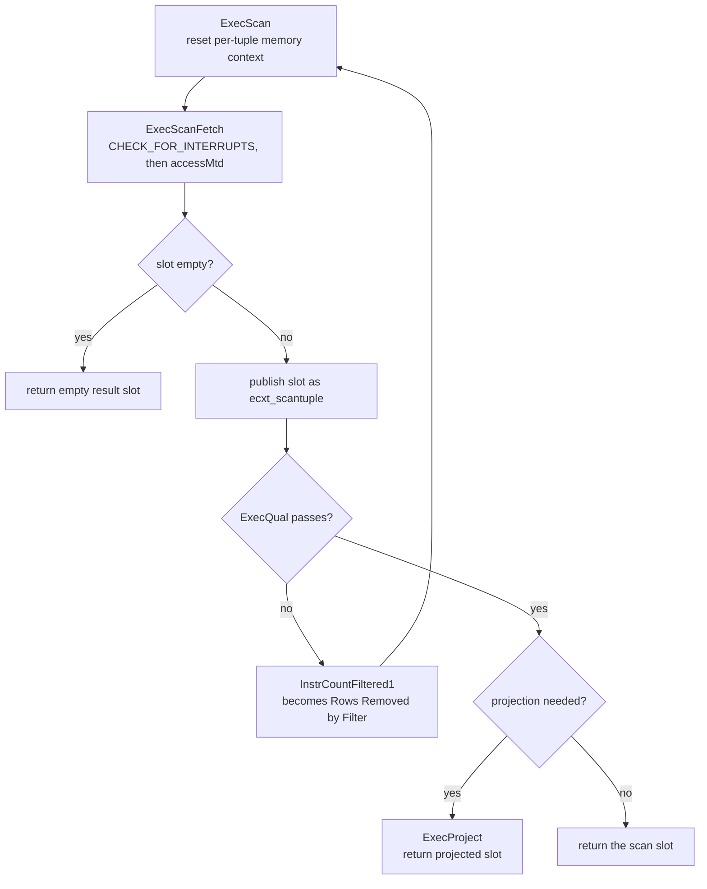

*The ExecScan skeleton. Only the two shaded decisions are node-specific: accessMtd is supplied by nodeSeqscan/nodeIndexscan/nodeTidscan, and recheckMtd is used only on the EvalPlanQual path.*

`ExecScanFetch` (`execScan.c:35`) has one other job. When `estate->es_epq_active` is set the executor is inside an `EvalPlanQual` recheck — re-evaluating a row that changed underneath a `SELECT FOR UPDATE` or an `UPDATE` — and the fetch is replaced by a caller-supplied test tuple which `recheckMtd` validates. `nodeSeqscan.c:129`'s `SeqRecheck` simply returns `true`, with a comment admitting that a seq scan never pushed keys into the AM so there is nothing to re-verify; index scans do the real work there.

*The filter counter in practice: 221 rows survived on the busiest segment and 200 046 did not. Note what is *missing* — with BUFFERS requested, only the coordinator's planning buffers are reported.*

```sql
SET optimizer = off;
EXPLAIN (ANALYZE, BUFFERS, TIMING OFF, COSTS OFF)
  SELECT count(*) FROM m182_heap WHERE k = 42;
```

```text {6} title="output"
 Finalize Aggregate (actual rows=1 loops=1)
   ->  Gather Motion 3:1  (slice1; segments: 3) (actual rows=3 loops=1)
         ->  Partial Aggregate (actual rows=1 loops=1)
               ->  Seq Scan on m182_heap (actual rows=221 loops=1)
                     Filter: (k = 42)
                     Rows Removed by Filter: 200046
 Planning:
   Buffers: shared hit=267
 Planning Time: 1.568 ms
   (slice0)    Executor memory: 114K bytes.
   (slice1)    Executor memory: 119K bytes avg x 3x(0) workers, 119K bytes max (seg0).
 Optimizer: Postgres query optimizer
 Execution Time: 54.812 ms
```

:::note

Per-node `Buffers:` lines never appear under a Motion on this cluster: the scan ran in three QEs and the `BufferUsage` counters are not shipped back to the coordinator with the tuples. The same is true of the bitmap counters in [§18.2](#182-scan-nodes).5. When you need them, run the query in utility mode against one segment — see [§18.1](#181-executor-framework--lifecycle) for what a QE-side `Instrumentation` can and cannot report.

:::

### 18.2.3 Buffered access — a big scan does not evict the cache

A sequential scan of a table larger than the buffer cache could, naively, throw the entire cache away for one query. It does not. `initscan` (`heapam.c:289`) compares the relation size against `NBuffers / 4` and, above that threshold, asks for a `BAS_BULKREAD` strategy (`heapam.c:301`) — a **ring buffer** of `256 kB` (`freelist.c:564`), converted to a buffer count at `freelist.c:598`. On this cluster `block_size` is **32 kB**, so the ring is exactly **8 buffers**: the scan recycles its own eight frames for the whole table instead of allocating one per page ([§3.4](../part-2-storage-data-layout/ch03.md#34-ring-buffers--bulk-eviction)). PG16's `pg_stat_io` gives us a direct read on this, because `BAS_BULKREAD` maps to its own I/O context (`freelist.c:738`).

*A 6 110-page scan through a 4 000-buffer cache. `reuses` counts frames recycled from the scan's own ring; `evictions` counts pages belonging to somebody else that had to go. Utility mode on segment 0, because pg_stat_io is per-instance.*

```sql
-- PGOPTIONS='-c gp_role=utility' psql -p 7102 -d postgres
-- step 1, own transaction: snapshot the counters
CREATE TABLE m182_io0 AS
  SELECT context, reads, evictions, reuses FROM pg_stat_io
   WHERE backend_type = 'client backend' AND object = 'relation';

-- step 2, own transaction: one full scan of a table bigger than the cache
SELECT relpages, current_setting('block_size') bs,
       (SELECT count(*) FROM pg_buffercache) nbuffers
  FROM pg_class WHERE relname = 'm182_ring';
SELECT count(*) FROM m182_ring;

-- step 3: the delta, plus what is left resident
SELECT n.context, n.reads-o.reads d_reads, n.evictions-o.evictions d_evictions,
       n.reuses-o.reuses d_reuses
  FROM pg_stat_io n JOIN m182_io0 o USING (context)
 WHERE n.backend_type='client backend' AND n.object='relation'
   AND n.context IN ('bulkread','normal');
SELECT count(*) AS ring_pages_resident FROM pg_buffercache
 WHERE relfilenode = pg_relation_filenode('m182_ring') AND relforknumber = 0;
```

```text {11} title="output"
 relpages |  bs   | nbuffers
----------+-------+----------
     6110 | 32768 |     4000

 count
--------
 366564

 context  | d_reads | d_evictions | d_reuses
----------+---------+-------------+----------
 bulkread |    6094 |           7 |   6086
 normal   |       0 |           0 |
(2 rows)

 ring_pages_resident
---------------------
                  24
```

:::note

Two honest caveats. First, only **heap** and PAX reads go through shared buffers at all &#8212; `aocsam.c` and `appendonlyam.c` contain **zero** `ReadBuffer` calls; AO and AOCO scans read through `AppendOnlyStorageRead` and their own buffers, so no ring strategy and no `pg_buffercache` row will ever describe them. Second, the resident-page count above is only meaningful as a delta on an otherwise idle segment: a 6 110-page table left **24** pages behind, but any concurrent session sharing that 4 000-buffer cache will muddy the number. The `pg_stat_io` delta is the trustworthy instrument.

:::

### 18.2.4 Index and index-only scans

`nodeIndexscan.c` swaps the AM: `ExecIndexBuildScanKeys` (`nodeIndexscan.c:1168`) turns the plan's `indexqual` into an array of `ScanKey`s at init time, `index_beginscan` (`:111`) opens the index, and `index_getnext_slot` (`:132`) walks it. Two consequences matter for plans. The output is *ordered* by the index, so it can satisfy pathkeys without a Sort ([§15.4](./ch15.md#154-plan-generation)). And `nodeIndexonlyscan.c` can skip the heap entirely when the visibility map says a page is all-visible (`nodeIndexonlyscan.c:162`, [§4.4](../part-2-storage-data-layout/ch04.md#44-fsm--visibility-map)); each time it cannot, `InstrCountTuples2` fires (`:169`) and surfaces as the `Heap Fetches` line (`explain.c:2483`).

*Same predicate, two nodes. After VACUUM set the visibility map, the index-only scan never touched the heap.*

```sql
CREATE INDEX m182_heap_k ON m182_heap (k);
VACUUM ANALYZE m182_heap;
SET optimizer = off; SET enable_seqscan = off; SET enable_bitmapscan = off;

EXPLAIN (ANALYZE, TIMING OFF, COSTS OFF) SELECT id, city FROM m182_heap WHERE k = 42;
EXPLAIN (ANALYZE, TIMING OFF, COSTS OFF) SELECT k        FROM m182_heap WHERE k = 42;
```

```text {9} title="output"
 Gather Motion 3:1  (slice1; segments: 3) (actual rows=600 loops=1)
   ->  Index Scan using m182_heap_k on m182_heap (actual rows=221 loops=1)
         Index Cond: (k = 42)
 Execution Time: 4.575 ms

 Gather Motion 3:1  (slice1; segments: 3) (actual rows=600 loops=1)
   ->  Index Only Scan using m182_heap_k on m182_heap (actual rows=221 loops=1)
         Index Cond: (k = 42)
         Heap Fetches: 0
 Execution Time: 0.976 ms
```

The distributed twist is that there is no such thing as one index here. `CREATE INDEX` on a distributed table creates a **separate physical index per segment**, each covering only that segment's slice of the rows ([§7.1](../part-2-storage-data-layout/ch07.md#71-index-fundamentals)), and the ordered stream each one produces is merged by the Motion above it — visible as the `Merge Key:` annotation, which is how a per-segment `ORDER BY … LIMIT` still yields a globally sorted answer.

*Three segments, three independent index relations of 43 pages each; the coordinator sees only their merged output.*

```sql
-- one physical index per segment, reached in utility mode
for p in 7102 7103 7104; do
  PGOPTIONS='-c gp_role=utility' psql -p $p -d postgres -qtAc     "select $p, relname, pg_relation_filenode(oid), relpages
       from pg_class where relname='m182_heap_k';"
done

-- and how their orderings are combined
EXPLAIN (ANALYZE, TIMING OFF, COSTS OFF)
  SELECT id FROM m182_heap ORDER BY id LIMIT 5;
```

```text {7} title="output"
7102|m182_heap_k|25217|43
7103|m182_heap_k|25211|43
7104|m182_heap_k|25211|43

 Limit (actual rows=5 loops=1)
   ->  Gather Motion 3:1  (slice1; segments: 3) (actual rows=5 loops=1)
         Merge Key: id
         ->  Limit (actual rows=5 loops=1)
               ->  Index Only Scan using m182_heap_id on m182_heap (actual rows=5 loops=1)
                     Heap Fetches: 0
```

### 18.2.5 Bitmap scans

A bitmap scan splits an index scan in two. `MultiExecBitmapIndexScan` (`nodeBitmapIndexscan.c:71`) is not a normal `ExecProcNode` at all — it returns a whole bitmap in one call via `index_getbitmap` (`:129`), and provides its own instrumentation (`:83`, `:156`) because it never returns tuples. `nodeBitmapHeapscan.c` then visits the heap in **physical block order**, which turns scattered random reads into something closer to sequential. `nodeBitmapAnd.c` and `nodeBitmapOr.c` sit between them and combine bitmaps. The price is memory: when the bitmap outgrows `work_mem` it degrades page-wise — a *lossy* page records only "some row here matches" — and the heap scan must re-apply the `Recheck Cond` to every row on it.

*Run on segment 0 in utility mode, because these counters are QE-local. 650 of 660 pages went lossy under a 64 kB work_mem, and the recheck threw away 118 088 rows.*

```sql
-- PGOPTIONS='-c gp_role=utility' psql -p 7102 -d postgres
SET optimizer = off; SET enable_seqscan = off;
SET enable_indexscan = off; SET enable_indexonlyscan = off;
SET work_mem = '64kB';
EXPLAIN (ANALYZE, TIMING OFF, COSTS OFF)
  SELECT count(city) FROM m182_heap WHERE k < 400;
```

```text {5} title="output"
 Aggregate (actual rows=1 loops=1)
   ->  Bitmap Heap Scan on m182_heap (actual rows=79921 loops=1)
         Recheck Cond: (k < 400)
         Rows Removed by Index Recheck: 118088
         Heap Blocks: exact=10 lossy=650
         ->  Bitmap Index Scan on m182_heap_k (actual rows=79921 loops=1)
               Index Cond: (k < 400)
 Planning Time: 1.874 ms
   (slice0)    Executor memory: 12859K bytes (seg0).
 Optimizer: Postgres query optimizer
 Execution Time: 61.273 ms
```

Two things called "bitmap" meet here and they are not the same thing. A bitmap *scan* is an execution strategy, and it works over any index AM that implements `amgetbitmap` — a b-tree, most often. Cloudberry additionally ships a bitmap *index type* (`USING bitmap`, [§7.6](../part-2-storage-data-layout/ch07.md#76-bitmap-index-cloudberry-specific)), and its `bmgetbitmap` (`bitmap.c:269`) returns a lazily-iterated `StreamBitmap` rather than a materialised `TIDBitmap`; `nodeBitmapIndexscan.c:131` accepts either. That design leaks into `EXPLAIN` in a way worth recognising: `bmgetbitmap` ends with a literal `return 1` under the comment "we don't have a precise idea of the number of heap tuples involved" (`bitmap.c:324`), so a bitmap-AM index scan always reports `actual rows=1`.

*A BitmapAnd fed by two different index AMs. The btree side counts TIDs; the bitmap-AM side reports one row because that is what bmgetbitmap returns.*

```sql
CREATE INDEX m182_bm_a ON m182_bm USING btree  (a);   -- 100 distinct values
CREATE INDEX m182_bm_b ON m182_bm USING bitmap (b);   -- 100 distinct values
VACUUM ANALYZE m182_bm;
SET optimizer = off; SET enable_seqscan = off;
EXPLAIN (ANALYZE, TIMING OFF, COSTS OFF)
  SELECT count(tag) FROM m182_bm WHERE a = 5 AND b = 7;
```

```text {7} title="output"
 Finalize Aggregate (actual rows=1 loops=1)
   ->  Gather Motion 3:1  (slice1; segments: 3) (actual rows=3 loops=1)
         ->  Partial Aggregate (actual rows=1 loops=1)
               ->  Bitmap Heap Scan on m182_bm (actual rows=23 loops=1)
                     Recheck Cond: ((b = 7) AND (a = 5))
                     ->  BitmapAnd (actual rows=1 loops=1)
                           ->  Bitmap Index Scan on m182_bm_b (actual rows=1 loops=1)
                                 Index Cond: (b = 7)
                           ->  Bitmap Index Scan on m182_bm_a (actual rows=3066 loops=1)
                                 Index Cond: (a = 5)
 Optimizer: Postgres query optimizer
 Execution Time: 43.364 ms
```

:::note

Three smaller scan nodes round out the family and behave exactly as upstream, so we only name them: `nodeTidscan.c` (`Tid Scan`, a `ctid = …` lookup &#8212; on a distributed table Cloudberry warns that a `ctid` is only unique together with `gp_segment_id`), `nodeTidrangescan.c` (`Tid Range Scan`, PG14's block-range scan), and `nodeSamplescan.c` (`Sample Scan`, `TABLESAMPLE`; on this cluster `TABLESAMPLE SYSTEM (1)` over 600 000 rows returned `actual rows=3333` on the busiest segment). All three go through the same `ExecScan` loop of [§18.2](#182-scan-nodes).2.

:::

### 18.2.6 The Dynamic* family — partitions chosen at run time

Here Cloudberry departs from PostgreSQL outright. PostgreSQL scans a partitioned table as an `Append` over one child plan node per surviving partition ([§18.6](#186-subqueries--other-nodes)), pruned at plan time and, for parameterised cases, again at run time. ORCA instead emits a **single** `Dynamic*` node holding a *list of partition OIDs*, and opens them one after another during execution. The header of `nodeDynamicSeqscan.c:11` gives the motivation bluntly: a plan with one node per partition has to fix the column mapping for every child at plan time, and "when there are many partitions with many columns, the plan size improvement becomes very large, on the order of 100+ MB in some cases." Six files implement the family, sharing index plumbing in `execDynamicIndexes.c`.

| File | Plan label | What it adds over the static node |
| --- | --- | --- |
| `nodeDynamicSeqscan.c` (315) | `Dynamic Seq Scan` | iterates `partOids`, calling `ExecInitSeqScanForPartition` per partition |
| `nodeDynamicIndexscan.c` (140) | `Dynamic Index Scan` | opens that partition's own index, via `execDynamicIndexes.c` |
| `nodeDynamicIndexOnlyscan.c` (135) | `Dynamic Index Only Scan` | same, keeping the visibility-map shortcut |
| `nodeDynamicBitmapIndexscan.c` (282) | `Dynamic Bitmap Index Scan` | builds the TID bitmap for the current partition |
| `nodeDynamicBitmapHeapscan.c` (329) | `Dynamic Bitmap Heap Scan` | consumes it against that partition's storage |
| `nodeDynamicForeignscan.c` (324) | `Dynamic Foreign Scan` | foreign / external partitions |

```c title="src/backend/executor/nodeDynamicSeqscan.c:128"
	if (++node->whichPart < node->nOids)
		pid = &node->partOids[node->whichPart];
	else
		return false;
	if (NULL != scanState->ps.instrument)
		scanState->ps.instrument->numPartScanned++;      /* -> "Partitions scanned:" */
	currentRelation = scanState->ss_currentRelation =
		table_open(node->partOids[node->whichPart], AccessShareLock);
	...
	attMap = build_attrmap_by_name_if_req(partTupDesc, lastTupDesc, false);
	...
	node->seqScanState = ExecInitSeqScanForPartition(&plan->seqscan, estate,
													 currentRelation);
```

*Same query, same table, two optimizers. ORCA keeps one node and narrows the OID list; the PostgreSQL planner resolves the partition at plan time and scans the child relation by name.*

```sql
CREATE TABLE m182_part (id int, dt date, amt numeric) DISTRIBUTED BY (id)
  PARTITION BY RANGE (dt)
  (START (date '2026-01-01') END (date '2026-07-01') EVERY (interval '1 month'));

SET optimizer = on;
EXPLAIN (COSTS OFF) SELECT count(*) FROM m182_part WHERE dt = date '2026-03-15';
SET optimizer = off;
EXPLAIN (COSTS OFF) SELECT count(*) FROM m182_part WHERE dt = date '2026-03-15';
```

```text {4} title="output"
 Finalize Aggregate
   ->  Gather Motion 3:1  (slice1; segments: 3)
         ->  Partial Aggregate
               ->  Dynamic Seq Scan on m182_part
                     Number of partitions to scan: 1 (out of 6)
                     Filter: (dt = '2026-03-15'::date)
 Optimizer: GPORCA

 Finalize Aggregate
   ->  Gather Motion 3:1  (slice1; segments: 3)
         ->  Partial Aggregate
               ->  Seq Scan on m182_part_1_prt_3 m182_part
                     Filter: (dt = '2026-03-15'::date)
 Optimizer: Postgres query optimizer
```

A constant predicate is the easy case. The point of the family is the case a plan-time pruner cannot touch: the partition key is compared against values that only exist once the query is running. `ExecDynamicSeqScan` (`nodeDynamicSeqscan.c:179`) handles it on its first call — if the plan carries `join_prune_paramids`, it asks `ExecFindMatchingSubPlans` which partitions survive and **rewrites `partOids` in place** before opening anything. Now the two `EXPLAIN` lines say different things: `Number of partitions to scan` is the plan's estimate, while `Partitions scanned` is the run-time truth, counted by that `numPartScanned++` above and formatted at `explain_gp.c:1755`.

*Run-time partition elimination. The plan conceded all 6 partitions; execution opened 1. The Partition Selector that fed the pruning is [§18.7](#187-cloudberry-specific-nodes)'s node, not ours.*

```sql
SET optimizer = on;
EXPLAIN (ANALYZE, TIMING OFF, COSTS OFF)
  SELECT count(*) FROM m182_part p JOIN m182_days d ON p.dt = d.dt;
```

```text {8} title="output"
 Finalize Aggregate (actual rows=1 loops=1)
   ->  Gather Motion 3:1  (slice1; segments: 3) (actual rows=3 loops=1)
         ->  Partial Aggregate (actual rows=1 loops=1)
               ->  Hash Join (actual rows=1526 loops=1)
                     Hash Cond: (p.dt = d.dt)
                     ->  Dynamic Seq Scan on m182_part p (actual rows=22973 loops=1)
                           Number of partitions to scan: 6 (out of 6)
                           Partitions scanned:  Avg 1.0 x 3 workers.  Max 1 parts (seg0).
                     ->  Hash (actual rows=2 loops=1)
                           ->  Partition Selector (selector id: $0) (actual rows=2 loops=1)
                                 ->  Seq Scan on m182_days d (actual rows=2 loops=1)
 Optimizer: GPORCA
 Execution Time: 15.491 ms
```

:::note

Two loose ends deliberately left dangling. The `Partition Selector` and the `Sequence` node that drive these scans are **[§18.7](#187-cloudberry-specific-nodes)**'s material. And the second half of `initNextTableToScan` &#8212; `build_attrmap_by_name_if_req` followed by `change_varattnos_of_a_varno` &#8212; exists because sibling partitions may disagree about physical column numbering after `DROP COLUMN`; a `Dynamic*` node re-maps the `Var`s of its own qual and target list as it walks from one partition to the next, which is precisely the work an `Append` plan pays for at plan time instead.

:::

### 18.2.7 Intra-segment parallel scan

Cloudberry has always been parallel *across* segments. Cloudberry 3.0 adds parallelism *inside* one, and `enable_parallel` (`guc_gp.c:3200`, default `off`) is the switch. Turn it on and a scan becomes `Parallel Seq Scan` — but the headline is one line higher up, in the Motion. `FillSliceGangInfo` (`execUtils.c:1677`) multiplies the gang: `planNumSegments = numsegments * factor`, where `factor` is the slice's `parallel_workers`. Three segments times two workers is six senders, so the Gather Motion's arity changes from `3:1` to `6:1`. Raise `max_parallel_workers_per_gather` to 4 and it becomes `12:1`.

```c title="src/backend/executor/execUtils.c:1679"
	int factor = ps->parallel_workers ? ps->parallel_workers : 1;
	int numsegments = ps->numsegments;

	slice->useMppParallelMode = (ps->parallel_workers != 0);
	slice->parallel_workers = factor;
	switch (slice->gangType)
	{
		...
		case GANGTYPE_PRIMARY_READER:
			slice->planNumSegments = numsegments * factor;
```

*One GUC, three plan shapes. Only the Motion arity and the word Parallel change; the scan node is still nodeSeqscan.c. ORCA produces the same shape — this is not a planner-specific feature.*

```sql
SET optimizer = off;
EXPLAIN (COSTS OFF) SELECT count(*) FROM m182_ring WHERE payload LIKE '%z%';
SET enable_parallel = on;
EXPLAIN (COSTS OFF) SELECT count(*) FROM m182_ring WHERE payload LIKE '%z%';
SET max_parallel_workers_per_gather = 4;
EXPLAIN (COSTS OFF) SELECT count(*) FROM m182_ring WHERE payload LIKE '%z%';
```

```text {5,9} title="output"
         ->  Partial Aggregate
   ->  Gather Motion 3:1  (slice1; segments: 3)
               ->  Seq Scan on m182_ring

   ->  Gather Motion 6:1  (slice1; segments: 6)
         ->  Partial Aggregate
               ->  Parallel Seq Scan on m182_ring

   ->  Gather Motion 12:1  (slice1; segments: 12)
         ->  Partial Aggregate
               ->  Parallel Seq Scan on m182_ring
 Optimizer: Postgres query optimizer
```

<RawFigure html={"<div style=\"font-family:ui-monospace,SFMono-Regular,Menlo,monospace;font-size:12px;line-height:1.45\"> <div style=\"display:inline-block;border:1.5px solid #cdb4db;background:#f5edff;border-radius:7px;padding:7px 12px;color:#3d2b57;font-weight:700\">QD &#8212; Gather Motion &#10214;6:1&#10215; (slice1; segments: 6)</div> <div style=\"color:#6b5b95;margin:6px 0 10px 14px\">&#8593; six senders, one receiver</div> <div style=\"display:flex;gap:10px;flex-wrap:wrap\"> <div style=\"flex:1 1 200px;border:1.5px solid #cfead9;background:#eafaf0;border-radius:7px;padding:8px\"> <div style=\"font-weight:700;color:#1f5c3d\">seg0 &#183; port 7102</div> <div style=\"margin-top:6px;border:1px solid #dcc48a;background:#fff4d6;border-radius:5px;padding:5px 7px;color:#5c4a12\">QE worker 0 &#183; Parallel Seq Scan</div> <div style=\"margin-top:5px;border:1px solid #dcc48a;background:#fff4d6;border-radius:5px;padding:5px 7px;color:#5c4a12\">QE worker 1 &#183; Parallel Seq Scan</div> <div style=\"margin-top:6px;color:#2c6b4a\">shared DSM + build_barrier</div> </div> <div style=\"flex:1 1 200px;border:1.5px solid #cfead9;background:#eafaf0;border-radius:7px;padding:8px\"> <div style=\"font-weight:700;color:#1f5c3d\">seg1 &#183; port 7103</div> <div style=\"margin-top:6px;border:1px solid #dcc48a;background:#fff4d6;border-radius:5px;padding:5px 7px;color:#5c4a12\">QE worker 0 &#183; Parallel Seq Scan</div> <div style=\"margin-top:5px;border:1px solid #dcc48a;background:#fff4d6;border-radius:5px;padding:5px 7px;color:#5c4a12\">QE worker 1 &#183; Parallel Seq Scan</div> <div style=\"margin-top:6px;color:#2c6b4a\">shared DSM + build_barrier</div> </div> <div style=\"flex:1 1 200px;border:1.5px solid #cfead9;background:#eafaf0;border-radius:7px;padding:8px\"> <div style=\"font-weight:700;color:#1f5c3d\">seg2 &#183; port 7104</div> <div style=\"margin-top:6px;border:1px solid #dcc48a;background:#fff4d6;border-radius:5px;padding:5px 7px;color:#5c4a12\">QE worker 0 &#183; Parallel Seq Scan</div> <div style=\"margin-top:5px;border:1px solid #dcc48a;background:#fff4d6;border-radius:5px;padding:5px 7px;color:#5c4a12\">QE worker 1 &#183; Parallel Seq Scan</div> <div style=\"margin-top:6px;color:#2c6b4a\">shared DSM + build_barrier</div> </div> </div> <div style=\"margin-top:10px;color:#6b5b95\">planNumSegments &#61; numsegments &#215; parallel_workers &#61; 3 &#215; 2 &#61; 6 &#8212; execUtils.c:1698</div> </div>"} caption={"Where the extra senders come from. Each segment runs parallel_workers QEs for the parallel slice; they share one DSM segment keyed by (gp_command_count, sliceIndex, gp_session_id) and divide the relation's blocks through the ordinary ParallelTableScanDesc."} />

Mechanically this is a hybrid. The *workers* are extra QEs in the gang, dispatched like any other ([§13.3](./ch13.md#133-dispatch-from-coordinator-plan-to-segment-execution)) — not PostgreSQL background workers. But the *work division* is upstream's: the block handoff still happens through a `ParallelTableScanDesc` in shared memory, and `ExecSeqScanInitializeDSM` / `ExecSeqScanInitializeWorker` (`nodeSeqscan.c:329`, `:385`) are the same hooks PostgreSQL uses. The bridge is `GpInsertParallelDSMHash` (`parallel.c:1822`), called from `ExecutorRun` when `estate->useMppParallelMode` is set (`execMain.c:2882`): the sibling QEs of one slice on one segment look up a DSM segment keyed by `(gp_command_count, sliceIndex, gp_session_id)` (`parallel.c:1840`), the first one to arrive creates it and arms a `Barrier`, the rest attach, and all of them meet at `BarrierArriveAndWait` before the scan starts.

*Warm repeats of a 1.1-million-row filtered scan, alternating the GUC in one session. Roughly 1.8×, on an --enable-cassert build — read it as a ratio, not a benchmark.*

```sql
SET optimizer = off;
SELECT count(*) FROM m182_ring WHERE payload LIKE '%zzz%';   -- warm the cache
	iming on
SET enable_parallel = off;
SELECT count(*) FROM m182_ring WHERE payload LIKE '%zzz%';
SELECT count(*) FROM m182_ring WHERE payload LIKE '%zzz%';
SET enable_parallel = on;
SELECT count(*) FROM m182_ring WHERE payload LIKE '%zzz%';
SELECT count(*) FROM m182_ring WHERE payload LIKE '%zzz%';
```

```text {10} title="output"
-- enable_parallel = off
 1100000
Time: 186.469 ms
 1100000
Time: 162.008 ms
-- enable_parallel = on
 1100000
Time: 100.434 ms
 1100000
Time: 84.379 ms
```

Which raises the obvious question: where are PostgreSQL's own `Gather` and `Gather Merge`? `nodeGather.c` (477 lines) and `nodeGatherMerge.c` (789) are still compiled into this binary, and they are unreachable. Every path that would produce them has been switched off: `generate_gather_paths` (`allpaths.c:3785`), `generate_useful_gather_paths` (`allpaths.c:3928`) and `gather_grouping_paths` (`planner.c:9134`) all open with `Assert(false)`, and their call sites in `planner.c` are inside `#if 0` blocks (`planner.c:4924`, `:8539`). Motion *is* the gather; the executor comment at `execMain.c:2876` says as much — "CBDB style parallelism won't interfere PG style parallel mechanism" — and `EXPLAIN` on this cluster never prints either node. A parallel Cloudberry plan therefore has exactly one gathering mechanism, and it belongs to Chapter 19.

:::note

Loose ends checked and reported honestly. `parallel_leader_participation` (`off` here) changes **nothing** in the plan &#8212; flipping it to `on` still gives `Gather Motion 6:1`, because there is no PostgreSQL leader process in this scheme: all six are QEs. `EXPLAIN ANALYZE` shows no per-worker breakdown either; instead the per-slice memory footer changes from `3x(0) workers` to `6x(0) workers`, i.e. the workers are counted as gang members ([§18.1](#181-executor-framework--lifecycle)). And `enable_parallel_hash` / `enable_parallel_append` are already `on` by default, so they are governed by `enable_parallel` too rather than being independent switches.

:::

## 18.3 Sort & Aggregate Nodes

Every other node in this chapter can, in principle, work one tuple at a time. These cannot: a sort must see the last row before it may emit the first, and a hash aggregate must keep one live transition state for every distinct key it has met. That is why [§18.3](#183-sort--aggregate-nodes) owns *memory* — `work_mem`, Cloudberry's `statement_mem`, spilling to workfiles, and the `EXPLAIN ANALYZE` footer that tells you how close you came to the edge. It is also where Cloudberry's numbers stop looking like PostgreSQL's: one `Sort` node on a three-segment cluster is three independent sorts, and the `Memory:` figure beside `Sort Method:` is their **sum**, not any one of them. Getting that wrong by a factor of three is the most common misreading of a Cloudberry plan, so we pin it down before doing any arithmetic. Demos below use a table `m183_t` of one million rows distributed by `id` — about 334 000 rows per segment.

### 18.3.1 Sort: a thin node over tuplesort

`nodeSort.c` is 647 lines and hardly any of them sort anything. `ExecSort` (`nodeSort.c:59`) does three things on its first call: build a `Tuplesortstate`, drain the child in a tight loop (`nodeSort.c:177-185`), and hand the whole batch to `tuplesort_performsort` (`:192`). Every later call is a one-line pull from the finished sort (`:238`). All the interesting behaviour lives in `src/backend/utils/sort/tuplesort.c` (3306 lines), with the per-datatype glue split out into `tuplesortvariants.c` (1606 lines) since PostgreSQL 15. Inside, tuplesort is a small state machine: tuples accumulate in an array of `SortTuple` structs while a budget counter, `availMem`, is decremented by the true allocated size of each tuple. When the budget goes negative — the `LACKMEM` macro at `tuplesort.c:404` — the array is sorted and dumped as a *run* onto a logical tape. Which state the sort ends in is exactly what `Sort Method:` reports, and the mapping is made at `tuplesort.c:2630-2645`.

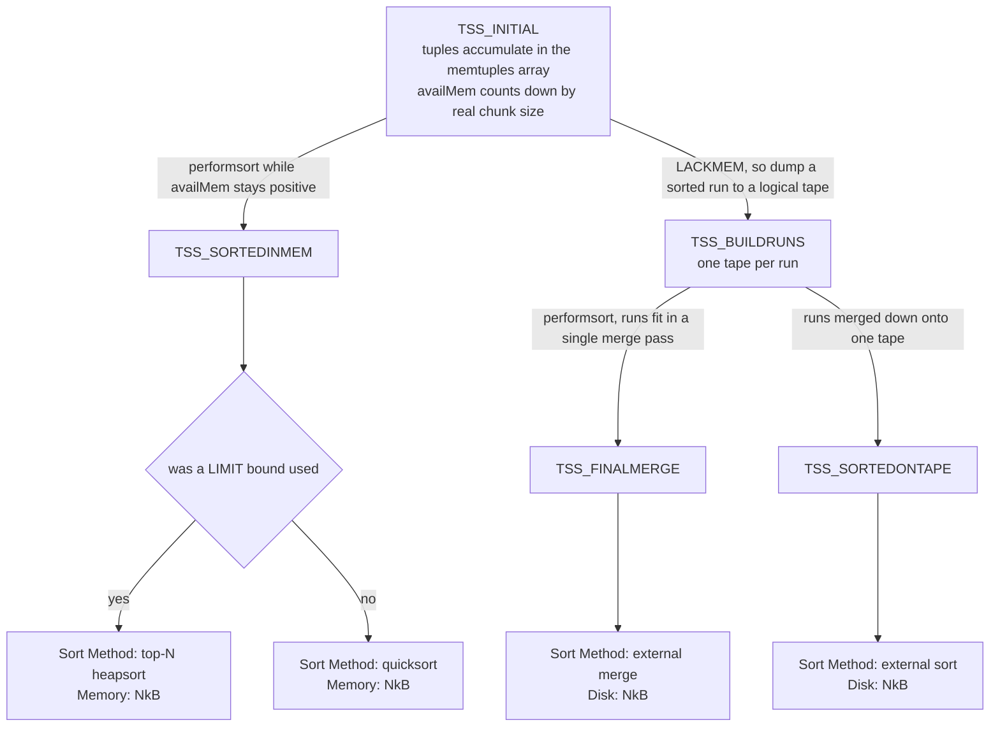

*tuplesort's end state decides the `Sort Method:` string*

*three of the four sort methods, from one query shape*

```sql
SET optimizer = off;   -- PostgreSQL planner, so the plan shape is stable

-- (a) a LIMIT makes the sort bounded: keep a 10-element heap, discard the rest
EXPLAIN (ANALYZE, TIMING OFF, COSTS OFF)
  SELECT id, amt FROM m183_t ORDER BY amt DESC, id LIMIT 10;

-- (b) 66 820 rows per segment, and they all fit
EXPLAIN (ANALYZE, TIMING OFF, COSTS OFF)
  SELECT id FROM m183_t WHERE g < 200 ORDER BY txt;

-- (c) identical query, but the whole statement gets 2 MB
SET statement_mem = '2MB';
EXPLAIN (ANALYZE, TIMING OFF, COSTS OFF)
  SELECT id FROM m183_t WHERE g < 200 ORDER BY txt;
```

```text {8,16,25} title="output"
-- (a)
 Limit (actual rows=10 loops=1)
   ->  Gather Motion 3:1  (slice1; segments: 3) (actual rows=10 loops=1)
         Merge Key: amt, id
         ->  Limit (actual rows=10 loops=1)
               ->  Sort (actual rows=10 loops=1)
                     Sort Key: amt DESC, id
                     Sort Method:  top-N heapsort  Memory: 78kB
                     ->  Seq Scan on m183_t (actual rows=334042 loops=1)

-- (b)
 Gather Motion 3:1  (slice1; segments: 3) (actual rows=200000 loops=1)
   Merge Key: txt
   ->  Sort (actual rows=66820 loops=1)
         Sort Key: txt
         Sort Method:  quicksort  Memory: 18593kB
         ->  Seq Scan on m183_t (actual rows=66820 loops=1)
               Filter: (g < 200)
               Rows Removed by Filter: 266347
 Execution Time: 368.707 ms

-- (c)
   ->  Sort (actual rows=66820 loops=1)
         Sort Key: txt
         Sort Method:  external merge  Disk: 4992kB
         ->  Seq Scan on m183_t (actual rows=66820 loops=1)
 Memory used:  2048kB
 Execution Time: 449.423 ms
```

:::note

The fourth string, **external sort**, is the `TSS_SORTEDONTAPE` case: the sort spilled, but by the time `performsort` finished all runs had been merged onto a single tape, so reading back is a sequential scan of one tape rather than an *N*-way merge. It needs a random-access sort (a scrollable cursor, say) and we could not produce one on this cluster. Note also that (b) → (c) costs only 449/369 ≈ 1.2× in wall clock: spilling is not free, but on a warm cache it is nothing like the catastrophe folklore suggests. This is an `--enable-cassert` build, so treat every timing here as a ratio on one machine, never as a benchmark.

:::

### 18.3.2 Whose kilobytes are those — and where do they go?

`show_sort_info` (`explain.c:3715`) does not print a per-segment number. It walks the `CdbExplain_NodeSummary` the QD collected from every QE and prints `agg->vsum`, the total across all segments that ran the node (`explain.c:3758`). The per-segment figures exist, but only under `VERBOSE`, on a curiously unindented continuation line.

*`Memory:` and `Disk:` are cluster sums; `VERBOSE` breaks them out*

```sql
SET optimizer = off;
EXPLAIN (ANALYZE, VERBOSE, TIMING OFF, COSTS OFF)
  SELECT id FROM m183_t WHERE g < 200 ORDER BY txt;

SET statement_mem = '2MB';   -- and again, spilling
EXPLAIN (ANALYZE, VERBOSE, TIMING OFF, COSTS OFF)
  SELECT id FROM m183_t WHERE g < 200 ORDER BY txt;
```

```text {4,9} title="output"
   ->  Sort (actual rows=66820 loops=1)
         Sort Key: m183_t.txt
         Sort Method:  quicksort  Memory: 18593kB
   Max Memory: 6205kB  Avg Memory: 6197kB (3 segments)
         ->  Seq Scan on public.m183_t (actual rows=66820 loops=1)

-- the disk figure aggregates the same way
         Sort Method:  external merge  Disk: 5184kB
   Max Memory: 1728kB  Avg Memory: 1728kB (3 segments)
```

6197 × 3 = 18 591 ≈ 18 593; 1728 × 3 = 5184 exactly. The rule for sort instrumentation is therefore: **`Memory:` and `Disk:` are summed over segments — divide by the segment count before comparing to any memory budget.** This is *not* the convention `actual rows` uses; [§18.1](#181-executor-framework--lifecycle) settles that one, and the two are genuinely different aggregations computed side by side in `explain_gp.c`. With a per-segment number in hand we can audit it, because a sort's footprint has exactly two parts. The first is the `memtuples` array: one 24-byte `SortTuple` (`tuplesort.h:142`) per row, holding a pointer plus `datum1` — the first sort key pre-extracted, or, when the type offers one, an *abbreviated key*, a pass-by-value proxy that answers most comparisons without touching the tuple at all (`tuplesort.h:129`). The array grows by doubling from 1024 slots (`grow_memtuples`, `tuplesort.c:1078`), so its real size is the next power of two above the row count. The second part is the tuples themselves, copied as `MinimalTuple`s into a dedicated child context and charged at their true allocated size via `GetMemoryChunkSpace` (`tuplesort.c:1203`).

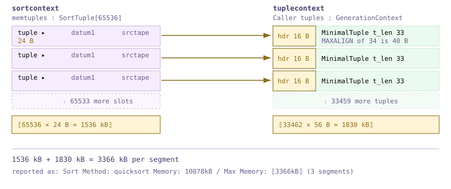

*the two halves of a sort's footprint, sized from a live measurement*

Both halves are predictable to the byte. For the `(id int, txt text)` projection above, `txt` runs 5 to 10 characters, so each `MinimalTuple` is `MAXALIGN(15)` = 16 bytes of header plus a 4-byte `id` plus a 1+N short varlena — 26 to 31 bytes — which the tuple context rounds to a 32-byte chunk and prefixes with a 16-byte `MemoryChunk` header: **48 bytes per row, flat**. Multiply out, add the doubled array, and compare with what the cluster actually reported. Note the last two rows: 11 % more rows buys 43 % more memory, because the array crossed 65 536 slots and doubled. Sort memory is a **staircase**, not a line, and the riser is 24 bytes times the old array length. The 1 kB overshoots are `tuplesort_get_stats` rounding up — `spaceUsed = (maxSpace + 1023) / 1024` at `tuplesort.c:2625`.

| rows / segment | memtuples slots | array kB | tuples kB at 48 B each | predicted kB | measured Max Memory |
| --- | --- | --- | --- | --- | --- |
| 33 407 | 65 536 | 1536 | 1566 | 3102 | 3102kB |
| 50 069 | 65 536 | 1536 | 2347 | 3883 | 3884kB |
| 60 087 | 65 536 | 1536 | 2817 | 4353 | 4353kB |
| 66 820 | 131 072 | 3072 | 3132 | 6204 | 6205kB |

### 18.3.3 A claim worth testing: the PostgreSQL 16 tuplesort rewrite

PostgreSQL 15 and 16 reworked tuplesort's memory management, and the change is usually quoted as a large wall-clock win; a previous investigation on this very cluster concluded the reproducible effect is instead roughly 2.3–2.5× less sort memory with wall clock largely unchanged on MPP. We are now equipped to check the mechanism rather than repeat either number. The mechanism is one `if`. Unbounded sorts allocate caller tuples from a **generation** context, which hands out chunks at `MAXALIGN(size)` with no size classes and never frees individually; bounded sorts keep the old `aset.c` context, because a top-N heap pfrees tuples in arbitrary order and needs a free list.

```c title="src/backend/utils/sort/tuplesort.c:783"
	if (state->base.sortopt & TUPLESORT_ALLOWBOUNDED)
		state->base.tuplecontext = AllocSetContextCreate(state->base.sortcontext,
														 "Caller tuples",
														 ALLOCSET_DEFAULT_SIZES);
	else
		state->base.tuplecontext = GenerationContextCreate(state->base.sortcontext,
														   "Caller tuples",
														   ALLOCSET_DEFAULT_SIZES);
```

That `if` is also an experiment we can run *on this build*, because adding a `LIMIT` flips the allocator without changing the algorithm — as long as the bound is large enough that the sort never switches to a heap (`ExecSetTupleBound`, `execProcnode.c:1443`, only sets `bounded`; the switch happens later, at twice the bound). `aset.c` rounds a request up to a power-of-two size class; generation rounds it to `MAXALIGN(size + 1)`. So the saving depends entirely on where the tuple width falls relative to a class boundary — which makes it *predictable*. A 33-byte `MinimalTuple` costs 16 + 64 = 80 bytes under `aset.c` but 16 + 40 = 56 under generation; a 32-byte one costs 16 + 32 = 48 under `aset.c` against 16 + 40 = 56 under generation, i.e. generation is *worse*. Here are both, one column wider than the other by a single character:

*33 462 rows per segment, same `quicksort`, allocator flipped by the `LIMIT`*

```sql
-- m183_s.txt is 11 chars (t_len 32); m183_s.txt12 is 12 chars (t_len 33)
SET optimizer = off;

EXPLAIN (ANALYZE, VERBOSE, TIMING OFF, COSTS OFF) SELECT id FROM m183_s ORDER BY txt;
EXPLAIN (ANALYZE, VERBOSE, TIMING OFF, COSTS OFF) SELECT id FROM m183_s ORDER BY txt   LIMIT 30000;
EXPLAIN (ANALYZE, VERBOSE, TIMING OFF, COSTS OFF) SELECT id FROM m183_s ORDER BY txt12;
EXPLAIN (ANALYZE, VERBOSE, TIMING OFF, COSTS OFF) SELECT id FROM m183_s ORDER BY txt12 LIMIT 30000;
```

```text {12,16} title="output"
-- t_len 32, unbounded -> GenerationContext, MAXALIGN(33) = 40  =>  56 B/row
         Sort Method:  quicksort  Memory: 10078kB
   Max Memory: 3366kB  Avg Memory: 3359kB (3 segments)

-- t_len 32, bounded   -> AllocSetContext,   size class  = 32  =>  48 B/row
         Sort Method:  quicksort  Memory: 9297kB
   Max Memory: 3105kB  Avg Memory: 3099kB (3 segments)
                     work_mem: 3125kB  Segments: 3  Max: 1046kB (segment 0)  Workfile: (0 spilling)

-- t_len 33, unbounded -> GenerationContext, MAXALIGN(34) = 40  =>  56 B/row
         Sort Method:  quicksort  Memory: 10078kB
   Max Memory: 3366kB  Avg Memory: 3359kB (3 segments)

-- t_len 33, bounded   -> AllocSetContext,   size class  = 64  =>  80 B/row
         Sort Method:  quicksort  Memory: 12422kB
   Max Memory: 4151kB  Avg Memory: 4140kB (3 segments)
```

Predicted for `t_len` 33: 1536 kB of array plus 33 462 × 56 = 1830 kB, i.e. **3366 kB** with the generation context, against 1536 + 33 462 × 80 = **4150 kB** with `aset.c`. Measured: **3366 kB and 4151 kB**. The tuple-storage component improves by exactly 80/56 = 1.43×, the whole footprint by 1.23×. One byte narrower, at `t_len` 32, the generation context is 8 bytes per row *worse* (3366 against 3105 kB); and for the `m183_t` shape of [§18.3](#183-sort--aggregate-nodes).2 both allocators land on the same 32-byte chunk and the change buys nothing at all. So the honest verdict: **the mechanism is real and measurable to the byte, but "2.3–2.5×" is not a property of PostgreSQL 16 — it is a property of a tuple width.** The win is bounded by the gap between a power-of-two size class and the next 8-byte boundary, capping near 1.6× on the tuple component for a single-chunk tuple and less on the total. As for wall clock, where we could compare like with like — the same query spilling and not spilling in [§18.3](#183-sort--aggregate-nodes).1 — the difference was 1.2×. We could not reproduce a large wall-clock effect and would not expect to: here a sort is one of three concurrent sorts behind a `Gather Motion`, and the interconnect is happy to hide it.

:::note

Two caveats, both from this build. First, `--enable-cassert` implies `MEMORY_CONTEXT_CHECKING` (`pg_config_manual.h:283`), which grows `MemoryChunk` from 8 to 16 bytes and makes `generation.c:349` reserve a sentinel byte via `MAXALIGN(size + 1)`. On a release build the same 33-byte tuple costs 8 + 40 = 48 rather than 56, and the generation advantage *widens* — so the direction of our finding is conservative, not optimistic. Second, the `work_mem:` line appears only for the bounded sorts because `tuplesort_get_stats` fills `stats-&gt;workmemused` only when `TUPLESORT_ALLOWBOUNDED` is set (`tuplesort.c:2626`). That is an instrumentation gap, not a difference in behaviour.

:::

### 18.3.4 Spilling: it is `statement_mem`, not `work_mem`

Notice what we changed to force a spill: `statement_mem`, not `work_mem`. Setting `work_mem = '1MB'` on this cluster does *nothing* to a `Sort`. Under resource queues (`gp_resource_manager = queue`, `gp_resqueue_memory_policy = eager_free` here) the dispatched plan arrives with a per-node budget already stamped on it — `Plan.operatorMemKB`, carved out of `statement_mem` by the quota policy at `memquota.c:341` — and the executor reads *that*, not the GUC. `nodeSort.c:130` and `:140` pass it straight into `tuplesort_begin_*` with no reference to `work_mem` at all.

```c title="src/backend/executor/execUtils.c:2314"
uint64 PlanStateOperatorMemKB(const PlanState *ps)
{
	uint64 result = 0;
	if (ps->plan->operatorMemKB == 0)
		/* statements that do not go through the resource queue */
		result = work_mem;
	else
		result = ps->plan->operatorMemKB;
	return result;
}
```

*sweeping `statement_mem` to find the spill threshold for 66 820 rows per segment*

```sql
SET optimizer = off;
-- for each M in 2MB 4MB 6MB 8MB 10MB 16MB:
SET statement_mem = :M;
EXPLAIN (ANALYZE, TIMING OFF, COSTS OFF)
  SELECT id FROM m183_t WHERE g < 200 ORDER BY txt;
```

```text {3} title="output"
statement_mem=2MB    Sort Method:  external merge  Disk: 4992kB     449 ms
statement_mem=4MB    Sort Method:  external merge  Disk: 4992kB     380 ms
statement_mem=6MB    Sort Method:  quicksort  Memory: 15420kB      408 ms
statement_mem=8MB    Sort Method:  quicksort  Memory: 17469kB       344 ms
statement_mem=10MB   Sort Method:  quicksort  Memory: 18593kB       379 ms
statement_mem=16MB   Sort Method:  quicksort  Memory: 18593kB       364 ms
```

The threshold sits between 4 and 6 MB, and the 6 MB row is the one to stare at: `Memory: 15420kB` is a sum, 5140 kB per segment, comfortably inside a 6 MB per-statement budget. Read it as 15 MB and you would conclude the sort had blown three times its quota. Note too that 6 MB reports *less* memory than 10 MB for the identical sort — at 6 MB the budget runs out partway through, so the array stops doubling early and tuplesort trades slack for extra comparisons rather than spilling. While a sort is spilling the workfiles are visible cluster-wide: the four `gp_toolkit` views read a shared workfile manager on each segment, with `gp_workfile_entries` one row per open file set, `gp_workfile_usage_per_query` rolled up by session, and `gp_workfile_usage_per_segment` by segment. They are live, so you need a second session while the query runs, and which nodes may appear at all is decided by `nodeSupportWorkfileCaching` (`explain_gp.c:1539`): `Sort`, `HashJoin`, `Material`, and `Agg` — the last only when its strategy is `AGG_HASHED`.

*session B watching session A's external merge sort, sampled three times*

```sql
-- session A:  SET statement_mem='1MB';
--   SELECT count(*) FROM (SELECT g,k,amt,txt FROM m183_t ORDER BY txt, amt) x;

-- session B, repeatedly:
SELECT segid, slice, optype, size, prefix FROM gp_toolkit.gp_workfile_entries ORDER BY segid;
SELECT sess_id, segid, size, numfiles, substr(query,1,44) AS q
  FROM gp_toolkit.gp_workfile_usage_per_query ORDER BY segid;
```

```text {14,15,16} title="output"
 segid | slice | optype  |  size   |  prefix
-------+-------+---------+---------+-----------
     0 |     1 | Logtape | 2392064 | Logtape_1
     1 |     1 | Logtape | 2719744 | Logtape_1
     2 |     1 | Logtape | 2555904 | Logtape_4

 sess_id | segid |  size   | numfiles |                q
---------+-------+---------+----------+----------------------------------------------
      25 |     0 | 4390912 |        1 | SELECT count(*) FROM (SELECT g, k, amt, txt
      25 |     1 | 4390912 |        1 | SELECT count(*) FROM (SELECT g, k, amt, txt
      25 |     2 | 4390912 |        1 | SELECT count(*) FROM (SELECT g, k, amt, txt

-- ~1 s later                                  -- ~2 s later
 0 | 1 | Logtape | 5996544 | Logtape_1          0 | 1 | Logtape | 7372800 | Logtape_1
 1 | 1 | Logtape | 5996544 | Logtape_1          1 | 1 | Logtape | 7372800 | Logtape_1
 2 | 1 | Logtape | 5767168 | Logtape_4          2 | 1 | Logtape | 7372800 | Logtape_4
```

:::note

`optype` is `Logtape` for both sorts and hash aggregates, because both spill through `logtape.c`. The `slice` column tells you *which* executor is spilling — invaluable on a plan with several memory-hungry slices, since the footer reports only one number per slice. `gp_workfile_mgr_used_diskspace` gives the same totals without the per-query join.

:::

### 18.3.5 Incremental sort

`nodeIncrementalSort.c` (1258 lines) exploits input already sorted on a *prefix* of the required keys: instead of one sort of everything, it sorts each group of equal prefix values separately, so memory is bounded by the largest group and rows can flow after the first group closes. Its state machine keeps two tuplesorts alive and hands work between them (`switchToPresortedPrefixMode`, `nodeIncrementalSort.c:287`), and `show_incremental_sort_info` (`explain.c:3955`) rolls the per-group statistics up into the `Full-sort Groups:` and `Pre-sorted Groups:` lines. It is **off by default on this cluster** (`enable_incremental_sort = off`), which is worth knowing before you go hunting for it. Below, forty prefix groups sorted in 28–41 kB apiece replace one monolithic 3341 kB sort (1114 kB per segment) — peak memory bounded by the largest group instead of by the whole input, and here twice as fast as well. Note that `Peak Memory` on those lines is genuinely a peak *over groups*, not a sum: a third aggregation convention on the same plan, which is the kind of inconsistency this chapter exists to warn you about.

*an index supplies `g`, so only `amt` has to be sorted — per group*

```sql
SET optimizer = off;
SET enable_incremental_sort = on;
SET enable_seqscan = off; SET enable_bitmapscan = off;   -- force the ordered index path

EXPLAIN (ANALYZE, TIMING OFF, COSTS OFF)
  SELECT g, amt, id FROM m183_t WHERE g < 40 ORDER BY g, amt;
```

```text {5,6,7} title="output"
 Gather Motion 3:1  (slice1; segments: 3) (actual rows=40000 loops=1)
   Merge Key: g, amt
   ->  Incremental Sort (actual rows=13358 loops=1)
         Sort Key: g, amt
         Presorted Key: g
         Full-sort Groups: 40  Sort Method: quicksort  Average Memory: 28kB  Peak Memory: 28kB
         Pre-sorted Groups: 40  Sort Method: quicksort  Average Memory: 41kB  Peak Memory: 41kB
         ->  Index Scan using m183_t_g_idx on m183_t (actual rows=13358 loops=1)
               Index Cond: (g < 40)
 Execution Time: 29.908 ms

-- the same rows through a plain Sort, for contrast:
         Sort Method:  quicksort  Memory: 3341kB          Execution Time: 61.950 ms
```

### 18.3.6 Four aggregation strategies

`nodeAgg.c` is 5249 lines, the second-largest file in the executor, and it implements one node with four strategies. `ExecAgg` (`nodeAgg.c:2354`) is a four-way switch that hides all of it, dispatching on `node->phase->aggstrategy`. Whichever branch runs, the same two things happen per group: `advance_aggregates` (`nodeAgg.c:836`) calls each aggregate's transition function once per input row, keeping the running `transValue` in `curaggcontext` — `hashcontext` for hashed groups, `aggcontexts[setno]` otherwise (`nodeAgg.c:481`) — and `finalize_aggregates` (`nodeAgg.c:1343`) turns those states into output datums when the group closes.

- **`AGG_PLAIN`** — No `GROUP BY`: one `AggStatePerGroup` for the whole input, one output row. Shown as `Aggregate`.
- **`AGG_SORTED`** — Input arrives sorted on the grouping keys; detect a key change, finalize, reset. Memory is O(1) in the group count — the cost was paid by the `Sort` beneath. Shown as `GroupAggregate`.
- **`AGG_HASHED`** — One hash-table entry per distinct key, each carrying its transition states in `hashcontext`. Memory is O(groups), so this is the strategy that can spill. Shown as `HashAggregate`.
- **`AGG_MIXED`** — Grouping sets where some sets are hashed and one is fed from sorted input in the same pass, so several hash tables live at once. Shown as `MixedAggregate`.

*steered by `enable_hashagg`: the same query as `HashAggregate` and as `GroupAggregate`*

```sql
SET optimizer = off;
EXPLAIN (ANALYZE, TIMING OFF, COSTS OFF) SELECT g, count(*), sum(amt) FROM m183_t GROUP BY g;

SET enable_hashagg = off;
EXPLAIN (ANALYZE, TIMING OFF, COSTS OFF) SELECT g, count(*), sum(amt) FROM m183_t GROUP BY g;
```

```text {5,23} title="output"
-- enable_hashagg = on
 Gather Motion 3:1  (slice1; segments: 3) (actual rows=1000 loops=1)
   ->  Finalize HashAggregate (actual rows=340 loops=1)
         Group Key: g
         Extra Text: (seg0)   hash table(s): 1; chain length 2.4 avg, 5 max; using 337 of 512 buckets; total 0 expansions.
         ->  Redistribute Motion 3:3  (slice2; segments: 3) (actual rows=1020 loops=1)
               Hash Key: g
               ->  Streaming Partial HashAggregate (actual rows=1000 loops=1)
                     Group Key: g
                     Extra Text: (seg0)   hash table(s): 1; chain length 2.5 avg, 6 max; using 1000 of 2048 buckets; total 0 expansions.
                     ->  Seq Scan on m183_t (actual rows=334042 loops=1)
 Execution Time: 161.249 ms

-- enable_hashagg = off
 Finalize GroupAggregate (actual rows=1000 loops=1)
   Group Key: g
   ->  Gather Motion 3:1  (slice1; segments: 3) (actual rows=3000 loops=1)
         Merge Key: g
         ->  Partial GroupAggregate (actual rows=1000 loops=1)
               Group Key: g
               ->  Sort (actual rows=334042 loops=1)
                     Sort Key: g
                     Sort Method:  quicksort  Memory: 83739kB
                     ->  Seq Scan on m183_t (actual rows=334042 loops=1)
 Execution Time: 397.948 ms
```

The trade is stark: the hashed plan holds 1000 group states in a 2048-bucket table and materialises nothing, while the sorted plan holds *nothing* per group but must first sort all 334 042 rows per segment, at 83 739 kB summed (27 913 kB each) and 2.5× the wall clock. `nodeGroup.c` (255 lines) implements a fifth, aggregate-free variant — the bare `Group` node — which this planner never chose in our tests; even `SELECT DISTINCT k` with `enable_hashagg = off` came out as a `GroupAggregate`. That `Extra Text:` line, meanwhile, is Cloudberry-only, assembled by `agg_hash_explain_extra_message` (`nodeAgg.c:5181`) from counters that `hash_agg_update_metrics` (`nodeAgg.c:2018`) refreshes as the table fills. The QD keeps the message from one representative segment and labels it, which is why it says `(seg0)` while `actual rows` on the same line is a different aggregation over all three. Field by field:

| field | source | how to read it |
| --- | --- | --- |
| `hash table(s): 1` | `aggstate->num_hashes` | one table per hashed grouping set; `MixedAggregate` shows more than one |
| `chain length 2.4 avg, 5 max` | `tuplehash_coll_stat` | collision-chain length in the `simplehash` table; above roughly 3 average the table is crowded |
| `using 337 of 512 buckets` | `hashtab->members` / `hashtab->size` | 337 distinct groups landed on seg0 in a 512-bucket table. Accumulated over rounds and batches, so it can exceed the true group count |
| `total 0 expansions` | `hashtab->num_expansions` | how many times `simplehash` had to grow and rehash. Non-zero means the planner's `numGroups` estimate was low |
| `N groups total in B batches, P spill partitions` | `hash_batches_used` | printed **only if the table ever spilled** — see [§18.3](#183-sort--aggregate-nodes).7 |
| `disk usage: NKB` | `aggstate->hash_disk_used` | per-segment workfile bytes for this node |

### 18.3.7 Hash-agg spill and `hash_mem_multiplier`

Before PostgreSQL 13 a hash aggregate that mis-estimated its group count simply overran `work_mem`. Now it partitions the input and spills, and the budget it spills against comes from `hash_agg_set_limits` (`nodeAgg.c:1861`). Cloudberry rewires the first lines: the limit is the *smaller* of `work_mem` and the plan's `operatorMemKB` from [§18.3](#183-sort--aggregate-nodes).4, and only then is `hash_mem_multiplier` applied.

```c title="src/backend/executor/nodeAgg.c:1867"
	uint64		strict_memlimit = work_mem;

	if (aggstate)
	{
		uint64 operator_mem = PlanStateOperatorMemKB((PlanState *) aggstate);
		if (operator_mem < strict_memlimit)
			strict_memlimit = operator_mem;
	}

	strict_memlimit = strict_memlimit * hash_mem_multiplier;
```

*`hash_mem_multiplier` against a pinned `work_mem = '1MB'`, 334 042 groups per segment*

```sql
SET optimizer = off;
SET work_mem = '1MB';    -- small enough to win the min() against operatorMemKB
-- for each M in 1, 2, 4:
SET hash_mem_multiplier = :M;
EXPLAIN (ANALYZE, VERBOSE, TIMING OFF, COSTS OFF)
  SELECT count(*) FROM (SELECT id, count(*) c FROM m183_t GROUP BY id) x;
```

```text {2,3,7,8,12,13} title="output"
-- hash_mem_multiplier = 1
   work_mem: 3217kB  Segments: 3  Max: 1073kB (segment 0)  Workfile: (3 spilling)
   Extra Text: (seg1)  hash table(s): 1; 332791 groups total in 73 batches, 2606120 spill
               partitions; disk usage: 13504KB; chain length 2.2 avg, 7 max; ...

-- hash_mem_multiplier = 2
   work_mem: 6193kB  Segments: 3  Max: 2065kB (segment 0)  Workfile: (3 spilling)
   Extra Text: (seg0)  hash table(s): 1; 333167 groups total in 17 batches, 5090768 spill
               partitions; disk usage: 12000KB; chain length 2.7 avg, 13 max; ...

-- hash_mem_multiplier = 4
   work_mem: 12337kB  Segments: 3  Max: 4113kB (segment 0)  Workfile: (3 spilling)
   Extra Text: (seg1)  hash table(s): 1; 332791 groups total in 9 batches, 2280488 spill
               partitions; disk usage: 13408KB; chain length 2.6 avg, 14 max; ...
```

1073, 2065, 4113 kB against a 1024 kB `work_mem`: 1×, 2×, 4× plus a fixed ~40 kB of table metadata, exactly as the source says — and the default on this cluster is 2, so hash nodes really do get twice what a sort node would. Batches fall 73 → 17 → 9: each doubling roughly halves the passes over spilled data, which is the whole point of the knob. Unlike `statement_mem`, `hash_mem_multiplier` costs nothing when the aggregate does *not* spill. Here is the same query under a 1 MB statement budget, with the footer telling you what it wanted:

*the memory footer when an aggregate wants more than it got*

```sql
SET optimizer = off;
SET statement_mem = '1MB';
EXPLAIN (ANALYZE, VERBOSE, TIMING OFF, COSTS OFF)
  SELECT count(*) FROM (SELECT id, count(*) c FROM m183_t GROUP BY id) x;
```

```text {3,11} title="output"
               ->  HashAggregate (actual rows=334042 loops=1)
                     Group Key: m183_t.id
                     work_mem: 5905kB  Segments: 3  Max: 1969kB (segment 0)  Workfile: (3 spilling)
                     Work_mem wanted: 18747K bytes avg, 19345K bytes max (seg1)
                                      to lessen workfile I/O affecting 3 workers.
                     Extra Text: (seg1)   hash table(s): 1; 332791 groups total in 29 batches,
                       5150156 spill partitions; disk usage: 12000KB; chain length 2.7 avg, 11 max;
                       using 332791 of 933888 buckets; total 1 expansions.
                     ->  Seq Scan on public.m183_t (actual rows=334042 loops=1)
 * (slice1)    Executor memory: 1676K bytes avg x 3x(0) workers, 1690K bytes max (seg2).
               Work_mem: 1969K bytes max, 19345K bytes wanted.
 Memory used:  1024kB
 Memory wanted:  19744kB
```

The leading `*` on `(slice1)` is the fast signal that a slice wanted more memory than it was given, and the per-node `work_mem:` / `Work_mem wanted:` lines come from `explain_gp.c:1611` and `:1627`. Where does `19345K bytes wanted` come from? Not a model — `hash_agg_update_metrics` accumulates it while the thing is happening: `instrument->workmemwanted += meta_mem` on the first pass plus `hashkey_mem` on every pass (`nodeAgg.c:2084-2088`), i.e. the measured size the table would have reached had it been allowed to hold every group at once. It is the number to put into `statement_mem` if you want this query to stop spilling, and `Memory wanted: 19744kB` on the last line is its maximum over all slices — the one figure in the footer you can act on directly.

### 18.3.8 Two-stage aggregation, executed — and what makes it *streaming*

[§16.4](./ch16.md#164-distributed-grouping--direct-dispatch) explained how the planner splits an aggregate in two and [§17.3](./ch17.md#173-transformation-framework) how ORCA does the same; the hashed plan in [§18.3](#183-sort--aggregate-nodes).6 is that split running. Each segment holds all 1000 values of `g` (the table is distributed by `id`), so a **partial** aggregate collapses 334 042 rows to 1000 partial group states locally. Those cross a `Redistribute Motion` hashed on `g`, and a **finalize** aggregate combines them: on the reporting segment 1020 partial rows arrive — 340 groups × 3 senders — and collapse to 340 final groups, with `Extra Text` independently confirming 337 groups on seg0. A three-hundred-fold reduction happens *before* the interconnect sees a byte; that, not the aggregation itself, is what the split buys. ([§18.1](#181-executor-framework--lifecycle) establishes how to read those `actual rows` counters across segments; here we rely only on their internal consistency.)

The first stage was labelled `Streaming Partial HashAggregate`, and that word is pure Cloudberry: `explain.c:1879` prepends it whenever `Agg->streaming` is set, which the planner does from `gp_use_streaming_hashagg` (`cdbgroupingpaths.c:1286`, GUC at `guc_gp.c:1904`). A streaming hash aggregate **refuses to spill**. When its table fills it stops admitting new groups — `p_isnew` is passed as `NULL` once `table_filled` is set (`nodeAgg.c:2305`) — drains what it has downstream, then resets the tables and restarts on the rest of the input instead of calling `agg_refill_hash_table` (`nodeAgg.c:2977-3008`). So it only *partly* deduplicates: the same group may be emitted once per round. Since a partial aggregate's output is re-aggregated downstream anyway that is perfectly correct, and the trade is disk I/O here against extra rows on the interconnect there. On a high-cardinality key with a 1 MB budget it goes exactly as the comment at `nodeAgg.c:2351` promises:

*the same two-stage plan with `Streaming` on and off, `statement_mem = '1MB'`*

```sql
SET optimizer = off;
SET statement_mem = '1MB';
SET gp_eager_two_phase_agg = on;    -- force the split on a key with ~1M distinct values
-- for each of on / off:
SET gp_use_streaming_hashagg = :S;
EXPLAIN (ANALYZE, VERBOSE, TIMING OFF, COSTS OFF)
  SELECT count(*) FROM (SELECT txt, count(*) c FROM m183_t GROUP BY txt) y;
```

```text {4,12,14} title="output"
-- gp_use_streaming_hashagg = on
   ->  Redistribute Motion 3:3  (slice2; segments: 3) (actual rows=333742 loops=1)
         ->  Streaming Partial HashAggregate (actual rows=334042 loops=1)
               work_mem: 2161kB  Segments: 3  Max: 721kB (segment 0)  Workfile: (0 spilling)
               Extra Text: (seg2) hash table(s): 1; chain length 2.9 avg, 15 max;
                 using 334042 of 507904 buckets; total 0 expansions.
 Execution Time: 964.481 ms

-- gp_use_streaming_hashagg = off
   ->  Redistribute Motion 3:3  (slice2; segments: 3) (actual rows=333742 loops=1)
         ->  Partial HashAggregate (actual rows=334042 loops=1)
               work_mem: 3409kB  Segments: 3  Max: 1201kB (segment 0)  Workfile: (3 spilling)
               Extra Text: (seg0) hash table(s): 1; 333167 groups total in 73 batches,
                 2621824 spill partitions; disk usage: 13792KB; chain length 2.3 avg, 13 max;
                 using 333167 of 1114112 buckets; total 1 expansions.
 Execution Time: 1201.320 ms
```

Zero workfiles and 721 kB, against three spilling segments with 73 batches and 13.8 MB of disk each — same answer, 20 % less elapsed time. The reverse case is just as real: on a *low*-cardinality key we measured the streaming stage emitting 278 382 rows where the non-streaming stage emitted 9973, tripling the Motion's payload for nothing, because nothing needed to spill in the first place. `gp_use_streaming_hashagg` defaults to `on` and is a sensible default for the first stage of a split aggregate, but it is a bet on the group count, not a free win.

### 18.3.9 Window functions

`nodeWindowAgg.c` (4014 lines) is the largest single-node file after `nodeAgg.c`, and the reason is frames. A window function may look at any row of its partition, so `WindowAgg` buffers the whole current partition in a tuplestore and hands the functions read pointers into it (`nodeWindowAgg.c:16-18`); `WinFuncExprState` carries a `markptr`/`readptr` pair per function so each can wander independently, `update_frameheadpos` / `update_frametailpos` track the frame edges, and `WinSetMarkPosition` lets the tuplestore discard rows that have fallen off the head. What it does *not* do is sort: `WindowAgg` requires its input already ordered by `PARTITION BY` then `ORDER BY`, which is why every window function sits directly on a `Sort` — and in MPP, on a `Redistribute Motion` beneath that, because a partition must be whole on one segment before it can be framed.

*a real frame clause; both optimizers build the same three-node stack*

```sql
EXPLAIN (ANALYZE, TIMING OFF, COSTS OFF)
  SELECT k, id,
         sum(amt) OVER (PARTITION BY k ORDER BY id
                        ROWS BETWEEN 2 PRECEDING AND CURRENT ROW)
    FROM m183_t WHERE g < 5;
```

```text {3,8} title="output"
 Gather Motion 3:1  (slice1; segments: 3) (actual rows=5000 loops=1)
   ->  WindowAgg (actual rows=3000 loops=1)
         Partition By: k
         Order By: id
         ->  Sort (actual rows=3000 loops=1)
               Sort Key: k, id
               Sort Method:  quicksort  Memory: 404kB
               ->  Redistribute Motion 3:3  (slice2; segments: 3) (actual rows=3000 loops=1)
                     Hash Key: k
                     ->  Index Scan using m183_t_g_idx on m183_t (actual rows=1739 loops=1)
                           Index Cond: (g < 5)
 Optimizer: GPORCA          Execution Time: 9.978 ms
 (identical shape with Optimizer: Postgres query optimizer, 42.433 ms)
```

:::note

There is an ORCA knob, `optimizer_force_window_hash_agg`, mapped to the `EopttraceEnableWindowHashAgg` trace flag at `CConfigParamMapping.cpp:330`. **Do not use it on this build.** Turning it on makes ORCA emit a `T_WindowHashAgg` plan node for which `ExecInitNode` has no case — `grep T_WindowHashAgg src/backend/executor/` returns nothing — so even `EXPLAIN` dies with `ERROR: unrecognized node type: 63 (execProcnode.c:533)`. It is a declared developer option carrying the comment `// TODO: remove it before merge` at `guc_gp.c:3315`, which is a fair summary of its status.

:::

### 18.3.10 `TupleSplit`: several DISTINCTs in one pass

`count(DISTINCT a)` is easy in MPP: redistribute on `a` and every segment counts locally. `count(DISTINCT a), count(DISTINCT b)` is hard, because the two aggregates want *incompatible* redistributions. `nodeTupleSplit.c` (281 lines, Cloudberry-only) resolves it by turning one input row into several: for each of the *N* distinct-qualified aggregates it emits a copy with every column irrelevant to that aggregate **set to NULL**, tagged by a synthetic `AggExprId` carrying the aggregate's index. Group by `(AggExprId, a, b)` and a single hash pass deduplicates all *N* distinct sets at once, with `AggExprId` in the redistribution key keeping the copies from colliding.

```c title="src/backend/executor/nodeTupleSplit.c:228"
	for (AttrNumber attno = 1; attno <= node->outerslot->tts_nvalid; attno++)
	{
		/* If the column is relevant to the current dqa, keep it */
		if (bms_is_member(attno, node->dqa_split_bms[node->currentExprId]))
			continue;

		/* otherwise, null this column out */
		isnull[attno - 1] = true;
	}
	result = ExecProject(node->ss.ps.ps_ProjInfo);
	/* the next DQA to process */
	node->currentExprId = (node->currentExprId + 1) % node->numDisDQAs;
```

The outer slot is fetched only when `currentExprId` wraps back to 0 (`nodeTupleSplit.c:183`), so the child is scanned once and each tuple is replayed *N* times from the same slot — the multiplication costs no extra I/O, and a per-DQA `FILTER` clause pushed down here can skip a copy outright (`nodeTupleSplit.c:201-214`). The node comes only from the PostgreSQL-planner path; ORCA refuses the query unless `optimizer_enable_multiple_distinct_aggs` (`guc_gp.c:2523`) is on, raising its fallback at `CTranslatorQueryToDXL.cpp:2271`. The working recipe is the one in `src/test/regress/sql/gp_dqa.sql`:

*two DISTINCTs: ORCA falls back, the planner builds `Streaming HashAggregate` over `TupleSplit`*

```sql
SET optimizer = off;
SET enable_hashagg = on; SET enable_groupagg = off;
SET gp_motion_cost_per_row = 2;    -- as in src/test/regress/sql/gp_dqa.sql

EXPLAIN (ANALYZE, TIMING OFF, COSTS OFF)
  SELECT count(distinct g), count(distinct k) FROM m183_t;

RESET ALL;  SET optimizer_trace_fallback = on;    -- now let ORCA try
EXPLAIN (COSTS OFF) SELECT count(distinct g), count(distinct k) FROM m183_t;
```

```text {5,10} title="output"
 Finalize Aggregate (actual rows=1 loops=1)
   ->  Gather Motion 3:1  (slice1; segments: 3) (actual rows=3 loops=1)
         ->  Partial Aggregate (actual rows=1 loops=1)
               ->  Redistribute Motion 3:3  (slice2; segments: 3) (actual rows=1083 loops=1)
                     Hash Key: g, k, (AggExprId)
                     ->  Streaming HashAggregate (actual rows=1050 loops=1)
                           Group Key: AggExprId, g, k
                           Extra Text: (seg0)   hash table(s): 1; chain length 2.4 avg, 6 max;
                             using 1050 of 2048 buckets; total 0 expansions.
                           ->  TupleSplit (actual rows=668084 loops=1)
                                 Split by Col: (g), (k)
                                 ->  Seq Scan on m183_t (actual rows=334042 loops=1)
 Optimizer: Postgres query optimizer          Execution Time: 247.061 ms

-- under ORCA:
INFO:  GPORCA failed to produce a plan, falling back to Postgres-based planner
DETAIL:  Falling back to Postgres-based planner because GPORCA does not support the
  following feature: Multiple Distinct Qualified Aggregates are disabled in the optimizer
```

`Split by Col: (g), (k)` names the two distinct sets, and `actual rows = 668084` is precisely 2 × 334 042 — the multiplication, visible. Downstream, 1050 groups per segment cover both sets together (1000 values of `g` plus 50 of `k`), so the interconnect carries about a thousand rows rather than a million, twice. That is the trick: pay double on a local scan to avoid a second redistribution of the whole table. It completes the memory-hungry half of the executor — [§18.4](#184-join-nodes) takes up the other family of hash tables, the ones inside `nodeHash.c`, with their own batching, their own `Extra Text` and, in Cloudberry, their own deadlock-avoidance problem; [§18.5](#185-expression-evaluation) goes a level down to how the transition functions and frame conditions in this section are actually evaluated. The `Motion` nodes that carried every partial aggregate here are Chapter 19, and the cluster-wide limits that decide what `statement_mem` you are allowed in the first place are Chapter 21.

## 18.4 Join Nodes

Three algorithms, one job: take two subtrees and produce every pair of tuples satisfying a set of clauses. The plan already chose the algorithm, and [§15.3](./ch15.md#153-path-cost--add_path) and [§17.3](./ch17.md#173-transformation-framework) covered the cost reasoning behind that choice. What the executor adds is what the cost model only models — a concrete control flow, a concrete memory footprint, and, in Cloudberry, a concrete hazard, because either input may be arriving over a Motion from three segments at once. Everything below turns on one asymmetry: **the inner side is the side that gets re-read or buffered**, while the outer side is streamed exactly once. Nested loop rescans the whole inner subtree per outer tuple; merge join walks two sorted streams in lockstep but must be able to back the inner one up; hash join reads the inner side to completion and keeps it. That is why almost every knob in this section — `Materialize`, batch files, prefetch — is about the inner side. And a Cloudberry surprise before we start: two of the three algorithms ship **switched off**.

*The join GUCs as this cluster boots them — look at boot_val, not just setting (guc_tables.c:952 and :962; upstream PostgreSQL has both as true)*

```sql
SELECT name, setting, boot_val, source
  FROM pg_settings
 WHERE name IN ('enable_hashjoin','enable_mergejoin','enable_nestloop',
                'enable_memoize','gp_hashjoin_tuples_per_bucket');
```

```text {5,6} title="output"
             name              | setting | boot_val | source
-------------------------------+---------+----------+---------
 enable_hashjoin               | on      | on       | default
 enable_memoize                | on      | on       | default
 enable_mergejoin              | off     | off    | default
 enable_nestloop               | off     | off    | default
 gp_hashjoin_tuples_per_bucket | 5       | 5        | default
(5 rows)
```

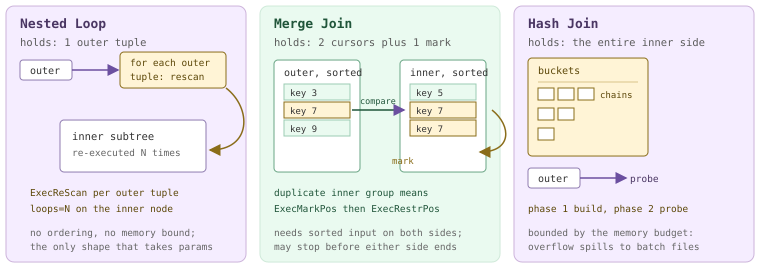

*What each join node holds while it runs. The outer side streams once; the inner side is re-read, backed up, or buffered.*

### 18.4.1 Nested loop: rescanning the inner side

`nodeNestloop.c` is the shortest of the three at 770 lines and reads exactly like its name. Pull an outer tuple; walk the inner subtree to exhaustion, emitting every pair that passes `joinqual`; pull the next outer tuple; `ExecReScan` the inner subtree; repeat. The one subtlety sits between "next outer tuple" and "rescan": if the plan attached `nestParams` to the node, the outer tuple's values are pushed into `PARAM_EXEC` slots and flagged as changed, which is what turns the inner subtree's index scan into a *different* index scan on every iteration.

```c title="src/backend/executor/nodeNestloop.c:223"
foreach(lc, nl->nestParams)
{
    NestLoopParam *nlp = (NestLoopParam *) lfirst(lc);
    ParamExecData *prm = &(econtext->ecxt_param_exec_vals[nlp->paramno]);

    prm->value = slot_getattr(outerTupleSlot,
                              nlp->paramval->varattno, &(prm->isnull));
    /* Flag parameter value as changed */
    innerPlan->chgParam = bms_add_member(innerPlan->chgParam, nlp->paramno);
}
/* now rescan the inner plan */
ExecReScan(innerPlan);
```

That is the parameterized, or *index*, nested loop — the shape that makes the algorithm worth having. Below it runs against a 50-row outer table and an indexed 300 000-row inner. The number to read is on the inner scan: `loops=5`. Take [§18.1](#181-executor-framework--lifecycle)'s rule with you — `actual rows` is the *per-loop average*, and both figures come from one segment (the one that produced the most tuples), not from the cluster. Five outer tuples reached this segment's join node, the bitmap scan ran five times, and 103 × 5 = 515 is exactly what the join reports.

*A parameterized nested loop: the inner subtree runs once per outer tuple (PostgreSQL planner)*

```sql
SET optimizer = off;
SET enable_hashjoin = off; SET enable_mergejoin = off; SET enable_nestloop = on;
EXPLAIN (ANALYZE, TIMING OFF, COSTS OFF)
SELECT count(*) FROM m184_s s, m184_f f WHERE f.did = s.sid AND s.sid < 6;
```

```text {8} title="output"
 Aggregate (actual rows=1 loops=1)
   ->  Gather Motion 3:1  (slice1; segments: 3) (actual rows=1500 loops=1)
         ->  Nested Loop (actual rows=515 loops=1)
               ->  Broadcast Motion 3:3  (slice2; segments: 3) (actual rows=5 loops=1)
                     ->  Seq Scan on m184_s s (actual rows=3 loops=1)
                           Filter: (sid < 6)
                           Rows Removed by Filter: 15
               ->  Bitmap Heap Scan on m184_f f (actual rows=103 loops=5)
                     Recheck Cond: ((did = s.sid) AND (did < 6))
                     ->  Bitmap Index Scan on m184_f_did_idx (actual rows=103 loops=5)
                           Index Cond: ((did = s.sid) AND (did < 6))
 Optimizer: Postgres query optimizer
```

Take the index away and the node degenerates into the textbook double loop, with two consequences visible in the plan. The clause moves out of the inner scan and becomes a `Join Filter` evaluated per pair — three outer tuples × 196 inner rows = 588 pairs considered, 147 kept, `Rows Removed by Join Filter: 441`. And the planner slips a `Materialize` ([§18.6](#186-subqueries--other-nodes)) above the inner subtree, whose own `loops` reading is the interesting one: `Materialize` shows `loops=3` because it was rescanned once per outer tuple, while its child `Seq Scan` shows `loops=1` because the tuplestore absorbed the rescans and never asked the scan to run again. That contrast is the whole reason for putting it there.

*The unparameterized nested loop: a Materialize absorbs the rescans and the clause becomes a per-pair Join Filter*

```sql
SET enable_indexscan = off; SET enable_bitmapscan = off; SET enable_indexonlyscan = off;
EXPLAIN (ANALYZE, TIMING OFF, COSTS OFF)
SELECT count(*) FROM m184_s s, m184_d d WHERE d.grp = s.sid AND s.sid < 4;
```

```text {7} title="output"
         ->  Nested Loop (actual rows=147 loops=1)
               Join Filter: (s.sid = d.grp)
               Rows Removed by Join Filter: 441
               ->  Broadcast Motion 3:3  (slice2; segments: 3) (actual rows=3 loops=1)
                     ->  Seq Scan on m184_s s (actual rows=2 loops=1)
                           Filter: (sid < 4)
               ->  Materialize (actual rows=196 loops=3)
                     ->  Seq Scan on m184_d d (actual rows=196 loops=1)
                           Filter: (grp < 4)
 Optimizer: Postgres query optimizer
```

### 18.4.2 Merge join: two streams in lockstep

`nodeMergejoin.c` (1827 lines) never buffers a whole side. It keeps one cursor into each sorted stream, compares the merge keys, and advances whichever side is behind; equal keys produce output. The complication is duplicates — if the outer stream has two tuples with key 7 and the inner has three, the second outer tuple must revisit all three — so before consuming a duplicate group the node calls `ExecMarkPos` on the inner subtree and later `ExecRestrPos` to rewind to that mark (`execAmi.c:419` and `:480`; call sites at `nodeMergejoin.c:1288` and `:1175`). Not every node supports mark and restore, which is one more reason a `Sort` or an ordered index tends to sit directly beneath the inner side. All of it is written as an explicit state machine — eleven states at `nodeMergejoin.c:108-119`, driven by a `switch` inside one long loop. The state names *are* the algorithm:

| State | What happens in it |
| --- | --- |
| `EXEC_MJ_INITIALIZE_OUTER` | First call: fetch the first outer tuple and evaluate its merge keys. |
| `EXEC_MJ_INITIALIZE_INNER` | Fetch the first inner tuple; it becomes the initial mark. |
| `EXEC_MJ_SKIP_TEST` | Compare the two current keys and decide which side is behind. |
| `EXEC_MJ_SKIPOUTER_ADVANCE` | Outer key is smaller: emit a null-extended row for a left join, then advance outer. |
| `EXEC_MJ_SKIPINNER_ADVANCE` | Inner key is smaller: emit a null-extended row for a right join, then advance inner. |
| `EXEC_MJ_JOINTUPLES` | Keys match: test the remaining quals and emit the joined tuple. |
| `EXEC_MJ_NEXTINNER` | Advance inside the current inner duplicate group. |
| `EXEC_MJ_NEXTOUTER` | Inner group exhausted: advance the outer stream. |
| `EXEC_MJ_TESTOUTER` | New outer tuple compared against the *marked* inner tuple; if equal, `ExecRestrPos` and replay the group. |
| `EXEC_MJ_ENDOUTER` | Outer exhausted: drain unmatched inner tuples (right and full joins). |
| `EXEC_MJ_ENDINNER` | Inner exhausted: drain unmatched outer tuples (left and full joins). |

Live, with a `Sort` on each side. The number worth staring at is on the inner `Sort`: it emitted **99 861** rows while its own child scan produced 100 172. Nothing was lost — merge join simply stopped asking. The outer stream's largest key was 997, so once the inner cursor passed it the join was provably finished and the last few hundred inner tuples were never pulled. Neither hash join nor nested loop can do that; it is the one place where the lockstep advance pays back the cost of the sorts.

*A merge join with a Sort on both inputs — and an inner side deliberately left unfinished*

```sql
SET optimizer = off;
SET enable_hashjoin = off; SET enable_nestloop = off; SET enable_mergejoin = on;
SET enable_indexscan = off; SET enable_bitmapscan = off; SET enable_indexonlyscan = off;
EXPLAIN (ANALYZE, TIMING OFF, COSTS OFF)
SELECT count(*) FROM m184_f f JOIN m184_d d ON f.did = d.did WHERE d.grp = 3;
```

```text {10} title="output"
         ->  Partial Aggregate (actual rows=1 loops=1)
               ->  Merge Join (actual rows=14323 loops=1)
                     Merge Cond: (d.did = f.did)
                     ->  Sort (actual rows=143 loops=1)
                           Sort Key: d.did
                           Sort Method:  quicksort  Memory: 75kB
                           ->  Broadcast Motion 3:3  (slice2; segments: 3) (actual rows=143 loops=1)
                                 ->  Seq Scan on m184_d d (actual rows=54 loops=1)
                                       Filter: (grp = 3)
                     ->  Sort (actual rows=99861 loops=1)
                           Sort Key: f.did
                           Sort Method:  quicksort  Memory: 9219kB
                           ->  Seq Scan on m184_f f (actual rows=100172 loops=1)
 Optimizer: Postgres query optimizer
```

:::note

**Which optimizer will give you a merge join?** Only the PostgreSQL planner, in practice. ORCA has exactly one merge-join implementation rule in the entire xform library — `CXformImplementFullOuterMergeJoin.cpp` — so it can reach a merge join only for a `FULL OUTER JOIN`; and even then, on this cluster with `optimizer_enable_mergejoin=on` (a hidden developer GUC, `guc_gp.c:2607`) it still cost-preferred a `Hash Full Join`. Every merge join in this section therefore begins with `optimizer=off`, which matches [§17.6](./ch17.md#176-steering--introspection)'s observation.

:::

### 18.4.3 Hash join: build, probe, and the numbers it reports

`nodeHashjoin.c` (2591 lines) plus `nodeHash.c` (4478 lines) implement the *hybrid hash join* of Zeller and Gray — the file header says so explicitly. The plan shape gives away the two phases: a `Hash Join` always has a `Hash` node as its inner child, and that `Hash` node is a blocking operator. Phase one, `HJ_BUILD_HASHTABLE`, drains it completely into a bucket array; phase two streams the outer side through, hashing each tuple and walking one bucket chain. Like merge join this is an explicit state machine — six states at `nodeHashjoin.c:189-194` — and the shape of that loop is why semi joins, outer joins and batching all fall out of the same code. Every `Hash` node then reports three numbers under `EXPLAIN ANALYZE`, to which Cloudberry adds a fourth line of its own.

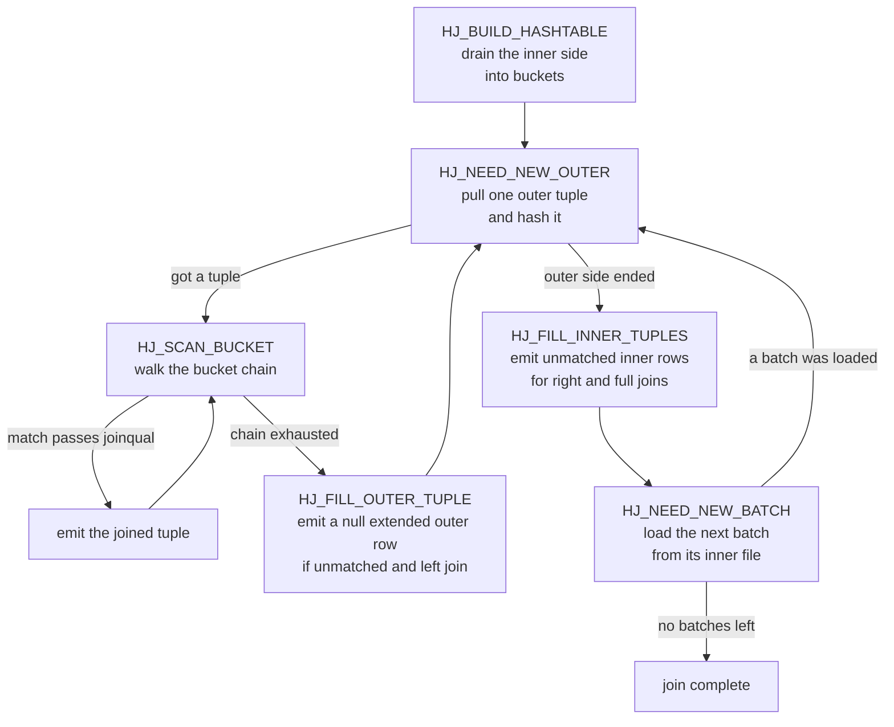

*The HJ_* state machine of ExecHashJoinImpl. Batching adds the loop back through HJ_NEED_NEW_BATCH; outer joins add the two FILL states.*

*A one-batch hash join under GPORCA — a 300 000-row fact table probing a 143-row broadcast dimension. Buckets/Batches/Memory Usage come from upstream; the Extra Text line is Cloudberry's.*

```sql
SET optimizer = on;
EXPLAIN (ANALYZE, TIMING OFF, COSTS OFF)
SELECT count(*) FROM m184_f f JOIN m184_d d ON f.did = d.did WHERE d.grp = 3;
```

```text {3} title="output"
               ->  Hash Join (actual rows=14323 loops=1)
                     Hash Cond: (f.did = d.did)
                     Extra Text: (seg2)   Hash chain length 1.0 avg, 1 max, using 143 of 524288 buckets.
                     ->  Seq Scan on m184_f f (actual rows=100172 loops=1)
                     ->  Hash (actual rows=143 loops=1)
                           Buckets: 524288  Batches: 1  Memory Usage: 4102kB
                           ->  Broadcast Motion 3:3  (slice2; segments: 3) (actual rows=143 loops=1)
                                 ->  Seq Scan on m184_d d (actual rows=54 loops=1)
                                       Filter: (grp = 3)
   (slice1)    Executor memory: 4158K bytes avg x 3x(0) workers, 4158K bytes max (seg0).  Work_mem: 4102K bytes max.
 Optimizer: GPORCA
```

Be careful whose numbers those are. `Buckets`/`Batches`/`Memory Usage` are printed by upstream's `show_hash_info` (`explain.c:4041`) out of a `SharedHashInfo`, which in PostgreSQL holds one entry per parallel worker. Cloudberry reuses the structure for segments: `explain_gp.c:1246` ships each QE's `HashInstrumentation` back and rebuilds the array — the comment there says so outright — and `show_hash_info` then takes the **Max** across the entries (`explain.c:4075-4084`). So `Memory Usage: 4102kB` is the peak on the *worst* segment, never a sum. The `Extra Text` line has a different provenance again: `ExecHashTableExplainEnd` (`nodeHash.c:2718`) produces it on each QE and `explain_gp.c` prints only the one segment it judged most interesting, hence the `(seg2)` tag. The bucket count is a genuine Cloudberry divergence too: upstream aims for roughly one tuple per bucket, whereas `ExecChooseHashTableSize` here treats `gp_hashjoin_tuples_per_bucket` (default 5) as a *lower* bound and, when the table is expected to fit, averages it with a bound proportional to the memory budget, floored at 1024 (`nodeHash.c:1049-1075`) — which is why the same 143-row table gets 524 288 buckets at a 128 MB budget and 2048 buckets at 512 kB. The `of 524288 buckets` denominator, finally, is `nonemptybatches × nbuckets` (`nodeHash.c:2803`), an identity we can check in a moment.

### 18.4.4 When the inner side does not fit: batches

If the inner side outgrows its budget the join neither fails nor thrashes: it partitions. Both sides are split into *batches* by hash bits; batch 0 stays resident and batches 1…n−1 are written to a pair of temporary files each, one for inner tuples and one for outer. After the first pass the join loops — load batch k's inner file into the now-empty bucket array, stream batch k's outer file through it, repeat. That is the `HJ_NEED_NEW_BATCH` edge in the diagram above, and the whole scheme rests on one small function.

```c title="src/backend/executor/nodeHash.c:2240"
if (nbatch > 1)
{
    *bucketno = hashvalue & (nbuckets - 1);
    *batchno = pg_rotate_right32(hashvalue,
                                hashtable->log2_nbuckets) & (nbatch - 1);
}
```

Low bits pick the bucket, the *next* bits up pick the batch. Because the batch bits sit above the bucket bits, doubling `nbatch` consumes one more bit and can only move a tuple to a *later* batch, never an earlier one — which is what makes it safe to double the batch count halfway through the build, rescan the resident table, and flush the newly out-of-range tuples to their files (`nodeHash.c:1257-1287`).

<RawFigure html={"<div style=\"overflow-x:auto\"><div style=\"font-family:ui-monospace,SFMono-Regular,Menlo,monospace;font-size:11.5px;min-width:640px\"> <div style=\"display:flex;align-items:stretch;border:1px solid #cdb4db;border-radius:6px;overflow:hidden\"> <div style=\"flex:16;background:#f7f7f9;padding:8px 10px;border-right:1px solid #cdb4db\"> <div style=\"color:#666\">bits 31 .. 16</div><div style=\"color:#999;margin-top:4px\">unused</div></div> <div style=\"flex:5;background:#eafaf0;padding:8px 10px;border-right:1px solid #cdb4db\"> <div style=\"color:#20553a\">bits 15 .. 11</div><div style=\"color:#20553a;font-weight:600;margin-top:4px\">batch, 5 bits</div> <div style=\"color:#3d7a5a;margin-top:2px\">32 batches</div></div> <div style=\"flex:11;background:#fff4d6;padding:8px 10px\"> <div style=\"color:#8a6d1a\">bits 10 .. 0</div><div style=\"color:#8a6d1a;font-weight:600;margin-top:4px\">bucket, 11 bits</div> <div style=\"color:#8a6d1a;margin-top:2px\">2048 buckets</div></div> </div> <div style=\"margin-top:12px;color:#4a3663\"><span class=\"hl\">bucketno</span> = hashvalue &amp; 2047 &nbsp;&nbsp;&nbsp; <span class=\"hl\">batchno</span> = rotate_right32(hashvalue, 11) &amp; 31</div> <div style=\"margin-top:14px;display:flex;gap:6px;flex-wrap:wrap\"> <div style=\"background:#f5edff;border:1px solid #cdb4db;border-radius:4px;padding:6px 8px\">batch&nbsp;0<br/><span style=\"color:#666\">resident: buckets in memory</span></div> <div style=\"background:#fff;border:1px solid #cdb4db;border-radius:4px;padding:6px 8px\">batch&nbsp;1<br/><span style=\"color:#666\">innerBatchFile[1]<br/>outerBatchFile[1]</span></div> <div style=\"background:#fff;border:1px solid #cdb4db;border-radius:4px;padding:6px 8px\">batch&nbsp;2<br/><span style=\"color:#666\">innerBatchFile[2]<br/>outerBatchFile[2]</span></div> <div style=\"background:#fff;border:1px solid #cdb4db;border-radius:4px;padding:6px 8px;color:#999\">…</div> <div style=\"background:#fff;border:1px solid #cdb4db;border-radius:4px;padding:6px 8px\">batch&nbsp;31<br/><span style=\"color:#666\">innerBatchFile[31]<br/>outerBatchFile[31]</span></div> </div> <div style=\"margin-top:10px;color:#666\">2 files x 31 non-resident batches = 62 temporary files per segment</div> </div></div>"} caption={"How a 32-bit hash value is split when nbuckets=2048 and nbatch=32 — the numbers from the 512 kB run below"} />

*One self-join at 128 MB, 2 MB and 512 kB. Note the knob: on this cluster gp_resource_manager is queue, so per-operator memory comes from statement_mem and setting work_mem alone changes nothing — nodeHash.c compares against PlanStateOperatorMemKB. Statement-memory policy is Chapter 21's subject.*

```sql
SET optimizer = off;
SET statement_mem = '128MB';   -- then '2MB', then '512kB'
EXPLAIN (ANALYZE, TIMING OFF, COSTS OFF)
SELECT count(*) FROM m184_f a JOIN m184_f b ON a.id = b.id AND a.did = b.did;
```

```text {4,17,28} title="output"
-- statement_mem = 128MB
                     Extra Text: (seg2)   Hash chain length 1.1 avg, 5 max, using 91229 of 524288 buckets.
                     ->  Hash (actual rows=100172 loops=1)
                           Buckets: 524288  Batches: 1  Memory Usage: 8009kB
   (slice1)    Executor memory: 8061K bytes avg x 3x(0) workers, 8072K bytes max (seg1).  Work_mem: 8009K bytes max.
 Memory used:  128000kB

-- statement_mem = 2MB
                     Extra Text: (seg2)   Initial batch 0:
 (seg2)     Wrote 2016K bytes to inner workfile.
 (seg2)     Wrote 3168K bytes to outer workfile.
 (seg2)   Initial batches 1..3:
 (seg2)     Read 2060K bytes from inner workfile: 687K avg x 3 nonempty batches, 690K max.
 (seg2)     Read 3210K bytes from outer workfile: 1070K avg x 3 nonempty batches, 1075K max.
 (seg2)   Hash chain length 2.0 avg, 8 max, using 51189 of 65536 buckets.
                     ->  Hash (actual rows=100172 loops=1)
                           Buckets: 16384  Batches: 4  Memory Usage: 1112kB
 * (slice1)    Executor memory: 1351K bytes avg x 3x(0) workers, 1351K bytes max (seg0).  Work_mem: 1112K bytes max, 4041K bytes wanted.
 Memory used:  2048kB
 Memory wanted:  4640kB

-- statement_mem = 512kB
                     Extra Text: (seg2)   Initial batches 1..31:
 (seg2)     Read 2653K bytes from inner workfile: 86K avg x 31 nonempty batches, 88K max.
 (seg2)     Read 4134K bytes from outer workfile: 134K avg x 31 nonempty batches, 137K max.
 (seg2)   Hash chain length 2.0 avg, 8 max, using 51189 of 65536 buckets.
                     ->  Hash (actual rows=100172 loops=1)
                           Buckets: 2048  Batches: 32  Memory Usage: 141kB
 * (slice1)    Executor memory: 2185K bytes avg x 3x(0) workers, 2185K bytes max (seg0).  Work_mem: 141K bytes max, 3929K bytes wanted.
 Memory used:  512kB
 Memory wanted:  4528kB
```

Two things to check by hand. The bucket identity first: 4 × 16 384 = 65 536 and 32 × 2048 = 65 536, and both runs report `of 65536 buckets` — exactly `nonemptybatches × nbuckets`. Second, `Work_mem: … bytes wanted` appears **only** when `nbatch > 1`: `ExecHashTableExplainEnd` sums the final hash space of the completed batches plus the sizes of inner workfiles it never got to read, and reports the total only if it exceeds the operator's budget (`nodeHash.c:2749-2777`). It answers "how much memory would have made this a one-batch join", not "how much did we use".

*The batch files, caught from a second session while a 32-batch join is probing: 62 = 2 x (32 - 1), because batch 0 never gets files*

```sql
-- session 1: SET statement_mem='512kB'; a deliberately slow probe of the same join
-- session 2, while it runs:
SELECT segid, slice, optype, numfiles, size
  FROM gp_toolkit.gp_workfile_entries ORDER BY segid;
```

```text {3} title="output"
 segid | slice |  optype  | numfiles |  size
-------+-------+----------+----------+---------
     0 |     1 | HashJoin |     62 | 4784128
     1 |     1 | HashJoin |       62 | 5079040
     2 |     1 | HashJoin |       62 | 4030464
(3 rows)
```

The `slice` column is what lets you attribute spill in a plan with several joins; the sibling views `gp_workfile_usage_per_query`, `gp_workfile_usage_per_segment` and `gp_workfile_mgr_used_diskspace` aggregate the same data, and [§18.3](#183-sort--aggregate-nodes) uses them for sort and aggregate spill. Batching does have one adversary, though: a single hot join key. Tuples sharing a key share a hash value, so no number of batch bits can separate them. Below, the inner side is 150 000 rows with *one* distinct join key at a 512 kB budget. The executor doubles the batch count from 32 to 64, discovers that the offending batch retained all of its tuples, and gives up — the resident table finishes at 5274 kB against a 512 kB budget, in a single bucket, with a chain 150 000 long.

*Skew defeats batching: one hot inner key, a batch doubling that changed nothing, and a chain length of 150000*

```sql
SET optimizer = off; SET statement_mem = '512kB';
EXPLAIN (ANALYZE, TIMING OFF, COSTS OFF)
SELECT count(*) FROM m184_f f JOIN m184_k2 k ON k.did = f.did;   -- every k.did = 5000
```

```text {10} title="output"
               ->  Hash Join (actual rows=0 loops=1)
                     Hash Cond: (f.did = k.did)
                     Extra Text: (seg1)   Initial batch 0:
 (seg1)     Wrote 3488K bytes to inner workfile.
 (seg1)   Initial batches 1..31:
 (seg1)     Read 3516K bytes from inner workfile.
 (seg1)     Wrote 3488K bytes to inner workfile.
 (seg1)   Secondary Overflow batches 32..63:
 (seg1)     Read 3516K bytes from inner workfile.
 (seg1)   Hash chain length 150000.0 avg, 150000 max, using 1 of 27648 buckets.  Skipped 37 empty batches.
                     ->  Redistribute Motion 3:3  (slice2; segments: 3) (actual rows=96600 loops=1)
                           ->  Seq Scan on m184_f f (actual rows=100172 loops=1)
                     ->  Hash (actual rows=150000 loops=1)
                           Buckets: 1024 (originally 1024)  Batches: 64 (originally 32)  Memory Usage: 5274kB
 * (slice1)    Executor memory: 2235K bytes avg x 3x(0) workers, 6401K bytes max (seg1).  Work_mem: 5274K bytes max, 5282K bytes wanted.
 Memory wanted:  5981kB
```

Upstream does have skew handling, and it is reachable here — but it does not help this case. `ExecHashBuildSkewHash` (`nodeHash.c:3064`) sets aside up to `SKEW_HASH_MEM_PERCENT` = 2 % of the budget for dedicated buckets holding the inner tuples that match the **outer** relation's most common values, so those never spill. It requires `nbatch > 1` at build time (`nodeHash.c:788`), a single hash clause whose outer side is a plain `Var` on a base relation (`createplan.c:6166-6188` is where `skewTable` is set), MCV statistics for that column, and top MCVs covering at least `SKEW_MIN_OUTER_FRACTION` = 1 % of the outer — all true in the plan above. But the hot key here is on the *inner* side, which the mechanism says nothing about. Note also that the ORCA translator never sets `skewTable` at all, so under `optimizer=on` the skew optimization is unreachable by construction.

:::note

**Two different "hash table" lines.** A `HashAggregate` prints an `Extra Text` line too, and it looks confusingly similar: `hash table(s): 1; chain length 2.4 avg, 5 max; using 337 of 512 buckets; total 0 expansions.` That one comes from `agg_hash_explain_extra_message` (`nodeAgg.c:5199`) and belongs to [§18.3](#183-sort--aggregate-nodes) — `total N expansions` counts growth events in a *simplehash* aggregate table and has no hash-join equivalent. The join's line always begins `Hash chain length` and comes from `nodeHash.c:2806`.

:::

### 18.4.5 Semi, anti and outer joins

The states in the diagram already cover every join flavour; the variants differ only in which of them are enabled. Two macros decide it (`nodeHashjoin.c:197` and `:199`): `HJ_FILL_OUTER` is true when the node was initialised with a null *inner* tuple slot — unmatched outer rows must still be emitted — and `HJ_FILL_INNER` is true when there is a null *outer* slot. `hj_MatchedOuter` records whether the current outer tuple ever found a partner. A semi join sets `js.single_match`, which makes `HJ_SCAN_BUCKET` stop at the first match instead of walking the chain; an anti join emits the outer tuple precisely when `hj_MatchedOuter` is still false. All of it is a dozen lines:

```c title="src/backend/executor/nodeHashjoin.c:749"
case HJ_FILL_OUTER_TUPLE:
    node->hj_JoinState = HJ_NEED_NEW_OUTER;

    if (!node->hj_MatchedOuter && HJ_FILL_OUTER(node))
    {
        /* Generate a fake join tuple with nulls for the inner tuple */
        econtext->ecxt_innertuple = node->hj_NullInnerTupleSlot;

        if (otherqual == NULL || ExecQual(otherqual, econtext))
            return ExecProject(node->js.ps.ps_ProjInfo);
    }
    break;
```

*Semi, anti and left variants over the same two tables, the same 143-row hash table and the same 100 172-row outer scan, so only the label and the count move. EXISTS gives 14 323, NOT EXISTS gives 85 849, and 14 323 + 85 849 = 100 172 — every outer row goes to exactly one of them.*

```sql
SET optimizer = off;
EXPLAIN (ANALYZE, TIMING OFF, COSTS OFF) SELECT count(*) FROM m184_f f
  WHERE EXISTS (SELECT 1 FROM m184_d d WHERE d.did = f.did AND d.grp = 3);
EXPLAIN (ANALYZE, TIMING OFF, COSTS OFF) SELECT count(*) FROM m184_f f
  WHERE NOT EXISTS (SELECT 1 FROM m184_d d WHERE d.did = f.did AND d.grp = 3);
EXPLAIN (ANALYZE, TIMING OFF, COSTS OFF) SELECT count(d.dname) FROM m184_f f
  LEFT JOIN m184_d d ON f.did = d.did AND d.grp = 3;
```

```text {2,8,13} title="output"
-- EXISTS
               ->  Hash Semi Join (actual rows=14323 loops=1)
                     Hash Cond: (f.did = d.did)
                     ->  Seq Scan on m184_f f (actual rows=100172 loops=1)
                     ->  Hash (actual rows=143 loops=1)
                           Buckets: 524288  Batches: 1  Memory Usage: 4102kB
-- NOT EXISTS
               ->  Hash Anti Join (actual rows=85849 loops=1)
                     Hash Cond: (f.did = d.did)
                     ->  Seq Scan on m184_f f (actual rows=100172 loops=1)
                     ->  Hash (actual rows=143 loops=1)
-- LEFT JOIN
               ->  Hash Left Join (actual rows=100172 loops=1)
                     Hash Cond: (f.did = d.did)
                     ->  Seq Scan on m184_f f (actual rows=100172 loops=1)
                     ->  Hash (actual rows=143 loops=1)
```

Two labels you will meet that are not upstream's. The first is PostgreSQL 16's `Hash Right Anti Join` (`JOIN_RIGHT_ANTI`, `nodes.h:1029`): when the *hashed* side is the one being filtered, the planner commutes the join and lets `HJ_FILL_INNER_TUPLES` do the work — the same `NOT EXISTS` written the other way round produces it. The second is Cloudberry's own `JOIN_LASJ_NOTIN` (`nodes.h:1026`), printed as `Left Anti Semi (Not-In)` (`explain.c:2184`): a left anti semi join with SQL `NOT IN` semantics, in which a single NULL on the inner side must suppress *all* output. `nodeHashjoin.c:660` and `nodeNestloop.c:152` carry the extra NULL checks that implement it, and ORCA emits it for `NOT IN`:

*A Cloudberry-only join type: NOT IN becomes a Left Anti Semi (Not-In) Join under GPORCA*

```sql
SET optimizer = on;
EXPLAIN (ANALYZE, TIMING OFF, COSTS OFF)
SELECT count(*) FROM m184_f f WHERE f.did NOT IN (SELECT did FROM m184_d WHERE grp = 3);
```

```text {1} title="output"
               ->  Hash Left Anti Semi (Not-In) Join (actual rows=85849 loops=1)
                     Hash Cond: (f.did = m184_d.did)
                     Extra Text: (seg2)   Hash chain length 1.0 avg, 1 max, using 143 of 524288 buckets.
                     ->  Seq Scan on m184_f f (actual rows=100172 loops=1)
                     ->  Hash (actual rows=143 loops=1)
                           ->  Broadcast Motion 3:3  (slice2; segments: 3) (actual rows=143 loops=1)
                                 ->  Seq Scan on m184_d (actual rows=54 loops=1)
 Optimizer: GPORCA
```

### 18.4.6 Memoize: a cache in front of a parameterized inner side

`nodeMemoize.c` (1239 lines) exists for one situation: a parameterized nested loop whose outer side repeats parameter values. Rather than rescanning the inner subtree for the tenth occurrence of `did = 7`, `Memoize` keeps an LRU hash table keyed on the parameters and replays the cached tuples. It is worth having only because the planner can estimate the number of *distinct* parameter values; when that estimate is wrong the cache is pure overhead. Cloudberry inherits the node unchanged, and the PostgreSQL planner does pick it here.

*A live Memoize over a parameterized index scan — read the two loops counts against each other*

```sql
SET optimizer = off;
SET enable_hashjoin = off; SET enable_mergejoin = off;
SET enable_nestloop = on; SET enable_memoize = on;
EXPLAIN (ANALYZE, TIMING OFF, COSTS OFF)
SELECT count(d.dname) FROM m184_f a, m184_d d WHERE d.did = a.did AND a.id < 20000;
```

```text {6} title="output"
               ->  Nested Loop (actual rows=6800 loops=1)
                     ->  Redistribute Motion 3:3  (slice2; segments: 3) (actual rows=6800 loops=1)
                           Hash Key: a.did
                           ->  Seq Scan on m184_f a (actual rows=6780 loops=1)
                                 Filter: (id < 20000)
                     ->  Memoize (actual rows=1 loops=6800)
                           Cache Key: a.did
                           Cache Mode: logical
                           ->  Index Scan using m184_d_did_idx on m184_d d (actual rows=1 loops=340)
                                 Index Cond: (did = a.did)
 Optimizer: Postgres query optimizer
```

`Memoize` was asked 6800 times; the index scan beneath it ran 340 times. The cache absorbed 6460 rescans — the same reading as the `Materialize` in [§18.4](#184-join-nodes).1, one level of indirection up. What is *missing* is upstream's `Hits: … Misses: … Evictions: …` line, and the reason is instructive. `show_memoize_info` prints it from `mstate->stats` on the local `MemoizeState`, and skips the line entirely when `cache_misses` is zero (`explain.c:4192-4195`). In a dispatched plan the coordinator's `MemoizeState` never executed anything — and unlike `HashInstrumentation`, Memoize's counters are not among the fields `explain_gp.c` ships back from the QEs (`explain_gp.c:880-896`). So on Cloudberry you get `Cache Key` and `Cache Mode`, which come from the `Plan`, and the hit rate has to be inferred from the two `loops` values.

### 18.4.7 The MPP twist: prefetching the inner side

Now the part with no upstream counterpart. A join node's instinct is to look at the outer side first — even hash join peeks at one outer tuple before building, so it can skip the build entirely if the outer turns out empty. In a single-process executor that peek is free. In Cloudberry, where either input may be a Motion fed by a whole gang of senders, it can hang the cluster. The reasoning is spelled out in a long comment at `cdbllize.c:1459-1489`. Motion senders block when their send buffers fill and nobody drains them. Segment A's join has already taken an outer tuple and is now pulling from its inner sender; segment B's join is still waiting for its *first* outer tuple. A cannot drain its outer sender because it is busy with the inner; B cannot drain its inner sender because it has not got past the outer. Four processes, one cycle:

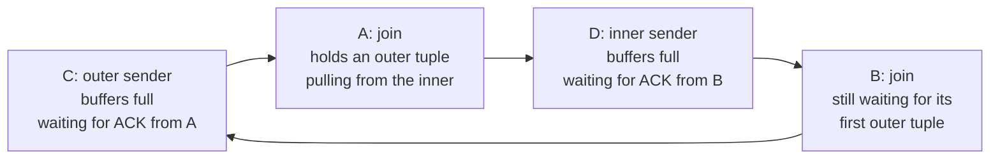

*The motion deadlock the executor is built to avoid. Every arrow means waiting for.*

- **`prefetch_inner`** — Remove the half-and-half state: consume the inner side before touching the outer. For hash join this merely *suppresses* the empty-outer peek (`nodeHashjoin.c:337`), since the build already drains the inner. For nested loop (`nodeNestloop.c:115`) and merge join (`nodeMergejoin.c:684`) the node pulls one tuple from the inner subtree and then `ExecReScan`s it.
- **`prefetch_joinqual`** — The same hazard one level down: the *join qual* itself may hold a SubPlan with a Motion. `ExecPrefetchQual` (`execUtils.c:1614`) evaluates the qual once against fabricated all-NULL inner and outer tuples, purely to force that Motion to run and drain.
- **`prefetch_qual`** — Identical treatment for the node's non-join `qual`.

Why does pulling *one* tuple drain the inner side? Because the planner guarantees a blocking operator on top of it. `create_mergejoin_plan` demands "some kind of strict slackening operator … which consumes all of its input before producing a row of output" and installs a `Sort`, or a `Material` with `cdb_strict` set (`createplan.c:5806-5822`); `ExecMaterial` reacts to `cdb_strict` by looping the entire subplan into its tuplestore on the first call (`nodeMaterial.c:108-121`). One pull, whole Motion drained, cycle broken.

```c title="src/backend/executor/nodeMergejoin.c:684"
if (node->prefetch_inner)
{
    innerTupleSlot = ExecProcNode(innerPlan);
    node->mj_InnerTupleSlot = innerTupleSlot;

    ExecReScan(innerPlan);
    ResetExprContext(econtext);

    node->prefetch_inner = false;
}
```

Who sets the three flags (`plannodes.h:1198-1200`)? Under the PostgreSQL planner, `create_hashjoin_plan` turns `prefetch_inner` on when *either* subpath has a motion hazard (`createplan.c:6299-6304`), merge join when *both* do (`:5815`), and nested loop only when it also managed to get a strict `Material` under the inner side (`:5569-5572`) — which is why a parameterized inner scan, whose inner side cannot run before the outer supplies values, comes out with `prefetch_inner false` even under a Motion. ORCA is blunter: its translator sets the flag unconditionally for every hash join (`CTranslatorDXLToPlStmt.cpp:1554`) and for every nested loop *except* an index nested loop, "because inner child depends on variables coming from outer child" (`:2127`). `EXPLAIN` prints none of this — the string `prefetch` does not occur anywhere in `explain.c`, with or without `VERBOSE` — but `outfuncs.c:498-500` writes the fields, so `debug_print_plan` will show them.

*The prefetch flags in the plan dump: a colocated join needs none, and one Motion under either side flips it*

```sql
SET optimizer = off; SET client_min_messages = log; SET debug_print_plan = on;
-- (1) both sides distributed by id, joined on id: no Motion at all
EXPLAIN (COSTS OFF) SELECT count(*) FROM m184_f a JOIN m184_f b ON a.id = b.id;
-- (2) joined on a non-distribution column: the inner side gets a Broadcast Motion
EXPLAIN (COSTS OFF) SELECT count(*) FROM m184_f f JOIN m184_d d ON f.did = d.grp;
```

```text {3,11} title="output"
-- (1)
               {HASHJOIN
               :prefetch_inner false
               :prefetch_joinqual false
               :prefetch_qual false
   ->  Gather Motion 3:1  (slice1; segments: 3)
               ->  Hash Join

-- (2)
               {HASHJOIN
               :prefetch_inner true
               :prefetch_joinqual false
               :prefetch_qual false
   ->  Gather Motion 3:1  (slice1; segments: 3)
               ->  Hash Join
                           ->  Broadcast Motion 3:3  (slice2; segments: 3)
```

*Motions on both sides of a merge join. gp_enable_motion_deadlock_sanity (guc_gp.c:852) traces the planner's deadlock walk, and the prefetched inner Sort shows loops=2 — one pass for the prefetch, one for the join.*

```sql
SET optimizer = off;
SET enable_hashjoin = off; SET enable_nestloop = off; SET enable_mergejoin = on;
SET gp_enable_motion_deadlock_sanity = on; SET client_min_messages = debug5;
EXPLAIN (ANALYZE, TIMING OFF, COSTS OFF) SELECT count(*)
  FROM m184_f a, m184_f b WHERE a.did = b.did AND a.id < 30 AND b.id > 299970;
```

```text {7} title="output"
DEBUG:  Motion Deadlock Sanity Check
DEBUG:      MJ going left
DEBUG:     found motion
DEBUG:      MJ going right
DEBUG:     found motion
DEBUG:      MJ branch point left 0x1 right 0x1
DEBUG:      MJ branch point left 0x1 right 0x1 res 0x1 deadlock safe: prefetching
...
               ->  Merge Join (actual rows=0 loops=1)
                     Merge Cond: (a.did = b.did)
                     ->  Sort (actual rows=12 loops=1)
                           ->  Redistribute Motion 3:3  (slice2; segments: 3) (actual rows=12 loops=1)
                                 ->  Seq Scan on m184_f a (actual rows=12 loops=1)
                     ->  Sort (actual rows=2 loops=2)
                           ->  Redistribute Motion 3:3  (slice3; segments: 3) (actual rows=13 loops=1)
                                 ->  Seq Scan on m184_f b (actual rows=13 loops=1)
 Optimizer: Postgres query optimizer
```

Two details in that output are worth the price of admission. `motion_sanity_check` runs at the end of planning when the GUC is on (`planner.c:763`) and would raise `Post-planning sanity check detected motion deadlock` had the plan been unsafe; the `deadlock safe: prefetching` verdict comes from `cdbllize.c:1596`. And `loops=2` on the inner `Sort` is the prefetch's fingerprint in ordinary `EXPLAIN ANALYZE`: the prefetch pass pulled from it once, and `ExecReScan` — armed with `EXEC_FLAG_REWIND`, which merge join requests *only* when prefetching (`nodeMergejoin.c:1615`) — rewound it for the real pass. The rarer `prefetch_joinqual` case needs a Motion inside the qual rather than under a child; `test_print_prefetch_joinqual` (`guc_gp.c:1504`) makes the executor announce it, and the announcement is a good reminder of what "one node" means here — the join exists once in the plan and four times at run time.

*prefetch_joinqual firing once per QE: a Motion inside the join qual, drained by ExecPrefetchQual*

```sql
SET optimizer = off; SET test_print_prefetch_joinqual = on;
SELECT count(*) FROM m184_d d LEFT JOIN m184_f f
    ON f.did = d.did
   AND NOT EXISTS (SELECT 1 FROM m184_s s WHERE s.sid = d.grp + f.did);
```

```text {2} title="output"
NOTICE:  prefetch join qual in slice 0 of plannode 3
NOTICE:  prefetch join qual in slice 1 of plannode 3  (seg0 slice1 10.100.0.3:7102 pid=9156)
NOTICE:  prefetch join qual in slice 1 of plannode 3  (seg1 slice1 10.100.0.3:7103 pid=9157)
NOTICE:  prefetch join qual in slice 1 of plannode 3  (seg2 slice1 10.100.0.3:7104 pid=9158)
 count
--------
 285947
(1 row)
```

:::note

Prefetch is one half of a matched pair. It stops a sender from blocking because nobody is reading *yet*; [§18.1](#181-executor-framework--lifecycle)'s `ExecSquelchNode` (`execAmi.c:756`) stops a sender from blocking because nobody will read *any more* — a `LIMIT` satisfied early, an anti join short-circuited by a NULL. Both exist only because a subtree in this executor may be another process. Why a full send buffer blocks in the first place, how the ACK protocol works, and what the `3:3` in a Motion label costs are **Chapter 19**'s subject. One more join-adjacent node deserves a pointer: a `RuntimeFilter` built from a hash join's inner side and pushed down into the outer scan ([§18.7](#187-cloudberry-specific-nodes)).

:::

That closes the join family. `nodeNestloop.c`, `nodeMergejoin.c`, `nodeHashjoin.c` and `nodeHash.c` are 9666 lines of upstream PostgreSQL with three `bool` fields, one `Extra Text` line and one extra join type grafted on — and those small additions are exactly where the MPP executor lives. The next section drops a level, to the expression machinery every one of these nodes calls to evaluate a `Hash Cond`, a `Merge Cond` or a `Join Filter`.

## 18.5 Expression Evaluation

Every other section of this chapter moves *tuples*. This one is about the code that computes *values*: the `WHERE` clause that decides whether a tuple survives, the target list that builds the tuple the parent will see, the hash and equality tests inside an aggregate. That code runs once per expression **per tuple**, on every segment, so it is the innermost loop in the whole system — and it has an unusual design because of it.

A qual arrives from the planner as an `Expr` node tree ([§15.1](./ch15.md#151-query-tree-structure)). Walking that tree once per tuple would mean pointer-chasing plus a `switch` on node type at every level. So the executor does not walk it. `src/backend/executor/execExpr.c` (4 639 lines) **compiles the tree once into a flat array of `ExprEvalStep`s** — a little bytecode — and `src/backend/executor/execExprInterp.c` (4 943 lines) runs that array. The figure below is one real compilation, dumped out of a live segment backend.

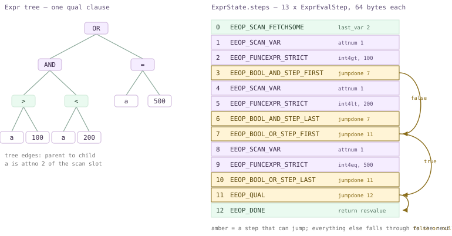

*An Expr tree for `WHERE (a &gt; 100 AND a &lt; 200) OR a = 500` and the 13-step array it compiles to. Amber steps are the ones that can jump; the arrows are the short-circuit paths.*

Read the array top to bottom and the design becomes obvious. There is no recursion at run time and no node-type test: step 1 pulls `a` out of the scan slot, step 2 calls `int4gt`, step 3 decides whether the rest of the `AND` can be skipped. The short circuit is not a `return` from a recursive call — it is an *index*: step 3 carries `jumpdone = 7`, the step just past the last conjunct.

:::note

**How the step arrays in this section were obtained.** There is no SQL view of a compiled expression, so I attached `gdb` to a backend on segment 0 (opened with `PGOPTIONS='-c gp_role=utility' psql -p 7102`), broke on `ExecReadyInterpretedExpr` — which is called with the array fully built — and walked `state->steps`, printing `(ExprEvalOp) opcode` and the relevant `d`-union fields. Every listing below is that printf output, trimmed. A utility-mode segment session compiles quals exactly the way a QE does, and it is a single process, which makes it a much better laboratory than the coordinator.

:::

### 18.5.1 From tree to step array

There are three public front doors, and they differ only in what they wrap around the same recursive walk: `ExecInitExpr` (`execExpr.c:138`) for a scalar expression, `ExecInitQual` (`:225`) for an implicit-AND list of clauses, and `ExecBuildProjectionInfo` (`:369`) for a target list. Each one makes an `ExprState`, calls the recursive `ExecInitExprRec` (`:901`), appends a final `EEOP_DONE`, and calls `ExecReadyExpr`.

```c title="src/backend/executor/execExpr.c:148"
	/* Initialize ExprState with empty step list */
	state = makeNode(ExprState);
	state->expr = node;
	state->parent = parent;
	/* Insert setup steps as needed */
	ExecCreateExprSetupSteps(state, (Node *) node);
	/* Compile the expression proper */
	ExecInitExprRec(node, state, &state->resvalue, &state->resnull);
	/* Finally, append a DONE step */
	scratch.opcode = EEOP_DONE;
	ExprEvalPushStep(state, &scratch);
	ExecReadyExpr(state);
```

`ExecInitExprRec` is a big `switch` on `nodeTag`, one arm per `Expr` kind, and each arm fills in a stack-local scratch `ExprEvalStep` and hands it to `ExprEvalPushStep` (`:2626`), which memcpy's it into a doubling array. Note the two pointers passed down the recursion: `resv`/`resnull` say *where this subexpression must leave its answer*. At the top they are `&state->resvalue` / `&state->resnull` — the `ExprState`'s own scratch slot — and a function call passes its argument slots instead, so a nested call writes its result straight into its parent's `FunctionCallInfo`. That is the whole calling convention: no stack, just pre-wired destinations.

An `ExprEvalStep` is an opcode plus those two result pointers plus a union of per-opcode payloads (`execExpr.h:274`). The union is deliberately capped so the struct fits one cache line — and it does: `gdb -batch -ex 'p sizeof(ExprEvalStep)'` on this build prints `64`.

*The step array compiled for a two-clause WHERE (segment 0, utility mode, gdb)*

```sql
-- gdb: break ExecReadyInterpretedExpr, then walk state->steps
SELECT count(*) FROM m185_t WHERE a > 100 AND s = 'row5';
```

```text {15} title="output"
Breakpoint 1.1, ExecReadyInterpretedExpr (state=0x55fdc0115f88)
=== steps_len=8 flags=1
step  0  EEOP_SCAN_FETCHSOME
step  1  EEOP_SCAN_VAR
step  2  EEOP_FUNCEXPR_STRICT
step  3  EEOP_QUAL
step  4  EEOP_SCAN_VAR
step  5  EEOP_FUNCEXPR_STRICT
step  6  EEOP_QUAL
step  7  EEOP_DONE

-- second pass over the same ExprState, printing the union payloads:
step0 last_var=3 fixed=1
step1 attnum=1        step4 attnum=2
step2 fn_oid=147 nargs=2 args[1].value=100 args[1].isnull=0
step5 fn_oid=67  nargs=2 fn_strict=1
step3 jumpdone=7      step6 jumpdone=7
```

Several things in that dump are worth slowing down for. `flags=1` is `EEO_FLAG_IS_QUAL` (`execnodes.h:78`), set by `ExecInitQual` so `ExecQual` can assert it later. `fn_oid=147` and `67` are `int4gt` and `texteq`. Step 0 is a *setup* step: one `slot_getsomeattrs` up to attribute 3, hoisted out in front of everything so the interpreter never has to deform the tuple twice. And there is no `EEOP_CONST` step for the literal `100` — look at where it ended up instead.

```c title="src/backend/executor/execExpr.c:2715"
		if (IsA(arg, Const))
		{
			/*
			 * Don't evaluate const arguments every round; especially
			 * interesting for constants in comparisons.
			 */
			Const	   *con = (Const *) arg;

			fcinfo->args[argno].value = con->constvalue;
			fcinfo->args[argno].isnull = con->constisnull;
		}
```

A constant argument is written into the function's `FunctionCallInfo` at compile time and never touched again — which is why `args[1].value` already reads `100` before a single tuple has been examined. `ExecInitFunc` (`:2652`) then picks the opcode; we come back to that choice in [§18.5](#185-expression-evaluation).3.

### 18.5.2 Jumps are patched in afterwards

A flat array cannot know its own jump targets while it is being built: the target of `AND`'s short circuit is *the step after the last conjunct*, and that index does not exist yet. So every jump is pushed with a placeholder `-1`, its own index is remembered in a list, and the list is walked once the group is complete. `ExecInitQual` is the shortest example of the pattern.

```c title="src/backend/executor/execExpr.c:264"
	foreach(lc, qual)
	{
		Expr	   *node = (Expr *) lfirst(lc);
		/* first evaluate expression */
		ExecInitExprRec(node, state, &state->resvalue, &state->resnull);
		/* then emit EEOP_QUAL to detect if it's false (or null) */
		scratch.d.qualexpr.jumpdone = -1;
		ExprEvalPushStep(state, &scratch);
		adjust_jumps = lappend_int(adjust_jumps, state->steps_len - 1);
	}
	/* adjust jump targets */
	foreach(lc, adjust_jumps)
	{
		ExprEvalStep *as = &state->steps[lfirst_int(lc)];
		Assert(as->d.qualexpr.jumpdone == -1);
		as->d.qualexpr.jumpdone = state->steps_len;
	}
```

That also explains the `jumpdone=7` on *both* `EEOP_QUAL` steps of the previous dump: the fixup runs before `EEOP_DONE` is appended, so `state->steps_len` is exactly the index `DONE` will get. Every clause that fails jumps to the same place. And notice what a top-level `AND` actually became — not `BOOL_AND` steps at all. The planner delivers `WHERE` as an implicit-AND *list*, and `ExecInitQual` emits one cheap `EEOP_QUAL` per element; the comment at `:249` says why it is worth a dedicated opcode rather than reusing `BOOL_AND` (a qual only ever needs *false or null → false*, so it needs no three-valued bookkeeping).

You get real `BOOL_*` steps when an `AND` survives inside a larger boolean expression. `ExecInitExprRec`'s `T_BoolExpr` arm (`:1399`) splits `AND`/`OR` into `_STEP_FIRST` / `_STEP` / `_STEP_LAST` variants — the first resets the shared `anynull` flag, which is `palloc`'d once per `BoolExpr` node at `:1409` — and applies the same fixup loop at `:1473`. This is the expression drawn in the figure.

*A nested OR of ANDs: BOOL steps and their patched jump targets*

```sql
-- same gdb recipe
SELECT count(*) FROM m185_t WHERE (a > 100 AND a < 200) OR a = 500;
```

```text {5} title="output"
=== steps_len=13 flags=1
step  0  EEOP_SCAN_FETCHSOME       last_var=2
step  1  EEOP_SCAN_VAR             attnum=1
step  2  EEOP_FUNCEXPR_STRICT      fn_oid=147   (int4gt)
step  3  EEOP_BOOL_AND_STEP_FIRST  jumpdone=7   anynull=0x55fdc01ef3f0
step  4  EEOP_SCAN_VAR             attnum=1
step  5  EEOP_FUNCEXPR_STRICT      fn_oid=66    (int4lt)
step  6  EEOP_BOOL_AND_STEP_LAST   jumpdone=7
step  7  EEOP_BOOL_OR_STEP_FIRST   jumpdone=11  anynull=0x55fdc01eefc8
step  8  EEOP_SCAN_VAR             attnum=1
step  9  EEOP_FUNCEXPR_STRICT      fn_oid=65    (int4eq)
step 10  EEOP_BOOL_OR_STEP_LAST    jumpdone=11
step 11  EEOP_QUAL                 jumpdone=12
step 12  EEOP_DONE
```

The two `AND` steps share one `anynull` cell and one target, 7 — the enclosing `OR` step that consumes their verdict. For step 3 that jump skips two real steps; for step 6 the target happens to be the next step, so the jump is indistinguishable from falling through. The `OR` pair behaves the same way with target 11. Nothing here is specific to Cloudberry: this is the same array a single-node PostgreSQL would build, compiled independently by each of the three QEs.

### 18.5.3 The opcode vocabulary

`enum ExprEvalOp` in `src/include/executor/execExpr.h:66` holds **100 opcodes** plus the `EEOP_LAST` sentinel. Their *order* is load-bearing: the interpreter's dispatch table is a positional array, and `execExprInterp.c:516` has a `StaticAssertDecl` that its length equals `EEOP_LAST + 1`, so adding an opcode in the wrong place is a compile error rather than a mystery crash.

| Family | Members (count) | What they do |
| --- | --- | --- |
| slot access | `EEOP_INNER/OUTER/SCAN_FETCHSOME`, `_VAR`, `_SYSVAR`, `EEOP_WHOLEROW` (10) | Deform a slot up to attribute *n*, then read one attribute out of the inner, outer or scan tuple — the three slots an `ExprContext` offers ([§18.1](#181-executor-framework--lifecycle)) |
| result assignment | `EEOP_ASSIGN_INNER/OUTER/SCAN_VAR`, `EEOP_ASSIGN_TMP[_MAKE_RO]` (5) | Write a column of the *result* slot; used only by projections |
| constants | `EEOP_CONST` (1) | Copy a `Const` into the result location |
| function calls | `EEOP_FUNCEXPR`, `_STRICT`, `_FUSAGE`, `_STRICT_FUSAGE` (4) | Call one `pg_proc` function through its cached `FmgrInfo` |
| control flow | `EEOP_BOOL_AND/OR_STEP{,_FIRST,_LAST}`, `EEOP_BOOL_NOT_STEP`, `EEOP_QUAL`, `EEOP_JUMP{,_IF_NULL,_IF_NOT_NULL,_IF_NOT_TRUE}`, `EEOP_DONE` (13) | The only steps that do not simply fall through |
| tests | `EEOP_NULLTEST_*` (4), `EEOP_BOOLTEST_*` (4) | `IS NULL`, `IS TRUE` and friends, inline |
| parameters | `EEOP_PARAM_EXEC/EXTERN/CALLBACK` (3) | `$n` from a prepared statement ([§13.2](./ch13.md#132-the-extended-query-protocol)) or from an outer query's SubPlan ([§18.6](#186-subqueries--other-nodes)) |
| aggregate support | `EEOP_AGG_*` (15) plus `EEOP_AGGREF`, `EEOP_GROUPING_FUNC`, `EEOP_AGGEXPR_ID` (18) | The per-group transition calls `nodeAgg.c` builds with `ExecBuildAggTrans` — see [§18.3](#183-sort--aggregate-nodes) |
| everything else | `EEOP_IOCOERCE`, `EEOP_ARRAYEXPR`, `EEOP_ROWCOMPARE_*`, `EEOP_MINMAX`, `EEOP_FIELDSELECT`, `EEOP_SBSREF_*`, `EEOP_DOMAIN_*`, `EEOP_XMLEXPR`, `EEOP_JSON_CONSTRUCTOR`, `EEOP_IS_JSON`, `EEOP_WINDOW_FUNC`, `EEOP_SUBPLAN`, … | One arm each in the interpreter, most of them delegating to an exported `ExecEval*` helper |

Why so many near-duplicates? Because specialization *is* the performance argument for this design. Compare the two function-call opcodes: a strict function must reject null arguments, a non-strict one must not, and that decision is fixed at compile time — so it becomes two opcodes and the interpreter never tests strictness per tuple.

```c title="src/backend/executor/execExprInterp.c:752"
		EEO_CASE(EEOP_FUNCEXPR_STRICT)
		{
			FunctionCallInfo fcinfo = op->d.func.fcinfo_data;
			NullableDatum *args = fcinfo->args;
			int			nargs = op->d.func.nargs;

			/* strict function, so check for NULL args */
			for (int argno = 0; argno < nargs; argno++)
				if (args[argno].isnull) { *op->resnull = true; goto strictfail; }
			fcinfo->isnull = false;
			*op->resvalue = op->d.func.fn_addr(fcinfo);
			*op->resnull = fcinfo->isnull;
	strictfail:
			EEO_NEXT();
```

The choice is made once, in `ExecInitFunc` (`execExpr.c:2735`): strict *and* has arguments *and* function-usage statistics are not being collected gives `EEOP_FUNCEXPR_STRICT`. Every combination gets its own opcode so the run-time path holds no branch that was already decidable.

Cloudberry adds six opcodes of its own to this enum, and they are a fair summary of what an MPP executor needs beyond PostgreSQL: `EEOP_GROUP_ID` and `EEOP_GROUPING_SET_ID` implement the `GROUP_ID()` / grouping-set bookkeeping that survives two-stage aggregation, `EEOP_AGGEXPR_ID` tags a split tuple with the aggregate it belongs to (the multi-DQA machinery of [§18.3](#183-sort--aggregate-nodes)), `EEOP_ROWIDEXPR` stamps a unique id on rows before a dedup-semi broadcast ([§18.4](#184-join-nodes)), and `EEOP_SCALARARRAYOP_FAST_INT` / `_FAST_STR` are a fast path for `IN` lists. Both fire on a plain query.

*Cloudberry's IN-list opcodes, live*

```sql
-- gdb, same recipe; s is text, a is int4
SELECT count(*) FROM m185_s WHERE s IN ('v7','v8','v9') AND a IN (70,80,90);
```

```text {4} title="output"
=== expr steps_len=8 flags=1
  step  0  EEOP_SCAN_FETCHSOME
  step  1  EEOP_SCAN_VAR                  attnum=2
  step  2  EEOP_SCALARARRAYOP_FAST_STR    opfuncid=67   (texteq)
  step  3  EEOP_QUAL                      jumpdone=7
  step  4  EEOP_SCAN_VAR                  attnum=1
  step  5  EEOP_SCALARARRAYOP_FAST_INT    opfuncid=65   (int4eq)
  step  6  EEOP_QUAL                      jumpdone=7
  step  7  EEOP_DONE
```

`ExecInitScalarArrayOpFastPath` (`execExpr.c:3517`) accepts the case only when the array side is a non-null `Const`, the operator is one of `int2eq`/`int4eq`/`int8eq`/`date_eq`/`texteq`/`bpchareq`, and — for the text cases — the collation is one `memcmp` can honour. It then deconstructs the array *once* at compile time into a plain `Datum` array, and `ExecEvalScalarArrayOpFastInt` (`execExprInterp.c:3627`) loops over it comparing Datums directly, with no `FunctionCallInvoke` per element. Upstream PostgreSQL 16 instead converts large `IN` lists into `EEOP_HASHED_SCALARARRAYOP`; both opcodes exist here, side by side.

### 18.5.4 Interpretation: computed goto

`ExecInterpExpr` (`execExprInterp.c:400`) is one enormous function containing one block per opcode, and it can be compiled two ways. Portably, the blocks are `case` labels of a `switch` inside a loop — *switch threading*. On GCC and Clang, the blocks are ordinary labels whose *addresses* are taken (the label-as-value extension), each block ends by jumping straight to the next block's address, and the central `switch` disappears entirely — *direct threading*. The file's header comment (`:6`) calls the latter one of the fastest known ways to interpret a program without writing assembly, because the jumps issue from many sites instead of one and so branch prediction has something to work with.

```c title="src/backend/executor/execExprInterp.c:122"
#define EEO_SWITCH()
#define EEO_CASE(name)		CASE_##name:
#define EEO_DISPATCH()		goto *((void *) op->opcode)
#define EEO_OPCODE(opcode)	((intptr_t) dispatch_table[opcode])

#else							/* !EEO_USE_COMPUTED_GOTO */

#define EEO_SWITCH()		starteval: switch ((ExprEvalOp) op->opcode)
#define EEO_CASE(name)		case name:
#define EEO_DISPATCH()		goto starteval
#define EEO_OPCODE(opcode)	(opcode)
```

`EEO_USE_COMPUTED_GOTO` is defined if and only if `HAVE_COMPUTED_GOTO` is (`:92`), and on this build — GCC 12.2.1 — `pg_config.h:120` reads `#define HAVE_COMPUTED_GOTO 1`, in the installed tree as well as the source tree. So direct threading is genuinely in force here, and you can watch it happen: `ExecReadyInterpretedExpr` overwrites each `opcode` field with the address of its code block and sets `EEO_FLAG_DIRECT_THREADED` (`:370`–`:383`).

*The same step, before and after the array is made ready*

```sql
-- gdb: print steps[3].opcode at ExecReadyInterpretedExpr entry,
-- then again at the first evaluation (ExecInterpExprStillValid)
SELECT count(*) FROM m185_s WHERE a > 100 AND s = 'v18';
```

```text {1} title="output"
at ExecReadyInterpretedExpr entry: flags=1  steps[3].opcode=28
at first evaluation:  flags=7  steps[3].opcode=0x55fdb69efa84  decoded=EEOP_QUAL
  steps[0].opcode=0x55fdb69f01e3 decoded=EEOP_SCAN_FETCHSOME
  evalfunc_private=0x55fdb69ef910          <-- == &ExecInterpExpr
```

`28` is the ordinal of `EEOP_QUAL` in the enum; a moment later the same field holds a code address inside the postgres text segment, and `flags` has gone from `1` to `7` — `IS_QUAL | INTERPRETER_INITIALIZED | DIRECT_THREADED`. Because the numbers are gone, anything that needs the opcode back (`EXPLAIN`, the JIT provider, this debugging session) has to ask `ExecEvalStepOp` (`:2459`), which `bsearch`es a reverse table built at first use by `ExecInitInterpreter` (`:2427`) — and that function gets the dispatch table by calling `ExecInterpExpr(NULL, NULL, NULL)`, a special case that returns the address of the table instead of evaluating anything.

Making an expression ready is thus a small decision tree, and its most interesting branch is the one *before* threading: for the tiniest expressions even entering the interpreter is measurable, so `ExecReadyInterpretedExpr` recognizes fourteen exact 2- and 3-step patterns and installs a hand-written C function instead (`:279`–`:367`).

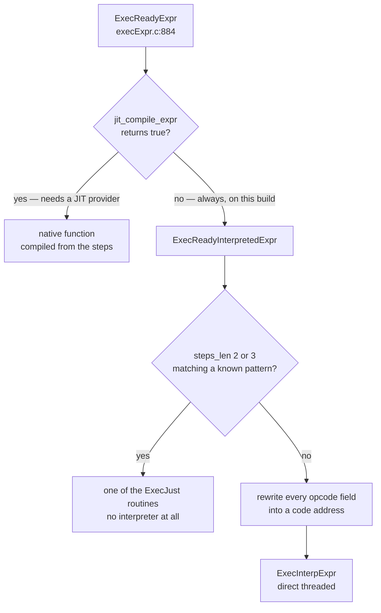

*ExecReadyExpr: three possible fates for a compiled step array*

`ExecJustScanVar`, `ExecJustAssignOuterVar`, `ExecJustConst`, `ExecJustApplyFuncToCase` and their `…Virt` cousins (for slots that are already virtual and need no deform step) each inline exactly what their pattern does. A single-column projection is precisely such a pattern, and the split is visible if you simply count function entries.

*Who evaluates what: breakpoint hit counts on segment 0 (12 rows there, 9 pass the qual)*

```sql
-- gdb: break ExecJust*, ExecInterpExpr with huge ignore counts,
-- run to ExecutorEnd, then: info breakpoints
SELECT s FROM m185_s WHERE a > 50;
```

```text {2} title="output"
2       breakpoint  in ExecJustAssignScanVar at execExprInterp.c:2267
	breakpoint already hit 9 times
6       breakpoint  in ExecInterpExpr at execExprInterp.c:519
	breakpoint already hit 12 times
7       breakpoint  in ExecutorEnd at execMain.c:1242
	breakpoint already hit 1 time
```

Twelve interpreter entries — one qual evaluation per tuple the segment stored — and nine fast-path entries, one projection per tuple that survived. Change the target list to two columns and the projection stops matching a `Just` pattern: the same query with `SELECT a, s` shows 21 `ExecInterpExpr` hits and no fast-path hits at all. That is the entire cost model of this subsystem in two numbers.

### 18.5.5 Quals, projection, and the per-tuple context

Callers never touch steps. They use two inline wrappers in `src/include/executor/executor.h`: `ExecQual` (`:460`), which asserts the `IS_QUAL` flag and returns `DatumGetBool` of the result, and `ExecProject` (`:423`), which evaluates a projection and marks the result slot as a valid virtual tuple. Both go through `ExecEvalExprSwitchContext` (`:395`), which does the one thing every expression evaluation must do first.

```c title="src/include/executor/executor.h:395"
ExecEvalExprSwitchContext(ExprState *state, ExprContext *econtext,
						  bool *isNull)
{
	Datum		retDatum;
	MemoryContext oldContext;

	oldContext = MemoryContextSwitchTo(econtext->ecxt_per_tuple_memory);
	retDatum = state->evalfunc(state, econtext, isNull);
	MemoryContextSwitchTo(oldContext);
	return retDatum;
}
```

Expression results are allocated in `ecxt_per_tuple_memory` and are freed *en masse* by `ResetExprContext` (`:593`) once per tuple — `ExecQualAndReset` (`:487`) even fuses the two operations for hot callers. This is why a leaking expression is hard to write and why `text` concatenation in a target list does not accumulate: nobody frees anything, the context is simply thrown away. The `ExprContext` itself belongs to the `PlanState`, so [§18.1](#181-executor-framework--lifecycle) owns it.

`EXPLAIN (VERBOSE)` is the SQL-level view of the two `ExprState`s: `Filter` is the qual, `Output` is the projection's target list. Note that the `Gather Motion` above has an `Output` list of its own — a Motion projects too (Chapter 19).

*The qual and the projection, as EXPLAIN shows them (PostgreSQL planner)*

```sql
SET optimizer = off;
EXPLAIN (VERBOSE, COSTS OFF)
  SELECT id, a*2 AS dbl, upper(s) AS us FROM m185_t
   WHERE a > 100 AND s = 'row5';
```

```text {7} title="output"
                            QUERY PLAN
------------------------------------------------------------------
 Gather Motion 3:1  (slice1; segments: 3)
   Output: id, ((a * 2)), (upper(s))
   ->  Seq Scan on public.m185_t
         Output: id, (a * 2), upper(s)
         Filter: ((m185_t.a > 100) AND (m185_t.s = 'row5'::text))
 Settings: optimizer = 'off'
 Optimizer: Postgres query optimizer
```

That target list compiles to six steps, and it shows off `ExecBuildProjectionInfo`'s own specialization: a plain, type-safe `Var` becomes a single `EEOP_ASSIGN_SCAN_VAR` that copies straight from input slot to output slot (`execExpr.c:435`), while a computed column evaluates into `resvalue` and is then moved by `EEOP_ASSIGN_TMP`. Variable-length results get `EEOP_ASSIGN_TMP_MAKE_RO` instead (`:479`), because an upper node may reference the column more than once and must not be handed a writable expanded datum. Compiling `SELECT a, upper(s)` yields exactly that: `SCAN_FETCHSOME, ASSIGN_SCAN_VAR, SCAN_VAR, FUNCEXPR_STRICT, ASSIGN_TMP_MAKE_RO, DONE`.

How much does all this cost? Compare two scans of the same 300 000-row table whose quals accept *every* row, so the two plans differ in nothing but the work per tuple.

*Same plan, same rows, different qual: expression evaluation as the whole difference*

```sql
SET optimizer = off;
EXPLAIN (ANALYZE, COSTS OFF) SELECT count(*) FROM m185_t WHERE a >= 0;
EXPLAIN (ANALYZE, COSTS OFF)
  SELECT count(*) FROM m185_t WHERE length(md5(s||s||s)) >= 0;
```

```text {15} title="output"
 Finalize Aggregate (actual time=30.094..30.096 rows=1 loops=1)
   ->  Gather Motion 3:1  (slice1; segments: 3) (actual ... rows=3 loops=1)
         ->  Partial Aggregate (actual time=19.241..19.242 rows=1 loops=1)
               ->  Seq Scan on m185_t (actual time=0.093..21.537 rows=100172 loops=1)
                     Filter: (a >= 0)
 ...
 Execution Time: 31.211 ms

 Finalize Aggregate (actual time=165.026..165.029 rows=1 loops=1)
   ->  Gather Motion 3:1  (slice1; segments: 3) (actual ... rows=3 loops=1)
         ->  Partial Aggregate (actual time=130.550..130.551 rows=1 loops=1)
               ->  Seq Scan on m185_t (actual time=0.642..157.476 rows=100172 loops=1)
                     Filter: (length(md5(((s || s) || s))) >= 0)
 ...
 Execution Time: 165.664 ms
```

Identical row counts, identical node shapes, and a factor of **5.3** between them; repeating each three times and taking the best gives 22.4 ms against 141.2 ms, a factor of **6.3**. Four extra `EEOP_FUNCEXPR_STRICT` steps per tuple — two `textcat`, one `md5`, one `length` — dominate a sequential scan of 100 000 rows per segment. The dispatch machinery this section describes is not what costs; the functions it dispatches to are.

:::note

Ratios only, please. This build is `--enable-cassert` (`debug_assertions` = on), which taxes exactly this code path — the interpreter is full of `Assert`s. Two numbers measured back-to-back on one machine are comparable to each other and to nothing else.

:::

### 18.5.6 Hashing and grouping support

One more consumer of compiled expressions deserves naming, because two other sections depend on it. `src/backend/executor/execGrouping.c` (570 lines) provides the `TupleHashTable` used by hash aggregation ([§18.3](#183-sort--aggregate-nodes)), hashed `SubPlan`s ([§18.6](#186-subqueries--other-nodes)), `SetOp` and `RecursiveUnion`. `execTuplesHashPrepare` (`:98`) turns a list of equality *operators* into equality function OIDs plus hash function `FmgrInfo`s, and `BuildTupleHashTableExt` (`:156`) then asks the expression compiler for the comparison.

```c title="src/backend/executor/execGrouping.c:237"
	/* build comparator for all columns */
	hashtable->tab_eq_func = ExecBuildGroupingEqual(inputDesc, inputDesc,
													NULL, &TTSOpsMinimalTuple,
													numCols,
													keyColIdx, eqfuncoids, collations,
													allow_jit ? parent : NULL);
```

`ExecBuildGroupingEqual` (`execExpr.c:4224`) builds an `ExprState` that compares the `ExprContext`'s inner and outer tuples with *not-distinct* semantics — two nulls match — and is invoked through `ExecQual`, since a comparison is just a boolean expression. Hashing itself is not compiled in PostgreSQL 16: `TupleHashTableHash_internal` (`:435`) rotates and xors the per-column `FunctionCall1Coll` results, then perturbs them with `murmurhash32`. Note the `allow_jit ? parent : NULL` argument — passing a NULL parent is how a caller deliberately *forbids* JIT for an expression whose lifetime does not match the JIT context (`:229`).

### 18.5.7 Set-returning functions

A function in a target list that returns a *set* breaks the one-value-per-step contract, so since PostgreSQL 10 it does not live in an ordinary projection at all: the planner interposes a `ProjectSet` node, and guarantees that set-returning functions sit *directly* at the top level of its target list, adding more `ProjectSet` nodes if it must (`nodeProjectSet.c:8`). `ExecProjectSRF` (`:140`) evaluates each element, watching for `ExprMultipleResult` (more rows to come from this input tuple) and `ExprEndResult` (this one is exhausted), and only advances its child when every SRF has ended.

*An SRF in the target list is a ProjectSet node; in FROM it is a Function Scan*

```sql
SET optimizer = off;
EXPLAIN (COSTS OFF) SELECT id, generate_series(1, a % 3 + 1) AS g
                      FROM m185_s WHERE id <= 3;
EXPLAIN (COSTS OFF) SELECT * FROM generate_series(1,3) g;
```

```text {5} title="output"
                      QUERY PLAN
-------------------------------------------------------
 Gather Motion 3:1  (slice1; segments: 3)
   Output: id, (generate_series(1, ((a % 3) + 1)))
   ->  ProjectSet
         Output: id, generate_series(1, ((a % 3) + 1))
         ->  Seq Scan on public.m185_s
               Filter: (m185_s.id <= 3)

             QUERY PLAN
-------------------------------------
 Function Scan on generate_series g
 Optimizer: Postgres query optimizer
```

The two paths meet in `src/backend/executor/execSRF.c`, and they support the two return protocols of `ReturnSetInfo` differently. `ExecMakeFunctionResultSet` (`:502`), the target-list path, allows only `SFRM_ValuePerCall` and `SFRM_Materialize` (`:599`): a C function like `generate_series` is re-entered once per row, while a PL/pgSQL function fills a tuplestore and the caller drains it (`:645`, `:666`). `ExecMakeTableFunctionResult` (`:102`), the `FROM` path, additionally offers `SFRM_Materialize_Preferred` and `_Random` (`:151`), because a `Function Scan` may want to rescan. `ProjectSet` under ORCA is the same node — this plan shape is not optimizer-specific.

### 18.5.8 JIT: what it would do, and why it does nothing here

There is a fourth way to run a step array. PostgreSQL can hand it to an LLVM back end that emits native code for *this* expression: `llvm_compile_expr` (`src/backend/jit/llvm/llvmjit_expr.c:78`) creates one LLVM basic block per step (`:263`), asks `ExecEvalStepOp` for each opcode (`:279`), and emits the block's logic inline, branching to the next block. The interpreter's dispatch — the one thing the flat array was designed to make cheap — vanishes completely, along with the per-step pointer indirections; complex opcodes still call the same exported `ExecEval*` helpers, which is exactly why `execExprInterp.c` exports them (`:41` in its header comment).

The wiring runs through two decisions. The planner sets `PlannedStmt.jitFlags` (`planner.c:831`) if `jit` is on and the top plan's total cost exceeds `jit_above_cost`, adding `PGJIT_OPT3` / `PGJIT_INLINE` above their own thresholds and `PGJIT_EXPR` / `PGJIT_DEFORM` per GUC; then `ExecReadyExpr` calls `jit_compile_expr` (`jit.c:153`), which checks those flags and asks `provider_init` to load the provider shared library.

*The honest readback: jit is on, JIT is not available*

```sql
SELECT name, setting FROM pg_settings WHERE name LIKE 'jit%' ORDER BY 1;
SELECT pg_jit_available();
-- shell:
ls $GPHOME/lib/postgresql/ | grep -i llvm
pg_config --configure
```

```text {14} title="output"
          name           | setting
-------------------------+---------
 jit                     | on
 jit_above_cost          | 100000
 jit_expressions         | on
 jit_inline_above_cost   | 500000
 jit_optimize_above_cost | 500000
 jit_provider            | llvmjit
 jit_tuple_deforming     | on
 (jit_debugging_support, jit_dump_bitcode, jit_profiling_support = off)

 pg_jit_available
------------------
 f

$ ls $GPHOME/lib/postgresql/ | grep -i llvm      # no output
$ pg_config --configure
 '--prefix=/usr/local/cloudberry-db' '--enable-debug' '--enable-cassert'
 '--enable-depend' '--with-lz4' '--with-zstd' '--with-gssapi' '--enable-orafce'
 '--enable-ic-proxy' '--enable-orca' '--enable-gpcloud' '--with-libxml' ...
 # no --with-llvm
```

That is the cleanest possible evidence: `--with-llvm` was never passed, so `llvmjit.so` was never built, so `provider_init` (`jit.c:68`) fails its `file_exists` check on `$pkglibdir/llvmjit.so` (`:91`), records `provider_failed_loading` so it never retries, and `jit_compile_expr` returns false. Every expression on this cluster falls through to `ExecReadyInterpretedExpr`. `pg_jit_available()` is literally that check, exposed as a function (`:59`).

*Forcing the threshold to zero changes nothing observable*

```sql
SET optimizer = off;
SET jit_above_cost = 0;   -- session-local; every plan is now flagged for JIT
EXPLAIN (ANALYZE, COSTS OFF, TIMING OFF)
  SELECT count(*) FROM m185_t WHERE length(md5(s||s||s)) >= 0;
```

```text {9} title="output"
 Finalize Aggregate (actual rows=1 loops=1)
   ->  Gather Motion 3:1  (slice1; segments: 3) (actual rows=3 loops=1)
         ->  Partial Aggregate (actual rows=1 loops=1)
               ->  Seq Scan on m185_t (actual rows=100172 loops=1)
                     Filter: (length(md5(((s || s) || s))) >= 0)
 Planning Time: 1.148 ms
 Memory used:  128000kB
 Optimizer: Postgres query optimizer
 Execution Time: 138.518 ms      -- no "JIT:" section anywhere
```

With `jit_above_cost = 0` the `PlannedStmt` really does carry `PGJIT_PERFORM | PGJIT_EXPR | PGJIT_DEFORM`, and `EXPLAIN ANALYZE` still prints no `JIT:` block — because `ExplainPrintJIT` returns immediately when no functions were created (`explain.c:1214`), and none were. The execution time is unchanged, within noise, from the un-flagged run in [§18.5](#185-expression-evaluation).5.

:::note

**Stated plainly:** I could not exercise JIT on this build. Everything above about `llvm_compile_expr` is read from the source in `src/backend/jit/llvm/` (5 146 lines of C, plus the C++ inliner), not measured. Any claim you read elsewhere about JIT speedups on Cloudberry needs a build configured `--with-llvm` and an `llvmjit.so` in `$GPHOME/lib/postgresql/` to be worth anything — and on an MPP cluster it needs to be measured *per segment*, since each QE would pay its own compilation cost for the same expression.

:::

That closes the value-computing half of the executor. What remains are the node types that build on it: the subquery and utility nodes of [§18.6](#186-subqueries--other-nodes), and Cloudberry's own nodes in [§18.7](#187-cloudberry-specific-nodes).

## 18.6 Subqueries & Other Nodes

The scans of [§18.2](#182-scan-nodes) read tables, the joins of [§18.4](#184-join-nodes) combine them, the aggregates of [§18.3](#183-sort--aggregate-nodes) summarise them — and yet almost no real query is made of only those. Between them sits a third population of nodes: the ones that let a plan refer to *another* plan, buffer a result so it can be read twice, iterate until a fixed point, concatenate branches, stop early, remove duplicates, or write rows back. This section is that catalogue. Two of its members are genuinely deep — the subplan/parameter machinery and the recursive-CTE loop — and they get most of the room; the rest are small nodes whose whole implementation fits on a page but whose absence would break SQL. Throughout, remember the chapter's refrain: **which of these nodes you see depends on which optimizer planned the query**, and several of them behave differently in Cloudberry than in upstream PostgreSQL because a subplan here may have to be *dispatched* ([§13.3](./ch13.md#133-dispatch-from-coordinator-plan-to-segment-execution)) before it can be evaluated.

### 18.6.1 Three ways to run a subquery

A `PlannedStmt` carries a main `planTree` and a list of `subplans`. The main tree references a subplan not by a child pointer but through a **parameter**: a slot in `EState.es_param_exec_vals`. `nodeSubplan.c` (1582 lines) implements three quite different ways of filling that slot, and people conflate them constantly:

- **InitPlan** — The subquery is *uncorrelated* — nothing inside it depends on the outer query. It is therefore evaluated **once**, its result stored into a `PARAM_EXEC` slot by `ExecSetParamPlan` (`nodeSubplan.c:1133`), and the main plan just reads `$0` like a constant. EXPLAIN labels it `InitPlan N (returns $0)`.
- **SubPlan** — The subquery is *correlated*: it has `parParam` values pushed in from the outer tuple. `ExecScanSubPlan` (`nodeSubplan.c:235`) sets those parameters, calls `ExecReScan` on the subplan (`:283`), and runs it **again for every outer tuple**. EXPLAIN labels it `SubPlan N`, and the giveaway is a `loops=N` greater than 1 on the nodes underneath it.
- **hashed SubPlan** — An `IN`/`NOT IN` (`ANY_SUBLINK`) whose right-hand side is uncorrelated. `buildSubPlanHash` (`nodeSubplan.c:523`) drains the subquery **once** into a `TupleHashTable` built with [§18.5](#185-expression-evaluation)'s `execGrouping.c` machinery, and `ExecHashSubPlan` (`:113`) turns each test into a hash probe. EXPLAIN writes `hashed SubPlan N` inside the qual.


*A plan tree that is not a tree: the main plan and its detached subplan trees, wired through one parameter slot*

*An uncorrelated aggregate subquery becomes an InitPlan (VERBOSE Output lines trimmed)*

```sql
SET optimizer = off;
EXPLAIN (ANALYZE, VERBOSE, TIMING OFF, COSTS OFF)
  SELECT count(*) FROM m186_t WHERE val > (SELECT avg(val) FROM m186_t);
```

```text {2} title="output"
 Finalize Aggregate (actual rows=1 loops=1)
   InitPlan 1 (returns $0)  (slice2)
     ->  Finalize Aggregate (actual rows=1 loops=1)
           ->  Gather Motion 3:1  (slice3; segments: 3) (actual rows=3 loops=1)
                 ->  Partial Aggregate (actual rows=1 loops=1)
                       ->  Seq Scan on public.m186_t m186_t_1 (actual rows=66711 loops=1)
   ->  Gather Motion 3:1  (slice1; segments: 3) (actual rows=3 loops=1)
         ->  Partial Aggregate (actual rows=1 loops=1)
               ->  Seq Scan on public.m186_t (actual rows=33451 loops=1)
                     Filter: ((m186_t.val)::numeric > $0)
                     Rows Removed by Filter: 33260
 Settings: optimizer = 'off'
   (slice0)    Executor memory: 115K bytes.
   (slice1)    Executor memory: 120K bytes avg x 3x(0) workers, 120K bytes max (seg0).
   (slice2)    Executor memory: 59K bytes.
 ...
 Optimizer: Postgres query optimizer
 Execution Time: 31.517 ms
```

That `(slice2)` next to `InitPlan 1` is the Cloudberry part, and it is not decoration. Upstream PostgreSQL evaluates an InitPlan **lazily**, the first time the parameter is read: `ExecEvalParamExec` (`execExprInterp.c:2547`) notices `prm->execPlan != NULL` and calls `ExecSetParamPlan` right there, in the middle of expression evaluation. Cloudberry cannot afford that, because an InitPlan of its own may span several slices and needs a gang and an interconnect. So `ExecSetParamPlan` was rewritten to dispatch:

```c title="src/backend/executor/nodeSubplan.c:1152"
	if (Gp_role == GP_ROLE_DISPATCH && planstate != NULL &&
		planstate->plan != NULL && queryDesc)
	{
		int  subsliceIndex = queryDesc->plannedstmt->subplan_sliceIds[subplan->plan_id - 1];
		ExecSlice *subslice = &estate->es_sliceTable->slices[subsliceIndex];

		if (subslice->gangType != GANGTYPE_UNALLOCATED || subslice->children)
			shouldDispatch = true;
	}
	...
	if (shouldDispatch)
	{
		CdbDispatchPlan(queryDesc, estate->es_param_exec_vals, needDtx, true);
		CurrentMotionIPCLayer->SetupInterconnect(queryDesc->estate);   /* for the initplan's root slice */
	}
```

:::note

So an InitPlan in Cloudberry is a small query of its own: its own slice (`subplan_sliceIds[]`, `plannodes.h:125`), its own gang, its own interconnect setup and teardown, its own line in the memory footer. And because it must complete before the main plan is dispatched, it is run **eagerly**: `ExecutorRun` calls `preprocess_initplans(queryDesc)` (`execMain.c:680`) — implemented in `cdbsubplan.c:61` — before it dispatches the main plan, looping over `es_param_exec_vals` and firing every InitPlan whose slice is a root slice. Nested InitPlans work because the growing set of already-computed `PARAM_EXEC` values is re-serialised into each dispatch. This is one of the clearest places where an upstream *lazy* mechanism had to become an *eager* one to survive dispatch ([§13.3](./ch13.md#133-dispatch-from-coordinator-plan-to-segment-execution)).

:::

*A correlated scalar subquery becomes a SubPlan — and loops=5 is the whole story*

```sql
SET optimizer = off;
EXPLAIN (ANALYZE, VERBOSE, TIMING OFF, COSTS OFF)
  SELECT d.grp, (SELECT count(*) FROM m186_t t WHERE t.grp = d.grp) FROM m186_dim d;
```

```text {6} title="output"
 Gather Motion 3:1  (slice1; segments: 3) (actual rows=10 loops=1)
   Output: d.grp, ((SubPlan 1))
   ->  Seq Scan on public.m186_dim d (actual rows=5 loops=1)
         Output: d.grp, (SubPlan 1)
         SubPlan 1
           ->  Aggregate (actual rows=1 loops=5)
                 ->  Result (actual rows=20000 loops=5)
                       Filter: (t.grp = d.grp)
                       ->  Materialize (actual rows=200000 loops=5)
                             work_mem: 34270kB  Segments: 3  Max: 11424kB (segment 0)  Workfile: (0 spilling)
                             ->  Broadcast Motion 3:3  (slice2; segments: 3) (actual rows=200000 loops=1)
                                   ->  Seq Scan on public.m186_t t (actual rows=66711 loops=1)
 ...
 Optimizer: Postgres query optimizer
 Execution Time: 445.614 ms
```

Read the `loops` column downward: the `Aggregate` and the `Result` ran **5 times** (once per `m186_dim` row on this segment), but the `Broadcast Motion` beneath them ran **once**. That difference is entirely due to the `Materialize` sitting between them — [§18.6](#186-subqueries--other-nodes).2's subject. Without it, every outer tuple would re-open a motion, and re-running a motion 5 times is not merely slow, it is the kind of thing that deadlocks an interconnect. Note also that per-node `rows` are *per-loop averages*: `Result` reports 20 000 with `loops=5`, i.e. 100 000 tuples pulled from the tuplestore in total, all so that a `count(*)` could be filtered down to one row each time. A correlated subplan is the executor doing exactly what the SQL text asked and nothing more.

*An IN-subquery that cannot be pulled up becomes a hashed SubPlan: built once, probed 66 711 times*

```sql
SET optimizer = off;
EXPLAIN (ANALYZE, VERBOSE, TIMING OFF, COSTS OFF)
  SELECT count(*) FROM m186_t t
   WHERE t.val < 0 OR t.grp IN (SELECT grp FROM m186_dim WHERE label <> 'g3');
```

```text {5} title="output"
 Finalize Aggregate (actual rows=1 loops=1)
   ->  Gather Motion 3:1  (slice1; segments: 3) (actual rows=3 loops=1)
         ->  Partial Aggregate (actual rows=1 loops=1)
               ->  Seq Scan on public.m186_t t (actual rows=60006 loops=1)
                     Filter: ((t.val < 0) OR (hashed SubPlan 1))
                     Rows Removed by Filter: 6647
                     SubPlan 1
                       ->  Broadcast Motion 3:3  (slice2; segments: 3) (actual rows=9 loops=1)
                             ->  Seq Scan on public.m186_dim (actual rows=4 loops=1)
                                   Filter: (m186_dim.label <> 'g3'::text)
 ...
 Optimizer: Postgres query optimizer
 Execution Time: 31.633 ms
```

The `OR` is what keeps the subquery from being flattened into a semi-join; the planner's consolation prize is to hash it. `loops=1` on the motion proves the subquery ran once. What `buildSubPlanHash` builds is actually **two** hash tables: `node->hashtable` for rows with no NULLs and `node->hashnulls` for rows containing one (`nodeSubplan.c:561` and `:589`). That is not tidiness, it is `IN`'s three-valued logic: a probe that misses `hashtable` must still ask `findPartialMatch` (`:763`) whether some row could have matched had a NULL been a value, in which case the answer is NULL rather than false. `NOT IN` over a nullable column is slow and surprising for exactly this reason, and here is the code that makes it so.

*The same two queries under ORCA: no InitPlan, no SubPlan — the subqueries were decorrelated into joins*

```sql
SET optimizer = on;
EXPLAIN (ANALYZE, TIMING OFF, COSTS OFF)
  SELECT count(*) FROM m186_t WHERE val > (SELECT avg(val) FROM m186_t);
EXPLAIN (ANALYZE, TIMING OFF, COSTS OFF)
  SELECT d.grp, (SELECT count(*) FROM m186_t t WHERE t.grp = d.grp) FROM m186_dim d;
```

```text {4,15} title="output"
 Finalize Aggregate (actual rows=1 loops=1)
   ->  Gather Motion 3:1  (slice1; segments: 3) (actual rows=3 loops=1)
         ->  Partial Aggregate (actual rows=1 loops=1)
               ->  Nested Loop (actual rows=33451 loops=1)
                     Join Filter: ((m186_t.val)::numeric > (avg(m186_t_1.val)))
                     ->  Broadcast Motion 1:3  (slice2) (actual rows=1 loops=1)
                           ->  Finalize Aggregate (actual rows=1 loops=1)
                                 ->  Gather Motion 3:1  (slice3; segments: 3) (actual rows=3 loops=1)
                                       ->  Partial Aggregate (actual rows=1 loops=1)
                                             ->  Seq Scan on m186_t m186_t_1 (actual rows=66711 loops=1)
                     ->  Seq Scan on m186_t (actual rows=33356 loops=2)
 Optimizer: GPORCA

 Gather Motion 3:1  (slice1; segments: 3) (actual rows=10 loops=1)
   ->  Hash Left Join (actual rows=5 loops=1)
         Hash Cond: (d.grp = t.grp)
         ->  Seq Scan on m186_dim d (actual rows=5 loops=1)
         ->  Hash (actual rows=5 loops=1)
               ->  Finalize HashAggregate (actual rows=5 loops=1)
                     Group Key: t.grp
                     ->  Redistribute Motion 3:3  (slice2; segments: 3) (actual rows=15 loops=1)
                           ->  Streaming Partial HashAggregate (actual rows=10 loops=1)
                                 ->  Seq Scan on m186_t t (actual rows=66711 loops=1)
 Optimizer: GPORCA
 Execution Time: 29.462 ms
```

:::note

This is [§17.3](./ch17.md#173-transformation-framework)/[§17.5](./ch17.md#175-translation-query--dxl--plstmt) made visible: ORCA's preferred move is to **decorrelate** — the per-tuple `SubPlan` becomes a one-pass `Hash Left Join` over a pre-aggregated inner side, 445 ms down to 29 ms on this machine (a ratio on one assert-enabled build, not a benchmark). It is not that ORCA cannot emit subplans: the `OR`-guarded `IN` above still comes out as `hashed SubPlan 1` under ORCA too, wrapped in its own `Materialize`. The lesson is the one this chapter keeps repeating — **before you tune a `SubPlan`, check the `Optimizer:` footer**, because the other optimizer may not produce that node at all.

:::

### 18.6.2 Materialize: buffering a subtree

`nodeMaterial.c` (548 lines) is the executor's answer to “I am going to need to read this more than once.” It pulls tuples from its child, stashes each one in a tuplestore on the way past, and returns it; on a rescan it replays the tuplestore instead of re-executing the child. The planner inserts it on a nested loop's inner side ([§18.4](#184-join-nodes)), under a correlated subplan as we just saw, and wherever mark/restore is needed for a merge join. It is also the node that makes `ExecMaterialMarkPos` (`:385`) possible.

*Squeeze the operator memory and the tuplestore spills — on all three segments*

```sql
SET optimizer = off;
SET statement_mem = '2MB';
EXPLAIN (ANALYZE, VERBOSE, TIMING OFF, COSTS OFF)
  SELECT d.grp, (SELECT count(*) FROM m186_t t WHERE t.grp = d.grp) FROM m186_dim d;
```

```text {6} title="output"
         SubPlan 1
           ->  Aggregate (actual rows=1 loops=5)
                 ->  Result (actual rows=20000 loops=5)
                       Filter: (t.grp = d.grp)
                       ->  Materialize (actual rows=200000 loops=5)
                             work_mem: 4344kB  Segments: 3  Max: 1448kB (segment 0)  Workfile: (3 spilling)
                             Work_mem wanted: 9582K bytes avg, 9582K bytes max (seg0) to lessen workfile I/O affecting 3 workers.
                             ->  Broadcast Motion 3:3  (slice2; segments: 3) (actual rows=200000 loops=1)
 ...
 * (slice1)    Executor memory: 1103K bytes avg x 3x(0) workers, 1103K bytes max (seg0).  Work_mem: 1448K bytes max, 9582K bytes wanted.
 Memory used:  2048kB
 Memory wanted:  10181kB
 Execution Time: 690.646 ms
```

:::note

Two things to know about reading this. First, **Cloudberry does not print upstream's `Storage: Memory` / `Maximum Storage: NkB` lines** for Material — they were removed; what you get instead is the per-segment `work_mem: … Workfile: (N spilling)` line, plus the starred slice in the footer ([§18.1](#181-executor-framework--lifecycle) owns those semantics). Second, the budget here is not `work_mem` directly: `ExecMaterial` creates its tuplestore with `PlanStateOperatorMemKB(&amp;node-&gt;ss.ps)` (`nodeMaterial.c:73`), the planner's per-operator slice of `statement_mem`, which is why lowering `work_mem` alone did not make it spill and lowering `statement_mem` did.

:::

```c title="src/backend/executor/nodeMaterial.c:101"
		/*
		 * MPP: If requested, fetch all rows from subplan and put them
		 * in the tuplestore.  This decouples a middle slice's receiving
		 * and sending Motion operators to neutralize a deadlock hazard.
		 */
		if (((Material *) node->ss.ps.plan)->cdb_strict)
		{
			for (;;)
			{
				TupleTableSlot *outerslot = ExecProcNode(outerPlanState(node));
				if (TupIsNull(outerslot))
					break;
				tuplestore_puttupleslot(tuplestorestate, outerslot);
			}
			node->eof_underlying = true;
```

That flag is Cloudberry's own. A `Material` with `cdb_strict` set does not lazily buffer — it drains its entire child up front, before returning even one tuple. The planner sets it at `createplan.c:5571` and `:5848` for the case where a slice both receives from one Motion and sends to another, and could otherwise sit half-read while a peer waits ([§18.4](#184-join-nodes) describes the sibling mechanism, inner prefetch; Chapter 19 owns why an unread Motion blocks). `Materialize` is thus not only an optimisation in Cloudberry: sometimes it is a correctness device.

### 18.6.3 Recursive CTEs: iteration built from two tuplestores

`WITH RECURSIVE` is the only genuine loop in SQL, and `nodeRecursiveunion.c` (371 lines) implements it with two tuplestores and a swap. The non-recursive term is evaluated once into the **working table**. Then the recursive term runs, reading the working table through a `WorkTableScan` (`nodeWorktablescan.c`, 229 lines) and writing whatever it produces into the **intermediate table**. When the recursive term returns EOF, the intermediate table becomes the new working table, a fresh empty intermediate table is created, and the recursive term is rescanned. When an iteration produces nothing, the loop ends.

```c title="src/backend/executor/nodeRecursiveunion.c:126"
			/* done with old working table ... */
			tuplestore_end(node->working_table);

			/* intermediate table becomes working table */
			node->working_table = node->intermediate_table;
			for (int k = 1; k < node->refcount; k++)
				tuplestore_alloc_read_pointer(node->working_table, EXEC_FLAG_REWIND);

			/* create new empty intermediate table */
			node->intermediate_table = tuplestore_begin_heap(false, false, work_mem);
			node->intermediate_empty = true;

			/* reset the recursive term */
			innerPlan->chgParam = bms_add_member(innerPlan->chgParam, plan->wtParam);
```

Notice how the iteration is triggered: not by a loop counter but by poking `wtParam` into the recursive term's `chgParam`, which makes [§18.1](#181-executor-framework--lifecycle)'s `ExecReScan` machinery re-initialise the whole subtree on the next pull. The dedup check is the other half. For `UNION ALL`, `numCols` is 0 and every tuple is kept; for `UNION`, a `TupleHashTable` is built at init (`:40`) and each candidate goes through `LookupTupleHashEntry` first, so a cyclic graph terminates instead of spinning forever. Both the seed loop and the recursive loop do this check, which is why `UNION` costs you a hash table for the entire transitive closure.

*WITH RECURSIVE forces ORCA to hand the query back — and the recursion lands entirely on the coordinator*

```sql
SET optimizer = on;  SET optimizer_trace_fallback = on;
EXPLAIN (ANALYZE, TIMING OFF, COSTS OFF) WITH RECURSIVE d(node,depth) AS (
    SELECT 1, 0
  UNION ALL
    SELECT e.dst, d.depth+1 FROM m186_edge e JOIN d ON e.src = d.node WHERE d.depth < 6)
SELECT count(*), max(depth) FROM d;
```

```text {3} title="output"
INFO:  GPORCA failed to produce a plan, falling back to Postgres-based planner
DETAIL:  Falling back to Postgres-based planner because GPORCA does not support
         the following feature: WITH RECURSIVE

 Aggregate (actual rows=1 loops=1)
   ->  Recursive Union (actual rows=1093 loops=1)
         ->  Result (actual rows=1 loops=1)
         ->  Hash Join (actual rows=156 loops=7)
               Hash Cond: (d.node = e.src)
               ->  WorkTable Scan on d (actual rows=52 loops=7)
                     Filter: (depth < 6)
                     Rows Removed by Filter: 104
               ->  Hash (actual rows=40000 loops=1)
                     Buckets: 524288  Batches: 1  Memory Usage: 5659kB
                     ->  Gather Motion 3:1  (slice1; segments: 3) (actual rows=40000 loops=1)
                           ->  Seq Scan on m186_edge e (actual rows=13504 loops=1)
   (slice0)    Executor memory: 5777K bytes.  Work_mem: 5659K bytes max.
   (slice1)    Executor memory: 112K bytes avg x 3x(0) workers, 112K bytes max (seg0).
 Optimizer: Postgres query optimizer
 Execution Time: 19.874 ms
```

This is the [§17.1](./ch17.md#171-entry--dispatch) fallback confirmed live, and it has a consequence worth stating plainly: **`RecursiveUnion` and `WorkTableScan` are planner-path-only nodes.** No amount of ORCA tuning will change how a recursive query executes, because ORCA never planned it. The plan itself is worth decoding node by node, because the counters reconstruct the traversal exactly. The seed is node 1; every node in this tree has 3 children; the `depth < 6` guard cuts the recursion off after six productive iterations.

<RawFigure html={"<div style=\"font-family:ui-monospace,SFMono-Regular,Menlo,monospace;font-size:12px;overflow-x:auto\"> <div style=\"display:grid;grid-template-columns:74px 250px 250px 1fr;gap:5px 12px;align-items:center;min-width:660px\"> <div style=\"color:#555;font-weight:600\">iteration</div> <div style=\"color:#4a3a5e;font-weight:600\">working table &mdash; WorkTable Scan reads</div> <div style=\"color:#2c6a4c;font-weight:600\">intermediate table &mdash; RecursiveUnion writes</div> <div style=\"color:#555;font-weight:600\">what happens</div> <div>seed</div><div style=\"color:#999\">&mdash;</div> <div><span style=\"display:inline-block;height:9px;width:4px;background:#cfead9;border:1px solid #3f8f68\"></span> 1</div> <div style=\"color:#666\">non&#8209;recursive term: SELECT 1, 0</div> <div>1</div><div><span style=\"display:inline-block;height:9px;width:4px;background:#cdb4db\"></span> 1</div> <div><span style=\"display:inline-block;height:9px;width:8px;background:#cfead9;border:1px solid #3f8f68\"></span> 3</div><div></div> <div>2</div><div><span style=\"display:inline-block;height:9px;width:8px;background:#cdb4db\"></span> 3</div> <div><span style=\"display:inline-block;height:9px;width:14px;background:#cfead9;border:1px solid #3f8f68\"></span> 9</div><div></div> <div>3</div><div><span style=\"display:inline-block;height:9px;width:14px;background:#cdb4db\"></span> 9</div> <div><span style=\"display:inline-block;height:9px;width:26px;background:#cfead9;border:1px solid #3f8f68\"></span> 27</div><div></div> <div>4</div><div><span style=\"display:inline-block;height:9px;width:26px;background:#cdb4db\"></span> 27</div> <div><span style=\"display:inline-block;height:9px;width:50px;background:#cfead9;border:1px solid #3f8f68\"></span> 81</div><div></div> <div>5</div><div><span style=\"display:inline-block;height:9px;width:50px;background:#cdb4db\"></span> 81</div> <div><span style=\"display:inline-block;height:9px;width:100px;background:#cfead9;border:1px solid #3f8f68\"></span> 243</div><div></div> <div>6</div><div><span style=\"display:inline-block;height:9px;width:100px;background:#cdb4db\"></span> 243</div> <div><span style=\"display:inline-block;height:9px;width:200px;background:#cfead9;border:1px solid #3f8f68\"></span> 729</div><div></div> <div style=\"background:#fff4d6;border-radius:3px;padding:1px 4px\">7</div> <div style=\"background:#fff4d6;border-radius:3px;padding:1px 4px\"><span style=\"display:inline-block;height:9px;width:200px;background:#cdb4db\"></span> 729</div> <div style=\"background:#fff4d6;border-radius:3px;padding:1px 4px\">0</div> <div style=\"background:#fff4d6;border-radius:3px;padding:1px 4px;color:#5a4708\">all 729 rows have depth 6 and fail the filter &rarr; intermediate table empty &rarr; loop ends</div> <div style=\"border-top:1px solid #ddd;padding-top:4px\">total</div> <div style=\"border-top:1px solid #ddd;padding-top:4px\">1093 rows read, 364 pass the filter</div> <div style=\"border-top:1px solid #ddd;padding-top:4px\">1092 rows from the recursive term</div> <div style=\"border-top:1px solid #ddd;padding-top:4px;color:#666\">&#10214;1 + 1092 = 1093 = Recursive Union actual rows&#10215;</div> </div></div>"} caption={"Reconstructing seven iterations from loops=7 — bar width proportional to row count"} />

Every number in the plan falls out of that table. `WorkTable Scan` reported `rows=52 loops=7`, and 52 × 7 = 364 — exactly the rows that pass `depth < 6` (1+3+9+27+81+243). Its `Rows Removed by Filter: 104` × 7 = 728, the 729 depth-6 rows modulo the per-loop rounding. `Hash Join` reported `rows=156 loops=7`, and 156 × 7 = 1092, the recursive term's total output; add the seed and you get the `Recursive Union`'s 1093. This is the clearest demonstration in the chapter that EXPLAIN's `rows` is a **per-loop average**, not a total ([§18.1](#181-executor-framework--lifecycle)).

Now the MPP question the plan above answers only half of. `Hash` shows `loops=1`: the 40 000-row hash table over `m186_edge` was built **once** and survived all seven rescans, so the `Gather Motion` ran once — the executor did not re-pull the table through the interconnect on every iteration. But where does the loop itself run? Here, on the coordinator (slice0), because the seed `SELECT 1` has General locus. That is not a fixed rule; Cloudberry decides it in the planner, by giving the worktable the locus of the *non-recursive term*:

```c title="src/backend/optimizer/util/pathnode.c:3589"
	switch (ctelocus.locustype)
	{
		case CdbLocusType_Entry:
		case CdbLocusType_General:
		case CdbLocusType_OuterQuery:
			break;                                    /* loop stays where the seed is */
		case CdbLocusType_SingleQE:
			CdbPathLocus_MakeSingleQE(&ctelocus, numsegments);
			break;
		case CdbLocusType_SegmentGeneral:
			elog(ERROR, "worktable scan path can never have segmentgeneral locus.");
		default:
			CdbPathLocus_MakeStrewn(&ctelocus, numsegments, 0);   /* one loop per segment */
	}
```

*Give the seed a distributed locus and the same recursion runs once per segment*

```sql
SET optimizer = off;
EXPLAIN (ANALYZE, TIMING OFF, COSTS OFF) WITH RECURSIVE d(node,depth) AS (
    SELECT src, 0 FROM m186_edge WHERE src = 1
  UNION ALL
    SELECT e.dst, d.depth+1 FROM m186_edge e JOIN d ON e.src = d.node WHERE d.depth < 6)
SELECT count(*) FROM d;
```

```text {4,12} title="output"
 Finalize Aggregate (actual rows=1 loops=1)
   ->  Gather Motion 3:1  (slice1; segments: 3) (actual rows=3 loops=1)
         ->  Partial Aggregate (actual rows=1 loops=1)
               ->  Recursive Union (actual rows=3279 loops=1)
                     ->  Seq Scan on m186_edge (actual rows=3 loops=1)
                           Filter: (src = 1)
                     ->  Hash Join (actual rows=468 loops=7)
                           Hash Cond: (d.node = e.src)
                           ->  WorkTable Scan on d (actual rows=156 loops=7)
                                 Filter: (depth < 6)
                           ->  Hash (actual rows=40000 loops=1)
                                 ->  Broadcast Motion 3:3  (slice2; segments: 3) (actual rows=40000 loops=1)
                                       ->  Seq Scan on m186_edge e (actual rows=13504 loops=1)
   (slice1)    Executor memory: 5783K bytes avg x 3x(0) workers, 5847K bytes max (seg1).  Work_mem: 5659K bytes max.
 Optimizer: Postgres query optimizer
 Execution Time: 45.214 ms
```

:::note

The `Recursive Union` moved from slice0 to slice1: **three independent loops, one per segment, each with its own pair of tuplestores**. Correctness is bought by the `Broadcast Motion 3:3` — every segment gets a full copy of the edge table, so a traversal that starts on segment 1 can finish there without talking to anyone. Two consequences follow. It is parallel only to the extent that the *seeds* are spread out (here all three seed rows hashed to segment 1, so 3279 = 3 &times; 1093 rows were produced by one segment while the other two found an empty working table and stopped after one iteration). And the broadcast is per segment, so the inner side's memory is multiplied by the segment count, not divided by it — the footer's 5659K is *per segment*. Also worth knowing: upstream assumes a working table has exactly one reader, but Cloudberry can plan several `WorkTableScan`s against one `RecursiveUnion`, so each gets a private tuplestore read pointer (`execnodes.h:2263` explains why, `nodeWorktablescan.c:58` and `:145` do it) — that is what the `refcount` loop in the swap code was allocating.

:::

### 18.6.4 Append and MergeAppend: many children, one stream

`nodeAppend.c` (1277 lines) is deceptively large for a node whose job is “return all of child 1, then all of child 2, …”. Most of it is choice: `choose_next_subplan_locally` (`:565`) for the ordinary case, `choose_next_subplan_for_leader`/`_for_worker` (`:635`, `:722`) when the Append is parallel-aware, and the async machinery (`ExecAppendAsyncBegin`, `:92`) for concurrent foreign scans. `Append` appears for `UNION ALL`, for an inheritance or partition hierarchy, and under `SetOp`. Its two interesting behaviours are that children are started **lazily** — a child never asked for shows `(never executed)` — and that it participates in **partition pruning**.

*Plan-time pruning leaves two children; a generic plan prunes at run time instead and says so*

```sql
SET optimizer = off;
-- constant predicate: the planner removes 2024 outright
EXPLAIN (ANALYZE, TIMING OFF, COSTS OFF) SELECT count(*) FROM m186_part WHERE dt >= '2025-06-01';

-- a generic plan cannot know $1, so pruning is deferred to the executor
SET plan_cache_mode = force_generic_plan;
PREPARE q186(date) AS SELECT count(*) FROM m186_part WHERE dt >= $1;
EXPLAIN (ANALYZE, TIMING OFF, COSTS OFF) EXECUTE q186('2026-01-01');
```

```text {10} title="output"
               ->  Append (actual rows=14563 loops=1)
                     ->  Seq Scan on m186_part_2025 m186_part_1 (actual rows=6463 loops=1)
                           Filter: (dt >= '2025-06-01'::date)
                           Rows Removed by Filter: 4481
                     ->  Seq Scan on m186_part_2026 m186_part_2 (actual rows=8100 loops=1)
                           Filter: (dt >= '2025-06-01'::date)
 Optimizer: Postgres query optimizer

               ->  Append (actual rows=8100 loops=1)
                     Subplans Removed: 2
                     ->  Seq Scan on m186_part_2026 m186_part_1 (actual rows=8100 loops=1)
                           Filter: (dt >= $1)
 Optimizer: Postgres query optimizer
 Execution Time: 5.625 ms
```

`Subplans Removed: 2` is the executor's own pruning at work. `ExecInitAppend` calls `ExecInitPartitionPruning` (`execPartition.c:1872`) with the plan's `PartitionPruneInfo`; if the pruning steps depend only on external parameters they are evaluated once at init and the surviving children recorded in `as_valid_subplans` (`nodeAppend.c:174`), while steps depending on *exec* parameters — a nested loop's outer value, an InitPlan's `$0` — are re-evaluated by `ExecFindMatchingSubPlans` (`execPartition.c:2395`) on every rescan.

*MergeAppend keeps the children's sort order by merging them through a binary heap*

```sql
SET optimizer = off;
SET enable_seqscan = off;  SET enable_sort = off;
EXPLAIN (ANALYZE, TIMING OFF, COSTS OFF) SELECT val, dt FROM m186_part ORDER BY val LIMIT 4;
```

```text {5} title="output"
 Limit (actual rows=4 loops=1)
   ->  Gather Motion 3:1  (slice1; segments: 3) (actual rows=4 loops=1)
         Merge Key: m186_part.val
         ->  Limit (actual rows=4 loops=1)
               ->  Merge Append (actual rows=4 loops=1)
                     Sort Key: m186_part.val
                     ->  Index Scan using m186_part_2024_val_idx on m186_part_2024 m186_part_1 (actual rows=4 loops=1)
                     ->  Index Scan using m186_part_2025_val_idx on m186_part_2025 m186_part_2 (actual rows=1 loops=1)
                     ->  Index Scan using m186_part_2026_val_idx on m186_part_2026 m186_part_3 (actual rows=1 loops=1)
 Optimizer: Postgres query optimizer
 Execution Time: 2.912 ms
```

:::note

The row counts are the mechanism: `nodeMergeAppend.c` primes a `binaryheap` with one tuple from **every** child (`:243`), then repeatedly takes the heap's minimum and refills that one slot (`:258`&ndash;`:263`). Hence 4 rows from the winning child and exactly 1 from each of the others — the unavoidable cost of an order-preserving merge. Two cross-refs, not re-explanations. This partition-pruning route through `Append` is upstream PostgreSQL's mechanism, and Cloudberry has a second, independent one — the `Dynamic*` scan family driven by a `PartitionSelector`, which ORCA emits instead ([§18.2](#182-scan-nodes) for the scans, [§18.7](#187-cloudberry-specific-nodes) for the selector); the same goal, two implementations, and which one you get is decided by the `Optimizer:` line. And `enable_parallel_append` is `on` here, but intra-segment parallelism is [§18.2](#182-scan-nodes)'s subject.

:::

### 18.6.5 The small, essential nodes

- **Limit — `nodeLimit.c` (586)** — A little state machine (`LIMIT_INITIAL`, `LIMIT_INWINDOW`, `LIMIT_SUBPLANEOF`, `LIMIT_WINDOWEND`, … `execnodes.h:3334`) that skips `OFFSET` rows, passes `count` rows, then stops. It also *tells its child* how few rows are wanted: `ExecSetTupleBound(compute_tuples_needed(node), outerPlanState(node))` at `:448`.
- **Unique — `nodeUnique.c` (195)** — Removes *adjacent* duplicates only, so it demands sorted input; it keeps the last emitted tuple and compares with `ExecQualAndReset` (`:93`). The hash-based alternative for `DISTINCT` is `nodeAgg.c`'s `AGG_HASHED` ([§18.3](#183-sort--aggregate-nodes)).
- **SetOp — `nodeSetOp.c` (653)** — `INTERSECT`/`EXCEPT` (and their `ALL` forms) by counting per-input occurrences, in `SETOP_SORTED` mode over a sorted `Append`, or `SETOP_HASHED` mode filling a hash table first (`setop_fill_hash_table`, `:72`).
- **Result — `nodeResult.c` (359)** — Either a single computed row with no child (the `VALUES`-of-one case, an `INSERT`'s source), or a **gate**: a one-time `resconstantqual` checked once (`rs_checkqual`, `:91`) that, if false, makes the whole subtree return nothing.
- **FunctionScan / ValuesScan / TableFuncScan** — `generate_series(…)` in `FROM`, a literal `VALUES` list, and `XMLTABLE`/`JSON_TABLE` respectively. All three appear as leaf scans with no relation behind them.
- **CteScan / NamedTuplestoreScan** — In upstream, reading a materialised CTE and reading an AFTER-trigger transition table. In Cloudberry, as we will see, neither node is reachable.
- **LockRows — `nodeLockRows.c` (404)** — `SELECT … FOR UPDATE`: re-fetch each row from its subplan and lock it, with `EvalPlanQual` re-checking if it moved. [§11.1](../part-3-transactions-mvcc-concurrency/ch11.md#111-heavyweight-relation-level-locks)/[§11.2](../part-3-transactions-mvcc-concurrency/ch11.md#112-row-level-locks--multixacts) own the lock semantics.

*Limit passes OFFSET+count rows up from each segment, and hands its bound down to the Sort*

```sql
SET optimizer = off;
EXPLAIN (ANALYZE, TIMING OFF, COSTS OFF)
  SELECT id, val FROM m186_t ORDER BY val DESC, id OFFSET 5 LIMIT 3;
```

```text {4} title="output"
 Limit (actual rows=3 loops=1)
   ->  Gather Motion 3:1  (slice1; segments: 3) (actual rows=8 loops=1)
         Merge Key: val, id
         ->  Limit (actual rows=8 loops=1)
               ->  Sort (actual rows=8 loops=1)
                     Sort Key: val DESC, id
                     Sort Method:  top-N heapsort  Memory: 75kB
                     ->  Seq Scan on m186_t (actual rows=66711 loops=1)
   (slice1)    Executor memory: 134K bytes avg x 3x(0) workers, 134K bytes max (seg0).  Work_mem: 1K bytes max.
 Optimizer: Postgres query optimizer
 Execution Time: 22.376 ms
```

Three mechanisms in eight lines. The plan has **two** `Limit` nodes, because a limit is not distributive: the per-segment one must pass `OFFSET + LIMIT` = 8 rows (it cannot know which are the global first five to discard), and only the coordinator's `Limit` applies the offset and returns 3. `Sort Method: top-N heapsort` proves that `ExecSetTupleBound` reached the sort, which then kept a bounded heap of 8 instead of sorting 66 711 rows ([§18.3](#183-sort--aggregate-nodes) owns bounded sorts). And when `ExecLimit` runs dry it calls `ExecSquelchNode(node, false)` (`nodeLimit.c:366`) — Cloudberry's “nobody will read you again” signal, so the segments still streaming into that motion stop instead of blocking their peers ([§18.1](#181-executor-framework--lifecycle)).

*Unique needs sorted input; SetOp has a sorted and a hashed shape; Result can gate a whole plan away*

```sql
SET optimizer = off;  SET enable_hashagg = off;
EXPLAIN (ANALYZE, TIMING OFF, COSTS OFF)
  SELECT grp FROM m186_dim UNION SELECT val FROM m186_t WHERE val < 3;
EXPLAIN (ANALYZE, TIMING OFF, COSTS OFF)
  SELECT grp FROM m186_t INTERSECT SELECT grp FROM m186_dim;
RESET enable_hashagg;
EXPLAIN (ANALYZE, TIMING OFF, COSTS OFF) SELECT count(*) FROM m186_t WHERE 1 = 0;
```

```text {2,12,20} title="output"
 Gather Motion 3:1  (slice1; segments: 3) (actual rows=10 loops=1)
   ->  Unique (actual rows=5 loops=1)
         Group Key: m186_dim.grp
         ->  Sort (actual rows=402 loops=1)
               Sort Method:  quicksort  Memory: 75kB
               ->  Redistribute Motion 3:3  (slice2; segments: 3) (actual rows=402 loops=1)
                     ->  Append (actual rows=213 loops=1)
                           ->  Seq Scan on m186_dim (actual rows=5 loops=1)
                           ->  Seq Scan on m186_t (actual rows=208 loops=1)

 Gather Motion 3:1  (slice1; segments: 3) (actual rows=10 loops=1)
   ->  SetOp Intersect (actual rows=5 loops=1)
         ->  Sort (actual rows=100005 loops=1)
               Sort Method:  quicksort  Memory: 15521kB
               ->  Append (actual rows=100005 loops=1)
                     ->  Subquery Scan on "*SELECT* 2" (actual rows=5 loops=1)
                     ->  Redistribute Motion 3:3  (slice2; segments: 3) (actual rows=100000 loops=1)

 Aggregate (actual rows=1 loops=1)
   ->  Result (actual rows=0 loops=1)
         One-Time Filter: false
   (slice0)    Executor memory: 12K bytes.
 Execution Time: 0.052 ms
```

Two notes on the first two plans. `Unique` and `SetOp` both need their input hashed to one segment per group first — hence the `Redistribute Motion` beneath them; a set operation is a distributed dedup, and the `Motion` is doing the real work. With `enable_hashagg` back on, the same `INTERSECT` becomes `HashSetOp Intersect` and the 15 MB sort disappears. The third plan is the cheapest in this whole chapter: `Result` with `One-Time Filter: false` never opened the table, no gang was needed at all, and slice0's footer reads 12K bytes.

Two nodes in that catalogue you will never see on this system, and it is worth knowing why. `CteScan` is dead code in Cloudberry: `create_ctescan_plan` (`createplan.c:4939`) builds a `SubqueryScan` over either the inlined subplan or a `ShareInputScan`, and `make_ctescan` itself is marked `pg_attribute_unused()` at `:7235` — a `WITH … AS MATERIALIZED` referenced twice comes out as `Shared Scan (share slice:id 1:0)` instead ([§18.7](#187-cloudberry-specific-nodes)). `NamedTuplestoreScan` is unreachable for a different reason: transition tables need statement-level triggers, and `CREATE TRIGGER … FOR EACH STATEMENT` is rejected at parse time — “Triggers for statements are not yet supported” (`gram.y:9440`), behind a GUC that exists only so `pg_restore` from older major versions can proceed.

*Cloudberry gives FunctionScan a third kind of InitPlan: one whose result is a whole tuplestore*

```sql
SET optimizer = off;
CREATE FUNCTION m186_gen() RETURNS SETOF int LANGUAGE sql
  EXECUTE ON INITPLAN AS $$ SELECT i FROM generate_series(1,3) i $$;
EXPLAIN (ANALYZE, TIMING OFF, COSTS OFF)
  SELECT count(*) FROM m186_t t, m186_gen() g WHERE t.id = g;
```

```text {2} title="output"
 Finalize Aggregate (actual rows=1 loops=1)
   InitPlan 1 (returns $0)  (slice3)
     ->  Function Scan on m186_gen g_1 (actual rows=3 loops=1)
   ->  Gather Motion 3:1  (slice1; segments: 3) (actual rows=3 loops=1)
         ->  Partial Aggregate (actual rows=1 loops=1)
               ->  Hash Join (actual rows=2 loops=1)
                     Hash Cond: (t.id = g.g)
                     ->  Seq Scan on m186_t t (actual rows=66653 loops=1)
                     ->  Hash (actual rows=2 loops=1)
                           ->  Redistribute Motion 1:3  (slice2) (actual rows=2 loops=1)
                                 ->  Function Scan on m186_gen g (actual rows=3 loops=1)
   (slice3)    Executor memory: 197K bytes.  Work_mem: 17K bytes max.
 Optimizer: Postgres query optimizer
```

:::note

`EXECUTE ON INITPLAN` is a Cloudberry function attribute with no upstream equivalent, and it stretches the InitPlan idea in an interesting direction. The planner clones the `FunctionScan` into an InitPlan and sets `resultInTupleStore` on the original (`createplan.c:9263`); at run time the InitPlan copy actually calls the function and writes its rows into a **shared tuplestore file**, while the `Function Scan` in the main plan reads that file instead of invoking anything (`nodeFunctionscan.c:101`, via `tuplestore_open_shared`). The parameter `$0` is a dummy. Replacing the SQL body with a PL/pgSQL one that raises a notice shows the body running **exactly once** even though three segments consume its output — which is the point: a volatile or expensive set-returning function evaluated once on the coordinator, then shared.

:::

*LockRows exists, but only where there can be no Motion — here, a utility-mode session on the coordinator*

```sql
-- normal session, GDD off: no LockRows node at all
SET optimizer = off;
EXPLAIN (ANALYZE, TIMING OFF, COSTS OFF) SELECT id FROM m186_dml WHERE id = 42 FOR UPDATE;

-- PGOPTIONS='-c gp_role=utility' psql -p 7100 -d postgres
SET optimizer = off;
EXPLAIN (ANALYZE, TIMING OFF, COSTS OFF) SELECT id FROM m186_dml WHERE id = 42 FOR UPDATE;
```

```text {6} title="output"
 Gather Motion 1:1  (slice1; segments: 1) (actual rows=1 loops=1)
   ->  Index Scan using m186_dml_pkey on m186_dml (actual rows=1 loops=1)
         Index Cond: (id = 42)
 Optimizer: Postgres query optimizer

 LockRows (actual rows=0 loops=1)
   ->  Index Scan using m186_dml_pkey on m186_dml (actual rows=0 loops=1)
         Index Cond: (id = 42)
   (slice0)    Executor memory: 115K bytes.
 Optimizer: Postgres query optimizer
```

```c title="src/backend/parser/analyze.c:4284"
bool
checkCanOptSelectLockingClause(SelectStmt *stmt)
{
	if (!IS_QUERY_DISPATCHER())                     return false;
	if (!gp_enable_global_deadlock_detector && Gp_role != GP_ROLE_UTILITY)
		return false;
	if (optimizer)                                  return false;  /* ORCA cannot emit LockRows */
	if (stmt->op != SETOP_NONE)                     return false;
	if (list_length(stmt->fromClause) != 1)         return false;
	if (!IsA(linitial(stmt->fromClause), RangeVar)) return false;
	...
	return true;
}
```

“It is not easy to lock tuples in Apache Cloudberry, since tuples may be fetched through motion nodes,” says the comment in `planner.c:2293` — a row that arrived over an interconnect no longer has a lockable identity in the process that is examining it. So a `LockRows` path is only created when `canOptSelectLockingClause` is true, which needs the global deadlock detector on (it is `off` here), a single plain table, the PostgreSQL planner, and no subqueries; otherwise Cloudberry upgrades the row lock to a table-level lock, exactly as [§11.1](../part-3-transactions-mvcc-concurrency/ch11.md#111-heavyweight-relation-level-locks)/[§11.2](../part-3-transactions-mvcc-concurrency/ch11.md#112-row-level-locks--multixacts) describe. The utility-mode session above satisfies the condition trivially — no distribution, no motion — and the node appears. Note the last clause in that check: even with GDD enabled, `if (optimizer) return false` means ORCA plans never contain a `LockRows` node at all.

### 18.6.6 ModifyTable: one node, four statements

`nodeModifyTable.c` is the largest file in the executor — 5482 lines — and almost all of it serves a single node type. One `ModifyTable` drives `INSERT`, `UPDATE`, `DELETE` and (since PG15) `MERGE`, distinguished only by its `operation` field. Its shape is inverted relative to every other node in this chapter: it is at the *top* of the plan, it pulls tuples from its subplan rather than being pulled from, and its normal return value is nothing at all.

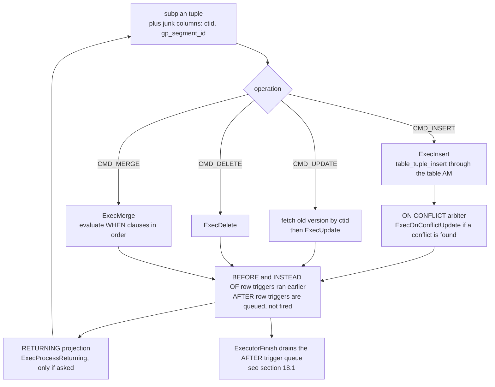

*The generic DML lifecycle for one tuple pulled from the subplan*

The parts worth naming. `ExecInitModifyTable` (`:4574`) builds one `ResultRelInfo` per target relation and registers them in `EState.es_result_relations`; with a partitioned target, `ExecPrepareTupleRouting` (`:3897`) picks the leaf per row and `mt_lastResultOid` caches the last one so a sorted stream does not re-look-up. Row identity comes from junk columns the planner added to the subplan's target list — a `ctid` for heap, a whole-row attribute for AO/AOCO and PAX where a TID is not enough (`:4170`). Writing goes through the table AM (`table_tuple_insert`/`_update`/`_delete`), which is why the same node writes heap, AO, AOCO and PAX (§5, §6). `RETURNING` is a projection built at init and evaluated by `ExecProcessReturning` (`:348`) — and it is what turns a DML statement back into something that produces tuples.

*An UPDATE needs no Gather Motion; RETURNING adds one; MERGE and ON CONFLICT both send the query to the PostgreSQL planner*

```sql
SET optimizer = off;
EXPLAIN (ANALYZE, VERBOSE, TIMING OFF, COSTS OFF) UPDATE m186_dml SET val = val + 1 WHERE grp = 3;
EXPLAIN (ANALYZE, TIMING OFF, COSTS OFF) DELETE FROM m186_dml WHERE id > 49990 RETURNING id, val;

SET optimizer = on;  SET optimizer_trace_fallback = on;
EXPLAIN (COSTS OFF) INSERT INTO m186_dml VALUES (1,1,1)
  ON CONFLICT (id) DO UPDATE SET val = excluded.val;
```

```text {3,14} title="output"
 Update on public.m186_dml (actual rows=0 loops=1)
   ->  Seq Scan on public.m186_dml (actual rows=2385 loops=1)
         Output: (val + 1), ctid, gp_segment_id
         Filter: (m186_dml.grp = 3)
   (slice0)    Executor memory: 129K bytes avg x 3x(0) workers, 129K bytes max (seg0).

 Gather Motion 3:1  (slice1; segments: 3) (actual rows=10 loops=1)
   ->  Delete on m186_dml (actual rows=4 loops=1)
         ->  Index Scan using m186_dml_pkey on m186_dml (actual rows=4 loops=1)
               Index Cond: (id > 49990)

INFO:  GPORCA failed to produce a plan, falling back to Postgres-based planner
DETAIL:  Falling back to Postgres-based planner because GPORCA does not support
         the following feature: ON CONFLICT clause
 Insert on m186_dml
   Conflict Resolution: UPDATE
   Conflict Arbiter Indexes: m186_dml_pkey
   ->  Result
 Optimizer: Postgres query optimizer
```

The plain `UPDATE` has no motion whatsoever: the `Update` node sits in slice0 on the segments, each QE updating only its own rows, and the coordinator hears only a row count. Add `RETURNING` and a `Gather Motion` appears on top, because now the statement has results to bring home. Note the junk list — Cloudberry needs `gp_segment_id` alongside `ctid`, because a row identity is only unique *within* a segment. And both `ON CONFLICT` and `MERGE` trigger the [§17.1](./ch17.md#171-entry--dispatch) fallback: they are ORCA-unsupported constructs, so however you set `optimizer`, the plan you get for them is the PostgreSQL planner's.

:::note

One honest caveat about the `MERGE` instrumentation. Running `EXPLAIN ANALYZE` on a `MERGE` that demonstrably updated 3 rows and inserted 5 (verified by querying the table inside the same transaction) printed `Tuples: skipped=5` and nothing else. The line is computed as `total &minus; mt_merge_inserted &minus; mt_merge_updated &minus; mt_merge_deleted` (`explain.c:5176`) from the local `ModifyTableState`, and under a dispatched plan those counters are not gathered back from the QEs — so treat the `Tuples:` breakdown as unreliable here and trust the statement tag or a `SELECT`. The `MERGE` plan also contains a `Split Merge` under an `Explicit Redistribute Motion`, and an `UPDATE` of a distribution key becomes a `Split Update` — a delete plus an insert, because the row must physically move to another segment. Those two nodes are **[§18.7](#187-cloudberry-specific-nodes)**'s subject, not this section's.

:::

### 18.6.7 What this catalogue leaves out

Two deliberate gaps. The Cloudberry-specific operators — `Split Update` and `Split Merge`, `Assert`, `Shared Scan` and `Sequence`, `RuntimeFilter`, `PartitionSelector`, `TupleSplit` — are [§18.7](#187-cloudberry-specific-nodes)'s, and each of them exists because an MPP executor has a problem PostgreSQL does not. And `Motion`, the node that has appeared in nearly every plan in this section without ever being explained, belongs to **Chapter 19**: `nodeMotion.c` is only 1405 lines, but everything interesting about it lives in the interconnect underneath. Every `Broadcast Motion` that fed a recursive term, every `Redistribute Motion` that made a `Unique` correct, every `Gather Motion` that carried a `RETURNING` row home — those are the next chapter's subject, and with them the plan tree finally stops being a single process's private business.

## 18.7 Cloudberry-Specific Nodes

Everything in [§18.1](#181-executor-framework--lifecycle)–[§18.6](#186-subqueries--other-nodes) was upstream PostgreSQL's executor, read in a Cloudberry context. The `Plan`→`PlanState` mirroring, the pull loop, `nodeSeqscan.c`, `nodeAgg.c`, `nodeHashjoin.c`, `execExprInterp.c` — same files, same algorithms, same struct names as PostgreSQL 16. What this section covers is the *delta*: the handful of operators that have no upstream counterpart at all, because they answer questions that only arise when a table is split across segments and no process may write to another process's storage.

The delta is small and it is easy to count. `ExecInitNode`'s dispatch switch (`execProcnode.c:236`–`:531`) has **58** `case T_…` arms. **42** of them are PostgreSQL's. The other **16** are Cloudberry's, and — a nice accident of how the port was maintained — most of them sit in one contiguous block at the very end of the switch, after `T_Limit` and `T_Motion` (`execProcnode.c:508`–`:531`), as if somebody had appended a chapter to a finished book. Which is roughly what happened.

<RawFigure html={"<div style=\"font-family:ui-monospace,SFMono-Regular,Menlo,monospace;font-size:12px;line-height:1.55\"> <div style=\"display:grid;grid-template-columns:1fr 1.45fr;gap:14px;align-items:start\"> <div style=\"border:1px solid #cdb4db;background:#f5edff;border-radius:9px;padding:11px 12px\"> <div style=\"font-weight:700;font-size:12.5px;margin-bottom:7px\">inherited &mdash; 42 of 58 arms</div> <div style=\"line-height:1.85;color:#333\">Result &middot; ProjectSet &middot; ModifyTable &middot; Append &middot; MergeAppend &middot; RecursiveUnion &middot; BitmapAnd &middot; BitmapOr &middot; SeqScan &middot; SampleScan &middot; IndexScan &middot; IndexOnlyScan &middot; BitmapIndexScan &middot; BitmapHeapScan &middot; TidScan &middot; TidRangeScan &middot; SubqueryScan &middot; FunctionScan &middot; TableFuncScan &middot; ValuesScan &middot; CteScan &middot; NamedTuplestoreScan &middot; WorkTableScan &middot; ForeignScan &middot; CustomScan &middot; NestLoop &middot; MergeJoin &middot; HashJoin &middot; Material &middot; Sort &middot; IncrementalSort &middot; Memoize &middot; Group &middot; Agg &middot; WindowAgg &middot; Unique &middot; Gather &middot; GatherMerge &middot; Hash &middot; SetOp &middot; LockRows &middot; Limit</div> <div style=\"margin-top:9px;padding-top:7px;border-top:1px dashed #cdb4db;color:#5b4a6b\">same C files as PostgreSQL&nbsp;16 &mdash; taught in &sect;18.1&ndash;&sect;18.6</div> </div> <div style=\"border:1px solid #8a6d1a;background:#fff4d6;border-radius:9px;padding:11px 12px\"> <div style=\"font-weight:700;font-size:12.5px;margin-bottom:7px\">Cloudberry-only &mdash; 16 of 58 arms</div> <table style=\"border-collapse:collapse;width:100%\"> <tr><td style=\"padding:2px 8px 2px 0;white-space:nowrap;font-weight:700\">Motion</td><td style=\"padding:2px 0;color:#444\">a tuple must reach a different segment &mdash; <b>Chapter&nbsp;19</b></td></tr> <tr><td style=\"padding:2px 8px 2px 0;white-space:nowrap;font-weight:700\">SplitUpdate</td><td style=\"padding:2px 0;color:#444\">an UPDATE moved the row off this segment</td></tr> <tr><td style=\"padding:2px 8px 2px 0;white-space:nowrap;font-weight:700\">SplitMerge</td><td style=\"padding:2px 0;color:#444\">same, for MERGE's per-row action mix</td></tr> <tr><td style=\"padding:2px 8px 2px 0;white-space:nowrap;font-weight:700\">AssertOp</td><td style=\"padding:2px 0;color:#444\">a SQL cardinality rule survived only as a runtime check</td></tr> <tr><td style=\"padding:2px 8px 2px 0;white-space:nowrap;font-weight:700\">ShareInputScan</td><td style=\"padding:2px 0;color:#444\">one subtree, several readers, <i>possibly in other processes</i></td></tr> <tr><td style=\"padding:2px 8px 2px 0;white-space:nowrap;font-weight:700\">Sequence</td><td style=\"padding:2px 0;color:#444\">children must run in order, not on demand</td></tr> <tr><td style=\"padding:2px 8px 2px 0;white-space:nowrap;font-weight:700\">PartitionSelector</td><td style=\"padding:2px 0;color:#444\">the surviving partitions are known only at run time</td></tr> <tr><td style=\"padding:2px 8px 2px 0;white-space:nowrap;font-weight:700\">RuntimeFilter</td><td style=\"padding:2px 0;color:#444\">reject fact rows before they cost a join probe</td></tr> <tr><td style=\"padding:2px 8px 2px 0;white-space:nowrap;font-weight:700\">TableFunctionScan</td><td style=\"padding:2px 0;color:#444\">a function whose argument is a <i>table</i>, scattered</td></tr> <tr><td style=\"padding:2px 8px 2px 0;white-space:nowrap;font-weight:700\">TupleSplit</td><td style=\"padding:2px 0;color:#444\">multi-DQA in two stages &mdash; &sect;18.3</td></tr> <tr><td style=\"padding:2px 8px 2px 0;vertical-align:top;font-weight:700\">Dynamic&hairsp;*<br/><span style=\"font-weight:400;color:#7a6a3a\">6&nbsp;arms</span></td><td style=\"padding:2px 0;color:#444\">SeqScan / IndexScan / IndexOnlyScan / BitmapIndexScan / BitmapHeapScan / ForeignScan over a partition set chosen at run time &mdash; &sect;18.2</td></tr> </table> <div style=\"margin-top:9px;padding-top:7px;border-top:1px dashed #d9b96a;color:#6b5a1a\">&#10214;&nbsp;this section owns the eight in bold-face prose below&nbsp;&#10215;</div> </div> </div></div>"} caption={"The executor's node catalogue: 58 arms in ExecInitNode, 42 inherited and 16 native — each Cloudberry node named by the distributed-execution problem it exists to solve."} />

:::note

Three of the sixteen are taught elsewhere and only cross-referenced here. **Motion** is large enough, and interesting enough, to get **Chapter 19** to itself together with the interconnect that carries it. The six **Dynamic*** scans belong to **[§18.2](#182-scan-nodes)**. **TupleSplit** belongs to **[§18.3](#183-sort--aggregate-nodes)**. What is left is eight operators, and each of the next six subsections is organised around the problem, not the file.

:::

### 18.7.1 Split Update: a row that has to change segments

A heap `UPDATE` in PostgreSQL is a local affair: mark the old tuple dead, write the new version, ideally on the same page ([§4.3](../part-2-storage-data-layout/ch04.md#43-operations-on-tuples), [§4.5](../part-2-storage-data-layout/ch04.md#45-page-pruning--hot-updates)). Now suppose the table is `DISTRIBUTED BY (a)` and you update `a`. The new row's hash no longer maps to this segment. But a QE has no way to write into another segment's files — there is no shared storage and no remote-write path. So the update *cannot* be an update. It has to become a `DELETE` here and an `INSERT` over there, and the tuple has to travel.

That decomposition is what `Split Update` (`nodeSplitUpdate.c`) does, and the planner decides whether it is needed from the target list alone — `check_splitupdate()`, memoised into `root->is_split_update` at `preptlist.c:129`. The contrast is visible in one pair of EXPLAINs:

*Updating the distribution key gets a Split Update and a Motion; updating a payload column gets neither (GPORCA, the default on this cluster).*

```sql
-- m187_t (a int, b int, c text) DISTRIBUTED BY (a), 1000 rows
EXPLAIN (COSTS OFF) UPDATE m187_t SET a = a + 1     WHERE b = 5;   -- touches the key
EXPLAIN (COSTS OFF) UPDATE m187_t SET c = c || 'x'  WHERE b = 5;   -- does not
```

```text {9} title="output"
                            QUERY PLAN
------------------------------------------------------------------
 Update on m187_t
   ->  Result
         One-Time Filter: true
         ->  Result
               ->  Redistribute Motion 3:3  (slice1; segments: 3)
                     Hash Key: a
                     ->  Split Update
                           ->  Seq Scan on m187_t
                                 Filter: (b = 5)
 Optimizer: GPORCA
(10 rows)

        QUERY PLAN
--------------------------
 Update on m187_t
   ->  Seq Scan on m187_t
         Filter: (b = 5)
 Optimizer: GPORCA
(4 rows)
```

The node itself is almost embarrassingly simple, and its simplicity is the point: it is a *one-in, two-out* operator. Each input tuple is expanded into two virtual tuples — one carrying the old column values plus `DML_DELETE`, one carrying the new values plus `DML_INSERT` — and the node hands them upward on alternate calls, tracked by a single `bool`:

```c title="src/backend/executor/nodeSplitUpdate.c:181"
	/* Returns INSERT TupleTableSlot. */
	if (!node->processInsert)
	{
		result = node->insertTuple;

		node->processInsert = true;
	}
	else
	{
		/* Creates both TupleTableSlots. Returns DELETE TupleTableSlots.*/
		slot = ExecProcNode(outerNode);
```

`SplitTupleTableSlot()` (`:72`) fills the two slots by walking the target list; the `DMLActionExpr` entry is where the action code is stamped (`:93`), and `evalHashKey()` (`:40`) runs `cdbhash` over the *new* values to work out where the INSERT half must land. So the row count doubles exactly at this node — which `EXPLAIN ANALYZE` shows without ambiguity:

*The row count doubles at Split Update, and the verbose target list shows the extra DMLAction column the node stamps on each half. (PostgreSQL-planner path; row counts are per-segment maxima — [§18.1](#181-executor-framework--lifecycle).)*

```sql
SET optimizer = off;
EXPLAIN (COSTS OFF, VERBOSE) UPDATE m187_t SET a = a + 1 WHERE b = 5;
BEGIN;
EXPLAIN (COSTS OFF, ANALYZE, TIMING OFF) UPDATE m187_t SET a = a + 1 WHERE b = 5;
ROLLBACK;
```

```text {7,17,18} title="output"
                              QUERY PLAN
-----------------------------------------------------------------------
 Update on public.m187_t
   ->  Explicit Redistribute Motion 3:3  (slice1; segments: 3)
         Output: ((a + 1)), b, c, ctid, gp_segment_id, (DMLAction)
         ->  Split Update
               Output: ((a + 1)), b, c, ctid, gp_segment_id, DMLAction
               ->  Seq Scan on public.m187_t
                     Output: (a + 1), b, c, ctid, gp_segment_id
                     Filter: (m187_t.b = 5)
 Optimizer: Postgres query optimizer

                                       QUERY PLAN
----------------------------------------------------------------------------------------
 Update on m187_t (actual rows=0 loops=1)
   ->  Explicit Redistribute Motion 3:3  (slice1; segments: 3) (actual rows=78 loops=1)
         ->  Split Update (actual rows=84 loops=1)
               ->  Seq Scan on m187_t (actual rows=42 loops=1)
                     Filter: (b = 5)
                     Rows Removed by Filter: 298
 Optimizer: Postgres query optimizer
```

Notice that the two optimizers put a *different* Motion above the node, and for a reason worth knowing. ORCA emits a plain `Redistribute Motion` with `Hash Key: a` and lets the Motion compute the target segment; the PostgreSQL planner emits an **`Explicit Redistribute Motion`**, which reads a target segment number straight out of the tuple's `gp_segment_id` junk column — the number `evalHashKey()` computed. The comment at `createplan.c:3569` spells the divergence out, and explains why the planner leaves `deleteColIdx` filled with `-1` while ORCA populates it with the old key values (its Redistribute Motion needs them, to send the DELETE half back to the segment that owns the old row).

And the payoff, which is the entire reason the node exists — a row physically changing owner. The QD took its `RowExclusiveLock` on the table before any of this ([§11.1](../part-3-transactions-mvcc-concurrency/ch11.md#111-heavyweight-relation-level-locks)), and both halves land inside one distributed transaction ([§9.2](../part-3-transactions-mvcc-concurrency/ch09.md#92-the-transaction-manager), [§10.5](../part-3-transactions-mvcc-concurrency/ch10.md#105-distributed-snapshots--the-distributed-log)), so at no point is the row visible twice:

*Row v11 leaves segment 2 and arrives on segment 1. That is a DELETE on one QE and an INSERT on another, inside one transaction.*

```sql
BEGIN;
SELECT gp_segment_id, a, c FROM m187_t WHERE a = 11;
UPDATE m187_t SET a = a + 1 WHERE a = 11;
SELECT gp_segment_id, a, c FROM m187_t WHERE c = 'v11';
ROLLBACK;
```

```text {3,9} title="output"
 gp_segment_id | a  |  c
---------------+----+-----
           2 | 11 | v11
(1 row)

UPDATE 1
 gp_segment_id | a  |  c
---------------+----+-----
           1 | 12 | v11
(1 row)
```

`MERGE` has the same problem, one degree harder: a single statement mixes `INSERT`, `UPDATE` and `DELETE` actions decided *per row*, so some rows must move and others must not. That is `nodeSplitMerge.c`, and it is the bigger file of the pair (662 lines against 292). It carries a per-row action column with a third value, `SPLITMERGE_ACTION_PASSTHROUGH = -1` (`:34`), meaning "leave this one to `ModifyTable`'s ordinary `ExecMerge` path", and only splits into DELETE+INSERT for matched rows when `hasSplitUpdate` is set (`:397`). The planner decides that in `preptlist.c:147`–`:156`, by running the same `check_splitupdate()` over every `WHEN MATCHED THEN UPDATE` action list. ORCA does not participate at all: it has no `MERGE` translation, so every `MERGE` falls back.

*MERGE falls back to the PostgreSQL planner, which produces Split Merge under an Explicit Redistribute Motion. Matched rows whose key changes really do move.*

```sql
SET optimizer_trace_fallback = on;
EXPLAIN (COSTS OFF) MERGE INTO m187_t t USING m187_src s ON t.a = s.a
  WHEN MATCHED     THEN UPDATE SET a = s.a + 10000
  WHEN NOT MATCHED THEN INSERT (a,b,c) VALUES (s.a, s.b, 'new');
```

```text {3,8} title="output"
INFO:  GPORCA failed to produce a plan, falling back to Postgres-based planner
DETAIL:  Falling back to Postgres-based planner because GPORCA does not
         support the following feature: MERGE command
                          QUERY PLAN
---------------------------------------------------------------
 Merge on m187_t t
   ->  Explicit Redistribute Motion 3:3  (slice1; segments: 3)
         ->  Split Merge
               ->  Hash Right Join
                     Hash Cond: (t.a = s.a)
                     ->  Seq Scan on m187_t t
                     ->  Hash
                           ->  Seq Scan on m187_src s
 Optimizer: Postgres query optimizer
(9 rows)
```

### 18.7.2 Assert: proving at run time what SQL promised at parse time

`SELECT (SELECT c FROM t WHERE b = 7) FROM t` contains a *scalar* subquery, and SQL says a scalar subquery returning more than one row is an error. PostgreSQL keeps that guarantee structurally: the subquery becomes a `SubPlan`/`InitPlan` ([§18.6](#186-subqueries--other-nodes)) and `ExecSetParamPlan` raises the error the moment it fetches a second row. ORCA does not keep the structure. Decorrelation ([§17.3](./ch17.md#173-transformation-framework)) rewrites the subquery into a *join*, and a join is perfectly happy to produce several rows — the cardinality guarantee evaporates in the rewrite.

ORCA's answer is to re-materialise the guarantee as an operator. It numbers the subquery's rows with a window function and inserts an `Assert` node that checks the number as the tuples stream past:

*ORCA turns "at most one row" into a predicate over row_number() and an Assert node to evaluate it.*

```sql
EXPLAIN (COSTS OFF) SELECT (SELECT c FROM m187_t WHERE b = 7) FROM m187_t LIMIT 1;
```

```text {9,10} title="output"
                                        QUERY PLAN
------------------------------------------------------------------------------------------
 Limit
   ->  Gather Motion 3:1  (slice1; segments: 3)
         ->  Limit
               ->  Nested Loop Left Join
                     Join Filter: true
                     ->  Seq Scan on m187_t m187_t_1
                     ->  Assert
                           Assert Cond: ((row_number() OVER (?)) = 1)
                           ->  Materialize
                                 ->  Broadcast Motion 1:3  (slice2)
                                       ->  WindowAgg
                                             ->  Gather Motion 3:1  (slice3; segments: 3)
                                                   ->  Seq Scan on m187_t
                                                         Filter: (b = 7)
 Optimizer: GPORCA
(15 rows)
```

The node is 151 lines and does exactly one thing per tuple: evaluate `ps.qual`, and if it comes back false, `ereport`. What makes it general rather than a hard-wired cardinality check is that both the SQLSTATE and the message text travel *in the plan*: ORCA's DXL assert operator carries a five-character SQL state which `TranslateDXLAssert` turns into an `errcode` at `CTranslatorDXLToPlStmt.cpp:5718`, and the message list comes from the DXL constraint. So one C node serves every runtime assertion ORCA can express.

```c title="src/backend/executor/nodeAssertOp.c:46"
	if (!isNull && !DatumGetBool(expr_value))
	{
		String *valErrorMessage = list_nth(plannode->errmessage, 0);
		...
		appendStringInfo(&errorString, "%s\n", strVal(valErrorMessage));

		ereport(ERROR,
				(errcode(plannode->errcode),
				 errmsg("one or more assertions failed"),
				 errdetail("%s", errorString.data)));
	}
```

Which is much more convincing if you make it fire. `b = 7` matches 100 rows, so the subquery is illegal; drop the `LIMIT` so that the tuples actually flow, and run the two optimizers side by side:

*The same illegal query, two optimizers, two entirely different error paths: an Assert node on a segment (P0003) versus the SubPlan machinery on the QD (21000).*

```sql
\set VERBOSITY verbose
SELECT (SELECT c FROM m187_t WHERE b = 7) FROM m187_t;      -- optimizer = on
SET optimizer = off;
SELECT (SELECT c FROM m187_t WHERE b = 7) FROM m187_t;      -- same query
```

```text {1,3,6} title="output"
ERROR:  P0003: one or more assertions failed  (seg1 slice1 10.100.0.3:7103 pid=22587)
DETAIL:  Expected no more than one row to be returned by expression
LOCATION:  CheckForAssertViolations, nodeAssertOp.c:55

SET
ERROR:  21000: more than one row returned by a subquery used as an expression
LOCATION:  ExecSetParamPlan, nodeSubplan.c:1322
```

Read the two lines carefully, because the difference is not cosmetic. ORCA's error is `P0003` (`ERRCODE_TOO_MANY_ROWS`, `errcodes.h:360` — the code PL/pgSQL uses for `STRICT` violations) and it is raised **on segment 1**, by an operator, in the middle of a data flow. The planner's is `21000` (`cardinality_violation`) and it is raised **on the QD**, by control logic in `nodeSubplan.c`. Same SQL, same violation, different SQLSTATE and different reporter — worth knowing if you have application code that switches on error codes.

:::note

An honest footnote from this cluster: with the `LIMIT 1` still in place, the ORCA plan **does not** raise the error at all — it returns a row, where the planner path errors. Nothing is broken in the node; the `Limit` above it simply stops pulling after the first tuple, so the second row that would have carried `row_number() = 2` is never fetched, and an operator can only assert about tuples it sees. It is a small, precise illustration of what "volcano, demand-pull" (&sect;18.1) actually costs you: a check implemented as a node is only as complete as the demand above it.

:::

### 18.7.3 ShareInputScan and Sequence: compute once, read from several processes

A CTE referenced twice, or ORCA's multi-DQA rewrite, produces a plan with one expensive subtree and two or more consumers. `Materialize` ([§18.6](#186-subqueries--other-nodes)) solves the single-consumer, single-process version of this. It cannot solve the Cloudberry version, because in an MPP plan the consumers may live in **different slices** — that is, in different QE *processes* — and a private tuplestore in one backend's memory is invisible to another. `ShareInputScan` (`nodeShareInputScan.c`, 1064 lines, the largest of the native nodes) exists for exactly that gap, and it comes in two flavours which the plan node distinguishes with a single `bool cross_slice` (`plannodes.h:1307`).

Start with the easy flavour. All three `Shared Scan` nodes below report the same `share slice:id 1:0`, and `explain.c:2245` tells you how to read that: the first number is the slice the EXPLAIN walk is currently in, the second is `sisc->share_id`. Same slice on all three ⇒ one process ⇒ a *local* share, no IPC at all:

*A CTE read twice under ORCA: Sequence over a producer Shared Scan and two consumer Shared Scans, all in slice 1. The aggregate runs once.*

```sql
EXPLAIN (COSTS OFF, ANALYZE, TIMING OFF)
WITH c AS (SELECT b, count(*) n FROM m187_t GROUP BY b)
SELECT * FROM c x JOIN c y ON x.b = y.b;
```

```text {2,3} title="output"
 Gather Motion 3:1  (slice1; segments: 3) (actual rows=10 loops=1)
   ->  Sequence (actual rows=5 loops=1)
         ->  Shared Scan (share slice:id 1:0) (actual rows=0 loops=1)
               ->  Finalize HashAggregate (actual rows=5 loops=1)
                     Group Key: m187_t.b
                     ->  Redistribute Motion 3:3  (slice2; segments: 3) (actual rows=15 loops=1)
                           Hash Key: m187_t.b
                           ->  Streaming Partial HashAggregate (actual rows=10 loops=1)
                                 ->  Seq Scan on m187_t (actual rows=340 loops=1)
         ->  Hash Join (actual rows=5 loops=1)
               Hash Cond: (share0_ref3.b = share0_ref2.b)
               ->  Shared Scan (share slice:id 1:0) (actual rows=5 loops=1)
               ->  Hash (actual rows=5 loops=1)
                     ->  Shared Scan (share slice:id 1:0) (actual rows=5 loops=1)
 Optimizer: GPORCA
```

Two details in that output repay a second look. The consumers are named `share0_ref2` and `share0_ref3` in the hash condition — ORCA's aliases for "reference 2 and 3 of share 0". And the **producer** reports `actual rows=0` while each consumer reports 5. That is not a bug: the producer's job is to fill the store, not to emit, so `discard_output` is set for an ORCA CTE producer (`plannodes.h:1333`) and `ExecShareInputScan` returns `NULL` immediately after materialising (`nodeShareInputScan.c:376`). The five aggregate rows were computed once and read twice.

Now change the join key so that each consumer needs its own redistribution, and the shape changes completely. The producer stays in slice 1; the consumers move to slices 5 and 6. Three processes, one tuplestore:

*Joining the CTE on a non-key column pushes the two consumers into their own slices — a genuine cross-slice share.*

```sql
EXPLAIN (COSTS OFF)
WITH c AS (SELECT b, count(*) n FROM m187_t GROUP BY b)
SELECT count(*) FROM c x JOIN c y ON x.n = y.n;
```

```text {2,12,15} title="output"
         ->  Sequence
               ->  Shared Scan (share slice:id 1:0)      <-- producer
                     ->  Finalize HashAggregate
                           ...
               ->  Redistribute Motion 1:3  (slice3)
                     ->  Finalize Aggregate
                           ->  Gather Motion 3:1  (slice4; segments: 3)
                                 ->  Partial Aggregate
                                       ->  Hash Join
                                             Hash Cond: (share0_ref3.n = share0_ref2.n)
                                             ->  Redistribute Motion 3:3  (slice5; segments: 3)
                                                   ->  Shared Scan (share slice:id 5:0)
                                             ->  Hash
                                                   ->  Redistribute Motion 3:3  (slice6; segments: 3)
                                                         ->  Shared Scan (share slice:id 6:0)
 Optimizer: GPORCA
```

Cross-process sharing needs three things the local case does not: somewhere to put the tuples that another process can open, a way to say *ready*, and a way to say *done reading* so the producer knows when it may delete the files. Cloudberry's answers are, in order: a `BufFile` in a `SharedFileSet`, named `SIRW_⟨session_id⟩_⟨command_count⟩_⟨share_id⟩` (`nodeShareInputScan.c:692`); a `shareinput_Xslice_state` entry in a shared-memory hash table (`:101`) holding two atomics, `ready` and `ndone`; and **one** `ConditionVariable` per entry, `ready_done_cv`, used in both directions.

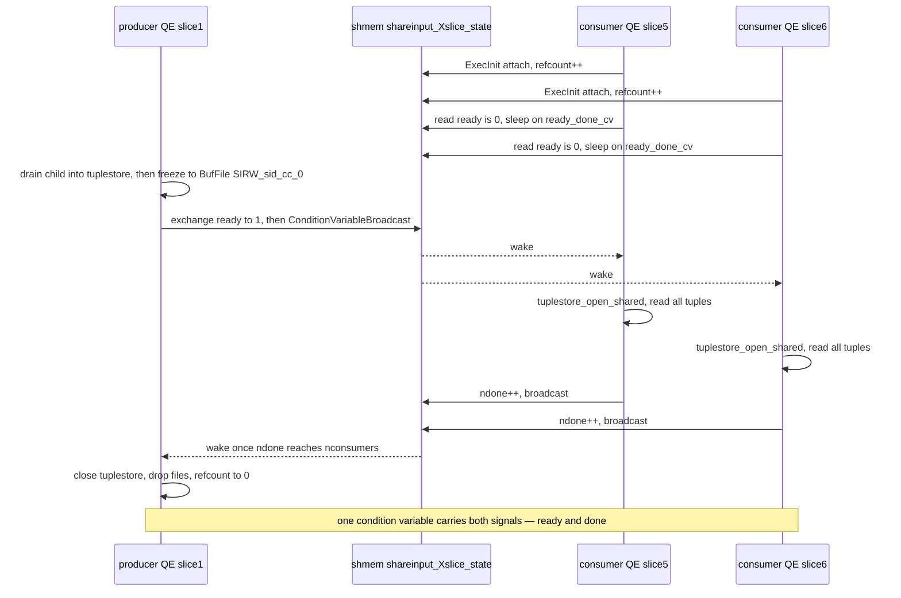

*The cross-slice handshake on one segment: the producer materialises and freezes the tuplestore, flips ready, and broadcasts; consumers sleep on the same condition variable and use it again to report done.*

You do not have to take that diagram on faith. `debug_shareinput_xslice` makes every step of the handshake log, and with `client_min_messages = log` the QE lines come back over dispatch, tagged with segment, slice and pid:

*The handshake, live, trimmed to one segment's worth of lines. Consumers block before the producer has even created the store; the producer's notify_ready releases all of them; nconsumers = 2 releases the producer.*

```sql
SET debug_shareinput_xslice = on;
SET client_min_messages = log;
WITH c AS (SELECT b, count(*) n FROM m187_t GROUP BY b)
SELECT count(*) FROM c x JOIN c y ON x.n = y.n;
```

```text {2,5,10} title="output"
LOG:  SISC (shareid=0, slice=5): initialized xslice state         (seg0 slice5 pid=25319)
LOG:  SISC READER (shareid=0, slice=5): Waiting for producer      (seg0 slice5 pid=25319)
LOG:  SISC READER (shareid=0, slice=6): Waiting for producer        (seg0 slice6 pid=25325)
LOG:  SISC WRITER (shareid=0, slice=1): No tuplestore yet, creating tuplestore  (seg0 slice1 pid=25291)
LOG:  SISC WRITER (shareid=0, slice=1): wrote notify_ready        (seg0 slice1 pid=25291)
LOG:  SISC READER (shareid=0, slice=5): Wait ready got writer's handshake       (seg0 slice5 pid=25319)
LOG:  SISC READER (shareid=0, slice=6): Wait ready got writer's handshake       (seg0 slice6 pid=25325)
LOG:  SISC READER (shareid=0, slice=5): wrote notify_done           (seg0 slice5 pid=25319)
LOG:  SISC READER (shareid=0, slice=6): wrote notify_done           (seg0 slice6 pid=25325)
LOG:  SISC WRITER (shareid=0, slice=1): got DONE message from 2 readers       (seg0 slice1 pid=25291)
LOG:  SISC (shareid=0, slice=1): decreased xslice state refcount to 0           (seg0 slice1 pid=25291)
LOG:  SISC (shareid=0, slice=1): removed xslice state              (seg0 slice1 pid=25291)
```

```c title="src/backend/executor/nodeShareInputScan.c:940"
static void
shareinput_reader_waitready(shareinput_Xslice_reference *ref)
{
	shareinput_Xslice_state *state = ref->xslice_state;

	for (;;)
	{
		/* pg_atomic_exchange_u32() in the writer acts as a memory barrier */
		int ready = pg_atomic_read_u32(&state->ready);
		if (ready)
			break;
		ConditionVariableSleep(&state->ready_done_cv, WAIT_EVENT_SHAREINPUT_SCAN);
	}
	ConditionVariableCancelSleep();
}
```

None of this would work under the ordinary demand-pull discipline, because nothing above the producer ever *asks* it for a tuple — the consumers are elsewhere in the tree. That is what `Sequence` (`nodeSequence.c`, 168 lines) contributes, and why it always appears above a shared scan. It is the one node in the executor that runs its children **eagerly and in order**: on first call it drives every subplan except the last to exhaustion with `completeSubplan()`, throwing the output away, and only then starts pulling from the last one (`:100`–`:115`). Producer first, consumers after; and if a consumer's slice starts before the producer has finished, `shareinput_reader_waitready` holds it. `Sequence` is not exclusive to sharing — [§18.2](#182-scan-nodes) uses it to sequence a `PartitionSelector` ahead of a `Dynamic*` scan — and Chapter 19 explains how those slices come to be running at once in the first place.

### 18.7.4 Partition Selector: pruning decided while the query runs

Static partition pruning happens in the planner: a constant in the `WHERE` clause eliminates partitions before the plan is finished, and `Append` never even lists them ([§18.6](#186-subqueries--other-nodes)). But the interesting case in a star schema is not a constant — it is a join. `WHERE dim.proj_id = 1` selects a handful of dimension rows, whose `did` values determine which fact partitions can possibly match, and nobody knows those values until the dimension side has been read. Cloudberry solves this with a *pair* of cooperating nodes: a `PartitionSelector` on the inner (hash-build) side, which watches every row go past and accumulates the set of partitions it implies, and a partition-aware scan on the outer side that consults the result. Both optimizers can build this shape, and they build it differently.

*PostgreSQL-planner form: Partition Selector on the build side publishes into $0; the Append on the probe side reads it and leaves four of five partitions never executed.*

```sql
SET optimizer = off;
EXPLAIN (COSTS OFF, ANALYZE, TIMING OFF)
SELECT count(*) FROM m187_fact f, m187_dim d WHERE f.did = d.did AND d.proj_id = 1;
```

```text {4,5,7,8,9,11} title="output"
               ->  Hash Join (actual rows=16772 loops=1)
                     Hash Cond: (f.did = d.did)
                     ->  Append (actual rows=16772 loops=1)
                           Partition Selectors: $0
                           ->  Seq Scan on m187_fact_1_prt_2 f_1 (never executed)
                           ->  Seq Scan on m187_fact_1_prt_3 f_2 (actual rows=16772 loops=1)
                           ->  Seq Scan on m187_fact_1_prt_4 f_3 (never executed)
                           ->  Seq Scan on m187_fact_1_prt_5 f_4 (never executed)
                           ->  Seq Scan on m187_fact_1_prt_other f_5 (never executed)
                     ->  Hash (actual rows=10 loops=1)
                           ->  Partition Selector (selector id: $0) (actual rows=10 loops=1)
                                 ->  Broadcast Motion 3:3  (slice2; segments: 3) (actual rows=10 loops=1)
                                       ->  Seq Scan on m187_dim d (actual rows=5 loops=1)
                                             Filter: (proj_id = 1)
                                             Rows Removed by Filter: 8
 Optimizer: Postgres query optimizer
```

*Same query, same Partition Selector — but ORCA pairs it with a Dynamic Seq Scan ([§18.2](#182-scan-nodes)), which reports the surviving partition count per segment instead of marking children never executed.*

```sql
SET optimizer = on;
EXPLAIN (COSTS OFF, ANALYZE, TIMING OFF)
SELECT count(*) FROM m187_fact f, m187_dim d WHERE f.did = d.did AND d.proj_id = 1;
```

```text {3,5} title="output"
               ->  Hash Join (actual rows=16772 loops=1)
                     Hash Cond: (f.did = d.did)
                     ->  Dynamic Seq Scan on m187_fact f (actual rows=16772 loops=1)
                           Number of partitions to scan: 5 (out of 5)
                           Partitions scanned:  Avg 1.0 x 3 workers.  Max 1 parts (seg0).
                     ->  Hash (actual rows=10 loops=1)
                           ->  Partition Selector (selector id: $0) (actual rows=10 loops=1)
                                 ->  Broadcast Motion 3:3  (slice2; segments: 3) (actual rows=10 loops=1)
                                       ->  Seq Scan on m187_dim d (actual rows=5 loops=1)
                                             Filter: (proj_id = 1)
 Optimizer: GPORCA
```

Read the two instrumentation styles as the same fact stated twice: the planner's `Append` shows four `never executed` children, while ORCA's `Dynamic Seq Scan` shows `Number of partitions to scan: 5 (out of 5)` — the *plan-time* count, all five still possible — followed by what actually happened, `Max 1 parts (seg0)`. One partition out of five was opened. The `(out of 5)` figure comes from `countLeafPartTables()` at EXPLAIN time (`explain.c:2561`), so it is a statement about the plan, not the run; the `Partitions scanned` line is the run.

The channel between the two nodes is an ordinary executor `Param` slot used as a mailbox. The selector prunes per tuple, accumulating into `part_prune_result`, and only when its input is exhausted — when the set is *final* — does it publish a pointer to itself into `es_param_exec_vals[paramid]`. The consumer, `Append` or `Dynamic*`, dereferences that Param instead of running pruning steps of its own. It works only because the hash side is guaranteed to be fully drained before the probe side is read, which is exactly the ordering a hash join gives you for free ([§18.4](#184-join-nodes)):

```c title="src/backend/executor/nodePartitionSelector.c:132"
	if (TupIsNull(inputSlot))
	{
		/* The set of surviving partitions is now complete. */
		ParamExecData *param;

		param = &(estate->es_param_exec_vals[ps->paramid]);
		param->value = PointerGetDatum(node);
		return NULL;
	}
	econtext->ecxt_outertuple = inputSlot;
	node->part_prune_result = ExecAddMatchingSubPlans(node->prune_state,
													  node->part_prune_result);
```

:::note

Both optimizers emit this node, which is unusual for the native set. The PostgreSQL-planner path lives in `joinpartprune.c` &mdash; a wholly Cloudberry file inside the upstream planner &mdash; and its 70-line header comment is the clearest description of the mechanism anywhere in the tree, including the three-phase construction during `create_plan()`: `push_partition_selector_candidate_for_join()`, then `make_partition_join_pruneinfos()` when the `Append` is built, then `pop_and_inject_partition_selectors()`. ORCA reaches the same node through `CTranslatorDXLToPlStmt.cpp:531`.

:::

### 18.7.5 RuntimeFilter: a Bloom filter in front of the fact table

The partition selector prunes at the granularity of a whole partition. `RuntimeFilter` (`nodeRuntimeFilter.c`) prunes at the granularity of a *row*, and for the same reason: in a star join, the overwhelming majority of fact rows will never match the small, filtered dimension side, yet each one is read, formed into a slot, hashed and probed. If the hash table is already built, we can answer "is this key definitely absent?" far more cheaply than a probe — with a Bloom filter. That is the whole node: 327 lines wrapping the outer input of a `Hash Join`, rejecting rows before the join sees them.

It is off by default (`gp_enable_runtime_filter = off`) and it is a **PostgreSQL-planner-only** node — the decision is made in `try_runtime_filter()`, called from `joinpath.c:2332` when hash clauses are found. Turning it on rewrites the plan:

*One GUC, one extra node. m187_frf has 100 000 rows, m187_drf 10 000, and the dimension predicate keeps 20% of them.*

```sql
SET optimizer = off;                         -- required: ORCA never emits this node
SET gp_enable_runtime_filter = off;
EXPLAIN (COSTS OFF) SELECT COUNT(*) FROM m187_frf, m187_drf
  WHERE m187_frf.did = m187_drf.did AND proj_id < 2;
SET gp_enable_runtime_filter = on;
EXPLAIN (COSTS OFF) SELECT COUNT(*) FROM m187_frf, m187_drf
  WHERE m187_frf.did = m187_drf.did AND proj_id < 2;
```

```text {12} title="output"
               ->  Hash Join
                     Hash Cond: (m187_frf.did = m187_drf.did)
                     ->  Seq Scan on m187_frf
                     ->  Hash
                           ->  Broadcast Motion 3:3  (slice2; segments: 3)
                                 ->  Seq Scan on m187_drf
                                       Filter: (proj_id < 2)
 Optimizer: Postgres query optimizer

               ->  Hash Join
                     Hash Cond: (m187_frf.did = m187_drf.did)
                     ->  RuntimeFilter
                           ->  Seq Scan on m187_frf
                     ->  Hash
                           ->  Broadcast Motion 3:3  (slice2; segments: 3)
                                 ->  Seq Scan on m187_drf
                                       Filter: (proj_id < 2)
 Optimizer: Postgres query optimizer
```

*The same plan, executed. The scan below the filter produces 33 462 rows; only 6 682 reach the join — 80% rejected without a probe. (Ratios on one --enable-cassert build, not a benchmark.)*

```sql
EXPLAIN (COSTS OFF, ANALYZE, TIMING OFF) SELECT COUNT(*) FROM m187_frf, m187_drf
  WHERE m187_frf.did = m187_drf.did AND proj_id < 2;
```

```text {4,5,7} title="output"
               ->  Hash Join (actual rows=6682 loops=1)
                     Hash Cond: (m187_frf.did = m187_drf.did)
                     Extra Text: (seg1)   Hash chain length 1.0 avg, 2 max, using 1996 of 524288 buckets.
                     ->  RuntimeFilter (actual rows=6682 loops=1)
                           Bloom Bits: 1048576
                           Extra Text: (seg1)   Inner Processed: 2000, Flase Positive Rate: 0.000000
                           ->  Seq Scan on m187_frf (actual rows=33462 loops=1)
                     ->  Hash (actual rows=2000 loops=1)
                           Buckets: 524288  Batches: 1  Memory Usage: 4167kB
                           ->  Broadcast Motion 3:3  (slice2; segments: 3) (actual rows=2000 loops=1)
                                 ->  Seq Scan on m187_drf (actual rows=689 loops=1)
                                       Filter: (proj_id < 2)
                                       Rows Removed by Filter: 2679
 Optimizer: Postgres query optimizer
```

`Bloom Bits: 1048576` is not a coincidence, and neither is the sizing rule behind it. `ExecInitRuntimeFilterFinish` is called from `ExecInitHashJoin` (`nodeHashjoin.c:1113`) with the *estimated* inner row count, and `bloom_create_aggresive` (`bloomfilter.c:325`) clamps the bitset to `[128 kB, 2 MB]`, rounds down to a power of two, and then refuses outright — returns `NULL` — if the result gives fewer than 1.6 bits per element. It picks 3 hash functions when it can afford 3.5 bits per element, otherwise 2. This is a deliberately cheap filter: small enough to stay in cache, sized to be *fast* rather than *accurate*, and paid for by the join re-checking every survivor anyway.

```c title="src/backend/executor/nodeRuntimeFilter.c:242"
	node->bf = bloom_create_aggresive((int64) inner_rows, work_mem, random());
	if (node->bf == NULL)
		node->build_suspend = true;
	/* we can't handle inner table which is bigger than this threshold */
	node->inner_threshold = bloom_total_bits(node->bf) / 1.6;
```

Which leads to the part of the design most worth copying: the node distrusts its own estimate and can switch itself off. `inner_threshold` is a *runtime* cap of `bits / 1.6`; every inner row added bumps `inner_processed`, and the moment it crosses the cap the node sets `build_suspend = true` (`:311`). `ExecRuntimeFilter` then degenerates into a pass-through — `if (!node->build_finish || node->build_suspend) return ExecProcNode(outerPlan);` (`:60`) — so a badly underestimated hash side costs a wasted Bloom build and nothing more. `EXPLAIN ANALYZE` prints `Suspend` in that case (`:216`). Note also the two deliberate holes: NULL keys are passed through unfiltered (`:132`), and only `bloom_lacks_element` is trusted — a *hit* means "maybe", so every survivor still gets a real probe.

The planner's own judgement is worth exercising too, because it declines more often than it accepts. `try_runtime_filter` (`costsize.c:5613`) bails out on four separate grounds, and the `gp_runtime_filter` regression test is built around them:

*Three refusals. A less selective dimension predicate, a non-eliminable LEFT JOIN, and ORCA — none of them get a RuntimeFilter, with gp_enable_runtime_filter still on.*

```sql
SET gp_enable_runtime_filter = on;   SET optimizer = off;
EXPLAIN (COSTS OFF) SELECT COUNT(*) FROM m187_frf, m187_drf
  WHERE m187_frf.did = m187_drf.did AND proj_id < 7;              -- bad filter rate
EXPLAIN (COSTS OFF) SELECT COUNT(*) FROM m187_frf LEFT JOIN m187_drf
  ON m187_frf.did = m187_drf.did WHERE proj_id IS NULL OR proj_id < 2;
SET optimizer = on;
EXPLAIN (COSTS OFF) SELECT COUNT(*) FROM m187_frf, m187_drf
  WHERE m187_frf.did = m187_drf.did AND proj_id < 2;              -- the winning shape
```

```text {6,14} title="output"
               ->  Hash Join                              <-- no RuntimeFilter
                     Hash Cond: (m187_frf.did = m187_drf.did)
                     ->  Seq Scan on m187_frf
                     ...  Filter: (proj_id < 7)

               ->  Hash Left Join                        <-- no RuntimeFilter
                     Hash Cond: (m187_frf.did = m187_drf.did)
                     Filter: ((m187_drf.proj_id IS NULL) OR (m187_drf.proj_id < 2))
                     ->  Seq Scan on m187_frf

               ->  Hash Join                              <-- no RuntimeFilter
                     Hash Cond: (m187_frf.did = m187_drf.did)
                     ->  Seq Scan on m187_frf
 Optimizer: GPORCA
```

The four bail-outs, in the order the function applies them. **Join type**: only `INNER`, `RIGHT` and `SEMI` (`:5632`) — a build-side Bloom filter can only tell you a row *has no match*, which for a left or anti join means early *output*, not early rejection, and that is not implemented (the comment at `nodeHashjoin.c:2309` makes the argument). **Absolute size**: if the filter would spare fewer than 10 000 outer rows it is not worth the cycles (`:5673`). **Selectivity**: the surviving row count must be under `RUNTIME_FILTER_RATE_THRESHOLD = 0.6` of the outer rows — it has to reject at least 40% (`:5681`, `costsize.c:109`) — which is what `proj_id < 7` fails. **By-reference types** are refused outright (`:5658`), since the node hashes fixed-width `Datum`s. And the third refusal is the categorical one: ORCA has no runtime-filter translation, so on this cluster it never emits the node, whatever the GUC says.

There is a second, quite separate mechanism hiding behind a similar name. `gp_enable_runtime_filter_pushdown` adds **no plan node at all**: at `ExecInitHashJoin` time, on the QE only, `CreateRuntimeFilter` (`nodeHashjoin.c:2296`) walks down the outer side looking for a `SeqScanState` or `DynamicSeqScanState` and hangs an `AttrFilter` — its own Bloom filter — directly on the scan, which then tests keys inside its own tuple loop, before projection (`nodeSeqscan.c:83`). The filtering moves one level *lower*, and the accounting moves with it:

*Pushdown instead of a node: the Seq Scan itself now reports 6 682 rows out and its own removal counter. Compare with the previous panel, where the scan still emitted 33 462.*

```sql
SET gp_enable_runtime_filter = off;            -- no RuntimeFilter node
SET gp_enable_runtime_filter_pushdown = on;   -- filter inside the scan instead
EXPLAIN (COSTS OFF, ANALYZE, TIMING OFF) SELECT COUNT(*) FROM m187_frf, m187_drf
  WHERE m187_frf.did = m187_drf.did AND proj_id < 2;
```

```text {3,4} title="output"
               ->  Hash Join (actual rows=6682 loops=1)
                     Hash Cond: (m187_frf.did = m187_drf.did)
                     ->  Seq Scan on m187_frf (actual rows=6682 loops=1)
                           Rows Removed by Pushdown Runtime Filter: 26645
                     ->  Hash (actual rows=2000 loops=1)
                           Buckets: 524288  Batches: 1  Memory Usage: 4167kB
                           ->  Broadcast Motion 3:3  (slice2; segments: 3) (actual rows=2000 loops=1)
                                 ->  Seq Scan on m187_drf (actual rows=689 loops=1)
                                       Filter: (proj_id < 2)
 Optimizer: Postgres query optimizer
```

The two do **not** compose, and the reason is structural rather than intentional: `FindTargetNodes` (`nodeHashjoin.c:2488`) only descends through `HashJoinState`, `ResultState` and `AppendState`, so a `RuntimeFilter` sitting between the join and the scan stops the search dead. With both GUCs on, the plan gets its `RuntimeFilter` node and no pushdown — verified on this cluster. Pushdown is also skipped entirely under intra-segment parallelism (`estate->useMppParallelMode`, `:1118`). Which gives four sibling mechanisms for "the scan learns something at run time", worth laying side by side:

| mechanism | what the scan learns | how the answer travels | emitted by |
| --- | --- | --- | --- |
| `Partition Selector` + `Append` | which partitions can hold a match | a `Bitmapset` published into `es_param_exec_vals[$n]` | planner and ORCA |
| `Partition Selector` + `Dynamic Seq Scan` | the same, for the `Dynamic*` family ([§18.2](#182-scan-nodes)) | the same executor Param | ORCA |
| `RuntimeFilter` node | is this row's key definitely absent from the hash side | a Bloom filter owned by the node, with a back-pointer to `hjstate` | planner only, `gp_enable_runtime_filter` |
| pushdown, no node | the same test, inside the scan loop | an `AttrFilter` list hung off the `HashState` at `ExecInit` on the QE | planner only, `gp_enable_runtime_filter_pushdown` |

### 18.7.6 Table Function Scan: a function whose argument is a table

The last of the eight is the oldest and the least used. Cloudberry supports functions declared over the pseudo-type `anytable`, called as `f( TABLE(subquery SCATTER BY …) )`. Because the argument is a whole relation rather than a scalar, the parser converts the range-table entry to `RTE_TABLEFUNCTION` (`parse_relation.c:1925`) and the plan gets a `TableFunctionScan` with the subquery as its child — the distinction `nodeTableFunction.c`'s header draws between a *normal* table function (a `FunctionScan`, no input) and an *enhanced* one (a `TableFunctionScan` over a subplan). The function body pulls its input through the `AnyTable` handle in `tablefuncapi.h`, so this is a C-only interface in practice; `src/test/regress/regress.so` has the reference implementations.

*An enhanced table function over m187_t. SCATTER BY is the MPP half of the feature: it decides how the input is distributed to the QEs that will run the function body.*

```sql
SET compute_query_id = off;   -- see note
CREATE FUNCTION m187_multiset(a anytable) RETURNS TABLE(a int, b text)
  AS '.../src/test/regress/regress.so', 'multiset_example'
  LANGUAGE C READS SQL DATA;
EXPLAIN (COSTS OFF) SELECT * FROM
  m187_multiset( TABLE(SELECT a, c FROM m187_t WHERE b = 3 SCATTER BY a) );
EXPLAIN (COSTS OFF) SELECT count(*) FROM
  m187_multiset( TABLE(SELECT a, c FROM m187_t WHERE b = 3 SCATTER BY c) );
```

```text {4,12} title="output"
                 QUERY PLAN
--------------------------------------------
 Gather Motion 3:1  (slice1; segments: 3)
   ->  Table Function Scan on m187_multiset
         ->  Seq Scan on m187_t
               Filter: (b = 3)

 Finalize Aggregate
   ->  Gather Motion 3:1  (slice1; segments: 3)
         ->  Partial Aggregate
               ->  Table Function Scan on m187_multiset
                     ->  Redistribute Motion 3:3  (slice2; segments: 3)
                           Hash Key: m187_t.c
                           ->  Seq Scan on m187_t
                                 Filter: (b = 3)
 Optimizer: Postgres query optimizer
```

`SCATTER BY a` asks for the input grouped by the distribution key, which it already is, so the function runs on three segments over local data and no Motion appears. `SCATTER BY c` asks for it grouped by something else, and a `Redistribute Motion` materialises to satisfy the request. That is the whole reason the clause exists: a table function that computes something per group needs each group to arrive complete at one QE, and `SCATTER BY` is how the query author states which grouping the function body assumes.

:::note

A real bug found while writing this section, reported honestly: with the cluster's default `compute_query_id` and `pg_stat_statements` loaded, any query containing a `TABLE(...)` argument fails with `ERROR: unrecognized RTE kind: 10 (queryjumble.c:324)`. Upstream's query-jumbling code has no arm for `RTE_TABLEFUNCTION`. `SET compute_query_id = off` works around it for the session. The node itself is fine &mdash; the plan and the result above are real.

:::

### 18.7.7 Closing the chapter

That is the whole delta. Forty-two of the executor's fifty-eight node types are upstream PostgreSQL's, running unchanged; [§18.1](#181-executor-framework--lifecycle)–[§18.6](#186-subqueries--other-nodes) described them, and the only thing Cloudberry contributed there was *context* — one executor per slice, per segment, all at once, comparing its actuals against estimates that were made on a different machine. The sixteen native nodes exist for reasons you can now state in one sentence each: a row that must change owner (`Split Update`, `Split Merge`), a guarantee that decorrelation destroyed (`Assert`), a subtree several *processes* must read (`ShareInputScan`, with `Sequence` to make it run first), a pruning decision that could not be made until run time (`Partition Selector`, and [§18.2](#182-scan-nodes)'s `Dynamic*` scans), a row rejected before it costs a probe (`RuntimeFilter`), a function whose argument is a distributed relation (`TableFunctionScan`), and [§18.3](#183-sort--aggregate-nodes)'s two-stage `TupleSplit`.

Every one of them, notice, is downstream of a single fact: the data is spread across segments, and a segment can only touch its own. Which leaves the sixteenth, and the largest — `Motion`, the operator that does the actual moving. `nodeMotion.c` is 1 405 lines and it has appeared in almost every plan in this chapter, quietly, as `Gather Motion 3:1`, `Redistribute Motion 3:3`, `Broadcast Motion 1:3`, `Explicit Redistribute Motion`. We have read those labels as annotations. **Chapter 19** reads them as machinery: what a slice is, how a gang of QEs is assembled to run one, how a tuple is serialised and put on the wire, what the interconnect does when the receiver is slower than the sender, and why a plan with two Motions feeding one join can deadlock unless somebody prefetches ([§18.4](#184-join-nodes)) or squelches ([§18.1](#181-executor-framework--lifecycle)). The plan is a prediction; the executor tests it; the interconnect is what makes the test distributed.

