<!--
  Licensed to the Apache Software Foundation (ASF) under one
  or more contributor license agreements.  See the NOTICE file
  distributed with this work for additional information
  regarding copyright ownership.  The ASF licenses this file
  to you under the Apache License, Version 2.0 (the
  "License"); you may not use this file except in compliance
  with the License.  You may obtain a copy of the License at

    http://www.apache.org/licenses/LICENSE-2.0

  Unless required by applicable law or agreed to in writing,
  software distributed under the License is distributed on an
  "AS IS" BASIS, WITHOUT WARRANTIES OR CONDITIONS OF ANY
  KIND, either express or implied.  See the License for the
  specific language governing permissions and limitations
  under the License.
-->

import RawFigure from '../_components/RawFigure';

# 19. Motion & the Interconnect

## 19.1 Distributed Execution Principles

Every plan in the last six chapters had one of these in it — `Gather Motion 3:1`, `Redistribute Motion 3:3`, `Broadcast Motion 1:3`, `Explicit Redistribute Motion` — and every time we read it as an annotation: a note in the margin saying *and then the data moves*. It is not an annotation. A Motion is a plan node. It has an `ExecInitMotion`, an `ExecMotion` and an `ExecEndMotion`, it sits in the tree exactly where a Sort or a Hash Join would sit, and it is the only reason any of the rest of this works.

That design choice is the whole architecture. [§18.1](./ch18.md#181-executor-framework--lifecycle) described the executor as a demand-pull volcano: a parent calls `ExecProcNode` on its child and gets one tuple, or NULL for end-of-stream. Cloudberry does not extend that protocol with a *send this somewhere else* primitive. It inserts a node whose **child happens to live in a different process**. A Motion's parent calls `ExecProcNode` and gets a tuple, and cannot tell that the tuple arrived over a socket. A Motion's child is called by a parent that will ship the result sideways instead of returning it upward, and cannot tell either. Every other node in the tree stays completely oblivious, which is why Chapters 13–18 could be written at all.

Three consequences follow immediately, and they are the vocabulary for the rest of the chapter. First, the plan is **cut at Motion boundaries** into **slices** — [§16.3](./ch16.md#163-parallelization-cdbllize--cdbmutate) built the cut at planning time, [§19.3](#193-slice-tables--planslice--gang-mapping) has the data structures. Second, each slice is run by a **gang**: one process per segment, all of them running the same slice of the same plan on different data ([§19.2](#192-the-dispatcher-gangs--async-dispatch)). Third — and this is the single most important idea here — once the QD has dispatched, **nothing schedules anything**. Each process runs its own volcano loop, blocking when its input is empty and blocking when its output buffer is full. There is no global coordinator during execution.

*The chapter's running example: one aggregate, two motions, three slices*

```sql
CREATE TABLE m191_sales (id int, region int, amt numeric) DISTRIBUTED BY (id);
INSERT INTO m191_sales SELECT g, g % 97, (g % 1000)::numeric FROM generate_series(1,4000000) g;
ANALYZE m191_sales;

EXPLAIN (costs off) SELECT region, count(*) FROM m191_sales GROUP BY region;
```

```text {9} title="output"
CREATE TABLE
INSERT 0 4000000
ANALYZE
                         QUERY PLAN                         
------------------------------------------------------------
 Gather Motion 3:1  (slice1; segments: 3)
   ->  Finalize HashAggregate
         Group Key: region
         ->  Redistribute Motion 3:3  (slice2; segments: 3)
               Hash Key: region
               ->  Streaming Partial HashAggregate
                     Group Key: region
                     ->  Seq Scan on m191_sales
 Optimizer: GPORCA
(9 rows)
```

`region` is not the distribution key, so the groups are scattered across all three segments and a two-stage aggregate is the only way to finish them ([§16.4](./ch16.md#164-distributed-grouping--direct-dispatch) planned this shape, [§18.3](./ch18.md#183-sort--aggregate-nodes) executed it). Two motions cut the plan into three slices: the scan plus the partial aggregate; the finalize aggregate; and the root slice that the QD runs. The slice number printed on a Motion node is always the number of the **sender** slice below it, so the root is the unnumbered `slice0` — [§19.3](#193-slice-tables--planslice--gang-mapping) owns that numbering. Here is the same plan drawn against the processes that actually run it.

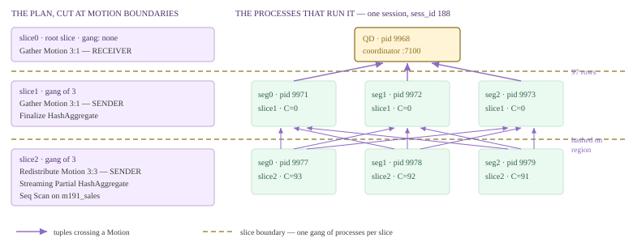

*One query, its three slices, and the seven processes that run them. Dashed lines are slice boundaries; solid arrows are tuples crossing a Motion. Process IDs are from the live capture below.*

Nine arrows between slice2 and slice1 is not artistic licence: a `Redistribute Motion 3:3` really is all-to-all, every sender potentially talking to every receiver. That is the fact [§19.5](#195-interconnect-implementations) has to build a transport for. To prove the process picture, run the same query long enough to photograph it — we inflate each row 120× with a `generate_series` join so the statement lives for about forty seconds, which changes nothing about the slice structure — and take a census from a second session.

*Seven processes, one distributed statement. The QD row comes from the coordinator's own pg_stat_activity, the six segment rows from gp_dist_random.*

```sql
-- session A, held open ~40 s (same three slices, 120x more input rows):
--   SELECT region, count(*) FROM m191_sales, generate_series(1,120) g GROUP BY region;

-- session B, while A runs:
SELECT 'seg'||gp_execution_segment() AS host, sess_id, pid, state, left(query,26) AS query
  FROM gp_dist_random('pg_stat_activity') WHERE sess_id = 188
UNION ALL
SELECT 'QD  ', sess_id, pid, state, left(query,26) FROM pg_stat_activity WHERE sess_id = 188
ORDER BY 1, 3;
```

```text {10} title="output"
 host | sess_id | pid  | state  |           query            
------+---------+------+--------+----------------------------
 QD   |     188 | 9968 | active | select region, count(*) fr
 seg0 |     188 | 9971 | active | select region, count(*) fr
 seg0 |     188 | 9977 | active | select region, count(*) fr
 seg1 |     188 | 9972 | active | select region, count(*) fr
 seg1 |     188 | 9978 | active | select region, count(*) fr
 seg2 |     188 | 9973 | active | select region, count(*) fr
 seg2 |     188 | 9979 | active | select region, count(*) fr
(7 rows)
```

Seven processes, one `sess_id`, one statement: the QD plus one gang of three per non-root slice. The operating system agrees, and it labels them for us — a Cloudberry QE writes its slice number into its process title, so `ps` reads out the slice tree directly. Watch the `C` column (the kernel's CPU-usage estimate, fourth field of `ps -ef`).

*ps sees the slice tree. The three slice2 processes are pegged; the three slice1 processes are burning nothing at all.*

```sql
$ ps -ef | grep -E "con188 (seg|cmd)" | grep -v grep | sed 's/  */ /g' | sed 's/^gpadmin //'
```

```text {5} title="output"
9968 19803 1 01:54 ? 00:00:00 postgres: 7100, gpadmin postgres [local] con188 cmd5 SELECT
9971 19768 0 01:54 ? 00:00:00 postgres: 7102, gpadmin postgres 10.100.0.3(57978) con188 seg0 cmd6 slice1 MPPEXEC SELECT
9972 19772 0 01:54 ? 00:00:00 postgres: 7103, gpadmin postgres 10.100.0.3(41800) con188 seg1 cmd6 slice1 MPPEXEC SELECT
9973 19773 0 01:54 ? 00:00:00 postgres: 7104, gpadmin postgres 10.100.0.3(38304) con188 seg2 cmd6 slice1 MPPEXEC SELECT
9977 19768 93 01:54 ? 00:00:07 postgres: 7102, gpadmin postgres 10.100.0.3(57984) con188 seg0 cmd6 slice2 MPPEXEC SELECT
9978 19772 92 01:54 ? 00:00:07 postgres: 7103, gpadmin postgres 10.100.0.3(41806) con188 seg1 cmd6 slice2 MPPEXEC SELECT
9979 19773 91 01:54 ? 00:00:07 postgres: 7104, gpadmin postgres 10.100.0.3(38310) con188 seg2 cmd6 slice2 MPPEXEC SELECT
```

:::note

This capture **is** the no-global-coordinator claim. Nobody put the three `slice1` processes to sleep and nobody will wake them: each one is sitting inside its Redistribute Motion receiver, blocked because its input is empty, and it will resume the instant a tuple lands. Nobody is throttling the three `slice2` processes either; they scan until an output buffer fills. The QD is not a scheduler in this picture — it is simply the process that happens to run the root slice, plus the dispatcher that got everyone started ([§13.3](./ch13.md#133-dispatch-from-coordinator-plan-to-segment-execution), [§19.2](#192-the-dispatcher-gangs--async-dispatch)). Treat the numbers as one snapshot on one machine, not a measurement: this build is `--enable-cassert`.

:::

### 19.1.1 One plan node, two roles

A distributed plan is serialized **once** on the QD and shipped verbatim to every QE ([§13.3](./ch13.md#133-dispatch-from-coordinator-plan-to-segment-execution) for the dispatch, [§19.2](#192-the-dispatcher-gangs--async-dispatch) for what physically goes on the wire). So every process holds the *same* tree, including the Motion nodes belonging to slices it will never touch. What differs is where each process **enters** the tree. A QE looks up the Motion node that is the top of *its* slice and makes that node its plan root.

```c title="src/backend/executor/execMain.c:1934"
	if (estate->eliminateAliens)
	{
		Motion *m = findSenderMotion(plannedstmt, LocallyExecutingSliceIndex(estate));

		if (NULL != m)
		{
			start_plan_node = (Plan *) m;
			ExecSlice *sendSlice = &estate->es_sliceTable->slices[m->motionID];
			estate->currentSliceId = sendSlice->parentIndex;
```

`findSenderMotion` searches the whole plan for the Motion whose `motionID` equals this process's slice index — `Motion.motionID` *is* the sender slice's index (`nodeMotion.c:710`) — and everything outside that subtree is an *alien*, never initialized (the `execute_pruned_plan` developer GUC, on by default here, gates this; `execMain.c:564`). A receiver Motion does not even initialize its child: `nodeMotion.c:796` skips the recursive `ExecInitNode` when the node is not a sender. Then, inside the one Motion node they share, sender and receiver are told apart by a single comparison.

```c title="src/backend/executor/nodeMotion.c:751"
		if (LocallyExecutingSliceIndex(estate) == recvSlice->sliceIndex)
		{
			/* this is recv */
			motionstate->mstype = MOTIONSTATE_RECV;
		}
		else if (LocallyExecutingSliceIndex(estate) == sendSlice->sliceIndex)
		{
			/* this is send */
			motionstate->mstype = MOTIONSTATE_SEND;
		}
```

From that one field everything else follows. `ExecMotion` branches on it before it does anything at all (`nodeMotion.c:125`); the hash-key expressions and the `CdbHash` object are built only if `mstype == MOTIONSTATE_SEND` (`nodeMotion.c:816`), so a receiver never even owns a hash function; the merge comparator for a sorted gather is built only for `MOTIONSTATE_RECV` (`nodeMotion.c:858`). The complementary decision on the QD side is [§18.1](./ch18.md#181-executor-framework--lifecycle)'s `getGpExecIdentity` (`execUtils.c:2064`), which returns `GP_ROOT_SLICE` when this process runs the top of the tree, `GP_NON_ROOT_ON_QE` when it runs a slice capped by a sender Motion — the call returns no tuples at all, they all leave over the interconnect — and `GP_IGNORE` when the process has nothing to run locally.

- **slice** — A maximal piece of the plan tree containing no Motion boundary. The unit of parallelism, and the unit of dispatch. Cut by the planner ([§16.3](./ch16.md#163-parallelization-cdbllize--cdbmutate), [§17.5](./ch17.md#175-translation-query--dxl--plstmt)), numbered in EXPLAIN as slice0 (root) upward ([§19.3](#193-slice-tables--planslice--gang-mapping)).
- **gang** — The set of processes that runs one slice — normally one QE per segment, sometimes exactly one QE anywhere. Allocation, reuse and death are [§19.2](#192-the-dispatcher-gangs--async-dispatch).
- **sender / receiver slice** — For each Motion: the slice below it sends, the slice containing it receives. `Motion.motionID` names the sender slice; `PlanSlice.parentIndex` names the receiver.
- **route** — A sender's local index for one destination process, 0..N-1, plus the pseudo-route `BROADCAST_SEGIDX` = -2 meaning *everyone* (`src/include/cdb/tupchunk.h:59`). Choosing the route is what distinguishes the motion types.

### 19.1.2 Three shapes of data

[§16.1](./ch16.md#161-the-locus-model-cdbpathlocus) gave the planner's side of this as a locus algebra. On the execution side there are only three physical shapes a rowset can have, and a Motion exists to convert between them.

- **partitioned** — N processes, N disjoint row sets whose union is the answer. A `DISTRIBUTED BY` or `DISTRIBUTED RANDOMLY` table, and the output of any Redistribute. Most rowsets in most plans.
- **replicated** — N processes, N identical row sets. A `DISTRIBUTED REPLICATED` table on disk — and, transiently, whatever a Broadcast Motion has just delivered. Cheap to join against, expensive to produce.
- **singleton** — Exactly one process holds everything: the QD, a one-QE reader gang on a segment, or an entry-db reader on the coordinator. The client only ever sees a singleton — which is why nearly every plan ends in a Gather.

*A replicated table needs no motion to join, and needs only one sender to gather*

```sql
-- m191_dim: 97 rows, DISTRIBUTED BY (region)
CREATE TABLE m191_rep (region int, rname text) DISTRIBUTED REPLICATED;
INSERT INTO m191_rep SELECT * FROM m191_dim;

EXPLAIN (costs off) SELECT s.id, r.rname FROM m191_sales s JOIN m191_rep r
                     ON s.region = r.region WHERE s.id < 5;
EXPLAIN (costs off) SELECT count(*) FROM m191_rep;
```

```text {18} title="output"
CREATE TABLE
INSERT 0 97
                QUERY PLAN                
------------------------------------------
 Gather Motion 3:1  (slice1; segments: 3)
   ->  Hash Join
         Hash Cond: (s.region = r.region)
         ->  Seq Scan on m191_sales s
               Filter: (id < 5)
         ->  Hash
               ->  Seq Scan on m191_rep r
 Optimizer: GPORCA
(8 rows)

                   QUERY PLAN                   
------------------------------------------------
 Finalize Aggregate
   ->  Gather Motion 1:1  (slice1; segments: 1)
         ->  Partial Aggregate
               ->  Seq Scan on m191_rep
 Optimizer: GPORCA
(5 rows)
```

Both plans are the shape algebra made visible. The join needs no motion whatsoever on the inner side — every segment already has all 97 dimension rows, so the hash table is built locally three times over. The aggregate is the opposite direction: counting a replicated table from three segments would count everything three times, so the planner gives the slice a one-segment gang and gathers `1:1`. A replicated rowset converts to a singleton by *ignoring* two thirds of the cluster.

### 19.1.3 What each motion type converts

There are seven `MotionType` values (`src/include/nodes/plannodes.h:1878`), four of which you meet routinely. What separates them is a single question asked once per tuple in `doSendTuple`: **which route does this row go out on, and who worked that out?**

| EXPLAIN node | MotionType | input shape → output shape | who computes the destination |
| --- | --- | --- | --- |
| Gather Motion N:1 | MOTIONTYPE_GATHER | partitioned → singleton | Nobody. There is only one route, so the sender hard-wires targetRoute = 0 (nodeMotion.c:1197). |
| Explicit Gather Motion N:1 | MOTIONTYPE_GATHER_SINGLE | replicated → singleton | Nobody. The subplan runs on N segments but only the planner-chosen one sends. |
| Redistribute Motion N:M | MOTIONTYPE_HASH | partitioned on key A → partitioned on key B | The sender, per tuple: a cdbhash over the Hash Key expressions (evalHashKey, nodeMotion.c:1272). [§19.4](#194-motion-nodes) has the hash itself. |
| Broadcast Motion N:M | MOTIONTYPE_BROADCAST | partitioned or singleton → replicated | Nobody. The sender writes the pseudo-route BROADCAST_SEGIDX (-2) and the motion layer fans the tuple out to every receiver. |
| Broadcast Workers Motion | MOTIONTYPE_BROADCAST_WORKERS | partitioned → replicated once per segment, into one worker of each | The sender, at random inside each segment's worker set (nodeMotion.c:1220) — an intra-segment-parallel variant, see [§18.2](./ch18.md#182-scan-nodes). |
| Explicit Redistribute Motion N:M | MOTIONTYPE_EXPLICIT | partitioned → partitioned by a segment number carried in the row | Nobody. The destination is already a column of the tuple. |
| (never executed) | MOTIONTYPE_OUTER_QUERY | placeholder inside a correlated subplan | Resolved into a Gather or a Broadcast before the plan is finished. |

*A Broadcast, proved: one row per segment goes in, two rows per segment come out*

```sql
EXPLAIN (analyze, timing off, costs off, summary off)
SELECT count(*) FROM m191_sales s JOIN m191_dim d ON s.region = d.region
 WHERE d.rname IN ('r5','r7');
```

```text {12} title="output"
                                              QUERY PLAN                                               
-------------------------------------------------------------------------------------------------------
 Finalize Aggregate (actual rows=1 loops=1)
   ->  Gather Motion 3:1  (slice1; segments: 3) (actual rows=3 loops=1)
         ->  Partial Aggregate (actual rows=1 loops=1)
               ->  Hash Join (actual rows=27610 loops=1)
                     Hash Cond: (s.region = d.region)
                     Extra Text: (seg1)   Hash chain length 1.0 avg, 1 max, using 2 of 524288 buckets.
                     ->  Seq Scan on m191_sales s (actual rows=1334931 loops=1)
                     ->  Hash (actual rows=2 loops=1)
                           Buckets: 524288  Batches: 1  Memory Usage: 4097kB
                           ->  Broadcast Motion 3:3  (slice2; segments: 3) (actual rows=2 loops=1)
                                 ->  Seq Scan on m191_sales d (actual rows=1 loops=1)
                                       Filter: (rname = ANY ('{r5,r7}'::text[]))
                                       Rows Removed by Filter: 63
```

Under [§18.1](./ch18.md#181-executor-framework--lifecycle)'s reporting conventions those `actual rows` are per-segment figures, and they say exactly what the shape table claims: below the motion the busiest segment produced **1** matching dimension row (two rows exist in the whole cluster), above it every receiver holds **2**. Partitioned went in, replicated came out, and the total row count on the wire is `senders × rows`, which is precisely why [§16.2](./ch16.md#162-cdbmotionpath-generation) charges a broadcast so much more than a redistribute. A Redistribute, by contrast, preserves the row count and only changes *whose* rows they are — and needs one slice per input, so a two-sided redistribute join costs one more gang.

*Four slices, four gangs: 1 + 3 × 3 = 10 processes for one SELECT*

```sql
-- m191_ship: 2 000 000 rows, DISTRIBUTED BY (sid)
EXPLAIN (costs off) SELECT count(*) FROM m191_sales s JOIN m191_ship p
                     ON s.region = p.region AND s.amt = p.qty;

-- then, from a second session while that query actually runs (sess_id 47):
SELECT count(*) AS processes FROM (
        SELECT 1 FROM gp_dist_random('pg_stat_activity') WHERE sess_id = 47
  UNION ALL
        SELECT 1 FROM pg_stat_activity                   WHERE sess_id = 47) z;
```

```text {20} title="output"
                                      QUERY PLAN                                       
---------------------------------------------------------------------------------------
 Finalize Aggregate
   ->  Gather Motion 3:1  (slice1; segments: 3)
         ->  Partial Aggregate
               ->  Hash Join
                     Hash Cond: ((s.region = p.region) AND (s.amt = (p.qty)::numeric))
                     ->  Redistribute Motion 3:3  (slice2; segments: 3)
                           Hash Key: s.region, s.amt
                           ->  Seq Scan on m191_sales s
                     ->  Hash
                           ->  Redistribute Motion 3:3  (slice3; segments: 3)
                                 Hash Key: p.region, (p.qty)::numeric
                                 ->  Seq Scan on m191_ship p
 Optimizer: GPORCA
(13 rows)

 processes 
-----------
        10
```

The last of the four is the strange one, and it is the reason DML on a distributed table works at all. When an `UPDATE` changes the distribution key, the row must move to a different segment — but the *old* version must be deleted where it already lives. [§18.7](./ch18.md#187-cloudberry-specific-nodes) introduced the `Split Update` node that turns one update into a delete tuple and an insert tuple; the delete half already knows its home and must not be re-hashed. So the planner puts the segment number into the row itself.

*Explicit Redistribute: gp_segment_id travels as a column of the tuple*

```sql
SET optimizer = off;   -- ORCA renders this shape as Split Update + Redistribute
EXPLAIN (costs off, verbose) UPDATE m191_sales SET id = id + 1 WHERE region = 5;
```

```text {6} title="output"
SET
                                  QUERY PLAN                                   
-------------------------------------------------------------------------------
 Update on public.m191_sales
   ->  Explicit Redistribute Motion 3:3  (slice1; segments: 3)
         Output: ((id + 1)), region, amt, ctid, gp_segment_id, (DMLAction)
         ->  Split Update
               Output: ((id + 1)), region, amt, ctid, gp_segment_id, DMLAction
               ->  Seq Scan on public.m191_sales
                     Output: (id + 1), region, amt, ctid, gp_segment_id
                     Filter: (m191_sales.region = 5)
 Optimizer: Postgres query optimizer
 Settings: optimizer = 'off'
```

```c title="src/backend/executor/nodeMotion.c:1299"
	else if (motion->motionType == MOTIONTYPE_EXPLICIT)
	{
		Datum		segidColIdxDatum;

		Assert(motion->segidColIdx > 0 && motion->segidColIdx <= list_length((motion->plan).targetlist));
		bool		is_null = false;

		segidColIdxDatum = slot_getattr(outerTupleSlot, motion->segidColIdx, &is_null);
		targetRoute = Int32GetDatum(segidColIdxDatum);
		Assert(!is_null);
	}
```

No hash function, no distribution policy, no key — one `slot_getattr` at the attribute number the planner recorded in `Motion.segidColIdx` (`plannodes.h:1907`), and that integer *is* the route. This is the only motion type whose routing is data rather than computation, and the reason it can be: the row was read from a specific segment, so it can be told where it came from and sent back there. `ctid` beside it in the target list is the other half of the trick — [§18.7](./ch18.md#187-cloudberry-specific-nodes) has the DML side, [§19.4](#194-motion-nodes) the sending side.

### 19.1.4 Reading the N:M label

The two numbers are **senders : receivers**, and they are gang sizes, not row counts. EXPLAIN computes them from the slice table at the moment it prints the node: the sender count is the size of the slice the Motion caps, the receiver count the size of its parent slice.

```c title="src/backend/commands/explain.c:1928"
				motion_snd = list_length(es->currentSlice->segments);

				motion_recv = parentSlice == NULL ? 1 : list_length(parentSlice->segments);

				/* ... the motionType switch forces motion_recv = 1 for both
				 * gather flavours, and picks sname ... */

				pname = psprintf("%s %d:%d", sname, motion_snd, motion_recv);
```

So `Gather Motion 3:1` is three sending gang members and, by definition, one receiver; `Redistribute Motion 3:3` is three of each and the all-to-all mesh of the opening figure; `Gather Motion 1:1` was the replicated table's one-segment gang. The case that surprises people is `1:3`, which needs a sender slice with exactly one process in it — for example a catalog scan, which can only run on the coordinator.

*Broadcast Motion 1:3 — a single coordinator-side sender fanning out to the whole cluster*

```sql
EXPLAIN (costs off) SELECT count(*) FROM m191_sales s, pg_class c WHERE s.region = c.relnatts;
```

```text {8} title="output"
                       QUERY PLAN                       
--------------------------------------------------------
 Finalize Aggregate
   ->  Gather Motion 3:1  (slice1; segments: 3)
         ->  Partial Aggregate
               ->  Hash Join
                     Hash Cond: (c.relnatts = s.region)
                     ->  Broadcast Motion 1:3  (slice2)
                           ->  Seq Scan on pg_class c
                     ->  Hash
                           ->  Seq Scan on m191_sales s
 Optimizer: Postgres query optimizer
(10 rows)
```

Note what is *missing*: every other motion in this section printed `(sliceN; segments: N)`, and this one prints only `(slice2)`. `show_dispatch_info` reports zero segments for a `GANGTYPE_UNALLOCATED` or `GANGTYPE_ENTRYDB_READER` slice (`explain.c:1429`, printed at `:1450`), and an entry-db reader is exactly what a coordinator-side catalog scan gets: one QE, on the coordinator, alongside the QD. Its data is a singleton, and the Broadcast converts singleton → replicated so the segments can join against it locally. The other way the arity moves is intra-segment parallelism, which multiplies the *process* count without changing the segment count.

*With intra-segment parallelism the sender count is segments × workers — including the asymmetric 6:3*

```sql
SET enable_parallel = on;
EXPLAIN (costs off) SELECT count(*) FROM m191_sales;
EXPLAIN (costs off) SELECT region, count(*) FROM m191_sales GROUP BY region;
```

```text {16} title="output"
SET
                    QUERY PLAN                     
---------------------------------------------------
 Finalize Aggregate
   ->  Gather Motion 6:1  (slice1; segments: 6)
         ->  Partial Aggregate
               ->  Parallel Seq Scan on m191_sales
 Optimizer: GPORCA
(5 rows)

                         QUERY PLAN                         
------------------------------------------------------------
 Gather Motion 3:1  (slice1; segments: 3)
   ->  Finalize HashAggregate
         Group Key: region
         ->  Redistribute Motion 6:3  (slice2; segments: 6)
               Hash Key: region
               ->  Streaming Partial HashAggregate
                     Group Key: region
                     ->  Parallel Seq Scan on m191_sales
 Optimizer: GPORCA
(9 rows)
```

Three segments, two workers each, so the sending gang has six members and the label says `6`. Nothing about the *label* changed — it is still `list_length(sendSlice->segments)`, and [§19.3](#193-slice-tables--planslice--gang-mapping) explains why that list has six entries when there are three segments (`numsegments × parallel_workers`). The second plan is the one to remember: `6:3` is a perfectly legal motion in which six senders redistribute into three receivers, so the arity of a Motion is not a property of the cluster, it is a property of the two slices it joins. [§18.2](./ch18.md#182-scan-nodes) owns why the planner chose six.

### 19.1.5 What the model costs

None of this is free, and it is worth being blunt about the bill. A motion is the *only* way to satisfy a join or a grouping whose keys do not line up with the distribution, which is why the planner has to reason about distribution at all ([§16.1](./ch16.md#161-the-locus-model-cdbpathlocus)) and why it has a dedicated cost function for shipping tuples ([§16.2](./ch16.md#162-cdbmotionpath-generation)'s `cdbpath_cost_motion`). Every motion boundary also multiplies processes: the ten-process census above is one `SELECT count(*)`, and each of those processes carries its own work memory, its own snapshot and its own share of the resource budget (Chapter 21).

The subtler cost is structural, and it is the thread that runs through the rest of this chapter. A sender and a receiver are **separate operating-system processes with finite buffers**. A sender blocks when its outbound queue is full; a receiver blocks when nothing has arrived. Arrange four such processes in a cycle — two motions feeding the two sides of one join — and the executor can deadlock itself with no lock, no lock table and nothing for the deadlock detector of [§11.5](../part-3-transactions-mvcc-concurrency/ch11.md#115-the-global-deadlock-detector-gdd) to find. The book has already shown both mechanisms that prevent it: [§18.1](./ch18.md#181-executor-framework--lifecycle)'s `ExecSquelchNode` (`src/backend/executor/execAmi.c:756`), which tells an abandoned sender to stop rather than fill its queue forever, and [§18.4](./ch18.md#184-join-nodes)'s `prefetch_inner` (`plannodes.h:1198`), which forces a join to drain its inner motion before it touches the outer one. What neither section could show is the machinery underneath: how a receiver's *stop* actually reaches a sender, and what happens on the wire while it is in flight.

:::note

That is the rest of the chapter. **[§19.2](#192-the-dispatcher-gangs--async-dispatch)** takes the QD's side — how gangs are allocated, reused and recycled, and what dispatch physically sends. **[§19.3](#193-slice-tables--planslice--gang-mapping)** opens the slice table that this section kept pointing at, field by field. **[§19.4](#194-motion-nodes)** opens `nodeMotion.c`: the sender loop, the receiver loop, chunking, and the stop protocol that answers the deadlock question. **[§19.5](#195-interconnect-implementations)** goes below `SendTupleChunkToAMS` into the interconnect itself — which, it turns out, is not part of the backend at all. **[§19.6](#196-parallel-retrieve-cursor--endpoint)** closes Part III with the one feature that lets a client skip the Gather entirely and read from the segments directly.

:::

*(Demo objects `m191_sales`, `m191_dim`, `m191_rep` and `m191_ship` were dropped after the captures above.)*

## 19.2 The Dispatcher: Gangs & Async Dispatch

[§13.3](./ch13.md#133-dispatch-from-coordinator-plan-to-segment-execution) summarised dispatch in one sentence: the QD serialises the plan and ships it to gangs. That sentence hides three engineering problems. Where do the executor processes come from, given that forking a backend costs milliseconds and a statement may need nine of them? How does one QD talk to nine processes at once without its own setup latency becoming the sum of nine round trips? And when one of the nine dies, how does the failure become a single error message at the client instead of a hang?

The answers are a **gang** (a group of QEs, one per segment, allocated as a unit), a per-session **cache of idle QEs** that survives statement boundaries, and an **asynchronous libpq dispatcher** built on `PQsendQuery` plus `poll()`. All three live in `src/backend/cdb/dispatcher/` — `cdbgang.c` (1246 lines), `cdbgang_async.c` (427), `cdbdisp_query.c` (1864), `cdbdisp_async.c` (1226), `cdbconn.c` (873) — with the idle-QE pool in `cdbutil.c`. There is even a design note in the tree: `src/backend/cdb/dispatcher/README.md`.

*One client connection, eleven backends. Two statements were run first (a redistributed self-join, then a join against a coordinator-only catalog); gp_backend_info() then reports every QE this session is holding.*

```sql
select count(*) from m192_t a join m192_t b on a.b = b.b;
select count(*) from m192_t t, gp_segment_configuration c where t.a = c.dbid;
select * from gp_backend_info() order by id;
```

```text {23} title="output"
   count
-----------
 514285716
(1 row)

 count
-------
     4
(1 row)

 id | type | content |    host    | port |  pid
----+------+---------+------------+------+-------
 -1 | Q    |      -1 | cbdb-node1 | 7100 | 22404
  0 | w    |       0 | cbdb-node1 | 7102 | 22408
  1 | w    |       1 | cbdb-node1 | 7103 | 22409
  2 | w    |       2 | cbdb-node1 | 7104 | 22410
  3 | r    |       0 | cbdb-node1 | 7102 | 22414
  4 | r    |       1 | cbdb-node1 | 7103 | 22415
  5 | r    |       2 | cbdb-node1 | 7104 | 22416
  6 | r    |       0 | cbdb-node1 | 7102 | 22420
  7 | r    |       1 | cbdb-node1 | 7103 | 22421
  8 | r    |       2 | cbdb-node1 | 7104 | 22422
  9 | R    |      -1 | cbdb-node1 | 7100 | 23012
(11 rows)
```

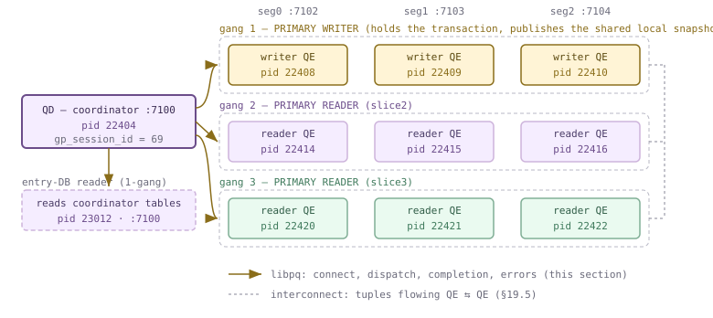

*One session (gp_session_id 69 in the capture above): the QD, its writer gang, two reader gangs, and one entry-DB reader. Every pid is real. Solid amber = libpq, the QD's private control channel to each QE; dashed grey = the interconnect, which [§19.5](#195-interconnect-implementations) owns.*

:::note

**Two setups, two networks.** Gang setup and interconnect setup are different things and it is worth nailing the boundary now. Gang setup is **QD → QE over libpq**, to each segment's ordinary postmaster port (7102/7103/7104 here); it is what this section is about. Interconnect setup is **QE ↔ QE** over separate, ephemeral listeners; [§19.5](#195-interconnect-implementations) owns it. The two meet at exactly one point: when the QD finishes a libpq connection it immediately asks the new QE for its motion listener port (`cdbconn.c:297`) and refuses the gang if there isn't one. That port is then shipped to every peer inside the slice table.

:::

### 19.2.1 One writer, many readers

A gang is deliberately thin — a type, a size, and an array of connection descriptors (`cdbgang.h:32`). All the interesting policy is in the *type*, five values that have not changed in fifteen years:

```c title="src/include/nodes/plannodes.h:231"
typedef enum GangType
{
	GANGTYPE_UNALLOCATED,       /* a root slice executed by the qDisp */
	GANGTYPE_ENTRYDB_READER,    /* a 1-gang with read access to the entry db */
	GANGTYPE_SINGLETON_READER,	/* a 1-gang to read the segment dbs */
	GANGTYPE_PRIMARY_READER,    /* a 1-gang or N-gang to read the segment dbs */
	GANGTYPE_PRIMARY_WRITER		/* the N-gang that can update the segment dbs */
} GangType;
```

- **GANGTYPE_UNALLOCATED** — Not a gang at all: the slice runs in the QD itself. Slice 0 of every plan is this. `InventorySliceTree` still fills in a process list for it, from `getCdbProcessesForQD` (`cdbgang.c:685`), because the QD is a motion endpoint even though nobody dispatched to it.
- **GANGTYPE_ENTRYDB_READER** — A one-process gang on the **coordinator**, used when a plan must scan a coordinator-only relation. That is row `id=9, type=R, content=-1, port=7100` in the capture above: the coordinator connected to its own postmaster and forked a backend for itself.
- **GANGTYPE_SINGLETON_READER** — A one-process gang on **one** segment — what you get for a `numsegments=1` slice, e.g. after direct dispatch ([§16.4](./ch16.md#164-distributed-grouping--direct-dispatch)) or a `Gather` into a single segment.
- **GANGTYPE_PRIMARY_READER** — The workhorse: N processes, one per segment in the slice's segment list. Read-only with respect to the distributed transaction.
- **GANGTYPE_PRIMARY_WRITER** — Also N processes, but this gang **owns the transaction on each segment**. A session has at most one, and reader gangs cannot exist without it.

That last asymmetry is the load-bearing one, and it exists because a transaction has to live *somewhere*. Each segment is a full PostgreSQL instance with its own XID space, its own lock table and its own snapshot machinery; nine peer processes on three segments cannot each independently open a transaction and still be one atomic unit. So on every segment exactly one QE — the writer — begins the local transaction, holds the locks on behalf of the whole session (see the `lockHolderProcPtr` discussion at `execUtils.c:1933`), and publishes its local snapshot into shared memory. Readers attach to it. The branch is taken once per backend, during `InitPostgres`:

```c title="src/backend/utils/init/postinit.c:1453"
	else if (Gp_role == GP_ROLE_EXECUTE)
	{
		if (Gp_is_writer)
		{
			addSharedSnapshot("Writer qExec", gp_session_id);
		}
		else
		{
			/*
			 * NOTE: This assumes that the Slot has already been
			 *       allocated by the writer.  ...
			 */
			lookupSharedSnapshot("Reader qExec", "Writer qExec", gp_session_id);
		}
	}
```

Read that comment as a scheduling constraint on the dispatcher, because that is what it is. The writer must be created first, or every reader on that segment fails its `SharedSnapshotLookup` (`sharedsnapshot.c:472`). The QD honours it explicitly: `AssignGangs` calls `AssignWriterGangFirst` (`execUtils.c:1966`) which descends the slice tree looking for the `GANGTYPE_PRIMARY_WRITER` slice *before* the ordinary top-down walk in `InventorySliceTree` (`execUtils.c:1997`) allocates anything else. The comment at `execUtils.c:1942` gives the case that forced this: a writable CTE, where the updating slice sits *below* a reading slice, so a naive top-down walk would hand the writer QEs to the wrong slice. The same constraint explains the rest of this section's behaviour — a session's writer gang cannot be recycled away mid-transaction (`cdbgang.c:761` spells it out), and killing a writer resets the whole session rather than just failing a statement.

:::note

**Writer-ness is a property of the QE, not of the gang.** A plain `SELECT` asks for `SEGMENTTYPE_ANY` and its slices are typed `GANGTYPE_PRIMARY_READER` — the debug log for the self-join above shows `gangtype=3` for all three slices — yet `gp_backend_info()` still reports three `w` backends. The reason is `cdbutil.c:863`: `isWriter = contentId == -1 ? false : (cdbinfo-&gt;numIdleQEs == 0 &amp;&amp; cdbinfo-&gt;numActiveQEs == 0)`. The *first* QE ever created on a segment in this session becomes the writer, whatever asked for it. A DML statement is the case that *forces* the issue: an `INSERT` logs `segment type = 1` (`SEGMENTTYPE_EXPLICT_WRITER`) and `gangtype=4`, and with direct dispatch `gangsize=1`.

:::

### 19.2.2 Bringing a gang into being

The allocation path is four calls deep and each layer has exactly one job. `AssignGangs` (`execUtils.c:1909`) walks the slice tree; `AllocateGang` (`cdbgang.c:107`) maps the slice's `GangType` to a `SegmentType` request and records the gang on the dispatcher state so it can be recycled later; `buildGangDefinition` (`cdbgang.c:263`) loops over the segment list calling `cdbcomponent_allocateIdleQE(contentId, segmentType)`; and that function either pops a descriptor off the segment's freelist or manufactures a fresh one. Note the division of labour in `buildGangDefinition`: it only *reserves* descriptors. Nothing is connected yet. That is what makes the next step batchable.

A QE is not a special kind of process. It is an ordinary backend, forked by the segment's own postmaster in response to an ordinary libpq connection — `cdbconn.c:283` calls `PQconnectStartParams`. What makes it a QE is two extra connection parameters that CBDB added to libpq itself (`fe-connect.c:411` and `:419`): `gpqeid` and `options`/`diff_options`. `gpqeid` is a semicolon-delimited string built without any palloc or elog, because historically it ran on a thread:

```c title="src/backend/cdb/dispatcher/cdbgang.c:498"
	len = snprintf(buf, bufsz, "%d;" TIMESTAMP_FORMAT ";%s;%d;%d;%d;%d",
				   gp_session_id, PgStartTime,
				   (is_writer ? "true" : "false"), identifier, hostSegs, icHtabSize,
				   qeidx);
```

`postmaster.c:2574` picks `gpqeid` out of the startup packet and `cdbgang_parse_gpqeid_params` (`cdbgang.c:533`) applies it with `PGC_S_OVERRIDE` before authentication — which is how `gp_is_writer` is already set by the time `postinit.c:1455` needs it. The `options` string is a different animal: `makeOptions` (`cdbgang.c:442`) emits `-c name=value` for **every** GUC flagged `GUC_GPDB_NEED_SYNC`, at its *reset* value, plus the QD's own hostname and port; any GUC the session has since changed goes into a second `diff_options` list which the QE applies at `PGC_S_SESSION` (`postinit.c:1718`) so the reset values stay intact. On this cluster that string is **193 `-c` pairs, 6380 bytes**, sent once per connection. Setting `gp_log_gang = debug` prints the whole thing, along with the interconnect port the QD just learned:

*gp_log_gang=debug on a fresh connection. The 6380-byte options string is elided; every fragment shown is verbatim and in its real (alphabetical) order.*

```sql
PGOPTIONS='-c gp_log_gang=debug -c client_min_messages=log' psql -p 7100 -d postgres
select count(*) from m192_s;
```

```text {5} title="output"
LOG:  AllocateGang begin.
LOG:  createGang size = 3, segment type = 3
LOG:  buildGangDefinition:Starting 3 qExec processes for gang
LOG:  buildGangDefinition done
LOG:  Connected to seg1 10.100.0.3:7103 motionListenerPorts=38140/0 with options
       -c gp_qd_hostname=10.100.0.3 -c gp_qd_port=7100
       -c allow_dml_directory_table=false -c array_nulls=true
       [... 187 more -c name=value pairs ...]
       -c gp_interconnect_type=udpifc -c gp_max_packet_size=8192
       -c statement_mem=128000 -c work_mem=32768
LOG:  createGang: 3 processes requested; 3 successful connections 0 in recovery
LOG:  AllocateGang end.
LOG:  getCdbProcessList slice1 gangtype=3 gangsize=3
LOG:  Gang assignment: slice1 seg0 10.100.0.3:58041 pid=14392
LOG:  Gang assignment: slice1 seg1 10.100.0.3:38140 pid=14393
LOG:  Gang assignment: slice1 seg2 10.100.0.3:50190 pid=14394
```

Two details in that log repay attention. `motionListenerPorts=38140/0` packs two ports into one word (`cdbconn.c:305` masks the low and high halves) — the UDP listener and the TCP one, only one of which is populated depending on `gp_interconnect_type`. And the `Gang assignment` lines print `10.100.0.3:58041`, not `:7102` — by that point the QD has stopped caring about postmaster ports and is recording the *interconnect* endpoints it will hand to the peers. Connections are opened in a batch, exactly as `buildGangDefinition` set up: `cdbgang_async.c` fires `cdbconn_doConnectStart` for all N segments (`:177`), then drives them to completion in a single `poll()` loop (`:315`) with a deadline computed from `gp_segment_connect_timeout` (180 s here; `getPollTimeout`, `:413`). The per-QE elapsed time is recorded, and `gp_print_create_gang_time` prints it:

*gp_print_create_gang_time=on: the same three-slice self-join, run twice. Timings are ratios on one --enable-cassert build, not benchmarks.*

```sql
set gp_print_create_gang_time = on;
select count(*) from m192_s a join m192_s b on a.b=b.b;
select count(*) from m192_s a join m192_s b on a.b=b.b;
```

```text {6} title="output"
INFO:  The shortest establish conn time: 6.04 ms, segindex: 0,
       The longest  establish conn time: 6.57 ms, segindex: 2
INFO:  (Slice2) The shortest establish conn time: 5.21 ms, segindex: 0,
                The longest  establish conn time: 5.81 ms, segindex: 1
INFO:  (Slice3) The shortest establish conn time: 5.01 ms, segindex: 0,
                The longest  establish conn time: 5.77 ms, segindex: 2
INFO:  (Slice1) is reused
 count
-------
 10002
(1 row)

INFO:  (Slice2) is reused
INFO:  (Slice3) is reused
INFO:  (Slice1) is reused
 count
-------
 10002
(1 row)
```

Three segments, and the slowest connection in a gang finishes 0.5–0.8 ms after the fastest — the fork-and-authenticate work overlapped. Serially it would have cost the sum. The gang-creation loop also has a retry path most people never see: a `PGRES_POLLING_FAILED` whose error text matches `POSTMASTER_IN_STARTUP_MSG` or `POSTMASTER_IN_RECOVERY_MSG` (`segment_failure_due_to_recovery`, `cdbgang.c:168` — it really does grep the message string, and the comment apologises for it) is treated as retryable, and after `gp_gang_creation_retry_timer` the whole `create_gang_retry` label runs again. Everything else, including the deadline, becomes `ERROR: failed to acquire resources on one or more segments` with the reason in `errdetail` — `timeout expired` (`cdbgang_async.c:302`), a libpq message, or `FTS detected one or more segments are down` (`:378`). I did not induce a segment-down condition on this cluster.

### 19.2.3 Gangs outlive statements

This is the part that is most often got wrong. A gang is **not** created per statement. `cdbdisp_destroyDispatcherState` recycles a session's gangs rather than dropping them, and `cdbcomponent_recycleIdleQE` pushes each descriptor — live libpq connection and all — back onto a per-segment freelist. The next statement pops them straight off. The proof is that the pids do not move:

*Nine QEs, two statements, same pids. Then gp_vmem_idle_resource_timeout is lowered to 100 ms and the client goes idle for two seconds.*

```sql
select count(*) from m192_s a join m192_s b on a.b=b.b;
select count(*) as qes, string_agg(pid::text,' ' order by id) as pids
  from gp_backend_info() where content>=0;
select count(*) from m192_s a join m192_s b on a.b=b.b;   -- same statement again
select count(*) as qes, string_agg(pid::text,' ' order by id) as pids
  from gp_backend_info() where content>=0;
set gp_vmem_idle_resource_timeout = 100;   -- ms; default is 600000
\! sleep 2
```

```text {14} title="output"
 qes |                         pids
-----+-------------------------------------------------------
   9 | 22031 22032 22033 22037 22038 22039 22043 22044 22045
(1 row)

 qes |                         pids
-----+-------------------------------------------------------
   9 | 22031 22032 22033 22037 22038 22039 22043 22044 22045
(1 row)

SET
 qes |       pids
-----+-------------------
   3 | 22031 22032 22033
(1 row)
```

Nine, then the same nine, then three — and the three survivors are precisely the writers, pids `22031 22032 22033`. That is `DisconnectAndDestroyUnusedQEs` calling `cdbcomponent_cleanupIdleQEs(false)`, whose `false` means *do not touch the writers*; [§19.2](#192-the-dispatcher-gangs--async-dispatch).1 explains why it can't. Whether a recycled QE goes back on the freelist or dies is one decision function, `cleanupQE` plus the length check that follows it:

```c title="src/backend/cdb/cdbutil.c:941"
	if (forceDestroy || !cleanupQE(segdbDesc))
		goto destroy_segdb;

	/* If freelist length exceed gp_cached_gang_threshold, destroy it */
	maxLen = segdbDesc->segindex == -1 ?
					MAX_CACHED_1_GANGS : gp_cached_gang_threshold;
	if (!isWriter && list_length(cdbinfo->freelist) >= maxLen)
		goto destroy_segdb;
```

| What ends a QE's life | Where | Note |
| --- | --- | --- |
| Explicit `forceDestroy` from the caller | `RecycleGang(gp, true)`, `cdbgang.c:945` | Set for extended-query/named-portal gangs, and for a partly built gang whose `PG_CATCH` fired |
| Connection already bad, or FTS says the segment is down | `cleanupQE`, `cdbutil.c:895` / `:899` | A dead connection is never cached |
| Reader's peak memory above `gp_vmem_protect_segworker_cache_limit` (500 MB) | `cdbutil.c:903` | Uses libpq's `mop_high_watermark`; a memory-hungry reader is dropped, not reused |
| QE still busy after a 20-attempt result discard | `cdbconn_discardResults`, `cdbutil.c:908` | Logs `cleaning up segN while it is still busy` |
| Freelist already at `gp_cached_segworkers_threshold` (5) | `cdbutil.c:947` | Only readers; writers are exempt and always cached |
| Session idle longer than `gp_vmem_idle_resource_timeout` (600000 ms) | `DisconnectAndDestroyUnusedQEs`, `cdbgang.c:758` | Readers only |
| Writer gang lost | `markCurrentGxactWriterGangLost`, `cdbutil.c:992` | Forces `resetSessionForPrimaryGangLoss` and a new `gp_session_id` |

The freelist cap is easy to see at work. Drop it to 1 and the reader gangs can no longer all be cached, so their pids churn from statement to statement while the writers stay put:

*gp_cached_segworkers_threshold=1: only one idle reader per segment may be cached, so the second statement has to fork fresh readers.*

```sql
set gp_cached_segworkers_threshold = 1;   -- real GUC name; default 5
select count(*) from m192_s a join m192_s b on a.b=b.b;
select type, string_agg(pid::text,' ' order by id) as pids
  from gp_backend_info() where content>=0 group by type order by type;
select count(*) from m192_s a join m192_s b on a.b=b.b;
select type, string_agg(pid::text,' ' order by id) as pids
  from gp_backend_info() where content>=0 group by type order by type;
```

```text {9} title="output"
 type |       pids
------+-------------------
 r    | 23454 23455 23456
 w    | 23440 23441 23442
(2 rows)

 type |       pids
------+-------------------
 r    | 23464 23465 23466
 w    | 23440 23441 23442
(2 rows)
```

A cached QE is a process with stale GUC state, so reuse imposes an obligation: every `SET` must be replayed to gangs that already exist. `CdbDispatchSetCommand` (`cdbdisp_query.c:303`) does exactly that, dispatching the text of the `SET` to all live gangs except extended-query ones — and marking those non-recyclable afterwards (`cdbdisp_markNamedPortalGangsDestroyed`, `:283`), because they missed the update:

*The same three QEs before and after a SET; the value changed underneath them.*

```sql
select seg, setting from gp_dist_random('m192_wm') order by seg;  -- view over pg_settings
select string_agg(pid::text,' ' order by id) as qe_pids
  from gp_backend_info() where content>=0;
set work_mem = '64MB';
select seg, setting from gp_dist_random('m192_wm') order by seg;
select string_agg(pid::text,' ' order by id) as qe_pids
  from gp_backend_info() where content>=0;
```

```text {16} title="output"
 seg | setting
-----+---------
   0 | 32768
   1 | 32768
   2 | 32768
(3 rows)

      qe_pids
-------------------
 23475 23476 23477
(1 row)

SET
 seg | setting
-----+---------
   0 | 65536
   1 | 65536
   2 | 65536
(3 rows)

      qe_pids
-------------------
 23475 23476 23477
(1 row)
```

Put a number on what reuse buys. Establishing one QE cost 5–7 ms above, and it carried 6380 bytes of GUC options; the three-slice self-join needs nine of them. Without the cache, every statement in a session would pay that — and on a real cluster with 48 segments, a nine-slice plan means 432 forks and authentications per statement. This is the deeper half of [§13.2](./ch13.md#132-the-extended-query-protocol)'s point that a prepared statement reuses more than a plan: on CBDB, a warm session is warm in *processes*, and the first statement after connecting is measurably the expensive one.

### 19.2.4 Async dispatch: one QD, N sockets

With gangs in hand, the QD has nine open libpq connections and one serialised plan. It does not walk them in order waiting for each to finish. `cdbdisp_dispatchToGang_async` (`cdbdisp_async.c:303`) loops over the gang and calls `dispatchCommand` on each member, which is a thin wrapper over `PQsendGpQuery_shared(conn, query_text, query_text_len, true)` (`:681`) — the `true` being *non-blocking*, so a congested socket does not stall the loop. Only after every slice has been kicked off does the QD start reading. Two loops make that work: `cdbdisp_waitDispatchFinish_async` (`:218`) polls for `POLLOUT` and flushes the leftovers, then `checkDispatchResult` (`:450`) polls for `POLLIN`:

```c title="src/backend/cdb/dispatcher/cdbdisp_async.c:551"
			/*
			 * Add socket to fd_set if still connected.
			 */
			sock = PQsocket(conn);
			Assert(sock >= 0);
			fds[nfds].fd = sock;
			fds[nfds].events = POLLIN;
			nfds++;
		}
		/* Break out when no QEs still running or required QEs acked. */
		if (nfds <= 0 || ...)
			break;
		n = poll(fds, nfds, timeout);
```

Whichever descriptors come back readable are handed to `handlePollSuccess` → `processResults` → `PQconsumeInput` / `PQisBusy` (`:1006`, `:1019`). Nothing enforces an order. Turning on `gp_log_gang = debug` shows the whole shape of a dispatch in one trace:

*One statement, three gangs, nine QEs. The interleaved 'PQsocket says' and '-> ok SELECT 0' lines have been dropped to keep the trace readable; the ordering of the lines shown is exactly as captured.*

```sql
PGOPTIONS='-c gp_log_gang=debug -c client_min_messages=log' psql -p 7100 -d postgres
select count(*) from m192_s a join m192_s b on a.b=b.b;
```

```text {7} title="output"
LOG:  createGang: 3 processes requested; 3 successful connections 0 in recovery
LOG:  getCdbProcessList slice1 gangtype=3 gangsize=3
LOG:  createGang: 3 processes requested; 3 successful connections 0 in recovery
LOG:  getCdbProcessList slice2 gangtype=3 gangsize=3
LOG:  createGang: 3 processes requested; 3 successful connections 0 in recovery
LOG:  getCdbProcessList slice3 gangtype=3 gangsize=3
LOG:  Query plan size to dispatch: 2KB
LOG:  Command dispatched to QE (seg0 slice2 10.100.0.3:7102 pid=23814)
LOG:  Command dispatched to QE (seg1 slice2 10.100.0.3:7103 pid=23815)
LOG:  Command dispatched to QE (seg2 slice2 10.100.0.3:7104 pid=23816)
LOG:  Command dispatched to QE (seg0 slice3 10.100.0.3:7102 pid=23822)
LOG:  Command dispatched to QE (seg1 slice3 10.100.0.3:7103 pid=23823)
LOG:  Command dispatched to QE (seg2 slice3 10.100.0.3:7104 pid=23824)
LOG:  Command dispatched to QE (seg0 slice1 10.100.0.3:7102 pid=23808)
LOG:  Command dispatched to QE (seg1 slice1 10.100.0.3:7103 pid=23809)
LOG:  Command dispatched to QE (seg2 slice1 10.100.0.3:7104 pid=23810)
LOG:  processResults says we are finished with 4 of 9 (seg0 slice3 ... pid=23822)
LOG:  processResults says we are finished with 5 of 9 (seg1 slice3 ... pid=23823)
LOG:  processResults says we are finished with 6 of 9 (seg2 slice3 ... pid=23824)
LOG:  processResults says we are finished with 2 of 9 (seg1 slice2 ... pid=23815)
LOG:  processResults says we are finished with 3 of 9 (seg2 slice2 ... pid=23816)
LOG:  processResults says we are finished with 1 of 9 (seg0 slice2 ... pid=23814)
LOG:  processResults says we are finished with 9 of 9 (seg2 slice1 ... pid=23810)
LOG:  processResults says we are finished with 7 of 9 (seg0 slice1 ... pid=23808)
LOG:  processResults says we are finished with 8 of 9 (seg1 slice1 ... pid=23809)
```

Four facts fall out of that trace. **All three gangs are allocated before anything is dispatched** — `AssignGangs` runs at `cdbdisp_query.c:1110`, ahead of serialisation. **The plan is serialised exactly once**: one `Query plan size to dispatch` line for nine sends, and `PQsendGpQuery_shared` does not even copy the buffer — it points each `PGconn->outBuffer` at the shared text (`cdbpq.c:45`) and restores the original afterwards. **Slices are dispatched leaves-first**: `slice2`, `slice3`, then the root `slice1`, because `fillSliceVector` sorts by number of dependent children (`compare_slice_order`, `cdbdisp_query.c:719`) so producers are running before their consumer starts pulling. And **completions arrive out of order** — 4,5,6,2,3,1,9,7,8 — which is what asynchrony looks like from the inside. A synchronous dispatcher would have serialised nine `PQexec` round trips, adding nine setup latencies to a statement whose actual work is embarrassingly parallel; the legacy thread-pool knob (`gp_connections_per_thread`) that once controlled this no longer exists in the tree. One last detail worth holding on to: every QE's libpq result here is `ok SELECT 0`, including the root slice's senders. Tuples never travel on these sockets. libpq carries control and completion; the data goes over the interconnect ([§19.5](#195-interconnect-implementations)).

### 19.2.5 What actually crosses the wire

“Dispatching the plan” is a single message, type `'M'`, hand-marshalled by `buildGpQueryString` (`cdbdisp_query.c:868`). Its size computation is the most compact inventory of a dispatch payload in the tree:

```c title="src/backend/cdb/dispatcher/cdbdisp_query.c:921"
	total_query_len = 1 /* 'M' */ +
		sizeof(len) /* message length */ +
		sizeof(gp_command_count) +
		sizeof(sessionUserId) + sizeof(outerUserId) + sizeof(currentUserId) +
		sizeof(n32) * 2 /* currentStatementStartTimestamp */ +
		sizeof(is_hs_dispatch) +
		sizeof(command_len) + sizeof(plantree_len) +
		sizeof(sddesc_len) + sizeof(dtxContextInfo_len) +
		dtxContextInfo_len + command_len + plantree_len + sddesc_len +
		sizeof(numsegments) + sizeof(resgroupInfo.len) + resgroupInfo.len +
		sizeof(tempNamespaceId) + sizeof(tempToastNamespaceId);
```

Three variable-length blobs carry the weight. `plantree` is the serialised `PlannedStmt`, produced by `serializeNode` (`cdbdisp_query.c:656`) and **compressed** — the function returns both the wire length and the uncompressed length, and it is the uncompressed one that `gp_max_plan_size` polices. `sddesc` is the serialised `QueryDispatchDesc` (`execdesc.h:202`), the per-dispatch sidecar the QD cannot put in the plan: the `SliceTable` itself ([§19.3](#193-slice-tables--planslice--gang-mapping)), `paramInfo` with both `PARAM_EXTERN` and already-evaluated `PARAM_EXEC` values, `oidAssignments` so a `CREATE` picks the same OIDs on every segment, `cursorPositions`, `parallelCursorName` for [§19.6](#196-parallel-retrieve-cursor--endpoint), `secContext`, and the matview fields. `dtxContextInfo` is the distributed transaction context and snapshot from `qdSerializeDtxContextInfo` ([§12.2](../part-3-transactions-mvcc-concurrency/ch12.md#122-cloudberrys-2pc-cdbtm-dtxstate--dtxcontext), [§10.5](../part-3-transactions-mvcc-concurrency/ch10.md#105-distributed-snapshots--the-distributed-log)) — the reason all nine QEs see one consistent database state. The rest is small but load-bearing: three user OIDs so `SECURITY DEFINER` and `SET ROLE` behave, the statement start timestamp so `now()` agrees everywhere, the temp-namespace OIDs, and a resource-group blob (Chapter 21). The `command` field is the SQL text, deliberately truncated to `QUERY_STRING_TRUNCATE_SIZE` when a plan is present (`:913`) — it is only there for `pg_stat_activity` on the segment.

| Query | Dispatched slices | Uncompressed plan size |
| --- | --- | --- |
| `select count(*) from m192_s` | 1 | 0 KB |
| 2-table self-join on a non-distribution key | 3 | 2 KB |
| 3-table self-join | 4 | 3 KB |
| 4-table self-join | 5 | 4 KB |
| 6-table self-join | 7 | 6 KB |

Roughly a kilobyte per slice on this schema, and it is the same bytes to every QE — the payload scales with the *plan*, not with the segment count. Each QE then peels the message apart in `PostgresMain` at `postgres.c:5942` (`case 'M': /* MPP dispatched stmt from QD */`), sets its snapshot from the DTX context first, and calls `exec_mpp_query` (`postgres.c:6124`, defined at `:1174`), which installs the slice table, works out which slice it is ([§18.1](./ch18.md#181-executor-framework--lifecycle)'s `getGpExecIdentity`), and runs the ordinary executor lifecycle. [§13.3](./ch13.md#133-dispatch-from-coordinator-plan-to-segment-execution) owns that protocol; the contribution here is the fan-out view. One `buildGpQueryString`, one 2 KB buffer, nine `PQsendGpQuery_shared` calls, and ten independent `ExecutorStart`/`ExecutorRun` traversals of the same plan tree — each one entering it at a different height.

### 19.2.6 When a QE dies

Every segment-side error in this book has carried a parenthesised suffix — `(seg0 slice1 10.100.0.3:7102 pid=9934)`. It is manufactured on the **QD**, not the segment, by `cdbconn_setQEIdentifier`, and it is rebuilt whenever a QE is assigned to a different slice:

```c title="src/backend/cdb/dispatcher/cdbconn.c:429"
	if (segdbDesc->segindex >= 0)
	{
		appendStringInfo(&string, "seg%d", segdbDesc->segindex);
		if (sliceIndex > 0)
			appendStringInfo(&string, " slice%d", sliceIndex);
	}
	else
		appendStringInfo(&string, SEGMENT_IS_ACTIVE_PRIMARY(cdbinfo) ?
						 "entry db" : "mirror entry db");
	appendStringInfo(&string, " %s:%d", cdbinfo->config->hostip, cdbinfo->config->port);
	if (segdbDesc->backendPid != 0)
		appendStringInfo(&string, " pid=%d", segdbDesc->backendPid);
```

The result is stashed as `segdbDesc->whoami` and stapled onto every incoming `PGresult` as a private diagnostics field, `PG_DIAG_GP_PROCESS_TAG` (`cdbdispatchresult.c:345`). When `cdbdisp_get_PQerror` rebuilds a QE's error as a local `ErrorData`, it pulls the tag back out and composes `errmsg("%s  (%s)", fld, whoami)` (`:598`) while preserving the QE's SQLSTATE, file, line and function. That is why a segment error looks like a local error with a return address. To see it, I terminated a reader QE on seg0 from a utility-mode connection while a long join was running, with `statement_timeout` set as a guard:

*Killing a reader QE mid-statement. Session A ran the join twice with statement_timeout=90s; between them a second connection did PGOPTIONS='-c gp_role=utility' psql -p 7102 -c 'select pg_terminate_backend(10791)'.*

```sql
-- session A
SET statement_timeout = '90s';
select min(pid) from gp_backend_info() where type='r' and content=0;   --> 10791
select count(*) from m192_t a join m192_t b on a.b = b.b;
-- (meanwhile, on seg 7102 in utility mode: pg_terminate_backend(10791))
select 'SESSION A STILL ALIVE' as post;
select count(*) from m192_s;
```

```text {6} title="output"
   count
-----------
 514285716
(1 row)

ERROR:  terminating connection due to administrator command  (seg0 slice2 10.100.0.3:7102 pid=10791)
         post
-----------------------
 SESSION A STILL ALIVE
(1 row)

 count
-------
   300
(1 row)
```

The QE's `FATAL` arrived at the QD as an `ERROR` — deliberately, per the comment at `cdbdispatchresult.c:579`: a QE dying must not kill the QD. The statement, however, is unconditionally dead. There is no way to re-run one slice: that QE held part of a hash table and half a redistribution stream, and its peers' Motion receivers were already waiting on a route that will never produce another chunk. So the dispatcher escalates — `checkDispatchResult` promotes `waitMode` to `DISPATCH_WAIT_CANCEL` as soon as any QE reports an error and `cancelOnError` is set (`cdbdisp_async.c:502`), `signalQEs` sends libpq cancels to the survivors (`:912`), and `cdbdisp_getDispatchResults` rethrows the first collected error. Cleanup then runs through `RecycleGang`, and here the writer/reader asymmetry pays off one final time: because the victim was a *reader*, only its descriptor was destroyed, the session's writer gang and transaction survived, and the next statement ran normally on rebuilt readers. Had the writer died, `markCurrentGxactWriterGangLost` (`cdbutil.c:992`) would have forced `resetSessionForPrimaryGangLoss` — a new `gp_session_id`, dropped temp tables, and the log line *“The previous session was reset because its gang was disconnected”* (`cdbgang.c:814`). What none of this covers is *admission*: how many gangs a cluster will let you hold at once, and what happens when the answer is “not yet”. That is Chapter 21's subject. Between here and there, [§19.3](#193-slice-tables--planslice--gang-mapping) takes the payload apart — the slice table that tells each of these nine processes which slice it is.

## 19.3 Slice Tables & PlanSlice ↔ Gang Mapping

A dispatched plan is a *broadcast*: byte for byte, every executor receives the same `PlannedStmt`. Nothing in it says "you are the segment that scans, you are the one that receives". Yet twelve processes must divide that one tree between them without further negotiation. The object that makes this possible is the **slice table**, and it exists in two forms with two different lifetimes: `PlanSlice`, which the planner writes and the dispatcher ships, and `ExecSlice`, which each executor builds locally and which alone knows about processes.

This section is about that pair of structures and the binding between them. [§19.1](#191-distributed-execution-principles) gave you the vocabulary (a slice is the unit of parallelism, a Motion is its boundary) and [§19.2](#192-the-dispatcher-gangs--async-dispatch) owns the *processes* — how gangs are created, reused and recycled. Here we stay on the mapping: which slice is which, which process belongs to it, how a QE discovers its own identity, and — the practical pay-off — how to read a slice tree out of `EXPLAIN` and count the processes a plan will need before you run it.

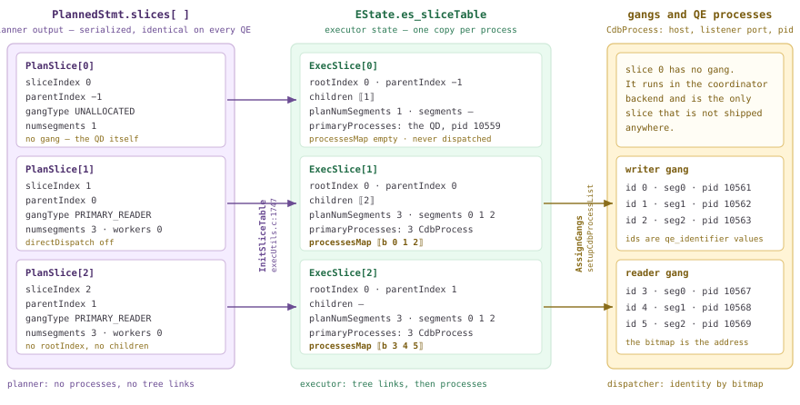

*One slice table, two representations. Left: what the planner decided, shipped inside the plan. Middle: what the executor built from it. Right: what the dispatcher bound to it. `sliceIndex` is the join key across all three.*

### 19.3.1 Two structs, two lifetimes

The planner's slice table is an array hanging off the `PlannedStmt` — `numSlices` entries at `slices` (`src/include/nodes/plannodes.h:110-111`), plus a parallel array `subplan_sliceIds` (`:125`) mapping each SubPlan to the slice that owns it. One entry looks like this.

```c title="src/include/nodes/plannodes.h:244"
typedef struct PlanSlice
{
	int			sliceIndex;
	int			parentIndex;

	GangType	gangType;

	/* # of segments in the gang, for PRIMARY_READER/WRITER slices */
	int			numsegments;
	int			parallel_workers;
	/* segment to execute on, for SINGLETON_READER slices */
	int			segindex;

	/* direct dispatch information, for PRIMARY_READER/WRITER slices */
	DirectDispatchInfo directDispatch;
} PlanSlice;
```

That is the *whole* planner-side description of a slice: an index, a parent, a gang **kind** from the `GangType` enum (`plannodes.h:231`), a segment **count**, and an optional narrowing to specific segments. No process, no address, no tree links. You can read the array straight out of the plan with `debug_print_plan`, which serializes it verbatim (`src/backend/nodes/outfuncs.c:421-433`).

*The planner's slice table for a two-table join, read out of the dispatched PlannedStmt.*

```sql
SET optimizer = off;
SET debug_print_plan = on;
SET client_min_messages = log;
SELECT count(*) FROM m193_fact f JOIN m193_cust c ON f.cust = c.cust;
```

```text {5} title="output"
LOG:  plan:
DETAIL:     {PLANNEDSTMT
   ...
   :subplan_sliceIds  <>
   :numSlices 3
   :slices[i].sliceIndex 0
   :slices[i].parentIndex -1
   :slices[i].gangType 0
   :slices[i].numsegments 1
   :slices[i].parallel_workers 0
   :slices[i].segindex 0
   :slices[i].directDispatch.isDirectDispatch false
   :slices[i].directDispatch.contentIds <>
   :slices[i].sliceIndex 1
   :slices[i].parentIndex 0
   :slices[i].gangType 3
   :slices[i].numsegments 3
   :slices[i].parallel_workers 0
   :slices[i].segindex 0
   :slices[i].directDispatch.isDirectDispatch false
   :slices[i].directDispatch.contentIds <>
   :slices[i].sliceIndex 2
   :slices[i].parentIndex 1
   :slices[i].gangType 3
   :slices[i].numsegments 3
   :slices[i].parallel_workers 0
   ...
```

`gangType 0` is `GANGTYPE_UNALLOCATED` and `3` is `GANGTYPE_PRIMARY_READER`. Note that slice 0 — the one the coordinator runs itself — is *in* the array, with `numsegments 1` and no gang type; [§13.3](./ch13.md#133-dispatch-from-coordinator-plan-to-segment-execution) already noted that this slice is never dispatched. The executor-side struct is much fatter.

```c title="src/include/executor/execdesc.h:89"
typedef struct ExecSlice
{
	int			sliceIndex;
	int			rootIndex;
	int			parentIndex;
	int			planNumSegments;	/* nominal, for hash calculations */
	List	   *children;			/* child slices = receiving Motions */
	GangType	gangType;
	List	   *segments;			/* segment ids that run this slice */
	struct Gang *primaryGang;
	List	   *primaryProcesses;	/* one CdbProcess per worker */
	Bitmapset  *processesMap;		/* which QE runs this slice */
} ExecSlice;
```

| Question | `PlanSlice` (planner) | `ExecSlice` (executor) |
| --- | --- | --- |
| Where it lives | `PlannedStmt.slices[]` | `EState.es_sliceTable->slices[]` |
| Who writes it | `cdbllize_build_slice_table` ([§16.3](./ch16.md#163-parallelization-cdbllize--cdbmutate)) or ORCA's DXL translator ([§17.5](./ch17.md#175-translation-query--dxl--plstmt)) | `InitSliceTable` at `ExecutorStart`, then `AssignGangs` at dispatch |
| Lifetime | planning → serialization → every QE reads the same bytes | one instance per process, per statement |
| Tree links | `parentIndex` only | `parentIndex` + `rootIndex` + `children` list |
| Segment info | `numsegments` (a count) + `directDispatch.contentIds` | `segments` (an actual list of ids) + `planNumSegments` |
| Processes | none | `primaryGang`, `primaryProcesses`, `processesMap` |
| Parallel workers | `parallel_workers` = 0 when not parallel | `parallel_workers` = 1 when not parallel, and `useMppParallelMode` |
| Whose identity | nobody's — the array is symmetric | `SliceTable.localSlice` says *which entry is me* |

### 19.3.2 The hand-off: InitSliceTable, then AssignGangs

`ExecutorStart` on the coordinator calls `InitSliceTable` (`execMain.c:455` → `execUtils.c:1747`). It copies the array, then does two things the planner did not: it walks `parentIndex` upwards to compute each slice's `rootIndex` and appends the child to its parent's `children` list (`execUtils.c:1795-1816`), and it expands `numsegments` into a concrete segment list via `FillSliceGangInfo`.

```c title="src/backend/executor/execUtils.c:1677"
	int factor = ps->parallel_workers ? ps->parallel_workers : 1;
	int numsegments = ps->numsegments;
	...
		case GANGTYPE_PRIMARY_WRITER:
		case GANGTYPE_PRIMARY_READER:
			slice->planNumSegments = numsegments * factor;
			if (dd->isDirectDispatch)
			{
				/* ... one entry per dd->contentIds member, x factor ... */
			}
			else
			{
				for (i = 0; i < numsegments; i++)
					for (j = 0; j < factor; j++)
						slice->segments = lappend_int(slice->segments,
													  i % getgpsegmentCount());
```

`planNumSegments = numsegments × parallel_workers` is the arithmetic [§18.2](./ch18.md#182-scan-nodes) introduced from the scan side; here you see it produce the *gang size*. Now dump the coordinator's copy with `debug_print_slice_table` (`guc_gp.c:731`), which fires at `DEBUG3` right after `InitPlan` (`execMain.c:593`).

*The coordinator's slice table, immediately after InitSliceTable — structure complete, processes absent.*

```sql
SET debug_print_slice_table = on;
SET client_min_messages = debug3;
SELECT count(*) FROM m193_fact f JOIN m193_cust c ON f.cust = c.cust;
```

```text {23} title="output"
DEBUG:  slice table:
DETAIL:     {SLICETABLE
   :localSlice 0
   :numSlices 3
   :slices[i].sliceIndex 0
   :slices[i].rootIndex 0
   :slices[i].parentIndex -1
   :slices[i].planNumSegments 1
   :slices[i].children (i 1)
   :slices[i].gangType 0
   :slices[i].segments <>
   ...
   :slices[i].sliceIndex 1
   :slices[i].rootIndex 0
   :slices[i].parentIndex 0
   :slices[i].planNumSegments 3
   :slices[i].children (i 2)
   :slices[i].gangType 3
   :slices[i].segments (i 0 1 2)
   :slices[i].useMppParallelMode false
   :slices[i].parallel_workers 1
   :slices[i].primaryGang <>
   :slices[i].primaryProcesses <>
   :slices[i].processesMap (b)
   ...
   :hasMotions true
   :ic_instance_id 0
   }
DEBUG:  Query plan size to dispatch: 2KB
```

`children (i 1)` and `children (i 2)` are the tree the planner only implied. `primaryProcesses` and `processesMap` are still empty because this dump happens *before* dispatch: `AssignGangs` (`execUtils.c:1908`) runs later, allocates a gang per slice tree via `InventorySliceTree` (`:1997`) and then calls `setupCdbProcessList` (`cdbgang.c:645`), which fills one `CdbProcess` per worker — host, interconnect listener port, pid, contentid, dbid (`src/include/cdb/cdbgang.h:117`) — and records each worker's identifier in the bitmap (`cdbgang.c:668`). The QEs receive the *result*.

*The same slice table as a QE received it. Now every worker has an address, and the bitmaps partition the processes between slices.*

```sql
-- excerpt from the QE-side copy of the dump above (execMain.c:620)
```

```text {19} title="output"
DEBUG:  slice table:  (seg0 slice1 10.100.0.3:7102 pid=10561)
DETAIL:     {SLICETABLE
   :localSlice 1
   :numSlices 3
   ...
   :slices[i].sliceIndex 1
   :slices[i].planNumSegments 3
   :slices[i].segments (i 0 1 2)
   :slices[i].primaryProcesses (
      {CDBPROCESS
      :listenerAddr \10.100.0.3
      :listenerPort 50429
      :pid 10561
      :contentid 0
      :dbid 2
      }
      ... 2 more, pid 10562 seg1 / pid 10563 seg2 ...
   )
   :slices[i].processesMap (b 0 1 2)
   :slices[i].sliceIndex 2
   :slices[i].segments (i 0 1 2)
   :slices[i].primaryProcesses (
      ... pid 10567 seg0 / pid 10568 seg1 / pid 10569 seg2 ...
   )
   :slices[i].processesMap (b 3 4 5)
   :hasMotions true
   :ic_instance_id 1
   }
```

Those `listenerAddr`/`listenerPort` pairs are the whole reason the slice table travels with the plan: a sending Motion in slice 2 finds its receivers' UDP endpoints by looking up its parent slice's `primaryProcesses` ([§19.5](#195-interconnect-implementations) uses them). And the two disjoint bitmaps `(b 0 1 2)` / `(b 3 4 5)` are the plan-to-gang mapping in its most compressed form. You can see the same mapping from the outside: `gp_log_gang = debug` makes `EXPLAIN` label each slice with its gang's first identifier (`explain.c:1452-1461`), and `gp_backend_info()` lists the session's backends by identifier.

*A five-slice plan: four gangs, twelve QEs, and the identifier arithmetic that ties them together.*

```sql
SET gp_log_gang = debug;
EXPLAIN (ANALYZE, COSTS OFF, TIMING OFF)
SELECT count(*) FROM (SELECT c.region, p.cat, sum(f.amt)
                      FROM m193_fact f JOIN m193_cust c ON f.cust = c.cust
                                       JOIN m193_prod p ON f.prod = p.prod
                      GROUP BY 1,2) x;
SELECT id, type, content, pid FROM gp_backend_info() ORDER BY type DESC, id;
```

```text {2} title="output"
 Finalize Aggregate (actual rows=1 loops=1)
   ->  Gather Motion 3:1  (slice1; gang0; segments: 3) (actual rows=3 loops=1)
         ->  Partial Aggregate (actual rows=1 loops=1)
               ->  Finalize HashAggregate (actual rows=13 loops=1)
                     ->  Redistribute Motion 3:3  (slice2; gang3; segments: 3) (actual rows=39 loops=1)
                           ->  Streaming Partial HashAggregate (actual rows=35 loops=1)
                                 ->  Hash Join (actual rows=66711 loops=1)
                                       ->  Hash Join (actual rows=66711 loops=1)
                                             ->  Seq Scan on m193_fact f (actual rows=66711 loops=1)
                                             ->  Hash (actual rows=1000 loops=1)
                                                   ->  Broadcast Motion 3:3  (slice3; gang6; segments: 3)
                                                         ->  Seq Scan on m193_cust c (actual rows=340 loops=1)
                                       ->  Hash (actual rows=50 loops=1)
                                             ->  Broadcast Motion 3:3  (slice4; gang9; segments: 3)
                                                   ->  Seq Scan on m193_prod p (actual rows=18 loops=1)
   (slice0)    Executor memory: 136K bytes.
 * (slice1)    Executor memory: 130K bytes avg x 3x(0) workers, 130K bytes max (seg0).
 * (slice2)    Executor memory: 2199K bytes avg x 3x(0) workers, 2199K bytes max (seg0).
   (slice3)    Executor memory: 113K bytes avg x 3x(0) workers, 113K bytes max (seg0).
   (slice4)    Executor memory: 113K bytes avg x 3x(0) workers, 113K bytes max (seg0).

 id | type | content |  pid
----+------+---------+-------
  0 | w    |       0 | 12551
  1 | w    |       1 | 12552
  2 | w    |       2 | 12553
  3 | r    |       0 | 12557
 ...
 11 | r    |       2 | 12571
 -1 | Q    |      -1 | 12549
```

:::note

The gang label is not a gang id — GPDB 5 had those and dropped them. It is `slice->primaryGang->db_descriptors[0]->identifier`, i.e. the `qe_identifier` of the gang's *first* member (`explain.c:1452-1461`). So `gang0 / gang3 / gang6 / gang9` on 3 segments means identifiers 0–2, 3–5, 6–8, 9–11 — exactly the `processesMap` bitmaps, and exactly the `id` column of `gp_backend_info()`. Twelve QEs for one `SELECT`.

:::

### 19.3.3 How a QE learns which slice it is

A QE cannot deduce its role from the plan, and it cannot ask — dispatch is one-way and asynchronous ([§19.2](#192-the-dispatcher-gangs--async-dispatch)). Identity arrives through a side channel: when the coordinator opens the libpq connection it passes a `gpqeid` option whose fourth field is the worker's `qe_identifier` (`cdbgang.c:551-562`, parsed before authentication). At `MPPEXEC` time the QE deserializes the slice table and searches the bitmaps for its own number.

```c title="src/backend/tcop/postgres.c:1270"
			/* Identify slice to execute */
			for (i = 0; i < sliceTable->numSlices; i++)
			{
				slice = &sliceTable->slices[i];

				if (bms_is_member(qe_identifier, slice->processesMap))
					break;
			}
			if (i == sliceTable->numSlices)
				elog(ERROR, "could not find QE identifier in process map");
			sliceTable->localSlice = slice->sliceIndex;
```

`localSlice` is therefore the *only* field of the shipped slice table that differs between processes, and it is written by the receiver, not the sender. Everything else — `LocallyExecutingSliceIndex` (`execUtils.c:2532`), `RootSliceIndex` (`:2562`), and [§18.1](./ch18.md#181-executor-framework--lifecycle)'s `getGpExecIdentity` (`:2044`) with its `GP_ROOT_SLICE` / `GP_NON_ROOT_ON_QE` / `GP_IGNORE` verdict — is derived from it. The dump from [§19.3](#193-slice-tables--planslice--gang-mapping).2, grepped across processes, shows the whole population at once.

*Six QEs and one QD, each holding the same slice table with a different localSlice.*

```sql
$ grep -n 'slice table:' st.txt
$ grep -n ':localSlice' st.txt
```

```text {9} title="output"
20:DEBUG:  slice table:
94:DEBUG:  slice table:  (seg0 slice1 10.100.0.3:7102 pid=10561)
192:DEBUG:  slice table:  (seg1 slice1 10.100.0.3:7103 pid=10562)
294:DEBUG:  slice table:  (seg0 slice2 10.100.0.3:7102 pid=10567)
391:DEBUG:  slice table:  (seg2 slice1 10.100.0.3:7104 pid=10563)
493:DEBUG:  slice table:  (seg1 slice2 10.100.0.3:7103 pid=10568)
602:DEBUG:  slice table:  (seg2 slice2 10.100.0.3:7104 pid=10569)

22:   :localSlice 0
96:   :localSlice 1
194:   :localSlice 1
296:   :localSlice 2
393:   :localSlice 1
495:   :localSlice 2
604:   :localSlice 2
```

From that single integer, slice identity propagates into every Motion node. `ExecInitMotion` looks up the sending slice **by the Motion's own `motionID`** — the numbering identity we will lean on in [§19.3](#193-slice-tables--planslice--gang-mapping).4 — and then picks the node's role by comparing the local slice with the two ends.

```c title="src/backend/executor/nodeMotion.c:708"
	/* Look up the sending and receiving gang's slice table entries. */
	sendSlice = &sliceTable->slices[node->motionID];
	Assert(sendSlice->sliceIndex == node->motionID);
	recvSlice = &sliceTable->slices[parentIndex];
	...
		if (LocallyExecutingSliceIndex(estate) == recvSlice->sliceIndex)
		{
			/* this is recv */
			motionstate->mstype = MOTIONSTATE_RECV;
		}
		else if (LocallyExecutingSliceIndex(estate) == sendSlice->sliceIndex)
		{
			/* this is send */
			motionstate->mstype = MOTIONSTATE_SEND;
		}
```

A Motion that is neither this QE's sender nor its receiver keeps `MOTIONSTATE_NONE`, and executing one raises `cannot execute inactive Motion` (`nodeMotion.c:197`). Normally that never happens, because a QE does not even *build* the foreign parts of the tree: `execute_pruned_plan` (default on, `guc_gp.c:2897`) sets `estate->eliminateAliens` (`execMain.c:564`), and `InitPlan` then finds the local slice's sending Motion and starts `ExecInitNode` **there** instead of at the plan root (`execMain.c:1936-1944`), also restricting which SubPlans get initialized (`:1972-1973`). Turn the pruning off and the design assumption becomes visible.

*With alien elimination disabled, a QE initializes the whole tree — and immediately tries to run a Motion that belongs to another slice.*

```sql
SET explain_memory_verbosity = detail;
SET execute_pruned_plan = on;   -- default
EXPLAIN (ANALYZE, COSTS OFF, TIMING OFF)
  SELECT count(*) FROM m193_fact f JOIN m193_cust c ON f.cust = c.cust;
-- ... plan prints normally, with per-slice memory:
--    (slice0) Executor memory: 261K bytes.  Vmem reserved: 15360K bytes.
--    (slice1) Executor memory: 4524K bytes avg x 3x(0) workers ...
--    (slice2) Executor memory: 125K bytes avg x 3x(0) workers ...

SET execute_pruned_plan = off;
EXPLAIN (ANALYZE, COSTS OFF, TIMING OFF)
  SELECT count(*) FROM m193_fact f JOIN m193_cust c ON f.cust = c.cust;
```

```text {1} title="output"
ERROR:  cannot execute inactive Motion (nodeMotion.c:197)  (seg1 slice2 10.100.0.3:7103 pid=11745) (nodeMotion.c:197)
```

### 19.3.4 Reading a slice tree from EXPLAIN

`EXPLAIN` has a Cloudberry-only option, `SLICETABLE`, which appends the executor slice table in the same shape the source comments use (`explain.c:1054-1096`). It is the fastest way to see structure that the tree indentation only hints at. Here is a three-way join with a two-stage aggregate: five slices, one of them the coordinator's.

*Five slices. The indented tree shows containment; the slice table shows the parent-child graph.*

```sql
SET optimizer = off;
EXPLAIN (SLICETABLE ON, COSTS OFF)
SELECT count(*) FROM (SELECT c.region, p.cat, sum(f.amt)
                      FROM m193_fact f JOIN m193_cust c ON f.cust = c.cust
                                       JOIN m193_prod p ON f.prod = p.prod
                      GROUP BY 1,2) x;
```

```text {24} title="output"
 Finalize Aggregate
   ->  Gather Motion 3:1  (slice1; segments: 3)
         ->  Partial Aggregate
               ->  Finalize HashAggregate
                     Group Key: c.region, p.cat
                     ->  Redistribute Motion 3:3  (slice2; segments: 3)
                           Hash Key: c.region, p.cat
                           ->  Streaming Partial HashAggregate
                                 Group Key: c.region, p.cat
                                 ->  Hash Join
                                       Hash Cond: (f.prod = p.prod)
                                       ->  Hash Join
                                             Hash Cond: (f.cust = c.cust)
                                             ->  Seq Scan on m193_fact f
                                             ->  Hash
                                                   ->  Broadcast Motion 3:3  (slice3; segments: 3)
                                                         ->  Seq Scan on m193_cust c
                                       ->  Hash
                                             ->  Broadcast Motion 3:3  (slice4; segments: 3)
                                                   ->  Seq Scan on m193_prod p
 Slice 0: Dispatcher; root 0; parent -1; gang size 0
 Slice 1: Reader; root 0; parent 0; gang size 3
 Slice 2: Reader; root 0; parent 1; gang size 3
 Slice 3: Reader; root 0; parent 2; gang size 3
 Slice 4: Reader; root 0; parent 2; gang size 3
 Optimizer: Postgres query optimizer
```

Read it as follows. **The `sliceN` label on a Motion names the slice *below* it** — the senders — because the slice index *is* the Motion's `motionID`. The receiving slice is the one containing the Motion node, which is `parentIndex`. So slices 3 and 4 both report `parent 2`: two Broadcast Motions feeding the same hash-join slice, which is why the tree is a *tree* and not a chain. Slice 0 is the coordinator's (`Dispatcher`, `GANGTYPE_UNALLOCATED`, `gang size 0`, never dispatched), and the top Gather is always `slice1` because motion ids are handed out during slice-table construction ([§16.3](./ch16.md#163-parallelization-cdbllize--cdbmutate); ORCA produces the identical shape for this query — [§17.5](./ch17.md#175-translation-query--dxl--plstmt)). Finally, `segments: N` is `list_length(slice->segments)` (`explain.c:1438`), **not** `planNumSegments` — and the two differ exactly when direct dispatch is in play.

*Direct dispatch: one QE runs the slice, but the hash arithmetic still believes in three segments.*

```sql
EXPLAIN (SLICETABLE ON, COSTS OFF) SELECT * FROM m193_fact WHERE id = 42;
-- then, with debug_print_slice_table on, the same query:
```

```text {11} title="output"
 Gather Motion 1:1  (slice1; segments: 1)
   ->  Seq Scan on m193_fact
         Filter: (id = 42)
 Slice 0: Dispatcher; root 0; parent -1; gang size 0
 Slice 1: Reader; root 0; parent 0; gang size 1

DEBUG:  slice table:
   ...
   :slices[i].sliceIndex 1
   :slices[i].parentIndex 0
   :slices[i].planNumSegments 3
   :slices[i].gangType 3
   :slices[i].segments (i 0)

-- and the planner-side entry, from debug_print_plan:
   :slices[i].numsegments 3
   :slices[i].directDispatch.isDirectDispatch true
   :slices[i].directDispatch.contentIds (i 0)
```

That is what the comment at `execdesc.h:112-114` means by "nominal # of segments, for hash calculations. Can be different from gangSize, if direct dispatch": the row for `id = 42` lives on the segment chosen by a 3-way hash ([§16.4](./ch16.md#164-distributed-grouping--direct-dispatch)), so the surviving QE must keep hashing modulo 3 even though it is alone. Intra-segment parallelism moves the same number in the opposite direction.

*With intra-segment parallelism the segment list gains duplicates: 3 segments x 2 workers = a gang of 6.*

```sql
SET enable_parallel = on;
SET min_parallel_table_scan_size = 0;
SET parallel_setup_cost = 0;
EXPLAIN (SLICETABLE ON, COSTS OFF) SELECT count(*) FROM m193_fact;
-- with debug_print_slice_table on:
```

```text {11} title="output"
 Finalize Aggregate
   ->  Gather Motion 6:1  (slice1; segments: 6)
         ->  Partial Aggregate
               ->  Parallel Seq Scan on m193_fact
 Slice 0: Dispatcher; root 0; parent -1; gang size 0
 Slice 1: Reader; root 0; parent 0; gang size 6

DEBUG:  slice table:
   :slices[i].sliceIndex 1
   :slices[i].planNumSegments 6
   :slices[i].segments (i 0 0 1 1 2 2)
   :slices[i].useMppParallelMode true
   :slices[i].parallel_workers 2
```

| Query on this 3-segment cluster | slices | QE slices x gang size | QEs in the session |
| --- | --- | --- | --- |
| `SELECT * FROM m193_fact WHERE id = 42` | 2 | 1 x 1 (direct dispatch) | **1** |
| `count(*)` over a 2-table join | 3 | 2 x 3 | **6** |
| `count(*)` over a 3-table join + two-stage agg | 5 | 4 x 3 | **12** |
| `count(*)` with `enable_parallel = on` | 2 | 1 x 6 (3 segs x 2 workers) | **6** |
| `count(*)` with an uncorrelated scalar subquery | 4 | 2 x 3, run one after the other | **3** (gang reused) |

:::note

All five counts were measured in fresh sessions with `gp_backend_info()`, using `PGOPTIONS` rather than `SET` — because a `SET` statement itself goes through `CdbDispatchSetCommand`, which allocates a **full writer gang across all segments** (`cdbdisp_query.c:303,323`). Run one `SET` before the direct-dispatch query and the session shows 3 QEs instead of 1. Also: `numSlices` is capped — `SET gp_max_slices = 3` then running the five-slice query gives `ERROR: at most 3 slices are allowed in a query, current number: 5` from `execUtils.c:1758`, before any gang is created.

:::

### 19.3.5 Subplan and InitPlan slices, and what rootIndex is for

Everything so far had one root. `rootIndex` exists because a slice table can hold **several disjoint slice trees**: [§18.6](./ch18.md#186-subqueries--other-nodes) showed that an InitPlan gets its own gang and its own interconnect, and structurally that means its top slice has `parentIndex = -1` — a second root in the same array.

*Four slices, two roots. Slice 2 is a second Dispatcher slice; slice 3 hangs under it.*

```sql
EXPLAIN (SLICETABLE ON, COSTS OFF)
SELECT count(*) FROM m193_fact WHERE amt > (SELECT avg(amt) FROM m193_fact);
```

```text {13} title="output"
 Finalize Aggregate
   InitPlan 1 (returns $0)  (slice2)
     ->  Finalize Aggregate
           ->  Gather Motion 3:1  (slice3; segments: 3)
                 ->  Partial Aggregate
                       ->  Seq Scan on m193_fact m193_fact_1
   ->  Gather Motion 3:1  (slice1; segments: 3)
         ->  Partial Aggregate
               ->  Seq Scan on m193_fact
                     Filter: (amt > $0)
 Slice 0: Dispatcher; root 0; parent -1; gang size 0
 Slice 1: Reader; root 0; parent 0; gang size 3
 Slice 2: Dispatcher; root 2; parent -1; gang size 0
 Slice 3: Reader; root 2; parent 2; gang size 3
```

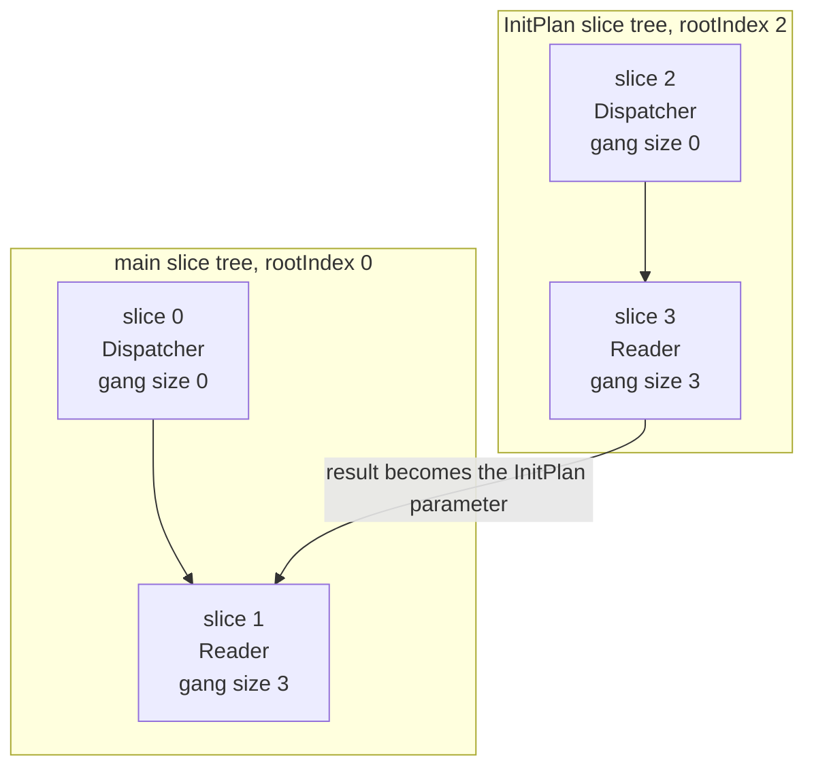

*Two slice trees in one slice table. The InitPlan tree is dispatched first, in its entirety, before the main tree starts.*

The planner records the ownership in `subplan_sliceIds` — for this plan `debug_print_plan` prints `:subplan_sliceIds  2`, one entry for one SubPlan — and the coordinator uses it to *retarget itself*: `preprocess_initplans` reads the array, checks that the slice really is a root (`parentIndex == -1`, otherwise it is an ordinary subplan on slice 0), and temporarily rewrites its own `localSlice`.

```c title="src/backend/cdb/cdbsubplan.c:134"
			if (qDispSliceId > 0)
			{
				/*
				 * Adjust for the slice to execute on the QD.
				 */
				rootIndex = qDispSliceId;
				queryDesc->estate->es_sliceTable->localSlice = rootIndex;

				/* set our global sliceid variable for elog. */
				currentSliceId = rootIndex;
				...
				ExecSetParamPlan(sps, sps->planstate->ps_ExprContext, queryDesc);
```

So the coordinator dispatches slice 3 as its own statement, gathers the scalar, restores `localSlice` to 0 (`cdbsubplan.c:170`) and only then dispatches the main tree. Two consequences are visible in `EXPLAIN ANALYZE`: the two trees can share one gang, because they never run at the same time — and the main dispatch does not account for the InitPlan slice's workers at all.

*slice1 and slice3 both report gang0 — the same three QEs, used twice. And slice3's workers are marked as not part of this dispatch.*

```sql
SET gp_log_gang = debug;
EXPLAIN (ANALYZE, COSTS OFF, TIMING OFF)
SELECT count(*) FROM m193_fact WHERE amt > (SELECT avg(amt) FROM m193_fact);
```

```text {4} title="output"
 Finalize Aggregate (actual rows=1 loops=1)
   InitPlan 1 (returns $0)  (slice2)
     ->  Finalize Aggregate (actual rows=1 loops=1)
           ->  Gather Motion 3:1  (slice3; gang0; segments: 3) (actual rows=3 loops=1)
                 ->  Partial Aggregate (actual rows=1 loops=1)
                       ->  Seq Scan on m193_fact m193_fact_1 (actual rows=66711 loops=1)
   ->  Gather Motion 3:1  (slice1; gang0; segments: 3) (actual rows=3 loops=1)
         ->  Partial Aggregate (actual rows=1 loops=1)
               ->  Seq Scan on m193_fact (actual rows=33778 loops=1)
                     Filter: (amt > $0)
                     Rows Removed by Filter: 32858
   (slice0)    Executor memory: 116K bytes.
   (slice1)    Executor memory: 120K bytes avg x 3x(0) workers, 120K bytes max (seg0).
   (slice2)    Executor memory: 60K bytes.
 _ (slice3)    Workers: Workers: 3 not dispatched;.
 Executor memory: 119K bytes avg x 3x(0) workers, 119K bytes max (seg0).
```

### 19.3.6 Instruments

- **`EXPLAIN (SLICETABLE ON)`** — The one instrument you should reach for first. Prints `Slice N: <gang type>; root R; parent P; gang size G` per slice, plus `; segment S` for singleton readers (`explain.c:1054`). Works without `ANALYZE`, so it costs nothing.
- **`gp_log_gang = debug`** — Adds `gang<id>` to every slice label in `EXPLAIN`, where the id is the gang's first `qe_identifier` (`explain.c:1452`). Combined with `gp_backend_info()` this gives you slice → gang → pid in two queries.
- **`gp_backend_info()`** — QD-side inventory of the session's backends: `id` (the `qe_identifier` used in `processesMap`), `type` (`Q`/`w`/`r`), `content`, `host`, `port`, `pid`. Use it to count the QEs a plan actually needed.
- **`debug_print_slice_table`** — Dumps the whole `SliceTable` node at `DEBUG3` — on the coordinator before dispatch (`execMain.c:593`, unbound) and on each QE after it (`:620`, bound, with `CdbProcess` addresses and `localSlice`). The only way to see `processesMap` and the interconnect endpoints.
- **`debug_print_plan`** — Contains the planner-side `PlanSlice` array and `subplan_sliceIds` verbatim (`outfuncs.c:421-433`) — the right place to check `numsegments`, `parallel_workers` and `directDispatch.contentIds` *before* the executor reinterprets them.
- **`gp_log_interconnect = debug`** — Makes every QE log one line, `seg%d executing slice%d under root slice%d` (`execMain.c:623-627`) — the cheapest possible confirmation of slice identity. [§19.5](#195-interconnect-implementations) owns the rest of what this GUC prints.

:::note

One trap worth knowing: `debug_print_slice_table` is listed in `src/include/utils/unsync_guc_name.h:94`, so it is **not** among the GUCs the coordinator puts in a QE's startup options (`cdbgang.c:464` only forwards `GUC_GPDB_NEED_SYNC` ones). A plain `SET` reaches the writer gang and any *currently idle* reader QEs (`cdbdisp_query.c:303-330`) — so if you enable it as the first statement of a session, only the writer gang's QEs will echo their copy. Run any query first so the reader gangs exist, then `SET`, and all of them do. Verified both ways on this cluster.

:::

That completes the mapping. A plan enters the executor as an array of `PlanSlice`s that knows only counts; it leaves `AssignGangs` as an array of `ExecSlice`s that knows host names, ports and pids; and each of the N+1 processes finds itself in that array by looking up one integer it was told at connection time. [§19.4](#194-motion-nodes) now opens the Motion node itself and follows a tuple from a sender's `ExecProcNode` to a receiver's, using precisely the `primaryProcesses` lists you have just seen.

## 19.4 Motion Nodes

Every plan in Chapters 13 through 18 carried lines like `Gather Motion 3:1` and `Redistribute Motion 3:3`, and every time we read them as annotations. Here they become code. A `Motion` is an ordinary `Plan` node with an ordinary `ExecProcNode` callback (`nodeMotion.c:702`), and it is initialised on **every** process that participates in the query — but it behaves completely differently depending on which side of the wire that process is on. [§19.1](#191-distributed-execution-principles) framed the duality and [§19.3](#193-slice-tables--planslice--gang-mapping) owns the identity question (*which slice am I?*); this section is the machinery.

There are three layers stacked here and it pays to keep them apart. `nodeMotion.c` (1405 lines) is the **executor node**: it decides sender-versus-receiver, computes a destination route per tuple, and runs the merge heap for a sorted Gather. `cdbmotion.c` (1400 lines) is the **Motion layer**: it serialises a slot into a byte stream, cuts the stream into `TupleChunk`s, reassembles chunks back into tuples per sender, counts end-of-stream tokens, and keeps the per-node statistics. Below it sits one function-pointer call, `CurrentMotionIPCLayer->SendTupleChunkToAMS()`, and everything past that is [§19.5](#195-interconnect-implementations).

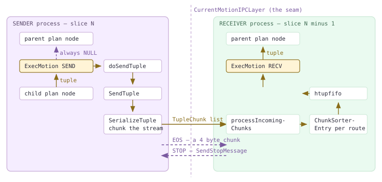

*One Motion node, two implementations. The sender pulls from its child and returns NULL upward; the receiver pulls from the interconnect and returns tuples upward. The dashed vertical line is the vtable seam of [§19.5](#195-interconnect-implementations).*

:::note

Look at the left-hand column again. The sender's `ExecMotion` returns **NULL, always** — never a tuple. It is a legitimate plan node whose `ExecProcNode` produces no output at all: it drains its child, pushes every tuple sideways onto the wire, sends an end-of-stream token, and reports "no rows" upward so that the slice's top-level `ExecutePlan` loop terminates. Every other node in the book returns tuples to its parent. This one is a sink.

:::

### 19.4.1 One node, two implementations

`ExecMotion` is a three-way branch on `MotionState.mstype`, and a second branch on whether the plan asked for order preservation.

```c title="src/backend/executor/nodeMotion.c:125"
	if (node->mstype == MOTIONSTATE_RECV)
	{
		...
		if (motion->sendSorted)
			tuple = execMotionSortedReceiver(node);
		else
			tuple = execMotionUnsortedReceiver(node);
		...
	}
	else if (node->mstype == MOTIONSTATE_SEND)
		return execMotionSender(node);
	else
		elog(ERROR, "cannot execute inactive Motion");
```

`mstype` is decided once, in `ExecInitMotion`. On a QE it is a straight comparison of `LocallyExecutingSliceIndex(estate)` against the two slice indexes the node straddles (`nodeMotion.c:751-760`): equal to the *parent* slice means receive, equal to the *sending* slice means send, and neither means this process is an alien to this Motion and the node stays `MOTIONSTATE_NONE`. On the QD, a `Gather`'s receiving slice is the root slice, so the QD is always the receiver (`nodeMotion.c:720-741`). That is the whole of the sender/receiver duality: no negotiation, no runtime role election, just an integer comparison against the slice table [§19.3](#193-slice-tables--planslice--gang-mapping) shipped with the plan.

The sender is a tight loop with three exits — child exhausted, receiver stopped, or an error:

```c title="src/backend/executor/nodeMotion.c:251"
		if (done || TupIsNull(outerTupleSlot))
		{
			doSendEndOfStream(motion, node);
			done = true;
		}
		...
		else
		{
			doSendTuple(motion, node, outerTupleSlot);
			if (node->stopRequested)
			{
				ExecSquelchNode(outerNode, true);   /* tell the children */
				done = true;
			}
		}
```

Note what is *not* there: on the stop path the sender exits **without** sending end-of-stream. The receiver already said it does not want any more, so there is nobody left who cares. The loop's postcondition is the invariant `Assert(node->stopRequested || node->numTuplesFromChild == node->numTuplesToAMS)` (`nodeMotion.c:299`) — either every tuple pulled from the child went to the wire, or we were stopped. `ExecSquelchNode` is [§18.1](./ch18.md#181-executor-framework--lifecycle)'s; the Motion node is simply the place where a network-level stop turns back into an executor-level squelch.

### 19.4.2 The four motion types, and how a route is computed

A route is a small integer: the index of a receiving process within the parent slice's `primaryProcesses` list. `doSendTuple` (`nodeMotion.c:1181`) exists to turn a tuple into a route, and it is a plain if-chain over `motion->motionType`. There are six enum values (`plannodes.h:1878-1887`), of which `MOTIONTYPE_OUTER_QUERY` is a planner placeholder resolved before execution, so five reach the executor.

| EXPLAIN label | MotionType | how the destination route is computed | source |
| --- | --- | --- | --- |
| Gather Motion | MOTIONTYPE_GATHER | Fixed: route 0. The parent slice has exactly one process, so the code does not even consult it. | nodeMotion.c:1197-1207 |
| Explicit Gather Motion | MOTIONTYPE_GATHER_SINGLE | Route 0 as well, but only one segment actually sends: the one where GpIdentity.segindex equals gp_session_id modulo numInputSegs. The others execute the subplan and throw the tuples away. | nodeMotion.c:256-264 |
| Redistribute Motion | MOTIONTYPE_HASH | cdbhash over the motion's hashExprs, reduced with cdbhashreduce to a segment index; with intra-segment parallelism a second hash picks the worker. | nodeMotion.c:1265-1297 |
| Broadcast Motion | MOTIONTYPE_BROADCAST | The pseudo-route BROADCAST_SEGIDX, which is -2 so it can never collide with a real route. One SendTuple call; the transport does the fan-out. | nodeMotion.c:1209-1212, tupchunk.h:59 |
| Broadcast Workers Motion | MOTIONTYPE_BROADCAST_WORKERS | The node itself loops over receiving segments, one SendTuple each, picking a worker inside each segment with random() modulo parallel_workers. | nodeMotion.c:1213-1263 |
| Explicit Redistribute Motion | MOTIONTYPE_EXPLICIT | slot_getattr of the junk column at motion->segidColIdx — the destination travels inside the tuple. | nodeMotion.c:1299-1309 |

The interesting one is `MOTIONTYPE_HASH`, because it raises a question the book has been circling since [§16.1](./ch16.md#161-the-locus-model-cdbpathlocus): is a Redistribute Motion's hash *the same hash* the storage layer uses to place rows? [§16.4](./ch16.md#164-distributed-grouping--direct-dispatch) proved direct dispatch uses `cdbhash`. Here is the answer, and it is unambiguous.

```c title="src/backend/executor/nodeMotion.c:1105"
		cdbhashinit(h);
		i = 0;
		foreach(hk, hashkeys)
		{
			keyval = ExecEvalExpr((ExprState *) lfirst(hk), econtext, &isNull);
			cdbhash(h, i + 1, keyval, isNull);
			i++;
		}
		target_seg = cdbhashreduce(h);
```

That is `evalHashKey`, and it is exactly the sequence `cdbtargeteddispatch.c:333` (direct dispatch, [§16.4](./ch16.md#164-distributed-grouping--direct-dispatch)), `copyfrom.c:4096` (COPY's row placement) and `nodeSplitUpdate.c:64` all run. The `CdbHash` is built by `makeCdbHash(numHashSegments, nkeys, node->hashFuncs)` at `nodeMotion.c:834`, and `hashFuncs` was filled in at plan time by `cdb_hashproc_in_opfamily()` (`cdbmutate.c:122`) — the same opclass hash procedure the distribution policy resolves. Not a look-alike: the same functions, the same reduction (`cdbhash.c:253`). Which means a Redistribute Motion on column `k` deposits each row on precisely the segment where a table `DISTRIBUTED BY (k)` would have stored it. We can watch that happen: `gp_execution_segment()` evaluated *below* the Gather reports the segment that actually processed the row.

*Left: where a hash-distributed table physically stores each key. Right: where a Redistribute Motion sends the same keys, read out of a randomly-distributed table. Identical, row for row.*

```sql
-- storage placement
SELECT gp_segment_id, k FROM m194_hash ORDER BY k;

-- routing decided by Redistribute Motion (m194_rand is DISTRIBUTED RANDOMLY)
EXPLAIN (costs off) SELECT gp_execution_segment() AS seg, k
  FROM (SELECT k FROM m194_rand GROUP BY k) t;
SELECT gp_execution_segment() AS seg, k
  FROM (SELECT k FROM m194_rand GROUP BY k) t ORDER BY k;
```

```text {32,43} title="output"
 gp_segment_id | k  
---------------+----
             1 |  1
             0 |  2
             0 |  3
             0 |  4
             2 |  5
             2 |  6
             0 |  7
             0 |  8
             2 |  9
             2 | 10
             2 | 11
             1 | 12
(12 rows)

                            QUERY PLAN                            
------------------------------------------------------------------
 Gather Motion 3:1  (slice1; segments: 3)
   ->  GroupAggregate
         Group Key: k
         ->  Sort
               Sort Key: k
               ->  Redistribute Motion 3:3  (slice2; segments: 3)
                     Hash Key: k
                     ->  Seq Scan on m194_rand
 Optimizer: GPORCA
(9 rows)

 seg | k  
-----+----
   1 |  1
   0 |  2
   0 |  3
   0 |  4
   2 |  5
   2 |  6
   0 |  7
   0 |  8
   2 |  9
   2 | 10
   2 | 11
   1 | 12
(12 rows)
```

`MOTIONTYPE_EXPLICIT` is the opposite design: instead of computing a destination, the sender reads one out of the tuple. [§18.7](./ch18.md#187-cloudberry-specific-nodes) showed where the value comes from — a `Split Update` emits the row's original `gp_segment_id` as a junk column — and `EXPLAIN VERBOSE` shows it riding along in the Motion's output list.

*An Explicit Redistribute Motion. The target table is DISTRIBUTED RANDOMLY, so a modified row has to go back to the segment it came from; gp_segment_id is carried through the join for exactly that purpose.*

```sql
SET optimizer=off;
EXPLAIN (costs off, verbose) UPDATE m194_rand r SET v = h.v FROM m194_hash h WHERE r.k = h.k;
```

```text {5} title="output"
                            QUERY PLAN                            
------------------------------------------------------------------
 Update on public.m194_rand r
   ->  Explicit Redistribute Motion 3:3  (slice1; segments: 3)
         Output: h.v, r.ctid, r.gp_segment_id, h.ctid
         ->  Hash Join
               Output: h.v, r.ctid, r.gp_segment_id, h.ctid
               Hash Cond: (r.k = h.k)
               ->  Redistribute Motion 3:3  (slice2; segments: 3)
                     Output: r.ctid, r.gp_segment_id, r.k
                     Hash Key: r.k
                     ->  Seq Scan on public.m194_rand r
               ->  Hash
                     Output: h.v, h.ctid, h.k
                     ->  Seq Scan on public.m194_hash h
(17 rows)
```

:::note

Two asides on the exotic types. **Broadcast** and **Broadcast Workers** split the fan-out responsibility differently: plain broadcast makes *one* `SendTuple` call with route `-2` and lets the transport replicate, while the parallel variant loops inside `doSendTuple`. A consequence is that broadcast can never use the zero-copy path of [§19.4](#194-motion-nodes).3 — `CandidateForSerializeDirect()` refuses route `-2` outright (`tupser.c:334`). And **Explicit Gather Motion** is genuinely rare: it is emitted only when the sender's locus is `Replicated` (`createplan.c:3492`), and which segment does the sending is chosen by `gp_session_id % numInputSegs` — a load-spreading trick that makes the same query send from a different segment in a different session.

:::

### 19.4.3 Serialization and chunking — and who chooses the chunk size

`SendTuple` (`cdbmotion.c:426`) has a fast path and a slow path, and it tries the fast one first. It asks the transport for a pointer straight into the outgoing packet buffer (`GetTransportDirectBuffer`, `cdbmotion.c:458`), and if the whole tuple fits there, `SerializeTuple` writes the chunk header and the tuple body *in place* and returns a byte count — no chunk list, no intermediate copy.

```c title="src/backend/cdb/motion/tupser.c:450"
	if (CandidateForSerializeDirect(targetRoute, b) &&
		tuplen + TUPLE_CHUNK_HEADER_SIZE <= b->prilen)
	{
		memcpy(b->pri + TUPLE_CHUNK_HEADER_SIZE, &tupbodylen, sizeof(tupbodylen));
		memcpy(b->pri + TUPLE_CHUNK_HEADER_SIZE + sizeof(int), tupbody, tupbodylen);
		dataSize += tuplen;
		SetChunkType(b->pri, TC_WHOLE);
		SetChunkDataSize(b->pri, dataSize - TUPLE_CHUNK_HEADER_SIZE);
		return dataSize;
	}
```

The serialized form of a tuple is disarmingly simple: a 4-byte body length, then the raw `MinimalTuple` body (everything from `MINIMAL_TUPLE_DATA_OFFSET` onward). Toasted attributes are detoasted first (`tupser.c:402-440`) — a TOAST pointer would be meaningless in another process, the same class of problem `tupleremap.c` solves for record typmods in [§19.4](#194-motion-nodes).5. When the tuple does *not* fit the direct buffer, the stream is cut into `TupleChunk`s by `addByteStringToChunkList` (`tupser.c:190`), and each chunk gets a 4-byte header: a `uint16` payload length and a `uint16` type tag.

```c title="src/include/cdb/tupchunk.h:21"
typedef enum TupleChunkType
{
	TC_WHOLE,			/* Contains a whole tuple. */
	TC_PARTIAL_START,	/* Contains the starting portion of a tuple. */
	TC_PARTIAL_MID,		/* Contains a middle part of a tuple. */
	TC_PARTIAL_END,		/* Contains the final portion of a tuple. */
	TC_END_OF_STREAM,	/* Indicates "end of tuples" from this source. */
	TC_EMPTY,			/* Empty tuple */
	TC_MAXVAL
} TupleChunkType;
```

The maximum chunk size is not a constant and not a GUC: it is asked of the transport, once per query, through the vtable. `Gp_max_tuple_chunk_size = CurrentMotionIPCLayer->GetMaxTupleChunkSize()` (`cdbmotion.c:169`). `udpifc` answers `Gp_max_packet_size - sizeof(struct icpkthdr) - 4` (`ic_udpifc.c:8179`) and `tcp` answers `Gp_max_packet_size - PACKET_HEADER_SIZE - 4` (`ic_tcp.c:3365`). With `gp_max_packet_size = 8192` on this cluster, and `sizeof(icpkthdr)` = 88 against TCP's 4-byte length prefix, that is **8100 bytes over UDP and 8184 over TCP**. The same tuple therefore fragments differently depending on which transport is loaded — the clearest illustration in the chapter of what the vtable seam actually buys.

<RawFigure html={"<div style=\"overflow-x:auto;font-family:ui-monospace,SFMono-Regular,Menlo,monospace;font-size:12px;line-height:1.5;color:#2b2b3a\"> <div style=\"margin-bottom:10px;color:#5a4a6a\">TupleChunk header — 4 bytes, and the length does NOT include the header (tupchunk.h:34-49)</div> <div style=\"display:flex;max-width:520px;margin-bottom:4px\"> <div style=\"flex:2;background:#f5edff;border:1.5px solid #cdb4db;padding:7px 6px;text-align:center\">uint16 &nbsp;payload length</div> <div style=\"flex:2;background:#fff4d6;border:1.5px solid #8a6d1a;border-left:none;padding:7px 6px;text-align:center\">uint16 &nbsp;TupleChunkType</div> </div> <div style=\"display:flex;max-width:520px;color:#8a6d1a;margin-bottom:16px\"> <div style=\"flex:1;text-align:center\">&#8593;0</div><div style=\"flex:1;text-align:center\">1</div> <div style=\"flex:1;text-align:center\">2&#8593;</div><div style=\"flex:1;text-align:center\">3</div> </div> <div style=\"margin-bottom:6px;color:#5a4a6a\">the serialized tuple, before chunking &mdash; 16 310 bytes</div> <div style=\"display:flex;max-width:700px;margin-bottom:16px\"> <div style=\"width:120px;background:#eafaf0;border:1.5px solid #cfead9;padding:7px 6px;text-align:center\">int32 = 16306</div> <div style=\"flex:1;background:#ffffff;border:1.5px solid #cdb4db;border-left:none;padding:7px 6px;text-align:center\">MinimalTuple body &mdash; 16 306 bytes</div> </div> <div style=\"margin-bottom:6px;color:#5a4a6a\">cut to Gp_max_tuple_chunk_size = 8100 &nbsp;(8192 &minus; 88 &minus; 4)</div> <div style=\"display:flex;align-items:stretch;margin-bottom:3px;max-width:700px\"> <div style=\"width:44px;background:#f5edff;border:1.5px solid #cdb4db;padding:6px 2px;text-align:center;font-size:10.5px\">8096</div> <div style=\"width:120px;background:#fff4d6;border:1.5px solid #8a6d1a;border-left:none;padding:6px 2px;text-align:center;font-size:10.5px\">TC_PARTIAL_START</div> <div style=\"width:88px;background:#eafaf0;border:1.5px solid #cfead9;border-left:none;padding:6px 2px;text-align:center;font-size:10.5px\">len field 4 B</div> <div style=\"flex:1;background:#ffffff;border:1.5px solid #cdb4db;border-left:none;padding:6px 2px;text-align:center;font-size:10.5px\">body [0 &hellip; 8091]&nbsp;&nbsp;8092 B</div> <div style=\"width:96px;padding:6px 2px;text-align:right;color:#8a6d1a;font-size:10.5px\">&#8721; 8100 B</div> </div> <div style=\"display:flex;align-items:stretch;margin-bottom:3px;max-width:700px\"> <div style=\"width:44px;background:#f5edff;border:1.5px solid #cdb4db;padding:6px 2px;text-align:center;font-size:10.5px\">8096</div> <div style=\"width:120px;background:#fff4d6;border:1.5px solid #8a6d1a;border-left:none;padding:6px 2px;text-align:center;font-size:10.5px\">TC_PARTIAL_MID</div> <div style=\"flex:1;background:#ffffff;border:1.5px solid #cdb4db;border-left:none;padding:6px 2px;text-align:center;font-size:10.5px\">body [8092 &hellip; 16187]&nbsp;&nbsp;8096 B</div> <div style=\"width:96px;padding:6px 2px;text-align:right;color:#8a6d1a;font-size:10.5px\">&#8721; 8100 B</div> </div> <div style=\"display:flex;align-items:stretch;margin-bottom:3px;max-width:700px\"> <div style=\"width:44px;background:#f5edff;border:1.5px solid #cdb4db;padding:6px 2px;text-align:center;font-size:10.5px\">118</div> <div style=\"width:120px;background:#fff4d6;border:1.5px solid #8a6d1a;border-left:none;padding:6px 2px;text-align:center;font-size:10.5px\">TC_PARTIAL_END</div> <div style=\"width:180px;background:#ffffff;border:1.5px solid #cdb4db;border-left:none;padding:6px 2px;text-align:center;font-size:10.5px\">body [16188 &hellip; 16305]</div> <div style=\"flex:1\"></div> <div style=\"width:96px;padding:6px 2px;text-align:right;color:#8a6d1a;font-size:10.5px\">&#8721; 122 B</div> </div> <div style=\"display:flex;align-items:stretch;margin-bottom:6px;max-width:700px\"> <div style=\"width:44px;background:#f5edff;border:1.5px solid #cdb4db;padding:6px 2px;text-align:center;font-size:10.5px\">0</div> <div style=\"width:120px;background:#fff4d6;border:1.5px solid #8a6d1a;border-left:none;padding:6px 2px;text-align:center;font-size:10.5px\">TC_END_OF_STREAM</div> <div style=\"flex:1;padding:6px 8px;color:#5a4a6a;font-size:10.5px\">header only &mdash; a static buffer, cdbmotion.c:51 and :176</div> <div style=\"width:96px;padding:6px 2px;text-align:right;color:#8a6d1a;font-size:10.5px\">&#8721; 4 B</div> </div> <div style=\"max-width:700px;text-align:right;border-top:1.5px solid #8a6d1a;padding-top:6px;color:#8a6d1a\">&#10214; total on the wire: 16 326 B &#10215;</div> <div style=\"max-width:700px;text-align:right;color:#5a4a6a;font-size:11px;margin-top:6px\">over tcp, capacity 8184: 8184 + 8134 + 4 = &#10214; 16 322 B in 3 chunks &#10215;</div> </div>"} caption={"A 16 310-byte serialized tuple crossing a udpifc interconnect, chunk by chunk. Every number in this figure was reconciled against the byte totals the Motion layer reported for the query below."} />

To make that measurable, a table with one wide, uncompressed row, sent over each transport in turn (`gp_interconnect_type` has `backend` context, so `PGOPTIONS` switches it per connection with no restart), with `gp_log_interconnect = verbose` so the Motion layer dumps its per-node counters at teardown.

*The same tuple, the same 16 310 bytes of tuple data — but four chunks over udpifc and three over tcp, because the transport, not the executor, sets the chunk size. Segments 0 and 2 hold no matching row and send nothing but a 4-byte end-of-stream chunk.*

```sql
CREATE TABLE m194_wide(id int, payload text) DISTRIBUTED BY (id);
ALTER TABLE m194_wide ALTER COLUMN payload SET STORAGE EXTERNAL;
INSERT INTO m194_wide SELECT 1, repeat('ab', 8148);   -- length 16296

-- run 1: default interconnect
SET gp_log_interconnect='verbose';
SELECT payload FROM m194_wide;
-- run 2: PGOPTIONS='-c gp_interconnect_type=tcp' psql -p 7100 ... same query

-- then, from the segment logs:
$ grep 'Interconnect seg' .../dbfast*/demoDataDir*/log/gpdb-*.csv
```

```text {3,8} title="output"
-- udpifc  (Gp_max_tuple_chunk_size = 8100)
Interconnect seg0 slice1 sent 0 tuples,     4 total bytes,     0 tuple bytes, 1 chunks.
Interconnect seg1 slice1 sent 1 tuples, 16326 total bytes, 16310 tuple bytes, 4 chunks.
Interconnect seg2 slice1 sent 0 tuples,     4 total bytes,     0 tuple bytes, 1 chunks.

-- tcp  (Gp_max_tuple_chunk_size = 8184)
Interconnect seg0 slice1 sent 0 tuples,     4 total bytes,     0 tuple bytes, 1 chunks.
Interconnect seg1 slice1 sent 1 tuples, 16322 total bytes, 16310 tuple bytes, 3 chunks.
Interconnect seg2 slice1 sent 0 tuples,     4 total bytes,     0 tuple bytes, 1 chunks.
```

The arithmetic closes exactly. Over UDP: 16 306 body bytes plus the 4-byte length field spread over three chunks of 8100, 8100 and 122 bytes, plus a 4-byte EOS chunk, is 16 326. Over TCP the larger capacity absorbs the body in two chunks, 8184 + 8134, plus EOS, is 16 322. The 4-byte difference between the two totals is one chunk header, and nothing else changed — the executor produced an identical byte stream both times.

The opposite extreme is `TC_EMPTY`: a tuple with **no columns at all**. A `count(*)` over a semi join needs no values from the segments, only the fact that a row qualified, so the Gather Motion's target list is empty and each qualifying row costs a bare 4-byte header.

*A row with zero columns on the wire. The Gather has no Output list at all; two rows qualify, one on each of two segments, and each is a single header-only TC_EMPTY chunk (tupser.c:368-375).*

```sql
SET optimizer=off; SET gp_log_interconnect='verbose';
EXPLAIN (costs off, verbose) SELECT count(*) FROM m194_hash h
  WHERE EXISTS (SELECT 1 FROM m194_dim d WHERE d.d = h.k);
SELECT count(*) FROM m194_hash h
  WHERE EXISTS (SELECT 1 FROM m194_dim d WHERE d.d = h.k);
```

```text {15,16} title="output"
                      QUERY PLAN                       
-------------------------------------------------------
 Aggregate
   Output: count(*)
   ->  Gather Motion 3:1  (slice1; segments: 3)      <-- no Output line
         ->  Hash Semi Join
               Hash Cond: (h.k = d.d)
               ->  Seq Scan on public.m194_hash h
                     Output: h.k, h.v
               ->  Hash
                     Output: d.d
                     ->  Seq Scan on public.m194_dim d

-- segment logs:
Interconnect seg0 slice1 sent 1 tuples, 12 total bytes, 4 tuple bytes, 2 chunks.
Interconnect seg1 slice1 sent 1 tuples, 12 total bytes, 4 tuple bytes, 2 chunks.
Interconnect seg2 slice1 sent 0 tuples,  4 total bytes,  0 tuple bytes, 1 chunks.
```

:::note

Careful reading that `4 tuple bytes`: it is 4 more than the truth. On the direct-buffer path `SendTuple` sets `serialized_data_length = sent`, and `sent` includes the chunk header (`cdbmotion.c:473-474`), so *tuple bytes* is inflated by 4 for every direct-path send. The comment above the stats helpers admits as much &mdash; "the only fields that are required to be valid are `num_chunks` and `serialized_data_length`" (`cdbmotion.c:1126-1131`). A zero-column tuple carries literally no payload: `SetChunkDataSize(b->pri, 0)`.

:::

### 19.4.4 The receiver: per-sender state, and counting end-of-stream

`RecvTupleFrom` (`cdbmotion.c:550`) is a loop over a queue. If a completed tuple is sitting in the FIFO, return it. Otherwise, if this source is already at end-of-stream, return NULL. Otherwise call `processIncomingChunks` and try again. All the real work is in `addChunkToSorter` (`cdbmotion.c:982`), which is a switch over the chunk type.

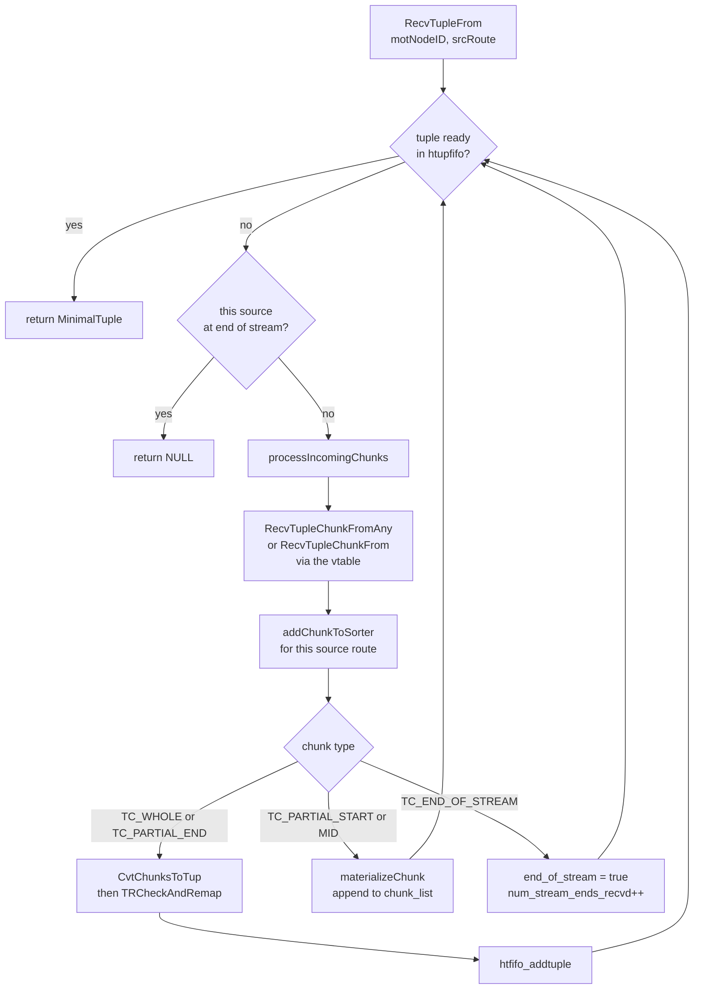

*The receive loop. Chunks arrive per source route, accumulate in that route's ChunkSorterEntry until a TC_WHOLE or TC_PARTIAL_END completes a tuple, and completed tuples wait in a htupfifo.*

The state that matters is `ChunkSorterEntry` (`cdbinterconnect.h:34`), and there is **one per source route**, not one per Motion node. The reason is in the comment on `TupleChunkListData`: chunks carry no tuple identity — "they are expected to be sent and received in order, and without loss" (`tupchunklist.h:57-62`). Ordering is only guaranteed *within* one sender's stream. If a single global chunk list were used, a `TC_PARTIAL_MID` from segment 0 could land between segment 1's start and end fragments and silently corrupt both. So each sender gets its own partial-tuple accumulator, and `addChunkToSorter` enforces the grammar loudly — receiving a `TC_WHOLE` while partial data is pending is an `ERRCODE_GP_INTERCONNECTION_ERROR`, not a recoverable condition.

Completed tuples, by contrast, may or may not share a queue. An unordered Motion points every route's `ready_tuples` at one shared `htup_fifo`, because the receiver does not care who sent what; an order-preserving Motion gives each route its own FIFO, because the merge in [§19.4](#194-motion-nodes).6 must be able to ask for the *next tuple from sender k* specifically (`cdbmotion.c:917-939`). `htupfifo.c` is 176 lines of singly-linked list with a free list, and that is all it needs to be.

Termination is a count. `UpdateMotionExpectedReceivers` sets `num_senders` to the number of live `CdbProcess` entries in the child slice (`cdbmotion.c:338`) — live, because direct dispatch leaves NULL placeholders for segments that were never asked to run. Each `TC_END_OF_STREAM` bumps a tally, and only when the tally reaches `num_senders` does the node declare the stream finished:

```c title="src/backend/cdb/motion/cdbmotion.c:1100"
			/* Mark the state as "end of stream." */
			chunkSorterEntry->end_of_stream = true;
			pMNEntry->num_stream_ends_recvd++;

			if (pMNEntry->num_stream_ends_recvd == pMNEntry->num_senders)
				pMNEntry->moreNetWork = false;

			CurrentMotionIPCLayer->DeregisterReadInterest(transportStates, motNodeID,
														  srcRoute, "end of stream");
```

*The per-route ChunkSorterEntry made visible. Three source routes, three entries, printed at teardown for an order-preserving Gather over three segments.*

```sql
SET optimizer=off;
SET gp_log_interconnect='debug';
SET client_min_messages='debug4';
SELECT k FROM m194_hash ORDER BY k;   -- output elided
```

```text {1,3,5} title="output"
DEBUG:  Chunk-sorter entry [route=0,node=1] statistics:
	Available Tuples High-Watermark: 10
DEBUG:  Chunk-sorter entry [route=1,node=1] statistics:
	Available Tuples High-Watermark: 10
DEBUG:  Chunk-sorter entry [route=2,node=1] statistics:
	Available Tuples High-Watermark: 10
```

:::note

That capture also exposes a small piece of bit rot worth knowing about before you trust the number. The high-watermark is printed once per route, but all three lines report **10** &mdash; even though the three senders contributed 5, 2 and 5 tuples. The comment in `statNewTupleArrived` promises "if the motion node is order-preserving, we track a per-sender high-watermark as well" (`cdbmotion.c:1198-1203`), but the function only maintains `pMNEntry-&gt;stat_tuples_available_hwm`, which is node-wide. The `ChunkSorterEntry` argument is unused. So the figure is real, but it is the same node-level figure repeated, not a per-sender breakdown.

:::

### 19.4.5 tupleremap — a typmod is a process-local name

Here is a problem no single-node database has. When PostgreSQL evaluates `ROW(k, v)` it produces a value of type `RECORD`, and it labels that value with a *transient typmod* — a small integer allocated from a backend-local counter, which indexes into that backend's own cache of anonymous tuple descriptors. It is a pointer, written as an integer, into private memory. Segment 0's typmod 3 and the coordinator's typmod 3 have nothing to do with each other.

So a record value cannot simply be serialized and sent: the tuple header carries a number that will be nonsense at the other end, and the receiver has no way to discover what shape the record was. Both halves of that have to be fixed, and `tupleremap.c` (773 lines, adapted from upstream's parallel-worker `tqueue.c`) is the fix.

The protocol is **sender-push, incremental, and per-connection**. Before every `SendTuple`, `doSendTuple` calls `CheckAndSendRecordCache` (`nodeMotion.c:1313`). That function compares the sender's current transient-typmod counter against a high-water mark stored *on the connection* (`conn->sent_record_typmod`, reached through `CurrentMotionIPCLayer->GetMotionSentRecordTypmod`, `ic_common.c:540`), and if the counter has moved, it serialises every newly-registered tuple descriptor and pushes it down the same chunk stream as the data — tagged with a magic length so the receiver can tell it apart from a tuple:

```c title="src/backend/cdb/motion/tupser.c:285"
	typelist = build_tuple_node_list(sent_record_typmod);
	buf = serializeNode((Node *) typelist, &size, NULL);
	list_free_deep(typelist);

	/* we use magic tuplen to identify that this chunk (or list of chunks)
	 * actually carries the serialized record cache table. */
	int tupbodylen = RECORD_CACHE_MAGIC_TUPLEN;    /* -1 */
	addByteStringToChunkList(tcList, (char *) &tupbodylen, sizeof(int), ...);
```

The gate is cheap: `ShouldSendRecordCache` returns false unless the Motion's tuple descriptor contains at least one non-base type at all (`pSerInfo->has_record_types`, set in `InitSerTupInfo` at `tupser.c:131`), so a Motion carrying only `int` and `text` never pays for any of this. The receiver spots the magic length in `CvtChunksToTup` (`tupser.c:651`), hands the list to `TRHandleTypeLists`, registers each descriptor in its *own* cache, and records the translation:

```c title="src/backend/cdb/motion/tupleremap.c:249"
		/* assign_record_type_typmod() will update tdtypmod to the local typmod */
		assign_record_type_typmod(descnode->tuple);
		local_typmod = descnode->tuple->tdtypmod;

		remapper->typmodmap[remote_typmod] = local_typmod;

		if (!remapper->remap_needed && local_typmod != remote_typmod)
			remapper->remap_needed = true;
```

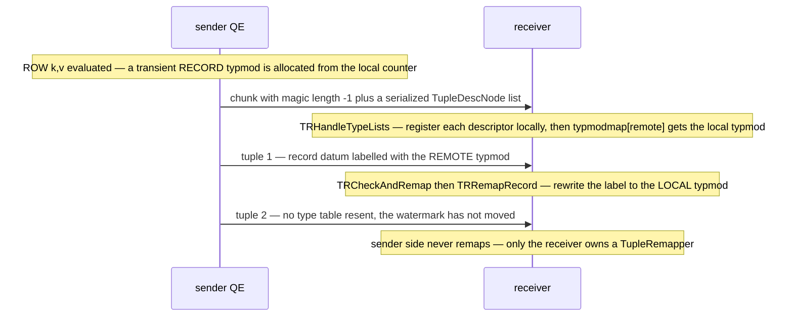

*The record-cache handshake. Nothing is requested — the sender pushes the type table ahead of the first tuple that needs it, once per connection per new type.*

Every incoming tuple then passes through `TRCheckAndRemap` (`cdbmotion.c:108`), which short-circuits entirely when `remap_needed` is false. When it is needed, `BuildFieldRemapInfo` walks the tuple descriptor once and builds a tree of `TupleRemapInfo` nodes marking which attributes could possibly contain a composite — recursing through arrays, ranges and domains, because a record can hide arbitrarily deep (`tupleremap.c:618-773`). `TRRemapRecord` then deforms the value, replaces the typmod label, recursively fixes the fields, and reforms it — and only reforms if something actually changed (`tupleremap.c:584`).

This is measurable. Because `CheckAndSendRecordCache` routes its push through `statSendTuple`, the type table shows up in the counters as **an extra send that is not a tuple**.

*The same 12 rows, twice. Adding a record column adds exactly one send and one chunk per sender — the type table — plus about 106 bytes, and makes each row bigger because a record datum carries its own tuple header.*

```sql
SET optimizer=off; SET gp_log_interconnect='verbose';
SELECT k, v FROM m194_hash;          -- run 1
SELECT row(k,v) AS r FROM m194_hash; -- run 2
```

```text {7,8,9} title="output"
-- run 1: plain columns, no record types in the tupdesc
Interconnect seg0 slice1 sent 5 tuples, 129 total bytes, 105 tuple bytes, 6 chunks.
Interconnect seg1 slice1 sent 2 tuples,  55 total bytes,  43 tuple bytes, 3 chunks.
Interconnect seg2 slice1 sent 5 tuples, 131 total bytes, 107 tuple bytes, 6 chunks.

-- run 2: one record column
Interconnect seg0 slice1 sent 6 tuples, 342 total bytes, 314 tuple bytes, 7 chunks.
Interconnect seg1 slice1 sent 3 tuples, 205 total bytes, 189 tuple bytes, 4 chunks.
Interconnect seg2 slice1 sent 6 tuples, 344 total bytes, 316 tuple bytes, 7 chunks.
```

Five rows became six sends, two became three, five became six — one extra per segment, never more, because the watermark stops the second push. And the size backs it out: segment 0 sent 5 rows in 314 tuple bytes, segment 1 sent 2 in 189, so a row costs about 41.7 bytes and the fixed part is about 106 bytes on both — the serialized `TupleDescNode` list, sent once.

*Record values surviving harder motions: a Broadcast Motion between segments, where neither end is the coordinator, and record values nested inside arrays and inside other records.*

```sql
SET optimizer=off;
SELECT count(*) FROM (SELECT row(k,v) r FROM m194_rand) a
  JOIN (SELECT row(k,v) r FROM m194_hash) b ON a.r = b.r;

SELECT array[row(k,v)] AS arr, row(k, row(v,k)) AS nested
  FROM m194_hash ORDER BY k LIMIT 2;
```

```text {3} title="output"
 count 
-------
    12
(1 row)

    arr     |    nested    
------------+--------------
 {"(1,v1)"} | (1,"(v1,1)")
 {"(2,v2)"} | (2,"(v2,2)")
(2 rows)
```

:::note

Two structural details that follow from typmods being process-local. First, the `TupleRemapper` hangs off the **connection**, not the Motion node: `processIncomingChunks` fetches it with `GetMotionConnTupleRemapper(transportStates, motNodeID, srcRoute)` (`cdbmotion.c:660`, `ic_common.c:524`). It has to &mdash; two senders can hand out different typmods for the same shape, and each needs its own translation table. Second, a broadcast has no single route, so `GetMotionSentRecordTypmod` quietly folds `BROADCAST_SEGIDX` onto route 0 (`ic_common.c:548`) and uses that one connection's watermark to speak for all of them.

:::

### 19.4.6 Sorted Motion: an N-way merge in the receiver

A `Gather Motion` normally returns tuples in whatever order the chunks happen to arrive. But if each sender's stream is *already* sorted, the receiver can produce a globally sorted result by repeatedly taking the smallest head among the senders — and then a distributed `ORDER BY ... LIMIT` needs no sort on the coordinator at all. The planner marks such a Motion `sendSorted`, and `EXPLAIN` prints a `Merge Key:` line for it (`explain.c:2853-2866`, `explain_gp.c:2251`).

*The Merge Key line, and the per-segment Sort and Limit that make it legal. Each segment sorts and truncates locally; the coordinator only merges.*

```sql
SET optimizer=off;
EXPLAIN (costs off) SELECT k FROM m194_hash ORDER BY k LIMIT 5;
```

```text {5} title="output"
                   QUERY PLAN                   
------------------------------------------------
 Limit
   ->  Gather Motion 3:1  (slice1; segments: 3)
         Merge Key: k
         ->  Limit
               ->  Sort
                     Sort Key: k
                     ->  Seq Scan on m194_hash
```

The merge is visible in the output itself. Add `gp_execution_segment()` and run the query with and without the `ORDER BY`: unsorted, the rows come out in per-segment blocks; sorted, the segments interleave under the control of the heap.

*Left, an unsorted Gather: whole blocks per sender, in arrival order. Right, a sorted Gather: the senders interleave, and k is globally ordered — that interleaving is the binary heap choosing a route per row.*

```sql
SELECT gp_execution_segment() AS seg, k FROM m194_hash;            -- unsorted
SELECT gp_execution_segment() AS seg, k FROM m194_hash ORDER BY k;  -- sorted
```

```text {3,7,9,11,14} title="output"
 seg | k  |     | seg | k  
-----+----      -----+----
   0 |  2  |       1 |  1
   0 |  3  |        0 |  2
   0 |  4  |        0 |  3
   0 |  7  |        0 |  4
   0 |  8  |       2 |  5
   2 |  5  |        2 |  6
   2 |  6  |       0 |  7
   2 |  9  |        0 |  8
   2 | 10  |       2 |  9
   2 | 11  |        2 | 10
   1 |  1  |        2 | 11
   1 | 12  |       1 | 12
(12 rows)     (12 rows)
```

`execMotionSortedReceiver` (`nodeMotion.c:433`) implements it with `lib/binaryheap.h` over *route numbers*, not tuples. On the first call it primes the heap by calling `RecvTupleFrom(..., iSegIdx)` once for each live process in the sending slice, parking each tuple in a per-route slot and adding the route index to the heap unordered, then `binaryheap_build` once — cheaper than N inserts. Every later call is three lines of bookkeeping:

```c title="src/backend/executor/nodeMotion.c:574"
		inputTuple = RecvTupleFrom(..., motion->motionID, node->routeIdNext);
		if (inputTuple)
		{
			ExecStoreMinimalTuple(inputTuple, node->slots[node->routeIdNext], true);
			slot_getsomeattrs(node->slots[node->routeIdNext], node->lastSortColIdx);
			binaryheap_replace_first(hp, Int32GetDatum(node->routeIdNext));
		}
		else
			binaryheap_remove_first(hp);   /* that sender hit EOS */
```

The comparator, `CdbMergeComparator` (`nodeMotion.c:1039`), reads the key columns straight out of the slots' `tts_values` arrays — which is why the caller runs `slot_getsomeattrs(slot, node->lastSortColIdx)` first — and inverts the result with `INVERT_COMPARE_RESULT` because `binaryheap` is a max-heap and we want the minimum on top. When the heap empties, every sender has sent EOS and the node returns NULL. Structurally this is [§18.6](./ch18.md#186-subqueries--other-nodes)'s `MergeAppend` with the subplans replaced by network sources: same heap, same one-slot-per-input discipline, same amortised cost. The difference is where the inputs live — `MergeAppend` merges sorted subplans inside one process, a sorted Gather merges sorted *processes*.

:::note

The receiver-side prerequisite for all of this is set up much earlier: `ExecInitMotion` passes `node-&gt;sendSorted` to `UpdateMotionLayerNode` as `preserveOrder` (`nodeMotion.c:898`), which is what makes `getChunkSorterEntry` give every route its own `htup_fifo` instead of one shared queue (`cdbmotion.c:917`). Order preservation costs a queue per sender. And note the asymmetry the file's own comment flags (`nodeMotion.c:400-413`): only the *receiver* has a sorted implementation. The senders of a sorted Gather run the ordinary unsorted path &mdash; their child already produced sorted output.

:::

### 19.4.7 Stop, and end-of-stream

A Motion stream can end in two ways, and they are not symmetric. `TC_END_OF_STREAM` travels forward and means *the sender is finished*; a stop message travels backward and means *the receiver has lost interest*. [§18.1](./ch18.md#181-executor-framework--lifecycle) introduced `ExecSquelchNode` as the executor's generic "stop early" traversal; the Motion node is where it crosses a process boundary.

On the receiving side, `ExecSquelchMotion` (`nodeMotion.c:1389`) sets `stopRequested`, calls `SendStopMessage`, and marks the node squelched. `SendStopMessage` sets `pEntry->stopped` in the Motion layer and then forwards through the vtable (`cdbmotion.c:343-352`); the transport's job is to get the flag to the peer, which [§19.5](#195-interconnect-implementations) covers. A squelched Motion that is somehow executed again raises an error rather than silently losing rows — `ExecMotion` checks for it at the very top (`nodeMotion.c:114-119`).

On the sending side there is no callback and no signal handler. The stop is discovered synchronously, as a *return value*: `SendTupleChunkToAMS` returns false, `SendTuple` converts that into `STOP_SENDING` (`cdbmotion.c:494-498`), `doSendTuple` sets `node->stopRequested`, and the sender loop squelches its own child subtree and quits — without sending EOS. That is the whole mechanism by which a satisfied `LIMIT` on the coordinator stops a scan on a segment, and it leaves a very recognisable fingerprint.

*An EXISTS subplan whose Gather Motion needs exactly one row. Each segment holds around 100 000 rows and each began streaming them; the senders were stopped after about 1 351 rows apiece — roughly 1.4% of the table. That gap is the interconnect's in-flight buffering, nothing more.*

```sql
SET optimizer=off;
SELECT gp_segment_id, count(*) FROM m194_big GROUP BY 1 ORDER BY 1;
EXPLAIN (analyze, costs off, summary off)
  SELECT count(*) FROM m194_dim WHERE EXISTS (SELECT 1 FROM m194_big WHERE k > 0);
```

```text {11,12} title="output"
 gp_segment_id | count  
---------------+--------
             0 |  99877
             1 |  99951
             2 | 100172

                                         QUERY PLAN                                         
--------------------------------------------------------------------------------------------
 Aggregate (actual time=0.535..0.537 rows=1 loops=1)
   InitPlan 1 (returns $0)  (slice2)
     ->  Gather Motion 3:1  (slice3; segments: 3) (actual time=0.965..0.965 rows=1 loops=1)
           ->  Seq Scan on m194_big (actual time=0.063..0.253 rows=1351 loops=1)
                 Filter: (k > 0)
   ->  Gather Motion 3:1  (slice1; segments: 3) (actual time=0.445..0.524 rows=2 loops=1)
         ->  Result (actual time=0.056..0.057 rows=1 loops=1)
               One-Time Filter: $0
               ->  Seq Scan on m194_dim (actual time=0.055..0.056 rows=1 loops=1)
```

:::note

Per [§18.1](./ch18.md#181-executor-framework--lifecycle)'s conventions those `rows=` figures are averages across the three segments, and this build is `--enable-cassert`, so treat 1 351 as an order of magnitude and not a constant &mdash; it is a function of how much the sender managed to push into the send queue before the stop came back. What matters is the shape: **1** row delivered, **1 351** rows scanned, **100 000** rows available. And because a stopped sender skips EOS, the receiver's teardown has to tolerate a missing token &mdash; hence the `!pMNEntry-&gt;stopped &amp;&amp; !pCSEntry-&gt;end_of_stream` guard in `EndMotionLayerNode` (`cdbmotion.c:750`). Without `stopped` in that condition, every `LIMIT` query would log a complaint.

:::

### 19.4.8 What a Motion node actually reports

The Motion layer counts a lot: sends, receives, chunks, wire bytes, tuple bytes, queue high-watermarks, both globally and per node. It is natural to assume some of that reaches `EXPLAIN ANALYZE`. It does not — and that is worth stating plainly, because it shapes how you debug an interconnect problem.

*EXPLAIN ANALYZE VERBOSE across two Motion nodes. Everything printed on the Motion lines is generic instrumentation — rows, loops, time — plus the plan-time Hash Key. No chunks, no bytes, no acks. The slice footer reports executor memory, not interconnect traffic.*

```sql
SET optimizer=off;
EXPLAIN (analyze, verbose, costs off, timing off)
  SELECT k, count(*) FROM m194_rand GROUP BY k;
```

```text {1,7} title="output"
 Gather Motion 3:1  (slice1; segments: 3) (actual rows=12 loops=1)
   Output: k, (count(*))
   ->  HashAggregate (actual rows=5 loops=1)
         Output: k, count(*)
         Group Key: m194_rand.k
         work_mem: 72kB  Segments: 3  Max: 24kB (segment 0)  Workfile: (0 spilling)
         ->  Redistribute Motion 3:3  (slice2; segments: 3) (actual rows=5 loops=1)
               Output: k
               Hash Key: k
               ->  Seq Scan on public.m194_rand (actual rows=6 loops=1)
                     Output: k
   (slice0)    Executor memory: 114K bytes.
 * (slice1)    Executor memory: 122K bytes avg x 3x(0) workers, 122K bytes max (seg0).
   (slice2)    Executor memory: 112K bytes avg x 3x(0) workers, 112K bytes max (seg0).
```

The `T_Motion` case in `explain.c:2853` does exactly three things: call `show_motion_keys` for a sorted or hashed Motion, print `Hash Module` when `numHashSegments` differs from the receiver count, and fall through to the generic `cdbexplain_showExecStats`. `show_motion_keys` (`explain_gp.c:2251`) deparses plan-time expressions — it never touches runtime counters. And grepping the tree confirms it: `stat_total_chunks_sent`, `stat_total_bytes_sent` and their siblings are written in `cdbmotion.c` and read nowhere else; `MotionState`'s own `numTuplesFromChild` / `numTuplesToAMS` / `numTuplesFromAMS` / `numTuplesToParent` are declared in `execnodes.h:3475-3478` and used only for assertions and for an `elog` behind the compile-time `MEASURE_MOTION_TIME` macro (`nodeMotion.c:951`), which is `#undef`'d here.

| counter | what it counts | where you can actually see it |
| --- | --- | --- |
| stat_total_sends | SendTuple calls — plus one for each record-cache push, which is why a record column adds a phantom tuple | gp_log_interconnect = verbose, at node teardown: cdbmotion.c:800 |
| stat_total_chunks_sent | TupleChunks handed to the transport, including the EOS chunk | same log line |
| stat_total_bytes_sent / stat_tuple_bytes_sent | wire bytes with and without the 4-byte chunk headers; inflated by 4 per direct-path send | same log line |
| stat_total_chunks_recvd / _bytes_recvd / stat_total_recvs | the receive-side mirror, reported against the sending slice number | gp_log_interconnect = verbose: cdbmotion.c:813 |
| stat_tuples_available_hwm | how deep the reassembly queue got | needs gp_log_interconnect >= debug AND a DEBUG4 log level, order-preserving nodes only: cdbmotion.c:744 |
| MotionLayerState global totals | query-wide chunk and byte totals | nowhere — behind the AMS_VERBOSE_LOGGING compile-time macro: cdbmotion.c:133 |
| numTuplesFromChild / ToAMS / FromAMS / ToParent | the executor node's own tuple counts | nowhere — asserts, plus MEASURE_MOTION_TIME: nodeMotion.c:951 |

So the practical answer to "how many bytes did this Motion move?" is: set `gp_log_interconnect` to `verbose` and read the segment logs. Every byte figure quoted in this section came from that one `elog` at `cdbmotion.c:800`, and it is the only production-visible accounting the Motion layer offers. Everything else — the packet headers those chunks are wrapped in, the sequence numbers, the acknowledgements, the loss-based flow control that decided how much of `m194_big` a stopped sender managed to push before the stop arrived — lives on the far side of `SendTupleChunkToAMS`, in the pluggable interconnect modules of [§19.5](#195-interconnect-implementations).

## 19.5 Interconnect Implementations

Everything so far in this chapter has been *inside* the backend. `nodeMotion.c` decides that a tuple must go to route 2; `cdbmotion.c` serialises it into `TupleChunk`s and hands them off ([§19.4](#194-motion-nodes)). The handing-off is a single call — and on the other side of that call there is no code at all in `src/backend`. There is a table of function pointers, filled in at postmaster startup by a shared library that lives in `contrib/`.

That is the fact worth establishing first, because it reframes the whole subsystem: **the Cloudberry interconnect is a pluggable, self-registering transport module, and the set of legal values of `gp_interconnect_type` is not a compile-time enum but a list of whoever registered.** Three implementations register on this cluster; a fourth exists in the tree and does not. This section owns the seam, the setup/teardown lifecycle, all three-plus transports, the UDP flow-control machinery — and, crucially, **the exact place where a Motion sender blocks**, which is the hazard that [§18.1](./ch18.md#181-executor-framework--lifecycle)'s squelch and [§18.4](./ch18.md#184-join-nodes)'s prefetch exist to avoid.


*The seam. Above it, the executor and the Motion layer are transport-blind: they call through `CurrentMotionIPCLayer`. Below it, four implementations, three of which registered themselves on this cluster.*

### 19.5.1 A vtable, not a subsystem

`MotionIPCLayer` is declared in `src/include/cdb/ml_ipc.h:36`–`:292`: two identity fields (`ic_type`, `type_name`) and 22 function pointers. The process-wide selection lives in two globals at the top of the Motion layer — `MotionIPCLayer *CurrentMotionIPCLayer` (`src/backend/cdb/motion/cdbmotion.c:33`) and the registry `static MotionIPCLayer *IPCLayerImpls[MAX_NUMBER_TYPES]` (`:36`). Implementations put themselves in the registry; nothing in the backend knows their names.

```c title="src/backend/cdb/motion/cdbmotion.c:1313"
/*
 * Called by interconnect.so to register a new IPC layer implement.
 */
void
RegisterIPCLayerImpl(MotionIPCLayer *impl)
{
	...
	IPCLayerImpls[CurrentIPCLayerImplNum++] = impl;
}
```

The caller is `contrib/interconnect/ic_modules.c`, which defines three static `MotionIPCLayer` initialisers — `tcp_ipc_layer` (`:26`), `proxy_ipc_layer` (`:65`), `udpifc_ipc_layer` (`:105`) — and registers all three from `_PG_init` (`:145`–`:155`). A detail that saves a lot of confusion later: **`proxy_ipc_layer` is not a separate transport.** Every method slot in it is a `…TCP` function; ic-proxy is a set of `#ifdef ENABLE_IC_PROXY` hooks *inside* `ic_tcp.c` plus a separate proxy process. Only `udpifc_ipc_layer` has its own send/receive path.

So how does `interconnect.so` get loaded, given that the module must be present before the first query? Not through `shared_preload_libraries` as a DBA would write it. Cloudberry compiles a *built-in* preload list into the server:

```c title="src/include/utils/process_shared_preload_libraries.h:1"
#ifdef ENABLE_PRELOAD_IC_MODULE
  "interconnect",
#endif
#ifdef ENABLE_IC_UDP2
  		"udp2",
#endif
#ifdef USE_PAX_STORAGE
		"pax",
#endif
```

That header is `#include`d as an array initialiser at `src/backend/utils/init/miscinit.c:1962`, and `expand_shared_preload_libraries_string()` (`:2005`) prepends it to the user's setting before loading. `postmaster.c:1275` calls `process_shared_preload_libraries()` — which runs `_PG_init` and therefore the three registrations — and `postmaster.c:1280` then calls `InitializeCurrentMotionIPCLayer()` (`cdbmotion.c:1347`) to resolve `gp_interconnect_type` against whatever registered. The consequence is visible from SQL: the GUC does not mention the interconnect, but the library is mapped into every backend.

*The interconnect is loaded, but not because anyone asked for it. `/proc/<pid>/maps` is the honest answer.*

```sql
show shared_preload_libraries;

-- what is actually mapped into this backend?
select pg_backend_pid();
\! grep -oE "/[^ ]*postgresql/[a-z_0-9]*\.so" /proc/PID/maps | sort -u
```

```text {6} title="output"
 shared_preload_libraries 
--------------------------
 pg_stat_statements
(1 row)

/usr/local/cloudberry-db/lib/postgresql/interconnect.so
/usr/local/cloudberry-db/lib/postgresql/pax.so
/usr/local/cloudberry-db/lib/postgresql/pg_stat_statements.so
```

Now the payoff. `gp_interconnect_type` is a **string** GUC (`guc_gp.c:5115`, context `PGC_BACKEND`) with a check hook, `CheckGpInterconnectTypeStr` (`cdbmotion.c:1292`), whose entire body is a loop over `IPCLayerImpls[]`. There is no static list of names anywhere. `contrib/udp2/ic_udp2.c` (1027 lines) exists in this tree and registers a `udp2_ipc_layer`, but `ENABLE_IC_UDP2` is `#undef` in `src/include/pg_config.h:56`, so `udp2` is never preloaded, never registers — and is therefore not a legal value of the GUC on this cluster:

*The enum is dynamic: `udp2` is a real implementation in the tree, and an illegal GUC value here purely because it did not register.*

```sql
-- the three that registered
PGOPTIONS='-c gp_interconnect_type=tcp'    psql -p 7100 -c 'show gp_interconnect_type'
PGOPTIONS='-c gp_interconnect_type=proxy'  psql -p 7100 -c 'show gp_interconnect_type'

-- the one that exists in contrib/ but was not built
PGOPTIONS='-c gp_interconnect_type=udp2'   psql -p 7100 -c 'show gp_interconnect_type'
```

```text {10} title="output"
 gp_interconnect_type 
----------------------
 tcp

 gp_interconnect_type 
----------------------
 proxy

psql: error: connection to server on socket "/tmp/.s.PGSQL.7100" failed:
FATAL:  invalid value for parameter "gp_interconnect_type": "udp2"
```

:::note

Because `gp_interconnect_type` is `PGC_BACKEND`, not `PGC_POSTMASTER`, **switching transports needs no restart** — `PGOPTIONS` picks one per connection. Every transport comparison in this section is one `psql` invocation against the same live cluster. The postmaster-side `InitializeCurrentMotionIPCLayer()` has a second, nicer error path: if the *startup* value is unknown it reports `Invalid gp_interconnect_type: %s, valid values are: %s` (`cdbmotion.c:1398`), building the list of valid values by walking the registry &#8212; the clearest possible statement that the enum is assembled at runtime.

:::

### 19.5.2 What a transport must provide

The 22 pointers are not all interesting; roughly a dozen carry the contract. The boundary with [§19.4](#194-motion-nodes) is exact: the Motion layer's last act is `CurrentMotionIPCLayer->SendTupleChunkToAMS`, and that symbol is itself provided by the module — `contrib/interconnect/ic_common.c:41`, shared by all three implementations, which fans a chunk list out to `doBroadcast` or a single route and then calls the per-transport `SendChunk`.

| Method | What the transport must therefore do |
| --- | --- |
| GetMaxTupleChunkSize | Tell the Motion layer how big a chunk may be. Called once per statement at cdbmotion.c:169 to set Gp_max_tuple_chunk_size. The transport dictates the chunk size — see below. |
| GetListenPort | Publish a port the peers can be told about, so the QD can put it in the slice table ([§19.3](#193-slice-tables--planslice--gang-mapping)). |
| InitMotionLayerIPC / CleanUpMotionLayerIPC | Per-process one-time setup: create the listening socket, start any threads. Called from cdbutil.c:1162 and :3556 at backend init. |
| SetupInterconnect / TeardownInterconnect | Per-statement: build the per-slice connection state from the slice table, then tear it all down whatever the outcome. |
| SendTupleChunkToAMS | Shared entry point in ic_common.c. Resolves motion id and route to a MotionConn, handles the broadcast fan-out, and delegates. |
| SendChunk | The actual per-transport send. This is where the sender can block. |
| SendEOS / SendStopMessage | End-of-stream downstream; stop upstream. SendStopMessage is the wire form of [§18.1](./ch18.md#181-executor-framework--lifecycle)'s ExecSquelchNode. |
| RecvTupleChunkFromAny | Block until any active peer has data, with fairness across routes. The receive side of an unordered Gather or Redistribute. |
| RecvTupleChunkFrom | Block for one specific route. What a sorted (merge) Gather needs, one route at a time ([§19.4](#194-motion-nodes)). |
| RecvTupleChunk / DirectPutRxBuffer | Pull the next chunk from one connection, and hand the buffer back when the Motion layer is finished with it. |
| GetTransportDirectBuffer / PutTransportDirectBuffer | Let the serialiser write straight into the transport's outgoing packet buffer, avoiding one memcpy. Same implementation for all three here. |
| DeregisterReadInterest | Drop a route from the poll set once it has sent EOS or been stopped. |
| IcProxyServiceMain | The main loop of the proxy process. NULL unless the server was built with --enable-ic-proxy; non-NULL in all three vtables when it was. |
| GetMotionConnTupleRemapper / GetMotionSentRecordTypmod | Per-connection storage for the record-typmod remapping state of [§19.4](#194-motion-nodes) — the transport owns the lifetime, the Motion layer owns the meaning. |

`GetMaxTupleChunkSize` is the one that deserves a second look, because it is the transport reaching *upward* and changing the Motion layer's behaviour. Both implementations compute the same thing — the packet budget minus their own header — and their headers differ by 84 bytes:

```c title="contrib/interconnect/udp/ic_udpifc.c:8179 and tcp/ic_tcp.c:3363"
int GetMaxTupleChunkSizeUDP(void)
{ return Gp_max_packet_size - sizeof(struct icpkthdr) - TUPLE_CHUNK_HEADER_SIZE; }

int GetMaxTupleChunkSizeTCP(void)
{ return Gp_max_packet_size - PACKET_HEADER_SIZE - TUPLE_CHUNK_HEADER_SIZE; }
```

`sizeof(icpkthdr)` is **88** bytes on this platform; `PACKET_HEADER_SIZE` is **4** (`ml_ipc.h:34`) and `TUPLE_CHUNK_HEADER_SIZE` is **4** (`tupchunk.h:49`). So at the default `gp_max_packet_size=8192` the maximum chunk is 8100 over udpifc and 8184 over tcp — a 1% difference that no query will notice. Shrink the packet and it becomes measurable. Three rows of 30 098 serialised bytes each, gathered to the QD, with `gp_log_interconnect=verbose` reporting the chunk count:

*The transport chooses the chunk size, and you can count it. 1956-byte chunks over UDP versus 2040 over TCP for the same three tuples.*

```sql
create table m195_wide (id int, big text) distributed by (id);
insert into m195_wide select i,
  (select string_agg(md5(random()::text||i||j),'') from generate_series(1,940) j)
  from generate_series(1,3) i;          -- 30 080 incompressible chars each

-- same query, four transport/packet-size combinations
set gp_log_interconnect=verbose; set client_min_messages=log;
select id, big from m195_wide;
```

```text {4,8} title="output"
##### type=udpifc gp_max_packet_size=8192 #####
LOG:  Interconnect seg-1 slice0 received from slice1: 3 tuples, 90354 total bytes, 90294 tuple bytes, 15 chunks.
##### type=udpifc gp_max_packet_size=2048 #####
LOG:  Interconnect seg-1 slice0 received from slice1: 3 tuples, 90498 total bytes, 90294 tuple bytes, 51 chunks.
##### type=tcp    gp_max_packet_size=8192 #####
LOG:  Interconnect seg-1 slice0 received from slice1: 3 tuples, 90354 total bytes, 90294 tuple bytes, 15 chunks.
##### type=tcp    gp_max_packet_size=2048 #####
LOG:  Interconnect seg-1 slice0 received from slice1: 3 tuples, 90486 total bytes, 90294 tuple bytes, 48 chunks.
```

The arithmetic closes exactly. At 2048 bytes udpifc allows 2048−88−4 = 1956 bytes per chunk, so each 30 098-byte tuple needs ⌈30098/1956⌉ = 16 chunks: 3×16 = 48, plus one end-of-stream chunk per sender = **51**. TCP allows 2048−4−4 = 2040, so ⌈30098/2040⌉ = 15: 45 + 3 = **48**. And `total bytes − tuple bytes` is 4 × chunks in every row, which is `TUPLE_CHUNK_HEADER_SIZE` measured rather than read. At 8192 both transports land on 4 chunks per tuple and the difference vanishes — which is why nobody notices.

### 19.5.3 Setup and teardown are per statement

`SetupInterconnect` is called from three places, all in the executor: `execMain.c:536` and `execMain.c:751` for the statement itself, and `nodeSubplan.c:1197` — an InitPlan gets its *own* interconnect setup on top of its own gang ([§18.6](./ch18.md#186-subqueries--other-nodes)). Teardown is symmetric but paranoid: `execUtils.c:2100` for the normal path and `execUtils.c:2280` with `hasErrors = true` for the error path, because sockets and the receive thread must be reclaimed whatever happened. For udpifc the entry points are `SetupInterconnectUDP` (`ic_udpifc.c:3833`) and `TeardownUDPIFCInterconnect` (`:4251`); for tcp, `SetupInterconnectTCP` (`ic_tcp.c:1915`). Setting `gp_log_interconnect=debug` narrates the whole thing, and is the fastest way to see a slice table turn into sockets:

*Setup, narrated. Each QE learns its peers' host/port from the slice table and dials them; the receiving side just counts arrivals. Abridged — one of the four slices shown.*

```sql
set gp_log_interconnect=debug;
set client_min_messages=debug1;
select count(*) from (select d.label, count(*) from m195_fact f
                      join m195_dim d on f.k=d.k group by d.label) s;
```

```text {1,10} title="output"
DEBUG:  SetupUDPIFCInterconnect: queue depth, queue_depth=4, snd_queue_depth=2, mem_size=10, slices=4, packet_size=8192
DEBUG:  Setup recving connections: my slice 0, childId 1
DEBUG:  SetupUDPInterconnect will activate 3 incoming, 3 expect incoming, 0 outgoing, 0 expect outgoing routes for ic_instancce_id 1. Listening on ports=0/33254 sockfd=6.
...
DEBUG:  Interconnect seg0 slice2 setting up sending motion node  (seg0 slice2 pid=6959)
DEBUG:  Interconnect connecting to seg0 slice1 10.100.0.3:53109 pid=6953 sockfd=-1  (seg0 slice2 pid=6959)
DEBUG:  setupOutgoingUDPConnection: node 2 route 0 srccontent 0 dstcontent 0: 10.100.0.3:53109  (seg0 slice2 pid=6959)
DEBUG:  Interconnect connecting to seg1 slice1 10.100.0.3:43894 pid=6954 sockfd=-1  (seg0 slice2 pid=6959)
DEBUG:  Interconnect connecting to seg2 slice1 10.100.0.3:32981 pid=6955 sockfd=-1  (seg0 slice2 pid=6959)
DEBUG:  SetupUDPInterconnect will activate 3 incoming, 3 expect incoming, 3 outgoing, 3 expect outgoing routes for ic_instancce_id 1. Listening on ports=0/51184 sockfd=6.
```

Note the contrast with [§19.2](#192-the-dispatcher-gangs--async-dispatch), which established that **gangs persist across statements in a session**. The interconnect does not. Each statement gets a fresh `ic_instance_id`, allocated by the QD and carried in the slice table, and every packet header carries it so that a straggler from the previous statement can be recognised and discarded. Three identical queries in one session, with `gp_interconnect_log_stats=on`, show the same three QE pids and three different instances:

*Same processes, three interconnects. The gang is a session resource; the interconnect is a statement resource.*

```sql
set gp_interconnect_log_stats=on;
set client_min_messages=log;
select count(*) from m195_fact;   -- x3, same session
```

```text {1,4,7} title="output"
ic_instance_id 1 ic_id_last_teardown 1 ... (seg0 slice1 10.100.0.3:7102 pid=24530)
ic_instance_id 1 ic_id_last_teardown 1 ... (seg1 slice1 10.100.0.3:7103 pid=24531)
ic_instance_id 1 ic_id_last_teardown 1 ... (seg2 slice1 10.100.0.3:7104 pid=24532)
ic_instance_id 2 ic_id_last_teardown 2 ... (seg0 slice1 10.100.0.3:7102 pid=24530)
ic_instance_id 2 ic_id_last_teardown 2 ... (seg1 slice1 10.100.0.3:7103 pid=24531)
ic_instance_id 2 ic_id_last_teardown 2 ... (seg2 slice1 10.100.0.3:7104 pid=24532)
ic_instance_id 3 ic_id_last_teardown 3 ... (seg0 slice1 10.100.0.3:7102 pid=24530)
ic_instance_id 3 ic_id_last_teardown 3 ... (seg1 slice1 10.100.0.3:7103 pid=24531)
ic_instance_id 3 ic_id_last_teardown 3 ... (seg2 slice1 10.100.0.3:7104 pid=24532)
```

:::note

Two documentation traps worth flagging. (1) `gp_interconnect_setup_timeout` is **7200** seconds here, and it is honoured only by `ic_tcp.c` (`:1572`, `:1888`) and `ic_proxy_backend.c` (`:310`); grep `ic_udpifc.c` and you will not find it &#8212; udpifc bounds setup through its ordinary retransmit/deadlock checks instead. (2) The `SetupUDPIFCInterconnect` auto-tuning block (`:3760`) recomputes the queue depths as `Gp_interconnect_mem_size / (Gp_max_packet_size * sliceNum)`, but `gp_interconnect_mem_size` is documented and set *in megabytes* (10) while `Gp_max_packet_size` is in bytes &#8212; so the quotient is 0 and the depths stay at their defaults, exactly as the `DEBUG1` line above reports. On this cluster the auto-tuner is a no-op.

:::

### 19.5.4 UDPIFC: the packet

`contrib/interconnect/udp/ic_udpifc.c` is 8233 lines — more than twice the TCP implementation and the proxy put together — and essentially all of the excess is reliability: sequence numbers, acknowledgements, a retransmit time-wheel, a congestion window, out-of-order caching, and a background receive thread. It is a small transport protocol built on unreliable datagrams, and the place to start is its header, `icpkthdr` (`contrib/interconnect/udp/ic_udpifc.h:32`–`:96`).

<RawFigure html={"<div style=\"font-family:ui-monospace,SFMono-Regular,Menlo,monospace;font-size:12px;line-height:1.4;overflow-x:auto\"> <div style=\"min-width:600px\"> <div style=\"display:grid;grid-template-columns:52px repeat(4,1fr);gap:3px;margin-bottom:3px;color:#6b7280;font-size:10px;text-align:center\"> <div style=\"text-align:right;padding-right:6px\">byte</div><div>+0</div><div>+4</div><div>+8</div><div>+12</div></div> <div style=\"display:grid;grid-template-columns:52px repeat(4,1fr);gap:3px;margin-bottom:3px\"> <div style=\"text-align:right;padding-right:6px;color:#6b7280;font-size:10px;line-height:26px\">0</div> <div style=\"background:#f5edff;border:1px solid #cdb4db;border-radius:3px;padding:4px 2px;text-align:center;color:#2d2438\">motNodeId</div> <div style=\"background:#f5edff;border:1px solid #cdb4db;border-radius:3px;padding:4px 2px;text-align:center;color:#2d2438\">srcPid</div> <div style=\"background:#f5edff;border:1px solid #cdb4db;border-radius:3px;padding:4px 2px;text-align:center;color:#2d2438\">srcListenerPort</div> <div style=\"background:#f5edff;border:1px solid #cdb4db;border-radius:3px;padding:4px 2px;text-align:center;color:#2d2438\">dstPid</div></div> <div style=\"display:grid;grid-template-columns:52px repeat(4,1fr);gap:3px;margin-bottom:3px\"> <div style=\"text-align:right;padding-right:6px;color:#6b7280;font-size:10px;line-height:26px\">16</div> <div style=\"background:#f5edff;border:1px solid #cdb4db;border-radius:3px;padding:4px 2px;text-align:center;color:#2d2438\">dstListenerPort</div> <div style=\"background:#f5edff;border:1px solid #cdb4db;border-radius:3px;padding:4px 2px;text-align:center;color:#2d2438\">sessionId</div> <div style=\"background:#eafaf0;border:1px solid #cfead9;border-radius:3px;padding:4px 2px;text-align:center;color:#245c42\">icId</div> <div style=\"background:#f5edff;border:1px solid #cdb4db;border-radius:3px;padding:4px 2px;text-align:center;color:#2d2438\">recvSliceIndex</div></div> <div style=\"display:grid;grid-template-columns:52px repeat(4,1fr);gap:3px;margin-bottom:3px\"> <div style=\"text-align:right;padding-right:6px;color:#6b7280;font-size:10px;line-height:26px\">32</div> <div style=\"background:#f5edff;border:1px solid #cdb4db;border-radius:3px;padding:4px 2px;text-align:center;color:#2d2438\">sendSliceIndex</div> <div style=\"background:#f5edff;border:1px solid #cdb4db;border-radius:3px;padding:4px 2px;text-align:center;color:#2d2438\">srcContentId</div> <div style=\"background:#f5edff;border:1px solid #cdb4db;border-radius:3px;padding:4px 2px;text-align:center;color:#2d2438\">dstContentId</div> <div style=\"background:#eafaf0;border:1px solid #cfead9;border-radius:3px;padding:4px 2px;text-align:center;color:#245c42\">crc</div></div> <div style=\"display:grid;grid-template-columns:52px repeat(4,1fr);gap:3px;margin-bottom:3px\"> <div style=\"text-align:right;padding-right:6px;color:#6b7280;font-size:10px;line-height:26px\">48</div> <div style=\"background:#fff4d6;border:1px solid #8a6d1a;border-radius:3px;padding:4px 2px;text-align:center;color:#5b4636\">&#10214;flags&#10215;</div> <div style=\"background:#fff4d6;border:1px solid #8a6d1a;border-radius:3px;padding:4px 2px;text-align:center;color:#5b4636\">len</div> <div style=\"background:#fff4d6;border:1px solid #8a6d1a;border-radius:3px;padding:4px 2px;text-align:center;color:#5b4636\">&#10214;seq&#10215;</div> <div style=\"background:#fff4d6;border:1px solid #8a6d1a;border-radius:3px;padding:4px 2px;text-align:center;color:#5b4636\">&#10214;extraSeq&#10215;</div></div> <div style=\"display:grid;grid-template-columns:52px repeat(2,1fr);gap:3px;margin-bottom:3px\"> <div style=\"text-align:right;padding-right:6px;color:#6b7280;font-size:10px;line-height:26px\">64</div> <div style=\"background:#eafaf0;border:1px solid #cfead9;border-radius:3px;padding:4px 2px;text-align:center;color:#245c42\">send_time &#8212; uint64</div> <div style=\"background:#eafaf0;border:1px solid #cfead9;border-radius:3px;padding:4px 2px;text-align:center;color:#245c42\">recv_time &#8212; uint64</div></div> <div style=\"display:grid;grid-template-columns:52px 1fr 3fr;gap:3px;margin-bottom:8px\"> <div style=\"text-align:right;padding-right:6px;color:#6b7280;font-size:10px;line-height:26px\">80</div> <div style=\"background:#eafaf0;border:1px solid #cfead9;border-radius:3px;padding:4px 2px;text-align:center;color:#245c42\">retry_times</div> <div style=\"background:#f3f4f6;border:1px dashed #9ca3af;border-radius:3px;padding:4px 2px;text-align:center;color:#6b7280\">7 bytes tail padding &#8212; alignment</div></div> <div style=\"color:#6b7280;font-size:11px;letter-spacing:0.5px\">&#8593;&#8212;&#8212;&#8212;&#8212;&#8212;&#8212;&#8212;&#8212; sizeof(icpkthdr) = 88 &#8212;&#8212;&#8212;&#8212;&#8212;&#8212;&#8212;&#8212;&#8593;</div> <div style=\"margin-top:10px;padding:8px 10px;background:#fff4d6;border:1px solid #8a6d1a;border-radius:4px;color:#5b4636;font-size:11.5px\"> &#10214;88&#10215; header + &#10214;4&#10215; TupleChunk header + payload &#8804; gp_max_packet_size &#10214;8192&#10215; &#8658; Gp_max_tuple_chunk_size = &#10214;8100&#10215; &#8212; one datagram, one send, no IP fragmentation </div> <div style=\"margin-top:8px;color:#6b5b8a;font-size:11px\"> lavender = routing identity &#183; amber = protocol state &#183; green = integrity and timing </div> </div></div>"} caption={"`icpkthdr` — 88 bytes in front of every datagram. Sixteen 32-bit fields, two timestamps, one retry counter, seven bytes of tail padding."} />

The first eleven fields are pure identity, and they are why udpifc needs no connection: a datagram arriving on a QE's single listening socket carries enough information (`motNodeId`, source and destination pid and port, `sessionId`, `icId`, both slice indices, both content ids) to be matched to exactly one logical connection in a hash table. `crc` was added because UDP's own 16-bit checksum is too weak for the volumes involved. `flags` is a bitmask (`ic_udpifc.c:211`–`:219`): `RECEIVER_TO_SENDER`, `ACK`, `STOP`, `EOS`, `NAK`, `DISORDER`, `DUPLICATE`, `CAPACITY`, `FULL` — so a single 88-byte header, with no payload, is also the ack, the negative ack, the out-of-order report, the flow-control credit and the stop message of [§18.1](./ch18.md#181-executor-framework--lifecycle). The `seq`/`extraSeq` pair is overloaded by flag combination, and the header comment enumerates six meanings; the two that matter for flow control are, in an `ACK|CAPACITY`, `seq` = highest contiguously *cached* sequence and `extraSeq` = highest *consumed* sequence. The receiver is therefore reporting two different watermarks in one datagram: what it has, and what the executor above it has actually eaten.

### 19.5.5 UDPIFC flow control, and where a Motion sender blocks

Two GUCs set the sizes. `gp_interconnect_queue_depth` (**4**) is the receiver's per-connection packet ring: `conn->pkt_q` is allocated with exactly that many slots (`ic_udpifc.c:7770`–`:7783`), and a packet is filed at `(pkt->seq - 1) % pkt_q_capacity` (`:7211`) — which is what `gp_interconnect_cache_future_packets=on` buys, since an out-of-order arrival goes straight into its slot instead of being dropped. `gp_interconnect_snd_queue_depth` (**2**) is the *sender's* per-connection allowance of packet buffers, and the sender's buffers are pooled: `snd_buffer_pool.maxCount += Gp_interconnect_snd_queue_depth` once per outgoing connection at setup (`:3149`). A sender to R receivers therefore owns 2R buffers in total, not 2 per peer.

The credit is `conn->capacity`, initialised to `Gp_interconnect_queue_depth` (`:3146`) — the sender's belief about free slots in that receiver's ring — decremented on each send and restored by an `ACK|CAPACITY`. On top of that sits a genuine TCP-style congestion window: `snd_control_info` holds `cwnd`, `minCwnd` and `ssthresh` (`:428`–`:443`), `cwnd` starts at one per connection with `minCwnd` pinned to that starting value (`:3149`, `:3700`), grows on un-retried acks and is halved on loss. `sendBuffers` is where all of it meets:

```c title="contrib/interconnect/udp/ic_udpifc.c:5584"
while (conn->capacity > 0 && icBufferListLength(&conn->sndQueue) > 0)
{
	/* loss-based FC: respect the shared congestion window */
	if ((Gp_interconnect_fc_method == INTERCONNECT_FC_METHOD_LOSS || ...) &&
		(icBufferListLength(&conn->unackQueue) > 0 &&
		 unack_queue_ring.numSharedOutStanding >= (snd_control_info.cwnd - snd_control_info.minCwnd)))
		break;
	...
	conn->capacity--;
	icBufferListAppend(&conn->unackQueue, buf);
```

Read the guard carefully, because it encodes a deliberate fairness rule stated in the comment above the function: *every* connection is always allowed one outstanding buffer for free (`numSharedOutStanding` is only incremented when a connection's unack queue already has more than one entry, `:5613`). Beyond that first packet, all connections compete for `cwnd − minCwnd` shared slots. So a sender with R receivers has R free slots plus a shared window that grows to R, capped at the 2R buffers that exist — and a sender with **one** receiver, such as a Gather Motion QE, is limited to two packets in flight no matter what.

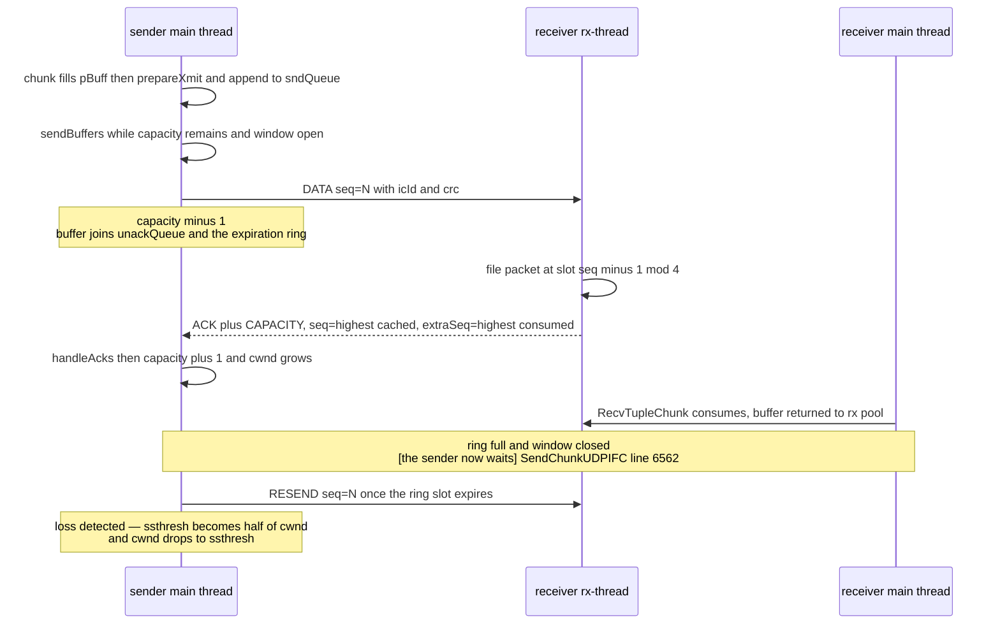

*The udpifc flow-control loop for one connection. The sender blocks in the middle of it — and that block is the reason [§18.1](./ch18.md#181-executor-framework--lifecycle) and [§18.4](./ch18.md#184-join-nodes) exist.*

And here is the block itself. `SendChunkUDPIFC` (`ic_udpifc.c:6502`) aggregates chunks into the current packet buffer and, when the buffer is full, must obtain a *new* one. If the pool is empty — every buffer sitting in some connection's unack queue — there is nowhere to put the next chunk:

```c title="contrib/interconnect/udp/ic_udpifc.c:6562"
while (doCheckExpiration || (conn->curBuff = getSndBuffer(&conn->mConn)) == NULL)
{
	int timeout = (doCheckExpiration ? 0 : computeTimeout(&conn->mConn, retry));

	if (pollAcks(transportStates, pEntry->txfd, timeout))
		if (handleAcks(transportStates, &pEntry->entry, true))
			gotStops = true;
	checkExceptions(transportStates, &pEntry->entry, &conn->mConn, retry++, timeout);
	...
}
```

**That loop is the mechanism the rest of the book has been referring to.** A Motion sender that cannot get a buffer sits in `pollAcks`, and it cannot get a buffer until a receiver acknowledges — which a receiver only does once its executor consumes from the ring. A slow or stalled consumer therefore stops a producer several processes away, through nothing more than 4 ring slots and 2R packet buffers. [§18.1](./ch18.md#181-executor-framework--lifecycle)'s `ExecSquelchNode` exists so a receiver that will read no more (a `LIMIT`, a hash join whose build side found nothing) sends `SendStopMessage` (`:6756`) instead of simply going quiet; [§18.4](./ch18.md#184-join-nodes)'s `prefetch_inner` exists so a join never puts itself in the position of blocking one of its own inputs. Both are *avoidance strategies for this loop*. Note also what the loop keeps doing while it waits: `checkExceptions` (`:6405`) folds in expiration checks, a deadlock check every fourth retry, and a `PostmasterIsAlive()` probe every 64th — the sender is the process that notices the cluster has broken.

*The window, measured. `gp_interconnect_log_stats` dumps the whole controller at teardown; abridged to one sender per slice.*

```sql
set gp_interconnect_log_stats=on;
set client_min_messages=log;
select count(*) from m195_fact f1 join m195_fact f2 on f1.id = f2.k;
-- Redistribute Motion 3:3 (slice2, 3 receivers) under Gather Motion 3:1 (slice1, 1 receiver)
```

```text {3,4,6,9} title="output"
LOG:  Interconnect State: isSender 1 isReceiver 0 snd_queue_depth 2 recv_queue_depth 4 Gp_max_packet_size 8192
      UNACK_QUEUE_RING_SLOTS_NUM 2000 TIMER_SPAN 5000 DEFAULT_RTT 20000 ...
      snd_pkt_count 447 retransmits 0 crc_errors 0 recv_pkt_count 0 recv_ack_num 668
      recv_queue_size_avg NaN capacity_avg 2.421171 freebuf_avg 1.218289
      mismatch_pkt_num 0 disordered_pkt_num 0 duplicated_pkt_num 0
      rtt/dev [338/200, 534.666667/261.000000, 705/311]  cwnd 6.000000   (seg0 slice2 pid=8005)

LOG:  Interconnect State: isSender 1 isReceiver 1 ... snd_pkt_count 1 recv_pkt_count 451 recv_ack_num 1
      capacity_avg NaN freebuf_avg 2.000000 rtt/dev [17518/4343, ...]  cwnd 2.000000   (seg0 slice1 pid=7999)
```

Every number in that dump is predicted by the source. The slice2 senders each have R = 3 outgoing connections, so `snd_buffer_pool.maxCount` = 2 × 3 = 6, `ssthresh` is set to that at setup, and `cwnd` duly grows to and stops at **6.000000**. The slice1 senders have R = 1, `maxCount` = 2, and `cwnd` stops at **2.000000**. `capacity_avg 2.42` is the average remaining receiver credit at the moment a packet was sent — out of 4 — and `freebuf_avg 1.22` is the average number of free buffers in a pool of 6. Both are low: this sender spent most of the query one or two packets away from the wait loop, on a loopback interface with zero loss. `rtt` is in microseconds (338 µs minimum, 705 µs maximum on slice2; ~17.5 ms on the slice1→QD link, which is the QD's own consumption latency showing up as RTT), against a `DEFAULT_RTT` of 20 000 µs — the estimator (`:5033`–`:5045`, an exponential filter with shift coefficients 1/8 for RTT and 1/4 for deviation, clamped to `MIN_RTT` 100 µs and `MAX_RTT` 200 ms) has plenty of room.

Retransmission is driven by a **time wheel** rather than per-packet timers: `UnackQueueRing` (`:610`–`:650`) has `UNACK_QUEUE_RING_SLOTS_NUM` = 2000 slots each covering `gp_interconnect_timer_period` = 5 ms, so a buffer is filed in the slot corresponding to its computed expiration and `checkExpiration` (`:5981`) walks the wheel from the last checked position, resending everything it passes — which caps how much can be resent in one burst. The expiration period is bounded by `gp_interconnect_min_rto` = 20 ms below and 1 s above. Two escalating failure reports come out of `checkNetworkTimeout` (`:5921`): after `gp_interconnect_min_retries_before_timeout` = 100 retries a once-per-statement `WARNING` ("interconnect may encountered a network error"), and only after 100 retries **and** `gp_interconnect_transmit_timeout` = 3600 seconds an `ERROR`. `gp_interconnect_debug_retry_interval` = 10 makes every tenth retry log at `gp_log_interconnect=debug`. The whole receive side, meanwhile, runs in a dedicated pthread — `rxThreadFunc` (`:7301`), created once per backend at `:1908` — which polls the single listening socket, files packets into rings, sends acks, and famously *must not call `elog`* (`write_log` instead), because elog is not thread-safe.

| gp_interconnect_fc_method | What changes |
| --- | --- |
| loss (default) | Shared buffer pool; AIMD congestion window; retransmit from the time wheel; timeout is TIMER_CHECKING_PERIOD (20 ms) once anything is unacked. cwnd += 1 per un-retried ack below ssthresh. |
| capacity | Per-connection buffer accounting only (getSndBuffer at :3043 refuses when unackQueue + sndQueue reaches snd_queue_depth), no shared window, and its own expiration path checkExpirationCapacityFC (:6370) with an exponential per-retry timeout. The older, simpler scheme. |
| loss_advance | Loss-based, but polls for acks with a zero timeout when the window is open (:6275, :6473), and answers a full receive ring with an explicit UDPIC_FLAGS_FULL message (:7199). cwnd += 2 in slow start. Aims at lower latency. |
| loss_timer | Loss-based plus an explicit per-connection RTO list (addtoRTOList at :5011) and a path that wakes the blocked main thread when a packet is dropped at a full ring (:7178). Aims at faster recovery under skew. |

The four names are not in any header the reader would find first — they are only in `guc_gp.c:562`–`:566` — but the server will list them: an illegal value produces `HINT:  Available values: loss, capacity, loss_advance, loss_timer.` The three loss variants share the window machinery of the figure above and differ in how aggressively they poll and how they react to a full receiver; `capacity` is a different algorithm and is the one to reach for when diagnosing whether the congestion window is the problem.

### 19.5.6 ic-tcp: correctness by delegation, connections by multiplication

`contrib/interconnect/tcp/ic_tcp.c` (3378 lines) is what you would write if the kernel were allowed to do the hard part: one stream socket per sender–receiver pair, a 4-byte length prefix per packet, and a `RegisterMessage` sent on each new connection (`:788`) so the accepting side can match the socket to a route — the same identity problem `icpkthdr` solves per datagram, solved once per connection. There is no sequence number, no ack, no congestion window; the sender blocks in `write()` and the kernel handles the rest. `gp_interconnect_tcp_listener_backlog` = **256** sizes the `listen()` queue, and `SetupInterconnectTCP` warns outright when a slice's expected fan-in exceeds it (`:1420`, hinting at both the GUC and `net.core.somaxconn`).

The cost is the connection count, and it is directly observable. Hold a `Gather Motion 3:1` open with a cursor and look at the QD's sockets under each transport:

*Same query, same cluster, two transports. The Gather Motion's three senders cost the QD three TCP connections — or none.*

```sql
BEGIN;
DECLARE m195_cur CURSOR FOR SELECT id FROM m195_fact ORDER BY id;
FETCH 1 FROM m195_cur;      -- interconnect now set up and idle
\! ss -tanp / ss -uanp for the QD pid, excluding the libpq dispatch sockets
```

```text {4,8,15} title="output"
########## gp_interconnect_type = udpifc ##########
QD pid=11006 (session 209)
-- QD TCP sockets NOT to a segment libpq port = interconnect:
        (none)
-- QD TCP libpq dispatch sockets (to 7102/3/4): 6
-- QD UDP sockets:
    10.100.0.3:41788 0.0.0.0:*
    10.100.0.3:43355 0.0.0.0:*        <-- exactly 2, for the whole process

########## gp_interconnect_type = tcp ##########
QD pid=11046 (session 211)
-- QD TCP sockets NOT to a segment libpq port = interconnect:
     10.100.0.3:48749 -> 10.100.0.3:37558
     10.100.0.3:48749 -> 10.100.0.3:37556
     10.100.0.3:48749 -> 10.100.0.3:37554     <-- 3, one per sending QE
-- QD TCP libpq dispatch sockets (to 7102/3/4): 6
-- QD UDP sockets:  (none)
```

Three connections is nothing. Now do the arithmetic that matters. A `Redistribute Motion` between two slices of S and R processes needs S×R sockets — 9 here, but on 100 segments a single 100:100 redistribute is 10 000 connections, each with its own kernel send and receive buffers, and a plan with four such motions multiplies that again. udpifc's socket count does not move: two UDP sockets per process (one listener, one sender), regardless of peers, regardless of plan. **That, not throughput, is why UDPIFC is the default** — and it is also why a large cluster eventually wants ic-proxy, which collapses the count again along a different axis.

*Wall clock for a real 3:3 redistribute join, alternating transports on one host. Three runs each. This is an assert-enabled build on a loopback interface: read the ratio, never the numbers.*

```sql
-- select count(*) from m195_fact f1 join m195_fact f2 on f1.id = f2.k;  -> 599400
-- alternating PGOPTIONS='-c gp_interconnect_type=<t>', \timing on
```

```text {5,6} title="output"
udpifc  Time: 517.377 ms
tcp     Time: 576.854 ms
udpifc  Time: 440.263 ms
tcp     Time: 523.495 ms
udpifc  Time: 429.150 ms
tcp     Time: 500.028 ms
```

udpifc is consistently ahead, by roughly 1.15×, with the gap stable across runs — but on a single host with three segments and a loopback interface this measures almost nothing about either protocol. The honest statement is the negative one: on a cluster this small the transport choice is *not* a performance decision, and anyone who wants to see the difference the interconnect makes needs the connection count, not the clock.

### 19.5.7 ic-proxy: fewer connections by adding a hop

ic-proxy attacks the S×R problem from the other side. One proxy process per host multiplexes every QE-to-QE stream onto a single connection per *host pair*, so the physical connection count scales with hosts rather than with QEs, while the logical connection count stays exactly what the plan needs. Its own `README.ic-proxy.md` is unusually candid about the design and states the motivation plainly: "it requires only one network connection between every two segments... and has better performance than ic-udp mode in high-latency network."

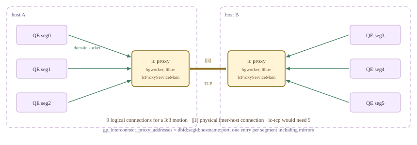

*ic-proxy topology. A 3:3 motion across two hosts still has 9 logical connections; it has one inter-host TCP connection. Backends reach their local proxy over a Unix domain socket.*

Mechanically the proxy sits *below* ic-tcp, which is why `proxy_ipc_layer` reuses every TCP method: `SetupInterconnectTCP` takes an `#ifdef ENABLE_IC_PROXY` branch (`ic_tcp.c:1414`) that hands the connection set to `ic_proxy_backend_run_loop`, which binds domain-socket fds to libuv pipes and then lets the ordinary `ic_tcp` send/receive code drive them. The proxy process itself is a background worker (`src/backend/cdb/motion/ic_proxy_bgworker.c`, 42 lines: `ICProxyMain` simply calls `CurrentMotionIPCLayer->IcProxyServiceMain()`), and the vtable slot exists in all three layers when built with `--enable-ic-proxy`, `NULL` otherwise. Its flow control is a third design again — neither TCP's backpressure nor udpifc's packet loss will do, because many logical connections share one physical one and a dropped packet cannot be dropped after it has arrived — so the README describes explicit `unackSendPkt`/`unackRecvPkt` counters with pause and resume thresholds, and a rule that the sender may only pause on packet boundaries.

None of which can be exercised here, and it is worth being precise about *why*. This server was built with `--enable-ic-proxy` (`ENABLE_IC_PROXY` is defined in `src/include/pg_config.h:53`), so `proxy` is a legal GUC value and the connection opens. But there is no `ic proxy process` on this cluster, and `gp_interconnect_proxy_addresses` is empty. A motion-bearing query therefore does not fail — it waits, forever, for a proxy that will never answer:

*`proxy` is accepted, then blocks in setup. A `statement_timeout` is the polite way to find out.*

```sql
PGOPTIONS='-c gp_interconnect_type=proxy' psql -p 7100 -d postgres
  -c "show gp_interconnect_type;"
  -c "set statement_timeout='15s'; select count(*) from m195_fact;"
```

```text {3,7} title="output"
 gp_interconnect_type 
----------------------
 proxy
(1 row)

SET
ERROR:  canceling statement due to statement timeout
```

:::note

There is a second, more interesting reason the proxy is absent here, visible in the coordinator log at every postmaster start: `background worker "ic proxy process": background workers without shared memory access are not supported` (`bgworker.c:706`). The entry in `PMAuxProcList` at `postmaster.c:450` declares `bgw_flags = 0`, and PostgreSQL 16 removed support for shmem-less background workers &#8212; so on this PG16-based tree the proxy worker is **rejected at registration**, before `gp_interconnect_proxy_addresses` is ever consulted. Configuring the addresses would not have helped. **This section could not exercise ic-proxy on the cluster**, and everything above is from the source and the README &#8212; except for one measurement, which comes from somewhere else entirely.

:::

### 19.5.8 The transport has a test harness of its own

Splitting the interconnect out of the backend bought something the README lists first among the benefits: "It is more convenient to test & debug & benchmark." `contrib/interconnect/test/` is a CMake project that compiles the *real* `ic_common.c`, `ic_tcp.c`, `ic_udpifc.c` and all twelve proxy files against a mocked backend — `elog_mock.c` (1024 lines) stubs out the error subsystem, `ic_test_env.c` (411) fakes an `EState` and a slice table, `ic_interface_test.c` (345) drives the vtable through cmockery, and `ic_bench.c` (704) forks a client and a server and pushes tuples through a chosen `MotionIPCLayer` for a fixed interval. A transport you can benchmark without a database is a rare thing to find in a database.

It does not build against this tree unmodified: four errors, all in `elog_mock.c`, all the same kind of drift — PG16's `utils/elog.h` now declares `write_csvlog`, `write_pipe_chunks` and `error_severity` as `extern` where the mock declares them `static`, and `errdetail` now returns `int` where the mock returns `void`. Every interconnect and proxy source file compiles clean. Patching those four declarations in an out-of-tree copy was enough to get `ic_bench` running:

*`ic_bench`, off-cluster, single client + single server, 10 s, default MTU 1500 and 200-byte buffers. Including the proxy transport this cluster cannot run.*

```sql
# out-of-tree build of contrib/interconnect/test with the four elog_mock.c
# declarations reconciled with PG16's elog.h
./ic_bench -t 0 -i 10   # tcp
./ic_bench -t 1 -i 10   # udpifc
./ic_bench -t 2 -i 10   # proxy
```

```text {6} title="output"
##### -t 0  tcp #####            ##### -t 1  udpifc #####         ##### -t 2  proxy #####
| Total time(s) |  10.000 |      | Total time(s) |  10.178 |      | Total time(s) |  10.000 |
| Loop times    | 2695493 |      | Loop times    |   37216 |      | Loop times    |  927160 |
| LPS(l/ms)     | 269.548 |      | LPS(l/ms)     |   3.657 |      | LPS(l/ms)     |  92.718 |
| Recv mbs      |    3670 |      | Recv mbs      |      43 |      | Recv mbs      |    1262 |
| TPS(mb/s)     | 367.084 |      | TPS(mb/s)     |   4.268 |      | TPS(mb/s)     | 126.267 |
| Recv counts   |18868451 |      | Recv counts   |  223296 |      | Recv counts   | 6490120 |
| Items ops/ms  |1886.838 |      | Items ops/ms  |  21.939 |      | Items ops/ms  | 649.024 |
```

An 86× gap in favour of TCP looks alarming until you notice that the benchmark is *exactly* the configuration in which udpifc's machinery cannot help, and [§19.5](#195-interconnect-implementations).5 already predicted the number. One client and one server means one logical connection, so R = 1: `snd_buffer_pool.maxCount` = 2, `cwnd` reaches 2, and `cwnd − minCwnd` = 1 — the sender may have at most two 1408-byte datagrams in flight and must then wait for an ack, per packet, plus a CRC over each one. Loss-based flow control has degenerated to near stop-and-wait. The harness's own README reports the same shape from different hardware (tcp 654, proxy 156, udpifc 5.0 MB/s) and appends the right caveat: "Lower TPS does not mean the protocol is slower, might means that the cpu time taken by the protocol is low... it satisfies the highest tps required by cbdb, at the same time it occupies a lower cpu than other types of interconnect." udpifc is not optimised for one stream; it is optimised for a hundred thousand of them not exhausting the machine's file descriptors. Add the `--enable-cassert` build and these are ratios between transports under one synthetic load, nothing more.

What the vtable bought, then, is on the table in front of us. A transport that can be selected per connection without a restart; a transport that exists in the tree, registers itself, and is simply absent when not compiled in (`udp2`); a transport whose background worker is broken by a PostgreSQL upgrade without breaking the two that work (`proxy`); and a transport that can be compiled, linked and benchmarked with no cluster at all. And running the other way through the same seam, the one upward-facing method in the whole interface: `GetMaxTupleChunkSize`, by which the wire tells the executor how big a piece of a tuple is allowed to be — 8100 bytes today, because an 88-byte header has to fit in front of it. The last piece of the interconnect is the one case where the wire is exposed to the *client* rather than to another executor, and that is [§19.6](#196-parallel-retrieve-cursor--endpoint).

*Cleanup. All transport switching in this section was per-connection `PGOPTIONS` or session-level `SET`; no persistent GUC was changed and the cluster is as it was found.*

```sql
drop table if exists m195_fact;
drop table if exists m195_dim;
drop table if exists m195_wide;
select relname from pg_class where relname like 'm195%';
show gp_interconnect_type;
```

```text {7} title="output"
 relname 
---------
(0 rows)

 gp_interconnect_type 
----------------------
 udpifc
(1 row)
```

## 19.6 Parallel Retrieve Cursor / Endpoint

Every plan in this book has ended the same way. Three segments scan, join and aggregate in parallel, and then a `Gather Motion 3:1` funnels all of it into one process — the QD — which writes the result to one client socket ([§13.1](./ch13.md#131-the-simple-query-protocol)). For most work that funnel is free: the interesting rows are few. But when a client wants a *billion* rows — a connector feeding Spark, an ML training loader, a bulk extract — the cluster can produce results several times faster than a single coordinator process can forward them. The N-way machinery of Chapters 18 and 19 ends in a one-lane exit.

A **parallel retrieve cursor** removes the funnel. The plan is deliberately left **un-gathered**: no Motion is added on top, each QE keeps its own slice of the result, and the tuples are parked in an **endpoint** — a small shared-memory queue in the segment's own address space. N client connections then attach to N segments and pull concurrently. It is the one place in Cloudberry where an ordinary client speaks directly to a segment as a first-class client, and the fitting close to a chapter about moving data: here the interconnect gets *out of the way*.

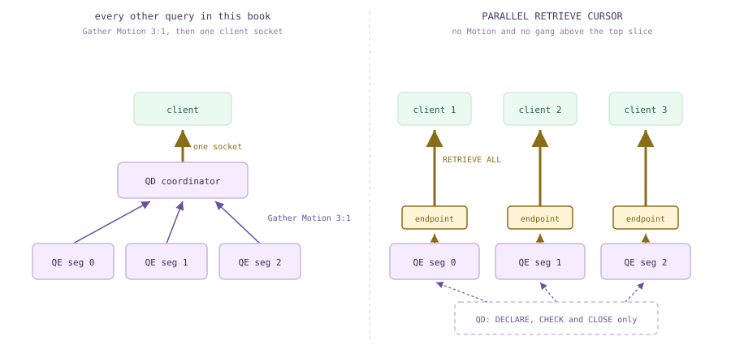

*The funnel and the way around it. Left: every other query in this book — three senders, one receiver, one socket. Right: a parallel retrieve cursor — the tuples stay where they were produced, each segment holds an endpoint, and the coordinator is left holding only the control plane.*

### 19.6.1 Declaring one, and the plan that is missing something

A parallel retrieve cursor is declared like any other cursor, except that it **must live inside an explicit transaction** and its name must be unique in that transaction. The reason is not bookkeeping: the QEs that hold the endpoints are this transaction's gang, and the tuples they are holding belong to this transaction's snapshot ([§10.5](../part-3-transactions-mvcc-concurrency/ch10.md#105-distributed-snapshots--the-distributed-log)). Close the transaction and the result evaporates — which is also why `WITH HOLD` is rejected outright (`analyze.c:3409`). Our demo table is nine rows over three segments:

*Nine rows, hash-distributed. Remember which ids live on segment 0 — we are going to pull them out of that segment by hand.*

```sql
CREATE TABLE m196_t (id int, v text) DISTRIBUTED BY (id);
INSERT INTO m196_t SELECT g, 'v'||g FROM generate_series(1,9) g;
SELECT gp_segment_id, count(*), string_agg(id::text, ',' ORDER BY id)
  FROM m196_t GROUP BY 1 ORDER BY 1;
```

```text {3} title="output"
 gp_segment_id | count | string_agg
---------------+-------+------------
             0 |     5 | 2,3,4,7,8
             1 |     1 | 1
             2 |     3 | 5,6,9
(3 rows)
```

`EXPLAIN` accepts the `DECLARE` itself, and this is the most informative thing in the section. Compare the cursor's plan with the plan for the very same `SELECT` run as an ordinary statement:

*The cursor's plan next to the ordinary plan. Two things are missing from the first one: the Gather Motion, and slice 0.*

```sql
BEGIN;
EXPLAIN (COSTS OFF, SLICETABLE ON) DECLARE c PARALLEL RETRIEVE CURSOR FOR SELECT * FROM m196_t;
ROLLBACK;
EXPLAIN (COSTS OFF, SLICETABLE ON) SELECT * FROM m196_t;
```

```text {5} title="output"
BEGIN
                   QUERY PLAN
-------------------------------------------------
 Seq Scan on m196_t
 Endpoint: on all 3 segments
 Slice 0: Reader; root 0; parent -1; gang size 3
 Optimizer: Postgres query optimizer
(4 rows)

ROLLBACK
                     QUERY PLAN
-----------------------------------------------------
 Gather Motion 3:1  (slice1; segments: 3)
   ->  Seq Scan on m196_t
 Slice 0: Dispatcher; root 0; parent -1; gang size 0
 Slice 1: Reader; root 0; parent 0; gang size 3
 Optimizer: GPORCA
(5 rows)
```

Read the slice tables side by side ([§19.3](#193-slice-tables--planslice--gang-mapping) taught the notation). The ordinary query has two slices: slice 0 is the *Dispatcher* — the QD itself, gang size 0 — and slice 1 is the reader gang of three that feeds it. The cursor has **one** slice, and it is a `Reader` with `parent -1`: the reader gang *is* the root. There is no gang above it, so there is nothing for the interconnect to connect ([§19.2](#192-the-dispatcher-gangs--async-dispatch), [§19.5](#195-interconnect-implementations)). The extra `Endpoint:` line is printed by `ExplainParallelRetrieveCursor` (`explain_gp.c:2308`).

The second difference is the optimizer line: `GPORCA` becomes `Postgres query optimizer`. This is not a coincidence of this query — `CURSOR_OPT_PARALLEL_RETRIEVE` is one of the conditions in the gate that [§17.1](./ch17.md#171-entry--dispatch) dissected, so a parallel retrieve cursor is **always** planned by the PostgreSQL planner. Setting `optimizer=on` explicitly changes nothing; the gate is on the cursor option, not on the GUC alone.

```c title="src/backend/optimizer/plan/planner.c:398"
	if (optimizer &&
		GP_ROLE_DISPATCH == Gp_role &&
		IS_QUERY_DISPATCHER() &&
		(cursorOptions & CURSOR_OPT_SKIP_FOREIGN_PARTITIONS) == 0 &&
		(cursorOptions & CURSOR_OPT_PARALLEL_RETRIEVE) == 0)
	{
```

The missing Gather is one `if`. `planner.c:457` records the option as `glob->is_parallel_cursor`, and the place that would normally staple a Motion-to-Entry onto the cheapest path asks about it first. Without that call there is simply no Motion, and the top slice keeps the locus the query produced ([§16.1](./ch16.md#161-the-locus-model-cdbpathlocus)).

```c title="src/backend/cdb/cdbllize.c:613"
		if (query->commandType == CMD_SELECT || query->returningList)
		{
			if (!root->glob->is_parallel_cursor)
			{
				/*
				 * Query result needs to be brought back to the QD. Ask for
				 * a motion to bring it in. ...
```

So `DECLARE` dispatches a plan that runs and then *stops with its tuples in hand*. On each QE the executor recognises the root slice of a parallel retrieve cursor, builds a **64 KB `shm_mq`** with `CreateTupleQueueDestReceiver` — the same tuple queue PostgreSQL uses between parallel workers, which [§18.2](./ch18.md#182-scan-nodes) met from the other side — claims a slot in the shared `sharedEndpoints[]` array (1024 slots, `cdbendpoint_private.h:19`), and only then acknowledges (`execMain.c:1008` and `:1018`, `cdbendpoint.c:305`–`:313`). The QD's `DECLARE` does not return until every acknowledgement is in, via `WaitEndpointsReady` at `portalcmds.c:196`. That is the whole handshake:

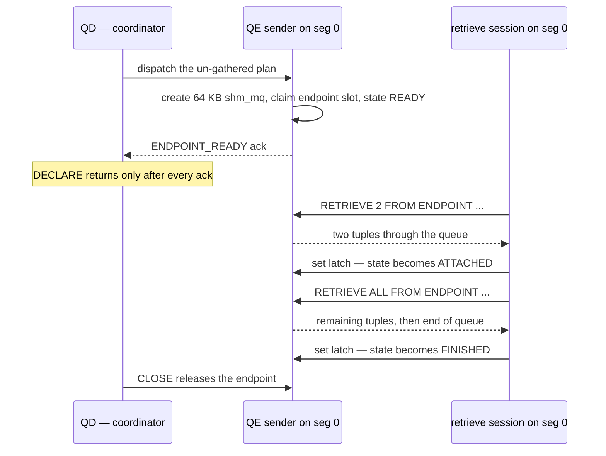

*Declaring, retrieving, releasing. The QE sender never writes to a socket: it writes into a 64 KB queue and blocks when the queue is full, exactly as a Motion sender blocks on a full send queue ([§19.4](#194-motion-nodes)) — which is why the transaction has to stay open.*

### 19.6.2 Where the endpoints land

How many endpoints a cursor gets, and where, is decided entirely by the **locus of the top of the plan** — the same locus algebra as [§16.1](./ch16.md#161-the-locus-model-cdbpathlocus), read one last time. `adjust_top_path_for_parallel_retrieve_cursor` turns that locus into the top slice's gang type, and `GetParallelCursorEndpointPosition` (`cdbendpoint.c:225`) turns it into the four-way classification `EXPLAIN` prints.

```c title="src/backend/cdb/cdbllize.c:1629"
	if (CdbPathLocus_IsSingleQE(path->locus)
		|| CdbPathLocus_IsGeneral(path->locus)
		|| CdbPathLocus_IsEntry(path->locus))
	{
		slice->numsegments = 1;
		slice->gangType = GANGTYPE_ENTRYDB_READER;
	}
	else if (CdbPathLocus_IsSegmentGeneral(path->locus))
	{
		/* queries to replicated table run on a single segment. */
		slice->segindex = gp_session_id % path->locus.numsegments;
		slice->gangType = GANGTYPE_SINGLETON_READER;
	}
```

| cursor query | top of plan | EXPLAIN says Endpoint: | endpoints |
| --- | --- | --- | --- |
| SELECT * FROM m196_t | Seq Scan | on all 3 segments | 3 — one per segment |
| … WHERE id = 1 | Seq Scan + Filter, direct dispatch | on segments: contentid [1] | 1 — on segment 1 only |
| … WHERE id IN (1,5) | Seq Scan + Filter, direct dispatch | on segments: contentid [1, 2] | 2 |
| SELECT * FROM m196_r (replicated) | Seq Scan | on segment: contentid [n] | 1 — on gp_session_id % 3 |
| SELECT 1 | Result | on coordinator | 1 — on the coordinator |
| SELECT relname FROM pg_class LIMIT 3 | Limit + Seq Scan | on coordinator | 1 |
| SELECT * FROM m196_t ORDER BY id | Gather Motion 3:1, Merge Key: id | on coordinator | 1 |
| SELECT count(*) FROM m196_t | Finalize Aggregate over Gather Motion | on coordinator | 1 |

The direct-dispatch rows are the pleasing ones: a cursor over `WHERE id = 1` gets exactly one endpoint, on the one segment that can hold that hash value ([§16.4](./ch16.md#164-distributed-grouping--direct-dispatch)). The replicated-table row is stranger — a replicated table is on *every* segment, so the planner must pick one, and it picks it with `gp_session_id % numsegments`. Three consecutive sessions therefore march across the cluster:

*The same cursor declared in three fresh coordinator sessions. Sessions 145, 146, 147 land on segments 1, 2, 0 — and the session id is also visible in the middle of the endpoint name.*

```sql
-- run three times, in three separate psql sessions
BEGIN;
DECLARE m196_cr PARALLEL RETRIEVE CURSOR FOR SELECT * FROM m196_r;
SELECT current_setting('gp_session_id') AS sess, gp_segment_id, endpointname
  FROM gp_session_endpoints;
ROLLBACK;
```

```text {3} title="output"
 sess | gp_segment_id |      endpointname
------+---------------+-------------------------
 145  |             1 | m196_cr0000009100000002
(1 row)

 sess | gp_segment_id |      endpointname
------+---------------+-------------------------
 146  |             2 | m196_cr0000009200000002
(1 row)

 sess | gp_segment_id |      endpointname
------+---------------+-------------------------
 147  |             0 | m196_cr0000009300000002
(1 row)
```

:::note

The last four rows of the table are the honest part of this feature. **An un-gathered plan is not always possible.** A global `ORDER BY`, a `LIMIT`, a final aggregate — anything whose top node must see all segments' rows in one process — still ends in a `Gather Motion 3:1`, and then the endpoint is created *on the coordinator*, where the tuples already are. Such a cursor is still perfectly usable, but it is a one-endpoint cursor with a coordinator bottleneck: the parallelism you get is the parallelism the plan's locus gives you, and the header comment on `cdbendpoint.h:5` says so in as many words. Reserve the feature for queries whose result can stay distributed.

:::

*A cursor whose plan ends in a merge Gather: one endpoint, gp_segment_id -1, port 7100. It is retrievable — from the coordinator, with all nine rows in sorted order — but there is nothing parallel about it.*

```sql
BEGIN;
DECLARE m196_ord PARALLEL RETRIEVE CURSOR FOR SELECT id FROM m196_t ORDER BY id;
SELECT gp_segment_id, hostname, port, state, endpointname FROM gp_session_endpoints;

-- in another shell, against the COORDINATOR port:
--   PGPASSWORD=<token> PGOPTIONS='-c gp_retrieve_conn=true' --     psql -h cbdb-node1 -p 7100 -d postgres -c 'RETRIEVE ALL FROM ENDPOINT m196_ord0000004000000021'
```

```text {3} title="output"
 gp_segment_id |  hostname  | port | state |       endpointname
---------------+------------+------+-------+--------------------------
           -1 | cbdb-node1 | 7100 | READY | m196_ord0000004000000021
(1 row)

 id
----
  1
  2
  3
  4
  5
  6
  7
  8
  9
(9 rows)
```

### 19.6.3 Three views, a name, and a token

Endpoints are not catalogue rows; they are shared-memory slots, so they are exposed through three functions wrapped in three views. **`gp_endpoints`** runs on the coordinator and dispatches: it shows *every* endpoint of every session (for a superuser; a plain user sees only their own) and is the one a client driver reads to learn where to connect. **`gp_session_endpoints`** is the same data filtered to the calling session — the view a program uses to find *its own* cursor. **`gp_segment_endpoints`** is different in kind: it is answered locally by whichever backend you ask, so you run it in a `gp_role=utility` connection to one segment, and it adds the two process ids that matter — `senderpid` (the QE holding the tuples) and `receiverpid` (the retrieve session, `-1` if nobody has attached).

*The same three endpoints seen three ways. Note the second query: gp_session_endpoints is empty in an unrelated session, even for a superuser who can see all three rows through gp_endpoints.*

```sql
-- (1) an unrelated coordinator session, while the cursor's transaction is open elsewhere
SELECT gp_segment_id, cursorname, sessionid, hostname, port, username, state, endpointname
  FROM gp_endpoints ORDER BY 1;

-- (2) the same session, asking about its own endpoints
SELECT count(*) AS rows_visible FROM gp_session_endpoints;

-- (3) a utility connection straight to segment 0
--   PGOPTIONS='-c gp_role=utility' psql -p 7102 -d postgres
SELECT senderpid, receiverpid, state, gp_segment_id, sessionid, username, endpointname, cursorname
  FROM gp_segment_endpoints;
```

```text {10} title="output"
 gp_segment_id | cursorname | sessionid |  hostname  | port | username | state |       endpointname
---------------+------------+-----------+------------+------+----------+-------+--------------------------
             0 | m196_prc   |        18 | cbdb-node1 | 7102 | gpadmin  | READY | m196_prc0000001200000003
             1 | m196_prc   |        18 | cbdb-node1 | 7103 | gpadmin  | READY | m196_prc0000001200000003
             2 | m196_prc   |        18 | cbdb-node1 | 7104 | gpadmin  | READY | m196_prc0000001200000003
(3 rows)

 rows_visible
--------------
            0
(1 row)

 senderpid | receiverpid | state | gp_segment_id | sessionid | username |       endpointname       | cursorname
-----------+-------------+-------+---------------+-----------+----------+--------------------------+------------
     13060 |          -1 | READY |             0 |        18 | gpadmin  | m196_prc0000001200000003 | m196_prc
(1 row)
```

The **endpoint name** is the same on every segment, because it is derived from data all the QEs share. `generate_endpoint_name` (`cdbendpointutils.c:557`) concatenates the cursor name, `gp_session_id` as 8 hex digits, and `gp_command_count` as 8 more. So `m196_prc0000001200000003` decodes as cursor `m196_prc`, session `0x12` = 18, command `3` — and the name is unique enough that dropping and re-declaring the same cursor name in the same session cannot be confused with the old one. (The comment at `cdbendpoint_private.h:31` still claims the third part is a segment index; the code has said `gp_command_count` since the commit below it. Trust the code.)

The **auth token** is what lets a stranger connect. It is 16 bytes of `pg_strong_random`, cached per session on each QE (`cdbendpoint.c:260`) and rendered as 32 hex characters. Because it is generated independently on each segment, it is per **(session, segment)** — different for the same cursor on different segments, and shared by *all* cursors of one session on one segment:

*Two cursors declared in one transaction. Six endpoints, but only three distinct tokens: a token authorises a retrieve session on one segment for one coordinator session, not one cursor.*

```sql
BEGIN;
DECLARE ca PARALLEL RETRIEVE CURSOR FOR SELECT id FROM m196_t;
DECLARE cb PARALLEL RETRIEVE CURSOR FOR SELECT id+1 FROM m196_t;
SELECT gp_segment_id, cursorname, auth_token FROM gp_session_endpoints ORDER BY 1,2;
```

```text {3,4} title="output"
 gp_segment_id | cursorname |            auth_token
---------------+------------+----------------------------------
             0 | ca         | 8223ca4ca2b997d62d3c9cc4c78cbc1b
             0 | cb         | 8223ca4ca2b997d62d3c9cc4c78cbc1b
             1 | ca         | d2787bf004868e259316ff6bee482de9
             1 | cb         | d2787bf004868e259316ff6bee482de9
             2 | ca         | cae8681dc9c8e8309c5970df01803134
             2 | cb         | cae8681dc9c8e8309c5970df01803134
(6 rows)
```

The token is presented as the **password**, and this is the one security-relevant surprise in the feature: a retrieve connection does not consult `pg_hba.conf` at all. `ClientAuthentication` checks for the `gp_retrieve_conn` option *first* and returns before any HBA lookup. The only checks are that the role name equals the cursor's owner, that the token matches a live endpoint token for that role on this segment, and that the role may log in.

```c title="src/backend/libpq/auth.c:712"
	retrieve_conn_authenticated = false;
	if (cmd_options_include_retrieve_conn(port->cmdline_options) ||
		guc_options_include_retrieve_conn(port->guc_options))
	{
		retrieve_conn_authentication(port);
		retrieve_conn_authenticated = true;
		return;
	}
```

### 19.6.4 Actually retrieving

A client enters retrieve mode with the GUC **`gp_retrieve_conn=true`** in the startup packet — `PGOPTIONS` from psql, `options` in a connection string — aimed at the *segment's* port, with the endpoint's token as the password. That GUC is `PGC_BACKEND` (`guc_gp.c:1006`) so it can only be set at connection time; `postinit.c:1350` then forces `Gp_role = GP_ROLE_UTILITY` for the session. Such a backend is deliberately crippled: the only statement it will parse is `RETRIEVE` (`gram.y:16383`), enforced by a single XOR at `analyze.c:331`. Here is a real session against segment 0, pulling out the ids we saw distributed there earlier:

*A retrieve-mode psql on port 7102 draining segment 0 by hand: 2 rows, then the remaining 3, then nothing. Compare with the distribution captured at the start — 2,3,4,7,8, in that order, with no coordinator in the path.*

```sql
$ PGPASSWORD=e99c6f36be30e4afdc01d2815f3cf611 PGOPTIONS='-c gp_retrieve_conn=true'     psql -h cbdb-node1 -p 7102 -d postgres

SELECT current_setting('gp_retrieve_conn'), current_setting('gp_role');
RETRIEVE 2 FROM ENDPOINT m196_prc0000001200000003;
RETRIEVE ALL FROM ENDPOINT m196_prc0000001200000003;
RETRIEVE ALL FROM ENDPOINT m196_prc0000001200000003;
```

```text {11} title="output"
ERROR:  This is a retrieve connection, but the query is not a RETRIEVE.

 gp_segment_id | id | v
---------------+----+----
             0 |  2 | v2
             0 |  3 | v3
(2 rows)

 gp_segment_id | id | v
---------------+----+----
             0 |  4 | v4
             0 |  7 | v7
             0 |  8 | v8
(3 rows)

 gp_segment_id | id | v
---------------+----+---
(0 rows)
```

While that session sat between its two `RETRIEVE`s, the endpoint's state was visible from everywhere else in the cluster — and the segment-local view had filled in the receiver's pid:

*Observed from an unrelated coordinator session and from a utility connection to segment 0, mid-retrieve. The QD is told nothing until it asks.*

```sql
-- unrelated coordinator session
SELECT gp_segment_id, state, endpointname FROM gp_endpoints ORDER BY 1;
-- utility connection to segment 0
SELECT senderpid, receiverpid, state, endpointname FROM gp_segment_endpoints;
-- in the cursor's own session
SELECT gp_wait_parallel_retrieve_cursor('m196_prc', 0);
```

```text {3} title="output"
 gp_segment_id |  state   |       endpointname
---------------+----------+--------------------------
             0 | ATTACHED | m196_prc0000001200000003
             1 | READY    | m196_prc0000001200000003
             2 | READY    | m196_prc0000001200000003
(3 rows)

 senderpid | receiverpid |  state   |       endpointname
-----------+-------------+----------+--------------------------
     13060 |       13311 | ATTACHED | m196_prc0000001200000003
(1 row)

 gp_wait_parallel_retrieve_cursor
----------------------------------
 f
(1 row)
```

The other two segments were drained at the same time, by two more processes, on two more ports — which is the entire point of the feature. Once all three queues hit end-of-stream, the endpoints report `FINISHED`, their `senderpid` becomes `-1` (the QE has finished sending), and the coordinator's `gp_wait_parallel_retrieve_cursor` flips to true:

*Two independent client processes, two segments, concurrently — then the coordinator's view. Nine rows crossed the wire; none of them crossed the coordinator.*

```sql
$ PGPASSWORD=$T1 PGOPTIONS='-c gp_retrieve_conn=true' psql -h cbdb-node1 -p 7103 -d postgres     -c "RETRIEVE ALL FROM ENDPOINT m196_prc0000001200000003" &
$ PGPASSWORD=$T2 PGOPTIONS='-c gp_retrieve_conn=true' psql -h cbdb-node1 -p 7104 -d postgres     -c "RETRIEVE ALL FROM ENDPOINT m196_prc0000001200000003" &

-- then, on the coordinator:
SELECT gp_segment_id, state, endpointname FROM gp_endpoints ORDER BY 1;
SELECT gp_wait_parallel_retrieve_cursor('m196_prc', 0);
```

```text {22} title="output"
 gp_segment_id | id | v
---------------+----+----
             1 |  1 | v1
(1 row)

 gp_segment_id | id | v
---------------+----+----
             2 |  5 | v5
             2 |  6 | v6
             2 |  9 | v9
(3 rows)

 gp_segment_id |  state   |       endpointname
---------------+----------+--------------------------
             0 | FINISHED | m196_prc0000001200000003
             1 | FINISHED | m196_prc0000001200000003
             2 | FINISHED | m196_prc0000001200000003
(3 rows)

 gp_wait_parallel_retrieve_cursor
----------------------------------
 t
(1 row)
```

`gp_wait_parallel_retrieve_cursor(name, timeout)` is the coordinator's only handle on progress: `0` polls, `-1` blocks until everything is drained, and any retrieve-side error is re-raised here rather than being silently lost. It must be called in the declaring transaction. Between polls, a background timeout on the QD (`enable_parallel_retrieve_cursor_check_timeout`) keeps checking for QE-side failures. The five states it is reporting on are the enum at `cdbendpoint.h:58`:

| state | meaning | set by |
| --- | --- | --- |
| READY | slot allocated, 64 KB queue created, nobody attached | the QE sender, in alloc_endpoint() |
| RETRIEVING | a RETRIEVE is draining the queue right now | start_retrieve(), cdbendpointretrieve.c:346 |
| ATTACHED | one retrieve session owns it, but stopped short of the end | finish_retrieve(), after RETRIEVE count |
| FINISHED | the queue was read to end-of-stream | finish_retrieve(), on queue EOF |
| RELEASED | the retriever failed or vanished before finishing — nobody may attach again | retrieve_cancel_action(), cdbendpointretrieve.c:676 |

### 19.6.5 The rules, and what breaks them

The feature is unusually strict, and its error messages are unusually good. An endpoint may be attached by exactly **one** retrieve session — `receiverPid` is a single field, not a list — and once a session has drained it, no other session may touch it, though the owning session may keep issuing `RETRIEVE` and get empty results. `FETCH` and `MOVE` are rejected on the QD side; `SCROLL` and `WITH HOLD` are rejected at parse time. Every one of these is real output from this cluster:

*Six ways to get it wrong. The DETAIL lines come from validate_retrieve_endpoint (cdbendpointretrieve.c:379) — worth reading, because a connector will hit every one of them.*

```sql
-- a second retrieve session, while the first is still ATTACHED
RETRIEVE ALL FROM ENDPOINT m196_prc0000001200000003;
-- a new session, after the endpoint was drained by another one
RETRIEVE ALL FROM ENDPOINT m196_prc0000001200000003;
-- a name nobody ever declared
RETRIEVE ALL FROM ENDPOINT m196_nosuch;
-- a RETRIEVE in a plain utility connection (no gp_retrieve_conn)
RETRIEVE ALL FROM ENDPOINT m196_prc0000001200000003;
-- a retrieve-mode connection with a token that is not a live endpoint's
psql -h cbdb-node1 -p 7102 ...
-- on the coordinator, in the declaring transaction
FETCH 1 FROM m196_prc;
DECLARE c SCROLL PARALLEL RETRIEVE CURSOR FOR SELECT 1;
DECLARE c PARALLEL RETRIEVE CURSOR WITH HOLD FOR SELECT 1;
DECLARE c PARALLEL RETRIEVE CURSOR FOR SELECT id FROM m196_t;   -- outside a transaction
```

```text {13} title="output"
ERROR:  endpoint m196_prc0000001200000003 was already attached by receiver(pid: 13311)
DETAIL:  An endpoint can only be attached by one retrieving session.

ERROR:  another session (pid: 13311) used the endpoint and completed retrieving

ERROR:  the endpoint m196_nosuch does not exist for session id 18

ERROR:  This is not a retrieve connection, but the query is a RETRIEVE.

psql: error: connection to server at "cbdb-node1" (10.100.0.3), port 7102 failed:
FATAL:  Authentication failure (Wrong password or no endpoint for the user)

ERROR:  cannot specify 'FETCH' for PARALLEL RETRIEVE CURSOR
HINT:  Use 'RETRIEVE' statement on endpoint instead.

ERROR:  SCROLL is not allowed for the PARALLEL RETRIEVE CURSORs
DETAIL:  Scrollable cursors can not be parallel

ERROR:  DECLARE PARALLEL RETRIEVE CURSOR WITH HOLD ... is not supported
DETAIL:  Holdable cursors can not be parallel

ERROR:  DECLARE CURSOR can only be used in transaction blocks
```

The most instructive failure is a **client that walks away mid-retrieve**, because a partially-drained endpoint cannot simply be left behind: its QE is still blocked on a queue nobody will read. The retrieve backend's exit callback therefore reaches across into the endpoint slot, marks it `RELEASED`, and cancels the sender with a custom message — which surfaces on the *coordinator*, the next time the coordinator asks.

*A client retrieves one row from segment 0 and disconnects. The endpoint on segment 0 is RELEASED while the other two are untouched — but the whole cursor is doomed: the coordinator's next check aborts the transaction, taking the other two endpoints with it.*

```sql
$ PGPASSWORD=$T0 PGOPTIONS='-c gp_retrieve_conn=true' psql -h cbdb-node1 -p 7102 -d postgres     -c "RETRIEVE 1 FROM ENDPOINT m196_prc20000004000000003"      -- then exits

SELECT gp_segment_id, state, endpointname FROM gp_endpoints ORDER BY 1;
-- and in the declaring session:
SELECT gp_wait_parallel_retrieve_cursor('m196_prc2', 0);
CLOSE m196_prc2;
```

```text {8} title="output"
 gp_segment_id | id
---------------+----
             0 |  2
(1 row)

 gp_segment_id |  state   |       endpointname
---------------+----------+---------------------------
             0 | RELEASED | m196_prc20000004000000003
             1 | READY    | m196_prc20000004000000003
             2 | READY    | m196_prc20000004000000003
(3 rows)

ERROR:  canceling MPP operation: "Endpoint retrieve session is quitting. All unfinished
parallel retrieve cursors on the session will be terminated."  (seg0 10.100.0.3:7102 pid=15994)
ERROR:  current transaction is aborted, commands ignored until end of transaction block
```

```c title="src/backend/cdb/endpoint/cdbendpointretrieve.c:686"
	if (endpoint != NULL &&
		endpoint->receiverPid == MyProcPid &&
		endpoint->state != ENDPOINTSTATE_FINISHED)
	{
		endpoint->receiverPid = InvalidPid;
		endpoint->state = ENDPOINTSTATE_RELEASED;
		if (endpoint->senderPid != InvalidPid)
		{
			SetBackendCancelMessage(endpoint->senderPid, msg);
			kill(endpoint->senderPid, SIGINT);
		}
	}
```

The tidy endings are `CLOSE` and end-of-transaction. Either releases every endpoint of the cursor immediately — cancelling any `RETRIEVE` in flight — and until one of them happens, the QEs stay parked with their tuples: `DestroyEndpointExecState` is deliberately blocked so that the coordinator can still inspect state after the query has finished (`cdbendpoint.c:44`).

*CLOSE, and then COMMIT, as the release paths. Three endpoints become none, synchronously.*

```sql
BEGIN;
DECLARE m196_prc3 PARALLEL RETRIEVE CURSOR FOR SELECT id FROM m196_t;
SELECT count(*) AS endpoints FROM gp_endpoints WHERE cursorname='m196_prc3';
CLOSE m196_prc3;
SELECT count(*) AS endpoints FROM gp_endpoints WHERE cursorname='m196_prc3';
COMMIT;
```

```text {10} title="output"
DECLARE PARALLEL RETRIEVE CURSOR
 endpoints
-----------
         3
(1 row)

CLOSE CURSOR
 endpoints
-----------
         0
(1 row)

COMMIT
```

### 19.6.6 Where it sits, and the end of Part III

Put the pieces beside the rest of the chapter and the shape is familiar. The QE that owns an endpoint is doing exactly what a Motion sender does ([§19.4](#194-motion-nodes)): it runs a slice to completion and pushes tuples into a bounded queue, blocking when the queue is full — which is why a retrieve client that stalls stalls a segment process, the same coupling that makes `ExecSquelchNode` and `prefetch_inner` necessary elsewhere ([§18.1](./ch18.md#181-executor-framework--lifecycle), [§18.4](./ch18.md#184-join-nodes)). What changes is the two ends. The *receiver* is not a peer QE but an unrelated client process, so the last hop is a 64 KB `shm_mq` in the segment's own shared memory rather than a UDP or TCP route through the interconnect ([§19.5](#195-interconnect-implementations)) — the pluggable IPC layer is not involved in the final hop at all. And there is no gang above the top slice, so the dispatcher ([§19.2](#192-the-dispatcher-gangs--async-dispatch)) keeps only the control plane: `DECLARE`, `CHECK`, `CLOSE`.

Is it worth the client-side complexity? Rarely by hand — the honest answer is that this feature exists for **connectors**, not for people. Something has to enumerate `gp_endpoints`, open one connection per endpoint to the right host and port, present the right token, drive N cursors in lockstep, and handle the failure mode where one worker's death poisons the whole transaction. That is a library's job, and the two example programs in `src/test/examples/test_parallel_retrieve_cursor_*.c` are exactly that library in miniature. When the consumer is a distributed compute framework that already has N workers on N hosts — Spark, Flink, a training data loader — matching its parallelism to the cluster's turns the coordinator from a wall into a control channel. When the consumer is a single process that will iterate the rows anyway, the ordinary `Gather Motion` was never the bottleneck.

:::note

**Part III ends here.** Chapters 15 to 17 built a plan and cut it into slices; Chapter 18 executed the nodes; this chapter carried tuples between the processes that ran them — and, in this last section, arranged for them not to be carried at all. One question is left over from all of it: every gang, every motion queue and every endpoint we have allocated in Part III was allocated as though the machine were ours alone. It is not. **Chapter 21** takes up who is allowed how much of it — resource groups, queues, and the accounting that decides which of these plans gets to run.

:::

