<!--
  Licensed to the Apache Software Foundation (ASF) under one
  or more contributor license agreements.  See the NOTICE file
  distributed with this work for additional information
  regarding copyright ownership.  The ASF licenses this file
  to you under the Apache License, Version 2.0 (the
  "License"); you may not use this file except in compliance
  with the License.  You may obtain a copy of the License at

    http://www.apache.org/licenses/LICENSE-2.0

  Unless required by applicable law or agreed to in writing,
  software distributed under the License is distributed on an
  "AS IS" BASIS, WITHOUT WARRANTIES OR CONDITIONS OF ANY
  KIND, either express or implied.  See the License for the
  specific language governing permissions and limitations
  under the License.
-->

# 20. High Availability & Recovery

## 20.1 Overview & Recovery Foundations

### 20.1.1 Two failure domains, one write-ahead log

Cloudberry eliminates single points of failure on two independent planes. The **control plane** is the coordinator plus a hot **standby coordinator**; the **data plane** is every primary segment paired with a **mirror**. Both planes ride the same PostgreSQL write-ahead log, replicated by streaming replication — but Cloudberry layers two MPP-specific pieces on top: a cluster-wide fault detector (**FTS**) that decides *when* to fail over, and a recovery path that understands *distributed* (two-phase) transactions, not just local ones.

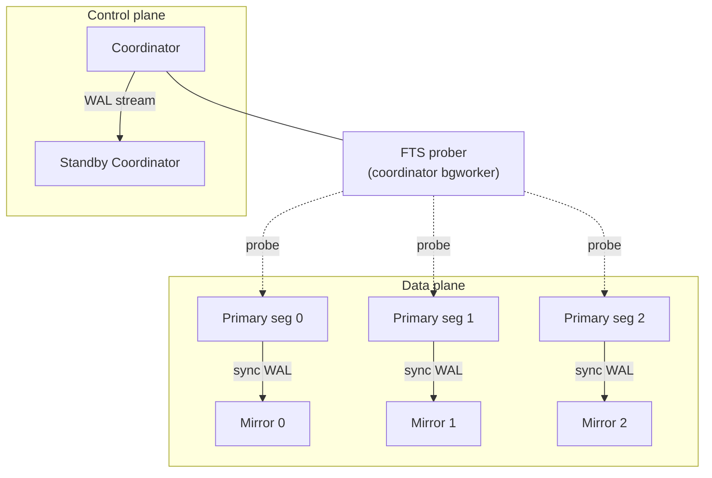

*Cluster HA topology: every primary has a mirror kept in sync by WAL streaming; FTS on the coordinator probes all primaries each cycle.*

### 20.1.2 The failure model: what can actually fail

Recovery is only definable against a model of *what can fail*. A single PostgreSQL node faces three classical failure classes; Cloudberry's MPP shape adds two more — and each pillar of this chapter answers one of them:

- **Transaction failure** — A statement errors or the client issues `ROLLBACK`. Nothing durable is lost — the transaction simply never commits. Handled by ordinary abort, not recovery.
- **Process / system crash** — A backend, the postmaster, or the whole OS dies. In-memory state (shared buffers, unflushed WAL) is lost; on-disk files survive but may be *inconsistent* with the last acknowledged commits. This is what **crash recovery** ([§20.4](#204-system-recovery)) repairs.
- **Media failure** — A disk corrupts or dies — the bytes are gone, so local replay cannot help. The answer is a second copy on another machine: a **mirror** or **standby**, kept current by replication ([§20.3](#203-streaming-replication)).
- **Segment / node failure (MPP)** — A whole segment host disappears. The cluster must *detect* it (**FTS**, [§20.5](#205-cluster-high-availability--fts)) and promote that segment's mirror, so the cluster stays available even though the failed node never recovered.
- **Coordinator failure (MPP)** — The coordinator is itself a single point of failure; a hot **standby coordinator**, fed by WAL streaming, is promoted to replace it ([§20.4](#204-system-recovery).7).

### 20.1.3 Why a live database cannot trust its own data files

For speed, every change first lands in **shared buffers** in RAM; dirty pages are written back lazily by the background writer and checkpointer — often long after the transaction that made them has committed, sometimes before it commits at all. Two buffer-management policies decide what state a crash can leave on disk:

- **STEAL** — Cloudberry *may* evict and flush a dirty page belonging to an **uncommitted** transaction to reclaim a buffer. So after a crash the data files can contain changes that were never committed.
- **NO-FORCE** — A commit does **not** force its data pages to disk — only its WAL. So after a crash the data files can be *missing* changes that were already acknowledged to the client as committed.

:::note

STEAL + NO-FORCE is the fast combination, but it opens a gap in **both** directions: uncommitted junk may be on disk, and committed truth may be absent from it. Closing that gap at restart is precisely the job of recovery — and the write-ahead log is the only record that spans it.

:::

### 20.1.4 WAL, checkpoints, and the redo-only model

The **write-ahead log** ([§20.2](#202-write-ahead-logging-wal)) resolves NO-FORCE: because every change is logged *before* its data page may be written, replaying the log after a crash re-applies any committed change that never reached the data files. Redo is **idempotent** — each page stores the LSN of the last WAL record applied to it, so replay simply skips any record already reflected on the page. A **checkpoint** ([§20.2](#202-write-ahead-logging-wal).6) bounds how far back replay must begin: everything logically before the checkpoint's REDO point is guaranteed already on disk, so older WAL can be discarded.

Textbook **ARIES** recovery then runs three phases — *analysis*, *redo*, and *undo*, the last rolling back the uncommitted changes that STEAL allowed onto disk. Cloudberry, like PostgreSQL, does **redo only** and never physically undoes anything. Uncommitted changes left on disk are harmless because **MVCC** never marks their transaction committed in `pg_clog`, so no snapshot can ever see them; `VACUUM` reclaims the dead row versions later. The one deliberate exception is a **prepared** (phase-1) two-phase transaction, which is *kept* across recovery so distributed recovery can resolve it ([§20.4](#204-system-recovery).4, [§20.4](#204-system-recovery).5).

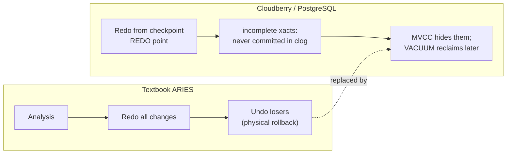

*Why there is no undo phase: ARIES rolls back losers, whereas Cloudberry leaves them on disk and lets MVCC + clog make them invisible.*

### 20.1.5 Roadmap: the four pillars

The rest of the chapter implements this theory in four pillars, in **dependency order** — each builds on the one before, and the bridge at the end of every section hands off to the next: (1) **WAL** ([§20.2](#202-write-ahead-logging-wal)) — the durable redo record everything is rebuilt from, including Cloudberry's distributed-commit records; (2) **streaming replication** ([§20.3](#203-streaming-replication)) — keeping a second copy so a *media* or *node* failure loses nothing, and turning synchronous replication off when a mirror dies; (3) **system recovery** ([§20.4](#204-system-recovery)) — single-node redo plus the distributed-transaction reconciliation layer; and (4) **FTS** ([§20.5](#205-cluster-high-availability--fts)) — turning a detected failure into a role change. Every claim below was read and confirmed against the source; `file:line` references point at the working tree.

## 20.2 Write-Ahead Logging (WAL)

### 20.2.1 The WAL invariant and the insert path

Cloudberry inherits PostgreSQL's WAL machinery essentially unchanged at its core. Every modification first becomes a WAL record, built through a fixed three-call sequence:

`XLogBeginInsert()` → `XLogRegisterData() / XLogRegisterBuffer()` → `XLogInsert(rmid, info)`

*Anatomy of a WAL record*

- `XLogRecord` — length · xid · prev-LSN · CRC · rmid + info
- `block data` — block refs + full-page images
- `main data` — resource-manager payload

Two invariants govern that path:

- **No WAL during recovery** — `XLogBeginInsert` refuses to start a record while replaying — it errors with *“cannot make new WAL entries during recovery.”*
- **WAL before data** — `XLogInsert` enforces the write-ahead rule: a record reaches durable storage **before** the dirty data page it describes may be written back.

The `info` byte splits in two: its high 4 bits are the resource-manager opcode (the xact manager masks them with `XLOG_XACT_OPMASK = 0xF0`), and the low bits are record-specific flags.

:::note

Source — insert path `src/backend/access/transam/xloginsert.c:154,355,467`; opcode mask `src/include/access/xact.h:192`.

:::

### 20.2.2 Resource managers and common record kinds

Every WAL record carries an `xl_rmid` byte naming the *resource manager* (rmgr) that knows how to describe and replay it. At redo time the startup process dispatches on that byte through a fixed table, `RmgrTable[]`, indexed by `RmgrId`. Each entry is a `RmgrData` struct of function pointers; the two that matter most for this chapter are `rm_redo` (replay the record) and `rm_desc`/`rm_identify` (render it for `pg_waldump`).

```c title="src/include/access/xlog_internal.h:360"
typedef struct RmgrData
{
    const char *rm_name;
    void        (*rm_redo) (XLogReaderState *record);
    void        (*rm_desc) (StringInfo buf, XLogReaderState *record);
    const char *(*rm_identify) (uint8 info);
    void        (*rm_startup) (void);
    void        (*rm_cleanup) (void);
    void        (*rm_mask) (char *pagedata, BlockNumber blkno);
    void        (*rm_decode) (struct LogicalDecodingContext *ctx,
                              struct XLogRecordBuffer *buf);
} RmgrData;
```

The table is *defined* by an X-macro: `rmgr.c` redefines `PG_RMGR` to emit one initializer per manager, then `#include`s `rmgrlist.h`. The list order is load-bearing — it fixes each manager's numeric ID, which is written into every WAL record, so new managers may only be appended.

```c title="src/backend/access/transam/rmgr.c:43"
#define PG_RMGR(symname,name,redo,desc,identify,startup,cleanup,mask,decode) \
    { name, redo, desc, identify, startup, cleanup, mask, decode },

RmgrData    RmgrTable[RM_MAX_ID + 1] = {
#include "access/rmgrlist.h"
};
```

The standard upstream managers cover the core engine: `RM_XLOG_ID` (checkpoints, switches, FPI), `RM_XACT_ID` (commit/abort/prepare — [§20.2](#202-write-ahead-logging-wal).5), `RM_SMGR_ID`, `RM_CLOG_ID`, `RM_HEAP_ID`/`RM_HEAP2_ID`, the index managers `RM_BTREE_ID`/`RM_HASH_ID`/`RM_GIN_ID`/`RM_GIST_ID`/`RM_SPGIST_ID`/`RM_BRIN_ID`, plus `RM_SEQ_ID`, `RM_STANDBY_ID`, `RM_RELMAP_ID`, and so on. Cloudberry **appends three of its own** after the upstream list:

```c title="src/include/access/rmgrlist.h:50"
/* Cloudberry-specific resource managers */
PG_RMGR(RM_BITMAP_ID, "Bitmap", bitmap_redo, bitmap_desc, bitmap_identify, NULL, NULL, NULL, NULL)
PG_RMGR(RM_DISTRIBUTEDLOG_ID, "DistributedLog", DistributedLog_redo, DistributedLog_desc, DistributedLog_identify, NULL, NULL, NULL, NULL)
PG_RMGR(RM_APPEND_ONLY_ID, "Appendonly", appendonly_redo, appendonly_desc, appendonly_identify, NULL, NULL, NULL, appendonly_decode)
```

- `RM_BITMAP_ID` — WAL for the on-disk bitmap index access method.
- `RM_DISTRIBUTEDLOG_ID` — the distributed-transaction commit log (local XID → distributed XID), redo via `DistributedLog_redo`.
- `RM_APPEND_ONLY_ID` — WAL for Append-Optimized / AOCO storage, redo via `appendonly_redo`; even supplies a logical-decoding callback.

At redo, `GetRmgr(rmid)` bounds-checks the ID and `RmgrNotFound` (an ERROR) fires for an unregistered manager. `rmgr.c` also exposes `RegisterCustomRmgr` for extension-supplied managers in a reserved ID range.

:::note

The header of `rmgrlist.h` warns that entry order defines the persisted IDs and that changes "possibly need an XLOG_PAGE_MAGIC bump" — reordering or removing a manager breaks on-disk WAL compatibility.

:::

### 20.2.3 Writing WAL: buffers, flush, and the WAL writer

WAL lives first in a ring of shared *WAL buffers* (`wal_buffers` pages of `XLOG_BLCKSZ`). Getting a record to durable disk is a three-stage pipeline tracked by two pairs of LSNs in shared memory — a *request* (how far we want to be) and a *result* (how far we are):

```c title="src/backend/access/transam/xlog.c:406"
typedef struct XLogwrtRqst { XLogRecPtr Write; XLogRecPtr Flush; } XLogwrtRqst;
typedef struct XLogwrtResult { XLogRecPtr Write; XLogRecPtr Flush; } XLogwrtResult;
```

So there are three frontiers: the **insert** position (head of reserved space, `Insert->CurrBytePos`), the **write** position (copied out of the buffers via `write()`), and the **flush** position (made durable via `fsync`). The WAL rule: a data page may not be written back until WAL up to its LSN has reached the *flush* frontier.

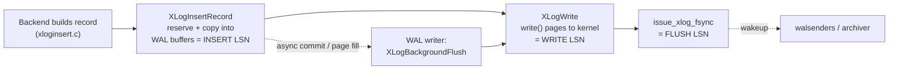

*The insert → write → flush LSN pipeline.*

`XLogInsertRecord` is the low-level insert: under an insertion lock it reserves space (`ReserveXLogInsertLocation`), fills `xl_prev`, computes the CRC, copies bytes into the buffer pages — and deliberately does *not* write or flush. `XLogWrite` (`xlog.c:2160`) drains buffer pages to the kernel, opening segment files as it crosses boundaries; when it finishes a segment it fsyncs it, wakes walsenders, and notifies the archiver:

```c title="src/backend/access/transam/xlog.c:2347"
if (finishing_seg)
{
    issue_xlog_fsync(openLogFile, openLogSegNo, tli);
    WalSndWakeupRequest();
    LogwrtResult.Flush = LogwrtResult.Write;     /* end of page */
    if (XLogArchivingActive())
        XLogArchiveNotifySeg(openLogSegNo, tli);
```

`XLogFlush` (`xlog.c:2607`) is the durability entry point callers use to make a specific LSN durable — e.g. before reporting a synchronous commit. It quick-exits if `record <= LogwrtResult.Flush` (someone else's fsync already covered it — the always-on form of group commit), otherwise takes `WALWriteLock` and pushes the write request forward so one fsync covers as much as possible. The classic opt-in **group-commit delay** stacks on top: with `commit_delay > 0` and enough active backends it sleeps to let more followers join the same fsync:

```c title="src/backend/access/transam/xlog.c:2711"
if (CommitDelay > 0 && enableFsync &&
    MinimumActiveBackends(CommitSiblings))
{
    pg_usleep(CommitDelay);
    insertpos = WaitXLogInsertionsToFinish(insertpos);
}
```

The **WAL writer** process (`walwriter.c`) keeps ordinary backends off the fsync path and bounds *asynchronous*-commit latency: its loop calls `XLogBackgroundFlush()` (`xlog.c:2797`) once per `wal_writer_delay`, flushing at least that often or once `wal_writer_flush_after` blocks accumulate. Backends may still write/fsync themselves when the WAL writer can't keep up.

:::note

**Insert vs Write vs Flush.** A returned end-LSN from `XLogInsertRecord` only proves the record is in the WAL *buffers*. Crash safety requires it to reach the *Flush* frontier — exactly what a synchronous commit waits on via `XLogFlush`, and what the WAL writer guarantees within a bounded delay for async commits.

:::

### 20.2.4 WAL file operations: segments, recycling, archiving

*A WAL segment file name is 24 hex digits*

- `TimelineID` — 8 hex digits
- `log id (segno high 32 bits)` — 8 hex digits
- `segment (segno low 32 bits)` — 8 hex digits

`pg_wal` holds the physical log as fixed-size *segment* files. Segment size is `wal_segment_size`, set at `initdb`, a power of two between 1 MB and 1 GB. Cloudberry changes the default from PostgreSQL's 16 MB to **64 MB** (`DEFAULT_XLOG_SEG_SIZE`) — which also affects checkpoint frequency. A 64-bit `XLogRecPtr` maps to a 64-bit `XLogSegNo` by division; the 24-hex-digit file name is the timeline followed by the segment number. `pg_wal/archive_status` holds the archiver's `.ready`/`.done` markers.

New segments are created by `XLogFileInit` (`xlog.c:3185`) → `XLogFileInitInternal` (`xlog.c:3015`): build under a temp name `xlogtemp.<pid>`, zero-fill (when `wal_init_zero`), fsync, then atomically install. `InstallXLogFileSegment` (`xlog.c:3375`) does the atomic placement under `ControlFileLock`, scanning forward for a free future slot (`find_free`) via a crash-safe `durable_rename`:

```c title="src/backend/access/transam/xlog.c:3398"
/* Find a free slot to put it in */
while (stat(path, &stat_buf) == 0)
{
    if ((*segno) >= max_segno) { LWLockRelease(ControlFileLock); return false; }
    (*segno)++;
    XLogFilePath(path, tli, *segno, wal_segment_size);
}
```

At checkpoint, `RemoveOldXlogFiles` (`xlog.c:3640`) reclaims segments older than the still-needed point — but only those already archived (`XLogArchiveCheckDone`). `RemoveXlogFile` (`xlog.c:3783`) embodies the **recycle-vs-remove** decision: if `wal_recycle` is on and future segments are still wanted, rename the file forward into a future slot (no zero-fill cost); otherwise `durable_unlink` it:

```c title="src/backend/access/transam/xlog.c:3800"
if (wal_recycle && *endlogSegNo <= recycleSegNo &&
    XLogCtl->InstallXLogFileSegmentActive &&
    InstallXLogFileSegment(endlogSegNo, path, true, recycleSegNo, insertTLI))
{
    CheckpointStats.ckpt_segs_recycled++;
    (*endlogSegNo)++;
}
else { durable_unlink(path, LOG); CheckpointStats.ckpt_segs_removed++; }
```

**Archiving** is marker-file based (`xlogarchive.c`). When a segment is fully written, `XLogArchiveNotify` (`xlogarchive.c:453`) creates an empty `<seg>.ready` in `archive_status` and wakes the archiver; the archiver copies the segment then renames the marker to `<seg>.done`. A segment may only be deleted/recycled once that `.done` exists.

:::note

**pg_wal layout.** Segment files (24 hex chars) sit directly under `pg_wal/`; `pg_wal/archive_status/` holds the `.ready`/`.done` handshake. Recycling renames an old segment forward instead of unlink-then-recreate, so steady-state WAL churn does almost no zero-fill I/O.

:::

### 20.2.5 Transaction records: PREPARE / COMMIT / ABORT and their redo

*A commit record: a fixed header followed by optional, flagged sub-records*

- `xl_xact_commit` — xact_time · tablespace
- `xinfo` — which parts follow
- `subxacts?` — HAS_SUBXACT
- `files to drop?` — HAS_RELFILELOCATORS
- `2PC xid/gid?` — HAS_TWOPHASE / GID
- `distrib xid?` — HAS_DISTRIB (CBDB)

All transaction-completion records belong to `RM_XACT_ID`, with the kind in the info byte: `XLOG_XACT_COMMIT` (0x00), `XLOG_XACT_PREPARE` (0x10), `XLOG_XACT_ABORT` (0x20), `XLOG_XACT_COMMIT_PREPARED` (0x30), `XLOG_XACT_ABORT_PREPARED` (0x40) — plus Cloudberry's `DISTRIBUTED_COMMIT`/`_FORGET` in the same family ([§20.2](#202-write-ahead-logging-wal).7+).

A commit record is built by `XactLogCommitRecord` (`xact.c:6964`): a fixed `xl_xact_commit` header (commit time + tablespace OID) followed by optional sub-records flagged in `xl_xinfo.xinfo` (subxacts, relfilelocators to drop, dropped stats, invalidation messages, twophase XID/GID, replication origin). The on-disk header is intentionally minimal:

```c title="src/include/access/xact.h:347"
typedef struct xl_xact_commit
{
    TimestampTz xact_time;      /* time of commit */
    Oid tablespace_oid_to_delete_on_commit;
    /* xl_xact_xinfo follows default */
    /* xl_xact_subxacts follows if XINFO_HAS_SUBXACT */
    /* xl_xact_twophase follows if XINFO_HAS_TWOPHASE */
    /* twophase_gid follows if XINFO_HAS_GID ... */
} xl_xact_commit;
```

`XactLogAbortRecord` (`xact.c:7178`) is the symmetric builder for `xl_xact_abort`. The **PREPARE** record is different — it is assembled in `twophase.c`'s `EndPrepare` (`twophase.c:1186`) from the in-memory 2PC chunks and flushed durably *before* the transaction is marked prepared:

```c title="src/backend/access/transam/twophase.c:1242"
XLogBeginInsert();
for (record = records.head; record != NULL; record = record->next)
    XLogRegisterData(record->data, record->len);
gxact->prepare_end_lsn = XLogInsert(RM_XACT_ID, XLOG_XACT_PREPARE);
XLogFlush(gxact->prepare_end_lsn);
/* If we crash now, we have prepared: WAL replay will fix things */
```

The committing half of a prepared transaction reuses the shared builder: `RecordTransactionCommitPrepared` (`twophase.c:2436`) calls `XactLogCommitRecord(...)` with the twophase XID+GID (making it `COMMIT_PREPARED`) then flushes; `RecordTransactionAbortPrepared` mirrors it. On **redo**, `xact_redo` (`xact.c:7620`) masks the info byte and dispatches: `COMMIT`/`COMMIT_PREPARED` → `xact_redo_commit` (mark the tree committed in clog, apply commit-ts, process dropped files & invalidations); `ABORT`/`ABORT_PREPARED` → `xact_redo_abort`; the `*_PREPARED` variants additionally `PrepareRedoRemove` the gxact entry, and `PREPARE` re-creates one with `PrepareRedoAdd`:

```c title="src/backend/access/transam/xact.c:7636"
else if (info == XLOG_XACT_COMMIT_PREPARED)
{
    xl_xact_commit *xlrec = (xl_xact_commit *) XLogRecGetData(record);
    xl_xact_parsed_commit parsed;
    ParseCommitRecord(XLogRecGetInfo(record), xlrec, &parsed);
    xact_redo_commit(&parsed, parsed.twophase_xid, record->EndRecPtr, ...);
    LWLockAcquire(TwoPhaseStateLock, LW_EXCLUSIVE);
    PrepareRedoRemove(parsed.twophase_xid, false);
    LWLockRelease(TwoPhaseStateLock);
}
```

:::note

Completion records describe only catalog/clog/file side effects — not page contents — so `xact_redo` asserts no backup blocks; the heap/index page changes were logged separately by their own resource managers earlier in the stream. The distributed variants reuse this very same `xl_xact_commit` payload and `xact_redo` dispatch, which is why these single-node records are the structural baseline for [§20.2](#202-write-ahead-logging-wal).7.

:::

### 20.2.6 Checkpoints: online vs shutdown, triggering, and restartpoints

*Recovery replays forward from the last checkpoint's REDO point*

- `← older WAL` — already in data files · deletable
- `REDO point` — checkPoint.redo
- `WAL after REDO →` — replayed at recovery

A *checkpoint* is the durability anchor of WAL. It records a **REDO point** (an LSN) and guarantees every change logically before it is already flushed to the data files — so crash recovery never replays WAL older than the last checkpoint's REDO point: it reads the checkpoint from `pg_control`, seeks to `checkpoint.redo`, and replays forward. The driver is `CreateCheckPoint()` (`xlog.c:6940`). The on-disk body is the `CheckPoint` struct, whose `redo` is the start point and whose other fields capture cluster-wide counters — including the CBDB-specific `nextGxid`:

```c title="src/include/catalog/pg_control.h:40"
typedef struct CheckPoint
{
    XLogRecPtr  redo;           /* REDO start point */
    TimeLineID  ThisTimeLineID;
    ...
    FullTransactionId nextXid;
    DistributedTransactionId nextGxid;   /* next free gxid (CBDB) */
    Oid         nextOid;
    TransactionId oldestXid;
    /* IN XLOG RECORD, MORE DATA FOLLOWS FOR DTM CHECKPOINT */
} CheckPoint;
```

`CreateCheckPoint` acquires all WAL insertion locks, reads the current insert position and sets `checkPoint.redo = curInsert`, advances the shared `RedoRecPtr`, then releases the locks so backends keep inserting WAL while the checkpoint flushes. It gathers the counters, calls `CheckPointGuts()` to flush all dirty buffers/SLRUs/CLOG, collects the CBDB DTX payload via `getDtxCheckPointInfo()` ([§20.4](#204-system-recovery).4), and writes the record — the info byte being the *only* on-disk difference between online and shutdown:

```c title="src/backend/access/transam/xlog.c:7310"
XLogBeginInsert();
XLogRegisterData((char *) (&checkPoint), sizeof(checkPoint));
/* Cloudberry checkpoints have extra info */
XLogRegisterData((char *) dtxCheckPointInfo, dtxCheckPointInfoSize);
recptr = XLogInsert(RM_XLOG_ID,
                    shutdown ? XLOG_CHECKPOINT_SHUTDOWN : XLOG_CHECKPOINT_ONLINE);
XLogFlush(recptr);
```

A **shutdown** checkpoint sets `ControlFile->state = DB_SHUTDOWNING`→`DB_SHUTDOWNED`, forbids further WAL writes, and runs with no concurrent activity; an **online** checkpoint runs alongside live traffic, logs a running-xacts standby snapshot, and folds cached id-allocation slack (`nextGxid += GxidCount`, `nextOid += oidCount`) so the recovered cluster won't reissue ids. Either way it finally writes `pg_control` under `ControlFileLock` (`UpdateControlFile()`) — that atomic write is what makes the checkpoint official — then recycles old WAL ([§20.2](#202-write-ahead-logging-wal).4).

:::note

**The guarantee:** once `pg_control` points at this checkpoint, recovery may start at `checkPoint.redo` assured all earlier changes are in the data files — which is exactly why older WAL can be deleted.

:::

**Triggering.** The dedicated *checkpointer* (`CheckpointerMain`, `checkpointer.c`) performs a checkpoint when: a request was posted in shared memory; `checkpoint_timeout` elapsed (cause `TIME`); or WAL volume crossed the `max_wal_size`-derived threshold — detected in the write path by `XLogCheckpointNeeded()`, which calls `RequestCheckpoint(CHECKPOINT_CAUSE_XLOG)`:

```c title="src/backend/access/transam/xlog.c:2369"
if (IsUnderPostmaster && XLogCheckpointNeeded(openLogSegNo))
{
    (void) GetRedoRecPtr();
    if (XLogCheckpointNeeded(openLogSegNo))
        RequestCheckpoint(CHECKPOINT_CAUSE_XLOG);
}
```

- `CHECKPOINT_IS_SHUTDOWN` — shutdown checkpoint
- `CHECKPOINT_END_OF_RECOVERY` — shutdown-like, issued while exiting recovery
- `CHECKPOINT_IMMEDIATE` — skip the spread-out throttling
- `CHECKPOINT_FORCE` — run even with no WAL activity
- `CHECKPOINT_WAIT` — caller blocks for completion
- `CHECKPOINT_CAUSE_XLOG` / `CHECKPOINT_CAUSE_TIME` — diagnostic cause bits

**Restartpoints.** A standby in recovery cannot write its own WAL, so when it *replays* a checkpoint record it instead creates a *restartpoint* via `CreateRestartPoint()` (`xlog.c:7677`): it reuses the replayed checkpoint's REDO point, runs the same `CheckPointGuts()` flush, and updates `pg_control` so a crash during recovery can restart replay from there. It is skipped if no new checkpoint has been replayed since the last restartpoint. Crucially, restartpoint WAL recycling retreats the horizon to the later of *replayed* and *received* LSNs so it never deletes segments the walreceiver still needs — tying checkpoints into streaming replication ([§20.3](#203-streaming-replication)).

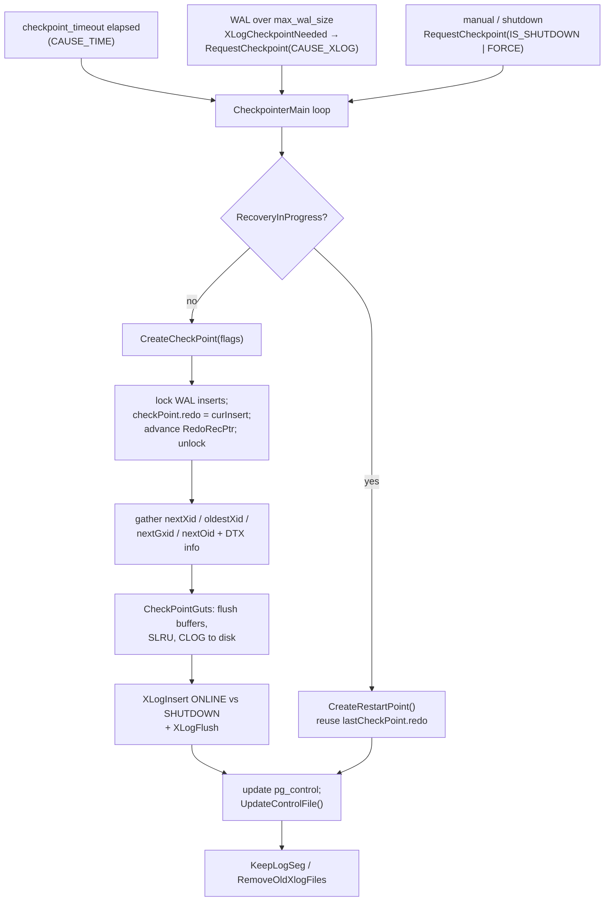

*Checkpoint creation flow and its trigger sources.*

### 20.2.7 The distributed-commit story, precisely

The *runtime* protocol that decides **when** a distributed transaction commits — the QD's `DtxState` and QE's `DtxContext` state machines — is the subject of [§12.2](../part-3-transactions-mvcc-concurrency/ch12.md#122-cloudberrys-2pc-cdbtm-dtxstate--dtxcontext). This section covers the *durable* half: how that commit is encoded in WAL and replayed.

There are exactly nine xact opcodes (`src/include/access/xact.h:181`). Note that `XLOG_XACT_DISTRIBUTED_COMMIT` (`0x70`) **does exist** as its own opcode:

```c title="src/include/access/xact.h:181 — xact WAL opcodes"
#define XLOG_XACT_COMMIT             0x00
#define XLOG_XACT_PREPARE            0x10
#define XLOG_XACT_ABORT              0x20
#define XLOG_XACT_COMMIT_PREPARED    0x30
#define XLOG_XACT_ABORT_PREPARED     0x40
#define XLOG_XACT_ASSIGNMENT         0x50
#define XLOG_XACT_INVALIDATIONS      0x60
#define XLOG_XACT_DISTRIBUTED_COMMIT 0x70
#define XLOG_XACT_DISTRIBUTED_FORGET 0x80
```

All commit variants are produced by the *same* builder, `XactLogCommitRecord()` (`src/backend/access/transam/xact.c:6963`), which picks the opcode up front: a prepared distributed transaction selects `XLOG_XACT_DISTRIBUTED_COMMIT`, otherwise a plain or prepared local commit. The global xid is **not** a separate record body — it reuses the ordinary `xl_xact_commit` layout and is carried as an optional sub-record gated by an `xinfo` flag:

```c title="src/backend/access/transam/xact.c:7084 (and :7154 for serialization)"
/* include distributed xid if there's one */
if (distrib_xid != InvalidDistributedTransactionId)
{
    xl_xinfo.xinfo |= XACT_XINFO_HAS_DISTRIB;   /* (1U << 9), xact.h:210  */
    xl_distrib.distrib_xid = distrib_xid;       /* xl_xact_distrib, xact.h:269 */
}
...
if (xl_xinfo.xinfo & XACT_XINFO_HAS_DISTRIB)
    XLogRegisterData((char *) (&xl_distrib), sizeof(xl_xact_distrib));
```

So the gxid rides in *any* commit record that has one; the dedicated `0x70` opcode exists because the coordinator's prepared distributed commit needs the extra redo bookkeeping in [§20.2](#202-write-ahead-logging-wal).4, whereas an ordinary segment commit merely recording its distrib xid does not.

:::note

**Correction (confirmed in code):** an earlier draft claimed there is no `XLOG_XACT_DISTRIBUTED_COMMIT` record type. That is wrong — opcode `0x70` exists (`xact.h:188`) with its own redo branch `xact_redo_distributed_commit`. What is true: the distributed commit reuses the `xl_xact_commit` body and carries the gxid via `XACT_XINFO_HAS_DISTRIB` + `xl_xact_distrib`; the opcode tag is what triggers `redoDistributedCommitRecord()`.

:::

### 20.2.8 The distributed-forget record

Phase 2 of 2PC leaves a second trace: once every segment has acknowledged its `COMMIT PREPARED`, the coordinator writes a standalone `XLOG_XACT_DISTRIBUTED_FORGET` (`0x80`) record carrying only the gxid (from `doInsertForgetCommitted()`, `src/backend/cdb/cdbtm.c:533`):

```c title="src/backend/access/transam/xact.c:1877"
XLogRecPtr
RecordDistributedForgetCommitted(DistributedTransactionId gxid)
{
    xl_xact_distributed_forget xlrec;
    XLogRecPtr  recptr;

    xlrec.gxid = gxid;
    XLogBeginInsert();
    XLogRegisterData((char *) &xlrec, sizeof(xl_xact_distributed_forget));
    recptr = XLogInsert(RM_XACT_ID, XLOG_XACT_DISTRIBUTED_FORGET);
    if (synchronous_commit >= SYNCHRONOUS_COMMIT_REMOTE_APPLY)
        XLogFlush(recptr);
    return recptr;
}
```

### 20.2.9 Redo and the committed-gxid array

`xact_redo()` (`xact.c:7619`) dispatches on the opcode. `XLOG_XACT_DISTRIBUTED_COMMIT` replays the local commit (if any) then calls `redoDistributedCommitRecord(gxid)`; `XLOG_XACT_DISTRIBUTED_FORGET` calls `redoDistributedForgetCommitRecord(gxid)`. These maintain an in-memory set of committed-but-not-yet-forgotten global xids — `shmCommittedGxidArray` / `*shmNumCommittedGxacts` — which **is exactly the set of in-doubt distributed transactions recovery must drive through 2PC phase 2** (see [§20.4](#204-system-recovery).4).

```c title="src/backend/cdb/cdbdtxrecovery.c:570 (forget redo, excerpt)"
void
redoDistributedForgetCommitRecord(DistributedTransactionId gxid)
{
    for (int i = 0; i < *shmNumCommittedGxacts; i++)
        if (gxid == shmCommittedGxidArray[i])
        {
            (*shmNumCommittedGxacts)--;                       /* swap-remove */
            if (i != *shmNumCommittedGxacts)
                shmCommittedGxidArray[i] = shmCommittedGxidArray[*shmNumCommittedGxacts];
            /* on a hot-standby QD, advance latestCompletedGxid for snapshots */
            return;
        }
}
```

:::note

The two Cloudberry rmgrs from [§20.2](#202-write-ahead-logging-wal).2 surface here: the distributed log SLRU emits `DISTRIBUTEDLOG_ZEROPAGE`/`_TRUNCATE` (replayed by `DistributedLog_redo`), and Append-Optimized storage emits `XLOG_APPENDONLY_INSERT`/`_TRUNCATE` — whose `appendonly_redo()` skips replay in crash-recovery-only mode (`if (IsCrashRecoveryOnly()) return;`, `cdbappendonlyxlog.c:210`) because AO fsync happens on file close, so these records exist mainly to ship AO data to mirrors.

:::

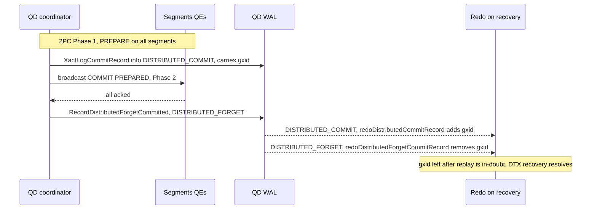

*Distributed commit/forget record lifecycle, and how replay rebuilds the in-doubt set.*

**Bridge to [§20.3](#203-streaming-replication).** WAL makes every committed change recoverable *on the same node* — but a node's disk can die outright, and replay needs the log to still exist somewhere. So the next pillar streams this WAL to a second machine the instant it is flushed: **streaming replication**.

## 20.3 Streaming Replication

### 20.3.1 walsender / walreceiver and replication slots

The same PostgreSQL streaming replication drives both segment primary→mirror and coordinator→standby. The mirror runs a **walreceiver**; the primary spawns a **walsender** per connection. `WalSndLoop()` (`src/backend/replication/walsender.c:2521`) ships flushed WAL via `XLogSendPhysical()`, and a sender in `WALSNDSTATE_CATCHUP` only promotes to `WALSNDSTATE_STREAMING` once fully drained — a point the comment explicitly ties to no-data-loss failover. Cloudberry tags the segment-replication sender: `walsnd->is_for_gp_walreceiver = (strcmp(application_name, GP_WALRECEIVER_APPNAME) == 0)` (`walsender.c:2743`).

`WalReceiverMain()` (`src/backend/replication/walreceiver.c:189`) loops: `walrcv_receive()` → `XLogWalRcvProcessMsg()` writes WAL → `XLogWalRcvSendReply()` → `XLogWalRcvFlush()` (`:525`) advances the mirror's **flush LSN**, which the primary's synchronous-replication logic waits on. A physical **replication slot** pins the WAL a lagging mirror still needs by holding back `restart_lsn`; Cloudberry's internal segment slot is `INTERNAL_WAL_REPLICATION_SLOT_NAME = "internal_wal_replication_slot"` (`src/include/replication/slot.h:191`).

### 20.3.2 Connection establishment and execution flow

Streaming on a standby is driven by two cooperating processes: the **startup process** (replays WAL, decides when streaming is needed) and the **walreceiver** (connects to the primary's walsender and pulls WAL). They communicate only through the `WalRcv` shared struct, whose `walRcvState` field is a small state machine: `WALRCV_STOPPED` → `WALRCV_STARTING` → `WALRCV_STREAMING`, plus `WALRCV_WAITING` / `WALRCV_RESTARTING` / `WALRCV_STOPPING`.

**Step 1 — startup requests streaming.** When the startup process needs WAL it cannot find locally, it calls `RequestXLogStreaming(tli, recptr, conninfo, slotname, ...)` (`walreceiverfuncs.c`): under the spinlock it stores conninfo / slot / start LSN+timeline into `WalRcv` and flips the state, signalling the postmaster to fork a walreceiver (or setting the latch if one is alive):

```c title="src/backend/replication/walreceiverfuncs.c:312"
if (walrcv->walRcvState == WALRCV_STOPPED)
{ launch = true; walrcv->walRcvState = WALRCV_STARTING; }
else
    walrcv->walRcvState = WALRCV_RESTARTING;
walrcv->receiveStart = recptr;
walrcv->receiveStartTLI = tli;
if (launch)      SendPostmasterSignal(PMSIGNAL_START_WALRECEIVER);
else if (latch)  SetLatch(latch);
```

**Step 2–3 — walreceiver reads its orders and connects.** `WalReceiverMain()` (`walreceiver.c:189`) moves the shared state to `WALRCV_STREAMING`, copies out the conninfo / slot / startpoint, then calls `walrcv_connect()`. The `appname` argument becomes the connection's `application_name` — in CBDB this is `cluster_name` when set (deployed as `gp_walreceiver`):

```c title="src/backend/replication/walreceiver.c:304"
/* Establish the connection to the primary for XLOG streaming */
wrconn = walrcv_connect(conninfo, false, false,
                        cluster_name[0] ? cluster_name : "walreceiver", &err);
if (!wrconn)
    ereport(ERROR, (errcode(ERRCODE_CONNECTION_FAILURE),
        errmsg("could not connect to the primary server: %s", err)));
```

`walrcv_connect` dispatches to `libpqrcv_connect()` (`libpqwalreceiver.c:138`), which builds a libpq connection with the crucial `replication=true` (a *physical* replication connection — not `"database"`, which is logical) and the appname as `fallback_application_name`:

```c title="src/backend/replication/libpqwalreceiver/libpqwalreceiver.c:161"
keys[i] = "dbname";        vals[i] = conninfo;
keys[++i] = "replication"; vals[i] = logical ? "database" : "true";
keys[++i] = "fallback_application_name"; vals[i] = appname;
conn->streamConn = PQconnectStartParams(keys, vals, true);
```

:::note

Because the standby connects with `application_name = gp_walreceiver`, the primary's walsender sets `is_for_gp_walreceiver` when it sees this name ([§20.3](#203-streaming-replication).1) — wiring the connection into Greenplum/Cloudberry FTS replication tracking.

:::

**Step 4–5 — identify & START_REPLICATION.** The walreceiver issues `IDENTIFY_SYSTEM` (cross-checking the system id and that the primary's timeline is at/ahead of its `startpointTLI`), then `walrcv_startstreaming()` → `libpqrcv_startstreaming()` sends the `START_REPLICATION [SLOT name] <LSN> TIMELINE <tli>` command. A physical start returns `PGRES_COPY_BOTH`:

```c title="src/backend/replication/libpqwalreceiver/libpqwalreceiver.c:499"
appendStringInfoString(&cmd, "START_REPLICATION");
if (options->slotname != NULL)
    appendStringInfo(&cmd, " SLOT "%s"", options->slotname);
appendStringInfo(&cmd, " %X/%X", LSN_FORMAT_ARGS(options->startpoint));
appendStringInfo(&cmd, " TIMELINE %u", options->proto.physical.startpointTLI);
res = libpqrcv_PQexec(conn->streamConn, cmd.data);   /* expect PGRES_COPY_BOTH */
```

**Step 6 — the receive loop.** Once streaming, the walreceiver loops on `walrcv_receive()` → `XLogWalRcvProcessMsg` (writes WAL for `'w'` data, handles `'k'` keepalives), then `XLogWalRcvSendReply` (tells the primary the received LSN) and `XLogWalRcvFlush` (fsync, advancing the standby's flushed LSN). When no data is ready it naps on `WaitLatchOrSocket`:

```c title="src/backend/replication/walreceiver.c:480"
len = walrcv_receive(wrconn, &buf, &wait_fd);
if (len != 0)
{
    for (;;) {
        if (len > 0)  XLogWalRcvProcessMsg(buf[0], &buf[1], len - 1, startpointTLI);
        else if (len == 0) break;
        else if (len < 0) { endofwal = true; break; }   /* timeline ended */
        len = walrcv_receive(wrconn, &buf, &wait_fd);
    }
    XLogWalRcvSendReply(false, false);
    XLogWalRcvFlush(false, startpointTLI);     /* advance flushedUpto */
}
```

The flushed LSN written here is exactly the value `CreateRestartPoint` ([§20.2](#202-write-ahead-logging-wal).6) reads via `GetWalRcvFlushRecPtr` to decide which WAL segments are still needed — closing the loop between replication and checkpointing. A `len < 0` means the primary ended the COPY stream (end of timeline); the loop returns control to await fresh orders from the startup process.

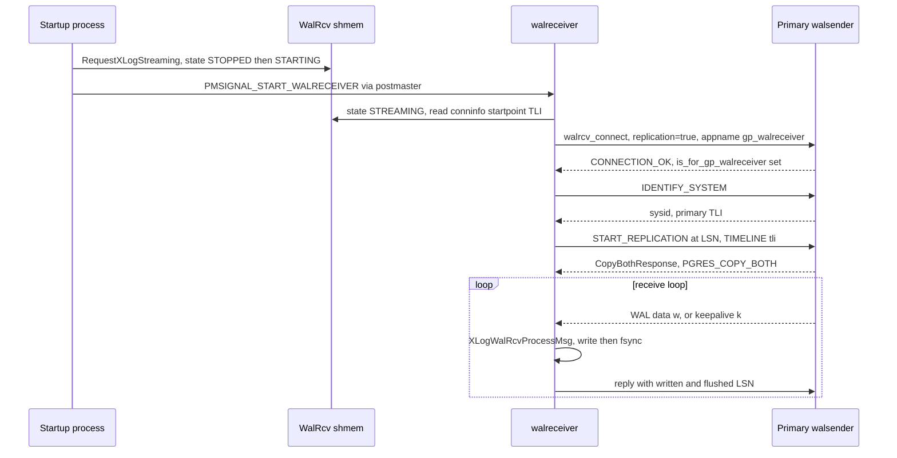

*walreceiver: connect to the primary → START_REPLICATION → stream/flush loop.*

### 20.3.3 Synchronous replication — waiting for the mirror's flush LSN

A synchronous commit blocks in `SyncRepWaitForLSN(lsn, commit)` (`src/backend/replication/syncrep.c:187`): the backend enqueues itself, sets `syncRepState = SYNC_REP_WAITING`, and sleeps on its latch until a walsender confirms the LSN. The wakeup side is `SyncRepReleaseWaiters()` (`syncrep.c:647`), which publishes the confirmed flush LSN and wakes every waiter at or below it:

```c title="src/backend/replication/syncrep.c:385 (wait) / :724 (release)"
/* in SyncRepWaitForLSN: */
for (;;) {
    ResetLatch(MyLatch);
    if (MyProc->syncRepState == SYNC_REP_WAIT_COMPLETE) break;
    ...
}
/* in SyncRepReleaseWaiters, when the standby's flush advances: */
if (walsndctl->lsn[SYNC_REP_WAIT_FLUSH] < flushPtr) {
    walsndctl->lsn[SYNC_REP_WAIT_FLUSH] = flushPtr;
    numflush = SyncRepWakeQueue(false, SYNC_REP_WAIT_FLUSH);
}
```

At the default flush level this means the commit is durable on **both** primary and mirror before the client sees success — an in-sync mirror loses no acknowledged commit. Cloudberry enables synchronous replication for segments by setting `synchronous_standby_names = "*"`, and special-cases the coordinator: under `IS_QUERY_DISPATCHER()` it does **not** block when there is no active `is_for_gp_walreceiver` standby (`syncrep.c:248`), so a missing standby coordinator never stalls commits.

### 20.3.4 The tie to FTS — disabling syncrep when a mirror is down

This is the key availability mechanism: if a mirror dies, synchronous commits would block forever, so FTS must turn replication synchronicity off. `SyncRepWaitForLSN`'s fast-exit keys on `SYNC_STANDBY_DEFINED`, which tracks `synchronous_standby_names`. Cloudberry flips it programmatically — `SetSyncStandbysDefined()` sets it to `"*"`, `UnsetSyncStandbysDefined()` to `""` (`src/backend/replication/gp_replication.c:598,612`). When FTS sends the `SYNCREP_OFF` message, the primary handles it by unsetting the GUC so commits proceed immediately:

```c title="src/backend/fts/ftsmessagehandler.c:307 (HandleFtsWalRepSyncRepOff)"
ereport(LOG, (errmsg("turning off synchronous wal replication due to FTS request")));
UnsetSyncStandbysDefined();              /* synchronous_standby_names = "" */
GetMirrorStatus(&response, NULL);
SendFtsResponse(&response, FTS_MSG_SYNCREP_OFF);
```

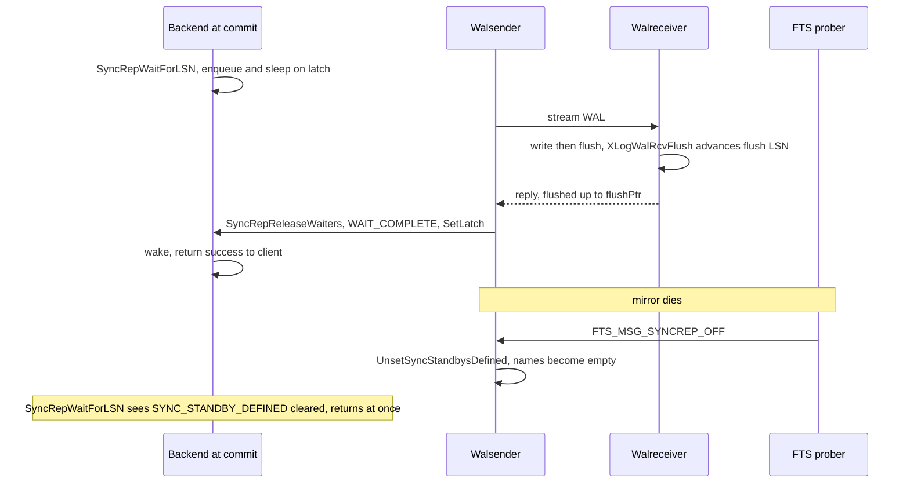

*Synchronous-replication commit wait, and the FTS SYNCREP_OFF escape hatch when a mirror dies.*

**Bridge to [§20.4](#204-system-recovery).** Replication guarantees a second, byte-identical copy of the WAL exists. What it does *not* do is make that copy *usable*: a mirror's data files are mid-stream and inconsistent until the log is replayed and any in-doubt transactions resolved. Turning a pile of streamed WAL back into a consistent, openable database is **system recovery**.

## 20.4 System Recovery

### 20.4.1 StartupXLOG and the control-file DBState switch

Single-node recovery is driven by `StartupXLOG()` (`src/backend/access/transam/xlog.c:5320`). It first branches on `ControlFile->state` to learn how the previous instance terminated, then reads the checkpoint and seeds shared memory. Only `DB_SHUTDOWNED` and `DB_SHUTDOWNED_IN_RECOVERY` count as a clean stop; everything else sets `didCrash = true`:

```c title="src/backend/access/transam/xlog.c:5354 (DBState switch, condensed)"
switch (ControlFile->state)
{
    case DB_SHUTDOWNED:             /* clean — redo usually skipped       */
    case DB_SHUTDOWNED_IN_RECOVERY: /* standby cleanly stopped            */
    case DB_SHUTDOWNING:            /* shutdown interrupted -> crash       */
    case DB_IN_CRASH_RECOVERY:      /* crashed *while* recovering          */
    case DB_IN_ARCHIVE_RECOVERY:    /* crashed during archive/standby redo */
    case DB_IN_PRODUCTION:          /* crashed while live — common case    */
    default:                        /* FATAL: invalid cluster state        */
}
```

The checkpoint then seeds `ShmemVariableCache`, including the **Cloudberry-specific distributed xid counter** — without it the coordinator could re-issue gxids already used before the crash:

```c title="src/backend/access/transam/xlog.c:5485"
ShmemVariableCache->nextXid  = checkPoint.nextXid;
ShmemVariableCache->nextGxid = checkPoint.nextGxid;   /* DistributedTransactionId */
...
StartupCLOG(); StartupMultiXact();                    /* SLRUs, after nextXid set */
```

`pg_subtrans` and the segment-only `pg_distributedlog` SLRU are started once the oldest active xid is known; `DistributedLog_Startup()` is a no-op on the coordinator (`distributedlog.c:766`).

### 20.4.2 The redo loop and invalid-page tracking

`PerformWalRecovery()` (`src/backend/access/transam/xlogrecovery.c:1684`) positions at the checkpoint REDO point and applies records, dispatching each to its resource manager: `GetRmgr(record->xl_rmid).rm_redo(xlogreader)` (`xlogrecovery.c:2023`). If `full_page_writes` is off, a record may reference a page whose relation was later dropped/truncated; rather than failing, `log_invalid_page()` (`src/backend/access/transam/xlogutils.c:107`) records the reference, `forget_invalid_pages()` removes it when the covering drop/truncate replays, and `XLogCheckInvalidPages()` (`xlogutils.c:251`) **PANICs** at the consistency point if any reference is still unresolved — that means the WAL was incomplete or corrupt.

### 20.4.3 Crash vs archive/standby recovery; the crash-fsync deviation

The mode is chosen by two empty signal files (`recovery.conf` is now fatal): `standby.signal` → standby mode (how a standby coordinator and segment mirrors run); `recovery.signal` → archive/PITR; neither → plain crash recovery (`xlogrecovery.c:1062`). Cloudberry deliberately diverges from upstream on crash fsync — instead of fsyncing the whole data directory (which can hold millions of AO/heap files) it syncs only the WAL files, relying on full-page-write images to repair torn data pages during redo:

```c title="src/backend/access/transam/xlog.c:5441 (GPDB crash path)"
if (ControlFile->state != DB_SHUTDOWNED &&
    ControlFile->state != DB_SHUTDOWNED_IN_RECOVERY)
{
    RemoveTempXlogFiles();
    if (access(BACKUP_LABEL_FILE, F_OK) != 0)
        SyncAllXLogFiles();                 /* WAL only, NOT full pgdata */
    if (Gp_role == GP_ROLE_DISPATCH)
        *shmCleanupBackends = true;         /* tell DTX recovery to clean QEs */
    didCrash = true;
}
```

### 20.4.4 Distributed recovery — the second layer

Local replay makes each node self-consistent, but a distributed transaction commits across many nodes. Where [§12.2](../part-3-transactions-mvcc-concurrency/ch12.md#122-cloudberrys-2pc-cdbtm-dtxstate--dtxcontext) drove the 2PC protocol *at runtime*, recovery must reconstruct and finish whatever was in flight when the cluster stopped. Cloudberry resolves in-doubt 2PC in two layers. **Layer 1 (capture & seed):** every checkpoint snapshots in-flight DTX via `getDtxCheckPointInfo()` (`src/backend/storage/ipc/procarray.c:2541`) — the committed gxids plus any in-progress dtx flagged `includeInCkpt` — into the checkpoint record (call site `xlog.c:7274`/`:7314`). On replay, `redoDtxCheckPoint()` feeds them to `redoDistributedCommitRecord()`, seeding `shmCommittedGxidArray`.

**Layer 2 (reconcile):** a dedicated `dtx recovery` background worker (registered `src/backend/postmaster/postmaster.c:428`; coordinator-only via `DtxRecoveryStartRule`) runs `DtxRecoveryMain()` → `recoverTM()` → `recoverInDoubtTransactions()` (`src/backend/cdb/cdbdtxrecovery.c:181`), which makes two passes:

```c title="src/backend/cdb/cdbdtxrecovery.c:203 (recoverInDoubtTransactions, condensed)"
/* Pass 1: finish the ones we KNOW committed (seeded from replay) */
for (i = 0; i < *shmNumCommittedGxacts; i++) {
    dtxFormGid(gid, shmCommittedGxidArray[i]);
    doNotifyCommittedInDoubt(gid);            /* re-broadcast COMMIT PREPARED */
    RecordDistributedForgetCommitted(shmCommittedGxidArray[i]);
}
*shmNumCommittedGxacts = 0;

/* Pass 2: anything else still prepared on a segment must be aborted */
htab = gatherRMInDoubtTransactions(0, true);  /* select gid from pg_prepared_xacts */
abortRMInDoubtTransactions(htab);             /* ROLLBACK PREPARED */
```

After the one-time pass, the worker loops periodically calling `AbortOrphanedPreparedTransactions()`, which aborts genuinely orphaned prepared transactions while skipping any gid still `IsDtxInProgress()` — catching stragglers from later failures.

### 20.4.5 How prepared (phase-1) transactions survive a crash

A segment's 2PC state is an ordinary PostgreSQL prepared transaction, durable via the `XLOG_XACT_PREPARE` record and the `pg_twophase/<xid>` state file. `restoreTwoPhaseData()` scans the on-disk files before replay; `PrepareRedoAdd()` reconstructs entries during replay; `RecoverPreparedTransactions()` (`src/backend/access/transam/twophase.c:2200`) does the full reload at end of recovery — and crucially cracks the Cloudberry GID to recover the **distributed** xid and mark the local distributed-xact active:

```c title="src/backend/access/transam/twophase.c:2256 (excerpt)"
dtxDeformGid(gid, &distribXid);
localDistribXactData.state     = LOCALDISTRIBXACT_STATE_ACTIVE;
localDistribXactData.distribXid = distribXid;
MarkAsPreparingGuts(gxact, xid, gid, &localDistribXactData, ...);
```

This is exactly the state a segment exposes through `pg_prepared_xacts`, which the coordinator's `gatherRMInDoubtTransactions()` queries in [§20.4](#204-system-recovery).4 to decide commit vs. abort.

### 20.4.6 DistributedLog's role in recovery

`pg_distributedlog` (a segment-side SLRU) maps each *local* xid to the *distributed* xid under which it committed — the basis of distributed-snapshot visibility after restart. Heap visibility uses `pg_clog` (local commit); **distributed** visibility uses `pg_distributedlog` (`DistributedLog_CommittedCheck()`, `distributedlog.c:491`) to translate a local xid into a distributed xid the snapshot can test. Recovery rebuilds both before any query runs; on a hot-standby coordinator the forget redo also advances `latestCompletedGxid` to keep distributed snapshots correct during continuous replay.

### 20.4.7 Standby promotion and segment recovery

When a **standby coordinator** finishes replaying and is promoted, `StartupXLOG` (after marking `DB_IN_PRODUCTION`) calls `UpdateCatalogForStandbyPromotion()` (`xlog.c:5162`) → `gp_activate_standby()` (`src/backend/utils/gp/segadmin.c:739`), which swaps the dbids of the old and new coordinator in `gp_segment_configuration` (idempotent, so it survives a crash mid-promotion). A segment **mirror**, by contrast, is promoted by FTS ([§20.5](#205-cluster-high-availability--fts)).

A failed segment is rebuilt with **`gprecoverseg`**: **incremental** recovery runs `pg_rewind` (copies only diverged blocks; the default when the old data dir is intact), and **full** recovery runs `pg_basebackup` to clone the whole directory. After file-level recovery the segment starts in `standby.signal` mode and catches up via streaming replication; FTS then re-marks it up.

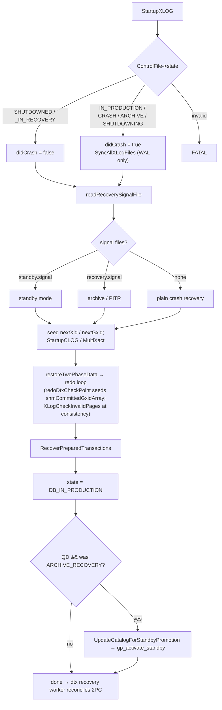

*StartupXLOG decision flow: control-file state and signal files select the recovery mode; distributed pieces (nextGxid, DTX checkpoint, standby promotion) layer on top.*

**Bridge to [§20.5](#205-cluster-high-availability--fts).** Local and distributed recovery can make a *failed* node consistent again — but only once something *restarts* it, and only after something *decided* it had failed and, if necessary, promoted its mirror in the meantime. That decision-maker is the cluster's fault detector: **FTS**, the pillar that turns a detected failure into a role change.

## 20.5 Cluster High Availability — FTS

### 20.5.1 Process model, triggering, and key GUCs

**FTS (Fault Tolerance Service)** runs as a single background worker started **only on the coordinator** — `FtsProbeStartRule` returns `Gp_role == GP_ROLE_DISPATCH` (`src/backend/fts/fts.c:108`). `FtsProbeMain` publishes its PID, installs handlers, and enters `FtsLoop()` (`fts.c:279`). Each cycle reads `gp_segment_configuration` into a `CdbComponentDatabases` and, if mirrors exist, calls `FtsWalRepMessageSegments()`.

Triggering is **timer + on-demand**: the loop sleeps `gp_fts_probe_interval` on a latch, but a backend that hits a fault calls `FtsNotifyProber()` (sends `PMSIGNAL_WAKEN_FTS`), forcing an immediate cycle. The key GUCs (defaults from `src/backend/utils/misc/guc_gp.c`):

- `gp_fts_probe_interval` — **60s** (10–3600): period of a full probe cycle.
- `gp_fts_probe_timeout` — **20s** (0–3600): max wait for one segment's response before it's treated as failed.
- `gp_fts_probe_retries` — **5** (0–100): retries before a failure is acted on.
- `gp_fts_mark_mirror_down_grace_period` — **30s**: grace window after a mirror disconnect before it may be marked down.
- `gp_fts_replication_attempt_count` — **10**: walsender reconnect attempts after which the disconnect timestamp is ignored (so a crash-looping walsender can't extend the grace window forever).

### 20.5.2 The probe protocol and the response fields

There are exactly three message types, sent as a libpq query string, with one fixed 5-boolean response shape (`src/include/postmaster/fts_comm.h`):

```c title="src/include/postmaster/fts_comm.h:44 / :103"
#define FTS_MSG_PROBE        "PROBE"
#define FTS_MSG_SYNCREP_OFF  "SYNCREP_OFF"
#define FTS_MSG_PROMOTE      "PROMOTE"

#define Natts_fts_message_response 5
#define Anum_fts_message_response_is_mirror_up        0
#define Anum_fts_message_response_is_in_sync          1
#define Anum_fts_message_response_is_syncrep_enabled  2
#define Anum_fts_message_response_is_role_mirror      3
#define Anum_fts_message_response_request_retry       4
```

The segment fills these in `GetMirrorStatus` (`src/backend/replication/gp_replication.c`): **is_mirror_up** (the GP walsender is catching-up with a valid write LSN, or streaming), **is_in_sync** (up *and* streaming → catalog `mode='s'`), **is_syncrep_enabled** (`SYNC_STANDBY_DEFINED` set), **is_role_mirror** (the segment thinks it is a mirror — used to detect a lost PROMOTE), and **request_retry** (mirror down but still inside the grace period → don't mark it down yet). The probe also does an `O_DIRECT` read+write disk check (`checkIODataDirectory`), so a wedged disk fails the PROBE and triggers failover.

### 20.5.3 The non-blocking probe cycle

`FtsWalRepMessageSegments()` builds one `fts_segment_info` per primary-mirror pair and drives **all of them through a single `poll()` set** — one async libpq connection per segment, not a thread or blocking call per segment — so one process probes N segments concurrently with bounded latency:

```c title="src/backend/fts/ftsprobe.c:1305"
while (!allDone(&context) && FtsIsActive())
{
    ftsConnect(&context);    /* PQconnectStart / PQconnectPoll (async)   */
    ftsPoll(&context);       /* ONE poll(PollFds, nfds, 50ms) for all     */
    ftsSend(&context);       /* PQsendQuery the message when POLLOUT      */
    ftsReceive(&context);    /* parse 5x1 response, advance state         */
    processRetry(&context);
    is_updated |= processResponse(&context);  /* may flip roles in catalog */
}
```

`ftsCheckTimeout` is a wall-clock guard independent of poll: if a segment hasn't reached success and `now - startTime > gp_fts_probe_timeout`, it is forced to the failed state — so a TCP-level hang can't stall the whole cycle.

### 20.5.4 The per-segment state machine

Each segment is a small state machine (states in `src/include/postmaster/ftsprobe.h`): the three action states `FTS_{PROBE,SYNCREP_OFF,PROMOTE}_SEGMENT`, their `_RETRY_WAIT`, `_SUCCESS`, `_FAILED` siblings, and the terminal `FTS_RESPONSE_PROCESSED`. A failure is **never** acted on before retries are exhausted — `processResponse` asserts `AssertImply(IsFtsMessageStateFailed(state), retry_count == gp_fts_probe_retries)` (`ftsprobe.c:999`). The interesting escalations:

- **Probe succeeds, mirror down, syncrep enabled, not a grace-period retry** → mark the mirror down in the catalog, then `FTS_SYNCREP_OFF_SEGMENT` to unblock commits stuck in `SyncRepWaitForLSN`.
- **Probe succeeds but reports `isRoleMirror`** → a previous PROMOTE never took effect → re-send `FTS_PROMOTE_SEGMENT`.
- **Probe fails, not a normal restart, mirror is in sync** → flip roles in the catalog (dead primary → `m`/down, mirror → `p`), swap the pointers, `FTS_PROMOTE_SEGMENT`.
- **Probe fails, mirror NOT in sync** → **double fault**: log `FTS double fault detected`, do not promote, content goes unavailable.
- **Soft retry**: a *successful* probe with `request_retry` && mirror alive loops through `RETRY_WAIT` — the grace period is enforced segment-side (`is_probe_retry_needed`), not in the prober.

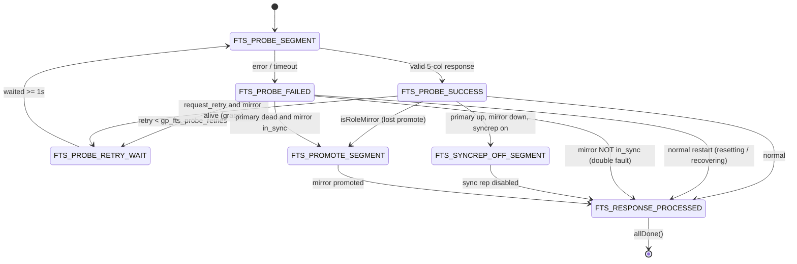

*FTS per-segment state machine. Failures pass through RETRY_WAIT (gated by gp_fts_probe_retries) before any action; success can escalate to SYNCREP_OFF or PROMOTE.*

### 20.5.5 What gets written to the catalog, and the version bump

The catalog write is `probeWalRepUpdateConfig()` (`src/backend/fts/fts.c:176`): in one transaction it inserts an audit row into `gp_configuration_history` and flips three columns of the segment's `gp_segment_configuration` tuple — **role** (`p`/`m`), **status** (`u`/`d`), **mode** (`s`/`n`). It also updates the shared-memory status bitmap `ftsProbeInfo->status[dbid]` read on the dispatch hot path. When anything changed, `FtsLoop` does `ftsProbeInfo->status_version++`; every transaction start compares the cached `fts_version` against it (`getFtsVersion()`), and on mismatch `cdbcomponent_updateCdbComponents()` rebuilds the component cache so QD/QE re-read roles and route around the dead primary on their next statement.

### 20.5.6 Mirror promotion, end to end

Crucially, the **catalog is updated *before* the PROMOTE message is sent** (`ftsprobe.c:1134`), so the dispatcher stops using the dead primary even while promotion is in flight. The mirror handles `FTS_MSG_PROMOTE` in `HandleFtsWalRepPromote()` (`src/backend/fts/ftsmessagehandler.c:376`) — idempotent, acting only if it is in `DB_IN_ARCHIVE_RECOVERY`: it `UnsetSyncStandbysDefined()`, creates the internal replication slot (so a later `pg_rewind` of the old primary works), and calls `SignalPromote()`, which writes `PROMOTE_SIGNAL_FILE` and signals the postmaster; the startup process finishes recovery and the mirror comes up writable.

:::note

This promote-on-mirror-down path is exactly what the regression fix **“ensure FTS detects mirror down”** hardened — the probe must reliably observe `is_mirror_up = false` for the sync-rep-off / failover logic to fire deterministically.

:::

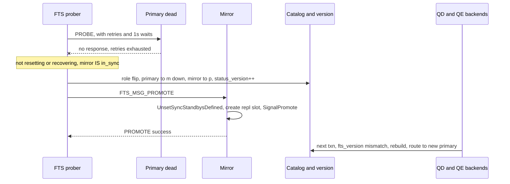

*Failover: a primary that fails its probe (after retries, mirror in sync) triggers a catalog role-flip then mirror promotion.*

### 20.5.7 Standalone gpfts + etcd

Cloudberry also ships a standalone FTS daemon (`src/bin/gpfts/`) that runs the **same** probe state machine and message protocol. The differences are *where leadership comes from* and *where config lives*: gpfts must win a distributed **etcd** lock before probing (and a lease-renewal thread exits the process if renewal fails, so a partitioned FTS yields leadership), and it serializes the whole configuration into **etcd** instead of writing `gp_segment_configuration` + bumping an in-SHMEM version. Consumers read config back from etcd. The decision logic is shared; only the deployment and storage differ.

## 20.6 A Failure, End to End

### 20.6.1 The scenario: a primary segment's host fails under load

With the four pillars in place, here is how they interlock when one segment's host dies in the middle of a workload. The seconds in the timeline are illustrative, but every transition and mechanism is real and cited to the section that established it.

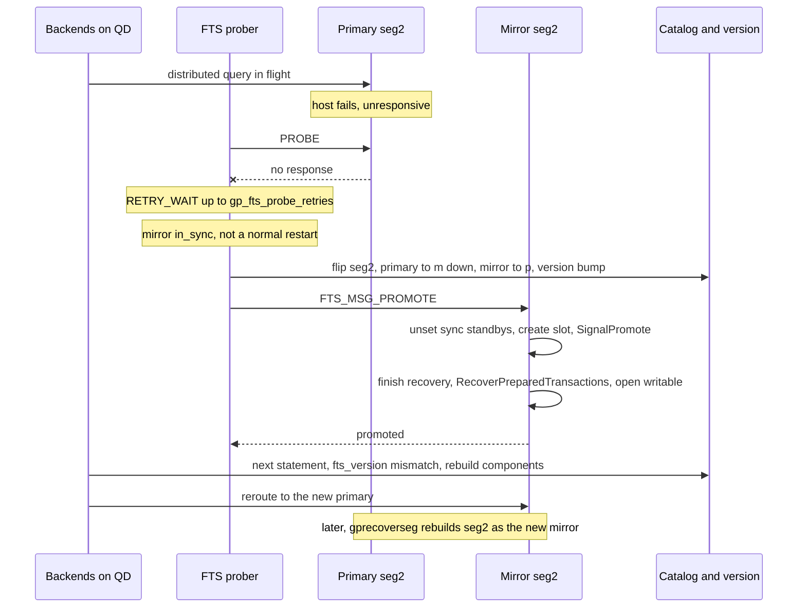

*One segment failover, end to end: detect → retry → flip the catalog → promote the mirror → reroute → repair.*

### 20.6.2 Phase by phase

- **t0 — the fault** — The host of primary `seg2` stops responding — power loss, kernel panic, or a wedged disk that will now fail the probe's `O_DIRECT` read/write check ([§20.5](#205-cluster-high-availability--fts).2). In-flight queries touching `seg2` error out; new commits there cannot complete.
- **t0–t5s — detection** — FTS's next probe to `seg2` gets no answer, so the per-segment state machine goes PROBE → `FTS_PROBE_FAILED` and then loops through `RETRY_WAIT` up to `gp_fts_probe_retries` times with ~1s waits — a transient blip is never acted on ([§20.5](#205-cluster-high-availability--fts).3, [§20.5](#205-cluster-high-availability--fts).4). A wall-clock `gp_fts_probe_timeout` guard stops a TCP hang from stalling the whole cycle.
- **decision — promote, not double-fault** — Retries are exhausted, this is not a normal restart, and `seg2`'s mirror reports **in-sync**. FTS therefore chooses failover rather than declaring a double fault ([§20.5](#205-cluster-high-availability--fts).4).
- **catalog first** — FTS writes the catalog **before** sending PROMOTE: the dead primary becomes role `m` / status down, the mirror becomes role `p`, and `status_version` is bumped ([§20.5](#205-cluster-high-availability--fts).5, [§20.5](#205-cluster-high-availability--fts).6). So the dispatcher stops using the dead primary even while promotion is still in flight.
- **promotion** — FTS sends `FTS_MSG_PROMOTE`; the mirror's `HandleFtsWalRepPromote` unsets synchronous standbys, creates the internal replication slot (so the old primary can later be `pg_rewind`-ed), and calls `SignalPromote`. Its startup process finishes recovery and the mirror opens **writable** ([§20.5](#205-cluster-high-availability--fts).6).
- **recovery of the new primary** — Finishing recovery runs `RecoverPreparedTransactions`, reloading any phase-1 prepared 2PC the segment held and re-cracking the distributed xid from the GID ([§20.4](#204-system-recovery).5). Cluster-wide, the coordinator's `dtx recovery` worker reconciles in-doubt distributed transactions — committing those known committed, aborting the rest ([§20.4](#204-system-recovery).4).
- **reroute** — On its next statement each QD/QE compares its cached `fts_version` to the bumped value, sees the mismatch, and `cdbcomponent_updateCdbComponents()` rebuilds the component cache so work routes to the promoted segment ([§20.5](#205-cluster-high-availability--fts).5).
- **repair** — Later an operator runs `gprecoverseg`: **incremental** (`pg_rewind`, copying only diverged blocks) or **full** (`pg_basebackup`). The rebuilt `seg2` comes up as the new **mirror** in `standby.signal` mode, catches up by streaming replication, and FTS marks it up ([§20.4](#204-system-recovery).7).

### 20.6.3 Why no committed transaction is lost

The failover loses no acknowledged commit because synchronous replication ([§20.3](#203-streaming-replication).3) had already advanced the mirror's *flush* LSN past every committed transaction **before** the client was told “committed.” The promoted mirror therefore already holds every acknowledged change; recovery only has to finish replaying and resolve in-doubt 2PC ([§20.4](#204-system-recovery).4, [§20.4](#204-system-recovery).5). What the cluster trades away is *availability* during the detection window — bounded by `gp_fts_probe_timeout` × `gp_fts_probe_retries` — not *durability*.

:::note

Had the mirror **not** been in sync at the instant of failure, FTS would log a **double fault** and leave that content unavailable rather than promote a stale copy ([§20.5](#205-cluster-high-availability--fts).4) — availability is deliberately sacrificed so the cluster never serves data that was lost.

:::

## 20.7 Quick Reference

### 20.7.1 FTS and recovery GUCs

Defaults from `src/backend/utils/misc/guc_gp.c`; see [§20.5](#205-cluster-high-availability--fts).1 for how the probe loop uses them.

*Fault-detection and WAL/recovery tunables.*

| GUC | Default | Range | Role |
| --- | --- | --- | --- |
| `gp_fts_probe_interval` | 60s | 10–3600 | Period of a full probe cycle ([§20.5](#205-cluster-high-availability--fts).1). |
| `gp_fts_probe_timeout` | 20s | 0–3600 | Max wait for one segment's response before it is treated as failed. |
| `gp_fts_probe_retries` | 5 | 0–100 | Retries before a failure is acted on. |
| `gp_fts_mark_mirror_down_grace_period` | 30s | — | Grace window after a mirror disconnect before it may be marked down. |
| `gp_fts_replication_attempt_count` | 10 | — | Walsender reconnect attempts after which a stale disconnect timestamp is ignored. |
| `wal_segment_size` | 64MB | 1MB–1GB | WAL segment file size — CBDB default vs PostgreSQL's 16MB; fixed at initdb ([§20.2](#202-write-ahead-logging-wal).4). |
| `synchronous_standby_names` | `*` on segments | — | Which standbys must ack; FTS clears it (to an empty string) to unblock commits when a mirror dies ([§20.3](#203-streaming-replication).4). |

### 20.7.2 Transaction WAL opcodes (RM_XACT_ID)

*The nine `RM_XACT_ID` info-byte opcodes ([§20.2](#202-write-ahead-logging-wal).7).*

| Opcode | Value | Meaning |
| --- | --- | --- |
| `XLOG_XACT_COMMIT` | 0x00 | Local commit ([§20.2](#202-write-ahead-logging-wal).5). |
| `XLOG_XACT_PREPARE` | 0x10 | 2PC phase-1 prepare. |
| `XLOG_XACT_ABORT` | 0x20 | Local abort. |
| `XLOG_XACT_COMMIT_PREPARED` | 0x30 | Commit of a prepared transaction. |
| `XLOG_XACT_ABORT_PREPARED` | 0x40 | Abort of a prepared transaction. |
| `XLOG_XACT_ASSIGNMENT` | 0x50 | Sub-xid → top-xid assignment. |
| `XLOG_XACT_INVALIDATIONS` | 0x60 | Catalog cache-invalidation messages. |
| `XLOG_XACT_DISTRIBUTED_COMMIT` | 0x70 | Cloudberry distributed commit; carries the gxid ([§20.2](#202-write-ahead-logging-wal).7). |
| `XLOG_XACT_DISTRIBUTED_FORGET` | 0x80 | Cloudberry distributed forget; 2PC phase-2 complete ([§20.2](#202-write-ahead-logging-wal).8). |

### 20.7.3 FTS probe response fields

*The fixed 5-boolean probe response, filled by `GetMirrorStatus` ([§20.5](#205-cluster-high-availability--fts).2).*

| Field (Anum) | Set when |
| --- | --- |
| `is_mirror_up` (0) | The GP walsender is catching-up with a valid write LSN, or streaming. |
| `is_in_sync` (1) | Mirror up *and* streaming → catalog `mode='s'`. |
| `is_syncrep_enabled` (2) | `SYNC_STANDBY_DEFINED` is set on the primary. |
| `is_role_mirror` (3) | The segment believes it is a mirror — used to detect a lost PROMOTE. |
| `request_retry` (4) | Mirror down but still inside the grace period — do not mark it down yet. |

### 20.7.4 Control-file database states (DBState)

*`ControlFile->state` values branched on by `StartupXLOG` ([§20.4](#204-system-recovery).1).*

| State | Meaning at startup |
| --- | --- |
| `DB_SHUTDOWNED` | Clean stop — redo usually skipped. |
| `DB_SHUTDOWNED_IN_RECOVERY` | Standby cleanly stopped. |
| `DB_SHUTDOWNING` | Shutdown was interrupted → treated as crash. |
| `DB_IN_CRASH_RECOVERY` | Crashed while already recovering. |
| `DB_IN_ARCHIVE_RECOVERY` | Crashed during archive / standby redo. |
| `DB_IN_PRODUCTION` | Crashed while live — the common case. |

