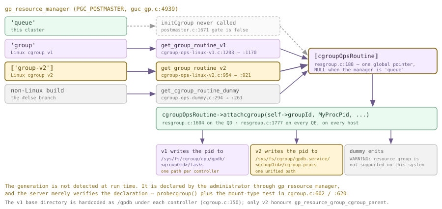
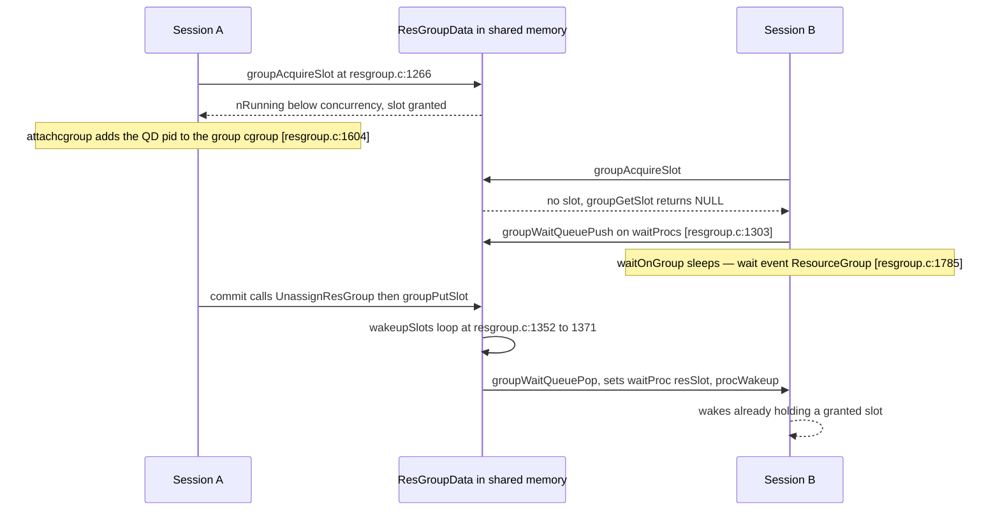
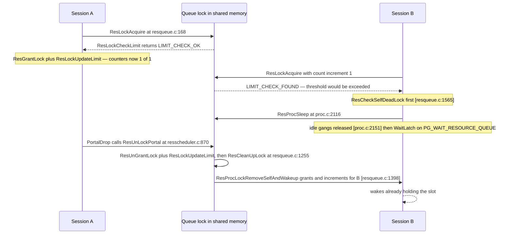

<!--
  Licensed to the Apache Software Foundation (ASF) under one
  or more contributor license agreements.  See the NOTICE file
  distributed with this work for additional information
  regarding copyright ownership.  The ASF licenses this file
  to you under the Apache License, Version 2.0 (the
  "License"); you may not use this file except in compliance
  with the License.  You may obtain a copy of the License at

    http://www.apache.org/licenses/LICENSE-2.0

  Unless required by applicable law or agreed to in writing,
  software distributed under the License is distributed on an
  "AS IS" BASIS, WITHOUT WARRANTIES OR CONDITIONS OF ANY
  KIND, either express or implied.  See the License for the
  specific language governing permissions and limitations
  under the License.
-->

import RawFigure from '../_components/RawFigure';

# 21. Resource Management

## 21.1 Resource Groups

A single-node PostgreSQL server that meets a greedy query loses some throughput. An MPP cluster that meets one loses a *host*: the statement fans out into a gang on every segment, each process reads at full speed, and the neighbours on the same machine simply stop making progress. Resource management is the machinery that says *how much of the cluster one statement may take*, and Cloudberry ships two independent implementations of it. **Resource groups** are the modern one, and the subject of this section; **resource queues** are the legacy one, and the subject of [§21.2](#212-resource-queues-legacy).

The distinction worth carrying through the whole section is that a resource group enforces on two entirely different planes at once. Concurrency and memory are *the database's* business — counters in shared memory, a wait queue, a number handed to the executor. CPU cores and disk bandwidth are *the kernel's* business — Linux control groups, written as plain text into `/sys/fs/cgroup`. A group is a single catalog row that configures both planes, and most of what makes the implementation interesting is the seam between them.

### 21.1.1 Two enforcement planes, and the state of this cluster

Start from the shape of the problem. One statement on this cluster is not one process; it is a QD plus one QE per segment per slice ([§1.3](../part-1-introduction/ch01.md#13-processes-and-memory), [§1.4](../part-1-introduction/ch01.md#14-clients-the-wire-protocol--dispatch), [§13.3](../part-4-query-processing/ch13.md#133-dispatch-from-coordinator-plan-to-segment-execution)). "Limit the query" therefore has to mean "limit a *set* of processes, on every host, simultaneously" — and the two planes divide that job differently. The slot is taken **once**, by the QD, at transaction start (`xact.c:2817`). The cgroup attachment happens **N+1 times**: the QD adds its own pid (`resgroup.c:1604`), and each QE adds its own when it receives the dispatched group snapshot (`resgroup.c:1777`).

<RawFigure html={"<div style=\"font-family:ui-monospace,SFMono-Regular,Menlo,monospace;font-size:12px;line-height:1.45\"> <div style=\"border:1px solid #8a6d1a;background:#fff4d6;border-radius:6px;padding:7px 11px;margin-bottom:11px\"> <b>database plane</b> &nbsp;·&nbsp; one statement takes &nbsp;<span class=\"hl\">exactly one slot</span>&nbsp; from <span style=\"color:#8a6d1a\">ResGroupData.nRunning</span>, on the coordinator only &nbsp;·&nbsp; <span style=\"font-size:11px\">resgroup.c:1138</span> </div> <div style=\"display:grid;grid-template-columns:repeat(4,1fr);gap:8px\"> <div style=\"border:1px solid #cdb4db;background:#f5edff;border-radius:6px;padding:7px 9px\"> <div style=\"font-weight:600\">host A &nbsp;·&nbsp; QD</div> <div style=\"font-size:11px;color:#555;margin-top:3px\">postgres pid 4171</div> <div style=\"font-size:10.5px;margin-top:6px;border-top:1px dashed #cdb4db;padding-top:5px\">writes pid into<br/>gpdb.service/16385/cgroup.procs</div> </div> <div style=\"border:1px solid #cfead9;background:#eafaf0;border-radius:6px;padding:7px 9px\"> <div style=\"font-weight:600\">host B &nbsp;·&nbsp; QE seg0</div> <div style=\"font-size:11px;color:#555;margin-top:3px\">postgres pid 5220</div> <div style=\"font-size:10.5px;margin-top:6px;border-top:1px dashed #cfead9;padding-top:5px\">writes pid into<br/>gpdb.service/16385/cgroup.procs</div> </div> <div style=\"border:1px solid #cfead9;background:#eafaf0;border-radius:6px;padding:7px 9px\"> <div style=\"font-weight:600\">host C &nbsp;·&nbsp; QE seg1</div> <div style=\"font-size:11px;color:#555;margin-top:3px\">postgres pid 5221</div> <div style=\"font-size:10.5px;margin-top:6px;border-top:1px dashed #cfead9;padding-top:5px\">writes pid into<br/>gpdb.service/16385/cgroup.procs</div> </div> <div style=\"border:1px solid #cfead9;background:#eafaf0;border-radius:6px;padding:7px 9px\"> <div style=\"font-weight:600\">host D &nbsp;·&nbsp; QE seg2</div> <div style=\"font-size:11px;color:#555;margin-top:3px\">postgres pid 5222</div> <div style=\"font-size:10.5px;margin-top:6px;border-top:1px dashed #cfead9;padding-top:5px\">writes pid into<br/>gpdb.service/16385/cgroup.procs</div> </div> </div> <div style=\"font-size:11px;color:#555;margin-top:9px\"> <b>kernel plane</b> &nbsp;·&nbsp; every capability except <i>concurrency</i> and <i>memory_quota</i> is enforced by a cgroup that exists <i>separately on each host</i>, which is why <code>cpu_max_percent</code> means &ldquo;percent of <i>this</i> machine&rdquo; and never &ldquo;percent of the cluster&rdquo;. On the demo cluster used throughout this book all four processes happen to share one machine; the figure shows the general case. </div> </div>"} caption={"One slot, N+1 cgroup memberships. The database plane counts once; the kernel plane must be told once per process, on each host."} />

Which manager is in force is decided by a single string GUC. It is not an enum — hence the empty `enumvals` below — and it is `PGC_POSTMASTER`, defined at `guc_gp.c:4939` with a check/assign/show hook trio (`guc.h`) whose assign side is `gpvars_assign_gp_resource_manager_policy` (`cdbvars.c:536`). That function accepts exactly three spellings, and choosing either group spelling also quietly sets `gp_enable_resqueue_priority = false` (`cdbvars.c:545`, `:550`): the two managers are mutually exclusive by construction, not by policy.

*The manager selector on this cluster — a string GUC, postmaster-only.*

```sql
SELECT name, setting, context, vartype, enumvals, extra_desc
  FROM pg_settings WHERE name = 'gp_resource_manager';

SET gp_resource_manager = 'group-v2';
```

```text {3} title="output"
        name         | setting |  context   | vartype | enumvals |                      extra_desc
---------------------+---------+------------+---------+----------+-------------------------------------------------------
 gp_resource_manager | queue | postmaster | string  |          | Only support "queue", "group" and "group-v2" for now.
(1 row)

ERROR:  parameter "gp_resource_manager" cannot be changed without restarting the server
```

:::note

**Read this before the rest of the section.** `gp_resource_manager` is `queue` here, and it cannot be changed without restarting the cluster, which is out of scope for this book's demos. So resource groups on this machine are **fully inspectable but not enforcing**: the catalogs are real, the DDL runs, the views exist, the source is the source — but no slot is ever taken and no cgroup is ever written. Everything below is honest about which side of that line it comes from. Enabling groups would require exactly three things: `gp_resource_manager = 'group'` or `'group-v2'` in `postgresql.conf` on every host, a restart, and a pre-created cgroup hierarchy that the `gpadmin` user can write — for v2 a directory named by `gp_resource_group_cgroup_parent` (here `gpdb.service`) directly under the `cgroup2` mount. The second condition is unsatisfiable on this box, which is the subject of [§21.1](#211-resource-groups).3.

:::

*Why 'group-v2' could not work here even after a restart: a CentOS 7 kernel with no unified hierarchy.*

```sql
$ grep cgroup /proc/self/mounts
$ grep -c cgroup2 /proc/self/mounts
$ ls -d /sys/fs/cgroup/*/gpdb*
$ uname -r
```

```text {9} title="output"
tmpfs  /sys/fs/cgroup          tmpfs  rw,nosuid,nodev,noexec,relatime,mode=755 0 0
cgroup /sys/fs/cgroup/systemd  cgroup rw,...,name=systemd 0 0
cgroup /sys/fs/cgroup/blkio    cgroup rw,...,blkio 0 0
cgroup /sys/fs/cgroup/cpuacct,cpu cgroup rw,...,cpuacct,cpu 0 0
cgroup /sys/fs/cgroup/cpuset   cgroup rw,...,cpuset 0 0
cgroup /sys/fs/cgroup/memory   cgroup rw,...,memory 0 0
... (12 cgroup mounts, all mnt_type "cgroup")

0                            <-- no cgroup2 mount anywhere

ls: cannot access '/sys/fs/cgroup/*/gpdb*': No such file or directory

3.10.0-1160.119.1.el7.x86_64
```

### 21.1.2 The group model: one row of capabilities

A resource group is a name plus seven capabilities. Three built-in groups exist in every cluster and exist here, under `queue` mode, untouched: `default_group` for ordinary roles, `admin_group` for superusers and the predefined `pg_*` roles, and `system_group` with `concurrency = 0`, which is the group auxiliary backends are accounted to and which can admit nothing. The catalog is a pair of tables — `pg_resgroup` holds the name, `pg_resgroupcapability` holds one row per capability keyed by a small integer — and `gp_toolkit.gp_resgroup_config` pivots the pair back into something readable.

*The three built-in groups, first pivoted by gp_resgroup_config and then in the raw two-table form.*

```sql
SELECT * FROM gp_toolkit.gp_resgroup_config;

SELECT r.rsgname, c.reslimittype, c.value
  FROM pg_resgroup r JOIN pg_resgroupcapability c ON c.resgroupid = r.oid
 WHERE r.rsgname = 'default_group' ORDER BY c.reslimittype;
```

```text {3} title="output"
 groupid |   groupname   | concurrency | cpu_max_percent | cpu_weight | cpuset | memory_quota | min_cost | io_limit
---------+---------------+-------------+-----------------+------------+--------+--------------+----------+----------
    6437 | default_group | 20          | 20              | 100        | -1     | -1           | 500    | -1
    6438 | admin_group   | 10          | 10              | 100        | -1     | -1           | 500      | -1
    6448 | system_group  | 0           | 10              | 100        | -1     | -1           | 500      | -1
(3 rows)

    rsgname    | reslimittype | value
---------------+--------------+-------
 default_group |            1 | 20        <-- concurrency
 default_group |            2 | 20        <-- cpu_max_percent
 default_group |            3 | 100       <-- cpu_weight
 default_group |            4 | -1        <-- cpuset
 default_group |            5 | -1        <-- memory_quota
 default_group |            6 | 500       <-- min_cost
 default_group |            7 | -1        <-- io_limit
(7 rows)
```

Those small integers are `ResGroupLimitType` (`pg_resgroup.h:51`), and they are the reason the catalog is stable across releases while the *names* migrate. This capability set is the modern Cloudberry one; older Greenplum material describes a different vocabulary (`memory_limit`, `memory_shared_quota`, `memory_spill_ratio`) that this tree no longer uses at all. In C the same seven values live in `ResGroupCaps` (`resgroup.h:71`), which is copied by value into every slot and dispatched to every QE.

| Capability | reslimittype | What it governs (per segment host) |
| --- | --- | --- |
| `concurrency` | 1 | How many statements the group may run at once. A transaction takes one slot on the coordinator before it does anything else. `0` admits nothing — that is `system_group`. Range is `[0, max_connections]` (`resgroupcmds.c:928`). |
| `cpu_max_percent` | 2 | A hard CPU ceiling, as a percentage of the host, written to `cpu.cfs_quota_us` under cgroup v1 (`cgroup-ops-linux-v1.c:979`) or `cpu.max` under v2 (`cgroup-ops-linux-v2.c:680`). Range `[1, 100]`, or `-1` to disable the ceiling. |
| `cpu_weight` | 3 | The proportional share used when CPU is contended and no ceiling applies, written to `cpu.shares` (v1, `:999`) or `cpu.weight` (v2, `:702`) after scaling by 1024/100. Range `[1, 500]`, default `100`. |
| `cpuset` | 4 | An explicit core list such as `'0-1'`, written to the `cpuset` controller. Setting it forces `cpu_max_percent` to `-1` (`resgroupcmds.c:1015`) — a group is pinned *or* throttled, never both. |
| `memory_quota` | 5 | The group's memory budget in MB. Divided by `concurrency` to give each statement its `query_mem` (`resgroup.c:3630`). `-1`, the default, means "no group budget — use `statement_mem`". |
| `min_cost` | 6 | A planner-cost floor. A plan cheaper than this is released from the group entirely instead of consuming a slot. Default `500`. |
| `io_limit` | 7 | Per-tablespace read/write bandwidth and IOPS caps, written to `io.max`. cgroup **v2 only**. `-1` means unlimited. |

Two host-wide knobs sit above the per-group ones and are worth naming here because they are what make `cpu_max_percent` mean something absolute. `gp_resource_group_cpu_limit` (`0.9` here) is the fraction of the machine the *whole database* may consume — it sizes the quota of the parent cgroup (`cgroup-ops-linux-v1.c:422`, `cgroup-ops-linux-v2.c:214`) — and `gp_resource_group_cpu_priority` (`10` here) is the multiplier applied to that parent's weight (`v1:446`, `v2:226`), i.e. how Cloudberry as a whole competes with everything else on the box. A group asking for `cpu_max_percent = 20` is therefore asking for 20 % of the database's 90 %, not 20 % of the machine.

`memory_quota` is the group answer to a question [§18.1](../part-4-query-processing/ch18.md#181-executor-framework--lifecycle) deliberately left open. That chapter showed the `EXPLAIN ANALYZE` footer — `Memory used:  128000kB` / `Memory wanted:  14040kB` — and said Chapter 21 owns the granting side. Under groups the granting side is `ResourceGroupGetQueryMemoryLimit` (`resgroup.c:3600`): if `memory_quota` is `-1` it simply returns `statement_mem`, and otherwise it returns `memory_quota * 1024 * 1024 / concurrency`, floored at `statement_mem` if the user asked for more. On *this* cluster the number comes from the queue path instead, which [§21.2](#212-resource-queues-legacy) traces end to end; the fork between the two is a single `if` and appears at the close of this section.

`min_cost` deserves a moment, because it is the capability most likely to surprise. Before a statement is allowed to occupy a slot for its whole transaction, the plan's `total_cost` is compared against it (`can_bypass_based_on_plan_cost`, `resgroup.c:3841`); a cheaper plan gives its slot back and runs unmanaged. The default is `500`. That is a very small number in planner units, as a look at real plans on a 200 000-row table makes clear.

*What min_cost = 500 actually excludes. All costs are GPORCA's; ratios on one machine, not benchmarks.*

```sql
CREATE TABLE m211_t (id int, v text) DISTRIBUTED BY (id);
INSERT INTO m211_t SELECT g, 'x'||g FROM generate_series(1,200000) g;
ANALYZE m211_t;

EXPLAIN SELECT count(*) FROM m211_t;
EXPLAIN SELECT a.id FROM m211_t a JOIN m211_t b ON a.v = b.v ORDER BY a.id LIMIT 10;
```

```text {3} title="output"
                                     QUERY PLAN
------------------------------------------------------------------------------------
 Finalize Aggregate  (cost=0.00..432.77 rows=1 width=8)
   ->  Gather Motion 3:1  (slice1; segments: 3)  (cost=0.00..432.77 rows=1 width=8)
         ->  Partial Aggregate  (cost=0.00..432.77 rows=1 width=8)
               ->  Seq Scan on m211_t  (cost=0.00..432.65 rows=66667 width=1)
 Optimizer: GPORCA
(5 rows)

                                     QUERY PLAN
------------------------------------------------------------------------------------
 Limit  (cost=0.00..925.74 rows=10 width=4)
   ->  Gather Motion 3:1  (slice1; segments: 3)  (cost=0.00..925.74 rows=10 width=4)
         ...
               ->  Sort  (cost=0.00..925.74 rows=66667 width=4)
                     ->  Hash Join  (cost=0.00..901.51 rows=66667 width=4)
                           ->  Redistribute Motion 3:3  (slice2; segments: 3)  ...
                           ->  Hash  (cost=434.98..434.98 rows=66667 width=7)
 Optimizer: GPORCA
(16 rows)
```

:::note

A full three-segment scan and aggregate over 200 000 rows costs **432.77** — under the default `min_cost` of 500, so it would take no slot at all. The two-way hash join with a sort costs **925.74**, so it would. The lesson is not that the default is wrong; it is that `min_cost` is a *planner-cost* threshold, and planner cost is only loosely correlated with the thing you actually want to ration. Tune it against real plans from your own workload, the way the two `EXPLAIN`s above were read, rather than against intuition about "small" queries.

:::

### 21.1.3 The cgroup abstraction layer

Everything on the kernel plane goes through one indirection, and it is the most interesting piece of code in the subsystem. `CGroupOpsRoutine` (`cgroup.h:250`) is a struct of **26 function pointers** covering the entire lifetime of a group's kernel-side state: name it, probe it, check it, initialise it, adjust GUCs for it, create and destroy its directories, attach and detach processes, lock and unlock it, set and read CPU limits, weights, usage and core sets, and — added for v2 — parse, apply, free, read, dump and clear IO limits.

```c title="src/include/utils/cgroup.h:250"
typedef struct CGroupOpsRoutine
{
	getcgroupname_function 	getcgroupname;
	probecgroup_function	probecgroup;
	checkcgroup_function 	checkcgroup;
	initcgroup_function 	initcgroup;
	adjustgucs_function 	adjustgucs;
	createcgroup_function 	createcgroup;
	/* ... attach/detach, lock/unlock, cpu, cpuset, memory ... */
	parseio_function		parseio;
	setio_function			setio;
	getiostat_function		getiostat;
} CGroupOpsRoutine;      /* 26 function pointers in all */
```



*Dispatch through CGroupOpsRoutine. The administrator's GUC value picks one of three vtables at postmaster start; every kernel-plane operation thereafter is a call through the single global pointer.*

Pause on the shape rather than the content, because the book has now shown this trick three times. [§18.1](../part-4-query-processing/ch18.md#181-executor-framework--lifecycle).6 introduced `TupleTableSlotOps`, the vtable that lets one executor call `slot_getsomeattrs` without knowing whether the tuple underneath is heap, minimal, virtual or AO-columnar. The table access method is the same idea one level down, letting one `ExecScan` walk a heap or an append-optimised relation. `CGroupOpsRoutine` is the same idea again, one level *out*, letting one resource manager write CPU limits without knowing which generation of Linux control groups is mounted. Three unrelated subsystems, one pattern: put the variation behind a struct of function pointers, pick the struct once during startup, and let every call site stay ignorant. Naming it is worth more than any of the three instances individually.

And now the part that is genuinely surprising. One would expect a layer like this to *probe* — look at `/proc/self/mounts`, notice a `cgroup2` filesystem, choose v2. It does not. `initCgroup` (`resgroup.c:400`) keys entirely off the GUC, and the `else` branch means the two Linux vtables are selected by an administrator's configuration string, not by anything the kernel says:

```c title="src/backend/utils/resgroup/resgroup.c:402"
#ifdef __linux__
	if (Gp_resource_manager_policy == RESOURCE_MANAGER_POLICY_GROUP)
	{
		cgroupOpsRoutine = get_group_routine_v1();
		cgroupSystemInfo = get_cgroup_sysinfo_v1();
	}
	else
	{
		cgroupOpsRoutine = get_group_routine_v2();
		cgroupSystemInfo = get_cgroup_sysinfo_v2();
	}
#else
```

Verification comes second, and only as a yes/no on the declaration already made. `probecgroup()` runs immediately after the assignment (`resgroup.c:418`) and a false answer is a hard `elog(ERROR, "The control group is not well configured...")` at `:420` — in the postmaster, so the server does not start. Both implementations of the probe do the same two things: find the mount directory, then check the permissions the group needs (`cgroup-ops-linux-v1.c:537`, `cgroup-ops-linux-v2.c:285`). It is `getCgroupMountDir` (`cgroup.c:584`) that finally consults the kernel — and even there the GUC is what decides which `mnt_type` string counts as a match, `"cgroup"` at `:602` versus `"cgroup2"` at `:620`, with v1 additionally stripping the trailing controller component so that `/sys/fs/cgroup/cpu` becomes `/sys/fs/cgroup`. Declare v2 on a v1 host and the loop finds nothing, the probe fails, and the postmaster refuses to come up. There is no fallback.

On this cluster the whole chain is short-circuited one step earlier. `initCgroup` is called from exactly one place, `postmaster.c:1671`, behind `if (IsResGroupEnabled())` — and `IsResGroupEnabled()` (`resource_manager.h:28`) is false under `queue`. So `cgroupOpsRoutine` is never assigned and stays at its initial `NULL` (`resgroup.c:188`). That NULL is directly observable, because the two capabilities that must talk to the kernel *at DDL time* test for it and refuse:

*The NULL global, surfaced through DDL. Both errors are the same fact wearing two hats.*

```sql
CREATE RESOURCE GROUP m211_io
  WITH (cpu_max_percent=10, io_limit='pg_default:rbps=100,wbps=200,riops=1000,wiops=max');

ALTER RESOURCE GROUP m211_rg SET cpuset '0-1';
```

```text {1} title="output"
ERROR:  resource group must be enabled to use io limit feature
        -- resgroupcmds.c:1022:  if (cgroupOpsRoutine == NULL)

ERROR:  resource group must be enabled to use cpuset feature
        -- resgroup.c:3185, reached from EnsureCpusetIsAvailable
```

:::note

That is a complete causal chain, verified end to end and worth rereading as one sentence: `gp_resource_manager = 'queue'` &rarr; `IsResGroupEnabled()` false (`resource_manager.h:28`) &rarr; `initCgroup()` skipped (`postmaster.c:1671`) &rarr; `cgroupOpsRoutine` stays NULL (`resgroup.c:188`) &rarr; `io_limit` and `cpuset` DDL rejected (`resgroupcmds.c:1022`, `resgroup.c:3185`). Note the corollary: the `io_limit` string is never even handed to its parser here, because the NULL check sits *before* `cgroupOpsRoutine-&gt;parseio()`. The grammar of [§21.1](#211-resource-groups).6 is therefore read from source, not exercised.

:::

### 21.1.4 DDL, and what the catalog means when nothing is enforcing

The DDL lives in `resgroupcmds.c`: `CreateResourceGroup` at `:91`, `DropResourceGroup` at `:263`, `AlterResourceGroup` at `:364`, with `GetResGroupIdForRole` at `:714` doing the lookup that maps a login to a group through `pg_authid.rolresgroup`. All three are dispatched to the segments as utility statements (`CdbDispatchUtilityStatement`) so that every host's catalog agrees, and all three then branch: if groups are activated they also touch shared memory and the cgroup filesystem, and if not they emit a warning and stop. That warning is the single most instructive output in this section.

*Group DDL under queue mode: the catalog write succeeds, the enforcement does not, and the server says so.*

```sql
CREATE RESOURCE GROUP m211_rg
  WITH (concurrency=4, cpu_max_percent=20, memory_quota=512, min_cost=2000);

SELECT groupid, groupname, concurrency, cpu_max_percent, cpu_weight,
       cpuset, memory_quota, min_cost, io_limit
  FROM gp_toolkit.gp_resgroup_config WHERE groupname = 'm211_rg';
```

```text {1} title="output"
WARNING:  resource group is disabled
HINT:  To enable set gp_resource_manager=group
CREATE RESOURCE GROUP

 groupid | groupname | concurrency | cpu_max_percent | cpu_weight | cpuset | memory_quota | min_cost | io_limit
---------+-----------+-------------+-----------------+------------+--------+--------------+----------+----------
   50932 | m211_rg   | 4           | 20              | 100        | -1     | 512          | 2000     | -1
(1 row)
```

Read that carefully, because it describes a design decision and not a bug. **The catalog is authoritative and portable; enforcement is a runtime mode.** A group definition written today on a `queue` cluster survives `pg_dump`, survives an upgrade, and starts enforcing the moment somebody flips the GUC and restarts — no re-authoring required. The warning comes from `resgroupcmds.c:255`, in the `else` arm of `if (IsResGroupActivated())`. Validation, by contrast, is *not* deferred: `checkResgroupCapLimit` (`resgroupcmds.c:924`) and `parseStmtOptions` (`:985`) run regardless of mode, so a nonsensical group can never reach the catalog in the first place.

*Validation runs in both modes; role assignment shows both managers writing to the same CREATE ROLE.*

```sql
CREATE RESOURCE GROUP m211_bad WITH (concurrency=4, cpu_max_percent=0);
CREATE RESOURCE GROUP m211_bad WITH (cpu_max_percent=20, cpu_weight=99999);
CREATE RESOURCE GROUP m211_bad WITH (cpu_max_percent=20, foo=1);

ALTER RESOURCE GROUP m211_rg SET concurrency 8;
CREATE ROLE m211_u LOGIN RESOURCE GROUP m211_rg;
SELECT rrrolname, rrrsgname FROM gp_toolkit.gp_resgroup_role
 WHERE rrrolname LIKE 'm21%';
```

```text {15} title="output"
ERROR:  cpu_max_percent range is [1, 100] or equals to -1
ERROR:  cpu_weight range is [1, 500]
ERROR:  option "foo" not recognized

ALTER RESOURCE GROUP

NOTICE:  resource queue required -- using default resource queue "pg_default"
WARNING:  resource group is disabled
HINT:  To enable set gp_resource_manager=group
CREATE ROLE

 rrrolname |   rrrsgname
-----------+---------------
 m212_u    | default_group
 m211_u    | m211_rg
(2 rows)
```

The double diagnostic on that `CREATE ROLE` is the clearest possible picture of the two managers coexisting. A `NOTICE` says the new role was given the default resource *queue*, because queues are the active manager; a `WARNING` says the resource *group* it explicitly asked for was recorded but is disabled. Both statements are true, both catalogs were written, and every role in the cluster carries a `rolresgroup` whether or not it will ever be honoured — `gp_resgroup_role` above is a plain join over `pg_authid`. (`m212_u` belongs to [§21.2](#212-resource-queues-legacy)'s demo; it appears here only because the view covers every role.) Dropping is likewise catalog-aware rather than mode-aware:

*A group in use cannot be dropped, in either mode. Then the m211_* objects are cleaned up.*

```sql
DROP RESOURCE GROUP m211_rg;
ALTER ROLE m211_u RESOURCE GROUP default_group;
DROP RESOURCE GROUP m211_rg;
DROP ROLE m211_u;
DROP TABLE m211_t;
```

```text {1} title="output"
ERROR:  resource group is used by at least one role

WARNING:  resource group is disabled
HINT:  To enable set gp_resource_manager=group
ALTER ROLE

DROP RESOURCE GROUP
DROP ROLE
DROP TABLE
```

### 21.1.5 Admission control at run time

Everything in this subsection is read from source, not observed — no slot is ever taken on this cluster. The entry point is `AssignResGroupOnMaster` (`resgroup.c:1540`), called from `StartTransaction` (`xact.c:2817`) *after* the transaction is under way, because deciding which group a session belongs to means reading `pg_authid`. Its mirror is `UnassignResGroup` (`:1619`), which runs at commit or abort. The slot itself is the smallest interesting object here: `ResGroupSlotData` (`resgroup.c:136`) is little more than a group pointer, a process count, a free-list link, and a by-value copy of the seven capabilities — a *snapshot*, so that an `ALTER RESOURCE GROUP` mid-flight cannot change the rules a running statement is playing by.

```c title="src/backend/utils/resgroup/resgroup.c:1135"
	caps = &group->caps;

	/* First check if the concurrency limit is reached */
	if (group->nRunning >= caps->concurrency)
		return NULL;

	/* Now actually get a free slot */
	slot = slotpoolAllocSlot();
	initSlot(slot, group);
	group->nRunning++;

	return slot;
```



*Slot acquisition, queueing and hand-off. Everything happens under ResGroupLock in exclusive mode; the waiter sleeps outside it.*

The wait queue is strictly FIFO and is a `dclist` of `PGPROC` links hanging directly off the group (`ResGroupData.waitProcs`, `resgroup.c:159`). Its five operations — `groupWaitQueuePush` (`:2448`), `groupWaitQueuePop` (`:2470`), `groupWaitQueueErase` (`:2496`), `groupWaitQueueIsEmpty` (`:2517`) and the assertion-only `groupWaitQueueValidate` (`:2387`) — are all called with `ResGroupLock` held exclusively. Note the hand-off discipline in `wakeupSlots`: the waker *takes* the slot on the sleeper's behalf and stores it in `waitProc->resSlot` before waking it, so a woken process can never lose a race to a newcomer. `gp_resource_group_queuing_timeout` (`resgroup.c:1840`) bounds the sleep; `0`, the value here, waits forever. A separate path, `ResGroupMoveQuery` (`:3508`) behind the SQL function `pg_resgroup_move_query(sessionId, groupName)`, can move an already-running session into a different group, bounded by `gp_resource_group_move_timeout` (`:3447`).

The segment side closes the N+1 loop from [§21.1](#211-resource-groups).1 and reuses the dispatch machinery of [§13.3](../part-4-query-processing/ch13.md#133-dispatch-from-coordinator-plan-to-segment-execution) rather than inventing anything. Having acquired the slot, the QD serialises the group id and the capability snapshot into the `'M'` dispatch message (`SerializeResGroupInfo`, `cdbdisp_query.c:919`); each QE unpacks it in its main loop and calls `SwitchResGroupOnSegment` (`postgres.c:6072`, implemented at `resgroup.c:1680`), which allocates a segment-local slot and attaches *its own* pid to the group's cgroup at `:1777`. The slot count is a coordinator-side truth; the cgroup membership is a per-host truth; the same capability struct drives both.

### 21.1.6 io_limit gets its own grammar

Six of the seven capabilities are integers. The seventh, `io_limit`, is a small language — a semicolon-separated list of per-tablespace clauses, each naming a tablespace (by name, by OID, or `*` for all) and then a comma-separated set of the four keys `rbps`, `wbps`, `riops`, `wiops`, whose values are either integers or the literal `max`. Rather than hand-rolling a parser, Cloudberry gives the clause a **dedicated bison grammar and flex scanner**, prefixed so they can coexist with the main SQL parser in one binary: `io_limit_gram.y` (213 lines, generating 1835) and `io_limit_scanner.l` (124 lines, generating 2483), with the runtime in `cgroup_io_limit.c`.

```c title="src/backend/utils/resgroup/io_limit_gram.y:1"
%define api.pure true
%define api.prefix {io_limit_yy}
%error-verbose
...
%union {
	char *str;
	uint64 integer;
	IOconfig *ioconfig;
	TblSpcIOLimit *tblspciolimit;
	List *list;
}
...
%parse-param { IOLimitParserContext *context }
```

The scanner is worth a glance too, because it is a *stateful* one: seeing a `:` it does `BEGIN ts_param` (`io_limit_scanner.l:25-29`), and only inside that state does the pattern `[wr](b|io)ps` produce an `IO_KEY` token (`:31`) or the word `max` produce `VALUE_MAX` (`:37`). Outside it, the same characters are just an identifier — which is how a tablespace legitimately named `rbps` remains parseable. Errors carry a caret: `io_limit_yyerror` (`:181`) reports `errhint(" %s\n %*c", line, io_limit_yycolumn, '^')`, pointing at the offending column of the original string.

<RawFigure html={"<div style=\"font-family:ui-monospace,SFMono-Regular,Menlo,monospace;font-size:12px;line-height:1.5\"> <div style=\"background:#fff4d6;border:1px solid #8a6d1a;border-radius:6px;padding:8px 11px\"> <span style=\"font-size:10.5px;color:#8a6d1a\">io_limit &nbsp;=&gt;</span>&nbsp; <span style=\"background:#e4d3f5;padding:1px 4px;border-radius:3px\">pg_default</span><b>:</b><span style=\"background:#d8f0e2;padding:1px 4px;border-radius:3px\">rbps</span>=<span style=\"background:#ffe3b3;padding:1px 4px;border-radius:3px\">100</span><b>,</b><span style=\"background:#d8f0e2;padding:1px 4px;border-radius:3px\">wbps</span>=<span style=\"background:#ffe3b3;padding:1px 4px;border-radius:3px\">200</span><b>,</b><span style=\"background:#d8f0e2;padding:1px 4px;border-radius:3px\">riops</span>=<span style=\"background:#ffe3b3;padding:1px 4px;border-radius:3px\">1000</span><b>,</b><span style=\"background:#d8f0e2;padding:1px 4px;border-radius:3px\">wiops</span>=<span style=\"background:#ffe3b3;padding:1px 4px;border-radius:3px\">max</span> <div style=\"font-size:10px;color:#8a6d1a;margin-top:5px\"> <span style=\"background:#e4d3f5;padding:0 3px\">ID</span> or <span style=\"background:#e4d3f5;padding:0 3px\">NUMBER</span> or <span style=\"background:#e4d3f5;padding:0 3px\">STAR</span> &nbsp;·&nbsp; <span style=\"background:#d8f0e2;padding:0 3px\">IO_KEY</span>, only inside scanner state ts_param &nbsp;·&nbsp; <span style=\"background:#ffe3b3;padding:0 3px\">NUMBER</span> or <span style=\"background:#ffe3b3;padding:0 3px\">VALUE_MAX</span> </div> </div> <div style=\"text-align:center;color:#6b5b8a;margin:7px 0;font-size:13px\">&#9660;&nbsp; io_limit_parse &nbsp;&#8594;&nbsp; List *</div> <div style=\"display:grid;grid-template-columns:1fr 1fr;gap:9px\"> <div style=\"border:1px solid #cdb4db;background:#f5edff;border-radius:6px;padding:8px 11px\"> <div style=\"font-weight:600;color:#3a2b4a\">TblSpcIOLimit</div> <div style=\"font-size:10.5px;color:#6b5b8a;margin-bottom:5px\">cgroup_io_limit.h:57</div> <div>Oid&nbsp; tablespace_oid &nbsp;<span style=\"color:#8a6d1a\">= 1663</span></div> <div>List *bdi_list &nbsp;<span style=\"color:#555\">&#8594; { makedev 8,16 }</span></div> <div>IOconfig *ioconfig &nbsp;<span style=\"color:#555\">&#8594;</span></div> <div style=\"font-size:10.5px;color:#6b5b8a;margin-top:6px;border-top:1px dashed #cdb4db;padding-top:5px\"> A tablespace is a directory; the directory may span several disks, so fill_bdi_list resolves it to the set of block-device ids the kernel wants. </div> </div> <div style=\"border:1px solid #8a6d1a;background:#fff4d6;border-radius:6px;padding:8px 11px\"> <div style=\"font-weight:600;color:#5c4708\">IOconfig</div> <div style=\"font-size:10.5px;color:#8a6d1a;margin-bottom:5px\">cgroup_io_limit.h:31 &nbsp;·&nbsp; four uint64, read by offset</div> <div>uint64 rbps &nbsp;&nbsp;= 100</div> <div>uint64 wbps &nbsp;&nbsp;= 200</div> <div>uint64 riops &nbsp;= 1000</div> <div>uint64 wiops &nbsp;= <span class=\"hl\">PG_UINT64_MAX</span> <span style=\"font-size:10px;color:#8a6d1a\">(max)</span></div> <div style=\"font-size:10.5px;color:#8a6d1a;margin-top:6px;border-top:1px dashed #8a6d1a;padding-top:5px\"> All four are uint64 on purpose: the grammar stores a key by <i>array offset</i> into the struct (IOconfigFields, cgroup_io_limit.c:44), which is also how it detects a duplicated key. </div> </div> </div> <div style=\"margin-top:9px;border:1px solid #cfead9;background:#eafaf0;border-radius:6px;padding:7px 11px;font-size:11.5px\"> <b>setio_v2</b> then writes one line per device &nbsp;&#8594;&nbsp; <code>8:16 rbps=104857600 wbps=209715200 riops=1000 wiops=max</code> &nbsp;into&nbsp; <code>/sys/fs/cgroup/gpdb.service/&lt;groupOid&gt;/io.max</code> &nbsp;<span style=\"color:#4a6b57\">(cgroup-ops-linux-v2.c:890-891)</span> </div> </div>"} caption={"What the grammar produces: a List of TblSpcIOLimit, each pairing a tablespace with an IOconfig of four uint64 fields, plus the block devices that tablespace actually sits on."} />

:::note

Two boundaries this figure implies. First, **io_limit is cgroup v2 only** — every IO entry in the v1 vtable is a stub that raises `WARNING: resource group io limit only can be used in cgroup v2.` (`cgroup-ops-linux-v1.c:1154-1169`), because v1's `blkio` controller has no equivalent of `io.max`. Second, the bandwidth keys are validated in range `[2, ULLONG_MAX/1024/1024]` and the IOPS keys in `[2, UINT_MAX]` (`io_limit_value_validate`, `cgroup_io_limit.c:311`) — and note the units: `rbps`/`wbps` are given in **MB/s** and multiplied up on the way to `io.max`, which is why the figure's `rbps=100` becomes `104857600`. The matching read-back path is `getiostat`, feeding `gp_toolkit.gp_resgroup_iostats_per_host`.

:::

### 21.1.7 Bypass valves, and the observability surface

A concurrency limit of 20 would be crippling if `SHOW work_mem` or a `psql` tab-completion query consumed a slot for the duration of its transaction. Groups therefore have escape valves, applied at two moments. Before planning, `shouldBypassQuery` (`resgroup.c:2621`) re-parses the statement and lets `SET`/`RESET`/`SHOW` and catalog-only `SELECT`s through. After planning, `check_and_unassign_from_resgroup` (`:3651`) gets a second chance with the finished plan in hand, and *gives a held slot back* if any of three tests passes: cost below `min_cost`, or a pure catalog plan with `gp_resource_group_bypass_catalog_query` on, or a single-segment direct-dispatch plan with `gp_resource_group_bypass_direct_dispatch` on (`:3677-3678`). Explicit `BEGIN … END` blocks are excluded, because a slot released mid-block would never be reacquired.

Both of those two GUCs default to `on`, and it is worth being concrete about why that matters rather than treating it as a detail. `EXPLAIN SELECT * FROM m211_t WHERE id = 42` in [§21.1](#211-resource-groups).2 produced `Gather Motion 1:1 (slice1; segments: 1)` — two slices, the second direct-dispatched to exactly one segment. That is precisely the shape `can_bypass_direct_dispatch_plan` (`resgroup.c:3860`) matches. So on a group-managed cluster, a high-rate OLTP workload of single-key lookups is *by default* not admission-controlled at all, which is usually what you want (those queries touch one segment and finish in a millisecond) and is occasionally a nasty surprise (ten thousand of them per second are not free). Turning it off is a session-level `SET`.

| GUC | Context · value here | What it does |
| --- | --- | --- |
| `gp_resource_group_cgroup_parent` | postmaster · `gpdb.service` | Name of the top-level cgroup **v2** directory under the `cgroup2` mount. v1 ignores it entirely and hardcodes `/gpdb` beneath each controller (`cgroup.c:150`). |
| `gp_resource_group_cpu_limit` | postmaster · `0.9` | Fraction of the host's CPU the whole database may use; sizes the parent cgroup's quota. |
| `gp_resource_group_cpu_priority` | postmaster · `10` | Multiplier on the parent cgroup's weight — how Cloudberry competes with *other* cgroups on the host. |
| `gp_resource_group_bypass` | user · `off` | Blanket session escape hatch: every statement runs unmanaged. Its check hook (`guc_gp.c:5499`) rejects the `SET` while a slot is held — so on this cluster, where nothing is ever assigned, it always succeeds. |
| `gp_resource_group_bypass_catalog_query` | user · **`on`** | Release the slot for plans whose range table is entirely catalog relations. |
| `gp_resource_group_bypass_direct_dispatch` | user · **`on`** | Release the slot for single-segment direct-dispatch plans. |
| `gp_resource_group_queuing_timeout` | user · `0` | Milliseconds to wait for a slot before erroring out. `0` waits forever. |
| `gp_resource_group_move_timeout` | user · `30000` | Milliseconds `pg_resgroup_move_query` may wait for the target session to accept the move. |

The observability surface is a family of `gp_toolkit` views over shared memory rather than over catalogs, and that is exactly why most of them are empty here: `gp_resgroup_status` is a join of `pg_resgroup` against the set-returning function `pg_resgroup_get_status` (`resgroup_helper.c:206`), which reads the shared-memory group array that was never populated. `(0 rows)` is the honest answer, not a missing feature. Two views in the family are *not* empty, though, and they are the two that read from somewhere else: `gp_resgroup_role` is a plain catalog join, and `resgroup_session_level_memory_consumption` reads the per-segment `SessionState` vmem accounting that runs regardless of manager ([§18.3](../part-4-query-processing/ch18.md#183-sort--aggregate-nodes)).

*The whole view family, as it really answers under queue mode. Empty where empty is the truth.*

```sql
SELECT * FROM gp_toolkit.gp_resgroup_status;
SELECT * FROM gp_toolkit.gp_resgroup_status_per_host;
SELECT * FROM gp_toolkit.gp_resgroup_iostats_per_host;

SELECT sess_id, rsgid, rsgname, usename, segid, vmem_mb
  FROM gp_toolkit.resgroup_session_level_memory_consumption
 WHERE usename = 'gpadmin' AND datname = 'postgres' ORDER BY sess_id, segid;
```

```text {15} title="output"
 groupid | groupname | num_running | num_queueing | num_queued | num_executed | total_queue_duration
---------+-----------+-------------+--------------+------------+--------------+----------------------
(0 rows)

 groupid | groupname | hostname | cpu_usage | memory_usage
---------+-----------+----------+-----------+--------------
(0 rows)

 rsgname | hostname | tablespace | rbps | wbps | riops | wiops
---------+----------+------------+------+------+-------+-------
(0 rows)

 sess_id | rsgid | rsgname  | usename | segid | vmem_mb
---------+-------+----------+---------+-------+---------
     236 |     0 | unknown | gpadmin |    -1 |      19
     236 |     0 | unknown  | gpadmin |     0 |      14
     236 |     0 | unknown  | gpadmin |     1 |      14
     236 |     0 | unknown  | gpadmin |     2 |      14
(4 rows)
```

That last result is a small gift. The memory accounting is per *segment* and it is live — one row for the QD at `segid = -1` and one for each QE — so the machinery [§18.3](../part-4-query-processing/ch18.md#183-sort--aggregate-nodes) described is visibly running even with no group to attribute it to, which is what `rsgid = 0` / `rsgname = unknown` means. Under groups, this view is how you would watch a group's statements approach their `memory_quota` share and, if `runaway_vmem_mb` were configured, see the runaway detector arm.

Which brings this section back to where [§18.1](../part-4-query-processing/ch18.md#181-executor-framework--lifecycle) left off. That chapter's `Memory used:` / `Memory wanted:` footer is produced by whatever the resource manager granted, and the choice between the two managers is one `if` in `memquota.c:906`: `IsResQueueEnabled()` routes to `ResourceQueueGetQueryMemoryLimit`, `IsResGroupEnabled()` routes to `ResourceGroupGetQueryMemoryLimit`, and a cluster with neither simply returns `statement_mem`. Under groups the answer would be `memory_quota / concurrency` — a *group* budget divided among its own slots, so that raising a group's concurrency automatically shrinks each statement's share. On this cluster the queue branch is taken, `statement_mem` is 128000 kB, and the number in that footer comes from `gp_resqueue_memory_policy = eager_free`; **[§21.2](#212-resource-queues-legacy) traces that path end to end and closes the loop for real.** It also explains why the manager that ships as the default here is the one called legacy.

## 21.2 Resource Queues (legacy)

[§21.1](#211-resource-groups) described a resource manager that is fully inspectable on this cluster and not enforcing anything. This section describes the other one, and it *is* enforcing: `gp_resource_manager` is `queue`, which is also the compiled-in default (`guc_gp.c:4939`), so every statement run by a non-superuser role here has passed through the machinery below. One design decision explains almost all of its behaviour. A resource queue is not a scheduler with its own wait loop; it is a **row in the ordinary lock table**. A statement that wants to run takes a lock on its queue, and if the queue is full it waits exactly the way a transaction waits for a row lock — visible in `pg_locks`, with a wait event, under the deadlock detector, honouring `lock_timeout`. Start there, because once a slot is understood as a lock, the rest of the subsystem stops being surprising.

### 21.2.1 A slot is a lock

[§11.1](../part-3-transactions-mvcc-concurrency/ch11.md#111-heavyweight-relation-level-locks) introduced the heavyweight lock manager: a partitioned shared hash table keyed by `LOCKTAG`, a conflict matrix per lock method, a `waitProcs` queue per lock object. Resource queues do not build a parallel copy of that. They register a **third lock method** alongside the default one and the `pg_advisory_*` one, and reuse the same hash tables, the same partition locks, and the same `PGPROC` wait links. There is no separate scheduler to learn.

```c title="src/backend/storage/lmgr/lock.c:169"
const LockMethodData resource_lockmethod = {
	MaxLockMode,        /* highest valid lock mode number */
	LockConflicts,
	lock_mode_names,
	...
};

const LockMethod LockMethods[] = {
	NULL, &default_lockmethod, &user_lockmethod, &resource_lockmethod
};
```

<RawFigure html={"<div style=\"font-family:ui-monospace,SFMono-Regular,Menlo,monospace;font-size:12px;line-height:1.5\"> <div style=\"display:grid;grid-template-columns:1.15fr 1fr;gap:10px\"> <div style=\"border:1px solid #cdb4db;background:#f5edff;border-radius:6px;padding:8px 11px\"> <div style=\"font-weight:600;color:#3a2b4a\">LOCKTAG &nbsp;<span style=\"font-size:10.5px;color:#6b5b8a\">lock.h:310</span></div> <div style=\"margin-top:5px\">locktag_field1 &nbsp;=&nbsp; <span class=\"hl\">50940</span> &nbsp;<span style=\"color:#8a6d1a;font-size:10.5px\">pg_resqueue.oid of m212_q</span></div> <div>locktag_field2 &nbsp;=&nbsp; 0</div> <div>locktag_field3 &nbsp;=&nbsp; 0</div> <div>locktag_field4 &nbsp;=&nbsp; 0</div> <div style=\"margin-top:4px;border-top:1px dashed #cdb4db;padding-top:4px\">locktag_type &nbsp;=&nbsp; <b>LOCKTAG_RESOURCE_QUEUE</b> <span style=\"font-size:10.5px;color:#6b5b8a\">lock.h:163</span></div> <div>locktag_lockmethodid &nbsp;=&nbsp; <b>3</b> &nbsp;<span style=\"font-size:10.5px;color:#6b5b8a\">RESOURCE_LOCKMETHOD, lock.h:128</span></div> <div style=\"font-size:10.5px;color:#6b5b8a;margin-top:6px\">Only one field is used, so a queue has exactly one lock object &mdash; and every statement in that queue contends on it.</div> </div> <div style=\"border:1px solid #8a6d1a;background:#fff4d6;border-radius:6px;padding:8px 11px\"> <div style=\"font-weight:600;color:#5c4708\">What is different from a table lock</div> <div style=\"margin-top:5px\">mode &nbsp;&rarr;&nbsp; always <b>ExclusiveLock</b></div> <div style=\"font-size:10.5px;color:#8a6d1a;margin-bottom:5px\">the README calls this &ldquo;overly aggressive&rdquo; and keeps it because &ldquo;safety is the <i>initial</i> goal&rdquo;</div> <div>conflict test &nbsp;&rarr;&nbsp; <b>ResLockCheckLimit</b></div> <div style=\"font-size:10.5px;color:#8a6d1a;margin-bottom:5px\">resqueue.c:875 &mdash; not a matrix lookup but &ldquo;would this statement&rsquo;s increments push a shared counter past its threshold&rdquo;</div> <div>sleep &nbsp;&rarr;&nbsp; <b>ResProcSleep</b></div> <div style=\"font-size:10.5px;color:#8a6d1a\">proc.c:2116 &mdash; &ldquo;merely a version of ProcSleep modified for resource locks&rdquo;</div> </div> </div> <div style=\"margin-top:10px;border:1px solid #cfead9;background:#eafaf0;border-radius:6px;padding:7px 11px;font-size:11.5px\"> Because the lock method id is real, <code>pg_locks</code> prints <code>resource queue</code> from the same name table as <code>relation</code> and <code>tuple</code> (<code>lockfuncs.c:43</code>), and <code>DescribeLockTag</code> renders it for the server log (<code>lmgr.c:1422</code>). Nothing had to be taught about resource queues to make them observable. </div> </div>"} caption={"A queue slot in the lock table. The tag carries only the queue OID; the mode is always ExclusiveLock; the conflict test is replaced by a counter test."} />

Here is that in action. The queue `m212_q` has `ACTIVE_STATEMENTS = 1`; its only member is the non-superuser role `m212_u`. Session A takes the slot and sits in `pg_sleep`. Session B then submits a `count(*)` that takes 230 ms when the queue is free. An observer connected as `gpadmin` watches both — and, being a superuser, is exempt from the queue it is inspecting.

*The whole mechanism in one snapshot: two toolkit views, pg_stat_activity and pg_locks all describing the same wait. Real capture; timings are ratios on one cassert build, never benchmarks.*

```sql
-- session A (as m212_u)
SELECT pg_sleep(10) FROM m212_t LIMIT 1;
-- session B (as m212_u), two seconds later
SELECT count(*) FROM m212_t;

-- observer (as gpadmin, superuser, therefore exempt)
SELECT rsqname, rsqcountlimit, rsqcountvalue, rsqwaiters, rsqholders
  FROM gp_toolkit.gp_resqueue_status WHERE rsqname = 'm212_q';
SELECT lorusename, lorlocktype, lormode, lorgranted, lorwaiteventtype, lorwaitevent
  FROM gp_toolkit.gp_locks_on_resqueue WHERE lorrsqname = 'm212_q' ORDER BY lorgranted DESC;
SELECT pid, sess_id, usename, wait_event_type, wait_event, substring(query,1,32) AS query
  FROM pg_stat_activity WHERE usename = 'm212_u' ORDER BY pid;
SELECT locktype, objid, mode, granted, pid
  FROM pg_locks WHERE locktype = 'resource queue' ORDER BY granted DESC;
```

```text {2} title="output"
-- A:  Time: 10117.610 ms (00:10.118)
-- B:  Time: 8344.075 ms (00:08.344)      <-- 230 ms of work, 8.1 s of queueing

 rsqname | rsqcountlimit | rsqcountvalue | rsqwaiters | rsqholders
---------+---------------+---------------+------------+------------
 m212_q  |             1 |             1 |          1 |          1

 lorusename |  lorlocktype   |    lormode    | lorgranted | lorwaiteventtype | lorwaitevent
------------+----------------+---------------+------------+------------------+---------------
 m212_u     | resource queue | ExclusiveLock | t          | IPC              | Interconnect
 m212_u     | resource queue | ExclusiveLock | f          | ResourceQueue    | ResourceQueue

  pid  | sess_id | usename | wait_event_type |  wait_event   |              query
-------+---------+---------+-----------------+---------------+----------------------------------
 17850 |   17312 | m212_u  | IPC             | Interconnect  | SELECT pg_sleep(10) FROM m212_t
 17878 |   17313 | m212_u  | ResourceQueue   | ResourceQueue | SELECT count(*) FROM m212_t;

    locktype    | objid |     mode      | granted |  pid
----------------+-------+---------------+---------+-------
 resource queue | 50940 | ExclusiveLock | t       | 17850
 resource queue | 50940 | ExclusiveLock | f       | 17878
```

:::note

Read the `objid` column: **50940** is literally `m212_q`&rsquo;s OID in `pg_resqueue`, which is how `gp_locks_on_resqueue` manages to be nothing but a three-way join of `pg_stat_activity`, `pg_locks` and `pg_resqueue` on `pgl.objid = pgrq.oid`. Note also that the *granted* row&rsquo;s wait event is `IPC / Interconnect` &mdash; session A is not waiting on the queue at all, it is waiting on its own gang ([§19.2](../part-4-query-processing/ch19.md#192-the-dispatcher-gangs--async-dispatch)). The queue view shows holders, not sleepers.

:::

Two experiments confirm that this really is the lock manager and not a lookalike. First, `lock_timeout` — a core PostgreSQL GUC that knows nothing about resource queues — aborts a queued statement, because `ResProcSleep` arms `DEADLOCK_TIMEOUT` and `LOCK_TIMEOUT` through the same `enable_timeouts` path as `ProcSleep` (`proc.c:2158`). Second, a session can deadlock **against itself** by holding a slot in one portal and asking for another, which open cursors make easy: `ResCheckSelfDeadLock` (`resqueue.c:1565`) sums this backend's own increments across all its portals and refuses before sleeping. The one place the lock manager did have to be told about queues is the *soft* deadlock path: when `CheckDeadLock` rearranges a wait queue to break a cycle it normally re-runs `ProcLockWakeup`, but for a resource queue that would be pointless — nobody can proceed until a holder actually releases resources — so the call is skipped by an explicit tag test (`deadlock.c:273`).

*lock_timeout aborts a queued statement; a cursor plus a second query self-deadlocks. Both errors come from the standard lock machinery.*

```sql
-- while session A holds the only slot, as m212_u:
SET lock_timeout = '2s';
SELECT count(*) FROM m212_t;

-- and, in a single session, with ACTIVE_STATEMENTS = 1:
BEGIN;
DECLARE m212_c CURSOR FOR SELECT * FROM m212_t ORDER BY id;
FETCH 2 FROM m212_c;
SELECT count(*) FROM m212_t;
ROLLBACK;
```

```text {13} title="output"
SET
ERROR:  canceling statement due to lock timeout
Time: 2095.191 ms (00:02.095)

BEGIN
DECLARE CURSOR
 id | v
----+----
  1 | x1
  2 | x2
(2 rows)

ERROR:  deadlock detected, locking against self
DETAIL:  resource queue id: 50940, portal id: 0
ROLLBACK
```



*The life of a slot. The waker grants the lock and applies the sleeper's increments on its behalf, so a woken statement can never lose a race to a newcomer.*

### 21.2.2 Six knobs, two tables

A queue is a name plus six settings, and they are stored in two different shapes for historical reasons. `pg_resqueue` carries four of them as ordinary columns; the other two live as key/value rows in `pg_resqueuecapability`, keyed by a small integer from `pg_resourcetype`. The view `pg_resqueue_attributes` `UNION`s the two shapes back together, which is the only sane way to read a queue.

*The catalog trio, and the one queue Cloudberry ships. Note that pg_resqueuecapability holds only types 5 and 6.*

```sql
SELECT oid, rsqname, rsqcountlimit, rsqcostlimit, rsqovercommit, rsqignorecostlimit
  FROM pg_resqueue ORDER BY oid;
SELECT restypid, resname, reshasdefault, reshasdisable, resdefaultsetting, resdisabledsetting
  FROM pg_resourcetype ORDER BY restypid;
SELECT * FROM pg_resqueuecapability ORDER BY resqueueid, restypid;
```

```text {3} title="output"
  oid  |  rsqname   | rsqcountlimit | rsqcostlimit | rsqovercommit | rsqignorecostlimit
-------+------------+---------------+--------------+---------------+--------------------
  6055 | pg_default |          20 |           -1 | f             |                  0
 50940 | m212_q     |             1 |           -1 | f             |                  0

 restypid |      resname      | reshasdefault | reshasdisable | resdefaultsetting | resdisabledsetting
----------+-------------------+---------------+---------------+-------------------+--------------------
        1 | active_statements | t             | t             | -1                | -1
        2 | max_cost          | t             | t             | -1                | -1
        3 | min_cost          | t             | t             | -1                | 0
        4 | cost_overcommit   | t             | t             | -1                | -1
        5 | priority          | t             | f             | medium            |
        6 | memory_limit      | t             | t             | -1                | -1

 resqueueid | restypid | ressetting
------------+----------+------------
       6055 |        5 | medium
       6055 |        6 | -1
      50940 |        5 | medium
      50940 |        6 | -1
```

<RawFigure html={"<div style=\"font-family:ui-monospace,SFMono-Regular,Menlo,monospace;font-size:12px;line-height:1.5\"> <div style=\"display:grid;grid-template-columns:1fr 1fr;gap:10px\"> <div style=\"border:1px solid #cdb4db;background:#f5edff;border-radius:6px;padding:8px 11px\"> <div style=\"font-weight:600;color:#3a2b4a\">pg_resqueue &nbsp;<span style=\"font-size:10.5px;color:#6b5b8a\">columns, one row per queue</span></div> <div style=\"margin-top:6px\">rsqname &nbsp;<span style=\"color:#555\">m212_q</span></div> <div>rsqcountlimit &nbsp;<span style=\"color:#8a6d1a\">ACTIVE_STATEMENTS</span> &nbsp;&rarr;&nbsp; type 1</div> <div>rsqcostlimit &nbsp;<span style=\"color:#8a6d1a\">MAX_COST</span> &nbsp;&rarr;&nbsp; type 2</div> <div>rsqignorecostlimit &nbsp;<span style=\"color:#8a6d1a\">MIN_COST</span> &nbsp;&rarr;&nbsp; type 3</div> <div>rsqovercommit &nbsp;<span style=\"color:#8a6d1a\">COST_OVERCOMMIT</span> &nbsp;&rarr;&nbsp; type 4</div> </div> <div style=\"border:1px solid #8a6d1a;background:#fff4d6;border-radius:6px;padding:8px 11px\"> <div style=\"font-weight:600;color:#5c4708\">pg_resqueuecapability &nbsp;<span style=\"font-size:10.5px;color:#8a6d1a\">key and value rows</span></div> <div style=\"margin-top:6px\">(50940, <b>5</b>, <span style=\"color:#555\">medium</span>) &nbsp;&rarr;&nbsp; <span style=\"color:#8a6d1a\">PRIORITY</span></div> <div>(50940, <b>6</b>, <span style=\"color:#555\">-1</span>) &nbsp;&rarr;&nbsp; <span style=\"color:#8a6d1a\">MEMORY_LIMIT</span></div> <div style=\"font-size:10.5px;color:#8a6d1a;margin-top:8px;border-top:1px dashed #8a6d1a;padding-top:5px\"> The same key and value pattern as <code>pg_resgroupcapability</code> in §21.1 &mdash; and the reason resource <i>groups</i> put <i>all</i> seven of their capabilities there. Queues predate the idea. </div> </div> </div> <div style=\"text-align:center;color:#6b5b8a;margin:8px 0;font-size:13px\">&#9660;&nbsp; UNION of five branches &nbsp;&#9660;</div> <div style=\"border:1px solid #cfead9;background:#eafaf0;border-radius:6px;padding:8px 11px\"> <div style=\"font-weight:600;color:#20402e\">pg_resqueue_attributes &nbsp;<span style=\"font-size:10.5px;color:#4a6b57\">(rsqname, resname, ressetting, restypid)</span></div> <div style=\"margin-top:5px;font-size:11.5px;color:#20402e\"> m212_q &nbsp;<span class=\"hl\">active_statements = 1</span> &nbsp;·&nbsp; max_cost = -1 &nbsp;·&nbsp; min_cost = 0 &nbsp;·&nbsp; cost_overcommit = 0 &nbsp;·&nbsp; priority = medium &nbsp;·&nbsp; memory_limit = -1 </div> <div style=\"font-size:10.5px;color:#4a6b57;margin-top:5px\">Four branches read <code>pg_resqueue</code> columns and cast them to <code>text</code>; the fifth joins <code>pg_resqueuecapability</code> to <code>pg_resourcetype</code>. Everything becomes text, so <code>ressetting</code> needs casting back before arithmetic.</div> </div> </div>"} caption={"Where each of the six settings actually lives. The split is not a design; it is the order in which the features were added."} />

| Setting | What it limits | Sentinel meaning |
| --- | --- | --- |
| `ACTIVE_STATEMENTS` | How many statements from this queue may run concurrently, cluster-wide. Counted once on the coordinator, incremented by 1 per admitted portal. | `-1` = no limit. `0` is rejected outright. |
| `MAX_COST` | A ceiling on the *sum* of admitted plans' `total_cost`. A statement's increment is `ceil(plan->total_cost)` (`resscheduler.c:595`). | `-1` = no limit. Must be written as a float in DDL. |
| `MIN_COST` | A floor: a plan cheaper than this takes no lock at all and is not counted (`resqueue.c:406`). | `0` = every plan is gated. |
| `COST_OVERCOMMIT` | Whether a single plan costing more than `MAX_COST` may run anyway once the queue is otherwise idle, rather than erroring. | `FALSE` (the default) means such a plan always errors. |
| `PRIORITY` | The statement's CPU weight for the priority sweeper ([§21.2](#212-resource-queues-legacy).6): `MAX`, `HIGH`, `MEDIUM`, `LOW`, `MIN`. | No disabled value — `resdisabledsetting` is null, and the default is `medium`. |
| `MEMORY_LIMIT` | The queue's memory budget, from which each statement's `query_mem` is carved ([§21.2](#212-resource-queues-legacy).5). | `-1` = no budget; fall back to `statement_mem`. |

DDL is `CREATE`/`ALTER`/`DROP RESOURCE QUEUE` in `queue.c` (`:705`, `:1002`, `:1422`), with role assignment through `CREATE ROLE … RESOURCE QUEUE q` and `ALTER ROLE … RESOURCE QUEUE q` writing `pg_authid.rolresqueue`. Validation is thorough about individual values and indifferent to their relationship to each other: a queue whose `MIN_COST` sits above its `MAX_COST` — in which every plan either falls below the floor and runs unmanaged, or exceeds the ceiling and errors, so that nothing can ever be admitted normally — is accepted without comment. `pg_default` cannot be dropped either, but not because it is protected — only because every role in the cluster references it, which is also why every `CREATE ROLE` here emits `NOTICE: resource queue required -- using default resource queue "pg_default"`. [§21.1](#211-resource-groups) showed that notice arriving side by side with the resource-*group* warning on a single `CREATE ROLE` — the clearest picture there is of the two managers coexisting.

*Queue DDL: what is rejected, what is quietly accepted, and why a queue with roles cannot be dropped.*

```sql
CREATE RESOURCE QUEUE m212_bad WITH (PRIORITY=HIGH);
CREATE RESOURCE QUEUE m212_bad WITH (ACTIVE_STATEMENTS=0);
CREATE RESOURCE QUEUE m212_bad WITH (ACTIVE_STATEMENTS=1, MAX_COST=-2);
CREATE RESOURCE QUEUE m212_bad WITH (ACTIVE_STATEMENTS=1, PRIORITY=URGENT);
CREATE RESOURCE QUEUE m212_bad WITH (ACTIVE_STATEMENTS=1, FOO=1);
CREATE RESOURCE QUEUE m212_bad WITH (MAX_COST=1000, MIN_COST=2000);
DROP RESOURCE QUEUE m212_q;
DROP RESOURCE QUEUE pg_default;
```

```text {6} title="output"
ERROR:  at least one threshold ("ACTIVE_STATEMENTS", "MAX_COST") must be specified
ERROR:  active threshold cannot be less than -1 or equal to 0
ERROR:  cost threshold cannot be less than -1 or equal to 0
ERROR:  Invalid parameter value "urgent" for resource type "PRIORITY"
ERROR:  option "foo" is not a valid resource type
CREATE QUEUE                      <-- MIN_COST above MAX_COST: accepted
ERROR:  resource queue "m212_q" is used by at least one role
ERROR:  resource queue "pg_default" is used by at least one role
```

`ALTER` is where the code has visibly drifted from its own documentation, and the drift is small enough to see all of. `ResAlterQueue` once refused to lower a threshold below a queue's current counter value; MPP-4340 removed that check on the grounds that the whole point of a queue is to throttle a system that is *already* overloaded (`resscheduler.c:382-391`), leaving exactly one live rejection — you may not turn `COST_OVERCOMMIT` off while the queue might be in an overcommitted state (`:414`). But `result` is declared `bool`, and `ALTERQUEUE_OVERCOMMITTED` is the third member of `ResAlterQueueResult` (`resscheduler.h:127`), so storing it yields `1`, which is `ALTERQUEUE_SMALL_THRESHOLD`. The caller tests that value first (`queue.c:1373`) and prints the *other* message. The only error this function can raise is therefore permanently mislabelled, and it names a check that no longer exists.

```c title="src/backend/utils/resscheduler/resscheduler.c:362"
	ResQueue		queue = ResQueueHashFind(queueid);
	bool			result = ALTERQUEUE_OK;      /* <-- bool, not the enum */
	...
			if (!overcommit && queue->overcommit &&
				(queue->limits[i].current_value > 0.1))
				result = ALTERQUEUE_OVERCOMMITTED;   /* :414 — enum value 2 */
	...
	return result;

/* live, one statement admitted, COST_OVERCOMMIT=TRUE:
 *   ALTER ... WITH (COST_OVERCOMMIT=FALSE);
 *   ERROR: thresholds cannot be less than current values  */
```

### 21.2.3 Where admission happens

Part III allocated every gang and every motion queue "as though the machine were ours alone" ([§19.1](../part-4-query-processing/ch19.md#191-distributed-execution-principles)), and [§19.2](../part-4-query-processing/ch19.md#192-the-dispatcher-gangs--async-dispatch) closed by naming what was missing: admission. This is where it happens, and the exact position matters more than the mechanism. `ResLockPortal` is called from `PortalStart` (`pquery.c:226`) — so a slot hangs off the *portal* of [§13.1](../part-4-query-processing/ch13.md#131-the-simple-query-protocol), not off the transaction, and it is taken *after* parse, analyse, rewrite and planning but *before* `ExecutorStart`. (Resource groups differ here: [§21.1](#211-resource-groups) showed their slot being taken by `StartTransaction`, well before a plan exists — which is why cost gating has to be a second, post-planning decision for them and can be the only decision for queues.) The subsystem's README states the reason plainly: the call "is made after planning is completed, so there is access to all elements of the plan structure, thus controlling resources on the basis of cost is possible." Cost gating and memory sizing both need a finished `PlannedStmt`; nothing after that point does.

```c title="src/backend/tcop/pquery.c:211"
	check_and_unassign_from_resgroup(queryDesc->plannedstmt);
	queryDesc->plannedstmt->query_mem = ResourceManagerGetQueryMemoryLimit(queryDesc->plannedstmt);
	if (Gp_role == GP_ROLE_DISPATCH || IS_SINGLENODE())
	{
		if (IsResQueueEnabled() && !superuser() && !IsResQueueLockedForPortal(portal))
		{
			if ((!ResourceSelectOnly || portal->sourceTag == T_SelectStmt) && stmt->canSetTag)
				ResLockPortal(portal, queryDesc);
			else
				queryDesc->plannedstmt->query_mem = 0;   /* not tracked */
		}
	}
```

Four things are decided by those lines. `query_mem` is computed *first* and unconditionally, so it exists even for statements that will not be gated. Both managers are consulted through one function, so the fork between [§21.1](#211-resource-groups) and this section is a single `if` at `memquota.c:906`. Superusers never enter the queue. And admission precedes `PORTAL_ACTIVE`, which precedes `ExecutorStart`, which precedes gang assignment — so a queued statement has no query executor processes anywhere in the cluster. `ResourceCleanupIdleGangs` reinforces the same intent from the other side: a backend about to sleep on a queue lock first destroys gangs left over from earlier statements in its session (`proc.c:2151`), so waiting for admission does not tie up segment processes. The claim about QEs is directly checkable.

*Admission is upstream of gangs: the waiting session owns no QE on any segment. Segment access is via utility mode, as elsewhere in the book.*

```sql
-- coordinator, while A runs and B waits on the queue
SELECT sess_id, pid, wait_event_type, substring(query,1,30) q
  FROM pg_stat_activity WHERE usename = 'm212_u' ORDER BY sess_id;

-- seg0:  PGOPTIONS='-c gp_role=utility' psql -p 7102 -d postgres
SELECT sess_id, count(*) AS qe_backends
  FROM pg_stat_activity WHERE usename = 'm212_u' GROUP BY sess_id ORDER BY sess_id;
```

```text {9} title="output"
 sess_id |  pid  | wait_event_type |               q
---------+-------+-----------------+--------------------------------
   17423 | 29973 | IPC             | SELECT pg_sleep(12) FROM m212_
   17425 | 30014 | ResourceQueue   | SELECT count(*) FROM m212_t;

 sess_id | qe_backends
---------+-------------
   17423 |           1
(1 row)          <-- session 17425 has no QE on seg0 at all
```

Which statements are gated at all is decided by a `switch` on `portal->sourceTag` inside `ResLockPortal`. `SELECT` and `DECLARE CURSOR` are gated; `INSERT`, `UPDATE` and `DELETE` are gated unless `resource_select_only` is on (it is off here); and **everything else falls to `default: takeLock = false`**. That is a very wide door. `COPY` and `CREATE TABLE AS` were later given their own narrow path — `ResHandleUtilityStmt` (`resscheduler.c:1127`) tests for exactly those two node types and routes them to `ResLockUtilityPortal` (`:777`) — but every other utility statement, and `EXPLAIN` without `ANALYZE`, runs unmanaged. A second consequence of the position is easy to miss and hard to debug: planning has already taken the relation locks, so a statement waiting for a slot is a statement holding `AccessShareLock` on every table it is about to read — and therefore blocking any `ALTER TABLE`, `TRUNCATE` or `VACUUM FULL` on them for as long as it waits. Both effects are visible below.

*With the only slot held by another session: SET, SHOW and EXPLAIN sail through; the SELECT queues and is killed by a guard timeout.*

```sql
-- as m212_u, while session A holds the only slot
SET statement_timeout = '2500ms';
SHOW statement_mem;
EXPLAIN SELECT count(*) FROM m212_t;
SELECT count(*) FROM m212_t;
```

```text {7} title="output"
SET
Time: 12.978 ms

 statement_mem
---------------
 125MB
Time: 0.616 ms

                                     QUERY PLAN
------------------------------------------------------------------------------------
 Finalize Aggregate  (cost=0.00..449.11 rows=1 width=8)
   ->  Gather Motion 3:1  (slice1; segments: 3)  (cost=0.00..449.11 rows=1 width=8)
         ->  Partial Aggregate  (cost=0.00..449.11 rows=1 width=8)
               ->  Seq Scan on m212_t  (cost=0.00..447.87 rows=666667 width=1)
 Optimizer: GPORCA
Time: 48.536 ms

ERROR:  canceling statement due to statement timeout
Time: 2500.481 ms (00:02.500)
```

*The waiter is not idle: it holds a relation lock while it sleeps on the queue lock, exactly as the subsystem README warns. A long queue therefore delays DDL.*

```sql
SELECT l.pid, a.wait_event_type, l.locktype,
       coalesce(c.relname, l.objid::text) AS obj, l.mode, l.granted
  FROM pg_locks l JOIN pg_stat_activity a ON a.pid = l.pid
  LEFT JOIN pg_class c ON c.oid = l.relation
 WHERE a.usename = 'm212_u'
   AND (c.relname = 'm212_t' OR l.locktype = 'resource queue')
 ORDER BY l.pid, l.locktype;
```

```text {5} title="output"
  pid  | wait_event_type |    locktype    |  obj   |      mode       | granted
-------+-----------------+----------------+--------+-----------------+---------
 28297 | IPC             | relation       | m212_t | AccessShareLock | t
 28297 | IPC             | resource queue | 50940  | ExclusiveLock   | t
 28321 | ResourceQueue   | relation       | m212_t | AccessShareLock | t
 28321 | ResourceQueue   | resource queue | 50940  | ExclusiveLock   | f
```

### 21.2.4 Cost gating

`ACTIVE_STATEMENTS` counts statements; `MAX_COST` weighs them. Both are entries in the same array of three limits — `RES_COUNT_LIMIT`, `RES_COST_LIMIT`, `RES_MEMORY_LIMIT` — each with a threshold and a live counter, and `ResLockCheckLimit` walks all three on every acquisition (`resqueue.c:875`), skipping any whose threshold is the `-1` sentinel. Cost has one behaviour the other two do not. A statement whose *own* increment exceeds the threshold can never be admitted by waiting, because no amount of other people finishing will help. The check distinguishes that case as `will_overcommit` and, when `COST_OVERCOMMIT` is off, returns `LIMIT_CHECK_ERROR` instead of `LIMIT_CHECK_FOUND` (`resqueue.c:999`) — an immediate error rather than a wait that would never end, raised at `:504`.

*MAX_COST as a hard gate, then as a soft one. The count(*) plan costs 449.11 and the queue ceiling is 100.*

```sql
ALTER RESOURCE QUEUE m212_q WITH (ACTIVE_STATEMENTS=-1, MAX_COST=100.0, COST_OVERCOMMIT=FALSE);
SELECT count(*) FROM m212_t;                 -- as m212_u

ALTER RESOURCE QUEUE m212_q WITH (COST_OVERCOMMIT=TRUE);
SELECT count(*) FROM m212_t;                 -- as m212_u, queue otherwise idle
```

```text {3} title="output"
ALTER QUEUE

ERROR:  statement requires more resources than resource queue allows
DETAIL:  resource queue id: 50940, portal id: 0

ALTER QUEUE

  count
---------
 2000000
Time: 232.634 ms
```

`MIN_COST` is the mirror image and the more useful knob in practice. It is checked *before* any counter is touched (`resqueue.c:406`): if the plan's cost increment is below the queue's `ignorecostlimit`, `ResLockAcquire` unwinds everything it has done and returns `LOCKACQUIRE_NOT_AVAIL` (`:433`), the portal's `queueId` is reset, and the statement runs entirely outside the queue. Choosing a value means reading real plans from a real workload, exactly as [§21.1](#211-resource-groups) argued for the resource-group `min_cost`.

*MIN_COST = 500 while ACTIVE_STATEMENTS = 1 and the only slot is held. The 449.11-cost plan does not wait, and never appears in pg_locks.*

```sql
ALTER RESOURCE QUEUE m212_q WITH (ACTIVE_STATEMENTS=1, MAX_COST=-1, MIN_COST=500.0);

-- session A holds the slot with a plan costing 518.44
-- session B, as m212_u, runs the plan costing 449.11:
SELECT count(*) FROM m212_t;

-- observer, while A still holds:
SELECT rsqname, rsqcountlimit, rsqcountvalue, rsqwaiters, rsqholders
  FROM gp_toolkit.gp_resqueue_status WHERE rsqname = 'm212_q';
SELECT count(*) AS resqueue_locks FROM pg_locks WHERE locktype = 'resource queue';
```

```text {4} title="output"
  count
---------
 2000000
Time: 230.789 ms          <-- not queued at all

 rsqname | rsqcountlimit | rsqcountvalue | rsqwaiters | rsqholders
---------+---------------+---------------+------------+------------
 m212_q  |             1 |             1 |          0 |          1

 resqueue_locks
----------------
              1
```

### 21.2.5 From statement_mem to operatorMemKB

This is the loop [§18.1](../part-4-query-processing/ch18.md#181-executor-framework--lifecycle) left open. That section documented the `EXPLAIN ANALYZE` footer — `Memory used:` / `Memory wanted:` — and said Chapter 21 owns the granting side. [§18.3](../part-4-query-processing/ch18.md#183-sort--aggregate-nodes) and [§18.4](../part-4-query-processing/ch18.md#184-join-nodes) then found that `work_mem` is *inert* on this cluster and that each operator's budget arrives pre-computed in `Plan.operatorMemKB`. Both threads end here, in one three-step chain: the queue's `MEMORY_LIMIT` produces the statement's `query_mem`, and the memory policy divides `query_mem` among the plan's operators. Step one is `ResourceQueueGetQueryMemoryLimit` (`resqueue.c:2409`). If `MEMORY_LIMIT` is `-1` it returns `statement_mem` and stops. Otherwise it divides the queue's budget by the smaller of two ratios — the statement's share of the queue's slots, and its share of the queue's cost ceiling — then floors the result at `statement_mem`, so asking for more with `SET statement_mem` always works.

```c title="src/backend/utils/resscheduler/resqueue.c:2473"
	double minRatio = Min( 1.0/ (double) numSlots, planCost / costLimit);
	minRatio = Min(minRatio, 1.0);

	uint64 queryMem = (uint64) resqLimitBytes * minRatio;

	/* If user requests more using statement_mem, grant that. */
	if (queryMem < (uint64) statement_mem * 1024L)
		queryMem = (uint64) statement_mem * 1024L;

	return queryMem;
```

<RawFigure html={"<div style=\"font-family:ui-monospace,SFMono-Regular,Menlo,monospace;font-size:12px;line-height:1.5\"> <div style=\"display:grid;grid-template-columns:1fr auto 1fr auto 1fr;gap:6px;align-items:center\"> <div style=\"border:1px solid #cdb4db;background:#f5edff;border-radius:6px;padding:8px 10px\"> <div style=\"font-weight:600;color:#3a2b4a\">the queue</div> <div style=\"font-size:11px;color:#6b5b8a;margin-bottom:4px\">pg_resqueuecapability type 6</div> <div>MEMORY_LIMIT &nbsp;<b>1500MB</b></div> <div>ACTIVE_STATEMENTS &nbsp;<b>4</b></div> <div>MAX_COST &nbsp;<b>-1</b></div> <div style=\"font-size:10.5px;color:#6b5b8a;margin-top:5px\">slot ratio 0.250 &nbsp;·&nbsp; cost ratio 1.000</div> </div> <div style=\"text-align:center;color:#6b5b8a;font-size:16px\">&#8594;</div> <div style=\"border:1px solid #8a6d1a;background:#fff4d6;border-radius:6px;padding:8px 10px\"> <div style=\"font-weight:600;color:#5c4708\">PlannedStmt.query_mem</div> <div style=\"font-size:11px;color:#8a6d1a;margin-bottom:4px\">pquery.c:212 &nbsp;·&nbsp; resqueue.c:2483</div> <div><span class=\"hl\">384000 kB</span></div> <div style=\"font-size:10.5px;color:#8a6d1a;margin-top:5px\">1500MB &times; min(0.250, 1.000), floored at statement_mem = 128000 kB</div> <div style=\"font-size:10.5px;color:#8a6d1a;margin-top:4px\">dispatched to every QE inside the plan</div> </div> <div style=\"text-align:center;color:#6b5b8a;font-size:16px\">&#8594;</div> <div style=\"border:1px solid #cfead9;background:#eafaf0;border-radius:6px;padding:8px 10px\"> <div style=\"font-weight:600;color:#20402e\">Plan.operatorMemKB</div> <div style=\"font-size:11px;color:#4a6b57;margin-bottom:4px\">execMain.c:292 &nbsp;·&nbsp; memquota.c:847</div> <div>Sort, HashAgg, Hash &hellip;</div> <div style=\"font-size:10.5px;color:#4a6b57;margin-top:5px\">eager_free groups operators that are never live at the same time and lets the groups share a budget; auto simply divides.</div> <div style=\"font-size:10.5px;color:#4a6b57;margin-top:4px\">non-intensive nodes get a flat gp_resqueue_memory_policy_auto_fixed_mem</div> </div> </div> <div style=\"margin-top:10px;border:1px solid #8a6d1a;background:#fff9e8;border-radius:6px;padding:7px 11px;font-size:11.5px;color:#5c4708\"> <b>and back out again:</b> &nbsp; <code>Memory used:</code> in the <code>EXPLAIN ANALYZE</code> footer is <code>query_mem</code>, the grant. <code>Memory wanted:</code> is what the operators would have needed in order not to spill. The first number is the resource manager talking; the second is the executor talking (§18.1). </div> </div>"} caption={"The chain that produces §18.1's footer, with the values this cluster actually reports at each hop."} />

The whole chain can be moved by editing nothing but the queue. Below, one unchanged query runs three times as `m212_u`; the only thing that differs is `m212_q`'s definition. The `Memory used:` line follows the formula exactly — and the first of the three reproduces [§18.1](../part-4-query-processing/ch18.md#181-executor-framework--lifecycle)'s `128000kB` on the nose, because with `MEMORY_LIMIT = -1` the function returns `statement_mem` and nothing else happens. The server will also narrate the arithmetic on request: `gp_log_resqueue_memory` is `PGC_USERSET` and its messages come out at `NOTICE`, so an ordinary session can watch its own grant being computed, then arrive twice — once as `ResLockPortal` records it as the statement's `RES_MEMORY_LIMIT` increment (`resscheduler.c:606`), once as `standard_ExecutorStart` hands it to the quota policy (`execMain.c:281`).

*One query, three queue definitions, three grants — then the same grant computed out loud. GPORCA planned all three identically; only the footer moves.*

```sql
EXPLAIN ANALYZE SELECT v, count(*) FROM m212_t GROUP BY v ORDER BY 2 DESC LIMIT 5;
-- run once per queue setting, as m212_u

SET gp_log_resqueue_memory = on;    -- then the same query, configuration (c)
SELECT v, count(*) FROM m212_t GROUP BY v ORDER BY 2 DESC LIMIT 5;
```

```text {3} title="output"
-- (a) MEMORY_LIMIT = -1,      ACTIVE_STATEMENTS = 1
 * (slice1)  Executor memory: 48127K bytes avg x 3x(0) workers ...  Work_mem: 65681K bytes max, 81937K bytes wanted.
 Memory used:  128000kB          <-- = statement_mem, the §18.1 number
 Memory wanted:  164372kB
 Optimizer: GPORCA
 Execution Time: 1401.792 ms

-- (b) MEMORY_LIMIT = 1500MB,  ACTIVE_STATEMENTS = 1
 Memory used:  1536000kB           <-- 1500 x 1024, minRatio = 1.000
 Memory wanted:  164372kB

-- (c) MEMORY_LIMIT = 1500MB,  ACTIVE_STATEMENTS = 4
 Memory used:  384000kB            <-- 1536000 / 4, minRatio = 0.250
 Memory wanted:  164372kB

NOTICE:  numslots: 4, costlimit: -1.000000
NOTICE:  slotratio: 0.250, costratio: 1.000, minratio: 0.250
NOTICE:  query requested 384000KB              -- resscheduler.c:606, into the queue counter
NOTICE:  query requested 384000KB of memory    -- execMain.c:277, into the policy
```

Three details before moving on. `costlimit: -1.000000` is printed before normalisation — with `MAX_COST` disabled the function sets `costLimit = planCost`, which is why `costratio` comes out as exactly `1.000`. The memory counter really is a queue limit like the other two: `gp_resqueue_status.rsqmemoryvalue` read `1.31072e+08` while one statement was admitted, which is 128000 kB expressed in bytes. And `gp_resqueue_memory_policy` is `PGC_SUSET` (`guc_gp.c:5337`), so a non-superuser may watch the arithmetic but cannot change the policy that drives it. Step three then closes [§18.3](../part-4-query-processing/ch18.md#183-sort--aggregate-nodes)'s puzzle. `PolicyEagerFreeAssignOperatorMemoryKB` (`memquota.c:847`) walks the plan and writes a number into every node's `operatorMemKB`, grouping operators that are never simultaneously live so they can share a budget; the simpler `auto` policy just divides `query_mem` among the memory-intensive nodes (`memquota.c:341`). Either way, by the time the executor runs, **every node already has its budget**, and `work_mem` is consulted only on the path where that did not happen:

```c title="src/backend/executor/execUtils.c:2314"
uint64 PlanStateOperatorMemKB(const PlanState *ps)
{
	uint64 result;
	if (ps->plan->operatorMemKB == 0)
	{
		/* There are some statements that do not go through the resource queue
		 * and these plans dont get decorated with the operatorMemKB. Someday,
		 * we should fix resource queues. */
		result = work_mem;
	}
	else
		result = ps->plan->operatorMemKB;
```

:::note

That is the whole answer to &ldquo;why does `work_mem` do nothing here&rdquo;. It is not ignored; it is the fallback for a branch that a resource-managed statement never takes. Because `query_mem` is computed unconditionally at `pquery.c:212` &mdash; for superusers too, where it is simply `statement_mem` &mdash; `operatorMemKB` is essentially always non-zero and `work_mem` stays dormant. Setting `gp_resqueue_memory_policy = none` would wake it up, and that is a superuser-only change.

:::

### 21.2.6 The priority sweeper

`ACTIVE_STATEMENTS`, `MAX_COST` and `MEMORY_LIMIT` all act at admission: once a statement is in, they say nothing more. `PRIORITY` is the only setting that acts *during* execution, and it does so by a mechanism unlike anything else in this chapter — no locks, no counters, and none of the kernel involvement [§21.1](#211-resource-groups) described. Cloudberry simply makes low-priority backends sleep. A background worker, the **sweeper**, runs one per segment instance including the coordinator (`ps` shows `postgres: 7100, sweeper process` beside one each for 7102, 7103 and 7104). Every `gp_resqueue_priority_sweeper_interval` milliseconds — 1000 here — it reads each active backend's CPU consumption from `getrusage` and writes a `targetUsage` fraction into that backend's shared-memory entry, proportional to its weight (`BackoffSweeper`, `backoff.c:696`). Each backend then enforces its own target: `CHECK_FOR_INTERRUPTS` increments a tick counter, and when it expires the backend compares its actual CPU ratio against the target and calls `pg_usleep` for the difference (`backoff.c:606`, sleeping at `:566`).

*Weights as the sweeper sees them, from a queue whose PRIORITY is LOW. The superuser observer is at MAX — exempt from priority just as it is exempt from the queue.*

```sql
SELECT rqpusename, rqpsession, rqppriority, rqpweight, substring(rqpquery,1,26) AS rqpquery
  FROM gp_toolkit.gp_resq_priority_statement ORDER BY rqpsession;

-- then ALTER RESOURCE QUEUE m212_q WITH (PRIORITY=MAX), and three seconds later:
SELECT * FROM gp_list_backend_priorities()
  AS t(session_id int, command_count int, priority text, weight int) ORDER BY 4 DESC, 1;
```

```text {3} title="output"
 rqpusename | rqpsession | rqppriority | rqpweight |          rqpquery
------------+------------+-------------+-----------+----------------------------
 m212_u     |      17383 | LOW         |     200 | SELECT pg_sleep(14) FROM m
 m212_u     |      17384 | LOW         |       200 | SELECT count(*) FROM m212_
 gpadmin    |      17385 | MAX         |   1000000 | SELECT rqpusename, rqpsess

 session_id | command_count | priority | weight
------------+---------------+----------+---------
      17371 |             1 | MAX      | 1000000    <-- the observer
      17367 |             1 | LOW      |     200    <-- still LOW after the ALTER
      17368 |             1 | LOW      |     200
(3 rows)
```

Two things in that output are worth stating outright. The weight is **snapshotted when the statement starts**: `ResourceQueueGetPriorityWeight` (`backoff.c:1389`) reads the queue's capability once, so `ALTER RESOURCE QUEUE … PRIORITY` changes only future statements. To re-weigh something already running there is `gp_adjust_priority(session_id, command_count, priority)` (`backoff.c:1032`), which reaches every backend of that session on every segment. And superusers get `MAX` unconditionally (`BackoffSuperuserStatementWeight`, `backoff.c:1358`), out of `priority_map` (`backoff.c:1437`), the table whose five names are the only legal `PRIORITY` values: `MAX` = 1000000, `HIGH` = 1000, `MEDIUM` = 500 (the shipped default, for `pg_default` and for `gp_resqueue_priority_default_value` alike), `LOW` = 200, `MIN` = 100. The factor-of-a-thousand gap between `MAX` and `HIGH` means one `MAX` statement effectively suppresses backoff everywhere else — and every superuser statement is a `MAX` statement.

:::note

Three postmaster-level GUCs govern the mechanism and none can be changed without a restart: `gp_resqueue_priority` (`on`, backing the C variable `gp_enable_resqueue_priority` at `guc_gp.c:1633`) is what the sweeper loop tests before doing any work at all (`backoff.c:1221`); `gp_resqueue_priority_sweeper_interval` (`1000` ms) is how often shares are recomputed; and `gp_resqueue_priority_cpucores_per_segment` (`4`) tells the sweeper how much CPU one segment is entitled to, feeding `numProcsPerSegment()` and hence every target. That last one is a *declaration*, not a measurement &mdash; exactly like `gp_resource_manager` declaring the cgroup generation in [§21.1](#211-resource-groups). Set it wrong and every share is computed against a machine that does not exist. No throughput comparison is offered here: on a four-core `--enable-cassert` build, sleep-based CPU shaping produces numbers that would say more about this box than about the mechanism.

:::

### 21.2.7 The observability surface, and the word 'legacy'

Unlike the resource-group views of [§21.1](#211-resource-groups), every view here answers. Three read live shared memory through `pg_resqueue_status()` — `gp_resqueue_status` for the counters, `gp_resq_activity` and `gp_resq_activity_by_queue` for who is running or waiting — one reads the lock table (`gp_locks_on_resqueue`), two read the backoff array (`gp_resq_priority_statement`, `gp_resq_priority_backend`), and `gp_resq_role` is a plain catalog join. Alongside them sits something distinctly newer: `pg_stat_resqueues` is backed by a **PG16 cumulative-statistics kind**, `PGSTAT_KIND_RESQUEUE` (`pgstat.c:344`), with its own flush and reset callbacks in `pgstat_resqueue.c` and hooks planted at each decision point in `ResLockPortal`. It is the only part of this subsystem that looks like it was written this decade.

*The gp_toolkit family during one queue event, then the cumulative counters across it. rsqcostvalue is the admitted plan's ceil(total_cost); rsqmemoryvalue is its query_mem in bytes.*

```sql
SELECT resqprocpid, resqrole, resqname, resqstatus FROM gp_toolkit.gp_resq_activity ORDER BY resqprocpid;
SELECT * FROM gp_toolkit.gp_resqueue_status ORDER BY rsqname;

SELECT queuename, queries_submitted, queries_admitted, queries_rejected, queries_completed,
       total_wait_time_secs, total_cost, total_memory_kb
  FROM pg_stat_resqueues WHERE queuename = 'm212_q';
-- then: one 8-second holder plus two queued count(*) statements, then re-read
```

```text {8} title="output"
 resqprocpid | resqrole | resqname | resqstatus
-------------+----------+----------+------------
       22462 | m212_u   | m212_q   | running
       22480 | m212_u   | m212_q   | waiting

 queueid |  rsqname   | rsqcountlimit | rsqcountvalue | rsqcostlimit | rsqcostvalue | rsqmemorylimit | rsqmemoryvalue | rsqwaiters | rsqholders
---------+------------+---------------+---------------+--------------+--------------+----------------+----------------+------------+------------
   50940 | m212_q     |             1 |             1 |           -1 |          519 |             -1 |  1.31072e+08 |          1 |          1
    6055 | pg_default |            20 |             0 |           -1 |            0 |             -1 |              0 |          0 |          0

-- BEFORE
 queuename | queries_submitted | queries_admitted | queries_rejected | queries_completed | total_wait_time_secs | total_cost | total_memory_kb
-----------+-------------------+------------------+------------------+-------------------+----------------------+------------+-----------------
 m212_q    |                41 |               36 |                5 |                36 |                   62 |  113573405 |         5504000
-- AFTER
 m212_q    |                44 |               39 |                5 |                39 |                   68 |  113574824 |         5888000

-- deltas:  +3 submitted, +3 admitted, +3 completed, +6 s waited
--          total_cost   +1419 = 519 + 450 + 450   (ceil of each plan's total_cost)
--          total_memory +384000 = 3 x 128000 kB   (statement_mem, three times)
```

That view has one trap worth naming: `queries_rejected` conflates two very different outcomes, because `pgstat_resqueue_rejected()` is called both when a statement *errors* for exceeding `MAX_COST` (`resscheduler.c:706`) and when it is waved through for costing less than `MIN_COST` (`:746`) — so a queue with a healthy `MIN_COST` shows a large and entirely benign rejection count. Note too that `pg_stat_reset()` does not clear these rows: resource queues are marked `accessed_across_databases` (`pgstat.c:348`), making them cluster-wide objects a per-database reset does not own. Which raises the closing question: why is this the *legacy* manager? Not because it fails — everything demonstrated above works, and it is what this cluster runs. The case is visible in the code itself. `MAX_COST` rations planner cost, a unit that correlates only loosely with anything an administrator cares about. There is no CPU or IO enforcement at all: `PRIORITY` shapes CPU by making processes sleep, which cannot bound a runaway and has no analogue for disk. `MEMORY_LIMIT` divides a budget by a slot count rather than by anything a query is doing. The lock mode is `ExclusiveLock` because, in the README's words, "safety is the *initial* goal", with "more sophisticated detection logic" listed as an obvious next step that never came. `ALTERQUEUE_SMALL_THRESHOLD` is unreachable. `pgstat_count_queue_wait` and five sibling counters sit commented out in `resqueue.c` (`:573`, `:575`, `:600`, `:840`). And `execUtils.c:2323` says, in a code comment, "Someday, we should fix resource queues."

Resource groups ([§21.1](#211-resource-groups)) answer each of those: real CPU ceilings and weights, real IO limits, a memory budget owned by the group, and the kernel doing the enforcing. That is why they are the strategic direction. It is also why they are harder to deploy — they need a cgroup hierarchy in a generation this CentOS 7 box cannot provide — and why `queue` remains the compiled default. A manager that starts everywhere and rations the wrong things still beats one that cannot start. Beyond that, the two managers of this chapter differ in nearly every mechanism and agree on the only question that matters: **who may use how much.** Both attach a policy to a role, both consult it once per statement, both keep a FIFO of waiters in shared memory, and both must decide before the statement fans out across the cluster — because after that, there is nothing left to negotiate with.

Which is a fair place to stop. The book began with bytes on disk: page layout, tuple headers, the append-optimised and column-oriented alternatives, indexes, vacuum (Part I). Part II made those bytes safe to share — transactions, snapshots, MVCC, the lock manager, and Cloudberry's distributed twist on all three. Part III took a SQL string and turned it into work: parse, rewrite, two optimisers, slices and motions, gangs and the interconnect, and an executor that measures its own memory. Chapter 20 asked what happens when a machine in that picture dies. This chapter asked what happens when the machine is merely *busy* — which, on a production cluster, is the more common emergency of the two. The layers are separable enough to read one at a time, and coupled enough that the last one had to be about all the others: a resource manager is only ever rationing the storage, the transactions and the query processing that came before it.

