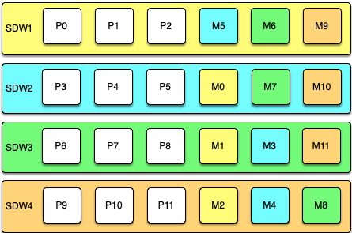

Greenplum Database supports highly available, fault-tolerant database services when you enable and properly configure Greenplum high availability features. To guarantee a required level of service, each component must have a standby ready to take its place if it should fail.

**Parent topic:**[Greenplum Database Best Practices](intro.html)

## <a id="topic_vrb_sxc_54"></a>Disk Storage 

With the Greenplum Database "shared-nothing" MPP architecture, the master host and segment hosts each have their own dedicated memory and disk storage, and each master or segment instance has its own independent data directory. For both reliability and high performance, VMware recommends a hardware RAID storage solution with from 8 to 24 disks. A larger number of disks improves I/O throughput when using RAID 5 \(or 6\) because striping increases parallel disk I/O. The RAID controller can continue to function with a failed disk because it saves parity data on each disk in a way that it can reconstruct the data on any failed member of the array. If a hot spare is configured \(or an operator replaces the failed disk with a new one\) the controller rebuilds the failed disk automatically.

RAID 1 exactly mirrors disks, so if a disk fails, a replacement is immediately available with performance equivalent to that before the failure. With RAID 5 each I/O for data on the failed array member must be reconstructed from data on the remaining active drives until the replacement disk is rebuilt, so there is a temporary performance degradation. If the Greenplum master and segments are mirrored, you can switch any affected Greenplum instances to their mirrors during the rebuild to maintain acceptable performance.

A RAID disk array can still be a single point of failure, for example, if the entire RAID volume fails. At the hardware level, you can protect against a disk array failure by mirroring the array, using either host operating system mirroring or RAID controller mirroring, if supported.

It is important to regularly monitor available disk space on each segment host. Query the `gp_disk_free` external table in the `gptoolkit` schema to view disk space available on the segments. This view runs the Linux `df` command. Be sure to check that there is sufficient disk space before performing operations that consume large amounts of disk, such as copying a large table.

See `gp_toolkit.gp_disk_free` in the *Greenplum Database Reference Guide*.

### <a id="bestpract"></a>Best Practices 

-   Use a hardware RAID storage solution with 8 to 24 disks.
-   Use RAID 1, 5, or 6 so that the disk array can tolerate a failed disk.
-   Configure a hot spare in the disk array to allow rebuild to begin automatically when disk failure is detected.
-   Protect against failure of the entire disk array and degradation during rebuilds by mirroring the RAID volume.
-   Monitor disk utilization regularly and add additional space when needed.
-   Monitor segment skew to ensure that data is distributed evenly and storage is consumed evenly at all segments.

## <a id="topic_b5s_txc_54"></a>Master Mirroring 

The Greenplum Database master instance is clients' single point of access to the system. The master instance stores the global system catalog, the set of system tables that store metadata about the database instance, but no user data. If an unmirrored master instance fails or becomes inaccessible, the Greenplum instance is effectively off-line, since the entry point to the system has been lost. For this reason, a standby master must be ready to take over if the primary master fails.

Master mirroring uses two processes, a sender on the active master host and a receiver on the mirror host, to synchronize the mirror with the master. As changes are applied to the master system catalogs, the active master streams its write-ahead log \(WAL\) to the mirror so that each transaction applied on the master is applied on the mirror.

The mirror is a *warm standby*. If the primary master fails, switching to the standby requires an administrative user to run the `gpactivatestandby` utility on the standby host so that it begins to accept client connections. Clients must reconnect to the new master and will lose any work that was not committed when the primary failed.

See "Enabling High Availability Features" in the *Greenplum Database Administrator Guide* for more information.

### <a id="bp2"></a>Best Practices 

-   Set up a standby master instance—a *mirror*—to take over if the primary master fails.
-   The standby can be on the same host or on a different host, but it is best practice to place it on a different host from the primary master to protect against host failure.
-   Plan how to switch clients to the new master instance when a failure occurs, for example, by updating the master address in DNS.
-   Set up monitoring to send notifications in a system monitoring application or by email when the primary fails.

## <a id="topic_cnm_vxc_54"></a>Segment Mirroring 

Greenplum Database segment instances each store and manage a portion of the database data, with coordination from the master instance. If any unmirrored segment fails, the database may have to be shutdown and recovered, and transactions occurring after the most recent backup could be lost. Mirroring segments is, therefore, an essential element of a high availability solution.

A segment mirror is a hot standby for a primary segment. Greenplum Database detects when a segment is unavailable and automatically activates the mirror. During normal operation, when the primary segment instance is active, data is replicated from the primary to the mirror in two ways:

-   The transaction commit log is replicated from the primary to the mirror before the transaction is committed. This ensures that if the mirror is activated, the changes made by the last successful transaction at the primary are present at the mirror. When the mirror is activated, transactions in the log are applied to tables in the mirror.

-   Second, segment mirroring uses physical file replication to update heap tables. Greenplum Server stores table data on disk as fixed-size blocks packed with tuples. To optimize disk I/O, blocks are cached in memory until the cache fills and some blocks must be evicted to make room for newly updated blocks. When a block is evicted from the cache it is written to disk and replicated over the network to the mirror. Because of the caching mechanism, table updates at the mirror can lag behind the primary. However, because the transaction log is also replicated, the mirror remains consistent with the primary. If the mirror is activated, the activation process updates the tables with any unapplied changes in the transaction commit log.


When the acting primary is unable to access its mirror, replication stops and state of the primary changes to "Change Tracking." The primary saves changes that have not been replicated to the mirror in a system table to be replicated to the mirror when it is back on-line.

The master automatically detects segment failures and activates the mirror. Transactions in progress at the time of failure are restarted using the new primary. Depending on how mirrors are deployed on the hosts, the database system may be unbalanced until the original primary segment is recovered. For example, if each segment host has four primary segments and four mirror segments, and a mirror is activated on one host, that host will have five active primary segments. Queries are not complete until the last segment has finished its work, so performance can be degraded until the balance is restored by recovering the original primary.

Administrators perform the recovery while Greenplum Database is up and running by running the `gprecoverseg` utility. This utility locates the failed segments, verifies they are valid, and compares the transactional state with the currently active segment to determine changes made while the segment was offline. `gprecoverseg` synchronizes the changed database files with the active segment and brings the segment back online.

It is important to reserve enough memory and CPU resources on segment hosts to allow for increased activity from mirrors that assume the primary role during a failure. The formulas provided in [Configuring Memory for Greenplum Database](workloads.html#section_r52_rbl_zt) for configuring segment host memory include a factor for the maximum number of primary hosts on any one segment during a failure. The arrangement of mirrors on the segment hosts affects this factor and how the system will respond during a failure. See [Segment Mirroring Configurations](#topic_ngz_qf4_tt) for a discussion of segment mirroring options.

### <a id="bp3"></a>Best Practices 

-   Set up mirrors for all segments.
-   Locate primary segments and their mirrors on different hosts to protect against host failure.
-   Mirrors can be on a separate set of hosts or co-located on hosts with primary segments.
-   Set up monitoring to send notifications in a system monitoring application or by email when a primary segment fails.
-   Recover failed segments promptly, using the `gprecoverseg` utility, to restore redundancy and return the system to optimal balance.

## <a id="topic_tlk_zw4_1s"></a>Dual Clusters 

For some use cases, an additional level of redundancy can be provided by maintaining two Greenplum Database clusters that store the same data. The decision to implement dual clusters should be made with business requirements in mind.

There are two recommended methods for keeping the data synchronized in a dual cluster configuration. The first method is called Dual ETL. ETL \(extract, transform, and load\) is the common data warehousing process of cleansing, transforming, validating, and loading data into a data warehouse. With Dual ETL, the ETL processes are performed twice, in parallel on each cluster, and validated each time. Dual ETL provides for a complete standby cluster with the same data. It also provides the capability to query the data on both clusters, doubling the processing throughput. The application can take advantage of both clusters as needed and also ensure that the ETL is successful and validated on both sides.

The second mechanism for maintaining dual clusters is backup and restore. The data is backed­up on the primary cluster, then the backup is replicated to and restored on the second cluster. The backup and restore mechanism has higher latency than Dual ETL, but requires less application logic to be developed. Backup and restore is ideal for use cases where data modifications and ETL are done daily or less frequently.

### <a id="bp4"></a>Best Practices 

-   Consider a Dual Cluster configuration to provide an additional level of redundancy and additional query processing throughput.

## <a id="topic_mc5_k1p_1s"></a>Backup and Restore 

Backups are recommended for Greenplum Database databases unless the data in the database can be easily and cleanly regenerated from source data. Backups protect from operational, software, or hardware errors.

The `gpbackup` utility makes backups in parallel across the segments, so that backups scale as the cluster grows in hardware size.

A backup strategy must consider where the backups will be written and where they will be stored. Backups can be taken to the local cluster disks, but they should not be stored there permanently. If the database and its backup are on the same storage, they can be lost simultaneously. The backup also occupies space that could be used for database storage or operations. After performing a local backup, the files should be copied to a safe, off-cluster location.

An alternative is to back up directly to an NFS mount. If each host in the cluster has an NFS mount, the backups can be written directly to NFS storage. A scale-out NFS solution is recommended to ensure that backups do not bottleneck on the IO throughput of the NFS device. Dell EMC Isilon is an example of this type of solution and can scale alongside the Greenplum cluster.

Finally, through native API integration, Greenplum Database can stream backups directly to the Dell EMC Data Domain enterprise backup platform.

### <a id="bp5"></a>Best Practices 

-   Back up Greenplum databases regularly unless the data is easily restored from sources.

-   Use the `gpbackup` command to specify only the schema and tables that you want backed up. See the [gpbackup](https://gpdb.docs.pivotal.io/latest/utility_guide/ref/gpbackup.html) reference for more information.

-   `gpbackup` places `SHARED ACCESS` locks on the set of tables to back up. Backups with fewer tables are more efficient for selectively restoring schemas and tables, since `gprestore` does not have to search through the entire database.

-   If backups are saved to local cluster storage, move the files to a safe, off-cluster location when the backup is complete. Backup files and database files that reside on the same storage can be lost simultaneously.
-   If backups are saved to NFS mounts, use a scale-out NFS solution such as Dell EMC Isilon to prevent IO bottlenecks.

-   Tanzuy Greenplum customers should consider streaming backups to the Dell EMC Data Domain enterprise backup platform.

## <a id="topic_wlw_wxc_54"></a>Detecting Failed Master and Segment Instances 

Recovering from system failures requires intervention from a system administrator, even when the system detects a failure and activates a standby for the failed component. In each case, the failed component must be replaced or recovered to restore full redundancy. Until the failed component is recovered, the active component lacks a standby, and the system may not be performing optimally. For these reasons, it is important to perform recovery operations promptly. Constant system monitoring ensures that administrators are aware of failures that demand their attention.

The Greenplum Database server `ftsprobe` subprocess handles fault detection. `ftsprobe` connects to and scans all segments and database processes at intervals that you can configure with the `gp_fts_probe_interval` configuration parameter. If `ftsprobe` cannot connect to a segment, it marks the segment “down” in the Greenplum Database system catalog. The segment remains down until an administrator runs the `gprecoverseg` recovery utility.

### <a id="bp6"></a>Best Practices 

-   Run the `gpstate` utility to see the overall state of the Greenplum system.

### <a id="add_info"></a>Additional Information 

*Greenplum Database Administrator Guide*:

-   [Monitoring a Greenplum System](../admin_guide/managing/monitor.html)
-   [Recovering from Segment Failures](../admin_guide/highavail/topics/g-recovering-from-segment-failures.html)

*Greenplum Database Utility Guide*:

-   [gpstate](../utility_guide/ref/gpstate.html) - view state of the Greenplum system
-   [gprecoverseg](../utility_guide/ref/gprecoverseg.html) - recover a failed segment
-   [gpactivatestandby](../utility_guide/ref/gpactivatestandby.html) - make the standby master the active master

[RDBMS MIB Specification](http://tools.ietf.org/html/rfc1697)

## <a id="topic_ngz_qf4_tt"></a>Segment Mirroring Configurations 

Segment mirroring allows database queries to fail over to a backup segment if the primary segment fails or becomes unavailable. Pivotal requires mirroring for supported production Greenplum Database systems.

A primary segment and its mirror must be on different hosts to ensure high availability. Each host in a Greenplum Database system has the same number of primary segments and mirror segments. Multi-homed hosts should have the same numbers of primary and mirror segments on each interface. This ensures that segment hosts and network resources are equally loaded when all primary segments are operational and brings the most resources to bear on query processing.

When a segment becomes unavailable, its mirror segment on another host becomes the active primary and processing continues. The additional load on the host creates skew and degrades performance, but should allow the system to continue. A database query is not complete until all segments return results, so a single host with an additional active primary segment has the same effect as adding an additional primary segment to every host in the cluster.

The least amount of performance degradation in a failover scenario occurs when no host has more than one mirror assuming the primary role. If multiple segments or hosts fail, the amount of degradation is determined by the host or hosts with the largest number of mirrors assuming the primary role. Spreading a host's mirrors across the remaining hosts minimizes degradation when any single host fails.

It is important, too, to consider the cluster's tolerance for multiple host failures and how to maintain a mirror configuration when expanding the cluster by adding hosts. There is no mirror configuration that is ideal for every situation.

You can allow Greenplum Database to arrange mirrors on the hosts in the cluster using one of two standard configurations, or you can design your own mirroring configuration.

The two standard mirroring arrangements are *group mirroring* and *spread mirroring*:

-   **Group mirroring** — Each host mirrors another host's primary segments. This is the default for [gpinitsystem](../utility_guide/ref/gpinitsystem.html) and [gpaddmirrors](../utility_guide/ref/gpaddmirrors.html).
-   **Spread mirroring** — Mirrors are spread across the available hosts. This requires that the number of hosts in the cluster is greater than the number of segments per host.

You can design a custom mirroring configuration and use the Greenplum `gpaddmirrors` or [gpmovemirrors](../utility_guide/ref/gpmovemirrors.html) utilities to set up the configuration.

*Block mirroring* is a custom mirror configuration that divides hosts in the cluster into equally sized blocks and distributes mirrors evenly to hosts within the block. If a primary segment fails, its mirror on another host within the same block becomes the active primary. If a segment host fails, mirror segments on each of the other hosts in the block become active.

The following sections compare the group, spread, and block mirroring configurations.

### <a id="groupmirr"></a>Group Mirroring 

Group mirroring is easiest to set up and is the default Greenplum mirroring configuration. It is least expensive to expand, since it can be done by adding as few as two hosts. There is no need to move mirrors after expansion to maintain a consistent mirror configuration.

The following diagram shows a group mirroring configuration with eight primary segments on four hosts.


Unless both the primary and mirror of the same segment instance fail, up to half of your hosts can fail and the cluster will continue to run as long as resources \(CPU, memory, and IO\) are sufficient to meet the needs.

Any host failure will degrade performance by half or more because the host with the mirrors will have twice the number of active primaries. If your resource utilization is normally greater than 50%, you will have to adjust your workload until the failed host is recovered or replaced. If you normally run at less than 50% resource utilization the cluster can continue to operate at a degraded level of performance until the failure is corrected.

### <a id="spreadmirr"></a>Spread Mirroring 

With spread mirroring, mirrors for each host's primary segments are spread across as many hosts as there are segments per host. Spread mirroring is easy to set up when the cluster is initialized, but requires that the cluster have at least one more host than there are segments per host.

The following diagram shows the spread mirroring configuration for a cluster with three primaries on four hosts.



Expanding a cluster with spread mirroring requires more planning and may take more time. You must either add a set of hosts equal to the number of primaries per host plus one, or you can add two nodes in a group mirroring configuration and, when the expansion is complete, move mirrors to recreate the spread mirror configuration.

Spread mirroring has the least performance impact for a single failed host because each host's mirrors are spread across the maximum number of hosts. Load is increased by 1/*Nth*, where *N* is the number of primaries per host. Spread mirroring is, however, the most likely configuration to have a catastrophic failure if two or more hosts fail simultaneously.

### <a id="blockmirr"></a>Block Mirroring 

With block mirroring, nodes are divided into blocks, for example a block of four or eight hosts, and the mirrors for segments on each host are placed on other hosts within the block. Depending on the number of hosts in the block and the number of primary segments per host, each host maintains more than one mirror for each other host's segments.

The following diagram shows a single block mirroring configuration for a block of four hosts, each with eight primary segments:


If there are eight hosts, an additional four-host block is added with the mirrors for primary segments 32 through 63 set up in the same pattern.

A cluster with block mirroring is easy to expand because each block is a self-contained primary mirror group. The cluster is expanded by adding one or more blocks. There is no need to move mirrors after expansion to maintain a consistent mirror setup. This configuration is able to survive multiple host failures as long as the failed hosts are in different blocks.

Because each host in a block has multiple mirror instances for each other host in the block, block mirroring has a higher performance impact for host failures than spread mirroring, but a lower impact than group mirroring. The expected performance impact varies by block size and primary segments per node. As with group mirroring, if the resources are available, performance will be negatively impacted but the cluster will remain available. If resources are insufficient to accommodate the added load you must reduce the workload until the failed node is replaced.

### <a id="implblock"></a>Implementing Block Mirroring 

Block mirroring is not one of the automatic options Greenplum Database offers when you set up or expand a cluster. To use it, you must create your own configuration.

For a new Greenplum system, you can initialize the cluster without mirrors, and then run `gpaddmirrors -i mirror\_config\_file` with a custom mirror configuration file to create the mirrors for each block. You must create the file system locations for the mirror segments before you run `gpaddmirrors`. See the `gpaddmirrors` reference page in the *Greenplum Database Management Utility Guide* for details.

If you expand a system that has block mirroring or you want to implement block mirroring at the same time you expand a cluster, it is recommended that you complete the expansion first, using the default grouping mirror configuration, and then use the `gpmovemirrors` utility to move mirrors into the block configuration.

To implement block mirroring with an existing system that has a different mirroring scheme, you must first determine the desired location for each mirror according to your block configuration, and then determine which of the existing mirrors must be relocated. Follow these steps:

1.  Run the following query to find the current locations of the primary and mirror segments:

    ```
    SELECT dbid, content, role, port, hostname, datadir FROM gp_segment_configuration WHERE content > -1 ;
    ```

    The `gp_segment_configuration` system catalog table contains the current segment configuration.

2.  Create a list with the current mirror location and the desired block mirroring location, then remove any mirrors from the list that are already on the correct host.
3.  Create an input file for the `gpmovemirrors` utility with an entry for each mirror that must be moved.

    The `gpmovemirrors` input file has the following format:

    ```
    old\_address|port|data\_dir new\_address|port|data\_dir
    ```

    Where old\_address is the host name or IP address of the segment host, port is the communication port, and `data_dir` is the segment instance data directory.

    The following example `gpmovemirrors` input file specifies three mirror segments to move.

    ```
    sdw2|50001|/data2/mirror/gpseg1 sdw3|50001|/data/mirror/gpseg1
    sdw2|50001|/data2/mirror/gpseg2 sdw4|50001|/data/mirror/gpseg2
    sdw3|50001|/data2/mirror/gpseg3 sdw1|50001|/data/mirror/gpseg3
    
    ```

4.  Run `gpmovemirrors` with a command like the following:

    ```
    gpmovemirrors -i mirror\_config\_file
    ```


The `gpmovemirrors` utility validates the input file, calls `gprecoverseg` to relocate each specified mirror, and removes the original mirror. It creates a backout configuration file which can be used as input to `gpmovemirrors` to undo the changes that were made. The backout file has the same name as the input file, with the suffix `_backout_timestamp` added.

See the *Greenplum Database Management Utility Reference* for complete information about the `gpmovemirrors` utility.

