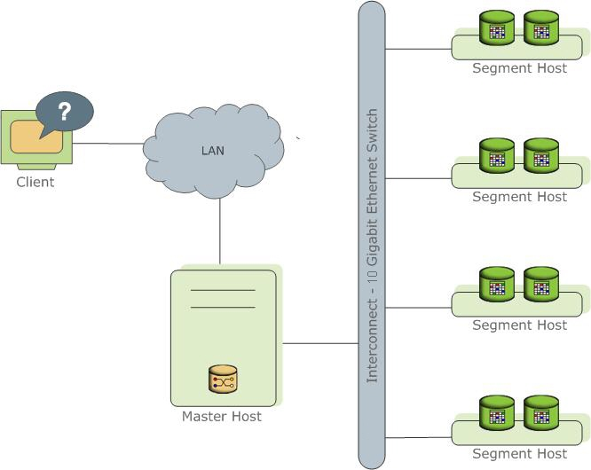
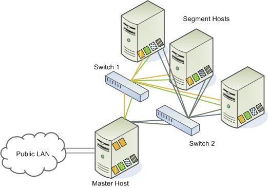

High-level overview of the Greenplum Database system architecture.

Greenplum Database stores and processes large amounts of data by distributing the load across several servers or *hosts*. A logical database in Greenplum is an *array* of individual PostgreSQL databases working together to present a single database image. The *master* is the entry point to the Greenplum Database system. It is the database instance to which users connect and submit SQL statements. The master coordinates the workload across the other database instances in the system, called *segments*, which handle data processing and storage. The segments communicate with each other and the master over the *interconnect*, the networking layer of Greenplum Database.

Greenplum Database is a software-only solution; the hardware and database software are not coupled. Greenplum Database runs on a variety of commodity server platforms from Greenplum-certified hardware vendors. Performance depends on the hardware on which it is installed. Because the database is distributed across multiple machines in a Greenplum Database system, proper selection and configuration of hardware is vital to achieving the best possible performance.

This chapter describes the major components of a Greenplum Database system and the hardware considerations and concepts associated with each component: [The Greenplum Coordinator](#topic2), [The Segments](#topic4) and [The Interconnect](#topic9). Additionally, a system may have optional [ETL Hosts for Data Loading](#topic13) and [Tanzu Greenplum Performance Monitoring](#topic_e5t_whm_kbb) for monitoring query workload and performance.

-   **[The Greenplum Coordinator](preinstall_concepts.html)**  

-   **[The Segments](preinstall_concepts.html)**  

-   **[The Interconnect](preinstall_concepts.html)**  

-   **[ETL Hosts for Data Loading](preinstall_concepts.html)**  

-   **[Tanzu Greenplum Performance Monitoring](preinstall_concepts.html)**  

**Parent topic:**[Installing and Upgrading Greenplum](install_guide.html)

## The Greenplum Coordinator 

The *master* is the entry point to the Greenplum Database system. It is the database server process that accepts client connections and processes the SQL commands that system users issue. Users connect to Greenplum Database through the master using a PostgreSQL-compatible client program such as `psql` or ODBC.

The master maintains the *system catalog* \(a set of system tables that contain metadata about the Greenplum Database system itself\), however the master does not contain any user data. Data resides only on the *segments*. The master authenticates client connections, processes incoming SQL commands, distributes the work load between segments, coordinates the results returned by each segment, and presents the final results to the client program.

Because the master does not contain any user data, it has very little disk load. The master needs a fast, dedicated CPU for data loading, connection handling, and query planning because extra space is often necessary for landing load files and backup files, especially in production environments. Customers may decide to also run ETL and reporting tools on the master, which requires more disk space and processing power.

**Parent topic:**[Introduction to Greenplum](preinstall_concepts.html)

### Coordinator Redundancy 

You may optionally deploy a *backup* or *mirror* of the master instance. A backup master host serves as a *warm standby* if the primary master host becomes nonoperational. You can deploy the standby master on a designated redundant master host or on one of the segment hosts.

The standby master is kept up to date by a transaction log replication process, which runs on the standby master host and synchronizes the data between the primary and standby master hosts. If the primary master fails, the log replication process shuts down, and an administrator can activate the standby master in its place. When the standby master is active, the replicated logs are used to reconstruct the state of the master host at the time of the last successfully committed transaction.

Since the master does not contain any user data, only the system catalog tables need to be synchronized between the primary and backup copies. When these tables are updated, changes automatically copy over to the standby master so it is always synchronized with the primary.

## The Segments 

In Greenplum Database, the *segments* are where data is stored and where most query processing occurs. User-defined tables and their indexes are distributed across the available segments in the Greenplum Database system; each segment contains a distinct portion of the data. Segment instances are the database server processes that serve segments. Users do not interact directly with the segments in a Greenplum Database system, but do so through the master.

In the reference Greenplum Database hardware configurations, the number of segment instances per segment host is determined by the number of effective CPUs or CPU core. For example, if your segment hosts have two dual-core processors, you may have two or four primary segments per host. If your segment hosts have three quad-core processors, you may have three, six or twelve segments per host. Performance testing will help decide the best number of segments for a chosen hardware platform.

**Parent topic:**[Introduction to Greenplum](preinstall_concepts.html)

### Segment Redundancy 

When you deploy your Greenplum Database system, you have the option to configure *mirror* segments. Mirror segments allow database queries to fail over to a backup segment if the primary segment becomes unavailable. Mirroring is a requirement for VMware-supported production Greenplum systems.

A mirror segment must always reside on a different host than its primary segment. Mirror segments can be arranged across the hosts in the system in one of two standard configurations, or in a custom configuration you design. The default configuration, called *group* mirroring, places the mirror segments for all primary segments on one other host. Another option, called *spread* mirroring, spreads mirrors for each host's primary segments over the remaining hosts. Spread mirroring requires that there be more hosts in the system than there are primary segments on the host. On hosts with multiple network interfaces, the primary and mirror segments are distributed equally among the interfaces. [Figure 2](#jg163134) shows how table data is distributed across the segments when the default group mirroring option is configured.

#### Segment Failover and Recovery 

When mirroring is enabled in a Greenplum Database system, the system automatically fails over to the mirror copy if a primary copy becomes unavailable. A Greenplum Database system can remain operational if a segment instance or host goes down only if all portions of data are available on the remaining active segments.

If the master cannot connect to a segment instance, it marks that segment instance as *invalid* in the Greenplum Database system catalog. The segment instance remains invalid and out of operation until an administrator brings that segment back online. An administrator can recover a failed segment while the system is up and running. The recovery process copies over only the changes that were missed while the segment was nonoperational.

If you do not have mirroring enabled and a segment becomes invalid, the system automatically shuts down. An administrator must recover all failed segments before operations can continue.

### Example Segment Host Hardware Stack 

Regardless of the hardware platform you choose, a production Greenplum Database processing node \(a segment host\) is typically configured as described in this section.

The segment hosts do the majority of database processing, so the segment host servers are configured in order to achieve the best performance possible from your Greenplum Database system. Greenplum Database's performance will be as fast as the slowest segment server in the array. Therefore, it is important to ensure that the underlying hardware and operating systems that are running Greenplum Database are all running at their optimal performance level. It is also advised that all segment hosts in a Greenplum Database array have identical hardware resources and configurations.

Segment hosts should also be dedicated to Greenplum Database operations only. To get the best query performance, you do not want Greenplum Database competing with other applications for machine or network resources.

The following diagram shows an example Greenplum Database segment host hardware stack. The number of effective CPUs on a host is the basis for determining how many primary Greenplum Database segment instances to deploy per segment host. This example shows a host with two effective CPUs \(one dual-core CPU\). Note that there is one primary segment instance \(or primary/mirror pair if using mirroring\) per CPU core.

### Example Segment Disk Layout 

Each CPU is typically mapped to a logical disk. A logical disk consists of one primary file system \(and optionally a mirror file system\) accessing a pool of physical disks through an I/O channel or disk controller. The logical disk and file system are provided by the operating system. Most operating systems provide the ability for a logical disk drive to use groups of physical disks arranged in RAID arrays.

Depending on the hardware platform you choose, different RAID configurations offer different performance and capacity levels. Greenplum supports and certifies a number of reference hardware platforms and operating systems. Check with your sales account representative for the recommended configuration on your chosen platform.

## The Interconnect 

The *interconnect* is the networking layer of Greenplum Database. When a user connects to a database and issues a query, processes are created on each of the segments to handle the work of that query. The *interconnect* refers to the inter-process communication between the segments, as well as the network infrastructure on which this communication relies. The interconnect uses a standard 10 Gigabit Ethernet switching fabric.

By default, Greenplum Database interconnect uses UDP \(User Datagram Protocol\) with flow control for interconnect traffic to send messages over the network. The Greenplum software does the additional packet verification and checking not performed by UDP, so the reliability is equivalent to TCP \(Transmission Control Protocol\), and the performance and scalability exceeds that of TCP. For information about the types of interconnect supported by Greenplum Database, see server configuration parameter `gp_interconnect_type` in the *Greenplum Database Reference Guide*.

**Parent topic:**[Introduction to Greenplum](preinstall_concepts.html)

### Interconnect Redundancy 

A highly available interconnect can be achieved by deploying dual 10 Gigabit Ethernet switches on your network, and redundant 10 Gigabit connections to the Greenplum Database master and segment host servers.

### Network Interface Configuration 

A segment host typically has multiple network interfaces designated to Greenplum interconnect traffic. The master host typically has additional external network interfaces in addition to the interfaces used for interconnect traffic.

Depending on the number of interfaces available, you will want to distribute interconnect network traffic across the number of available interfaces. This is done by assigning segment instances to a particular network interface and ensuring that the primary segments are evenly balanced over the number of available interfaces.

This is done by creating separate host address names for each network interface. For example, if a host has four network interfaces, then it would have four corresponding host addresses, each of which maps to one or more primary segment instances. The `/etc/hosts` file should be configured to contain not only the host name of each machine, but also all interface host addresses for all of the Greenplum Database hosts \(master, standby master, segments, and ETL hosts\).

With this configuration, the operating system automatically selects the best path to the destination. Greenplum Database automatically balances the network destinations to maximize parallelism.

### Switch Configuration 

When using multiple 10 Gigabit Ethernet switches within your Greenplum Database array, evenly divide the number of subnets between each switch. In this example configuration, if we had two switches, NICs 1 and 2 on each host would use switch 1 and NICs 3 and 4 on each host would use switch 2. For the master host, the host name bound to NIC 1 \(and therefore using switch 1\) is the effective master host name for the array. Therefore, if deploying a warm standby master for redundancy purposes, the standby master should map to a NIC that uses a different switch than the primary master.

## ETL Hosts for Data Loading 

Greenplum supports fast, parallel data loading with its external tables feature. By using external tables in conjunction with Greenplum Database's parallel file server \(`gpfdist`\), administrators can achieve maximum parallelism and load bandwidth from their Greenplum Database system. Many production systems deploy designated ETL servers for data loading purposes. These machines run the Greenplum parallel file server \(`gpfdist`\), but not Greenplum Database instances.

One advantage of using the `gpfdist` file server program is that it ensures that all of the segments in your Greenplum Database system are fully utilized when reading from external table data files.

The `gpfdist` program can serve data to the segment instances at an average rate of about 350 MB/s for delimited text formatted files and 200 MB/s for CSV formatted files. Therefore, you should consider the following options when running `gpfdist` in order to maximize the network bandwidth of your ETL systems:

-   If your ETL machine is configured with multiple network interface cards \(NICs\) as described in [Network Interface Configuration](#topic11), run one instance of `gpfdist` on your ETL host and then define your external table definition so that the host name of each NIC is declared in the `LOCATION` clause \(see `CREATE EXTERNAL TABLE` in the *Greenplum Database Reference Guide*\). This allows network traffic between your Greenplum segment hosts and your ETL host to use all NICs simultaneously.

-   Run multiple `gpfdist` instances on your ETL host and divide your external data files equally between each instance. For example, if you have an ETL system with two network interface cards \(NICs\), then you could run two `gpfdist` instances on that machine to maximize your load performance. You would then divide the external table data files evenly between the two `gpfdist` programs.

**Parent topic:**[Introduction to Greenplum](preinstall_concepts.html)

## Tanzu Greenplum Performance Monitoring 

Tanzu Greenplum Greenplum Command Center is an optional web-based performance monitoring and management tool for Greenplum Database. Administrators can install Command Center separately from Greenplum Database.

**Parent topic:**[Introduction to Greenplum](preinstall_concepts.html)

